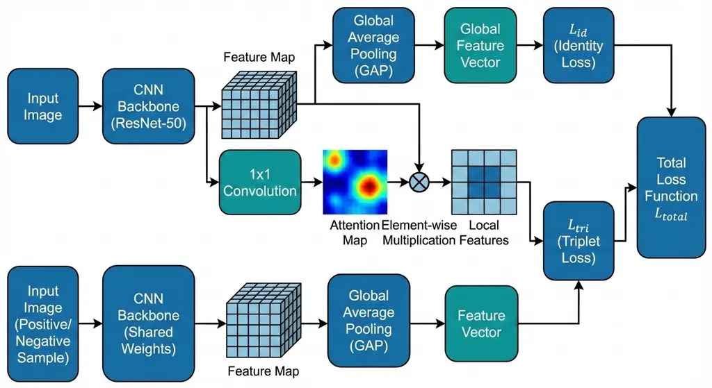
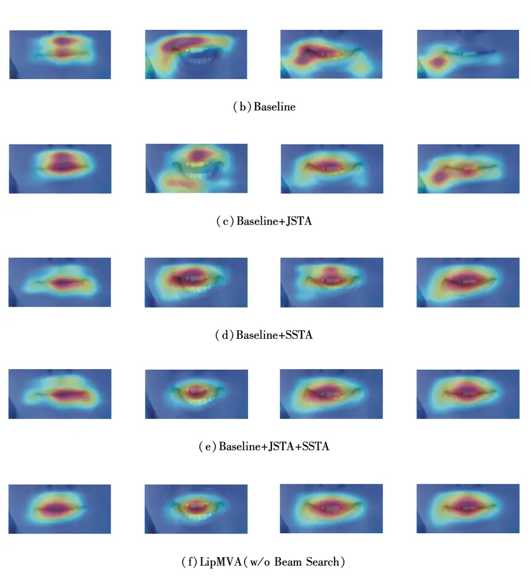
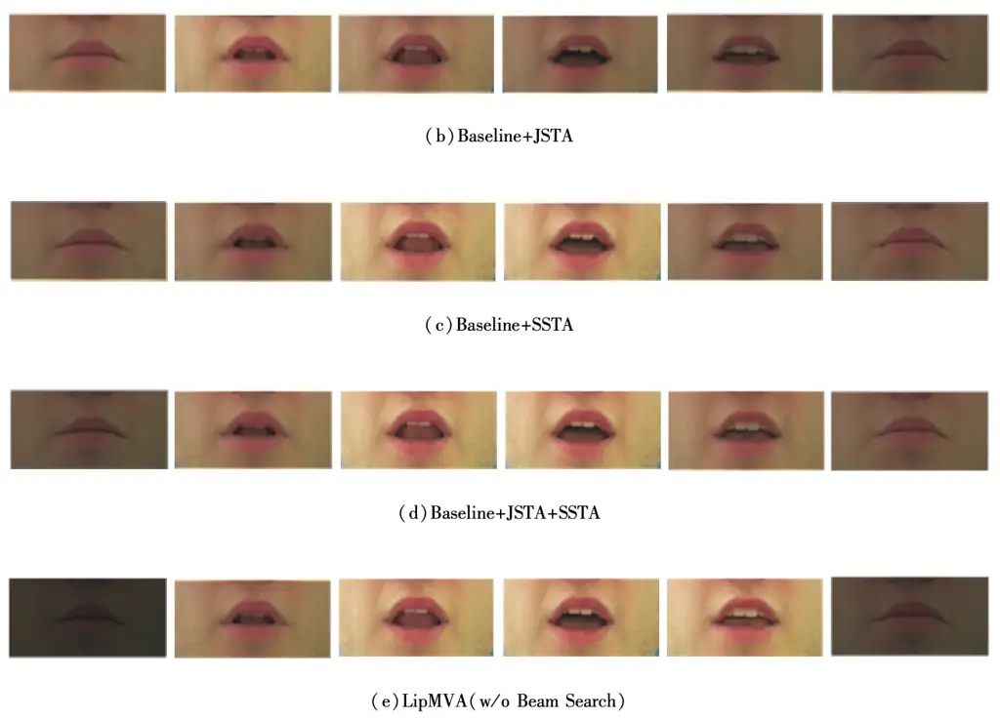

# MA-LipNet: Multi-Dimensional Attention Networks for Robust Lipreading

Matteo Rossi Affiliation: Maharaja Agrasen University
Email: <matteo.rossi@mau.edu.mk>

###### Abstract

Lipreading, the technology of decoding spoken content from silent videos
of lip movements, holds significant application value in fields such as
public security. However, due to the subtle nature of articulatory
gestures, existing lipreading methods often suffer from limited feature
discriminability and poor generalization capabilities. To address these
challenges, this paper delves into the purification of visual features
from temporal, spatial, and channel dimensions. We propose a novel
method named Multi-Attention Lipreading Network(MA-LipNet). The core of
MA-LipNet lies in its sequential application of three dedicated
attention modules. Firstly, a Channel Attention (CA) module is employed
to adaptively recalibrate channel-wise features, thereby mitigating
interference from less informative channels. Subsequently, two
spatio-temporal attention modules with distinct granularities—Joint
Spatial-Temporal Attention (JSTA) and Separate Spatial-Temporal
Attention (SSTA)—are leveraged to suppress the influence of irrelevant
pixels and video frames. The JSTA module performs a coarse-grained
filtering by computing a unified weight map across the spatio-temporal
dimensions, while the SSTA module conducts a more fine-grained
refinement by separately modeling temporal and spatial attentions.
Extensive experiments conducted on the CMLR and GRID datasets
demonstrate that MA-LipNet significantly reduces the Character Error
Rate (CER) and Word Error Rate (WER), validating its effectiveness and
superiority over several state-of-the-art methods. Our work highlights
the importance of multi-dimensional feature refinement for robust visual
speech recognition.

Keywords: Lipreading, Visual Speech Recognition, Attention Mechanism,
Deep Neural Network, Feature Extraction

## 1 Introduction

Lipreading, also known as Visual Speech Recognition (VSR), aims to
transcribe speech into text by analyzing the visual dynamics of a
speaker’s lip movements in a silent video. This technology becomes
particularly crucial in scenarios where audio is unavailable, corrupted,
or privacy-sensitive, such as in surveillance, assisted hearing
technologies, and human-computer interaction. Sentence-level lipreading,
which translates a sequence of video frames into a sequence of words, is
especially challenging due to the co-articulation effects and the high
similarity between different visemes (visual counterparts of phonemes).

Existing deep learning-based lipreading approaches typically consist of
a visual front-end for feature extraction and a text back-end for
sequence decoding. While Convolutional Neural Networks (CNNs) and
Recurrent Neural Networks (RNNs) or Transformers have become standard
building blocks, a critical issue persists: the raw visual features
extracted by the front-end often contain substantial redundant or
irrelevant information. This noise can severely degrade the performance
of the subsequent decoder. The redundancy manifests itself in three
primary dimensions:

- •
  Spatial Dimension: Even with cropped lip regions, not all pixels
  within a frame are equally informative for lipreading. Background
  clutter and non-lip facial features can introduce noise.
- •
  Temporal Dimension: In a video sequence, frames where the speaker is
  not articulating (e.g., at the beginning or end) contribute little to
  the recognition task and can mislead the model.
- •
  Channel Dimension: In CNN-based feature maps, different channels
  capture various patterns. Some channels may encode salient lip-related
  features, while others might respond to irrelevant textures, leading
  to blurred feature representations.

Although attention mechanisms have been explored in lipreading, often
within the decoder for feature-sequence alignment, their application
within the visual front-end for multi-dimensional feature purification
remains underexplored. To bridge this gap, we propose MA-LipNet, a novel
network that integrates multiple attention modules directly into the
visual encoding stage. Our key contributions are summarized as follows:

- •
  We design a dedicated Channel Attention (CA) module to enhance
  informative feature channels and suppress less useful ones.
- •
  We introduce two novel spatio-temporal attention modules: a
  coarse-grained Joint Spatial-Temporal Attention (JSTA) and a
  fine-grained Separate Spatial-Temporal Attention (SSTA), which work in
  tandem to filter spatio-temporal noise effectively.
- •
  We conduct comprehensive experiments on two benchmark datasets, CMLR
  and GRID. The results show that MA-LipNet achieves state-of-the-art
  performance, significantly reducing error rates compared to existing
  methods. Ablation studies and visualizations further confirm the
  contribution of each component.

## 2 Related Works

### 2.1 Sentence-Level Lipreading

Early lipreading methods often focused on isolated word recognition,
treated as a classification task. Recent advances have shifted towards
end-to-end sentence-level lipreading, which is more practical but also
more challenging. Pioneering work like LipNet \[1\] utilized a 3D-CNN
for spatio-temporal feature extraction combined with a Connectionist
Temporal Classification (CTC) loss for sequence prediction. While
effective on constrained datasets like GRID, it struggled with more
complex, real-world data like CMLR. Subsequent research has explored
sequence-to-sequence (Seq2Seq) architectures with attention
mechanisms \[2\], which dynamically align visual features with output
tokens, often yielding better performance. For the Chinese language,
methods like CSSMCM \[3\] and LipCH-Net \[4\] incorporated linguistic
features (e.g., pinyin) into the decoding process, though this limits
their cross-lingual applicability. Recent trends also include leveraging
knowledge distillation from audio models \[5\] and employing contrastive
learning to disambiguate similar visemes \[6\].

### 2.2 Attention Mechanisms in Computer Vision

The success of attention mechanisms in natural language processing
inspired their adoption in computer vision. The Squeeze-and-Excitation
(SE) network \[7\] introduced channel attention to recalibrate
channel-wise feature responses. The Convolutional Block Attention Module
(CBAM) \[8\] extended this idea by sequentially applying channel and
spatial attention. While these modules have proven effective for image
tasks, their adaptation for video-based tasks like lipreading requires
careful consideration of the temporal dimension. Some video recognition
methods have attempted to model spatio-temporal attention jointly or
separately \[9, 10\]. MA-LipNet draws inspiration from these works but
tailors the attention modules specifically for the nuances of
lipreading, proposing a unique combination of CA, JSTA, and SSTA for
comprehensive feature purification.

## 3 The MA-LipNet Method

The overall architecture of MA-LipNet is illustrated in Figure 1. It
comprises three main parts: a 3D-CNN visual front-end, the proposed
multiple visual attention modules, and a Seq2Seq decoder with
encoder-decoder attention.



Figure 1: Overall architecture of the proposed MA-LipNet model. The
input video is first processed by a 3D-CNN backbone. The resulting
features are then progressively refined by the Channel Attention (CA),
Joint Spatial-Temporal Attention (JSTA), and Separate Spatial-Temporal
Attention (SSTA) modules. The purified features are finally decoded into
text by a Seq2Seq model with attention.

### 3.1 Visual Front-end

The visual front-end is a three-layer 3D-CNN identical to that used in
LipNet. Each convolutional layer is followed by a max-pooling layer and
batch normalization. Given an input video clip of size
$`B\times C_{in}\times T\times H\times W`$ (where $`B`$ is the batch
size, $`C_{in}=3`$ is the number of input channels, $`T`$ is the number
of frames, $`H`$ and $`W`$ are the frame height and width), the
front-end produces a feature map
$`X\in\mathbb{R}^{B\times C\times T^{\prime}\times H^{\prime}\times W^{\prime}}`$.

### 3.2 Multiple Visual Attention Modules

The feature map $`X`$ is then passed through the three attention modules
sequentially.

#### 3.2.1 Channel Attention (CA) Module

The CA module, inspired by \[11\], aims to emphasize informative feature
channels. It operates by squeezing global spatio-temporal information
into a channel descriptor. For the input feature $`X`$, we generate two
descriptors using 3D max-pooling and average-pooling along the spatial
and temporal dimensions:

```math
\displaystyle F_{\text{max}} \displaystyle=\max_{i,j,k}X[:,:,i,j,k]\in\mathbb{R}^{B\times C\times 1\times 1\times 1},
```

```math
\displaystyle F_{\text{avg}} \displaystyle=\frac{1}{T^{\prime}H^{\prime}W^{\prime}}\sum_{i=1}^{T^{\prime}}\sum_{j=1}^{H^{\prime}}\sum_{k=1}^{W^{\prime}}X[:,:,i,j,k]\in\mathbb{R}^{B\times C\times 1\times 1\times 1}.
```

These descriptors are then processed by a shared multi-layer perceptron
(MLP) implemented with two 3D convolutions of kernel size
$`1\times 1\times 1`$. The first convolution reduces the channel
dimension by a ratio $`r`$ (set to 16), and the second restores it to
$`C`$. The outputs are summed and passed through a sigmoid activation
function to generate the channel attention weights
$`A_{C}\in\mathbb{R}^{B\times C\times 1\times 1\times 1}`$. The final
output is an element-wise multiplication:

```math
Y_{CA}=A_{C}\otimes X. \tag{1}
```

#### 3.2.2 Joint Spatial-Temporal Attention (JSTA) Module

The JSTA module performs a coarse-grained filtering by calculating a
unified attention map over the combined spatio-temporal dimensions. To
achieve this, we squeeze the channel dimension by applying max-pooling
and average-pooling along the channel axis:

```math
\displaystyle F_{\text{max}} \displaystyle=\max_{c}X[:,c,:,:,:]\in\mathbb{R}^{B\times 1\times T^{\prime}\times H^{\prime}\times W^{\prime}},
```

```math
\displaystyle F_{\text{avg}} \displaystyle=\frac{1}{C}\sum_{c=1}^{C}X[:,c,:,:,:]\in\mathbb{R}^{B\times 1\times T^{\prime}\times H^{\prime}\times W^{\prime}}.
```

The two resulting descriptors are concatenated along the channel
dimension, forming a 2-channel tensor. A single 3D convolution with a
$`1\times 1\times 1`$ kernel is applied to fuse these descriptors and
produce a single-channel spatio-temporal attention map
$`A_{J}\in\mathbb{R}^{B\times 1\times T^{\prime}\times H^{\prime}\times W^{\prime}}`$
after sigmoid activation. The output is computed as:

```math
Y_{JSTA}=A_{J}\otimes Y_{CA}. \tag{2}
```

#### 3.2.3 Separate Spatial-Temporal Attention (SSTA) Module

The SSTA module provides a more fine-grained refinement by decomposing
the spatio-temporal attention into separate temporal and spatial
branches. This allows for independent modeling of attention across time
and space. As shown in Figure 1, the module consists of two parallel
branches, each containing $`N`$ sub-branches (e.g., $`N=3`$).

Given the input $`X_{in}=Y_{JSTA}`$, we first transform it for each
branch:

- •
  Spatial Branch:
  $`X_{S}=\text{reshape}(X_{in})\in\mathbb{R}^{(B\cdot T^{\prime})\times C\times H^{\prime}\times W^{\prime}}`$.
  Each of the $`N`$ sub-branches applies a 2D CNN (with a $`3\times 3`$
  kernel) followed by a sigmoid to generate a spatial attention map
  $`A_{S}^{i}\in\mathbb{R}^{(B\cdot T^{\prime})\times 1\times H^{\prime}\times W^{\prime}}`$
  for $`i=1,...,N`$.
- •
  Temporal Branch:
  $`X_{T}=\text{reshape}(X_{in})\in\mathbb{R}^{B\times(C\cdot H^{\prime}\cdot W^{\prime})\times T^{\prime}}`$.
  Each of the $`N`$ sub-branches applies a 1D CNN (with kernel size 3)
  followed by a sigmoid to generate a temporal attention map
  $`A_{T}^{i}\in\mathbb{R}^{B\times 1\times T^{\prime}}`$ for
  $`i=1,...,N`$.

The attended features for each sub-branch are computed as:

```math
\displaystyle Y_{S}^{i} \displaystyle=A_{S}^{i}\otimes X_{S},
```

```math
\displaystyle Y_{T}^{i} \displaystyle=A_{T}^{i}\otimes X_{T}.
```

All attended features are then reshaped to a common dimension
$`B\times T^{\prime}\times(C\cdot H^{\prime}\cdot W^{\prime})`$, denoted
as $`Z_{S}^{i}`$ and $`Z_{T}^{i}`$. The outputs from corresponding
sub-branches are combined, L2-normalized, and summed to produce the
final output:

```math
Y_{SSTA}=\sum_{i=1}^{N}\left(\frac{Z_{S}^{i}+Z_{T}^{i}}{\|Z_{S}^{i}+Z_{T}^{i}\|_{2}}\right). \tag{3}
```

This multi-branch design allows SSTA to capture diverse spatio-temporal
contexts, leading to more robust feature refinement.

### 3.3 Seq2Seq Decoder with Attention

The refined feature sequence $`Y_{SSTA}`$ is flattened along the spatial
and channel dimensions and fed into a two-layer bidirectional GRU
encoder to model long-term temporal dependencies. The hidden states
$`\{h_{1}^{e},h_{2}^{e},...,h_{T^{\prime\prime}}^{e}\}`$ from the
encoder are used by an attention-based decoder. The decoder is a
two-layer unidirectional GRU. At each time step $`i`$, the decoder state
$`h_{i}^{d}`$ is computed based on the previous state and the embedded
previous token. An encoder-decoder attention mechanism (Additive
Attention) is used to compute a context vector $`ctx_{i}`$ as a weighted
sum of the encoder hidden states. The probability distribution over the
vocabulary is then:

```math
P(y_{i}|y_{<i},X)=\text{softmax}(\mathbf{W}_{o}[ctx_{i};h_{i}^{d}]+b_{o}). \tag{4}
```

The model is trained to minimize the negative log-likelihood:

```math
\mathcal{L}=-\sum_{i=1}^{L}\log P(y_{i}|X,y_{1},...,y_{i-1}). \tag{5}
```

## 4 Experiments and Results

### 4.1 Datasets and Evaluation Metrics

We evaluate MA-LipNet on two public sentence-level lipreading datasets:

- •
  CMLR \[12\]: A large-scale Chinese Mandarin Lip Reading dataset
  containing 102,072 videos from 11 speakers. The evaluation metric is
  Character Error Rate (CER).
- •
  GRID \[13\]: An English corpus with 32,823 videos from 34 speakers.
  The evaluation metric is Word Error Rate (WER).

Both CER and WER are calculated as: $`\text{Error Rate}=(S+D+I)/N`$,
where $`S`$, $`D`$, $`I`$ represent the number of substitutions,
deletions, and insertions, and $`N`$ is the length of the ground-truth
sequence.

### 4.2 Implementation Details

Each video frame is preprocessed by detecting facial landmarks using
Dlib, cropping a $`80\times 160`$ region around the mouth, and resizing
it to $`64\times 128`$. The model is trained on a single NVIDIA RTX 3070
GPU using the Adam optimizer. Scheduled sampling and beam search (with
width $`K=6`$) are applied during training and inference, respectively.
Key hyperparameters are listed in Table 1.

|                       |        |        |
| --------------------- | ------ | ------ |
| Hyperparameter        | CMLR   | GRID   |
| Epochs                | 60     | 30     |
| Batch Size            | 8      | 16     |
| Initial Learning Rate | 0.0002 | 0.0003 |
| $`N`$ in SSTA         | 3      | 4      |
| Beam Width $`K`$      | 6      | 6      |

Table 1: Key Hyperparameters for MA-LipNet.

### 4.3 Comparison with State-of-the-Art

Table 2 compares MA-LipNet with existing methods on the CMLR and GRID
test sets. MA-LipNet achieves a CER of 21.49% on CMLR and a WER of 1.09%
on GRID, setting new state-of-the-art results on both datasets. This
demonstrates the effectiveness of our multi-dimensional attention
approach in learning more discriminative and robust visual features for
lipreading.

| Model            | CMLR (CER $`\downarrow`$) | GRID (WER $`\downarrow`$) |
| ---------------- | ------------------------- | ------------------------- |
| LipNet \[14\]    | \-                        | 4.80                      |
| WLAS \[13\]      | 38.93                     | 3.00                      |
| LipCH-Net \[15\] | 34.07                     | \-                        |
| CSSMCM \[16\]    | 32.48                     | \-                        |
| LIBS \[17\]      | 31.27                     | \-                        |
| LCANet \[18\]    | \-                        | 2.90                      |
| DualLip \[19\]   | \-                        | 2.71                      |
| CALLip \[20\]    | 31.18                     | 2.48                      |
| LCSNet \[21\]    | 30.03                     | 2.30                      |
| LipFormer \[22\] | 27.79                     | 1.45                      |
| MA-LipNet (Ours) | 21.49                     | 1.09                      |

Table 2: Performance comparison (Error Rate %) on CMLR and GRID
datasets.

### 4.4 Ablation Studies

To validate the contribution of each component, we conduct ablation
studies. The baseline is the model without any attention modules. As
shown in Table 3, adding any of the three attention modules (CA, JSTA,
SSTA) improves performance, with SSTA providing the most significant
gain. Combining all three modules (MA-LipNet w/o Beam Search) yields the
best result, indicating their complementary nature. Applying beam search
further reduces the error rate.

|                             |                           |                           |
| --------------------------- | ------------------------- | ------------------------- |
| Model Variant               | CMLR (CER $`\downarrow`$) | GRID (WER $`\downarrow`$) |
| Baseline (No Attention)     | 31.51                     | 2.69                      |
| \+ CA                       | 28.57                     | 2.14                      |
| \+ JSTA                     | 28.77                     | 2.16                      |
| \+ SSTA                     | 26.12                     | 1.81                      |
| \+ CA + JSTA                | 28.28                     | 1.93                      |
| \+ CA + SSTA                | 25.44                     | 1.79                      |
| \+ JSTA + SSTA              | 25.43                     | 1.74                      |
| MA-LipNet (w/o Beam Search) | 24.90                     | 1.56                      |
| MA-LipNet (Full Model)      | 21.49                     | 1.09                      |

Table 3: Ablation study on the CMLR and GRID datasets (Error Rate %).

### 4.5 Visualization

To intuitively understand the effect of the attention modules, we
visualize the saliency maps \[23\] and temporal attention weights.



Figure 2: Comparison of saliency maps. From top to bottom: Baseline,
Baseline+JSTA, Baseline+SSTA, MA-LipNet. MA-LipNet’s attention is more
precisely focused on the lip region compared to other variants.

Figure 2 shows that the baseline model’s attention is diffuse. Adding
JSTA or SSTA helps concentrate the attention on the lip area, with SSTA
providing a sharper focus. The full MA-LipNet model demonstrates the
most precise localization of lip pixels, effectively suppressing
background noise.



Figure 3: Comparison of temporal attention weights across frames. The
darker shading indicates lower weight. MA-LipNet more effectively
suppresses non-speech frames (e.g., at the beginning and end) compared
to models with only JSTA or SSTA.

Figure 3 visualizes the temporal attention weights. MA-LipNet
successfully assigns lower weights to non-speech frames, demonstrating
its ability to identify and focus on linguistically relevant segments of
the video.

## 5 Conclusion

In this paper, we presented MA-LipNet, a novel lipreading framework that
addresses feature redundancy through multi-dimensional visual attention.
By sequentially applying Channel Attention (CA), Joint Spatial-Temporal
Attention (JSTA), and Separate Spatial-Temporal Attention (SSTA),
MA-LipNet effectively purifies visual features from channel, spatial,
and temporal dimensions. Extensive experiments on CMLR and GRID datasets
demonstrate that our method achieves new state-of-the-art performance,
significantly reducing recognition error rates. Ablation studies and
visualizations confirm the necessity and complementarity of each
proposed module.

For future work, we plan to investigate more challenging scenarios, such
as speaker-independent lipreading, where the speakers in the test set
are unseen during training. This would further enhance the model’s
generalization capability and practical application value.

## References

- \[1\] P. Lewis, E. Perez, A. Piktus, F. Petroni, V. Karpukhin, N.
  Goyal, H. Küttler, M. Lewis, W. Yih, T. Rocktäschel, et al. (2020)
  Retrieval-augmented generation for knowledge-intensive nlp tasks.
  Advances in Neural Information Processing Systems 33, pp. 9459–9474.
  Cited by: §2.1.
- \[2\] T. Li, G. Zhang, Q. D. Do, X. Yue, and W. Chen (2024)
  Long-context llms struggle with long in-context learning. External
  Links: 2404.02060, [Link](https://arxiv.org/abs/2404.02060) Cited by:
  §2.1.
- \[3\] W. Zhang, G. Zhai, Y. Wei, X. Yang, and K. Ma (2023) Blind image
  quality assessment via vision-language correspondence: a multitask
  learning perspective. pp. 14071–14081. Cited by: §2.1.
- \[4\] Z. Zhao, J. Tang, B. Wu, C. Lin, S. Wei, H. Liu, X. Tan, Z.
  Zhang, C. Huang, and Y. Xie (2024) Harmonizing visual text
  comprehension and generation. arXiv preprint arXiv:2407.16364. Cited
  by: §2.1.
- \[5\] Z. Zhao, J. Tang, C. Lin, B. Wu, C. Huang, H. Liu, X. Tan, Z.
  Zhang, and Y. Xie (2024) Multi-modal in-context learning makes an
  ego-evolving scene text recognizer. In Proceedings of the IEEE/CVF
  Conference on Computer Vision and Pattern Recognition,
  pp. 15567–15576. Cited by: §2.1.
- \[6\] W. Zhao, H. Feng, Q. Liu, J. Tang, B. Wu, L. Liao, S. Wei, Y.
  Ye, H. Liu, W. Zhou, et al. (2025) Tabpedia: towards comprehensive
  visual table understanding with concept synergy. Advances in Neural
  Information Processing Systems 37, pp. 7185–7212. Cited by: §2.1.
- \[7\] B. Shan, X. Fei, W. Shi, A. Wang, G. Tang, L. Liao, J. Tang, X.
  Bai, and C. Huang (2024) Mctbench: multimodal cognition towards
  text-rich visual scenes benchmark. arXiv preprint arXiv:2410.11538.
  Cited by: §2.2.
- \[8\] L. Wang, N. Yang, X. Huang, L. Yang, R. Majumder, and F.
  Wei (2023) Improving text embeddings with large language models. arXiv
  preprint arXiv:2401.00368. Cited by: §2.2.
- \[9\] Y. Wang, T. Zhao, and X. Wang (2025) Fine-grained heartbeat
  waveform monitoring with rfid: a latent diffusion model. pp. 86–91.
  Cited by: §2.2.
- \[10\] A. Wang, J. Tang, L. Lei, H. Feng, Q. Liu, X. Fei, J. Lu, H.
  Wang, W. Liu, H. Liu, et al. (2025) WildDoc: how far are we from
  achieving comprehensive and robust document understanding in the
  wild?. arXiv preprint arXiv:2505.11015. Cited by: §2.2.
- \[11\] J. Tang, C. Lin, Z. Zhao, S. Wei, B. Wu, Q. Liu, H. Feng, Y.
  Li, S. Wang, L. Liao, et al. (2024) TextSquare: scaling up
  text-centric visual instruction tuning. arXiv preprint
  arXiv:2404.12803. Cited by: §3.2.1.
- \[12\] J. Tang, S. Qiao, B. Cui, Y. Ma, S. Zhang, and D.
  Kanoulas (2022) You can even annotate text with voice:
  transcription-only-supervised text spotting. In Proceedings of the
  30th ACM International Conference on Multimedia, MM ’22, New York, NY,
  USA, pp. 4154–4163. External Links: ISBN 9781450392037,
  [Link](https://doi.org/10.1145/3503161.3547787),
  [Document](https://dx.doi.org/10.1145/3503161.3547787) Cited by: 1st
  item.
- \[13\] J. Tang, W. Zhang, H. Liu, M. Yang, B. Jiang, G. Hu, and X.
  Bai (2022) Few could be better than all: feature sampling and grouping
  for scene text detection. In Proceedings of the IEEE/CVF Conference on
  Computer Vision and Pattern Recognition, pp. 4563–4572. Cited by: 2nd
  item, Table 2.
- \[14\] D. Guo, F. Wu, F. Zhu, F. Leng, G. Shi, H. Chen, H. Fan, J.
  Wang, J. Jiang, J. Wang, et al. (2025) Seed1. 5-vl technical report.
  arXiv preprint arXiv:2505.07062. Cited by: Table 2.
- \[15\] J. Lu, H. Yu, Y. Wang, Y. Ye, J. Tang, Z. Yang, B. Wu, Q.
  Liu, H. Feng, H. Wang, et al. (2024) A bounding box is worth one
  token: interleaving layout and text in a large language model for
  document understanding. arXiv preprint arXiv:2407.01976. Cited by:
  Table 2.
- \[16\] Z. Guo, L. Xia, Y. Yu, T. Ao, and C. Huang (2024) LightRAG:
  simple and fast retrieval-augmented generation. External Links:
  2410.05779, [Link](https://arxiv.org/abs/2410.05779) Cited by: Table 2.
- \[17\] Y. Liu, J. Zhang, D. Peng, M. Huang, X. Wang, J. Tang, C.
  Huang, D. Lin, C. Shen, X. Bai, et al. (2023) SPTS v2: single-point
  scene text spotting. IEEE Transactions on Pattern Analysis and Machine
  Intelligence. Cited by: Table 2.
- \[18\] W. Sun, X. Dong, B. Cui, and J. Tang (2025) Attentive eraser:
  unleashing diffusion model’s object removal potential via
  self-attention redirection guidance. 39 (19), pp. 20734–20742. Cited
  by: Table 2.
- \[19\] J. Tang, W. Du, B. Wang, W. Zhou, S. Mei, T. Xue, X. Xu, and H.
  Zhang (2023) Character recognition competition for street view shop
  signs. National Science Review 10 (6), pp. nwad141. Cited by: Table 2.
- \[20\] J. Tang, W. Qian, L. Song, X. Dong, L. Li, and X. Bai (2022)
  Optimal boxes: boosting end-to-end scene text recognition by adjusting
  annotated bounding boxes via reinforcement learning. In European
  Conference on Computer Vision, pp. 233–248. Cited by: Table 2.
- \[21\] W. Sun and Y. Gao (2018) A datum-based model for practicing
  geometric dimensioning and tolerancing. Journal of Engineering
  Technology 35, pp. 38–47. Cited by: Table 2.
- \[22\] L. Fu, B. Yang, Z. Kuang, J. Song, Y. Li, L. Zhu, Q. Luo, X.
  Wang, H. Lu, M. Huang, et al. (2024) OCRBench v2: an improved
  benchmark for evaluating large multimodal models on visual text
  localization and reasoning. arXiv preprint arXiv:2501.00321. Cited by:
  Table 2.
- \[23\] H. Yu, Y. Wu, F. Shi, L. Liao, J. Lu, X. Ge, H. Wang, M.
  Zhuo, X. Wu, X. Fei, et al. (2025) Benchmarking vision-language models
  on chinese ancient documents: from ocr to knowledge reasoning. arXiv
  preprint arXiv:2509.09731. Cited by: §4.5.
- \[24\] J. Achiam, S. Adler, S. Agarwal, L. Ahmad, I. Akkaya, F. L.
  Aleman, D. Almeida, J. Altenschmidt, S. Altman, S. Anadkat, et
  al. (2023) GPT-4 technical report. arXiv preprint arXiv:2303.08774.
- \[25\] F. Alam, S. A. Chowdhury, S. Boughorbel, and M. Hasanain (2024)
  LLMs for low resource languages in multilingual, multimodal and
  dialectal settings. In Conference of the European Chapter of the
  Association for Computational Linguistics, External Links:
  [Link](https://api.semanticscholar.org/CorpusID:268417133)
- \[26\] Anthropic (2024) Introducing contextual retrieval. Note:
  [https://www.anthropic.com/news/contextual-retrieval](https://www.anthropic.com/news/contextual-retrieval)Accessed:
  2024-11-02
- \[27\] J. Austen (2006) Pride and prejudice. Project Gutenberg,
  Urbana, Illinois. External Links:
  [Link](https://www.gutenberg.org/ebooks/1342)
- \[28\] P. Authors (2023) PaddleOCR: a versatile ocr toolkit with 80+
  languages recognition. Note:
  [https://github.com/PaddlePaddle/PaddleOCR](https://github.com/PaddlePaddle/PaddleOCR)
- \[29\] (2022) AutoCAD mechanical 2022 help — about balloons (autocad
  mechanical toolset) — autodesk. Note:
  [https://help.autodesk.com/view/AMECH_PP/2022/ENU/?guid=GUID-F12F0EA0-0810-42EE-A3FE-327041AFAEEE](https://help.autodesk.com/view/AMECH_PP/2022/ENU/?guid=GUID-F12F0EA0-0810-42EE-A3FE-327041AFAEEE)Accessed:
  2024-09-27
- \[30\] R. Chang and J. Zhang (2024) CommunityKG-rag: leveraging
  community structures in knowledge graphs for advanced
  retrieval-augmented generation in fact-checking. External Links:
  2408.08535, [Link](https://arxiv.org/abs/2408.08535)
- \[31\] Y. Chen, V. Shah, and A. Ritter (2024) Translation and fusion
  improves zero-shot cross-lingual information extraction. External
  Links: 2305.13582, [Link](https://arxiv.org/abs/2305.13582)
- \[32\] Data management and SPC software. MeasurLink. Note:
  [https://measurlink.com/](https://measurlink.com/)Accessed: 2024-09-27
- \[33\] A. Dubey, A. Jauhri, A. Pandey, A. Kadian, A. Al-Dahle, A.
  Letman, A. Mathur, A. Schelten, A. Yang, A. Fan, et al. (2024) The
  llama 3 herd of models. arXiv preprint arXiv:2407.21783.
- \[34\] D. Edge, H. Trinh, N. Cheng, J. Bradley, A. Chao, A. Mody, S.
  Truitt, and J. Larson (2024) From local to global: a graph rag
  approach to query-focused summarization. arXiv preprint
  arXiv:2404.16130.
- \[35\] S. Es, J. James, L. Espinosa-Anke, and S. Schockaert (2023)
  RAGAS: automated evaluation of retrieval augmented generation.
  External Links: 2309.15217, [Link](https://arxiv.org/abs/2309.15217)
- \[36\] X. Fei, J. Lu, Q. Sun, H. Feng, Y. Wang, W. Shi, A. Wang, J.
  Tang, and C. Huang (2025) Advancing sequential numerical prediction in
  autoregressive models. arXiv preprint arXiv:2505.13077.
- \[37\] H. Feng, Q. Liu, H. Liu, J. Tang, W. Zhou, H. Li, and C.
  Huang (2024) Docpedia: unleashing the power of large multimodal model
  in the frequency domain for versatile document understanding. Science
  China Information Sciences 67 (12), pp. 1–14.
- \[38\] H. Feng, Z. Wang, J. Tang, J. Lu, W. Zhou, H. Li, and C.
  Huang (2023) Unidoc: a universal large multimodal model for
  simultaneous text detection, recognition, spotting and understanding.
  arXiv preprint arXiv:2308.11592.
- \[39\] H. Feng, S. Wei, X. Fei, W. Shi, Y. Han, L. Liao, J. Lu, B.
  Wu, Q. Liu, C. Lin, et al. (2025) Dolphin: document image parsing via
  heterogeneous anchor prompting. arXiv preprint arXiv:2505.14059.
- \[40\] J. Gao, D. T. Zheng, N. Gindy, and D. Clark (2005)
  Extraction/conversion of geometric dimensions and tolerances for
  machining features. International Journal of Advanced Manufacturing
  Technology 26 (4), pp. 405–414. External Links:
  [Document](https://dx.doi.org/10.1007/s00170-004-2195-3)
- \[41\] Y. Gao, Y. Xiong, X. Gao, K. Jia, J. Pan, Y. Bi, Y. Dai, J.
  Sun, and H. Wang (2023) Retrieval-augmented generation for large
  language models: a survey. arXiv preprint arXiv:2312.10997.
- \[42\] M. Günther, I. Mohr, D. J. Williams, B. Wang, and H.
  Xiao (2024) Late chunking: contextual chunk embeddings using
  long-context embedding models. arXiv preprint arXiv:2409.04701.
- \[43\] J. Ho, A. Jain, and P. Abbeel (2020) Denoising diffusion
  probabilistic models. Advances in neural information processing
  systems 33, pp. 6840–6851.
- \[44\] S. Huang, Y. Wang, H. Luo, H. Jing, C. Qin, and J. Tang (2025)
  MINDEV: multi-modal integrated diffusion framework for video
  reconstruction from eeg signals. pp. 3350–3359.
- \[45\] G. Jhajj and Y. Nomura Jack and the beanstalk: towards question
  answering in plant biology. External Links:
  [Link](https://api.semanticscholar.org/CorpusID:274567831)
- \[46\] W. Jia, J. Lu, H. Yu, S. Wang, G. Tang, A. Wang, W. Yin, D.
  Yang, Y. Nie, B. Shan, et al. (2025) MEML-grpo: heterogeneous
  multi-expert mutual learning for rlvr advancement. arXiv preprint
  arXiv:2508.09670.
- \[47\] H. Jiang, Q. Wu, X. Luo, D. Li, C. Lin, Y. Yang, and L.
  Qiu (2024) LongLLMLingua: accelerating and enhancing llms in long
  context scenarios via prompt compression. External Links: 2310.06839,
  [Link](https://arxiv.org/abs/2310.06839)
- \[48\] D. Jinensibieke, M. Maimaiti, W. Xiao, Y. Zheng, and X.
  Wang (2024) How good are llms at relation extraction under
  low-resource scenario? comprehensive evaluation. External Links:
  2406.11162, [Link](https://arxiv.org/abs/2406.11162)
- \[49\] M. T. Khan, L. Chen, Y. H. Ng, W. Feng, N. Y. J. Tan, and S. K.
  Moon (2024) Fine-tuning vision-language model for automated
  engineering drawing information extraction. Note: Preprint External
  Links: arXiv:2411.03707,
  [Document](https://dx.doi.org/10.48550/arXiv.2411.03707)
- \[50\] (2024) Leading image & video data annotation platform CVAT.
  Note: [https://www.cvat.ai](https://www.cvat.ai)Accessed: 2025-03-22
- \[51\] X. Li, T. Mangin, S. Saha, R. Mohammed, E. Blanchard, D.
  Tang, H. Poppe, O. Choi, K. Kelly, and R. Whitaker (2024) Real-time
  idling vehicles detection using combined audio-visual deep learning.
  In Emerging Cutting-Edge Developments in Intelligent Traffic and
  Transportation Systems, pp. 142–158.
- \[52\] X. Li, R. Mohammed, T. Mangin, S. Saha, K. Kelly, R. Whitaker,
  and T. Tasdizen (2025) Joint audio-visual idling vehicle detection
  with streamlined input dependencies. In Proceedings of the Winter
  Conference on Applications of Computer Vision, pp. 885–894.
- \[53\] X. Li, R. Whitaker, and T. Tasdizen (2025) Audio and multiscale
  visual cues driven cross-modal transformer for idling vehicle
  detection. arXiv preprint arXiv:2504.16102.
- \[54\] Y.-H. Lin, Y.-H. Ting, Y.-C. Huang, K.-L. Cheng, and W.-R.
  Jong (2023) Integration of deep learning for automatic recognition of
  2D engineering drawings. Machines 11 (8). External Links:
  [Document](https://dx.doi.org/10.3390/machines11080802)
- \[55\] K. Liu, Z. Chen, M. Li, J. Tang, D. Yang, and L. Zhang (2025)
  Resolving evidence sparsity: agentic context engineering for
  long-document understanding. arXiv preprint arXiv:2511.22850.
- \[56\] S. Liu, Y. Zhang, X. Li, Y. Liu, C. Feng, and H. Yang (2025)
  Gated multimodal graph learning for personalized recommendation.
  INNO-PRESS: Journal of Emerging Applied AI 1 (1).
- \[57\] Y. Liu, X. Qin, Y. Gao, X. Li, and C. Feng (2025)
  SETransformer: a hybrid attention-based architecture for robust human
  activity recognition. INNO-PRESS: Journal of Emerging Applied AI 1
  (1).
- \[58\] J. Lu, H. Yu, S. Xu, S. Ran, G. Tang, S. Wang, B. Shan, T.
  Fu, H. Feng, J. Tang, et al. (2025) Prolonged reasoning is not all you
  need: certainty-based adaptive routing for efficient llm/mllm
  reasoning. arXiv preprint arXiv:2505.15154.
- \[59\] K. Niu, H. Yu, Z. Chen, Z. Yao, W. Jia, X. Ge, J. Tang, B.
  Cui, B. Li, and X. Xue (2025) CME-cad: heterogeneous collaborative
  multi-expert reinforcement learning for cad code generation. arXiv
  preprint arXiv:2512.23333.
- \[60\] J. Redmon, S. Divvala, R. Girshick, and A. Farhadi (2016) You
  only look once: unified, real-time object detection. Note: Preprint
  External Links: arXiv:1506.02640,
  [Document](https://dx.doi.org/10.48550/arXiv.1506.02640)
- \[61\] R. Rombach, A. Blattmann, D. Lorenz, P. Esser, and B.
  Ommer (2022) High-resolution image synthesis with latent diffusion
  models. Proceedings of the IEEE/CVF conference on computer vision and
  pattern recognition, pp. 10684–10695.
- \[62\] A. S. Steyn (2016) Afrikaans, inc.: the afrikaans culture
  industry after apartheid. Social Dynamics 42, pp. 481–503. External
  Links: [Link](https://api.semanticscholar.org/CorpusID:152269054)
- \[63\] J. Tang, Q. Liu, Y. Ye, J. Lu, S. Wei, C. Lin, W.
  Li, M. F. F. B. Mahmood, H. Feng, Z. Zhao, et al. (2024) MTVQA:
  benchmarking multilingual text-centric visual question answering.
  arXiv preprint arXiv:2405.11985.
- \[64\] R. Teknium, J. Quesnelle, and C. Guang (2024) Hermes 3
  technical report. External Links: 2408.11857,
  [Link](https://arxiv.org/abs/2408.11857)
- \[65\] tesseract-ocr (2024) Tesseract-ocr/tesseract. Note:
  [https://github.com/tesseract-ocr/tesseract](https://github.com/tesseract-ocr/tesseract)Accessed:
  2024-09-27
- \[66\] Torchvision.transforms torchvision master documentation.
  PyTorch. Note:
  [https://pytorch.org/vision/0.9/transforms.html](https://pytorch.org/vision/0.9/transforms.html)Accessed:
  2025-03-22
- \[67\] M. Trajanoska, R. Stojanov, and D. Trajanov (2023) Enhancing
  knowledge graph construction using large language models. External
  Links: 2305.04676, [Link](https://arxiv.org/abs/2305.04676)
- \[68\] S. Veturi, S. Vaichal, R. L. Jagadheesh, N. I. Tripto, and N.
  Yan (2024) RAG based question-answering for contextual response
  prediction system. External Links: 2409.03708,
  [Link](https://arxiv.org/abs/2409.03708)
- \[69\] A. Wang, B. Shan, W. Shi, K. Lin, X. Fei, G. Tang, L. Liao, J.
  Tang, C. Huang, and W. Zheng (2025) Pargo: bridging vision-language
  with partial and global views. 39 (7), pp. 7491–7499.
- \[70\] C. Wang, C. Nie, and Y. Liu (2025) Evaluating supervised
  learning models for fraud detection: a comparative study of classical
  and deep architectures on imbalanced transaction data. arXiv preprint
  arXiv:2505.22521.
- \[71\] H. Wang, Y. Ye, B. Li, Y. Nie, J. Lu, J. Tang, Y. Wang, and C.
  Huang (2025) Vision as lora. arXiv preprint arXiv:2503.20680.
- \[72\] J. Wang, Y. Liang, F. Meng, Z. Sun, H. Shi, Z. Li, J. Xu, J.
  Qu, and J. Zhou (2023) Is chatgpt a good nlg evaluator? a preliminary
  study. arXiv preprint arXiv:2303.04048.
- \[73\] J. Wang, Z. Zhang, Y. He, Y. Song, T. Shi, Y. Li, H. Xu, K.
  Wu, G. Qian, Q. Chen, et al. (2024) Enhancing code llms with
  reinforcement learning in code generation. arXiv preprint
  arXiv:2412.20367.
- \[74\] Y. Wang, J. Zhong, and R. Kumar (2025) A systematic review of
  machine learning applications in infectious disease prediction,
  diagnosis, and outbreak forecasting.
- \[75\] K. Wataoka, T. Takahashi, and R. Ri (2024) Self-preference bias
  in llm-as-a-judge. arXiv preprint arXiv:2410.21819.
- \[76\] J. Wu, J. Zhu, Y. Qi, J. Chen, M. Xu, F. Menolascina, and V.
  Grau (2024) Medical graph rag: towards safe medical large language
  model via graph retrieval-augmented generation. External Links:
  2408.04187, [Link](https://arxiv.org/abs/2408.04187)
- \[77\] Y. Xu et al. (2024) Tolerance information extraction for
  mechanical engineering drawings: a digital image processing and deep
  learning-based model. CIRP Journal of Manufacturing Science and
  Technology 50, pp. 55–64. External Links:
  [Document](https://dx.doi.org/10.1016/j.cirpj.2024.01.013)
- \[78\] L. Zheng, W. Chiang, Y. Sheng, S. Zhuang, Z. Wu, Y. Zhuang, Z.
  Lin, Z. Li, D. Li, E. Xing, et al. (2023) Judging llm-as-a-judge with
  mt-bench and chatbot arena. Advances in Neural Information Processing
  Systems 36, pp. 46595–46623.
- \[79\] J. Zhong and Y. Wang (2025) Enhancing thyroid disease
  prediction using machine learning: a comparative study of ensemble
  models and class balancing techniques.

\*
