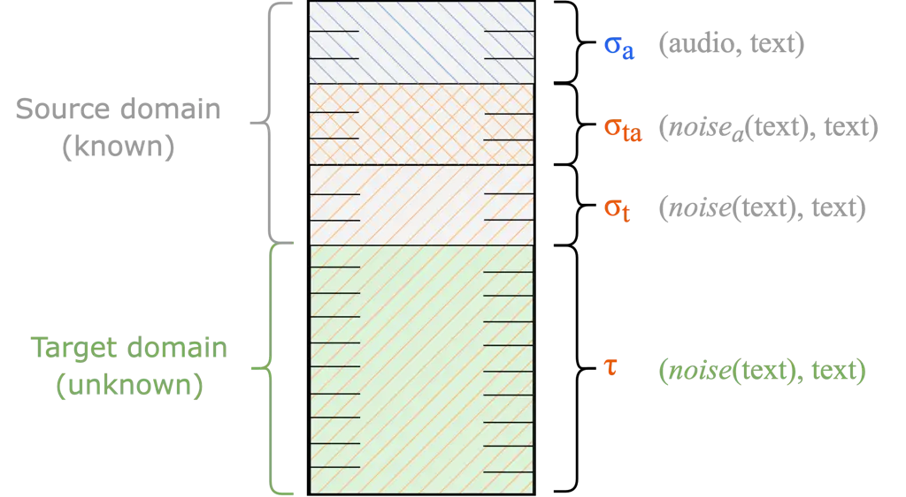

# Text-only adaptation in LLM-based ASR through text denoising

Andrés Carofilis^(1,†), Sergio Burdisso^(1,♣), Esaú
Villatoro-Tello^(1,‡), Shashi Kumar^(1,2,⋆), Kadri Hacioğlu^(3,⋆)
Srikanth Madikeri^(4,⋆), Pradeep Rangappa^(1,⋆), Manjunath K E^(3,⋆),
Petr Motlicek^(1,5,⋆), Shankar Venkatesan^(3,⋆), Andreas Stolcke^(3,⋆)

###### Abstract

Adapting large language model (LLM)-based automatic speech recognition
(ASR) systems to new domains using text-only data is a significant yet
underexplored challenge. Standard fine-tuning of the LLM on the target
domain text often disrupts the critical alignment between the speech and
text modality learned by the projector, degrading performance. We
introduce a novel text-only adaptation method that frames this process
as a text denoising task. Our approach trains the LLM to recover clean
transcripts from noisy inputs. This process effectively adapts the model
to a target domain while preserving cross-modal alignment. Our solution
is lightweight, requiring no architectural changes or additional
parameters. Extensive evaluation on two datasets demonstrates up to
22.1% relative improvement, outperforming recent state-of-the-art
text-only adaptation methods.

###### Index Terms: 

Text fine-tuning, text denoising, domain adaptation, automatic speech
recognition, LLM-based ASR.

^(†)^(†)address: ¹ Idiap Research Institute  ² EPFL, Lausanne  ³
Uniphore  ⁴ Univ. of Zurich  ⁵ BUT, Brno  

NOTICE: this version has been superseded by a revised version. In a
subsequent internal reproduction of this work, errors were identified in
the experimental pipeline and in the preparation of the evaluation data:
the development and test partitions used here were incomplete and did
not cover the full evaluation sets. The pipeline was reimplemented, the
dataset partitions were corrected to include the complete development
and test sets, and all experiments were rerun. As a result, the dataset
statistics, results, and conclusions reported here have been revised.
The revised study also releases the implementation and scripts required
to reproduce them. The author list of the revised version reflects the
contributions to that study. Readers are encouraged to refer to the
revised version, published at INTERSPEECH 2026:
[https://www.isca-archive.org/interspeech_2026/burdisso26_interspeech.html](https://www.isca-archive.org/interspeech_2026/burdisso26_interspeech.html)

## 1 Introduction

^(†)^(†)footnotetext: ^(†) Performed experimentation and data
preparation. ^(♣) Conceived the original idea and helped plan the
experiments. ^(‡) Involved in planning and supervised the work, writing
the manuscript with support from ^(‡) and ^(†). ^(⋆) Provided critical
feedback and helped shape the research.

Recently, there has been growing interest in integrating speech
capabilities into large language models (LLMs) to enable seamless voice
interaction and advance voice-driven applications, assistive
technologies, and conversational AI more broadly  \[8, 3, 16, 21, 10,
13, 14, 22, 11, 26, 4\].

In this context, LLM-based ASR systems have emerged as a practical and
computationally efficient alternative, focusing on transcription by
leveraging a fixed, manually defined prompt during both training and
inference \[16, 21, 25, 12, 24, 6, 19, 23\]. This fixed-prompt setup
ensures consistency between the training objective and inference
behavior, making it well-suited for applications where high-accuracy
transcription is the primary goal. A key advantage of LLM-based ASR is
the ease of combining strong pretrained speech encoders with powerful
LLMs through a learnable projection layer, thereby leveraging advances
from pretraining in both speech and text modalities. This modular design
enables scalable, high-performance transcription without the need for
costly instruction tuning. Intuitively, the projection layer learns to
map speech representations into the text embedding space of the LLM
(i.e., learns a speech-to-text alignment). Once projected, the resulting
representation can be interpreted by the LLM as a noisy text, which the
model reconstructs into a clean transcription through its inherent
denoising capability.

Despite these advantages, the training of LLM-based ASR typically relies
on large amounts of paired audio–text data, which can limit scalability
to new domains. In practice, such resources are often scarce or
expensive to collect and transcribe. Moreover, existing studies have
indicated that performance may degrade when models are applied to
domains that differ from the training data \[12\], highlighting the
importance of effective adaptation strategies. Compared to collecting
additional audio–text pairs, text-only adaptation offers a more
practical alternative given the wide availability of text data.

Few studies have explored fine-tuning LLM-based ASR with unpaired text
data while preserving cross-modal alignment between the speech projector
and the LLM. Fang et al. \[6\] proposed using a monitoring metric to
maintain alignment, but excessive text-only fine-tuning can still
degrade recognition, and mitigation strategies only partially address
this issue. Ma et al. \[15\] introduced a two-step approach using
trainable soft prompts as pseudo audio embeddings: first optimizing
domain-specific soft prompts, then performing text adaptation with the
soft prompts fixed. While effective, this method requires tuning
additional hyperparameters, such as the number, initialization, and
placement of soft tokens.

To address these challenges, we propose a novel text-only adaptation
strategy that fine-tunes the LLM within an LLM-based ASR architecture by
means of formulating the problem as a denoising task. Our contributions
are as follows: (i) We reformulate text-only adaptation as a denoising
task, training the LLM to reconstruct inputs that mimic the outputs of a
speech projector in LLM-based ASR architectures. (ii) We propose a
lightweight training approach that simply consists of a multi-view
noise-driven batching strategy, not requiring additional learnable
parameters. (iii) We present a thorough evaluation across two datasets,
achieving up to 22.1% relative improvement, surpassing the
state-of-the-art.

Figure 1: Batch composition used for fine-tuning the LLM during
text-only adaptation to a target domain. Here, $`\sigma`$ and
$`\boldsymbol{\tau}`$ denote the proportions of the batch that are drawn
from the source domain ($`\mathcal{D}{src}`$) and the target domain
($`\mathcal{D}{tgt}`$), respectively.

## 2 Method

LLM-based ASR systems consist of three main components: (i) a pretrained
speech encoder (e.g., Whisper \[17\], Hubert \[9\], or WavLM \[1\],
etc.) that extracts frame-level acoustic representations, (ii) a
learnable projector (e.g., pooling-based \[3\],CNN-based \[4, 18\], or
linear-based \[16, 7, 12\]) that maps these representations into the LLM
input embedding space,¹¹ 1 Also known as “speech projector” in the
literature, with some referring to it as a “speech adapter” or
“connector”. and (iii) a pre-trained LLM (e.g., Llama \[5\],
Vicuna \[2\] ) that acts as a decoder, and generates final transcripts.

Prior work has shown that even a simple projector (two linear layers
with a nonlinearity) combined with a frozen LLM is sufficient to obtain
strong transcription performance \[16, 12, 24\]. This suggests that the
projector learns to convert speech into a sequence of _soft tokens_ that
approximate entries in the LLM vocabulary. For example, the projector
may map the audio utterance “yes that would be” into embeddings
resembling “mmy Z YesssS S SGS that Will B be S S”, as reported in prior
work \[12, 24\]. This illustrates how the projector outputs resemble a
noisy transcript rather than raw speech features. As a result, the LLM
is forced to interpret these inputs as a corrupted or noisy version of
the transcript, which it then recovers.

We interpret this behavior as evidence that LLM-based ASR can be viewed
as a _denoising task_: the LLM learns to reconstruct the clean
transcript from the noisy, text-like sequence produced by the projector.
Building on this insight, we propose a novel approach to adapt LLM-based
ASR models using only text data by explicitly teaching the LLM to
denoise distorted transcripts from the target domain, even when no
target-domain audio is available.

### 2.1 Task Formulation

Let $`\mathcal{D}_{src}=\{(a_{i},t_{i})\}`$ denote the source-domain
dataset with paired audio $`a_{i}`$ and transcript $`t_{i}`$, and let
$`\mathcal{D}_{tgt}=\{t_{j}\}`$ denote the target-domain dataset with
transcripts only.²² 2 It is worth mentioning that in all our
experiments, the text-only data consists of (ground truth) transcripts
from conversational speech, rather than arbitrary text such as that
found on web pages. While standard LLM-based ASR training requires large
numbers of $`(a,t)`$ pairs to achieve high recognition performance, we
enable text-only adaptation by introducing a noise function
$`noise(\cdot)`$. This function takes as input transcripts and generates
perturbed variants that approximate the outputs of a trained projector
in the LLM-based architecture.

Thus, given only text $`t\in\mathcal{D}_{tgt}`$, we replace the missing
audio with $`noise(t)`$ and fine-tune the LLM to recover $`t`$.
Adaptation is therefore reframed as training on $`(noise(t),t)`$ pairs,
i.e., learning to solve a text denoising problem.

### 2.2 Batch Construction for Text Denoising Adaptation

Directly fine-tuning the LLM with $`(noise(t),t)`$ pairs from
$`\mathcal{D}_{tgt}`$ leads to _catastrophic forgetting_, i.e., the
alignment between the speech encoder and the LLM degrades, and the
projector’s mapping becomes ineffective, negatively impacting the
model’s performance. A similar observation has also been recently
reported in  \[6\]. To mitigate this, we propose a more effective
training batch composition for fine-tuning the LLM. Specifically, each
batch is constructed as a mixture of examples from both source and
target domains (see Figure 1). Let $`\sigma_{a}`$, $`\sigma_{ta}`$,
$`\sigma_{t}`$, and $`\tau_{t}`$ denote the proportions (relative
shares) of the following components in each batch:

- •
  $`\sigma_{a}`$: $`(a,t)`$ pairs from $`\mathcal{D}_{src}`$, i.e.,
  paired audio and transcripts, to preserve the original speech–text
  alignment.
- •
  $`\sigma_{ta}`$: $`(noise_{a}(t),t)`$ pairs where
  $`(a,t)\in\mathcal{D}_{src}`$ and $`noise_{a}(t)`$ is obtained by
  projecting $`a`$ through the model’s projector and mapping the
  resulting embeddings to their nearest tokens in the LLM vocabulary.
  This approximates an optimal noise function, as it corresponds to
  projector-induced text noise.
- •
  $`\sigma_{t}`$: $`(noise(t),t)`$ pairs where $`t`$ is taken from
  $`\mathcal{D}_{src}`$ and $`noise(t)`$ is generated through random
  character substitutions and duplications. This serves as a naive
  approximation of $`noise_{a}(t)`$, obtainable without access to audio.
  By including both projector-induced and naive noise in the same batch
  for the source domain, the LLM is encouraged to learn to bridge the
  three views of $`t`$ (audio, $`noise_{a}(t)`$, and $`noise(t)`$).
- •
  $`\tau_{t}`$: $`(noise(t),t)`$ pairs from $`\mathcal{D}_{tgt}`$,
  analogous to the previous item but applied to the target domain,
  thereby driving adaptation by exposing the LLM to target-domain
  textual data.

The proportions are set so that
$`\sigma_{a}+\sigma_{ta}+\sigma_{t}+\tau=1`$. In practice, maintaining a
small but nonzero $`\sigma_{a}`$ is critical to avoid forgetting the
speech-to-text alignment between, while $`\tau`$ controls the strength
of adaptation. Ideally, $`\tau`$ should be optimized on held-out
validation data for each application setting, since it directly governs
the balance between source retention and target specialization. In this
work, however, we adopt a simple and robust heuristic: we set $`\tau`$
proportional to the relative size of the target domain with respect to
the source domain (in terms of training examples), and distribute the
remaining source-domain proportions equally, i.e.,
$`\sigma_{a}=\sigma_{ta}=\sigma_{t}=\frac{1-\tau}{3}`$. This choice
ensures that larger target domains naturally receive more adaptation
weight, while still preserving source-domain coverage. It also allows us
to systematically analyze the effect of varying $`\tau`$ across
domains.³³ 3 The exact $`\tau`$ values are provided in the result tables
next to each domain. By carefully mixing audio, projector-based noise,
and synthetic textual noise in each batch, we enable the LLM to maintain
its original transcription ability (i.e., not forgetting the alignment
already learned by the projector) while adapting to the target domain in
the absence of target-domain audio.

|             |           |         |        |       |            |      |        |      |
| ----------- | --------- | ------- | ------ | ----- | ---------- | ---- | ------ | ---- |
| Dataset     | Partition | Domains | Train  |       | Validation |      | Test   |      |
|             |           |         | \#Utts | Hrs   | \#Utts     | Hrs  | \#Utts | Hrs  |
| DefinedAI   | Source    | B/I/H   | 17,398 | 38:10 | –          | –    | –      | –    |
| SlideSpeech | Source    | L/T/E   | 34,682 | 34:59 | –          | –    | –      | –    |
| DefinedAI   | Target    | B       | 26,704 | 36:20 | 391        | 0:48 | 695    | 1:24 |
| DefinedAI   | Target    | I       | 32,249 | 46:54 | 325        | 0:42 | 650    | 1:18 |
| SlideSpeech | Target    | Ag      | 30,498 | 29:20 | 1,504      | 1:40 | 2,934  | 3:18 |
| SlideSpeech | Target    | An      | 56,593 | 49:48 | 2,896      | 2:50 | 5,934  | 5:32 |
| SlideSpeech | Target    | MI      | 9,981  | 8:30  | 719        | 0:43 | 863    | 0:53 |

Table 1: Datasets used for training, validation, and testing in our
experiments. The source partition comes from either DefinedAI (Banking,
Insurance, Healthcare) or SlideSpeech (Life, Talent, English, Animation,
Agriculture, Musical Instruments). For evaluation, each target partition
is paired individually with the chosen source partition. For reference,
we provide the total number of utterances (\#Utts) and the duration
(Hrs) of each partition.

## 3 Datasets Preparation

Table 1 presents the composition of the source and target domain
datasets, including their training, development, and test splits, as
used in our experiments.

Our experiments use two conversational corpora, chosen both for their
explicit domain grouping and for their relevance to real-world ASR
applications. DefinedAI⁴⁴ 4 https://defined.ai is a proprietary corpus
of manually transcribed customer–agent telephone calls (125 hours used),
selected for its production-like conditions. Conversational data like
this captures naturalistic speech patterns, e.g., including
disfluencies, interruptions, and colloquial expressions, that are
critical for evaluating ASR robustness in practical settings. To
complement it, we use the open-source SlideSpeech \[20\] dataset, a
large-scale audio-visual dataset generated from online conference videos
on YouTube, which contains multi-speaker conversations across 22 domains
(1,705 videos; 1,000 hours; 473 hours transcribed). By working with
these corpora, we focus on realistic conversational scenarios that are
more challenging than scripted speech.

From DefinedAI we prepared three partitions: a source (audio,
transcripts pairs) partition covering Banking (B), Insurance (I) and
Healthcare (H) domains, and two target (text-only) partitions with
Banking (B) and Insurance (I) domains. For the SlideSpeech dataset,
although it provides a challenging testbed for evaluating ASR
robustness, the limited amount of data in its original development and
test partitions (approximately 1 hour per domain) limits its usefulness
for our experiments. To address this, we ranked the domains by
perplexity and selected only those from the original SlideSpeech
training set that contained sufficient examples for partitioning into
training and development/test portions. Using this ranking, we
constructed the source and target partitions: the source domains
comprise Life, Talent, and English, while the target domains include
Agriculture, Animation, and Musical Instruments (see Table 1). Note
that, in our setup, the training split of the target domain contains
text-only data.

## 4 Experimental Setup

All experiments were implemented in the SLAM-ASR framework \[16\] with
WavLM-Large \[1\] as the speech encoder and Llama 3.2 3B Instruct⁵⁵ 5
https://huggingface.co/meta-llama/Llama-3.2-1B-Instruct \[5\] as the
decoder LLM. These models are connected via a learnable projector
consisting of a single hidden layer followed by a ReLU activation and a
regression layer. For all the performed experiments, the prompt template
is defined as:

Prompt(input) = \<\|start_header_id\|\>user

\<\|end_header_id\|\>Transcribe speech to text.
Speech:{input}\<\|eot_id\|\>\<\|start_header_id\|\>

assistant\<\|end_header_id\|\>{transcript}

Notice that the value of {input} will change with the type of (input,
output) pair in the batch composition, in particular:

- •
  Prompt($`a`$) for $`(a,t)`$
- •
  Prompt($`noise_{a}(t)`$) for $`(noise_{a}(t),t)`$
- •
  Prompt($`noise(t)`$) for $`(noise(t),t)`$,

where {transcript} is always the ground truth transcript $`t`$.

$`\bullet`$ Base model: We train a _base model_ for each dataset
(DefinedAI and SlideSpeech) using the source (audio-text pairs)
partition, and evaluated on the test split of the target data. For
training the base model, we followed the original setup as described
in \[16\]: the speech encoder and the LLM are frozen, while the
projector is trained on the source domain data during four epochs with
learning rate $`1\!\times\!10^{-4}`$, $`1000`$ warm-up steps, and batch
size of $`4`$.

$`\bullet`$ Adapted model (audio): This experiment reflects the
best-case scenario, i.e., when audio-text pairs are available for
fine-tuning the LLM for the target domain. Specifically, for adapting
the LLM, we fine-tuned on the target partition, using audio-text pairs,
for four epochs, using LoRA applied to the self-attention _query_ and
_value_ projection layers with rank 8, learning rate
$`1\!\times\!10^{-4}`$, and $`1000`$ warm-up steps.

$`\bullet`$ Text-only adaptation (ours): For these experiments, we
implement _noise(text)_ as a two-step process: (1) _random character
substitution_ followed by (2) _random character duplication_. In step
(1), we use nlpaug⁶⁶ 6
https://nlpaug.readthedocs.io/en/latest/augmenter/char/random.html to
select $`15\%`$ of the words and replace $`30\%`$ of the characters
within those words with random symbols, with a minimum of 1 and a
maximum of 10 character edits per utterance. These values match the
nlpaug defaults, except that we reduce the fraction of edited words from
$`30\%`$ to $`15\%`$, which yielded better performance in preliminary
experiments. In step (2), each character has a $`10\%`$ chance of being
repeated; when selected, it is duplicated 1 to 3 times with equal
probability. This step is designed to emulate the duplication patterns
observed in noise(audio).

Additionally, we also reimplemented two recently proposed text-only
adaptation approaches for LLM-based ASR:

$`\bullet`$ *Ma et al.* \[15\]: the text-only adaptation is performed in
two stages: (1) first, freeze the model and learn $`k`$ trainable
embeddings $`e_{i}`$ inserted where the audio would go in the prompt
(i.e. the input of the LLM is Prompt($`e_{1}\dots e_{k}`$)); (2)
fine-tune the LLM using those $`k`$ embeddings instead of audio, i.e.,
batches are composed only of $`(e_{1}\dots e_{k},t)`$ pairs. In our
experiments, we use $`k=30`$ as in the original work.

$`\bullet`$ *Fang et al.* \[6\]: the adaptation process consists of: (a)
fine-tuning the LLM using raw target-domain text (no prompt involved);
(b) monitoring the perplexity on the validation set (with audio) every
200 steps to identify when catastrophic forgetting occurs. The adapted
model is the checkpoint with the minimum perplexity before the sudden
increase.

|                       |                                      |            |                                        |            |
| --------------------- | ------------------------------------ | ---------- | -------------------------------------- | ---------- |
| System                | Banking ($`\boldsymbol{\tau}=0.61`$) |            | Insurance ($`\boldsymbol{\tau}=0.65`$) |            |
|                       | WER                                  | $`\Delta`$ | WER                                    | $`\Delta`$ |
| Base model            | 12.98                                | –          | 10.61                                  | –          |
| Adapted model (audio) | 9.92                                 | 23.6       | 7.92                                   | 25.4       |
| Adapted model (text)  |                                      |            |                                        |            |
|     Fang et al. \[6\] | 10.92                                | 15.9       | 9.79                                   | 7.7        |
|     Ma et al. \[15\]  | 10.63                                | 18.1       | 9.68                                   | 8.8        |
|     Ours              | 10.11                                | 22.1       | 8.71                                   | 17.9       |

Table 2: In-domain WER results. Domain adaptation on DefinedAI (target).
Base model trained on DefinedAI (source). Values in %.

Finally, all experiments are evaluated in terms of word error rate
(WER), and report the relative improvement ($`\Delta`$) over the
corresponding base model.

## 5 Experimental Results

We evaluate our proposed text-only adaptation method in three scenarios
of increasing difficulty: (1) in-domain adaptation, (2) out-of-domain
adaptation, (3) cross-domain adaptation. The main results for each of
these experiments are reported in Table 2, Table 3 and Table 4,
respectively.

(1) In-domain adaptation - In this setting, the target domain
corresponds to a domain type already represented in the source-domain
data, both in terms of domain exposure and similar speech and acoustic
characteristics. The goal of this experiment was to assess the benefit
of additional text data for a domain familiar to the base model.
Specifically, for this experiment, the source and target partitions are
both drawn from DefinedAI.

Table 2 reports the in-domain results. After text-only adaptation,
performance approaches that of audio-based adaptation (best case), with
10.11% vs. 9.92% in Banking and 8.71% vs. 7.92% in Insurance,
highlighting the benefits of incorporating additional text data for a
familiar domain.

(2) Out-of-domain adaptation - In this setting, the target domain is not
represented in the source domain partition but shares the same speech
and acoustic characteristics. The goal of this experiment was to
validate how well the LLM can learn domain-specific lexical and
syntactic patterns from text alone, given stable acoustic conditions.
This scenario was simulated using the SlideSpeech dataset, where source
domain data is represented by L,T,E domains and the target domain is
defined by Ag, An, MI domains.

Table 3 presents the out-of-domain results. Our method achieves
consistent WER improvements in two of the three target domains,
indicating that the LLM learns domain-specific lexicons, albeit modestly
due to the low $`\boldsymbol{\tau}`$ values ($`<0.25`$ in MI). This
suggests that higher specialization (larger $`\boldsymbol{\tau}`$) could
yield further improvements.

|                       |                                 |            |                                 |            |                                 |            |
| --------------------- | ------------------------------- | ---------- | ------------------------------- | ---------- | ------------------------------- | ---------- |
| System                | Ag ($`\boldsymbol{\tau}=0.47`$) |            | An ($`\boldsymbol{\tau}=0.62`$) |            | MI ($`\boldsymbol{\tau}=0.22`$) |            |
|                       | WER                             | $`\Delta`$ | WER                             | $`\Delta`$ | WER                             | $`\Delta`$ |
| Base model            | 14.82                           | –          | 15.58                           | –          | 14.73                           | –          |
| Adapted model (audio) | 10.80                           | 27.1       | 10.37                           | 33.4       | 11.04                           | 25.1       |
| Adapted model (text)  |                                 |            |                                 |            |                                 |            |
| Fang et al. \[6\]     | 14.47                           | 2.4        | 15.30                           | 1.8        | 13.70                           | 7.0        |
| Ma et al. \[15\]      | 14.23                           | 4.0        | 15.71                           | $`-0.8`$   | 13.35                           | 9.4        |
| Ours                  | 14.21                           | 4.1        | 14.60                           | 6.3        | 13.43                           | 8.8        |

Table 3: Out-of-domain WER results. Domain adaptation on SlideSpeech
(target). Base model trained on SlideSpeech (source). Values in %.

(3) Cross-domain adaptation - This setting is the most challenging and
realistic scenario; the target domain is not represented in the source
data and additionally exhibits different speech and acoustic
characteristics. The goal of this experiment was to evaluate the impact
of the text-only adaptation approach in bridging the linguistic gap in a
scenario where there are evident acoustic shifts. For this experiment,
we use DefinedAI (B/I/H) as the source domain and SlideSpeech (Ag/Ai/MI)
as the target domain.

Table 4 shows that our text-only adaptation approach improves over the
base model, achieving performance comparable to Ma et al. \[15\]. This
indicates that the method can reduce the linguistic gap between domains
that differ in both lexicon and acoustics. However, performance remains
well below that of the audio-adapted model, an expected outcome given
that the latter benefits from target-domain audio to address the
acoustic mismatch.

|                       |                                 |            |                                 |            |                                 |            |
| --------------------- | ------------------------------- | ---------- | ------------------------------- | ---------- | ------------------------------- | ---------- |
| System                | Ag ($`\boldsymbol{\tau}=0.64`$) |            | An ($`\boldsymbol{\tau}=0.77`$) |            | MI ($`\boldsymbol{\tau}=0.37`$) |            |
|                       | WER                             | $`\Delta`$ | WER                             | $`\Delta`$ | WER                             | $`\Delta`$ |
| Base model            | 32.64                           | –          | 29.81                           | –          | 28.00                           | –          |
| Adapted model (audio) | 12.25                           | 62.5       | 11.23                           | 62.3       | 13.20                           | 52.9       |
| Adapted model (text)  |                                 |            |                                 |            |                                 |            |
| Fang et al. \[6\]     | 31.01                           | 5.0        | 27.83                           | 6.6        | 26.72                           | 4.6        |
| Ma et al. \[15\]      | 29.22                           | 10.5       | 25.95                           | 12.9       | 25.03                           | 10.6       |
| Ours                  | 29.18                           | 10.6       | 25.32                           | 15.1       | 23.54                           | 15.9       |

Table 4: Cross-domain WER results. Domain adaptation on SlideSpeech
(target). Base model trained on DefinedAI (source). Values in %.

### 5.1 Ablation experiments

We conducted two ablation studies on the DefinedAI target data to
isolate the contributions of our method’s key components. The first
study evaluates the impact of including or removing different
source-side components from the training batches. As shown in Table 5,
using all three components ($`\sigma_{a}`$, $`\sigma_{ta}`$,
$`\sigma_{t}`$) yields the best performance. Notably, omitting the audio
component ($`\sigma_{a}=0`$) causes a sharp increase in WER, possibly
due to catastrophic forgetting of the speech-text alignment. The second
study examines the importance of perturbing text-only data from the
target domain. Table 6 shows that using syntactic noise as input to the
LLM improves performance more effectively than using unperturbed text.
This indicates that framing the task as denoising enables the model to
better capture the target domain’s lexical and syntactic patterns.

| $`\sigma_{a}`$ | $`\sigma_{ta}`$ | $`\sigma_{t}`$ | Banking   |            | Insurance |            |
| -------------- | --------------- | -------------- | --------- | ---------- | --------- | ---------- |
|                |                 |                | WER       | $`\Delta`$ | WER       | $`\Delta`$ |
| ✓              |                 |                | $`11.29`$ | 13.0       | $`9.91`$  | 6.6        |
| ✓              | ✓               |                | $`10.14`$ | 21.9       | $`8.94`$  | 15.7       |
| ✓              |                 | ✓              | $`11.77`$ | 9.3        | $`9.10`$  | 14.2       |
|                | ✓               | ✓              | $`73.50`$ | -466.3     | $`66.65`$ | -528.2     |
| ✓              | ✓               | ✓              | 10.11     | 22.1       | 8.71      | 17.9       |

Table 5: Batch composition ablation study. Checkmarks denote the active
components in the batch. $`\Delta`$ is reported over the base model of
Table 2. Values in %.

|              |                      |           |            |           |            |
| ------------ | -------------------- | --------- | ---------- | --------- | ---------- |
| Strategy     | Input                | Banking   |            | Insurance |            |
|              |                      | WER       | $`\Delta`$ | WER       | $`\Delta`$ |
| Noise        | Prompt($`noise(t)`$) | 10.11     | 22.1       | 8.71      | 17.9       |
| Echo         | Prompt($`t`$)        | $`10.31`$ | 20.6       | $`9.09`$  | 14.3       |
| Empty prompt | Prompt()             | $`10.56`$ | 18.6       | $`9.01`$  | 15.1       |
| No prompt    | $`t`$                | $`10.53`$ | 18.9       | $`9.28`$  | 12.5       |

Table 6: Batch composition with respect to the LLM input format for
$`\sigma_{t}`$ and $`\tau`$. The original noise is replaced by different
strategies. $`\Delta`$ is reported over the base model of Table 2.
Values in %.

## 6 Conclusions

This paper presented a novel text-only adaptation approach for LLM-based
ASR architectures that mitigates catastrophic forgetting when
fine-tuning with textual data alone. Our method integrates multiple
components during fine-tuning—alternating between source audio,
projector-induced text noise, and synthetic noisy text—allowing the
model to simultaneously (i) preserve its ability to interpret
audio-conditioned inputs and (ii) learn to denoise text, while also
acquiring target-domain knowledge. Experiments demonstrate consistent
improvements across multiple domains and datasets, surpassing prior
state-of-the-art text-only adaptation strategies. As future work, we
plan to explore more sophisticated noise functions that better
approximate the projection layer outputs and to conduct a thorough
evaluation of the $`\tau`$ value to assess performance under text-rich,
real-world conditions.

## References

- \[1\] S. Chen, C. Wang, Z. Chen, Y. Wu, S. Liu, Z. Chen, J. Li, N.
  Kanda, T. Yoshioka, X. Xiao, et al. (2022) WavLM: large-scale
  self-supervised pre-training for full stack speech processing. IEEE
  Journal of Selected Topics in Signal Processing 16 (6), pp. 1505–1518.
  External Links:
  [Document](https://dx.doi.org/10.1109/JSTSP.2022.3188113) Cited by:
  §2, §4.
- \[2\] W. Chiang, Z. Li, Z. Lin, Y. Sheng, Z. Wu, H. Zhang, L.
  Zheng, S. Zhuang, Y. Zhuang, J. E. Gonzalez, I. Stoica, and E. P.
  Xing (2023) Vicuna: an open-source chatbot impressing gpt-4 with 90%\*
  chatgpt quality. External Links:
  [Link](https://lmsys.org/blog/2023-03-30-vicuna/) Cited by: §2.
- \[3\] Y. Chu, J. Xu, Q. Yang, H. Wei, X. Wei, Z. Guo, Y. Leng, Y.
  Lv, J. He, J. Lin, et al. (2024) Qwen2-audio technical report. arXiv
  preprint arXiv:2407.10759. Cited by: §1, §2.
- \[4\] N. Das, S. Dingliwal, S. Ronanki, R. Paturi, Z. Huang, P.
  Mathur, J. Yuan, D. Bekal, X. Niu, S. M. Jayanthi, et al. (2024)
  SpeechVerse: a large-scale generalizable audio language model. arXiv
  preprint arXiv:2405.08295. Cited by: §1, §2.
- \[5\] A. Dubey, A. Jauhri, A. Pandey, A. Kadian, A. Al-Dahle, A.
  Letman, A. Mathur, A. Schelten, A. Yang, A. Fan, et al. (2024) The
  Llama 3 herd of models. CoRR abs/2407.21783. External Links:
  [Document](https://dx.doi.org/10.48550/ARXIV.2407.21783) Cited by: §2,
  §4.
- \[6\] Y. Fang, J. Peng, X. Li, Y. Xi, C. Zhang, G. Zhong, and K.
  Yu (2025) Low-resource domain adaptation for speech LLMs via text-only
  fine-tuning. CoRR abs/2506.05671. External Links:
  [Document](https://dx.doi.org/10.48550/ARXIV.2506.05671), 2506.05671
  Cited by: §1, §1, §2.2, Table 2, §4, Table 3, Table 4.
- \[7\] X. Geng, T. Xu, K. Wei, B. Mu, H. Xue, H. Wang, Y. Li, P.
  Guo, Y. Dai, L. Li, M. Shao, and L. Xie (2024) Unveiling the potential
  of LLM-based ASR on chinese open-source datasets. In ISCSLP, Vol. ,
  pp. 26–30. External Links:
  [Document](https://dx.doi.org/10.1109/ISCSLP63861.2024.10800077) Cited
  by: §2.
- \[8\] A. Goel, S. Ghosh, J. Kim, S. Kumar, Z. Kong, S. Lee, C. H.
  Yang, R. Duraiswami, D. Manocha, R. Valle, et al. (2025) Audio
  Flamingo 3: advancing audio intelligence with fully open large audio
  language models. arXiv preprint arXiv:2507.08128. Cited by: §1.
- \[9\] W. Hsu, B. Bolte, Y. H. Tsai, K. Lakhotia, R. Salakhutdinov,
  and A. Mohamed (2021) Hubert: self-supervised speech representation
  learning by masked prediction of hidden units. IEEE/ACM transactions
  on audio, speech, and language processing 29, pp. 3451–3460. Cited by:
  §2.
- \[10\] W. R. Huang, C. Allauzen, T. Chen, K. Gupta, K. Hu, J. Qin, Y.
  Zhang, Y. Wang, S. Chang, and T. N. Sainath (2024) Multilingual and
  Fully Non-Autoregressive ASR with Large Language Model Fusion: A
  Comprehensive Study. In ICASSP, Cited by: §1.
- \[11\] H. Kheddar, M. Hemis, and Y. Himeur (2024) Automatic speech
  recognition using advanced deep learning approaches: a survey.
  Information Fusion 109, pp. 102422. External Links: ISSN 1566-2535,
  [Document](https://dx.doi.org/https%3A//doi.org/10.1016/j.inffus.2024.102422),
  [Link](https://www.sciencedirect.com/science/article/pii/S1566253524002008)
  Cited by: §1.
- \[12\] S. Kumar, I. Thorbecke, S. Burdisso, E. Villatoro-Tello, M. K
  E, K. Hacioğlu, P. Rangappa, P. Motlicek, A. Ganapathiraju, and A.
  Stolcke (2025) Performance evaluation of SLAM-ASR: the good, the bad,
  the ugly, and the way forward. In ICASSPW, Vol. , pp. 1–5. External
  Links:
  [Document](https://dx.doi.org/10.1109/ICASSPW65056.2025.11010998)
  Cited by: §1, §1, §2, §2.
- \[13\] Y. Li, Y. Wu, J. Li, and S. Liu (2023) Prompting Large Language
  Models for Zero-Shot Domain Adaptation in Speech Recognition. In ASRU
  Proceedings, pp. 1–8. Cited by: §1.
- \[14\] R. Ma, M. Qian, P. Manakul, M. Gales, and K. Knill (2023) Can
  Generative Large Language Models Perform ASR Error Correction?. arXiv
  preprint arXiv:2307.04172. Cited by: §1.
- \[15\] Y. Ma, Z. Liu, and O. Kalinli (2024) Effective text adaptation
  for llm-based ASR through soft prompt fine-tuning. In IEEE Spoken
  Language Technology Workshop, SLT 2024, Macao, December 2-5, 2024,
  pp. 64–69. External Links:
  [Document](https://dx.doi.org/10.1109/SLT61566.2024.10832227) Cited
  by: §1, Table 2, §4, Table 3, Table 4, §5.
- \[16\] Z. Ma, G. Yang, Y. Yang, Z. Gao, J. Wang, Z. Du, F. Yu, Q.
  Chen, S. Zheng, S. Zhang, et al. (2024) An embarrassingly simple
  approach for LLM with strong ASR capacity. arXiv preprint
  arXiv:2402.08846. Cited by: §1, §1, §2, §2, §4, §4.
- \[17\] A. Radford, J. W. Kim, T. Xu, G. Brockman, C. McLeavey, and I.
  Sutskever (2023) Robust speech recognition via large-scale weak
  supervision. In International conference on machine learning,
  pp. 28492–28518. Cited by: §2.
- \[18\] S. Rajaa and A. Tushar (2024) SpeechLLM: Multi-Modal LLM for
  Speech Understanding. Note: https://github.com/skit-ai/SpeechLLM Cited
  by: §2.
- \[19\] Š. Sedláček, B. Yusuf, J. Švec, P. Hegde, S. Kesiraju, O.
  Plchot, and J. Černockỳ (2025) Approaching dialogue state tracking via
  aligning speech encoders and LLMs. arXiv preprint arXiv:2506.08633.
  Cited by: §1.
- \[20\] H. Wang, F. Yu, X. Shi, Y. Wang, S. Zhang, and M. Li (2024)
  SlideSpeech: A large scale slide-enriched audio-visual corpus. In
  ICASSP, Seoul, Republic of Korea, pp. 11076–11080. External Links:
  [Document](https://dx.doi.org/10.1109/ICASSP48485.2024.10448079) Cited
  by: §3.
- \[21\] M. Wang, W. Han, I. Shafran, Z. Wu, C. Chiu, Y. Cao, N.
  Chen, Y. Zhang, H. Soltau, P. K. Rubenstein, et al. (2023) SLM: bridge
  the thin gap between speech and text foundation models. In ASRU
  Proceedings, pp. 1–8. Cited by: §1, §1.
- \[22\] C. H. Yang, Y. Gu, Y. Liu, S. Ghosh, I. Bulyko, and A.
  Stolcke (2023) Generative Speech Recognition Error Correction With
  Large Language Models and Task-Activating Prompting. In ASRU, pp. 1–8.
  Cited by: §1.
- \[23\] G. Yang, Z. Ma, F. Yu, Z. Gao, S. Zhang, and X. Chen (2024)
  MaLa-ASR: multimedia-assisted LLM-based asr. In Interspeech 2024,
  pp. 2405–2409. External Links:
  [Document](https://dx.doi.org/10.21437/Interspeech.2024-488), ISSN
  2958-1796 Cited by: §1.
- \[24\] M. Yang, S. Chen, J. Xie, and J. Hansen (2025) Bridging the
  modality gap: softly discretizing audio representation for LLM-based
  automatic speech recognition. External Links: 2506.05706,
  [Link](https://arxiv.org/abs/2506.05706) Cited by: §1, §2.
- \[25\] W. Yu, C. Tang, G. Sun, X. Chen, T. Tan, W. Li, L. Lu, Z. Ma,
  and C. Zhang (2024) Connecting speech encoder and large language model
  for ASR. In ICASSP, Vol. , pp. 12637–12641. External Links:
  [Document](https://dx.doi.org/10.1109/ICASSP48485.2024.10445874) Cited
  by: §1.
- \[26\] D. Zhang, S. Li, X. Zhang, J. Zhan, P. Wang, Y. Zhou, and X.
  Qiu (2023) SpeechGPT: empowering large language models with intrinsic
  cross-modal conversational abilities. In Findings of the Association
  for Computational Linguistics: EMNLP 2023, pp. 15757–15773. Cited by:
  §1.
