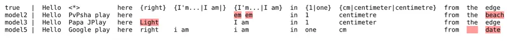

 

asr_eval: algorithms and tools for multi-reference and streaming speech
recognition evaluation

 

Oleg Sedukhin ¹  Andrey Kostin ¹ 

^(†)^(†)footnotetext: ¹Siberian Neuronets LLC, Novosibirsk, Russia.
Correspondence to: Oleg Sedukhin \<sedol1339@gmail.com\>.  
Preprint. August 24, 2026.

###### Abstract

We propose several improvements to the speech recognition evaluation.
First, we propose a string alignment algorithm that supports both
multi-reference labeling, arbitrary-length insertions and better word
alignment. This is especially useful for non-Latin languages, those with
rich word formation, to label cluttered or longform speech. Secondly, we
collect a novel test set DiverseSpeech-Ru of longform in-the-wild
Russian speech with careful multivariant labeling. We also perform
multivariant relabeling of popular Russian tests set and study
fine-tuning dynamics on its corresponding train set. We demostrate that
the model often adopts to dataset-specific labeling, causing an illusion
of metric improvement. Based on the improved word alignment, we develop
tools to evaluate streaming speech recognition and to align multiple
transcriptions to compare them visually. Additionally, we provide
uniform wrappers for many offline and streaming speech recognition
models. Our code will be made publicly available.

## 1 Introduction

Figure 1: Multiple transcription alignment.

Speech recognition evaluation is complicated by multiple possible
spellings, cluttered and overlapping speech. This is typically solved by
text normalization, but it does not cover all cases. Table 1 summarizes
multiple kinds of complexities that arise when annotating speech, and
the possbility to solve them by text normalization (see the extended
version with discussions in Appendix B). Also, a good normalization
model may not exist for every language. In table 1, we employ a syntax
that uses braces to list multiple options, and a wildcard symbol for
unclear speech.

In this paper, we propose MWER¹¹ 1 Acronym for Multi-reference Wildcard
and Enhanced alignment with Relaxed insertion penalty, a string
alignment algorithm that can parse this syntax directly and align a
prediction against a transcription with multi-reference blocks, while
aligning wilcard symbol with arbitrary word sequence, possibly empty.
Also, MWER modifies a traditional scoring function to improve
word-to-word alignment. Finally, when we use the alignment to calculate
Word Error Rate (WER), we use a relaxed insertion penalty to make our
metrics more stable against oscillatory hallucinations. In our code
implementation, each aspect is customizable and can be turned off.

We also release asr_eval, ASR evaluation library for Python. It provides
tools to (i) extend annotation syntax via MWER, (ii) get insights into
model performance via dashboard and streaming plots, (iii) use a
collection of ASR building blocks to avoid code duplication, and model
and datasets in a unified format. It includes:

1.  1.  The whole evaluation pipeline with tokenizing, preprocessing,
        aligling using the proposed MWER algorithm, WER/CER calcuiation and
        fine-grained error analysis, with extensive documentation and
        intermediate data structures for practioners with custom needs.
2.  2.  Multiple word-to-word alignments to compare several models, and an
        interactive dashboard to visualize them. Error highlighting feature
        can be used to rapidly validate datasets and correct annotation
        errors in them, as we show in section 5.1.
3.  3.  A collection of datasets and model wrappers in standardized format,
        and a framework to run inference and store the results, with
        dashboard integration. It allows for custom text normalizers,
        tokenizers and applying noise overlays.
4.  4.  Building blocks, such as longform VAD wrapper for any ASR model +
        voice activity detector, and longform CTC wrapper for any CTC model,
        to support long audios. This allows to quickly combine different
        components and evaluate them, including for ablation studies.
5.  5.  Streaming inference and evaluation tools for research and
        production. This includes a flexible base class to process several
        audio streams simultaneously, a storage mechanism for the
        input-output history and various evaluation diagrams. Specifically,
        we propose (i) _time remapping_ for faster evaluation, (ii) a
        _streaming alignment diagram_ for a single sample, and (iii) a
        _streaming histogram_ for aggregating.

We also relase DiverseSpeech-Ru, a Russian longform Youtube-sourced
dataset. We propose an annotation guideline for multi-reference
annotation with wilcard insertions that MWER algorithm can handle. This
is especially useful for non-Latin languages, languages with rich word
formation, to label cluttered or longform speech. We make use of our
multiple alignment feature in dashboard to quickly validate the dataset:
if many baseline models made a “mistake” in some place, one needs to
check the annotation in it.

Finally, we conduct exepriments to check if the MWER features matter in
practice. We relabel an existing Russian dataset using careful
multi-reference and wildcard syntax, and compare the re-labeleing
approach with the text normalization approach, studying fine-tuning
dynamics. We observe that both versions show different fine-tuning
dynamics. Since the text normalization approach is apriori approximate,
and the multi-reference re-labeling appoach is more strict, their
different fine-tuning dynamics suggests that the model adopts to
dataset-specific labeling, causing an illusion of metric improvement
even with normalization. This is crucial in research, when we can
confuse the actual efficient fine-tuning method with the described
artifact.

[TABLE]

Table 1: Multi-reference and wildcard syntax use cases. We use syntax
{A\|B\|C} to enumerate multiple equally acceptable options, {A} for
optional text blocks, {A\| B} for the case where B is acceptable but
contains minor typical spelling errors. \<\*\> is a wildcard symbol used
where we cannot reliably enumerate all possible choices. Our MWER
algorithm can use the provided syntax directly to evaluate WER/CER,
aligning \<\*\> with arbitrary sequence without penalty. The extended
version of this table with more discussions can be found in Appendix B,
and complex cases are described in Appendix .

## 2 Related work

In automatic speech recognition, both WER (word error rate) and CER
(character error rate) metrics are based on the optimal sequence
alignment. The core algorithm to align two sequences is a
Needleman-Wunsh algorithm (Needleman & Wunsch, 1970) based on filling a
matrix via dynamic programming that produces an optimal alignment
between sequences. The Wagner–Fischer algorithm (Wagner & Fischer,
1974), when used in ASR, is a special instance of the general
Needleman–Wunsch algorithm that calculates only the edit distance.

In the past years, (Fiscus et al., 2006) extended a string alignment
aligorithm by represent a ground truth as a directed acyclic graph, thus
allowing to handle multiple ground truths, similarly to our work. They
focus solely on multi-speaker evaluation challenges, and thus do not
handle arbitrary insertions and do not improve a scoring function for
better alignment. (von Neumann et al., 2023) also focus on multi-speaker
evaluation and extend the Wagner–Fischer algorithm to support a
compositional ground truth of muitple-speaker utterances. (Karita et
al., 2023) note the importance of orthographic variation for Japanese
language: different spellings may be equally accepted. They train a
model to automatically generate multi-reference transcriptions from
single-reference ones. Later, (Kaji, 2023) utilized multivariance to
enumerate all possible romanized forms of Japanse words.

Similar problems arise when aligning DNA sequences in biology.
Elastic-degenerate (ED) strings were proposed to align a genome against
a pangenome (a set of closely-related DNA sequences). (Gabory et al., 2025) proposed al algorithm to align two ED-strings in a similar way as
(Fiscus et al., 2006) did in multi-speaker speech recognition. Their
formulation allows empty option in a multivariant block, but not
arbibrary length insertions, since ED-string is a sequence of finite
sets of strings. In biology multiple sequence alighment (MSA) is
commonly used to align several DNA sequences with each other. A similar
operation was proposed to align multiple ASR hypotheses from different
models, known as ROVER system (Fiscus, 1997).

(McNamara et al., 2024) make multi-reference annotations for two ASR
evaluation sets of spontaneous long-form speech. They annotated each
audio twice: with verbatim (including filler words etc.) and and less
verbatim transcriptions. Notably, they show that such a double
annotation results in WER lower than any kind or normalization they
tried, showing that normalization does not cover all cases. This is in
line with ours work, however, we are interested if using multivaraince
instead of normalization may affect _model ranking_ (e.g. selecting the
best fine-tuning checkpoint) and not just the absolute WER values. We
describe our experiments in more details in section 7. Thus,
incorporating multivariance gains interest in the research commnunity.
As far as we know, still none of the previous works consider
arbitrary-length insertions (that may be useful for poorly heard speech)
or improving word alignment.

## 3 Transcription format

We propose an annotation format, guidelines and alignment algorithm that
supports both multiple references and arbitrary-length (wildcard)
insertions, and improve scoring function to obtain better word
alignment. We release a code base to support further research.

### 3.1 Multi-reference blocks

A multi-reference block is a ground truth transcription section with
multiple correct options, each with zero or more elements. An element is
typically a word, or a character if we perform character-level
alignment. Our syntax extends regular (single variant) transcriptions.
An annotator writes a multi-reference blocks in curly brackets,
separating options with a vertical line (pipe) symbol. Each option may
contain multiple words which are tokenized in the same way as regular
text (our tokenization rule is customizable). This is useful in several
scenarios not always handled by normalization, see examples in Table 1.
To simplify adding optional words, we use an additional parsing rule: if
a block contains only a single option, an empty option is added
automatically during parsing. That is, {well} is equivalent as {well\|},
but {one\|1} is _not_ equivalent to {one\|1\|}.

When annotating DiverseSpeech-Ru (Section 6) our general rule was to
include options acceptable in the case of a human transcriber who is
generally literate, but not necessarily perfectly literate. There are
also rare and complex cases we show in discuss in Appendix .

Should we add options with minor spelling errors? This is up to
practioners, but we argue that sometimes we should. In some languages
many rules are too complex, and some words are often spelled
incorrectly. We extend our syntax to support prepending tilde “~” to
options with minor syntax errors. This symbol is removed during parsing
and is turned into a flag. This allows to evaluate in two scenarios:
lexically strict and permissive.

Does it complicate the annotation process? We believe that multivariance
usually makes things easier, because most cases where it is required are
obvious to annotator, and you no more need to choose between equally
acceptable options (and incorporate your own selection biases into a
dataset). However, if you go further and try to make your annotation
perfect, you find complex cases where multi-reference annotation is
controversial (Appendix ), but the percentage of such cases is small.

### 3.2 Wilcard insertions

We use a special wilcard symbol \<\*\> in a ground truth transcription
that matches with any word sequence, including empty sequence. This
allows to skip annotating some utterances that contain poorly heard or
cluttered speech by permitting any transcription for them. This is
especially useful in annotating longform speech, because almost every
longform speech sample would contain at least one section we’re not sure
about. If an annotator instead tries to annotate every poorly head
speech, they would likely introduce their own biases that may favor some
models and especially checkpoints fine-tuned on a split of the same
dataset.

However, using \<\*\> is discouraged when we actually know what was
said, despite the speech being poorly heard. This is the case when (i)
the speaker is the annotator, (ii) we have a text that was read, (iii)
we add artificial background noise or simulate bad microphone. Also note
that extensive using \<\*\> for poorly heard utterances largely lowers
absolute WER values.

## 4 Evaluation improvements

### 4.1 Transcription alignment

We provide MWER algorithm overview here and describe in more details in
Appendix A.

First, it can be seen that the optimal alignment algorithm can be easily
solved via recursion: we can take the first element from both sequences
and thus reduce a problem of alignling sequences of length (A, B) to
aligning sequences of length (A-1, B), (A-1, B-1) and (A, B-1). Thus,
the aligning requires 3 recursive calls. The same idea can be
implemented without recursive calls, by filling a matrix of size (A, B):
each cell can be filled based on 3 other neighbour cells, just like in
recursion. This idea is the basis of the Needleman-Wunsh algorithm.

1.  1.  We extend the algorithm to multi-reference case similarly to (Fiscus
        et al., 2006). All the elements are first enumerated: for example,
        the transcription "{A\|B} {C} D" is enumerated as A, B, C, D,
        forming 4 matrix rows. In contrast with the Needleman-Wunsh
        algorithm, we allow "jumps" between non-neighbour rows based on the
        element connectivity: for example, we can jump from A to D, because
        the block {C} is optional.
2.  2.  We support wilcard insertion symbol \<\*\> that matches with any
        word sequence. In the Needleman-Wunsh algorithm, horizontal
        transition in the matrix (to the next predicted token, keeping the
        ground truth token the same) increases the error counter, because
        this is actually an insertion (extra preidcted token). In our case,
        if the ground truth token is \<\*\>, horizontal transitions do not
        increase the error counter.
3.  3.  In the Needleman-Wunsh algorithm, the alignment score (calculated
        for each matrix transition) is an integer. In our case, the score is
        a tuple of 3 numbers compared lexicographically. The first number is
        the word error count, as usual. The second number is the number of
        total correct matches, and the last number is a sum of all character
        errors for each match. For example, matching "hello" with "hey" is a
        replacement treated as 1 word error and 3 character errors. Note
        that this does _not_ calculate CER for the whole text, but is useful
        to align words better (see Section 4.2).

### 4.2 Improved alignment scoring

Consired aligning a prediction "multivariant" against the ground truth
"multivariate though". We can align "multivariant" against the first
ground truth word and let the second be deletion, or vice versa. Both
alignments are equally optimal in sence of WER: they both give 1
replacement and 1 deletion. But obviously, one of them is better. This
makes sense in streaming evaluation where determining a ground truth
word for a predicted word is a required step to evaluate latency (even
if this word is wrongly transcribed). Also, this visually improves the
alignment to compare multiple offline models on a single sample. A valid
alternative is to use character-level alignment, but this is difficult
to combine with using WER (and not CER) as a metric or interest.

The Needleman-Wunsh algorithm compare scores of multiple possible
alignments, where score is a total number of errors. The goal is to find
the alignment with minimum score. However, as in the example above,
there are many alignments with minumum score, and the choice among them
is arbitrary.

We modify the objective to be a tuple of scores compared
lexicographically. The first element in tuple is a number of errors
(word errors if we align on a word level). The next elements are
customizable and matter only if the number of errors is the same. Thus,
we keep the main goal to minimize number of errors, but also optimize
additional metrics. Currently, in our score tuple we use two additional
metrics we describe in Appendix A, one of them is CER-based, another is
the number of correct matches.

Typically, this gives visually better alignment. However, we do not
prove that our concrete list of scores gives the best word-to-word
alignment, because it’s not clear what "best" means. Though we believe
this question is important to calculate streaming latency or do a
fine-grained error analysis, and our mechanism for adding additional
scores is rather general and can be experimented with, using our code
base, in future work.

### 4.3 Relaxed insertion penalty

Generative speech recognition models wuch as Whisper (Radford et al., 2023) are sometimes prone to oscillatory hallucinations (Guerreiro et
al., 2023), where the model generates the same token, word of phrase
until the generation limit. In traditional WER/CER formulation, each
hallucination hugely affacts metrics, making the metric unstable.
Mathematically speaking, the metric distribution become heavy-tailed
because of rare but long oscillatory insertions. This hinders evaluation
if we have limited data. Simply, one checkpoint makes a _random_
hallucination in one sample, which lowers its average metrics hugely.

We tackle this by treating more than 4 subsequent insertions as exactly 4. This should also align better with human evaluation, because the same
word repeated 100 times does not hinder text understanding so much as
100 word errors in different places.

However, the problem is that "hallucinations" are not always
oscillatory. If the model hallucinates on non-speech noise, this may
result in long insertions that do not repeat the same word. This hinder
text understanding more. Thus, we plan to experiment with another
approach to turn a long insertion into set, to evaluate the number of
different words in it.

## 5 asr_eval evaluation tools

In this section we describe parts of the proposed asr_eval library,
besides the alignnment algorithm.

### 5.1 Multiple alignment and dashboard

We develop a dashboard to visualize multiple alignments between model
predictions and the ground truth, making use of our tweaks to improve
word-to-word alignment (Figure 1) and develop a web interface (Figure ).
This turns out to be useful when preparing high-quality evaluation sets.
We further describe our case study.

We first annotated 92 recordings 2-3 minutes long with multi-reference
labeling. This data was annotated by one annotator and verified by
another annotator. Then we obtained a set of predictions for each sample
with GigaAM, several Whisper configurations, Voxtral etc. We align and
visualize the predictions in a dashboard with highlighting errors. As a
result, we spot and fix many annotation errors. Some of them were plain
misspellings. Another errors are more subtle: they arise when the
annotator focuses on a single option to transcribe and ignores another
possible options. However, some models transcribe differently. By
analyzing multiple alignments the annotator concludes that the
highlighted "errors" are caused by missing options in the annotation. We
also analyzed many other existing datasets and observe similar cases,
including misspellings.

Thus, our instrument helps to quickly analyze and fix existing datasets,
either multi-reference or not. Using a dashboard, we simultaneously
evaluate both models and the annotation, including annotation verbosity,
misspellings, missing words etc.

### 5.2 Wrappers and building blocks

We wrap multiple models into a unified programming interface, including
Whisper (Radford et al., 2023), Voxtral (Liu et al., 2025), wav2vec2
(Baevski et al., 2020), (Puvvada et al., 2024), Qwen2-Audio (Chu et al.,
2024), GigaAM (Kutsakov et al., 2025) and more, into one of the 4
interfaces: `Transcriber`, `TimedTranscriber`, `CTC` and `StreamingASR`.

We also gather many existing datasets (mostly Russian currently). For
each dataset, we apply tools that detect possible train-test sample
overlap and estimate speaker count and train-test speaker overlap. For
each dataset, we report our analysis in documentation and fix sample
overlaps if found.

We provide several building blocks to assemble transcribers. WWe believe
this is important for ablation studies and disentangling influence of
components, and to avoid duplicating logic. The main bulding blocks:

1.  1.  `CTCDecoderWithLM` can wrap around any CTC model to decode with
        KenLM using pyctcdecode (pyctcdecode authors, 2022).
2.  2.  `LongformVAD` combines any shortform transciber and voice activity
        detector to process long audios.
3.  3.  `LongformCTC` wraps around any CTC model to chunk audio uniformly
        and merge logit matrices. It spoorts several merging algorithms, and
        in prelimilary studies, we observe that the best merging algorithm
        may be model-dependent.
4.  4.  `ContextualLongformVAD` wraps around a `ContextualTranscriber`,
        which is typically an audio-LLM that can accept the previous
        transcription and the current audio, similarly to Whisper.

### 5.3 Streaming evaluation

Streaming speech recognition system can be evaluated by a variety of
parameters: (i) final WER/CER, (ii) latency induced by calculations,
(iii) latency induced by accumulating context, where the model refuses
to emit a word until accumulates enough audio frames, even with infinite
compute speed, (iv) the dependency between average WER and time delta,
if the system is able to correct previous transcription as more audio
context comes, (v) distributions, spikes and edge cases of the
parameters described above.

To tackle this complexity, we take several steps. First, to unify
evaluation, we define a general input-output interface: the system
accepts audio chunks labeled by recording ID via input buffer, and emits
strings labeled by recording ID and part ID. When a new string is
emitted, if the part ID matches that for one of the previous parts, it
replaces that part, otherwise the new string appended to the end of the
text. This allows a system to correct previously emitted words or
sentences, if needed. For the described interface, we develop a wrapper
with input and output buffers, which makes it easy to wrap any streaming
ASR into our interface.

To simulate real-time CPU/GPU loading (and thus a realistic latency) we
need to send audio in real time. However, this leads to time spans when
both the sender and the system waits, because the system had processed
all the previous chunks, but the time to send the next chunk has not yet
come. To speed up simulated evaluations, we may wish to eliminate these
spans. To this end, we develop an algorithm called _time remapping_
(Figure 2): we send all the input chunks at once, process them, and
during evaluation we add artificial time spans to accurately simulate
real-time sending. This process can be understood from the fig. 2. This
is, however, limited to single-threaded systems.

Figure 2: Time remapping in streaming evaluation. X axis is a real time,
and Y axis is a chunk number (the audio consists of 5 chunks). For each
chunk, we mark send time (black dot) and time span when the system was
busy processing this chunk (red). Left: all chunks were send at once.
Right: all chunks were sent were sent evenly in real time. Blue denote
idle time we want to eliminate. Time remapping takes chunk history from
the process on the left and alters the recorded timestamps to mimic
process on the right. Thus we get the real time simulations faster than
real time.

In view of the diversity of all the streaming characteristics, we
believe that diagramming is a good way to analyze a streaming system. We
start evaluation from a history of input and ouptut chunks and a ground
truth transcription. First, we perform forced alignment with CTC model
to obtain word-level ground truth timestamps ²² 2 CTC ovjective by
design does not force a model to predict timestamps accurately, but
empirically timestamps are pretty accurate in most cases. However, there
may be exceptions, so care should be taken.. Then we take evenly growing
moments T_1, …, T_N in real time to evaluate at. For each time moment
T_i, we take all the output chunks emitted before, and merge them into a
partial transcription at T_i. We also consider the audio span sent by
T_i and all its words, according to the word-level timestamps. We then
align the partial transcription against the partial ground truth. If the
T_i is in mid-word, we consider this word optional, making use of
multi-reference syntax. As a result, we obtain a partial alignment,
consisting of "correct", "replacements", "insertions" and "deletions",
as usual. Additionally, we extract a tail of words marked as "deletions"
and mark them "not yet transcribed". The result is shown in Figure 3.
Here we use the improved word-to-word alignment in MWER algorithm,
otherwise our word matches could be wrong - for example, replacements
and deletions could be falsely swapped, as in the example in section
4.2.

Figure 3: A streaming evaluation diagram. Each row is a partial
alignment, where correctly transcribed words are show in green, wrongly
transcribed words are shown in red, insertions (extra words) are shown
as red dots (their timestamps are fictitious), deletions (missed words)
and words not yet transcribed are shown in gray.

The proposed streaming evaluation diagram provides insights into the
model behaviour. It allows to spot lags at some chunks, missing words
and more problems. asr_eval provides each diagram as a plot and as a
data structure, enabling any custom aggregation into numerical metrics.

The streaming evaluation diagram visualizes a single sample. To
aggregate metrics for multiple samples, we propose a _streaming
histogram_. We first take each word for each partial alignment and for
each sample. For each word, wa calculate _prescription_ ("how long ago
was the word spoken") - the difference between the word timing (center
time) and the length of the audio sent at time of the current partial
alignment. Also, we categorize each word into one of 3 types: (i)
correct, (ii) not yet transcribed, (iii) errors - replacement, insertion
or deletion (excluding not yet transcribed tail). So, for each word we
define prescription and one of 3 types. This is enough to make a
histogram (Figure 4). We divide prescription into bins (X axis), and for
each bin we count the ratio of all types: correct (green), errors
(orange) and not yet transcribed (gray). This provides insights into
system’s latency and quality. For example, a system that runs a model on
the whole received audio 2 times a second, will exhibit high error ratio
at low prescription, because the last word is usually patrially cut off.
In contrast, a system that accumulates context to transcribe will
exhibit high "not yet transcribed" ratio but lower error ratio at low
prescription. Also, if a system incudes additional slower model to
finalize transcription, the error ratio will be lower at high
prescription. These are valuable insights into model characteristics.

Figure 4: A streaming quality historgram. See Section 5.3 for
description.

## 6 Novel datasets

We publicly release two Russian test sets for speech recognition:

1.  1.  A longform speech dataset with a thorough multi-reference labeling,
        containing 3.5 hours of speech in form of 2-3 munute long audios. We
        take YODAS dataset (Li et al., 2023) as a source (a "YODAS2" version
        with full audios) and use correction based on multiple alignments,
        as described in Section 5.1.
2.  2.  A multi-reference re-annotation of 500 samples from Sova-RuDevices
        (Zubarev & Moskalets, 2019) test set from scratch (without seeing
        the original labeling during the annotation). We use it further to
        study fine-tuning dynamics in section 7.

We argue that annotating audio samples 2-3 minutes long is enough to
evaluate longform models based on segmenting (VAD-based or uniform),
because this length is enough to evaluate the segmenter quality. With
2-3 minutes per sample, we can collect much mor diverse dataset.
Annotating too long audios is costly, while the speaker and topics
diversity would be low.

## 7 MWER annotation syntax vs. normalization

We conducted exepriments to check if the MWER features matter in
practice. Simply introducing annotation errors at random would raise
absolute WER values, but should not typically affect model ranking,
because all the models are penalized equally. This means that we can
perform a meaningful model comparison even if the dataset is partly
erroneous at random. In this light, are "perfect" test sets important?

Theoretically, we assume that penalties caused by lacking multivariance
are usually _non-random_. Thus, the dataset annotation style can be
learned during fine-tuning: model B can be generally worse then A, but
better fitted to the dataset annotation style. Thus, single-variant
datasets may show misleading dynamics during fine-tuning even with
normalization, causing an illusion of metric improvement.

In our experiments, we use a human-labeled Sova-RuDevices (Zubarev &
Moskalets, 2019) Russian dataset, originally crowdsourced from voice
messages, and fine-tune _whisper-medium_ and _whisper-large-v3-turbo_
(Radford et al., 2023) on the train split. As a result, we obtain a
series of checkoints. We then take a part (500 samples) of the test
split and re-annotate it carefully using multi-reference and wildcard
syntax.

We evaluate each checkpoint on the test part in 4 ways (with condifence
intervals):

1.  1.  The original labeling.
2.  2.  The novel multi-referece relabeling
3.  3.  The original labeling with text normalization similar to (Radford et
        al., 2023): removing filler words, standardizing number formatting
        with Silero normalizer (Silero, 2020) and converting anglicisms into
        Russian. We also try lighter normalization without a Silero
        normalizer.

Figure 5: Upper, left. Does multivariant re-labeling of the test set
alter the visible fine-tuning dynamics? We avaluate the same fine-tuning
checkpoint series 4 times on the same test set, but with different
labeling, and observe different dynamics. If we stop after step 800, for
_whisper-medium_ we get around 3% WER improvement for the original
_sova-rudevices_ test part with any normalizer, but 0% WER improvement
for the multivariant one.

The results are shown in 5. Since the text normalization approach is
apriori approximate, and the multi-reference re-labeling appoach is more
strict, their different dynamics suggest that the model quickly adopts
the dataset labeling style. One of the examples is the Russian
"blyat/blyad" spelling that ocurrs frequently and is spelled differently
in the dataset and by the pretrained model. This shows the importance of
multi-reference labeling to mitigate false metric improvements.

## 8 Conclusion

In this paper we proposed a tweaked multi-reference transcription
alignment algorithm and release a ready to use tool to visualize
multiple alignments, and asr_eval tool for streaming and offline ASR
evaliation and dataset correction. We demonstrated a case study that
compares (i) multi-reference labeling with the wilcard symbol and (ii)
text normalization, and show the benefits of the first. We argue that
this may be important in several cases:

In noisy, fluent speech (such as Sova-RuDevices dataset) the percentage
of multiple options or unclear speech is large. In our relabeling,
around 50% of 2-5 sec long samples contain multi-reference blocks or the
wilcard symbol.

In high-quality clear speech the percentage of unclear speech is much
lower, but some words still may be written differently. There are
roughly 1-2% of these words. As the speech recognition systems become
better, their WER may appoach similar numbers. If a model gains 3% WER
while 1.5% WER are caused by lacking multivariance in annotation, then
half of the model errors are spurious. This highlights the importance of
multivariance even in clear speech.

In general, there are many works from different research areas that show
that proper testing may challenge a large layer of the previously
proposed methods. This happened in image classification (Gulrajani &
Lopez-Paz, 2020), object detection (Lee et al., 2022), tabular machine
learning (Shwartz-Ziv & Armon, 2022), NLP and more. Thus, a large part
of machine learning progress is based on robust benchmarking and ready
to use code tools that we tried to contribute in this work.

## References

- Baevski et al. (2020) Baevski, A., Zhou, Y., Mohamed, A., and Auli, M.
  wav2vec 2.0: A framework for self-supervised learning of speech
  representations. _Advances in neural information processing systems_,
  33:12449–12460, 2020.
- Chu et al. (2024) Chu, Y., Xu, J., Yang, Q., Wei, H., Wei, X., Guo,
  Z., Leng, Y., Lv, Y., He, J., Lin, J., et al. Qwen2-audio technical
  report. _arXiv preprint arXiv:2407.10759_, 2024.
- Fiscus (1997) Fiscus, J. G. A post-processing system to yield reduced
  word error rates: Recognizer output voting error reduction (rover). In
  _1997 IEEE Workshop on Automatic Speech Recognition and Understanding
  Proceedings_, pp. 347–354. IEEE, 1997.
- Fiscus et al. (2006) Fiscus, J. G., Ajot, J., Radde, N., Laprun, C.,
  et al. Multiple dimension levenshtein edit distance calculations for
  evaluating automatic speech recognition systems during simultaneous
  speech. In _LREC_, pp. 803–808, 2006.
- Gabory et al. (2025) Gabory, E., Mwaniki, M. N., Pisanti, N.,
  Pissis, S. P., Radoszewski, J., Sweering, M., and Zuba, W.
  Elastic-degenerate string comparison. _Information and Computation_,
  304:105296, 2025.
- Guerreiro et al. (2023) Guerreiro, N. M., Alves, D. M., Waldendorf,
  J., Haddow, B., Birch, A., Colombo, P., and Martins, A. F.
  Hallucinations in large multilingual translation models. _Transactions
  of the Association for Computational Linguistics_, 11:1500–1517, 2023.
- Gulrajani & Lopez-Paz (2020) Gulrajani, I. and Lopez-Paz, D. In search
  of lost domain generalization. _arXiv preprint
  arXiv:2007.01434_, 2020.
- Kaji (2023) Kaji, N. Lattice path edit distance: A romanization-aware
  edit distance for extracting misspelling-correction pairs from
  japanese search query logs. In _Proceedings of the 2023 Conference on
  Empirical Methods in Natural Language Processing: Industry Track_, pp.
  233–242, 2023.
- Karita et al. (2023) Karita, S., Sproat, R., and Ishikawa, H. Lenient
  evaluation of japanese speech recognition: Modeling naturally
  occurring spelling inconsistency. _arXiv preprint
  arXiv:2306.04530_, 2023.
- Kutsakov et al. (2025) Kutsakov, A., Maximenko, A., Gospodinov, G.,
  Bogomolov, P., and Minkin, F. Gigaam: Efficient self-supervised
  learner for speech recognition. _arXiv preprint
  arXiv:2506.01192_, 2025.
- Lee et al. (2022) Lee, K., Yang, H., Chakraborty, S., Cai, Z.,
  Swaminathan, G., Ravichandran, A., and Dabeer, O. Rethinking few-shot
  object detection on a multi-domain benchmark. In _European Conference
  on Computer Vision_, pp. 366–382. Springer, 2022.
- Li et al. (2023) Li, X., Takamichi, S., Saeki, T., Chen, W., Shiota,
  S., and Watanabe, S. Yodas: Youtube-oriented dataset for audio and
  speech. In _2023 IEEE Automatic Speech Recognition and Understanding
  Workshop (ASRU)_, pp. 1–8. IEEE, 2023.
- Liu et al. (2025) Liu, A. H., Ehrenberg, A., Lo, A., Denoix, C.,
  Barreau, C., Lample, G., Delignon, J.-M., Chandu, K. R., von Platen,
  P., Muddireddy, P. R., et al. Voxtral. _arXiv preprint
  arXiv:2507.13264_, 2025.
- McNamara et al. (2024) McNamara, Q., Fernández, M. Á. d. R., Bhandari,
  N., Ratajczak, M., Chen, D., Miller, C., and Jetté, M. Style-agnostic
  evaluation of asr using multiple reference transcripts. _arXiv
  preprint arXiv:2412.07937_, 2024.
- Needleman & Wunsch (1970) Needleman, S. B. and Wunsch, C. D. A general
  method applicable to the search for similarities in the amino acid
  sequence of two proteins. _Journal of Molecular Biology_,
  48(3):443–453, 1970. ISSN 0022-2836. doi:
  https://doi.org/10.1016/0022-2836(70)90057-4. URL
  [https://www.sciencedirect.com/science/article/pii/0022283670900574](https://www.sciencedirect.com/science/article/pii/0022283670900574).
- Puvvada et al. (2024) Puvvada, K. C., Żelasko, P., Huang, H.,
  Hrinchuk, O., Koluguri, N. R., Dhawan, K., Majumdar, S., Rastorgueva,
  E., Chen, Z., Lavrukhin, V., et al. Less is more: Accurate speech
  recognition & translation without web-scale data. _arXiv preprint
  arXiv:2406.19674_, 2024.
- pyctcdecode authors (2022) pyctcdecode authors. pyctcdecode.
  [https://github.com/kensho-technologies/pyctcdecode](https://github.com/kensho-technologies/pyctcdecode), 2022.
- Radford et al. (2023) Radford, A., Kim, J. W., Xu, T., Brockman, G.,
  McLeavey, C., and Sutskever, I. Robust speech recognition via
  large-scale weak supervision. In _International conference on machine
  learning_, pp. 28492–28518. PMLR, 2023.
- Shwartz-Ziv & Armon (2022) Shwartz-Ziv, R. and Armon, A. Tabular data:
  Deep learning is not all you need. _Information Fusion_,
  81:84–90, 2022.
- Silero (2020) Silero. Russian stt text normalization. GitHub, 2020.
- von Neumann et al. (2023) von Neumann, T., Boeddeker, C., Kinoshita,
  K., Delcroix, M., and Haeb-Umbach, R. On word error rate definitions
  and their efficient computation for multi-speaker speech recognition
  systems. In _ICASSP 2023-2023 IEEE International Conference on
  Acoustics, Speech and Signal Processing (ICASSP)_, pp. 1–5.
  IEEE, 2023.
- Wagner & Fischer (1974) Wagner, R. A. and Fischer, M. J. The
  string-to-string correction problem. _Journal of the ACM (JACM)_,
  21(1):168–173, 1974.
- Zubarev & Moskalets (2019) Zubarev, E. and Moskalets, T. Sova
  rudevices dataset: free public stt/asr dataset with manually annotated
  live speech. GitHub, 2019.

## Appendix A The alignment algorithm

Our algorithm is a generalization of the Needleman–Wunsch algorithm to
support multi-choice blocks and wildcard blocks (matching any sequence,
possibly empty) for both sequences.

Flat view. We start by converting a multivariant annotation into a “flat
view”. Our example contains 9 tokens (words) in total, including those
inside and outside multivariant blocks. We arrange them into a list,
prepend and append position. Then we define transitions between them,
according to the multivariant structure. In our example, from the “”
word we can transit to “uh” or to “please” (skipping the {uh} optional
block). The transitions are denoted as arrows on the vertical axis (for
truth) and on the horizontal axis (for prediction).

Figure 6: Solving the optimal alignment in multi-reference case.

Matrix position. A position in a resulting matrix means some pair of
locations. More precisely, the matrix position “at token A in the
annotation and token B in the prediction” means that these tokens were
the last tokens we visited, that is, we are immediately after these
tokens (Figure 6).

Matrix transition (step). A “step” is a transition between matrix
positions. There are 3 types of transitions:

1.  1.  Vertical: transition over the annotation only. This means a
        “deletion” in terms of sequence alignment, because we go to the next
        token at the annotation while staying on the same position at the
        prediction.
2.  2.  Horizontal: transition over the prediction only. Similarly, this
        means an “insertion”.
3.  3.  Diagonal: transition over both the prediction and the annotation.
        This means either “correct” or “replacement”, depending on whether
        the tokens match or not.

Step score. Each step is associated with a score 0 or 1, depending on
how much did the total number of errors increase after the step. A
diagonal step may have a score 0 or 1, depending on whether the tokens
match or not. The horizontal step is always 1, except cases where the
current annotation token is _wildcard_ - the score is 0 in this case,
because we can step over any count of prediction tokens being at wilcard
annotation token without incrementing error counter. The same for
vertical step (however, the wildcard tokens in the prediction normally
should not occur).

That is, we can traverse the matrix from the left lower to the right
upper corner, or vice versa, and thus build an alignment, resulting in a
final score (number of word errors) where we finish traversing both
sequences.

Position score and best path. We define the best path for position as
the lowest score path from the end to the current position. This is the
same as the best alignment between the remaining parts of both sequences
(from the current position to the end). The position score is a score of
its best path. Our final goal is to find the best path for the
`(<start>, <start>)` matrix position - this will be the optiomal
sequence alignment.

Final positions. To start with, we define as “final” all the annotation
positions leading directly to the `(<end>)` position, and the same for
the prediction positions. In our example, 1 prediction position and 3
annotation positions are final (green), and the corresponding steps to
the `(<end>)` are shown in green. We define a “final matrix position” as
a combination of final annotation position and final prediction position
(green dots). Being in a final martrix position, we are after final
tokens in both sequences, that is essentially at the end. So, best path
are empty for the final matrix positions, and their scores are zero.

Now we are going to fill the matrix from the final positions to the
`(<start>, <start>)` position.

Matrix filling. Consider some matrix position X with unknown score and
best path. Let $`S`$ be a set of all matrix positions where we can get
to in one step from $`X`$. In our example, the position `X=(please, oh)`
contains 5 positions in $`S(X)`$: 2 for vertical steps, 2 for diagonal
and 1 for horizontal. Let’s assume that we know a position score for all
positions in $`S(X)`$. For each $`Xs\in S(X)`$, we can calculate
$`step\_score(X,Xs)+score(Xs)`$, and take the argmin across $`S(X)`$ to
find the best source position $`X^{*}`$. Thus,
$`score(X)=step\_score(X,X^{*})+score(X^{*})`$, and the best path for
$`X`$ consists of one step to $`X`$ plus the best path for $`X^{*}`$.

Using the described process, we fill the whole matrix, starting from the
last row from right to left, then the next row, and so on.
Alternatively, we can fill the matrix column-wise or even diagonal-wise
(which is the best to parallelze computations). Finally, we got a score
for the position `(<start>, <start>)`, which is the total number of word
errors. To restore the best path (the alignment), it’s enough to keep
the source position for each matrix position, and restore the path
iteratively.

Complexity. Let $`A`$ be the total word count in the annotation, and
$`B`$ be the total word count in the prediction. Also, let $`S(X)`$ be
bounded above (which is always the case in real multi-reference
annotations). The complexity is $`O(AB)`$ for the matrix propagation,
since the number of operations to fill a cell is bounded above. The
complexity of restoring the best path is $`O(max(A,B))`$ that is
negligible comparing to $`O(AB)`$. Thus, the overall complexity is
$`O(AB)`$. Since transcriptions $`B`$ usually have length similar to the
annotation $`A`$, the complexity is quadratic, as in the
Needleman–Wunsch algorithm.

Improved scoring. There may be many cases where the argmin of
$`step\_score(X,Xs)+score(Xs)`$ contains more than one source positions.
This reflects the fact that there may be many optimal alignments. Across
them all, we want to select those in which:

1.  1.  The number of correct matches is the highest.
2.  2.  The mismatched words have the least number of discrepancies in
        symbols.

This is straightforward to implement. Initially, we have a single score:

$`n\_errors=n\_replacements+n\_deletions+n\_insertions`$

We replace $`n\_errors`$ with a tuple of three scores:

1.  1.  $`n\_errors`$
2.  2.  The number of correct matches in the path
3.  3.  Sum character errors for all the transitions int the path

These tuples are compared lexicographically: to compare $`(A1,B1,C1)`$
with $`(A2,B2,C2)`$ we first compare $`A1`$ with $`A2`$, if equal we
compare $`B1`$ and $`B2`$, and if equal we finally compare $`C1`$ and
$`C2`$. This ensures that the resulting best path is still optimal in
terms of $`n\_errors`$.

One possible alternative is to align on a character level (calculating
CER instead of WER). Our algorithm is applicable also for this case.
Note that such an alignment will not always be optimal in WER sense.
This is stll a valid alternative, however, CER have its own biases (for
example, it underestimates errors in word endings, since it’s only one
or two characters).

## Appendix B The extended table of use cases

|                                                                                                                                                                                                                                                                                                                                                                                                                                                                                                                   |          |                          |                                     |
| ----------------------------------------------------------------------------------------------------------------------------------------------------------------------------------------------------------------------------------------------------------------------------------------------------------------------------------------------------------------------------------------------------------------------------------------------------------------------------------------------------------------- | -------- | ------------------------ | ----------------------------------- |
| Multi-reference and wildcard syntax use cases. We use syntax {A\|B\|C} to enumerate multiple equally acceptable options, {A} for optional text blocks, {A\| B} for the case where B is acceptable but contains minor typical spelling errors. \<\*\> is a wildcard symbol used where we cannot reliably enumerate all possible choices. Our MWER algorithm can use the provided syntax directly to evaluate WER/CER, aligning \<\*\> with arbitrary sequence without penalty. See also Table 2 for complex cases. |          |                          |                                     |
| Use case                                                                                                                                                                                                                                                                                                                                                                                                                                                                                                          | Examples | Guideline and commentary | Can text normalization handle this? |
