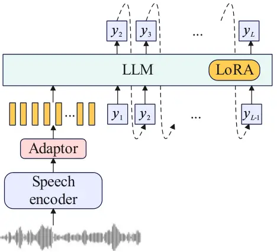
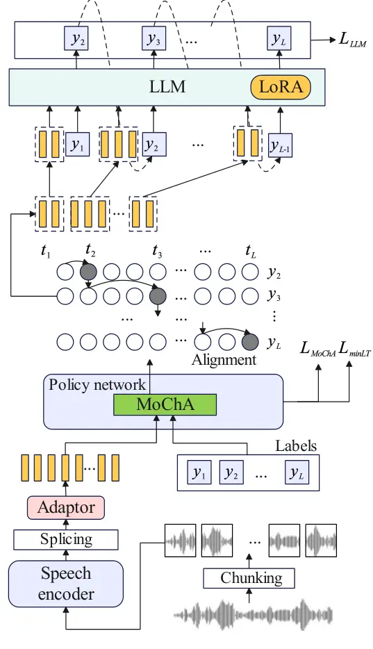

# Streaming speech recognition with decoder-only large language models and latency optimization

Genshun Wan    Wenhui Zhang    Jing-Xuan Zhang    Shifu Xiong   
Jianqing Gao    Zhongfu Ye ^(†)^(†)thanks: \$†\$Equal contribution.
\$⋆\$Corresponding author.  
This work was supported by the National Natural Science Foundation of
China (Grant No. 62401348), Fundamental Research Funds for the Central
Universities (Grant No. GK202406005), Young Talent Fund of Association
for Science and Technology in Shaanxi, China (Grant No. 20250126).

###### Abstract

Recent advances have demonstrated the potential of decoder-only large
language models (LLMs) for automatic speech recognition (ASR). However,
enabling streaming recognition within this framework remains a
challenge. In this work, we propose a novel streaming ASR approach that
integrates a read/write policy network with monotonic chunkwise
attention (MoChA) to dynamically segment speech embeddings. These
segments are interleaved with label sequences during training, enabling
seamless integration with the LLM. During inference, the audio stream is
buffered until the MoChA module triggers a read signal, at which point
the buffered segment together with the previous token is fed into the
LLM for the next token prediction. We also introduce a minimal-latency
training objective to guide the policy network toward accurate
segmentation boundaries. Furthermore, we adopt a joint training strategy
in which a non-streaming LLM-ASR model and our streaming model share
parameters. Experiments on the AISHELL-1 and AISHELL-2 Mandarin
benchmarks demonstrate that our method consistently outperforms recent
streaming ASR baselines, achieving character error rates of 5.1% and
5.5%, respectively. The latency optimization results in a 62.5%
reduction in average token generation delay with negligible impact on
recognition accuracy.

###### Index Terms: 

automatic speech recognition, streaming ASR, large language models,
latency

^(†)^(†)address: ¹University of Science and Technology of China, Hefei,
P.R.China  
²iFLYTEK Research, iFLYTEK Co., Ltd., Hefei, P.R.China  
³School of Artificial Intelligence and Computer Science, Shaanxi Normal
University, Xi’an, P.R. China  
gswan@mail.ustc.edu.cn, whzhang9@iflytek.com, jxzhanggg@snnu.edu.cn

## 1 Introduction

Streaming automatic speech recognition (ASR), also referred to as online
ASR, aims to transcribe speech incrementally in real time. It plays a
crucial role in practical applications such as live captioning for
online meetings and simultaneous translation. A large body of research
has explored streaming ASR within conventional end-to-end frameworks,
typically relying on unidirectional or blockwise encoders combined with
connectionist temporal classification (CTC) \[11\], recurrent neural
network transducers (RNN-T) \[12\], or Transformer transducers \[31\].
In parallel, researchers have also investigated attention-based
encoder–decoder (AED) architectures, which adopt label-synchronous
decoding. To enable streaming in AED models, several methods have been
proposed, including triggered attention \[22\], monotonic
attention \[24\], monotonic chunkwise attention (MoChA) \[9\], and its
subsequent extensions \[2, 16\].

With the rapid development of large language models (LLMs), leveraging
decoder-only architectures for speech recognition has recently attracted
considerable attention \[25, 7, 27, 10\]. While LLMs have shown
remarkable success in non-streaming ASR scenarios, extending them to
streaming recognition remains an open challenge. Tsunoo et al. \[26\]
proposed a blockwise streaming LLM-based ASR framework with CTC
compression, where the LLM predicts output tokens after each block. Jia
et al.\[17\] introduced SpeechLLM-XL, which processes speech and text
into fixed-size chunks using a CTC force-alignment model for streaming
recognition. BESTOW \[8\] combines GPT-style and T5-style architectures
and implements a wait-k strategy for streaming ASR. Chen et al. \[5\]
proposed text token insertion (TTI) and boundary token insertion (BTI)
models for LLM-based ASR with discrete speech tokens, where speech
boundaries are first extracted using a hybrid ASR system. Despite these
efforts, existing approaches often rely on CTC or hybrid models to
perform forced alignment between speech and text in advance. Such
cascaded designs complicate end-to-end optimization. Moreover, methods
that generate tokens only after fixed-size audio chunks face inherent
limitations in adaptively minimizing token-generation latency during
streaming recognition.

In this work, we propose a streaming LLM-based ASR method. Our method
employs a read/write policy network based on monotonic chunkwise
attention (MoChA), which is used for adaptively segmenting the incoming
speech before passing it to the LLM for text prediction. Specifically,
the MoChA module monitors speech embeddings frame by frame until a read
signal is triggered; at that point, the buffered embeddings and the
previous token are fed into the LLM to decode the next token. During
both training and inference, the audio and text embeddings are
interleaved to enable synchronized processing. For streaming audio
encoding, we adopt context-sensitive chunking \[18\] with a speech
encoder. The encoder outputs are projected through an adaptor and then
provided to the LLM as prompts. Owing to the modularized design of the
policy network for audio reading, we further apply a minimal latency
training (minLT) loss \[15\], which effectively reduces the latency of
streaming recognition. The LLM is trained jointly with the speech
encoder, policy network, and adaptor using low-rank adaptation
(LoRA) \[14\] in an end-to-end manner. We also propose parameter sharing
and joint optimization between the streaming and non-streaming ASR
models. This unified approach simplifies the training pipeline and
reduces the overall development cost of ASR systems.

We conduct experiments on two widely used Mandarin corpora, AISHELL-1
and AISHELL-2, as well as an in-house multi-domain dataset. The results
demonstrate that our method consistently outperforms recently proposed
baseline streaming LLM-ASR systems. Incorporating minimal latency
training (minLT) effectively reduces recognition delay while maintaining
competitive accuracy. Furthermore, ablation experiments confirm the
effectiveness of our unified streaming and non-streaming framework and
demonstrate the benefits of leveraging pretrained LLM parameters.

## 2 Related Works

Recent studies on LLM-based ASR focus on enhancing speech recognition by
leveraging LLMs’ in-context learning \[7\], world knowledge \[27\], and
instruction-following capabilities \[19\]. LLM-based ASR systems
typically adopt either discrete \[30, 6\] or continuous audio
representations \[7, 28, 10, 20\]. The discrete-token approach, such as
SpeechGPT \[30\], employs a speech tokenizer model \[13, 32\] to
quantize speech into discrete units, which are then merged with the LLM
vocabulary. In contrast, methods using continuous audio
embeddings \[10\] rely on a pretrained audio encoder, with its output
representations optionally compressed via strided CNNs \[10\], frame
pooling \[21\], Q-formers \[29\], or CTC-based compressors \[28\]. The
resulting audio embeddings are projected into the LLM word embedding
space to prompt transcription. Typically, continuous embeddings are
treated as soft prompts that are prepended to the label embeddings
before being fed into LLMs. Other works adopt a Flamingo-style \[1\]
integration, where audio features are injected through cross-attention
modules to fuse them with the input embeddings or hidden representations
of LLMs \[8, 23\]. Our work investigates streaming ASR under the widely
used configuration of LLM-based ASR, which employs continuous speech
embeddings as soft prompts.



Figure 1: Non-streaming LLM-based ASR architecture. $`y_{1}`$ and
$`y_{L}`$ represent the BOS and EOS token, respectively.

## 3 Non-streaming LLM-based ASR

The architecture of a non-streaming LLM-based ASR model \[10, 21\] is
illustrated in Figure 1. The model employs a speech encoder to transform
the input speech $`X`$ into speech representations. An adaptor module is
then used to project the audio representations into the word embedding
space of the LLM. Following prior work \[21\], we implement the adaptor
as a feed-forward network, which offers both simplicity and competitive
performance in ASR tasks. The converted audio prompt tokens $`h_{1:N}`$
are subsequently fed into a decoder-only LLM to generate the
corresponding transcription. Formally, the conditional probability of
the text sequence given the speech input is estimated as

```math
P(Y|X)=\prod_{i=2}^{L}P(y_{i}\mid h_{1:N},y_{1:i-1},\theta_{LLM}), \tag{1}
```

where $`\theta_{LLM}`$ denotes the parameters of the LLM.
$`y_{1},\dots,y_{L}`$ represents the label sequence, where $`y_{1}`$ and
$`y_{L}`$ are special begin of sentence (BOS) and end of sentence (EOS)
token. The pretrained LLM is commonly equipped with low-rank adaptation
(LoRA) \[14\] weights, enabling memory-efficient finetuning. During
training, given paired speech–text samples, the model is optimized using
a cross-entropy loss to maximize the log-likelihood of the target text
sequence. The loss is masked over the audio prompt tokens to ensure that
only the textual part contributes to optimization. At inference time,
the input speech is first fully encoded into hidden representations,
after which the LLM generates the output text autoregressively until an
EOS token is produced.



Figure 2: Our proposed streaming LLM-based ASR architecture. $`y_{1}`$
and $`y_{L}`$ represent the BOS and EOS token, respectively.

## 4 Proposed Method

### 4.1 Model architecture

For streaming speech encoding, we adopt a context-sensitive chunking
strategy following prior work \[18\]. The input audio is segmented into
chunks, each with an additional history context window. We avoid using
any future context to prevent additional encoding latency. During
training, these chunks are processed in parallel by a Conformer-based
speech encoder. After discarding the outputs corresponding to the
context frames, the remaining chunk-level representations are
concatenated to reconstruct the utterance-level audio features. The
resulting speech embeddings are then transformed by an adaptor module
into the representation space of the LLM. To further align speech and
text sequences, we introduce a read/write policy network that adaptively
segments the incoming speech stream. This policy enables dynamic
synchronization between audio input and text output, as illustrated in
Figure 2.

Our read/write policy network is built upon monotonic chunkwise
attention (MoChA) \[9\], operating with a lightweight decoder. At each
decoder timestep $`i`$, the attention mechanism begins scanning the
encoder outputs starting from the previously attended position
$`t_{i-1}`$. A selection probability $`p_{i,j}`$ is computed for each
encoder frame. Once this probability exceeds a predefined threshold at
frame $`j`$, the model triggers a stop-and-decode signal and sets
$`t_{i}=j`$. To enhance flexibility, MoChA applies an additional soft
chunkwise attention over the hard alignment, allowing the decoder to
aggregate information within a local region. This process generates an
encoder index sequence $`[t_{1},\dots,t_{L}]`$ that aligns synchronously
with the output tokens $`[y_{2},\dots,y_{L}]`$, where $`t_{1}=0`$.
Intuitively, each token $`y_{i}`$ for $`i=\{2,\dots,L\}`$ is decoded
based on the acoustic segment
$`h_{t_{i-1}+1:t_{i}}=[h_{t_{i-1}+1},\dots,h_{t_{i}}]`$, which contains
the minimal speech context necessary for predicting $`y_{i}`$.

As shown in Figure 2, the alignment produced by the policy network is
used to interleave segmented speech embeddings with the corresponding
text sequence:

```math
H_{y}=[h_{t_{1}+1:t_{2}},y_{1},h_{t_{2}+1:t_{3}},y_{2},\dots,h_{t_{L-1}+1:t_{L}},y_{L-1}]. \tag{2}
```

The resulting mixed sequence $`H_{y}`$ is then fed into the LLM during
training. Accordingly, the conditional probability of the text sequence
is modeled as:

```math
P(Y|X)=\prod_{i=2}^{L}P(y_{i}|h_{t_{1}+1:t_{2}},y_{1},\dots,h_{t_{i-1}+1:t_{i}},y_{i-1},\theta_{LLM}). \tag{3}
```

The cross-entropy loss $`L_{LLM}`$ is only computed at the final frame
of each segment, where the next token $`y_{i}`$ is predicted. Our policy
network and LLM are trained jointly, enabling dynamic refinement of the
segmentation boundaries as training progresses.

### 4.2 Training strategy

The LLM output is optimized with a standard cross-entropy loss
$`L_{LLM}`$. In addition, the small decoder within the policy network is
trained using a cross-entropy loss $`L_{MoChA}`$, with the same
vocabulary as the LLM. It is important to note that the policy network
output is only used during training and discarded at inference.

To further reduce latency, we incorporate a minimal latency training
(minLT) loss $`L_{minLT}`$. An HMM-based hybrid ASR system is first
employed to generate force alignments between speech and text. Following
prior work \[15\], we adopt a differentiable expected latency objective:

```math
L_{minLT}=\frac{1}{L}\sum_{i=2}^{L}\sum_{j=1}^{N}|j\alpha_{i,j}-b_{i}|, \tag{4}
```

where $`\alpha_{i,j}`$ is the marginalized alignment probability from
MoChA, and $`b_{i}`$ is the gold boundary from the forced alignment. The
overall training objective is thus:

```math
L_{total}=L_{LLM}+L_{MoChA}+\lambda L_{minLT}, \tag{5}
```

where $`\lambda`$ is a hyperparameter that balances the latency
regularization term.

For efficient fine-tuning of the LLM, we adopt LoRA parameters. The
speech encoder, adaptor, and policy network are trained jointly with
LoRA-based optimization from scratch. Moreover, we propose a joint
training scheme that integrates both streaming and non-streaming ASR.
The two models share all parameters but differ in the forward
computation path. During training, each batch is randomly assigned to
either the streaming or non-streaming mode, allowing the model to learn
both tasks simultaneously.

### 4.3 Inference

During inference, the input speech is first encoded and processed into
chunk-level representations. The policy network then scans these
representations until a selection signal is triggered. Once triggered,
the buffered audio segment together with the previous token is passed to
the LLM, which generates the next token. The predicted token is
subsequently fed back into both the LLM and the MoChA attention module
of the policy network. This process is repeated iteratively until the
LLM outputs an EOS token, completing the transcription.

## 5 Experiments

### 5.1 Experiments configuration

We evaluate our proposed method on three Mandarin datasets: AISHELL-1,
AISHELL-2, and a multi-domain in-house dataset (MD). AISHELL-1 \[4\]
consists of 165 hours of speech (120k/14k/7k utterances for training,
development, and testing, respectively). AISHELL-2¹¹ 1
[https://github.com/kaldi-asr/kaldi/blob/master/egs/aishell2](https://github.com/kaldi-asr/kaldi/blob/master/egs/aishell2)
provides 1,000 hours of training data, along with a development set of
2,500 utterances and a test set of 5,000 utterances. The MD dataset
contains roughly 1 hour of speech collected from multiple domains, such
as finance, education, and film, and is used exclusively for evaluation.

Our speech encoder is a 12-layer Conformer with 8 attention heads, a
hidden dimension of 512, and a feed-forward dimension of 2048. For
streaming encoding, we adopt a chunk size of 0.4s, with left context
windows of 1.6s. The adaptor is a feed-forward network with a hidden
dimension of 1024 and GELU activation. The LLM is initialized from
pretrained Qwen 2.5-1.5B, which consists of 28 Transformer blocks, 12
attention heads, and a hidden dimension of 1536. We retain the original
tokenizer and vocabulary to mitigate catastrophic forgetting compared
with reinitializing embeddings. Low-rank adaptation (LoRA) weights are
applied to the query, key, value, and output projection of the attention
modules, with a rank of 32 and scaling factor $`\alpha=64`$. The minimal
latency (minLT) loss weight $`\lambda`$ is set to 0.1.

For optimization, we use AdamW with a triangular cyclic learning rate
scheduler, which significantly accelerates convergence. The maximum and
minimum learning rates are set to $`1.5\times 10^{-4}`$ and 0,
respectively, with each cycle spanning 25k updates for a total of 100k
training steps. During inference, beam search with a beam size of 10 is
adopted.

### 5.2 Comparison with baselines

|                     |                 |           |         |
| ------------------- | --------------- | --------- | ------- |
| Method              | Model type      | Streaming | CER (%) |
| WeNet-U2 \[3\]      | encoder-decoder | ✗         | 5.0     |
| Baseline-non-stream | encoder-decoder | ✗         | 6.5     |
| Baseline-stream     | encoder-decoder | ✓         | 6.9     |
| BTI \[5\]           | decoder-only    | ✓         | 5.9     |
| BESTOW^(†) \[8\]    | decoder-only    | ✓         | 5.3     |
| _Proposed_          | decoder-only    | ✗         | 4.9     |
|                     |                 | ✓         | 5.1     |

Table 1: Character error rates of different methods on the testset of
AISHELL-1. ^(†)Our reproduction results.

|                     |                 |           |         |
| ------------------- | --------------- | --------- | ------- |
| Method              | Model type      | Streaming | CER (%) |
| WeNet-U2 \[3\]      | encoder-decoder | ✗         | 6.1     |
| Baseline-non-stream | encoder-decoder | ✗         | 5.9     |
| Baseline-stream     | encoder-decoder | ✓         | 6.1     |
| BTI \[5\]           | decoder-only    | ✓         | 7.2     |
| BESTOW^(†) \[8\]    | decoder-only    | ✓         | 5.6     |
| _Proposed_          | decoder-only    | ✗         | 5.0     |
|                     |                 | ✓         | 5.5     |

Table 2: Character error rates of different methods on the testset of
AISHELL-2. ^(†)Our reproduction results.

| Method              | Model type      | Streaming | CER (%) |
| ------------------- | --------------- | --------- | ------- |
| Baseline-non-stream | encoder-decoder | ✗         | 8.0     |
| Baseline-stream     | encoder-decoder | ✓         | 9.6     |
| _Proposed_          | decoder-only    | ✗         | 6.7     |
|                     |                 | ✓         | 7.6     |

Table 3: Character error rates of different methods on our in-house MD
dataset.

We construct two encoder–decoder based models as baselines: a
non-streaming model (Baseline-non-stream) and a streaming model
(Baseline-stream) that employs MoChA attention. Our proposed model is
trained on AISHELL-1 and AISHELL-2, and the results are reported in
Table 1 and Table 2, respectively. In addition, we evaluate the
AISHELL-2 trained model on our in-house MD dataset (Table 3). Unlike the
baselines, our method unifies the training of streaming and
non-streaming models, enabling evaluation in both modes. As shown in
Table 1–3, the proposed model achieves the best performance in the
non-streaming setting across all datasets, demonstrating the
effectiveness of leveraging LLMs for speech recognition. In the
streaming setting, the recognition accuracy slightly decreases compared
with the non-streaming mode, but our model consistently outperforms the
streaming baseline, confirming the effectiveness of the proposed
decoder-only LLM framework for streaming ASR.

### 5.3 Latency optimization

This section investigates the effectiveness of the minimal latency
(minLT) training loss in optimizing decoding latency. We compute the
latency for predicting the first (First), middle (Mid.), and last (Last)
tokens using force-alignment results, as shown in Table 4. We also
report the average latency (Avg.) during streaming decoding. The latency
is measured with frames, where one frame equals to 40ms. From Table 4,
we observe that introducing the minLT loss significantly reduces the
latency of token generation. Meanwhile, the CER increases only
marginally from 5.4% to 5.5%. These results demonstrate that our method
effectively enables streaming ASR with substantially lower token
generation latency while maintaining competitive recognition accuracy.

| Method               | CER (%) | Latency (frame) |      |      |      |
| -------------------- | ------- | --------------- | ---- | ---- | ---- |
|                      |         | First           | Mid. | Last | Avg. |
| Baseline-stream      | 6.1     | 19              | 15   | 7    | 15   |
| _Proposed_-w/o minLT | 5.4     | 18              | 15   | 9    | 16   |
| _Proposed_           | 5.5     | 10              | 5    | 2    | 6    |

Table 4: Character error rates and latency for streaming ASR on the
testset of AISHELL-2. Latency is measured in frames, where one frame
equals 40 ms.

| Method               | Non-streaming | Streaming |
| -------------------- | ------------- | --------- |
|                      | CER (%)       | CER (%)   |
| _Proposed_           | 5.0           | 5.5       |
|     -w/o joint-train | 5.1           | 5.6       |
|     -w/o LoRA        | 5.4           | 5.7       |
|     -w/o Qwen init.  | 6.5           | 7.2       |

Table 5: Charater error rates in ablation studies on the testset of
AISHELL-2.

### 5.4 Ablation studies

We conduct ablation studies to examine three key design choices: the
joint training of streaming and non-streaming models (w/o joint-train),
the use of LoRA for fine-tuning (w/o LoRA), and the initialization with
pretrained Qwen 2.5 parameters (w/o Qwen init.). The results are
summarized in Table 5. As shown in the table, training streaming and
non-streaming models separately yields performance comparable to our
unified training strategy. This indicates that a single unified model
can effectively support both modes without performance degradation,
thereby simplifying model development. When LoRA is removed and the
pretrained LLM is frozen (w/o LoRA), performance degrades, highlighting
the importance of efficient parameter adaptation. Furthermore, when the
LLM is randomly initialized instead of using pretrained parameters (w/o
Qwen init.), the performance drops significantly. These results confirm
the crucial role of leveraging pretrained LLM knowledge for ASR.

## 6 Conclusion

In this work, we proposed a streaming speech recognition method built on
a decoder-only large language model (LLM). A policy network based on
monotonic chunkwise attention adaptively segments the audio input, which
is then decoded by the LLM in a streaming fashion. This design enables
end-to-end training and latency optimization through a minimal latency
training strategy. We further introduced a joint training framework for
both streaming and non-streaming modes. Experimental results on
AISHELL-1, AISHELL-2, and an in-house multi-domain dataset demonstrate
that our method consistently outperforms recently proposed streaming
LLM-based ASR baselines. In addition, the results confirm the
effectiveness of latency optimization and the advantages of unifying
streaming and non-streaming models within a single framework.

## References

- \[1\] J. Alayrac, J. Donahue, P. Luc, and et al. (2022) Flamingo: a
  visual language model for few-shot learning. NeurIPS 35,
  pp. 23716–23736. Cited by: §2.
- \[2\] N. Arivazhagan, C. Cherry, W. Macherey, and et al. (2019)
  Monotonic infinite lookback attention for simultaneous machine
  translation. In ACL, pp. 1313–1323. Cited by: §1.
- \[3\] Binbin Zhang and Di Wu and Zhendong Peng and Xingchen Song and
  Zhuoyuan Yao and Hang Lv and Lei Xie and Chao Yang and Fuping Pan and
  Jianwei Niu (2022) WeNet 2.0: More Productive End-to-End Speech
  Recognition Toolkit. In INTERSPEECH, pp. 1661–1665. Cited by: Table 1,
  Table 2.
- \[4\] H. Bu, J. Du, X. Na, B. Wu, and H. Zheng (2017) AISHELL-1: an
  open-source mandarin speech corpus and a speech recognition baseline.
  In O-COCOSDA, pp. 1–5. Cited by: §5.1.
- \[5\] P. Chen, S. Sun, C. Shan, Q. Yang, and L. Xie (2024) Streaming
  decoder-only automatic speech recognition with discrete speech units:
  a pilot study. In INTERSPEECH, pp. 4468–4472. Cited by: §1, Table 1,
  Table 2.
- \[6\] Q. Chen, W. Wang, Q. Zhang, and et al. (2024) Loss masking is
  not needed in decoder-only transformer for discrete-token-based ASR.
  In ICASSP, pp. 11056–11060. Cited by: §2.
- \[7\] Z. Chen, H. Huang, A. Andrusenko, and et al. (2024) SALM:
  speech-augmented language model with in-context learning for speech
  recognition and translation. In ICASSP, Vol. , pp. 13521–13525. Cited
  by: §1, §2.
- \[8\] Z. Chen, H. Huang, O. Hrinchuk, and et al. (2024) BESTOW:
  efficient and streamable speech language model with the best of two
  worlds in GPT and T5. In SLT, Vol. , pp. 147–154. Cited by: §1, §2,
  Table 1, Table 2.
- \[9\] C. Chiu and C. Raffel (2018) Monotonic chunkwise attention. In
  ICLR, Cited by: §1, §4.1.
- \[10\] Y. Fathullah, C. Wu, E. Lakomkin, and et al. (2024) Prompting
  large language models with speech recognition abilities. In ICASSP,
  pp. 13351–13355. Cited by: §1, §2, §3.
- \[11\] A. Graves, S. Fernández, F. Gomez, and J. Schmidhuber (2006)
  Connectionist temporal classification: labelling unsegmented sequence
  data with recurrent neural networks. In ICML, pp. 369–376. Cited by:
  §1.
- \[12\] A. Graves, A. Mohamed, and G. Hinton (2013) Speech recognition
  with deep recurrent neural networks. In ICASSP, Vol. , pp. 6645–6649.
  Cited by: §1.
- \[13\] W. Hsu, B. Bolte, Y. Tsai, and et al. (2021) HuBERT:
  self-supervised speech representation learning by masked prediction of
  hidden units. IEEE/ACM transactions on audio, speech, and language
  processing 29, pp. 3451–3460. Cited by: §2.
- \[14\] E. J. Hu, Y. Shen, P. Wallis, and et al. (2022) Lora: low-rank
  adaptation of large language models.. ICLR 1 (2), pp. 3. Cited by: §1,
  §3.
- \[15\] H. Inaguma, Y. Gaur, L. Lu, J. Li, and Y. Gong (2020) Minimum
  latency training strategies for streaming sequence-to-sequence ASR. In
  ICASSP, pp. 6064–6068. Cited by: §1, §4.2.
- \[16\] H. Inaguma, M. Mimura, and T. Kawahara (2020) Enhancing
  monotonic multihead attention for streaming ASR. In INTERSPEECH, Vol.
  , pp. 2137–2141. Cited by: §1.
- \[17\] J. Jia, G. Keren, W. Zhou, and et al. (2025) Efficient
  streaming LLM for speech recognition. In ICASSP, Vol. , pp. 1–5. Cited
  by: §1.
- \[18\] Keyu An and Huahuan Zheng and Zhijian Ou and Hongyu Xiang and
  Ke Ding and Guanglu Wan (2022) CUSIDE: chunking, simulating future
  context and decoding for streaming ASR. In INTERSPEECH, pp. 2103–2107.
  Cited by: §1, §4.1.
- \[19\] C. J. Lai, Z. Lu, L. Cao, and R. Pang (2024)
  Instruction-following speech recognition. In NeurIPS, External Links:
  [Link](https://arxiv.org/abs/2309.09843) Cited by: §2.
- \[20\] E. Lakomkin, C. Wu, Y. Fathullah, and et al. (2024) End-to-end
  speech recognition contextualization with large language models. In
  ICASSP, Vol. , pp. 12406–12410. Cited by: §2.
- \[21\] Z. Ma, G. Yang, Y. Yang, and et al. (2024) An embarrassingly
  simple approach for LLM with strong ASR capacity. arXiv preprint
  arXiv:2402.08846. Cited by: §2, §3.
- \[22\] N. Moritz, T. Hori, and J. L. Roux (2019) Triggered attention
  for end-to-end speech recognition. In ICASSP, Vol. , pp. 5666–5670.
  Cited by: §1.
- \[23\] S. Radhakrishnan, C. H. Yang, S. A. Khan, and et al. (2023)
  Whispering LLaMA: a cross-modal generative error correction framework
  for speech recognition. In EMNLP, pp. 10007–10016. Cited by: §2.
- \[24\] C. Raffel, M. Luong, P. J. Liu, and et al. (2017) Online and
  linear-time attention by enforcing monotonic alignments. In ICML,
  pp. 2837–2846. Cited by: §1.
- \[25\] G. Sun, W. Yu, C. Tang, and et al. (2024) Video-SALMONN:
  speech-enhanced audio-visual large language models. In ICML, Cited by:
  §1.
- \[26\] E. Tsunoo, H. Futami, Y. Kashiwagi, S. Arora, and S.
  Watanabe (2024) Decoder-only architecture for streaming end-to-end
  speech recognition. In INTERSPEECH, pp. 4463–4467. Cited by: §1.
- \[27\] M. Wang, Y. Wang, T. Vu, E. Shareghi, and R. Haf (2024)
  Exploring the potential of multimodal LLM with knowledge-intensive
  multimodal ASR. In EMNLP, pp. 13274–13288. Cited by: §1, §2.
- \[28\] J. Wu, Y. Gaur, Z. Chen, and et al. (2023) On decoder-only
  architecture for speech-to-text and large language model integration.
  In ASRU, pp. 1–8. Cited by: §2.
- \[29\] W. Yu, C. Tang, G. Sun, and et al. (2024) Connecting speech
  encoder and large language model for ASR. In ICASSP, Vol. ,
  pp. 12637–12641. Cited by: §2.
- \[30\] D. Zhang, S. Li, X. Zhang, and et al. (2023) SpeechGPT:
  empowering large language models with intrinsic cross-modal
  conversational abilities. In EMNLP, pp. 15757–15773. Cited by: §2.
- \[31\] Q. Zhang, H. Lu, H. Sak, A. Tripathi, and et al. (2020)
  Transformer transducer: a streamable speech recognition model with
  transformer encoders and RNN-T loss. In ICASSP, Vol. , pp. 7829–7833.
  Cited by: §1.
- \[32\] X. Zhang, D. Zhang, S. Li, Y. Zhou, and X. Qiu (2024)
  SpeechTokenizer: unified speech tokenizer for speech language models.
  In ICLR, Cited by: §2.
