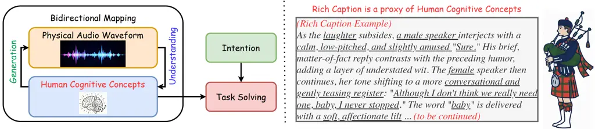
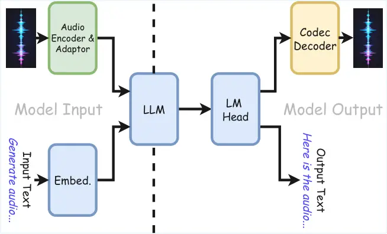
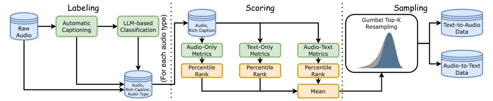
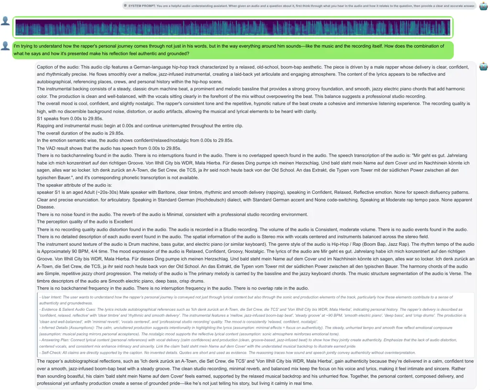
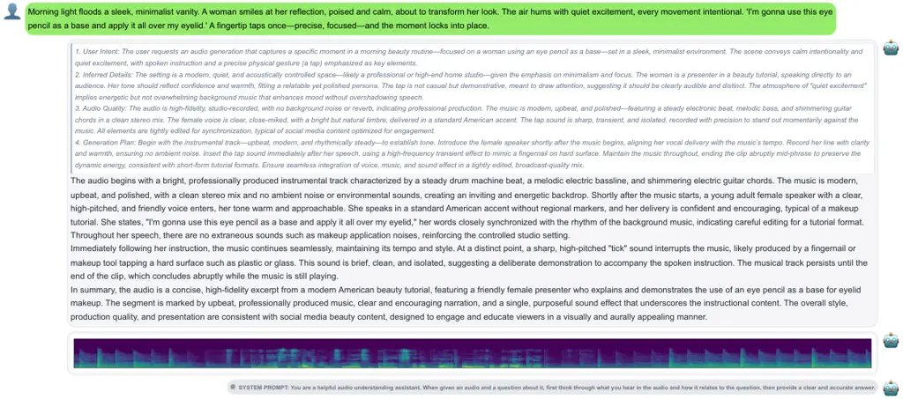

# ![[Uncaptioned image]](arxiv-2602-05220v4--a8022d2b1935.figures/figure-1.webp) Bagpiper: Solving Open-Ended Audio Tasks spacee via Rich Captions

Jinchuan Tian ^(†)^(†)thanks: Equal contribution.
Email: [jinchuat@andrew.cmu.edu](mailto:)    Haoran Wang¹¹footnotemark:
1    Bo-Hao Su¹¹footnotemark: 1    Chien-yu Huang¹¹footnotemark: 1   
Qingzheng Wang¹¹footnotemark: 1    Jiatong Shi Affiliation: Language
Technologies Institute, Carnegie Mellon University    William Chen
Affiliation: Language Technologies Institute, Carnegie Mellon University
   Xun Gong Affiliation: Language Technologies Institute, Carnegie
Mellon University    Siddhant Arora Affiliation: Language Technologies
Institute, Carnegie Mellon University    Chin-Jou Li
Affiliation: Language Technologies Institute, Carnegie Mellon University
   Masao Someki Affiliation: Language Technologies Institute, Carnegie
Mellon University    Takashi Maekaku Affiliation: LY Corporation   
Keita Goto Affiliation: LY Corporation    Yusuke Shinohara
Affiliation: LY Corporation    Jin Sakuma Affiliation: LY Corporation   
Chao-Han Huck Yang Affiliation: NVIDIA    Shinji Watanabe
Affiliation: Language Technologies Institute, Carnegie Mellon University

###### Abstract

Current audio foundation models typically rely on rigid, task-specific
supervision (e.g., speech recognition), addressing isolated factors of
audio rather than the whole. In contrast, human processes audio
holistically, seamlessly bridging raw audio waveform with abstract
cognitive concepts (e.g., all perception details of audio events) to
execute complex tasks. Grounded in this philosophy, we introduce
Bagpiper, an 8B audio foundation model that interprets physical audio
via rich captions, i.e., comprehensive natural language descriptions
that encapsulate the critical cognitive concepts inherent in the audio.
By pre-training on a massive corpus of 600B tokens, the model
establishes a robust bidirectional mapping between raw audio and this
high-level conceptual space. During fine-tuning, Bagpiper adopts a
caption-then-process workflow, simulating an intermediate cognitive
reasoning step to solve diverse tasks without knowing prior
task-specific practice. Experimentally, Bagpiper achieves universal
generation that can uniformly generate speech, sound effects, music, and
their arbitrary combinations. It also maintains comparable performance
with the 7B Qwen-2.5-Omni for audio understanding. To the best of our
knowledge, Bagpiper is among the first works that achieve open-ended
audio understanding and generation on speech, sound, and music. Model,
data, and code will be released at [Bagpiper Home
Page](https://bagpiper-cmu.github.io/).

|     |
| --- |
|     |

## 1 Introduction

Figure 1: (Left) When solving an audio task, Bagpiper always
materializes human cognitive concepts for the real physical audio
waveforms. It produces a subsequent text answer (understanding) or audio
clip (generation) based on those cognitive concepts. (Right) In this
work, we take rich caption as the proxy of human cognitive concepts.

Current audio foundation models are suboptimal for solving open-ended
user requests. These models mainly rely on massive multi-tasking (Goel
et al., 2025; Yang et al., 2023; Wang et al., 2024; Abouelenin et al.,
2025; Valle et al., 2025; Radford et al., 2023; Peng et al., 2024; Maiti
et al., 2024), where each task only addresses an isolated aspect of the
audio. Additionally, the audio modeling (especially the generation
modeling) (Du et al., 2025; Hung et al., 2024; Mousavi et al., 2025; Shi
et al., 2024) often has a clear split of speech, music, and sound
effects. The lack of a holistic concept at the task- and category-level
creates a fundamental bottleneck for scalability: addressing the wide
spectrum of audio tasks via exhaustive, domain-specific engineering is
unsustainable. More importantly, it generalizes poorly to the user
requests that are naturally compositional, flexible, and are thus not
well defined. Thus, we argue for a paradigm shift toward a universal
modeling philosophy that unifies all audio tasks and types within a
single modeling paradigm.

Human intelligence perceives (understands) and produces (generates)
audio in a holistic, open-ended, and multi-perspective
manner (Galantucci et al., 2006), seamlessly bridging distinct
categories like speech, music, and sound effects (Bregman, 1990; Patel,
2008). We propose that audio in this context is fundamentally twofold,
defined by both the physical audio signals and the cognitive concepts
they evoke in the human mind, such as text transcription, emotion,
prosody, sound events, and music genres. Human intelligence processes
audio by bridging these two planes: it converts audio signals into
cognitive concepts to understand the world and, conversely, formulates
responses derived from these concepts (O’Callaghan, 2009). In this work,
we identify the rich caption (Ma et al., 2025b; Tang et al., 2025;
Fiscus et al., 2006; Lu et al., 2026) as an ideal proxy for this wide
range of human cognitive concepts. As illustrated in Figure 1, rich
captions provide lengthy, comprehensive natural language descriptions
that cover the critical cognitive concepts inherent in an audio signal,
offering sufficient information to support diverse downstream open-ended
task solving. Guided by this philosophy, the core objective of our audio
foundation model, Bagpiper, is to uniformly solve audio tasks by
establishing and leveraging a broad, holistic, and robust bidirectional
mapping between physical audio signals and these cognitive concepts
represented by rich captions. In implementation, we build this mapping
during pre-training using a massive, curated dataset of 600B tokens,
comprising audio-rich caption pairs that span speech, music, and sound
effects. We then proceed to a fine-tuning stage where we simulate
diverse open-ended request-response pairs with thinking traces, teaching
the model how to infer appropriate answers from predicted rich
captions (understanding) and how to translate user requests into rich
captions as blueprints before physically producing audio (generation).
Throughout this development pipeline, we incorporate no prior knowledge
of specific audio tasks or types; nonetheless, the model demonstrates
the capability to solve a diverse array of open-ended audio tasks.

Experimentally, we first validate the efficacy of our pre-training
Bagpiper-Base, demonstrating that physical audio and rich captions can
be translated bidirectionally with high fidelity across a suite of
probing tasks. Regarding generative tasks, Bagpiper significantly
outperforms prior state-of-the-art text-to-audio models, TangoFlux (Hung
et al., 2024) and AudioLDM2-Large (Liu et al., 2024), in an extensive
A/B testing on complex generation prompts. Beyond these quantitative
metrics, we observe emergent model behaviors that transcend the scope of
current evaluation protocols; we invite readers to explore these
qualitative examples on [Bagpiper Home
Page](https://bagpiper-cmu.github.io/). In terms of open-ended
understanding, our Bagpiper achieves comparable capabilities with its 7B
competitor Qwen-2.5-Omni (Xu et al., 2025) and AudioFlamingo3 (Goel et
al., 2025), with competitive results on both AIR-Bench (Yang et al., 2024) and AudioBench (Wang et al., 2025). To facilitate reproducibility
and future research, we commit to releasing our code, data, and trained
models.

## 2 Bagpiper

### 2.1 Architecture

Like Tian et al. (2025b), our Bagpiper is designed to process any
interleaved audio and text sequences within a unified framework. As
shown in Figure 2, the backbone is initialized with the decoder-only
LLM, i.e., Qwen3-8B-Base (Yang et al., 2025). We adopt the established
Encoder-Adaptor-LLM architecture (Liu et al., 2023; Goel et al., 2025)
for audio input, which connects a pre-trained acoustic encoder to the
LLM backbone via an MLP layer.

Figure 2: Bagpiper architecture

For audio output, the model auto-regressively predicts multi-stream
audio codec tokens, which are then detokenized into audio waveforms.¹¹ 1
The audio encoder and codec model are adopted from Qwen3-Omni-30B-A3B
(Qwen Team, 2025) and X-Codec (Ye et al., 2025), respectively. Each
audio is represented by 8 tokens, and the audio token sequences are
delay-interleaved Copet et al. (2024). This design enables the
consistent and seamless processing of multimodal inputs and outputs. For
all training stages, we apply standard next-token prediction loss on
target tokens only. During inference, we have separate inference
configurations for text and audio generation. We additionally apply
classifier-free guidance (Ho and Salimans, 2022; Hussain et al., 2025)
for all audio generation tasks. No noticeable performance change is
observed by varying the inference configurations. Architecture is not
our major novelty. Detailed configurations are in the tables 9 and 10.

### 2.2 Pre-Training

The central premise of Bagpiper pre-training is that physical audio
signals and cognitive concepts (i.e., rich captions) can be mutually
translated with high fidelity. To realize this, our pre-training is to
construct a robust bidirectional mapping between audio signals and rich
captions via massive-scale learning. Additionally, it also requires
preserving the text processing capabilities of the underlying LLM to
support downstream complex task solving.

#### 2.2.1 Data Curation

Collection and Labeling. To ensure universal audio processing
capabilities, we aggregate a massive collection of publicly available
audio data covering speech, music, and sound effects (full list in
Appendix E.1). Notably, this mixture features diverse in-the-wild
distributions, naturally encompassing complex compositions such as
speech with background noise or musical accompaniment. We segment all
audio into clips of up to 30 seconds. As in Fig.3, we generate a rich
caption for every clip using the Qwen3-Omni-30B-A3B-Captioner (Qwen
Team, 2025). This process yields a total of 422M raw audio-caption
pairs.

Audio Taxonomy Classification. As distinct audio categories (speech,
music, and sound effects) exhibit divergent quality distributions and
severe data imbalances, a stratified processing approach is used to keep
a rough balance in the curated pre-training mixture.²² 2 E.g., we
observe the average aesthetic score of music is much higher than sound
effects on average. While audio classification directly from waveforms
has been studied extensively (Gemmeke et al., 2017; Kong et al., 2020;
Gong et al., 2021; Chen et al., 2023b), categorizing audio via rich
captions remains underexplored, and we find it empirically effective. We
explicitly categorize all audio clips into speech, music, or sound
effects by prompting Qwen3-32B to analyze their rich descriptions. This
text-based strategy proves highly effective, achieving a 93% accuracy on
the MMAU dataset (Sakshi et al., 2024) when benchmarked against the
original ground-truth category labels.

Stratified Data Filtering and Sampling. For each audio category, we
score the audio-text pairs along three dimensions: (1) Audio-Only: We
use UTMOS (Saeki et al., 2022; Shi et al., 2025) for speech and
audiobox-aesthetics (Tjandra et al., 2025) for music and sound effects.
(2) Text-Only: We apply heuristic filters combined with an
LLM-as-a-judge approach (Zheng et al., 2023), evaluating three specific
rubrics (Peng et al., 2025a). (3) Audio-text alignment: We compute the
semantic similarity between the audio and caption using a CLAP-based
model³³ 3 Due to the context length limit of the CLAP model, we
summarize them into short captions. (Wu\* et al., 2023). To unify these
diverse metrics, we compute the percentile rank of each sample for every
dimension within its specific category and average these percentiles to
form a final quality score. Next, to maintain data diversity while
removing low-quality outliers, we employ a Gumbel Top-$`k`$ resampling
trick (Kool et al., 2019) to perform a soft truncation of the tail
distribution. Finally, we perform the text-based de-duplication by
MinHash (Broder, 1997) using a setup as in Li et al. (2024). We observed
that the generated rich captions possessed high natural diversity,
resulting in the removal of only $`\sim`$1M pairs during de-duplication.
Further details are provided in Appendix E.2.

Text-Only Corpus. To preserve the text capability of the base LLM, we
incorporate high-quality text-only corpora into the pre-training
mixture. We specifically utilize datasets from Bercovich et al. (2025)
and the mid-training data of Olmo et al. (2025), totaling 150B tokens.
These datasets are yielded from harsh curation in prior works, so we
skip further curation on text-only data.

Training Budget and Scheduling. Like in (Maiti et al., 2024; Olmo et
al., 2025), we first allocate a total training budget of 600B tokens.⁴⁴
4 A token represents either a text subword or an audio frame. Following
empirical observations from Tian et al. (2025b), we adopt a data ratio
of 300B (Text-to-Audio) : 150B (Audio-to-Text) : 150B (Text-only). This
distribution serves two purposes: first, Tian et al. (2025b) finds that
audio generation (Text-to-Audio) typically requires a longer training
horizon to converge than understanding; second, it perfectly balances
the output modalities, ensuring a 1:1 ratio between text-output and
audio-output supervision. Within the text-to-audio and audio-to-text
tasks, we evenly split the budget across speech, music, and sound
effects, which effectively up-samples the music and sound effects data
by a factor of 3–4$`\times`$ to counteract the natural scarcity of these
domains compared to speech.

Figure 3: Pre-training data labeling and filtering workflow.

#### 2.2.2 Training Strategy

We implement a two-stage training protocol following Wu et al. (2025).
Stage 1 begins with an adapter and embedding warm-up stage (2k steps),
where the audio encoder and LLM backbone are frozen; only the embeddings
and the adaptor are optimized. During this stage, we employ a
substantially larger batch size and learning rate compared to the
subsequent stage to rapidly align the modalities. Following this, stage
2 launches the full pre-training stage. Here, we unfreeze the relevant
parameters and apply a linear learning rate warm-up followed by cosine
decay. The loss of audio tokens is observed to be much higher than that
of text tokens on average. Consequently, we use sequence packing (Krell
et al., 2021) that carefully fuses samples from both sides to reduce the
training loss fluctuation. Detailed training hyperparameters are
provided in table 9. We refer to the resulting model as Bagpiper-Base.

### 2.3 Supervised Fine-Tuning (SFT)

In this SFT stage, we evolve Bagpiper-Base into a generalist problem
solver. Consistent with our goal of overcoming the limitations of
isolated supervision, we deliberately eschew traditional categorical
labels during data simulation. Instead, we condition Bagpiper to treat
rich captions as a universal semantic interface. By grounding the
model’s reasoning process entirely in these natural language
descriptions, we enable it to handle the boundless variety of open-ended
tasks described in our introduction.

Figure 4: SFT data simulation pipeline §2.3.2 for open-ended audio task
solving. Blue means model input; green means model output. Dashed boxes
are simulated by prompting LLMs. Components with \* are included in
training sequences.

#### 2.3.1 Data Collection and Gemini Captioning

We curate diverse and high-quality audio-caption pairs for both audio
understanding and generation. For audio understanding, we sample
$`\approx`$271k examples from a series of open datasets. We use our
manual prompt to query Gemini-3-Flash/Gemini-2.5-Pro to obtain the rich
captions, which are JSON-structured and more suitable for downstream
data simulation (detailed distributions can be found in Appendix E.1).
For audio generation, we continue our strategy of Gumbel Top-$`k`$
sampling, but with a much lower temperature to select the highest
quality data in our pre-training. We end up with 1M samples. Our audio
generation data relies on the pre-training captions rather than
Gemini-generated ones, preventing data leakage as Gemini is later
employed as the evaluator in §3.3.2.

#### 2.3.2 Fine-Tuning Data Construction

Pipeline: Caption-then-Process. Our data simulation always starts from
audio-caption pairs, and uniformly enforces an explicit “thinking”
pattern. For audio understanding, we adopt the template: \[Audio, User
Request, Rich Caption, CoT, Answer\]. As shown on the left of Figure 4,
we prompt a strong text LLM to first synthesize a valid (User Request,
Answer) pair given the ground-truth rich caption, and subsequently
generate a Chain-of-Thought (CoT) trace (Wei et al., 2022) that reasons
from cognitive concepts (i.e., rich captions) to the expected answer.
For audio generation, we adopt the template: \[User Request, CoT, Rich
Caption, Audio\]. As shown in the right of Figure 4, the simulation
process is similar: the LLM generates a creative User Request based on
the rich caption, followed by a CoT trace that plans the audio content
before outputting the caption.

Diversification. To cover more diversity of user requests, we employ
targeted prompting strategies using strong open-source text LLMs.⁵⁵ 5
Specifically Qwen3-235B-A22B-Instruct-2507-FP8 and GPT-OSS-120B. For
understanding, we sample from an attribute list of 108 attributes⁶⁶ 6 We
randomly sample 10k pre-training captions, ask Gemini-3-Pro to analyze
them, and obtain this attribute list (App. E.10). to construct complex,
multi-faceted inquiries. The LLMs are instructed to generate complex but
reasonable requests with self-selected attributes. Our simulation also
includes the cases where multiple related attributes are queried
together to form compositional requests (Acuna et al., 2025). For
generation, we adopt a “Persona-based” prompting strategy, selecting
from 12 distinct user personas (Ge et al., 2024) to generate varying
generation requests. Besides the user requests that explicitly mention
the exact audio events and details, we also generate the imaginary user
requests that describe a feeling, an atmosphere, or a scene, which
potentially boost the model’s creativity in audio generation (Tian et
al., 2025b).

Automatic Quality Assurance. To ensure high data quality, we implement a
rigorous filtering pipeline utilizing the LLM-as-judge framework (Zheng
et al., 2023) for descriptive quality estimation (Chen et al., 2023a).
We employ Qwen3-235B-A22B-Instruct-2507-FP8 to evaluate each sample on a
5-point scale, assessing five key dimensions: user request diversity,
request-response alignment, thinking trace coherence, rich caption
quality, and overall training value. By retaining only those samples
with an average score exceeding 3, we distill our simulated data into a
final set of $`845`$k understanding samples and 1.47M generation
samples. We validate this cutoff in App. E.7. Note that multiple
requests will be generated for each audio-caption pair before this
filtering.⁷⁷ 7 Within each of the understanding and generation tracks,
the evaluation judge participated in neither caption generation nor SFT
data simulation. See App. E.6 for details.

## 3 Experiments

### 3.1 Pre-Training Evaluation Setup

The Bagpiper-Base is not for real task-solving. Instead, our evaluation
design for this pre-trained model is to quantify how much critical
cognitive concepts are preserved in the rich captions that can support
downstream task solving. We mainly rely on LibriSpeech Test-Clean
(Panayotov et al., 2015) for local, phonetic-level capability and
MMAU-Mini (Sakshi et al., 2024) for other audio-related capability in
general, which covers speech, music, and sound effects.

Audio Understanding (Information Retention).

Following Ma et al. (2025b), to quantify how much cognitive concepts are
preserved for downstream understanding, we feed the generated caption
into Gemini-3-Flash and request it to perform audio tasks solely based
on the text, without access to the original audio. We report the Word
Error Rate (WER) on LibriSpeech Test-Clean and question-answering
accuracy on MMAU-Mini. High performance here indicates that the captions
generated from audio successfully encapsulate the essential semantics of
the audio clips for understanding.

Audio Generation (Reconstruction Fidelity). We evaluate whether the
pre-trained model can physically produce the audio waveform with the
audio caption generated by the original captioner (Qwen Team, 2025). We
generate audio conditioned solely on the rich captions and compare the
output to the ground truth audio. We report WER on LibriSpeech
Test-Clean to assess phonetic preservation.⁸⁸ 8 We only test the
examples whose rich captions contain the fully correct text
transcriptions, which is around 60% of the volume of the whole test set.
For general audio, we employ a model-based metric on MMAU-Mini: We use
Shi et al. (2025) to compute the FAD (Kilgour et al., 2018) and
audio-audio CLAP similarity Wu\* et al. (2023) between the reference and
generated audio, and average the number across all three categories.

Cycle Consistency. Given the unified understanding-generation nature of
our model, isolated evaluation is often insufficient. We therefore
follow Hori et al. (2019) to conduct a cycle consistency test to verify
the robustness of the bidirectional mapping, which is similar to
evaluating an auto-encoder. We perform consecutive Audio $`\to`$ Rich
Caption $`\to`$ Audio (reconstruction) and Rich Caption $`\to`$ Audio
$`\to`$ Rich Caption (grounding) loops using Bagpiper-Base. We measure
the cosine similarity between the input and the final output using
Qwen3-Embedding-8B (Yang et al., 2025) for the text domain (Text Sim.)
and the CLAP audio encoder (Wu\* et al., 2023) for the audio domain
(Audio Sim.). High similarity confirms minimal information loss through
mutual translation between the physical audio signals and cognitive
concepts.

Text Capability Preservation. To verify that incorporating audio
objectives does not degrade language reasoning, we evaluate
Bagpiper-Base on standard text benchmarks: MMLU-Redux (world knowledge)
(Gema et al., 2025), GPQA-Diamond (general reasoning) (Rein et al.,
2024), and GSM8K (mathematical reasoning) (Cobbe et al., 2021).

### 3.2 Pre-Training Results and Analysis

| Model                | Param.  | WER ($`\downarrow`$) | MMAU-Mini ($`\uparrow`$) |
| -------------------- | ------- | -------------------- | ------------------------ |
| Qwen3-Captioner      | 30B-A3B | 5.5                  | 71.1                     |
| Bagpiper-Base (ours) | 8B      | 5.0                  | 69.0                     |

Table 1: Understanding probing results for Bagpiper-Base. Both models
are NOT for real task solving; the task is solved by an external LLM
using the generated rich captions.

In audio understanding, our objective is to match the performance of our
teacher model. As shown in Table 1, Bagpiper-Base (8B) achieves
performance parity with the Qwen3-Captioner (30B) topline (Qwen Team,
2025). This comparison is a distillation-parity sanity check rather than
evidence that Bagpiper-Base exceeds its caption teacher. This result
validates the effectiveness of our distillation efforts from the
captioner, demonstrating that our 8B backbone successfully learns to
extract comprehensive cognitive details comparable to much larger
models. Also, we find that both models show considerable hallucination
on the ASR task (5.5% and 5.0%). After manually checking, the
hallucination is almost all from the captioner models, not the probing
LLM. This is further discussed in table 5. Overall, these probing
results conclude that physical audio signals can be effectively
compressed into cognitive concepts by Bagpiper-Base.

|                      |        | Text-to-Speech       | Text-to-Audio        |                     |
| -------------------- | ------ | -------------------- | -------------------- | ------------------- |
| Model                | Param. | WER ($`\downarrow`$) | FAD ($`\downarrow`$) | CLAP ($`\uparrow`$) |
| OpusLM (TTS)         | 8B     | 4.0                  | \-                   | \-                  |
| CosyVoice3 (TTS)     | 0.5B   | 2.9                  | \-                   | \-                  |
| TangoFlux (TTA)      | 0.5B   | \-                   | 5.15                 | 0.50                |
| AudioLDM2-L (TTA)    | 1.5B   | \-                   | 3.79                 | 0.48                |
| Bagpiper-Base (ours) | 8B     | 1.8                  | 2.98                 | 0.55                |

Table 2: Generation probing results. Our model is prompted by rich
captions, while others are prompted by text transcriptions or short
captions.

For audio generation, to the best of our knowledge, there are no rich
caption-to-audio baselines to compare with. Thus, we compare our
Bagpiper-Base with specialized state-of-the-art baselines in speech
(TTS; OpusLM (Tian et al., 2025a) and CosyVoice3 (Du et al., 2025)) and
sound/music (TTA; TangoFlux (Hung et al., 2024) and AudioLDM2-Large (Liu
et al., 2024)), respectively. Note that these baselines are limited to
their standard input format (transcripts for TTS; short captions for
TTA), whereas Bagpiper-Base utilizes the full rich captions. Table 2
shows that Bagpiper-Base achieves WER comparable to dedicated TTS
systems and outperforms TTA baselines in fidelity. This suggests that
cognitive concepts in rich captions can be accurately grounded back into
physical audio signals with Bagpiper-Base.

| Audio-to-Text        | Text-to-Audio | Audio-Sim. ($`\uparrow`$) | Text-Sim. ($`\uparrow`$) |
| -------------------- | ------------- | ------------------------- | ------------------------ |
| Qwen3-Omni           | AudioLDM2-L   | 0.445                     | 0.465                    |
| Qwen3-Omni           | TangoFlux     | 0.361                     | 0.486                    |
| AudioFlamingo3       | AudioLDM2-L   | 0.457                     | 0.515                    |
| AudioFlamingo3       | TangoFlux     | 0.471                     | 0.570                    |
| Bagpiper-Base (ours) |               | 0.502                     | 0.840                    |

Table 3: Cycle consistency probing results

Subsequently, on the cycle consistency test (Table 3), we compare
Bagpiper-Base against pipelined combinations of different understanding
(Qwen Team, 2025; Goel et al., 2025) and generation models (Hung et al.,
2024; Liu et al., 2024). Since baseline generation models cannot process
the lengthy rich captions, we summarize captions only for these
baselines to fit their context windows; Bagpiper-Base receives the full
captions. Bagpiper-Base significantly outperforms these composite
pipelines in both audio and text similarity, confirming that a unified
model establishes a far more coherent bidirectional mapping than loosely
coupled systems.

|                      | MMLU-Redux ($`\uparrow`$) | GPQA-Diamond ($`\uparrow`$) | GSM8K ($`\uparrow`$) |
| -------------------- | ------------------------- | --------------------------- | -------------------- |
| Qwen3-8B-Base        | 76.1                      | 39.3                        | 89.8                 |
| Bagpiper-Base (ours) | 74.3                      | 41.9                        | 88.2                 |

Table 4: Text capability probing results

As demonstrated in Table 4, Bagpiper-Base maintains close performance to
its initialization checkpoint (Qwen3-8B-Base) across knowledge, general
reasoning, and math benchmarks. Preserving this strong textual
foundation is not merely for maintenance; it directly powers our
open-ended task solving during downstream fine-tuning. By retaining the
model’s inherent logic and world knowledge, Bagpiper can leverage
complex text-based reasoning (e.g., Chain-of-Thought) to decompose and
solve flexible audio instructions within the text domain and reflect it
back to the audio modality.

### 3.3 SFT Evaluation

Unlike prior probing tests in §3.1, this SFT evaluation is to validate
the fine-tuned Bagpiper’s efficacy in addressing real audio tasks
through a unified, open-ended interface.

#### 3.3.1 Audio Understanding

| Model                   | Size    | WER ($`\downarrow`$) | MMAU-Mini ($`\uparrow`$) | MMAU ($`\uparrow`$) | MMAR ($`\uparrow`$) | AIR-chat ($`\uparrow`$) | AudioBench ($`\uparrow`$) |
| ----------------------- | ------- | -------------------- | ------------------------ | ------------------- | ------------------- | ----------------------- | ------------------------- |
| Audio Flamingo 3        | 8B      | 1.6                  | 73.3                     | 76.7                | 55.2                | 6.80                    | 70.45                     |
| Qwen2.5-Omni            | 7B      | 1.6                  | 71.5                     | 65.5                | 56.7                | 6.30                    | 68.03                     |
| Qwen3-Omni-Instruct^(†) | 30B-A3B | 1.2                  | 78.0                     | 75.2                | 70.4                | –                       | –                         |
| MiMo-Audio              | 7B      | 3.7                  | 73.7                     | 66.0                | –                   | –                       | –                         |
| Voxtral-Mini            | 3B      | 1.8                  | 61.3                     | 57.1                | –                   | –                       | –                         |
| Voxtral-Small           | 24B     | 1.5                  | 68.8                     | 62.2                | –                   | –                       | –                         |
| UALM^(‡)                | 8B      | –                    | –                        | 74.1                | 55.2                | –                       | –                         |
| Bagpiper (ours)         | 8B      | 2.5                  | 74.5                     | 73.1                | 57.0                | 6.57                    | 70.39                     |

Table 5: Audio understanding results after fine-tuning.
^(†)Qwen3-Omni-Instruct is a non-size-matched reference; ^(‡)UALM
results are paper-reported rather than re-run.

We compare recent systems (Goel et al., 2025; Xu et al., 2025; Qwen
Team, 2025; Xiaomi LLM-Core Team and others, 2025; Liu and others, 2025;
Tian et al., 2025b) on LibriSpeech test-clean, MMAU-Mini and full MMAU
(Sakshi et al., 2024), and MMAR (Ma et al., 2025a); the final two
columns report AIR-Bench-chat (Yang et al., 2024) and five AudioBench QA
subsets (Wang et al., 2025).⁹⁹ 9 The five subsets are CN-College-Listen,
DREAM-TTS, Public-SG-SpeechQA, WavCaps-QA, and AudioCaps-QA. Some
evaluation clips overlap with the SFT pool despite test-split exclusion;
see App. E.1 for details. Table 5 shows that Bagpiper leads MMAU-Mini
among 7–8B systems with complete results and scores above Qwen2.5-Omni,
Audio Flamingo 3, and UALM on MMAR. On full MMAU it trails Audio
Flamingo 3, the larger Qwen3-Omni-Instruct reference, and UALM. UALM’s
numbers are paper-reported: with no official checkpoint released, a
protocol-matched comparison is left to follow-up. Notably, Bagpiper
learns to solve ASR and open-ended problems through the shared
caption-then-process objective, without task-specific heads or prior
knowledge of the individual task formats. WER falls from 5.0 before SFT
to 2.5 due to more calibrated supervision signals; App. E.8 scopes
caption-error effects on MMAU-Mini speech. Experiments in App. E.9
demonstrate that our audio pre-training, CoT-format supervision, and
end-to-end caption-then-process design benefit overall system
performance; they also show that Bagpiper can be strengthened by scaling
up to a 30B-A3B backbone.

#### 3.3.2 Audio Generation

| Model           | WER  |
| --------------- | ---- |
| AnyGPT          | 24.9 |
| SpeechGPT       | 42.8 |
| CosyVoice3      | 2.9  |
| Bagpiper (ours) | 2.7  |

Table 6: Text-to-speech results after fine-tuning.

We examine our model on the classical text-to-speech (TTS) task on
Librispeech Test-Clean. As our model is pre-trained for a general
purpose, we prompt the model to generate with a calm, neutral voice,
plus the text transcription. As in the table 6, our generalist Bagpiper
outperforms the dedicated TTS model on the WER, even though it has never
been tuned for this task. App. E.8 shows that the intermediate rich
caption preserves the requested transcription almost exactly ($`0.2\%`$
WER), locating the residual errors in the caption-to-audio stage. We
also list AnyGPT (Zhan et al., 2024) and SpeechGPT (Zhang et al., 2023),
which pioneered unified speech and audio generation with language
models; their intelligibility on this specialized metric is well below
the dedicated systems’, so the comparison contextualizes current
unified-generation TTS quality rather than diminishing these early
systems. To compare against specialized TTS systems on their own
terrain, App. F.2 reports a TTS-specialized Bagpiper variant A/B-tested
against Qwen3-TTS, CosyVoice3, and VibeVoice under both judges and both
rubrics.

Figure 5: A/B win rates of Bagpiper against text-to-audio baselines
under two judges, Gemini-3-Pro and GPT-4o, broken down by Sound, Music,
and Speech. The darker region is Bagpiper’s win rate and the lighter
region its loss.

We subsequently evaluate the model’s capability for general audio
generation, specifically its ability to synthesize arbitrary
combinations of diverse audio types. To assess performance on complex
instructions, we query Claude-Opus-4.8 (not used in model development)
to generate detailed prompts for each audio sample in MMAU-Mini,
yielding a total of 1,000 evaluation samples. We compare Bagpiper
against state-of-the-art baselines, including TangoFlux (Hung et al., 2024) and AudioLDM2-Large (Liu et al., 2024). To ensure a fair
comparison (standard text-to-audio models may struggle with lengthy
instructions), we also evaluate the baselines using condensed 15-word
summaries of the original prompts (denoted as summary). As a
matched-input control, App. F.1 additionally gives Bagpiper the same
15-word summary and confirms it still wins in aggregate under both
judges. We conduct a side-by-side preference evaluation using
Gemini-3-Pro and GPT-4o as judges, with the two systems presented in
randomized order to control for position bias. As shown in Fig. 5,
Bagpiper wins in aggregate in every comparison under both judges. The
advantage is most pronounced on the speech subset, where Bagpiper
synthesizes intelligible speech integrated with complex sound events or
music, a capability largely absent in prior text-to-audio models.
Overall, these results indicate that Bagpiper can faithfully follow
natural-language user prompts and generate complex, multi-faceted audio.

### 3.4 Qualitative Observation

As an open-ended task solver, Bagpiper exhibits several attractive
behaviors that extend beyond the scope of current evaluation protocols,
particularly in the domain of audio generation. We highlight key
observations below and refer readers to our [Bagpiper Project
Page](https://bagpiper-cmu.github.io/) for comprehensive demonstrations.

Compositional Audio Synthesis. As demonstrated in Fig., our model is
capable of generating complex audio sequences that simultaneously
incorporate speech, environment sounds, and music, within a single clip.
Notably, this includes conversational features such as multi-speaker
dialogue with sound effects.

Instruction Following. Leveraging its reasoning capabilities, the model
processes instructions that extend beyond simple acoustic descriptions
to include logic-based constraints. For instance, when prompted to ”sing
’Merry Christmas’ twice”, the model correctly produces the repetition:
”Merry Christmas, Merry Christmas”.

World Knowledge Utilization. The model effectively leverages world
knowledge derived from its textual pre-training to ground audio
generation in specific contexts. For example, when prompted to ”Imagine
walking through Disneyland”, the model generates contextually
appropriate audio, such as marching bands and fireworks, without needing
explicit acoustic descriptions of those elements, with further
discussion of these qualitative observations in App. F.3.

## 4 Related Work

We outline the closest lines below; App. B gives the comprehensive
discussion.

Open-Ended Task Solving. Text foundation models attain broad
generalization through massive multi-task supervision (Chung et al.,
2024), but replicating this task scaling in audio is impractical, and
existing audio language models still struggle with compositional
instructions outside their training distribution. Bagpiper instead
offloads open-ended reasoning to the text LLM through rich captions,
needing no explicit audio-task supervision.

Rich Captions as a Modal Interface. Detailed captions have been shown to
enhance individual downstream capabilities, but prior work remains
task-specific, small-scale, and unidirectional. Bagpiper instead
establishes a universal, bidirectional mapping between natural language
and all audio categories.

Universal Audio Processing. While universal audio understanding has
advanced, audio generation remains fragmented across models specialized
for speech, sound, or music (Hung et al., 2024). Bagpiper synthesizes
integrated acoustic scenes with arbitrary, overlapping speech, music,
and sound events in a single clip.

## 5 Limitations

Bagpiper depends on an intermediate rich caption, so both understanding
and generation inherit the caption model’s errors, and residual ASR or
captioner hallucinations can propagate downstream (App. E.8). Its
attribute taxonomy and SFT data are LLM-agent-generated rather than
expert-verified, and evaluation relies heavily on LLM-as-judge.

## 6 Conclusion

We presented Bagpiper, an 8B model that uses rich captions as a shared
interface for audio understanding and generation across speech, sound,
and music. Pre-training establishes a bidirectional mapping between
audio signals and cognitive concepts expressed as rich captions, while
caption-then-process SFT supports open-ended tasks. The reported results
show competitive understanding and flexible mixed-audio generation,
subject to the evaluation and contamination caveats above.

## Acknowledgments

Parts of this work used the PSC Bridges2 system and Delta/DeltaAI system
at NCSA through allocations CIS210014 and IRI120008P from the ACCESS
program, supported by NSF grants \#2138259, \#2138286, \#2138307,
\#2137603, and \#2138296.

## References

- Abouelenin et al. (2025) A. Abouelenin, A. Ashfaq, A. Atkinson, H.
  Awadalla, N. Bach, J. Bao, A. Benhaim, M. Cai, V. Chaudhary, C. Chen,
  et al. Phi-4-mini technical report: compact yet powerful multimodal
  language models via mixture-of-loras. arXiv preprint arXiv:2503.01743.
  Cited by: Appendix B, Appendix B, §1.
- Acuna et al. (2025) D. Acuna, C. H. Yang, Y. Deng, J. Jung, X. Lu, P.
  Ammanabrolu, H. Kim, Y. Liao, and Y. Choi Long grounded thoughts:
  distilling compositional visual reasoning chains at scale. arXiv
  preprint arXiv:2511.05705. Cited by: §2.3.2.
- Bercovich et al. (2025) A. Bercovich, I. Levy, I. Golan, M. Dabbah, R.
  El-Yaniv, O. Puny, I. Galil, Z. Moshe, T. Ronen, N. Nabwani, et al.
  Llama-nemotron: efficient reasoning models. arXiv preprint
  arXiv:2505.00949. Cited by: §2.2.1.
- Borsos et al. (2022) Z. Borsos, R. Marinier, D. Vincent, E.
  Kharitonov, O. Pietquin, M. Sharifi, D. Roblek, O. Teboul, D.
  Grangier, M. Tagliasacchi, and N. Zeghidour AudioLM: a language
  modeling approach to audio generation. arXiv preprint
  arXiv:2209.03143. Cited by: Appendix B.
- Bregman (1990) A. S. Bregman Auditory scene analysis: the perceptual
  organization of sound. MIT Press, Cambridge, MA. External Links:
  [Document](https://dx.doi.org/10.7551/mitpress/1486.001.0001) Cited
  by: §1.
- Broder (1997) A.Z. Broder On the resemblance and containment of
  documents. In Proceedings. Compression and Complexity of SEQUENCES
  1997 (Cat. No.97TB100171), Vol. , pp. 21–29. External Links:
  [Document](https://dx.doi.org/10.1109/SEQUEN.1997.666900) Cited by:
  §2.2.1.
- Chen et al. (2023a) C. Chen, Y. Hu, S. Wang, H. Wang, Z. Chen, C.
  Zhang, C. H. Yang, and E. Chng Audio large language models can be
  descriptive speech quality evaluators. In The Thirteenth International
  Conference on Learning Representations, Cited by: §2.3.2.
- Chen et al. (2023b) S. Chen, Y. Wu, C. Wang, S. Liu, D. Tompkins, Z.
  Chen, W. Che, X. Yu, and F. Wei BEATs: audio pre-training with
  acoustic tokenizers. In Proc. International Conference on Machine
  Learning (ICML), pp. 5178–5193. Cited by: §2.2.1.
- Chen et al. (2025a) S. Chen, X. Xie, Z. Chen, L. Zhao, O. Lee, Z.
  Su, Q. Sun, and B. Wang FusionAudio-1.2 m: towards fine-grained audio
  captioning with multimodal contextual fusion. arXiv preprint
  arXiv:2506.01111. Cited by: Appendix B.
- Chen et al. (2025b) Y. Chen, Z. Niu, Z. Ma, K. Deng, C. Wang, J.
  JianZhao, K. Yu, and X. Chen F5-tts: a fairytaler that fakes fluent
  and faithful speech with flow matching. In Proceedings of the 63rd
  Annual Meeting of the Association for Computational Linguistics
  (Volume 1: Long Papers), pp. 6255–6271. Cited by: Appendix B.
- Christop et al. (2026) I. Christop, M. Czyżnikiewicz, P. Skórzewski,
  Ł. Bondaruk, J. Kubiak, M. Lewandowski, and M. Kubis A benchmark for
  audio reasoning capabilities of multimodal large language models. In
  Proceedings of the 19th Conference of the European Chapter of the
  Association for Computational Linguistics (Volume 1: Long Papers),
  pp. 953–983. Cited by: Appendix B.
- Chung et al. (2024) H. W. Chung, L. Hou, S. Longpre, B. Zoph, Y.
  Tay, W. Fedus, Y. Li, X. Wang, M. Dehghani, S. Brahma, et al. Scaling
  instruction-finetuned language models. Journal of Machine Learning
  Research 25 (70), pp. 1–53. Cited by: Appendix B, §4.
- Cobbe et al. (2021) K. Cobbe, V. Kosaraju, M. Bavarian, M. Chen, H.
  Jun, L. Kaiser, M. Plappert, J. Tworek, J. Hilton, R. Nakano, et al.
  Training verifiers to solve math word problems. arXiv preprint
  arXiv:2110.14168. Cited by: §3.1.
- Copet et al. (2024) J. Copet, F. Kreuk, I. Gat, T. Remez, D. Kant, G.
  Synnaeve, Y. Adi, and A. Défossez Simple and controllable music
  generation. Advances in Neural Information Processing Systems 36.
  Cited by: Appendix B, footnote 1.
- Diwan et al. (2025) A. Diwan, Z. Zheng, D. Harwath, and E. Choi
  Scaling rich style-prompted text-to-speech datasets. arXiv preprint
  arXiv:2503.04713. Cited by: Appendix B.
- Du et al. (2025) Z. Du, C. Gao, Y. Wang, F. Yu, T. Zhao, H. Wang, X.
  Lv, H. Wang, C. Ni, X. Shi, et al. Cosyvoice 3: towards in-the-wild
  speech generation via scaling-up and post-training. arXiv preprint
  arXiv:2505.17589. Cited by: §1, §3.2.
- Eskimez et al. (2024) S. E. Eskimez, X. Wang, M. Thakker, C. Li, C.
  Tsai, Z. Xiao, H. Yang, Z. Zhu, M. Tang, X. Tan, et al. E2 tts:
  embarrassingly easy fully non-autoregressive zero-shot tts. In 2024
  IEEE Spoken Language Technology Workshop (SLT), pp. 682–689. Cited by:
  Appendix B.
- Fiscus et al. (2006) J. Fiscus, J. Ajot, M. Michel, and J. Garofolo
  The rich transcription 2006 spring meeting recognition evaluation. In
  Proceedings of the Rich Transcription Spring Meeting Recognition
  Evaluation (RT-06S), Cited by: §1.
- Galantucci et al. (2006) B. Galantucci, C. A. Fowler, and M. T. Turvey
  The motor theory of speech perception reviewed. Psychonomic bulletin &
  review 13 (3), pp. 361–377. Cited by: §1.
- Ge et al. (2024) T. Ge, X. Chan, X. Wang, D. Yu, H. Mi, and D. Yu
  Scaling synthetic data creation with 1,000,000,000 personas. arXiv
  preprint arXiv:2406.20094. Cited by: §2.3.2.
- Gema et al. (2025) A. P. Gema, J. O. J. Leang, G. Hong, A.
  Devoto, A. C. M. Mancino, R. Saxena, X. He, Y. Zhao, X. Du, M. R. G.
  Madani, et al. Are we done with mmlu?. In Proceedings of the 2025
  Conference of the Nations of the Americas Chapter of the Association
  for Computational Linguistics: Human Language Technologies (Volume 1:
  Long Papers), pp. 5069–5096. Cited by: §3.1.
- Gemmeke et al. (2017) J. F. Gemmeke, D. P. W. Ellis, D. Freedman, A.
  Jansen, W. Lawrence, R. C. Moore, M. Plakal, and M. Ritter Audio set:
  an ontology and human-labeled dataset for audio events. In Proc. IEEE
  International Conference on Acoustics, Speech and Signal Processing
  (ICASSP), Cited by: §2.2.1.
- Ghosh et al. (2025) S. Ghosh, A. Goel, L. Koroshinadze, S. Lee, Z.
  Kong, J. F. Santos, R. Duraiswami, D. Manocha, W. Ping, M. Shoeybi, et
  al. Music flamingo: scaling music understanding in audio language
  models. arXiv preprint arXiv:2511.10289. Cited by: Appendix B.
- Goel et al. (2025) A. Goel, S. Ghosh, J. Kim, S. Kumar, Z. Kong, S.
  Lee, C. H. Yang, R. Duraiswami, D. Manocha, R. Valle, et al. Audio
  flamingo 3: advancing audio intelligence with fully open large audio
  language models. arXiv preprint arXiv:2507.08128. Cited by: Appendix
  B, Appendix B, §1, §1, §2.1, §3.2, §3.3.1.
- Gong et al. (2021) Y. Gong, Y. Chung, and J. Glass AST: audio
  spectrogram transformer. In Proc. Interspeech, Cited by: §2.2.1.
- Grattafiori et al. (2024) A. Grattafiori, A. Dubey, A. Jauhri, A.
  Pandey, A. Kadian, A. Al-Dahle, A. Letman, A. Mathur, A. Schelten, A.
  Vaughan, et al. The llama 3 herd of models. arXiv preprint
  arXiv:2407.21783. Cited by: Appendix B.
- Guo et al. (2025) Q. Guo, K. Song, Z. Feng, Z. Ma, Q. Zhang, S.
  Gao, X. Yu, Y. Sun, T. Chang, J. Chen, M. Yang, and J. Zhou M2-omni:
  advancing omni-MLLM for comprehensive modality support with
  competitive performance. arXiv preprint arXiv:2502.18778. Cited by:
  Appendix B.
- Ho and Salimans (2022) J. Ho and T. Salimans Classifier-free diffusion
  guidance. arXiv preprint arXiv:2207.12598. Cited by: §2.1.
- Hori et al. (2019) T. Hori, R. Astudillo, T. Hayashi, Y. Zhang, S.
  Watanabe, and J. Le Roux Cycle-consistency training for end-to-end
  speech recognition. In ICASSP 2019-2019 IEEE International Conference
  on Acoustics, Speech and Signal Processing (ICASSP), pp. 6271–6275.
  Cited by: §3.1.
- Huang et al. (2023) J. Huang, Y. Ren, R. Huang, D. Yang, Z. Ye, C.
  Zhang, J. Liu, X. Yin, Z. Ma, and Z. Zhao Make-an-audio 2:
  temporal-enhanced text-to-audio generation. arXiv preprint
  arXiv:2305.18474. Cited by: Appendix B.
- Huang et al. (2024) R. Huang, M. Li, D. Yang, J. Shi, X. Chang, Z.
  Ye, Y. Wu, Z. Hong, J. Huang, J. Liu, Y. Ren, Y. Zou, Z. Zhao, and S.
  Watanabe AudioGPT: understanding and generating speech, music, sound,
  and talking head. In Proceedings of the AAAI Conference on Artificial
  Intelligence, Vol. 38, pp. 23802–23804. Cited by: Appendix B.
- Hung et al. (2024) C. Hung, N. Majumder, Z. Kong, A. Mehrish, A. A.
  Bagherzadeh, C. Li, R. Valle, B. Catanzaro, and S. Poria Tangoflux:
  super fast and faithful text to audio generation with flow matching
  and clap-ranked preference optimization. arXiv preprint
  arXiv:2412.21037. Cited by: Appendix B, §1, §1, §3.2, §3.2, §3.3.2,
  §4.
- Hurst et al. (2024) A. Hurst, A. Lerer, A. P. Goucher, A. Perelman, A.
  Ramesh, A. Clark, A. Ostrow, A. Welihinda, A. Hayes, A. Radford, et
  al. Gpt-4o system card. arXiv preprint arXiv:2410.21276. Cited by:
  Appendix B.
- Hussain et al. (2025) S. S. Hussain, P. Neekhara, X. Yang, E.
  Casanova, S. Ghosh, R. Fejgin, M. T. Desta, R. Valle, and J. Li
  Koel-tts: enhancing llm based speech generation with preference
  alignment and classifier free guidance. In Proceedings of the 2025
  Conference on Empirical Methods in Natural Language Processing,
  pp. 21230–21245. Cited by: §2.1.
- Ju et al. (2024) Z. Ju, Y. Wang, K. Shen, X. Tan, D. Xin, D. Yang, Y.
  Liu, Y. Leng, K. Song, S. Tang, et al. Naturalspeech 3: zero-shot
  speech synthesis with factorized codec and diffusion models. arXiv
  preprint arXiv:2403.03100. Cited by: Appendix B.
- Kilgour et al. (2018) K. Kilgour, M. Zuluaga, D. Roblek, and M.
  Sharifi Fr$`\backslash`$’echet audio distance: a metric for evaluating
  music enhancement algorithms. arXiv preprint arXiv:1812.08466. Cited
  by: §3.1.
- Kong et al. (2020) Q. Kong, Y. Cao, T. Iqbal, Y. Wang, W. Wang,
  and M. D. Plumbley PANNs: large-scale pretrained audio neural networks
  for audio pattern recognition. IEEE/ACM Transactions on Audio, Speech,
  and Language Processing 28, pp. 2880–2894. Cited by: §2.2.1.
- Kool et al. (2019) W. Kool, H. Van Hoof, and M. Welling Stochastic
  beams and where to find them: the gumbel-top-k trick for sampling
  sequences without replacement. In International conference on machine
  learning, pp. 3499–3508. Cited by: §2.2.1.
- Krell et al. (2021) M. M. Krell, M. Kosec, S. P. Perez, and A.
  Fitzgibbon Efficient sequence packing without cross-contamination:
  accelerating large language models without impacting performance.
  arXiv preprint arXiv:2107.02027. Cited by: §2.2.2.
- Kumar et al. (2025) Kumar et al. MMAU-Pro: a challenging and
  comprehensive benchmark for holistic evaluation of audio general
  intelligence. arXiv preprint arXiv:2508.13992. Cited by: Appendix B.
- Lam et al. (2025) M. W. Lam, Y. Xing, W. You, J. Wu, Z. Yin, F.
  Jiang, H. Liu, F. Liu, X. Li, W. Lu, et al. Analyzable
  chain-of-musical-thought prompting for high-fidelity music generation.
  arXiv preprint arXiv:2503.19611. Cited by: Appendix B.
- Lee et al. (2025) S. Lee, Z. Kong, A. Goel, S. Kim, R. Valle, and B.
  Catanzaro ETTA: elucidating the design space of text-to-audio models.
  In Forty-second International Conference on Machine Learning, External
  Links: [Link](https://openreview.net/forum?id=Z9BaaWDE0r) Cited by:
  Appendix B.
- Li et al. (2024) J. Li, A. Fang, G. Smyrnis, M. Ivgi, M. Jordan, S.
  Gadre, H. Bansal, E. Guha, S. Keh, K. Arora, S. Garg, R. Xin, N.
  Muennighoff, R. Heckel, J. Mercat, M. Chen, S. Gururangan, M.
  Wortsman, A. Albalak, Y. Bitton, M. Nezhurina, A. Abbas, C. Hsieh, D.
  Ghosh, J. Gardner, M. Kilian, H. Zhang, R. Shao, S. Pratt, S.
  Sanyal, G. Ilharco, G. Daras, K. Marathe, A. Gokaslan, J. Zhang, K.
  Chandu, T. Nguyen, I. Vasiljevic, S. Kakade, S. Song, S. Sanghavi, F.
  Faghri, S. Oh, L. Zettlemoyer, K. Lo, A. El-Nouby, H. Pouransari, A.
  Toshev, S. Wang, D. Groeneveld, L. Soldaini, P. W. Koh, J. Jitsev, T.
  Kollar, A. G. Dimakis, Y. Carmon, A. Dave, L. Schmidt, and V. Shankar
  DataComp-lm: in search of the next generation of training sets for
  language models. arXiv preprint arXiv:2406.11794. Cited by: §2.2.1.
- Liu et al. (2025) A. H. Liu et al. Voxtral. arXiv preprint
  arXiv:2507.13264. Cited by: §3.3.1.
- Liu et al. (2024) H. Liu, Y. Yuan, X. Liu, X. Mei, Q. Kong, Q.
  Tian, Y. Wang, W. Wang, Y. Wang, and M. D. Plumbley Audioldm 2:
  learning holistic audio generation with self-supervised pretraining.
  IEEE/ACM Transactions on Audio, Speech, and Language Processing 32,
  pp. 2871–2883. Cited by: §1, §3.2, §3.2, §3.3.2.
- Liu et al. (2023) H. Liu, C. Li, Q. Wu, and Y. J. Lee Visual
  instruction tuning. NeurIPS. Cited by: §2.1.
- Lu et al. (2026) K. Lu, Z. Chen, S. Fu, C. H. Yang, S. Huang, C.
  Yang, C. Yu, C. Chen, W. Chen, C. Huang, et al. Desta2. 5-audio:
  toward general-purpose large audio language model with self-generated
  cross-modal alignment. IEEE Transactions on Audio, Speech and Language
  Processing. Cited by: §1.
- Ma et al. (2025a) Z. Ma, Y. Ma, Y. Zhu, C. Yang, Y. Chao, R. Xu, W.
  Chen, Y. Chen, Z. Chen, J. Cong, et al. MMAR: a challenging benchmark
  for deep reasoning in speech, audio, music, and their mix. arXiv
  preprint arXiv:2505.13032. Cited by: §3.3.1.
- Ma et al. (2025b) Z. Ma, R. Xu, Z. Xing, Y. Chu, Y. Wang, J. He, J.
  Xu, P. Heng, K. Yu, J. Lin, et al. Omni-captioner: data pipeline,
  models, and benchmark for omni detailed perception. arXiv preprint
  arXiv:2510.12720. Cited by: Appendix B, §1, §3.1.
- Maiti et al. (2024) S. Maiti, Y. Peng, S. Choi, J. Jung, X. Chang,
  and S. Watanabe Voxtlm: unified decoder-only models for consolidating
  speech recognition, synthesis and speech, text continuation tasks. In
  ICASSP 2024-2024 IEEE International Conference on Acoustics, Speech
  and Signal Processing (ICASSP), pp. 13326–13330. Cited by: §1, §2.2.1.
- Mousavi et al. (2025) P. Mousavi, G. Maimon, A. Moumen, D.
  Petermann, J. Shi, H. Wu, H. Yang, A. Kuznetsova, A. Ploujnikov, R.
  Marxer, et al. Discrete audio tokens: more than a survey!. arXiv
  preprint arXiv:2506.10274. Cited by: §1.
- Olmo et al. (2025) T. Olmo, A. Ettinger, A. Bertsch, B. Kuehl, D.
  Graham, D. Heineman, D. Groeneveld, F. Brahman, F. Timbers, H. Ivison,
  et al. Olmo 3. arXiv preprint arXiv:2512.13961. Cited by: Appendix B,
  §2.2.1, §2.2.1.
- O’Callaghan (2009) C. O’Callaghan Auditory perception. Stanford
  Encyclopedia of Philosophy. Cited by: §1.
- Panayotov et al. (2015) V. Panayotov, G. Chen, D. Povey, and S.
  Khudanpur Librispeech: an asr corpus based on public domain audio
  books. In 2015 IEEE International Conference on Acoustics, Speech and
  Signal Processing (ICASSP), Vol. , pp. 5206–5210. External Links:
  [Document](https://dx.doi.org/10.1109/ICASSP.2015.7178964) Cited by:
  §3.1.
- Patel (2008) A. D. Patel Music, language, and the brain. Oxford
  University Press, New York. External Links: ISBN 9780195123753 Cited
  by: §1.
- Peng et al. (2025a) R. Peng, K. Yang, Y. Zeng, J. Lin, D. Liu, and J.
  Zhao Dataman: data manager for pre-training large language models.
  arXiv preprint arXiv:2502.19363. Cited by: §2.2.1.
- Peng et al. (2024) Y. Peng, J. Tian, W. Chen, S. Arora, B. Yan, Y.
  Sudo, M. Shakeel, K. Choi, J. Shi, X. Chang, et al. Owsm v3. 1: better
  and faster open whisper-style speech models based on e-branchformer.
  arXiv preprint arXiv:2401.16658. Cited by: §1.
- Peng et al. (2025b) Z. Peng, J. Yu, W. Wang, Y. Chang, Y. Sun, L.
  Dong, Y. Zhu, W. Xu, H. Bao, Z. Wang, et al. Vibevoice technical
  report. arXiv preprint arXiv:2508.19205. Cited by: Appendix B.
- Qwen Team (2025) Qwen Team Qwen3-omni technical report. arXiv preprint
  arXiv:2509.17765. Cited by: §2.2.1, §3.1, §3.2, §3.2, §3.3.1, footnote
  1.
- Radford et al. (2023) A. Radford, J. W. Kim, T. Xu, G. Brockman, C.
  McLeavey, and I. Sutskever Robust speech recognition via large-scale
  weak supervision. In International conference on machine learning,
  pp. 28492–28518. Cited by: §1.
- Rein et al. (2024) D. Rein, B. L. Hou, A. C. Stickland, J.
  Petty, R. Y. Pang, J. Dirani, J. Michael, and S. R. Bowman Gpqa: a
  graduate-level google-proof q&a benchmark. In First Conference on
  Language Modeling, Cited by: §3.1.
- Rubenstein et al. (2023) P. K. Rubenstein, C. Asawaroengchai, D. D.
  Nguyen, A. Bapna, Z. Borsos, F. de Chaumont Quitry, P. Chen, D. El
  Badawy, W. Han, E. Kharitonov, H. Muckenhirn, D. Padfield, J. Qin, D.
  Rozenberg, T. Sainath, J. Schalkwyk, M. Sharifi, M. Tadmor
  Ramanovich, M. Tagliasacchi, A. Tudor, M. Velimirović, D. Vincent, J.
  Yu, Y. Wang, V. Zayats, N. Zeghidour, Y. Zhang, Z. Zhang, L. Zilka,
  and C. Frank AudioPaLM: a large language model that can speak and
  listen. arXiv preprint arXiv:2306.12925. Cited by: Appendix B.
- Saeki et al. (2022) T. Saeki, D. Xin, W. Nakata, T. Koriyama, S.
  Takamichi, and H. Saruwatari Utmos: utokyo-sarulab system for voicemos
  challenge 2022. arXiv preprint arXiv:2204.02152. Cited by: §2.2.1.
- Sakshi et al. (2024) S. Sakshi, U. Tyagi, S. Kumar, A. Seth, R.
  Selvakumar, O. Nieto, R. Duraiswami, S. Ghosh, and D. Manocha Mmau: a
  massive multi-task audio understanding and reasoning benchmark. arXiv
  preprint arXiv:2410.19168. Cited by: §2.2.1, §3.1, §3.3.1.
- Shi et al. (2025) J. Shi, H. Shim, J. Tian, S. Arora, H. Wu, D.
  Petermann, J. Q. Yip, Y. Zhang, Y. Tang, W. Zhang, et al. VERSA: a
  versatile evaluation toolkit for speech, audio, and music. In
  Proceedings of the 2025 Conference of the Nations of the Americas
  Chapter of the Association for Computational Linguistics: Human
  Language Technologies (System Demonstrations), pp. 191–209. Cited by:
  §2.2.1, §3.1.
- Shi et al. (2024) J. Shi, J. Tian, Y. Wu, J. Jung, J. Q. Yip, Y.
  Masuyama, W. Chen, Y. Wu, Y. Tang, M. Baali, et al. Espnet-codec:
  comprehensive training and evaluation of neural codecs for audio,
  music, and speech. In 2024 IEEE Spoken language technology workshop
  (SLT), pp. 562–569. Cited by: §1.
- Sun et al. (2024) P. Sun, S. Cheng, X. Li, Z. Ye, H. Liu, H. Zhang, W.
  Xue, and Y. Guo Both ears wide open: towards language-driven spatial
  audio generation. arXiv preprint arXiv:2410.10676. Cited by: Appendix
  B.
- Tang et al. (2025) C. Tang, Y. Li, Y. Yang, J. Zhuang, G. Sun, W.
  Li, Z. Ma, and C. Zhang Video-salmonn 2: captioning-enhanced
  audio-visual large language models. arXiv preprint arXiv:2506.15220.
  Cited by: §1.
- Tang et al. (2023) C. Tang, W. Yu, G. Sun, X. Chen, T. Tan, W. Li, L.
  Lu, Z. Ma, and C. Zhang Salmonn: towards generic hearing abilities for
  large language models. arXiv preprint arXiv:2310.13289. Cited by:
  Appendix B, Appendix B.
- Tian et al. (2025a) J. Tian, W. Chen, Y. Peng, J. Shi, S. Arora, S.
  Bharadwaj, T. Maekaku, Y. Shinohara, K. Goto, X. Yue, et al. OpusLM: a
  family of open unified speech language models. arXiv preprint
  arXiv:2506.17611. Cited by: §3.2.
- Tian et al. (2025b) J. Tian, S. Lee, Z. Kong, S. Ghosh, A. Goel, C. H.
  Yang, W. Dai, Z. Liu, H. Ye, S. Watanabe, et al. UALM: unified audio
  language model for understanding, generation and reasoning. arXiv
  preprint arXiv:2510.12000. Cited by: Appendix B, §2.1, §2.2.1, §2.3.2,
  §3.3.1.
- Tian et al. (2026) Z. Tian, B. Yang, Z. Liu, J. Zhang, R. Yuan, H.
  Yin, Q. Chen, C. Li, J. Lyu, W. Xue, and Y. Guo Audio-Omni: extending
  multi-modal understanding to versatile audio generation and editing.
  arXiv preprint arXiv:2604.10708. Cited by: Appendix B.
- Tjandra et al. (2025) A. Tjandra, Y. Wu, B. Guo, J. Hoffman, B.
  Ellis, A. Vyas, B. Shi, S. Chen, M. Le, N. Zacharov, et al. Meta
  audiobox aesthetics: unified automatic quality assessment for speech,
  music, and sound. arXiv preprint arXiv:2502.05139. Cited by: §2.2.1.
- Valle et al. (2025) R. Valle, R. Badlani, Z. Kong, S. Lee, A. Goel, S.
  Kim, J. F. Santos, S. Dai, S. Gururani, A. Aljafari, et al. Fugatto 1:
  foundational generative audio transformer opus 1. In The Thirteenth
  International Conference on Learning Representations, Cited by: §1.
- Wang et al. (2025) B. Wang, X. Zou, G. Lin, S. Sun, Z. Liu, W.
  Zhang, Z. Liu, A. Aw, and N. Chen Audiobench: a universal benchmark
  for audio large language models. In Proceedings of the 2025 Conference
  of the Nations of the Americas Chapter of the Association for
  Computational Linguistics: Human Language Technologies (Volume 1: Long
  Papers), pp. 4297–4316. Cited by: §1, §3.3.1.
- Wang et al. (2024) X. Wang, M. Thakker, Z. Chen, N. Kanda, S. E.
  Eskimez, S. Chen, M. Tang, S. Liu, J. Li, and T. Yoshioka Speechx:
  neural codec language model as a versatile speech transformer.
  IEEE/ACM Transactions on Audio, Speech, and Language Processing 32,
  pp. 3355–3364. Cited by: Appendix B, §1.
- Wei et al. (2022) J. Wei, X. Wang, D. Schuurmans, M. Bosma, F. Xia, E.
  Chi, Q. V. Le, D. Zhou, et al. Chain-of-thought prompting elicits
  reasoning in large language models. Advances in neural information
  processing systems 35, pp. 24824–24837. Cited by: §2.3.2.
- Wu et al. (2025) C. Wu, X. Chen, Z. Wu, Y. Ma, X. Liu, Z. Pan, W.
  Liu, Z. Xie, X. Yu, C. Ruan, et al. Janus: decoupling visual encoding
  for unified multimodal understanding and generation. In Proceedings of
  the Computer Vision and Pattern Recognition Conference,
  pp. 12966–12977. Cited by: §2.2.2.
- Wu et al. (2024) S. Wu, H. Fei, L. Qu, W. Ji, and T. Chua NExT-GPT:
  any-to-any multimodal LLM. In Proceedings of the 41st International
  Conference on Machine Learning (ICML), pp. 53366–53397. Cited by:
  Appendix B.
- Wu\* et al. (2023) Y. Wu\*, K. Chen\*, T. Zhang\*, Y. Hui\*, T.
  Berg-Kirkpatrick, and S. Dubnov Large-scale contrastive language-audio
  pretraining with feature fusion and keyword-to-caption augmentation.
  In IEEE International Conference on Acoustics, Speech and Signal
  Processing, ICASSP, Cited by: Appendix B, §2.2.1, §3.1, §3.1.
- Xiaomi LLM-Core Team et al. (2025) Xiaomi LLM-Core Team et al.
  MiMo-Audio: audio language models are few-shot learners. arXiv
  preprint arXiv:2512.23808. Cited by: §3.3.1.
- Xu et al. (2025) J. Xu, Z. Guo, J. He, H. Hu, T. He, S. Bai, K.
  Chen, J. Wang, Y. Fan, K. Dang, et al. Qwen2. 5-omni technical report.
  arXiv preprint arXiv:2503.20215. Cited by: §1, §3.3.1.
- Yang et al. (2025) A. Yang, A. Li, B. Yang, B. Zhang, B. Hui, B.
  Zheng, B. Yu, C. Gao, C. Huang, C. Lv, et al. Qwen3 technical report.
  arXiv preprint arXiv:2505.09388. Cited by: Appendix B, §2.1, §3.1.
- Yang et al. (2023) D. Yang, J. Tian, X. Tan, R. Huang, S. Liu, X.
  Chang, J. Shi, S. Zhao, J. Bian, X. Wu, et al. Uniaudio: an audio
  foundation model toward universal audio generation. arXiv preprint
  arXiv:2310.00704. Cited by: Appendix B, Appendix B, §1.
- Yang et al. (2026) D. Yang, Y. Wang, D. Chong, S. Liu, X. Wu, and H.
  Meng UniAudio 2.0: a unified audio language model with text-aligned
  factorized audio tokenization. arXiv preprint arXiv:2602.04683. Cited
  by: Appendix B.
- Yang et al. (2024) Q. Yang, J. Xu, W. Liu, Y. Chu, Z. Jiang, X.
  Zhou, Y. Leng, Y. Lv, Z. Zhao, C. Zhou, et al. Air-bench: benchmarking
  large audio-language models via generative comprehension. arXiv
  preprint arXiv:2402.07729. Cited by: §1, §3.3.1.
- Ye et al. (2025) Z. Ye, P. Sun, J. Lei, H. Lin, X. Tan, Z. Dai, Q.
  Kong, J. Chen, J. Pan, Q. Liu, et al. Codec does matter: exploring the
  semantic shortcoming of codec for audio language model. In Proceedings
  of the AAAI Conference on Artificial Intelligence, Vol. 39,
  pp. 25697–25705. Cited by: footnote 1.
- Yuan et al. (2025) R. Yuan, H. Lin, S. Guo, G. Zhang, J. Pan, Y.
  Zang, H. Liu, Y. Liang, W. Ma, X. Du, et al. Yue: scaling open
  foundation models for long-form music generation. arXiv preprint
  arXiv:2503.08638. Cited by: Appendix B.
- Zhan et al. (2024) J. Zhan, J. Dai, J. Ye, Y. Zhou, D. Zhang, Z.
  Liu, X. Zhang, R. Yuan, G. Zhang, L. Li, H. Yan, J. Fu, T. Gui, T.
  Sun, Y. Jiang, and X. Qiu AnyGPT: unified multimodal LLM with discrete
  sequence modeling. In Proceedings of the 62nd Annual Meeting of the
  Association for Computational Linguistics (Volume 1: Long Papers),
  pp. 9637–9662. Cited by: Appendix B, §3.3.2.
- Zhang et al. (2023) D. Zhang, S. Li, X. Zhang, J. Zhan, P. Wang, Y.
  Zhou, and X. Qiu SpeechGPT: empowering large language models with
  intrinsic cross-modal conversational abilities. In Findings of the
  Association for Computational Linguistics: EMNLP 2023,
  pp. 15757–15773. Cited by: §3.3.2.
- Zheng et al. (2023) L. Zheng, W. Chiang, Y. Sheng, S. Zhuang, Z.
  Wu, Y. Zhuang, Z. Lin, Z. Li, D. Li, E. Xing, et al. Judging
  llm-as-a-judge with mt-bench and chatbot arena. Advances in neural
  information processing systems 36, pp. 46595–46623. Cited by: §2.2.1,
  §2.3.2.
- Zhu et al. (2025) X. Zhu, W. Tian, X. Wang, L. He, X. Wang, S. Zhao,
  and L. Xie CosyAudio: improving audio generation with confidence
  scores and synthetic captions. arXiv preprint arXiv:2501.16761. Cited
  by: Appendix B.

## Appendix A Reproducibility Statement

To support reproduction, we will release Bagpiper-Base and the post-SFT
checkpoint, the pre-training rich captions, and our training and
evaluation recipes and scripts.

## Appendix B Related Work (Extended)

Open-Ended Task Solving. The paradigm of open-ended task solving has
matured significantly in the text domain (Hurst et al., 2024; Yang et
al., 2025; Olmo et al., 2025; Grattafiori et al., 2024), where
generalization is initially achieved through massive multi-task
supervision. As the milestone, text foundational models like FLAN-T5
(Chung et al., 2024) enumerate over 1,800 distinct text tasks to
facilitate zero-shot generalization on unseen user requests. However,
replicating this ”task scaling” strategy in the audio domain is
prohibitively expensive and practically infeasible due to the massive
human labor and scarcity of well-defined, diverse enough audio tasks.
Consequently, existing audio language models that attempt naive
multi-tasking (Abouelenin et al., 2025; Wang et al., 2024; Yang et al.,
2023; Tang et al., 2023) still struggle with flexible, compositional
instructions that fall outside their training distribution, as in
§3.3.2. In contrast, Bagpiper bypasses the need for massive task
enumeration. By establishing rich captions as a universal semantic
proxy, we effectively offload the burden of open-ended reasoning to the
text capabilities of the LLM, enabling the solution of audio tasks
without explicit audio-domain task supervision.

Rich Captions as a Modal Interface. The utilization of automated,
detailed captions has gained traction in recent research. Emerging works
have demonstrated that descriptive captions can significantly enhance
specific downstream capabilities, such as in music understanding (Ghosh
et al., 2025), text-to-speech (Diwan et al., 2025), and
text-to-audio/music generation (Zhu et al., 2025; Chen et al., 2025a;
Sun et al., 2024), with the research scope narrowed to task-specific
objectives, relatively small scale, and unidirectional. Our rich-caption
interface also follows a line of contrastive and generative
audio-captioning models (Wu\* et al., 2023; Ma et al., 2025b; Goel et
al., 2025). To our knowledge, Bagpiper is among the first frameworks to
establish a universal mapping between natural language and all audio
categories, and subsequently becomes a firm foundation for downstream
open-ended processing.

Universal Audio Processing. While the pursuit of universal audio
understanding has yielded significant progress (Abouelenin et al., 2025;
Tang et al., 2023; Goel et al., 2025), the landscape of audio generation
remains largely fragmented. Current state-of-the-art generation models
are typically confined to specialized verticals, optimizing exclusively
for speech (Peng et al., 2025b; Ju et al., 2024; Eskimez et al., 2024;
Chen et al., 2025b), environmental sound (Lee et al., 2025; Hung et al.,
2024; Huang et al., 2023), or music (Copet et al., 2024). Even hybrid
domains like singing voice synthesis, which inherently blend vocals and
accompaniment (Yuan et al., 2025; Lam et al., 2025), remain restricted
to their specific modality. Although pioneering works like Yang et al.
(2023) have attempted to cover the full auditory spectrum, they rely on
rigid and pre-defined control tokens, extending a broader line of joint
audio–text language models (Borsos et al., 2022; Rubenstein et al.,
2023; Zhan et al., 2024; Wu et al., 2024; Guo et al., 2025). Among
unified models, UALM (Tian et al., 2025b) is closest in objective,
likewise unifying audio understanding and generation in one model, while
agentic systems such as AudioGPT (Huang et al., 2024) reach comparable
breadth by orchestrating external audio tools around an LLM. Concurrent
efforts (Yang et al., 2026; Tian et al., 2026) pursue similar
unification. In contrast, Bagpiper is capable of synthesizing integrated
acoustic scenes containing arbitrary, overlapping combinations of
speech, music, and sound events within a single clip. On the evaluation
side, MMAU-Pro (Kumar and others, 2025) broadens audio-understanding
assessment to spatial, multi-audio, and long-form inputs, and ART
(Christop et al., 2026) is a complementary benchmark targeting
audio-reasoning capabilities alongside AIR-Bench, AudioBench, and MMAU.

## Appendix C Rich Caption Examples

## Appendix D Supervised Fine-Tuning (SFT) Examples

Figure 6: SFT example (audio-to-text). Representative audio
understanding samples synthesized by our Caption-then-Process pipeline
(\[Audio, User Request, Rich Caption, CoT, Answer\]).

Figure 7: SFT example (text-to-audio). Representative audio generation
samples synthesized by our simulation pipeline (\[User Request, CoT,
Rich Caption, Audio\]).

## Appendix E Implementation Details

### E.1 Data Collection

Warm-up and Pre-training Stage: we jointly train on a mixture of
audio–text paired datasets and text-only datasets. The audio-text paired
datasets include: OWSM v4 captions¹⁰¹⁰ 10
[https://huggingface.co/datasets/espnet/yodas_owsmv4](https://huggingface.co/datasets/espnet/yodas_owsmv4),
LAION-Audio-300M¹¹¹¹ 11
[https://huggingface.co/datasets/laion/LAION-Audio-300M](https://huggingface.co/datasets/laion/LAION-Audio-300M),
Clotho-AQA¹²¹² 12
[https://huggingface.co/datasets/lmms-lab/ClothoAQA](https://huggingface.co/datasets/lmms-lab/ClothoAQA),
clotho, Emilia¹³¹³ 13
[https://huggingface.co/datasets/amphion/Emilia-Dataset](https://huggingface.co/datasets/amphion/Emilia-Dataset),
LAION captioned AI music snippets¹⁴¹⁴ 14
[https://huggingface.co/datasets/laion/captioned-ai-music-snippets](https://huggingface.co/datasets/laion/captioned-ai-music-snippets),
LAION in-the-wild sound events¹⁵¹⁵ 15
[https://huggingface.co/datasets/laion/in-the-wild-sound-events](https://huggingface.co/datasets/laion/in-the-wild-sound-events),
AudioCaps¹⁶¹⁶ 16
[https://huggingface.co/datasets/d0rj/audiocaps](https://huggingface.co/datasets/d0rj/audiocaps),
AudioSet¹⁷¹⁷ 17
[https://huggingface.co/datasets/agkphysics/AudioSet](https://huggingface.co/datasets/agkphysics/AudioSet),
WavCaps¹⁸¹⁸ 18
[https://huggingface.co/datasets/cvssp/WavCaps](https://huggingface.co/datasets/cvssp/WavCaps),
FMA¹⁹¹⁹ 19
[https://huggingface.co/datasets/benjamin-paine/free-music-archive-full](https://huggingface.co/datasets/benjamin-paine/free-music-archive-full),
YouTube-8M²⁰²⁰ 20
[https://huggingface.co/datasets/leee99/yt8m-h264](https://huggingface.co/datasets/leee99/yt8m-h264),
LAION-DISCO-12M²¹²¹ 21
[https://huggingface.co/datasets/laion/LAION-DISCO-12M](https://huggingface.co/datasets/laion/LAION-DISCO-12M)
YODAS²²²² 22
[https://huggingface.co/datasets/espnet/yodas](https://huggingface.co/datasets/espnet/yodas)
. For text-only data, we use a broad Dolma3 ingredient1²³²³ 23
[https://huggingface.co/datasets/allenai/dolma3_pool](https://huggingface.co/datasets/allenai/dolma3_pool)
mixture (domain-balanced CommonCrawl high-quality subsets, plus
code/math/reasoning/STEM-centric subsets) together with dialogue-style
instruction corpora (llama-nemotron²⁴²⁴ 24
[https://huggingface.co/datasets/nvidia/Llama-Nemotron-Post-Training-Dataset](https://huggingface.co/datasets/nvidia/Llama-Nemotron-Post-Training-Dataset),
Olmo3²⁵²⁵ 25
[https://huggingface.co/collections/allenai/olmo-3](https://huggingface.co/collections/allenai/olmo-3)).

Supervised Fine-tuning Stage: we supervise multi-turn user requests
using dialogue-style instruction data that contains both audio-to-text
understanding and text-to-audio generation samples (examples are shown
in App. D).

The audio-to-text understanding datasets include: OWSM v4 (200k subset),
Librispeech (train-clean-100), Common Voice Corpus 15, IEMOCAP, MELD,
SLUE (SQA, NEL, DAC), VocCeleb1, Fake-or-Real, Free Music Archive (FMA)
, MUSIC-AVQA, MusicCaps, NSynth, AudioCaps, AudioGrounding, AVQA,
Clotho-AQA, CochlScene, 2025 DCASE AudioQA , and SoundDescs ,
TUT-acoustic-scenes-2017, and VocalSound. We construct the SFT training
set by excluding all test splits from our evaluation benchmarks.
Test-split exclusion does not prevent the same underlying audio from
entering through another parent corpus. Using audfprint²⁶²⁶ 26
[https://github.com/dpwe/audfprint](https://github.com/dpwe/audfprint),
we find that 12.8% of AudioBench and 3.2% of AIR-Bench evaluation clips
overlap with the SFT pool. The current scores, particularly AudioBench,
should therefore be interpreted with this caveat. The overall training
split is formed by randomly sampling all valid samples. The resulting
data composition is summarized in Table 7, showing broad coverage across
speech, music, and general sound domains. The distribution of three
domains is also presented in Figure 8.

To standardize input length, when a source corpus contains clips longer
than 30 seconds, we extract a 30-second segment by truncating from a
uniformly random start time within the clip. In contrast, for multimodal
datasets such as AVQA, where audio is tightly aligned with video
content, random truncation may break semantic coherence. We therefore
discard videos longer than 30 seconds and retain only those shorter than
30 seconds long. After this filtering, 50 AVQA videos remain; applying
our per-corpus random sampling then yields 7 AVQA samples in the final
SFT dataset. Besides, in our SLUE dataset, we only include the training
set in SQA, NEL and DAC splits, since all audios in the TED split are
all longer than 30 seconds.

For text-to-audio generation data, we use a subset of all the
pre-training data. Specifically, we use Gumbel Top-k sampling to sample
1M samples from the pre-training distribution, with the temperature of
0.03.

|        |                               |                |                |                   |
| ------ | ----------------------------- | -------------- | -------------- | ----------------- |
| Domain | Dataset                       | Gemini_2.5_Pro | Gemini_3_Flash | All sample number |
| Speech | Common Voice Corpus 15        | 9996           | 23775          | 33771             |
|        | IEMOCAP                       | 7869           | –              | 7869              |
|        | Librispeech (train-clean-100) | 10000          | 4368           | 14368             |
|        | MELD                          | 9984           | –              | 9984              |
|        | SLUE                          | –              | 12779          | 12779             |
|        | VoxCeleb1                     | 10000          | 81144          | 91144             |
|        | Fake-or-Real                  | 9994           | –              | 9994              |
|        | Speech subtotal               | 57843          | 122066         | 179909            |
| Music  | FMA                           | 1813           | –              | 1813              |
|        | MUSIC-AVQA                    | 50             | –              | 50                |
|        | MusicCaps                     | 2644           | –              | 2644              |
|        | NSynth                        | 9993           | 10045          | 20038             |
|        | Music subtotal                | 14500          | 10045          | 24545             |
| Sounds | AudioCaps                     | 10000          | 8793           | 18793             |
|        | AudioGrounding                | 3528           | –              | 3528              |
|        | AVQA                          | –              | 7              | 7                 |
|        | Clotho-AQA                    | 1169           | –              | 1169              |
|        | CochlScene                    | 9993           | –              | 9993              |
|        | 2025_DCASE_AudioQA            | 9314           | –              | 9314              |
|        | SoundDescs                    | 5629           | –              | 5629              |
|        | TUT-acoustic-scenes-2017      | 3508           | –              | 3508              |
|        | VocalSound                    | 9996           | 4482           | 14478             |
|        | Sounds subtotal               | 53137          | 13282          | 66419             |
| Sum    |                               | 125480         | 145393         | 270873            |

Table 7: Dataset distribution for the SFT stage captioned by
Gemini_2.5_Pro and Gemini_3_Flash, grouped by domain. “–” indicates the
dataset is not present for that model.

Figure 8: SFT domain distribution for speech, sound and music.

### E.2 Data Curation

We provide additional details for data curation, as mentioned in §2.2.

Audio. For perceptual quality, we use UTMOS for speech and the AudioBox
aesthetic score for non-speech audio.

text. We have rule-based filtering that excludes: (1) labeled incomplete
in rich captioner captioning; (2) contain non-Latin characters; (3)
character repetition for 5 times or above; (4) word repetition for 3
times or above; (5) 5-gram repetition for 10% and above; (6) unique word
ratio for 30% or below; (7) average word length lower than 2 or larger
than 15; (8) number of tokens larger than 800 or smaller than 200.

We additionally prompt the Qwen3-32B to: (1) find the audio type,
a.k.a., speech, music, sound effects; (2) find if the text is purely in
English, and exclude it if not; (3) find the text is centralized to
audio content, and exclude it if not; (4) score the audio
intelligibility, with a scale of 1–5; (5) score the audio complexity,
with a scale of 1–5; (6) score the audio diversity, with a scale of 1–5;

Audio-Text Alignment. We use CLAP model to test the audio-text
alignment. As the CLAP model would only accept text up to 77 tokens, we
use Qwen3-32B to summarize it into short captions.

Gumbel Top-K sampling. For audio understanding, we use a temperature of
0.3/0.3/0.3 and discard 20%/20%/42% examples for sound
effects/music/speech. For audio generation, we use a temperature of
0.1/0.1/0.1 and discard 20%/20%/28% examples for sound
effects/music/speech.

### E.3 Model Details

The model details discussed in Sec.2.1, are shown in Table 8

| Component                | Model Configuration                      |
| ------------------------ | ---------------------------------------- |
| Text backbone            | Qwen/Qwen3-8B-Base                       |
| Discrete audio tokenizer | X-Codec (hubert-general)                 |
| Continuous audio encoder | Qwen/Qwen3-Omni-30B-A3B-Instruct-Encoder |

Table 8: Bagpiper Model configuration.

### E.4 Training Details (3-stages)

We train the model in three stages: (1) warmup, (2) large-scale
pretraining, and (3) supervised fine-tuning (SFT). Across all stages, we
use packed batching (batchfy_method=pack), mixed-modality data, and
DeepSpeed for distributed optimization. All stages use dtype=bfloat16
with activation checkpointing enabled. The pre-training is complete on
80 NVIVIDA GH200 GPUs.

|                    |                                 |                     |                     |
| ------------------ | ------------------------------- | ------------------- | ------------------- |
|                    | Warmup                          | Pre-train           | SFT                 |
| Frozen Modules     | Audio Encoder, Transformer Body | Audio Encoder       | Audio Encoder       |
| Batch Size (Token) | 4.8M                            | 1.2M                | 1.2M                |
| Optimizer          | AdamW                           | AdamW               | AdamW               |
| LR Schedule        | Constant                        | Cosine Decay        | Constant            |
| Warmup Steps       | 200                             | 5k                  | \-                  |
| Steps              | 2k                              | 480k                | 12.5k               |
| Peak LR            | $`5\times 10^{-4}`$             | $`1\times 10^{-4}`$ | $`1\times 10^{-5}`$ |

Table 9: Training configuration across the three stages. The pipeline
progresses from connector alignment to full backbone pre-training,
concluding with supervised fine-tuning (SFT).

### E.5 Inference Configuration

We employ modality-specific decoding with bfloat16 precision and a
greedy search ($`N=1`$), other details shown in Table 10. Bagpiper has
around 8B parameters and is served in BF16, so the model weights take
roughly 16GB of GPU memory. In practice, a GPU with around 24GB memory
or above can run inference smoothly, leaving space for activations and
decoding buffers.

| Item           | Temperature | Top-$`k`$ | Classifier-Free Guidance (CFG) | max-decode-steps |
| -------------- | ----------- | --------- | ------------------------------ | ---------------- |
| Text decoding  | 0.6         | 20        | \-                             | 2048             |
| Audio decoding | 0.8         | 20        | 3                              | 2048             |

Table 10: Inference configuration with modality-specific decoding
hyper-parameters.

### E.6 Model Roles

Table 11 lists every model used in Bagpiper, grouped by the role it
plays. We separate three kinds of role: the _components_ that constitute
the model itself, the _data-pipeline_ models used to caption, classify,
simulate, and filter training data, and the _evaluation_ models used to
score results. The pipeline is organised so that no evaluation judge
contributes to the training data it later scores. In the understanding
track, rich captions come from Gemini, the SFT data is simulated and
filtered by Qwen3-235B-A22B and GPT-OSS-120B, and evaluation uses
verifiable metrics together with GPT-4o. In the generation track, rich
captions come from the Qwen3-Omni-Captioner, the simulators are the
same, and the A/B test is judged by Gemini-3-Pro and GPT-4o. In each
track the judges are therefore disjoint from the models that produced
the training data. The pre-training probe is likewise disjoint:
pre-training captions come from the Qwen3-Omni-Captioner, while the
probing LLM is Gemini-3-Flash. The only model appearing on both sides of
the table is Gemini-3-Pro, which produced the attribute taxonomy used to
diversify _understanding_ prompts and judges _generation_ outputs; these
are different tracks, so it never scores data it helped create.

|                                |                                                 |        |
| ------------------------------ | ----------------------------------------------- | ------ |
| Role                           | Model                                           | Where  |
| Model components               |                                                 |        |
| LLM backbone                   | Qwen3-8B-Base                                   | §2.1   |
| Continuous audio encoder       | Qwen3-Omni-30B-A3B-Instruct encoder             | §2.1   |
| Discrete audio codec           | X-Codec                                         | §2.1   |
| Pre-training data pipeline     |                                                 |        |
| Rich captioner                 | Qwen3-Omni-30B-A3B-Captioner                    | §2.2   |
| Audio taxonomy classifier      | Qwen3-32B                                       | §2.2   |
| Text-quality rubric judge      | Qwen3-32B                                       | §E.2   |
| Caption summariser (for CLAP)  | Qwen3-32B                                       | §E.2   |
| Audio-quality scorers          | UTMOS; audiobox-aesthetics                      | §2.2   |
| Audio–text alignment scorer    | CLAP                                            | §2.2   |
| SFT data pipeline              |                                                 |        |
| Rich captioner (understanding) | Gemini-3-Flash; Gemini-2.5-Pro                  | §2.3   |
| Rich captioner (generation)    | Qwen3-Omni-30B-A3B-Captioner                    | §2.3   |
| Attribute taxonomy extraction  | Gemini-3-Pro                                    | §2.3.2 |
| Request / CoT simulator        | Qwen3-235B-A22B-Instruct-2507-FP8; GPT-OSS-120B | §2.3.2 |
| Training-data quality filter   | Qwen3-235B-A22B-Instruct-2507-FP8               | §2.3.2 |
| Evaluation                     |                                                 |        |
| Pre-training probing LLM       | Gemini-3-Flash                                  | §3.1   |
| Understanding judge            | GPT-4o                                          | §3.3.1 |
| Generation A/B judge           | Gemini-3-Pro; GPT-4o                            | §3.3.2 |

Table 11: Models used in Bagpiper and their roles.

### E.7 SFT Filter Validation

The SFT quality filter of §2.3.2 retains samples whose average score
over the five rubric dimensions exceeds 3. To check that this threshold
is not cutting into the central mass of the score distribution, Table 12
reports the quartiles of the per-example average score together with the
resulting retention rate. Under the Qwen3-235B-A22B filter the first
quartile coincides with the threshold ($`p_{25}=3.00`$) and about
$`75\%`$ of the pool is retained, so the cutoff removes the lowest
quartile rather than samples near the midpoint. As a cross-family check
we scored the same pool with GPT-OSS-120B; its scores saturate near the
top of the scale and it retains the entire pool, giving little
discrimination on this fine-grained rubric. This is why Qwen3-235B-A22B
is used as the filter in the main pipeline.

| Judge           | Avg. score ($`p_{25}`$ / $`p_{50}`$ / $`p_{75}`$) | Retained | Discrimination |
| --------------- | ------------------------------------------------- | -------- | -------------- |
| Qwen3-235B-A22B | 3.00 / 3.19 / 3.38                                | 75.0%    | informative    |
| GPT-OSS-120B    | 4.75 / 4.88 / 4.94                                | 100%     | saturated      |

Table 12: Validation of the SFT filter cutoff. Quartiles are over
per-example average scores across the five rubric dimensions; retention
is the fraction of the pool kept at the “average $`>3`$” threshold.

### E.8 Caption-Error Propagation

We examine whether errors in the intermediate rich captions produced by
the fine-tuned Bagpiper of §3.3.1 and §3.3.2 propagate to its downstream
predictions. For understanding, we evaluate the 333-example speech
subset of MMAU-Mini. Bagpiper first generates rich captions from audio;
Qwen3-235B-A22B-FP8 then revises these captions using
pseudo-ground-truth transcriptions produced by Qwen3-ASR-1.7B, after
which Bagpiper performs the final reasoning from the revised captions.
Correcting the transcriptions raises accuracy only from $`72.4\%`$ to
$`73.0\%`$, suggesting that ASR errors have limited impact on this
subset. For generation, we evaluate 2,620 LibriSpeech test-clean
examples. We use Qwen3-235B-A22B-FP8 to extract the transcription from
each intermediate rich caption and compare it with the text in the
original user request. The resulting WER is $`0.2\%`$, showing that the
rich-caption step preserves the requested text with high fidelity in
this TTS-style setting; most remaining errors therefore arise in the
subsequent caption-to-audio stage.

| Analysis                                 | Data                           | Result                                |
| ---------------------------------------- | ------------------------------ | ------------------------------------- |
| ASR error $`\rightarrow`$ understanding  | MMAU-Mini speech (333)         | $`72.4\%\rightarrow 73.0\%`$ accuracy |
| Caption error $`\rightarrow`$ generation | LibriSpeech test-clean (2,620) | $`0.2\%`$ WER                         |

Table 13: Propagation of errors through the intermediate rich caption.

### E.9 Audio-Understanding Ablations

Table 14 consolidates the controlled ablations reported during rebuttal.
Applying the same SFT recipe directly to Qwen3-8B-Base without audio
pre-training degrades all four understanding metrics and, in our
qualitative evaluation, does not produce intelligible audio. The CoT
comparison isolates the contribution of the caption-plus-reasoning
training format under this setup. The backbone-scale comparison holds
the training recipe and 50k-step budget fixed; neither row is the final
checkpoint. For the pipeline baseline, a frozen
Qwen3-Omni-30B-A3B-Captioner receives audio without a text prompt, then
an instruction-tuned Qwen3-8B receives only the resulting caption,
question, and answer options. The text LLM has no access to the audio.
Despite using this larger perception frontend, the pipeline trails the
end-to-end 8B Bagpiper by 11.3, 11.9, and 0.7 points on MMAU-Mini, MMAU,
and MMAR, respectively.

| Ablation         | Variant               | WER ($`\downarrow`$) | MMAU-Mini ($`\uparrow`$) | MMAU ($`\uparrow`$) | MMAR ($`\uparrow`$) |
| ---------------- | --------------------- | -------------------- | ------------------------ | ------------------- | ------------------- |
| Pre-training     | with pre-training     | 2.5                  | 74.5                     | 73.1                | 57.0                |
|                  | SFT-only              | 4.1                  | 70.2                     | 66.7                | 49.3                |
| CoT format       | with CoT              | –                    | 74.5                     | 73.1                | 57.0                |
|                  | without CoT           | –                    | 71.0                     | 67.0                | 52.2                |
| Backbone scale   | Bagpiper (Qwen3-8B)   | –                    | 68.0                     | –                   | –                   |
| @50k steps       | Bagpiper-30B-A3B      | –                    | 74.3                     | –                   | –                   |
| Inference system | Bagpiper (end-to-end) | –                    | 74.5                     | 73.1                | 57.0                |
|                  | Captioner + Qwen3-8B  | –                    | 63.2                     | 61.2                | 56.3                |

Table 14: Audio-understanding ablations. Scale variants are evaluated
after 50k training steps. “–” denotes an unreported metric.

### E.10 Attribute Taxonomy

For completeness, we list the full set of 108 understanding attributes
used to diversify SFT prompts (§2.3), grouped into seven
super-categories. We report only the attribute names; no per-attribute
definitions or examples are used in the pipeline.

Acoustic & Sound Perception (24). Sound Source Identification; Sound
Event Recognition; Environmental Sound Classification; Speech Content
Transcription; Music Instrument Identification; Voice Identification;
Animal Sound Recognition; Mechanical/Machine Sound Recognition; Natural
Sound Recognition; Human Non-Speech Sounds; Musical Genre
Classification; Speech vs Non-Speech Detection; Foreground/Background
Sound Separation; Sound Quality Assessment; Audio Authenticity
Detection; Multi-source Sound Recognition; Sound Intensity/Volume
Analysis; Sound Frequency Characteristics; Audio Channel Analysis; Audio
Temporal Quality; Ambient Sound Interpretation; Sound Effect
Recognition; Musical Texture Analysis; Acoustic Scene Classification.

Speaker & Speech Attributes (18). Speaker Count Estimation; Speaker
Gender Identification; Speaker Age Estimation; Speaker Emotion
Recognition; Speaker Accent/Dialect Detection; Speaker Native Language
Inference; Speaker Role/Occupation Inference; Speaker Identity
Verification; Speaker Relationship Inference; Speech Pace/Rate Analysis;
Speech Clarity/Articulation; Speech Fluency Analysis; Speech Formality
Level; Phonemic Stress Pattern Analysis; Phonological Sequence Decoding;
Multi-Speaker Role Mapping; Conversation Turn-Taking Analysis; Speech
Act Classification.

Emotion & Sentiment (12). Emotion State Summarization; Emotional Tone
Interpretation; Emotion Flip/Change Detection; Sarcasm/Irony Detection;
Sentiment Analysis; Speaker Intention Inference; Dissonant Emotion
Interpretation; Genuine vs Fake Emotion Detection; Urgency/Importance
Detection; Mood Induction Analysis; Threatening vs Non-threatening
Classification; Excitement/Enthusiasm Level.

Temporal & Rhythmic (14). Event Counting; Event Duration Estimation;
Event Ordering/Sequencing; Temporal Event Reasoning; Sound Onset/Offset
Detection; Rhythm and Tempo Understanding; Time Signature Detection;
Beat Counting; Temporal Alignment Analysis; Event Frequency Estimation;
Duration Comparison; Sequence Prediction; Temporal Anomaly Detection;
Event Timeline Construction.

Spatial & Environmental (10). Spatial Sound Localization; Indoor/Outdoor
Environment Detection; Room/Space Type Inference; Distance/Proximity
Estimation; Sound Movement Direction; Environmental Perception and
Reasoning; Background Environment Inference; Acoustic Space
Characteristics; Reverberation/Echo Analysis; Multi-location Sound
Mapping.

Content & Semantic (18). Factual Information Extraction; Conversational
Fact Retrieval; Key Highlight Extraction; Topic/Subject Identification;
Main Idea Summarization; Detail Extraction; Lyrical Content Analysis;
Spoken Word Comprehension; Dialogue Understanding; Narrative Structure
Analysis; Argumentation Analysis; Question Answering from Speech;
Instruction Comprehension; Named Entity Recognition; Numerical
Information Extraction; Relationship Extraction; Causal Reasoning;
Inference/Implication.

Knowledge & Cultural (12). Cultural Context Recognition; Music Theory
Knowledge; Professional Domain Knowledge; Historical/Cultural Event
Association; Language/Dialect Culture; Musical Genre Cultural Context;
Social Convention Understanding; Domain-Specific Terminology;
Geographic/Regional Inference; Era/Period Detection; Style/Artistic
Movement Recognition; Cross-Cultural Comparison.

## Appendix F Additional Generation Evaluations

### F.1 Matched-Input Control for Open-Ended Generation

In the main-text A/B test (Fig. 5), only the baselines receive the
condensed 15-word instruction while Bagpiper receives the full prompt.
To isolate the model contribution from this input-length difference, we
additionally give Bagpiper the same 15-word summary (Bagpiper-summary)
and re-run the evaluation under both judges (Table 15), comparing it
both against the full-prompt baselines and against the matched summary
baselines. Bagpiper-summary still wins in aggregate against every
baseline under both judges; the margins shrink (most on sound against
TangoFlux-summary under GPT-4o, where the per-domain rate dips below
$`50\%`$), while the aggregate win rate stays above $`50\%`$ against
every baseline, indicating the advantage is largely not an input-length
artefact. Since Bagpiper can still apply its caption-then-process
reasoning under short prompts, this is a practical matched-input control
rather than a complete ablation of the reasoning step.

|                         | Gemini-3-Pro |      |      |      | GPT-4o |      |      |      |
| ----------------------- | ------------ | ---- | ---- | ---- | ------ | ---- | ---- | ---- |
| Bagpiper-summary vs     | Sp           | So   | Mu   | All  | Sp     | So   | Mu   | All  |
| AudioLDM2-Large         | 99.1         | 72.2 | 81.9 | 84.4 | 94.9   | 56.5 | 65.9 | 72.5 |
| AudioLDM2-Large-summary | 99.7         | 74.0 | 84.0 | 85.9 | 96.4   | 63.4 | 70.4 | 76.8 |
| TangoFlux               | 97.9         | 54.7 | 81.3 | 78.0 | 87.1   | 46.5 | 65.6 | 66.4 |
| TangoFlux-summary       | 98.5         | 47.7 | 81.3 | 75.9 | 85.6   | 40.5 | 67.7 | 64.6 |

Table 15: Matched-input control: A/B win rates (%) of Bagpiper-summary
(given the same 15-word instruction as the baselines), broken down by
Speech / Sound / Music / All under two judges.

### F.2 TTS-Specialized Variant

Figure 5 measures open-ended instruction-following rather than dedicated
text-to-speech quality. To compare against specialized systems on their
own terrain, we fine-tune a TTS-specialized Bagpiper variant and run
side-by-side preference tests on LibriSpeech test-clean against
Qwen3-TTS, CosyVoice3, and VibeVoice, judged separately on _overall
quality_ and _prosody/naturalness_ under both Gemini-3-Pro and GPT-4o
(Table 16). The variant is preferred over both CosyVoice3 and VibeVoice
under both judges and both rubrics, and is competitive with Qwen3-TTS:
the only sub-$`50\%`$ cell is GPT-4o prosody/naturalness against
Qwen3-TTS ($`48.7\%`$). In the pooled pairwise ranking the ordering is
consistent across judges and rubrics: Bagpiper $`>`$ VibeVoice $`>`$
CosyVoice3.

| Bagpiper-TTS vs | Rubric                | Gemini-3-Pro | GPT-4o |
| --------------- | --------------------- | ------------ | ------ |
| Qwen3-TTS       | Overall quality       | 71.3         | 57.5   |
|                 | Prosody / naturalness | 72.0         | 48.7   |
| CosyVoice3      | Overall quality       | 84.0         | 65.7   |
|                 | Prosody / naturalness | 85.7         | 57.7   |
| VibeVoice       | Overall quality       | 61.7         | 55.3   |
|                 | Prosody / naturalness | 58.3         | 51.3   |

Table 16: A/B win rates (%) of the TTS-specialized Bagpiper variant on
LibriSpeech test-clean, judged separately on overall quality and
prosody/naturalness under two judges. Reported separately from Fig. 5.

### F.3 Stage-Attributed Qualitative Study

We attribute the qualitative behaviors of §3.4 to the training stage
that produces each. Base (Qwen3-8B). Before audio training the base
model is not an audio generator at all: it has no mechanism to emit
audio tokens and produces no audio output. Pre-trained (Bagpiper-Base).
Audio pre-training endows the model with compositional audio-token
generation; intelligible, well-formed audio begins to emerge at roughly
$`100`$k pre-training steps. Post-SFT (Bagpiper). Supervised fine-tuning
makes this generative substrate controllable by open-ended
natural-language requests, yielding the compositional synthesis,
logic-constrained instruction following, and world-knowledge grounding
observed in §3.4. The generative capability is therefore attributable to
pre-training and its controllability to SFT.

## Appendix G LLM Usage Disclosure

In compliance with the COLM 2026 LLM Usage Policy, we disclose that
Large Language Models (LLMs)—both locally deployed and accessed via
remote APIs—were utilized for data curation, simulation, and
verification tasks as detailed in $`\lx@sectionsign\ref{sec:method}`$.
During manuscript preparation, LLMs provided minor assistance limited to
grammar refinement and rephrasing. We explicitly state that LLMs were
NOT used to originate core research ideas, draft original technical
prose, or generate experimental plots.
