# “Sorry, I Didn’t Catch That”: How Speech Models Miss What Matters Most

Kaitlyn Zhou Affiliation: TogetherAI Affiliation: Cornell University
Correspondence to: <kzhou@together.ai>    Martijn Bartelds
Affiliation: TogetherAI Affiliation: Stanford University    Federico
Bianchi Affiliation: TogetherAI    James Zou Affiliation: TogetherAI
Affiliation: Stanford University

###### Abstract

Despite speech recognition systems achieving low word error rates on
standard benchmarks, they often fail on short, high-stakes utterances in
real-world deployments. Here, we study this failure mode in a
high-stakes task: the transcription of U.S. street names as spoken by
U.S. participants. We evaluate 15 models from OpenAI, Deepgram, Google,
and Microsoft on recordings from linguistically diverse U.S. speakers
and find an average transcription error rate of 44%. We quantify the
downstream impact of failed transcriptions by geographic locations and
show that mis-transcriptions systematically cause errors for all
speakers, but that routing distance errors are twice as large for
non-English primary speakers compared to English primary speakers. To
mitigate this harm, we introduce a synthetic data generation approach
that produces diverse pronunciations of named entities using open-source
text-to-speech models. Fine-tuning with less than 1000 synthetic samples
improves street name transcription accuracy by nearly 60% (relative to
base models) for non-English primary speakers. Our results highlight a
critical gap between benchmark performance and real-world reliability in
speech systems and demonstrate a simple, scalable path to reducing
high-stakes transcription errors.

###### Keywords: 

Machine Learning, Speech, Dataset

## 1 Introduction

Speech recognition systems are deployed in applications where
transcription errors have immediate consequences, from ride-hailing to
emergency dispatch (Twilio, 2025; CISA, 2025). In this paper, we examine
a key limitation of modern systems: the frequent failure to accurately
transcribe street names. A street name anchors a request to a precise
physical location and is often the primary piece of information used to
route responders, dispatch drivers, or deliver assistance. Because even
small transcription errors can misdirect resources or delay help, we
focus on a simple but high-stakes question: when a U.S. speaker provides
a street name by voice, can a deployed system reliably transcribe it? We
evaluate 15 models from the top-performing speech recognition
providers—OpenAI, Deepgram, Google, and Microsoft and find that 44% of
the street names are erroneous. In other words, almost every other
street name given to these models will be incorrectly transcribed.

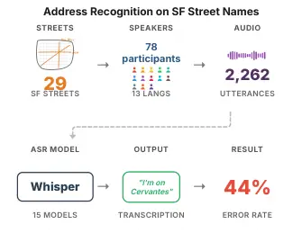

Figure 1: Overview of Transcription Evaluation Pipeline

To illustrate the real-world implications of these transcription errors,
consider the case of taxi services, where accurate street name
recognition directly determines pickup and drop-off locations. Our
findings reveal that street name transcription accuracy differs greatly
across demographic groups and is consistently lower for speakers whose
primary language is not only English.¹¹ 1 Participants can have multiple
primary languages, such as English and Spanish, which would be
considered ”not only English” primary language, §3 To quantify the
practical and potentially financial impact of these disparities in a
ride-hailing setting, we query a map API using the generated
transcriptions and measure the resulting distance from the intended
destination. We find that the distance between the generated and
intended locations is nearly two times larger for non–English primary
speakers than for English-only primary speakers. Although taxi usage is
uneven across demographic groups (Jiang, 2019; Sikder, 2019), taxis play
a vital role for elderly, low-income, and disabled populations by
providing an often subsidized means of transportation (Kaufman et al.,
2016). If speech-to-text systems were used in San Francisco for
ride-hailing, we estimate that the average passenger pickup would be
misrouted by 1.26 miles, equivalent to roughly 5 minutes of city driving
time to correct the error (without additional overhead). When we scale
this per-error delay by the city’s annual taxi volume of voice-based
street name entries and our measured error rates, we estimate roughly
43,500 hours of avoidable delay per year, about 5 years of continuous
waiting time.

Motivated by these findings, we introduce a new training recipe to
generate synthetic speech with varied pronunciations of named entities,
making it possible to finetune models on any named entity (e.g., street
names, hospitals, descriptive locations). Our pipeline takes advantage
of open-sourced text-to-speech models (specifically Coqui-TTS) and a
public dataset (Common Voice) — making it accessible for future
practitioners to re-implement this strategy. With less than 1000
synthetic speech samples, we observe an improvement in street name error
of nearly 60% (relative to base error) among speakers who are not
English-only primary speakers.

We release both datasets as benchmarks for the community: SF Streets,
containing 2,262 utterances from 78 participants, and US Streets,
containing 3,600 recordings of 360 street names across 12 major U.S.
cities from 97 unique participants. In sum, we make the following
contributions:

- •
  We uncover a weakness in state-of-the-art speech systems: the
  inability to accurately transcribe information that directly affects
  resource allocation.
- •
  We show that transcription error rates differ substantially across
  speakers, with notably lower accuracy for non-English-only primary
  speakers.
- •
  We introduce a practical, open-source approach for generating
  synthetic speech data, achieving nearly 60% improvement in named
  entity transcription performance.
- •
  We curate and release two datasets, one comprised of 78 unique
  speakers with 2,262 of S.F. streets and then another of 97 speakers
  with 3,600 utterances of street names from 12 major U.S. cities.²² 2
  Code:
  [https://github.com/kzhou-cloud/sf_streets_public](https://github.com/kzhou-cloud/sf_streets_public)
  Dataset:
  [https://huggingface.co/datasets/kzhou/sf_streets](https://huggingface.co/datasets/kzhou/sf_streets)

## 2 Background and Related Work

Recent advances in multi-modal models have made speech recognition
systems a routine part of everyday life. One sector that has embraced
the cost-saving capabilities of speech models is in live agent call
centers. Speech models are ubiquitously deployed in lieu of live agents
from ride-hailing companies and emergency call centers. For example,
Curb—the most popular taxi application in the U.S.—leverages speech
models from DeepGram and Google, resulting in an 80% reduction in call
transfers to live agents (Twilio, 2025; Twilio Inc., 2025). Similarly,
beginning June 2024, the Metro Nashville Department of Emergency
Communications uses a real-time speech-to-text transcription to handle
calls (CISA, 2025). Although there are clear economic incentives at play
to introduce these systems, the actual safety risks and allocation
biases of the systems have yet to be systematically studied. However, in
real-world deployment settings such as ride-hailing or emergency call
centers — how well are these speech models actually doing?

Speech recognition systems have long been evaluated on standard
benchmarks such as Switchboard (Godfrey et al., 1992), WSJ (Paul and
Baker, 1992), TIMIT (Garofolo et al., 1993), CALLHOME (Canavan et al.,
1997), Fisher (Cieri et al., 2004), Librispeech (Panayotov et al., 2015)
— with many of these benchmarks having single-digit word error rate
(WER) among state-of-the-art models. We’ve seen tremendous progress in
automatic speech recognition (ASR) systems as models continue to scale.
More recently, the speech field has started to focus on the challenge of
named entity recognition, such as developing a named entity corrector
(Garg et al., 2020), developing end-to-end NER extraction (Ghannay et
al., 2018), multilingual NER (Ning et al., 2024), among other survey
works (Caubrière et al., 2020). This area of research remains nascent,
and most state-of-the-art leaderboards have yet to incorporate these
new, challenging tasks.

## 3 Dataset

In our work, we seek to augment existing automatic speech recognition
(ASR) and contribute to the emerging area of named entity recognition in
speech models. In particular, we evaluate the performance of deployed
state-of-the-art speech models on their ability to recognize real U.S.
street names, as spoken by U.S.-based participants. In order to perform
this evaluation, we contribute two datasets:

#### SF Streets Dataset

Our first dataset consists of recordings from U.S.-based participants
pronouncing San Francisco street names.

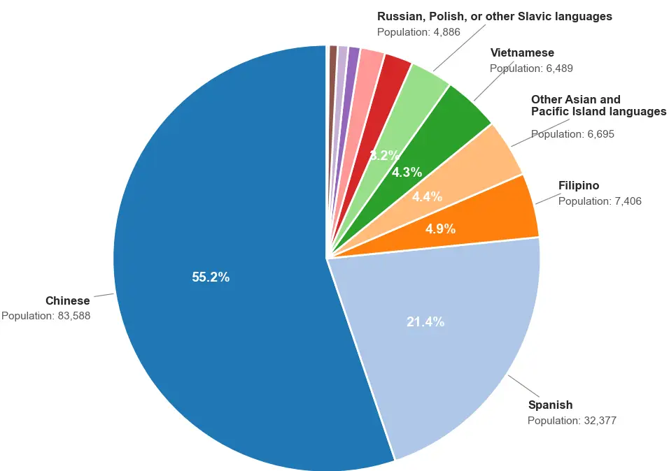

Figure 2: Limited English Proficiency Speakers in San Francisco.
Original data from (City and County of San Francisco, 2026).

San Francisco is part of a metropolitan area of approximately 4.5
million residents and has the fifth-highest GDP among U.S. metropolitan
regions (U.S. Census Bureau, 2022). The SF street names were selected as
the city also has a large population of non-native English speakers
(City and County of San Francisco. Figure 2) and a well-documented
historical record of street-name origins (Carlisle, ). We use all
boulevards of San Francisco ($`n=29`$) (e.g., Cesar Chavez, Alemany),
which are widely recognized, frequently referenced, and likely to appear
in spoken navigation and location queries.³³ 3 All unique boulevard
names were included, except “Skyline Boulevard” which was accidentally
omitted. Unless otherwise noted, all evaluations and experiments of this
paper are based on the SF Streets Dataset. We release a public version
of this dataset as a benchmark for the community, details in §A.1.

#### Participants

Participants were recruited via Prolific ($`n=78`$) to obtain a
linguistically diverse sample that reflects San Francisco’s population,
with IRB approval. We collected basic demographic information, including
age, gender, and race, as well as participants’ primary spoken language
(Which of the following is your primary spoken language?”), which can
include multiple languages. Participants are grouped into three
categories based on their response: English Only, indicating English as
the sole primary language; Multilingual w/ English, indicating multiple
primary languages including English (e.g., English and Spanish); and
Non-English, indicating primary language(s) other than English (e.g.,
Spanish and Portuguese).

A total of 80 participants were initially recruited; 2 were excluded due
to very low-quality audio recordings caused by background noise or
static, as determined by manual review (Table 3). Our manual evaluation
also helped verify that the voice recordings discernibly pronounced the
street names appropriately and that errors from incorrect pronunciations
were unlikely. Notably, all participants spoke and read English and were
able to complete the recording tasks.

For each street name, participants recorded a single utterance using the
template phrase “I’m on \[STREET NAME\]”. The study took approximately 8
minutes to complete, and participants were paid $`\$15`$ USD an hour. A
total of 2,262 ($`78*29`$) utterances were collected.

We evaluated fifteen models on this dataset: OpenAI’s Whisper tiny
(39M), base (74M), small (244M), medium (769M), large (1.5B), Deepgram’s
nova-2\*, nova-3\*, telephony\*, base-phonecall\*, base-general\*,
enhanced-general\*, enhanced-phonecall\*, Microsoft’s phi-4-multimodal
(14B), and Google’s Chirp 2 (2B), Chirp 3\*.⁴⁴ 4 \*unknown model size
Unless otherwise noted, all figures and results in the main text are
computed on this dataset; evaluations on our second dataset are reported
in the Appendix. In addition to being state-of-the-art models, many of
these models are deployed in the real world and made for production and
enterprise-scale speech recognition. Deepgram’s Nova has versions of
telephony and phonecall-optimized variants, which are explicitly tuned
for real-world domains (e.g., low-bandwidth telephony audio), making
them strong comparison baselines.

| SF Streets       |                         | $`n`$ | %   |
| ---------------- | ----------------------- | ----- | --- |
| Gender           | Male                    | 37    | 48  |
|                  | Female                  | 40    | 51  |
|                  | Prefer not to say       | 1     | 1   |
| Age              | 20–29                   | 19    | 24  |
| (M=38.1, SD=11)  | 30–39                   | 29    | 37  |
|                  | 40–49                   | 17    | 22  |
|                  | 50–59                   | 9     | 12  |
|                  | 60–69                   | 3     | 4   |
|                  | 70+                     | 1     | 1   |
| Primary Language | English Only            | 19    | 24  |
|                  | Multilingual w/ English | 49    | 63  |
|                  | Non-English             | 10    | 13  |

Table 1: Participant demographics for SF streets dataset ($`n=78`$). The
participants’ primary languages represented 13 unique languages
(Vietnamese, French, Spanish, Polish, English, Arabic, Portuguese,
Korean, Chinese, Tagalog/Filipino, Russian, Japanese, and German).

#### U.S. Streets Dataset

The second dataset is an extension of the first dataset, which contains
30 randomly selected non-numerical street names for 12 major and diverse
U.S. cities. For added variation, the street names are preceded by one
of 18 prefixes, slightly increasing the difficulty of the dataset, Table 6. Participants were recruited from Prolific, and all were non-English
primary speakers. The final dataset contains 3,600 voice recordings from
97 participants, with each street pronounced 10 times. The study took
approximately 10 minutes to complete, and participants were paid \$18
USD an hour. The average accuracy of this dataset among Whisper models
of all sizes is around 24%. We release this dataset for public research
use.

| US Streets        |                         | $`n`$ | %   |
| ----------------- | ----------------------- | ----- | --- |
| Gender            | Male                    | 52    | 54  |
|                   | Female                  | 45    | 46  |
|                   | Prefer not to say       | 0     | 0   |
| Age               | 20–29                   | 32    | 33  |
| (M=37.2, SD=11.3) | 30–39                   | 29    | 30  |
|                   | 40–49                   | 21    | 22  |
|                   | 50–59                   | 11    | 11  |
|                   | 60–69                   | 4     | 4   |
|                   | 70+                     | 0     | 0   |
| Primary Language  | English Only            | 0     | 0   |
|                   | Multilingual w/ English | 72    | 74  |
|                   | Non-English             | 25    | 26  |

Table 2: Participant demographics for U.S. Streets Dataset ($`n=97`$).
The participants’ primary languages represented 29 unique languages
(Chinese, Farsi, English, Italian, Greek, Romanian, Korean, Punjabi,
Hakka, Arabic, Faroese, Croatian, Tamil, Urdu, Indonesian, German,
Malayalam, Gujarati, Hindi, Spanish, Laotian, Russian, Japanese, Polish,
Thai, French, Other, Portuguese, Vietnamese).

#### Metrics: Transcription Error Rate

Word Error Rate (WER) is a widely used metric in speech recognition that
measures the overlap between a ground-truth transcript and a model’s
output. However, our findings show that WER provides an incomplete
picture of transcription quality, particularly for critical information.
Here, we calculate transcription error rate, the rate at which the
transcribed street name phonetically matches the target, meaning
orthographically agnostic (e.g., both “Ceasar” and “Cesar” are
considered correct). For SF Streets dataset, this was done by manually
going through all the transcriptions produced by models and selecting
phonetic equivalents. For transparency, we include this short list
($`n=12`$) of aliases in Table 5.

## 4 Street Name Recognition Is Challenging

Our first finding is that street name recognition continues to be a
major failure mode even for relatively large speech models. Across model
families and prompting strategies (Figure 3), we find that models at
every size make frequent mistakes on named entities. On the SF Streets
dataset Whisper-Base achieves only a little over 50% accuracy on
average. Although accuracy improves with scale, the gains come with
steep deployment costs. For instance, Whisper-Large (1.5B) reaches
roughly 73% accuracy but runs about 7× slower than Whisper-Base and
consumes around 10× more virtual memory, substantially complicating
real-world use. These high error rates also contrast with our prior
beliefs about these state-of-the-art systems with very low WER. In our
analysis, we find that models can have low WER but still highly
consequential transcription errors (e.g., “Font” being transcribed as
“Bont” is low in edit distance, but potentially high in geographic
location). For instance, Whisper-Large achieves a low overall WER of
14%, yet its street name transcription error rate rises to 27% when
transcribing street names correctly. This gap underscores the difficulty
models face with named entities and reveals the limitations of relying
on standard aggregate metrics. (Radford et al., 2022).

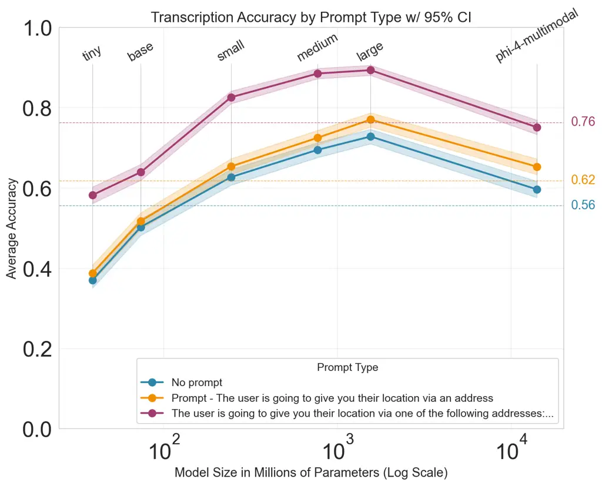

Figure 3: Overall Transcription Accuracy on SF Streets for Models That
Accept a Prompt

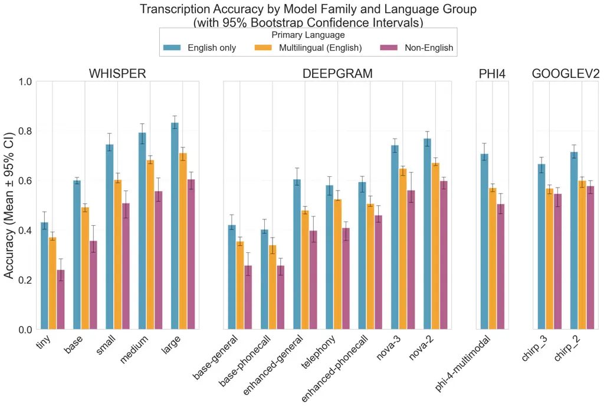

Figure 4: Transcription Accuracy by Language Groups Across All Model
Families. 95% confidence intervals calculated via bootstrap resampling
of 10,000 samples

### 4.1 Adding Context

One possibility why this task is so hard is that street names may be too
infrequent in training data for the model to generate them without
additional context. To test this, we re-evaluated promptable models like
(Whisper and Phi-4) using prompts that provide additional contextual
cues. We used the following lightweight prompt in this experiment: The
user is going to give you their location via an address. This prompt
adds the kind of situational framing a real system could plausibly
provide. Unfortunately, we see almost no gains from this situational
awareness; although the model is more likely to guess a street name, it
continues to fail to correctly identify the one that is being spoken. We
then we ran a second condition that explicitly supplies the full set of
target street names ($`n=29`$) in the system prompt: The user is going
to give you their location via one of the following addresses: Alemany,
Arguello.... This prompt is not meant to model a realistic deployment
scenario, but rather serves as a diagnostic upper bound. By giving the
model the relevant vocabulary upfront, we largely eliminate lack of
context as an explanation, leaving recognition and selection errors
(mishearing, phonetic ambiguity, and choosing the wrong candidate) as
the primary remaining failure modes. Even in this “perfect context”
setting, average accuracy across tested models is 76%, indicating that
the bottleneck is not just context, but the transcription and
discrimination of similar-sounding entities.

### 4.2 Implications for Speech Model Evaluation

Our results and new dataset highlight that street name recognition
remains a distinct and difficult task, and one that should be evaluated
explicitly before deploying speech models in mission-critical workflows.

We see two main hypotheses for why word error rates can substantially
overstate the transcription reliability of named entities. The first is
that the current evaluation focuses heavily on longer-form speech, where
language models can take advantage of context to fill in highly probable
words. The second is that street names often have historical and foreign
origins, making them less frequent in training data and more variable to
pronunciation differences (e.g., an English speaker pronouncing Cesar
Chavez or Arguello). A small analysis of street names from U.S. cities
($`n=177,155`$) found that 33% of the street names came from non-English
origins.⁵⁵ 5 GPT 4.1 was used to classify the origin of street names.

Our findings illustrate that even when the overall word error rate (WER)
is low, models may still fail disproportionately on the named entities
that carry the most operational importance.

## 5 Exacerbated Errors for Non-English Primary Speakers

As modern systems are deployed in diverse urban environments, users may
vary greatly demographically in age, gender, and linguistic background.
For example, the same street name can be pronounced in substantially
different ways, particularly in cities such as San Francisco, which has
a large population of residents for whom English is a second language.
This diversity raises a concern about the fairness of speech-to-text
models: Are transcription error rates the same across demographic
groups? Given the well-documented challenges of automatic speech
recognition for accented speech (Koenecke et al., 2020; Hofmann et al.,
2024), we investigate whether similar disparities arise in the context
of street name recognition.

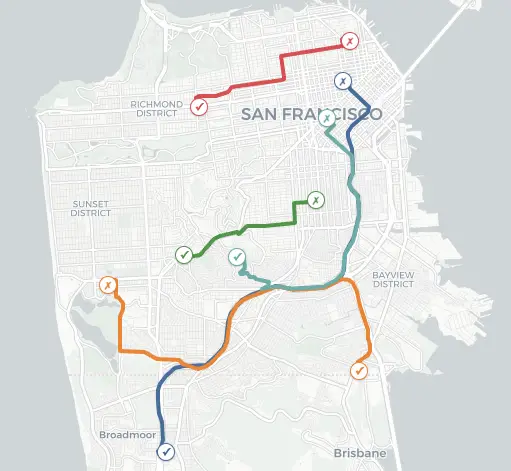

Figure 5: Visualization of the Five Worst Mistakes (by distance) of a
Non-English Speaker

### 5.1 Finding

Our second key finding shows that street name recognition is not only
inherently difficult, but that model errors disproportionately impact
users whose primary language is not only English. Across our 15 models
and model variants, non-English primary speakers exhibited an 18% lower
accuracy compared to English primary speakers (46% versus 64%). Figure 4
illustrates the systemic pattern of this discrepancy. Across all four
model families, we see a significant drop in accuracy between
English-only primary speakers and non-English primary speakers. We
observed no significant effects of self-identified gender and age on
transcription performance.

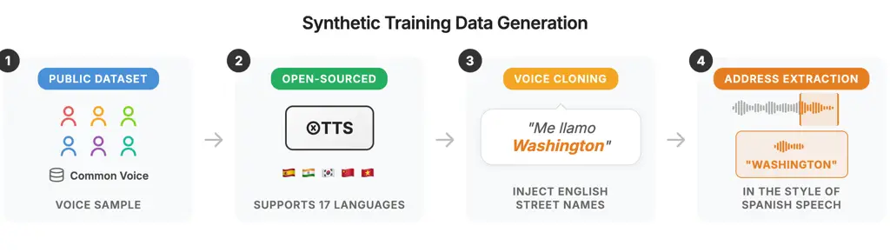

Figure 6: (1) Select a sample of speech from Common Voice, e.g., Spanish
(2) Set the XTTS to generate speech in Spanish (supports 16 languages,
excluding English) (3) Clone the voice and generate Spanish but with
injected English street names, e.g., “Mi nombre es… Washington” (4)
Extract street name speech and manually validate. Repeat this with as
many samples as needed to create a unique finetuning dataset.⁷⁷ 7
Injection includes the street name and omits the “I’m on” prefix to
preserve voice generation quality.

### 5.2 Estimating the Financial Impact

To quantify the downstream financial consequences of transcription
errors, we analyze outputs from Whisper-Base in both English primary and
non-English primary speakers by querying the Google Maps API to estimate
the geographic distance between intended and transcribed destinations.
Given a transcribed street name, the API returns corresponding
coordinates—for example, querying “Alemany Blvd, San Francisco” yields
the coordinates 37.72, -122.44. This approach incorporates a realistic
degree of tolerance, as the API can automatically correct certain
transcription errors (e.g., “Alemony” may still resolve to the correct
location), mirroring the behavior of real-world dispatch systems. Our
evaluation has some built-in leniency, giving us a conservative estimate
of transcription error. First, drop instances where no location could be
found even with the Google Maps API ($`n=212`$, 9% of the dataset). We
cap the distance error to 20 miles and discard any instances beyond this
threshold ($`n=6`$); making the assumption that out-of-city destinations
would be corrected for by humans in the loop.

Despite this added leniency, transcription errors still result in
substantial geographic deviations (Figure 5). On average, the distance
between the intended and transcribed locations is 1.26 miles (in driving
distance) for English primary speakers, compared to 2.4 miles for
non-English primary speakers—nearly a twofold increase. Using average
San Francisco taxi fares (\$0.65 per one-fifth mile; San Francisco
Municipal Transportation Agency, 2022) and an average traffic speed of
14 mph (Wong and Wyloge, 2025), these discrepancies translate into an
estimated \$4.00 cost and an average expected 5-minute delay per trip
for English primary speakers, versus \$8.00 and an average 10-minute
expected delay for non-English primary speakers.

As of December 2025, over 6,000 taxi rides happen on a weekday basis in
San Francisco (San Francisco Municipal Transportation Agency, 2025).
Taxis remain a critical, government-subsidized transportation service,
particularly for elderly individuals and people with physical
disabilities (San Francisco Municipal Transportation Agency, 2024).
Conservatively assuming that only one-third of weekday taxi trips
involve phone-based dispatch, this gives us approximately 2,000
voice-mediated pickup requests per weekday.⁸⁸ 8 While not all trips
involve voice-based street name entry, survey evidence suggests that
phone-based ordering remains common among frequent taxi users: a 2013
SFMTA report found that 36% of frequent riders place the majority of
their trips via phone calls, and 17% rely on phone calls exclusively
(San Francisco Municipal Transportation Agency, 2013). Using the
empirically measured average delay associated with transcription errors
(approximately 5 minutes per trip), this implies on the order of 43,500
hours of cumulative delay annually (2,000 trips × 261 weekdays × 5
minutes). Valued using standard taxi fare schedules, this corresponds to
an estimated \$2.1 million in annual economic cost. Importantly, these
estimates assume that all riders are English-primary speakers and
therefore represent a lower bound on the true cost; accounting for
higher observed error rates among non-English primary speakers would
further increase the expected impact.

## 6 Mitigation via Synthetic Data

Motivated by the demonstrated risks and downstream consequences of
transcription errors, we set out to develop a method to improve the
transcription of named entities, especially for non-English primary
speakers. Here, we illustrate that with existing resources, we can
finetune a speech recognition model to increase performance on street
name recognition using synthetic data alone.

Although large volumes of speech data are available, it remains
difficult to obtain datasets that adequately capture the wide range of
pronunciation patterns exhibited by speakers with diverse language
backgrounds. Recent advances in text-to-speech (TTS) modeling present an
opportunity to address this data gap and synthetically produce a broad
spectrum of street name pronunciations. While such synthetic data is
unlikely to fully reflect the nuances of real human speech, it may
nevertheless introduce sufficient phonetic variation to improve
downstream recognition performance through finetuning.

To support reproducibility and extensibility, we construct a fully
reproducible training pipeline using only open-source datasets and
models, enabling practitioners to adapt our approach to other cities and
contexts. Specifically, we leverage the widely used XTTS model available
on Hugging Face (Casanova et al., 2024) and Common Voice Scripted Speech
24.0 (Ardila et al., 2020), a multilingual speech corpus comprising 134
languages and recordings from over 350,000 speakers.

### 6.1 Failed Initial Attempt

We first tried to use XTTS to see if it was possible to clone accented
speech and generate additional speech with the same pronounciation
patterns. Our initial attempts were unsuccessful as XTTS generated voice
clones with an American-English or British-English accent. For example,
when cloning a German speaker speaking English, the synthesized output
retained the speaker’s vocal characteristics but replaced the original
German accent with an American-English accent. This suggests that
current voice cloning techniques may systematically normalize or
suppress foreign accents — a systematic study here would be pertinent
for future work.

#### Intuition and Breakthrough

The key insight behind our synthetic data generation approach is to
exploit the implicit accent style transfer of cloning models. When
generating speech in a given language, the model tends to impose a
canonical or “default” speaking style associated with that language. In
our qualitative analysis, we observed that English generations were
rendered with a stereotypical American-English accent, while Italian
generations similarly exhibited a distinctly Italian speaking style.

Our key breakthrough was to leverage this behavior by prompting the
model to generate speech in a non-English language while selectively
inserting English words into the prompt. For instance, we instructed the
model to generate Italian speech for the text ”Buongiorno, mi chiamo…
Washington” and then isolated the audio corresponding to the English
word “Washington.” This extraction process was automated and
subsequently verified by the authors.

### 6.2 Recipe

The final data-generation procedure for a single training example is
illustrated in Figure 7. The core idea is to have a voice cloning system
synthesize speech in a foreign language while embedding English street
names within the text, thereby inducing a form of style transfer onto
the English terms.

This approach produces substantial variation in pronunciation, driven by
phonetic patterns common in other languages. Additional diversity is
introduced by having unique speakers per language for cloning, allowing
us to perturb speaker characteristics and further expand the range of
synthesized pronunciations for each street name.⁹⁹ 9 Note that this
approach is not mimicking stereotypical foreign accents — rather, it
relies on monolingual foreign-language speech—without English
influence—and applies its phonetic structure as a style transfer onto
English words.

XTTS supports voice cloning in 16 different languages. For each of these
languages, we select a speaker speaking in that language from Common
Voice Scripted Speech 24.0 (e.g., select two speakers from the Spanish
dataset) and clone these voices to synthesize new text that will contain
the street name (e.g., Estoy en Washington). We then automatically
extract the audio that is associated with the word “Washington” and
manually verify each of these files. We finetune Whisper-base (batch
size 16, learning rate 1e-5, early stopping loss threshold at 0.01).
With less than 1,000 utterances of data from this purely synthetic
dataset, we can substantially improve street name transcription.

#### Limited Risk of Dual Use

One potential concern is that this technique could be misused to
deliberately generate stereotypical or caricatured speech. In practice,
however, such misuse is constrained by the behavior of current voice
cloning models. The synthesis quality degrades rapidly when the prompt
contains large amounts of English text. The model performs best when the
prompt is predominantly in the target foreign language with only
occasional English insertions. Attempts to generate full English
sentences in the style of foreign-language speech tend to collapse into
unintelligible audio, limiting the feasibility of producing realistic or
scalable imitations of stereotypical speech patterns.

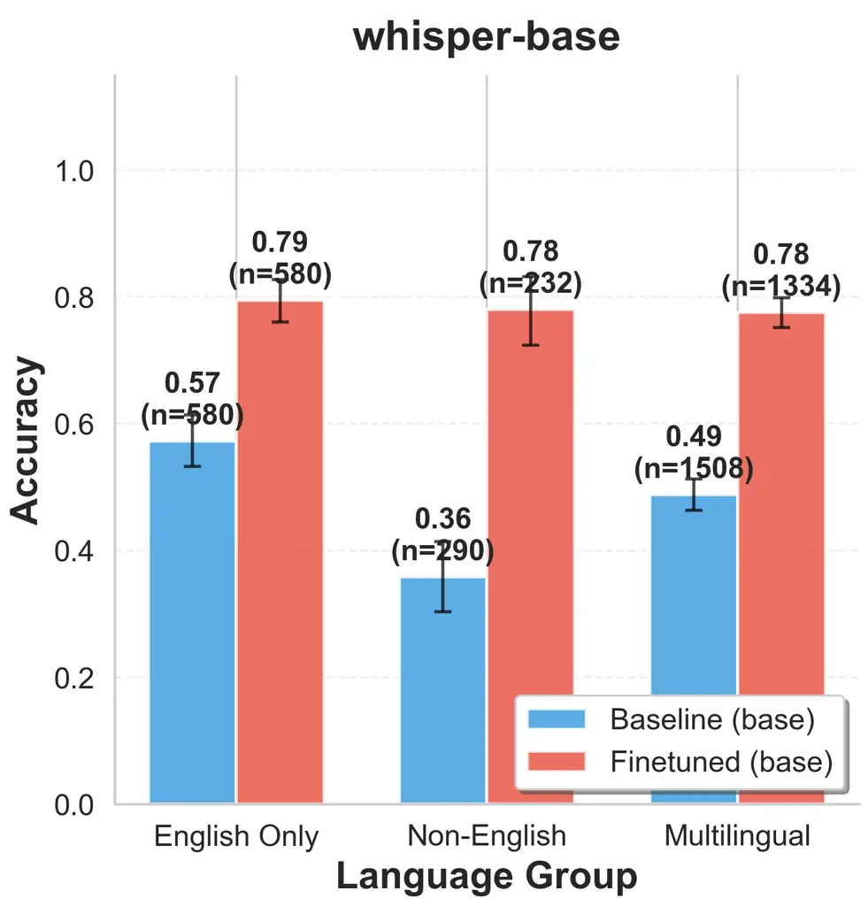

Figure 7: Improvement in accuracy from the finetuned model across
language groups. 95% confidence intervals calculated via bootstrap
resampling of 10,000 samples. This holds true for Whisper models across
all sizes, Figure 9

#### Out-Of-Distribution Voices

Despite training on synthetic data, the model improves on real voices
from the SF Street datasets, with 116% and 60% relative gain from the
base model for non-English primary and multilingual speakers,
respectively, Figure 7.

#### Out-Of-Distribution Languages

Additionally, we see that even for languages that were not originally in
the synthetic training data (e.g., languages spoken by participants of
SF Streets but not supported by XTTS like Vietnamese), we still see
gains in a model’s ability to recognize speech from a Vietnamese speaker
— suggesting a generalizability effect from learning other ways of
speaking, Figure 10.

We additionally train 16 Whisper-base models, each with synthetic data
from one language (e.g., training a model with synthetic data from
French only) and evaluate how well each of these language-specific
models performs on different speakers and street names Figures 11, 12.
We find that training on certain languages (e.g., Russian, Arabic, and
German) led to higher gains than training on other languages, but find
no evidence that training one synthetic language will directly help
transcription from speakers of the language. We do see that aggregated
training performs best; training the languages individually leads to
improvements of 12 - 18% on average, meaning training with all 16
languages leads to an overall 28% gain in accuracy.

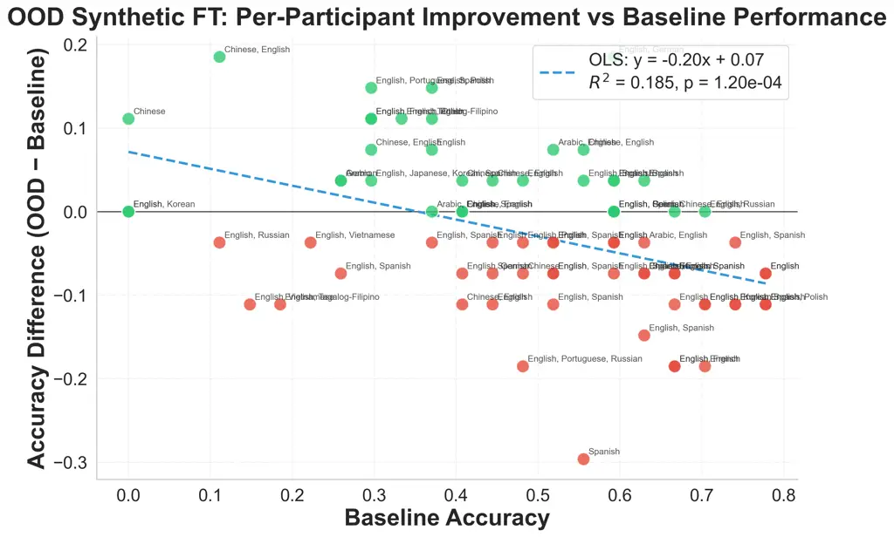

Figure 8: Training only on synthetic out-of-distribution street names

#### Out-Of-Distribution Street Names

Our data generation process relies entirely on synthetic inputs, and in
many cases, complete street name lists can be downloaded directly from
municipal websites. As a result, it’s lightweight and practical for
practitioners to fine-tune language models on every street name within a
city to improve transcription rates. However, for the sake of
experimentation, we wanted to determine whether it was possible to train
on synthetic out-of-distribution street names and observe performance
gains on real street name pronunciations. This is a difficult
generalization problem because street names are often rare in training
data, and their pronunciations can be highly specific to individual
entities, limiting transferability.

We finetuned Whisper-base with less than 1,000 synthetic samples and
found that overall performance remains largely unchanged
($`0.4+\rightarrow 0.46`$). However, as shown in Figure 8, we observed
meaningful gains for participants’ transcriptions that were poorly
transcribed with the baseline model. The worse the original
transcriptions were for the original user, the larger the improvement
after finetuning. A linear fit shows that the baseline accuracy explains
$`R^{2}=0.185`$ for the variance in performance change between the
fine-tuned and base model, $`p<0.001`$. Although these results do not
demonstrate broad generalization from synthetic OOD data, they suggest
that synthetic training can still substantially improve transcription
performance for users—particularly non-native English speakers — whose
voices suffered the worst error rates with baseline models.

## 7 Discussion and Conclusion

In this work, we introduce a new real-world benchmark for evaluating
speech recognition systems, focused on the transcription of U.S. street
names. Accurate recognition of street names is critical for diverting
resources to individuals, and speech models are increasingly deployed in
place of human agents for these tasks. However, our evaluations on these
models lag behind. This work shows that current evaluation practices
fail to adequately capture real-world performance, and our findings
demonstrate that even state-of-the-art speech recognition models
struggle to correctly transcribe street names. These transcription error
rates are furthermore exacerbated in non-English only speakers. To
address this gap, we propose a mitigation strategy that leverages
publicly available datasets and language models to synthetically
generate diverse pronunciations of street names. Using this synthetic
data, we fine-tune language models and achieve meaningful improvements
in transcription accuracy. We release our datasets as public artifacts
to enable benchmarking and further research by the community.

## Acknowledgements

Thank you to all our online crowdworkers who have contributed to our
project! Many thanks to Shang Zhu, Yongchan Kwon, Dan Fu, Sanjana
Srivastava, Anna Pot, and Dan Jurafsky for their helpful feedback and
support!

## Impact Statement

Our work here aims to advance our understanding of language technologies
in context. We evaluated several publicly deployed language models and
assessed the potential failure modes they present, especially across
various demographic groups. We introduce a recipe to synthetically
generate named entities with varied pronunciation, leading to
substantial gains on this task. We use public datasets and adhere to
their terms and agreements, and synthetic voice generation is done via a
local, open-sourced model. Lastly, we also aim to release two anonymized
public datasets of U.S. speakers pronouncing street names as an artifact
and training material for the community.

## References

- Ardila et al. (2020) R. Ardila, M. Branson, K. Davis, M. Kohler, J.
  Meyer, M. Henretty, R. Morais, L. Saunders, F. Tyers, and G. Weber
  Common voice: a massively-multilingual speech corpus. In Proceedings
  of the twelfth language resources and evaluation conference,
  pp. 4218–4222. Cited by: §6.
- Canavan et al. (1997) A. Canavan, D. Graff, and G. Zipperlen Callhome
  american english speech. Linguistic Data Consortium. Cited by: §2.
- \[3\] H. C. CarlisleEarly San Francisco street names -
  1846-1849(Website) External Links:
  [Link](https://sfmuseum.org/street/stnames2.html) Cited by: §3.
- Casanova et al. (2024) E. Casanova, K. Davis, E. Gölge, G. Göknar, I.
  Gulea, L. Hart, A. Aljafari, J. Meyer, R. Morais, S. Olayemi, and J.
  Weber XTTS: a massively multilingual zero-shot text-to-speech model.
  External Links: 2406.04904, [Link](https://arxiv.org/abs/2406.04904)
  Cited by: §6.
- Caubrière et al. (2020) A. Caubrière, S. Rosset, Y. Estève, A.
  Laurent, and E. Morin Where are we in named entity recognition from
  speech?. In Proceedings of the Twelfth Language Resources and
  Evaluation Conference, pp. 4514–4520. Cited by: §2.
- Cieri et al. (2004) C. Cieri, D. Miller, and K. Walker The fisher
  corpus: a resource for the next generations of speech-to-text.. In
  LREC, Vol. 4, pp. 69–71. Cited by: §2.
- CISA (2025) CISA Artificial intelligence in emergency communications
  centers. Note:
  [https://www.cisa.gov/sites/default/files/2025-03/25_0328_s-n_ai-implemen-ecc_infographic_508C.pdf](https://www.cisa.gov/sites/default/files/2025-03/25_0328_s-n_ai-implemen-ecc_infographic_508C.pdf)Accessed:
  2025-12-08 Cited by: §1, §2.
- City and County of San Francisco (2024) City and County of San
  Francisco San francisco language diversity data. Note:
  [https://www.sf.gov/data--san-francisco-language-diversity-data](https://www.sf.gov/data--san-francisco-language-diversity-data)Accessed
  19 Dec. 2025 Cited by: §3.
- City and County of San Francisco (2026) City and County of San
  Francisco San francisco language diversity data. Note:
  [https://www.sf.gov/data--san-francisco-language-diversity-data](https://www.sf.gov/data--san-francisco-language-diversity-data)Accessed:
  2026-02-11 Cited by: Figure 2, Figure 2.
- Garg et al. (2020) A. Garg, A. Gupta, D. Gowda, S. Singh, and C. Kim
  Hierarchical multi-stage word-to-grapheme named entity corrector for
  automatic speech recognition.. In Interspeech, pp. 1793–1797. Cited
  by: §2.
- Garofolo et al. (1993) J. S. Garofolo, L. F. Lamel, W. M.
  Fisher, D. S. Pallett, N. L. Dahlgren, V. Zue, and J. G. Fiscus TIMIT
  acoustic-phonetic continuous speech corpus. (No Title). Cited by: §2.
- Ghannay et al. (2018) S. Ghannay, A. Caubriere, Y. Esteve, A. Laurent,
  and E. Morin End-to-end named entity extraction from speech. arXiv
  preprint arXiv:1805.12045. Cited by: §2.
- Godfrey et al. (1992) J. J. Godfrey, E. C. Holliman, and J. McDaniel
  SWITCHBOARD: telephone speech corpus for research and development. In
  Acoustics, speech, and signal processing, ieee international
  conference on, Vol. 1, pp. 517–520. Cited by: §2.
- Hofmann et al. (2024) V. Hofmann, P. R. Kalluri, D. Jurafsky, and S.
  King AI generates covertly racist decisions about people based on
  their dialect. Nature 633 (8028), pp. 147–154. Cited by: §5.
- Jiang (2019) J. Jiang More americans are using ride-hailing apps. Pew
  Research Center. Note:
  [https://www.pewresearch.org/short-reads/2019/01/04/more-americans-are-using-ride-hailing-apps/](https://www.pewresearch.org/short-reads/2019/01/04/more-americans-are-using-ride-hailing-apps/)Accessed:
  2026-01-27 Cited by: §1.
- Kaufman et al. (2016) S. M. Kaufman, A. Smith, J. O’Connell, and D.
  Marulli Intelligent paratransit. Cited by: §1.
- Koenecke et al. (2020) A. Koenecke, A. Nam, E. Lake, J. Nudell, M.
  Quartey, Z. Mengesha, C. Toups, J. R. Rickford, D. Jurafsky, and S.
  Goel Racial disparities in automated speech recognition. Proceedings
  of the national academy of sciences 117 (14), pp. 7684–7689. Cited by:
  §5.
- Ning et al. (2024) J. Ning, Y. Sun, B. Xu, Z. Yang, L. Luo, and H. Lin
  Breaking the boundaries: a unified framework for chinese named entity
  recognition across text and speech. In Findings of the Association for
  Computational Linguistics: EMNLP 2024, pp. 1250–1260. Cited by: §2.
- Panayotov et al. (2015) V. Panayotov, G. Chen, D. Povey, and S.
  Khudanpur Librispeech: an asr corpus based on public domain audio
  books. In 2015 IEEE international conference on acoustics, speech and
  signal processing (ICASSP), pp. 5206–5210. Cited by: §2.
- Paul and Baker (1992) D. B. Paul and J. Baker The design for the wall
  street journal-based csr corpus. In Speech and Natural Language:
  Proceedings of a Workshop Held at Harriman, New York, February 23-26,
  1992, Cited by: §2.
- Radford et al. (2022) A. Radford, J. W. Kim, T. Xu, G. Brockman, C.
  McLeavey, and I. Sutskever Robust speech recognition via large-scale
  weak supervision. External Links: 2212.04356,
  [Link](https://arxiv.org/abs/2212.04356) Cited by: §4.
- San Francisco Municipal Transportation Agency (2013) San Francisco
  Municipal Transportation Agency Best practices studies of taxi
  regulation: taxi user surveys. Technical report San Francisco
  Municipal Transportation Agency. External Links:
  [Link](https://www.sfmta.com/sites/default/files/Draft%20SF%20UserSurvey%2055%20WEB%20version04042013.pdf)
  Cited by: footnote 8.
- San Francisco Municipal Transportation Agency (2022) San Francisco
  Municipal Transportation Agency Taxi fares. Note:
  [https://www.sfmta.com/getting-around/taxi/taxi-fares](https://www.sfmta.com/getting-around/taxi/taxi-fares)Accessed
  18 Dec. 2025 Cited by: §5.2.
- San Francisco Municipal Transportation Agency (2024) San Francisco
  Municipal Transportation Agency Essential trip card. Note:
  [https://www.sfmta.com/getting-around/accessibility/paratransit/essential-trip-card](https://www.sfmta.com/getting-around/accessibility/paratransit/essential-trip-card)Accessed
  18 Dec. 2025 Cited by: §5.2.
- San Francisco Municipal Transportation Agency (2025) San Francisco
  Municipal Transportation Agency Average weekday taxi trips. Note:
  [https://www.sfmta.com/reports/average-weekday-taxi-trips](https://www.sfmta.com/reports/average-weekday-taxi-trips)Accessed
  18 Dec. 2025 Cited by: §5.2.
- Sikder (2019) S. Sikder Who uses ride-hailing services in the united
  states?. Transportation research record 2673 (12), pp. 40–54. Cited
  by: §1.
- Twilio Inc. (2025) Twilio Inc. TwiML Voice: Gather. External Links:
  [Link](https://www.twilio.com/docs/voice/twiml/gather) Cited by: §2.
- Twilio (2025) Twilio The future of mobility: how curb delivers the
  promised ride with help from twilio. Note:
  [https://customers.twilio.com/en-us/curb](https://customers.twilio.com/en-us/curb)Accessed:
  2025-12-08 Cited by: §1, §2.
- U.S. Census Bureau (2022) U.S. Census Bureau . Note:
  [https://data.census.gov](https://data.census.gov)Accessed 19 Dec.
  2025 Cited by: §3.
- Wong and Wyloge (2025) G. Wong and E. Wyloge SF traffic is
  second-slowest in US — and getting worse. San Francisco Examiner.
  Note: Accessed 18 Dec. 2025 External Links:
  [Link](https://www.sfexaminer.com/news/transit/sf-traffic-is-second-slowest-in-us-and-getting-worse/article_ebe26770-d45c-11ef-9a49-5fba319c395e.html)
  Cited by: §5.2.

## Appendix A Appendix

### A.1 SF Streets Public Dataset

The publicly released SF Streets dataset differs slightly from the
dataset analyzed in this paper to respect participants who did not want
their data released. It contains 47 of the original participants’ data
and 45 of newly collected data. The demographic breakdown of the
participants in SF Streets public are seen below.

| SF Streets        |                         | $`n`$ | %   |
| ----------------- | ----------------------- | ----- | --- |
| Gender            | Male                    | 46    | 50  |
|                   | Female                  | 45    | 48  |
|                   | Prefer not to say       | 1     | 1   |
| Age               | 18–19                   | 1     | 1   |
| (M=37.0, SD=10.7) | 20–29                   | 25    | 27  |
|                   | 30–39                   | 31    | 33  |
|                   | 40–49                   | 21    | 22  |
|                   | 50–59                   | 11    | 11  |
|                   | 60–69                   | 2     | 2   |
|                   | 70+                     | 1     | 1   |
| Ethnicity         | White                   | 45    | 48  |
|                   | Asian                   | 31    | 33  |
|                   | Other                   | 8     | 8   |
|                   | Mixed                   | 4     | 4   |
|                   | Black                   | 3     | 3   |
|                   | Prefer not to say       | 1     | 1   |
| Primary Language  | English Only            | 12    | 13  |
|                   | Multilingual w/ English | 66    | 71  |
|                   | Non-English             | 14    | 15  |

Table 3: Participant demographics for SF streets dataset ($`n=92`$). The
participants’ primary languages represented 21 unique languages
(Afrikaans, Arabic, Belarusian, Bengali, Cantonese, Chinese, Dutch,
English, French, German, Hindi, Korean, Mandarin, Polish, Portuguese,
Russian, Spanish, Tagalog-Filipino, Ukrainian, Urdu, Vietnamese).

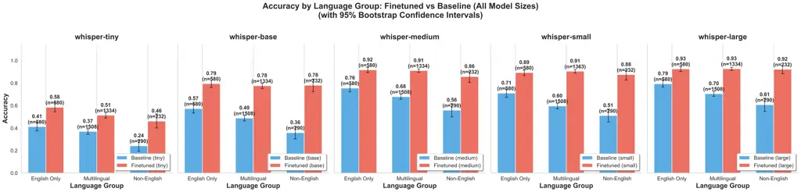

Figure 9: Accuracy between finetuned and baseline models across model
sizes

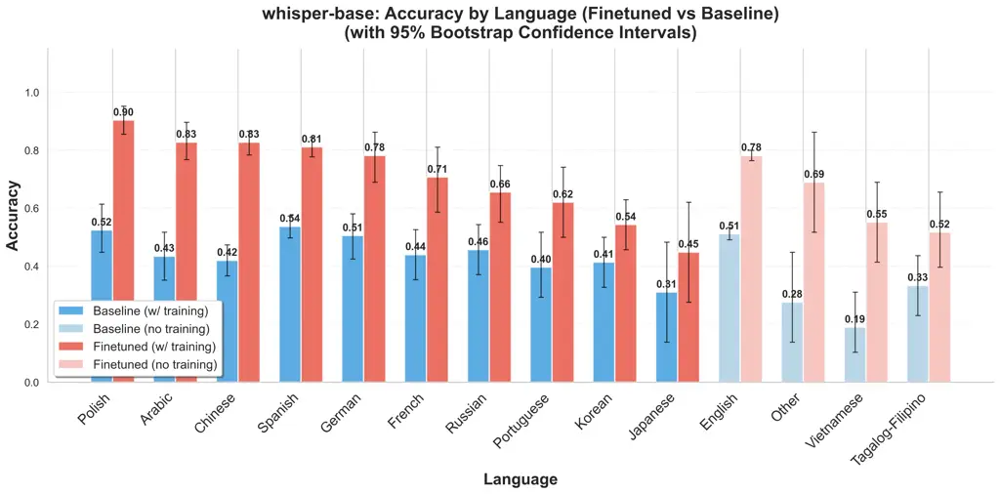

Figure 10: Accuracy between finetuned and baseline models across model
sizes

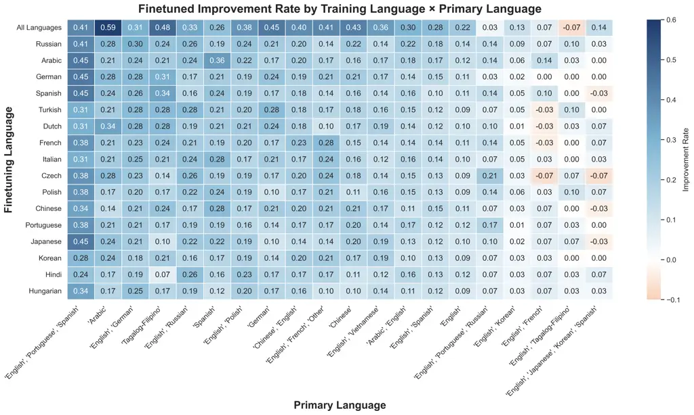

Figure 11: Accuracy between base-whisper and a finetuned model using
synthetic data only from one language, crossed by test data of various
languages.

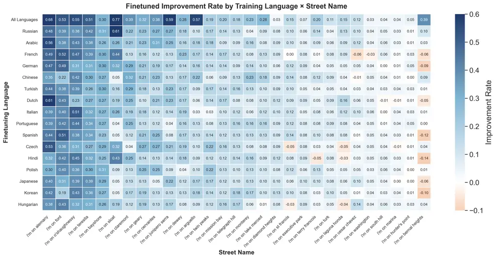

Figure 12: Accuracy between base-whisper and a finetuned model using
synthetic data only from one language crossed by names of streets

| Street Name     | Prompt Format            |
| --------------- | ------------------------ |
| ALEMANY         | “I’m on ALEMANY”         |
| ARGUELLO        | “I’m on ARGUELLO”        |
| BAY SHORE       | “I’m on BAY SHORE”       |
| BERNAL HEIGHTS  | “I’m on BERNAL HEIGHTS”  |
| CERVANTES       | “I’m on CERVANTES”       |
| CESAR CHAVEZ    | “I’m on CESAR CHAVEZ”    |
| CLAREMONT       | “I’m on CLAREMONT”       |
| DEWEY           | “I’m on DEWEY”           |
| DIAMOND HEIGHTS | “I’m on DIAMOND HEIGHTS” |
| EXECUTIVE PARK  | “I’m on EXECUTIVE PARK”  |
| FONT            | “I’m on FONT”            |
| GEARY           | “I’m on GEARY”           |
| HUNTERS POINT   | “I’m on HUNTERS POINT”   |
| JUNIPERO SERRA  | “I’m on JUNIPERO SERRA”  |
| LAGUNA HONDA    | “I’m on LAGUNA HONDA”    |
| LAKE MERCED     | “I’m on LAKE MERCED”     |
| MARINA          | “I’m on MARINA”          |
| MISSION BAY     | “I’m on MISSION BAY”     |
| MONTEREY        | “I’m on MONTEREY”        |
| O’SHAUGHNESSY   | “I’m on O’SHAUGHNESSY”   |
| SLOAT           | “I’m on SLOAT”           |
| SOUTH HILL      | “I’m on SOUTH HILL”      |
| ST FRANCIS      | “I’m on ST FRANCIS”      |
| TELEGRAPH HILL  | “I’m on TELEGRAPH HILL”  |
| TERESITA        | “I’m on TERESITA”        |
| TERRY FRANCOIS  | “I’m on TERRY FRANCOIS”  |
| TURK            | “I’m on TURK”            |
| TWIN PEAKS      | “I’m on TWIN PEAKS”      |
| WASHINGTON      | “I’m on WASHINGTON”      |

Table 4: San Francisco street names used in the study. Suffixes are
commonly omitted in local signage and postal addresses, and also
excluded in our dataset (Table 4). Instructions to the user was:
Recording yourself saying the following text ONLY ONCE: ”I’m on ALEMANY”

| Street Name    | Accepted Alternative |
| -------------- | -------------------- |
| BAYSHORE       | BAY_SHORE            |
| HUNTER’S POINT | HUNTERS POINT        |
| CESAR CHAVEZ   | CAESAR CHAVEZ        |
| MONTEREY       | MONTERREY            |
| CERVANTES      | SERVANTES            |
| ALEMANY        | ALMANY               |
| ALEMANY        | ALAMANY              |
| TWIN PEAKS     | TWINPEAKS            |
| ARGUELLO       | ARGUELO              |
| BERNAL HEIGHTS | BURNAL HEIGHTS       |
| TERRY FRANCOIS | TERRY, FRANCOIS      |

Table 5: Phonetically equivalent spellings of street names for the SF
Streets Dataset

| US Street Prefix Paraphrases                     |
| ------------------------------------------------ |
| Can you pick me up at \[STREET NAME\]?           |
| Can you come get me on \[STREET NAME\]?          |
| Can you meet me on \[STREET NAME\]?              |
| Would you mind picking me up at \[STREET NAME\]? |
| Could you come get me at \[STREET NAME\]?        |
| Are you able to pick me up at \[STREET NAME\]?   |
| I’m at \[STREET NAME\]                           |
| I’m near \[STREET NAME\]                         |
| I’m close to \[STREET NAME\]                     |
| I’m right by \[STREET NAME\]                     |
| I’m in the vicinity of \[STREET NAME\]           |
| I’m currently near \[STREET NAME\]               |
| I live near \[STREET NAME\]                      |
| My place is near \[STREET NAME\]                 |
| I’m staying near \[STREET NAME\]                 |
| I’m based near \[STREET NAME\]                   |
| My residence is near \[STREET NAME\]             |
| My place is located on \[STREET NAME\]           |

Table 6: Prefix paraphrases for the US streets dataset.

| phrase                                              | city    | phrase                                          | city          |
| --------------------------------------------------- | ------- | ----------------------------------------------- | ------------- |
| Are you able to pick me up at STEVENSON?            | Chicago | Can you pick me up at STRATO?                   | Jacksonville  |
| I’m at THOMAS.                                      | Chicago | Are you able to pick me up at FABRAY?           | Jacksonville  |
| I’m currently near WAVELAND.                        | Chicago | I’m currently near PLANTS.                      | Jacksonville  |
| I’m at MIDWAY AIRPORT LOWER.                        | Chicago | Are you able to pick me up at RUBY?             | Jacksonville  |
| I’m close to FRONTIER.                              | Chicago | I’m near KINGS COLONY.                          | Jacksonville  |
| Would you mind picking me up at SOLIDARITY?         | Chicago | I’m close to COXWELL.                           | Jacksonville  |
| I’m close to LELAND.                                | Chicago | I’m based near TAMRA.                           | Jacksonville  |
| I’m right by LAWNDALE.                              | Chicago | My place is located on MANNING.                 | Jacksonville  |
| Would you mind picking me up at DAN RYAN CANALPORT? | Chicago | Would you mind picking me up at LADI?           | Jacksonville  |
| I’m close to BANKS.                                 | Chicago | I live near WAGES WAY.                          | Jacksonville  |
| I’m in the vicinity of PARKER.                      | Chicago | I’m based near BLUE RIDGE.                      | Jacksonville  |
| I’m staying near REDFIELD.                          | Chicago | Could you come get me at FENNELL?               | Jacksonville  |
| Can you pick me up at CATALPA?                      | Chicago | I’m in the vicinity of TOWHEE.                  | Jacksonville  |
| Would you mind picking me up at LEHMANN?            | Chicago | Can you meet me on DARROW?                      | Jacksonville  |
| I’m close to KENNEDY JACKSON BL.                    | Chicago | I’m at MATTHEW.                                 | Jacksonville  |
| I’m currently near GIDDINGS.                        | Chicago | Can you pick me up at HOMEPORT?                 | Jacksonville  |
| Would you mind picking me up at GRENSHAW?           | Chicago | My place is near SEMINARY.                      | Jacksonville  |
| I’m currently near WALLER.                          | Chicago | I’m in the vicinity of OAK LAWN.                | Jacksonville  |
| I’m based near MAGNET.                              | Chicago | I’m right by DEEPWOOD.                          | Jacksonville  |
| My place is located on BURLING.                     | Chicago | Can you pick me up at GUN CLUB?                 | Jacksonville  |
| Could you come get me at BRIAR?                     | Chicago | Can you meet me on BOYSENBERRY?                 | Jacksonville  |
| I’m staying near DEAN.                              | Chicago | I’m close to ALVIN ROAD.                        | Jacksonville  |
| My place is located on DAN RYAN.                    | Chicago | I’m currently near KERNAN MILL.                 | Jacksonville  |
| Can you come get me on TRUMBULL?                    | Chicago | Can you meet me on DEEPWOOD?                    | Jacksonville  |
| I’m near PRINDIVILLE.                               | Chicago | I’m currently near SIMMS COVE.                  | Jacksonville  |
| My place is located on OLD LAKE.                    | Chicago | Can you meet me on HUNTERS LAKE?                | Jacksonville  |
| I’m currently near LSD FORT DEARBORN.               | Chicago | Are you able to pick me up at DARTMOUTH?        | Jacksonville  |
| My place is located on DAWSON.                      | Chicago | My place is near DAHLONEGA.                     | Jacksonville  |
| My residence is near NATCHEZ.                       | Chicago | I’m right by CORNELL.                           | Jacksonville  |
| Would you mind picking me up at BALBO?              | Chicago | My place is near HOLLOW PINE.                   | Jacksonville  |
| I’m right by WOODACRE.                              | Dallas  | I live near REDWOOD.                            | Los Angeles   |
| I’m staying near GAYGLEN.                           | Dallas  | I’m at ELECTRIC.                                | Los Angeles   |
| Would you mind picking me up at BRIARCREST?         | Dallas  | My place is near MALONE.                        | Los Angeles   |
| My place is near LAKEFAIR.                          | Dallas  | I’m staying near BRUCE.                         | Los Angeles   |
| Can you pick me up at MENEFEE?                      | Dallas  | I’m based near FALMOUTH.                        | Los Angeles   |
| Would you mind picking me up at HAMBLEN?            | Dallas  | Can you pick me up at BARRYWOOD?                | Los Angeles   |
| I live near ABLES.                                  | Dallas  | Could you come get me at HANLEY?                | Los Angeles   |
| My residence is near MAIL.                          | Dallas  | I’m currently near LEONARD.                     | Los Angeles   |
| Can you come get me on MOSER?                       | Dallas  | My place is near CAMINO REAL.                   | Los Angeles   |
| I’m currently near GLENAIRE.                        | Dallas  | My residence is near OAK HILL.                  | Los Angeles   |
| I’m staying near RENAISSANCE.                       | Dallas  | I’m near GAZETTE.                               | Los Angeles   |
| I live near DUNSTAN.                                | Dallas  | I’m currently near FORTUNA.                     | Los Angeles   |
| Could you come get me at GRIFFIN?                   | Dallas  | My place is near BLADES.                        | Los Angeles   |
| Can you pick me up at CRESTEDGE?                    | Dallas  | I’m near AMAR.                                  | Los Angeles   |
| I’m near REUNION.                                   | Dallas  | Can you pick me up at TERI?                     | Los Angeles   |
| I’m close to OXHILL.                                | Dallas  | Could you come get me at MADELIA?               | Los Angeles   |
| I’m close to MILLBROOK.                             | Dallas  | Are you able to pick me up at BELCANTO?         | Los Angeles   |
| I live near CROWNOVER.                              | Dallas  | I’m currently near STONE OAK.                   | Los Angeles   |
| I’m close to VISTADALE.                             | Dallas  | My residence is near GARVANZA.                  | Los Angeles   |
| I’m based near SABINE.                              | Dallas  | Would you mind picking me up at HUNT CLUB?      | Los Angeles   |
| My place is located on SYLVIA.                      | Dallas  | Can you come get me on ARGYLE?                  | Los Angeles   |
| Can you come get me on WOODBEND?                    | Dallas  | I live near LEXICON.                            | Los Angeles   |
| I’m in the vicinity of OAK HILL.                    | Dallas  | I’m staying near ZORADA.                        | Los Angeles   |
| I’m staying near NEMECHEK.                          | Dallas  | My residence is near MENDIPS RIDGE.             | Los Angeles   |
| Would you mind picking me up at OAKLAND CEMETERY?   | Dallas  | My place is located on MARLBORO.                | Los Angeles   |
| Can you pick me up at BLACK WALNUT?                 | Dallas  | Can you come get me on VESTONE?                 | Los Angeles   |
| I’m near LODGE.                                     | Dallas  | Would you mind picking me up at COLLIER?        | Los Angeles   |
| I live near CONCORDANT.                             | Dallas  | I’m near OCAMPO.                                | Los Angeles   |
| I’m staying near KELLY.                             | Dallas  | I’m at LAURA.                                   | Los Angeles   |
| My place is located on DUNHILL.                     | Dallas  | I’m currently near LAS FLORES.                  | Los Angeles   |
| Would you mind picking me up at FINCH FALLS?        | Houston | Can you come get me on LOCKWOOD?                | New York City |
| I’m in the vicinity of NEW ENGLAND.                 | Houston | Can you meet me on MOORE?                       | New York City |
| My place is near MACROOM.                           | Houston | I live near MARBLE CEMETERY BOUNDARY.           | New York City |
| My place is located on NATURES SONG.                | Houston | Can you come get me on BROWN?                   | New York City |
| Can you come get me on DARBYDALE?                   | Houston | I’m near ECHO.                                  | New York City |
| Could you come get me at GRANITE ROCK?              | Houston | I’m staying near PATH OF PROGRESS.              | New York City |
| I’m in the vicinity of HEATHER HILL.                | Houston | My residence is near INEZ.                      | New York City |
| I’m right by MESONES.                               | Houston | My place is located on ERBEN.                   | New York City |
| My residence is near WESTBRAE OAKS.                 | Houston | Are you able to pick me up at CHURCH?           | New York City |
| I’m staying near BARON BROOK.                       | Houston | Are you able to pick me up at POINT?            | New York City |
| I live near BOATBILL.                               | Houston | I’m near BARRETT PARK BOUNDARY.                 | New York City |
| Can you come get me on BLUEBIRD?                    | Houston | My place is near DOANE.                         | New York City |
| Can you come get me on MAGNOLIA POINT?              | Houston | Can you meet me on PINEAPPLE?                   | New York City |
| Can you meet me on CLAIRY?                          | Houston | Could you come get me at MEADOW LAKE PROMENADE? | New York City |
| My place is near BRIXHAM OAKS.                      | Houston | I’m based near PERCIVAL.                        | New York City |
| I’m near ESSENDINE.                                 | Houston | My place is located on MAYVILLE.                | New York City |
| My residence is near CRESCENT PASS.                 | Houston | Would you mind picking me up at QUENTIN?        | New York City |
| Could you come get me at MIRANDOLA?                 | Houston | I’m at FLUSHING BAY SHORELINE.                  | New York City |
| My place is near WENSLEY.                           | Houston | I’m right by MARION.                            | New York City |
| My residence is near TROTTING.                      | Houston | I’m currently near BARDWELL.                    | New York City |
| Are you able to pick me up at AUTUMN LEAF?          | Houston | I’m near REMINGTON.                             | New York City |
| I’m near PRELUDE.                                   | Houston | I’m right by CHAUNCEY.                          | New York City |
| I’m in the vicinity of DANFORTH.                    | Houston | I live near BURNETT.                            | New York City |
| Can you pick me up at BECKER CEMETERY?              | Houston | I’m right by WIELAND.                           | New York City |
| I’m close to SUNDANCE SPRINGS.                      | Houston | I’m currently near CONCORD.                     | New York City |
| I’m in the vicinity of ROYAL BAY.                   | Houston | I’m staying near FLATLANDS.                     | New York City |
| I’m based near CADENA.                              | Houston | Can you come get me on VANDERVOORT?             | New York City |
| Can you come get me on QUIET?                       | Houston | I’m right by CARLY.                             | New York City |
| I’m in the vicinity of HARPER.                      | Houston | My place is near ERICSSON.                      | New York City |
| Are you able to pick me up at LYRIC?                | Houston | Can you pick me up at ARCHER?                   | New York City |

Table 7: Dataset for U.S. Streets

| phrase                                             | city         | phrase                                     | city          |
| -------------------------------------------------- | ------------ | ------------------------------------------ | ------------- |
| Can you meet me on BROWNS?                         | Philadelphia | I’m staying near MANOCK.                   | San Diego     |
| My place is near NICE.                             | Philadelphia | Can you pick me up at SANTOLINA?           | San Diego     |
| Can you meet me on NORTHWOOD?                      | Philadelphia | I’m at BROOKLYN.                           | San Diego     |
| I’m currently near NICETOWN.                       | Philadelphia | I’m in the vicinity of BERYL COVE.         | San Diego     |
| I’m in the vicinity of WORRELL.                    | Philadelphia | Can you meet me on WOMBLE?                 | San Diego     |
| I live near COWDEN.                                | Philadelphia | My residence is near CARIB.                | San Diego     |
| I’m based near FLAGLER.                            | Philadelphia | Can you come get me on STEEL?              | San Diego     |
| My place is located on HAYDEN.                     | Philadelphia | Could you come get me at LOMICA?           | San Diego     |
| My place is near BONAPARTE.                        | Philadelphia | I’m at ARROYO SECO.                        | San Diego     |
| Are you able to pick me up at FROST?               | Philadelphia | I’m right by AMBER LAKE.                   | San Diego     |
| I’m right by SHAW.                                 | Philadelphia | I’m staying near DALEWOOD.                 | San Diego     |
| I’m in the vicinity of GODFREY.                    | Philadelphia | Are you able to pick me up at LA TRUCHA?   | San Diego     |
| Are you able to pick me up at BEULAH?              | Philadelphia | I live near DERBY.                         | San Diego     |
| I’m close to MICA.                                 | Philadelphia | My place is near VINTAGE.                  | San Diego     |
| Can you pick me up at HARVARD?                     | Philadelphia | I’m staying near ENTERPRISE.               | San Diego     |
| My residence is near HAYNADIER.                    | Philadelphia | Can you come get me on EDEN?               | San Diego     |
| Can you come get me on POTTERTON?                  | Philadelphia | I’m at CATES.                              | San Diego     |
| I’m in the vicinity of MONUMENT.                   | Philadelphia | I’m in the vicinity of TOWN VIEW.          | San Diego     |
| Are you able to pick me up at GREENHILL APARTMENT? | Philadelphia | I’m currently near EARL.                   | San Diego     |
| I’m staying near LEE LYNN.                         | Philadelphia | Could you come get me at MOONSTONE?        | San Diego     |
| Can you pick me up at LONEY?                       | Philadelphia | I’m at GERMAINE.                           | San Diego     |
| I’m near ORTHODOX.                                 | Philadelphia | My place is near CANTERBURY.               | San Diego     |
| Would you mind picking me up at SHIPWAY?           | Philadelphia | I’m staying near FONTANELLE.               | San Diego     |
| I’m near KEYSTONE.                                 | Philadelphia | My place is near CAMINITO BASSWOOD.        | San Diego     |
| I’m right by RIPLEY.                               | Philadelphia | Could you come get me at MEDOC?            | San Diego     |
| Can you come get me on BURNHAM?                    | Philadelphia | My residence is near PALERO.               | San Diego     |
| I’m at AMBRIDGE.                                   | Philadelphia | I’m near BERT.                             | San Diego     |
| I’m staying near KRAMS.                            | Philadelphia | I’m close to TUTHER.                       | San Diego     |
| I’m staying near DREER.                            | Philadelphia | I’m currently near PARIS.                  | San Diego     |
| Could you come get me at RENO?                     | Philadelphia | I’m based near MOUNT SAINT HELENS.         | San Diego     |
| I’m close to VIA DE PEDRO MIGUEL.                  | Phoenix      | Can you pick me up at GLORIA?              | San Francisco |
| Could you come get me at RAPALO?                   | Phoenix      | Could you come get me at SLOAN?            | San Francisco |
| I’m based near HOPI.                               | Phoenix      | I’m based near MOULTRIE.                   | San Francisco |
| Could you come get me at DUSTY WREN?               | Phoenix      | I’m right by EMERY.                        | San Francisco |
| I’m close to BROADMOOR.                            | Phoenix      | I’m in the vicinity of DARRELL.            | San Francisco |
| I’m at WHITE PINE.                                 | Phoenix      | My residence is near CLOVER.               | San Francisco |
| I’m near SKY TRAIN.                                | Phoenix      | My place is located on OSGOOD.             | San Francisco |
| I’m currently near GOLDEN VISTA.                   | Phoenix      | Can you meet me on ELK?                    | San Francisco |
| Are you able to pick me up at LANDIS?              | Phoenix      | I’m right by NELSON RISING.                | San Francisco |
| I’m near KELTON.                                   | Phoenix      | My place is located on SOULE.              | San Francisco |
| Can you pick me up at PRAIANO?                     | Phoenix      | Can you pick me up at MCLAREN?             | San Francisco |
| Can you meet me on ANNE?                           | Phoenix      | Can you come get me on MAGELLAN?           | San Francisco |
| Can you pick me up at BURNING TREE?                | Phoenix      | Would you mind picking me up at GREENWICH? | San Francisco |
| Are you able to pick me up at FREEMONT?            | Phoenix      | I’m near BERTHA.                           | San Francisco |
| I’m based near CHISUM.                             | Phoenix      | Can you come get me on ALLISON?            | San Francisco |
| Can you meet me on DAI?                            | Phoenix      | Can you meet me on ELSIE?                  | San Francisco |
| Are you able to pick me up at KERBY?               | Phoenix      | I’m at BONNIE BRAE.                        | San Francisco |
| I’m close to RUNWAY.                               | Phoenix      | I’m staying near RAYCLIFF.                 | San Francisco |
| My place is located on CULVER.                     | Phoenix      | I’m right by WILLIAMS.                     | San Francisco |
| I’m in the vicinity of GALLOP.                     | Phoenix      | I’m in the vicinity of BEMIS.              | San Francisco |
| I live near CHERYL.                                | Phoenix      | I’m based near NEWMAN.                     | San Francisco |
| My place is near CAMINO DEL RIO.                   | Phoenix      | My place is near BUCKINGHAM.               | San Francisco |
| Could you come get me at CREEDANCE?                | Phoenix      | Could you come get me at NATICK?           | San Francisco |
| I live near CARIBE.                                | Phoenix      | Can you meet me on TURNER?                 | San Francisco |
| My residence is near MEADOW.                       | Phoenix      | I’m at ANNIE.                              | San Francisco |
| Would you mind picking me up at MARIPOSA?          | Phoenix      | My residence is near EMERALD.              | San Francisco |
| My place is located on CLINTON.                    | Phoenix      | Can you pick me up at VARENNES?            | San Francisco |
| Can you come get me on TURF PARADISE?              | Phoenix      | Are you able to pick me up at HARRIET?     | San Francisco |
| Can you meet me on DANBURY?                        | Phoenix      | I live near RINGOLD.                       | San Francisco |
| I’m close to GOLDEN PUMA.                          | Phoenix      | I live near JENNINGS.                      | San Francisco |
| I’m near CRESCENT CHASE.                           | San Antonio  | My residence is near ANNERLY.              | San Jose      |
| I’m near DREAMWOOD.                                | San Antonio  | I live near CAPELLA.                       | San Jose      |
| I’m currently near BIRNAM OAKS.                    | San Antonio  | I’m based near TWILIGHT.                   | San Jose      |
| Can you come get me on FOREST OAK?                 | San Antonio  | Could you come get me at TONI?             | San Jose      |
| I’m at MORNING.                                    | San Antonio  | Can you meet me on GIBRALTAR?              | San Jose      |
| I’m right by BISON.                                | San Antonio  | My place is located on IRENE.              | San Jose      |
| Are you able to pick me up at BASKET ELM?          | San Antonio  | I’m based near GRAHAM.                     | San Jose      |
| I’m close to CASTLE POND.                          | San Antonio  | I’m in the vicinity of BRIGHTSIDE.         | San Jose      |
| I live near ETON GREEN.                            | San Antonio  | My residence is near BENZO.                | San Jose      |
| I’m at KUDU.                                       | San Antonio  | My place is located on TOWN.               | San Jose      |
| I’m right by PIPERS.                               | San Antonio  | Would you mind picking me up at RUE CHENE? | San Jose      |
| My place is near BLAZER.                           | San Antonio  | My place is located on HARLISS.            | San Jose      |
| Can you meet me on VALLEY VIEW?                    | San Antonio  | Would you mind picking me up at KODIAC?    | San Jose      |
| I’m in the vicinity of PARKVIEW.                   | San Antonio  | I’m staying near ALMOND.                   | San Jose      |
| My residence is near MIRANDA.                      | San Antonio  | I’m right by PIAZZA.                       | San Jose      |
| I’m at ELBEL.                                      | San Antonio  | I’m based near BRIONA.                     | San Jose      |
| My residence is near CAMINO VENADO.                | San Antonio  | My place is located on MAXWELL.            | San Jose      |
| I live near GREEN ACRES WOODS.                     | San Antonio  | Would you mind picking me up at COURTNEY?  | San Jose      |
| I’m close to CROW WING.                            | San Antonio  | I’m at BEACON.                             | San Jose      |
| I’m close to WELLOCK.                              | San Antonio  | I’m based near SHERBROOKE.                 | San Jose      |
| Can you meet me on CHESTNUT VIEW?                  | San Antonio  | Can you pick me up at FOREST?              | San Jose      |
| Would you mind picking me up at DEBBIE?            | San Antonio  | Are you able to pick me up at STANHOPE?    | San Jose      |
| Could you come get me at MILL?                     | San Antonio  | I’m currently near BLUE DOLPHIN.           | San Jose      |
| I’m right by MOSS.                                 | San Antonio  | I live near HOMEWARD.                      | San Jose      |
| Are you able to pick me up at ATLAS?               | San Antonio  | I’m based near CHARLESTON.                 | San Jose      |
| I’m at CONDALIA.                                   | San Antonio  | Can you meet me on BARRYMORE?              | San Jose      |
| I’m based near FALLOW.                             | San Antonio  | Could you come get me at GLEN DONEGAL?     | San Jose      |
| I’m close to CLAUDIA.                              | San Antonio  | I’m based near DE LA PENA.                 | San Jose      |
| I’m right by BRIDGEPORT.                           | San Antonio  | I’m at SONATA.                             | San Jose      |
| I’m in the vicinity of CASSIANO.                   | San Antonio  | My residence is near VIERRA.               | San Jose      |

Table 8: Dataset for U.S. Streets
