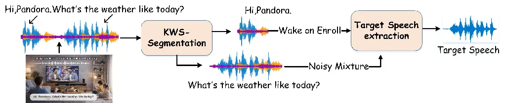
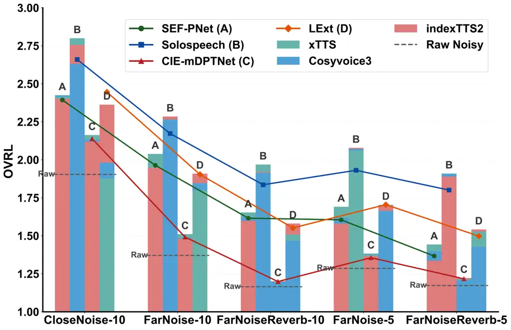
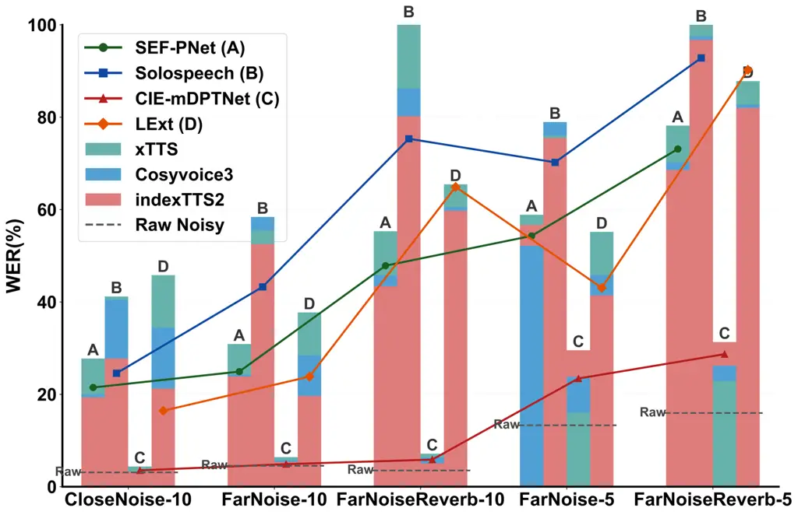

Yang Wang Guan Long

# Enroll-on-Wakeup: A First Comparative Study of Target Speech Extraction for Seamless Interaction in Real Noisy Human-Machine Dialogue Scenarios

Yiming    Guangyong    Haixin    Yanhua

###### Abstract

Target speech extraction (TSE) typically relies on pre-recorded
high-quality enrollment speech, which disrupts user experience and
limits feasibility in spontaneous interaction. In this paper, we propose
Enroll-on-Wakeup (EoW), a novel framework where the wake-word segment,
captured naturally during human-machine interaction, is automatically
utilized as the enrollment reference. This eliminates the need for
pre-collected speech to enable a seamless experience. We perform the
first systematic study of EoW-TSE, evaluating advanced discriminative
and generative models under real diverse acoustic conditions. Given the
short and noisy nature of wake-word segments, we investigate enrollment
augmentation using LLM-based TTS. Results show that while current TSE
models face performance degradation in EoW-TSE¹¹ 1
https://github.com/Yym-line/EoW-TSE, TTS-based assistance significantly
enhances the listening experience, though gaps remain in speech
recognition accuracy.

###### keywords

Target speech extraction, seamless interaction, EoW-TSE

^(†)^(†)address: ¹ Shanghai Normal University, Shanghai, China  
² Unisound AI Technology Co., Ltd., Beijing, China ^(†)^(†)email:
y2379286479@outlook.com, yanhua@shnu.edu.cn

## 1 Introduction

Target speech extraction (TSE) aims to isolate a specific speaker’s
voice from a multi-talker or noisy acoustic environment by leveraging a
set of auxiliary clues, such as a reference enrollment utterance from
the target speaker. Traditional TSE frameworks typically operate under
the assumption that a high-quality, pre-recorded enrollment signal is
readily available to guide the extraction backbone in characterizing the
speaker’s unique embedding \[1, 2, 3\]. However, in practical
human-machine dialogue scenarios, requiring users to provide a
pre-collected enrollment sample beforehand significantly disrupts the
fluidity of interaction and limits the system’s feasibility for
spontaneous or first-time users. To bridge this gap and enable truly
seamless interaction, it is essential to move toward an
“Enroll-on-Wakeup” (EoW) TSE. In this setting, the system must extract
the target speech using only the brief and often noise and interferer
corrupted wake-word segment captured during the initial triggering
phase, posing a significant yet necessary challenge for current TSE
research.

Existing methods for providing target speaker clues in TSE can be
broadly categorized into three paradigms: audio-only, audio-visual
(AV-TSE), and spatial-assisted auditory TSE. Audio-only-enrollment based
TSE primarily relies on pre-trained speaker verification models \[4\] or
dedicated speaker encoders \[5, 6, 7\] to extract target speaker
identity embeddings. Recently, speaker embedding-free methods \[8, 9,
10\] and waveform-level concatenation approaches \[11\] have
demonstrated robust performance across various TSE tasks. Despite their
success, these methods remain dependent on the requirement of
pre-recorded enrollment. To leverage multi-modal information, AV-TSE
\[12, 13, 14\] incorporates visual cues such as lip movements, while
recent works \[15\] integrate the linguistic knowledge of large language
models to compensate for acoustic degradation. However, AV-TSE is
fundamentally limited by line-of-sight requirements and raises
significant privacy and computational concerns for low-power embedded
devices. Alternatively, spatial-assisted TSE \[16, 17\] utilizes
multi-channel features or direction-of-arrival information to localize
the target speaker. While effective, these systems necessitate specific
multi-microphone array configurations, limiting their versatility across
diverse hardware.

Ultimately, regardless of the target speaker clues utilized, most
existing frameworks overlook the practical challenge of obtaining
high-quality references in spontaneous dialogue. The dependency on
pre-collected data or specialized hardware remains a bottleneck for
seamless human-machine interaction. To address these limitations, this
paper investigates the feasibility of TSE using only the intrinsic
information available during the interaction process itself.
Specifically, we propose an EoW-TSE that directly adopts the wake-word
segment as the enrollment reference. This approach eliminates the user’s
burden of manual enrollment. The main contributions are summarized as
follows:

- •
  We introduce the Enroll-on-Wakeup (EoW) TSE paradigm, utilizing the
  triggering wake-word as an automatic enrollment clue to facilitate
  zero-effort, seamless human-machine interaction.
- •
  We present the first systematic study of EoW-TSE, providing a
  comprehensive evaluation of advanced generative and discriminative
  models under diverse acoustic conditions and complex interferences;
- •
  We investigate enrollment augmentation methods using LLM-based TTS,
  demonstrating that synthetic enrollment significantly enhances
  perceptual quality under severe acoustic degradation, while
  identifying the remaining challenges in balancing speech
  intelligibility with ASR accuracy.

## 2 Problem Definition



Figure 1: Illustration of EoW-TSE system.

This section defines the Enroll-on-Wakeup (EoW) TSE framework,
illustrated in Figure 1. The goal of EoW-TSE is to extract target speech
from a continuous noisy mixture by using only the transient wake-word
segment as the enrollment reference.

### 2.1 Conventional TSE Formulation

In a traditional TSE task, the observed noisy mixture $`x(t)`$ in the
time domain is typically modeled as:

```math
x(t)=s(t)+n(t) \tag{1}
```

where $`s(t)`$ represents the clean target speech and $`n(t)`$ denotes
the sum of additive noise and interfering talkers. Standard models
isolate $`s(t)`$ by leveraging a high-quality enrollment utterance
$`e_{pre}`$, which is pre-recorded under controlled, clean conditions.
The extraction process can be expressed as:

```math
\hat{s}(t)=\mathcal{F}(x(t)\mid e_{pre};\Theta) \tag{2}
```

where $`\mathcal{F}`$ is the TSE mapping function and $`\Theta`$
represents the model parameters. As discussed in Section 1, the reliance
on a pre-collected $`e_{pre}`$ limits the system’s spontaneity and
disrupts the user experience.

### 2.2 The EoW-TSE Architecture and Challenges

Unlike the conventional approach, the proposed EoW-TSE derives the
target speaker enrollment clue directly from the interaction process. As
shown in Figure 1, the input stream contains the wake-up command (e.g.,
“Hi, Pandora”) followed immediately by the target query (e.g., “What’s
the weather like today?”). The workflow of EoW-TSE can be defined as
follows:

- •
  KWS-Segmentation: A keyword spotting (KWS) module segments the
  incoming stream into the wake-word segment $`x_{wake}`$ and the
  subsequent noisy mixture $`x_{query}`$;
- •
  Enroll-on-Wakeup: The system automatically utilizes $`x_{wake}`$ as
  the EoW reference. Unlike the static $`e_{pre}`$, $`x_{wake}`$ is
  inherently characterized by limited duration and acoustic corruption
  with environmental noise and interference;
- •
  Target Extraction: The TSE model uses this noisy, short-duration
  enrollment to extract the target speech $`\hat{s}_{query}`$ from the
  query mixture:

  ```math
  \hat{s}_{query}=\mathcal{F}(x_{query}\mid x_{wake};\Theta) \tag{3}
  ```

The core innovation of EoW-TSE lies in its zero-effort enrollment, which
enables seamless interaction without the conventional
“enroll-then-extract” constraint. However, this architecture shift
introduces significant challenges: the brevity of $`x_{wake}`$ falls to
provide robust target speaker clues, and real-time environmental
interference leads to “clue contamination”, resulting in significant
performance degradation.

## 3 Enroll-on-Wakeup TSE Systems

This section details our experimental framework for evaluating EoW-TSE.
We describe five real-world recording scenarios capturing diverse
acoustic environments, followed by the four advanced TSE models used in
our comparative study. Finally, we introduce the integration of
LLM-based TTS engines for enrollment augmentation.

### 3.1 Scenario Description

| Scenario          | Condition   | \#spk/#utt | Average duration (s) |         |
| ----------------- | ----------- | ---------- | -------------------- | ------- |
|                   |             |            | enrollment           | mixture |
| CloseNoise-10     | d=1, RT=0.4 | 45/503     | 1.08                 | 1.78    |
| FarNoise-10       | d=3, RT=0.4 | 45/502     | 1.08                 | 1.78    |
| FarNoiseReverb-10 | d=3, RT=0.6 | 30/278     | 1.17                 | 1.79    |
| FarNoise-5        | d=3, RT=0.4 | 45/503     | 1.08                 | 1.78    |
| FarNoiseReverb-5  | d=3, RT=0.6 | 15/226     | 0.97                 | 1.76    |

Table 1: Acoustic conditions of five EoW-TSE test scenarios. ‘$`d`$’
denotes distance to the microphone (m), ‘$`RT`$’ is the reverberation
time ($`RT_{60}`$ in seconds), and ‘\*-10/-5’ indicates SNR levels of
10dB and 5dB respectively.

To evaluate the robustness of EoW-TSE in real-world conditions, we
utilize an internal dataset collected by Unisound²² 2
https://www.unisound.com/ consisting of real-world recordings across
five distinct acoustic scenarios. These scenarios are designed to
reflect the complexities of actual human-machine dialogue, varying in
terms of speaker distance ($`d`$), reverberation time ($`RT_{60}`$), and
signal-to-noise ratio (SNR). The detailed statistics are summarized in
Table 1. The specific configurations and challenges are as follows:

- •
  Interference and Noise Types: In the CloseNoise scenario, the
  recording is conducted in a relatively clean environment. In contrast,
  the other four scenarios (FarNoise and FarNoiseReverb variants)
  feature a challenging acoustic background consisting of audio from a
  television variety show. Both the enrollment segments ($`x_{wake}`$)
  and the noisy mixtures ($`x_{query}`$) in these scenarios contain
  complex TV background noise, non-target human speech from the program,
  and additional spontaneous interfering talkers in the recording room.
- •
  Acoustic Variabilities: We evaluate the impact of distance by
  comparing close-talk ($`d=1`$m, CloseNoise) and far-field ($`d=3`$m,
  FarNoise) configurations. We also assess the impact of increased
  reverberation by varying $`RT_{60}`$ from 0.4s to 0.6s
  (FarNoiseReverb). To further test the noise robustness of TSE models,
  we include both 10dB and 5dB SNR levels under these far-field
  conditions.
- •
  Wake-up Phrases: The enrollment utilize two specific Chinese wake-up
  commands: “Hi, Pandora” or “Hello, Cube”.

As detailed in Table 1, our test set includes a diverse collection of
speakers, with 15 to 45 unique identities per scenario and over 2,000
utterances in total. Notably, the average enrollment duration
($`x_{wake}`$) is approximately 1.0s. This is significantly shorter than
the multi-second or multi-utterance enrollments used in conventional TSE
benchmarks. This brief duration, combined with the aforementioned
real-world interferences, highlights the critical target speaker
guidance information scarcity and contamination challenges of the
EoW-TSE.

### 3.2 Target Speech Extraction Systems

In this study, we evaluate four advance TSE models proposed in recent
years to assess their performance under the EoW-TSE paradigm, including
three discriminative systems (SEF-PNet\[9\], LExt\[11\], and CIE-mDPTNet
\[10\]) and one generative framework (SoloSpeech \[18\]).

#### 3.2.1 Discriminative TSE Models

SEF-PNet\[9\] is a speaker-embedding-free TSE model that directly
integrates enrollment and mixture using an interactive speaker
adaptation (ISA) module plus a local–global context aggregation (LCA)
mechanism. By performing iterative T-F domain interaction between the
enrollment and mixture, the model achieves robust personalized speech
enhancement without relying on external speaker encoders or pre-trained
speaker models. It has demonstrated superior performance across all
three TSE conditions on the Libri2Mix\[19\] benchmark.

LExt\[11\] simply prepends an enrollment utterance (plus a tiny glue
segment) to the mixture waveform so the network “hears” the target
speaker first. The model learns to use that artificial onset as a prompt
to extract the later target speech. This remarkably simple training-time
concatenation trick works with standard separator architectures (such as
TF-GridNet\[20\] or TF-LocoFormer\[21\]) and achieves strong TSE
performance on WSJ0-2mix\[22\] and WHAM\![23\]/ WHAMR\![24\].

CIE-mDPTNet\[10\] focuses on directly exploiting contextual information
in the T-F domain to overcome the limitations of insufficient context
utilization. It employs a simple attention mechanism to compute
correlation weights between the enrollment speech and the mixture.
Combined with a dual-path transformer architecture\[25\], it effectively
captures both short-term spectral variations and long-term temporal
dependencies, even in complex, multi-speaker TSE environments.

#### 3.2.2 Generative TSE Model

SoloSpeech\[18\] is a cascaded generative TSE pipeline comprising an
audio compressor, a speaker-embedding-free extractor, and a T-F domain
diffusion corrector. By operating in the latent space and employing an
iterative correction process, it effectively overcomes the artifacts and
naturalness degradation common in discriminative methods. It achieves
SOTA results in both intelligibility and perceptual quality,
demonstrating exceptional robustness in out-of-domain and real-world
scenarios.

### 3.3 Augment Enrollment with LLM-based TTS Models

The core challenge of EoW-TSE lies in the target guidance information
scarcity and contamination, as enrollment signals consist of extremely
short and noisy wake-up fragments. To address this, three SOTA zero-shot
generative TTS models are employed: the IndexTTS2 ³³ 3
[https://huggingface.co/IndexTeam/IndexTTS-2](https://huggingface.co/IndexTeam/IndexTTS-2)
\[26\], xTTS ⁴⁴ 4
[https://huggingface.co/coqui/XTTS-v2/tree/v2.0.2](https://huggingface.co/coqui/XTTS-v2/tree/v2.0.2)
\[27\], and CosyVoice3 ⁵⁵ 5
[https://huggingface.co/FunAudioLLM/Fun-CosyVoice3-0.5B-2512](https://huggingface.co/FunAudioLLM/Fun-CosyVoice3-0.5B-2512)\[28\].
By using $`x_{wake}`$ as an acoustic prompt, these models $`G(\cdot)`$
perform target-identity-preserving synthesis to generate high-fidelity,
clean enrollment speech. Two enrollment augmentation methods are
explored: 1) Clean Re-synthesis (CR): We re-synthesize the original
wake-up transcript $`t_{wake}`$ to produce a clean version
$`\hat{x}_{wake}=G(t_{wake}|x_{wake})`$, which serves as the sole
enrollment for EoW-TSE extraction; 2) Extended Concatenation (EC): To
increase identity-clue diversity, we generate an auxiliary clean segment
$`a_{gen}=G(t_{gen}|x_{wake})`$ using a ChatGPT-generated sentence
$`t_{gen}`$. This is then concatenated with the original segment to form
an extended enrollment: $`e_{aug}=[y_{wake}\oplus a_{gen}]`$.

These methods aim to evaluate whether substituting or augmenting
contaminated enrollment fragments with synthesized clean speech can
effectively stabilize the target speaker guidance under the EoW-TSE
scenario.

## 4 Experimental Setup

Datasets: We evaluate all models on the five-scenario test set detailed
in Table 1 at a 16 kHz sampling rate. For the discriminative systems:
SEF-PNet, CIE-mDPTNet, and LExt, they all are trained on the Libri2Mix
train-100 subset under the mix_both (2-speaker + noise) and min duration
modes. For the generative SoloSpeech, we used the original authors’
pre-trained checkpoint⁶⁶ 6
[https://wanghelin1997.github.io/SoloSpeech-Demo/](https://wanghelin1997.github.io/SoloSpeech-Demo/),
which was trained on the Libri2Mix train-360 subset under identical
mixture conditions.

Configurations: SEF-PNet and CIE-mDPTNet were trained for 130 epochs
using the Adam\[29\] optimizer with an initial learning rate (LR) of
5e-4 and L2-norm gradient clipping\[30\]. The LR was decayed by 0.98
every two epochs for the first 100 epochs, and by 0.9 thereafter. LExt
used an initial LR of 1e-4 with a weight decay of 1e-5. For its
TF-GridNet backbone, we adopted a more compact configuration than the
original TF-GridNetV1 \[11\] to ensure a fast training.

Evaluation Metrics: We employ SI-SDR\[31\], PESQ\[32\], and STOI\[33\]
to evaluate signal fidelity and quality, while DNSMOS\[34\] and word
error rate (WER) assess perceptual performance and intelligibility
across the five real-world scenarios. All WER results are calculated via
the Fun-ASR⁷⁷ 7
[https://huggingface.co/FunAudioLLM/Fun-ASR-Nano-2512](https://huggingface.co/FunAudioLLM/Fun-ASR-Nano-2512)\[35\]
service and the meeteval toolkit \[36\] to ensure consistent scoring
across diverse acoustic and segmentation conditions.

| Models               | SI-SDR | PESQ | STOI  | Params | MACs   |
| -------------------- | ------ | ---- | ----- | ------ | ------ |
| Mixture              | -1.96  | 1.08 | 64.73 | \-     | \-     |
| SEF-PNet \[9\]       | 8.18   | 1.55 | 82.67 | 6.08M  | 15.87G |
| CIE-mDPTNet \[10\]   | 9.47   | 1.78 | 85.35 | 2.9M   | 48.3G  |
| $`\star`$LExt \[11\] | 10.47  | 1.88 | 87.26 | 3.9M   | 61.0G  |
| SoloSpeech \[18\]    | 11.12  | 1.89 | \-    | 590.9M | \-     |

MACs are theoretically computed based on model architecture.

Table 2: Results on Libri2Mix 2-Speaker+Noise. $`\star`$ are the results
reproduced by us.

| Conditions        | DNSMOS $`\uparrow`$ |       |           |            | WER $`\downarrow`$ |       |           |            |
| ----------------- | ------------------- | ----- | --------- | ---------- | ------------------ | ----- | --------- | ---------- |
|                   | Noisy               | xTTS  | IndexTTS2 | CosyVoice3 | Noisy              | xTTS  | IndexTTS2 | CosyVoice3 |
| CloseNoise-10     | 2.029               | 2.472 | 2.564     | 2.609      | 14.61              | 39.76 | 11.23     | 40.36      |
| FarNoise-10       | 1.590               | 2.464 | 2.237     | 2.428      | 27.74              | 40.04 | 19.27     | 54.88      |
| FarNoiseReverb-10 | 1.262               | 2.549 | 1.917     | 2.114      | 19.69              | 33.45 | 16.10     | 59.71      |
| FarNoise-5        | 1.440               | 2.274 | 2.063     | 2.400      | 45.13              | 46.57 | 36.58     | 80.62      |
| FarNoiseReverb-5  | 1.251               | 2.473 | 1.743     | 2.107      | 70.58              | 55.86 | 44.47     | 102.54     |

Table 3: Results on enrollments synthesized using different TTS models.

| Conditions        | DNSMOS $`\uparrow`$ |           |                |          |               | WER $`\downarrow`$ |          |               |          |               |
| ----------------- | ------------------- | --------- | -------------- | -------- | ------------- | ------------------ | -------- | ------------- | -------- | ------------- |
|                   | Noisy               | xTTS (CR) | IndexTTS2 (CR) | xTTS(EC) | IndexTTS2(EC) | Noisy              | xTTS(CR) | IndexTTS2(CR) | xTTS(EC) | IndexTTS2(EC) |
| CloseNoise-10     | 1.904               | 2.163     | 2.119          | 2.197    | 2.170         | 3.10               | 4.37     | 3.24          | 3.91     | 3.48          |
| FarNoise-10       | 1.371               | 1.511     | 1.481          | 1.527    | 1.500         | 4.54               | 6.41     | 5.38          | 6.81     | 5.14          |
| FarNoiseReverb-10 | 1.165               | 1.202     | 1.200          | 1.214    | 1.195         | 3.52               | 7.15     | 5.06          | 7.00     | 6.08          |
| FarNoise-5        | 1.286               | 1.379     | 1.366          | 1.396    | 1.371         | 13.31              | 16.01    | 29.55         | 15.92    | 25.61         |
| FarNoiseReverb-5  | 1.173               | 1.216     | 1.223          | 1.217    | 1.212         | 15.95              | 22.89    | 31.32         | 23.12    | 28.36         |

Table 4: EoW-TSE results with different enrollment augmentation methods
on CIE-mDPTNet.

## 5 Results and Discussion

### 5.1 Results on Libri2mix 2spk+noise Condition

Table 2 shows the comparative performance of the selected models on the
challenging Libri2Mix 2-speaker+noise condition. We evaluate a diverse
set of architectures varying in parameter size and computational
complexity (MACs). Among discriminative models, LExt achieves the best
performance. The generative SoloSpeech attains SOTA results in both
SI-SDR and PESQ. Overall, all selected models exhibit competitive
performance, establishing a robust baseline for investigating their
behavior under the more constrained EoW-TSE scenarios.

### 5.2 Overall Performance of EoW-TSE Systems

Figures 2 and 3 show the results of four advanced TSE models under the
EoW-TSE paradigm. Regarding perceptual quality, the generative
SoloSpeech consistently achieves the highest OVRL scores across all
scenarios, followed by SEF-PNet and LExt with comparable performance,
while CIE-mDPTNet lags behind. However, this trend reverses in the
speech intelligibility measured by WER. CIE-mDPTNet demonstrates the
most robust ASR performance, whereas SoloSpeech suffers from a dramatic
WER increase as environmental complexity intensifies (e.g., in far-field
and reverberant conditions). Notably, none of these TSE models
outperforms the raw noisy mixture’s direct WER in these challenging
scenarios. This discrepancy suggests that while generative models are
great at generating high-quality speech, they may introduce phonetic
distortions that hinder ASR accuracy, highlighting a critical area for
future optimization in EoW-TSE research.



Figure 2: OVRL scores on five scenarios: Original EoW-TSE vs.
TTS-augmented (CR).



Figure 3: WERs on five scenarios: Original EoW-TSE vs. TTS-augmented
(CR).

### 5.3 Effect of Synthetic Enrollment

Results in Table 3 aim to assess the quality of synthetic enrollment
generated by IndexTTS2, xTTS and CosyVoice3. It is clear to see that
while xTTS and CosyVoice3 achieve superior DNSMOS, only IndexTTS2
consistently reduces the WER compared to raw noisy enrollment. This
trend is mirrored in Figures 2 and 3, where IndexTTS2-augmented models
(red bars) significantly outperform other synthetic variants in speech
intelligibility, effectively stabilizing the TSE output.

Table 4 further explores the impact of the proposed enrollment
augmentation methods on the most WER robust TSE system, CIE-mDPTNet.
While both Clean Re-synthesis (CR) and Extended Concatenation (EC)
consistently improve the DNSMOS of the extracted target speech compared
to the noisy mixture, neither method succeeds in reducing the WER. This
trend aligns with the findings in Figure 3, confirming that existing TSE
models introduce significant phonetic distortion while suppressing
noise, thereby hindering ASR performance even with enhanced guidance.
Notably, although the EC method marginally improves perceptual quality
over CR, it offers comparable WER, suggesting that simply increasing
enrollment duration does not effectively compensate for these
intelligibility losses. These results underscore a critical challenge in
EoW-TSE: while zero-shot LLM-based TTS effectively mitigates guidance
contamination, balancing perceptual enhancement with linguistic fidelity
remains an open problem.

## 6 Conclusion

This paper presents the first systematic study of TSE under the
Enroll-on-Wakeup paradigm. Our evaluation across five real-world
scenarios reveals a clear perceptual-recognition gap: while advanced TSE
models, especially generative ones, can notably improve audio quality,
they often fail in ASR performance. We show that current TSE systems
fall short of ideal performance when limited to a one-second wake-up
reference. Furthermore, while TTS helps reduce enrollment noise, the
trade-off between speech perceptual and intelligibility remains a major
bottleneck. These findings establish a key baseline and offer practical
guidelines for building next-generation robust EoW-TSE systems for
seamless human-machine interaction.

## 7 Generative AI Use Disclosure

The authors only used an LLM-based tool (ChatGPT) to generate sentence
texts randomly as input for enrollment augment with Extended
Concatenation (EC) models. The ideas, experimental design, code,
analysis, and results of this study did not use any generative
artificial intelligence techniques, and all content is original to the
authors.

## References

- \[1\] K. Žmolíková, M. Delcroix, K. Kinoshita, T. Ochiai, T.
  Nakatani, L. Burget, and J. Černockỳ (2019) Speakerbeam: Speaker aware
  neural network for target speaker extraction in speech mixtures. IEEE
  Journal of Selected Topics in Signal Processing 13 (4), pp. 800–814.
  Cited by: §1.
- \[2\] Q. Wang, H. Muckenhirn, K. W. Wilson, et al. (2018) VoiceFilter:
  Targeted Voice Separation by Speaker-Conditioned Spectrogram Masking.
  In Proc. Interspeech, Cited by: §1.
- \[3\] H. Wang, C. Liang, S. Wang, et al. (2022) Wespeaker: A Research
  and Production Oriented Speaker Embedding Learning Toolkit. In Proc.
  ICASSP, pp. 1–5. Cited by: §1.
- \[4\] B. Desplanques, J. Thienpondt, and K. Demuynck (2020)
  ECAPA-TDNN: Emphasized Channel Attention, Propagation and Aggregation
  in TDNN Based Speaker Verification. In Proc. Interspeech,
  pp. 3830–3834. Cited by: §1.
- \[5\] C. Xu, W. Rao, E. S. Chng, et al. (2020) SpEx: Multi-Scale Time
  Domain Speaker Extraction Network. IEEE/ACM Transactions on Audio,
  Speech, and Language Processing 28, pp. 1370–1384. Cited by: §1.
- \[6\] M. Ge, C. Xu, L. Wang, et al. (2020) SpEx+: A Complete Time
  Domain Speaker Extraction Network. In Proc. Interspeech, Cited by: §1.
- \[7\] J. Chen, W. Rao, Z. Wang, et al. (2023) MC-SpEx: Towards
  Effective Speaker Extraction with Multi-Scale Interfusion and
  Conditional Speaker Modulation. In Proc. Interspeech, Cited by: §1.
- \[8\] B. Zeng and M. Li (2025) USEF-TSE: Universal Speaker Embedding
  Free Target Speaker Extraction. IEEE Transactions on Audio, Speech and
  Language Processing. Cited by: §1.
- \[9\] Z. Huang, H. Guan, H. Wei, and Y. Long (2025) SEF-PNet: Speaker
  Encoder-Free Personalized Speech Enhancement with Local and Global
  Contexts Aggregation. In Proc. ICASSP, pp. 1–5. Cited by: §1, §3.2.1,
  §3.2, Table 2.
- \[10\] X. Yang, C. Bao, J. Zhou, and X. Chen (2024) Target speaker
  extraction by directly exploiting contextual information in the
  time-frequency domain. In Proc. ICASSP, pp. 10476–10480. Cited by: §1,
  §3.2.1, §3.2, Table 2.
- \[11\] P. Shen, K. Chen, S. He, et al. (2025) Listen to Extract:
  Onset-Prompted Target Speaker Extraction. IEEE Transactions on Audio,
  Speech and Language Processing 33, pp. 4832–4843. Cited by: §1,
  §3.2.1, §3.2, Table 2, §4.
- \[12\] J. Lin, X. Cai, H. Dinkel, et al. (2023) Av-Sepformer:
  Cross-Attention Sepformer for Audio-Visual Target Speaker Extraction.
  In Proc. ICASSP, pp. 1–5. Cited by: §1.
- \[13\] J. Li, K. Zhang, S. Wang, et al. (2025) MoMuSE: Momentum
  Multi-modal Target Speaker Extraction for Real-time Scenarios with
  Impaired Visual Cues. In Proc. IEEE International Conference on
  Multimedia and Expo (ICME), pp. 1–6. Cited by: §1.
- \[14\] Z. Pan, G. Wichern, Y. Masuyama, et al. (2023) Scenario-aware
  audio-visual TF-Gridnet for target speech extraction. In Proc.
  Workshop on IEEE Automatic Speech Recognition and Understanding
  (ASRU), pp. 1–8. Cited by: §1.
- \[15\] W. Wu, S. Wang, X. Wu, H. Meng, and H. Li (2025) ELEGANCE:
  Efficient LLM Guidance for Audio-Visual Target Speech Extraction.
  arXiv preprint arXiv:2511.06288. Cited by: §1.
- \[16\] M. Ge, C. Xu, L. Wang, et al. (2022) L-SpEx: Localized Target
  Speaker Extraction. In Proc. ICASSP, pp. 7287–7291. Cited by: §1.
- \[17\] D. Alcala Padilla, N. L. Westhausen, S. Vivekananthan,
  and B. T. Meyer (2025) Location-aware target speaker extraction for
  hearing aids. In Proc. Interspeech, pp. 2975–2979. Cited by: §1.
- \[18\] H. Wang, J. Hai, D. Yang, et al. (2025) SoloSpeech: Enhancing
  Intelligibility and Quality in Target Speech Extraction through a
  Cascaded Generative Pipeline. arXiv preprint arXiv:2505.19314. Cited
  by: §3.2.2, §3.2, Table 2.
- \[19\] J. Cosentino, M. Pariente, S. Cornell, A. Deleforge, and E.
  Vincent (2020) Librimix: An open-source dataset for generalizable
  speech separation. arXiv preprint arXiv:2005.11262. Cited by: §3.2.1.
- \[20\] Z. Wang, S. Cornell, S. Choi, et al. (2023) TF-GridNet:
  Integrating full-and sub-band modeling for speech separation. IEEE/ACM
  Transactions on Audio, Speech, and Language Processing 31,
  pp. 3221–3236. Cited by: §3.2.1.
- \[21\] K. Saijo, G. Wichern, F. G. Germain, et al. (2024)
  TF-Locoformer: Transformer with local modeling by convolution for
  speech separation and enhancement. In Proc. Workshop on International
  Acoustic Signal Enhancement (IWAENC), pp. 205–209. Cited by: §3.2.1.
- \[22\] J. R. Hershey, Z. Chen, J. Le Roux, and S. Watanabe (2016) Deep
  clustering: Discriminative embeddings for segmentation and separation.
  In Proc. ICASSP, pp. 31–35. Cited by: §3.2.1.
- \[23\] G. Wichern, J. Antognini, M. Flynn, et al. (2019) WHAM!:
  Extending speech separation to noisy environments. arXiv preprint
  arXiv:1907.01160. Cited by: §3.2.1.
- \[24\] M. Maciejewski, G. Wichern, E. McQuinn, and J. Le Roux (2020)
  WHAMR!: Noisy and reverberant single-channel speech separation. In
  Proc. ICASSP, pp. 696–700. Cited by: §3.2.1.
- \[25\] J. Chen, Q. Mao, and D. Liu (2020) Dual-path transformer
  network: Direct context-aware modeling for end-to-end monaural speech
  separation. In Proc. Interspeech, pp. 2642–2646. Cited by: §3.2.1.
- \[26\] S. Zhou, Y. Zhou, Y. He, et al. (2025) IndexTTS2: A
  Breakthrough in Emotionally Expressive and Duration-Controlled
  Auto-Regressive Zero-Shot Text-to-Speech. arXiv preprint
  arXiv:2506.21619. Cited by: §3.3.
- \[27\] E. Casanova, K. Davis, E. Gölge, et al. (2024) XTTS: a
  Massively Multilingual Zero-Shot Text-to-Speech Model. In Proc.
  Interspeech, Cited by: §3.3.
- \[28\] Z. Du, C. Gao, Y. Wang, et al. (2025) Cosyvoice 3: Towards
  in-the-wild speech generation via scaling-up and post-training. arXiv
  preprint arXiv:2505.17589. Cited by: §3.3.
- \[29\] D. Kinga J. B. Adam et al. (2015) A method for stochastic
  optimization. In Proc. International conference on learning
  representations (ICLR), Vol. 5. Cited by: §4.
- \[30\] J. Zhang, T. He, S. Sra, and A. Jadbabaie (2019) Why gradient
  clipping accelerates training: A theoretical justification for
  adaptivity. arXiv preprint arXiv:1905.11881. Cited by: §4.
- \[31\] J. Le Roux, S. Wisdom, H. Erdogan, and J. R. Hershey (2019)
  SDR–half-baked or well done?. In Proc. ICASSP, pp. 626–630. Cited by:
  §4.
- \[32\] A. W. Rix, J. G. Beerends, M. P. Hollier, and A. P.
  Hekstra (2001) Perceptual evaluation of speech quality (PESQ)-a new
  method for speech quality assessment of telephone networks and codecs.
  In Proc. ICASSP, Vol. 2, pp. 749–752. Cited by: §4.
- \[33\] C. H. Taal, R. C. Hendriks, R. Heusdens, and J. Jensen (2010) A
  short-time objective intelligibility measure for time-frequency
  weighted noisy speech. In Proc. ICASSP, pp. 4214–4217. Cited by: §4.
- \[34\] C. K. Reddy, V. Gopal, and R. Cutler (2022) DNSMOS P. 835: A
  non-intrusive perceptual objective speech quality metric to evaluate
  noise suppressors. In Proc. ICASSP, pp. 886–890. Cited by: §4.
- \[35\] K. An, Y. Chen, Z. Chen, C. Deng, et al. (2025) Fun-asr
  technical report. arXiv preprint arXiv:2509.12508. Cited by: §4.
- \[36\] T. von Neumann, C. Boeddeker, M. Delcroix, and R.
  Haeb-Umbach (2023) MeetEval: A Toolkit for Computation of Word Error
  Rates for Meeting Transcription Systems. In Proc. 7th International
  Workshop on Speech Processing in Everyday Environments (CHiME 2023),
  pp. 27–32. Cited by: §4.
