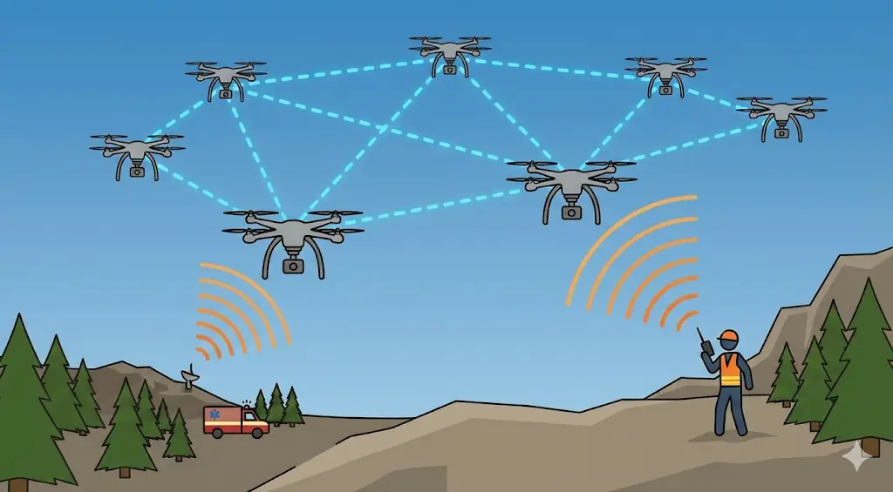
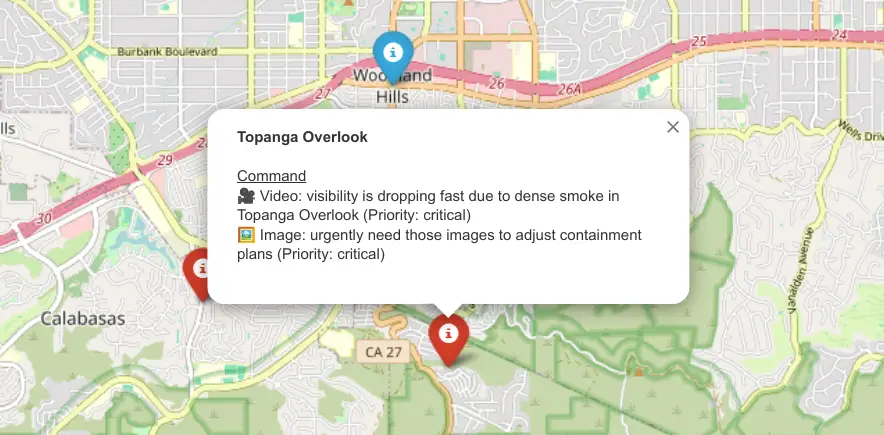

# Voice-Driven Semantic Perception for UAV-Assisted Emergency Networks Thanks: This work is co-financed by Component 5 - Capitalization and Business Innovation, integrated in the Resilience Dimension of the Recovery and Resilience Plan within the scope of the Recovery and Resilience Mechanism (MRR) of the European Union (EU), framed in the Next Generation EU, for the period 2021 - 2026, within project NEXUS, with reference 53.

Nuno Saavedra, Pedro Ribeiro, André Coelho, Rui Campos
Affiliation: INESC TEC and Faculdade de Engenharia, Universidade do
Porto, Portugal  
{nuno.m.carvalho, pedro.m.ribeiro, andre.f.coelho,
rui.l.campos}@inesctec.pt

###### Abstract

Unmanned Aerial Vehicle (UAV)-assisted networks are increasingly
foreseen as a promising approach for emergency response, providing
rapid, flexible, and resilient communications in environments where
terrestrial infrastructure is degraded or unavailable. In such
scenarios, voice radio communications remain essential for first
responders due to their robustness; however, their unstructured nature
prevents direct integration with automated UAV-assisted network
management. This paper proposes SIREN, an AI-driven framework that
enables voice-driven perception for UAV-assisted networks. By
integrating Automatic Speech Recognition (ASR) with Large Language Model
(LLM)–based semantic extraction and Natural Language Processing (NLP)
validation, SIREN converts emergency voice traffic into structured,
machine-readable information, including responding units, location
references, emergency severity, and Quality-of-Service (QoS)
requirements. SIREN is evaluated using synthetic emergency scenarios
with controlled variations in language, speaker count, background noise,
and message complexity. The results demonstrate robust transcription and
reliable semantic extraction across diverse operating conditions, while
highlighting speaker diarization and geographic ambiguity as the main
limiting factors. These findings establish the feasibility of
voice-driven situational awareness for UAV-assisted networks and show a
practical foundation for human-in-the-loop decision support and adaptive
network management in emergency response operations.

###### Index Terms: 

Artificial Intelligence, automatic speech recognition, emergency
communications, Large Language Models, UAV networks.

## I Introduction

In emergency scenarios, first responders continue to rely on voice radio
transmissions due to their robustness under harsh conditions. However,
while effective for basic coordination, voice communications are
inherently unstructured, limiting their integration with automated
systems and constraining coordinated decision-making and situational
awareness.

UAVs, acting as airborne communication relays, enable the rapid
deployment of flying networks that restore connectivity in affected
areas. Beyond supporting voice traffic, these networks can deliver
media-rich data such as images, video, and sensor measurements, thereby
enhancing situational awareness and enabling more informed operational
decisions. Their inherent flexibility makes UAV-assisted networks
particularly suitable for temporary and highly dynamic emergency
operations, where communication demands and network topology must
continuously adapt.

When integrated into UAV-assisted network management, semantic
perception extracted from field communications can inform adaptive
decisions such as UAV positioning, trajectory adjustment, and
communication resource allocation, including the prioritization of
links, bandwidth, and mission-critical traffic. In emergency operations,
many of these operational needs are conveyed implicitly or explicitly
through voice exchanges among first responders. Consequently, voice
communications constitute a rich yet largely underutilized source of
semantic perception for UAV-assisted network management.

Recent advances in Automatic Speech Recognition (ASR) and Large Language
Models (LLMs) \[1, 2\], have enabled the transformation of unstructured
voice communications into actionable information. By analyzing voice
communications, these technologies can extract semantic entities such as
location references, emergency severity levels, and Quality-of-Service
(QoS) requirements. This semantic inference complements traditional
telemetry by providing contextual awareness in scenarios where other
sensing information, such as imagery, is limited, degraded, or
unavailable. Although NLP-enhanced ASR has already demonstrated its
value for situational awareness in domains such as air traffic
control \[3\], the exploitation of voice-derived semantic perception as
a direct input for adaptive UAV-assisted network management remains
largely unexplored, specifically for UAV positioning and resource
allocation in UAV-assisted emergency response scenarios.

This paper proposes SIREN, an AI-driven framework designed to function
as a voice-driven semantic perception layer by extracting structured
information from emergency voice communications. To the best of our
knowledge, SIREN is the first approach to jointly integrate ASR, LLMs,
and NLP techniques, including Named Entity Recognition (NER) \[4\] for
location validation, speaker diarization for unit attribution, and
sentiment analysis for emergency severity analysis, in order to
interpret emergency audio streams. It is worth noting that SIREN does
not perform network management or UAV deployment decisions itself;
instead, it produces structured semantic outputs to support
human-in-the-loop decision-making and existing network planning and
control algorithms. This capability enables its direct use as a
perception input for adaptive UAV-assisted network management, as
illustrated in Fig. 1. A preliminary version of this work was presented
in \[5\].

The main contributions of this work are two-fold:

1.  1.  SIREN, a modular AI-based framework that transforms unstructured
        emergency voice communications into structured, machine-readable
        perception inputs suitable for UAV-assisted network management
        tasks, such as UAV positioning and communication resource
        allocation.
2.  2.  A comprehensive performance evaluation of SIREN across five
        synthetic emergency communication scenarios with varying language,
        number of speakers, message complexity, and background noise,
        demonstrating the feasibility of the proposed solution while
        identifying key limitations, including speaker diarization errors
        and geographic ambiguity.



Fig. 1: UAV-assisted emergency network where SIREN extracts voice
semantics to support ground response units.

## II Related Work

In scenarios where terrestrial infrastructure may be damaged or
unavailable, UAVs can act as airborne relays and access points, where
performance is strongly affected by UAV mobility and traffic demand,
requiring continuous adaptation of UAV positioning and communications
resources \[6\]. Many UAV placement solutions still rely on assumptions
about user locations, traffic demand, and channel conditions \[7, 6\],
which may not hold in dynamic emergency environments.

Perception is a core capability in emerging UAV-assisted networks,
typically driven by computer vision for detection and tracking \[8\].
While computer vision provides rich spatial information, it degrades
under occlusions, illumination changes, and adverse conditions common in
disasters. Audio-based perception is a promising complement to vision by
reducing reliance on line-of-sight and lighting \[9\].

In parallel, LLMs are increasingly used as cognitive layers that operate
on structured semantic representations to bridge perception and
decision-making, enabling contextual interpretation and intent inference
in UAV systems \[1\]. Representative frameworks show LLM-based spatial
reasoning and multimodal interpretation when operating on structured
outputs from perception modules \[2\]. Despite these advances, most
LLM-enabled UAV perception frameworks remain vision-centric and focus on
sensor-derived data.

The use of unstructured emergency voice communications as a semantic
perception source, capturing operational intent, urgency, and contextual
requirements from first responders, remains largely unexplored. Although
agentic architectures for UAV-assisted networks have considered
separating perception from decision-making via structured semantic
representations \[10\], such frameworks remain largely conceptual. The
integration of voice-based operational information is proposed only as a
potential future direction, lacking concrete implementations.

## III SIREN framework

This section introduces SIREN, an AI-driven framework that converts
unstructured emergency voice communications into structured,
machine-readable semantic representations. We describe the end-to-end
pipeline (cf. Fig. 2) from raw audio to structured outputs, designed for
integration with UAV-assisted network management functions such as UAV
positioning and communications resource allocation.

### III-A System design

Each stage of the pipeline is described in the following.

#### III-A1 Automatic Speech Recognition

The ASR stage performs speech-to-text conversion and is designed to
accommodate different approaches, depending on the operational context.
The pipeline supports the integration of lightweight local models for
offline processing in connectivity-constrained environments, as well as
cloud-based APIs that allow for high-accuracy transcription, especially
under noisy conditions, and enable advanced features such as speaker
diarization and sentiment analysis.

#### III-A2 Information extraction

The information extraction stage processes the transcribed text through
a modular LLM component, which can be deployed either locally or via
cloud-based services. To ensure reliability, the system employs
schema-constrained prompting to define specific output fields, such as
location, units, emergency_level, and QoS expectations. The LLM output
is validated against this schema to mitigate hallucinations and to
ensure interoperability with UAV control and network management systems
(cf. Listing 3).

To further enhance reliability, the extracted information is
cross-validated using complementary NLP techniques. NER is applied to
verify geographic entities, and, when a cloud-based API is available,
speaker diarization and sentiment analysis may be employed to improve
unit attribution and to refine emergency severity estimation,
respectively.

Fig. 2: SIREN pipeline, comprising ASR, Information Extraction,
integrating LLM inference with NLP validation, and generation of
structured outputs.

#### III-A3 Output information

The SIREN framework produces a structured representation (e.g., a JSON
object) designed for integration with state-of-the-art solutions for
network management, such as UAV positioning, network planning, and
communications resource allocation. Listing 3 provides a reference
example of this representation and its main semantic categories. This
structured output may also serve as support for human-in-the-loop
decision-making.

The structured output includes three main semantic categories. First,
the locations field aggregates geographic references mentioned in the
communication (e.g., street names or landmarks). Second, the
emergency_level field indicates the severity of the situation (e.g.,
critical, minor). These emergency level categories are predefined in the
prompt, and the model selects one based solely on the content of the
communication. Third, the units structure describes the active
responders and their associated attributes. It is worth mentioning that
only information explicitly stated in the communication is included; no
additional inference or geocoding-based enrichment is performed.

{

"locations": \[

"Stow Lake",

"Gold Star Mother’s Rock"

\],

"emergency_level": "Critical",

"units": \[

{

"name": "Unit Alpha",

"location": "Gold Star Mother’s Rock",

"video_support": {

"needed": true,

"issue": "Poor signal; need uplink for fire assessment.",

"priority": "high",

"requirements": "10 Mbit/s"

},

"times_intervened": 6

}

\]

}

Fig. 3: Example of structured semantic output generated by SIREN from
emergency voice communications.

For each identified unit, SIREN associates the reported location
reference with the extracted locations and populates the
times_intervened field, which reflects the number of interactions in the
communication and indicates operational relevance. The video_support and
image_support fields capture QoS expectations, including the requested
support type, a brief justification, a priority level, and an indicative
throughput requirement (in $`\mathrm{Mbit/s}`$). These throughput values
are intended as expectations rather than precise measurements. Requiring
explicit justifications further acts as a grounding mechanism, improving
transparency, reducing ambiguity in support requests, and mitigating the
risk of hallucinated requirements.



Fig. 4: Interactive map interface depicting a geo-referenced unit and
its specific communication requirements extracted by SIREN.

### III-B System implementation

In its current implementation, SIREN’s pipeline relies on a local
instance of OpenAI Whisper \[11\] for offline ASR or on the Assembly
API \[12\], a cloud-based ASR API. Information extraction is handled by
the LLaMA 3.2 model \[13\] deployed locally via the Ollama
framework \[14\], which provides the inference engine to identify
location references, unit identifiers, emergency levels, and QoS
expectations. To enforce the design’s requirement for structured data, a
strict JSON schema is applied at the prompt level.

Given the probabilistic nature of the LLM outputs, they are audited by a
validation layer comprising three deterministic NLP-based modules.
First, Named Entity Recognition (NER) via the SpaCy library \[15\]
cross-checks geographic entities extracted by the LLM. Second, speaker
diarization results from the Assembly API are cross-referenced with
extracted units to flag potential hallucinations. Third, sentiment
analysis provided by the API calibrates the emergency severity level
(e.g., escalating a ”moderate” classification to ”severe” if distress is
detected).

Finally, validated location entities are mapped to geographic
coordinates using Geopy \[16\] and rendered through an interactive
web-based interface using Folium \[17\]. As depicted in Fig. 4, this
interactive map displays the identified units and their specific
communications requirements, providing operators with quick situational
awareness. While the structured output is designed to support autonomous
network management, this visualization ensures that human operators can
monitor and validate the semantic context of voice communications.

## IV Performance evaluation and results

This section presents the performance evaluation of SIREN in terms of
transcription accuracy, output quality, and execution time. The goal is
to assess the feasibility and behavior of SIREN under diverse operating
conditions.

### IV-A Audio dataset 

Authentic emergency communication datasets are scarce due to privacy,
legal, and sensitivity constraints. A reference state-of-the-art
dataset, RescueSpeech \[18\], contains annotated German
search-and-rescue (SAR) recordings; however, it lacks continuous,
multi-speaker conversational structure, making it unsuitable for the
objectives of this work. Consequently, we generated a synthetic dataset
in two stages: LLMs created coherent, multi-speaker emergency dialogues,
which were then converted into speech using the ElevenLabs
text-to-speech (TTS) system ¹¹ 1
https://github.com/Slyfenon/SIREN-audio_files. Multiple distinct voices
were employed to emulate different first responders for increased
realism. Additionally, noisy variants of the original audio were
generated using Python post-processing techniques to assess robustness
under degraded acoustic conditions.

The dataset is organized into five scenarios grouped into three levels
of complexity, designed to assess the SIREN framework across linguistic
and operational dimensions:

- •
  Low-complexity scenario
  - –
    Scenario 1: It is the simplest scenario. It consists of short,
    well-structured emergency dialogues in English, involving four
    distinct speakers and three location references. Both clean and
    noisy audio versions are included. Duration: 1 min 10 s.

- •
  Medium-complexity scenarios
  - –
    Scenario 2: This scenario increases difficulty by introducing longer
    dialogues and richer operational context. It maintains four speakers
    but includes a greater number of location references. Duration:
    1 min 28 s.
  - –
    Scenario 3: Closely mirrors the structure of Scenario 2 to validate
    consistency. It features similar linguistic patterns, speaker and
    location counts as Scenario 2. Duration: 1 min 30 s.

- •
  High-complexity scenarios
  - –
    Scenario 4: This scenario introduces audio in Portuguese language,
    referencing geographical locations in Portugal. It contains four
    speakers, language-specific characteristics, such as pronunciation
    differences, syntactic variation, and ambiguous place names. These
    introduce further challenges, particularly for models optimized for
    English. Duration: 1 min 54 s.
  - –
    Scenario 5: The most complex scenario. It includes six distinct
    speakers, an increased number of locations, and dialogue that is
    less explicit regarding speaker identification and QoS expectations.
    Duration: 1 min 41 s.

### IV-B Hardware specification

All experiments were conducted on a single machine with the following
specifications: Ubuntu 22.04 operating system, an AMD Ryzen 5 5600H
processor (12 threads at 3.3 GHz), and an NVIDIA GeForce RTX 3050 laptop
GPU with 4 GB of VRAM. To ensure measurement accuracy and consistency,
no significant background processes were active during testing.

### IV-C Transcription quality assessment

Transcription quality was evaluated using the Word Error Rate (WER), a
standard performance metric for ASR systems, as defined in Eq. 1, where
$`S`$, $`D`$, and $`I`$ represent the number of substitutions,
deletions, and insertions, respectively, and $`N`$ is the number of
words in the reference transcript, as defined in \[19\].

```math
\mathrm{WER}=\frac{S+D+I}{N}, \tag{1}
```

Table I compares the performance of the Assembly API-based and local
Whisper models under clean and noisy audio conditions. Results are
reported as WER (%) with the corresponding substitution, deletion, and
insertion counts shown in parentheses as (S/D/I). In clean audio
conditions, both models achieve relatively low WER values; however, the
API-based model consistently outperforms the local model, primarily due
to fewer substitution errors.

Under noisy conditions, WER increases for both models; however, the
degradation is substantially greater for the local Whisper model. This
effect is most evident in Scenario 2, where the local Whisper WER rises
from 15.31% to 39.80%, while the API-based model shows a more moderate
increase from 12.76% to 17.86% (mean over 10 iterations). The observed
differences can be justified by model size. The local Whisper
implementation uses a smaller model variant due to hardware constraints,
limiting its ability to generalize under noisy conditions. These results
indicate that transcription quality is primarily influenced by model
capacity and training data. As such, the external API-based model is
better suited for deployment in settings with variable or degraded audio
quality, as it offers higher transcription accuracy and robustness.

|          |                 |                 |                 |                   |
| -------- | --------------- | --------------- | --------------- | ----------------- |
| Scenario | Assembly API    |                 | Local Whisper   |                   |
|          | Clean           | Noisy           | Clean           | Noisy             |
| 1        | 7.84 (6/0/6)    | 8.50 (7/0/6)    | 12.42 (14/0/5)  | 14.38 (15/2/5)    |
| 2        | 12.76 (15/0/10) | 17.86 (22/3/10) | 15.31 (19/1/10) | 39.80 (52/10/16)  |
| 3        | 10.64 (13/2/10) | 10.64 (13/2/10) | 10.64 (9/8/8)   | 13.19 (20/2/9)    |
| 4        | 6.25 (9/0/6)    | 7.50 (12/0/6)   | 10.42 (15/0/10) | 12.08 (19/0/10)   |
| 5        | 18.67 (23/3/16) | 16.89 (22/1/15) | 17.78 (22/0/18) | 18.67 (24/1/17)   |
| Total    | 11.34 (66/5/48) | 12.30 (76/6/47) | 13.25 (79/9/51) | 19.26 (130/15/57) |

TABLE I: WER and Error Breakdown (Clean vs Noisy Audio)

### IV-D Output quality assessment

Output quality was evaluated across the same five scenarios that
comprise the created dataset, as described in Section IV-A. Each
scenario included five independent runs and featured both clean and
noisy audio conditions. All runs were processed using the external
transcription API, as the transcription quality assessment indicated
higher transcription accuracy and stability compared to the local
Whisper model.

#### IV-D1 Evaluation metrics

We assessed output quality along four dimensions: i) location
identification; ii) unit extraction; iii) speaker count estimation; and
iv) QoS expectation extraction.

- •
  Location identification: This measures the ability to extract
  geographic references explicitly mentioned in the audio, such as
  street names or landmarks, which are central to situational awareness.
  Performance relies on the accuracy of the transcription. Since
  geocoding is performed by an external service, any geocoding errors
  are not attributed to SIREN.
- •
  Unit extraction: This measures the ability to identify operational
  units and associate them with their corresponding location references.
  Accurate unit identification is crucial for emergency coordination, as
  mislabeling a unit or incorrectly attributing its location can lead to
  suboptimal resource allocation.
- •
  Speaker count estimation: This measures the diarization component’s
  ability to estimate the number of distinct speakers present in the
  audio, even in cases with similar vocal characteristics. Errors in
  speaker differentiation can reduce the interpretability of the
  extracted semantics.
- •
  QoS expectation extraction: This assesses the ability to infer
  operational intent related to communications needs, such as multimedia
  support or additional resources, based on semantic understanding.

All dimensions were assessed through manual inspection of the synthetic
ground-truth dialogues. Table II reports success rates across the five
scenarios under clean and noisy conditions, where each value represents
the proportion of successful runs (out of five) for a given scenario and
metric.

#### IV-D2 Results

Results are reported on a per-scenario basis to analyze how increasing
linguistic and operational complexity affects the performance of the
SIREN framework.

##### Scenario 1

In the baseline scenario, SIREN achieved 100% success in location
identification, unit extraction, and speaker count estimation under both
clean and noisy conditions (Table II). The primary limitation lay in QoS
expectation extraction, which achieved only 40% success. This indicates
that SIREN misinterpreted the relationships between units and requested
actions. Therefore, QoS extraction was more sensitive to semantic
ambiguity than entity extraction, even in dialogues of low complexity.

##### Scenario 2

Location and unit extraction remained high, but speaker count estimation
dropped to 0%. Two of the four TTS voices shared similar timbre, causing
the diarization model to cluster them. This occurred regardless of
noise, isolating voice similarity as the dominant failure factor.

##### Scenario 3

It resulted in stable performance, achieving 100% success in both unit
extraction and QoS expectation extraction. However, speaker count
estimation recorded 0% success due to recurring similarities among
synthetic voices, as noted in Scenario 2. A minor mismatch was observed
in the geocoding stage, where one extracted location was resolved to an
incorrect coordinate by the external service; nevertheless, the textual
entity was correctly extracted by SIREN. Aside from this external
dependency, the results remained consistent under both clean and noisy
conditions.

##### Scenario 4

SIREN achieved 100% success across all evaluated dimensions under both
clean and noisy conditions. While occasional incorrect coordinate
resolutions occurred due to the external geocoding service when place
names had multiple plausible matches (an aspect common in Portugal),
this does not indicate an extraction failure. Under noisy conditions,
SIREN also demonstrates successful semantic extraction.

##### Scenario 5

The highest-complexity scenario revealed limitations primarily related
to external ambiguity and diarization. In this scenario, no run achieved
complete location identification, with the number of correctly
identified locations varying across runs. Similar to previous scenarios,
the geocoding service often resolved them to incorrect coordinates when
name ambiguity existed. Additionally, speaker count estimation degraded,
as several of the six TTS-generated voices had similar acoustic
characteristics. In contrast, unit extraction remained robust (three out
of five), and QoS expectation extraction was fully successful (five out
of five). These results highlighted speaker diarization and geocoding
ambiguity as the primary bottlenecks in high-complexity audio
conditions.

| Scenario | Location |       | Unit  |       | Speaker Count |       | QoS   |       |
| -------- | -------- | ----- | ----- | ----- | ------------- | ----- | ----- | ----- |
|          | Clean    | Noisy | Clean | Noisy | Clean         | Noisy | Clean | Noisy |
| 1        | 100%     | 100%  | 100%  | 100%  | 100%          | 100%  | 40%   | 40%   |
| 2        | 100%     | 80%   | 100%  | 80%   | 0%            | 0%    | 100%  | 100%  |
| 3        | 100%     | 100%  | 100%  | 100%  | 0%            | 0%    | 100%  | 100%  |
| 4        | 100%     | 100%  | 100%  | 100%  | 100%          | 100%  | 100%  | 100%  |
| 5        | 0%       | 0%    | 60%   | 60%   | 0%            | 0%    | 100%  | 100%  |

TABLE II: Output Quality Across Scenarios (Clean vs Noisy Audio)

### IV-E Execution time assessment

SIREN’s execution time was averaged across ten runs per scenario, with
total latency split into external API transcription and local LLM
semantic analysis. As shown in Table III, execution time scales
predictably with scenario complexity. Scenario 1 required the shortest
processing time due to limited audio duration and simple semantics.
However, as linguistic complexity increased, multiple speakers were
introduced (Scenarios 2, 3, and 5), or non-English audio was processed
(Scenario 4), local LLM inference became the dominant computational
bottleneck. External API transcription latency fluctuates with network
conditions; the pipeline’s overall execution time is primarily
constrained by the local hardware’s LLM processing capacity.

| Scenario | Transcription (s) | LLM (s) | Total (s) |
| -------- | ----------------- | ------- | --------- |
| 1        | 10.59             | 14.20   | 24.87     |
| 2        | 29.48             | 22.18   | 51.67     |
| 3        | 23.18             | 23.48   | 46.67     |
| 4        | 13.95             | 27.45   | 41.40     |
| 5        | 15.55             | 48.92   | 64.47     |
| Mean     | 18.55             | 27.25   | 45.82     |

TABLE III: Average execution time per scenario and SIREN’s pipeline
stage.

## V Discussion

The evaluation results indicate that using LLMs to process voice
communications and extract perception-level information relevant to
UAV-assisted network management is feasible, while also highlighting
limitations that affect end-to-end reliability. A primary design
trade-off concerns the choice of ASR backend. The comparison between the
local Whisper model and the Assembly API-based transcription shows that,
while the local configuration enables offline operation, its error rate
increases significantly under noise (from approximately 15% to nearly
40%), whereas the API-based model presents a more moderate degradation.
These results indicate that offline deployment may require more capable
hardware, to support larger and more robust ASR models, or alternative
noise-robust front-ends, to maintain comparable transcription quality in
degraded acoustic conditions.

SIREN is able to extract location references and QoS expectations from
the transcript; however, mapping extracted entities to coordinates
introduces errors when place names are ambiguous. In particular, the
external geocoding service may resolve common street names to incorrect
places. This indicates that the main limitation lies in geographic
disambiguation rather than in SIREN’s entity extraction. Such findings
motivate context-aware disambiguation strategies (e.g., bounding
regions, operational maps) when converting extracted toponyms into
actionable coordinates.

In the conducted experiments, SIREN shows limitations in speaker
differentiation in scenarios with acoustically similar voice, this
effect is exacerbated by synthetic text-to-speech voices with similar
timbre and prosody, which can lead the diarization model to cluster
distinct speakers. While human speakers may exhibit greater variability,
real-world radio communications often involve compression and channel
artifacts that attenuate speaker-specific cues. Consequently,
diarization may be a potential source of attribution errors, especially
in multi-speaker settings or under channel degradation.

Geographic ambiguity can be reduced when communications reference
distinctive landmarks (e.g., Fort Point National Historic Site) instead
of generic street names that allow for multiple interpretations.
Similarly, the extraction of QoS expectations is more reliable when
requirements are explicitly expressed. Finally, diarization errors are
mitigated in communications with clearer turn-taking and reduced speaker
overlap, which improves unit attribution (e.g., Unit Alpha and Unit
Charlie).

## VI Conclusions

This paper proposed SIREN and demonstrated that it can convert
unstructured emergency voice communications into structured,
machine-readable information, achieving high transcription accuracy and
reliably extracting locations and responding units in both clean and
noisy conditions. The results confirm the feasibility of voice-driven
semantic extraction as a decision-support mechanism for UAV-assisted
emergency networks. The performance evaluation demonstrated that SIREN
offers near-real-time situational awareness to network operators and
serves as a viable proof of concept for decision support. Future work
will focus on enhancing geographic disambiguation by utilizing
constrained search spaces and domain-specific location dictionaries.
Additionally, we aim to validate the framework with authentic emergency
recordings to better capture real-world radio phenomena, such as
interference, signal dropouts, and ambient noise.

## References

- \[1\] Y. Tian, F. Lin, Y. Li, T. Zhang, Q. Zhang, X. Fu, J. Huang, X.
  Dai, Y. Wang, C. Tian, B. Li, Y. Lv, L. Kovács, and F. Wang (2025)
  UAVs meet llms: overviews and perspectives towards agentic
  low-altitude mobility. Information Fusion 122, pp. 103158. External
  Links: ISSN 1566-2535,
  [Document](https://dx.doi.org/https%3A//doi.org/10.1016/j.inffus.2025.103158),
  [Link](https://www.sciencedirect.com/science/article/pii/S1566253525002313)
  Cited by: §I, §II.
- \[2\] F. Lin, Y. Tian, Y. Wang, T. Zhang, X. Zhang, and F. Wang (2024)
  AirVista: Empowering UAVs with 3D Spatial Reasoning Abilities Through
  a Multimodal Large Language Model Agent. In 2024 IEEE 27th
  International Conference on Intelligent Transportation Systems (ITSC),
  Vol. , pp. 476–481. External Links:
  [Document](https://dx.doi.org/10.1109/ITSC58415.2024.10919532) Cited
  by: §I, §II.
- \[3\] A. Sarhan, R. Fathy, and H. Ali (2025) Intelligent air traffic
  control using NLP-enhanced speech recognition and natural language
  generation. Journal of Electrical Systems and Information Technology
  12, pp. . External Links:
  [Document](https://dx.doi.org/10.1186/s43067-025-00234-9) Cited by:
  §I.
- \[4\] S. Naseer, M. Ghafoor, S. Alvi, A. Kiran, G. Shafique Ur
  Rahmand, and G. Murtazae (2022) Named entity recognition (NER) in NLP
  techniques, tools accuracy and performance. Pakistan Journal of
  Multidisciplinary Research 2 (2), pp. 293–308. Cited by: §I.
- \[5\] N. Saavedra, P. Ribeiro, A. Coelho, and R. Campos (2026)
  Preliminary Approach to Voice-Driven Semantic Perception for
  UAV-Assisted Emergency Systems. In 2026 Joint European Conference on
  Networks and Communications & 6G Summit (EuCNC/6G Summit) (To appear),
  Vol. , pp. . Cited by: §I.
- \[6\] P. Ribeiro, A. Coelho, and R. Campos (2024) SUPPLY: Sustainable
  Multi-UAV Performance-Aware Placement Algorithm for Flying Networks.
  IEEE Access 12 (), pp. 159445–159461. External Links:
  [Document](https://dx.doi.org/10.1109/ACCESS.2024.3488574) Cited by:
  §II.
- \[7\] M. J. Sobouti, A. Mohajerzadeh, H. Y. Adarbah, Z. Rahimi, and H.
  Ahmadi (2024) Utilizing UAVs in Wireless Networks: Advantages,
  Challenges, Objectives, and Solution Methods. Vehicles 6 (4),
  pp. 1769–1800. External Links:
  [Document](https://dx.doi.org/10.3390/vehicles6040086), ISSN
  2624-8921, [Link](https://www.mdpi.com/2624-8921/6/4/86) Cited by:
  §II.
- \[8\] J. Xiao, R. Zhang, Y. Zhang, and M. Feroskhan (2025)
  Vision-Based Learning for Drones: A Survey. IEEE Transactions on
  Neural Networks and Learning Systems 36 (9), pp. 15601–15621. External
  Links: [Document](https://dx.doi.org/10.1109/TNNLS.2025.3564184) Cited
  by: §II.
- \[9\] I. Alla, H. B. Olou, V. Loscri, and M. Levorato (2024) From
  Sound to Sight: Audio-Visual Fusion and Deep Learning for Drone
  Detection. In Proceedings of the 17th ACM Conference on Security and
  Privacy in Wireless and Mobile Networks, WiSec ’24, pp. 123–133.
  External Links:
  [Document](https://dx.doi.org/10.1145/3643833.3656133), ISBN
  9798400705823, [Link](https://doi.org/10.1145/3643833.3656133) Cited
  by: §II.
- \[10\] A. Coelho, P. Ribeiro, H. Fontes, and R. Campos (2025) A4FN: an
  Agentic AI Architecture for Autonomous Flying Networks. In 2025 IEEE
  36th International Symposium on Personal, Indoor and Mobile Radio
  Communications (PIMRC), Vol. , pp. 1–6. External Links:
  [Document](https://dx.doi.org/10.1109/PIMRC62392.2025.11275590) Cited
  by: §II.
- \[11\] OpenAI (2022) Whisper: OpenAI’s Speech Recognition Model. Note:
  Accessed: Jan. 16, 2026https://github.com/openai/whisper Cited by:
  §III-B.
- \[12\] AssemblyAI (2025) AssemblyAI Documentation. Note: Accessed:
  Jan. 16, 2026https://www.assemblyai.com/docs Cited by: §III-B.
- \[13\] H. Touvron, T. Lavril, G. Izacard, X. Martinet, et al. (2024)
  LLaMA 3: Open Foundation and Instruction Models. Note: Meta AI
  External Links: [Link](https://ai.meta.com/llama) Cited by: §III-B.
- \[14\] Ollama (2024) Ollama: Get up and running with large language
  models.. Note: Accessed: Jan. 16, 2026https://ollama.com Cited by:
  §III-B.
- \[15\] M. Honnibal, I. Montani, S. Van Landeghem, and A. Boyd (2020)
  spaCy: Industrial-strength Natural Language Processing in Python.
  Zenodo. External Links:
  [Document](https://dx.doi.org/10.5281/zenodo.1212303),
  [Link](https://doi.org/10.5281/zenodo.1212303) Cited by: §III-B.
- \[16\] GeoPy GeoPy: Geocoding library for Python. Note: Accessed:
  2026-1-16 External Links:
  [Link](https://geopy.readthedocs.io/en/stable/) Cited by: §III-B.
- \[17\] Folium Folium. Note: Accessed: Jan. 16, 2026 External Links:
  [Link](https://python-visualization.github.io/folium/latest/) Cited
  by: §III-B.
- \[18\] S. Sagar, M. Ravanelli, B. Kiefer, I. K. Korbayova, and J. van
  Genabith (2023) RescueSpeech: A German Corpus for Speech Recognition
  in Search and Rescue Domain. External Links:
  [Link](https://arxiv.org/abs/2306.04054), 2306.04054 Cited by: §IV-A.
- \[19\] K. Zechner and A. Waibel (2000) Minimizing Word Error Rate in
  Textual Summaries of Spoken Language. Language Technologies Institute,
  Carnegie Mellon University. Note:
  https://aclanthology.org/A00-2025.pdf Cited by: §IV-C.
