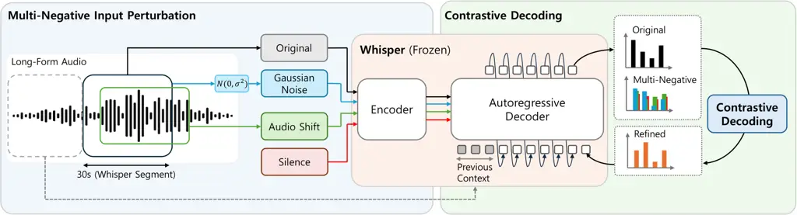

Ahn Chae Park Shim

# Whisper-CD: Accurate Long-Form Speech Recognition using Multi-Negative Contrastive Decoding

Hoseong    Jeongyun    Yoonji    Kyuhong

###### Abstract

Long-form speech recognition with large encoder–decoder models such as
Whisper often exhibit hallucinations, repetition loops, and content
omissions. These errors can accumulate and be further amplified when the
previous segment’s transcription is used as decoding context. We propose
Whisper-CD, a training-free contrastive decoding framework that
contrasts clean-audio logits against negative logits computed from three
acoustically motivated perturbations: Gaussian noise injection, silence
signal, and audio temporal shift. We aggregate these negatives via the
log-sum-exp operator, building a unified multi-negative objective for
token-by-token decoding. Across five English long-form benchmarks,
Whisper-CD reduces WER by up to 24.3 pp on CORAAL and shows 48% faster
token generation throughput than beam search. Because Whisper-CD
operates purely at inference time, it can be applied as a drop-in
replacement to already-deployed Whisper systems without retraining.

###### keywords

speech recognition, contrastive decoding, long-form asr, inference-time

^(†)^(†)address: ¹ Sungkyunkwan University, Republic of Korea
^(†)^(†)email: {hoseong8115, jyunchae, yoonji4024, khshim}@skku.edu

## 1 Introduction

Large-scale encoder–decoder models, such as Whisper \[1\], have
significantly advanced automatic speech recognition (ASR), yet long-form
transcription remains error-prone. When such models process recordings
with prolonged silences, acoustic degradation, or distribution shifts,
they often produce fluent but unsupported text. This phenomenon is
broadly termed *hallucination* \[2, 3, 4, 5\]. Such errors are difficult
to detect because the model typically predicts them with high
confidence. Moreover, long-form audio is usually processed in a
divide-and-conquer manner, which can propagate errors as decoding
proceeds across segments.

In practice, hallucination in long-form ASR appears in three common
patterns: (i) silence-region hallucination, where the model generates
fictitious words during non-speech intervals; (ii) repetition loops that
carry over between segments; and (iii) content omissions, where parts of
the spoken content are dropped. Architectural approaches for long-form
processing \[6, 7\] improve segmentation and context utilization, but do
not directly target these error patterns. Hallucination-specific
mitigation techniques, such as VAD-based chunking, constrained decoding,
and fine-tuning of hallucinatory attention heads \[8\], typically focus
on a single error pattern while introducing additional components or
requiring model retraining. This motivates a unified decoding-time
method that can address diverse error patterns without parameter
updates.

Contrastive decoding \[9\] (CD) improves generation quality and has been
shown to reduce hallucinations in vision-language \[10\] and natural
language processing tasks, including machine translation \[11, 12, 13,
14\]. By contrasting logits from a target generation process against
logits from a negative process that amplifies undesirable behavior, CD
steers token selection away from incorrect outputs without modifying
model parameters. For example, VCD \[10\] corrupts the input image with
heavy noise to obtain negative logits that reflect weaker visual
evidence, so tokens preferred under this condition are down-weighted
during decoding. Analogously, the negative process can be instantiated
through audio perturbations that reduce speech evidence; to the best of
our knowledge, we are the first to apply contrastive decoding to ASR.

In this paper, we propose Whisper-CD, a training-free Contrastive
Decoding framework for long-form ASR. Whisper-CD suppresses hallucinated
generation by contrasting clean audio logits against multiple negative
logits. Whisper-CD leverages three audio-specific negative signals:
(i) Gaussian noise injection, (ii) silence-only input (all-zero
waveform), and (iii) temporal shift of the input waveform. These
perturbations are designed to capture common and distinct long-form ASR
failure modes. The three negative logits are combined using the
log-sum-exp operator with a single uniform contrastive
coefficient $`\alpha`$, producing a unified multi-negative CD objective
that addresses all three failure patterns. Experiments on five long-form
ASR benchmarks show that Whisper-CD consistently reduces word error rate
(WER) and hallucinations compared to the baseline while adding
substantially less computational overhead than beam search.



Figure 1: Overview of the proposed Whisper-CD. Each audio segment is
processed through four parallel paths, comprising the original signal
and three acoustically perturbed variants (Gaussian noise injection,
silence signal, and audio temporal shift). Each path produces decoder
logits conditioned on the corresponding encoder output, and contrastive
decoding steers token selection away from hallucinated outputs such as
repetition loops and content omissions.

## 2 Related Work

### 2.1 Challenges in Long-form ASR

Long-form ASR remains challenging even for large-scale models trained on
massive and diverse corpora \[1\]. Existing methods include joint
segmentation-and-decoding \[15\], factorized neural transducers \[7\],
and masked chunking conformers \[6\]. While effective, these approaches
generally require architectural changes or retraining, which limits
their applicability to already-deployed ASR systems.

### 2.2 Hallucinations in Whisper ASR

Whisper is known to hallucinate frequently on non-speech segments, noisy
audio, or out-of-distribution inputs \[2, 3\], making hallucination a
serious concern in long-form transcription. A representative failure
case is the so-called *bag of hallucinations* \[3\], a set of stock
phrases (e.g., “Thank you for watching”) that the model generates with
high confidence when no genuine speech is present \[2, 3\]. Several
mitigation strategies have been proposed, including fine-tuning
hallucinatory attention heads for non-speech segments \[8\] and
timestamp-aware training for more verbatim transcription \[16\]. In
contrast, training-free decoding-time approaches that can address
diverse hallucination patterns remain underexplored; in particular,
contrastive decoding has not yet been applied to reduce ASR
hallucination.

### 2.3 Test-time Improvement in ASR

A complementary line of research seeks to improve ASR quality at
inference time without retraining the model. Classical examples include
beam search, which explores multiple decoding hypotheses, and language
model rescoring, which re-ranks $`n`$-best lists using an external
language model. More recently, generative error correction (GER)
leverages LLMs to post-correct ASR transcripts \[17, 18\], and test-time
adaptation methods instead update model parameters per utterance via
entropy minimization \[19\] or sequential-level generalized entropy
minimization \[20\]. However, these approaches have fundamental
limitations. Beam search broadens the decoding space, but does not alter
the model’s token distribution; when hallucinated tokens receive high
probability, increasing the beam size can still concentrate the
probability mass onto the same incorrect transcript. GER operates after
the initial decoding pass, and thus cannot directly influence token
selection during decoding. In contrast, our method directly adjusts the
token distribution at inference time.

## 3 Whisper-CD

| Model          | Method   | WER (%)$`\downarrow`$ |           |            |          |        | Throughput                   |                   |
| -------------- | -------- | --------------------- | --------- | ---------- | -------- | ------ | ---------------------------- | ----------------- |
|                |          | CORAAL                | VoxPopuli | Earnings22 | TED-LIUM | REV-16 | Speed (tokens/s)$`\uparrow`$ | RTF$`\downarrow`$ |
| Large-v3       | Baseline | 208.76                | 44.95     | 520.94     | 66.42    | 173.69 | 30.6                         | 0.2886            |
|                | \+ CD    | 45.77                 | 19.86     | 57.08      | 25.62    | 21.38  | 27.3                         | 0.1655            |
| Large-v3-Turbo | Baseline | 38.75                 | 30.63     | 33.25      | 12.93    | 19.82  | 168.9                        | 0.0239            |
|                | \+ CD    | 14.43                 | 25.71     | 16.16      | 10.11    | 14.81  | 144.2                        | 0.0346            |

Table 1: Speech recognition results of Whisper-CD across different
Whisper model variants.

### 3.1 Motivation

Whisper processes long-form audio by splitting the input into 30-second
segments and decoding each. The previous segment’s transcription can
optionally be provided as context for consistency across segments (see
Figure 1). Counterintuitively, Whisper’s performance often degrades when
the previous context is given. This behavior is well known in practice,
as the official documentation¹¹ 1
[https://github.com/openai/whisper/blob/7858aa/whisper/transcribe.py#L278](https://github.com/openai/whisper/blob/7858aa/whisper/transcribe.py#L278)recommends
disabling context passing when performance is unsatisfactory.

We further quantify this effect: On Whisper Large-v3, conditioning on
previous context increases WER by over 190 pp on CORAAL \[21\] and over
500 pp on Earnings22 \[22\]. This degradation is mainly driven by error
accumulation. Once an erroneous transcription (e.g., hallucinated text
and repetition loops) is passed as context, it may bias the current
segment’s decoding and propagate errors to subsequent segments. Such
hallucinations are difficult to recover from, even with beam search, and
are more prominent in larger decoders. Rather than disabling context
passing, which sacrifices the model’s inherent ability to utilize
long-range cues, we seek to preserve context-aware decoding while
suppressing errors. This motivates a logit-level decoding strategy based
on contrastive decoding, which down-weights tokens that remain highly
probable under deliberately degraded audio conditions.

### 3.2 Contrastive Decoding for ASR

Contrastive decoding steers token selection by contrasting the model
logits under a target (positive) generation process with those under a
negative process. We adapt this principle to ASR by deriving the
negative signal from acoustically perturbed versions of the input
waveform, rather than from a weaker model. Let $`\mathbf{x}`$ denote an
input waveform and $`g(\cdot)`$ a perturbation function that produces
$`\tilde{\mathbf{x}}=g(\mathbf{x})`$. At decoding step $`t`$, given the
previously generated tokens $`y_{<t}`$, we compute logits using two
forward passes of the same ASR model:

```math
\ell_{t}^{\text{pos}}=f_{\theta}\big(\textbf{x},y_{<t}\big),\quad\ell_{t}^{\text{neg}}=f_{\theta}\big(\tilde{\textbf{x}},y_{<t}\big) \tag{1}
```

where $`f_{\theta}(\cdot)`$ outputs a logit vector over the vocabulary.
The contrastive logits are then defined as:

```math
\ell_{t}^{\text{CD}}=(1+\alpha)\,\ell_{t}^{\text{pos}}\,-\,\alpha\,\ell_{t}^{\text{neg}} \tag{2}
```

where $`\alpha>0`$ controls the contrastive strength. Token selection is
performed from $`\ell_{t}^{\text{CD}}`$. This procedure is
training-free: it requires no parameter updates and can be applied to
any token-by-token generation ASR model at inference time.

### 3.3 Perturbation Strategies

We design three perturbation functions to instantiate a negative
generation process for contrastive decoding. The key idea is to
deliberately reduce or distort acoustic evidence so that the resulting
logits reflect the model’s biases or tendencies rather than the true
speech content.

#### 3.3.1 Gaussian Noise Injection

The input waveform $`\mathbf{x}`$ is corrupted with additive Gaussian
noise calibrated to a target signal-to-noise ratio (SNR). Specifically,
the corrupted waveform is
$`\tilde{\mathbf{x}}=\mathbf{x}+\boldsymbol{\epsilon}`$, where
$`\boldsymbol{\epsilon}\sim\mathcal{N}(\mathbf{0},\sigma^{2}\mathbf{I})`$
and $`\sigma`$ is chosen to achieve the target SNR. This acoustic
corruption makes local phonetic evidence unreliable while retaining the
coarse acoustic structure, producing negative logits that represent the
model’s behavior under reduced acoustic clarity.

#### 3.3.2 Silence Signal

The input spectrogram is set to all zeros, which removes spectral
structure entirely. Under this condition, the decoder behaves as if it
is continuing the text with minimal acoustic evidence, revealing its
unconditional textual prior. The resulting logits tend to emphasize
silence-region hallucination patterns, including the “bag of
hallucinations” phrases reported in prior analyses \[2, 3\].

#### 3.3.3 Audio Temporal Shift

The input waveform is shifted leftward by $`\Delta_{s}`$ seconds to
create a controlled misalignment between acoustic content and the
segment’s temporal position. Concretely, the first $`\Delta_{s}`$
seconds of audio are discarded, and the same duration is zero-padded at
the end, so the decoder receives future audio content earlier than
expected. This temporal mismatch disrupts the alignment between the
decoder’s prefix context and the local acoustics, producing negative
logits that represent segment-boundary failure tendencies.

### 3.4 Multi-Negative Contrastive Decoding

To simultaneously address multiple long-form failure patterns, we
combine $`K`$ negative signals ($`K{=}3`$) into a single decoding step.
We aggregate the negative logits using a log-sum-exp operator with a
temperature $`\tau`$:

```math
\ell_{t}^{\text{CD}}=\left(1+\alpha\tau\right)\ell_{t}^{\text{pos}}\,-\,\alpha\tau\,\log\Big(\frac{1}{K}\sum_{k=1}^{K}\exp\big(\ell_{k,t}^{\text{neg}}\,\,/\,\,\tau\big)\Big). \tag{3}
```

where $`\ell_{k,t}^{\text{neg}}`$ denotes the negative logits obtained
from the $`k`$-th perturbed input $`\tilde{\mathbf{x}}_{k}`$. Setting
$`K{=}1`$ and $`\tau{=}1`$ recovers Eq. (2). A small $`\tau`$
concentrates influence on the dominant negative (approximating a max),
while a large $`\tau`$ approaches a smoother average. We set
$`\tau{=}1.0`$, corresponding to the log-sum-exp aggregation, and vary
$`\alpha\in[0.5,2.0]`$.

### 3.5 Inference

For efficiency, we compute encoder outputs for the clean input and all
$`K`$ perturbed inputs in a single batched forward pass. During
autoregressive decoding, we compute all paths in parallel by packing
them along the batch dimension, requiring only a single batched decoder
forward pass per step while reusing the same prefix tokens $`y_{<t}`$.
Since Whisper-CD intervenes only at the logit level, it preserves the
model’s existing capabilities, such as language identification and
timestamp generation, and remains compatible with standard inference
pipelines, including beam search and token-level constraints.

## 4 Experimental Results

Figure 2: Qualitative examples on the same audio inputs. The baseline
falls into repetition loops (red), while Whisper-CD breaks the loop and
recovers the correct transcription (green).

### 4.1 Setup

Datasets. We evaluate on five English long-form benchmarks covering
diverse speaking styles and acoustic conditions. CORAAL \[21\] uses 14
recordings (11.5 h) from the VLD region. Earnings22 \[22\] is a 13-file
subset (14.3 h) from the full 125-file corpus ($`\sim`$120 h), selected
at regular duration intervals (every 3rd file when sorted by duration)
to ensure uniform coverage. VoxPopuli \[23, 24\] is a 50-file subset
(1.4 h) from the long-form reconstitution of the test split, filtered
for recordings between 60 and 300 seconds and sampled at every 9th file.
TED-LIUM \[24, 25\] uses the full long-form reconstitution test set (11
files, 3.1 h). REV-16 \[1\] uses 16 recordings (16.1 h).

Inference Setup. We employ Whisper’s long-form pipeline with 30-second
segments and previous-context passing enabled, matching the default
configuration. We use greedy decoding unless otherwise specified and
disable the temperature fallback mechanism to isolate the effect of
contrastive decoding.

Models. We conduct experiments on two Whisper model sizes: Large-v3 and
Large-v3-Turbo. Both variants reuse the same weights for all negative
paths, which are computed jointly in a single batched forward pass
(Section 3.5). All analysis experiments are conducted on Whisper
Large-v3-Turbo.

Perturbation hyperparameters. We set $`\text{SNR}_{\text{dB}}=10`$ for
Gaussian noise injection. Audio temporal shift applies a leftward shift
of $`\Delta_{s}=7`$ s.

Metrics. We report word error rate (WER, %$`\downarrow`$) as the primary
metric. To assess computational cost, we additionally report decoding
throughput in tokens-per-second and real-time factor (RTF), measured on
a single NVIDIA A100 80GB PCIe with a batch size of 1.

### 4.2 ASR Performance and Inference Efficiency

Table 1 shows that Whisper-CD reduces WER across all five long-form ASR
benchmarks. Note that the Large-v3 baseline WER exceeds 100% on several
datasets because repetition loops inflate the output length well beyond
the reference. CD suppresses these repetitions, though the WER remains
above Turbo’s baseline; we discuss this gap in Section 4.3. Figure 2
shows qualitative examples of how CD eliminates repetition loops and
non-speech hallucinations.

Regarding throughput, CD introduces three additional decoding paths, yet
the reduction in total generated tokens can offset this cost. For
Large-v3, eliminating repetition loops lowers overall wall-clock time,
improving RTF over the baseline. For Large-v3-Turbo, the additional
paths incur a modest slowdown that remains substantially faster than
beam search (Table 4).

### 4.3 Analysis

Impact of $`\alpha`$. Table 2 shows the effect of the contrastive
strength $`\alpha`$. Datasets with higher baseline WER generally benefit
from stronger contrastive signals, while the cleaner TED-LIUM is
sensitive to over-subtraction and degrades beyond $`\alpha{=}1.5`$.
Notably, all nonzero $`\alpha`$ values improve over the baseline on
CORAAL and Earnings22, indicating that CD is broadly robust for
hallucination-prone speech recordings.

|                  |                            |                  |                |
| ---------------- | -------------------------- | ---------------- | -------------- |
|    $`\alpha`$    |    WER(%)$`\downarrow`$    |                  |                |
|                  |    CORAAL                  |    Earnings22    |    TED-LIUM    |
|    0.0           |    38.75                   |    33.25         |    12.93       |
|    0.5           |    26.58                   |    16.16         |    11.19       |
|    1.0           |    14.43                   |    17.70         |    11.65       |
|    1.5           |    19.65                   |    19.44         |    10.11       |
|    2.0           |    20.82                   |    21.77         |    11.00       |

Table 2: Ablation on contrastive decoding strength ($`\alpha`$). Setting
$`\alpha=0`$ corresponds to the baseline without CD.

Individual strategies. Table 3 compares perturbation strategies by using
each as the sole negative. No single strategy consistently improves
performance across all datasets; for example, silence degrades TED-LIUM
to 21.62% despite improving CORAAL. In contrast, the multi-negative
combination (Table 1) achieves lower WER than the single-strategy
variants on most datasets, suggesting that the proposed aggregation
effectively leverages complementary negative signals.

| Strategy    | WER(%)$`\downarrow`$   |            |          |
| ----------- | ---------------------- | ---------- | -------- |
|             | CORAAL                 | Earnings22 | TED-LIUM |
| Gaussian    | 38.11                  | 19.50      | 12.49    |
| Silence     | 18.99                  | 17.41      | 21.62    |
| Audio Shift | 18.77                  | 15.54      | 13.81    |

Table 3: Ablation on three audio perturbation strategies.

Effect of model scale. Despite its larger capacity, Large-v3 yields
substantially higher WER under CD than Large-v3-Turbo (45.77% vs. 14.43%
on CORAAL). We hypothesize that this gap stems from differences in
failure severity and decoder-driven error propagation. In particular,
Large-v3 often enters deep repetition loops that can push the baseline
WER above 200%. Once such loops are established, logit-level contrast
alone may be insufficient to consistently steer decoding back to a
correct trajectory, because the model assigns overwhelming probability
mass to self-reinforcing continuations. Moreover, when a
previous-segment context is provided as a prefix, a stronger decoder may
rely more heavily on that textual context, which can amplify the impact
of earlier mistakes.

Comparison to beam search. Table 4 compares CD with beam search (beam
size 5). Beam search improves performance on CORAAL but degrades
TED-LIUM, whereas CD achieves lower WER on both datasets with higher
throughput, offering a more favorable accuracy-throughput trade-off.

| Method         | WER(%)$`\downarrow`$ |          | Throughput        |                   |
| -------------- | -------------------- | -------- | ----------------- | ----------------- |
|                | CORAAL               | TED-LIUM | Speed$`\uparrow`$ | RTF$`\downarrow`$ |
| Baseline       | 38.75                | 12.93    | 174.3             | 0.0246            |
| \+ Beam Search | 22.65                | 17.50    | 99.0              | 0.0436            |
| \+ CD          | 14.43                | 10.11    | 147.0             | 0.0302            |

Table 4: Comparison with beam search (beam size = 5).

### 4.4 Discussion and Future Work

Dynamic $`\alpha`$. Since the optimal $`\alpha`$ differs across datasets
and model sizes (Tables 1 and 2), predicting and adjusting $`\alpha`$
dynamically per segment or per token would improve robustness on diverse
acoustic conditions.

Additional perturbations. Our multi-negative framework is not restricted
to a fixed set of negatives; other audio transformations, such as
frequency masking, chunk shuffling, or temporal warping, could
potentially serve as additional negative signals.

Decoder-only ASR models. Recent decoder-only ASR models \[26, 27\]
process audio and text in a single stream, making it less
straightforward to inject perturbed audio while preserving the text
prefix. Adapting the negative path construction to such architectures is
a natural next step, building on the precedent of visual contrastive
decoding in vision-language models.

## 5 Conclusion

We proposed Whisper-CD, a training-free contrastive decoding framework
for long-form speech recognition. Whisper-CD contrasts clean-audio
logits against three acoustically motivated negative signals: Gaussian
noise injection, silence signal, and audio temporal shift. This
multi-negative formulation mitigates long-form failure patterns,
including non-speech hallucinations, repetition loops, and content
omissions without any parameter update. Experiments on five English
long-form ASR benchmarks show consistent WER reductions across model
configurations, with up to a 24.3 pp improvement on CORAAL, while adding
only modest computational overhead relative to greedy decoding and
remaining substantially faster than beam search.

## 6 Acknowledgments

This work was supported by Institute of Information & communications
Technology Planning & Evaluation (IITP) grant funded by the Korea
government (MSIT) (RS-2019-II190421, Artificial Intelligence Graduate
School Program (Sungkyunkwan University)).

## 7 Generative AI Use Disclosure

The authors used large language models, specifically ChatGPT (OpenAI)
and Claude (Anthropic), to assist with proofreading and improving the
clarity and fluency of the manuscript.

## References

- \[1\] A. Radford, J. W. Kim, T. Xu, G. Brockman, C. McLeavey, and I.
  Sutskever (2023) Robust speech recognition via large-scale weak
  supervision. In Proceedings of the 40th International Conference on
  Machine Learning (ICML), Cited by: §1, §2.1, §4.1.
- \[2\] A. Koenecke, A. S. G. Choi, K. X. Mei, H. Schellmann, and M.
  Sloane (2024) Careless whisper: speech-to-text hallucination harms. In
  Proceedings of the 2024 ACM Conference on Fairness, Accountability,
  and Transparency, Cited by: §1, §2.2, §3.3.2.
- \[3\] M. Barański, J. Jasiński, J. Bartolewska, S. Kacprzak, M.
  Witkowski, and K. Kowalczyk (2025) Investigation of whisper asr
  hallucinations induced by non-speech audio. In ICASSP 2025-2025 IEEE
  International Conference on Acoustics, Speech and Signal Processing
  (ICASSP), Cited by: §1, §2.2, §3.3.2.
- \[4\] H. Atwany, A. Waheed, R. Singh, M. Choudhury, and B. Raj (2025)
  Lost in transcription, found in distribution shift: demystifying
  hallucination in speech foundation models. In Findings of the
  Association for Computational Linguistics: ACL 2025, Cited by: §1.
- \[5\] H. Park, H. Ahn, J. Moon, Y. Lee, and K. Shim (2025) Evaluating
  hallucinations in multimodal llms with spoken queries under diverse
  acoustic conditions. arXiv preprint arXiv:2510.08581. Cited by: §1.
- \[6\] K. Le, T. V. Ho, D. Tran, and D. T. Chau (2025) ChunkFormer:
  masked chunking conformer for long-form speech transcription. In
  ICASSP 2025 - 2025 IEEE International Conference on Acoustics, Speech
  and Signal Processing (ICASSP), Vol. . Cited by: §1, §2.1.
- \[7\] X. Gong, Y. Wu, J. Li, S. Liu, R. Zhao, X. Chen, and Y.
  Qian (2023) LongFNT: long-form speech recognition with factorized
  neural transducer. In ICASSP 2023 - 2023 IEEE International Conference
  on Acoustics, Speech and Signal Processing (ICASSP), Vol. . Cited by:
  §1, §2.1.
- \[8\] Y. Wang, A. Alhmoud, S. Alsahly, M. Alqurishi, and M.
  Ravanelli (2025) Calm-Whisper: Reduce Whisper Hallucination On
  Non-Speech By Calming Crazy Heads Down. pp. 3414–3418. Cited by: §1,
  §2.2.
- \[9\] X. L. Li, A. Holtzman, D. Fried, P. Liang, J. Eisner, T.
  Hashimoto, L. Zettlemoyer, and M. Lewis (2023) Contrastive decoding:
  open-ended text generation as optimization. In Proceedings of the 61st
  Annual Meeting of the Association for Computational Linguistics
  (Volume 1: Long Papers), Cited by: §1.
- \[10\] S. Leng, H. Zhang, G. Chen, X. Li, S. Lu, C. Miao, and L.
  Bing (2024) Mitigating object hallucinations in large vision-language
  models through visual contrastive decoding. In 2024 IEEE/CVF
  Conference on Computer Vision and Pattern Recognition (CVPR), Vol. ,
  pp. 13872–13882. Cited by: §1.
- \[11\] Y. Chuang, Y. Xie, H. Luo, Y. Kim, J. R. Glass, and P.
  He (2024) DoLa: decoding by contrasting layers improves factuality in
  large language models. In The Twelfth International Conference on
  Learning Representations, Cited by: §1.
- \[12\] R. Sennrich, J. Vamvas, and A. Mohammadshahi (2024) Mitigating
  hallucinations and off-target machine translation with
  source-contrastive and language-contrastive decoding. In Proceedings
  of the 18th Conference of the European Chapter of the Association for
  Computational Linguistics (Volume 2: Short Papers), Cited by: §1.
- \[13\] J. Waldendorf, B. Haddow, and A. Birch (2024) Contrastive
  decoding reduces hallucinations in large multilingual machine
  translation models. In Proceedings of the 18th Conference of the
  European Chapter of the Association for Computational Linguistics
  (Volume 1: Long Papers), Cited by: §1.
- \[14\] C. Zhu, Y. LIU, H. Zhang, A. Wang, Yangxue, G. Chen, L.
  Wang, W. Luo, and K. Zhang (2025) Alleviating hallucinations in large
  language models through multi-model contrastive decoding and dynamic
  hallucination detection. In The Thirty-ninth Annual Conference on
  Neural Information Processing Systems, Cited by: §1.
- \[15\] W. R. Huang, S. Chang, D. Rybach, T. Sainath, R.
  Prabhavalkar, C. Peyser, Z. Lu, and C. Allauzen (2022) E2E Segmenter:
  Joint Segmenting and Decoding for Long-Form ASR. In Interspeech 2022,
  pp. 4995–4999. Cited by: §2.1.
- \[16\] M. Zusag, L. Wagner, and B. Thallinger (2024) CrisperWhisper:
  Accurate Timestamps on Verbatim Speech Transcriptions. In Interspeech
  2024, pp. 1265–1269. Cited by: §2.2.
- \[17\] C. H. Yang, Y. Gu, Y. Liu, S. Ghosh, I. Bulyko, and A.
  Stolcke (2023) Generative speech recognition error correction with
  large language models and task-activating prompting. In 2023 IEEE
  Automatic Speech Recognition and Understanding Workshop (ASRU), Vol. ,
  pp. 1–8. Cited by: §2.3.
- \[18\] Y. Hu, C. Chen, C. Qin, Q. Zhu, E. S. Chng, and R. Li (2024)
  Listen again and choose the right answer: a new paradigm for automatic
  speech recognition with large language models. In Findings of the
  Association for Computational Linguistics: ACL 2024, Cited by: §2.3.
- \[19\] G. Lin, S. Li, and H. Lee (2022) Listen, Adapt, Better WER:
  Source-free Single-utterance Test-time Adaptation for Automatic Speech
  Recognition. In Interspeech 2022, pp. 2198–2202. Cited by: §2.3.
- \[20\] C. Kim, J. Park, H. Shim, and E. Yang (2023) SGEM: Test-Time
  Adaptation for Automatic Speech Recognition via Sequential-Level
  Generalized Entropy Minimization. In Interspeech 2023, pp. 3367–3371.
  Cited by: §2.3.
- \[21\] M. Quartey, C. Farrington, T. Kendall, L. Jenson, C. Tacata,
  and J. McLean (2020) The corpus of regional african american language:
  VLD (Valdosta, GA 2017). The Online Resources for African American
  Language Project, Eugene, OR. Note: Version 2021.07 External Links:
  [Link](https://oraal.uoregon.edu/coraal) Cited by: §3.1, §4.1.
- \[22\] M. Del Rio, P. Ha, Q. McNamara, C. Miller, and S.
  Chandra (2022) Earnings-22: a practical benchmark for accents in the
  wild. arXiv. External Links:
  [Document](https://dx.doi.org/10.48550/ARXIV.2203.15591),
  [Link](https://arxiv.org/abs/2203.15591) Cited by: §3.1, §4.1.
- \[23\] C. Wang, M. Riviere, A. Lee, A. Wu, C. Talnikar, D. Haziza, M.
  Williamson, J. Pino, and E. Dupoux (2021) VoxPopuli: a large-scale
  multilingual speech corpus for representation learning,
  semi-supervised learning and interpretation. In Proceedings of the
  59th Annual Meeting of the Association for Computational Linguistics
  and the 11th International Joint Conference on Natural Language
  Processing (Volume 1: Long Papers), pp. 993–1003. Cited by: §4.1.
- \[24\] J. D. Fox, D. Raj, N. Delworth, Q. McNamara, C. Miller, and M.
  Jetté (2024) Updated corpora and benchmarks for long-form speech
  recognition. In ICASSP 2024-2024 IEEE International Conference on
  Acoustics, Speech and Signal Processing (ICASSP), pp. 13246–13250.
  Cited by: §4.1.
- \[25\] F. Hernandez, V. Nguyen, S. Ghannay, N. Tomashenko, and Y.
  Esteve (2018) TED-LIUM 3: twice as much data and corpus repartition
  for experiments on speaker adaptation. In International Conference on
  Speech and Computer, pp. 198–208. Cited by: §4.1.
- \[26\] A. Abouelenin, A. Ashfaq, A. Atkinson, H. Awadalla, N. Bach, J.
  Bao, A. Benhaim, M. Cai, V. Chaudhary, C. Chen, et al. (2025)
  Phi-4-mini technical report: compact yet powerful multimodal language
  models via mixture-of-loras. arXiv preprint arXiv:2503.01743. Cited
  by: §4.4.
- \[27\] A. H. Liu, A. Ehrenberg, A. Lo, C. Denoix, C. Barreau, G.
  Lample, J. Delignon, K. R. Chandu, P. von Platen, P. R. Muddireddy, et
  al. (2025) Voxtral. arXiv preprint arXiv:2507.13264. Cited by: §4.4.
