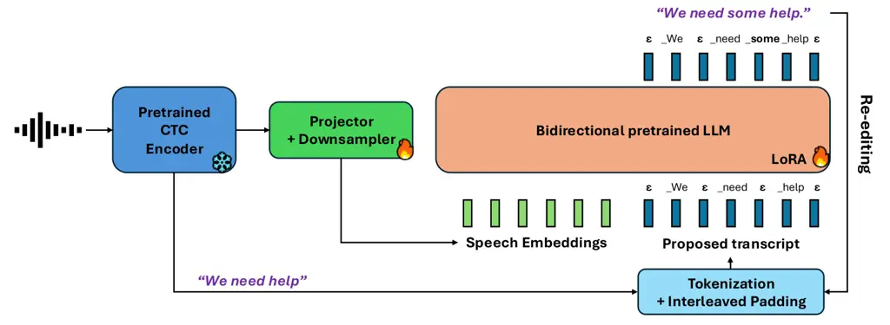

Dekel Thomas Fukada Saon

# NLE: Non-autoregressive LLM-based ASR by Transcript Editing

Avihu    Samuel    Takashi    George

###### Abstract

While autoregressive (AR) LLM-based ASR systems achieve strong accuracy,
their sequential decoding limits parallelism and incurs high latency. We
propose NLE, a non-autoregressive (NAR) approach that formulates speech
recognition as conditional transcript editing, enabling fully parallel
prediction. NLE extracts acoustic embeddings and an initial hypothesis
from a pretrained speech encoder, then refines the hypothesis using a
bidirectional LLM editor trained with a latent alignment objective. An
interleaved padding strategy exploits the identity mapping bias of
Transformers, allowing the model to focus on corrections rather than
full reconstruction. On the Open ASR leaderboard, NLE++ achieves 5.67%
average WER with an RTFx (inverse real-time factor) of 1630. In
single-utterance scenarios, NLE achieves 27x speedup over the AR
baseline, making it suitable for real-time applications.

###### keywords

Speech Recognition, Text Editing, Non-Autoregressive

^(†)^(†)address: IBM Research^(†)^(†)email: avihu.dekel@ibm.com

## 1 Introduction

LLM-based ASR systems \[1, 2\] improve transcription accuracy by pairing
a pretrained speech encoder with a pretrained LLM, typically via a
learned projector that maps acoustic representations into the LLM
embedding space. In most existing systems, the LLM serves as an
autoregressive decoder, generating text one token at a time. While this
design yields strong accuracy, the sequential nature of autoregressive
decoding limits parallelism, incurs substantial end-to-end latency, and
results in slower inference (lower RTFx, where RTFx measures the ratio
of audio duration to processing time). This limitation becomes
particularly severe in real-time conversational settings where batch
processing is not feasible, as the inability to parallelize token
generation directly translates to high per-utterance latency. Moreover,
these systems discard the initial hypothesis often produced by the
speech encoder, despite it frequently providing a reasonable draft that
could be refined rather than regenerated from scratch. This work focuses
on addressing these limitations and enables parallelizable LLM-based
inference.

Connectionist Temporal Classification (CTC) \[3\] provides an efficient
alternative mechanism for mapping long acoustic sequences to shorter
token sequences. A CTC encoder produces frame-level token posteriors,
and inference collapses repeated tokens and removes blanks using an
efficient, fully parallel decoding procedure. However, CTC decoding is
constrained by conditional independence and monotonic alignment
assumptions. Moreover, CTC models have limited language modeling
capabilities and lack the broad linguistic priors of large pretrained
language models, limiting their ability to recover plausible content
when acoustic evidence is weak. In practice, CTC outputs often exhibit
local errors such as phonetic substitutions or structural errors such as
word deletions, especially in noisy or ambiguous conditions. Many of
these errors are systematic and locally correctable, making CTC
hypotheses well-suited as drafts for downstream editing rather than full
regeneration.

Figure 1: Open ASR leaderboard WER-RTFx tradeoff comparing NLE and NLE++
against top-6 models (as of Feb 2026). Both NLE variants lie on the
Pareto frontier (no other model achieves both lower WER and higher
RTFx), achieving competitive accuracy with superior inference speed.

We introduce NLE, a Non-autoregressive LLM-based Editing ASR system. NLE
reframes LLM-based speech recognition as conditional transcript editing:
rather than decoding tokens autoregressively, NLE edits a hypothesis
extracted from a pretrained speech encoder, guided by acoustic context
from the same encoder. This editing formulation enables fully parallel
prediction, thereby achieving fast inference.

Our approach adapts a pretrained LLM to the editing task, in order to
leverage its linguistic knowledge. We modify the attention mechanism in
the LLM from causal to bidirectional \[4, 5\], enabling
non-autoregressive editing with full context. The model is trained using
a CTC-style objective with latent alignments \[6\], which naturally
handles the variable-length mapping between input and target
transcripts. We use lightweight LoRA adapters \[7\] to adapt the model
to the bidirectional attention and editing objective. The LoRA adapters
can be disabled and the attention mechanism reconfigured back to causal
mode, restoring the original LLM functionality. This design allows the
LLM weights to be shared across both ASR and downstream tasks such as
question answering on transcribed text – a key use case for
speech-enabled LLMs \[2\].

We use an interleaved token layout with explicit insertion slots that
enables local insertions with minimal token movement. This design
exploits the identity mapping bias of Transformers – the tendency to
copy input tokens unchanged through residual connections and tied
embeddings (see Section 3.3) – allowing the model to focus on
corrections rather than full reconstruction.

On the Open ASR leaderboard \[8\], a challenging benchmark containing 39
strong ASR models, NLE++ achieves 5.67% average WER with an RTFx of 1630. As shown in Figure 1, both NLE and NLE++ are on the Pareto
frontier in the WER-RTFx space, offering a strong accuracy-speed
tradeoff compared to leading models. In single-utterance inference, NLE
achieves 27x speedup over the autoregressive baseline, demonstrating the
substantial practical advantages of non-autoregressive decoding for
latency-critical applications.

## 2 Related Work

### 2.1 LLM-based ASR

Recent work has explored integrating large language models into ASR
systems by conditioning pretrained LLMs on speech representations via
learned projection layers \[1, 9, 10, 2\]. Similar to encoder-decoder
models like Whisper \[11\], these approaches pair a speech encoder with
a text decoder, but leverage pretrained LLMs to benefit from their
linguistic knowledge. By exploiting the strong linguistic priors of
LLMs, they improve transcription accuracy, particularly in challenging
acoustic conditions or when handling rare words and proper nouns.
However, most LLM-based ASR systems rely on autoregressive decoding,
where tokens are generated sequentially, inherently limiting parallelism
and resulting in high inference latency and lower throughput – a
critical bottleneck for real-time applications. Moreover, autoregressive
models can hallucinate plausible but incorrect content when acoustic
evidence is weak or ambiguous, and they discard the initial hypothesis
often produced by the speech encoder despite it frequently providing a
reasonable draft.

Alternative architectures such as RNN-Transducers (RNN-T) \[12\] and
Token-and-Duration Transducers (TDT) \[13, 14\] offer faster inference
through streaming capabilities, but they still generate tokens
sequentially and lack access to the broad linguistic knowledge encoded
in pretrained LLMs. Our work addresses these limitations by using an LLM
as a _non-autoregressive editor_ that refines an initial CTC hypothesis
in parallel, combining the speed of NAR decoding with the linguistic
knowledge of pretrained LLMs.

### 2.2 NAR ASR

Non-autoregressive (NAR) ASR methods aim to reduce inference latency by
predicting tokens in parallel. Connectionist Temporal Classification
(CTC) \[3\] is the most widely adopted NAR approach, marginalizing over
alignments using dynamic programming and enabling efficient parallel
decoding. However, CTC models typically lack strong language modeling
capabilities and are constrained by conditional independence
assumptions, limiting their ability to leverage linguistic context for
disambiguation \[15, 16\]. Several NAR refinement approaches have been
proposed to improve upon CTC. SoftCorrect \[17\] applies constrained CTC
loss for transcript correction. Mask-predict methods \[18, 19, 20\] and
iterative refinement methods \[21, 22, 23\] perform multiple passes,
addressing CTC’s conditional independence by conditioning on partial
predictions.

Despite offering substantial speed advantages over autoregressive
models, NAR methods often struggle to perform insertions (i.e.,
correcting deletion errors) and to maintain long-range linguistic
consistency. Many rely on fixed-length predictions or masking strategies
that make insertions difficult or require multiple refinement
iterations. Our approach builds on CTC’s efficiency while addressing
these limitations through two key ideas: an insertion-aware interleaved
representation that enables local insertions without sequence-wide
shifts, and bidirectional LLM-based editing that leverages pretrained
linguistic knowledge for improved contextual reasoning.

### 2.3 ASR Correction

Post-processing methods that correct first-pass ASR outputs have been
extensively studied. Traditional approaches include N-best list
rescoring and lattice-based rescoring \[24, 25, 26\], which reevaluate
hypotheses using refined acoustic or language models. More recently,
LLM-based correction methods have emerged, where ASR transcripts are fed
to external LLMs for zero-shot or few-shot correction \[27, 28\],
leveraging their linguistic knowledge. Supervised error-correction
approaches train encoder-decoder models on pairs of erroneous
transcripts and references \[29\], enabling learned correction patterns.
Unlike these post-processing methods that operate on finalized ASR
outputs, our approach integrates correction into the decoding process
itself through non-autoregressive editing conditioned on acoustic
embeddings, enabling joint acoustic-linguistic refinement rather than
text-only correction.

### 2.4 NAR Text Editing and Translation

Non-autoregressive methods for machine translation and text editing
share conceptual similarities with ASR, as both involve mapping between
closely related input-output sequences. Early work \[30\] introduced NAR
translation using fertility-based parallel generation, while the
Levenshtein Transformer \[31\] models editing through explicit
operations like KEEP, DELETE, and INSERT. Most relevant to our work,
latent alignment models with CTC have been applied to NAR translation
\[6\] and extended to text editing with an explicit COPY operation
\[32\]. We adapt these latent alignment techniques to speech recognition
by conditioning on acoustic embeddings rather than text alone, and by
leveraging a pretrained causal LLM adapted to bidirectional attention
instead of training from scratch.



Figure 2: Overview of NLE architecture. The frozen pretrained CTC
encoder produces acoustic embeddings and an initial CTC hypothesis. The
hypothesis is tokenized and interleaved with insertion slots
($`\epsilon`$), then concatenated with the projected speech embeddings.
The LoRA-adapted bidirectional LLM editor predicts the edited transcript
using a CTC objective. The output can be iteratively re-edited (see
Section 5.5).

## 3 Method

NLE takes an input utterance and processes it through a pretrained
speech encoder to produce acoustic embeddings and a CTC transcript
hypothesis. An LLM-based NAR editor then predicts an edited transcript
using a CTC-style objective over a token sequence interleaved with
insertion slots. Figure 2 illustrates the complete pipeline.

### 3.1 Extracting Hypothesis and Embeddings

We use a pretrained CTC-based speech encoder which we freeze during
training. We freeze the encoder to preserve its well-trained acoustic
modeling capabilities, as the quality of its hypothesis directly affects
the entire training process; we leave joint fine-tuning for future work.
The encoder processes the input audio and outputs frame-level embeddings
$`H\in\mathbb{R}^{T\times d}`$, where $`T`$ is the number of frames and
$`d`$ is the embedding dimension. It also produces frame-level CTC
logits over a character-based vocabulary, which are converted to a
character-level string hypothesis using greedy decoding (argmax followed
by blank removal and deduplication). This hypothesis serves as the
initial draft for the editing model, while the embeddings $`H`$ provide
acoustic context to guide the refinement process.

### 3.2 Retokenization and Interleaved Insertion Slots

The character-level CTC hypothesis is re-tokenized using the LLM’s
subword tokenizer to align with the LLM’s vocabulary. Since the LLM
tokenizer is trained on well-formed text, misspelled words in the CTC
hypothesis (e.g., ”philossophy”) may not have a corresponding token and
will be split into multiple subword units. We denote the resulting token
sequence as $`x=(x_{1},\ldots,x_{N})`$.

To efficiently handle insertion edits, we construct an interleaved
sequence with explicit insertion slots:

```math
\tilde{x}=(\epsilon,x_{1},\epsilon,x_{2},\ldots,\epsilon,x_{N},\epsilon). \tag{1}
```

where $`\epsilon`$ denotes a blank symbol (we reuse the LLM’s EOS
token). This interleaved representation creates $`N+1`$ insertion slots
(one before each token, and one after the last token), enabling local
insertions without requiring the model to shift the entire downstream
sequence. Single-token insertions can be handled by filling one
insertion slot. Multi-token insertions require shifting only the
neighboring tokens within a local block to accommodate the new content,
while the rest of the sequence remains unaffected.

To illustrate this, consider adding the tokens $`(a,b,c)`$ between
$`x_{k}`$ and $`x_{k+1}`$. Given the original sequence:

```math
(\dots\epsilon,x_{k},\epsilon,x_{k+1},\epsilon,\dots)
```

the model can produce this insertion by making the following
per-position predictions: moving $`x_{k}`$/$`x_{k+1}`$ to the left/right
$`\epsilon`$ spot, and using the 3 freed-up middle positions to add
$`(a,b,c)`$:

```math
(\dots,x_{k},a,b,c,x_{k+1},\dots)
```

This can be performed within a single forward pass, keeping the rest of
the tokens intact. An insertion of $`K`$ tokens requires changing
$`2K-1`$ tokens from the original sequence, while keeping the remaining
tokens unchanged. The maximum number of tokens that can be inserted is
$`N+1`$, which was never required in our training data¹¹ 1 We set the
minimum number of input tokens to 8 to allow sufficient insertion
capacity for short utterances..

### 3.3 Identity Mapping Bias in Transformers

Our editing approach exploits the identity mapping bias inherent to
Transformer architectures \[33, 34\]. This bias arises from two key
architectural properties:

- •
  Residual connections preserve input representations across layers,
  allowing information to flow unchanged through the network.
- •
  Tied input-output embeddings are used in most LLMs (including Granite
  4.0 1B Base we used in NLE) and create a strong copying bias: the dot
  product between a token’s embedding and itself in the output
  projection matrix tends to be high, making the model naturally
  inclined to predict the input token.

When the interleaved sequence is decoded without edits, it naturally
recovers the original hypothesis. This property is beneficial for our
task, as most tokens in the CTC hypothesis are correct and should be
preserved. The model can focus its learning capacity on identifying and
correcting errors rather than reconstructing the entire transcript,
which is crucial for maintaining strong performance while enabling fast
parallel decoding. We further reinforce this bias through a copying
regularization objective (Section 3.6). In Figure 2, for example, the
model is only required to change $`x_{5}=\epsilon`$ to ”\_some”, while
copying the rest of the input tokens, with no token displacements needed
due to the interleaved insertion slots.

### 3.4 Bidirectional LLM-based Editor

We compute acoustic embeddings using a learned projector $`P_{\theta}`$
that downsamples the frame-level speech embeddings $`H`$ and maps them
into the LLM’s embedding space. The interleaved hypothesis $`\tilde{x}`$
is embedded using the LLM’s token embedding table $`E`$. These
representations are concatenated along the sequence dimension to form
the input to the LLM:
$`Z=[P_{\theta}(H);E(\tilde{x})]\in\mathbb{R}^{(T^{\prime}+2N+1)\times d_{\text{LLM}}}`$,
where $`T^{\prime}`$ is the downsampled acoustic sequence length and
$`d_{\text{LLM}}`$ is the LLM’s hidden dimension.

Starting from a pretrained causal LLM, we modify its attention mechanism
to bidirectional by removing the causal attention mask, allowing each
position to attend to all other positions, while keeping the positional
embeddings unchanged. This bidirectional context is essential for
effective editing, as corrections often require information from both
past and future tokens. We adapt the LLM using LoRA (Low-Rank
Adaptation), which enables efficient fine-tuning while preserving the
model’s pretrained linguistic knowledge. The LoRA adapters can be
disabled to restore the original causal LLM functionality, allowing the
same model weights to be shared across ASR and other downstream tasks.

### 3.5 CTC-based Editing Objective

The LLM editor outputs token logits
$`L\in\mathbb{R}^{(2N+1)\times|\mathcal{V}|}`$ over the vocabulary
$`\mathcal{V}`$ for each position in the interleaved sequence
$`\tilde{x}`$. We apply the standard CTC loss
$`\mathcal{L}_{\mathrm{CTC}}(L,x^{\star})`$ that marginalizes over all
valid alignments between the predicted logits and the reference
transcript $`x^{\star}`$ using dynamic programming. The CTC objective
naturally handles the variable-length mapping between the interleaved
input sequence and the target transcript, allowing the model to learn
which positions to keep, delete, or use for insertions. This design
choice avoids the need to pre-align the reference and hypothesis, as
alignment happens implicitly during the loss calculation through CTC’s
dynamic programming.

Edit operations are performed as follows:

- •
  Copy: The identity bias enables copying tokens from the input
  hypothesis by default.
- •
  Replace: Substitutions are performed by predicting a different token
  at a position.
- •
  Delete: Deletions are performed by predicting the blank symbol
  $`\epsilon`$ at a token position.
- •
  Insert: Single-token insertions use the explicit insertion slots.
  Multi-token insertions require shifting neighboring tokens, which the
  model learns through the CTC loss that allows multiple valid
  alignments.

### 3.6 Copying Regularization Objective

While the CTC objective allows the model to learn editing operations, it
does not explicitly enforce the identity mapping bias. The Transformer
layers mix features across positions, and the CTC loss permits multiple
alignments that produce the same output text, including redundant edits
(changes in the CTC lattice that collapse to the same decoded string).
When adapting a pretrained LLM trained with next-token prediction, this
bias may be overridden by the model’s learned next-token behavior. To
encourage the model to preserve correct tokens and make edits more
interpretable, we add an auxiliary copying regularization (CR) loss:

```math
\mathcal{L}_{\mathrm{CR}}=-\sum_{i=1}^{2N+1}\log P(\tilde{x}_{i}|L_{i}), \tag{2}
```

where $`L_{i}`$ are the logits at position $`i`$ and $`\tilde{x}_{i}`$
are the input tokens from $`\tilde{x}`$. This cross-entropy loss
encourages the model to predict the input tokens at each position,
reinforcing the copying bias. The total training objective becomes:

```math
\mathcal{L}=\mathcal{L}_{\mathrm{CTC}}+\lambda\mathcal{L}_{\mathrm{CR}}, \tag{3}
```

where $`\lambda`$ controls the regularization strength. Since the CR
loss actively encourages predicting the input sequence exactly, it is
important to keep $`\lambda`$ much smaller than the CTC loss to avoid
suppressing necessary edits.

### 3.7 Inference

At inference, we extract acoustic embeddings $`H`$ and the CTC
hypothesis from the frozen speech encoder. We retokenize the hypothesis
and interleave it with blank symbols to form $`\tilde{x}`$, which is
then concatenated with the projected acoustic embeddings and fed to the
bidirectional LLM editor. The editor produces output logits $`L`$ for
each position in the interleaved sequence. We apply CTC greedy decoding
(argmax followed by blank removal and deduplication) to obtain the final
edited transcript $`\hat{x}`$.

Crucially, all predictions are made in parallel across the sequence,
enabling significantly faster inference compared to autoregressive
decoding. The computational cost is dominated by the single forward pass
through the LLM, which processes all positions simultaneously.
Optionally, the editing process can be iterated by feeding $`\hat{x}`$
back as input for additional refinement steps, though this comes at the
cost of additional forward passes (see Sec. 5.5 for analysis).

## 4 Experiments

### 4.1 Training

Model Architecture. The CTC encoder contains 440M parameters and is
based on a 16-layer Conformer architecture \[35\] with block attention
using a block size of 200 frames (corresponding to 4 seconds at a 50 Hz
frame rate). The encoder operates on 16 kHz audio with stacked log-mel
features (80 mel bins, 2-frame stacking) and self-conditioning at layer
8 \[2\]. The CTC vocabulary consists of 384 character-based units. We
extract hidden layer representations from four intermediate layers of
the CTC encoder (layers 4, 8, 12, and 16), which are concatenated along
the feature dimension to provide multi-scale acoustic representations.

To map the acoustic representations, we train a 1-layer Q-Former
projector \[36\] that downsamples the concatenated hidden layers by 5x
(from 15-frame windows to 3 queries). Each query consists of the
mean-pooled representation of its corresponding 5-frame segment and
cross-attends to the full 15-frame window with learnable positional
embeddings. The Q-Former has hidden dimension 1024, feedforward
dimension 2048, and 16 attention heads with head dimension 64. Our base
language model is the lightweight Granite 4.0 1B base \[37\], which we
adapt using LoRA with rank 128, applied to both attention and MLP
layers. The total number of trainable parameters (projector + LoRA) is
only 14M. For the CTC blank symbol $`\epsilon`$, we reuse the EOS token
from the LLM vocabulary to avoid modifying the vocabulary (any special
token would suffice).

Training Procedure. Models are trained for 3 epochs (180K steps total)
using the AdamW optimizer, with a peak learning rate of 3e-5 and a
cosine schedule with 5% warmup and minimum learning rate of 1% of peak.
We adopt the balanced sampling strategy of \[2\] where the
$`\alpha\in[0,1]`$ hyperparameter controls the dataset balancing level
and set $`\alpha=0.65`$ (compared to $`\alpha=0.6`$ in \[2\]) for all
experiments. The copying regularization weight is set to
$`\lambda=0.02`$ (a small value to avoid dominating the CTC loss). We
use a global batch size of approximately 320 utterances, spread across 8
H100 GPUs. Training takes approximately 30 hours for 3 epochs on 8 H100
GPUs, compared to 24 hours for the AR baseline (1.25x longer due to the
interleaved padding increasing sequence length).

### 4.2 Datasets

Our training datasets include AMI (IHM+SDM) \[38\], VoxPopuli \[39\],
YODAS (9K hours subset) \[40\], CommonVoice 15 \[41\], MLS \[42\],
Earnings22 \[43\], Fisher \[44\], CallHome \[45\], and SwitchBoard
\[46\]. We train on five languages: English, Spanish, French, German,
and Portuguese. The combined training corpus comprises approximately 70K
hours of speech across five languages. For evaluation, we use the
official validation and test sets of the training datasets, as well as
three additional test-only datasets: GigaSpeech \[47\], TED-LIUM \[48\],
and SPGISpeech \[49\].

During training, we filter out utterances longer than 80 seconds and
examples where the character-to-frame ratio exceeds 0.66. We apply
SpecAugment (time and frequency masking) and noise augmentation with 25%
probability using MUSAN and FreeSound backgrounds at SNR levels between
-5 and 20 dB.

### 4.3 Evaluation Protocol

We evaluate NLE in terms of transcription accuracy and inference
efficiency, focusing on the WER-RTFx trade-off. All RTFx measurements
are obtained using offline batched inference on a single H100 GPU with
bf16 precision. For our AR and NAR models, we use a batch size of 96
utterances. To assess performance in latency-critical conversational
settings, we additionally measure RTFx with batch size 1, where the
inability to parallelize computations in autoregressive models becomes
more severe. For other models on the Open ASR leaderboard, we use the
open-source optimized implementations from the leaderboard repository,
measured on the same H100 hardware to ensure fair comparison. We use CTC
greedy decoding (argmax+collapse) for CTC-based models, as beam search
yields marginal improvements at significantly higher inference cost (we
observed marginal WER improvement with 5-10x slower RTFx). For
autoregressive models, we use greedy autoregressive decoding. WER is
computed in lowercase, applying Whisper normalization and using the
jiwer library. We report several aggregated results: Open ASR
leaderboard \[8\] is the average WER across the datasets included in the
leaderboard; the CV and MLS metrics are averages across all reported
CommonVoice 15 and Multilingual LibriSpeech subsets, respectively.

|                     |      |      |      |
| ------------------- | ---- | ---- | ---- |
| Dataset             | NLE  | AR   | CTC  |
| ami-ihm             | 8.3  | 8.6  | 9.4  |
| ami-sdm             | 21.4 | 23.8 | 24.4 |
| cv15-de             | 5.6  | 4.7  | 6.3  |
| cv15-en             | 7.3  | 7.1  | 9.5  |
| cv15-es             | 5.0  | 4.1  | 5.5  |
| cv15-fr             | 8.2  | 7.2  | 10.8 |
| cv15-pt             | 3.0  | 2.7  | 3.4  |
| earnings            | 10.0 | 10.1 | 11.5 |
| gigaspeech          | 10.1 | 10.0 | 10.6 |
| ls-clean            | 1.4  | 1.5  | 1.7  |
| ls-other            | 3.1  | 3.1  | 3.7  |
| mls-de              | 4.7  | 4.5  | 4.9  |
| mls-en              | 4.8  | 4.7  | 5.7  |
| mls-es              | 3.5  | 3.1  | 3.7  |
| mls-fr              | 4.6  | 4.5  | 5.6  |
| mls-pt              | 10.0 | 10.1 | 8.5  |
| spgi                | 3.5  | 3.5  | 4.5  |
| ted-lium            | 3.9  | 3.7  | 3.9  |
| vox                 | 6.2  | 6.2  | 7.1  |
| Aggregate Metrics   |      |      |      |
| Average (All 19)    | 6.54 | 6.48 | 7.40 |
| Open ASR Average    | 5.79 | 5.82 | 6.55 |
| CV Average          | 5.79 | 5.18 | 7.10 |
| MLS Average         | 5.51 | 5.39 | 5.66 |
| Speed Metrics       |      |      |      |
| RTFx: Batch size 96 | 1722 | 430  | 2584 |
| RTFx: Batch size 1  | 322  | 12   | 760  |

Table 1: WER (%, lower is better) and RTFx (higher is better)
comparison. NLE competes with AR accuracy while being
4$`\times`$/27$`\times`$ faster in batched/single-utterance inference.

## 5 Results

### 5.1 Open ASR Leaderboard Comparison

We compare NLE against the top-6 models on the Open ASR leaderboard at
the time of submission: Canary-Qwen 2.5B \[50\], Granite Speech 2B and
8B \[2\], Phi-4 Multimodal \[51\], Qwen3-ASR 1.7B \[52\], and Parakeet
0.6B \[50\]. Figure 1 shows that NLE is on the Pareto frontier, ranking
4th in average WER (5.79%) while achieving 1722 RTFx. Among the top-6
models, only Parakeet (4264 RTFx) is faster, but at the cost of higher
WER (6.05%). NLE demonstrates a superior accuracy-speed tradeoff
compared to other LLM-based systems, achieving competitive accuracy with
2-10x faster inference than models like Canary-Qwen, Granite Speech,
Qwen3-ASR, and Phi-4 Multimodal. Notably, NLE is the only model on the
Pareto frontier on the Open ASR leaderboard that is multilingual,
supporting five languages (English, Spanish, French, German, and
Portuguese), while Canary-Qwen and Parakeet are English-only models.

#### 5.1.1 NLE++ (Enhanced Training)

We additionally trained NLE++, a variant with the same architecture and
data but with several training improvements: a larger projector (2
layers, 2$`\times`$ hidden and feedforward dimensions) with input/output
dropout of 0.1, LoRA rank increased from 128 to 160, a 2$`\times`$
higher peak learning rate (6e-5), 5 training epochs (vs. 3), a
2$`\times`$ larger global batch size (640 utterances across 16 H100 GPUs
on 2 nodes), and maximum audio length extended to 120 seconds (vs. 80
seconds). The larger projector and LoRA rank scale the total number of
trainable parameters to 280M (160M projector + 120M LoRA), compared to
14M in NLE. As NLE++ differs in training budget and configuration from
the controlled setup in Section 5, we report it separately in Table 2.
NLE++ achieves 5.67% Open ASR WER – a 0.12% absolute improvement over
NLE and improves the all-19 average from 6.54% to 6.44%. RTFx decreases
modestly to 1630 (vs. 1722) due to the larger projector, but NLE++
remains on the Pareto frontier (Figure 1). These results suggest that
NLE benefits from scaling up training compute and model capacity,
pointing toward further improvements with additional resources.

|                     |      |       |
| ------------------- | ---- | ----- |
|                     | NLE  | NLE++ |
| Aggregate Metrics   |      |       |
| Average (All 19)    | 6.54 | 6.44  |
| Open ASR Average    | 5.79 | 5.67  |
| CV Average          | 5.79 | 5.41  |
| MLS Average         | 5.51 | 5.76  |
| Speed               |      |       |
| RTFx: Batch size 96 | 1722 | 1630  |
| RTFx: Batch size 1  | 322  | 310   |

Table 2: Aggregate WER (%) and RTFx comparison of NLE vs. NLE++.

### 5.2 Controlled Evaluation

We conduct a controlled comparison against two baselines using the same
training setup:

- •
  CTC encoder only: Greedy decoding from the pretrained speech encoder.
- •
  Controlled AR baseline: To enable a fair and controlled comparison
  between AR and NAR approaches, we train an AR LLM-based ASR system
  using the same encoder, projector, LLM backbone, datasets, balanced
  sampling strategy, and optimization setup described above. The systems
  differ only in the decoding strategy: autoregressive next-token
  prediction versus non-autoregressive editing. The AR baseline projects
  acoustic embeddings using the same projector, then concatenates them
  with the ground-truth transcript tokens wrapped with BOS and EOS
  tokens from the LLM vocabulary. The model is trained using standard
  next-token prediction with cross-entropy loss in causal attention
  mode. At inference, the model generates transcripts autoregressively
  using greedy decoding.

Table 1 presents results from our controlled evaluation across 19 test
datasets covering 5 languages. NLE consistently outperforms the CTC
encoder baseline, reducing average WER from 7.40% to 6.54% while
maintaining high inference speed. NLE consistently improves over CTC,
outperforming it on 17 out of 19 test sets. Compared to the controlled
AR baseline, NLE achieves comparable accuracy with significantly faster
inference: 4x speedup in batched scenarios (1722 vs 430 RTFx) and 27x
speedup in single-utterance settings (322 vs 12 RTFx). The latency
advantage is particularly pronounced in real-time conversational
applications where batching is not possible, as the autoregressive
model’s inability to parallelize becomes a critical bottleneck. We note
that NLE underperforms the AR baseline on CommonVoice subsets, showing
slightly worse performance in multilingual settings, possibly because
the CTC encoder’s training data is predominantly English, resulting in
weaker non-English hypotheses that NLE must then correct, compounded by
the LLM tokenizer’s English-centric BPE vocabulary. These results
confirm the efficacy of our proposed approach.

### 5.3 Ablation Study

Figure 3 analyzes the impact of key design choices on validation loss,
which consistently correlates with better WER on test sets.

Copying regularization (CR) loss. Removing the CR loss (NoCR) degrades
validation loss, even though the reported loss includes the non-negative
CR term, meaning the full model still reaches a lower loss despite the
added penalty. This demonstrates that CR improves both training
stability and final performance by explicitly encouraging the identity
mapping bias.

Bidirectional attention. Restricting the LLM to causal attention
(NoBidirect) limits its ability to leverage future context for editing.
Notably, enabling bidirectional attention consistently improves
convergence and validation loss, despite the LLM being pretrained with
causal attention, confirming that future context is critical for
effective non-autoregressive editing.

Padding strategy. Interleaved padding significantly outperforms
end-of-sequence padding (EndPadding). End padding causes large token
displacements during insertions, while interleaved padding preserves
token locality, aligning with the Transformer’s locality bias.

Audio conditioning. Removing acoustic embeddings (NoAudioEmb;
multiplying them by 0) substantially degrades performance, highlighting
the necessity of acoustic grounding for accurate hypothesis refinement.

Hypothesis Conditioning. Removing the input hypothesis as conditioning
(NoCTCHyp; replacing it with a sequence of blanks with the same length)
also degrades performance, suggesting the model struggles with
predicting the entire hypothesis from scratch.

LoRA adaptation. Keeping the LLM frozen (NoLoRA) degrades validation
loss, highlighting that LoRA adaptation is important for optimal
performance.

Figure 3: Validation loss over training steps for ablation study (see
Section 5.3). NLE (full model) achieves the lowest validation loss,
confirming that each design choice contributes positively to overall
performance.

### 5.4 Blank Density

We investigate the impact of varying the density of insertion slots in
the interleaved sequence. Instead of inserting a blank between every
token (Every 1), we experiment with inserting blanks every 2/3 tokens.
Table 3 shows that reducing blank density degrades accuracy while
providing minimal speedup, as the sequence length is dominated by
acoustic tokens rather than text tokens. Inserting blanks between every
token (Every 1) provides the best accuracy-speed tradeoff.

| Blank Density | Average WER (%) | RTFx |
| ------------- | --------------- | ---- |
| Every 1 (NLE) | 6.54            | 1722 |
| Every 2       | 6.80            | 1750 |
| Every 3       | 6.91            | 1770 |

Table 3: Impact of blank density (adding an insertion slot every K
tokens) on the average WER and RTFx. Inserting a blank between every
token (Every 1) achieves superior WER with negligible RTFx drop compared
to sparser insertion strategies.

### 5.5 Multi-Step Editing

We investigate whether iteratively applying the editor can further
improve transcription accuracy. In multi-step editing, the editor’s
output logits are decoded using CTC (argmax + collapse) and
re-interleaved with insertion slots before being fed back as input to
the editor for another round of refinement, while keeping the acoustic
embeddings fixed. This process can be repeated multiple times, with each
step potentially correcting errors introduced or missed in previous
iterations. Table 4 suggests that applying a second editing step yields
modest improvements, at the cost of reduced inference speed. However,
further iterations show diminishing returns, with the third step
slightly degrading performance. This degradation can be attributed to
distribution mismatch: the editor is trained on CTC hypotheses, but at
inference iteratively processes its own outputs, which have different
error characteristics. Text augmentation strategies during training
could potentially address this mismatch and improve multi-step
refinement. For most applications, single-step editing provides the best
accuracy-speed tradeoff.

| Editing Steps | Average WER (%) | RTFx |
| ------------- | --------------- | ---- |
| 0 (CTC only)  | 7.40            | 2584 |
| 1             | 6.54            | 1722 |
| 2             | 6.53            | 1259 |
| 3             | 6.59            | 1082 |

Table 4: Average WER and RTFx for multi-step editing. Step 0 corresponds
to the CTC baseline (no editing). A 2-step edit yields negligible
accuracy gain at the cost of reduced RTFx, while a 3-step edit degrades
performance below the single-step result.

Figure 4: Insertion, deletion and substitution rates (%) for three
conditions: average across all datasets, AMI-SDM, and MLS-PT.

### 5.6 Error Analysis

We analyze the types of errors made by different models to understand
their behavior. Figure 4 shows the decomposition of WER into insertions,
deletions, and substitutions for CTC, NLE, and AR models, averaged
across all datasets as well as for two test-cases: AMI-SDM and MLS-PT.
On average, the AR model exhibits the highest insertion rate, suggesting
potential hallucinations when acoustic evidence is weak. The challenging
AMI-SDM dataset illustrates this pattern more dramatically, with AR
producing significantly more insertions. In contrast, NLE shows the
highest deletion rate and lowest insertion rate, reflecting a more
conservative editing strategy that prefers deletions over insertions.

Interestingly, on MLS-PT, both NLE and AR fail to improve over CTC, with
NLE showing particularly high substitution errors. The MLS-PT training
set is very small, making this dataset particularly challenging and
potentially leading to overfitting or insufficient adaptation to
Portuguese. This highlights that when the CTC hypothesis quality is
relatively good, the editing approach may introduce errors rather than
corrections, emphasizing the importance of the initial hypothesis
quality.

|                                                                                                                                                                  |
| ---------------------------------------------------------------------------------------------------------------------------------------------------------------- |
| Example 1                                                                                                                                                        |
| REF: this thing we are going to design is a new remote control                                                                                                   |
| CTC: thes ting weare ona design ish a new remote control                                                                                                         |
| NLE: this thing we are going to design a new remote control                                                                                                      |
| Example 2                                                                                                                                                        |
| REF: often prevented from going to school they are forced to work eighteen to twenty hours per day                                                               |
| CTC: often prevented from going to school they are forced set to work eighteen o twenty hours per day                                                            |
| NLE: often prevented from going to school they are forced to work eighteen to twenty hours per day                                                               |
| Example 3                                                                                                                                                        |
| REF: both are extremely important but innovation needs to get an extra push                                                                                      |
| CTC: i ar h extremely important but innovation needs to get an extra push                                                                                        |
| NLE: these are extremely important but innovation needs to get an extra push                                                                                     |
| Example 4                                                                                                                                                        |
| REF: er wurde auf anderen kontinenten ubrigens bereits als wichtiger trendsetter gefeiert                                                                        |
| CTC: er wurde auf anderen kontinenten ubrigens bereitas wichtiger trensitte gefeiert                                                                             |
| NLE: er wurde auf anderen kontinenten ubrigens bereits als wichtige trente gefeiert                                                                              |
| Example 5                                                                                                                                                        |
| REF: oreille quand noé eut rassemblé les animaux devant l’arche il se dit                                                                                        |
| CTC: chapitre xvi te ab c petit comte d jules maitre enregistrer pour l’ybrevoxe poir orge oreille quand noée eut rassemblé les animaux devant l’arche il se dit |
| NLE: oreilles quand noé eut rassemblé les animaux devant l’arche il se dit                                                                                       |

Table 5: Editing examples showing CTC outputs and NLE corrections.
Errors are highlighted in red, corrections in blue, deletions of words
in the reference are colored in orange.

### 5.7 Qualitative Analysis

To illustrate the types of corrections performed by NLE, Table 5
presents representative examples comparing CTC outputs with NLE
predictions. The examples demonstrate how NLE corrects various error
types: incorrect writing of several words (Example 1), substitution
corrections (Example 2), and completing plausible content from severely
corrupted input (Example 3). Examples 4-5 showcase multilingual
capabilities, with NLE successfully correcting German and French
transcripts. Notably, in the French example, NLE removes a long preamble
(book title, chapter, and narrator information) that was spoken but
should not be transcribed according to the ground truth labels,
demonstrating that the model has learned to filter out metadata content
based on the training data conventions. These examples highlight the
model’s ability to leverage both acoustic embeddings and linguistic
priors from the pretrained LLM to produce more accurate transcripts
across multiple languages.

Figure 5: Inference time breakdown across the different stages of NLE.
The encoder dominates at 66% of total time, with the LLM contributing
$`\sim`$30%, and all remaining stages under 4%.

### 5.8 Inference Time Breakdown

Figure 5 shows the distribution of inference time across different
stages of NLE. The encoder forward pass dominates at 66% of total time,
accounting for roughly 2$`\times`$ more compute than the LLM. We note
that the LLM operates on a 5$`\times`$ shorter sequence relative to the
encoder output (10Hz after downsampling vs. 50Hz), which explains this
result. The remaining stages – retokenization, projection, and output
decoding – together account for only 4% of inference time. In contrast,
an autoregressive system would see the LLM dominate due to sequential
token generation, whereas NLE’s parallel decoding keeps the LLM
contribution modest.

## 6 Discussion

We introduced NLE, a non-autoregressive LLM-based ASR system that
reframes speech recognition as conditional transcript editing. NLE
leverages a pretrained CTC encoder to produce both acoustic embeddings
and an initial hypothesis, then applies a bidirectional LLM editor with
an interleaved insertion slot representation. NLE achieves accuracy
comparable to autoregressive baselines while delivering up to 4x faster
inference in batched scenarios, with speedup advantages increasing
further in single-utterance latency-critical conversational settings.
Our approach demonstrates that pretrained LLMs can be effectively
adapted for non-autoregressive editing through lightweight LoRA adapters
and attention mask modifications. The interleaved insertion slot scheme
enables efficient handling of insertions while preserving the identity
mapping bias of Transformer architectures.

### 6.1 Limitations

NLE is less flexible than autoregressive models in handling tasks where
the output significantly diverges from the input hypothesis. While NLE
excels at correcting local errors, it is less likely to generalize to
tasks requiring substantial changes to the hypothesis, such as spoken
question answering, where the expected response is vastly different from
the transcript. Moreover, when the CTC encoder and the LLM use different
tokenizers, NLE requires transferring the hypothesis from GPU to CPU for
retokenization and back, adding minor latency overhead. While using the
LLM’s tokenizer for CTC training would avoid this overhead, it would
significantly increase encoder training costs.

### 6.2 Future Work

Several promising directions could further improve NLE’s capabilities.
Text augmentation strategies during training could address the
distribution mismatch observed in multi-step editing (Section 5.5),
potentially enabling more effective iterative refinement. Such
augmentations could include synthetic errors, paraphrasing, or using the
model’s own predictions as training inputs to better match
inference-time conditions. Combining the editing approach with
mask-predict strategies could further improve transcription accuracy by
allowing the model to iteratively refine uncertain predictions while
maintaining parallel inference. This hybrid approach could leverage the
strengths of both paradigms: the efficiency of single-pass editing for
most tokens and the refinement capability of masking for challenging
regions.

An additional promising direction is to restructure the LLM architecture
to process audio and text in separate layers with cross-attention
between modalities, reducing computational complexity from quadratic to
linear with respect to audio length. This would be particularly
beneficial for long-form audio processing.

Other avenues for future research include:

- •
  Investigating the use of the underlying LLM as a language model for
  CTC beam decoding to provide stronger linguistic priors during initial
  hypothesis generation.
- •
  Joint fine-tuning of the encoder and editor for end-to-end
  optimization (though this would require careful training strategies to
  maintain acoustic modeling performance).
- •
  Extending the approach to streaming scenarios through mechanisms that
  handle partial hypotheses and incomplete acoustic context or
  chunk-based processing strategies that maintain parallel inference
  advantages within each chunk.

## References

- \[1\] C. Tang, W. Yu, G. Sun, X. Chen, T. Tan, W. Li, L. Lu, Z. MA,
  and C. Zhang (2024) SALMONN: towards generic hearing abilities for
  large language models. In The Twelfth International Conference on
  Learning Representations, External Links:
  [Link](https://openreview.net/forum?id=14rn7HpKVk) Cited by: §1, §2.1.
- \[2\] G. Saon, A. Dekel, A. Brooks, T. Nagano, A. Daniels, A. Satt, A.
  Mittal, B. Kingsbury, D. Haws, E. Morais, et al. (2025)
  Granite-speech: open-source speech-aware llms with strong english asr
  capabilities. arXiv preprint arXiv:2505.08699. Cited by: §1, §1, §2.1,
  §4.1, §4.1, §5.1.
- \[3\] A. Graves, S. Fernández, F. Gomez, and J. Schmidhuber (2006)
  Connectionist temporal classification: labelling unsegmented sequence
  data with recurrent neural networks. In Proceedings of the 23rd
  international conference on Machine learning, pp. 369–376. Cited by:
  §1, §2.2.
- \[4\] S. Gong, S. Agarwal, Y. Zhang, J. Ye, L. Zheng, M. Li, C. An, P.
  Zhao, W. Bi, J. Han, H. Peng, and L. Kong (2025) Scaling diffusion
  language models via adaptation from autoregressive models. In The
  Thirteenth International Conference on Learning Representations,
  External Links: [Link](https://openreview.net/forum?id=j1tSLYKwg8)
  Cited by: §1.
- \[5\] P. BehnamGhader, V. Adlakha, M. Mosbach, D. Bahdanau, N.
  Chapados, and S. Reddy (2024) LLM2Vec: large language models are
  secretly powerful text encoders. In First Conference on Language
  Modeling, Cited by: §1.
- \[6\] C. Saharia, W. Chan, S. Saxena, and M. Norouzi (2020)
  Non-autoregressive machine translation with latent alignments. In
  Proceedings of the 2020 Conference on Empirical Methods in Natural
  Language Processing (EMNLP), pp. 1098–1108. Cited by: §1, §2.4.
- \[7\] E. J. Hu, Y. Shen, P. Wallis, Z. Allen-Zhu, Y. Li, S. Wang, L.
  Wang, W. Chen, et al. (2022) Lora: low-rank adaptation of large
  language models.. ICLR 1 (2), pp. 3. Cited by: §1.
- \[8\] V. Srivastav, S. Zheng, E. Bezzam, E. L. Bihan, A. Moumen,
  and S. Gandhi (2025) Open asr leaderboard: towards reproducible and
  transparent multilingual speech recognition evaluation. arXiv preprint
  arXiv:2510.06961. Cited by: §1, §4.3.
- \[9\] Z. Ma, G. Yang, Y. Yang, Z. Gao, J. Wang, Z. Du, F. Yu, Q.
  Chen, S. Zheng, S. Zhang, et al. (2024) An embarrassingly simple
  approach for llm with strong asr capacity. arXiv preprint
  arXiv:2402.08846. Cited by: §2.1.
- \[10\] Y. Chu, J. Xu, Q. Yang, H. Wei, X. Wei, Z. Guo, Y. Leng, Y.
  Lv, J. He, J. Lin, et al. (2024) Qwen2-audio technical report. arXiv
  preprint arXiv:2407.10759. Cited by: §2.1.
- \[11\] A. Radford, J. W. Kim, T. Xu, G. Brockman, C. McLeavey, and I.
  Sutskever (2023) Robust speech recognition via large-scale weak
  supervision. In International conference on machine learning,
  pp. 28492–28518. Cited by: §2.1.
- \[12\] A. Graves (2012) Sequence transduction with recurrent neural
  networks. arXiv preprint arXiv:1211.3711. Cited by: §2.1.
- \[13\] H. Xu, F. Jia, S. Majumdar, H. Huang, S. Watanabe, and B.
  Ginsburg (2023) Efficient sequence transduction by jointly predicting
  tokens and durations. In International Conference on Machine Learning,
  pp. 38462–38484. Cited by: §2.1.
- \[14\] D. Rekesh, N. R. Koluguri, S. Kriman, S. Majumdar, V.
  Noroozi, H. Huang, O. Hrinchuk, K. Puvvada, A. Kumar, J. Balam, et
  al. (2023) Fast conformer with linearly scalable attention for
  efficient speech recognition. In 2023 IEEE Automatic Speech
  Recognition and Understanding Workshop (ASRU), pp. 1–8. Cited by:
  §2.1.
- \[15\] A. Hannun (2017) Sequence modeling with ctc. Distill. Note:
  https://distill.pub/2017/ctc External Links:
  [Document](https://dx.doi.org/10.23915/distill.00008) Cited by: §2.2.
- \[16\] W. Chan, N. Jaitly, Q. V. Le, and O. Vinyals (2015) Listen,
  attend and spell. arXiv preprint arXiv:1508.01211. Cited by: §2.2.
- \[17\] Y. Leng, X. Tan, W. Liu, K. Song, R. Wang, X. Li, T. Qin, E.
  Lin, and T. Liu (2023) Softcorrect: error correction with soft
  detection for automatic speech recognition. In proceedings of the AAAI
  conference on artificial intelligence, Vol. 37, pp. 13034–13042. Cited
  by: §2.2.
- \[18\] Y. Higuchi, S. Watanabe, N. Chen, T. Ogawa, and T.
  Kobayashi (2020) Mask ctc: non-autoregressive end-to-end asr with ctc
  and mask predict. In Proc. Interspeech 2020, pp. 3655–3659. Cited by:
  §2.2.
- \[19\] Z. Fang, R. Zhang, Z. He, H. Wu, and Y. Cao (2022)
  Non-autoregressive chinese asr error correction with phonological
  training. In Proceedings of the 2022 Conference of the North American
  Chapter of the Association for Computational Linguistics: Human
  Language Technologies, pp. 5907–5917. Cited by: §2.2.
- \[20\] M. Ghazvininejad, O. Levy, Y. Liu, and L. Zettlemoyer (2019)
  Mask-predict: parallel decoding of conditional masked language models.
  In Proceedings of the 2019 conference on empirical methods in natural
  language processing and the 9th international joint conference on
  natural language processing (EMNLP-IJCNLP), pp. 6112–6121. Cited by:
  §2.2.
- \[21\] W. Chan, C. Saharia, G. Hinton, M. Norouzi, and N.
  Jaitly (2020) Imputer: sequence modelling via imputation and dynamic
  programming. In International Conference on Machine Learning,
  pp. 1403–1413. Cited by: §2.2.
- \[22\] Y. Leng, X. Tan, L. Zhu, J. Xu, R. Luo, L. Liu, T. Qin, X.
  Li, E. Lin, and T. Liu (2021) Fastcorrect: fast error correction with
  edit alignment for automatic speech recognition. Advances in Neural
  Information Processing Systems 34, pp. 21708–21719. Cited by: §2.2.
- \[23\] E. A. Chi, J. Salazar, and K. Kirchhoff (2021) Align-refine:
  non-autoregressive speech recognition via iterative realignment. In
  Proceedings of the 2021 Conference of the North American Chapter of
  the Association for Computational Linguistics: Human Language
  Technologies, pp. 1920–1927. Cited by: §2.2.
- \[24\] L. Mangu, E. Brill, and A. Stolcke (2000) Finding consensus in
  speech recognition: word error minimization and other applications of
  confusion networks. Computer Speech & Language 14 (4), pp. 373–400.
  Cited by: §2.3.
- \[25\] H. Sak, M. Saraclar, and T. Güngör (2010) On-the-fly lattice
  rescoring for real-time automatic speech recognition.. In Interspeech,
  pp. 2450–2453. Cited by: §2.3.
- \[26\] K. Hu, T. N. Sainath, R. Pang, and R. Prabhavalkar (2020)
  Deliberation model based two-pass end-to-end speech recognition. In
  ICASSP 2020-2020 IEEE International Conference on Acoustics, Speech
  and Signal Processing (ICASSP), pp. 7799–7803. Cited by: §2.3.
- \[27\] R. Ma, M. Qian, P. Manakul, M. Gales, and K. Knill (2023) Can
  generative large language models perform asr error correction?. arXiv
  preprint arXiv:2307.04172. Cited by: §2.3.
- \[28\] R. Ma, M. Qian, M. Gales, and K. Knill (2025) Asr error
  correction using large language models. IEEE Transactions on Audio,
  Speech and Language Processing. Cited by: §2.3.
- \[29\] R. Ma, M. J. Gales, K. M. Knill, and M. Qian (2023) N-best t5:
  robust asr error correction using multiple input hypotheses and
  constrained decoding space. arXiv preprint arXiv:2303.00456. Cited by:
  §2.3.
- \[30\] J. Gu, J. Bradbury, C. Xiong, V. O. Li, and R. Socher (2018)
  Non-autoregressive neural machine translation. In International
  Conference on Learning Representations, Cited by: §2.4.
- \[31\] J. Gu, C. Wang, and J. Zhao (2019) Levenshtein transformer.
  Advances in neural information processing systems 32. Cited by: §2.4.
- \[32\] Y. Zhang, Y. Zhang, L. Cui, and G. Fu (2023) Non-autoregressive
  text editing with copy-aware latent alignments. In Proceedings of the
  2023 Conference on Empirical Methods in Natural Language Processing,
  pp. 7075–7085. Cited by: §2.4.
- \[33\] K. He, X. Zhang, S. Ren, and J. Sun (2016) Deep residual
  learning for image recognition. In Proceedings of the IEEE conference
  on computer vision and pattern recognition, pp. 770–778. Cited by:
  §3.3.
- \[34\] K. He, X. Zhang, S. Ren, and J. Sun (2016) Identity mappings in
  deep residual networks. In European conference on computer vision,
  pp. 630–645. Cited by: §3.3.
- \[35\] A. Gulati, J. Qin, C. Chiu, N. Parmar, Y. Zhang, J. Yu, W.
  Han, S. Wang, Z. Zhang, Y. Wu, et al. (2020) Conformer:
  convolution-augmented transformer for speech recognition. In Proc.
  Interspeech 2020, pp. 5036–5040. Cited by: §4.1.
- \[36\] J. Li, D. Li, S. Savarese, and S. Hoi (2023) Blip-2:
  bootstrapping language-image pre-training with frozen image encoders
  and large language models. In International conference on machine
  learning, pp. 19730–19742. Cited by: §4.1.
- \[37\] IBM Research (2025) Granite 4.0 language models. Note:
  [https://github.com/ibm-granite/granite-4.0-language-models](https://github.com/ibm-granite/granite-4.0-language-models)Accessed:
  2025-10-01 Cited by: §4.1.
- \[38\] W. Kraaij, T. Hain, M. Lincoln, and W. Post (2005) The ami
  meeting corpus. In Proc. International Conference on Methods and
  Techniques in Behavioral Research, pp. 1–4. Cited by: §4.2.
- \[39\] C. Wang, M. Riviere, A. Lee, A. Wu, C. Talnikar, D. Haziza, M.
  Williamson, J. Pino, and E. Dupoux (2021) VoxPopuli: a large-scale
  multilingual speech corpus for representation learning,
  semi-supervised learning and interpretation. In Proceedings of the
  59th Annual Meeting of the Association for Computational Linguistics
  and the 11th International Joint Conference on Natural Language
  Processing (Volume 1: Long Papers), pp. 993–1003. Cited by: §4.2.
- \[40\] X. Li, S. Takamichi, T. Saeki, W. Chen, S. Shiota, and S.
  Watanabe (2023) Yodas: youtube-oriented dataset for audio and speech.
  In 2023 IEEE Automatic Speech Recognition and Understanding Workshop
  (ASRU), pp. 1–8. Cited by: §4.2.
- \[41\] R. Ardila, M. Branson, K. Davis, M. Kohler, J. Meyer, M.
  Henretty, R. Morais, L. Saunders, F. Tyers, and G. Weber (2020) Common
  voice: a massively-multilingual speech corpus. In Proceedings of the
  twelfth language resources and evaluation conference, pp. 4218–4222.
  Cited by: §4.2.
- \[42\] V. Pratap, Q. Xu, A. Sriram, G. Synnaeve, and R.
  Collobert (2020) MLS: a large-scale multilingual dataset for speech
  research. In Proc. Interspeech 2020, pp. 2757–2761. Cited by: §4.2.
- \[43\] M. Del Rio, P. Ha, Q. McNamara, C. Miller, and S.
  Chandra (2022) Earnings-22: a practical benchmark for accents in the
  wild. arXiv preprint arXiv:2203.15591. Cited by: §4.2.
- \[44\] C. Cieri, D. Miller, and K. Walker (2004) The Fisher corpus: a
  resource for the next generations of speech-to-text. In Proceedings of
  the 4th International Conference on Language Resources and Evaluation
  (LREC), pp. 69–71. Cited by: §4.2.
- \[45\] A. Canavan, D. Graff, and G. Zipperlen (1997) CALLHOME american
  english speech. Linguistic Data Consortium, Philadelphia. Note:
  LDC97S42Web Download External Links:
  [Document](https://dx.doi.org/10.35111/exq3-x930) Cited by: §4.2.
- \[46\] J. J. Godfrey, E. C. Holliman, and J. McDaniel (1992)
  SWITCHBOARD: telephone speech corpus for research and development. In
  \[Proceedings\] ICASSP-92: 1992 IEEE International Conference on
  Acoustics, Speech, and Signal Processing, Vol. 1, pp. 517–520. Cited
  by: §4.2.
- \[47\] G. Chen, S. Chai, G. Wang, J. Du, W. Zhang, C. Weng, D. Su, D.
  Povey, J. Trmal, J. Zhang, et al. (2021) GigaSpeech: an evolving,
  multi-domain asr corpus with 10,000 hours of transcribed audio. In
  Proc. Interspeech 2021, pp. 3670–3674. Cited by: §4.2.
- \[48\] A. Rousseau, P. Deléglise, and Y. Esteve (2012) TED-lium: an
  automatic speech recognition dedicated corpus.. In LREC, pp. 125–129.
  Cited by: §4.2.
- \[49\] P. K. O’Neill, V. Lavrukhin, S. Majumdar, V. Noroozi, Y.
  Zhang, O. Kuchaiev, J. Balam, Y. Dovzhenko, K. Freyberg, M. D.
  Shulman, et al. (2021) SPGISpeech: 5,000 hours of transcribed
  financial audio for fully formatted end-to-end speech recognition. In
  Proc. Interspeech 2021, pp. 1434–1438. Cited by: §4.2.
- \[50\] M. Sekoyan, N. R. Koluguri, N. Tadevosyan, P. Zelasko, T.
  Bartley, N. Karpov, J. Balam, and B. Ginsburg (2025) Canary-1b-v2 &
  parakeet-tdt-0.6 b-v3: efficient and high-performance models for
  multilingual asr and ast. arXiv preprint arXiv:2509.14128. Cited by:
  §5.1.
- \[51\] A. Abouelenin, A. Ashfaq, A. Atkinson, H. Awadalla, N. Bach, J.
  Bao, A. Benhaim, M. Cai, V. Chaudhary, C. Chen, et al. (2025)
  Phi-4-mini technical report: compact yet powerful multimodal language
  models via mixture-of-loras. arXiv preprint arXiv:2503.01743. Cited
  by: §5.1.
- \[52\] X. Shi, X. Wang, Z. Guo, Y. Wang, P. Zhang, X. Zhang, Z.
  Guo, H. Hao, Y. Xi, B. Yang, et al. (2026) Qwen3-asr technical report.
  arXiv preprint arXiv:2601.21337. Cited by: §5.1.
