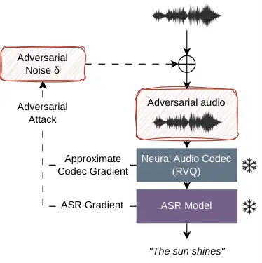

# Attack-Dependent Robustness of Neural Audio Codecs for Adversarial ASR

Jordan Prescott, Thanathai Lertpetchpun, and Shrikanth Narayanan
Affiliation:  Signal Analysis and Interpretation Laboratory  
University of Southern California, USA

###### Abstract

Neural audio codecs impose a discrete bottleneck through residual vector
quantization (RVQ), making them a useful class of inference-time
transformations for reducing adversarial perturbations before ASR
inference. We study how codec quantization depth affects defended ASR
under non-adaptive, standard adaptive, and quantization-aware adaptive
untargeted $`\ell_{\infty}`$ attacks. Under non-adaptive attacks,
intermediate RVQ depths yield the lowest word error rates and outperform
traditional compression at comparable bitrates. However, this apparent
optimum is not stable under adaptive evaluation. The standard
identity-gradient adaptive baseline (BPDA+EOT) can overestimate
robustness, while an implementation of an RVQ-relaxed adaptive attack
(SoftVQ-PGD) substantially changes the observed depth trend and largely
removes the intermediate-depth advantage. Overall, neural codecs can
improve defended ASR under specific threat models. However, the
relationship between robustness and RVQ depth depends on the attack used
for evaluation, rather than on the codec architecture alone.

###### Index Terms: 

Adversarial Robustness, Speech Recognition, Neural Audio Codecs,
Residual Vector Quantization

## I Introduction

Automatic speech recognition (ASR) systems are vulnerable to adversarial
attacks, where small, carefully crafted perturbations induce incorrect
or malicious transcriptions while preserving the original linguistic
content for human listeners \[1, 2\]. Inference-time preprocessing
defenses are attractive because they can be applied before ASR without
retraining or modifying the recognition model \[3, 4, 5, 6\]. However,
such defenses are difficult to evaluate. Reductions in attack success
may reflect genuine removal of adversarial structure, or they may arise
because the transformation obstructs gradient-based optimization under
adaptive attack \[4\]. This distinction is practically important: a
codec configuration selected under non-adaptive or weak adaptive
evaluation may not remain robust against an attacker that accounts for
the transformation.

Recent work has explored learned audio transformations for downstream
robustness. Chen et al. \[7\] studied neural codecs for adversarial
sample detection in speaker verification, while Ozer et al. \[8\] showed
that voice conversion models can disrupt neural audio watermarking while
preserving linguistic content. These findings motivate examining whether
robustness conclusions for learned audio transformations depend on the
evaluation methodology.

Neural audio codecs (NAC) are particularly useful for studying this
question because they introduce a discrete bottleneck with controllable
resolution. Modern neural codecs discretize latent representations via
residual vector quantization (RVQ) \[9, 10, 11\], where each codebook
quantizes the residual left by the previous stage. Shallow depths impose
stronger compression and may remove adversarial detail at the cost of
speech fidelity, while deeper depths better preserve speech but may also
preserve attack-relevant structure. RVQ depth therefore provides a
controlled probe for analyzing whether codec robustness trends are
stable properties of the transformation or artifacts of the attack used
to evaluate it.

Because RVQ depth changes both compression strength and reconstruction
fidelity, we use it as an analysis axis rather than proposing a fixed
neural codec defense. We ask whether robustness conclusions drawn under
non-adaptive evaluation remain stable when attacks account for the
defended codec-ASR pipeline. To do so, we compare non-adaptive Projected
Gradient Descent (PGD) \[12\], which optimizes against the ASR model
alone, with Backward Pass Differentiable Approximation with Expectation
over Transformation (BPDA+EOT) \[4\], which uses an identity-gradient
approximation through the codec, and SoftVQ-PGD, which uses a
differentiable relaxation of RVQ assignment while retaining hard
quantization at evaluation \[13, 14, 15\]. Our results show that under
untargeted $`\ell_{\infty}`$ evaluation, robustness trends over RVQ
depth depend on the attack used to evaluate the defended codec-ASR
pipeline, rather than being intrinsic to codec architecture alone.

Within this threat model, our main findings are:

1.  1.  RVQ depth exhibits an apparent U-shaped word error rate (WER)
        trade-off under non-adaptive PGD. Intermediate depths outperform
        traditional compression at comparable bitrates, while shallow and
        deep configurations are less effective in this threat model.
2.  2.  BPDA+EOT can give optimistic adaptive robustness estimates for
        RVQ-based transformations because its identity-gradient surrogate
        shows weak optimization through the discrete bottleneck.
3.  3.  A differentiable relaxation of RVQ quantization, which we call
        SoftVQ-PGD, provides a stronger quantization-aware adaptive attack
        by optimizing through codebook-distance geometry rather than an
        identity approximation.
4.  4.  SoftVQ-PGD substantially changes the RVQ-depth trend observed under
        PGD, largely eliminating the intermediate-depth optimum. Thus, the
        apparent optimal codec depth is dependent on the attack used to
        evaluate the defended codec-ASR pipeline.

## II Background

### II-A Neural Audio Codecs

Neural audio codecs implement learned encoder–decoder architectures that
compress waveforms through a discrete latent bottleneck. An encoder
$`E(\cdot)`$ maps an input waveform $`x`$ to a latent representation
that is quantized and reconstructed by a decoder $`G(\cdot)`$, enabling
low-bitrate compression while preserving perceptual quality.

Many neural codecs use RVQ to discretize latent features \[9, 10, 11\].
Let $`r_{1}=E(x)`$ denote the encoder output. RVQ applies a sequence of
$`N`$ codebooks, each of which quantizes the residual $`r_{k}`$ left by
the previous stage:

```math
q_{k}=Q_{k}(r_{k}),\qquad r_{k+1}=r_{k}-q_{k}, \tag{1}
```

yielding the quantized representation $`z_{q}=\sum_{k=1}^{N}q_{k}`$ and
reconstruction $`\hat{x}=G(z_{q})`$. Each hard quantizer selects the
nearest codeword from a learned codebook $`\mathcal{C}_{k}`$:

```math
Q_{k}(r_{k})=\arg\min_{e\in\mathcal{C}_{k}}\|r_{k}-e\|_{2}. \tag{2}
```

The number of codebooks $`N`$ controls reconstruction fidelity: larger
$`N`$ reduces quantization error while smaller $`N`$ enforces coarser
quantization that suppresses fine-grained signal variation. Because hard
nearest-neighbor assignment is piecewise constant, the quantization step
has zero gradient almost everywhere, making standard backpropagation
through the RVQ bottleneck ineffective without a surrogate.

### II-B Adversarial Attacks

Adversarial examples are inputs modified with small, carefully crafted
perturbations that cause a model to produce incorrect outputs. Given an
input signal $`x`$ and a model $`f(\cdot)`$, untargeted adversarial
attacks seek a perturbation $`\delta`$ within a bounded norm constraint
that maximizes transcription error:

```math
\max_{\delta\in\mathcal{B}_{p}(\epsilon)}\mathcal{L}(f(x+\delta),y), \tag{3}
```

where $`\mathcal{B}_{p}(\epsilon)`$ denotes the $`\ell_{p}`$ ball of
radius $`\epsilon`$, $`\mathcal{L}(\cdot)`$ is the ASR loss function,
and $`y`$ is the ground-truth transcription. In ASR, untargeted attacks
increase WER by maximizing decoding loss, while targeted attacks
minimize the loss toward a predefined target phrase.

When a preprocessing defense $`C(\cdot)`$ is applied at inference, the
attacker’s knowledge of and access to that defense determines the threat
model. In the _non-adaptive_ setting, the perturbation is optimized
against $`f(\cdot)`$ alone and the defense is applied only at
evaluation. PGD \[12\] is the standard non-adaptive baseline: it
iteratively updates $`\delta`$ using the ASR loss gradient and projects
onto the $`\ell_{\infty}`$ ball, with no knowledge of the defense being
used.

In the _adaptive_ setting, the attacker optimizes $`\delta`$ through the
full defended pipeline $`f(C(\cdot))`$. Because RVQ quantization is
non-differentiable, this requires a gradient surrogate, and the strength
of the resulting attack depends directly on the quality of that
surrogate. BPDA+EOT \[4\] is a common approach that replaces
$`\partial C/\partial x`$ with the identity during backpropagation—an
instance of the straight-through estimator \[15\]—EOT reduces gradient
variance by averaging the loss over Gaussian-jittered inputs:

```math
\max_{\delta\in\mathcal{B}_{p}(\epsilon)}\mathbb{E}_{\eta\sim\mathcal{N}(0,\sigma^{2})}\left[\mathcal{L}\big(f(C(x+\delta+\eta)),y\big)\right], \tag{4}
```

where $`C(\cdot)`$ denotes a transformation, like RVQ-based codecs.

The use of the identity surrogate is computationally convenient but
ignores the structure of vector quantization. It does not differentiate
through codebook selection, which can yield weak or misleading
optimization signals when the defense relies on a discrete
bottleneck \[4\].

For RVQ-based defenses, stronger gradient-based adaptive evaluation can
use surrogates that approximate the quantization step itself. A natural
approach replaces the hard nearest neighbor assignment with a
temperature-scaled softmax over codebook distances, yielding
differentiable weighted reconstructions while retaining hard
quantization at evaluation \[13, 15\]. Related quantization-aware
attacks have been studied for product-quantized image retrieval
systems \[16\]. We adapt this idea to RVQ-based neural audio codec
transformations and use the resulting differentiable relaxation as an
adaptive attack, which we refer to as SoftVQ-PGD.

### II-C Existing Defense Mechanisms

Defenses against adversarial attacks in speech recognition are often
grouped into three categories: adversarial training, detection-based
methods, and input preprocessing \[17, 18\]. Adversarial training
incorporates adversarial examples during model optimization to improve
robustness \[12, 19, 20, 21\], but requires increased computational cost
and typically improves robustness only within the perturbation regimes
seen during training. Detection-based approaches aim to identify
manipulated inputs without modifying the ASR model \[22, 3\]. However,
they do not remove perturbations and may be bypassed by adaptive
attacks. Preprocessing defenses apply signal transformations prior to
inference, including compression, filtering, learned enhancement, or
other waveform manipulations \[7, 5, 23, 24, 25, 6, 26, 27\]. These
methods are attractive because they operate at inference time and
require no retraining, but can fail when attackers explicitly account
for them \[4\].

Our work belongs to the preprocessing category. Rather than evaluating a
single fixed transformation, we use RVQ depth as an analysis axis across
multiple neural codec families and study how attack formulation changes
the apparent robustness of the defended codec-ASR pipeline.

## III Methodology

### III-A Codec Transformation and RVQ Depth

We model the defended ASR pipeline as $`f(C_{N}(x))`$, where $`f`$ is
the ASR model and $`C_{N}`$ is a neural codec reconstruction using the
first $`N`$ RVQ codebooks. Varying $`N`$ changes the effective
resolution of the discrete bottleneck: smaller $`N`$ enforces coarser
reconstruction, while larger $`N`$ preserves finer signal detail. We use
$`N`$ as the primary controlled variable for measuring how codec
capacity affects adversarial degradation and adaptive attack behavior.

### III-B Threat Model and Attacks

We consider untargeted $`\ell_{\infty}`$ bounded waveform attacks that
optimize an ASR loss as a surrogate for transcription error under
white-box access to the ASR model. The non-adaptive PGD baseline omits
the codec during optimization and applies it only during defended
evaluation. The adaptive attacks additionally assume knowledge of the
full codec-ASR pipeline and differ in how they approximate gradients
through the non-differentiable RVQ bottleneck: BPDA+EOT uses an
identity-gradient approximation, while SoftVQ-PGD uses a differentiable
relaxation of RVQ quantization. The general pipeline is illustrated in
Fig. 1.



Fig. 1: Codec-based inference-time transformation for defended ASR. PGD
ignores the codec during optimization, BPDA+EOT adapts with an
identity-gradient approximation, and SoftVQ-PGD adapts with a
differentiable relaxation of RVQ quantization.

Projected Gradient Descent (PGD). We use PGD \[12\] as the non-adaptive
white-box baseline. Perturbations are iteratively updated using the ASR
loss gradient and projected onto the $`\ell_{\infty}`$ ball, ignorant of
codec defense.

Backward Pass Differentiable Approximation with Expectation over
Transformation (BPDA+EOT). For adaptive evaluation, we first apply
BPDA+EOT \[4\]. Perturbations are optimized through the codec
transformation $`C(\cdot)`$, with the gradient of $`C`$ approximated by
the identity during backpropagation. EOT performs Monte Carlo averaging
of the loss over Gaussian-perturbed inputs prior to quantization,
smoothing the objective despite the discontinuities at RVQ decision
boundaries. Projected gradient optimization then proceeds under the same
$`\ell_{\infty}`$ constraint.

Soft Vector Quantization PGD (SoftVQ-PGD). Because BPDA+EOT uses an
identity surrogate rather than differentiating through codebook
selection, we additionally evaluate SoftVQ-PGD, which instantiates a
quantization-aware gradient surrogate using a differentiable relaxation
of hard vector quantization \[13, 14, 15\].

This relaxation is used only during attack optimization and does not
modify the hard-quantized codec used for final defended evaluation. For
each RVQ layer with residual input $`r_{k}`$ and codebook
$`\mathcal{C}_{k}=\{e_{k,j}\}_{j=1}^{M_{k}}`$, hard nearest-neighbor
assignment is replaced during attack optimization by a
temperature-scaled soft assignment over codebook distances:

```math
w_{k,j}(r_{k})=\frac{\exp\left(-\|r_{k}-e_{k,j}\|_{2}^{2}/\tau\right)}{\sum_{\ell=1}^{M_{k}}\exp\left(-\|r_{k}-e_{k,\ell}\|_{2}^{2}/\tau\right)}, \tag{5}
```

where $`\tau`$ controls the sharpness of the relaxation.

As $`\tau\rightarrow 0`$, the weights concentrate on the nearest
codeword and recover hard assignment, while larger $`\tau`$ distributes
mass across multiple codewords. The relaxed quantized vector is
consequently:

```math
\tilde{Q}_{k}(r_{k})=\sum_{j=1}^{M_{k}}w_{k,j}(r_{k})e_{k,j}. \tag{6}
```

The relaxed quantizers follow the standard RVQ residual sequence,
$`r_{k+1}=r_{k}-\tilde{Q}_{k}(r_{k})`$, producing a relaxed latent
representation that is passed through the codec decoder and ASR model so
gradients propagate through codebook-distance geometry rather than an
identity approximation. PGD is then performed on the input waveform
under the same $`\ell_{\infty}`$ constraint as the other attacks, while
$`\tau`$ is gradually decreased over optimization so the soft
assignments approach hard nearest-neighbor quantization.

## IV Experimental Setup

Dataset and ASR models. Experiments use random samples from LibriSpeech
test-clean \[28\]. To increase speaker diversity, we sample utterances
approximately evenly across speakers rather than drawing all utterances
uniformly. PGD is evaluated on 1000 samples. Because adaptive attacks
are more computationally expensive, BPDA+EOT and SoftVQ-PGD are
evaluated on a 500-sample subset of the PGD evaluation set. We evaluate
the codec-ASR pipeline on Whisper (base) \[29\] and wav2vec 2.0
(base) \[30\].

Neural codec configurations. We evaluate pretrained EnCodec \[9\],
DAC \[10\] (24 kHz), and Mimi \[11\] without retraining, covering a
range of frame rates, codebook depths, and acoustic-versus-semantic
learning objectives. PGD, BPDA+EOT, and SoftVQ-PGD are evaluated at
depths $`N\in\{2,4,6,8,10,12,16,24,32\}`$, providing a common sweep from
shallow, strongly compressed settings to deeper, higher-capacity
reconstructions. The codecs are pretrained and not finetuned for ASR on
this dataset.

Baselines. We compare against MP3 and Opus compression, two classical
compression-based transformations used in prior adversarial defense
studies \[23, 24, 25\]. MP3 and Opus are evaluated at 4.5 kbps, matching
the bitrate of EnCodec and DAC (6 codebooks, 4.5 kbps) and the maximum
available bitrate of Mimi (32 codebooks, 4.4 kbps). This controls
nominal bitrate so that observed differences cannot be attributed to the
requested compression rate alone, while allowing codec-specific
rate–distortion behavior to differ.

Adversarial attacks. We evaluate three untargeted
$`\ell_{\infty}`$-bounded attack formulations with 100 optimization
iterations: non-adaptive PGD \[12\], adaptive BPDA+EOT \[4, 31\], and
adaptive SoftVQ-PGD. PGD and SoftVQ-PGD use
$`\epsilon\in\{0.0001,0.001,0.005,0.01,0.02\}`$. Due to computational
cost, BPDA+EOT is evaluated at $`\epsilon\in\{0.005,0.01,0.02\}`$. We
focus on untargeted $`\ell_{\infty}`$ attacks, leaving targeted attacks
and alternative norm constraints for future work.

All three attacks use the same projected sign-PGD waveform update and
differ only in how gradients are computed. We use step size
$`\alpha=\epsilon/40`$, initialize
$`\delta\sim\mathcal{U}(-\epsilon,\epsilon)`$, and use no restarts or
gradient normalization beyond the sign update. After each step,
$`\delta`$ is projected to $`[-\epsilon,\epsilon]`$ and the waveform is
clipped to $`[-1,1]`$. Clean audio is peak-normalized to unit amplitude
before attack generation. Whisper gradients maximize teacher-forced
token cross-entropy over decoder logits, while wav2vec 2.0 gradients
maximize CTC loss against the normalized transcript. Non-adaptive PGD
computes these gradients through the ASR model alone, applying the
selected codec only during defended evaluation.

Following \[4\], BPDA+EOT uses codec reconstruction in the forward pass
and approximates codec gradients with a straight-through identity
function. EOT averages the loss over $`K=8`$ Gaussian-jittered codec
forwards with $`\sigma=0.001`$. Preliminary 50-sample sweeps over EOT
samples, jitter scale, and iteration count did not change the
qualitative trends, so we use this configuration in the main BPDA+EOT
experiments.

For SoftVQ-PGD, we use the same projected sign-PGD update as PGD,
replacing hard RVQ assignment with a differentiable soft assignment
during optimization, following soft-to-hard vector quantization
relaxations \[13, 15\]. We do not use EOT. The temperature $`\tau`$ is
linearly annealed from approximately $`1.0`$ to $`0.1`$ for all codecs
and depths, sharpening assignments toward hard quantization. Final
evaluation always uses the original hard-quantized codec.

SoftVQ-PGD depends on this schedule, whose effective sharpness can vary
across codecs, depths, and latent scales. We therefore treat it as a
fixed quantization-aware evaluation rather than tune it per
configuration. The results are not worst-case estimates over relaxation
schedules. Instead, they show that an RVQ-aware surrogate is sufficient
to substantially alter the apparent RVQ-depth robustness trend relative
to identity-gradient BPDA.

Uniform noise control. We evaluate uniform noise over the full
$`\epsilon`$ grid as a non-adversarial calibration control, sampling
$`\delta\sim\mathcal{U}(-\epsilon,\epsilon)`$ without gradient
optimization and applying the same clipping as the attacks. This
separates bounded signal distortion from adversarial degradation.

Evaluation metrics. We report word error rate (WER) for Whisper and
wav2vec 2.0 after defense reconstruction. Reported confidence intervals
are 95% utterance-level bootstrap intervals. PESQ and STOI are auxiliary
distortion measures, computed between the defended waveform and the
clean input.

## V Results and Discussion

We organize the results as a progression from calibration to
increasingly adaptive evaluation. First, we verify that the perturbation
budgets induce adversarial rather than merely noisy degradation by
comparing PGD with uniform noise in the absence of codec reconstruction.
We then use non-adaptive PGD to characterize how RVQ depth affects
defended ASR when the codec is applied only at inference, before
evaluating BPDA+EOT as a standard adaptive baseline and SoftVQ-PGD as a
quantization-aware adaptive attack. This sequence asks whether the
apparent RVQ-depth optimum is stable across threat models, or instead
depends on the attack surrogate used to optimize the defended codec-ASR
pipeline.

### V-A Attack Calibration and Non-Adaptive Depth Trade-off

|              |       |              |       |              |       |
| ------------ | ----- | ------------ | ----- | ------------ | ----- |
|              |       | Whisper      |       | wav2vec 2.0  |       |
| $`\epsilon`$ | Pert. | PESQ/STOI    | WER   | PESQ/STOI    | WER   |
| 0.0          | Clean | 4.64 / 1.00  | 5.25  | 4.64 / 1.00  | 3.94  |
| 0.0001       | Noise | 4.64 / 1.00  | 5.28  | 4.64 / 1.00  | 3.89  |
|              | PGD   | 4.63 / 1.00  | 6.75  | 4.63 / 1.00  | 5.77  |
| 0.001        | Noise | 4.30 / 0.999 | 5.21  | 4.30 / 0.999 | 3.89  |
|              | PGD   | 4.12 / 0.997 | 38.46 | 4.24 / 0.998 | 10.06 |
| 0.005        | Noise | 2.97 / 0.993 | 5.51  | 2.97 / 0.993 | 4.02  |
|              | PGD   | 2.85 / 0.982 | 76.78 | 2.90 / 0.988 | 17.38 |
| 0.01         | Noise | 2.23 / 0.983 | 5.60  | 2.23 / 0.983 | 4.43  |
|              | PGD   | 2.16 / 0.965 | 82.09 | 2.19 / 0.975 | 23.23 |
| 0.02         | Noise | 1.63 / 0.962 | 6.14  | 1.63 / 0.962 | 5.23  |
|              | PGD   | 1.59 / 0.932 | 95.52 | 1.60 / 0.947 | 34.12 |

TABLE I: No-codec perceptual quality and mean WER (%) on LibriSpeech
test-clean ($`n=1{,}000`$). PESQ/STOI are computed relative to clean
audio. For PGD rows, perceptual metrics are computed on the ASR-specific
adversarial waveforms.

We first calibrate the perturbation budgets in the absence of a codec
defense. Table I shows that uniform noise at the same $`\ell_{\infty}`$
budgets leaves WER near the clean baseline, while PGD produces large WER
increases for both ASR models. Because uniform noise and PGD have
comparable PESQ/STOI at each budget, the undefended degradation is
attributable to adversarial structure rather than bounded signal
distortion alone. This establishes PGD as a strong base-ASR attack
before evaluating codec transformations.

Fig. 2: Defended WER versus RVQ depth $`N`$ under uniform noise and PGD
for DAC, EnCodec, and Mimi, evaluated with Whisper. Uniform noise tracks
the clean codec baseline across depths, while PGD causes larger,
depth-dependent degradation.

|               | Whisper                |            | wav2vec 2.0            |            |
| ------------- | ---------------------- | ---------- | ---------------------- | ---------- |
| Defense       | WER (%) $`\downarrow`$ | PESQ/STOI  | WER (%) $`\downarrow`$ | PESQ/STOI  |
| None          | 38.46 $`\pm`$ 5.15     | 4.12/0.997 | 10.06 $`\pm`$ 0.73     | 4.24/0.998 |
| MP3           | 19.59 $`\pm`$ 1.28     | 1.50/0.843 | 17.51 $`\pm`$ 1.08     | 1.50/0.844 |
| Opus          | 19.22 $`\pm`$ 1.25     | 1.39/0.726 | 16.66 $`\pm`$ 1.04     | 1.39/0.728 |
| EnCodec (6cb) | 10.53 $`\pm`$ 0.84     | 2.47/0.924 | 5.67 $`\pm`$ 0.53      | 2.51/0.925 |
| DAC (6cb)     | 11.07 $`\pm`$ 0.86     | 2.93/0.937 | 6.28 $`\pm`$ 0.57      | 2.94/0.938 |
| Mimi (32cb)   | 8.94 $`\pm`$ 0.74      | 3.33/0.960 | 5.17 $`\pm`$ 0.49      | 3.35/0.960 |

TABLE II: WER (%, mean $`\pm`$ 95% CI) under PGD ($`\epsilon=0.001`$),
with PESQ/STOI means. All codecs are evaluated at 4.5 kbps, except Mimi
at 4.4 kbps and MP3 at 8 kbps. For neural codecs, cb = codebooks.

We next evaluate RVQ depth under non-adaptive PGD. In this setting, the
attack is optimized against the ASR model alone, and the codec is
applied only during defended evaluation. Fig. 2 shows that the same
calibration pattern holds under codec reconstruction: uniform noise
tracks the clean baseline across RVQ depths, while PGD produces
substantially larger, depth-dependent WER increases. Under PGD, shallow
depths can over-compress speech, intermediate depths often reduce
transcription error, and larger depths increasingly preserve
attack-relevant structure. This produces an apparent robustness
trade-off under simple non-adaptive evaluation.

Table II compares representative codec settings against bitrate-matched
Opus and minimum-bitrate MP3 baselines at $`\epsilon=0.001`$. Neural
codecs achieve the lowest WER for both ASR models. At matched bitrate,
neural codecs outperform Opus in both WER and reconstruction quality,
while also beating MP3 on both measures despite its higher 8-kbps
minimum bitrate. Thus, bitrate alone cannot explain their gains.
Together with the depth sweep in Fig. 2, these results show that
RVQ-based codec transformations can provide practical robustness gains
under non-adaptive PGD, but this apparent depth optimum depends on the
attack setting, as shown by the following adaptive evaluations.

### V-B BPDA+EOT Optimization Through RVQ

|              |               |                      |                    |
| ------------ | ------------- | -------------------- | ------------------ |
| $`\epsilon`$ | Method        | Whisper              | wav2vec 2.0        |
| 0.005        | MP3           | 59.15 $`\pm`$ 2.32   | 21.50 $`\pm`$ 1.59 |
|              | Opus          | 21.87 $`\pm`$ 1.89   | 21.85 $`\pm`$ 1.69 |
|              | EnCodec (6cb) | 7.10 $`\pm`$ 1.00    | 6.93 $`\pm`$ 0.92  |
|              | DAC (6cb)     | 7.03 $`\pm`$ 1.12    | 5.66 $`\pm`$ 0.81  |
|              | Mimi (32cb)   | 7.04 $`\pm`$ 1.03    | 5.22 $`\pm`$ 0.71  |
| 0.01         | MP3           | 104.69 $`\pm`$ 17.20 | 24.15 $`\pm`$ 1.68 |
|              | Opus          | 32.57 $`\pm`$ 2.11   | 29.94 $`\pm`$ 1.94 |
|              | EnCodec (6cb) | 11.15 $`\pm`$ 1.33   | 10.01 $`\pm`$ 1.10 |
|              | DAC (6cb)     | 8.70 $`\pm`$ 1.16    | 7.76 $`\pm`$ 0.98  |
|              | Mimi (32cb)   | 10.77 $`\pm`$ 1.30   | 7.81 $`\pm`$ 0.91  |
| 0.02         | MP3           | 107.46 $`\pm`$ 14.08 | 30.14 $`\pm`$ 1.95 |
|              | Opus          | 55.08 $`\pm`$ 9.59   | 46.97 $`\pm`$ 2.19 |
|              | EnCodec (6cb) | 24.66 $`\pm`$ 1.88   | 18.84 $`\pm`$ 1.53 |
|              | DAC (6cb)     | 16.09 $`\pm`$ 1.79   | 14.23 $`\pm`$ 1.45 |
|              | Mimi (32cb)   | 23.15 $`\pm`$ 1.81   | 13.52 $`\pm`$ 1.21 |

TABLE III: Mean WER (%) $`\pm`$ 95% CI under BPDA+EOT. All codecs are
evaluated at 4.5 kbps, except Mimi at 4.4 kbps and MP3 at 8 kbps. For
neural codecs, cb = codebooks

Fig. 3: Relative optimization-objective change for BPDA+EOT and
SoftVQ-PGD, averaged across codec families and RVQ depths, normalized
within ASR models. SoftVQ-PGD shows greater optimization progress.

We next evaluate BPDA+EOT as an adaptive baseline for the defended
codec-ASR pipeline. Table III reports BPDA+EOT WER. Under this
evaluation, RVQ-based codec transformations appear substantially more
effective than both MP3 and Opus. Across all budgets, neural codecs
yield lower WER than classical compression baselines. However, the
optimization diagnostics below suggest that these WER values should be
interpreted as BPDA+EOT outcomes rather than final adaptive robustness
estimates.

To diagnose this, Fig. 3 compares two adaptive attacks through the
defended codec-ASR pipeline: BPDA+EOT, which uses an identity-gradient
approximation, and SoftVQ-PGD, which uses a quantization-aware RVQ
relaxation. BPDA+EOT shows only modest objective movement even at larger
perturbation budgets, whereas SoftVQ-PGD makes substantially greater
optimization progress for both ASR models. This suggests that BPDA+EOT
can under-optimize through the RVQ bottleneck, so we treat it as a
useful adaptive baseline rather than a definitive robustness estimate,
motivating the SoftVQ-PGD evaluation in Section V-C.

### V-C SoftVQ-PGD Depth Trends

Fig. 4: Defended WER versus RVQ depth $`N`$ at $`\epsilon=0.005`$ under
PGD, BPDA+EOT, and SoftVQ-PGD across ASR models and codec families.
SoftVQ-PGD generally yields the highest defended WER, indicating
stronger optimization through the RVQ-based defense than PGD or
BPDA+EOT.

Fig. 5: Defended WER under SoftVQ-PGD versus RVQ depth for wav2vec 2.0
and Whisper across DAC, EnCodec, and Mimi. SoftVQ-PGD depth trends
flatten, decrease, or vary by codec-ASR pair.

Having diagnosed weak optimization under BPDA+EOT, we evaluate
SoftVQ-PGD as a quantization-aware adaptive attack. Fig. 4 compares
defended WER across attacks at $`\epsilon=0.005`$. Relative to BPDA+EOT
and non-adaptive PGD, SoftVQ-PGD produces substantially higher WER at
shallow and intermediate depths, changing the depth-dependent pattern
observed under the other attack formulations. This behavior is
consistent with the different optimization problem solved by SoftVQ-PGD.
Non-adaptive PGD optimizes only against the ASR model, so the codec can
distort part of the adversarial structure. SoftVQ-PGD instead optimizes
through a relaxed approximation of the codec, allowing optimization to
produce perturbations that remain harmful after RVQ reconstruction.

Sweeping SoftVQ-PGD across perturbation budgets shows that the
non-adaptive PGD depth trend from Section V-A does not transfer cleanly
to the quantization-aware attack. Whereas several PGD settings exhibit
an intermediate-depth minimum followed by increasing WER at larger
depths, Fig. 5 shows that SoftVQ-PGD often decreases or flattens with
additional RVQ layers, with exceptions such as DAC with Whisper. Thus,
the intermediate depth optimum observed under non-adaptive PGD is not an
intrinsic property of RVQ. Instead, it reflects an attack-dependent
WER-depth trade-off that changes when the attacker optimizes through a
quantization-aware surrogate.

Overall, these results show that codec robustness conclusions depend on
the attack formulation. Non-adaptive PGD suggests that RVQ depth can
create a useful compression–fidelity trade-off, and BPDA+EOT appears to
preserve much of this robustness. However, the optimization diagnostics
and SoftVQ-PGD results show that this conclusion is not stable under
quantization-aware adaptive evaluation.

## VI Conclusion

We analyzed RVQ-based neural audio codecs as inference-time
transformations for untargeted $`\ell_{\infty}`$ attacks on ASR. RVQ
showed a U-shaped robustness depth trend under non-adaptive PGD, while
BPDA+EOT suggested even greater robustness due to poor optimization. In
contrast, SoftVQ-PGD caused much more degradation and largely removed
the intermediate-depth optimum. These results show that robustness
trends across RVQ-depth vary by attack, not just codec architecture.
These conclusions are limited to untargeted $`\ell_{\infty}`$ attacks on
LibriSpeech test-clean with base Whisper and wav2vec 2.0. Future work
will explore targeted and alternative-norm attacks, broader ASR models,
and additional datasets.

## Acknowledgment

This work was supported by the National Science Foundation Graduate
Research Fellowship (NSF GRFP) grant DGE-1842487, as well as the Office
of the Director of National Intelligence (ODNI), Intelligence Advanced
Research Projects Activity (IARPA), via the ARTS Program under contract
D2023-2308110001. This work used NCSA Delta GPUs through allocation
CIS261094 from the Advanced Cyberinfrastructure Coordination Ecosystem:
Services & Support (ACCESS) program \[32\], which is supported by U.S.
NSF grants \#2138259, \#2138286, \#2138307, \#2137603, and \#2138296.

## AI-Generated Content Disclosure

Generative AI tools were used to assist with table and figure formatting
and language refinement of this manuscript. All experimental design,
implementation, data collection, analysis, and manuscript preparation
were conducted by the authors.

## References

- \[1\] N. Carlini and D. Wagner (2018) Audio adversarial examples:
  targeted attacks on speech-to-text. In 2018 IEEE security and privacy
  workshops (SPW), pp. 1–7. Cited by: §I.
- \[2\] Y. Qin, N. Carlini, G. Cottrell, I. Goodfellow, and C.
  Raffel (2019) Imperceptible, robust, and targeted adversarial examples
  for automatic speech recognition. In International conference on
  machine learning, pp. 5231–5240. Cited by: §I.
- \[3\] J. Lan, R. Zhang, Z. Yan, J. Wang, Y. Chen, and R. Hou (2022)
  Adversarial attacks and defenses in speaker recognition systems: a
  survey. Journal of Systems Architecture 127, pp. 102526. External
  Links: ISSN 1383-7621,
  [Document](https://dx.doi.org/10.1016/j.sysarc.2022.102526),
  [Link](https://www.sciencedirect.com/science/article/pii/S1383762122000893)
  Cited by: §I, §II-C.
- \[4\] A. Athalye, N. Carlini, and D. Wagner (2018) Obfuscated
  gradients give a false sense of security: circumventing defenses to
  adversarial examples. International conference on machine learning,
  pp. 274–283. Cited by: §I, §I, §II-B, §II-B, §II-C, §III-B, §IV, §IV.
- \[5\] I. Andronic, L. Kürzinger, E. R. Chavez Rosas, G. Rigoll,
  and B. U. Seeber (2020) MP3 compression to diminish adversarial noise
  in end-to-end speech recognition. In International Conference on
  Speech and Computer, pp. 22–34. Cited by: §I, §II-C.
- \[6\] S. Joshi, J. Villalba, P. Żelasko, L. Moro-Velázquez, and N.
  Dehak (2021) Study of pre-processing defenses against adversarial
  attacks on state-of-the-art speaker recognition systems. Trans. Info.
  For. Sec. 16, pp. 4811–4826. External Links: ISSN 1556-6013,
  [Link](https://doi.org/10.1109/TIFS.2021.3116438),
  [Document](https://dx.doi.org/10.1109/TIFS.2021.3116438) Cited by: §I,
  §II-C.
- \[7\] X. Chen, J. Du, H. Wu, J. R. Jang, and H. Lee (2024) Neural
  Codec-based Adversarial Sample Detection for Speaker Verification. In
  Interspeech 2024, pp. 522–526. External Links:
  [Document](https://dx.doi.org/10.21437/Interspeech.2024-1191), ISSN
  2958-1796 Cited by: §I, §II-C.
- \[8\] Y. Özer, W. Ge, Z. Zhang, X. Wang, and J. Yamagishi (2026) Self
  voice conversion as an attack against neural audio watermarking. arXiv
  preprint arXiv:2601.20432. Cited by: §I.
- \[9\] A. Défossez, J. Copet, G. Synnaeve, and Y. Adi (2022) High
  fidelity neural audio compression. arXiv preprint arXiv:2210.13438.
  Cited by: §I, §II-A, §IV.
- \[10\] R. Kumar, P. Seetharaman, A. Luebs, I. Kumar, and K.
  Kumar (2023) High-fidelity audio compression with improved RVQGAN. In
  Advances in Neural Information Processing Systems, Vol. 36,
  pp. 27980–27993. Cited by: §I, §II-A, §IV.
- \[11\] A. Défossez, L. Mazaré, M. Orsini, A. Royer, P. Pérez, H.
  Jégou, E. Grave, and N. Zeghidour (2024) Moshi: a speech-text
  foundation model for real-time dialogue. External Links: 2410.00037,
  [Link](https://arxiv.org/abs/2410.00037) Cited by: §I, §II-A, §IV.
- \[12\] A. Madry, A. Makelov, L. Schmidt, D. Tsipras, and A.
  Vladu (2018) Towards deep learning models resistant to adversarial
  attacks. In International Conference on Learning Representations,
  Cited by: §I, §II-B, §II-C, §III-B, §IV.
- \[13\] E. Agustsson, F. Mentzer, M. Tschannen, L. Cavigelli, R.
  Timofte, L. Benini, and L. V. Gool (2017) Soft-to-hard vector
  quantization for end-to-end learning compressible representations.
  Advances in neural information processing systems 30. Cited by: §I,
  §II-B, §III-B, §IV.
- \[14\] E. Jang, S. Gu, and B. Poole (2017) Categorical
  reparameterization with gumbel-softmax. In International Conference on
  Learning Representations, Cited by: §I, §III-B.
- \[15\] Y. Bengio, N. Léonard, and A. Courville (2013) Estimating or
  propagating gradients through stochastic neurons for conditional
  computation. arXiv preprint arXiv:1308.3432. Cited by: §I, §II-B,
  §II-B, §III-B, §IV.
- \[16\] Y. Feng, B. Chen, T. Dai, and S. Xia (2020) Adversarial attack
  on deep product quantization network for image retrieval. In
  Proceedings of the AAAI conference on Artificial Intelligence, Vol.
  34, pp. 10786–10793. Cited by: §II-B.
- \[17\] X. Zhang, H. Tan, X. Huang, D. Zhang, K. Tang, and Z. Gu (2022)
  Adversarial attacks on asr systems: an overview. arXiv preprint
  arXiv:2208.02250. Cited by: §II-C.
- \[18\] M. Zhao, L. Zhang, J. Ye, H. Lu, B. Yin, and X. Wang (2024)
  Adversarial training: a survey. arXiv preprint arXiv:2410.15042. Cited
  by: §II-C.
- \[19\] N. Mehlman, A. Sreeram, R. Peri, and S. Narayanan (2023) Mel
  frequency spectral domain defenses against adversarial attacks on
  speech recognition systems. JASA Express Letters 3 (3). Cited by:
  §II-C.
- \[20\] M. Pal, A. Jati, R. Peri, C. Hsu, W. AbdAlmageed, and S.
  Narayanan (2021) Adversarial defense for deep speaker recognition
  using hybrid adversarial training. In ICASSP 2021 - 2021 IEEE
  International Conference on Acoustics, Speech and Signal Processing
  (ICASSP), pp. 6164–6168. External Links:
  [Document](https://dx.doi.org/10.1109/ICASSP39728.2021.9414843) Cited
  by: §II-C.
- \[21\] A. Jati, C. Hsu, M. Pal, R. Peri, W. AbdAlmageed, and S.
  Narayanan (2021) Adversarial attack and defense strategies for deep
  speaker recognition systems. Computer Speech & Language 68,
  pp. 101199. External Links: ISSN 0885-2308,
  [Link](http://dx.doi.org/10.1016/j.csl.2021.101199),
  [Document](https://dx.doi.org/10.1016/j.csl.2021.101199) Cited by:
  §II-C.
- \[22\] T. Jayashankar, J. L. Roux, and P. Moulin (2020) Detecting
  Audio Attacks on ASR Systems with Dropout Uncertainty. In Interspeech
  2020, pp. 4671–4675. External Links:
  [Document](https://dx.doi.org/10.21437/Interspeech.2020-1846), ISSN
  2958-1796 Cited by: §II-C.
- \[23\] S. Hussain, P. Neekhara, S. Dubnov, J. McAuley, and F.
  Koushanfar (2021) WaveGuard: understanding and mitigating audio
  adversarial examples. 30th USENIX Security Symposium (USENIX Security
  21), pp. 2273–2290. Cited by: §II-C, §IV.
- \[24\] G. Chen, Z. Zhao, F. Song, S. Chen, L. Fan, F. Wang, and J.
  Wang (2023) Towards understanding and mitigating audio adversarial
  examples for speaker recognition. IEEE Transactions on Dependable and
  Secure Computing 20 (5), pp. 3970–3987. External Links:
  [Document](https://dx.doi.org/10.1109/TDSC.2022.3220673) Cited by:
  §II-C, §IV.
- \[25\] S. Räber, T. Aczel, A. Plesner, and R. Wattenhofer (2025) Keep
  it real: challenges in attacking compression-based adversarial
  purification. In NeurIPS 2025 Workshop: Reliable ML from Unreliable
  Data, Cited by: §II-C, §IV.
- \[26\] P. Żelasko, S. Joshi, Y. Shao, J. Villalba, J. Trmal, N. Dehak,
  and S. Khudanpur (2021) Adversarial attacks and defenses for speech
  recognition systems. arXiv preprint arXiv:2103.17122. Cited by: §II-C.
- \[27\] C. Yang, J. Qi, P. Chen, X. Ma, and C. Lee (2020)
  Characterizing speech adversarial examples using self-attention u-net
  enhancement. In ICASSP 2020-2020 IEEE International Conference on
  Acoustics, Speech and Signal Processing (ICASSP), pp. 3107–3111. Cited
  by: §II-C.
- \[28\] V. Panayotov, G. Chen, D. Povey, and S. Khudanpur (2015)
  Librispeech: an asr corpus based on public domain audio books. In 2015
  IEEE International Conference on Acoustics, Speech and Signal
  Processing (ICASSP), pp. 5206–5210. External Links:
  [Document](https://dx.doi.org/10.1109/ICASSP.2015.7178964) Cited by:
  §IV.
- \[29\] A. Radford, J. W. Kim, T. Xu, G. Brockman, C. McLeavey, and I.
  Sutskever (2023) Robust speech recognition via large-scale weak
  supervision. In International conference on machine learning,
  pp. 28492–28518. Cited by: §IV.
- \[30\] A. Baevski, Y. Zhou, A. Mohamed, and M. Auli (2020) Wav2vec
  2.0: a framework for self-supervised learning of speech
  representations. Advances in neural information processing systems 33,
  pp. 12449–12460. Cited by: §IV.
- \[31\] A. Athalye, L. Engstrom, A. Ilyas, and K. Kwok (2018)
  Synthesizing robust adversarial examples. International conference on
  machine learning, pp. 284–293. Cited by: §IV.
- \[32\] T. J. Boerner, S. Deems, T. R. Furlani, S. L. Knuth, and J.
  Towns (2023) ACCESS: advancing innovation: nsf’s advanced
  cyberinfrastructure coordination ecosystem: services & support. In
  Practice and Experience in Advanced Research Computing 2023: Computing
  for the Common Good, PEARC ’23, New York, NY, USA, pp. 173–176.
  External Links: ISBN 9781450399852,
  [Document](https://dx.doi.org/10.1145/3569951.3597559) Cited by:
  Acknowledgment.
