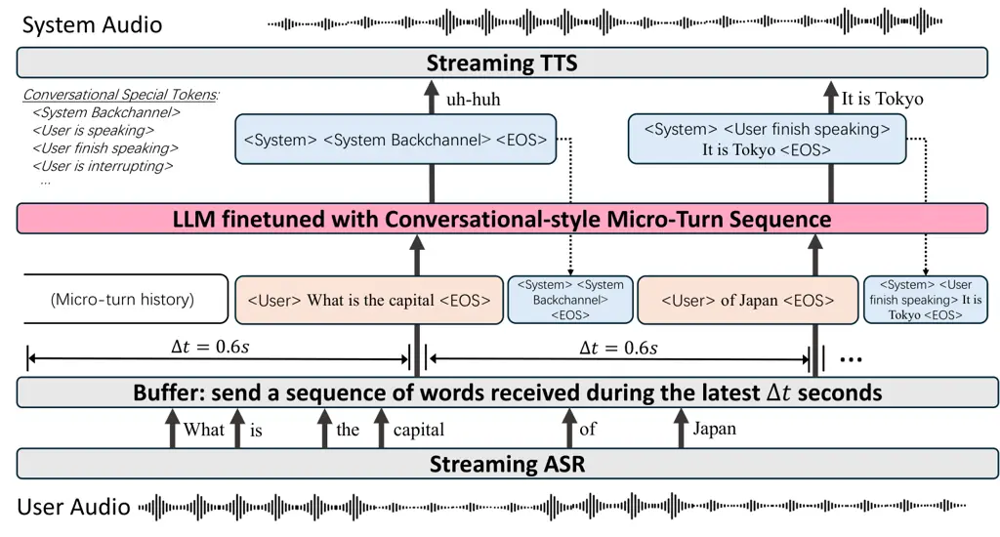

Yang Fujita Sudo

# DuplexCascade: Full-Duplex Speech-to-Speech Dialogue with VAD-Free Cascaded ASR–LLM–TTS Pipeline and Micro-Turn Optimization

Jianing    Yusuke    Yui

###### Abstract

Spoken dialog systems with cascaded ASR–LLM–TTS modules retain strong
LLM’s intelligence, but VAD segmentation often forces half-duplex turns
and brittle control. On the other hand, VAD-free end-to-end model
supports full-duplex interaction but is hard to maintain conversational
intelligence. In this paper, we present DuplexCascade, a VAD-free
cascaded streaming pipeline for full-duplex speech-to-speech dialogue.
Our key idea is to convert conventional utterance-wise long turns into
chunk-wise micro-turn interactions, enabling rapid bidirectional
exchange while preserving the strengths of a capable text LLM. To
reliably coordinate turn-taking and response timing, we introduce a set
of conversational special control tokens that steer the LLM’s behavior
under streaming constraints. On Full-Duplex-Bench and VoiceBench,
DuplexCascade delivers state-of-the-art full-duplex turn-taking and
strong conversational intelligence among open-source speech-to-speech
dialogue systems.

###### keywords

Full-Duplex Dialogue; Speech-To-Speech Systems; Cascaded Architectures;
Turn-Taking Control

^(†)^(†)address: ¹ SB Intuitions Corp., Japan, ² The University of
Tokyo, Japan ^(†)^(†)email: baleyang@g.ecc.u-tokyo.ac.jp,
yusuke.fujita@sbintuitions.co.jp, yui.sudo@sbintuitions.co.jp

## 1 Introduction

Figure 1: Overview of DuplexCascade. User audio is transcribed by a
streaming ASR and periodically flushed into text micro-turns
($`\Delta t=0.6\,`$s). The LLM consumes the dialogue history and the
latest micro-turn to generate the next system micro-turn together with
conversational special tokens (e.g., wait, respond, or backchannel). The
generated text is then synthesized by a streaming TTS to produce system
audio, enabling full-duplex interaction.

Recent advances in large language models (LLMs) have significantly
improved the quality and usability of spoken dialogue systems, bringing
speech-to-speech assistants closer to natural, low-friction
interaction \[1\]. In practice, most deployed systems adopt a cascaded
design in which automatic speech recognition (ASR) transcribes user
speech \[2\], an LLM performs dialogue reasoning in the text domain, and
text-to-speech (TTS) synthesizes the system response \[3, 4\]. This
modular architecture remains attractive because it is straightforward to
engineer and iterate on, and it inherits the strong
instruction-following and reasoning capabilities of modern text LLMs.

Despite their strong conversational intelligence, cascaded systems
typically depend on an external voice activity detector (VAD) to segment
user speech into turns. This reliance often forces a half-duplex
“listen-then-speak” interaction style and makes turn control brittle
under pauses, overlaps, and noise, leading to unnatural turn-taking
behaviors such as missing backchannels or failing to handle
mid-utterance interruptions \[5, 6, 7, 8\].

In contrast, recent end-to-end (E2E) speech–text models aim to remove
explicit VAD-based segmentation and directly support concurrent
listening and speaking, enabling more natural full-duplex turn
control \[9, 10, 11\]. However, this VAD-free duplex capability often
comes with a practical downside: compared with strong text LLMs,
conversational intelligence can degrade due to the difficulty of jointly
learning robust cross-modal representations and dialogue
policies \[12\].

In this work, we propose DuplexCascade¹¹ 1
[https://sbintuitions.github.io/DuplexCascadeDemo](https://sbintuitions.github.io/DuplexCascadeDemo),
a cascaded streaming pipeline that achieves full-duplex speech-to-speech
dialogue while preserving the intelligence benefits of an LLM-centered
design. The key idea is to transform conventional utterance-wise long
turns into chunk-wise micro-turn interactions, enabling more natural
full-duplex dialogue. We further introduce a carefully designed set of
conversational special tokens to explicitly regulate LLM behaviors
critical for duplex interaction, enabling VAD-free turn-taking control
and making the overall policy more stable and controllable. With only
50k multi-turn text dialogues, we perform lightweight LoRA
adaptation \[13\] for 5k steps, achieving strong full-duplex performance
on Full-Duplex-Bench \[14\]. Moreover, the text-only adaptation avoids
cross-modal alignment issues, yielding strong conversational
intelligence performace on VoiceBench \[12\].

## 2 Related Works

### 2.1 VAD-Based Turn Taking Control

Most recent speech-to-speech dialogue systems in practice follow a
cascaded design with ASR, LLM, and TTS components, and rely on an
external VAD to decide turn boundaries \[6, 15, 16\]. However, VAD-based
endpointing is fundamentally limited because it has difficulty
leveraging conversational semantics and intent, which are often crucial
for making precise turn-taking decisions \[17, 7\]. As a result,
cascaded systems often suffer from unstable turn-taking behaviors: they
may interrupt the user when a pause is semantically meaningful, or
remain silent when an immediate response or backchannel is expected \[8,
18, 19\]. Recent cascade-style systems such as Freeze-Omni \[5\] inherit
this difficulty, and VAD errors frequently become the dominant failure
mode for turn-taking quality.

### 2.2 VAD-Free Time-Division-Multiplexing Approach Toward Full-Duplex Interaction

Beyond VAD-driven cascades, recent work has explored making LLM-centered
systems behave in a full-duplex manner by restructuring interaction into
short, alternating segments without using external VAD \[20, 21, 22\].
MiniCPM-Duplex \[20\] introduces the concept of
Time-Division-Multiplexing encoding-decoding, which divides an
interaction into time slices and processes each input slice immediately
to produce the corresponding output slice. While this formulation
enables pseudo full-duplex interaction after fine-tuning, it does not
explicitly model or control turn-taking decisions; consequently,
performance can degrade in realistic dialogue settings.

## 3 DuplexCascade

[TABLE]

Table 1: Full-Duplex-Bench results. The best-performing duplex dialogue
model is shown in bold, and the second best is underlined. ^(§) means
the results are infered from offical checkpoints. ^(†) means the results
directly obtained from the paper.

### 3.1 Overview

Fig. 1 illustrates the overall proposed streaming pipeline. Unlike
conventional cascaded systems, the proposed pipeline does not rely on
VAD. Instead, user audio is continuously fed into a streaming ASR module
to produce partial text outputs in real time. The partial text outputs
are periodically, e.g. every 0.6 s, aggregated into a “micro-turn” and
sent to an LLM.

The proposed LLM is designed to handle a micro-turn sequence, where user
and system micro-turns are interleaved using a dedicated end-of-turn
token \<EOS\>. Given the micro-turn history, the LLM predicts the next
system micro-turn and then sends it to a streaming TTS module, which
synthesizes system audio incrementally. Importantly, the micro-turn does
not necessarily contain speech content, but can contain special tokens
that control the conversational flow.

### 3.2 Conversational Special Tokens

To make turn-taking decisions controllable under streaming constraints,
we introduce conversational special tokens.

#### 3.2.1 User’s special token.

- •
  \<no voice\>: insert when the buffer is flushed but no text has been
  recognized, to represent user silence for the current $`\Delta t`$
  interval.

#### 3.2.2 System’s special tokens.

- •
  \<user is speaking\>: output when the user is still speaking, to
  represent the system should stay silent; the system micro-turn ends
  immediately with \<EOS\>.
- •
  \<user finish speaking\>: output when the user has finished speaking,
  to represent the system should start responding; this token is
  followed by the system utterance content.
- •
  \<user is interrupting\>: output when the user interrupts while the
  system is speaking, to represent the system should stop generation;
  the system micro-turn ends immediately with \<EOS\>.
- •
  \<user backchannel\>: output when the user produces a backchannel
  while the system is speaking, to represent the system should ignore it
  and continue its current utterance.
- •
  \<user is thinking\>: output when the user is silent after the system
  finishes response and is likely thinking, to represent the system
  should take no action; the system micro-turn ends immediately with
  \<EOS\>.
- •
  \<system backchannel\>: output when the system should emit a short
  backchannel during user speech; once the LLM outputs \<system
  backchannel\>, we immediately play a pre-synthesised backchannel audio
  clip (sampled at random) and end the micro-turn with \<EOS\>.

### 3.3 Dynamic Construction of Duplex Training Data

Figure 2: Proposed dynamic construction pipeline for duplex training
sequences from text-only dialogues.

Real full-duplex dialogue corpora with turn-taking annotations are
scarce. We therefore randomly sample 50k dialogues from UltraChat \[23\]
and construct duplex-style training sequences dynamically by simulating
6 key interaction phenomena.

#### 3.3.1 Convert text dialogue into micro-turn segmentation

As illustrated in Fig. 2, we split both user and system utterance-wise
long-turns into chunk-wise micro-turns. After each user micro-turn, we
insert a system micro-turn that contains only \<user is speaking\> to
indicate that the user continues. After each system micro-turn, we
insert a user micro-turn \<no voice\> to represent that the user is
silent. For the first system micro-turn of each original system turn, we
prepend \<user finish speaking\> before the content to prompt the system
to take the turn. During training, we apply next-token prediction LoRA
fine-tuning \[13\] only on system micro-turns, which helps preserve the
backbone LLM’s conversational intelligence.

#### 3.3.2 Simulating duplex interaction phenomena

To better approximate real dialogue conditions, we simulate the
following interaction phenomena.

Randomized micro-turn length. To emulate the variability of streaming
ASR text emission, we sample the user micro-turn length uniformly from
1–7 tokens randomly. For training stability, we fix the system
micro-turn length to 10 tokens.

Natural pauses. After each user micro-turn that are split from the
original long turn, with probability 0.10 we randomly insert 1–5
additional silent user micro-turns represented by \<no voice\>. For
these inserted silent micro-turns, the corresponding system micro-turns
are supervised to output \<user is speaking\>, indicating that the
system should refrain from taking the turn.

User interruption. For each system long turn, with probability 0.30 we
simulate an interruption by letting the user start the next question at
a randomly selected system micro-turn boundary. Upon receiving the first
interrupting user micro-turn, the system is supervised to output \<user
is interrupting\> and abandon the remainder of the interrupted response;
during the subsequent user continuation, system micro-turns are
supervised to output \<user is speaking\>.

User backchannels. While the system is speaking, each system micro-turn
independently has a probability of 0.01 of replacing the next user \<no
voice\> with a short textual backchannel (e.g., “yes”, “okay”). In this
case, the system is supervised to output \<user backchannel\> and
continue generating the ongoing response.

System backchannels. Because text-only dialogues rarely contain explicit
system backchannels, we post-process user turns with
Qwen2-72B-Instruct²² 2
[https://huggingface.co/Qwen/Qwen2-72B-Instruct](https://huggingface.co/Qwen/Qwen2-72B-Instruct)
to insert marker \<BC/\> after sentence-level units where a backchannel
is appropriate. During training, these markers are used to supervise the
system to output the token \<system backchannel\>.

User thinking. After the system finishes its response, we randomly
insert 1–20 additional silent user micro-turns represented by \<no
voice\>. For these inserted silent micro-turns, the corresponding system
micro-turns are supervised to output \<user is thinking\>, indicating
that the system should wait while the user is processing the response.

## 4 Experiments

|                            |            |            |           |       |       |       |       |        |          |         |
| -------------------------- | ---------- | ---------- | --------- | ----- | ----- | ----- | ----- | ------ | -------- | ------- |
| Model                      | AlpacaEval | CommonEval | WildVoice | SD-QA | MMSU  | OBQA  | BBH   | IFEval | AdvBench | Overall |
| DSM-ASR+ Qwen2-7B-Instruct | 4.57       | 3.87       | 3.73      | 46.42 | 58.52 | 72.09 | 58.10 | 51.29  | 97.12    | 69.66   |
| Freeze-Omni^(†)            | 4.03       | 3.46       | 3.15      | 53.45 | 28.14 | 30.98 | 50.70 | 23.40  | 97.30    | 55.20   |
| Moshi^(†)                  | 2.01       | 1.60       | 1.30      | 15.64 | 24.04 | 25.93 | 47.40 | 10.12  | 44.23    | 29.51   |
| PersonaPlex^(§)            | 2.69       | 2.25       | 1.95      | 18.77 | 24.92 | 24.40 | 49.40 | 11.95  | 8.07     | 30.59   |
| DuplexCascade              | 4.40       | 3.64       | 3.56      | 45.56 | 52.86 | 56.04 | 59.80 | 43.38  | 99.04    | 65.41   |
| DuplexCascade-$`\beta`$    | 4.38       | 3.70       | 3.53      | 46.35 | 52.84 | 58.46 | 59.00 | 44.45  | 99.03    | 65.81   |

Table 2: VoiceBench results. The best-performing duplex dialogue model
is shown in bold, and the second best is underlined. ^(§) means the
results are infered from offical checkpoints. ^(†) means the results
directly obtained from the paper.

### 4.1 Implementation Details

We implement the proposed cascaded pipeline with streaming ASR and
streaming TTS based on DSM-ASR and DSM-TTS \[24\]. Following
Freeze-Omni, we adopt Qwen2-7B-Instruct³³ 3
[https://huggingface.co/Qwen/Qwen2-7B-Instruct](https://huggingface.co/Qwen/Qwen2-7B-Instruct)
as the text LLM backbone and perform lightweight adaptation on our
dynamically constructed duplex training set using LoRA \[13\] on the
query and value projections (LoRA rank $`r{=}16`$, $`\alpha{=}32`$). The
embedding parameters of the conversational special tokens are
initialized from a zero-mean Gaussian distribution.

During adaptation, we fully fine-tune the original token embedding
matrix, the embeddings of the newly introduced special tokens, and the
token prediction head, while the remaining backbone parameters are
updated through LoRA. To address class imbalance among conversational
special tokens, we use a weighted loss with the following weights:
\<user is speaking\> $`=1`$, \<user finish talking\> $`=10`$, \<user is
interrupting\> $`=5`$, \<user backchannel\> $`=2`$, \<user is thinking\>
$`=1`$, and \<system backchannel\> $`=3`$.

We train two variants: DuplexCascade (without system backchannels) and
DuplexCascade-$`\beta`$ (with system backchannels), to evaluate whether
training LLM with \<system backchannel\> affects overall model
performance. DuplexCascade does not include the \<system backchannel\>
token and is trained without any system-backchannel supervision, whereas
DuplexCascade-$`\beta`$ enables this token and is trained with the
corresponding simulation described in Sec. 3.3.

Optimization uses AdamW \[25\] with learning rate $`1\times 10^{-5}`$
and a linear warmup schedule for 500 steps. We set the batch size to 32,
fine-tune for 5k steps, and use a maximum sequence length of 4096
tokens. Each model was trained using 8 NVIDIA H100 GPUs for only 5
hours.

### 4.2 Full-Duplex-Bench Results

We evaluate DuplexCascade on Full-Duplex-Bench \[14\] against other
state-of-the-art models. The benchmark reports Take-Over Rate (TOR) for
each condition; however, TOR has mixed directions across subsets, making
it inconvenient to summarize overall turn-taking quality.

To provide an aggregated view, we introduce _Averaged Turn-Taking
Accuracy_. For subsets where lower TOR is better (Pause Handling and
Backchannel), we define accuracy as $`1{-}\mathrm{TOR}`$. For subsets
where higher TOR is better (Smooth Turn Taking and User Interruption),
we define accuracy as $`\mathrm{TOR}`$. Averaged Turn-Taking Accuracy is
the unweighted mean of these accuracies across all TOR-reported subsets.

Table 1 shows that DuplexCascade achieves the best Averaged Turn-Taking
Accuracy among the evaluated open systems, indicating consistently
strong turn-taking decisions across diverse duplex scenarios. In
contrast, Freeze-Omni, which uses VAD-driven approaches that rely on an
external endpointing head, exhibits noticeably weaker turn-taking
robustness, highlighting the benefit of explicitly modeling duplex
control decisions via LLM tokens rather than inferring them from
external endpointing head.

And DuplexCascade-$`\beta`$ achieved the second-best results on
backchannel-related metrics (ICC Freq and JSD), while competitive on
overall turn-taking accuracy. The results suggest that our proposed
method can control system’s reaction styles by text-only LLM training.

### 4.3 VoiceBench Results

A practical spoken dialogue system must also preserve the reasoning and
instruction-following capability of the underlying text LLM. We
therefore evaluate conversational intelligence using VoiceBench \[12\].
In addition to other state-of-the-art duplex models, to assess how our
method affects the LLM’s conversational intelligence, we also implement
a naive pipeline as defined in VoiceBench \[12\], which combines
DSM-ASR \[24\] and Qwen2-7B-Instruct.

As shown in Table 2, our models substantially outperform prior duplex
systems across nearly all VoiceBench dimensions, suggesting that LoRA
fine-tuning with text (instead of speech) helps preserve conversational
intelligence by avoiding cross-modality alignment issues. Compared with
the naive DSM-ASR+Qwen2-7B-Instuct pipeline, DuplexCascade and
DuplexCascade-$`\beta`$ achieve competitive scores with a moderate gap,
suggesting that our text-only adaptation largely retains the backbone
LLM’s capabilities despite operating under streaming micro-turn
constraints. Notably, DuplexCascade-$`\beta`$ demonstrates that our
method enables the LLM to produce backchannels while preserving its core
capabilities.

### 4.4 Micro-Turn $`\Delta t`$ Analysis

We study how the micro-turn duration $`\Delta t`$ affects turn-taking
accuracy and response latency. Specifically, we evaluate
$`\Delta t\in\{0.3,0.6,0.9,1.2,1.5,1.8\}\,`$s on Full-Duplex-Bench, and
report the resulting Averaged Turn-Taking Accuracy and Smooth
Turn-Taking Latency in Fig. 3. We observe that Averaged Turn-Taking
Accuracy improves as $`\Delta t`$ increases up to $`1.2\,`$s, after
which it degrades. In contrast, Smooth Turn-Taking Latency increases
monotonically with larger $`\Delta t`$, since the system must wait
longer before each buffer flush. These results suggest that, under our
simulation setting, $`\Delta t{=}1.2\,`$s provides the strongest
turn-taking performance, but at the cost of higher latency. We therefore
choose $`\Delta t{=}0.6\,`$s as a practical trade-off between
turn-taking accuracy and latency.

Figure 3: Effect of the micro-turn duration $`\Delta t`$ on Averaged
Turn-Taking Accuracy and turn-taking latency on Full-Duplex-Bench.

## 5 Conclusion

In this work, we presented DuplexCascade, a practical cascaded pipeline
for full-duplex speech-to-speech dialogue. By adapting a strong text LLM
with only a small amount of text-only dialogues via lightweight LoRA
fine-tuning, DuplexCascade achieves VAD-free and robust turn-taking
ability while largely preserving the conversational intelligence of the
underlying LLM. These results highlight that full-duplex interaction can
be enabled within a modular cascade without sacrificing the strengths of
modern text LLMs.

## 6 Generative AI Use Disclosure

Generative AI tools were used for language editing and improving the
phrasing of this manuscript.

## References

- \[1\] S. Ji, Y. Chen, M. Fang, J. Zuo, J. Lu, H. Wang, Z. Jiang, L.
  Zhou, S. Liu, X. Cheng, X. Yang, Z. Wang, Q. Yang, J. Li, Y. Jiang, J.
  He, Y. Chu, J. Xu, and Z. Zhao (2024) WavChat: A Survey of Spoken
  Dialogue Models. External Links: 2411.13577 Cited by: §1.
- \[2\] Y. Shangguan, J. Li, L. Qiao, R. Alvarez, and I. McGraw (2020)
  Analyzing the Quality and Stability of a Streaming End-to-End
  On-Device Speech Recognizer. In Proc. INTERSPEECH, Cited by: §1.
- \[3\] T. Saeki, S. Takamichi, and H. Saruwatari (2021) Incremental
  text-to-speech synthesis using pseudo lookahead with large pretrained
  language model. IEEE Signal Processing Letters 28, pp. 857–861. Cited
  by: §1.
- \[4\] N. Torgashov, G. E. Henter, and G. Skantze (2025) VoXtream:
  Full-Stream Text-to-Speech with Extremely Low Latency.
  arXiv:2509.15969. Cited by: §1.
- \[5\] X. Wang, Y. Li, C. Fu, Y. Zhang, Y. Shen, L. Xie, K. Li, X. Sun,
  and L. Ma (2025) Freeze-Omni: A Smart and Low Latency Speech-to-speech
  Dialogue Model with Frozen LLM. ICML. Cited by: §1, §2.1.
- \[6\] M. Shannon, G. Simko, S. Chang, and C. Parada (2017) Improved
  End-of-Query Detection for Streaming Speech Recognition. In Proc.
  Interspeech, pp. 1909–1913. External Links:
  [Document](https://dx.doi.org/10.21437/Interspeech.2017-496) Cited by:
  §1, §2.1.
- \[7\] D. Liang, H. Su, T. Singh, J. Mahadeokar, S. Puri, J. Zhu, E.
  Thomaz, and M. Seltzer (2023) Dynamic speech endpoint detection with
  regression targets. In Proc. ICASSP, pp. 1–5. Cited by: §1, §2.1.
- \[8\] G. Skantze (2021) Turn-taking in conversational systems and
  human-robot interaction: a review. Computer Speech & Language 67,
  pp. 101178. Cited by: §1, §2.1.
- \[9\] A. Défossez, L. Mazaré, M. Orsini, A. Royer, P. Pérez, H.
  Jégou, E. Grave, and N. Zeghidour (2024) Moshi: a speech-text
  foundation model for real-time dialogue. Technical report External
  Links: 2410.00037 Cited by: §1.
- \[10\] R. Roy, J. Raiman, S. Lee, T. Ene, R. Kirby, S. Kim, J. Kim,
  and B. Catanzaro (2026) PersonaPlex: Voice and Role Control for Full
  Duplex Conversational Speech Models. Cited by: §1.
- \[11\] T. A. Nguyen, E. Kharitonov, J. Copet, Y. Adi, W. Hsu, A.
  Elkahky, P. Tomasello, R. Algayres, B. Sagot, A. Mohamed, et
  al. (2023) Generative spoken dialogue language modeling. Transactions
  of the Association for Computational Linguistics 11, pp. 250–266.
  Cited by: §1.
- \[12\] Y. Chen, X. Yue, C. Zhang, X. Gao, R. T. Tan, and H. Li (2024)
  VoiceBench: Benchmarking LLM-Based Voice Assistants. arXiv preprint
  arXiv:2410.17196. Cited by: §1, §1, §4.3.
- \[13\] E. J. Hu, Y. Shen, P. Wallis, Z. Allen-Zhu, Y. Li, S. Wang, L.
  Wang, and W. Chen (2022) LoRA: Low-Rank Adaptation of Large Language
  Models. In Proc. ICLR, Cited by: §1, §3.3.1, §4.1.
- \[14\] G. Lin, J. Lian, T. Li, Q. Wang, G. Anumanchipalli, A. H. Liu,
  and H. Lee (2025) Full-duplex-bench: A benchmark to evaluate
  full-duplex spoken dialogue models on turn-taking capabilities. arXiv
  preprint arXiv:2503.04721. Cited by: §1, §4.2.
- \[15\] R. Maas, A. Rastrow, C. Ma, G. Lan, K. Goehner, G. Tiwari, S.
  Joseph, and B. Hoffmeister (2018) Combining Acoustic Embeddings and
  Decoding Features for End-of-Utterance Detection in Real-Time
  Far-Field Speech Recognition Systems. In Proc. IEEE ICASSP,
  pp. 5544–5548. External Links:
  [Document](https://dx.doi.org/10.1109/ICASSP.2018.8461478) Cited by:
  §2.1.
- \[16\] J. H. Ko, J. Fromm, M. Philipose, I. Tashev, and S.
  Zarar (2018) Limiting Numerical Precision of Neural Networks to
  Achieve Real-Time Voice Activity Detection. In Proc. IEEE ICASSP,
  pp. 2236–2240. Cited by: §2.1.
- \[17\] A. Raux and M. Eskenazi (2008) Optimizing Endpointing
  Thresholds using Dialogue Features in a Spoken Dialogue System. In
  Proc. SIGDIAL, pp. 1–10. Cited by: §2.1.
- \[18\] A. Maier, J. Hough, and D. Schlangen (2017) Towards Deep
  End-of-Turn Prediction for Situated Spoken Dialogue Systems. In Proc.
  Interspeech, pp. 1676–1680. External Links:
  [Document](https://dx.doi.org/10.21437/Interspeech.2017-378) Cited by:
  §2.1.
- \[19\] G. Castillo-López et al. (2025) A Survey of Recent Advances on
  Turn-taking Modeling in Conversational Systems. In Proc. IWSDS,
  pp. 254–271. Cited by: §2.1.
- \[20\] X. Zhang, Y. Chen, S. Hu, X. Han, Z. Xu, Y. Xu, W. Zhao, M.
  Sun, and Z. Liu (2024) Beyond the Turn-Based Game: Enabling Real-Time
  Conversations with Duplex Models. In Proc. EMNLP, pp. 11543–11557.
  Cited by: §2.2.
- \[21\] B. Veluri, B. N. Peloquin, B. Yu, H. Gong, and S.
  Gollakota (2024) Beyond Turn-Based Interfaces: Synchronous LLMs as
  Full-Duplex Dialogue Agents. In Proc. EMNLP, pp. 21390–21402. Cited
  by: §2.2.
- \[22\] Q. Zhang, L. Cheng, C. Deng, Q. Chen, W. Wang, S. Zheng, J.
  Liu, H. Yu, C. Tan, Z. Du, and S. Zhang (2025) OmniFlatten: An
  End-to-end GPT Model for Seamless Voice Conversation. In Proc. ACL,
  pp. 14570–14580. Cited by: §2.2.
- \[23\] N. Ding, Y. Chen, B. Xu, Y. Qin, S. Hu, Z. Liu, M. Sun, and B.
  Zhou (2023) Enhancing chat language models by scaling high-quality
  instructional conversations. In Proc. EMNLP, pp. 3029–3051. Cited by:
  §3.3.
- \[24\] N. Zeghidour, E. Kharitonov, M. Orsini, V. Volhejn, G. de
  Marmiesse, E. Grave, P. Pérez, L. Mazaré, and A. Défossez (2025)
  Streaming Sequence-to-Sequence Learning with Delayed Streams Modeling.
  Technical report External Links: 2509.08753 Cited by: §4.1, §4.3.
- \[25\] I. Loshchilov and F. Hutter (2017) Decoupled Weight Decay
  Regularization. In Proc. ICLR, Cited by: §4.1.
