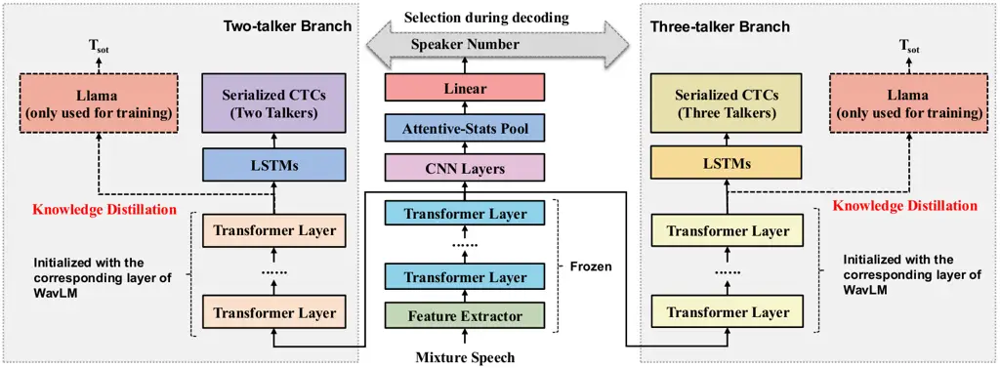

Shi Fujita Koshkin Zhao Gao Liu Sudo

# Distilling LLM Semantic Priors into Encoder-Only Multi-Talker ASR with Talker-Count Routing

Hao    Yusuke    Roman    Mengjie    Yuan    Lianbo    Yui

###### Abstract

Large language models (LLMs) provide strong semantic priors that can
improve multi-talker automatic speech recognition (MT-ASR), but using an
LLM as an autoregressive decoder is computationally expensive and
remains fragile under heavy overlap. In this paper, we propose an
_encoder-only_ MT-ASR framework that _adapts_ an LLM to multi-talker
conditioning and _distills_ its semantic guidance into the encoder
during training, while retaining fast CTC-style decoding at inference.
Our model employs a post-encoder separator with serialized CTC to
produce talker-ordered transcripts, and leverages an adapted LLM-based
SOT objective as a _multi-talker-aware_ teacher signal to explicitly
regularize mixed-speech representations. To further support _variable_
numbers of talkers, we introduce a Talker-Count Head that predicts the
talker count and dynamically selects the appropriate decoding branch.
Experiments on LibriMix show that the proposed encoder-only model
achieves comparable performance to LLM-based systems in the two-talker
condition, while delivering significant improvements in the three-talker
condition with significant small RTF.

###### keywords

Automatic speech recognition, multi-talker, serilized CTC, talker count

^(†)^(†)address: SB Intuitions, Tokyo, Japan ^(†)^(†)email:
hshi@ieee.org

## 1 Introduction

Multi-talker automatic speech recognition (MT-ASR) \[1, 2, 3, 4, 5\]
aims to transcribe all talkers’ utterances from overlapping speech \[6,
7, 8, 9, 10\]. End-to-end MT-ASR systems are often categorized by
training strategy, where two representative lines are utterance-level
permutation invariant training (uPIT) \[11, 12\] and serialized output
training (SOT) \[13\]. uPIT optimizes over all output permutations and
thus scales poorly with the number of talkers, while typically assuming
a fixed talker count. SOT mitigates these issues by representing
overlapped speech as a single serialized token sequence ordered by
speaker onset time, and is commonly implemented with an attention-based
encoder–decoder (AED) architecture \[14, 15\].

Recent progress in SOT-based MT-ASR has been largely decoder-centric,
including improved labeling strategies \[16\], enhanced self-attention
\[17\], and adopting large language models (LLMs) as decoders \[1, 3,
18\]. However, relying on powerful decoders keeps the encoder largely
talker-agnostic and forces the decoder to disentangle heavily overlapped
representations over long sequences. This is particularly suboptimal for
LLM decoders: although they provide strong semantic modeling, they are
slow and their gains do not reliably transfer to challenging
three-talker mixtures, suggesting that the _mixed-speech encoder
representation_ remains a key bottleneck. Motivated by this, recent
encoder-side talker-related CTC approaches \[2, 18, 19\] shift part of
the disentanglement from the decoder to the encoder by introducing
post-encoder modules such as a separator and talker-aware CTC heads,
enabling faster encoder-only decoding. Nevertheless, training serialized
CTC under severe overlap can still be unstable without strong semantic
regularization, and most CTC-based MT-ASR methods require assuming a
fixed number of talkers _a priori_.

In this paper, we shift the role of LLMs from an inference-time decoder
to a _train-time adaptable teacher_ for encoder-only MT-ASR. We first
perform _multi-talker information adaptation_ on the LLM so that it
better consumes and interprets talker-related cues under overlap, and we
_simultaneously distill_ its semantic guidance into the encoder via an
SOT-based objective to regularize mixed-speech representations. Then,
when training the post-encoder separator and serialized CTC heads, we
_continue_ to use the adapted LLM as a teacher signal to preserve the
encoder’s modeling capacity and stabilize optimization, while keeping
inference fully encoder-only and CTC-style. To support _variable_ talker
numbers, we further introduce a Talker-Count Head (TCH) that predicts
the number of talkers and dynamically routes inference to the
corresponding two- or three-talker branch, mitigating the fixed-count
limitation shared by prior talker-related CTC methods \[2, 18, 19\].

## 2 Preliminaries

### 2.1 Serialized Output Training (SOT) for MT-ASR

SOT generates a unified transcription by ordering the outputs of
multiple talkers sequentially, based on the speaking start time of each
talker. To indicate a change of talker, a special token
$`\langle\mathrm{sc}\rangle`$ is inserted between the transcriptions of
different talkers. For instance, with two talkers, the target sequence
becomes
$`\mathbf{T}_{\mathrm{sot}}=\{t_{1}^{1},\dots,t_{1}^{N^{1}},\langle\mathrm{sc}\rangle,t_{2}^{1},\dots,t_{2}^{N^{2}}\}`$,
where $`t_{1}`$ and $`t_{2}`$ correspond to the transcriptions of the
first- and second-speaking talkers. $`N^{1}`$ and $`N^{2}`$ correspond
to the transcription lengths of the two talkers. Given this training
target, the attention mechanism is able to attend to the relevant
segments of overlapping speech encodings and decode the transcriptions
$`\mathbf{T}_{e}`$ of multiple talkers in chronological order of their
speaking onsets. For SOT-based ASR, the training loss can be expressed
as

```math
\mathcal{L}_{\text{SOT}}=\mathcal{L}(\mathbf{T}_{e},\mathbf{T}_{\mathrm{sot}}). \tag{1}
```

Since the encoder produces a unified embedding rather than explicitly
separating overlapping speech, it is challenging to align the speech
embeddings with the target label sequence through CTC \[2\].
Consequently, training of the SOT-based ASR system relies solely on
cross-entropy (CE) loss.

### 2.2 LLMs as Decoder for ASR

LLM-based ASR systems typically comprise three components: a speech
encoder, a projector, and an LLM decoder. Self-supervised learning (SSL)
encoders \[20, 21\] are commonly adopted as the speech encoder. Given an
input waveform $`\mathbf{y}`$, the encoder produces an acoustic
representation

```math
\mathbf{H}_{e}=\operatorname{Encoder}(\mathbf{y}). \tag{2}
```

where $`\mathbf{H}_{e}`$ denotes the speech encoding, which is usually
much longer (in time) than the target text sequence; directly
conditioning an LLM on it is computationally demanding. A projector is
therefore introduced to _(i)_ reduce the temporal resolution and _(ii)_
map the features into the text-embedding space:

```math
\mathbf{H}_{p}=\operatorname{Projector}(\mathbf{H}_{e}). \tag{3}
```

where $`\mathbf{H}_{p}`$ is the projected representation. The projector
consists of downsampling blocks followed by a dimensionality-mapping
module. Two common downsampling strategies are: (a) a stack of strided
2D convolutional layers, or (b) frame stacking that concatenates $`n`$
consecutive frames along the feature axis. After downsampling, one or
more linear layers project the features to the text-embedding space. The
LLM decoder then generates the transcription conditioned on
$`\mathbf{H}_{p}`$:

```math
\mathbf{T}_{e}=\operatorname{LLM}(\mathbf{H}_{p},\mathbf{E}_{t}). \tag{4}
```

where $`\mathbf{E}_{t}`$ denotes the text embeddings and
$`\mathbf{T}_{e}`$ is the decoded text. How $`\mathbf{H}_{p}`$ is
consumed depends on the LLM family: with BART-style decoders,
$`\mathbf{H}_{p}`$ serves as encoder hidden states for cross-attention;
with LLaMA-style decoders, $`\mathbf{H}_{p}`$ is typically concatenated
(e.g., prepended or interleaved) with token embeddings at the input.
During fine-tuning, the LLM is often kept fixed and only lightweight
adapters (e.g., LoRA \[22\]) are updated. Training employs the CE loss

```math
\mathcal{L}=\operatorname{CE}(\mathbf{T}_{l},\mathbf{T}_{e}). \tag{5}
```

where $`\mathbf{T}_{l}`$ denotes the reference transcription.

### 2.3 Serialized CTC

We introduce a _post-encoder separator_ that disentangles the mixed
representation $`\mathbf{H}_{e}`$ into $`S`$ talker-specific streams
ordered by their speaking onsets:

```math
\mathbf{H}_{\text{sep}}^{1},\,\dots,\,\mathbf{H}_{\text{sep}}^{S}=\operatorname{Separator}(\mathbf{H}_{e}). \tag{6}
```

where $`S`$ is the number of talkers. We instantiate the separator with
an LSTM \[23\] followed by layer normalization and $`S`$ parallel
projection heads (one per talker):

```math
\widetilde{\mathbf{H}}=\operatorname{LayerNorm}(\operatorname{LSTM}(\mathbf{H}_{e})). \tag{7}
```

Each talker-specific stream is then obtained via a linear head and
nonlinearity:

```math
\mathbf{H}_{\text{sep}}^{s}=\operatorname{ReLU}(\operatorname{Linear}^{(s)}(\widetilde{\mathbf{H}})),\quad s=1,\dots,S. \tag{8}
```

The $`s`$-th head corresponds to the $`s`$-th talker in the SOT
serialization order (i.e., by onset time). Serialized CTC is applied
independently to each stream:

```math
\mathcal{L}_{\text{Serialized-CTC}}=\sum_{s=1}^{S}\operatorname{Loss}_{\text{CTC}}\big(\mathbf{H}_{\text{sep}}^{s},\,\mathbf{T}^{s}\big). \tag{9}
```

where $`\mathbf{T}^{s}`$ is the transcription of the $`s`$-th talker in
serialized order.



Figure 1: Flowchart of the proposed method. LLaMA is used only during
training for distillation.

## 3 Proposed Method

Our goal is to retain the efficiency of encoder-only MT-ASR while
injecting semantic priors that are typically provided by autoregressive
LLM decoders. To this end, we propose an encoder-only model trained with
a hybrid objective that distills LLM knowledge into the encoder via an
SOT-based teacher signal, together with serialized CTC for fast
inference. In addition, since CTC-based MT-ASR commonly assumes a fixed
number of talkers _a priori_, we introduce a Talker-Count Head (TCH)
that predicts the talker count and dynamically routes inference to the
appropriate two- or three-talker branch. The proposed model contains
several shared encoding layers together with specialized two- and
three-talker processing branches.

### 3.1 Transcription Encoder with Serialized CTC

We adopt WavLM \[20\] as the pretrained backbone of the transcription
encoder. Given an input waveform $`\mathbf{y}`$, a feature extractor
$`\mathrm{FE}`$ produces frame-level features
$`\mathbf{F}=\mathrm{FE}(\mathbf{y})`$. A stack of shared Transformer
layers $`E_{\theta}`$ further encodes them:

```math
\mathbf{H}_{s}=E_{\theta}(\mathbf{F}). \tag{10}
```

Two specialized Transformer branches, $`B^{(2)}`$ (two talkers) and
$`B^{(3)}`$ (three talkers), refine $`\mathbf{H}_{s}`$:

```math
\mathbf{Z}^{(b)}=B^{(b)}(\mathbf{H}_{s})=[\mathbf{z}^{(b)}_{1},\ldots,\mathbf{z}^{(b)}_{T_{b}}],\quad b\in\{2,3\}. \tag{11}
```

Each branch is followed by a talker-wise separator that produces $`b`$
streams:

```math
\mathbf{H}_{\mathrm{sep}}^{1},\,\ldots,\,\mathbf{H}_{\mathrm{sep}}^{b}=\mathrm{Separator}^{(b)}(\mathbf{Z}^{(b)}),\quad b\in\{2,3\}. \tag{12}
```

The serialized CTC loss is then applied as in Eq. (9).

### 3.2 LLM Adaptation and Distillation

Training serialized CTC under heavy overlap can be unstable without
additional semantic regularization, and using an LLM as an
inference-time decoder is costly. We therefore use an LLM as a
_train-time adaptable teacher_ and distill its semantic guidance into
the encoder, while keeping inference fully encoder-only and CTC-style.

Phase 1: Multi-talker information adaptation of the LLM with joint
encoder distillation. We start from an SOT-based encoder–decoder model
and use a pretrained LLaMA decoder. To make the teacher better aligned
with multi-talker conditioning, we adapt the LLM by updating only
lightweight parameters (LoRA adapters \[22\] and token embeddings tied
to the LM head to accommodate special tokens), while keeping the LLM
backbone frozen. This stage optimizes the SOT objective (Eq. 1), which
serves two purposes: (i) it adapts the LLM to better interpret
talker-related cues under overlap, and (ii) it _simultaneously distills_
the resulting semantic guidance into the encoder through backpropagation
to the acoustic pathway.

Phase 2: Serialized CTC training with continued distillation. We then
attach the separator and serialized CTC heads after the corresponding
two- or three-talker branch and optimize the encoder-only path. During
this phase, we keep the adapted LLaMA fixed and continue to compute the
SOT loss as a teacher signal, so that the encoder maintains the semantic
regularization learned in Phase 1 while being optimized for CTC
decoding. Concretely, we optimize a CTC–attention hybrid objective:

```math
\mathcal{L}_{\text{EncSep}}=\alpha\,\mathcal{L}_{\text{Serialized-CTC}}+(1-\alpha)\,\mathcal{L}_{\text{SOT}}, \tag{13}
```

where $`\alpha\in[0,1]`$ balances the two terms. Note that LLaMA is used
only during training and introduces no additional computation at
inference time.

### 3.3 Talker-Count Head

The talker-count head maps the shared-encoder output $`\mathbf{H}_{s}`$
to binary logits $`\mathbf{o}`$ (two vs. three talkers). We score each
frame with an additive attention and apply an optional speech-activity
mask $`m_{t}\in\{0,1\}`$. Let
$`\mathbf{H}_{s}=[\mathbf{h}_{1},\ldots,\mathbf{h}_{T}]`$. We compute
attention weights as

```math
\alpha_{t}=\frac{\exp\bigl(\mathbf{v}^{\top}\tanh(\mathbf{W}\mathbf{h}_{t}+\mathbf{b})+c\bigr)\,\mathbb{I}_{[m_{t}=1]}}{\sum_{t^{\prime}:\,m_{t^{\prime}}=1}\exp\bigl(\mathbf{v}^{\top}\tanh(\mathbf{W}\mathbf{h}_{t^{\prime}}+\mathbf{b})+c\bigr)}. \tag{14}
```

Using the attention weights $`\alpha_{t}`$, we compute mean and
dispersion statistics:

```math
\displaystyle\boldsymbol{\mu} \displaystyle=\sum_{t}\alpha_{t}\,\mathbf{h}_{t}, \tag{15}
```

```math
\displaystyle\boldsymbol{\sigma} \displaystyle=\sqrt{\sum_{t}\alpha_{t}\left(\mathbf{h}_{t}-\boldsymbol{\mu}\right)^{\odot 2}+\varepsilon},
```

```math
\displaystyle\mathbf{z} \displaystyle=[\boldsymbol{\mu};\boldsymbol{\sigma}]\in\mathbb{R}^{2D},
```

where $`D`$ is the hidden dimensionality and $`\odot`$ denotes
element-wise square. The pooled vector is normalized and passed through
a light MLP to obtain logits:

```math
\mathbf{o}=\mathbf{W}_{2}\,\operatorname{Dropout}\bigl(\operatorname{GELU}\bigl(\mathbf{W}_{1}\,\operatorname{LayerNorm}(\mathbf{z})+\mathbf{b}_{1}\bigr)\bigr)+\mathbf{b}_{2}. \tag{16}
```

Class probabilities and the prediction are

```math
\displaystyle p_{\theta}(y{=}k\mid\mathbf{H}_{s}) \displaystyle=\mathrm{softmax}(\mathbf{o})_{k},\quad k\in\{1,2\}, \tag{17}
```

```math
\displaystyle\hat{y} \displaystyle=\arg\max_{k}\,p_{\theta}(y{=}k\mid\mathbf{H}_{s}).
```

We minimize CE loss over a minibatch of $`N`$ utterances:

```math
\mathcal{L}_{\mathrm{count}}=-\frac{1}{N}\sum_{i=1}^{N}\log\frac{\exp\bigl(o^{(i)}_{y^{(i)}}\bigr)}{\sum_{k=1}^{2}\exp\bigl(o^{(i)}_{k}\bigr)}. \tag{18}
```

where $`o^{(i)}_{y^{(i)}}`$ denotes the logit assigned by the model to
the ground-truth class $`y^{(i)}`$ for sample $`i`$ (i.e., the
pre-softmax score).

## 4 Experiments

### 4.1 Datasets

We evaluate our models on LibriMix \[24\]. Clean speech is from the
LibriSpeech train-clean-100, train-clean-360, dev-clean, and test-clean
subsets \[25\], and noise samples are taken from WHAM! \[26\]. Two- and
three-talker mixtures are synthesized using the official scripts. To
control overlap patterns, we use start-time _offset files_: for
two-talker mixtures we follow the official ESPnet configuration, whereas
for three-talker mixtures we create our own offsets.

### 4.2 Model Configurations

We initialize the encoder stacks from the pretrained WavLM-Large (24
Transformer blocks)¹¹ 1
[https://huggingface.co/microsoft/wavlm-large](https://huggingface.co/microsoft/wavlm-large),
owing to its robust pretraining, including mixture/overlap simulation
well suited to multi-talker conditions. For example, the shared encoder
(12 layers) is seeded with WavLM layers 1–12, while the two- and
three-talker branches (12 layers each) are initialized from layers 13–24
(independent copies, no weight tying). During training, the shared
layers are frozen. For the LLM decoder, we use LLaMA-3.2-1B²² 2
[https://huggingface.co/meta-llama/Llama-3.2-1B](https://huggingface.co/meta-llama/Llama-3.2-1B).
For Serialized CTC, the Separator contains the two-layer LSTM with 896
hidden units.

|     |     |                               |         |        |        |                 |      |      |                |      |      |                 |      |      |                |      |      |
| --- | --- | ----------------------------- | ------- | ------ | ------ | --------------- | ---- | ---- | -------------- | ---- | ---- | --------------- | ---- | ---- | -------------- | ---- | ---- |
| ID  | S/V | Model                         | Encoder |        |        | Noisy           |      |      |                |      |      | Clean           |      |      |                |      |      |
|     |     |                               | FE      | TCH.L. | Enc.L. | Development Set |      |      | Evaluation Set |      |      | Development Set |      |      | Evaluation Set |      |      |
|     |     |                               |         |        |        | A.TC            | 2mix | 3mix | A.TC           | 2mix | 3mix | A.TC            | 2mix | 3mix | A.TC           | 2mix | 3mix |
| 1   | S   | (Baseline) SOT w/ Llama-1B    | ✓       | -      | 24     | -               | 12.4 | 39.8 | -              | 11.3 | 39.1 | -               | 4.6  | 21.5 | -              | 4.6  | 21.6 |
| 2   |     |                               | ✓       | -      | 18     | -               | 17.7 | 49.2 | -              | 15.5 | 48.4 | -               | 5.9  | 30.4 | -              | 6.1  | 31.7 |
| 3   |     |                               | ✓       | -      | 12     | -               | 35.8 | 62.0 | -              | 34.2 | 62.2 | -               | 25.3 | 47.7 | -              | 25.1 | 49.7 |
| 4   |     |                               | ✓       | -      | 6      | -               | 43.1 | 65.5 | -              | 41.2 | 65.4 | -               | 29.6 | 52.5 | -              | 30.5 | 54.7 |
| 5   | V   | Training without KD from LLM  |         |        | 24     | -               | 68.0 | 81.6 | -              | 66.3 | 80.4 | -               | 51.8 | 69.9 | -              | 52.2 | 70.1 |
| 6   |     | (Proposed) Encoder-only Model | -       | -      | 24     | 100.            | 10.5 | 23.3 | 100.           | 9.6  | 22.2 | 100.            | 4.0  | 12.8 | 100.           | 4.1  | 12.9 |
| 7   |     |                               | ✓       | -      | 24     | 80.2            | 12.0 | 28.0 | 78.1           | 11.5 | 26.9 | 89.9            | 4.5  | 15.8 | 88.0           | 4.6  | 16.2 |
| 8   |     |                               | ✓       | 6      | 24     | 88.5            | 10.6 | 28.0 | 86.8           | 9.6  | 28.3 | 97.8            | 4.0  | 13.9 | 96.3           | 4.1  | 14.6 |
| 9   |     |                               | ✓       | 12     | 24     | 94.6            | 10.7 | 25.1 | 93.7           | 9.7  | 24.5 | 98.0            | 4.0  | 13.7 | 97.0           | 4.1  | 14.3 |
| 10  |     |                               | ✓       | 18     | 24     | 89.7            | 10.6 | 27.2 | 88.0           | 9.6  | 27.2 | 97.0            | 4.0  | 14.2 | 95.8           | 4.1  | 14.7 |

Table 1: Results of the proposed method. “S/V” denotes the talker-count
condition used in training: S = single-count (only one talker number), V
= varied-count (mixed two-/three-talker). “FE” is the feature extraction
module. “TCH” represents the talker-count head. “TCH.L.” represents the
number of TCH layers. “Enc.L.” represents the number of each encoder
layers for transcription. “A.TC” is the talker-count accuracy (%). Word
Error Rate (WER) is used for 2mix and 3mix evaluation.

|     |        |       |      |       |      |       |      |       |      |
| --- | ------ | ----- | ---- | ----- | ---- | ----- | ---- | ----- | ---- |
| ID  | TCH.L. | Noisy |      |       |      | Clean |      |       |      |
|     |        | Dev.  |      | Eval. |      | Dev.  |      | Eval. |      |
|     |        | 2mix  | 3mix | 2mix  | 3mix | 2mix  | 3mix | 2mix  | 3mix |
| 7   | -      | 78.8  | 81.7 | 73.4  | 82.8 | 90.9  | 89.0 | 88.8  | 87.3 |
| 8   | 6      | 99.7  | 77.3 | 99.9  | 73.7 | 100.  | 95.5 | 99.9  | 92.6 |
| 9   | 12     | 99.0  | 90.2 | 98.7  | 88.7 | 100.  | 96.0 | 99.8  | 94.1 |
| 10  | 18     | 99.7  | 79.7 | 99.3  | 76.7 | 99.9  | 94.0 | 99.9  | 91.7 |

Table 2: Accuracy of TCH for 2mix and 3mix condition

|          |           |           |
| -------- | --------- | --------- |
| Model    | Libri2Mix | Libri3Mix |
| CTC      | 0.0043    | 0.0106    |
| Llama-1B | 0.1150    | 0.0981    |

Table 3: Real-time factor (RTF) between the proposed methods and
SOT-based LLM methods.

### 4.3 Experimental Results and Analysis

#### 4.3.1 Impact of Encoder Depth

We first evaluate baseline models to examine how the number of encoder
layers influences ASR performance, as shown in Table 1. From ID–1 to
ID–4, the results indicate that recognition performance drops
substantially as the number of encoder layers decreases. Thus, we use
all 24 Transformer encoder layers of WavLM-Large for the encoder. The
two- and three-talker encoders share only the feature extraction module
of WavLM.

#### 4.3.2 Performance of the Encoder-Only Model

We first examined training the model with only the serialized CTC loss
(Eq. 9) in ID–5. The results show that the model fails to train
effectively under this setting. We evaluated the encoder-only model
under the assumption of a perfectly accurate talker number classifier.
As shown in ID–6 in Table 1, the proposed encoder-only model achieved
strong performance, with significant improvements over ID–1 across all
conditions, especially in the 3-mix scenario. We then evaluated the
encoder-only model under different configurations of the Talker-Count
Head (TCH). In ID–7, only the feature extraction module is used prior to
the TCH. In ID–8 to ID–10, the feature extractor is followed by varying
numbers of encoder layers (initialized from the corresponding layers of
WavLM) before the TCH. During training, both the feature extractor and
all Transformer layers are kept frozen. The results suggest that adding
more Transformer layers does not always lead to better performance.
Considering all conditions, ID–9 (with 12 Transformer layers before the
TCH) yields the most effective improvement among the tested settings
(0/6/12/18 layers). For the 2-talker condition, all TCH configurations
with Transformer layers yielded similar performance. For the 3-talker
condition, although adding 6 or 18 Transformer layers improved
talker-count accuracy compared with using only the feature extraction
module, the ASR performance did not improve under noisy condition. Thus,
we further examined the detailed accuracy of each TCH setting to
identify the underlying reasons, which is shown in Table 2. The results
show that with Transformer layers, the 2-talker condition can be
recognized with very high accuracy, whereas the 3-talker condition
remains much more difficult to achieve high accuracy. While ID–9
achieves substantial gains compared with the baseline model ID–1 under
the 3-talker condition, it still performs worse than ID–6. The claim
that preconditioning with accurate talker counting is an essential
module for MT-ASR \[27, 28\] is also supported by the conclusions of
this paper, even without additional experiments.

#### 4.3.3 Inference Efficiency of the Encoder-Only Model

We reported the RTF for the proposed CTC-based model and the SOT-based
LLM baseline on Libri2Mix and Libri3Mix. RTF was computed as the ratio
of total inference time to total input audio duration, measured on a
single NVIDIA H100 80GB GPU with batch size 1. As shown in Table 3, the
CTC model ran substantially faster than Llama-1B.

#### 4.3.4 Comparison between existing approaches

Table 4 compares the proposed method with existing approaches. The
results show that larger LLMs can improve performance in the 2-talker
condition, but our proposed encoder-only method achieves comparable
results. While LLM-based methods struggle with the 3-talker condition as
analyzed in our previous work \[18\], the encoder-only method performs
well and even outperforms the LLM-based approach. We also compare a
variant without an LLM, using a standard Transformer decoder (w/o LLM),
as well as encoder-only CTC decoding (w/o decoder: CTC). Results show
that stronger semantic guidance from the LLM consistently improves
performance, and remains beneficial even in the three-talker condition,
indicating that semantic information significantly strengthens the
encoder under severe overlap.

|     |                                                                                                                                                                       |           |      |           |      |
| --- | --------------------------------------------------------------------------------------------------------------------------------------------------------------------- | --------- | ---- | --------- | ---- |
| REF |                                                                                                                                                                       | Libri2Mix |      | Libri3Mix |      |
|     |                                                                                                                                                                       | Dev       | Eval | Dev       | Eval |
| N   | Without LLMs; with SSL for the speech encoder                                                                                                                         |           |      |           |      |
|     | Training from Scratch ³³ 3 [https://github.com/espnet/espnet/tree/master/egs2/librimix/sot_asr1](https://github.com/espnet/espnet/tree/master/egs2/librimix/sot_asr1) | 19.4      | 17.1 | 30.5      | 28.2 |
|     | TSE-V-Whisper \[29\]                                                                                                                                                  | -         | 12.0 | -         | -    |
|     | GEncSep \[2\]                                                                                                                                                         | 17.2      | 15.0 | 28.0      | 25.9 |
|     | w/o decoder: CTC                                                                                                                                                      | 16.8      | 14.6 | 25.7      | 23.6 |
|     | With LLMs                                                                                                                                                             |           |      |           |      |
|     | SOT-Llama-1B \[18\]                                                                                                                                                   | 12.4      | 11.3 | 39.8      | 39.1 |
|     | SOP-Llama-1B \[18\]                                                                                                                                                   | 11.8      | 10.5 | 29.6      | 28.5 |
|     | SOT-Llama-3B \[18\]                                                                                                                                                   | 11.2      | 9.8  | 34.2      | 31.7 |
|     | SOP-Llama-3B \[18\]                                                                                                                                                   | 10.5      | 9.2  | 29.3      | 28.1 |
|     | ID-8                                                                                                                                                                  | 10.7      | 9.7  | 25.1      | 24.5 |
| C   | Without LLMs; with SSL for the speech encoder                                                                                                                         |           |      |           |      |
|     | Training from Scratch ^(†)^(†)footnotemark:                                                                                                                           | 6.8       | 7.0  | 15.0      | 14.7 |
|     | W2V-Sidecar-ft. \[30\]                                                                                                                                                | 7.7       | 8.1  | -         | -    |
|     | WavLM-CLN \[31\]                                                                                                                                                      | 7.1       | 7.6  | -         | -    |
|     | C-HuBERT LARGE \[21\]                                                                                                                                                 | 6.6       | 7.8  | -         | -    |
|     | GEncSep \[2\]                                                                                                                                                         | 6.4       | 6.6  | 13.3      | 13.1 |
|     | w/o decoder: CTC                                                                                                                                                      | 6.0       | 6.1  | 12.7      | 12.5 |
|     | With LLMs                                                                                                                                                             |           |      |           |      |
|     | SOT-Llama-1B \[18\]                                                                                                                                                   | 4.6       | 4.6  | 21.5      | 21.6 |
|     | SOP-Llama-1B \[18\]                                                                                                                                                   | 3.9       | 4.0  | 20.8      | 22.0 |
|     | SOT-Llama-3B \[18\]                                                                                                                                                   | 4.0       | 4.1  | 22.3      | 22.0 |
|     | SOP-Llama-3B \[18\]                                                                                                                                                   | 3.5       | 3.6  | 17.0      | 16.5 |
|     | ID-8                                                                                                                                                                  | 4.0       | 4.1  | 13.7      | 14.3 |

Table 4: Comparison between the proposed method and existing methods on
the LibriMix datasets (270 hours for Libri2Mix and 186 hours for
Libri3Mix, without any additional data augmentation). Word Error Rate
(WER) is used for evaluation. “N/C” represents the noisy or clean
condition.

## 5 Conclusions

In this paper, we proposed an encoder-only framework for multi-talker
ASR that preserves the decoding efficiency of serialized CTC while
injecting semantic priors from large language models (LLMs) during
training. Specifically, we adapt an LLM to multi-talker conditioning and
distill its guidance into the encoder, and we further continue the
distillation signal when optimizing the post-encoder separator and
serialized CTC heads, yielding a fast CTC-style inference pipeline
without relying on an LLM decoder at test time. To support variable
numbers of talkers, we introduced a Talker-Count Head (TCH) that
dynamically selects the appropriate two- or three-talker branch,
removing the need to pre-specify the talker count. Experiments on
Libri2Mix and Libri3Mix showed that our encoder-only model achieved
performance comparable to LLM-based systems in the two-talker setting,
while providing substantial gains in the more challenging three-talker
condition. Although TCH estimation remained highly accurate for
two-talker mixtures and was less reliable for three-talker mixtures,
TCH-guided routing still led to consistent improvements and enabled the
overall system to outperform LLM-based approaches in Libri3Mix. Future
work will focus on improving talker-count robustness under severe
overlap and noise, and extending the framework to broader
variable-talker conditions.

## 6 Generative AI Use Disclosure

Generative AI tools (Gemini and ChatGPT) were used for language editing
and improving the phrasing of this manuscript.

## References

- \[1\] M. Shi, Z. Jin, Y. Xu, Y. Xu, S. Zhang, K. Wei, Y. Shao, C.
  Zhang, and D. Yu (2024) Advancing multi-talker ASR performance with
  large language models. In Proc. SLT, Vol. , pp. 14–21. Cited by: §1,
  §1.
- \[2\] H. Shi, Y. Gao, Z. Ni, and T. Kawahara (2024) Serialized speech
  information guidance with overlapped encoding separation for
  multi-speaker automatic speech recognition. In Proc. SLT, Vol. ,
  pp. 198–204. Cited by: §1, §1, §1, §2.1, Table 4, Table 4.
- \[3\] L. Meng, S. Hu, J. Kang, Z. Li, Y. Wang, W. Wu, X. Wu, X. Liu,
  and H. Meng (2025) Large language model can transcribe speech in
  multi-talker scenarios with versatile instructions. In Proc. ICASSP,
  Vol. , pp. 1–5. Cited by: §1, §1.
- \[4\] X. Chang, Y. Qian, K. Yu, and S. Watanabe (2019) End-to-end
  monaural multi-speaker ASR system without pretraining. In Proc.
  ICASSP, Vol. , pp. 6256–6260. External Links:
  [Document](https://dx.doi.org/10.1109/ICASSP.2019.8682822) Cited by:
  §1.
- \[5\] S. Settle, J. L. Roux, T. Hori, S. Watanabe, and J. R.
  Hershey (2018) End-to-end multi-speaker speech recognition. In Proc.
  ICASSP, Vol. , pp. 4819–4823. External Links:
  [Document](https://dx.doi.org/10.1109/ICASSP.2018.8461893) Cited by:
  §1.
- \[6\] H. Shi, M. Mimura, and T. Kawahara (2024) Waveform-domain speech
  enhancement using spectrogram encoding for robust speech recognition.
  IEEE/ACM TASLP 32 (), pp. 3049–3060. External Links:
  [Document](https://dx.doi.org/10.1109/TASLP.2024.3407511) Cited by:
  §1.
- \[7\] H. Shi, L. Wang, S. Li, C. Fan, J. Dang, and T. Kawahara (2021)
  Spectrograms fusion-based end-to-end robust automatic speech
  recognition. In Proc. APSIPA ASC, Vol. , pp. 438–442. External Links:
  [Document](https://dx.doi.org/) Cited by: §1.
- \[8\] Y. Yang, H. Shi, Y. Lin, M. Ge, L. Wang, Q. Hou, and J.
  Dang (2022) Adaptive attention network with domain adversarial
  training for multi-accent speech recognition. In Proc. ISCSLP, Vol. ,
  pp. 6–10. External Links:
  [Document](https://dx.doi.org/10.1109/ISCSLP57327.2022.10038197) Cited
  by: §1.
- \[9\] T. Song, Q. Xu, M. Ge, L. Wang, H. Shi, Y. Lv, Y. Lin, and J.
  Dang (2022) Language-specific Characteristic Assistance for
  Code-switching Speech Recognition. In Proc. Interspeech,
  pp. 3924–3928. External Links:
  [Document](https://dx.doi.org/10.21437/Interspeech.2022-11426) Cited
  by: §1.
- \[10\] J. Zhao, H. Shi, C. Cui, T. Wang, H. Liu, Z. Ni, L. Ye, and L.
  Wang (2025) Adapting whisper for code-switching through encoding
  refining and language-aware decoding. In Proc. ICASSP, Vol. , pp. 1–5.
  Cited by: §1.
- \[11\] M. Kolbæk, D. Yu, Z. Tan, and J. Jensen (2017) Multitalker
  speech separation with utterance-level permutation invariant training
  of deep recurrent neural networks. IEEE/ACM TASLP 25 (10),
  pp. 1901–1913. External Links:
  [Document](https://dx.doi.org/10.1109/TASLP.2017.2726762) Cited by:
  §1.
- \[12\] D. Yu, M. Kolbæk, Z. Tan, and J. Jensen (2017) Permutation
  invariant training of deep models for speaker-independent multi-talker
  speech separation. In Proc. ICASSP, Vol. , pp. 241–245. External
  Links: [Document](https://dx.doi.org/10.1109/ICASSP.2017.7952154)
  Cited by: §1.
- \[13\] N. Kanda, Y. Gaur, X. Wang, Z. Meng, and T. Yoshioka (2020)
  Serialized Output Training for End-to-End Overlapped Speech
  Recognition. In Proc. Interspeech, pp. 2797–2801. Cited by: §1.
- \[14\] J. Chorowski, D. Bahdanau, K. Cho, and Y. Bengio (2014)
  End-to-end continuous speech recognition using attention-based
  recurrent NN: First results. In NIPS 2014 Workshop on Deep Learning,
  Cited by: §1.
- \[15\] W. Chan, N. Jaitly, Q. Le, and O. Vinyals (2016) Listen, attend
  and spell: a neural network for large vocabulary conversational speech
  recognition. In Proc. ICASSP, Vol. , pp. 4960–4964. Cited by: §1.
- \[16\] P. Shen, X. Lu, and H. Kawai (2023) Speaker mask transformer
  for multi-talker overlapped speech recognition. arXiv preprint
  arXiv:2312.10959. External Links:
  [Link](https://arxiv.org/abs/2312.10959) Cited by: §1.
- \[17\] Z. Fan, L. Dong, J. Zhang, L. Lu, and Z. Ma (2024) SA-sot:
  speaker-aware serialized output training for multi-talker asr. In
  Proc. ICASSP, Vol. , pp. 9986–9990. External Links:
  [Document](https://dx.doi.org/10.1109/ICASSP48485.2024.10446059) Cited
  by: §1.
- \[18\] H. Shi, Y. Fujita, T. Mizumoto, L. Liu, A. Kojima, and Y.
  Sudo (2025) Serialized output prompting for large language model-based
  multi-talker speech recognition. arXiv preprint arXiv:2509.04488.
  Cited by: §1, §1, §4.3.4, Table 4, Table 4, Table 4, Table 4, Table 4,
  Table 4, Table 4, Table 4.
- \[19\] A. Sakuma, H. Sato, R. Sugano, T. Kumano, Y. Kawai, and T.
  Ogawa (2025) Speaker-distinguishable ctc: learning speaker distinction
  using ctc for multi-talker speech recognition. arXiv preprint
  arXiv:2506.07515. Cited by: §1, §1.
- \[20\] S. Chen, C. Wang, Z. Chen, Y. Wu, S. Liu, Z. Chen, J. Li, N.
  Kanda, T. Yoshioka, X. Xiao, J. Wu, L. Zhou, S. Ren, Y. Qian, Y.
  Qian, J. Wu, M. Zeng, X. Yu, and F. Wei (2022) WavLM: large-scale
  self-supervised pre-training for full stack speech processing. IEEE
  JSTSP 16 (6), pp. 1505–1518. External Links:
  [Document](https://dx.doi.org/10.1109/JSTSP.2022.3188113) Cited by:
  §2.2, §3.1.
- \[21\] M. Fazel-Zarandi and W. Hsu (2023) Cocktail hubert: generalized
  self-supervised pre-training for mixture and single-source speech. In
  Proc. ICASSP, Vol. , pp. 1–5. External Links:
  [Document](https://dx.doi.org/10.1109/ICASSP49357.2023.10096630) Cited
  by: §2.2, Table 4.
- \[22\] E. J. Hu, Y. Shen, P. Wallis, Z. Allen-Zhu, Y. Li, S. Wang, L.
  Wang, and W. Chen (2021) Lora: low-rank adaptation of large language
  models. arXiv preprint arXiv:2106.09685. Cited by: §2.2, §3.2.
- \[23\] A. Graves and A. Graves (2012) Long short-term memory.
  Supervised sequence labelling with recurrent neural networks,
  pp. 37–45. Cited by: §2.3.
- \[24\] J. Cosentino, M. Pariente, S. Cornell, A. Deleforge, and E.
  Vincent (2020) Librimix: an open-source dataset for generalizable
  speech separation. arXiv preprint arXiv:2005.11262. Cited by: §4.1.
- \[25\] V. Panayotov, G. Chen, D. Povey, and S. Khudanpur (2015)
  Librispeech: an ASR corpus based on public domain audio books. In
  Proc. ICASSP, Vol. , pp. 5206–5210. External Links:
  [Document](https://dx.doi.org/10.1109/ICASSP.2015.7178964) Cited by:
  §4.1.
- \[26\] G. Wichern, J. Antognini, M. Flynn, L. R. Zhu, E. McQuinn, D.
  Crow, E. Manilow, and J. Le Roux (2019) WHAM!: extending speech
  separation to noisy environments. In Proc. Interspeech, Cited by:
  §4.1.
- \[27\] S. Cornell, T. J. Park, H. Huang, C. Boeddeker, X. Chang, M.
  Maciejewski, M. S. Wiesner, P. Garcia, and S. Watanabe (2024) The
  chime-8 dasr challenge for generalizable and array agnostic distant
  automatic speech recognition and diarization. In 8th International
  Workshop on Speech Processing in Everyday Environments (CHiME 2024),
  pp. 1–6. External Links:
  [Document](https://dx.doi.org/10.21437/CHiME.2024-1) Cited by: §4.3.2.
- \[28\] S. Cornell, C. Boeddeker, T. Park, H. Huang, D. Raj, M.
  Wiesner, Y. Masuyama, X. Chang, Z.-Q. Wang, S. Squartini, P. Garcia,
  and S. Watanabe (2025) Recent trends in distant conversational speech
  recognition: a review of CHiME-7 and 8 DASR challenges. arXiv preprint
  arXiv:2507.18161. External Links:
  [Link](https://arxiv.org/abs/2507.18161) Cited by: §4.3.2.
- \[29\] W. Zhang, L. Yang, and Y. Qian (2023) Exploring time-frequency
  domain target speaker extraction for causal and non-causal processing.
  In Proc. ASRU, Vol. , pp. 1–6. Cited by: Table 4.
- \[30\] L. Meng, J. Kang, M. Cui, Y. Wang, X. Wu, and H. Meng (2023) A
  sidecar separator can convert a single-talker speech recognition
  system to a multi-talker one. In Proc. ICASSP, Vol. , pp. 1–5. Cited
  by: Table 4.
- \[31\] Z. Huang, D. Raj, P. García, and S. Khudanpur (2023) Adapting
  self-supervised models to multi-talker speech recognition using
  speaker embeddings. In Proc. ICASSP, Vol. , pp. 1–5. Cited by: Table 4.
