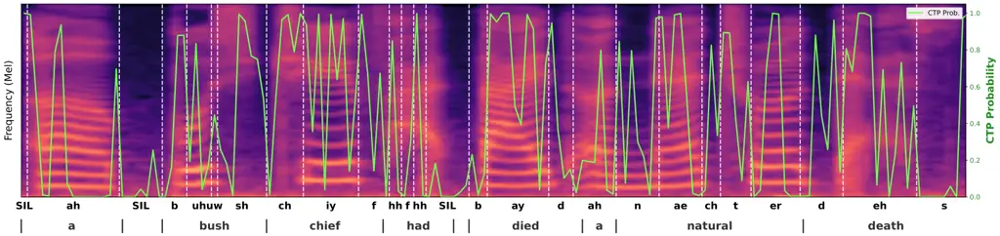

Bai Du Ko Wang Wang Li

# Controllable Accent Normalization via Discrete Diffusion

Qibing    Yuhan    Tom    Shuai     
Yannan    Haizhou

###### Abstract

Existing accent normalization methods do not typically offer control
over accent strength, yet many applications—such as language learning
and dubbing—require tunable accent retention. We propose DLM-AN, a
controllable accent normalization system built on masked discrete
diffusion over self-supervised speech tokens. A Common Token Predictor
identifies source tokens that likely encode native pronunciation; these
tokens are selectively reused to initialize the reverse diffusion
process. This provides a simple yet effective mechanism for controlling
accent strength: reusing more tokens preserves more of the original
accent. DLM-AN further incorporates a flow-matching Duration Ratio
Predictor that automatically adjusts the total duration to better match
the native rhythm. Experiments on multi-accent English data show that
DLM-AN achieves the lowest word error rate among all compared systems
while delivering competitive accent reduction and smooth, interpretable
accent strength control¹¹ 1 Samples:
https://P1ping.github.io/dlman-demo/.

###### keywords

accent conversion, diffusion language model, speech synthesis, voice
conversion, controllability

^(†)^(†)address: ¹ SDS, ² SAI, and ³ SRIBD, The Chinese University of
Hong Kong, Shenzhen, China  
⁴ School of Intelligence Science and Technology, Nanjing University,
Suzhou, China  
⁵ Tencent Ethereal Audio Lab, Tencent, Shenzhen, China  
⁶ Shenzhen Loop Area Institute, Shenzhen, China ^(†)^(†)email:
qibingbai@link.cuhk.edu.cn, shuaiwang@nju.edu.cn, haizhouli@cuhk.edu.cn

## 1 Introduction

Accent conversion (AC) seeks to alter speech from one accent to another
while preserving the speaker’s characteristics. A special case, accent
normalization (AN)²² 2 Also referred to as foreign accent conversion
(FAC)., converts non-native (L2) accented speech into a native (L1)
accented form. AN technology enables a wide range of applications,
including pronunciation training for language learners \[1\], authentic
dubbing in multimedia \[2\], and personalized text-to-speech
systems \[3\].

Early deep learning approaches for AN are reference-based \[4, 5, 6,
7\], relying on native accent speech samples to generate accent-neutral
representations via PPG features \[4, 5, 7\] or native TTS \[6\].
Reference-free methods \[8, 9, 10\] eliminate this requirement by
directly mapping between accented and native representations, though
they still rely on parallel data. Subsequent work removes the parallel
data constraint through ASR–TTS pipelines \[11\], accent feature
disentanglement \[12\], or TTS-guided representations \[13, 14\],
further augmented with flow matching \[15\] and normalizing flow \[16\].
However, these approaches depend on TTS-synthesized targets, whose
quality can be limited by voice cloning and duration modeling errors.

Recent token-based methods \[17, 18, 19, 20\] offer a promising
alternative. TokAN \[19\] quantizes speech into self-supervised discrete
tokens, performs autoregressive token-to-token conversion, and recovers
waveforms via a flow-matching synthesizer. CosyAccent \[21\] adopts a
non-autoregressive direct flow-matching approach and introduces a
“source-synthesis” data strategy. Both systems support total-duration
control. However, none of the above methods provides control over accent
strength—a desirable capability for gradual accent reduction or accent
preservation as part of speaker identity. The only attempt at accent
strength control \[22\] manipulates the starting timestep of a
continuous diffusion process, but it operates under a frame-to-frame
framework with fixed duration, lacking fine-grained rhythm adjustability
and duration control.

In this paper, we propose DLM-AN (Diffusion Language Model for Accent
Normalization), a controllable accent normalization system based on
masked discrete diffusion over self-supervised speech tokens. DLM-AN
extends the LLaDA diffusion language model \[23\] to speech: a
bidirectional Transformer iteratively predicts masked tokens conditioned
on content representations from a CTC-guided \[24\] token encoder. The
key insight enabling controllability is that, under a phonetically rich
tokenizer, native and accented renditions of the same utterance share
many tokens in similarly pronounced regions but differ in
accent-affected regions. We introduce a Common Token Predictor (CTP)
that identifies tokens likely shared with the native target. By reusing
high-confidence source tokens to initialize the masked sequence, users
can smoothly control accent strength—from full normalization (all tokens
generated from scratch) to near-resynthesis (all source tokens
preserved). A flow-matching Duration Ratio Predictor further provides
explicit control over the total output duration.

Our contributions are as follows:

- •
  We propose the first accent normalization system based on discrete
  diffusion, enabling iterative token generation conditioned on
  phonemically guided content representations.
- •
  We introduce a common token predictor that provides smooth,
  interpretable accent strength control through threshold-based source
  token reuse.
- •
  We demonstrate that DLM-AN achieves the best content preservation
  (lowest WER) among all compared systems, while offering competitive
  naturalness and accent reduction, along with robust duration scaling.

## 2 Related Work

### 2.1 Controllability in Accent Conversion

Most accent conversion/normalization systems perform a one-shot “full”
accent shift without a user-controllable knob \[5, 20\]. Recently,
controllability has attracted increasing attention, motivated by
applications such as gradual accent reduction in language learning and
adjustable accent retention in dubbing.

One line of work studies duration control (speech-rate control) during
accent normalization. TokAN \[19\] performs token-to-token conversion
with self-supervised discrete units and supports duration preservation.
CosyAccent \[21\] further enables explicit duration scaling via a
duration-ratio predictor and proposes a source-synthesis data strategy
to reduce reliance on TTS-synthesized supervision artifacts.

In contrast, controllable _accent strength_ (i.e., smoothly trading off
normalization vs. retaining the original L2 accent) remains less
explored. FAC-FACodec \[22\] introduces an intensity control mechanism
in a diffusion-based, factorized-codec framework by using the diffusion
starting timestep as a user knob. Related directions include
fine-grained controllable accent transfer models \[25\], controllable
accented TTS that renders accent intensity at coarse/fine levels \[26\],
and scalable accented TTS with automated accent label discovery \[27\].

Our work leverages masked discrete diffusion over speech tokens to
support both total-duration control and an interpretable accent-strength
knob via source-token reuse; the iterative masking/unmasking procedure
also naturally supports localized correction (speech infilling).

### 2.2 Self-Supervised Speech Tokens

Discrete tokens derived from self-supervised learning (SSL)
representations \[28, 29\] correlate strongly with phonetic
content \[30\], which makes them attractive units for speech generation
and conversion. Such tokens have been adopted in token-based voice
conversion \[31, 32, 33\] and high-fidelity speech generation/TTS
frameworks \[34\]. More broadly, discreteness allows importing
“text-like” modeling techniques into speech, including spoken language
modeling \[35\], direct speech-to-speech translation \[36\], and
speech-centric LLM systems \[37\].

Recent work also explores SSL tokens for ASR, including multilingual
ASR \[38\], contextual ASR \[39\], and accent-robust discrete-token ASR
modeling \[40\]. For accent conversion/normalization, discrete tokens
have been studied under different supervision regimes, including
zero-shot/minimally-supervised conversion \[18\], pseudo-parallel
mapping \[19, 17\], and prompt-based imitation \[20\]. We leverage
WavLM \[29\] to extract discrete tokens for conversion and synthesis,
capitalizing on its strong phonetic encoding and noise robustness.

### 2.3 Discrete Diffusion

Discrete diffusion adapts diffusion generative modeling to categorical
data such as tokens, and has recently been investigated for language
modeling. Two commonly used formulations are: (i) uniform/multinomial
diffusion, where tokens transition probabilistically across the
vocabulary \[41, 42\], and (ii) absorbing/masked diffusion, where tokens
are progressively mapped to a special absorbing state (e.g., \[MASK\])
and then iteratively recovered by a learned reverse process \[42, 43,
23\].

We focus on the absorbing formulation, which underlies recent diffusion
language models such as LLaDA \[23\]. Let
$`\mathbf{x}_{0}\in\{1,\dots,V\}^{n}`$ be a clean token sequence with
vocabulary size $`V`$ and length $`n`$, and let $`m`$ denote the
absorbing mask token. We parameterize the diffusion in continuous time
$`t\in[0,1]`$ with a differentiable non-increasing survival schedule
$`\alpha(t)`$, where $`\alpha(0)\approx 1`$ and $`\alpha(1)\approx 0`$.
The forward marginal independently corrupts each token as

```math
q(\mathbf{x}_{t}\mid\mathbf{x}_{0})=\prod_{i=1}^{n}\mathrm{Cat}\left(x_{t}^{i};\,\alpha(t)\mathbf{e}_{x_{0}^{i}}+(1-\alpha(t))\mathbf{e}_{m}\right), \tag{1}
```

i.e., each token is kept clean with probability $`\alpha(t)`$ or
absorbed into $`m`$ with probability $`1-\alpha(t)`$. Once masked, a
token remains masked in the forward process, and $`\mathbf{x}_{1}`$ is
almost fully masked.

The reverse process is commonly parameterized through an
$`x_{0}`$-prediction network, typically a bidirectional Transformer that
predicts clean-token distributions in parallel. For $`0\leq s<t\leq 1`$,
the SUBS parameterization \[43\] substitutes the predicted clean
sequence distribution into the analytic absorbing-diffusion posterior.
Let
$`\boldsymbol{\pi}_{\theta}^{i}(\mathbf{x}_{t},t)=p_{\theta}(x_{0}^{i}=\cdot\mid\mathbf{x}_{t})`$
denote the predicted clean-token distribution at position $`i`$. Define
$`\kappa_{s,t}=(\alpha(s)-\alpha(t))/(1-\alpha(t))`$ and
$`\bar{\kappa}_{s,t}=(1-\alpha(s))/(1-\alpha(t))`$. With
$`\boldsymbol{\mu}_{s,t}^{i}=\bar{\kappa}_{s,t}\mathbf{e}_{m}+\kappa_{s,t}\boldsymbol{\pi}_{\theta}^{i}(\mathbf{x}_{t},t)`$,
the reverse process is

```math
\displaystyle p_{\theta}(x_{s}^{i}\mid\mathbf{x}_{t}) \displaystyle=\left\{\begin{array}[]{@{}ll@{}}\mathrm{Cat}(x_{s}^{i};\mathbf{e}_{x_{t}^{i}}),&\!x_{t}^{i}\neq m,\\[2.84526pt]
\mathrm{Cat}(x_{s}^{i};\boldsymbol{\mu}_{s,t}^{i}),&\!x_{t}^{i}=m,\end{array}\right. \tag{2}
```

SUBS enforces two absorbing-process properties: zero probability of
predicting the mask token, and carry-over unmasking, where visible
tokens are copied unchanged during reverse diffusion. These
substitutions simplify the discrete-time D3PM \[42\] negative ELBO;
taking the continuous-time limit further yields the simplified MDLM
objective \[43\], in which only corrupted positions contribute to the
effective denoising loss. The continuous-time likelihood-bound objective
becomes a reweighted masked-token cross-entropy:

```math
\mathcal{L}(\theta)=\mathbb{E}_{t,\mathbf{x}_{0},\mathbf{x}_{t}}\left[\frac{-\alpha^{\prime}(t)}{1-\alpha(t)}\sum_{i:\,x_{t}^{i}=m}-\log p_{\theta}(x_{0}^{i}\mid\mathbf{x}_{t})\right], \tag{3}
```

where $`t\sim\mathcal{U}(0,1]`$,
$`\mathbf{x}_{t}\sim q(\cdot|\mathbf{x}_{0})`$, and the expectation is
approximated by Monte Carlo sampling. Although the MDLM objective is
often written as an all-token loss, visible tokens do not contribute to
the loss in the carry-over setting, yielding the masked-position form
above. The weight $`-\alpha^{\prime}(t)/(1-\alpha(t))`$ is the
instantaneous reverse unmasking rate; for the linear survival schedule
$`\alpha(t)=1-t`$, it reduces to $`1/t`$, matching the LLaDA-style
objective used in our methodology. In practice, $`t`$ is bounded away
from $`0`$ for numerical stability.

Compared with heuristic masked iterative generators \[44, 45, 46\],
masked diffusion specifies an explicit forward corruption process and
optimizes a likelihood-bound objective while retaining parallel
iterative denoising. Surveys highlight its growing role in LLMs \[47\].
Recent work further explores discrete-score formulations \[48\],
corrective/remasking models \[49, 50, 51, 52\] and efficient
samplers \[53\].

## 3 Methodology

Figure 1: Overview of the DLM-AN pipeline. The SSL tokenizer extracts
discrete tokens from L2-accented speech. A Transformer token encoder
with CTC-based phonemic guidance produces content representations, which
are fed into the Common Token Predictor (CTP), Duration Ratio Predictor
(DP), and the DLM decoder. The DLM decoder iteratively generates the
target token sequence, optionally initialized with high-CTP-confidence
source tokens. A flow-matching synthesizer and vocoder produce the final
waveform.

We propose to use a diffusion language model (DLM) for controllable
accent normalization. The method is shortened “DLM-AN”. Figure 1 shows
the pipeline of DLM-AN. The SSL tokenizer extracts SSL representations
from the L2-accented waveform and quantize the features into discrete
tokens. A Transformer token encoder takes further processs these tokens,
producing continuous content representations. To make the content
representations phonemic enough, a CTC-based phonemic guidance is
imposed upon them, shown as the auxiliary text in Figure 1. The content
representations are further taken as the input for three modules: Common
Token Predictor (CTP), Duration Ratio Predictor (DP), and the DLM
decoder.

Note that the content features are concatenated with the source tokens
(embeddings) when feeding to CTP and DP, in order to provide detailed
pronunciation patterns (i.e., phonetic information). This concatenation
is not displayed in Figure 1 for brevity.

CTP predicts whether each token is common in both the source and target
sequences. The higher the score for a token, the more probable this
token is associated with a native pronunciation, as will be demonstrated
in the subsequent sections. Tokens with high CTP scores could be
optionally “reused” for the decoding/generation process later. DP
predicts the ratio of the total duration:
$`\text{dur}_{\text{tgt}}/\text{dur}_{\text{src}}`$. This ratio can be
optionally used to determine the total duration/length of the target
sequence.

Given the target duration ratio, either predicted, arbitrarily
specified, or kept 1.0 to maintain the source duration, the length of
the initial target sequence is determined. By default, the initial
target sequence is purely filled with \[MASK\] for generation from
scratch. Optionally, based on the CTP scores and a given threshold or
proportion, certain soruce tokens can be reused to initialize the target
sequence. After the initial target sequence is determined, the DLM
decoder iteratively generates the entire target sequence, conditioned on
the content features from the token encoder.

The more tokens reused in the target sequence, the more source accent is
expected to be preserved. The speech synthesizer further generates the
corresponding Mel-spectrogram given the target tokens, conditioned on
the speaker embedding extracted from the input source speech. The
Mel-spectrogram can be converted to a waveform using the HiFT
vocoder \[54\].

### 3.1 Discrete Diffusion for Speech Tokens

We extend the LLaDA masked diffusion language model \[23\] to discrete
speech tokens for controllable accent normalization. Our forward
corruption process uses pure absorbing masking, parameterized by a
timestep $`t\sim\mathcal{U}[0,1]`$ per sequence.

Let $`\mathbf{y}_{0}\in\{1,\dots,V\}^{L}`$ be a clean speech token
sequence, where $`V`$ is the speech vocabulary size and $`L`$ is the
sequence length. Following the notation in Section 2.3, we deploy
$`\alpha(t)=1-t`$ and denote the masking probability as
$`\lambda(t)=1-\alpha(t)`$. We use the numerically stable linear form
$`\lambda(t)=(1-\epsilon)t+\epsilon`$, with $`\epsilon>0`$. Each
position $`i`$ is masked independently:

```math
\displaystyle q_{\lambda}(z_{i}\mid y_{0}^{i}) \displaystyle=\lambda(t)\,\delta_{z_{i}=\texttt{[MASK]}}+(1-\lambda(t))\,\delta_{z_{i}=y_{0}^{i}} \tag{4}
```

which induces a masked index set $`M`$ and a visible set
$`\bar{M}=[L]\setminus M`$. The corrupted sequence $`\mathbf{z}`$ has
corruption set $`\mathcal{C}=M`$. The model
$`p_{\theta}(\mathbf{y}_{0}\mid\mathbf{z},\mathbf{c})`$ is a
bidirectional Transformer that predicts the original tokens from
$`\mathbf{z}`$, conditioned on the content representations
$`\mathbf{c}`$ from the token encoder. The training objective follows
the LLaDA-style masked-position loss:

```math
\displaystyle\mathcal{L}_{\text{DLM}}(\theta) \displaystyle=-\mathbb{E}_{t,\mathbf{y}_{0},\mathbf{z}}\left[\frac{1}{\lambda(t)}\sum_{i\in M}\log p_{\theta}(y_{0}^{i}\mid\mathbf{z},\mathbf{c})\right], \tag{5}
```

where $`\mathbf{z}\sim q_{\lambda(t)}(\cdot\mid\mathbf{y}_{0})`$. The
expectation is approximated by Monte Carlo sampling with global
per-token normalization for stability. This objective is the
masking-rate form of the likelihood-bound objective in Eq. (3); the
small $`\epsilon`$ only bounds the weighting near $`t=0`$.

The DLM decoder has a decoder-only Transformer structure without causal
masking, allowing parallel prediction over masked positions. The content
representations $`\mathbf{c}`$ are integrated as conditional inputs via
self-attention to guide accent-normalized generation while preserving
content.

During inference, we employ a greedy sampling algorithm with optional
initialization: start from a fully or partially masked sequence (reusing
high-CTP-confidence tokens), and iteratively predict and unmask
positions based on confidence scores, conditioned on $`\mathbf{c}`$. For
enhanced quality, we use classifier-free guidance (CFG) \[55, 23\],
combining the conditional and unconditional predictions at the logit
level. Let $`\boldsymbol{\ell}_{\text{cond}}`$ and
$`\boldsymbol{\ell}_{\text{uncond}}`$ be the logits corresponding to
$`p_{\theta}(\mathbf{y}_{0}\mid\mathbf{z},\mathbf{c})`$ and
$`p_{\theta}(\mathbf{y}_{0}\mid\mathbf{z},\varnothing)`$, respectively.
The guided distribution is then obtained as
$`p_{\mathrm{cfg}}(\cdot)=\operatorname{softmax}\left((1+w_{\text{DLM}})\boldsymbol{\ell}_{\text{cond}}-w_{\text{DLM}}\boldsymbol{\ell}_{\text{uncond}}\right)`$,
where $`w_{\text{DLM}}`$ controls the guidance strength.

Figure 2: Structure of the DLM decoder. The input consists of the
content features and the noised target tokens, separated by special
tokens \[START\], \[TASK\], and \[END\]. The content features are
mutually attentive but do not attend to the token sequence (pink
region), while the token sequence attends to the entire input (green
region).

The structure of DLM decoder is shown in Figure 2. It features a
self-attention-only structure (i.e., using self-attention to fuse the
conditional information). The input is basically two sequences: the
content features and the noised target tokens. Three special tokens,
\[START\], \[TASK\], and \[END\], are added to wrap and separate the two
sequences, guiding the DLM behavior.

To make the condition reusable across time steps (i.e., token sequences
with different numbers of masked tokens), the content features are
mutually attentive but with no attention to the token sequence. In
contrast, the token sequence can attend to the entire input sequence.
The attention regions of the two parts are depicted in Figure 2 with the
colors pink and green, respectively.

### 3.2 Common Token Prediction

With a sufficiently phonetic tokenizer, utterances spoken with different
accents tend to share many tokens in similarly pronounced regions, while
differing mainly in accent-affected regions. Motivated by this property,
we introduce a Common Token Predictor (CTP) that assigns each source
token a confidence score indicating how likely it is to be shared with
the (native) target. Tokens with high CTP confidence can be reused to
initialize the target sequence, providing a simple and interpretable
control of accent strength: reusing more tokens preserves more of the
source accent.

Figure 3: Extraction of common token labels via the longest common
subsequence (LCS) between source and target token sequences. For
consecutive identical tokens with differing durations, center-mode
alignment is applied (dashed rectangle).

We formulate CTP as a sequence-tagging problem. Given paired source and
target token sequences, we derive binary labels by computing the longest
common subsequence (LCS) between them. LCS has been used previously to
evaluate accent conversion models \[18\]; here we use it to identify
which source tokens are shared with the target. The label extraction
procedure is illustrated in Figure 3. We obtain the LCS via dynamic
programming and backtracking. For consecutive identical tokens that have
different durations in the source and target, we apply a center
alignment: only the centered tokens are marked positive (dashed
rectangle in Figure 3).

The training objective for CTP is binary cross-entropy loss. Let $`S`$
be the source sequence length, and let $`\mathbf{o}\in\{0,1\}^{S}`$ be
the binary labels derived from the LCS searching. Given the source
content features, the CTP module (parameterized by $`\phi`$) outputs
predicted probabilities $`\hat{\mathbf{o}}\in[0,1]^{S}`$. The loss is:

```math
\displaystyle\mathcal{L}_{\text{CTP}}(\phi) \displaystyle=-\frac{1}{S}\sum_{i=1}^{S}\left[o_{i}\log\hat{o}_{i}+(1-o_{i})\log(1-\hat{o}_{i})\right]. \tag{6}
```

### 3.3 Duration Ratio Prediction

Because L2-accented speech often exhibits different rhythm and speaking
rate, directly inheriting the source total duration can lead to
sub-optimal naturalness. DLM-AN therefore includes a duration ratio
predictor (DP) that estimates the global duration ratio
$`r=\text{dur}_{\text{tgt}}/\text{dur}_{\text{src}}`$. DP uses a
diffusion Transformer (DiT) \[56\] backbone with an attentive pooling
layer, and is trained with conditional flow matching.

The training objective for DP is conditional flow matching loss \[57\].
Let $`r>0`$ be the target duration ratio (ground truth
$`\text{dur}_{\text{tgt}}/\text{dur}_{\text{src}}`$), and let
$`\mathbf{c}`$ be the input content representations from the token
encoder. The flow matching model $`v_{\psi}(u_{t},t,\mathbf{c})`$
(parameterized by $`\psi`$) predicts the velocity field:

```math
\displaystyle u_{t} \displaystyle=(1-t)\,u_{0}+t\,r, \tag{7}
```

where $`t\sim\mathcal{U}[0,1]`$ and $`u_{0}\sim\mathcal{N}(0,1)`$ is a
standard normal prior. The loss is:

```math
\displaystyle\mathcal{L}_{\text{DP}}(\psi) \displaystyle=\mathbb{E}_{t,\,u_{0}}[\|v_{\psi}(u_{t},t,\mathbf{c})-(r-u_{0})\|^{2}] \tag{8}
```

This objective trains the model to generate duration ratios conditioned
on $`\mathbf{c}`$, enabling global rhythm adjustment. In practice, we
also condition DP on the source token embeddings to capture fine-grained
pronunciation details; we omit this from the formulation for brevity.



Figure 4: Visualization of common token prediction for a
Chinese-accented sample. CTP confidence values are overlaid on the
Mel-spectrogram. PPG-predicted phonemes are shown below and their
boundaries (white dashed lines) are overlaid on the spectrogram. Aligned
words are shown at the bottom. Regions with prominent L2 accent (e.g.,
prolonged “a”, unclear “had”, /S/-like ending of “death”) receive low
CTP confidence.

### 3.4 Phoneme Guidance and Joint Training

The token encoder is a Transformer with relative positional embeddings,
producing content representations $`\mathbf{c}`$. The CTP and DP modules
also use Transformer backbones with relative positional embeddings. The
DLM decoder is a self-attention-only Transformer with two-block masking,
using rotary positional encoding (RoPE) \[58\] for the entire sequence.

To encourage $`\mathbf{c}`$ to be phonemically informative, we impose a
CTC-based phonemic guidance on the token encoder outputs. Concretely, we
attach a linear projection head on top of the token encoder to predict
phoneme logits, and compute a CTC loss against phoneme label sequences
derived from the corresponding transcripts. Given phoneme sequence
$`\mathbf{p}`$, the loss is

```math
\displaystyle\mathcal{L}_{\text{CTC}} \displaystyle=\mathrm{CTC}(\text{Linear}(\mathbf{c}),\,\mathbf{p}) \tag{9}
```

We train the token-prediction modules jointly, including the token
encoder, CTP, DP, and DLM decoder, following a two-stage schedule of
pretraining and fine-tuning as described in the experimental setup. Let
$`\mathcal{L}_{\text{DLM}}`$ denote the masked discrete diffusion loss
for token generation (Eq. (5)). The overall joint-training objective is:

```math
\displaystyle\mathcal{L}_{\text{token}}=\mathcal{L}_{\text{DLM}}+\beta_{1}\mathcal{L}_{\text{DP}}+\beta_{2}\mathcal{L}_{\text{CTP}}+\beta_{3}\mathcal{L}_{\text{CTC}} \tag{10}
```

The token-prediction modules are pre-trained on native-only data and
fine-tuned on semi-synthesized parallel data.

### 3.5 Sampling Algorithm for Token Conversion

After processing the source L2-accented tokens with the token encoder,
CTP, and DP, we can then initialize the target token sequence and use
the DLM decoder to complete it (i.e., “Target Init.” and “DLM Decoder”
in Figure 1). By default, we use the greedy sampler with a
threshold-based strategy for reusing source tokens, as demonstrated in
Sec. 5.1.2 and Algorithm 1.

1: Source tokens $`\mathbf{y}^{\text{src}}`$ (length $`N_{\text{src}}`$)
and duration ratio $`r`$

2: CTP scores $`\{\hat{o}_{i}\}_{i=1}^{N_{\text{src}}}`$, reuse
threshold $`\tau`$, sampling steps $`T`$

3: Content representations $`\mathbf{c}`$ and CFG strength
$`w_{\text{DLM}}`$

4: Target tokens $`\mathbf{y}^{\text{tgt}}`$

5: $`N_{\text{tgt}}\leftarrow\mathrm{round}(N_{\text{src}}\cdot r)`$

6: $`K\leftarrow\lceil N_{\text{tgt}}/T\rceil`$ $`\triangleright`$
tokens to unmask per step

7: $`\mathcal{I}\leftarrow\{i\mid\hat{o}_{i}>\tau\}`$ $`\triangleright`$
reused source-token indices

8: Initialize $`\mathbf{z}^{(0)}`$ by nearest interpolation from source
to target length:
$`\mathbf{z}^{(0)}\in\{1,\dots,V,\texttt{[MASK]}\}^{N_{\text{tgt}}}`$

9: for $`j=1`$ to $`N_{\text{tgt}}`$ do

10:
  $`i^{\star}\leftarrow\mathrm{round}\left((j-\tfrac{1}{2})\tfrac{N_{\text{src}}}{N_{\text{tgt}}}+\tfrac{1}{2}\right)`$
$`\triangleright`$ source index

11:   if $`i^{\star}\in\mathcal{I}`$ then

12:    $`z^{(0)}_{j}\leftarrow y^{\text{src}}_{i^{\star}}`$

13:   else

14:    $`z^{(0)}_{j}\leftarrow\texttt{[MASK]}`$

15:   end if

16: end for

17: $`N_{\text{mask}}\leftarrow|\{j\mid z^{(0)}_{j}=\texttt{[MASK]}\}|`$

18:
$`T_{\text{eff}}\leftarrow\left\lceil N_{\text{mask}}/K\right\rceil`$,
$`s_{0}\leftarrow\max(1,\,T-T_{\text{eff}}+1)`$ $`\triangleright`$ start
step from reuse proportion

19: for $`s=s_{0}`$ to $`T`$ do

20:   Compute logits at masked positions:

21:
 $`\boldsymbol{\ell}_{\text{cond}}(\cdot\mid\mathbf{z}^{(s-1)},\mathbf{c})`$
and $`\boldsymbol{\ell}_{\text{uncond}}(\cdot\mid\mathbf{z}^{(s-1)})`$

22:   Apply CFG:
$`\boldsymbol{\ell}_{\text{cfg}}\leftarrow(1+w_{\text{DLM}})\,\boldsymbol{\ell}_{\text{cond}}-w_{\text{DLM}}\,\boldsymbol{\ell}_{\text{uncond}}`$

23:   For each masked position $`j`$, set
$`\hat{y}_{j}\leftarrow\arg\max\boldsymbol{\ell}_{\text{cfg}}(j)`$ and
confidence
$`\gamma_{j}\leftarrow\max\,\mathrm{softmax}(\boldsymbol{\ell}_{\text{cfg}}(j))`$

24:   Select $`\mathcal{J}`$ as the top-$`\min(K,\,|\text{masked}|)`$
masked positions by $`\gamma_{j}`$

25:   Unmask: set $`z^{(s)}_{j}\leftarrow\hat{y}_{j}`$ for
$`j\in\mathcal{J}`$; keep all other positions unchanged

26: end for

27: return $`\mathbf{y}^{\text{tgt}}\leftarrow\mathbf{z}^{(T)}`$

Algorithm 1 Greedy sampling with CTP-based initialization.

### 3.6 Token-to-Speech Synthesis

We use a flow-matching speech synthesizer with a vocoder \[54\] to
generate waveforms. The input token sequence is encoded by a
relative-positional Transformer encoder, and the encoded features are
concatenated with a speaker embedding before being fed into a DiT
decoder. The speech synthesizer is trained separately on native-only
speech data. Similar to CosyAccent, DLM-AN deploys a two-way CFG
strategy for generation:

```math
\displaystyle\bar{v}_{\eta}(\mathbf{x}_{t},t,\mathbf{y},\mathbf{s}) \displaystyle=\ v_{\eta}(\mathbf{x}_{t},t,\mathbf{y},\mathbf{s})
```

```math
\displaystyle+w_{1}(v_{\eta}(\mathbf{x}_{t},t,\mathbf{y},\mathbf{s})-v_{\eta}(\mathbf{x}_{t},t,\varnothing,\mathbf{s}))
```

```math
\displaystyle+w_{2}(v_{\eta}(\mathbf{x}_{t},t,\mathbf{y},\mathbf{s})-v_{\eta}(\mathbf{x}_{t},t,\mathbf{y},\varnothing)) \tag{11}
```

where $`v_{\eta}`$ is the synthesizer, $`t\in[0,1]`$ is the time
variable, $`\mathbf{x}_{t}`$ is the Mel-spectrogram at time $`t`$,
$`\mathbf{y}`$ is the input tokens, and $`\mathbf{s}`$ is the speaker
embedding. The two CFG factors $`w_{1}`$ and $`w_{2}`$ control the
emphasis on the content and timbre conditions, respectively.

## 4 Experimental Setup

### 4.1 Datasets

The experiments are conducted on English. Training uses the English
subset of Emilia \[59\] (Emilia-EN) and the LibriTTS-R corpus \[60\]
with synthesized L2-accented counterparts³³ 3
https://huggingface.co/datasets/Piping/L2-LibriTTSR/ \[21\]. We also use
the L2-ARCTIC corpus \[61\] together with four American speakers from
ARCTIC \[62\]. We further synthesize pseudo native targets for this
extended L2-ARCTIC set, which are used for supervised fine-tuning and
evaluation. The pseudo native targets are generated using a native-only
zero-shot Matcha-TTS \[63\] model trained on LibriTTS-R.

Emilia-EN is solely used for pretraining. LibriTTS-R is used to train
the SSL tokenizer and the flow-matching speech synthesizer. For
fine-tuning, both augmented LibriTTS-R (with synthesized source
utterances) and extended L2-ARCTIC (with synthesized targets) are
utilized.

Since the L2-accented counterparts \[21\] of LibriTTS-R were synthesized
using prompts drawn from L2-ARCTIC, we adopt the same train-valid-test
partition of L2-ARCTIC to prevent text leakage.

### 4.2 Tokenizer

The proposed method relies on the phonetic richness of the speech
tokens. We use WavLM$`{}_{\text{large}}`$ and extract layer-22
representations for tokenization. We train an online K-Means model with
1024 clusters (codebook size 1024) on LibriTTS-R.

Figure 5: CTP-based vs. random token selection at varying reuse
proportions. Three metrics are compared: (a) WER, (b) $`\Delta`$PPG with
the L1-accented target, and (c) $`\Delta`$PPG with the L2-accented
source. CTP-based selection achieves generally lower WER and
consistently better accent separation than random selection at the same
proportion.

### 4.3 Compared Systems

We evaluate our model against two strong baselines:

- •
  TokAN \[19\]: An autoregressive model operating on deduplicated
  tokens. It recovers token-wise durations in the speech synthesis
  stage. This model features a flow matching duration predictor with two
  conditions: 1) the token sequence and 2) the average token duration.
  When provided with the average token duration, TokAN is able to
  preserve the total duration. We test two modes: TokAN-1, which
  predicts token durations directly, and TokAN-2, which predicts with
  total-duration awareness and preserves the total duration.
- •
  CosyAccent \[21\]: A non-autoregressive direct flow-matching model. It
  features a total-duration ratio predictor similar to our proposed
  model. It can be regarded as a continuous-diffusion counterpart of the
  proposed model, but without accent-strength control. We test two
  modes: CosyAccent-1, which predicts the total duration ratio, and
  CosyAccent-2, which inherits the source total duration.

For the token-reuse setting of DLM-AN, we deploy a threshold-based
selection strategy: tokens with CTP confidence higher than a threshold
($`\tau`$) are reused. For simplicity, we do not apply token reuse and
duration scaling simultaneously. We evaluate four configurations of
DLM-AN:

- •
  DLM-AN-1: Uses the predicted total duration ratio.
- •
  DLM-AN-2 ($`\tau=1.0`$): Inherits the source total duration while
  predicting the target sequence from scratch.
- •
  DLM-AN-2 ($`\tau=0.3`$): Inherits the source total duration, with a
  threshold for common token prediction (i.e., $`\tau=0.3`$).
- •
  DLM-AN-2 ($`\tau=0.0`$): Inherits all the source tokens (i.e., direct
  resynthesis).

For TokAN and DLM-AN, the two token-based systems, we pretrain them on
Emilia-EN. BART-style \[64, 18\] token corruption is applied to the
source token sequence. This helps avoid teaching the model to trivially
copy the source sequence. Different from the original TokAN, no source
accent embedding is utilized. Given the corrupted source sequence, TokAN
performs autoregressive generation while DLM-AN performs masked
generation. TokAN and DLM-AN share a similar architecture: a speech
token encoder with CTC-based phonemic guidance, a self-attention-only
decoder, and a flow-matching speech synthesizer. TokAN predicts
token-wise durations in the synthesizer module, whereas DLM-AN predicts
the total duration ratio during token-level conversion. For DLM-AN, we
set the loss weights in Eq. (10) as $`\beta_{1}{=}1.0`$,
$`\beta_{2}{=}1.0`$, and $`\beta_{3}{=}0.2`$ for joint training of the
token-prediction modules. For CTP training, we use a positive weight of
2 for better label balance.

For TokAN generation, we use beam search with a beam size of 10. For
DLM-AN, we use the greedy sampler with 32 steps; the CFG guidance
strength $`w_{\text{DLM}}`$ is set to 1.0. For the speech synthesizers
in TokAN and DLM-AN, we use the Euler sampler with 32 steps. The CFG
strengths $`w_{1}`$ and $`w_{2}`$ are set to 1.0 and 1.0, respectively.

For CosyAccent, we use the official Whisper$`{}_{\text{medium}}`$
model \[65\] as the frozen speech frontend. CosyAccent is also
pre-trained on Emilia-EN, with the encoder supervised only by the CTC
loss. During inference, we use the same CFG weights and number of
sampling steps as in the original paper.

Resemblyzer⁴⁴ 4 https://github.com/resemble-ai/Resemblyzer is deployed
to extract speaker embeddings for the speech synthesizer modules in all
the compared models. The final waveform is generated using the HiFTNet
vocoder \[54\] from CosyVoice2 \[66\].

### 4.4 Evaluation Data & Metrics

Evaluation Set. Our test set involves the extended L2-ARCTIC dataset, as
described in Sec. 4.1. The test set covers seven accents: Arabic,
Chinese, Hindi, Korean, Spanish, Vietnamese, and native American
English. The set contains 80 sentences. The partitioning is consistent
with the source-synthesis training data \[21\], with no text leakage in
the training data.

Subjective Evaluation. We conducted listening tests with 25 raters to
assess three qualities: Naturalness (NAT) and Accentedness (ACT) were
measured via MUSHRA tests. The native accent was excluded from the ACT
evaluation. Speaker Similarity (SIM) was measured via Best-Worst Scaling
(BWS), with scores aggregated using a standard counting
algorithm \[67\]:
$`(N_{\textit{best}}-N_{\textit{worst}})/N_{\textit{occurrence}}`$.

Objective Evaluation. We use four objective metrics to assess conversion
quality automatically. Intelligibility: Word Error Rate (WER) from a
native-only ASR model⁵⁵ 5
https://huggingface.co/facebook/s2t-medium-librispeech-asr to simulate
listener perception. Naturalness: The UTMOSv2 score⁶⁶ 6
https://github.com/sarulab-speech/UTMOSv2 from a neural naturalness
predictor. Timbre Preservation: Speaker Encoding Cosine Similarity
(SECS) using the accent-robust Resemblyzer. Accentedness Reduction: The
phonetic posteriorgram distance ($`\Delta`$PPG)⁷⁷ 7
https://github.com/interactiveaudiolab/ppgs \[68\]. By default,
$`\Delta`$PPG is computed between generated utterances and the
synthesized native targets, but some analyses also compute it against
the source to measure how much accent is removed.

|                         |                |                    |                      |                    |                        |                      |                     |                                       |
| ----------------------- | -------------- | ------------------ | -------------------- | ------------------ | ---------------------- | -------------------- | ------------------- | ------------------------------------- |
| System                  | Source-length  | Subjective         |                      |                    | Objective              |                      |                     |                                       |
|                         |                | NAT ($`\uparrow`$) | ACT ($`\downarrow`$) | SIM ($`\uparrow`$) | WER (% $`\downarrow`$) | UTMOS ($`\uparrow`$) | SECS ($`\uparrow`$) | $`\Delta\text{PPG}`$ ($`\downarrow`$) |
| Source                  | $`\checkmark`$ | 58.36$`\pm`$2.84   | 48.46$`\pm`$2.61     | -                  | 15.86                  | 2.80$`\pm`$0.41      | -                   | 0.5097                                |
| TokAN-1 \[19\]          | $`\times`$     | 63.85$`\pm`$2.49   | 23.58$`\pm`$1.85     | -0.082             | 13.82                  | 3.07$`\pm`$0.36      | 0.8495              | 0.2884                                |
| TokAN-2 \[19\]          | $`\checkmark`$ | 59.20$`\pm`$2.60   | 28.01$`\pm`$2.21     | -0.051             | 14.00                  | 2.97$`\pm`$0.38      | 0.8530              | 0.2980                                |
| CosyAccent-1 \[21\]     | $`\times`$     | 61.12$`\pm`$2.42   | 25.75$`\pm`$1.89     | -0.071             | 12.40                  | 2.99$`\pm`$0.34      | 0.8294              | 0.2736                                |
| CosyAccent-2 \[21\]     | $`\checkmark`$ | 56.35$`\pm`$2.61   | 29.51$`\pm`$2.12     | -0.051             | 13.84                  | 2.89$`\pm`$0.36      | 0.8358              | 0.3029                                |
| DLM-AN-1                | $`\times`$     | 62.20$`\pm`$2.46   | 22.94$`\pm`$1.85     | -0.133             | 11.19                  | 3.05$`\pm`$0.34      | 0.8385              | 0.2811                                |
| DLM-AN-2 ($`\tau`$=1.0) | $`\checkmark`$ | 59.50$`\pm`$2.61   | 27.90$`\pm`$2.16     | -0.020             | 10.64                  | 2.93$`\pm`$0.37      | 0.8521              | 0.2773                                |
| DLM-AN-2 ($`\tau`$=0.3) | $`\checkmark`$ | 57.35$`\pm`$2.59   | 31.34$`\pm`$2.34     | -0.098             | 12.52                  | 2.90$`\pm`$0.39      | 0.8590              | 0.3580                                |
| DLM-AN-2 ($`\tau`$=0.0) | $`\checkmark`$ | 56.41$`\pm`$2.70   | 38.37$`\pm`$2.57     | -0.208             | 14.94                  | 2.86$`\pm`$0.39      | 0.8646              | 0.4479                                |

Table 1: Evaluation results of accent normalization systems.
Source-length indicates whether the source total duration is preserved.
$`\tau`$ denotes the CTP threshold for token reuse ($`\tau{=}1.0`$:
generation from scratch; $`\tau{=}0.0`$: full token reuse /
resynthesis). Best and second-best objective results are in bold and
underlined.

## 5 Results

### 5.1 Effectiveness of Common Token Prediction

For effective common token prediction, higher confidence should be
assigned to native-accented regions, whereas low confidence scores
should be assigned to highly-L2-accented regions. Figure 4 is a
visualization of common token prediction for a Chinese-accented sample.
The common token confidence values are displayed over the spectrogram.
Phonemes predicted by ppgs \[68\] are displayed below the spectrogram,
with their boundaries being the white dashed lines on the
Mel-spectrogram. Aligned words, obtained via MFA \[69\], are displayed
at the bottom. Accent can be determined from the comparison between the
words and phonemes. Some prominent L2-accented patterns can be found: 1)
the initial word “a” is heavily lengthened; correspondingly, the CTP
confidence becomes low in the prolonged part. 2) The PPG-predicted
phonemes for the word “had” is messy, corresponding with general low
confidence scores. 3) The ending phoneme of “death” is detected as
highly similar to /S/, receiving low confidence scores.

#### 5.1.1 Proportion-based Reuse

To progressively preserve or remove the source accent, we can directly
control the proportion of reused source tokens based on the CTP
confidence scores. However, random reuse may also yield a coarse
accent-retention effect. To verify the benefit of CTP-based reuse, we
vary the reuse proportion under two strategies—CTP-based selection and
random selection. Figure 5 reports three metrics: 1) WER, 2)
$`\Delta`$PPG to the L1-accented target, and 3) $`\Delta`$PPG to the
L2-accented source. Ideally, WER should increase as the reuse proportion
increases. In contrast, $`\Delta`$PPG to the target should decrease
(more native-like), while $`\Delta`$PPG to the source should increase
(less similar to the accented input).

Both strategies follow these general trends, but their outcomes differ.
CTP-based selection generally yields lower WER than random selection at
the same reuse proportion. Moreover, it consistently achieves higher
$`\Delta`$PPG to the source and lower $`\Delta`$PPG to the target,
indicating better accent removal while remaining closer to the native
reference. This suggests that CTP indeed prioritizes more
native-accented regions for reuse, whereas random selection more
frequently preserves highly accented tokens. Overall, CTP-based token
reuse provides a more reliable control knob for progressive accent
normalization.

#### 5.1.2 Threshold-based Reuse

Input utterances exhibit different strengths of L2 accent. Therefore,
enforcing the same reuse proportion for all sources can be suboptimal.
We instead adopt threshold-based reuse, where tokens are reused if their
CTP confidence exceeds a threshold $`\tau`$ (Algorithm 1). This makes
the effective reuse proportion adaptive to the input accent strength.

Figure 6: $`\Delta`$PPG with the L2-accented source and L1-accented
target at varying CTP thresholds $`\tau`$. Lower $`\tau`$ retains more
source tokens. As $`\tau`$ increases, $`\Delta`$PPG with the source
increases (more accent removed) while $`\Delta`$PPG with the target
decreases (closer to native).

Figure 6 shows $`\Delta`$PPG to the source and to the L1-accented target
under different thresholds. When $`\tau{=}0.0`$, all tokens are reused;
as $`\tau`$ increases, fewer tokens are kept; and when $`\tau{=}1.0`$,
generation from scratch is performed. As expected, $`\Delta`$PPG to the
source increases monotonically with $`\tau`$, while $`\Delta`$PPG to the
target decreases, confirming that $`\tau`$ provides an interpretable and
effective knob for accent reduction.

### 5.2 Comparison with Baselines

#### 5.2.1 Duration-free Conversion

The main results are shown in Table 1. We first compare the systems
under the free duration setting (“-1” variants), where the model
predicts its own target duration. DLM-AN-1 achieves the lowest ACT score
(22.94) among all systems, indicating the strongest accent reduction,
while attaining the second-highest NAT score (62.20), close to TokAN-1
(63.85) and above CosyAccent-1 (61.12). In terms of objective content
preservation, DLM-AN-1 obtains a WER of 11.19%, notably lower than
TokAN-1 (13.82%) and CosyAccent-1 (12.40%). The UTMOS score (3.05) is
also competitive with TokAN-1 (3.07), both outperforming CosyAccent-1
(2.99). These results suggest that DLM-AN achieves the best overall
balance of accent reduction and content preservation under free
duration.

#### 5.2.2 Source-duration-preserved Conversion

Under the source-duration-preserved setting (“-2” variants), DLM-AN-2
($`\tau{=}1.0`$) again achieves the best WER (10.64%) and a competitive
$`\Delta`$PPG (0.2773) among all systems. As expected, preserving the
source duration generally leads to higher ACT scores and lower NAT
scores compared with free-duration counterparts across all models, as
the L2-accented rhythm is retained. Notably, DLM-AN-2 ($`\tau{=}1.0`$)
attains a similar $`\Delta`$PPG with DLM-AN-1 (0.2773 vs. 0.2811) yet a
higher ACT (27.90 vs. 22.94). This suggests that $`\Delta`$PPG primarily
captures segmental (more phonetic) similarity, whereas human raters
perceive accentedness more holistically—rhythm and prosody, which are
largely determined by duration, play a substantial role in subjective
accent judgments.

#### 5.2.3 Controllable Accent Normalization

The effect of the CTP-based token reuse is clearly visible across the
DLM-AN-2 variants. As the threshold $`\tau`$ decreases from 1.0 to 0.0,
more source tokens are preserved, leading to a progressive increase in
ACT (27.90 $`\to`$ 31.34 $`\to`$ 38.37), reflecting stronger retention
of the source accent. Correspondingly, the SIM score rises monotonically
($`-0.020\to 0.098\to 0.208`$), confirming that preserving more source
tokens improves perceived speaker similarity. The SECS scores follow the
same trend (0.8521 $`\to`$ 0.8590 $`\to`$ 0.8646), with the full-reuse
variant achieving the highest timbre preservation. This correlation
between the source accent and speaker identity aligns with the finding
in \[22\].

Meanwhile, WER degrades mildly (10.64 $`\to`$ 12.52 $`\to`$ 14.94) and
$`\Delta`$PPG increases (0.2773 $`\to`$ 0.3580 $`\to`$ 0.4479), as
reusing accented tokens inevitably retains some non-native pronunciation
patterns. At $`\tau{=}0.0`$ (complete resynthesis), the output closely
mirrors the source accent, as indicated by the ACT score (38.37)
approaching the source (48.46), demonstrating smooth and interpretable
accent strength control.

### 5.3 Arbitrary Duration Scaling

All three systems support total-duration specification, but via
different mechanisms: TokAN predicts token-wise durations after accent
normalization, CosyAccent directly generates a target-length
spectrogram, and DLM-AN generates a target-length token sequence. To
compare robustness under different target lengths, we vary the
total-duration ratio and compare WER across systems.

Figure 7: WER (%) at varying duration scaling ratios for TokAN,
CosyAccent, and DLM-AN. DLM-AN achieves the lowest WER across most
ratios, with a notable advantage under compression (ratio $`<1.0`$).

Figure 7 shows the results. DLM-AN achieves the lowest WER (i.e., best
content preservation) when the source duration is preserved, and its
advantage is more pronounced when the specified ratio is smaller than
\SI1.0. When the target duration is set to half of the source, TokAN
degrades substantially because the generated token sequence (after
deduplication) is often longer than the desired duration, forcing tokens
to be discarded in the synthesis stage. DLM-AN maintains an advantage
until the ratio reaches \SI1.5, likely because such extreme stretching
is rare in the training data.

### 5.4 Ablation Study

The ablation results are shown in Table 2, which is based on DLM-AN-2
that generates target tokens from scratch. We ablate two factors: 1) CFG
in token generation, 2) pretraining on Emilia-EN. The results show the
effectiveness of these training/inference components in the proposed
DLM-AN.

| System          | WER ($`\%\downarrow`$) | SECS ($`\uparrow`$) | $`\Delta\text{PPG}`$ ($`\downarrow`$) |
| --------------- | ---------------------- | ------------------- | ------------------------------------- |
| Source          | 15.86                  | \-                  | 0.5097                                |
| DLM-AN          | 10.64                  | 0.8521              | 0.2773                                |
| w/o CFG         | 11.23                  | 0.8488              | 0.2907                                |
| w/o pretraining | 16.61                  | 0.8513              | 0.3306                                |

Table 2: Ablation results of DLM-AN-2 ($`\tau`$=1.0).

## 6 Conclusion & Future Work

We presented DLM-AN, a controllable accent normalization system based on
masked discrete diffusion over self-supervised speech tokens. By
introducing a Common Token Predictor (CTP) that identifies source tokens
likely shared with the native target, DLM-AN provides a simple yet
effective accent-strength knob: reusing more high-confidence tokens
preserves more of the original accent, while generating all tokens from
scratch yields full normalization. A duration ratio predictor further
enables total-duration adjustment. Experiments on multi-accent English
data show that DLM-AN achieves the lowest WER among all compared
systems, competitive naturalness and accent reduction, and smooth,
interpretable accent strength control across a continuous range.

Several directions remain for future work. First, the current pipeline
relies on a recognition-based token encoder for phoneme supervision,
whose errors can propagate and degrade conversion quality for heavily
accented inputs. Second, repeated pronunciations can arise during
unmasking; incorporating corrective mechanisms \[70, 52\] may mitigate
such artifacts. Third, the SSL tokenizer and synthesizer are trained on
native-only data, potentially limiting reconstruction of highly accented
speech; incorporating L2-accented data could improve robustness. Forth,
replacing the K-Means tokenizer with learned discrete codebooks (e.g.,
vector quantization \[71\]) may yield better phonetic discriminability
and further enhance controllability.

## 7 Acknowledgments

This research is supported by National Natural Science Foundation of
China (Grant No. 62401377 and No. 62271432), Program for Guangdong
Introducing Innovative and Entrepreneurial Teams (Grant No.
2023ZT10X044), Yangtze River Delta Science and Technology Innovation
Community Joint Research Project (Grant No. 2024CSJGG1100), Shenzhen
Science and Technology Program (Shenzhen Key Laboratory, Grant No.
ZDSYS20230626091302006), Shenzhen Stability Science Program 2023,
Shenzhen Key Lab of Multi-Modal Cognitive Computing, and the internal
project of the Guangdong Provincial Key Laboratory of Big Data Computing
(Grant No. B10120210117-KP02), The Chinese University of Hong Kong,
Shenzhen (CUHK-Shenzhen).

## 8 Generative AI Use Disclosure

Generative AI tools were used solely for editing and polishing the
manuscript text. No part of the scientific content, including the ideas,
methodology, experiments, or analysis, was generated by AI. All authors
have reviewed and take full responsibility for the content of this
paper.

## References

- \[1\] D. Felps, H. Bortfeld, and R. Gutierrez-Osuna (2009) Foreign
  accent conversion in computer assisted pronunciation training. Speech
  communication 51 (10), pp. 920–932. Cited by: §1.
- \[2\] O. Türk and L. M. Arslan (2002) Subband based voice conversion..
  In Proc. Interspeech, pp. 289–292. Cited by: §1.
- \[3\] L. Sun, H. Wang, S. Kang, K. Li, and H. M. Meng (2016)
  Personalized, cross-lingual tts using phonetic posteriorgrams.. In
  Proc. Interspeech, pp. 322–326. Cited by: §1.
- \[4\] Z. Guanlong, S. Sinem, L. John, C. Evgeny, and G. Ricardo (2018)
  Accent conversion using phonetic posteriorgrams. In Proc. ICASSP,
  pp. 5314–5318. Cited by: §1.
- \[5\] G. Zhao, S. Ding, and R. Gutierrez-Osuna (2019) Foreign accent
  conversion by synthesizing speech from phonetic posteriorgrams.. In
  Proc. Interspeech, pp. 2843–2847. Cited by: §1, §2.1.
- \[6\] W. Li, B. Tang, X. Yin, Y. Zhao, W. Li, K. Wang, H. Huang, Y.
  Wang, and Z. Ma (2020) Improving accent conversion with reference
  encoder and end-to-end text-to-speech. arXiv preprint
  arXiv:2005.09271. Cited by: §1.
- \[7\] S. Ding, G. Zhao, and R. Gutierrez-Osuna (2022) Accentron:
  foreign accent conversion to arbitrary non-native speakers using
  zero-shot learning. Computer Speech & Language 72, pp. 101302. Cited
  by: §1.
- \[8\] G. Zhao, S. Ding, and R. Gutierrez-Osuna (2021) Converting
  foreign accent speech without a reference. TASLP 29, pp. 2367–2381.
  Cited by: §1.
- \[9\] T. Nguyen, N. Pham, and A. Waibel (2022) Accent conversion using
  pre-trained model and synthesized data from voice conversion.. In
  Proc. Interspeech, pp. 2583–2587. Cited by: §1.
- \[10\] W. Quamer, A. Das, J. Levis, E. Chukharev-Hudilainen, and R.
  Gutierrez-Osuna (2022) Zero-shot foreign accent conversion without a
  native reference. In Proc. Interspeech, pp. 4920–4924. Cited by: §1.
- \[11\] S. Liu, D. Wang, Y. Cao, L. Sun, X. Wu, S. Kang, Z. Wu, X.
  Liu, D. Su, D. Yu, et al. (2020) End-to-end accent conversion without
  using native utterances. In Proc. ICASSP, pp. 6289–6293. Cited by: §1.
- \[12\] M. Jin, P. Serai, J. Wu, A. Tjandra, V. Manohar, and Q.
  He (2023) Voice-preserving zero-shot multiple accent conversion. In
  Proc. ICASSP, Cited by: §1.
- \[13\] Y. Zhou, Z. Wu, M. Zhang, X. Tian, and H. Li (2023) Tts-guided
  training for accent conversion without parallel data. Signal
  Processing Letters 30, pp. 533–537. Cited by: §1.
- \[14\] X. Chen, J. Pei, L. Xue, and M. Zhang (2024) Transfer the
  linguistic representations from tts to accent conversion with
  non-parallel data. In Proc. ICASSP, Cited by: §1.
- \[15\] Q. Bai, S. Wang, Z. Liu, M. Zhang, W. Rao, Y. Wang, and H.
  Li (2024) Diffusion-based method with tts guidance for foreign accent
  conversion. In Proc. ISCSLP, pp. 284–288. Cited by: §1.
- \[16\] T. N. Nguyen, S. Akti, N. Q. Pham, and A. Waibel (2025)
  Improving pronunciation and accent conversion through knowledge
  distillation and synthetic ground-truth from native tts. In ICASSP,
  Cited by: §1.
- \[17\] T. Nguyen, Q. Pham, and A. Waibel (2024) Accent conversion
  using discrete units with parallel data synthesized from controllable
  accented tts. In Synthetic Data’s Transformative Role in Foundational
  Speech Models, pp. 51–55. Cited by: §1, §2.2.
- \[18\] Z. Jia, H. Xue, X. Peng, and Y. Lu (2024) Convert and speak:
  zero-shot accent conversion with minimum supervision. In Multimedia,
  Cited by: §1, §2.2, §3.2, §4.3.
- \[19\] Q. Bai, S. Inoue, S. Wang, Z. Jiang, Y. Wang, and H. Li (2025)
  Accent normalization using self-supervised discrete tokens with
  non-parallel data. In Interspeech 2025, pp. 1618–1622. Cited by: §1,
  §2.1, §2.2, 1st item, Table 1, Table 1.
- \[20\] X. Zhang, X. Zhang, K. Peng, Z. Tang, V. Manohar, Y. Liu, J.
  Hwang, D. Li, Y. Wang, J. Chan, Y. Huang, Z. Wu, and M. Ma (2025)
  Vevo: controllable zero-shot voice imitation with self-supervised
  disentanglement. In ICLR, Cited by: §1, §2.1, §2.2.
- \[21\] Q. Bai, S. Shi, S. Wang, Y. Ju, Y. Wang, and H. Li (2026)
  CosyAccent: duration-controllable accent normalization using
  source-synthesis training data. Proc. ICASSP 2026. Cited by: §1, §2.1,
  2nd item, §4.1, §4.1, §4.4, Table 1, Table 1.
- \[22\] Y. Halychanskyi, C. Churchwell, Y. Wen, and V.
  Kindratenko (2026) FAC-facodec: controllable zero-shot foreign accent
  conversion with factorized speech codec. Proc. ICASSP 2026. Cited by:
  §1, §2.1, §5.2.3.
- \[23\] S. Nie, F. Zhu, Z. You, X. Zhang, J. Ou, J. Hu, J. Zhou, Y.
  Lin, J. Wen, and C. Li (2025) Large language diffusion models. arXiv
  preprint arXiv:2502.09992. Cited by: §1, §2.3, §2.3, §3.1, §3.1.
- \[24\] A. Graves, S. Fernández, F. Gomez, and J. Schmidhuber (2006)
  Connectionist temporal classification: labelling unsegmented sequence
  data with recurrent neural networks. In ICML, Cited by: §1.
- \[25\] L. Wang, Z. Yu, Y. Yang, S. Gao, C. Mao, and Y. Huang (2023)
  Non-parallel accent transfer based on fine-grained controllable accent
  modelling. In EMNLP 2023, pp. 9288–9298. Cited by: §2.1.
- \[26\] R. Liu, B. Sisman, G. Gao, and H. Li (2024) Controllable
  accented text-to-speech synthesis with fine and coarse-grained
  intensity rendering. IEEE/ACM Transactions on Audio, Speech, and
  Language Processing 32, pp. 2188–2201. External Links: ISSN 2329-9290,
  [Document](https://dx.doi.org/10.1109/TASLP.2024.3378110) Cited by:
  §2.1.
- \[27\] H. L. Xinyuan, Z. Cai, A. Garg, K. Duh, L. P. García-Perera, S.
  Khudanpur, N. Andrews, and M. Wiesner (2025) Scalable controllable
  accented tts. In Proc. ASRU 2025, Cited by: §2.1.
- \[28\] W. Hsu, B. Bolte, Y. H. Tsai, K. Lakhotia, R. Salakhutdinov,
  and A. Mohamed (2021) Hubert: self-supervised speech representation
  learning by masked prediction of hidden units. TASLP 29,
  pp. 3451–3460. Cited by: §2.2.
- \[29\] S. Chen, C. Wang, Z. Chen, Y. Wu, S. Liu, Z. Chen, J. Li, N.
  Kanda, T. Yoshioka, X. Xiao, et al. (2022) Wavlm: large-scale
  self-supervised pre-training for full stack speech processing. J-STSP
  16 (6), pp. 1505–1518. Cited by: §2.2, §2.2.
- \[30\] K. Choi, A. Pasad, T. Nakamura, S. Fukayama, K. Livescu, and S.
  Watanabe (2024) Self-supervised speech representations are more
  phonetic than semantic. In Proc. Interspeech, Cited by: §2.2.
- \[31\] W. Huang, Y. Wu, and T. Hayashi (2021) Any-to-one
  sequence-to-sequence voice conversion using self-supervised discrete
  speech representations. In Proc. ICASSP, Cited by: §2.2.
- \[32\] F. Kreuk, A. Polyak, J. Copet, E. Kharitonov, T. Nguyen, M.
  Rivière, W. Hsu, A. Mohamed, E. Dupoux, and Y. Adi (2022) Textless
  speech emotion conversion using discrete & decomposed representations.
  In Proc. EMNLP, Cited by: §2.2.
- \[33\] H. Oh, S. Lee, D. Cho, and S. Lee (2025) DurFlex-evc:
  duration-flexible emotional voice conversion leveraging discrete
  representations without text alignment. IEEE Transactions on Affective
  Computing. Cited by: §2.2.
- \[34\] E. Kharitonov, D. Vincent, Z. Borsos, R. Marinier, S.
  Girgin, O. Pietquin, M. Sharifi, M. Tagliasacchi, and N.
  Zeghidour (2023) Speak, read and prompt: high-fidelity text-to-speech
  with minimal supervision. Trans. ACL 11, pp. 1703–1718. Cited by:
  §2.2.
- \[35\] K. Lakhotia, E. Kharitonov, W. Hsu, Y. Adi, A. Polyak, B.
  Bolte, T. Nguyen, J. Copet, A. Baevski, A. Mohamed, et al. (2021) On
  generative spoken language modeling from raw audio. Trans. ACL 9,
  pp. 1336–1354. Cited by: §2.2.
- \[36\] A. Lee, P. Chen, C. Wang, J. Gu, S. Popuri, X. Ma, A.
  Polyak, Y. Adi, Q. He, Y. Tang, J. Pino, and W. Hsu (2022) Direct
  speech-to-speech translation with discrete units. In Proc. ACL, Cited
  by: §2.2.
- \[37\] Q. Fang, S. Guo, Y. Zhou, Z. Ma, S. Zhang, and Y. Feng (2024)
  LLaMA-omni: seamless speech interaction with large language models.
  arXiv preprint arXiv:2409.06666. Cited by: §2.2.
- \[38\] M. Cui, D. Tan, Y. Yang, D. Wang, H. Wang, X. Chen, X. Chen,
  and X. Liu (2025) Exploring ssl discrete tokens for multilingual asr.
  In Proc. ICASSP 2025, Cited by: §2.2.
- \[39\] M. Cui, Y. Yang, J. Deng, J. Kang, S. Hu, T. Wang, Z. Li, S.
  Zhang, X. Chen, and X. Liu (2025) Exploring ssl discrete speech
  features for zipformer-based contextual asr. In Proc. Interspeech
  2025, Cited by: §2.2.
- \[40\] K. Onda, S. Fukayama, D. Saito, and N. Minematsu (2026)
  Advanced modeling of interlanguage speech intelligibility benefit with
  l1-l2 multi-task learning using differentiable k-means for
  accent-robust discrete token-based asr. In Proc. ICASSP 2026, Cited
  by: §2.2.
- \[41\] E. Hoogeboom, D. Nielsen, P. Jaini, P. Forré, and M.
  Welling (2021) Argmax flows and multinomial diffusion: learning
  categorical distributions. In Advances in neural information
  processing systems, Vol. 34, pp. 12454–12465. Cited by: §2.3.
- \[42\] J. Austin, D. D. Johnson, J. Ho, D. Tarlow, and R. van den
  Berg (2021) Structured denoising diffusion models in discrete
  state-spaces. In Advances in Neural Information Processing Systems,
  Cited by: §2.3, §2.3.
- \[43\] S. S. Sahoo, M. Arriola, Y. Schiff, A. Gokaslan, E.
  Marroquin, J. T. Chiu, A. Rush, and V. Kuleshov (2024) Simple and
  effective masked diffusion language models. Advances in Neural
  Information Processing Systems 37, pp. 130136–130184. Cited by: §2.3,
  §2.3, §2.3.
- \[44\] H. Chang, H. Zhang, L. Jiang, C. Liu, and W. T. Freeman (2022)
  Maskgit: masked generative image transformer. In Proceedings of the
  IEEE/CVF conference on computer vision and pattern recognition,
  pp. 11315–11325. Cited by: §2.3.
- \[45\] Y. Wang, H. Zhan, L. Liu, R. Zeng, H. Guo, J. Zheng, Q.
  Zhang, X. Zhang, S. Zhang, and Z. Wu (2025) MaskGCT: zero-shot
  text-to-speech with masked generative codec transformer. In ICLR,
  Cited by: §2.3.
- \[46\] Y. Wang, J. Zheng, J. Zhang, X. Zhang, H. Liao, and Z.
  Wu (2025) Metis: a foundation speech generation model with masked
  generative pre-training. In The Thirty-ninth Annual Conference on
  Neural Information Processing Systems, Cited by: §2.3.
- \[47\] R. Yu, Q. Li, and X. Wang (2025) Discrete diffusion in large
  language and multimodal models: a survey. External Links: 2506.13759,
  [Link](https://arxiv.org/abs/2506.13759) Cited by: §2.3.
- \[48\] A. Lou, C. Meng, and S. Ermon (2024) Discrete diffusion
  modeling by estimating the ratios of the data distribution. In ICML
  2024, Cited by: §2.3.
- \[49\] G. Wang, Y. Schiff, S. S. Sahoo, and V. Kuleshov (2025)
  Remasking discrete diffusion models with inference-time scaling. In
  The Thirty-ninth Annual Conference on Neural Information Processing
  Systems, External Links:
  [Link](https://openreview.net/forum?id=IJryQAOy0p) Cited by: §2.3.
- \[50\] S. Zhang, F. Z. Peng, Y. Zhang, J. Pan, and G. G.
  Chrysos (2026) Corrective diffusion language models. External Links:
  2512.15596, [Link](https://arxiv.org/abs/2512.15596) Cited by: §2.3.
- \[51\] Y. Song, Z. Zhang, C. Luo, P. Gao, F. Xia, H. Luo, Z. Li, Y.
  Yang, H. Yu, X. Qu, et al. (2025) Seed diffusion: a large-scale
  diffusion language model with high-speed inference. arXiv preprint
  arXiv:2508.02193. Cited by: §2.3.
- \[52\] T. Bie, M. Cao, X. Cao, B. Chen, F. Chen, K. Chen, L. Du, D.
  Feng, H. Feng, M. Gong, et al. (2026) LLaDA2.1: speeding up text
  diffusion via token editing. arXiv preprint arXiv:2602.08676. Cited
  by: §2.3, §6.
- \[53\] H. Ben-Hamu, I. Gat, D. Severo, N. Nolte, and B. Karrer (2025)
  Accelerated sampling from masked diffusion models via entropy bounded
  unmasking. In The Thirty-ninth Annual Conference on Neural Information
  Processing Systems, External Links:
  [Link](https://openreview.net/forum?id=WBcBhT1NKO) Cited by: §2.3.
- \[54\] Y. A. Li, C. Han, X. Jiang, and N. Mesgarani (2023) Hiftnet: a
  fast high-quality neural vocoder with harmonic-plus-noise filter and
  inverse short time fourier transform. arXiv preprint arXiv:2309.09493.
  Cited by: §3.6, §3, §4.3.
- \[55\] J. Ho and T. Salimans (2021) Classifier-free diffusion
  guidance. In NeurIPS 2021 Workshop on Deep Generative Models and
  Downstream Applications, Cited by: §3.1.
- \[56\] W. Peebles and S. Xie (2023) Scalable diffusion models with
  transformers. In Proc. ICCV, pp. 4195–4205. Cited by: §3.3.
- \[57\] Y. Lipman, R. T. Q. Chen, H. Ben-Hamu, M. Nickel, and M.
  Le (2023) Flow matching for generative modeling. In ICLR, Cited by:
  §3.3.
- \[58\] J. Su, M. Ahmed, Y. Lu, S. Pan, W. Bo, and Y. Liu (2024)
  Roformer: enhanced transformer with rotary position embedding.
  Neurocomputing 568, pp. 127063. Cited by: §3.4.
- \[59\] H. He, Z. Shang, C. Wang, X. Li, Y. Gu, H. Hua, L. Liu, C.
  Yang, J. Li, P. Shi, et al. (2024) Emilia: an extensive, multilingual,
  and diverse speech dataset for large-scale speech generation. In 2024
  IEEE Spoken Language Technology Workshop (SLT), pp. 885–890. Cited by:
  §4.1.
- \[60\] Y. Koizumi, H. Zen, S. Karita, Y. Ding, K. Yatabe, N.
  Morioka, M. Bacchiani, Y. Zhang, W. Han, and A. Bapna (2023)
  LibriTTS-R: A Restored Multi-Speaker Text-to-Speech Corpus. In Proc.
  Interspeech, Cited by: §4.1.
- \[61\] G. Zhao, S. Sonsaat, A. Silpachai, I. Lucic, E.
  Chukharev-Hudilainen, J. Levis, and R. Gutierrez-Osuna (2018)
  L2-ARCTIC: A Non-native English Speech Corpus. In Proc. Interspeech,
  Cited by: §4.1.
- \[62\] J. Kominek and A. W. Black (2004) The cmu arctic speech
  databases. In Fifth ISCA workshop on speech synthesis, Cited by: §4.1.
- \[63\] S. Mehta, R. Tu, J. Beskow, É. Székely, and G. E. Henter (2024)
  Matcha-tts: a fast tts architecture with conditional flow matching. In
  Proc. ICASSP, pp. 11341–11345. Cited by: §4.1.
- \[64\] M. Lewis (2019) Bart: denoising sequence-to-sequence
  pre-training for natural language generation, translation, and
  comprehension. arXiv preprint arXiv:1910.13461. Cited by: §4.3.
- \[65\] A. Radford, J. W. Kim, T. Xu, G. Brockman, C. McLeavey, and I.
  Sutskever (2023) Robust speech recognition via large-scale weak
  supervision. In ICML, pp. 28492–28518. Cited by: §4.3.
- \[66\] Z. Du, Y. Wang, Q. Chen, X. Shi, X. Lv, T. Zhao, Z. Gao, Y.
  Yang, C. Gao, H. Wang, et al. (2024) Cosyvoice 2: scalable streaming
  speech synthesis with large language models. arXiv preprint
  arXiv:2412.10117. Cited by: §4.3.
- \[67\] A. M. V. Ravillion (2020) A comparison of best-worst scaling
  and rating scale for timbre characterisation. Cited by: §4.4.
- \[68\] C. Churchwell, M. Morrison, and B. Pardo (2024) High-fidelity
  neural phonetic posteriorgrams. In ICASSP 2024 Workshop on Explainable
  Machine Learning for Speech and Audio, Cited by: §4.4, §5.1.
- \[69\] M. McAuliffe, M. Socolof, S. Mihuc, M. Wagner, and M.
  Sonderegger (2017) Montreal forced aligner: trainable text-speech
  alignment using kaldi.. In Proc. Interspeech, pp. 498–502. Cited by:
  §5.1.
- \[70\] Z. Huang, Y. Wang, Z. Chen, and G. Qi (2025) Don’t settle too
  early: self-reflective remasking for diffusion language models. arXiv
  preprint arXiv:2509.23653. Cited by: §6.
- \[71\] A. van den Oord, O. Vinyals, and K. Kavukcuoglu (2017) Neural
  discrete representation learning. In Proceedings of the 31st
  International Conference on Neural Information Processing Systems,
  pp. 6309–6318. Cited by: §6.
