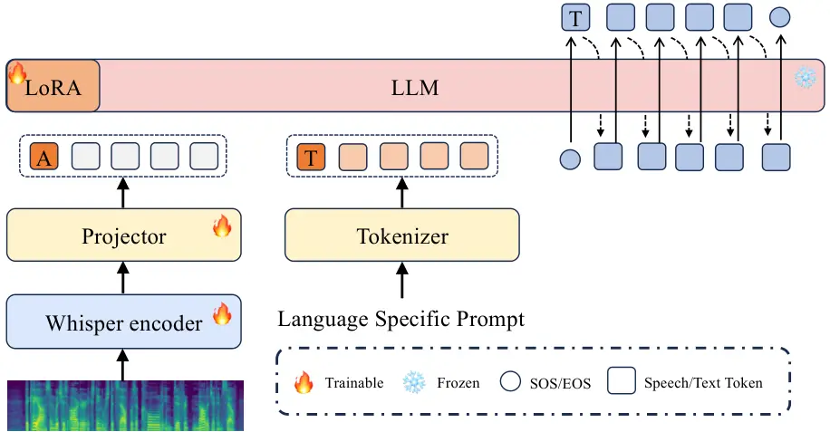
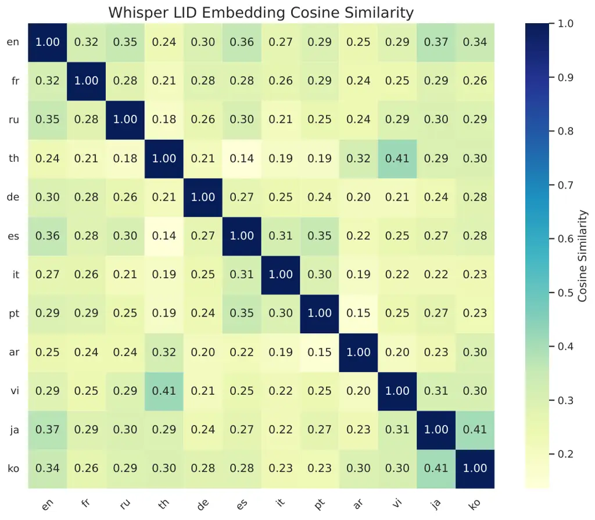

# Zipper-LoRA: Dynamic Parameter Decoupling for Speech-LLM based Multilingual Speech Recognition

Yuxiang Mei    Delai Qiu    Shengping Liu    Jiaen Liang    Yanhua Long
^(†)^(†)thanks: Corresponding author: Yanhua Long. Yuxiang Mei, Yanhua
Long are with the Shanghai Engineering Research Center of Intelligent
Education and Bigdata, Shanghai Normal University, Shanghai, 200234,
China. Yanhua Long is also with the SHNU-Unisound Natural Human-Computer
Interaction Lab, Shanghai Normal University. (e-mail:
m153517@icloud.com; yanhua@shnu.edu.cn). Delai Qiu, Shengping Liu, Jiaen
Liang are with the Unisound AI Technology Co., Ltd., Beijing, China
(e-mail: qiudelai@unisound.com; liushengping@unisound.com;
liangjiaen@unisound.com). This work was done while Yuxiang Mei was an
intern at Unisound.

###### Abstract

Speech Large Language Models (Speech-LLMs) have emerged as a powerful
approach for automatic speech recognition (ASR) by aligning speech
encoders with large language models. However, adapting these systems to
multilingual settings with imbalanced data distributions remains
challenging. In such scenarios, a stability-plasticity dilemma often
arises: fully shared Parameter-Efficient Fine-Tuning (PEFT) can cause
negative inter-lingual interference for under-represented languages,
while fully language-specific tuning limits the cross-lingual beneficial
knowledge transfer needed for low-resource tasks. To address this, we
propose Zipper-LoRA, a novel rank-level decoupling framework with three
variants (Static, Hard, and Soft) that dynamically synthesizes LoRA
updates from shared and language-specific subspaces. By using a
lightweight language-conditioned router, Zipper-LoRA dynamically
controls the contribution of each subspace at the LoRA rank-level,
enabling fine-grained sharing where languages are compatible and strict
decoupling when conflicts occur. To further stabilize optimization under
imbalanced data, we propose a two-stage training strategy with an
Initial-B warm-start that significantly accelerates convergence.
Experiments on a 12-language mixed-resource setting show that
Zipper-LoRA consistently outperforms both fully shared and independent
baselines, particularly in extremely low-resource scenarios. Moreover,
we demonstrate that these gains are robust across both chunked and
non-chunked encoder configurations, confirming the framework’s
reliability for practical, large-scale multilingual ASR. Our code and
data will be available at https://github.com/YuCeong-May/Zipper-LoRA for
reproducibility.

###### Index Terms: 

Multilingual ASR, Speech-LLM, Low-resource adaptation, LoRA.

## I Introduction

The rapid progress of Large Language Models (LLMs) has fundamentally
reshaped the landscape of modern artificial intelligence. Recent
foundation models \[1, 2, 3\] demonstrate emergent reasoning and
generation capabilities, motivating a paradigm shift towards
architectures that bridge powerful speech encoders with LLM backbones
via projection interfaces \[4, 5, 6, 7, 8\]. These unified Speech-LLM
systems \[9, 10, 11\] not only achieve high-performance Automatic Speech
Recognition (ASR) but also enable complex instruction-following
behaviors for speech-centric reasoning tasks.

Despite these advancements, robust and fast domain adaptation of a
higher-resource well-trained Speech-LLM model to low-resource or
resource-imbalanced multilingual ASR scenarios remains challenging.
Current Speech-LLMs are predominantly optimized for high-resource
languages (e.g., English, Mandarin), when extended to a long-tailed data
distribution that contains numerous low-resource languages, ASR
performance often degrades significantly \[12\]. A primary bottleneck is
inter-lingual interference: gradient updates dominated by high-resource
training data may distort the shared representations required for
under-represented languages. This issue essentially reflects the classic
stability-plasticity dilemma in continual learning and multi-task
adaptation \[13\]: an ideal model needs to stay stable enough to handle
shared acoustic features while remaining flexible enough to pick up on
specific phonological and acoustic differences between languages.

For an ASR adaptation task, directly fine-tuning billion-parameter
Speech-LLMs is unrealistic due to the massive computation and memory
required. This is why Parameter-Efficient Fine-Tuning (PEFT) has become
the standard, with Low-Rank Adaptation (LoRA) \[14\] being the most
common choice. However, using PEFT in diverse multilingual environments
brings out a fundamental conflict between reducing inter-lingual
interference and encouraging cross-lingual positive knowledge transfer.
A typical design shares a single LoRA module across all languages
\[15\], but this fully shared parameterization entangles optimization
trajectories; when training data is imbalanced, high-resource languages
dominate the shared space and cause negative knowledge transfer \[16\].
On the other hand, language-specific LoRA assigns an independent module
per language \[17\], which eliminates inter-lingual interference but
blocks cross-lingual positive transfer. Low-resource languages, lacking
sufficient supervision, fail to benefit from universal acoustic and
linguistic features (e.g., shared phonemes or articulatory patterns)
learned from data-rich languages, resulting in suboptimal
generalization.

Recent research works have explored dynamic and modular LoRA variants to
bridge this gap. For example, the proposed Mixture-of-Experts (MoE)
adaptations \[18, 19, 20\] attempt to scale model capacity via multiple
experts and routing mechanisms. However, most MoE approaches operate at
a coarse granularity (e.g., selecting entire adapter modules or layers)
and typically rely on token-level routing that does not explicitly
guarantee the decoupling of linguistic attributes. Other methods, such
as FlyLoRA \[21\] or DyLoRA \[22\], focus on adjusting effective rank
for compression or efficiency, yet they lack a mechanism to explicitly
distribute capacity between shared and specific components based on
language identity. The key research challenge lies in designing a
fine-grained mechanism that maximizes the sharing of transferable
cross-lingual acoustic knowledge while strictly isolating harmful
inter-lingual interference.

To address this challenge, we propose Zipper-LoRA, a novel rank-level
dynamic decoupling framework for multilingual Speech-LLM system
adaptation. Drawing inspiration from the mechanical action of a zipper,
our method dynamically synthesizes the LoRA adaptation matrix by
interlocking two complementary subspaces: 1) a Shared Subspace that
captures universal acoustic and linguistic regularities, and 2) a
Specific Subspace that models language-specific phonological patterns
and acoustic attributes. Unlike static MoE, Zipper-LoRA employs a
lightweight router conditioned on language identity to control the
contribution of these components at the fine-grained rank-level. By
dynamically ‘zipping’ together shared features and ‘unzipping’
conflicting ones at the rank level, Zipper-LoRA provides a flexible
solution to balance stability and adaptability. This fine-grained
control allows the model to pool cross-lingual knowledge where languages
align while blocking inter-lingual interference where they differ.

We evaluate Zipper-LoRA on a standard, high-resource well-trained
Speech-LLM architecture that connects a speech encoder, a trainable
projector and a text LLM, and adapt it to a 12-language mixed-resource
multilingual ASR setting. Our extensive results demonstrate that
Zipper-LoRA delivers substantial performance gains. It improves
significantly over fully shared LoRA by alleviating inter-lingual
interference, and compared with fully independent-LoRA, it achieves
better performance while using fewer parameters, confirming its ability
to unlock positive transfer with higher efficiency. Our primary
contributions are summarized as follows:

- •
  Dynamic Rank-Level LoRA Decoupling Framework: We propose Zipper-LoRA,
  a novel PEFT architecture that dynamically synthesizes LoRA adaptation
  matrices by “zipping” together shared and language-specific subspaces
  at the rank level. We introduce three distinct variants:
  Zipper-LoRA-Static (hard partitioning), Zipper-LoRA-Hard (binary
  column selection), and Zipper-LoRA-Soft (dynamic rank-wise mixing), to
  provide a flexible range of solutions. This fine-grained composition
  allows the model to better balance cross-lingual knowledge sharing
  with the isolation of inter-lingual interference, significantly
  outperforming coarse-grained MoE approaches.
- •
  LID-Aware Contextual Routing: We propose a lightweight, rank-level
  routing mechanism powered by Whisper-derived language identity (LID)
  embeddings. Unlike traditional MoE methods that switch between entire
  modules, our router performs fine-grained composition by dynamically
  controlling the contribution of shared and language-specific subspaces
  at the individual rank level, ensuring optimal knowledge transfer
  tailored to each language’s needs.
- •
  Two-Stage Training with Initial-B Warm-start: To stabilize
  optimization under imbalanced multilingual data, we develop a robust
  training strategy. By decoupling cross-modal alignment from
  language-specific adaptation and employing an Initial-B warm-start,
  which initializes the low-rank up-projection from a converged
  Zipper-LoRA model, we significantly accelerate convergence and ensure
  more stable learning of both shared and specific subspaces.
- •
  Robustness for Practical Deployment: We verify that Zipper-LoRA’s
  performance gains are consistent across diverse encoder
  configurations, including both chunked and non-chunked processing. By
  demonstrating that the framework remains effective regardless of input
  processing constraints, we confirm its reliability for practical,
  large-scale multilingual ASR applications.

## II Related Work

### II-A Large Language Models for Speech Processing

Speech processing has increasingly shifted from task-specific pipelines
toward unified Speech Large Language Models (Speech-LLMs), where a
speech/audio encoder interfaces with a text LLM through a lightweight
alignment module (e.g., linear/MLP projection or a small cross-modal
adapter). Earlier systems often followed a cascade paradigm that
combines an ASR front-end with a text-only LLM for downstream reasoning,
while recent end-to-end Speech-LLMs integrate speech perception and
language generation more tightly and support instruction-following
behaviors beyond speech recognition \[23, 24, 25, 7\]. A common design
builds upon strong pretrained speech encoders trained on large-scale
multilingual speech-text data (e.g., Whisper) \[26\], and connects them
to an LLM backbone via a lightweight interface for representation
alignment and conditioning \[27, 28\]. Along this line, Speech-LLM
systems such as SALM \[25\] and SALMONN \[7\] couple audio encoders with
(often frozen) LLM backbones and introduce lightweight adaptation
modules (e.g., LoRA) to enable ASR and broader audio-language
understanding. Representative audio-language foundation models include
Qwen-Audio \[29\] and speech-centric variants such as WavLLM \[30\],
which further demonstrate the feasibility of unifying speech perception
with LLM-style generation. Despite strong general capabilities, these
models are often biased toward high-resource languages that dominate the
pretraining distribution, and adapting Speech-LLMs to multilingual
settings with long-tailed language distributions remains challenging,
especially for low-resource languages with limited supervision \[31, 32,
33, 34\].

### II-B Parameter-Efficient Fine-Tuning in Multilingual ASR

Fine-tuning billion-parameter models is computationally expensive and
can be unstable in data-limited regimes. Parameter-efficient fine-tuning
(PEFT) therefore plays a central role in adapting large models to
specific domains and languages \[35, 36, 37, 38\]. Among PEFT methods,
low-rank adaptation (LoRA) has become a widely adopted choice due to its
simplicity, training stability, and minimal inference overhead \[14\].
Recent variants further improve practicality and performance, including
activation-scaling approaches such as IA³ \[28\], quantized fine-tuning
such as QLoRA \[39\], and adaptive/weight- decomposed variants such as
AdaLoRA and DoRA \[40, 41\]. In multilingual ASR, LoRA-style adaptation
exposes a recurring tension between cross-lingual sharing and
language-specific specialization. A shared adaptation module encourages
collaborative acoustic and linguistic knowledge transfer by reusing
parameters across languages; however, it remains vulnerable to negative
interference under imbalanced multilingual training, where updates
dominated by high- resource languages can suppress learning signals for
low-resource languages \[42\]. Conversely, language-conditioned or
language-specific adaptation reduces such interference but may limit
cross-lingual positive transfer and increase the parameter footprint
with the number of languages \[43, 18, 44, 45, 46\]. These observations
motivate designs that explicitly allocate capacity to both shared and
language-specific components, aiming to retain cross-lingual knowledge
transfer while controlling interference in long-tailed multilingual ASR.

### II-C Dynamic LoRA Variants and Mixture-of-Experts

To increase the expressivity of parameter-efficient adaptation, recent
work has explored dynamic and modular designs. Dynamic-rank approaches
such as DyLoRA\[22\] train LoRA blocks that can be truncated to
different effective ranks without expensive search, enabling flexible
rank selection. Beyond rank dynamics, Mixture-of-Experts (MoE) style
LoRA introduces multiple expert updates and uses routing mechanisms to
select or combine experts for each input \[47, 48, 49\]. While effective
for scaling adaptation capacity, many MoE-LoRA variants operate at
relatively coarse granularity (e.g., selecting experts at layer/module
level), and routing can suffer from imbalance or collapse without
careful regularization \[50\]. Parallel lines of work explore
alternative parameterizations of low-rank updates, such as FourierFT
that learns a small set of spectral coefficients to reconstruct weight
updates efficiently \[51\], and rank-wise MoE-inspired designs such as
FlyLoRA that aim to mitigate interference and improve decoupling \[21\].
Overall, these methods primarily target efficiency and general
expressivity, but they are typically language-agnostic and do not
explicitly enforce a boundary between universal acoustic knowledge and
language-specific characteristics. In contrast, our work targets
multilingual decoupling in LLM-based speech recognition with explicit
language awareness and fine-grained control: Zipper-LoRA performs
rank-level dynamic routing to allocate LoRA capacity between shared and
language-specific subspaces conditioned on language identity, enabling
selective sharing of transferable acoustic regularities while isolating
language-specific interference.



Fig. 1: Overall Speech-LLM backbone consisting of a speech encoder, a
modality projector, and a decoder-only LLM.

## III Foundations of Speech-LLM and Adaptation Paradigms

In this section, we establish the technical foundations for multilingual
Speech-LLM adaptation. We begin by defining the backbone architecture
and the language-specific prompting mechanism. Then, we provide a
comprehensive overview of representative Parameter-Efficient Fine-Tuning
(PEFT) paradigms, ranging from foundational LoRA structures to recent
rank-wise Mixture-of-Experts (MoE) adaptations.

### III-A Speech-LLM Architecture

Fig. 2: Language-specific prompts. All these prompts have the same
meaning: “Please transcribe the audio content into text.” but are
written in specific languages based on the language given for a speech.

Fig. 3: Illustration of three representative PEFT frameworks for
multilingual ASR Speech-LLM adaptation: Vanilla-LoRA (a),
Independent-LoRA (b), and FlyLoRA (c).

Our system adopts a unified Speech-LLM paradigm. As illustrated in
Fig. 1, the backbone consists of three primary components: a speech
encoder $`\mathcal{E}`$, a modality projector $`\mathcal{P}`$, and a
large language model $`\mathcal{M}`$. The process begins with the
general formulation of audio-to-text transformation. Given an input
speech sequence $`\mathbf{X}`$, the speech encoder first extracts
high-level acoustic representations:

```math
\mathbf{H}_{enc}=\mathcal{E}(\mathbf{X}) \tag{1}
```

To ensure these features are interpretable by the language model, the
modality projector $`\mathcal{P}`$ maps them into the LLM’s token
embedding space:

```math
\mathbf{H}_{proj}=\mathcal{P}(\mathbf{H}_{enc}) \tag{2}
```

In a standard setting, the decoder-only LLM $`\mathcal{M}`$ directly
takes these projected embeddings as input to produce the target text
sequence $`\mathbf{Y}`$ through
$`\mathbf{Y}=\mathcal{M}(\mathbf{H}_{proj})`$, optimized via the
standard cross-entropy loss.

However, to effectively handle multilingual ASR discrimination, we
enhance this standard pipeline by introducing a Language-Specific
Prompting mechanism. As shown in Fig. 2, we construct a set of prompts
that share the same semantic meaning, namely “Please transcribe the
audio content into text.” These prompts are expressed in different
languages according to the target speech language. By providing these
explicit linguistic cues, we enable the LLM to generate transcriptions
in the intended language, thereby reducing language-switching errors.
Formally, the prompt is introduced in the text embedding space before
the projected speech representations. Let $`\mathrm{Emb}(\cdot)`$ denote
the LLM token embedding lookup and $`\oplus`$ denote sequence
concatenation. For a target language $`l`$, we first construct the
prompt token sequence $`\mathbf{T}_{prompt}^{(l)}`$ and obtain its
embedding representation:

```math
\mathbf{E}_{prompt}^{(l)}=\mathrm{Emb}\!\left(\mathbf{T}_{prompt}^{(l)}\right) \tag{3}
```

The prompt embeddings are then concatenated with the projected speech
representations $`\mathbf{H}_{proj}`$ to form the final input sequence
to the LLM:

```math
\mathbf{Z}^{(l)}=\mathbf{E}_{prompt}^{(l)}\oplus\mathbf{H}_{proj}. \tag{4}
```

Conditioned on this combined representation, the decoder-only LLM
$`\mathcal{M}`$ generates the target transcription as,

```math
\mathbf{Y}=\mathcal{M}(\mathbf{Z}^{(l)}) \tag{5}
```

### III-B Representative PEFT Adaptations of Speech-LLM

To adapt the large-scale Speech-LLM architecture detailed in Sec. II-C
for multilingual ASR, full parameter fine-tuning is often
computationally expensive and memory intensive. Parameter-efficient
fine-tuning (PEFT) methods therefore provide a practical alternative by
updating only a small set of additional parameters while keeping the
pretrained backbone frozen. Among various PEFT techniques, LoRA-based
adaptation has emerged as one of the most widely used approaches for
both LLMs and multimodal systems. Building upon this framework, we
employ a dual-side LoRA strategy, applying LoRA variants to the speech
encoder and standard LoRA on the LLM, to enable efficient multilingual
adaptation. As shown in Fig. 3, we review three representative PEFT
frameworks, ranging from foundational approaches to recent advancements,
which serve as strong baselines and the direct motivation for our
proposed method.

Technically, for a frozen weight matrix
$`W_{0}\in\mathbb{R}^{d_{out}\times d_{in}}`$, LoRA adapts it by
introducing a low-rank update:

```math
W=W_{0}+\Delta W \tag{6}
```

where the layer output is computed as
$`W_{0}\mathbf{x}+\Delta W\mathbf{x}`$. Different PEFT variants mainly
differ in how $`\Delta W`$ is parameterized and shared across languages.

Vanilla-LoRA: As the most foundational approach, Vanilla-LoRA applies a
single low-rank adapter that is fully shared across all languages. As
shown in Fig. 3(a), the LoRA branch parameterizes a rank-$`r`$ update
as:

```math
\Delta W=\frac{\alpha}{r}BA \tag{7}
```

where $`A\in\mathbb{R}^{r\times d_{in}}`$ and
$`B\in\mathbb{R}^{d_{out}\times r}`$ are shared low-rank factors
(down-/up-projection), and $`\alpha`$ is a scaling hyper-parameter.
Since both $`A`$ and $`B`$ are fully shared across languages, the same
low-rank subspace is used to adapt $`W_{0}`$. While this promotes
maximum cross-lingual knowledge transfer, it is highly susceptible to
negative inter-lingual interference. Under imbalanced multilingual
training, the shared subspace tends to be dominated by high-resource
languages, which can suppress learning signals for low-resource
languages \[42\].

Independent-LoRA: To eliminate such inter-lingual interference,
Independent-LoRA represents a traditional design choice that enforces
strict parameter isolation. As illustrated in Fig. 3(b), while the
pretrained $`W_{0}`$ remains shared and frozen, a dedicated LoRA module
is assigned to each language $`l\in\{1,\dots,L\}`$:

```math
\Delta W^{(l)}=\frac{\alpha}{r}B^{(l)}A^{(l)} \tag{8}
```

This design effectively reduces inter-lingual interference by preventing
parameter sharing in the LoRA subspace, but it also weakens positive
knowledge transfer across languages, which can hurt low-resource
languages.

FlyLoRA: A more recent advancement, FlyLoRA \[21\], introduces a
rank-wise mixture-of-experts (MoE) mechanism into the adaptation
process. As shown in Fig. 3(c), it treats each rank component as an
individual expert and dynamically activates a sparse subset of ranks via
an implicit routing mechanism. Specifically, it employs a _sparse and
frozen_ down-projection matrix $`A`$ to compute routing scores
$`\mathbf{y}=A\mathbf{x}+\mathbf{d}`$, where
$`\mathbf{d}\in\mathbb{R}^{r}`$ is a learnable bias term for load
balancing. Based on these scores, a top-$`k`$ operator selects the
active indices $`\mathcal{I}_{\text{top}k}\subseteq\{1,\dots,r\}`$. The
adapter weight is then constructed by aggregating the top-$`k`$ active
components:

```math
\Delta W=\frac{\alpha}{r}\sum_{i\in\mathcal{I}_{\text{top}k}}\mathbf{b}_{i}\mathbf{a}_{i}^{\top} \tag{9}
```

where $`\mathbf{b}_{i}`$ and $`\mathbf{a}_{i}^{\top}`$ are the $`i`$-th
column and row of the up- and down-projection matrices, respectively.
Although FlyLoRA was originally proposed for general task decoupling in
LLMs, its unique rank-wise MoE structure serves as a strong baseline and
a direct inspiration for our work. However, since FlyLoRA relies on
implicit routing without explicit language cues, it lacks a dedicated
mechanism to decouple language-specific specialization from shared
acoustic knowledge. This limitation motivates our proposed Zipper-LoRA,
which explicitly harmonizes these two components.

## IV Proposed Zipper-LoRA

Fig. 4: Overview of the proposed Zipper-LoRA. A language-aware router
outputs rank-wise mixing weights from language embeddings to construct
$`B_{\text{merged}}^{(l)}`$ for multilingual ASR adaptation.

As discussed in the above sections, the adaptation of multilingual ASR
Speech-LLMs poses two competing requirements: 1) The model needs shared
capacity to facilitate cross-lingual knowledge transfer, which is
important for improving low-resource language performance; 2) It
requires language-discriminative capacity to mitigate inter-lingual
interference, particularly under the imbalanced multilingual data
training. Throughout this process, the adaptation must remain
parameter-efficient to stay scalable for large-scale frozen backbones,
i.e., introducing only a small number of trainable parameters on top of
a frozen backbone.

To harmonize these objectives, we propose Zipper-LoRA, a family of PEFT
modules designed to explicitly allocate and integrate shared and
language-specific rank components in a language-aware manner. As
illustrated in Fig. 4, all Zipper-LoRA variants leverage a globally
shared down-projection matrix $`A`$, ensuring common acoustic-linguistic
feature extraction. The fundamental distinction between these variants
lies in the rank-wise construction of the up-projection matrix $`B`$.
Intuitively, Zipper-LoRA “zips” together shared and language-specific
columns of $`B`$ to form an effective rank-$`r`$ adapter for each
language. This integration can be realized through either a static
allocation or a dynamic rank-wise composition.

To provide a comprehensive understanding of the proposed framework, in
the following sections, we first establish the definition of the shared
down-projection matrix $`A`$ and the rank-wise construction of $`B`$. We
then present the proposed Zipper-LoRA family, ranging from the static
language-wise hard split (Zipper-LoRA-Static) to dynamic binary
selection (Zipper-LoRA-Hard) and soft mixing mechanisms
(Zipper-LoRA-Soft). This is followed by the LID-aware contextual routing
that manages these rank-wise compositions, concluding with the
specialized training strategies tailored for optimizing Zipper-LoRA,
such as segment-wise encoding and parameter initialization.

### IV-A Definition: Shared $`A`$ and Rank-wise Construction of $`B`$

The rank-level design provides a suitable granularity for multilingual
PEFT. Each LoRA rank can be viewed as a compact adaptation direction, so
composing shared and language-specific columns at the rank level allows
the model to preserve transferable directions while isolating
language-sensitive components. Compared with coarser layer-level or
adapter-level routing, which switches or duplicates an entire module,
rank-level composition offers finer sharing/decoupling granularity with
little routing overhead. This is particularly useful for multilingual
ASR, where languages may share some acoustic or phonetic factors while
still requiring separation for conflicting language-specific patterns.

Let $`A\in\mathbb{R}^{r\times d_{in}}`$ be the shared down-projection
matrix. Zipper-LoRA constructs an effective up-projection matrix
$`B_{\text{merged}}\in\mathbb{R}^{d_{out}\times r}`$ by combining a
shared bank $`B_{\text{shared}}`$ and a language-specific bank
$`B_{\text{spec}}^{(l)}`$. The resulting adaptation is applied as

```math
\Delta W^{(l)}\;=\;\frac{\alpha}{r}\,B_{\text{merged}}^{(l)}\,A \tag{10}
```

where $`\Delta W^{(l)}`$ denotes the LoRA-induced weight update for
language $`l`$, and $`B_{\text{merged}}^{(l)}`$ is instantiated
differently by the three variants below. In all cases,
$`B_{\text{merged}}`$ is formed rank-wise, which matches the
visualization in Fig. 4(a)-(c).

### IV-B Zipper-LoRA-Static (Language-wise Hard Split)

Zipper-LoRA-Static implements a simple MoE-style specialization by hard
partitioning rank components into shared and language-specific parts. As
shown in Fig. 4(a), we assume the target rank is $`r`$ (e.g.,
$`r{=}32`$), and split it into $`r_{s}`$ shared ranks and $`r_{p}`$
language-specific ranks, with $`r_{s}+r_{p}=r`$ (e.g., $`r_{s}{=}16`$,
$`r_{p}{=}16`$). We learn a shared matrix
$`B_{\text{shared}}\in\mathbb{R}^{d_{out}\times r_{s}}`$ and a
language-specific matrix
$`B_{\text{spec}}^{(l)}\in\mathbb{R}^{d_{out}\times r_{p}}`$ for each
language $`l`$. The merged up-projection is formed by concatenation:

```math
B_{\text{merged}}^{(l)}\;=\;\big[\,B_{\text{shared}},B_{\text{spec}}^{(l)}\,\big]\in\mathbb{R}^{d_{out}\times r} \tag{11}
```

This design preserves a fixed amount of shared capacity while allocating
a dedicated subspace for each language.

### IV-C Zipper-LoRA-Hard (Dynamic Binary Column Selection)

Zipper-LoRA-Hard enables language-dependent specialization through
_binary_ rank-wise selection between the shared bank and the
language-specific bank. As shown in Fig. 4(b), we learn a shared bank
$`B_{\text{shared}}\in\mathbb{R}^{d_{out}\times r}`$ and a
language-specific bank
$`B_{\text{spec}}^{(l)}\in\mathbb{R}^{d_{out}\times r}`$ (both of rank
$`r`$). Given a target language $`l`$, a language-aware router takes the
corresponding language embedding $`\mathbf{e}^{(l)}`$ as input and
outputs a rank-wise gating vector $`\mathbf{p}^{(l)}\in[0,1]^{r}`$. Each
element of this vector controls one LoRA rank column, so the routing
decision is made at the rank level rather than at the adapter or layer
level. We then obtain a binary selection mask by thresholding:

```math
s_{i}^{(l)}=\mathbb{I}\left[p_{i}^{(l)}\geq\tau\right],\qquad\mathbf{s}^{(l)}\in\{0,1\}^{r} \tag{12}
```

where $`\tau`$ is a fixed threshold. The merged up-projection is
constructed by taking one column from either $`B_{\text{spec}}^{(l)}`$
or $`B_{\text{shared}}`$ for each rank position:

```math
B_{\text{merged}}^{(l)}\;=\;\mathrm{Zip}\Big(B_{\text{shared}},\,B_{\text{spec}}^{(l)},\,\mathbf{s}^{(l)}\Big) \tag{13}
```

where $`\mathrm{Zip}(\cdot)`$ denotes the rank-wise “zipper” operation
shown in Fig. 4(b): the $`i`$-th column of $`B_{\text{merged}}^{(l)}`$
is taken from $`B_{\text{spec}}^{(l)}`$ if the binary mask activates the
language-specific route for that rank; otherwise, it is taken from
$`B_{\text{shared}}`$. This yields an effective rank-$`r`$ adapter whose
shared vs. language-specific columns are controlled by the binary mask
$`\mathbf{s}^{(l)}`$. Thus, Hard routing makes a discrete choice for
each rank: each column is either fully shared or fully
language-specific. During gradient backpropagation, we adopt the
straight-through estimator (STE) \[52\] to approximate gradients through
the non-differentiable thresholding operation in Eq. (12).

### IV-D Zipper-LoRA-Soft (Dynamic Rank-wise Column Mixing)

Zipper-LoRA-Soft can be viewed as a continuous relaxation of
Zipper-LoRA-Hard. It replaces binary selection with _continuous_
rank-wise mixing between shared and language-specific columns, yielding
smoother adaptation. As shown in Fig. 4(c), while maintaining the same
rank-$`r`$ bank structure and the same router output as
Zipper-LoRA-Hard, we directly use the continuous mixing vector
$`\mathbf{p}^{(l)}\in[0,1]^{r}`$ generated by the language-aware router
instead of thresholding it. We interpret $`\mathbf{p}^{(l)}`$ as the
rank-wise proportion assigned to the language-specific columns, and
construct the merged up-projection via a weighted summation:

```math
B_{\text{merged}}^{(l)}\;=\;B_{\text{shared}}\,\mathrm{diag}\!\big(\mathbf{1}-\mathbf{p}^{(l)}\big)\;+\;B_{\text{spec}}^{(l)}\,\mathrm{diag}\!\big(\mathbf{p}^{(l)}\big) \tag{14}
```

where $`\mathrm{diag}(\mathbf{p})`$ denotes the diagonal matrix with
$`\mathbf{p}`$ on its diagonal, i.e., it performs rank-wise
(column-wise) scaling. Equivalently, for each rank index
$`i\in\{1,\dots,r\}`$,

```math
\mathbf{b}_{\text{merged},i}^{(l)}\;=\;\big(1-p_{i}^{(l)}\big)\,\mathbf{b}_{\text{shared},i}\;+\;p_{i}^{(l)}\,\mathbf{b}_{\text{spec},i}^{(l)} \tag{15}
```

Compared to Zipper-LoRA-Hard, Zipper-LoRA-Soft provides a continuous
trade-off between shared and language-specific capacity without
requiring discrete rank selection. Here “dynamic” refers to rank-wise
adaptive weighting: different rank components can be assigned different
mixing weights for each language. In summary, both Hard and Soft routing
use the same language-conditioned router output. Hard routing
discretizes this signal to make an all-or-nothing column selection,
whereas Soft routing keeps it continuous to interpolate between shared
and language-specific columns.

### IV-E LID-Aware Contextual Routing

Whisper LID Embedding: In Fig. 4, both Zipper-LoRA-Hard and
Zipper-LoRA-Soft require a language-aware router for LoRA rank
selection. We obtain the language identity (LID) embedding from the
Whisper decoder \[26\]. Specifically, Whisper produces a
fixed-dimensional LID representation
$`\mathbf{e}^{(l)}\in\mathbb{R}^{d_{\text{lid}}}`$ for target language
$`l`$, which serves as a compact language-conditioned signal for
routing.

Robustness to Imperfect LID: The language-aware router uses Whisper LID
embeddings as conditioning information, but it does not require a
perfectly discrete or error-free LID decision. The LID embedding
continuously modulates the shared and language-specific LoRA rank
components rather than directly determining the final ASR prediction. As
a result, Zipper-LoRA-Soft can mitigate minor LID uncertainty through
smooth rank-wise composition, since shared and specific components are
continuously mixed. However, severe LID errors may still guide the
router toward inappropriate language-specific components and weaken the
effect of decoupling. This limitation can be alleviated by retaining
shared rank components, using soft routing when LID reliability is
uncertain, and, in future work, incorporating noisy or top-$`k`$ LID
training to improve robustness under uncertain language identification.

Router Architecture: As illustrated by the router block in Fig. 4, we
adopt a lightweight router that maps the Whisper LID embedding to
rank-wise mixing weights. Specifically, we first normalize the LID
embedding and then project it to the LoRA rank dimension:

```math
\tilde{\mathbf{e}}^{(l)}=\mathrm{LayerNorm}\!\left(\mathbf{e}^{(l)}\right), \tag{16}
```

```math
\hat{\mathbf{e}}^{(l)}=W_{r}\,\tilde{\mathbf{e}}^{(l)}+\mathbf{b}_{r},\quad\hat{\mathbf{e}}^{(l)}\in\mathbb{R}^{r} \tag{17}
```

where $`W_{r}\in\mathbb{R}^{r\times d_{\text{lid}}}`$ and
$`\mathbf{b}_{r}\in\mathbb{R}^{r}`$ are trainable parameters. Then, we
apply an element-wise sigmoid to obtain rank-wise mixing weights:

```math
\mathbf{p}^{(l)}=\sigma\!\left(\hat{\mathbf{e}}^{(l)}\right),\quad\mathbf{p}^{(l)}\in[0,1]^{r} \tag{18}
```

The resulting $`\mathbf{p}^{(l)}`$ is the router output shown in
Fig. 4(b) and (c), and it directly controls rank-wise composition
between the shared and language-specific banks. In particular,
Zipper-LoRA-Soft uses $`\mathbf{p}^{(l)}`$ as continuous mixing weights
in Eq. (14), while Zipper-LoRA-Hard derives a binary mask
$`\mathbf{s}^{(l)}\in\{0,1\}^{r}`$ by thresholding $`\mathbf{p}^{(l)}`$
(Eq. (12)) and performs rank-wise selection via Eq. (13).

### IV-F Training Strategy of Speech-LLM with Zipper-LoRA

This section describes how the model is trained for multilingual ASR
adaptation and how the proposed initialization and efficiency strategies
are applied. Stage 1 serves as a foundation baseline to obtain a
well-calibrated Speech-LLM backbone. All subsequent experiments,
including different LoRA variants, are conducted by inserting LoRA
modules into the speech encoder and training them in a
parameter-efficient supervised fine-tuning (SFT) regime.

Stage 1: Foundation Baseline: In Stage 1, we train an alignment baseline
to improve the coupling between the speech encoder and the LLM.
Specifically, as the pipeline used in \[15\], we update the speech
encoder parameters and the modality projector, and train LoRA parameters
injected into the LLM, while keeping the remaining LLM backbone frozen.
This stage provides a strong starting point with improved cross-modal
alignment, and is used as the backbone for Stage 2. Notably, Stage 1
does _not_ involve encoder-side LoRA; encoder LoRA is only introduced in
Stage 2 for all PEFT variants.

Stage 2: Parameter-Efficient Multilingual ASR SFT: In Stage 2, we freeze
the speech encoder weights obtained from Stage 1 and insert LoRA modules
into the encoder. We then perform multilingual SFT by updating only the
encoder-side LoRA parameters (with different variants), the projector,
and the LLM-side LoRA parameters. Under this setting, different PEFT
frameworks differ only in how the encoder-side low-rank update is
structured and shared across languages, while the rest of the training
pipeline remains identical.

Segment-wise (Chunked) Encoder Processing for Training Efficiency:
Training on long-form utterances with full-context encoding can be
memory and compute-intensive. To improve training throughput, we adopt a
segment-wise (chunked) encoder setting. Given an utterance, we split the
input audio into fixed-length segments and encode each segment
independently using the same encoder. Segment representations are
concatenated in temporal order and fed into the projector. This strategy
reduces peak GPU memory usage while keeping the Speech-LLM architecture
unchanged. In experiments, we report results under both full-context and
segment-wise encoder regimes to verify robustness to encoder input
processing.

Initial-B Warm-start Initialization: To stabilize optimization of
rank-wise routing under long-tailed multilingual supervision, we propose
an Initial-B warm-start strategy. In standard LoRA, the up-projection
matrix $`B`$ is typically initialized to zeros, which can delay
effective adaptation and make joint learning of routing and multilingual
specialization less stable. Instead of zero initialization, we
warm-start the $`B`$ parameters using a converged Zipper-LoRA model.

Specifically, we first train a Zipper-LoRA variant with rank-wise mixing
under the Stage 2 SFT setting to obtain a converged solution. We then
reuse its learned up-projection parameters to initialize subsequent
runs: both the shared bank $`B_{\text{shared}}`$ and the
language-specific bank $`B_{\text{spec}}^{(l)}`$ are initialized from
the pretrained Zipper-LoRA parameters (and the router can optionally be
warm-started as well). This warm-start provides a well-shaped low-rank
subspace at the beginning of training, enabling the model to immediately
leverage meaningful rank components and improving convergence and
training stability for the target setting.

## V EXPERIMENTAL CONFIGURATIONS

### V-A Datasets

|                   |                         |                 |          |                      |
| ----------------- | ----------------------- | --------------- | -------- | -------------------- |
| Setting           | Dataset                 | Language        | Train(h) | Test(h)              |
| Baseline (source) | MSR86k\[53\]            | English (en)    | 3000     | 14.72                |
|                   |                         | French (fr)     | 3000     | 12.60                |
|                   |                         | Thai (th)       | 3000     | 8.37                 |
|                   | WenetSpeech (WS)\[54\]  | Chinese (zh)    | 3000     | 15.18 $`\mid`$ 23.06 |
| SFT (target)      | MLS\[55\]               | German (de)     | 1000     | 14.29                |
|                   |                         | Spanish (es)    | 1000     | 10.00                |
|                   |                         | French (fr)     | 1000     | 10.07                |
|                   |                         | Italian (it)    | 500      | 8.10                 |
|                   | MSR86k\[53\]            | Russian (ru)    | 1000     | 8.16                 |
|                   |                         | Vietnamese (vi) | 1000     | 7.25                 |
|                   | LibriSpeech (LS)\[56\]  | English (en)    | 960      | 5.40 $`\mid`$ 5.34   |
|                   | Common Voice (CV)\[57\] | Thai (th)       | 865      | 4.00                 |
|                   |                         | Arabic (ar)     | 1        | 4.00                 |
|                   |                         | Japanese (ja)   | 1        | 4.00                 |
|                   |                         | Korean (ko)     | 1        | 0.98                 |
|                   |                         | Portuguese (pt) | 1        | 1.00                 |

Note: “$`\mid`$” separates two test subsets. For WenetSpeech, 15.18
$`\mid`$ 23.06 correspond to Meeting and Net. For LibriSpeech, 5.40
$`\mid`$ 5.34 correspond to Clean and Other.

TABLE I: Dataset statistics (duration in hours).

Table I summarizes the data used in our two-stage training. The
foundation baseline stage uses high-resource corpora to build a
multilingual ASR initialization, while the SFT stage (stage 2) adapts
the model to a 12-language setting with substantial training resource
imbalance.

As shown in Table I (Baseline block), we construct the foundation
baseline training set with four high-resource languages. Specifically,
MSR86k provides English, French, and Thai, while WenetSpeech provides
Chinese; for each language, we randomly sample 3000 hours to control the
training budget. In the SFT block, we perform multilingual ASR SFT
adaptation on 12 target languages with a long-tailed distribution. The
higher-resource portion consists of MLS German, Spanish, and French
(1000 hours each) and Italian (500 hours), MSR86k Russian and Vietnamese
(1000 hours each), LibriSpeech English (960 hours), and Common Voice
Thai (865 hours), with all hours following the sampling setup listed in
the table. The lowest-resource portion consists of Common Voice Arabic,
Japanese, Korean, and Portuguese with 1 hour per language. Some
languages overlap across stages but come from different corpora (French,
Thai, and English), introducing domain mismatch that can increase
cross-lingual interference under long-tailed SFT adaptation.

For evaluation, we follow the official splits of each dataset whenever
available. MSR86k provides an official dev split (and no official test
split), so we evaluate on its dev set. For MLS, LibriSpeech, and
WenetSpeech, we evaluate on the official test splits. For Common Voice,
we use randomly sampled evaluation subsets to control the evaluation
scale: Arabic and Thai use 4-hour subsets randomly sampled from the
official test split, Korean uses the official test split (0.98 hours),
and Portuguese uses a 1-hour subset randomly sampled from the official
training split as a held-out evaluation set due to the limited data size
and the absence of an official test split. All random sampling
procedures are fixed and shared across all methods to ensure fair
comparisons, and we have released the exact utterance lists for
reproducibility.

### V-B Configurations

We use Whisper Large-v3 \[26\] as the speech encoder and
Qwen3-1.7B \[3\] as the decoder-only language model. The modality
projector adopts a gated projection module that performs temporal
downsampling by a factor of $`4`$. Specifically, it applies two 1D
convolution layers (kernel size $`4`$, stride $`4`$) to produce a gate
branch and an up-projection branch, fuses them via a SiLU-gated
interaction \[58\], and then applies a linear transformation followed by
a residual connection with layer normalization. A final linear
projection outputs the speech-conditioned embedding sequence. Combined
with the initial $`2\times`$ downsampling in the speech encoder, this
results in an overall $`8\times`$ temporal reduction, yielding a highly
compressed representation at $`12.5`$ Hz that is fed into the language
model.

For parameter-efficient adaptation, we insert low-rank adaptation
modules into all linear layers on both the encoder and language-model
sides, including the attention projections and feed-forward network
layers. We set the rank to $`32`$ and the scaling factor to $`64`$ for
all methods. For Zipper-LoRA-Hard, the rank-selection threshold $`\tau`$
is set to $`0.5`$. For FlyLoRA \[21\], we activate $`8`$ rank
components. For the chunked encoder regime, we randomly sample chunk
durations from $`\{1,2,4,8\}`$ seconds during training and use a fixed
chunk duration of $`8`$ seconds during decoding; no overlap is used. The
non-chunked regime encodes each utterance with full context. All
experiments are trained on $`4`$ NVIDIA A800 GPUs (80 GB) with DeepSpeed
ZeRO stage $`2`$ \[59\], using a learning rate of $`2\times 10^{-5}`$, a
warmup ratio of $`10\%`$, and a cosine learning-rate schedule. To
improve memory efficiency, we pack training samples by constraining the
total sequence length to at most 2048 tokens, where the packed length
includes the downsampled speech tokens, the text tokens, and reserved
prompt tokens; packing is performed within the same language. After
packing, we use a batch size of $`16`$ for chunked training and a batch
size of $`10`$ for non-chunked training.

For evaluation, we compute character error rate (CER) for Chinese,
Japanese, Korean, and Thai, and word error rate (WER) for all other
languages, with Whisper text normalization. All experiments in this work
follow these configurations unless otherwise specified.

## VI Results and Discussions

### VI-A Source Domain Results

|             | MSR86k |      |      | WenetSpeech |       |
| ----------- | ------ | ---- | ---- | ----------- | ----- |
|             | en     | fr   | th   | Meeting     | Net   |
| Chunked     | 4.65   | 9.24 | 4.20 | 16.55       | 9.60  |
| Non-chunked | 4.59   | 9.29 | 4.05 | 17.16       | 10.22 |

TABLE II: Foundation baseline WER/CER (%) comparison under chunked vs.
non-chunked settings.

|                              |                |                |                |                |                |                |
| ---------------------------- | -------------- | -------------- | -------------- | -------------- | -------------- | -------------- |
| Methods                      | Shared         | Specific       | LID Router     | Dynamic Rank   | Soft Mixing    | Initial-B      |
|                              |                |                |                | Routing        |                |                |
| Vanilla-LoRA                 | $`\checkmark`$ | –              | –              | –              | –              | –              |
| FlyLoRA                      | $`\checkmark`$ | –              | –              | $`\checkmark`$ | –              | –              |
| Independent-LoRA             | –              | $`\checkmark`$ | –              | –              | –              | –              |
| Zipper-LoRA-Static           | $`\checkmark`$ | $`\checkmark`$ | –              | –              | –              | –              |
| Zipper-LoRA-Hard             | $`\checkmark`$ | $`\checkmark`$ | $`\checkmark`$ | $`\checkmark`$ | –              | –              |
| Zipper-LoRA-Soft             | $`\checkmark`$ | $`\checkmark`$ | $`\checkmark`$ | $`\checkmark`$ | $`\checkmark`$ | –              |
| Zipper-LoRA-Soft + Initial-B | $`\checkmark`$ | $`\checkmark`$ | $`\checkmark`$ | $`\checkmark`$ | $`\checkmark`$ | $`\checkmark`$ |

Note: “Shared” and “Specific” indicate shared and language-specific
adaptation capacity, respectively. FlyLoRA performs input-dependent
implicit top-$`k`$ dynamic rank routing, whereas the Zipper-LoRA router
is explicitly conditioned on language-ID embeddings.

TABLE III: Component configurations of the compared LoRA-based
adaptation methods.

|                    |        |       |       |             |       |
| ------------------ | ------ | ----- | ----- | ----------- | ----- |
| Methods            | MSR86k |       |       | WenetSpeech |       |
|                    | en     | fr    | th    | Meeting     | Net   |
| Chunked            |        |       |       |             |       |
| Vanilla-LoRA       | 4.88   | 10.74 | 13.58 | 18.51       | 12.12 |
| FlyLoRA            | 4.87   | 10.65 | 7.99  | 17.57       | 11.86 |
| Independent-LoRA   | 4.86   | 11.07 | 7.72  | 17.24       | 11.63 |
| Zipper-LoRA-Static | 4.91   | 11.35 | 7.85  | 18.12       | 12.11 |
| Zipper-LoRA-Hard   | 4.79   | 11.06 | 7.59  | 17.49       | 11.61 |
| Zipper-LoRA-Soft   | 4.88   | 11.26 | 7.79  | 17.90       | 11.93 |
|      + Initial-B   | 5.06   | 11.53 | 8.05  | 17.96       | 12.02 |
| Non-Chunked        |        |       |       |             |       |
| Vanilla-LoRA       | 4.40   | 10.10 | 12.04 | 18.40       | 12.38 |
| FlyLoRA            | 4.43   | 10.10 | 7.10  | 18.25       | 12.31 |
| Independent-LoRA   | 4.59   | 10.86 | 7.50  | 17.58       | 11.76 |
| Zipper-LoRA-Static | 4.64   | 11.07 | 7.70  | 17.68       | 11.97 |
| Zipper-LoRA-Hard   | 4.53   | 10.78 | 7.40  | 18.06       | 11.79 |
| Zipper-LoRA-Soft   | 4.59   | 11.02 | 7.52  | 17.99       | 11.90 |
|      + Initial-B   | 4.69   | 11.24 | 7.69  | 17.83       | 11.94 |

Note: “+ Initial-B” denotes warm-start for Zipper-LoRA-Soft.

TABLE IV: Source-domain performance after SFT on MSR86k (en/fr/th) and
WenetSpeech (Meeting/Net) under chunked and non-chunked encoder
settings.

Fig. 5: Performance comparison of Zipper-LoRA-Soft + Initial-B and other
LoRA-based methods on the 12 target languages in the SFT stage under the
non-chunked setting, using $`(1-\mathrm{WER/CER})\%`$ as the metric.
Detailed numerical results are provided in Table V.

Table II reports pretrained-stage foundation baseline ASR performance
under chunked and non-chunked encoder settings. The two settings achieve
comparable WER/CER on both MSR86k and WenetSpeech. These results suggest
that the chunked encoder does not introduce an evident degradation in
recognition performance at the pretraining stage. Under our training
setup, chunking also leads to a substantial improvement in training
efficiency.

Table IV presents the source-domain ASR performance after SFT adaptation
under both chunked and non-chunked encoder configurations. A comparison
between the foundation baseline (Table II) and the post-SFT results
reveals a general performance degradation across all evaluated
languages. This decline is primarily caused by domain mismatch and
cross-lingual interference during the second-stage adaptation. Although
languages such as English, French, and Thai are present in both stages,
the SFT stage uses different corpora (e.g., LibriSpeech and Common
Voice) compared to the foundation stage (MSR86k). This introduces
significant distributional shifts; for instance, in the Vanilla-LoRA
(Chunked) setting, the error rate for Thai increases sharply from 4.20%
to 13.58%. Such results suggest that the long-tailed distribution of the
12-language SFT task leads to severe interference, resulting in
“catastrophic forgetting” of the high-resource knowledge learned during
the foundation stage.

The degree of forgetting varies significantly across different PEFT
strategies. Vanilla-LoRA shows the most obvious performance drop,
particularly on the Thai and WenetSpeech tasks, indicating that a shared
low-rank space is not enough to protect source-domain knowledge from the
noise of multi-target adaptation. Independent-LoRA and FlyLoRA reduce
this forgetting through greater parameter decoupling. In particular,
Independent-LoRA shows good stability on the WenetSpeech Meeting and Net
sets, although neither method maintains optimal performance across all
source-domain tasks.

Our proposed Zipper-LoRA framework, especially the Zipper-LoRA-Hard
variant, shows better performance in managing the trade-off between
target-domain adaptation and source-domain preservation. In the chunked
encoder setting, Zipper-LoRA-Hard achieves the lowest error rates for
English (4.79%), Thai (7.59%), and WenetSpeech Net (11.61%) among all
compared SFT methods. This performance gain highlights the effectiveness
of the Zipper-LoRA routing mechanism in isolating interference from the
long-tailed target distribution. Furthermore, the way Zipper-LoRA and
chunked encoding work together is clear in long-form scenarios like
WenetSpeech, where it consistently performs better than non-chunked
alternatives. These results confirm that Zipper-LoRA-Hard provides a
strong protection, effectively “zipping” the foundation and adaptation
layers to reduce the negative impact of domain mismatch.

### VI-B Target Domain Results

Methods CommonVoice LibriSpeech MLS MSR86k ar ja ko pt th Avg de es fr
it ru vi Vanilla-LoRA 53.08 46.28 36.03 29.30 1.48 4.15 8.52 5.27 8.26
11.86 9.05 6.31 FlyLoRA 55.01 46.86 35.99 30.16 1.49 4.19 9.04 5.79 8.13
12.36 9.23 6.51 Independent-LoRA 41.01 37.53 24.53 23.82 1.36 3.98 8.36
5.05 8.09 11.66 9.02 6.13 Zipper-LoRA-Soft + Initial-B 36.94 34.04 21.35
23.22 1.32 3.96 8.20 4.84 7.50 11.09 8.79 5.94

Note: All results are the detailed WER/CER values corresponding to the
visualization in Fig. 5.

TABLE V: WER/CER (%) on the 12 target languages in the SFT stage under
the non-chunked encoder setting.

Table V reports the detailed WER/CER results for multilingual ASR
adaptation on the 12 target languages in the supervised fine-tuning
stage under the non-chunked encoder setting. Zipper-LoRA-Soft +
Initial-B achieves the lowest error rate on all 12 target languages. The
gains are especially clear on low-resource Common Voice languages, where
it reduces WER/CER from 53.08% to 36.94% on Arabic, from 46.28% to
34.04% on Japanese, and from 36.03% to 21.35% on Korean compared with
Vanilla-LoRA. It also consistently improves over Independent-LoRA and
FlyLoRA across both low-resource and high-resource target languages.
These results suggest that rank-level composition with controlled
sharing effectively mitigates inter-lingual interference while
preserving cross-lingual transferable acoustic representations. Fig. 5
further provides a visual supplement to Table V by converting the
WER/CER values into $`(1-\mathrm{WER/CER})\%`$ scores, where the larger
enclosed area of Zipper-LoRA-Soft + Initial-B indicates more balanced
performance across languages.

#### VI-B1 Results on high-resource target languages

Methods CommonVoice LibriSpeech MLS MSR86k th Clean Other Avg de es fr
it ru vi Chunked Vanilla-LoRA 1.47 2.77 5.88 4.32 9.57 6.31 8.31 12.57
9.59 6.64 FlyLoRA 1.57 2.80 5.90 4.35 9.71 6.48 8.28 12.92 9.70 6.75
Independent-LoRA 1.30 2.60 5.63 4.11 9.08 5.67 8.02 11.65 9.40 6.33
Zipper-LoRA-Static 1.35 2.73 5.58 4.15 9.20 6.10 8.15 11.87 9.31 6.41
Zipper-LoRA-Hard 1.35 2.62 5.53 4.07 9.15 5.69 8.03 11.71 9.44 6.36
Zipper-LoRA-Soft 1.31 2.61 5.54 4.07 9.15 5.62 8.03 11.75 9.37 6.32 +
Initial-B 1.26^(†) 2.56^(†) 5.45^(†) 4.00^(†) 8.93^(†‡) 5.31^(†‡)
7.90^(†‡) 11.10^(†‡) 9.21^(†‡) 6.15^(†‡) Non-Chunked Vanilla-LoRA 1.48
2.66 5.65 4.15 8.52 5.27 8.26 11.86 9.05 6.31 FlyLoRA 1.49 2.70 5.68
4.19 9.04 5.79 8.13 12.36 9.23 6.51 Independent-LoRA 1.36 2.53 5.44 3.98
8.36 5.05 8.09 11.66 9.02 6.13 Zipper-LoRA-Static 1.30 2.52 5.45 3.98
8.53 5.00 7.96 11.95 8.97 6.18 Zipper-LoRA-Hard 1.35 2.56 5.49 4.02 8.39
4.86 7.82 11.36 8.94 6.19 Zipper-LoRA-Soft 1.36 2.55 5.47 4.01 8.38 4.86
7.84 11.41 8.87 6.11 + Initial-B 1.32^(†) 2.53^(†) 5.38^(†‡) 3.96^(†‡)
8.20^(†‡) 4.84^(†‡) 7.50^(†‡) 11.09^(†‡) 8.79^(†‡) 5.94^(†‡)

Note: The component settings are summarized in Table III. The
superscript markers ^(†) and ^(‡) denote that Zipper-LoRA-Soft +
Initial-B is significantly better than Vanilla-LoRA and
Independent-LoRA, respectively. Significance is tested using paired
bootstrap resampling \[60, 61\] with 1,000 bootstrap samples
($`p<0.05`$).

TABLE VI: WER/CER (%) on high-resource target languages under chunked
and non-chunked encoder settings.

|                    |            |            |            |           |
| ------------------ | ---------- | ---------- | ---------- | --------- |
| Methods            | ar         | ja         | ko         | pt        |
| Chunked            |            |            |            |           |
| Vanilla-LoRA       | 62.32      | 48.93      | 38.37      | 33.49     |
| FlyLoRA            | 65.20      | 49.75      | 39.02      | 33.58     |
| Independent-LoRA   | 45.24      | 37.84      | 25.98      | 25.15     |
| Zipper-LoRA-Static | 42.36      | 37.51      | 25.65      | 23.26     |
| Zipper-LoRA-Hard   | 43.07      | 37.10      | 25.80      | 23.86     |
| Zipper-LoRA-Soft   | 41.72      | 35.77      | 24.37      | 23.89     |
| + Initial-B        | 38.64^(†‡) | 35.21^(†‡) | 21.87^(†‡) | 24.29^(†) |
| Non-Chunked        |            |            |            |           |
| Vanilla-LoRA       | 53.08      | 46.28      | 36.03      | 29.30     |
| FlyLoRA            | 55.01      | 46.86      | 35.99      | 30.16     |
| Independent-LoRA   | 41.01      | 37.53      | 24.53      | 23.82     |
| Zipper-LoRA-Static | 40.32      | 36.61      | 23.39      | 24.61     |
| Zipper-LoRA-Hard   | 40.89      | 36.55      | 24.61      | 23.96     |
| Zipper-LoRA-Soft   | 40.07      | 35.66      | 22.55      | 23.47     |
| + Initial-B        | 36.94^(†‡) | 34.04^(†‡) | 21.35^(†‡) | 23.22^(†) |

Note: The component settings are summarized in Table III. The
superscript markers ^(†) and ^(‡) denote statistical significance tests.
Specifically, ^(†) represents that Zipper-LoRA-Soft + Initial-B is
significantly better than Vanilla-LoRA, and ^(‡) represents that
Zipper-LoRA-Soft + Initial-B is significantly better than
Independent-LoRA. Significance is tested using paired bootstrap
resampling with 1,000 bootstrap samples ($`p<0.05`$).

TABLE VII: WER/CER (%) on low-resource Common Voice languages under
chunked and non-chunked settings.

Table III explicitly summarizes which components are enabled for each
method, while Table VI reports SFT ASR performance on high-resource
target languages under both the chunked and non-chunked encoder
settings, including Common Voice (Thai), LibriSpeech (Clean, Other and
Average), Multilingual LibriSpeech (German, Spanish, French and Italian)
and MSR86k (Russian and Vietnamese). The two encoder settings are
explicitly presented as the Chunked and Non-Chunked row blocks in
Table VI. Across both settings, the Zipper-LoRA family consistently
delivers strong performance. Taken together, the component
configurations in Table III and the performance results in Table VI
reveal a clear progressive ablation pattern, with four findings standing
out. 1) Zipper-LoRA-Static performs competitively with Independent-LoRA,
indicating that the rank-wise shared/specific decomposition can already
balance cross-lingual sharing and language-specific adaptation. 2)
Zipper-LoRA-Hard further improves or matches the static variant on
several languages, showing the contribution of LID-aware binary rank
selection. Zipper-LoRA-Soft achieves comparable or better performance
than Zipper-LoRA-Hard on several languages, suggesting that continuous
rank-wise mixing provides a smoother trade-off between shared and
language-specific subspaces. In particular, Zipper-LoRA-Soft closely
matches or surpasses Independent-LoRA on several high-resource
languages, such as Spanish, French, Italian, Russian, and Vietnamese
under the non-chunked setting, indicating that continuous rank-wise
mixing can serve as an effective alternative to full language-specific
decoupling. 3) Moreover, the + Initial-B warm-start further improves
Zipper-LoRA-Soft and achieves statistically significant gains over the
main baselines on most high-resource evaluations. 4) Overall, the
component configurations in Table III and the progressive performance
trend in Table VI show that the improvements arise from the combination
of rank-wise decomposition, language-aware routing, discrete or
continuous rank composition, and warm-start initialization, rather than
from a single factor alone. Fig. 5 further illustrates the balanced
overall performance of Zipper-LoRA-Soft + Initial-B across the 12 target
languages. By contrast, Vanilla-LoRA and FlyLoRA underperform compared
with the proposed Zipper-LoRA variants, likely due to the inter-lingual
interference introduced by parameter sharing.

#### VI-B2 Results on low-resource target languages

In the extremely low-resource adaptation tasks (only 1 hour of
fine-tuning data per language), Table VII further highlights the
ablation effect of the proposed variants. Five notable trends emerge
from the low-resource results in Table VII. 1) All Zipper-LoRA variants
achieve lower WER/CER than Vanilla-LoRA on the four lowest-resource
Common Voice languages under both chunked and non-chunked settings,
indicating that structured cross-lingual sharing is crucial when
supervision is extremely limited. 2) Zipper-LoRA-Static already improves
over Vanilla-LoRA and also outperforms Independent-LoRA on several
languages, showing that the rank-wise shared/specific decomposition
itself is beneficial: it preserves transferable cross-lingual knowledge
while introducing language-specific capacity to reduce interference. 3)
Compared with the static variant, Zipper-LoRA-Hard and Zipper-LoRA-Soft
achieve further gains in many cases, indicating the additional benefit
of language-aware dynamic routing. The stronger and more stable
performance of Zipper-LoRA-Soft over Zipper-LoRA-Hard suggests that
continuous weighted composition is more suitable than threshold-based
discrete selection for balancing shared and language-specific ranks. 4)
Finally, Zipper-LoRA-Soft + Initial-B achieves the best overall
low-resource performance and obtains statistically significant
improvements over the main baselines in most comparisons, confirming
that the warm-start strategy stabilizes and enhances the proposed
architecture. 5) Overall, these results demonstrate that Zipper-LoRA
provides a better trade-off between cross-lingual knowledge transfer and
inter-lingual interference than either fully shared or fully decoupled
designs.

#### VI-B3 Scalability from extremely-low to low-resource target languages

Fig. 6: Performance gap visualization from extremely-low to low-resource
target languages. Bars show relative performance change vs.
Vanilla-LoRA; positive values indicate improvement and negative values
indicate degradation. The 1-hour setting uses 1 hour per language as in
Table VII; for the 30-hour setting, Arabic, Japanese, and Korean are
from Common Voice (Korean uses 6.51 hours due to the limited official
data size), while Portuguese is from MLS.

Fig. 6 shows the visualized relative performance change of each method
compared to Vanilla-LoRA. Positive bars indicate improvements, while
negative bars show a drop in performance. This visualization examines
whether the benefits of the proposed methods hold when the training data
for low-resource target languages increases from 1 hour (extremely
low-resource in Table VII) to 30 hours (low-resource).

Across both chunked and non-chunked regimes, Zipper-LoRA variants
consistently show gains over Vanilla-LoRA. The most significant
improvements are observed in the 1-hour setting, where the lack of data
makes structured cross-lingual sharing vital for the model to learn
effectively. As the data size increases to 30 hours, the relative
improvement gap narrows slightly. This is expected, as the increased
supervision allows the model to rely more on language-specific
information. However, the Zipper-LoRA-Soft + Initial-B variant still
maintains a clear advantage over all other methods even at the 30-hour
condition. This suggests that our approach is not just a solution for
extreme data scarcity, but remains effective as more data becomes
available. This is also consistent with the high-resource
target-language ASR results reported in Table VI.

In contrast, fully shared adaptations such as FlyLoRA can exhibit
smaller gains or even degradation, suggesting stronger sensitivity to
negative knowledge transfer when low-resource languages are adapted
jointly with higher-resource ones. While Independent-LoRA provides
strong protection against interference by isolating parameters, it
cannot capture the cross-lingual benefits that Zipper-LoRA achieves
through its rank-wise composition. Overall, these results further
confirm that Zipper-LoRA provides a flexible framework that remains
strong across different data scales, effectively managing the transition
from extremely low to low-resource conditions.

#### VI-B4 Robust gains and the effect of encoder context

Comparing the Chunked and Non-Chunked row blocks in Table VI, together
with Table VII, shows that the results are robust to the encoder
processing strategy. Across all methods, the non-chunked setting
consistently yields lower absolute WER than the chunked setting, since
chunked attention processes each block independently and prevents the
encoder from attending across chunks, thereby limiting the available
contextual information. Despite this systematic gap, Zipper-LoRA
variants, particularly soft composition and the Initial-B warm-start,
consistently achieve the lowest or near-lowest error rates across both
high-resource benchmarks and the low-resource Common Voice subset. This
consistency supports the claim that rank-wise sharing and specialization
provide a reliable mechanism for balancing cross-lingual knowledge
transfer and inter-lingual interference under different encoder context
conditions in practical multilingual adaptation.

### VI-C Efficiency and Parameter Analysis

| Chunk Size  | Encoder Peak | Encoder Extra Peak | Extra Mem. | Relative       |
| ----------- | ------------ | ------------------ | ---------- | -------------- |
|             | GPU Mem.     | GPU Mem.           | Reduction  | Speed          |
| Non-chunked | 6.314 GB     | 4.947 GB           | –          | 1.00$`\times`$ |
| 8s chunks   | 4.382 GB     | 3.011 GB           | 39.14%     | 1.41$`\times`$ |
| 4s chunks   | 4.010 GB     | 2.638 GB           | 46.68%     | 1.53$`\times`$ |
| 2s chunks   | 3.645 GB     | 2.273 GB           | 54.05%     | 1.56$`\times`$ |
| 1s chunks   | 3.580 GB     | 2.208 GB           | 55.36%     | 1.56$`\times`$ |

TABLE VIII: Encoder efficiency under different chunk sizes.

| Methods            | Encoder   | Encoder PEFT | PEFT Param. |
| ------------------ | --------- | ------------ | ----------- |
|                    | Params.   | Params.      | Ratio       |
| Vanilla-LoRA       | 746.48 M  | 23.60 M      | 3.16%       |
| FlyLoRA            | 746.48 M  | 23.60 M      | 3.16%       |
| Independent-LoRA   | 1006.02 M | 283.13 M     | 28.14%      |
| Zipper-LoRA-Static | 811.38 M  | 88.47 M      | 10.90%      |
| Zipper-LoRA-Hard   | 896.41 M  | 173.53 M     | 19.36%      |
| Zipper-LoRA-Soft   | 896.41 M  | 173.53 M     | 19.36%      |

TABLE IX: Encoder-side parameter comparison of PEFT methods.

To further examine the practical efficiency of the chunked encoder,
Table VIII reports the memory and speed statistics of different
encoder-side configurations. The profiling is conducted with a 30-second
audio input, batch size 1, bf16 precision, and a forward-backward pass.
In the table, “Encoder Extra Peak GPU Mem.” denotes the additional peak
GPU memory attributed to encoder computation under the same profiling
setup, and relative speed is normalized to non-chunked encoding. The
results show that the chunked encoder substantially reduces memory usage
compared with the non-chunked encoder. The 8s chunk setting, which is
used as the default decoding configuration in our experiments, reduces
the encoder peak GPU memory from 6.314 GB to 4.382 GB and reduces the
encoder extra peak memory by 39.14%, while achieving a 1.41$`\times`$
speedup over non-chunked encoding. Shorter chunk sizes further reduce
encoder memory usage, confirming that chunked encoding provides a
practical memory-efficiency benefit.

Table IX reports the encoder-side parameter footprint. The “Encoder
Params” column denotes the total encoder-side parameter footprint after
adding PEFT modules, while “Encoder PEFT Params” and “PEFT Param. Ratio”
denote the PEFT-related parameters and their proportion, respectively.
Zipper-LoRA introduces additional shared and language-specific LoRA
banks compared with Vanilla-LoRA, but remains more compact than
Independent-LoRA. Specifically, Zipper-LoRA-Hard and Zipper-LoRA-Soft
use 173.53M encoder PEFT parameters, corresponding to 19.36% of the
encoder-side parameter footprint, whereas Independent-LoRA requires
283.13M encoder PEFT parameters and reaches 28.14%. Therefore,
Zipper-LoRA provides an intermediate design between Vanilla-LoRA and
Independent-LoRA: it increases adaptation capacity to reduce
inter-lingual interference while avoiding the larger parameter cost of
maintaining a separate adapter for each language.

### VI-D Representation Visualization



Fig. 7: Cosine-similarity heatmap of Whisper language-ID (LID)
embeddings for the 12 target languages.

We first analyze the language-ID (LID) embeddings provided by Whisper,
which encode the model’s prior notion of language similarity and are
expected to reflect broad phonetic and acoustic similarities. Fig.7
shows the pairwise cosine-similarity structure among the 12 target
languages. We observe distinct high-similarity clusters between
linguistically related languages; for example, Japanese (ja) and Korean
(ko) exhibit a cosine similarity of 0.41, and Thai (th) and Vietnamese
(vi) also reach 0.41. In contrast, more distant language pairs
consistently show lower similarity values. This semantic topology
indicates that Whisper’s pretrained LID space already organizes
languages into meaningful neighborhoods, motivating the use of LID
embeddings as a routing anchor: nearby languages are more likely to
benefit from knowledge transfer, whereas forcing distant languages to
share adaptation capacity increases the risk of inter-lingual
interference.

Fig. 8: t-SNE visualization of encoder output representations across the
12 target languages.

|          |              |                  |                    |
| -------- | ------------ | ---------------- | ------------------ |
| Language | Vanilla-LoRA | Zipper-LoRA-Soft | Relative Reduction |
| ar       | 180.19       | 245.13           | -36.04%            |
| de       | 225.98       | 79.25            | 64.93%             |
| en       | 209.74       | 68.11            | 67.53%             |
| es       | 310.25       | 51.48            | 83.41%             |
| fr       | 421.29       | 46.56            | 88.95%             |
| it       | 90.13        | 182.22           | -102.17%           |
| ja       | 627.35       | 252.78           | 59.71%             |
| ko       | 301.17       | 55.35            | 81.62%             |
| pt       | 1211.63      | 57.06            | 95.29%             |
| ru       | 696.74       | 109.42           | 84.30%             |
| th       | 77.51        | 43.17            | 44.30%             |
| vi       | 360.05       | 118.93           | 66.97%             |
| Average  | 392.67       | 109.12           | 72.21%             |
| Median   | 305.71       | 73.68            | 75.90%             |

TABLE X: Per-language covariance determinant values computed from the
2-D t-SNE coordinates. Lower values indicate more compact
language-specific clusters.

We then examine the encoder output representations after SFT ASR
adaptation. Fig. 8 visualizes these representations using t-SNE, where
each point corresponds to an utterance embedding and colors indicate
languages. The qualitative evidence in Fig. 8 and the quantitative
analysis in Table X jointly support four observations. 1) A clear
contrast emerges between fully shared Vanilla-LoRA and Zipper-LoRA-Soft.
Under Vanilla-LoRA (left), multiple languages collapse into partially
overlapping or densely entangled regions, indicating that the shared
adaptation parameters induce cross-lingual interference; this effect is
especially pronounced for low-resource languages, whose representations
are more easily dominated and distorted by updates driven by
higher-resource languages, leading to negative knowledge transfer. In
contrast, Zipper-LoRA-Soft (right) yields more compact and
well-separated language clusters, suggesting that it suppresses harmful
inter-lingual interference while preserving language-specific factors. 2) To further quantify this compactness, we compute the determinant of
the covariance matrix for each language-specific cluster based on the
corresponding 2-D t-SNE coordinates. Since this determinant measures the
generalized variance of a cluster, a smaller value indicates a more
compact distribution in the embedding space. Table X reports the
detailed per-language covariance determinant values. Zipper-LoRA-Soft
obtains lower covariance determinants than Vanilla-LoRA for 10 out of
the 12 target languages. Moreover, the average determinant is reduced
from 392.67 to 109.12, corresponding to a 72.21% relative reduction, and
the median determinant decreases from 305.71 to 73.68, corresponding to
a 75.90% relative reduction. 3) Although Arabic and Italian show larger
determinants, the overall trend and aggregate statistics consistently
support the visual observation that Zipper-LoRA-Soft generally produces
more compact encoder output representations. 4) This result provides
qualitative and quantitative evidence for the effectiveness of rank-wise
composition: by enabling fine-grained sharing and specialization,
Zipper-LoRA-Soft can exploit transferable structure where beneficial
while preventing excessive coupling across unrelated or imbalanced
languages, resulting in more stable multilingual adaptation.

## VII Conclusion

Multilingual ASR adaptation under long-tailed data distributions must
balance cross-lingual transfer and interference. Fully shared
parameter-efficient tuning can suffer from negative knowledge transfer,
especially for under-represented languages, while fully
language-specific tuning reduces inter-lingual interference but
sacrifices beneficial sharing and can be severely constrained in the
extremely low-resource conditions.

In this work, we introduced Zipper-LoRA, a rank-wise composition
framework that decomposes adaptation capacity into shared and
language-specific components and combines them through
language-conditioned routing. This design enables fine-grained sharing
where languages are compatible while preserving specialization to
suppress harmful coupling. Across 12 target languages covering high and
low-resource conditions, Zipper-LoRA variants consistently achieve
strong performance and more balanced gains than shared baselines and
fully decoupled alternatives. The improvements are particularly evident
on long-tail languages, where controlled sharing provides additional
benefit beyond complete parameter decoupling. We further showed that
these advantages are robust across different encoder processing
settings: although non-chunked encoding yields lower absolute error
rates than chunked encoding due to the availability of broader context,
the relative ranking and gains of Zipper-LoRA remain consistent.
Finally, representation analyses support the proposed mechanism by
revealing meaningful language structure in LID embeddings and clearer
separation of adapted encoder representations under Zipper-LoRA,
consistent with reduced inter-lingual interference.

Overall, our results suggest that rank-wise composition offers an
effective and robust approach for practical multilingual adaptation,
providing a better trade-off between cross-lingual transfer and
inter-lingual interference than either fully shared or fully independent
designs. Future work includes scaling to a larger and more diverse set
of languages, exploring alternative routing signals beyond LID, and
extending the approach to streaming or continual multilingual adaptation
settings.

## Acknowledgments

This work was supported by the Natural Science Foundation of Shanghai
(Grant No. 25ZR1401277) and the National Natural Science Foundation of
China (Grant No. 62071302).

## References

- \[1\] A. Singh, A. Fry, A. Perelman, A. Tart, A. Ganesh, A.
  El-Kishky, A. McLaughlin, A. Low, A. Ostrow, A. Ananthram, et
  al. (2026) OpenAI GPT-5 System Card. arXiv preprint arXiv:2601.03267.
  External Links: 2601.03267 Cited by: §I.
- \[2\] A. Adcock, A. Srivastava, A. Dubey, A. Jauhri, A. Pande, A.
  Pandey, A. Sharma, A. Kadian, A. Kumawat, A. Kelsey, et al. (2026) The
  Llama 4 Herd: Architecture, Training, Evaluation, and Deployment
  Notes. arXiv preprint arXiv:2601.11659. External Links: 2601.11659
  Cited by: §I.
- \[3\] A. Yang, A. Li, B. Yang, B. Zhang, B. Hui, B. Zheng, B. Yu, C.
  Gao, C. Huang, C. Lv, et al. (2025) Qwen3 Technical Report. arXiv
  preprint arXiv:2505.09388. External Links: 2505.09388 Cited by: §I,
  §V-B.
- \[4\] K. An, Y. Chen, C. Deng, C. Gao, Z. Gao, B. Gong, X. Li, Y.
  Li, X. Lv, Y. Ji, et al. (2025) Fun-ASR Technical Report. arXiv
  preprint arXiv:2509.12508. External Links: 2509.12508 Cited by: §I.
- \[5\] Y. Bai, J. Chen, J. Chen, W. Chen, Z. Chen, C. Ding, L. Dong, Q.
  Dong, Y. Du, K. Gao, et al. (2024) Seed-ASR: Understanding Diverse
  Speech and Contexts with LLM-Based Speech Recognition. arXiv preprint
  arXiv:2407.04675. External Links: 2407.04675 Cited by: §I.
- \[6\] K. Xu, F. Xie, X. Tang, and Y. Hu (2025) FireRedASR: Open-Source
  Industrial-Grade Mandarin Speech Recognition Models from
  Encoder-Decoder to LLM Integration. arXiv preprint arXiv:2501.14350.
  External Links: 2501.14350 Cited by: §I.
- \[7\] C. Tang, W. Yu, G. Sun, X. Chen, T. Tan, W. Li, L. Lu, Z. Ma,
  and C. Zhang (2024) SALMONN: Towards Generic Hearing Abilities for
  Large Language Models. In Proc. Int. Conf. Learn. Represent. (ICLR),
  Cited by: §I, §II-A.
- \[8\] Q. Chen, Y. Chen, Y. Chen, M. Chen, Y. Chen, C. Deng, Z. Du, R.
  Gao, C. Gao, Z. Gao, et al. (2025) MinMo: A Multimodal Large Language
  Model for Seamless Voice Interaction. arXiv preprint arXiv:2501.06282.
  External Links: 2501.06282 Cited by: §I.
- \[9\] Z. Wang, X. Xia, X. Zhu, and L. Xie (2025) U-SAM: An Audio
  Language Model for Unified Speech, Audio, and Music Understanding. In
  Proc. Interspeech, pp. 2720–2724. External Links:
  [Document](https://dx.doi.org/10.21437/Interspeech.2025-1524), ISSN
  2958-1796 Cited by: §I.
- \[10\] J. Xu, Z. Guo, J. He, H. Hu, T. He, S. Bai, K. Chen, J.
  Wang, Y. Fan, K. Dang, et al. (2025) Qwen2.5-Omni Technical Report.
  arXiv preprint arXiv:2503.20215. External Links: 2503.20215 Cited by:
  §I.
- \[11\] K. Hu, E. Hosseini-Asl, C. Chen, E. Casanova, S. Ghosh, P.
  Żelasko, Z. Chen, J. Li, J. Balam, and B. Ginsburg (2025) Efficient
  and Direct Duplex Modeling for Speech-to-Speech Language Model. In
  Proc. Interspeech, pp. 2715–2719. External Links:
  [Document](https://dx.doi.org/10.21437/Interspeech.2025-874), ISSN
  2958-1796 Cited by: §I.
- \[12\] G. I. Winata, G. Wang, C. Xiong, and S. Hoi (2021)
  Adapt-and-Adjust: Overcoming the Long-Tail Problem of Multilingual
  Speech Recognition. In Proc. Interspeech, pp. 2451–2455. External
  Links: [Document](https://dx.doi.org/10.21437/Interspeech.2021-1390),
  ISSN 2958-1796 Cited by: §I.
- \[13\] G. I. Parisi, R. Kemker, J. L. Part, C. Kanan, and S.
  Wermter (2019) Continual Lifelong Learning with Neural Networks: A
  Review. Neural Networks 113, pp. 54–71. External Links:
  [Document](https://dx.doi.org/10.1016/j.neunet.2019.01.012) Cited by:
  §I.
- \[14\] E. J. Hu, Y. Shen, P. Wallis, Z. Allen-Zhu, Y. Li, S. Wang, L.
  Wang, and W. Chen (2022) LoRA: Low-Rank Adaptation of Large Language
  Models. In Proc. Int. Conf. Learn. Represent. (ICLR), Cited by: §I,
  §II-B.
- \[15\] Y. Mei, D. Xu, J. Liang, and Y. Long (2026) Bridging the Gap: A
  Comparative Exploration of Speech-LLM and End-to-End Architecture for
  Multilingual Conversational ASR. In Proc. IEEE Int. Conf. Acoust.,
  Speech Signal Process. (ICASSP), Cited by: §I, §IV-F.
- \[16\] W. Zhang, L. Deng, L. Zhang, and D. Wu (2023) A Survey on
  Negative Transfer. IEEE/CAA Journal of Automatica Sinica 10 (2),
  pp. 305–329. External Links:
  [Document](https://dx.doi.org/10.1109/JAS.2022.106004) Cited by: §I.
- \[17\] Y. Zheng, Y. Mei, D. Xu, J. Chen, and Y. Long (2026) A
  Language-Agnostic Hierarchical LoRA-MoE Architecture for CTC-Based
  Multilingual ASR. arXiv preprint arXiv:2601.00557. External Links:
  2601.00557 Cited by: §I.
- \[18\] J. Li, Y. Shao, J. Zhuo, C. Li, L. Tang, D. Yu, and Y.
  Qian (2025) Efficient Multilingual ASR Finetuning via LoRA Language
  Experts. In Proc. Interspeech, pp. 1138–1142. External Links:
  [Document](https://dx.doi.org/10.21437/Interspeech.2025-1374), ISSN
  2958-1796 Cited by: §I, §II-B.
- \[19\] X. Lu, X. Wang, G. Cheng, L. Zheng, and P. Zhang (2025)
  HIPA-MoE: A Parameter-Efficient Fine-Tuning Architecture with
  Hierarchical Adapter-Based Mixture-of-Experts for Multilingual ASR. In
  Proc. Asia Pacific Signal and Information Processing Association
  Annual Summit and Conference (APSIPA ASC), pp. 1068–1073. Cited by:
  §I.
- \[20\] D. Li, Y. Ma, N. Wang, Z. Ye, Z. Cheng, Y. Tang, Y. Zhang, L.
  Duan, J. Zuo, C. Yang, et al. (2024) MixLoRA: Enhancing Large Language
  Models Fine-Tuning with LoRA-Based Mixture of Experts. arXiv preprint
  arXiv:2404.15159. External Links: 2404.15159 Cited by: §I.
- \[21\] H. Zou, Y. Zang, W. Xu, Y. Zhu, and X. Ji (2025) FlyLoRA:
  Boosting Task Decoupling and Parameter Efficiency via Implicit
  Rank-Wise Mixture-of-Experts. In Adv. Neural Inf. Process. Syst.
  (NeurIPS), Cited by: §I, §II-C, §III-B, §V-B.
- \[22\] M. Valipour, M. Rezagholizadeh, I. Kobyzev, and A.
  Ghodsi (2023) DyLoRA: Parameter-Efficient Tuning of Pre-Trained Models
  Using Dynamic Search-Free Low-Rank Adaptation. In Proc. 17th Conf.
  Eur. Chapter Assoc. Comput. Linguistics (EACL), pp. 3274–3287.
  External Links:
  [Document](https://dx.doi.org/10.18653/v1/2023.eacl-main.239) Cited
  by: §I, §II-C.
- \[23\] D. Zhang, S. Li, X. Zhang, J. Zhan, P. Wang, Y. Zhou, and X.
  Qiu (2023) SpeechGPT: Empowering Large Language Models with Intrinsic
  Cross-Modal Conversational Abilities. arXiv preprint arXiv:2305.11000.
  External Links: 2305.11000 Cited by: §II-A.
- \[24\] P. K. Rubenstein, C. Asawaroengchai, D. D. Nguyen, A. Bapna, Z.
  Borsos, F. de Chaumont Quitry, P. Chen, D. El Badawy, W. Han, E.
  Kharitonov, et al. (2023) AudioPaLM: A Large Language Model That Can
  Speak and Listen. arXiv preprint arXiv:2306.12925. External Links:
  2306.12925 Cited by: §II-A.
- \[25\] Z. Chen, H. Huang, A. Andrusenko, O. Hrinchuk, K. C.
  Puvvada, J. Li, S. Ghosh, J. Balam, and B. Ginsburg (2024) SALM:
  Speech-Augmented Language Model with In-Context Learning for Speech
  Recognition and Translation. In Proc. IEEE Int. Conf. Acoust., Speech
  Signal Process. (ICASSP), pp. 13521–13525. Cited by: §II-A.
- \[26\] A. Radford, J. W. Kim, T. Xu, G. Brockman, C. McLeavey, and I.
  Sutskever (2023) Robust Speech Recognition via Large-Scale Weak
  Supervision. In Proc. 40th Int. Conf. Mach. Learn. (ICML), Vol. 202,
  pp. 28492–28518. Cited by: §II-A, §IV-E, §V-B.
- \[27\] J. Li, D. Li, S. Savarese, and S. Hoi (2023) BLIP-2:
  Bootstrapping Language-Image Pre-Training with Frozen Image Encoders
  and Large Language Models. In Proc. 40th Int. Conf. Mach. Learn.
  (ICML), pp. 19730–19742. Cited by: §II-A.
- \[28\] H. Liu, D. Tam, M. Muqeeth, J. Mohta, T. Huang, M. Bansal,
  and C. A. Raffel (2022) Few-Shot Parameter-Efficient Fine-Tuning Is
  Better and Cheaper than In-Context Learning. In Adv. Neural Inf.
  Process. Syst. (NeurIPS), Vol. 35, pp. 1950–1965. Cited by: §II-A,
  §II-B.
- \[29\] Y. Chu, J. Xu, X. Zhou, Q. Yang, S. Zhang, Z. Yan, C. Zhou,
  and J. Zhou (2023) Qwen-Audio: Advancing Universal Audio Understanding
  via Unified Large-Scale Audio-Language Models. arXiv preprint
  arXiv:2311.07919. External Links: 2311.07919 Cited by: §II-A.
- \[30\] S. Hu, L. Zhou, S. Liu, S. Chen, L. Meng, H. Hao, J. Pan, X.
  Liu, J. Li, S. Sivasankaran, L. Liu, and F. Wei (2024) WavLLM: Towards
  Robust and Adaptive Speech Large Language Model. In Findings of the
  Association for Computational Linguistics: EMNLP, pp. 4552–4572. Cited
  by: §II-A.
- \[31\] Y. Zhang, W. Han, J. Qin, Y. Wang, A. Bapna, Z. Chen, N.
  Chen, B. Li, V. Axelrod, G. Wang, et al. (2023) Google USM: Scaling
  Automatic Speech Recognition Beyond 100 Languages. arXiv preprint
  arXiv:2303.01037. External Links: 2303.01037 Cited by: §II-A.
- \[32\] V. Pratap, A. Tjandra, B. Shi, P. Tomasello, A. Babu, S.
  Kundu, A. Elkahky, Z. Ni, A. Vyas, M. Fazel-Zarandi, A. Baevski, Y.
  Adi, X. Zhang, W. Hsu, A. Conneau, and M. Auli (2024) Scaling Speech
  Technology to 1,000+ Languages. Journal of Machine Learning Research
  25 (97), pp. 1–52. Cited by: §II-A.
- \[33\] Seamless Communication Team (2025) Joint Speech and Text
  Machine Translation for Up to 100 Languages. Nature 638, pp. 984–993.
  Cited by: §II-A.
- \[34\] Omnilingual ASR Team, G. Keren, A. Kozhevnikov, Y. Meng, C.
  Ropers, M. Setzler, S. Wang, I. Adebara, M. Auli, C. Balioglu, et
  al. (2025) Omnilingual ASR: Open-Source Multilingual Speech
  Recognition for 1600+ Languages. arXiv preprint arXiv:2511.09690.
  External Links: 2511.09690 Cited by: §II-A.
- \[35\] Z. Han, C. Gao, J. Liu, J. Zhang, and S. Q. Zhang (2024)
  Parameter-Efficient Fine-Tuning for Large Models: A Comprehensive
  Survey. arXiv preprint arXiv:2403.14608. External Links: 2403.14608
  Cited by: §II-B.
- \[36\] N. Houlsby, A. Giurgiu, S. Jastrzebski, B. Morrone, Q. de
  Laroussilhe, A. Gesmundo, M. Attariyan, and S. Gelly (2019)
  Parameter-Efficient Transfer Learning for NLP. In Proc. Int. Conf.
  Mach. Learn. (ICML), Cited by: §II-B.
- \[37\] X. L. Li and P. Liang (2021) Prefix-Tuning: Optimizing
  Continuous Prompts for Generation. In Proc. 59th Annu. Meeting Assoc.
  Comput. Linguistics and 11th Int. Joint Conf. Natural Lang. Process.,
  pp. 4582–4597. Cited by: §II-B.
- \[38\] B. Lester, R. Al-Rfou, and N. Constant (2021) The Power of
  Scale for Parameter-Efficient Prompt Tuning. In Proc. Conf. Empirical
  Methods Natural Lang. Process. (EMNLP), pp. 3045–3059. Cited by:
  §II-B.
- \[39\] T. Dettmers, A. Pagnoni, A. Holtzman, and L. Zettlemoyer (2023)
  QLoRA: Efficient Finetuning of Quantized LLMs. In Adv. Neural Inf.
  Process. Syst. (NeurIPS), Vol. 36, pp. 10088–10115. Cited by: §II-B.
- \[40\] Q. Zhang, M. Chen, A. Bukharin, P. He, Y. Cheng, W. Chen,
  and T. Zhao (2023) Adaptive Budget Allocation for Parameter-Efficient
  Fine-Tuning. In Proc. Int. Conf. Learn. Represent. (ICLR), Cited by:
  §II-B.
- \[41\] S. Liu, C. Wang, H. Yin, P. Molchanov, Y. F. Wang, K. Cheng,
  and M. Chen (2024) DoRA: Weight-Decomposed Low-Rank Adaptation. In
  Proc. 41st Int. Conf. Mach. Learn. (ICML), Vol. 235, pp. 32100–32121.
  Cited by: §II-B.
- \[42\] S. Wu and M. Dredze (2020) On Negative Interference in
  Multilingual Models: Findings and a Meta-Learning Treatment. In Proc.
  Conf. Empirical Methods Natural Lang. Process. (EMNLP), Cited by:
  §II-B, §III-B.
- \[43\] S. Li, Y. You, X. Wang, K. Ding, and G. Wan (2024) Enhancing
  Multilingual Speech Recognition through Language Prompt Tuning and
  Frame-Level Language Adapter. In Proc. IEEE Int. Conf. Acoust., Speech
  Signal Process. (ICASSP), pp. 10941–10945. Cited by: §II-B.
- \[44\] Z. Song, J. Zhuo, Y. Yang, Z. Ma, S. Zhang, and X. Chen (2024)
  LoRA-Whisper: Parameter-Efficient and Extensible Multilingual ASR. In
  Proc. Interspeech, pp. 3934–3938. External Links:
  [Document](https://dx.doi.org/10.21437/Interspeech.2024-892), ISSN
  2958-1796 Cited by: §II-B.
- \[45\] Q. Zhao, G. Sun, C. Zhang, M. Xu, and F. Zheng (2025) Speaker
  Adaptive Mixture of Weight-Decomposed LoRA Experts for On-Device
  End-to-End ASR. IEEE/ACM Transactions on Audio, Speech, and Language
  Processing 33, pp. 2485–2496. Cited by: §II-B.
- \[46\] Q. Zhao, G. Sun, C. Zhang, M. Xu, and F. Zheng (2026) Low-Rank
  and Sparse Model Merging for Multi-Lingual Speech Recognition and
  Translation. In Proc. IEEE Int. Conf. Acoust., Speech Signal Process.
  (ICASSP), Cited by: §II-B.
- \[47\] X. Wu, S. Huang, and F. Wei (2024) Mixture of LoRA Experts. In
  Proc. Int. Conf. Learn. Represent. (ICLR), Cited by: §II-C.
- \[48\] W. Li, Z. Song, H. Zhou, Y. Zhang, J. Yu, and W. Yang (2025)
  LoRA-Mixer: Coordinate Modular LoRA Experts through Serial Attention
  Routing. arXiv preprint arXiv:2507.00029. External Links: 2507.00029
  Cited by: §II-C.
- \[49\] M. Yang, R. Togo, G. Li, T. Ogawa, and M. Haseyama (2025)
  Adaptive Shared Experts with LoRA-Based Mixture of Experts for
  Multi-Task Learning. arXiv preprint arXiv:2510.00570. External Links:
  2510.00570 Cited by: §II-C.
- \[50\] W. Fedus, B. Zoph, and N. Shazeer (2022) Switch Transformers:
  Scaling to Trillion Parameter Models with Simple and Efficient
  Sparsity. Journal of Machine Learning Research 23 (120), pp. 1–39.
  Cited by: §II-C.
- \[51\] Z. Gao, Q. Wang, A. Chen, Z. Liu, B. Wu, L. Chen, and J.
  Li (2024) Parameter-Efficient Fine-Tuning with Discrete Fourier
  Transform. In Proc. Int. Conf. Mach. Learn. (ICML), Cited by: §II-C.
- \[52\] Y. Bengio, N. Léonard, and A. Courville (2013) Estimating or
  Propagating Gradients through Stochastic Neurons for Conditional
  Computation. arXiv preprint arXiv:1308.3432. External Links: 1308.3432
  Cited by: §IV-C.
- \[53\] S. Li, Y. You, X. Wang, Z. Tian, K. Ding, and G. Wan (2024)
  MSR-86K: An Evolving, Multilingual Corpus with 86,300 Hours of
  Transcribed Audio for Speech Recognition Research. In Proc.
  Interspeech, pp. 1245–1249. External Links:
  [Document](https://dx.doi.org/10.21437/Interspeech.2024-890), ISSN
  2958-1796 Cited by: TABLE I, TABLE I.
- \[54\] B. Zhang, H. Lv, P. Guo, Q. Shao, C. Yang, L. Xie, X. Xu, H.
  Bu, X. Chen, C. Zeng, D. Wu, and Z. Peng (2022) WenetSpeech: A 10000+
  Hours Multi-Domain Mandarin Corpus for Speech Recognition. In Proc.
  IEEE Int. Conf. Acoust., Speech Signal Process. (ICASSP),
  pp. 6182–6186. Cited by: TABLE I.
- \[55\] V. Pratap, Q. Xu, A. Sriram, G. Synnaeve, and R.
  Collobert (2020) MLS: A Large-Scale Multilingual Dataset for Speech
  Research. In Proc. Interspeech, pp. 2757–2761. External Links:
  [Document](https://dx.doi.org/10.21437/Interspeech.2020-2826), ISSN
  2958-1796 Cited by: TABLE I.
- \[56\] V. Panayotov, G. Chen, D. Povey, and S. Khudanpur (2015)
  LibriSpeech: An ASR Corpus Based on Public Domain Audio Books. In
  Proc. IEEE Int. Conf. Acoust., Speech Signal Process. (ICASSP),
  pp. 5206–5210. External Links:
  [Document](https://dx.doi.org/10.1109/ICASSP.2015.7178964) Cited by:
  TABLE I.
- \[57\] R. Ardila, M. Branson, K. Davis, M. Kohler, J. Meyer, M.
  Henretty, R. Morais, L. Saunders, F. Tyers, and G. Weber (2020) Common
  Voice: A Massively-Multilingual Speech Corpus. In Proc. Language
  Resources and Evaluation Conference (LREC), pp. 4218–4222. Cited by:
  TABLE I.
- \[58\] S. Elfwing, E. Uchibe, and K. Doya (2018) Sigmoid-Weighted
  Linear Units for Neural Network Function Approximation in
  Reinforcement Learning. Neural Networks 107, pp. 3–11. Cited by: §V-B.
- \[59\] J. Rasley, S. Rajbhandari, O. Ruwase, and Y. He (2020)
  DeepSpeed: System Optimizations Enable Training Deep Learning Models
  with over 100 Billion Parameters. In Proc. 26th ACM SIGKDD Int. Conf.
  Knowledge Discovery and Data Mining, pp. 3505–3506. Cited by: §V-B.
- \[60\] M. Bisani and H. Ney (2004) Bootstrap Estimates for Confidence
  Intervals in ASR Performance Evaluation. In Proc. IEEE Int. Conf.
  Acoust., Speech Signal Process. (ICASSP), Vol. 1, pp. I–409. Cited by:
  TABLE VI.
- \[61\] P. Koehn (2004) Statistical Significance Tests for Machine
  Translation Evaluation. In Proc. Conf. Empirical Methods Natural Lang.
  Process. (EMNLP), pp. 388–395. Cited by: TABLE VI.
