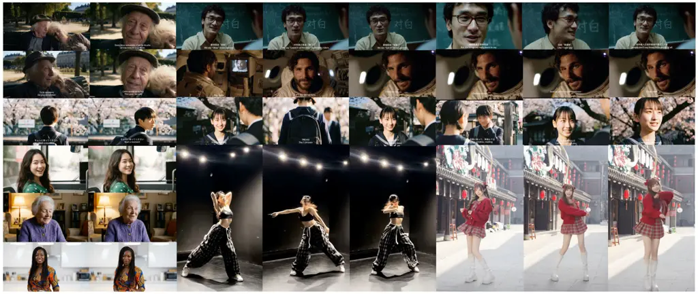
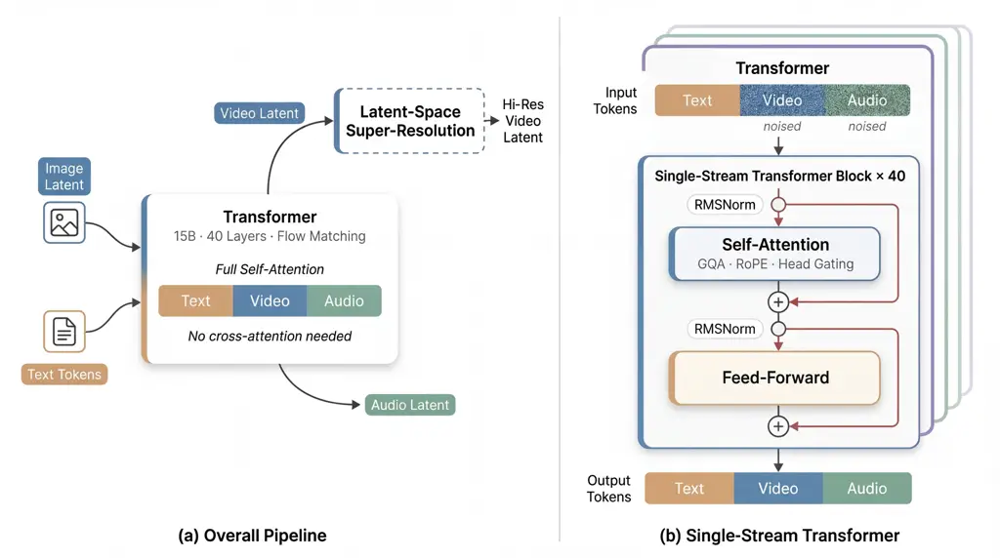

# Speed by Simplicity: A Single-Stream Architecture for Fast Audio-Video Generative Foundation Model

SII-GAIR   &   Sand.ai ^(†)^(†)thanks: Corresponding author: Pengfei Liu
\$⟨\$pengfei@sjtu.edu.cn\$⟩\$.^(†)^(†)thanks: Corresponding author: Yue
Cao \$⟨\$caoyue@sand.ai\$⟩\$.

###### Abstract

We present daVinci-MagiHuman, an open-source audio-video generative
foundation model for human-centric generation. daVinci-MagiHuman jointly
generates synchronized video and audio using a single-stream Transformer
that processes text, video, and audio within a unified token sequence
via self-attention only. This single-stream design avoids the complexity
of multi-stream or cross-attention architectures while remaining easy to
optimize with standard training and inference infrastructure. The model
is particularly strong in human-centric scenarios, producing expressive
facial performance, natural speech-expression coordination, realistic
body motion, and precise audio-video synchronization. It supports
multilingual spoken generation across Chinese (Mandarin and Cantonese),
English, Japanese, Korean, German, and French. For efficient inference,
we combine the single-stream backbone with model distillation,
latent-space super-resolution, and a Turbo VAE decoder, enabling
generation of a 5-second 256p video in 2 seconds on a single H100 GPU.
In automatic evaluation, daVinci-MagiHuman achieves the highest visual
quality and text alignment among leading open models, along with the
lowest word error rate (14.60%) for speech intelligibility. In pairwise
human evaluation, it achieves win rates of 80.0% against Ovi 1.1 and
60.9% against LTX 2.3 over 2,000 comparisons. We open-source the
complete model stack, including the base model, the distilled model, the
super-resolution model, and the inference codebase.

 

|     |
| --- |
|     |

Open Source:   [ Code](https://github.com/GAIR-NLP/daVinci-MagiHuman)
 [![[Uncaptioned
image]](arxiv-2603-21986--6a1db97728cb.figures/figure-1.webp)
Models](https://huggingface.co/GAIR/daVinci-MagiHuman)   [
Demo](https://huggingface.co/spaces/SII-GAIR/daVinci-MagiHuman)



Figure 1: Examples of videos generated by daVinci-MagiHuman

## 1 Introduction

Video generation has advanced rapidly in recent years, and the frontier
is now shifting from silent video synthesis to the joint generation of
synchronized video and audio. Although closed-source models such as Veo
3 (Google DeepMind, 2025), Sora 2 (OpenAI, 2025), and Kling 3.0
(Kuaishou Technology, 2026) have shown impressive capabilities,
open-source progress (e.g. Ovi (Low et al., 2025), LTX-2 (HaCohen et
al., 2026)) in this direction remains limited. In particular, it remains
challenging to build an open model that combines strong generation
quality, multilingual support, and inference efficiency with a simple
and scalable architecture.

In this report, we present daVinci-MagiHuman, an open-source audio-video
generation model built to address these challenges. While leading
open-source models HaCohen et al. (2026); Wan et al. (2025); Low et al.
(2025); Team et al. (2026) typically rely on heavily specialized
multi-stream designs, our model adopts a single-stream Transformer that
models text, video, and audio within a shared-weight backbone. This
design is simple at the model architectural level and easy to optimize
jointly with training and inference infrastructure, making it better
suited for future research and community development.

daVinci-MagiHuman is particularly strong in human-centric generation.
The model performs especially well in scenarios that require expressive
character acting, natural coordination between voice and facial
expression, realistic body movement, and accurate audio-video
synchronization. It also generalizes well across languages, delivering
strong performance in Chinese (Mandarin and Cantonese), English,
Japanese, Korean, German, and French, with support for additional
languages beyond these major ones.

daVinci-MagiHuman is also designed for fast inference. The single-stream
architecture is both hardware-friendly and infrastructure-friendly,
making inference optimization significantly easier. In addition, we
accelerate generation with latent-space super-resolution, which reduces
the computation required for high-resolution video generation. As a
result, our distilled model can generate a 5-second 256p video in 2
seconds and a 5-second 1080p video in 38 seconds on a single H100 GPU.
These results make the model suitable not only for offline content
creation, but also for latency-sensitive interactive applications.

To support future research and development, we fully open-source the
complete model stack, including the base model, the distilled model, the
super-resolution model, and the inference codebase. We hope this release
can provide the community with a practical and extensible foundation for
future work on audio-video generation.

Overall, daVinci-MagiHuman provides a strong open-source foundation for
audio-video generation by combining architectural simplicity, strong
human-centric quality, multilingual capability, and fast inference. Its
main highlights are as follows:

### Simple single-stream architecture

A single-stream Transformer for text, video, and audio, avoiding the
complexity of heavily specialized multi-stream architectures while
remaining easy to optimize together with training and inference
infrastructure.

### Strong human-centric generation quality

Particularly strong results in expressive human generation, including
natural emotion, speech-expression coordination, facial performance,
body motion, and audio-video synchronization.

### Broad multilingual capability

Strong spoken audio-video generation across multiple languages,
including Chinese (Mandarin and Cantonese), English, Japanese, Korean,
German, and French, with support for additional languages beyond these
major ones.

### Fast inference

Efficient generation enabled by the single-stream backbone, latent-space
super-resolution, and inference-level optimization.

### Fully open-source release

The complete model stack is released, including the diffusion model, the
super-resolution model, and the inference codebase.

## 2 Methodology



Figure 2: Overall architecture. (a) The base generator takes text
tokens, a reference image latent, and noisy video and audio tokens as
input, and jointly denoises the video and audio tokens with a
single-stream Transformer. All modalities are processed within a unified
token sequence using self-attention only, without separate
cross-attention or fusion modules. A latent-space super-resolution stage
can be further applied to refine the generated video at higher output
resolutions. (b) The single-stream Transformer adopts a sandwich
architecture layout: the first and last 4 layers use modality-specific
projections and normalization parameters, while the middle 32 layers
share the main Transformer parameters across modalities. Each block uses
per-head gating in attention, and the model contains no explicit
timestep embedding.

daVinci-MagiHuman is designed to balance architectural simplicity,
strong generation quality, and fast inference. To achieve this, we build
the model around several key design choices. In this section, we
describe the main techniques behind the system.

### Single-Stream Transformer

Recent open-source video generation models Wan et al. (2025); Kong et
al. (2024) commonly adopt dual-stream architectures, where tokens from
text and video are processed by partially separate branches and fused
through cross-attention or other dedicated modules.

In audio-video generation HaCohen et al. (2026); Low et al. (2025), this
design trend becomes even stronger, since the model must handle video
and audio signals with different temporal structures and semantic
patterns. As a result, many models adopt separate pathways for video and
audio, dedicated fusion blocks, or modality-specific alignment modules.
While such designs can be useful, they also make the overall
architecture substantially more complex. This added complexity creates
practical challenges beyond model design: multi-stream architectures
introduce more irregular computation patterns, making implementation and
optimization much harder in practice.

To address these issues, we adopt a single-stream Transformer
architecture. Instead of maintaining separate pathways for different
modalities, we represent text, video, and audio tokens within a shared
backbone and model them using a unified stack of self-attention layers.
This design keeps the architecture simple, reduces engineering
complexity, and is easier to optimize jointly at both the model and
infrastructure levels.

Figure 2(b) illustrates the core architecture. Our model uses a
15B-parameter, 40-layer single-stream Transformer backbone that jointly
denoises video and audio at every step. Several design choices are
central to its simplicity and effectiveness:

- •
  Sandwich Architecture Layout. The 40-layer Transformer is not fully
  homogeneous. The first and last 4 layers use modality-specific
  projections and RMSNorm parameters, while the middle 32 layers share
  the main Transformer parameters across modalities. This sandwich-style
  layout preserves modality-sensitive processing near the input and
  output boundaries while keeping most computation in a common
  representation space for deep multimodal fusion.
- •
  Timestep-Free Denoising. Unlike original DiT architectures (Peebles
  and Xie, 2023) that inject diffusion timestep information through
  explicit timestep embeddings or AdaLN conditioning, our denoiser
  contains no dedicated timestep pathway. Following recent observations
  in (Sun et al., 2025; Tang et al., 2025), the model receives the
  current noisy video and audio latents and infers the denoising state
  directly from the inputs themselves.
- •
  Per-Head Gating. In each attention block, we follow the recent
  practice in large language models (LLMs) Qiu et al. (2025) of
  introducing an additional scalar gate for every attention head and use
  a sigmoid to modulate the attention output before the output
  projection. Concretely, if $`o_{h}`$ denotes the output of the
  $`h`$-th attention head and $`g_{h}`$ is the corresponding learned
  gate, the gated output is

  ```math
  \tilde{o}_{h}=\sigma(g_{h})\,o_{h},
  ```

  This mechanism is introduced to improve numerical stability during
  training and to enhance model representability, while adding only
  minimal architectural overhead.

- •
  Unified Conditioning Without Extra Modules. We handle denoising and
  reference signals with a minimal unified interface rather than
  introducing dedicated conditioning branches. Denoising video and audio
  tokens, together with text and optional image conditions, are all
  represented in the same latent/token space and processed by the same
  model. This design allows us to support multiple conditioning and
  generation settings with a simple shared architecture instead of
  task-specific fusion modules.

### Efficient Inference Techniques

Beyond the single-stream backbone itself, we improve inference
efficiency with several complementary techniques: latent-space
super-resolution, a turbo video decoder, full-graph compilation and
distillation.

- •
  Latent-Space Super-Resolution. Directly generating high-resolution
  video from scratch remains expensive because the video token count
  grows quickly with spatial resolution. To reduce this cost, we adopt a
  two-stage pipeline: the base model first generates video and audio
  latents at a lower base resolution, and a super-resolution stage then
  refines the result at higher resolution. We perform this refinement in
  latent space rather than pixel space because it stays aligned with the
  native diffusion representation, reuses the same overall backbone
  architecture, and avoids an extra VAE decode-and-encode round trip.
  Concretely, we upsample the video latent with trilinear interpolation,
  inject additional noise, and refine it with only 5 extra denoising
  steps using a dedicated super-resolution checkpoint. In the 1080p
  setting, the super-resolution model additionally enables local
  attention in many layers to control high-resolution attention cost.
  Although the stage is primarily designed to improve the video output,
  it still takes audio latent tokens as input and predicts video and
  audio jointly within the same backbone. In practice, only the video
  latent is explicitly updated during the super-resolution sampling
  step, while the audio latent from the base stage is reused in a noised
  form as auxiliary input. This design keeps the refinement process
  coupled to the audio signal, which is especially useful when the
  base-resolution video is very coarse and lip synchronization would
  otherwise be harder to preserve.
- •
  Turbo VAE Decoder. We use Wan2.2 VAE (Wan Team, 2025) for encoding
  because of its high spatial-temporal compression ratio, while
  replacing the original video decoder at inference time with a
  lightweight re-trained Turbo VAE decoder Zou et al. (2026). This
  substantially reduces decoding overhead and is important because
  decoding lies on the critical path of both the base generator and the
  super-resolution pipeline.
- •
  Full-Graph Compilation. We further integrate
  [MagiCompiler](https://github.com/SandAI-org/MagiCompiler), our
  full-graph PyTorch compiler, into the inference stack. By fusing
  operators across Transformer layer boundaries and consolidating
  distributed communication into fewer collective calls, it provides
  around 1.2$`\times`$ speedup on H100.
- •
  Distillation. To reduce cost in inference, we apply DMD-2 Yin et
  al. (2024) to distill the base generator. As a result, the distilled
  model can generate with only 8 denoising steps without CFG, while
  maintaining strong generation quality. Unless otherwise specified, the
  latency numbers reported in Section 3 use this distilled model.

## 3 Evaluation

We compare daVinci-MagiHuman with two leading open-source baselines, Ovi
1.1 Low et al. (2025) and LTX 2.3 HaCohen et al. (2026). Our evaluation
covers three aspects: automatic quality metrics, pairwise human
preference, and inference efficiency.

|                   |                             |                             |                                   |                     |
| ----------------- | --------------------------- | --------------------------- | --------------------------------- | ------------------- |
|                   | Video Quality Score         |                             |                                   | Audio Quality Score |
| Model             | Visual Quality $`\uparrow`$ | Text Alignment $`\uparrow`$ | Physical Consistency $`\uparrow`$ | WER $`\downarrow`$  |
| OVI 1.1           | 4.73                        | 4.10                        | 4.41                              | 40.45%              |
| LTX 2.3           | 4.76                        | 4.12                        | 4.56                              | 19.23%              |
| daVinci-MagiHuman | 4.80                        | 4.18                        | 4.52                              | 14.60%              |

Table 1: Quantitative Analysis of Ovi-1.1, LTX-2.3, and
daVinci-MagiHuman.

### Quantitative Quality Benchmark

We first report quantitative quality results against Ovi 1.1 and LTX
2.3. For video quality, we evaluate on VerseBench Wang et al. (2025) and
adopt VideoScore2 He et al. (2025) to measure visual quality, text
alignment, and physical consistency. For audio quality, we evaluate
speech intelligibility on TalkVid-Bench (Chen et al., 2025) using word
error rate (WER), where lower is better. All generated audio is
transcribed by GLM-ASR (Z.AI, 2025). For CJK languages, we compute WER
at the character level to avoid inconsistencies from word segmentation.

As shown in Table 1, daVinci-MagiHuman achieves the best visual quality
and text alignment scores among the compared models, while also
obtaining the lowest WER of 14.60%. This substantially outperforms Ovi
1.1 (40.45%) and also improves over LTX 2.3 (19.23%). LTX 2.3 performs
best on physical consistency, but daVinci-MagiHuman remains competitive
on this metric and achieves the strongest overall balance across visual
and audio quality.

|            |      |      |        |       |
| ---------- | ---- | ---- | ------ | ----- |
| Resolution | Base | SR   | Decode | Total |
| 256p       | 1.6  | –    | 0.4    | 2.0   |
| 540p       | 1.6  | 5.1  | 1.3    | 8.0   |
| 1080p      | 1.6  | 31.0 | 5.8    | 38.4  |

Table 2: Time breakdown (in seconds) for generating a 5-second video at
different resolutions. All results are measured on a single H100 GPU.
The base stage uses the distilled model, and all decode times are
measured with the Turbo VAE decoder.

### Human Evaluation

We further conduct a pairwise human evaluation against two open-source
audio-video models: Ovi 1.1 Low et al. (2025) and LTX 2.3 HaCohen et al.
(2026). A total of 10 human raters each judge 200 randomized pairs,
including 100 comparisons against each competitor, for a total of 2,000
comparisons. Raters select the preferred clip or declare a tie based on
overall audio-video quality, synchronization, and naturalness.

Figure 3: Human evaluation results. Pairwise preference rates of
daVinci-MagiHuman against two open-source audio-video generation models,
aggregated over 10 raters and 2,000 comparisons.

As shown in Figure 3, daVinci-MagiHuman is consistently preferred over
both baselines, achieving win rates of 80.0% against Ovi 1.1 and 60.9%
against LTX 2.3. The corresponding opponent win rates are 11.8% and
21.9%, with tie rates of 8.2% and 17.2%, respectively. Overall, these
results indicate a clear human preference for daVinci-MagiHuman across
the tested pairwise comparisons.

### Inference Efficiency

We finally evaluate inference efficiency from the end-to-end latency
perspective. Table 2 provides a stage-wise breakdown on a single H100
GPU. In these measurements, the base stage always runs at 256p using the
distilled model, while higher output resolutions are obtained through
the super-resolution stage and decoding is performed with the Turbo VAE
decoder. As a result, the base-stage latency remains constant across
output resolutions, and the additional cost at higher resolutions is
dominated by super-resolution and decoding. Even so, the entire pipeline
takes only 38.4 seconds to produce a 5-second 1080p video.

## References

- Chen et al. (2025) S. Chen, H. Huang, Y. Liu, Z. Ye, P. Chen, C.
  Zhu, M. Guan, R. Wang, J. Chen, G. Li, S. Lim, H. Yang, and B. Wang
  TalkVid: a large-scale diversified dataset for audio-driven talking
  head synthesis. External Links: 2508.13618,
  [Link](https://arxiv.org/abs/2508.13618) Cited by: §3.
- Google DeepMind (2025) Google DeepMind Veo 3 technical report.
  Technical report External Links:
  [Link](https://storage.googleapis.com/deepmind-media/veo/Veo-3-Tech-Report.pdf)
  Cited by: §1.
- HaCohen et al. (2026) Y. HaCohen, B. Brazowski, N. Chiprut, Y.
  Bitterman, A. Kvochko, A. Berkowitz, D. Shalem, D. Lifschitz, D.
  Moshe, E. Porat, et al. LTX-2: efficient joint audio-visual foundation
  model. arXiv preprint arXiv:2601.03233. Cited by: §1, §1, §2, §3, §3.
- He et al. (2025) X. He, D. Jiang, P. Nie, M. Liu, Z. Jiang, M. Su, W.
  Ma, J. Lin, C. Ye, Y. Lu, et al. Videoscore2: think before you score
  in generative video evaluation. arXiv preprint arXiv:2509.22799. Cited
  by: §3.
- Kong et al. (2024) W. Kong, Q. Tian, Z. Zhang, R. Min, Z. Dai, J.
  Zhou, J. Xiong, X. Li, B. Wu, J. Zhang, et al. Hunyuanvideo: a
  systematic framework for large video generative models. arXiv preprint
  arXiv:2412.03603. Cited by: §2.
- Kuaishou Technology (2026) Kuaishou TechnologyKling 3.0(Website) Note:
  AI video and audio generation model External Links:
  [Link](https://klingai.com/cn/) Cited by: §1.
- Low et al. (2025) C. Low, W. Wang, and C. Katyal Ovi: twin backbone
  cross-modal fusion for audio-video generation. arXiv preprint
  arXiv:2510.01284. Cited by: §1, §1, §2, §3, §3.
- OpenAI (2025) OpenAISora 2 is here(Website) External Links:
  [Link](https://openai.com/index/sora-2/) Cited by: §1.
- Peebles and Xie (2023) W. Peebles and S. Xie Scalable diffusion models
  with transformers. In Proceedings of the IEEE/CVF international
  conference on computer vision, pp. 4195–4205. Cited by: 2nd item.
- Qiu et al. (2025) Z. Qiu, Z. Wang, B. Zheng, Z. Huang, K. Wen, S.
  Yang, R. Men, L. Yu, F. Huang, S. Huang, et al. Gated attention for
  large language models: non-linearity, sparsity, and
  attention-sink-free. arXiv preprint arXiv:2505.06708. Cited by: 3rd
  item.
- Sun et al. (2025) Q. Sun, Z. Jiang, H. Zhao, and K. He Is noise
  conditioning necessary for denoising generative models?. arXiv
  preprint arXiv:2502.13129. Cited by: 2nd item.
- Tang et al. (2025) B. Tang, B. Zheng, S. Paul, and S. Xie Exploring
  the deep fusion of large language models and diffusion transformers
  for text-to-image synthesis. In Proceedings of the Computer Vision and
  Pattern Recognition Conference, pp. 28586–28595. Cited by: 2nd item.
- Team et al. (2026) O. Team, D. Yu, M. Chen, Q. Chen, Q. Luo, Q. Wu, Q.
  Cheng, R. Li, T. Liang, W. Zhang, et al. MOVA: towards scalable and
  synchronized video-audio generation. arXiv preprint arXiv:2602.08794.
  Cited by: §1.
- Wan et al. (2025) T. Wan, A. Wang, B. Ai, B. Wen, C. Mao, C. Xie, D.
  Chen, F. Yu, H. Zhao, J. Yang, et al. Wan: open and advanced
  large-scale video generative models. arXiv preprint arXiv:2503.20314.
  Cited by: §1, §2.
- Wan Team (2025) Wan TeamWan2.2: more powerful, more beautiful(Website)
  External Links: [Link](https://wan.video/blog/wan2.2) Cited by: 2nd
  item.
- Wang et al. (2025) D. Wang, W. Zuo, A. Li, L. Chen, X. Liao, D.
  Zhou, Z. Yin, X. Dai, D. Jiang, and G. Yu UniVerse-1: unified
  audio-video generation via stitching of experts. arXiv preprint
  arXiv:2509.06155. Cited by: §3.
- Yin et al. (2024) T. Yin, M. Gharbi, T. Park, R. Zhang, E.
  Shechtman, F. Durand, and W. T. Freeman Improved distribution matching
  distillation for fast image synthesis. Advances in neural information
  processing systems 37, pp. 47455–47487. Cited by: 4th item.
- Z.AI (2025) Z.AI GLM-asr: glm-asr-nano-2512. Note:
  [https://github.com/zai-org/GLM-ASR](https://github.com/zai-org/GLM-ASR)GitHub
  repository, accessed 2026-03-22 Cited by: §3.
- Zou et al. (2026) Y. Zou, J. Yao, S. Yu, S. Zhang, W. Liu, and X. Wang
  Turbo-vaed: fast and stable transfer of video-vaes to mobile devices.
  In Proceedings of the AAAI Conference on Artificial Intelligence, Vol.
  40, pp. 14086–14094. Cited by: 2nd item.

## Appendix A Authors

The authors are listed in alphabetical order, excluding the project
leaders.

Ethan Chern  
Hansi Teng  
Hanwen Sun  
Hao Wang  
Hong Pan  
Hongyu Jia  
Jiadi Su  
Jin Li  
Junjie Yu  
Lijie Liu  
Lingzhi Li  
Lyumanshan Ye  
Min Hu  
Pengfei Liu  
Qiangang Wang  
Quanwei Qi  
Steffi Chern  
Tao Bu  
Taoran Wang  
Teren Xu  
Tianning Zhang  
Tiantian Mi  
Weixian Xu  
Wenqiang Zhang  
Wentai Zhang  
Xianping Yi  
Xiaojie Cai  
Xiaoyang Kang  
Yan Ma  
Yixiu Liu  
Yue Cao  
Yunbo Zhang  
Yunpeng Huang  
Yutong Lin  
Zewei Tao  
Zhaoliang Liu  
Zheng Zhang  
Zhiyao Cen  
Zhixuan Yu  
Zhongshu Wang  
Zhulin Hu  
Zijin Zhou  
Zinan Guo

Project Leader  
Yue Cao, Pengfei Liu
