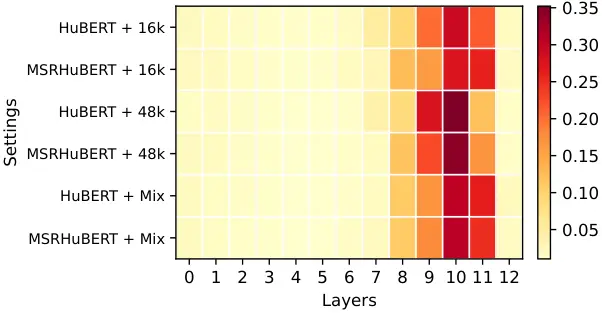

Huang Ge Wang Li Wang Wang Dang

# MSR-HuBERT: Self-supervised Pre-training for Adaptation to Multiple Sampling Rates

Zikang    Meng    Tianrui    Xuanchen    Xiaobao    Longbiao    Jianwu

###### Abstract

Self-supervised learning (SSL) has advanced speech processing. However,
existing speech SSL methods typically assume a single sampling rate and
struggle with mixed-rate data due to temporal resolution mismatch. To
address this limitation, we propose MSRHuBERT, a multi-sampling-rate
adaptive pre-training method. Building on HuBERT, we replace its
single-rate downsampling CNN with a multi-sampling-rate adaptive
downsampling CNN that maps raw waveforms from different sampling rates
to a shared temporal resolution without resampling. This design enables
unified mixed-rate pre-training and fine-tuning. In experiments spanning
16 to 48 kHz, MSRHuBERT outperforms HuBERT on speech recognition and
full-band speech reconstruction, preserving high-frequency detail while
modeling low-frequency semantic structure. Moreover, MSRHuBERT retains
HuBERT’s mask-prediction objective and Transformer encoder, so existing
analyses and improvements that were developed for HuBERT can apply
directly.

###### keywords

self-supervised learning, sampling-rate adaptation, speech
reconstruction, speech recognition, fine-tuning

^(†)^(†)address: ¹Tianjin Key Laboratory of Cognitive Computing and
Application, Tianjin University, China  
²Huiyan Technology Company, Ltd., China  
³Chinese Academy of Sciences, China ^(†)^(†)email:
huangzikang@tju.edu.cn

## 1 Introduction

Self-supervised learning (SSL) has enabled major advances in natural
language processing and computer vision \[1, 2\]. In speech, SSL has
emerged as a leading approach for learning powerful speech
representations by pre-training on large unlabeled corpora using
objectives that derive supervision from the signal itself rather than
from human annotations \[3, 4, 5, 6\]. After pre-training, these models
act as representation extractors and are fine‑tuned on labeled data for
downstream tasks such as automatic speech recognition (ASR) \[7, 8, 9\].

Mainstream speech SSL models (e.g., wav2vec 2.0, HuBERT, and WavLM)
adopt a common design: a convolutional encoder compresses the raw
waveform into frame‑level features with a fixed 20 ms frame shift, which
serve as the basic units for pre-training and are realized by a 320×
temporal downsampling for 16 kHz audio \[10, 11, 12\]. Consequently,
these models are effectively tied to 16 kHz. For other sampling rates,
the extracted frame-level features’ frame shift and temporal resolution
no longer match the expected 20 ms. This resolution mismatch leads the
models to fail to function correctly during both pre-training and
fine-tuning. We refer to this issue as the resolution mismatch problem,
as illustrated in Fig. 1. The problem prevents direct use of non‑16 kHz
audio in pre-training, reduces data diversity, and limits applicability
to downstream tasks that operate at other sampling rates \[13, 14, 15\].
Addressing sampling‑rate compatibility is therefore crucial for robust
and widely usable speech SSL. To our knowledge, this work represents a
pioneering effort to explicitly explore solutions to this resolution
mismatch in speech SSL.

Figure 1: The resolution mismatch across diverse sampling rates with a
fixed 320× downsampling CNN.

Simple remedies are unsatisfactory: training separate models per
sampling rate is costly, and resampling high‑rate audio to 16 kHz
discards high‑frequency information that is useful for downstream
performance \[16\]. Frequency‑domain techniques (e.g., subband
decomposition or fixed‑duration STFTs) can achieve sampling‑rate
independence in speech enhancement \[17, 18\], but they do not integrate
naturally into existing SSL pipelines without disrupting the original
paradigm, because most speech SSL models operate on the time-domain, and
the few studies on frequency-domain adaptation target improving training
efficiency rather than performance \[19\].

In this paper, we propose MSRHuBERT, a multi-sampling-rate adaptive
pre-training method. By introducing a multi-sampling-rate adaptive
downsampling convolutional feature extractor, routing audio of different
sampling rates through a convolutional encoder with rate-specific
downsampling, it maps inputs to frame-level features on a common
temporal resolution, thereby alleviating the resolution mismatch
problem. Meanwhile, we retain the standard SSL paradigm, the training
objective and architecture. We implement our design on a HuBERT backbone
and conduct pre-training and downstream fine-tuning on datasets sampled
at multiple rates. Results show our approach achieves comparable
performance on the ASR task that depends on low‑frequency signal
content, while improving performance on the full‑band speech
reconstruction task that relies on high‑frequency information. Moreover,
because we retain the original SSL objective and architecture,
improvements developed for HuBERT can be incorporated into our method to
yield further gains. Finally, as the first work to explicitly mitigate
multi‑sampling‑rate resolution mismatch in speech SSL, we empirically
quantify the severe degradation that mismatch induces on ASR and speech
reconstruction. Our main contributions are: (1) MSRHuBERT, a speech SSL
framework adaptive for multiple sampling rates, including a
multi‑sampling‑rate adaptive downsampling convolutional extractor that
avoids resolution mismatch while preserving the core SSL paradigm; (2)
empirical evidence across multiple sampling rates that the learned
representations by our method retain low‑frequency content that is
important for ASR while also capturing high‑frequency details beneficial
for reconstruction; (3) the first identification and formalization of
the resolution mismatch problem in speech SSL.

## 2 HuBERT

HuBERT \[11\] is a typical speech SSL framework. It benefits from an
offline clustering (e.g., k-means) to generate frame-level pseudo labels
$`U=[u_{1},u_{2},...,u_{T}]`$, where $`T`$ is the number of speech
frames. A fixed 320x downsampling convolutional neural network (CNN)
$`F(\text{\textperiodcentered})`$ converts 16 kHz speech
$`s_{16\text{k}}`$ into the frame-level feature
$`H=[h_{1},h_{2},...,h_{T}]`$ with a frame shift of 20 ms, which is then
fed to a Transformer encoder $`G(\text{\textperiodcentered})`$ to get
the contextual representation $`C=[c_{1},c_{2},...,c_{T}]`$. During
pre-training, the frame-level features $`H`$ are masked randomly before
they are passed to the Transformer encoder. The whole pipeline can be
formalized as

```math
C=[c_{1},c_{2},...,c_{T}]=G(M(F(s_{16\text{k}})))\text{,} \tag{1}
```

where $`M(\text{\textperiodcentered})`$ is the mask operation on
frame-level features. Finally, the model is trained to predict the
pseudo labels of the masked frames using a cross-entropy (CE) loss
function

```math
\mathcal{L}_{CE}(C,U)=-\sum_{t\in O}\log p(u_{t}|c_{t})\text{,} \tag{2}
```

where $`O`$ denotes the set of indices masked in $`H`$. Note that, when
applied to downstream tasks, $`H`$ is no longer masked and the obtained
unmasked contextual representation $`C`$ is used.

## 3 Proposed Method

Fig. 2 illustrates the overall architecture of MSRHuBERT. MSRHuBERT is a
speech SSL framework that processes speech sampled at multiple sampling
rates and is explicitly designed to resolve the resolution mismatch
problem. Given speeches at diverse sampling rates, the model maps them
to a common temporal resolution and performs mixed‑rate pre-training
using a shared codebook. MSRHuBERT departs from HuBERT in a principal
respect: a multi‑sampling‑rate adaptive downsampling CNN, which aligns
frame‑level features across sampling rates, enabling direct pre-training
on raw multi‑rate waveforms while preserving the intended 20 ms frame
shift, modeling both low- and high-frequency information.

Figure 2: The architecture of MSRHuBERT, which takes raw waveforms at
different sampling rates as input. The multi-sampling-rate adaptive
downsampling CNN can map waveforms to a common temporal resolution by
designing rate-specific downsampling, and supports mixed-rate
pre-training.

### 3.1 Multi‑sampling‑rate Adaptive Downsampling CNN

The multi‑sampling‑rate adaptive downsampling CNN is designed to
compress speech signals recorded at different sampling rates into
frame‑level features that share a common temporal resolution without
resampling, thereby tackling the resolution mismatch problem while
preserving high‑frequency information. Specifically, given an input
waveform $`s_{a\text{k}}`$ sampled at $`a`$ kHz, the model routes it to
a rate-specific downsampling CNN $`F_{dr}(\text{\textperiodcentered})`$
with downsampling ratio $`dr`$ so that the resulting frame‑level
features match HuBERT’s temporal convention of 20 ms frame shift.
Inspired by \[20\], we append a layer normalization after each
downsampling CNN, which removes feature aggregation inconsistency across
rate-specific CNNs and maps all extracted features into a shared feature
space by normalizing mean and variance independently per branch \[21\].

```math
H=[h_{1},h_{2},\ldots,h_{T}]=\mathrm{LN}_{dr}\big(F_{dr}(s_{a\text{k}})\big), \tag{3}
```

where $`\mathrm{LN}_{dr}`$ denotes layer normalizing attached to
$`F_{dr}`$, and downsampling ratio $`dr=a\text{k}\times 0.02`$, achieved
through carefully designing the stride and kernel width of each
$`F_{dr}`$ (detailed in Table 1). This design ensures that all sampling
rates are aligned to the same temporal resolution before being fed to
the shared Transformer encoder.

Compared to HuBERT, the adaptive downsampling CNN enables direct
processing of raw high‑sampling-rate speech without resampling, thereby
preserving high‑frequency information, increasing the diversity of
pre-training data, and extending applicability to downstream tasks
operating at multiple sampling rates. Because the extracted features all
share the standard temporal scale and lie in a unified feature space,
the following mask prediction and Transformer encoder can be retained.

### 3.2 Mixed-rate Mask Prediction via Single Codebook

Because the multi‑sampling‑rate adaptive downsampling CNN maps inputs
from different sampling rates to frame‑level features on a common
temporal grid. This unified temporal scale enables the subsequent use of
a shared Transformer encoder and a single shared codebook for consistent
contextual modeling. This unified formulation preserves the original
training paradigm while allowing the model to exploit the greater
diversity of multi‑rate pre-training data. Furthermore, this design
ensures training efficiency, minimizes additional model parameters, and
facilitates the effective extraction of robust speech representations.
Concretely, mask prediction is performed on features with a 20 ms frame
shift, a convention used in prior work to yield effective speech
representations. Following the HuBERT paradigm, the frame-level
features, produced by the adaptive downsampling branch, are masked
randomly and passed to a shared Transformer encoder whose contextual
outputs are trained to predict offline clustering pseudo labels, as

```math
\mathcal{L}=-\frac{1}{T}\sum_{t\in O}\log\frac{\text{exp}(\text{sim}(Ac_{t},e_{u})/\tau)}{{\textstyle\sum_{u^{\prime}}^{U}\text{exp}(\text{sim}(Ac_{t},e_{u^{\prime}})/\tau)}} \tag{4}
```

where $`A`$ is a projection matrix, $`e_{u}`$ is the embedding for
pseudo label $`u`$ of frame $`t`$, $`T`$ is the number of masked frames,
and $`\tau`$ scales the logit which is set to 0.1.

This mixed‑rate single shared codebook training enables the model to
absorb low‑ and high‑frequency cues present across different sampling
rates, and constrain extracted contextual representations from diverse
rates to lie in a common feature space, yielding rate‑invariant
representations that simplify fine‑tuning on mixed‑rate downstream
tasks.

## 4 Experiments

### 4.1 Pre-training Setup

For multi‑sampling‑rate pre-training, we retain the 960‑hour LibriSpeech
corpus \[22\] at 16 kHz used by HuBERT Base to ensure a fair comparison.
For the other sampling rates we use the clean subset of the DNS
Challenge 2022 dataset \[23\], originally recorded at 48 kHz. This
subset is uniformly resampled to 22.05 kHz, 24 kHz and 48 kHz, producing
roughly 193 hours of speech for each rate.

All pre-training experiments are implemented using the Fairseq toolkit
\[24\]. We train all models from random initialization \[25\] for 400k
steps on four 24GB NVIDIA 4090D GPUs, using a batch size of 87.5 seconds
of audio per GPU and eight times gradient accumulation to match HuBERT’s
effective batch configuration. During pre-training, we control same
sampling-rate in each batch but mix batches from different
sampling-rates within each update because of distributed training and
gradient accumulation, allowing efficient learning from diverse data
with minimal extra forward computation. Regarding parameters, our
proposed CNN branches contribute little to the parameter count, which is
mainly from the Transformer Encoder. Quantitatively, adding one sampling
rate increases parameters by only 3%, and the time cost of mixed
training with 4 rates is just 2.6% longer than single-rate training.
Other hyperparameters for the model are kept the same as in \[11\]. We
use the HuBERT base as the baseline and backbone model, and the
architecture of our proposed multi‑sampling‑rate adaptive downsampling
CNN is shown in Table 1. Note that HuBERT Base baseline is pre-trained
for one sampling rate using the corresponding single-rate CNN.

### 4.2 Fine-tuning Setup

To evaluate the generality of representations learned by MSRHuBERT
across different sampling rates, we perform fine‑tuning experiments
under the SUPERB evaluation protocol \[26\]. In this protocol, the
pre-trained model is kept frozen and only the lightweight downstream
module is learnable.

| Sampling Rate | Strides                | Kernel width            |
| ------------- | ---------------------- | ----------------------- |
| 16 kHz        | 5, 2, 2, 2, 2, 2, 2    | 10, 3, 3, 3, 3, 2, 2    |
| 22.05 kHz     | 7, 7, 3, 3             | 19, 14, 4, 3            |
| 24 kHz        | 5, 3, 2, 2, 2, 2, 2    | 10, 5, 3, 3, 3, 2, 2    |
| 48 kHz        | 5, 3, 2, 2, 2, 2, 2, 2 | 10, 5, 3, 3, 3, 3, 2, 2 |

Table 1: Architecture design for proposed multi-sampling-rate adaptive
downsampling CNN. For the CNN branch of each sampling rate, the stride
and kernel width is determined based on the calculation formulas for the
downsampling rate, stride, and kernel width, as well as the prime factor
decomposition.

|                                  |            |           |        |        |                                       |           |        |        |                      |           |        |        |
| -------------------------------- | ---------- | --------- | ------ | ------ | ------------------------------------- | --------- | ------ | ------ | -------------------- | --------- | ------ | ------ |
| Model                            | ASR (WER↓) |           |        |        |                                       |           |        |        | Full-band SR (STOI↑) |           |        |        |
|                                  | 16k Hz     | 22.05k Hz | 24k Hz | 48k Hz | four sampling rates mixed fine-tuning |           |        |        | 16k Hz               | 22.05k Hz | 24k Hz | 48k Hz |
|                                  |            |           |        |        | 16 kHz                                | 22.05 kHz | 24 kHz | 48 kHz |                      |           |        |        |
| HuBERT Base                      | 6.41       | 3.34      | 6.84   | 5.96   | 7.42                                  | 3.35      | 7.61   | 6.63   | 88.46                | 93.04     | 88.52  | 81.42  |
| Re. 16kHz HuBERT Base            | 6.03       | 3.15      | 6.59   | 5.61   | 6.89                                  | 2.95      | 6.97   | 5.53   | 89.35                | 93.46     | 88.49  | 82.49  |
| \- w/o resampling in fine-tuning | 6.03       | 4.47      | 15.61  | 38.18  | 7.69                                  | 3.72      | 10.30  | 33.72  | 89.35                | 91.84     | 86.71  | 75.53  |
| Re. 24kHz HuBERT Base            | 6.15       | 3.28      | 6.54   | 5.70   | 6.95                                  | 3.02      | 7.24   | 5.74   | 89.61                | 94.32     | 89.34  | 83.75  |
| Re. 48kHz HuBERT Base            | 6.37       | 3.41      | 6.72   | 5.95   | 7.28                                  | 3.29      | 7.45   | 6.11   | 89.75                | 94.08     | 89.07  | 85.93  |
| MSRHuBERT                        | 5.89       | 3.35      | 6.35   | 5.83   | 6.54                                  | 2.90      | 6.82   | 5.56   | 90.26                | 94.38     | 89.25  | 85.79  |

Table 2: The comprehensive results for ASR and SR downstream tasks using
different pre-trained models.

For each sampling rate, we select a corresponding dataset:
train-clean-100 and test-clean subsets of LibriSpeech for 16 kHz \[22\],
LJSpeech for 22.05 kHz \[27\], train-clean-100 and test-clean subsets of
LibriTTS for 24 kHz \[28\], and VCTK for 48 kHz \[29\]. We evaluate two
downstream tasks that emphasize complementary spectral information:
automatic speech recognition (ASR), which primarily depends on
low‑frequency content, and full‑band speech reconstruction (SR), which
additionally requires high‑frequency detail. For the speech
reconstruction task, we adapt the original HiFi‑GAN vocoder \[30\]: the
vocoder utilizes the representation produced by the frozen pre‑trained
model and reconstructs the waveform \[31, 32\]. To ensure a fair
comparison across pre‑trained models, the downstream architectures and
hyperparameters are identical for each evaluated model.

### 4.3 Evaluation on SR and ASR

To evaluate MSRHuBERT’s applicability across sampling rates, we compare
five pre-training configurations: 1) HuBERT Base: Pre-trained only on
the 960‑hour LibriSpeech at 16 kHz; 2) Resampled 16k HuBERT Base:
Pre-trained on the full multi‑rate pre-training datasets after
resampling all speech to 16 kHz; 3) Resampled 24k HuBERT Base:
Pre-trained on the full multi‑rate pre-training datasets after
resampling all speech to 24 kHz; 4) Resampled 48k HuBERT Base:
Pre-trained on the full multi‑rate pre-training datasets after
resampling all speech to 48 kHz; 5) MSRHuBERT: Pre-trained on the full
datasets without resampling using our proposed architecture. During
downstream fine‑tuning and evaluation, we resample each downstream
dataset to the sampling rate expected by the pre-trained model so that
frame‑level temporal resolution aligns with the pre-training convention
and the resolution mismatch is avoided. To directly quantify the cost of
violating this assumption, we additionally conduct experiments in which
the downstream dataset is not resampled.

Table 2 presents comprehensive results for ASR and SR downstream tasks
using different pre-trained models. From these results we draw four main
observations: 1) The performance of the HuBERT depends systematically on
the sampling rate used during pre-training. Models pre-trained at 16 kHz
implicitly focus on low‑frequency semantic cues and consequently achieve
stronger ASR performance, whereas models pre-trained at 48 kHz retain
high‑frequency detail and therefore perform better on full‑band speech
reconstruction, but the additional high‑frequency information interferes
with the model’s ability to concentrate on low‑frequency semantic
structure, degrading ASR. 2) Our MSRHuBERT, by design, directly adapts
to different sampling rates without resampling. As a result, it
preserves high‑frequency information that benefits reconstruction tasks
while still maintaining effective modeling of low‑frequency semantic
content required by ASR. 3) Because the ASR training objective is the
sampling‑rate invariant transcription text, we also conduct a mixed-rate
fine-tuning experiment, and our method exhibits promising performance.
This empirical result supports the feasibility of mixed‑rate training
for tasks whose labels are independent of sampling rate. 4) When the
resolution mismatch exists between the sampling rate used for
pre-training and the rate used for fine‑tuning, the convention learned
during pre-training is violated and performance degrades. In addition,
degradation increases with the magnitude of the sampling rate
discrepancy.

### 4.4 Exploration for Learning Paradigm

Architecturally, MSRHuBERT retains HuBERT’s core learning paradigm: mask
prediction objective and the Transformer encoder remain unchanged. Based
on the essence of the problem, we address the resolution mismatch
problem by replacing the fixed single‑rate CNN with a
multi‑sampling‑rate adaptive downsampling CNN that operates directly on
time‑domain waveforms. As a result, existing layer‑wise analyses \[33\]
and improvements developed for HuBERT can be transferred to MSRHuBERT
with minimal modification. We verify this viewpoint both qualitatively
and quantitatively.



Figure 3: Weight analysis on the ASR task of the SUPERB Benchmark. Layer
0 corresponds to the input of the first Transformer layer. The y-axis
represents different settings, including pre-trained model and sampling
rate of the downstream dataset in ASR.

Following the SUPERB policies, we apply a weighted sum to the hidden
states of different layers and feed it to the task-specific layers.
Fig. 3 shows the weights of different layers of HuBERT and MSRHuBERT
models on the ASR task. The larger weight indicates the greater
contribution of the corresponding layer. The two models exhibit
qualitatively similar weight distributions, with dominant contributions
arising from the same middle-to-upper layer region \[12\]. This
correspondence indicates that MSRHuBERT sustains the layer-wise
representational structure that HuBERT relies on.

| Model                             | ASR (WER↓) |           |        |        |
| --------------------------------- | ---------- | --------- | ------ | ------ |
|                                   | 16k Hz     | 22.05k Hz | 24k Hz | 48k Hz |
| Re. 16kHz HuBERT Base             | 6.03       | 3.15      | 6.59   | 5.61   |
| MSRHuBERT                         | 5.89       | 3.35      | 6.35   | 5.83   |
| \+ Intermediate Layer Supervision | 5.56       | 3.17      | 6.16   | 5.67   |
| \+ Progressive Decoupling         | 5.63       | 3.30      | 5.94   | 5.52   |

Table 3: The result of MSRHuBERT with adaptation of intermediate layer
supervision and progressive decoupling in downstream fine-tuning ASR
task.

To validate compatibility with existing methods for HuBERT, we introduce
two representative enhancements, intermediate layer supervision \[34\]
and progressive decoupling \[35\], developed for HuBERT to MSRHuBERT and
evaluate their effects. Table 3 reports the fine‑tuning ASR results:
both improvements yield additional performance gains when applied to
MSRHuBERT. These quantitative results confirm that MSRHuBERT retains
HuBERT’s training paradigm and therefore benefits from prior advances,
demonstrating practical transferability and generalization across
sampling rates. Moreover, our approach can be easily adapted to other
sampling‑rate scenarios, such as 32 kHz or 44.1 kHz, with minimal
modifications to the multi‑sampling‑rate adaptive downsampling CNN
architecture. Specifically, we choose a downsampling factor matched to
each input sampling rate so that all waveforms are compressed to a
common temporal resolution prior to subsequent processing.

## 5 Conclusion

This paper proposes the resolution mismatch problem for speech SSL
across diverse sampling rates and presents MSRHuBERT to mitigate this
issue, using a self-supervised pre-training framework that introduces a
multi-sampling-rate adaptive downsampling CNN without resampling and
holds the core learning paradigm. A series of experiments have been
carried out to show that our method preserves high-frequency detail and
maintains effective modeling of low-frequency semantic content,
sustaining the core learning paradigm and the layer-wise
representational structure.

## References

- \[1\] J. Devlin, M. Chang, K. Lee, and K. Toutanova (2019) Bert:
  pre-training of deep bidirectional transformers for language
  understanding. In CNACACL: human language technologies, volume 1 (long
  and short papers), pp. 4171–4186. Cited by: §1.
- \[2\] L. Jing and Y. Tian (2020) Self-supervised visual feature
  learning with deep neural networks: a survey. IEEE TPAMI 43 (11),
  pp. 4037–4058. Cited by: §1.
- \[3\] A. Mohamed, H. Lee, L. Borgholt, J. D. Havtorn, J. Edin, C.
  Igel, K. Kirchhoff, S. Li, K. Livescu, L. Maaløe, et al. (2022)
  Self-supervised speech representation learning: a review. IEEE JSTSP
  16 (6), pp. 1179–1210. Cited by: §1.
- \[4\] T. Wang, X. Chen, Z. Chen, S. Yu, and W. Zhu (2023) An adapter
  based multi-label pre-training for speech separation and enhancement.
  In ICASSP, pp. 1–5. Cited by: §1.
- \[5\] J. Lin, M. Ge, W. Wang, H. Li, and M. Feng (2024) Selective
  hubert: self-supervised pre-training for target speaker in clean and
  mixture speech. IEEE Signal Processing Letters 31, pp. 1014–1018.
  Cited by: §1.
- \[6\] J. Shi, H. Inaguma, X. Ma, I. Kulikov, and A. Sun (2023)
  Multi-resolution hubert: multi-resolution speech self-supervised
  learning with masked unit prediction. arXiv preprint arXiv:2310.02720.
  Cited by: §1.
- \[7\] J. Zhao and W. Zhang (2022) Improving automatic speech
  recognition performance for low-resource languages with
  self-supervised models. IEEE JSTSP 16 (6), pp. 1227–1241. Cited by:
  §1.
- \[8\] Z. Huang, S. Watanabe, S. Yang, P. García, and S.
  Khudanpur (2022) Investigating self-supervised learning for speech
  enhancement and separation. In ICASSP, pp. 6837–6841. Cited by: §1.
- \[9\] A. Radford, J. W. Kim, T. Xu, G. Brockman, C. McLeavey, and I.
  Sutskever (2023) Robust speech recognition via large-scale weak
  supervision. In International conference on machine learning,
  pp. 28492–28518. Cited by: §1.
- \[10\] A. Baevski, Y. Zhou, A. Mohamed, and M. Auli (2020) Wav2vec
  2.0: a framework for self-supervised learning of speech
  representations. NIPS 33, pp. 12449–12460. Cited by: §1.
- \[11\] W. Hsu, B. Bolte, Y. H. Tsai, K. Lakhotia, R. Salakhutdinov,
  and A. Mohamed (2021) Hubert: self-supervised speech representation
  learning by masked prediction of hidden units. IEEE/ACM TASLP 29,
  pp. 3451–3460. Cited by: §1, §2, §4.1.
- \[12\] S. Chen, C. Wang, Z. Chen, Y. Wu, S. Liu, Z. Chen, J. Li, N.
  Kanda, T. Yoshioka, X. Xiao, et al. (2022) Wavlm: large-scale
  self-supervised pre-training for full stack speech processing. IEEE
  JSTSP 16 (6), pp. 1505–1518. Cited by: §1, §4.4.
- \[13\] R. Ardila, M. Branson, K. Davis, M. Henretty, M. Kohler, J.
  Meyer, R. Morais, L. Saunders, F. M. Tyers, and G. Weber (2019) Common
  voice: a massively-multilingual speech corpus. arXiv preprint
  arXiv:1912.06670. Cited by: §1.
- \[14\] X. Li, Q. Wang, and X. Liu (2024) MaskSR: masked language model
  for full-band speech restoration. In Interspeech, pp. 2275–2279. Cited
  by: §1.
- \[15\] H. Schroter, A. N. Escalante-B, T. Rosenkranz, and A.
  Maier (2022) DeepFilterNet: a low complexity speech enhancement
  framework for full-band audio based on deep filtering. In ICASSP
  2022-2022 IEEE International Conference on Acoustics, Speech and
  Signal Processing (ICASSP), pp. 7407–7411. Cited by: §1.
- \[16\] V. Abrol, A. Thakur, A. Gupta, X. Liu, and S. Shah (2024)
  Sampling rate adaptive speaker verification from raw waveforms. In
  International Conference on Pattern Recognition, pp. 367–382. Cited
  by: §1.
- \[17\] J. Yu and Y. Luo (2023) Efficient monaural speech enhancement
  with universal sample rate band-split rnn. In ICASSP, pp. 1–5. Cited
  by: §1.
- \[18\] J. Paulus and M. Torcoli (2022) Sampling frequency independent
  dialogue separation. In EUSIPCO, pp. 160–164. Cited by: §1.
- \[19\] G. Yang, Z. Ma, Z. Zheng, Y. Song, Z. Niu, and X. Chen (2023)
  Fast-hubert: an efficient training framework for self-supervised
  speech representation learning. In ASRU, pp. 1–7. Cited by: §1.
- \[20\] J. Yu, L. Yang, N. Xu, J. Yang, and T. Huang Slimmable neural
  networks. In ICLR, Cited by: §3.1.
- \[21\] J. L. Ba, J. R. Kiros, and G. E. Hinton (2016) Layer
  normalization. arXiv preprint arXiv:1607.06450. Cited by: §3.1.
- \[22\] V. Panayotov, G. Chen, D. Povey, and S. Khudanpur (2015)
  Librispeech: an asr corpus based on public domain audio books. In
  ICASSP, pp. 5206–5210. Cited by: §4.1, §4.2.
- \[23\] H. Dubey, A. Aazami, V. Gopal, B. Naderi, S. Braun, R.
  Cutler, A. Ju, M. Zohourian, M. Tang, M. Golestaneh, et al. (2024)
  Icassp 2023 deep noise suppression challenge. IEEE Open Journal of
  Signal Processing 5, pp. 725–737. Cited by: §4.1.
- \[24\] M. Ott, S. Edunov, A. Baevski, A. Fan, S. Gross, N. Ng, D.
  Grangier, and M. Auli (2019) Fairseq: a fast, extensible toolkit for
  sequence modeling. In CNACACL, pp. 48–53. Cited by: §4.1.
- \[25\] T. Lin, H. Lee, and H. Tang (2023) Melhubert: a simplified
  hubert on mel spectrograms. In ASRU, pp. 1–8. Cited by: §4.1.
- \[26\] S. Yang, P. Chi, Y. Chuang, C. J. Lai, K. Lakhotia, Y. Y.
  Lin, A. T. Liu, J. Shi, X. Chang, G. Lin, et al. (2021) Superb: speech
  processing universal performance benchmark. arXiv preprint
  arXiv:2105.01051. Cited by: §4.2.
- \[27\] K. Ito and L. Johnson (2017) The lj speech dataset. Note:
  [https://keithito.com/LJ-Speech-Dataset/](https://keithito.com/LJ-Speech-Dataset/)
  Cited by: §4.2.
- \[28\] H. Zen, V. Dang, R. Clark, Y. Zhang, R. J. Weiss, Y. Jia, Z.
  Chen, and Y. Wu (2019) LibriTTS: a corpus derived from librispeech for
  text-to-speech. Interspeech. Cited by: §4.2.
- \[29\] C. Veaux, J. Yamagishi, K. MacDonald, et al. (2017) CSTR vctk
  corpus: english multi-speaker corpus for cstr voice cloning toolkit.
  University of Edinburgh. The Centre for Speech Technology Research
  (CSTR) 6, pp. 15. Cited by: §4.2.
- \[30\] J. Kong, J. Kim, and J. Bae (2020) Hifi-gan: generative
  adversarial networks for efficient and high fidelity speech synthesis.
  NIPS 33, pp. 17022–17033. Cited by: §4.2.
- \[31\] T. Tan, S. Liu, Y. Duan, S. Zhao, and X. Shao (2024) System
  description: speaker anonymization system with sentiment transfer and
  feature interpolation. voiceprivacychallenge. org. Cited by: §4.2.
- \[32\] A. Défossez, J. Copet, G. Synnaeve, and Y. Adi (2022) High
  fidelity neural audio compression. arXiv preprint arXiv:2210.13438.
  Cited by: §4.2.
- \[33\] A. Pasad, B. Shi, and K. Livescu (2023) Comparative layer-wise
  analysis of self-supervised speech models. In ICASSP 2023-2023 IEEE
  International Conference on Acoustics, Speech and Signal Processing
  (ICASSP), pp. 1–5. Cited by: §4.4.
- \[34\] C. Wang, Y. Wu, S. Chen, S. Liu, J. Li, Y. Qian, and Z.
  Yang (2022) Improving self-supervised learning for speech recognition
  with intermediate layer supervision. In ICASSP, pp. 7092–7096. Cited
  by: §4.4.
- \[35\] T. Wang, J. Li, Z. Ma, R. Cao, X. Chen, L. Wang, M. Ge, X.
  Wang, Y. Wang, J. Dang, et al. (2025) Progressive residual extraction
  based pre-training for speech representation learning. IEEE TASLP.
  Cited by: §4.4.
