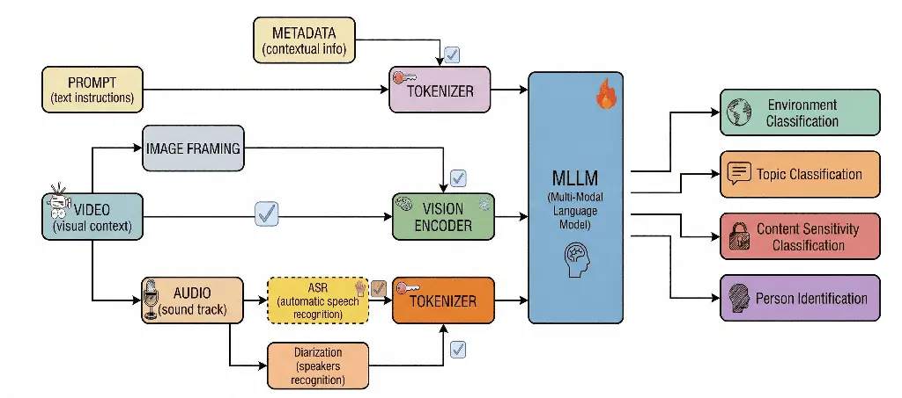
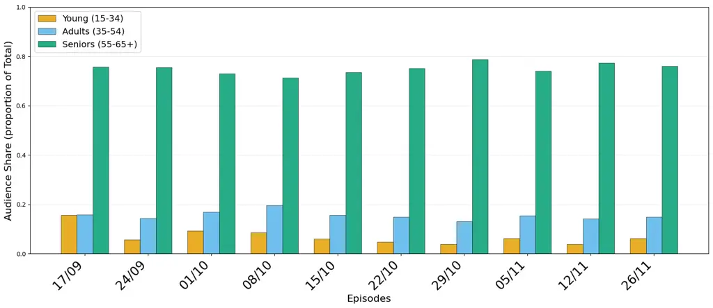

# From Content to Audience: A Deployed Multimodal Annotation Framework for Broadcast Television Analytics

Paolo Cupini Affiliation: Politecnico di Milano
Email: [paolo.cupini@mail.polimi.it](mailto:)    Francesco Pierri
Affiliation: Politecnico di Milano
Email: [francesco.pierri@polimi.it](mailto:)

###### Abstract

Broadcast audience measurement tracks _how many_ viewers are watching,
but not _why_ engagement changes. We present a deployed multimodal
annotation system, developed with a national broadcast media group, that
assigns minute-level semantic labels to television news content and
links them to disaggregated audience data. The system combines visual
input, ASR, speaker diarization, episode metadata, and an MLLM annotator
across four tasks: topic classification, environment classification,
visual named-entity recognition, and sensitive-content detection. Using
a 100-clip diagnostic benchmark, we compare configurations under
quality, latency, and token-cost constraints, finding that transcripts
and metadata drive language-oriented tasks, while environment and
sensitive-content labels remain primarily vision-driven. Native video
does not consistently outperform sampled frames; its gains are limited
to specific model–task pairs, and smaller models can degrade under
extended multimodal context. We deploy the selected
configuration—Gemini-3-Pro with video and metadata—on 14 full episodes
(3,104 minutes), integrate the resulting annotations with normalized
age-cohort ratings, and use them for observational audience-sensitivity
analysis and large-scale guest-composition auditing. We conclude with
practical lessons for moving multimodal annotation pipelines into
production.

## 1 Introduction

Broadcast television is monitored through minute-level audience
measurement systems that report metrics such as Average Minute Rating
(AMR), capturing how many viewers are watching at each moment and their
demographic composition (Auditel, 2026; TAM Ireland, 2025). These
indicators quantify engagement but do not explain it: connecting
minute-level audience variation to the semantic structure of the
underlying content is still largely manual and does not scale (Gambaro
et al., 2021; Hinami and Satoh, 2016).

Multimodal large language models (MLLMs) can jointly reason over visual
frames, speech transcripts, and structured metadata, and are
increasingly used for automated video annotation (Yin et al., 2024; Tang
et al., 2025). In principle they could label broadcast programs at
minute resolution and align those labels with audience data. In
practice, deployment introduces constraints that rarely surface in lab
settings: content is temporally structured and heterogeneous, ASR
introduces noise that propagates downstream (Li et al., 2024),
large-scale annotation must remain computationally sustainable, and it
is not obvious that richer inputs (e.g., full video) justify their
latency and token cost (Qian et al., 2024; Jiang et al., 2025; Brkić
et al., 2025).

This paper reports a real-world case study conducted with a national
broadcast media group. We build a multimodal semantic annotation system
for professional TV audience analysis and validate it on more than 3,000
minutes of broadcast content integrated with disaggregated audience
measurement data. Two questions frame the work from a deployment
standpoint:

- •
  RQ1. Which pipeline configuration is production-viable for broadcast
  annotation when task quality is weighed jointly with computational
  cost (tokens, latency)?
- •
  RQ2. Can the resulting annotations be _operationally integrated_ with
  minute-level audience data—and with content audits such as on-screen
  guest composition—to enable demographic engagement analysis at
  broadcast scale?

We proceed in two stages. First, a diagnostic benchmark of 100 annotated
clips is used to compare frame-based and video-based configurations
across nine MLLMs and four tasks, explicitly accounting for token
consumption, in order to select a single production configuration
(Section 4). Second, the selected pipeline is deployed on 14 full
episodes aired in 2025 (3,104 minutes); minute-level annotations are
aligned with normalized AMR disaggregated by age cohort (Section 5). Our
central practical result is that, for the language-oriented tasks (topic
and entity recognition), speech- and text-derived context (ASR plus
metadata) is a more robust performance driver than temporal visual
continuity (Brkić et al., 2025; Cores et al., 2024), with direct
consequences for how such systems should be built. We close with the
lessons learned (Section 6).

## 2 Related Work

Broadcast programming differs from short-form web video: stable
production formats, recurring guest ecosystems, and strong coupling
between spoken discourse and visual context (Hong et al., 2021). Prior
work mostly optimizes individual components—speaker recognition from
face and audio embeddings (Chung et al., 2018), scene-level environment
labels, and ASR-driven topic analysis (Radford et al., 2023)—rather than
end-to-end pipelines under heterogeneous tasks and constrained budgets.
Vision–language models offer a unified framework for visual and textual
reasoning (Bai et al., 2023; Tang et al., 2025; Alayrac et al., 2022;
Liu et al., 2023), but show persistent limits in fine-grained
spatiotemporal reasoning: extending the context window is insufficient
without careful input structuring, and frame sampling strongly shapes
outcomes (Qian et al., 2024; Jiang et al., 2025; Brkić et al., 2025).
Methodologically, single automatic metrics can mislead system-level
comparison and are better treated as diagnostics (Deutsch et al., 2022),
performance is highly sensitive to prompt and input formulation (Gonen
et al., 2023), and domain-specific benchmarks must be
purpose-built (Chen et al., 2021).

A third strand links audiovisual content to audience behavior: Hong
et al. (2021) show that large-scale visual analysis of TV news reveals
systematic editorial exposure patterns, and Vermeer et al. (2025) link
automated subtitle analysis to segment-level audience dynamics. Both
remain unimodal and depend on existing subtitles or curated metadata;
fully automated multimodal pipelines that annotate raw broadcast video
and integrate it with minute-level, disaggregated audience data remain
underexplored—the gap this work addresses.



Figure 1: Unified pipeline architecture. Dashed components are optional;
the visual branch is instantiated either as sampled static frames (frame
pipeline) or as the full video clip (video pipeline). The audio–textual
branch is identical across both configurations.

## 3 Methodology

Pipeline. The production system (Figure 1) shares a single architecture
across all configurations. An audio–textual branch transcribes speech
with Faster-Whisper, optionally adds speaker diarization via pyannote,
and optionally appends episode-level metadata (program title, broadcast
date, genre, and expected guests). A visual branch is instantiated
either as sampled static frames or as the native video clip. The
branches feed an MLLM that returns, per minute, a structured JSON record
over four tasks. Activating subsets of the optional components yields a
grid of input configurations, ranging from visual-only to
visual$`+`$ASR$`+`$diarization$`+`$metadata, that lets us isolate the
contribution of each textual source. The exact configuration set differs
slightly between the two visual branches and is enumerated in
Appendix D: notably, the video branch includes a _visual$`+`$metadata_
configuration without ASR—the one ultimately selected for deployment
(Section 5).

Tasks and taxonomy. Each minute is annotated along four dimensions,
inspired by the IAB Content Taxonomy (Interactive Advertising Bureau
(2022), IAB) and adapted to Italian prime-time television. _Topic
classification_ assigns one label from a 28-label taxonomy (14
macro-areas). _Environment classification_ assigns one of 22 setting
labels. _Visual named-entity recognition_ lists individuals visually
present (empty if none). _Sensitive-content detection_ flags material
across six categories drawn from content-moderation and broadcast
regulatory frameworks. The taxonomy was refined iteratively with
broadcast domain experts; the full label set is in Appendix A.

Deployment setting. The selected configuration (Gemini-3-Pro with video
and episode-level metadata) is deployed on 14 full episodes of a single
fixed-slot weekly program, annotating 3,104 minutes at one-minute
granularity (advertising excluded). Audience metrics are supplied by an
Italian media company in aggregated, normalized form; no personally
identifiable information is accessed.

## 4 Choosing the Production Configuration

Diagnostic benchmark. To select a configuration under realistic
constraints, we built a diagnostic test set of 100 one-minute clips from
Italian broadcast programs aired in 2025, stratified across four
editorial macro-categories—current-affairs talk shows, investigative,
cultural, and lifestyle programs—with 25 clips sampled per category (one
per episode) to balance editorial conditions by design; program
identities are anonymized. Clips are extracted without enforcing scene
boundaries and may span multiple shots, speaker turns, and topic
transitions, reflecting operational conditions rather than curated
single-topic segments. Two annotators with TV-content experience labeled
all clips; inter-annotator agreement (Cohen’s $`\kappa`$) was 0.70
(topic), 0.67 (environment), and 0.67 (entities); sensitive content
reached $`\kappa{=}1.0`$, interpreted cautiously given only 12 positive
clips. Disagreements were resolved by consensus. We evaluate nine MLLMs
spanning proprietary and open-weight families—Gemini-3-Pro, GPT-5-mini,
Llama-4-Maverick, Qwen2.5-VL-72B, Qwen3-VL (235B/30B/8B), Gemma-3-27B,
and Ministral-14B—in the frame setting, and the six models supporting
native video input (Gemini-3-Pro, Qwen3-Omni, Qwen3-VL-235B,
Qwen3-VL-30B, Molmo-2-8B, and Seed-1.6) for the cross-pipeline
comparison, in a zero-shot setting with a single prompt template that
includes the full taxonomy (Appendix B). Predictions outside the label
set are scored as incorrect. Input token counts from model APIs are
reported as an explicit proxy for cost.

Component choices. Preliminary studies fixed the visual and ASR
components. Accuracy plateaus beyond 12 frames across all models, and
shot-based sampling offers no advantage on this material; uniform
sampling at 0.2 fps (12 frames) cuts token use by $`{\sim}40\%`$
relative to an 18-frame budget at comparable accuracy. Across the ASR
systems compared, Faster-Whisper Medium offers competitive downstream
quality without the latency overhead of larger variants, making it
suitable for cost-efficient large-scale inference. This fixes the ASR
component for the benchmark configurations that include it; the
configuration ultimately deployed omits ASR altogether (Section 5).

What drives quality. Task quality is shaped by the interaction of input
modality and model capacity, not by raw visual richness (Table 2). The
frame pipeline’s only/asr/asr_meta configurations let us isolate each
textual source within a fixed model: only$`\rightarrow`$asr isolates the
ASR increment, asr$`\rightarrow`$asr_meta the metadata increment. For
_topic_, the isolated ASR increment is large and consistent ($`+0.14`$
to $`+0.21`$ accuracy for Gemini-3-Pro, Llama-4-Maverick, and the Qwen
models), while the subsequent metadata increment is near zero:
speech-derived text is the driver and diarization adds no systematic
benefit. For _visual NER_—the most demanding task—the pattern reverses:
the ASR increment is negligible whereas the isolated metadata increment
dominates (precision $`0.08\rightarrow 0.52`$ for Qwen3-VL-235B and
Qwen3-VL-30B, $`0.42\rightarrow 0.60`$ for Gemini-3-Pro), though
enrichment is not uniformly safe—diarization noise degrades identity
resolution for several models, and smaller models hallucinate identities
without textual grounding. _Environment_ is primarily perceptual;
whether native video helps is model-dependent (Table 1), with gains
concentrated in motion-dependent or spatially ambiguous scenes.
_Sensitive-content_ detection is dominated by false-positive control:
transcripts can contextualize ambiguous scenes but also trigger spurious
activations via lexical shortcuts, especially in smaller models; with
only 12 positive clips, its metrics are diagnostic and do not drive
configuration selection.

Video is not universally better (controlled comparison). Critically,
native video input does not systematically outperform sampled frames. To
isolate the visual representation from confounds of model capacity and
textual input, we compare the two pipelines _within_ each of the three
architectures common to both (Gemini-3-Pro, Qwen3-VL-235B, Qwen3-VL-30B)
at matched input compositions (Table 1). Holding model and textual
inputs fixed, the video$`-`$frame accuracy gap is small and, in most
cells, not statistically distinguishable from zero: of the eighteen
matched comparisons, twelve have a 95% bootstrap confidence interval
(paired over clips) that spans zero. For _topic_, video helps only when
no transcript is present (Gemini-3-Pro $`+0.12`$,
CI $`[{+}0.05,{+}0.20]`$; Qwen3-VL-30B $`+0.14`$,
CI $`[{+}0.05,{+}0.24]`$) and the gain becomes indistinguishable from
zero once ASR is added. For _environment_, the significant effects are
model-specific and of opposite sign: video helps Qwen3-VL-30B
substantially ($`+0.36`$, CI $`[{+}0.23,{+}0.48]`$) but _hurts_ the
larger Gemini-3-Pro ($`-0.10`$, CI $`[{-}0.19,{-}0.01]`$). The residual
token gap between the two encodings is intrinsic to the representation
and is reported, not equalized (Appendix D). This within-model
evidence—bounded to three architectures and a 100-clip set—substantiates
the headline result under controlled conditions: the video benefit does
not track model size and is confined to a few model–task cells, while
degradation under extended multimodal context appears among the smaller
video-only models in the full results (Appendix D). Combined with the
token-cost accounting, this argues against adopting video ingestion as a
default. We select Gemini-3-Pro with video plus metadata for deployment:
it is not Pareto-dominant (accepting a small environment loss, 0.73 vs.
0.76 for frames$`+`$ASR$`+`$metadata) but gives the best topic accuracy
(0.83) at roughly half the token cost. It omits ASR—for the
highest-capacity model, metadata already supplies enough textual context
(topic 0.83 vs. 0.80 with ASR)—which in a corporate setting also drops a
transcription stage and its hardware, lowering latency and improving
portability.

| Model         | Input    | $`\Delta`$Topic    | 95% CI                | $`\Delta`$Env      | 95% CI                |
| ------------- | -------- | ------------------ | --------------------- | ------------------ | --------------------- |
| Gemini-3-Pro  | only     | $`\mathbf{+0.12}`$ | $`[{+}0.05,{+}0.20]`$ | $`-0.04`$          | $`[{-}0.13,{+}0.05]`$ |
|               | asr+meta | $`+0.01`$          | $`[{-}0.04,{+}0.06]`$ | $`\mathbf{-0.10}`$ | $`[{-}0.19,{-}0.01]`$ |
|               | +diar    | $`+0.01`$          | $`[{-}0.03,{+}0.05]`$ | $`+0.01`$          | $`[{-}0.08,{+}0.10]`$ |
| Qwen3-VL-235B | only     | $`+0.04`$          | $`[{-}0.04,{+}0.12]`$ | $`+0.06`$          | $`[{-}0.02,{+}0.14]`$ |
|               | asr+meta | $`+0.01`$          | $`[{-}0.07,{+}0.10]`$ | $`+0.04`$          | $`[{-}0.05,{+}0.13]`$ |
|               | +diar    | $`+0.05`$          | $`[{-}0.06,{+}0.15]`$ | $`+0.03`$          | $`[{-}0.07,{+}0.13]`$ |
| Qwen3-VL-30B  | only     | $`\mathbf{+0.14}`$ | $`[{+}0.05,{+}0.24]`$ | $`\mathbf{+0.19}`$ | $`[{+}0.09,{+}0.30]`$ |
|               | asr+meta | $`+0.05`$          | $`[{-}0.04,{+}0.14]`$ | $`\mathbf{+0.36}`$ | $`[{+}0.23,{+}0.48]`$ |
|               | +diar    | $`+0.07`$          | $`[{-}0.02,{+}0.16]`$ | $`\mathbf{+0.20}`$ | $`[{+}0.09,{+}0.32]`$ |

Table 1: Controlled within-model comparison: accuracy gap
$`\Delta=\text{video}-\text{frame}`$ for the three architectures present
in both pipelines, at matched input compositions (only, asr+meta,
+diar$`=`$asr+diar+meta). Deltas are computed paired over clips with a
prediction in both pipelines ($`n{=}98`$–$`100`$); 95% CIs are
percentile bootstrap intervals (10K resamples). Bold marks intervals
that exclude zero. Holding model and textual inputs fixed, twelve of
eighteen comparisons are statistical ties and the few significant
effects are model-specific and of opposite sign—video does not
systematically outperform frames. Absolute values are in Appendix D.

Error patterns. Manual inspection reveals failure modes the aggregate
metrics obscure. Topic errors are systematic collapses between adjacent
labels (*international* $`\rightarrow`$ *domestic politics*), driven by
shared lexical fields in the transcript; environment errors cluster
within perceptually similar settings (_home apartment_ vs. _corporate
office_), while distinctive studio layouts stay stable.
Sensitive-content errors stem from threshold instability—under weak
visual evidence, lexical triggers induce spurious activations, turning
text into a liability—and entity-recognition failures concentrate in
smaller models and in clips lacking textual anchors, where models
hallucinate identities. Model capacity moderates these effects but does
not remove the underlying bottlenecks.

| Task        | Driver   | Video | Failure mode        |
| ----------- | -------- | ----- | ------------------- |
| Topic       | Speech   | Low   | Semantic overlap    |
| Environment | Visual   | Var.  | Spatial ambiguity   |
| Sensitive   | Visual   | n/a   | Spurious activation |
| Entities    | Metadata | Low   | Identity halluc.    |

Table 2: Dominant modality and characteristic failure mode per task,
relative to the frame baseline. “Video” is the benefit of native video
over sampled frames, as established by the controlled comparison
(Table 1): _Low_$`=`$gains only without a transcript or not significant;
_Var._$`=`$model-dependent, significant for one model and reversed for
another; _n/a_$`=`$diagnostic task, 12 positives. Full per-model tables
are in Appendix D.

## 5 Deployment and Audience Analytics

Production cost and throughput. Table 3 summarizes deployment economics.
The selected configuration consumes $`{\sim}6.4`$K input tokens per
annotated minute and emits only four structured fields, so annotating
the full corpus costs $`{\approx}\$40`$ at list pricing¹¹ 1 Gemini 3 Pro
list pricing of \$2.00 per 1M input tokens for prompts $`{\leq}200`$K
tokens; output negligible.
[https://ai.google.dev/gemini-api/docs/pricing](https://ai.google.dev/gemini-api/docs/pricing),
accessed June 2026. The asynchronous Batch API halves these rates.
($`{\approx}\$20`$ via the Batch API)—under a cent and a half per
minute. Median latency ($`{\sim}31`$ s/minute, real-time factor
$`{\approx}0.5`$) means a single request stream keeps pace with
broadcast; annotation is offline and trivially parallelizable. Notably,
native video$`+`$metadata is also _more_ token-economical than the frame
configuration ($`{\sim}6.4`$K vs $`{\sim}14.6`$K tokens/minute): the
model encodes native video at a low fixed token rate per sampled second,
whereas twelve full-resolution stills each consume a large token block.
The production choice is therefore simultaneously the higher-quality and
the cheaper one.

| Production metric                | Value                |
| -------------------------------- | -------------------- |
| Input tokens / annotated minute  | $`{\sim}6{,}443`$    |
| Total input tokens (3,104 min)   | $`{\sim}20.0`$M      |
| Output tokens / call             | 4 fields (negl.)     |
| API latency / minute             | $`{\sim}31`$ s       |
| Real-time factor                 | $`{\approx}0.52`$    |
| Est. cost, list (\$2 / 1M in)    | $`{\approx}\$40`$    |
|    per annotated minute          | $`{\approx}\$0.013`$ |
|    per hour of broadcast         | $`{\approx}\$0.8`$   |
| Est. cost, Batch API ($`-50\%`$) | $`{\approx}\$20`$    |

Table 3: Production cost and throughput of the deployed configuration
(Gemini-3-Pro, video$`+`$metadata) over the 3,104-minute corpus. Costs
use Gemini 3 Pro list pricing (\$2.00 per 1M input tokens,
$`{\leq}200`$K context); output is limited to the four structured fields
and is negligible.

Human-cost comparison. The media partner’s manual workflow for the same
deliverable is estimated at roughly two analyst-hours per episode (one
to annotate content, one to ingest audience data and produce the
analysis): $`{\approx}28`$ hours per 14-episode cycle, or
$`{\approx}\,`$€840 at an illustrative €30/h, against $`{\approx}\$40`$
of compute plus the residual human time to confirm sensitive-content
flags—an order-of-magnitude gap that widens with scale, since manual
effort grows linearly with airtime while per-minute annotation cost is
fixed. The manual figure reflects a coarse operational pass, not the
research-grade annotation used for the benchmark, and only bounds the
saving.

Content characterization. On the 3,104 deployed minutes, editorial
structure is highly concentrated: _domestic politics_ (40.8%) and
_international politics_ (21.7%) account for over 60% of airtime,
followed by _economy and finance_ (11.7%), _humor and satire_ (9.2%),
and _crime and justice_ (6.0%); remaining topics form a long tail. The
NER module identifies 143 unique guests (hosts excluded) over 3,717
minute-level occurrences. Participation is structurally asymmetric: male
guests account for 81.1% of occurrences (89 individuals, 33.9
appearances each on average) versus 700 occurrences across 54 female
guests (13.0 each), and 80.2% of minutes feature exclusively male
guests—a pattern replicated across episodes. Since visual NER operates
at F1$`\,{\approx}\,`$0.60 at deployment, these absolute participation
figures should be read as approximate estimates rather than exact
counts; the asymmetry itself, however, is large and directionally robust
to this error rate, illustrating the kind of large-scale content audit
the pipeline makes feasible.

Baseline audience composition. Figure 2 reports normalized AMR per
episode by age cohort (Young 15–34, Adults 35–54, Seniors 55+). The
senior segment is the largest and most stable component; younger viewers
show markedly higher inter-episode variability, indicating that
episode-level fluctuations are driven mainly by changes in younger
participation rather than the senior base.



Figure 2: Normalized AMR per episode by age cohort. Seniors (55+) are
the most stable segment; younger viewers vary more across episodes.

Topic-level sensitivity and divergence. Audience values are normalized
intra-episode via per-cohort $`z`$-scores (Appendix C), so positive
values indicate above-average engagement controlling for episode
popularity and seasonality. Among the ten topics with the largest
inter-cohort $`z`$-score gap, _art and literature_ is positive for Young
viewers yet negative for Adults and Seniors—the clearest case of
cohort-selective engagement. A gradient pattern characterizes _music_,
_health and wellness_, and _sports–football_: negative across cohorts,
with the decline steepening with age. _Family and relationships_ and
_environment and climate_ are associated with disengagement across all
groups, while _food and cooking_ and _sports–other_ act as shared
attractors that differ in amplitude rather than direction.

Interpretation. High-frequency structural topics sustain a stable
engagement backbone, while low-frequency episodic segments generate
localized deviations that differentially affect age cohorts—a shift from
static aggregate measurement toward dynamic audience-sensitivity
analysis of direct value for editorial planning. We present this
integration as an illustrative downstream use enabled by the annotations
rather than a standalone analytical contribution; all reported patterns
are observational and no causal claims are made.

## 6 Lessons Learned and Conclusion

Speech and text beat video for the language-oriented tasks. Video
pipelines do not systematically outperform frame configurations: under a
controlled within-model comparison, most matched gaps are statistical
ties and the few significant effects are model-specific and of opposite
sign, not a function of model size (degradation under extended
multimodal context shows up mainly in the smaller video-only models).
Video ingestion should be a conditional design choice, validated per
task and per model before its cost is accepted.

Metadata is the cheapest high-impact lever. Isolating each textual
increment, episode-level metadata was the dominant driver for _entity
resolution_—outweighing transcription quality there at negligible token
cost—whereas speech transcripts, not metadata, drove topic. In a
deployment, cheap structured side information is often more valuable
than a heavier perceptual modality for the tasks it targets.

Taxonomy design is a first-order engineering decision. Recurring
errors—semantic collapse between adjacent topics, perceptual confusion
between similar environments—were attributable to label structure, not
model capacity: overlapping or underspecified categories introduce
systematic ambiguity that no extra modality resolves. The taxonomy
should be a maintained engineering artifact, not a fixed schema.

Automated annotation enables scale but needs error-aware use. Annotating
at inference speed makes longitudinal audits and cross-program
comparisons feasible, but systematic label biases (environment
misclassification, topic conflation) propagate downstream. We add two
safeguards: the lowest-precision task (sensitive-content detection) is
human-confirmed before any downstream use rather than driving autonomous
decisions, and a rolling sample of deployed minutes is periodically
re-annotated to monitor drift, seeded by the diagnostic benchmark.
Studies built on automated annotations should carry reliability proxies,
and findings from borderline categories should be read as indicative.

Taken together, these lessons show that deployed multimodal annotation
should match each task to the cheapest reliable signal rather than
defaulting to the richest input. In our broadcast setting, speech
supported topic interpretation, metadata stabilized entity resolution,
and vision remained necessary for perceptual labels. Under these
safeguards, such annotations can support scalable audience analysis and
content audits without treating automated labels as ground truth.

## Limitations

The diagnostic benchmark (100 clips) limits statistical robustness and
generalizability and should be read as diagnostic rather than as a
large-scale corpus. The cross-pipeline comparison is controlled _within_
the three architectures common to both pipelines and at matched textual
inputs, but video and frame encodings cannot be equalized in token
count; the residual token gap is an intrinsic property of the
representation rather than a nuisance variable we control away.
Bootstrap confidence intervals are reported for the controlled
cross-pipeline comparison; the remaining per-model tables report point
estimates only. Although the clips are stratified by editorial
macro-category, they remain internally heterogeneous (multiple shots,
speakers, and topic transitions per minute), so per-signal effects are
reported descriptively and may partly reflect clip composition. The
taxonomies are tailored to a specific broadcast format and may require
adaptation elsewhere. The evaluation is monolingual (Italian) and
centered on a single program type, leaving multilingual content and
other genres untested. All experiments use zero-shot prompting of
general-purpose models, without task-specific fine-tuning. The audience
analyses are purely observational: intra-episode per-cohort $`z`$-score
normalization removes episode-level popularity and seasonality, but the
analysis is not benchmarked against simpler scheduling baselines,
reported associations between content and engagement do not establish
causal relationships, and they may be confounded by concurrent
programming. Finally, downstream analyses inherit the annotation error
profile of the pipeline, which is only partially characterized at this
scale.

## Ethical Considerations

Audience data were provided by the media partner in aggregated and
normalized form, disaggregated only by coarse age cohorts; no personally
identifiable information was accessed or stored. The system performs
sensitive-content detection and visual entity recognition over public
broadcast material; we report these capabilities for analytical and
editorial-planning purposes and caution against punitive or surveillance
uses. Automated annotation can encode and amplify bias: the observed
gender asymmetry in guest participation is a property of the broadcast
content, but pipeline errors could distort such measurements, so
demographic findings should be validated before informing decisions.
Program and company identities are anonymized, and proprietary data are
not released. We follow the ACL Code of Ethics.

## References

- Alayrac et al. (2022) Jean-Baptiste Alayrac, Jeff Donahue, Pauline
  Luc, Antoine Miech, Iain Barr, Yana Hasson, Karel Lenc, Arthur Mensch,
  Katherine Millican, Malcolm Reynolds, and 1 others. 2022. Flamingo: a
  visual language model for few-shot learning. _Advances in neural
  information processing systems_, 35:23716–23736.
- Auditel (2026) Auditel. 2026. Methodology:
  https://www.auditel.it/en/methodology/. Web page. Accessed 2026-03-10.
- Bai et al. (2023) Jinze Bai, Shuai Bai, Shusheng Yang, Shijie Wang,
  Sinan Tan, Peng Wang, Junyang Lin, Chang Zhou, and Jingren Zhou. 2023.
  Qwen-VL: A versatile vision-language model for understanding,
  localization, text reading, and beyond. _arXiv preprint
  arXiv:2308.12966_.
- Brkić et al. (2025) Marija Brkić, A. Filali Razzouki, Y. Tevissen,
  K. Guetari, and M. A. El-Yacoubi. 2025. Frame sampling strategies
  matter: A benchmark for small vision language models. _arXiv preprint
  arXiv:2509.14769_.
- Chen et al. (2021) Zhiyu Chen, Wenhu Chen, Charese Smiley, Sameena
  Shah, Iana Borova, Dylan Langdon, Reema Moussa, Matt Beane, Ting-Hao
  Huang, Bryan Routledge, and William Yang Wang. 2021. FinQA: A dataset
  of numerical reasoning over financial data. In _Proceedings of the
  2021 Conference on Empirical Methods in Natural Language Processing_,
  pages 3697–3711, Online and Punta Cana, Dominican Republic.
  Association for Computational Linguistics.
- Chung et al. (2018) Joon Son Chung, Arsha Nagrani, and Andrew
  Zisserman. 2018. VoxCeleb2: Deep speaker recognition. In _Proceedings
  of Interspeech_, pages 1086–1090. DOI: 10.21437/Interspeech.2018-1929.
- Cores et al. (2024) Daniel Cores, Michael Dorkenwald, Manuel
  Mucientes, Cees GM Snoek, and Yuki M Asano. 2024. Lost in time: A new
  temporal benchmark for VideoLLMs.
- Deutsch et al. (2022) Daniel Deutsch, Rotem Dror, and Dan Roth. 2022.
  On the limitations of reference-free evaluations of generated text. In
  _Proceedings of the 2022 Conference on Empirical Methods in Natural
  Language Processing_, pages 10960–10977, Abu Dhabi, United Arab
  Emirates. Association for Computational Linguistics.
- Gambaro et al. (2021) Marco Gambaro, Valentino Larcinese, Riccardo
  Puglisi, and James M. Snyder Jr. 2021. The revealed demand for hard
  vs. soft news: Evidence from Italian TV viewership. NBER Working Paper
  29020, National Bureau of Economic Research.
- Gonen et al. (2023) Hila Gonen, Srini Iyer, Terra Blevins, Noah A.
  Smith, and Luke Zettlemoyer. 2023. Demystifying prompts in language
  models via perplexity estimation. In _Findings of the Association for
  Computational Linguistics: EMNLP 2023_, pages 10136–10148, Singapore.
  Association for Computational Linguistics.
- Hinami and Satoh (2016) Ryota Hinami and Shin’ichi Satoh. 2016.
  Audience behavior mining by integrating TV ratings with multimedia
  contents. In _Proceedings of the IEEE International Symposium on
  Multimedia (ISM)_.
- Hong et al. (2021) James Hong, Will Crichton, Haotian Zhang, Daniel Y.
  Fu, Jacob Ritchie, Jeremy Barenholtz, Ben Hannel, Xinwei Yao, Michaela
  Murray, Geraldine Moriba, Maneesh Agrawala, and Kayvon
  Fatahalian. 2021. Analysis of faces in a decade of US cable TV news.
  In _Proceedings of the 27th ACM SIGKDD Conference on Knowledge
  Discovery and Data Mining (KDD)_, pages 3011–3021.
- Interactive Advertising Bureau (2022) (IAB) Interactive Advertising
  Bureau (IAB). 2022. Content taxonomy 3.0. Technical specification, IAB
  Tech Lab.
  [https://iabtechlab.com/standards/content-taxonomy/](https://iabtechlab.com/standards/content-taxonomy/).
- Jiang et al. (2025) Jindong Jiang, Xiuyu Li, Zhijian Liu, Muyang Li,
  Guo Chen, Zhiqi Li, De-An Huang, Guilin Liu, Zhiding Yu, Kurt Keutzer,
  and 1 others. 2025. Storm: Token-efficient long video understanding
  for multimodal llms. pages 5830–5841.
- Li et al. (2024) Changye Li, Weizhe Xu, Trevor Cohen, and Serguei
  Pakhomov. 2024. Useful blunders: Can automated speech recognition
  errors improve downstream dementia classification? _Journal of
  biomedical informatics_, 150:104598.
- Liu et al. (2023) Haotian Liu, Chunyuan Li, Qingyang Wu, and Yong Jae
  Lee. 2023. Visual instruction tuning. _arXiv preprint
  arXiv:2304.08485_.
- Qian et al. (2024) Rui Qian, Xiaoyi Dong, Pan Zhang, Yuhang Zang,
  Shuangrui Ding, Dahua Lin, and Jiaqi Wang. 2024. Streaming long video
  understanding with large language models. volume 37, pages
  119336–119360.
- Radford et al. (2023) Alec Radford, Jong Wook Kim, Tao Xu, Greg
  Brockman, Christine McLeavey, and Ilya Sutskever. 2023. Robust speech
  recognition via large-scale weak supervision. In _Proceedings of the
  40th International Conference on Machine Learning (ICML)_, pages
  28492–28518. ArXiv:2212.04356.
- TAM Ireland (2025) TAM Ireland. 2025. Understanding TV data 2025.
  Accessed 2026-03-10.
- Tang et al. (2025) Yunlong Tang, Jing Bi, Siting Xu, Luchuan Song,
  Susan Liang, Teng Wang, Daoan Zhang, Jie An, Jingyang Lin, Rongyi Zhu,
  and 1 others. 2025. Video understanding with large language models: A
  survey. _IEEE Transactions on Circuits and Systems for Video
  Technology_.
- Vermeer et al. (2025) Susan A. M. Vermeer, Damian Trilling, Jeroen
  Stolwijk, Sanne Kruikemeier, and Claes de Vreese. 2025. What’s on and
  who’s watching? combining people-meter data and subtitle data to
  explore television exposure to political news. _Political
  Communication_, 42(3):405–431.
- Yin et al. (2024) Shukang Yin, Chaoyou Fu, Sirui Zhao, Ke Li, Xing
  Sun, Tong Xu, and Enhong Chen. 2024. A survey on multimodal large
  language models. _National Science Review_, 11(12):nwae403.

## Appendix A Complete Annotation Taxonomy

Table 4 lists the full label sets for topic, environment, and
sensitive-content annotation.

| Topic                        | Environment                  | Sensitive             |
| ---------------------------- | ---------------------------- | --------------------- |
| Domestic politics            | Studio – Single host         | Violence              |
| International politics       | Studio – 1-to-1 interview    | Blood                 |
| Crime and justice            | Studio – Guest panel         | War / armed conflicts |
| Environment and climate      | Studio – Remote split screen | Organized crime       |
| Society and social phenomena | Studio – Video segment       | Humanitarian crises   |
| Family and relationships     | Home – Apartment             | Self-harm / suicide   |
| Cinema, TV and entertainment | Home – Kitchen               |                       |
| Music                        | Corporate office             |                       |
| Humor and satire             | Commercial/public venue      |                       |
| Art and literature           | Spa/wellness center          |                       |
| History and archaeology      | Vehicle/transport            |                       |
| Religion and spirituality    | Generic urban outdoor        |                       |
| Science and technology       | Nature – Outdoors            |                       |
| Education and training       | Nature – Mountain            |                       |
| Food and cooking             | Identified tourist site      |                       |
| Fashion and beauty           |                              |                       |
| Travel and tourism           |                              |                       |
| Health and wellness          |                              |                       |
| Motors and vehicles          |                              |                       |
| Sports – Football            |                              |                       |
| Sports – Other               |                              |                       |

Table 4: Taxonomies for semantic annotation: topic (left), environment
(center), and sensitive-content categories (right).

## Appendix B Prompt Strategies

Both pipelines share the output schema and hard constraints: select
exactly one label for topic and environment, at most one
sensitive-content flag, include a guest name only if the person is
visually recognized or explicitly named, and return JSON only.
Configurations differ in which sources are provided and in their
relative authority. When metadata is added, it is explicitly
subordinated to visual evidence (used only to confirm or correct
visually recognized identities, never to assume presence). When ASR is
added, a three-level hierarchy is established: video is primary for
visual elements, ASR for spoken content, and metadata acts as a
correction layer for proper nouns and context.

## Appendix C Audience Normalization

Topic-level audience sensitivity (Section 5) is computed on per-cohort,
intra-episode $`z`$-scores. Let $`c`$ index the age cohort, $`e`$ the
episode, and $`t`$ the topic. Let $`x_{c,e,t}`$ be the mean normalized
AMR of cohort $`c`$ over the minutes labeled with topic $`t`$ in episode
$`e`$, and let $`\mu_{c,e}`$ and $`\sigma_{c,e}`$ be the mean and
standard deviation of cohort $`c`$’s per-minute normalized AMR within
episode $`e`$. The $`z`$-score is

```math
z_{c,e,t}\;=\;\frac{x_{c,e,t}-\mu_{c,e}}{\sigma_{c,e}}. \tag{1}
```

Normalizing within each episode and cohort removes differences in
baseline popularity and seasonality, so positive (negative) values
denote above-average (below-average) engagement of a cohort with a topic
_relative to its own episode-level mean_. The inter-cohort gap discussed
in Section 5 is the spread of $`z_{c,e,t}`$ across cohorts, averaged
over episodes.

## Appendix D Full Per-Model Results

Complete per-model, per-configuration results for all four tasks. We
report Accuracy, Precision, Recall, and F1, together with input tokens
(Tok) and average API latency in milliseconds (Lat). The video pipeline
covers the six models supporting native video; the frame pipeline covers
all nine models. Tables 5–8 report the video pipeline and Tables 9–12
the frame pipeline.

| Model        | Input         | Acc  | Prec | Rec  | F1   | Tok   | Lat   |
| ------------ | ------------- | ---- | ---- | ---- | ---- | ----- | ----- |
| gemini-3-pro | asr_diar_meta | 0.74 | 0.79 | 0.74 | 0.75 | 6856  | 31932 |
| gemini-3-pro | asr_meta      | 0.66 | 0.76 | 0.66 | 0.68 | 6732  | 29595 |
| gemini-3-pro | meta          | 0.73 | 0.79 | 0.73 | 0.75 | 6443  | 31008 |
| gemini-3-pro | only          | 0.66 | 0.73 | 0.66 | 0.68 | 6224  | 35729 |
| molmo-2-8b   | asr_diar_meta | 0.33 | 0.42 | 0.33 | 0.29 | 12197 | 22064 |
| molmo-2-8b   | asr_meta      | 0.14 | 0.06 | 0.14 | 0.06 | 11846 | 26757 |
| molmo-2-8b   | meta          | 0.26 | 0.68 | 0.26 | 0.24 | 11608 | 24596 |
| molmo-2-8b   | only          | 0.18 | 0.60 | 0.18 | 0.14 | 11361 | 21761 |
| qwen3-omni   | asr_diar_meta | 0.54 | 0.49 | 0.54 | 0.49 | 15346 | 9525  |
| qwen3-omni   | asr_meta      | 0.56 | 0.56 | 0.56 | 0.53 | 15207 | 9735  |
| qwen3-omni   | meta          | 0.55 | 0.63 | 0.55 | 0.54 | 14861 | 9879  |
| qwen3-omni   | only          | 0.55 | 0.55 | 0.55 | 0.53 | 14615 | 9913  |
| qwen3-235b   | asr_diar_meta | 0.65 | 0.65 | 0.65 | 0.62 | 14614 | 7178  |
| qwen3-235b   | asr_meta      | 0.71 | 0.73 | 0.71 | 0.71 | 14475 | 7237  |
| qwen3-235b   | meta          | 0.70 | 0.72 | 0.70 | 0.69 | 14129 | 7091  |
| qwen3-235b   | only          | 0.71 | 0.74 | 0.71 | 0.71 | 13884 | 9023  |
| qwen3-30b    | asr_diar_meta | 0.62 | 0.58 | 0.62 | 0.57 | 14614 | 22218 |
| qwen3-30b    | asr_meta      | 0.66 | 0.60 | 0.66 | 0.62 | 14475 | 13720 |
| qwen3-30b    | meta          | 0.71 | 0.77 | 0.71 | 0.69 | 14130 | 20742 |
| qwen3-30b    | only          | 0.70 | 0.78 | 0.70 | 0.69 | 13884 | 18405 |
| seed-1.6     | asr_diar_meta | 0.42 | 0.48 | 0.42 | 0.40 | 19506 | 40369 |
| seed-1.6     | asr_meta      | 0.54 | 0.65 | 0.54 | 0.56 | 19361 | 34226 |
| seed-1.6     | meta          | 0.61 | 0.64 | 0.61 | 0.61 | 19036 | 33848 |
| seed-1.6     | only          | 0.58 | 0.56 | 0.58 | 0.56 | 18799 | 57734 |

Table 5: Environment Recognition — video pipeline. Input:
asr_diar_meta=video+ASR+diarization+metadata,
asr_meta=video+ASR+metadata, meta=video+metadata, only=video only.
Tok=input tokens; Lat=API latency (ms); --=undefined (no positive
predictions).

| Model        | Input         | Acc  | Prec | Rec  | F1   | Tok   | Lat   |
| ------------ | ------------- | ---- | ---- | ---- | ---- | ----- | ----- |
| gemini-3-pro | asr_diar_meta | 0.81 | 0.82 | 0.81 | 0.80 | 6856  | 31932 |
| gemini-3-pro | asr_meta      | 0.80 | 0.82 | 0.80 | 0.79 | 6732  | 29595 |
| gemini-3-pro | meta          | 0.83 | 0.82 | 0.83 | 0.81 | 6443  | 31008 |
| gemini-3-pro | only          | 0.79 | 0.79 | 0.79 | 0.77 | 6224  | 35729 |
| molmo-2-8b   | asr_diar_meta | 0.53 | 0.68 | 0.53 | 0.53 | 12197 | 22064 |
| molmo-2-8b   | asr_meta      | 0.60 | 0.73 | 0.60 | 0.62 | 11846 | 26757 |
| molmo-2-8b   | meta          | 0.50 | 0.67 | 0.50 | 0.52 | 11608 | 24596 |
| molmo-2-8b   | only          | 0.34 | 0.62 | 0.34 | 0.36 | 11361 | 21761 |
| qwen3-omni   | asr_diar_meta | 0.76 | 0.75 | 0.76 | 0.74 | 15346 | 9525  |
| qwen3-omni   | asr_meta      | 0.77 | 0.79 | 0.77 | 0.77 | 15207 | 9735  |
| qwen3-omni   | meta          | 0.78 | 0.80 | 0.78 | 0.77 | 14861 | 9879  |
| qwen3-omni   | only          | 0.78 | 0.82 | 0.78 | 0.78 | 14615 | 9913  |
| qwen3-235b   | asr_diar_meta | 0.69 | 0.74 | 0.69 | 0.69 | 14614 | 7178  |
| qwen3-235b   | asr_meta      | 0.70 | 0.73 | 0.70 | 0.69 | 14475 | 7237  |
| qwen3-235b   | meta          | 0.63 | 0.70 | 0.63 | 0.64 | 14129 | 7091  |
| qwen3-235b   | only          | 0.55 | 0.68 | 0.55 | 0.57 | 13884 | 9023  |
| qwen3-30b    | asr_diar_meta | 0.69 | 0.77 | 0.69 | 0.70 | 14614 | 22218 |
| qwen3-30b    | asr_meta      | 0.71 | 0.78 | 0.71 | 0.72 | 14475 | 13720 |
| qwen3-30b    | meta          | 0.65 | 0.69 | 0.65 | 0.65 | 14130 | 20742 |
| qwen3-30b    | only          | 0.60 | 0.68 | 0.60 | 0.60 | 13884 | 18405 |
| seed-1.6     | asr_diar_meta | 0.75 | 0.79 | 0.75 | 0.76 | 19506 | 40369 |
| seed-1.6     | asr_meta      | 0.71 | 0.70 | 0.71 | 0.70 | 19361 | 34226 |
| seed-1.6     | meta          | 0.60 | 0.73 | 0.60 | 0.63 | 19036 | 33848 |
| seed-1.6     | only          | 0.45 | 0.68 | 0.45 | 0.50 | 18799 | 57734 |

Table 6: Topic Classification — video pipeline. Input:
asr_diar_meta=video+ASR+diarization+metadata,
asr_meta=video+ASR+metadata, meta=video+metadata, only=video only.
Tok=input tokens; Lat=API latency (ms); --=undefined (no positive
predictions).

| Model        | Input         | Acc  | Prec | Rec  | F1   | Tok   | Lat   |
| ------------ | ------------- | ---- | ---- | ---- | ---- | ----- | ----- |
| gemini-3-pro | asr_diar_meta | 0.89 | 0.50 | 0.82 | 0.62 | 6856  | 31932 |
| gemini-3-pro | asr_meta      | 0.85 | 0.41 | 0.82 | 0.55 | 6732  | 29595 |
| gemini-3-pro | meta          | 0.88 | 0.47 | 0.64 | 0.54 | 6443  | 31008 |
| gemini-3-pro | only          | 0.88 | 0.47 | 0.73 | 0.57 | 6224  | 35729 |
| molmo-2-8b   | asr_diar_meta | 0.90 | 0.43 | 0.33 | 0.38 | 12197 | 22064 |
| molmo-2-8b   | asr_meta      | 0.84 | 0.27 | 0.44 | 0.33 | 11846 | 26757 |
| molmo-2-8b   | meta          | 0.82 | 0.24 | 0.44 | 0.31 | 11608 | 24596 |
| molmo-2-8b   | only          | 0.88 | 0.25 | 0.10 | 0.14 | 11361 | 21761 |
| qwen3-omni   | asr_diar_meta | 0.69 | 0.22 | 0.89 | 0.35 | 15346 | 9525  |
| qwen3-omni   | asr_meta      | 0.68 | 0.21 | 0.89 | 0.34 | 15207 | 9735  |
| qwen3-omni   | meta          | 0.73 | 0.24 | 0.89 | 0.38 | 14861 | 9879  |
| qwen3-omni   | only          | 0.91 | 0.57 | 0.40 | 0.47 | 14615 | 9913  |
| qwen3-235b   | asr_diar_meta | 0.77 | 0.23 | 0.67 | 0.34 | 14614 | 7178  |
| qwen3-235b   | asr_meta      | 0.74 | 0.19 | 0.63 | 0.29 | 14475 | 7237  |
| qwen3-235b   | meta          | 0.79 | 0.23 | 0.56 | 0.32 | 14129 | 7091  |
| qwen3-235b   | only          | 0.84 | 0.29 | 0.56 | 0.38 | 13884 | 9023  |
| qwen3-30b    | asr_diar_meta | 0.77 | 0.25 | 0.78 | 0.38 | 14614 | 22218 |
| qwen3-30b    | asr_meta      | 0.78 | 0.29 | 0.80 | 0.42 | 14475 | 13720 |
| qwen3-30b    | meta          | 0.73 | 0.18 | 0.56 | 0.27 | 14130 | 20742 |
| qwen3-30b    | only          | 0.71 | 0.17 | 0.63 | 0.26 | 13884 | 18405 |
| seed-1.6     | asr_diar_meta | 0.88 | 0.33 | 0.09 | 0.14 | 19506 | 40369 |
| seed-1.6     | asr_meta      | 0.89 | 0.50 | 0.36 | 0.42 | 19361 | 34226 |
| seed-1.6     | meta          | 0.87 | 0.00 | 0.00 | –    | 19036 | 33848 |
| seed-1.6     | only          | 0.89 | 1.00 | 0.08 | 0.15 | 18799 | 57734 |

Table 7: Sensitive-Content Detection — video pipeline. _Metrics are
diagnostic only_: with 12 positive clips, precision/recall are highly
unstable and are _not_ used for configuration selection. Input:
asr_diar_meta=video+ASR+diarization+metadata,
asr_meta=video+ASR+metadata, meta=video+metadata, only=video only.
Tok=input tokens; Lat=API latency (ms); --=undefined (no positive
predictions).

| Model        | Input         | Acc  | Prec | Rec  | F1   | Tok   | Lat   |
| ------------ | ------------- | ---- | ---- | ---- | ---- | ----- | ----- |
| gemini-3-pro | asr_diar_meta | 0.60 | 0.62 | 0.60 | 0.61 | 6856  | 31932 |
| gemini-3-pro | asr_meta      | 0.50 | 0.56 | 0.50 | 0.52 | 6732  | 29595 |
| gemini-3-pro | meta          | 0.60 | 0.63 | 0.60 | 0.60 | 6443  | 31008 |
| gemini-3-pro | only          | 0.50 | 0.54 | 0.50 | 0.50 | 6224  | 35729 |
| molmo-2-8b   | asr_diar_meta | 0.14 | 0.18 | 0.14 | 0.10 | 12197 | 22064 |
| molmo-2-8b   | asr_meta      | 0.13 | 0.11 | 0.13 | 0.07 | 11846 | 26757 |
| molmo-2-8b   | meta          | 0.10 | 0.01 | 0.10 | 0.02 | 11608 | 24596 |
| molmo-2-8b   | only          | 0.10 | 0.01 | 0.10 | 0.02 | 11361 | 21761 |
| qwen3-omni   | asr_diar_meta | 0.10 | 0.01 | 0.10 | 0.02 | 15346 | 9525  |
| qwen3-omni   | asr_meta      | 0.10 | 0.01 | 0.10 | 0.02 | 15207 | 9735  |
| qwen3-omni   | meta          | 0.10 | 0.01 | 0.10 | 0.02 | 14861 | 9879  |
| qwen3-omni   | only          | 0.10 | 0.01 | 0.10 | 0.02 | 14615 | 9913  |
| qwen3-235b   | asr_diar_meta | 0.13 | 0.14 | 0.13 | 0.06 | 14614 | 7178  |
| qwen3-235b   | asr_meta      | 0.18 | 0.17 | 0.18 | 0.12 | 14475 | 7237  |
| qwen3-235b   | meta          | 0.13 | 0.09 | 0.13 | 0.06 | 14129 | 7091  |
| qwen3-235b   | only          | 0.15 | 0.06 | 0.15 | 0.07 | 13884 | 9023  |
| qwen3-30b    | asr_diar_meta | 0.10 | 0.01 | 0.10 | 0.02 | 14614 | 22218 |
| qwen3-30b    | asr_meta      | 0.10 | 0.01 | 0.10 | 0.02 | 14475 | 13720 |
| qwen3-30b    | meta          | 0.10 | 0.01 | 0.10 | 0.02 | 14130 | 20742 |
| qwen3-30b    | only          | 0.18 | 0.10 | 0.18 | 0.12 | 13884 | 18405 |
| seed-1.6     | asr_diar_meta | 0.42 | 0.40 | 0.42 | 0.38 | 19506 | 40369 |
| seed-1.6     | asr_meta      | 0.39 | 0.38 | 0.39 | 0.37 | 19361 | 34226 |
| seed-1.6     | meta          | 0.31 | 0.31 | 0.31 | 0.26 | 19036 | 33848 |
| seed-1.6     | only          | 0.10 | 0.01 | 0.10 | 0.02 | 18799 | 57734 |

Table 8: Visual NER / Person Recognition — video pipeline. Input:
asr_diar_meta=video+ASR+diarization+metadata,
asr_meta=video+ASR+metadata, meta=video+metadata, only=video only.
Tok=input tokens; Lat=API latency (ms); --=undefined (no positive
predictions).

| Model         | Input         | Acc  | Prec | Rec  | F1   | Tok   | Lat   |
| ------------- | ------------- | ---- | ---- | ---- | ---- | ----- | ----- |
| gemini-3-pro  | asr           | 0.68 | 0.72 | 0.68 | 0.68 | 14294 | 35028 |
| gemini-3-pro  | asr_diar      | 0.72 | 0.77 | 0.72 | 0.72 | 14456 | 33811 |
| gemini-3-pro  | asr_diar_meta | 0.73 | 0.79 | 0.73 | 0.74 | 14666 | 34378 |
| gemini-3-pro  | asr_meta      | 0.76 | 0.81 | 0.76 | 0.77 | 14572 | 32011 |
| gemini-3-pro  | only          | 0.70 | 0.75 | 0.70 | 0.71 | 13996 | 34865 |
| gemma-3-27b   | asr           | 0.46 | 0.51 | 0.46 | 0.43 | 4212  | 25520 |
| gemma-3-27b   | asr_diar      | 0.47 | 0.29 | 0.47 | 0.36 | 4376  | 28385 |
| gemma-3-27b   | asr_diar_meta | 0.44 | 0.30 | 0.44 | 0.34 | 4586  | 8738  |
| gemma-3-27b   | asr_meta      | 0.37 | 0.47 | 0.37 | 0.34 | 4491  | 29150 |
| gemma-3-27b   | only          | 0.49 | 0.45 | 0.49 | 0.45 | 3917  | 8167  |
| gpt-5-mini    | asr           | 0.55 | 0.50 | 0.55 | 0.52 | 4551  | 37385 |
| gpt-5-mini    | asr_diar      | 0.27 | 0.51 | 0.27 | 0.34 | 4705  | 55330 |
| gpt-5-mini    | asr_diar_meta | 0.56 | 0.62 | 0.56 | 0.58 | 4945  | 28378 |
| gpt-5-mini    | asr_meta      | 0.46 | 0.72 | 0.46 | 0.54 | 4849  | 45219 |
| gpt-5-mini    | only          | 0.59 | 0.64 | 0.59 | 0.59 | 4234  | 15836 |
| llama-4-mav   | asr           | 0.57 | 0.64 | 0.57 | 0.59 | 9753  | 20462 |
| llama-4-mav   | asr_diar      | 0.58 | 0.56 | 0.58 | 0.54 | 9906  | 24420 |
| llama-4-mav   | asr_diar_meta | 0.60 | 0.68 | 0.60 | 0.57 | 10135 | 8195  |
| llama-4-mav   | asr_meta      | 0.54 | 0.62 | 0.54 | 0.56 | 10056 | 19666 |
| llama-4-mav   | only          | 0.55 | 0.60 | 0.55 | 0.56 | 9461  | 4710  |
| ministral-14b | asr           | 0.28 | 0.30 | 0.28 | 0.25 | 5441  | 19854 |
| ministral-14b | asr_diar      | 0.21 | 0.37 | 0.21 | 0.15 | 5620  | 21727 |
| ministral-14b | asr_diar_meta | 0.20 | 0.35 | 0.20 | 0.22 | 5868  | 10670 |
| ministral-14b | asr_meta      | 0.08 | 0.22 | 0.08 | 0.10 | 5742  | 26039 |
| ministral-14b | only          | 0.25 | 0.27 | 0.25 | 0.22 | 5124  | 7118  |
| qwen2.5-72b   | asr           | 0.60 | 0.62 | 0.60 | 0.58 | 4821  | 19667 |
| qwen2.5-72b   | asr_diar      | 0.53 | 0.47 | 0.53 | 0.46 | 4983  | 23429 |
| qwen2.5-72b   | asr_diar_meta | 0.59 | 0.47 | 0.59 | 0.50 | 5241  | 6494  |
| qwen2.5-72b   | asr_meta      | 0.56 | 0.51 | 0.56 | 0.52 | 5150  | 19650 |
| qwen2.5-72b   | only          | 0.63 | 0.67 | 0.63 | 0.62 | 4460  | 7222  |
| qwen3-235b    | asr           | 0.65 | 0.63 | 0.65 | 0.62 | 3863  | 21662 |
| qwen3-235b    | asr_diar      | 0.57 | 0.58 | 0.57 | 0.54 | 4024  | 21450 |
| qwen3-235b    | asr_diar_meta | 0.62 | 0.58 | 0.62 | 0.57 | 4283  | 6062  |
| qwen3-235b    | asr_meta      | 0.67 | 0.70 | 0.67 | 0.67 | 4192  | 20654 |
| qwen3-235b    | only          | 0.65 | 0.62 | 0.65 | 0.63 | 3501  | 3617  |
| qwen3-30b     | asr           | 0.56 | 0.55 | 0.56 | 0.53 | 3863  | 19758 |
| qwen3-30b     | asr_diar      | 0.44 | 0.36 | 0.44 | 0.35 | 4024  | 16779 |
| qwen3-30b     | asr_diar_meta | 0.41 | 0.41 | 0.41 | 0.34 | 4283  | 5855  |
| qwen3-30b     | asr_meta      | 0.30 | 0.49 | 0.30 | 0.28 | 4192  | 16132 |
| qwen3-30b     | only          | 0.50 | 0.52 | 0.50 | 0.47 | 3501  | 4657  |
| qwen3-8b      | asr           | 0.34 | 0.53 | 0.34 | 0.32 | 9308  | 24031 |
| qwen3-8b      | asr_diar      | 0.43 | 0.34 | 0.43 | 0.34 | 7690  | 18707 |
| qwen3-8b      | asr_diar_meta | 0.43 | 0.36 | 0.43 | 0.37 | 4283  | 7789  |
| qwen3-8b      | asr_meta      | 0.36 | 0.40 | 0.36 | 0.33 | 7835  | 23203 |
| qwen3-8b      | only          | 0.49 | 0.61 | 0.49 | 0.48 | 3501  | 7308  |

Table 9: Environment Recognition — frame pipeline. Input:
asr=frames+ASR, asr_diar=+diarization,
asr_diar_meta=+diarization+metadata, asr_meta=frames+ASR+metadata,
only=frames only. Columns as in Table 5.

| Model         | Input         | Acc  | Prec | Rec  | F1   | Tok   | Lat   |
| ------------- | ------------- | ---- | ---- | ---- | ---- | ----- | ----- |
| gemini-3-pro  | asr           | 0.81 | 0.82 | 0.81 | 0.80 | 14294 | 35028 |
| gemini-3-pro  | asr_diar      | 0.81 | 0.84 | 0.81 | 0.80 | 14456 | 33811 |
| gemini-3-pro  | asr_diar_meta | 0.80 | 0.81 | 0.80 | 0.78 | 14666 | 34378 |
| gemini-3-pro  | asr_meta      | 0.79 | 0.81 | 0.79 | 0.78 | 14572 | 32011 |
| gemini-3-pro  | only          | 0.67 | 0.73 | 0.67 | 0.65 | 13996 | 34865 |
| gemma-3-27b   | asr           | 0.65 | 0.72 | 0.65 | 0.67 | 4212  | 25520 |
| gemma-3-27b   | asr_diar      | 0.68 | 0.75 | 0.68 | 0.69 | 4376  | 28385 |
| gemma-3-27b   | asr_diar_meta | 0.67 | 0.73 | 0.67 | 0.68 | 4586  | 8738  |
| gemma-3-27b   | asr_meta      | 0.65 | 0.74 | 0.65 | 0.66 | 4491  | 29150 |
| gemma-3-27b   | only          | 0.50 | 0.62 | 0.50 | 0.50 | 3917  | 8167  |
| gpt-5-mini    | asr           | 0.70 | 0.71 | 0.70 | 0.69 | 4551  | 37385 |
| gpt-5-mini    | asr_diar      | 0.39 | 0.74 | 0.39 | 0.49 | 4705  | 55330 |
| gpt-5-mini    | asr_diar_meta | 0.63 | 0.80 | 0.63 | 0.68 | 4945  | 28378 |
| gpt-5-mini    | asr_meta      | 0.47 | 0.75 | 0.47 | 0.55 | 4849  | 45219 |
| gpt-5-mini    | only          | 0.61 | 0.73 | 0.61 | 0.63 | 4234  | 15836 |
| llama-4-mav   | asr           | 0.71 | 0.76 | 0.71 | 0.71 | 9753  | 20462 |
| llama-4-mav   | asr_diar      | 0.71 | 0.76 | 0.71 | 0.70 | 9906  | 24420 |
| llama-4-mav   | asr_diar_meta | 0.69 | 0.72 | 0.69 | 0.67 | 10135 | 8195  |
| llama-4-mav   | asr_meta      | 0.71 | 0.75 | 0.71 | 0.71 | 10056 | 19666 |
| llama-4-mav   | only          | 0.50 | 0.65 | 0.50 | 0.52 | 9461  | 4710  |
| ministral-14b | asr           | 0.53 | 0.66 | 0.53 | 0.54 | 5441  | 19854 |
| ministral-14b | asr_diar      | 0.53 | 0.69 | 0.53 | 0.57 | 5620  | 21727 |
| ministral-14b | asr_diar_meta | 0.35 | 0.71 | 0.35 | 0.46 | 5868  | 10670 |
| ministral-14b | asr_meta      | 0.13 | 0.54 | 0.13 | 0.20 | 5742  | 26039 |
| ministral-14b | only          | 0.26 | 0.47 | 0.26 | 0.31 | 5124  | 7118  |
| qwen2.5-72b   | asr           | 0.69 | 0.84 | 0.69 | 0.72 | 4821  | 19667 |
| qwen2.5-72b   | asr_diar      | 0.63 | 0.78 | 0.63 | 0.66 | 4983  | 23429 |
| qwen2.5-72b   | asr_diar_meta | 0.66 | 0.75 | 0.66 | 0.67 | 5241  | 6494  |
| qwen2.5-72b   | asr_meta      | 0.74 | 0.78 | 0.74 | 0.74 | 5150  | 19650 |
| qwen2.5-72b   | only          | 0.53 | 0.70 | 0.53 | 0.55 | 4460  | 7222  |
| qwen3-235b    | asr           | 0.66 | 0.75 | 0.66 | 0.68 | 3863  | 21662 |
| qwen3-235b    | asr_diar      | 0.65 | 0.76 | 0.65 | 0.67 | 4024  | 21450 |
| qwen3-235b    | asr_diar_meta | 0.65 | 0.72 | 0.65 | 0.64 | 4283  | 6062  |
| qwen3-235b    | asr_meta      | 0.70 | 0.72 | 0.70 | 0.69 | 4192  | 20654 |
| qwen3-235b    | only          | 0.52 | 0.66 | 0.52 | 0.55 | 3501  | 3617  |
| qwen3-30b     | asr           | 0.66 | 0.78 | 0.66 | 0.68 | 3863  | 19758 |
| qwen3-30b     | asr_diar      | 0.59 | 0.75 | 0.59 | 0.61 | 4024  | 16779 |
| qwen3-30b     | asr_diar_meta | 0.62 | 0.68 | 0.62 | 0.61 | 4283  | 5855  |
| qwen3-30b     | asr_meta      | 0.67 | 0.76 | 0.67 | 0.67 | 4192  | 16132 |
| qwen3-30b     | only          | 0.47 | 0.69 | 0.47 | 0.49 | 3501  | 4657  |
| qwen3-8b      | asr           | 0.50 | 0.67 | 0.50 | 0.52 | 9308  | 24031 |
| qwen3-8b      | asr_diar      | 0.49 | 0.63 | 0.49 | 0.49 | 7690  | 18707 |
| qwen3-8b      | asr_diar_meta | 0.52 | 0.69 | 0.52 | 0.51 | 4283  | 7789  |
| qwen3-8b      | asr_meta      | 0.52 | 0.60 | 0.52 | 0.52 | 7835  | 23203 |
| qwen3-8b      | only          | 0.39 | 0.62 | 0.39 | 0.38 | 3501  | 7308  |

Table 10: Topic Classification — frame pipeline. Input: asr=frames+ASR,
asr_diar=+diarization, asr_diar_meta=+diarization+metadata,
asr_meta=frames+ASR+metadata, only=frames only. Columns as in Table 5.

| Model         | Input         | Acc  | Prec | Rec  | F1   | Tok   | Lat   |
| ------------- | ------------- | ---- | ---- | ---- | ---- | ----- | ----- |
| gemini-3-pro  | asr           | 0.83 | 0.38 | 0.82 | 0.51 | 14294 | 35028 |
| gemini-3-pro  | asr_diar      | 0.86 | 0.43 | 0.82 | 0.56 | 14456 | 33811 |
| gemini-3-pro  | asr_diar_meta | 0.77 | 0.27 | 0.64 | 0.38 | 14666 | 34378 |
| gemini-3-pro  | asr_meta      | 0.86 | 0.40 | 0.80 | 0.53 | 14572 | 32011 |
| gemini-3-pro  | only          | 0.87 | 0.43 | 0.55 | 0.48 | 13996 | 34865 |
| gemma-3-27b   | asr           | 0.87 | 0.40 | 0.60 | 0.48 | 4212  | 25520 |
| gemma-3-27b   | asr_diar      | 0.89 | 0.40 | 0.20 | 0.27 | 4376  | 28385 |
| gemma-3-27b   | asr_diar_meta | 0.43 | 0.05 | 0.43 | 0.10 | 4586  | 8738  |
| gemma-3-27b   | asr_meta      | 0.89 | 0.43 | 0.30 | 0.35 | 4491  | 29150 |
| gemma-3-27b   | only          | 0.90 | 0.44 | 0.44 | 0.44 | 3917  | 8167  |
| gpt-5-mini    | asr           | 0.70 | 0.22 | 0.89 | 0.35 | 4551  | 37385 |
| gpt-5-mini    | asr_diar      | 0.84 | 0.20 | 0.20 | 0.20 | 4705  | 55330 |
| gpt-5-mini    | asr_diar_meta | 0.76 | 0.23 | 0.60 | 0.33 | 4945  | 28378 |
| gpt-5-mini    | asr_meta      | 0.85 | 0.36 | 0.33 | 0.35 | 4849  | 45219 |
| gpt-5-mini    | only          | 0.81 | 0.25 | 0.36 | 0.30 | 4234  | 15836 |
| llama-4-mav   | asr           | 0.65 | 0.17 | 0.88 | 0.29 | 9753  | 20462 |
| llama-4-mav   | asr_diar      | 0.91 | 0.57 | 0.40 | 0.47 | 9906  | 24420 |
| llama-4-mav   | asr_diar_meta | 0.13 | 0.00 | –    | –    | 10135 | 8195  |
| llama-4-mav   | asr_meta      | 0.33 | 0.00 | 0.00 | –    | 10056 | 19666 |
| llama-4-mav   | only          | 0.72 | 0.19 | 0.67 | 0.30 | 9461  | 4710  |
| ministral-14b | asr           | 0.88 | –    | 0.00 | –    | 5441  | 19854 |
| ministral-14b | asr_diar      | 0.88 | –    | 0.00 | –    | 5620  | 21727 |
| ministral-14b | asr_diar_meta | 0.88 | –    | 0.00 | –    | 5868  | 10670 |
| ministral-14b | asr_meta      | 0.87 | 0.00 | 0.00 | –    | 5742  | 26039 |
| ministral-14b | only          | 0.88 | –    | 0.00 | –    | 5124  | 7118  |
| qwen2.5-72b   | asr           | 0.87 | 0.43 | 0.25 | 0.32 | 4821  | 19667 |
| qwen2.5-72b   | asr_diar      | 0.84 | 0.25 | 0.30 | 0.27 | 4983  | 23429 |
| qwen2.5-72b   | asr_diar_meta | 0.88 | 0.00 | 0.00 | –    | 5241  | 6494  |
| qwen2.5-72b   | asr_meta      | 0.89 | 0.50 | 0.09 | 0.15 | 5150  | 19650 |
| qwen2.5-72b   | only          | 0.91 | 0.80 | 0.33 | 0.47 | 4460  | 7222  |
| qwen3-235b    | asr           | 0.84 | 0.14 | 0.33 | 0.20 | 3863  | 21662 |
| qwen3-235b    | asr_diar      | 0.82 | 0.26 | 0.86 | 0.40 | 4024  | 21450 |
| qwen3-235b    | asr_diar_meta | 0.84 | 0.15 | 0.29 | 0.20 | 4283  | 6062  |
| qwen3-235b    | asr_meta      | 0.81 | 0.12 | 0.33 | 0.17 | 4192  | 20654 |
| qwen3-235b    | only          | 0.89 | 0.40 | 0.20 | 0.27 | 3501  | 3617  |
| qwen3-30b     | asr           | 0.82 | 0.32 | 0.70 | 0.44 | 3863  | 19758 |
| qwen3-30b     | asr_diar      | 0.63 | 0.20 | 1.00 | 0.33 | 4024  | 16779 |
| qwen3-30b     | asr_diar_meta | 0.86 | 0.25 | 0.20 | 0.22 | 4283  | 5855  |
| qwen3-30b     | asr_meta      | 0.88 | 0.41 | 0.78 | 0.54 | 4192  | 16132 |
| qwen3-30b     | only          | 0.81 | 0.13 | 0.29 | 0.17 | 3501  | 4657  |
| qwen3-8b      | asr           | 0.86 | 0.25 | 0.20 | 0.22 | 9308  | 24031 |
| qwen3-8b      | asr_diar      | 0.80 | 0.17 | 0.38 | 0.23 | 7690  | 18707 |
| qwen3-8b      | asr_diar_meta | 0.01 | 0.01 | 1.00 | 0.02 | 4283  | 7789  |
| qwen3-8b      | asr_meta      | 0.19 | 0.02 | 1.00 | 0.05 | 7835  | 23203 |
| qwen3-8b      | only          | 0.87 | 0.40 | 0.17 | 0.24 | 3501  | 7308  |

Table 11: Sensitive-Content Detection — frame pipeline. _Metrics are
diagnostic only_: with 12 positive clips, precision/recall are highly
unstable and are _not_ used for configuration selection. Input:
asr=frames+ASR, asr_diar=+diarization,
asr_diar_meta=+diarization+metadata, asr_meta=frames+ASR+metadata,
only=frames only. Columns as in Table 5.

| Model         | Input         | Acc  | Prec | Rec  | F1   | Tok   | Lat   |
| ------------- | ------------- | ---- | ---- | ---- | ---- | ----- | ----- |
| gemini-3-pro  | asr           | 0.39 | 0.42 | 0.39 | 0.38 | 14294 | 35028 |
| gemini-3-pro  | asr_diar      | 0.27 | 0.29 | 0.27 | 0.24 | 14456 | 33811 |
| gemini-3-pro  | asr_diar_meta | 0.30 | 0.27 | 0.30 | 0.26 | 14666 | 34378 |
| gemini-3-pro  | asr_meta      | 0.59 | 0.60 | 0.59 | 0.58 | 14572 | 32011 |
| gemini-3-pro  | only          | 0.43 | 0.39 | 0.43 | 0.40 | 13996 | 34865 |
| gemma-3-27b   | asr           | 0.15 | 0.08 | 0.15 | 0.09 | 4212  | 25520 |
| gemma-3-27b   | asr_diar      | 0.16 | 0.09 | 0.16 | 0.10 | 4376  | 28385 |
| gemma-3-27b   | asr_diar_meta | 0.20 | 0.14 | 0.20 | 0.16 | 4586  | 8738  |
| gemma-3-27b   | asr_meta      | 0.36 | 0.38 | 0.36 | 0.36 | 4491  | 29150 |
| gemma-3-27b   | only          | 0.15 | 0.06 | 0.15 | 0.07 | 3917  | 8167  |
| gpt-5-mini    | asr           | 0.09 | 0.06 | 0.09 | 0.07 | 4551  | 37385 |
| gpt-5-mini    | asr_diar      | 0.11 | 0.05 | 0.11 | 0.06 | 4705  | 55330 |
| gpt-5-mini    | asr_diar_meta | 0.21 | 0.26 | 0.21 | 0.20 | 4945  | 28378 |
| gpt-5-mini    | asr_meta      | 0.11 | 0.04 | 0.11 | 0.04 | 4849  | 45219 |
| gpt-5-mini    | only          | 0.10 | 0.01 | 0.10 | 0.02 | 4234  | 15836 |
| llama-4-mav   | asr           | 0.13 | 0.07 | 0.13 | 0.08 | 9753  | 20462 |
| llama-4-mav   | asr_diar      | 0.12 | 0.10 | 0.12 | 0.09 | 9906  | 24420 |
| llama-4-mav   | asr_diar_meta | 0.26 | 0.36 | 0.26 | 0.28 | 10135 | 8195  |
| llama-4-mav   | asr_meta      | 0.11 | 0.05 | 0.11 | 0.04 | 10056 | 19666 |
| llama-4-mav   | only          | 0.16 | 0.08 | 0.16 | 0.09 | 9461  | 4710  |
| ministral-14b | asr           | 0.09 | 0.01 | 0.09 | 0.02 | 5441  | 19854 |
| ministral-14b | asr_diar      | 0.09 | 0.02 | 0.09 | 0.03 | 5620  | 21727 |
| ministral-14b | asr_diar_meta | 0.14 | 0.09 | 0.14 | 0.09 | 5868  | 10670 |
| ministral-14b | asr_meta      | 0.14 | 0.12 | 0.14 | 0.08 | 5742  | 26039 |
| ministral-14b | only          | 0.09 | 0.01 | 0.09 | 0.02 | 5124  | 7118  |
| qwen2.5-72b   | asr           | 0.13 | 0.05 | 0.13 | 0.06 | 4821  | 19667 |
| qwen2.5-72b   | asr_diar      | 0.12 | 0.05 | 0.12 | 0.06 | 4983  | 23429 |
| qwen2.5-72b   | asr_diar_meta | 0.21 | 0.25 | 0.21 | 0.20 | 5241  | 6494  |
| qwen2.5-72b   | asr_meta      | 0.48 | 0.45 | 0.48 | 0.45 | 5150  | 19650 |
| qwen2.5-72b   | only          | 0.13 | 0.04 | 0.13 | 0.05 | 4460  | 7222  |
| qwen3-235b    | asr           | 0.17 | 0.08 | 0.17 | 0.10 | 3863  | 21662 |
| qwen3-235b    | asr_diar      | 0.13 | 0.07 | 0.13 | 0.08 | 4024  | 21450 |
| qwen3-235b    | asr_diar_meta | 0.22 | 0.16 | 0.22 | 0.17 | 4283  | 6062  |
| qwen3-235b    | asr_meta      | 0.48 | 0.52 | 0.48 | 0.49 | 4192  | 20654 |
| qwen3-235b    | only          | 0.15 | 0.06 | 0.15 | 0.07 | 3501  | 3617  |
| qwen3-30b     | asr           | 0.15 | 0.08 | 0.15 | 0.10 | 3863  | 19758 |
| qwen3-30b     | asr_diar      | 0.13 | 0.08 | 0.13 | 0.09 | 4024  | 16779 |
| qwen3-30b     | asr_diar_meta | 0.23 | 0.29 | 0.23 | 0.23 | 4283  | 5855  |
| qwen3-30b     | asr_meta      | 0.41 | 0.52 | 0.41 | 0.43 | 4192  | 16132 |
| qwen3-30b     | only          | 0.12 | 0.04 | 0.12 | 0.05 | 3501  | 4657  |
| qwen3-8b      | asr           | 0.14 | 0.06 | 0.14 | 0.07 | 9308  | 24031 |
| qwen3-8b      | asr_diar      | 0.14 | 0.07 | 0.14 | 0.08 | 7690  | 18707 |
| qwen3-8b      | asr_diar_meta | 0.24 | 0.27 | 0.24 | 0.25 | 4283  | 7789  |
| qwen3-8b      | asr_meta      | 0.29 | 0.30 | 0.29 | 0.28 | 7835  | 23203 |
| qwen3-8b      | only          | 0.11 | 0.03 | 0.11 | 0.04 | 3501  | 7308  |

Table 12: Visual NER / Person Recognition — frame pipeline. Input:
asr=frames+ASR, asr_diar=+diarization,
asr_diar_meta=+diarization+metadata, asr_meta=frames+ASR+metadata,
only=frames only. Columns as in Table 5.
