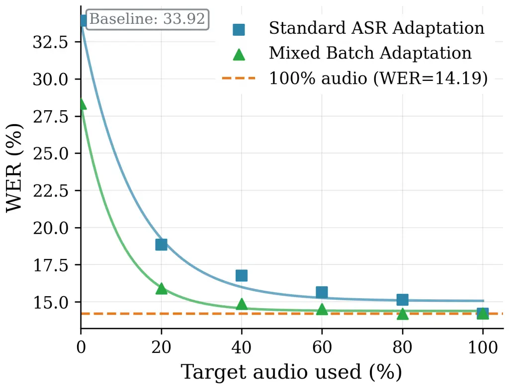
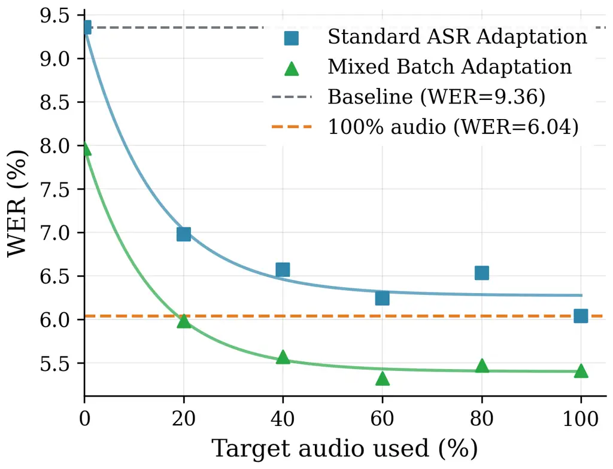
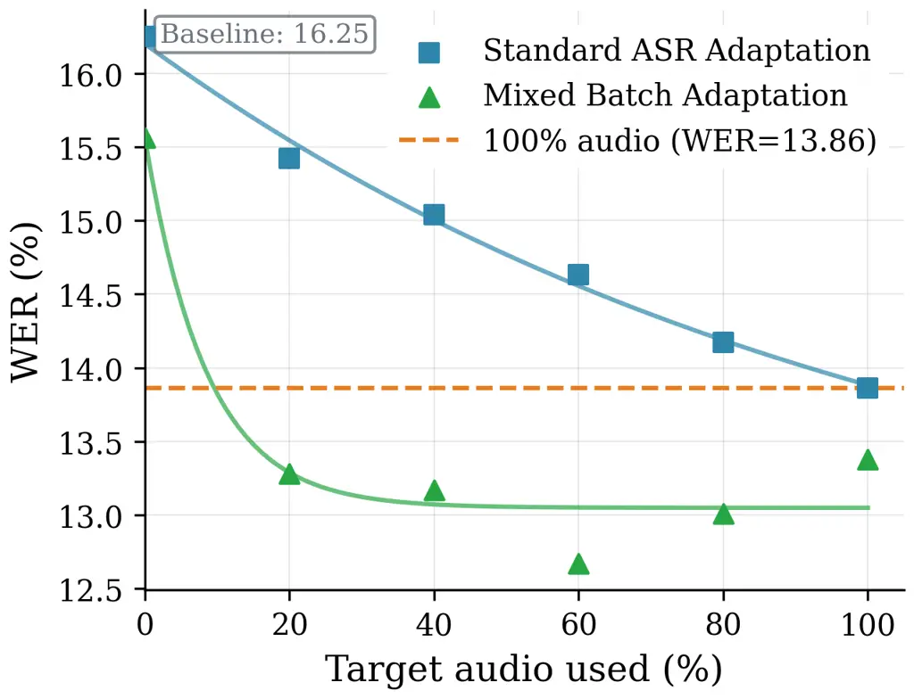
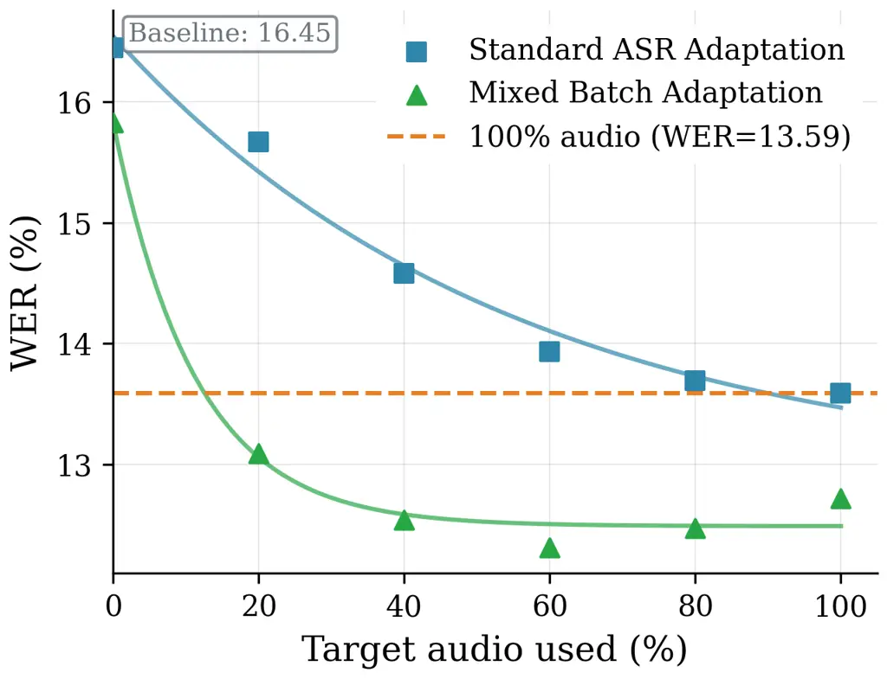
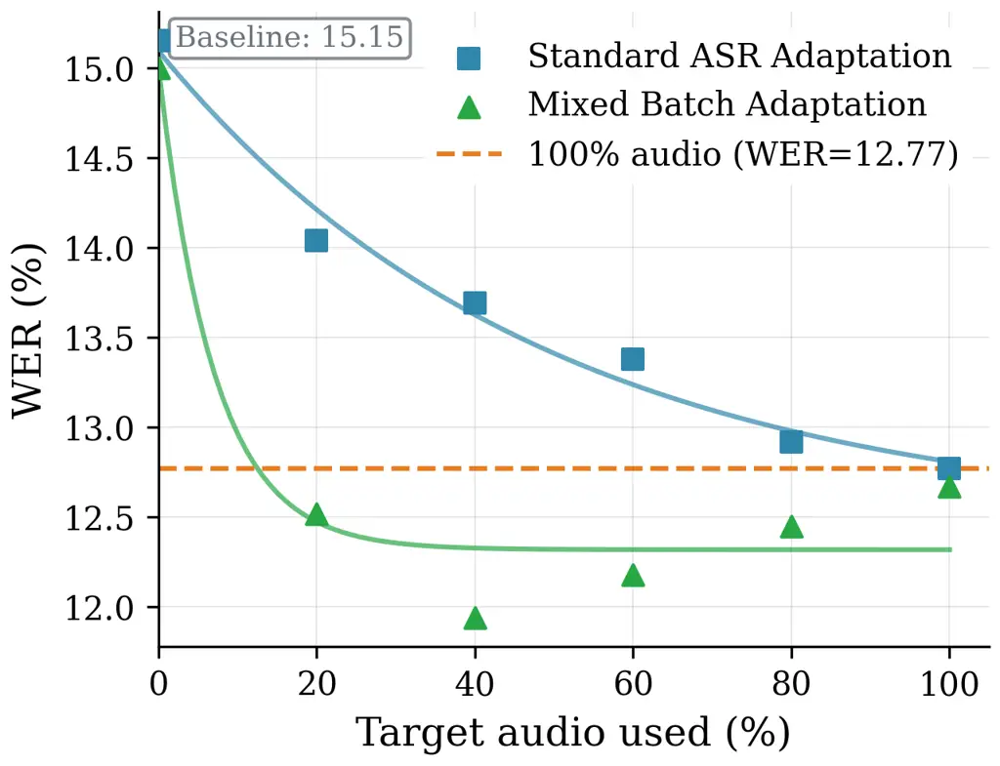

Bañeras-Roux Burdisso Villatoro-Tello Sánchez-Cortés Liu Baroudi Kumar
Watawana K E Hacioglu Motlicek Stolcke

# Closing the Speech-Text Gap with Limited Audio for Effective Domain Adaptation in LLM-based ASR

Thibault    Sergio    Esaú    Dairazalia    Shiran    Severin    Shashi
   Hasindri    Manjunath    Kadri    Petr    Andreas

###### Abstract

Conventional end-to-end automatic speech recognition (ASR) systems rely
on paired speech–text data for domain adaptation. Recent LLM-based ASR
architectures connect a speech encoder to a large language model via a
projection module, enabling adaptation with text-only data. However,
this introduces a modality gap, as the LLM is not exposed to the noisy
representations produced by the speech projector. We investigate whether
small amounts of speech can mitigate this mismatch. We compare three
strategies: text-only adaptation, paired speech–text adaptation, and
mixed batching (MB), which combines both. Experiments in in-domain and
out-of-domain settings show that even limited speech consistently
improves performance. Notably, MB using only 10% of the target-domain
(less than 4 hours) speech achieves word error rates comparable to, or
better than, conventional ASR fine-tuning with the full dataset,
indicating that small amounts of speech provide a strong
modality-alignment signal.

###### keywords

speech recognition, domain adaptation, low-resource training.

^(†)^(†)address: ¹ Idiap Research Institute, Switzerland  
² Laboratoire d’Informatique et des Systèmes, France  
³EPFL, Switzerland  
⁴ Uniphore, USA & India  
⁵ Brno University of Technology, Czech Republic ^(†)^(†)email:
{thibault.roux, sergio.burdisso, esau.villatoro}@idiap.ch

## 1 Introduction

Large language models (LLMs) have transformed speech processing,
enabling natural voice interactions. A common approach is LLM-based
automatic speech recognition (ASR), where a pretrained speech encoder is
connected to a pretrained language model through a lightweight
projection layer \[1, 2, 3, 4, 5, 6, 7\]. In particular, SLAM-ASR
achieves strong transcription performance without retraining the entire
system \[8, 9, 10, 11, 12\].

Rather than training from scratch, pretrained systems can be adapted to
new domains through fine-tuning on domain-specific data, transferring
learned representations \[13, 14, 15\]. However, adaptation to
specialized domains such as healthcare or finance remains challenging
because, although in-domain text is often abundant, labeled speech is
expensive to collect.

A standard adaptation strategy is to fine-tune the LLM using in-domain
transcripts only \[16, 17\]. However, this often creates a modality
gap \[burdisso2026_TOA, 18, 10, 17, 19\]: the model no longer receives
representations similar to those produced by the speech projector,
weakening speech-text alignment. Existing solutions, such as soft
prompting, generally assume a text-only setting \[18, 17, 19\] and do
not investigate whether limited target-domain speech can help preserve
cross-modal alignment.

In this work, we study adaptation across Banking, Insurance,
Agriculture, and Musical Instruments domains, analyzing the effect of
incorporating limited paired speech-text data through a mixed batching
strategy. We compare in-domain and cross-domain adaptation settings to
derive practical guidance for scenarios where target-domain text is
plentiful, but speech resources are scarce.

Our contributions are fourfold: (i) we analyze how the proportion of
target-domain data in training batches affects the tradeoff between
target-domain specialization and source-domain retention in LLM-based
ASR; (ii) we propose a hybrid adaptation method that incorporates
limited paired speech-text data into a predominantly text-based setting,
mitigating the modality gap introduced by text-only fine-tuning; (iii)
we show that the proposed mixed batching strategy reduces catastrophic
forgetting while improving target-domain recognition; and (iv) we
release our source code for reproducibility.¹¹ 1
[https://github.com/idiap/llm-asr-text-only-adaptation/blob/main/README-speech-text-gap.md](https://github.com/idiap/llm-asr-text-only-adaptation/blob/main/README-speech-text-gap.md)

## 2 Related Work

LLM-Based ASR. Recent work in ASR has shifted toward modular
architectures that couple pretrained self-supervised speech encoders
such as wav2vec 2.0 \[11\], HuBERT \[12\], or WavLM \[20\], with LLMs
such as LLaMA \[21\], or Vicuna \[22\]), through trainable projection
layers that map continuous acoustic features into the LLM embedding
space \[1, 23, 24, 25\]. In this work, we refer to this trainable
projection module as the speech projector, and to the overall
architecture as an LLM-based ASR system. Recent studies demonstrate that
such lightweight connectors, ranging from linear projections to
Q-Former-style modules, can yield competitive or state-of-the-art WER on
benchmarks like LibriSpeech without retraining the entire LLM \[1\].

Domain Adaptation in Low-Resource Scenarios. Adapting ASR systems to
specialized domains such as healthcare, legal, and finance remains a
practical necessity, as domain-specific terminology and discourse
patterns often diverge significantly from general-purpose training
corpora \[9, 26\]. In low-resource scenarios, the primary bottleneck is
the scarcity and cost of collecting in-domain speech data \[27, 28\],
motivating research into text-only domain adaptation. Rather than
retraining acoustic models with new audio, these approaches adapt
language models or decoding strategies using domain-specific documents
such as reports, transcripts, or vocabulary lists. More recent
work \[10, 29\] investigates zero-shot and semi-supervised adaptation,
where pretrained ASR models are specialized using textual resources.
Collectively, these approaches demonstrate that substantial
domain-specific WER reductions can be achieved through efficient use of
textual data, offering scalable solutions for low-resource deployment.

However, fine-tuning LLMs on clean text degrades their ability to
interpret “noisy” representations generated by upstream speech
projectors, leading to misalignment and degraded transcription
quality \[18\]. To address this, prior work has explored strategies such
as soft prompting \[10\], where learned continuous tokens condition the
LLM on speech features without rigid tokenization, and soft
discretization techniques \[4\].

## 3 Mixed Batching Strategy

We consider a domain adaptation setting for LLM-based ASR. First, a base
model is trained on source-domain paired speech-text data. This base
system learns the initial speech–text alignment and serves as the
starting point for all experiments.

We then adapt this pretrained model to a target domain using different
fine-tuning strategies. Depending on the setting, the target-domain data
may include text-only data, paired speech-text data, or a combination of
both. The goal of adaptation is to improve recognition performance on
the target domain while preserving performance on the original source
domain.

To mitigate the modality gap introduced by text-only adaptation, we
build upon the mixed batch composition strategy proposed in a previous
study \[18\]. In that work, the authors integrate target-domain
text-only data with source-domain auxiliary data during fine-tuning to
preserve speech-text alignment and mitigate catastrophic forgetting
while enabling adaptation without target-domain audio, by dividing each
batch into a source portion (auxiliary data) and a target-domain portion

In our experiments, we extend this strategy by integrating target-domain
audio into the batch composition. More precisely, similar to \[18\], the
source data in the batch is composed of three segments:

\(1\) Paired source speech-text (batch proportion $`\sigma_{a}`$): the
input to the model is a source-domain audio utterance, and the output is
its corresponding transcript. This component allows the model to
preserve the original audio-text alignment learned during base training.

(2) Projector-induced noisy tokens (batch proportion $`\sigma_{ta}`$):
the input to the model is a discrete sequence obtained by mapping each
speech projection to its nearest tokens in the LLM embedding space, and
the output is the corresponding clean transcript. This helps the model
to understand discrete text from projected speech representations.

(3) Synthetically corrupted source transcripts (batch proportion
$`\sigma_{t}`$): the input to the model is a corrupted transcript
generated through random character-level perturbations using nlpaug²² 2
[https://nlpaug.readthedocs.io/en/latest/augmenter/char/random.html](https://nlpaug.readthedocs.io/en/latest/augmenter/char/random.html)
(with the same parameters as in the original paper), and the output is
the original clean transcript. This discrete input sequence simulates
the irregularities observed in projected speech-token representations
without requiring audio.

Following the paired speech-text and synthetically corrupted
transcripts, the target portion of the batch consists of:

(1) Paired target speech-text (batch proportion $`\tau_{a}`$): the input
to the model is a target-domain audio utterance, and the output is its
corresponding transcript. This component induces the adaptation in real
target-domain acoustics and preserves speech-text alignment.

(2) Corrupted target transcripts (batch proportion $`\tau_{t}`$): the
input to the model is a corrupted target-domain transcript generated
through the same character-level perturbations as in $`\sigma_{t}`$, and
the output is the corresponding clean transcript. This component
supports domain-specific adaptation using text-only supervision.

While $`\tau_{t}`$ controls domain-specific language modeling,
$`\tau_{a}`$ keeps the adaptation grounded in real target-domain speech
and acoustics. From now on, we will refer the strategy described here as
Mixed Batch (MB).

## 4 Method

### 4.1 LLM-based ASR Architecture

In our experiments, the ASR system follows the SLAM-ASR framework \[1\].
The architecture consists of three main components: (i) a pretrained
speech encoder, (ii) a trainable speech projector, and (iii) an LLM.

Given a speech segment $`X^{S}`$, the speech encoder produces a sequence
of acoustic representations $`H^{S}=[h_{1}^{S},\dots,h_{T}^{S}]`$ over
$`T`$ time frames. To better match the token-level processing of the
LLM, this sequence is temporally downsampled by a factor $`k`$,
resulting in $`Z^{S}=[z_{1}^{S},\dots,z_{N}^{S}]`$ with $`N=T//k`$.

The downsampled representations are then passed through a linear speech
projector, which maps them into the LLM embedding space, producing
$`E^{S}`$. These projected embeddings are directly consumed by the LLM,
together with a task-specific prompt that conditions the model for
speech recognition. The LLM then autoregressively generates the output
transcript.

In our setup, we first train a base model using paired speech-text data
from the source corpus (see Section 4.2). During this stage, the speech
encoder is kept frozen, while the speech projector is fine-tuned to
learn the alignment between acoustic representations and the LLM
embedding space. This results in a base ASR system adapted to the source
domain.

The base model is subsequently adapted to target domains using the
various strategies described, by fine-tuning only LoRA adapters \[30\].
During adaptation, the speech encoder and the speech projector are
frozen, and only the LoRA modules inserted into the LLM are updated.
This design enables parameter-efficient specialization to the target
domain while preserving the previously learned speech–text alignment.

For both base training and adaptation, models are trained for 5 epochs
with a batch size of 10. The speech encoder is WavLM-Large \[20\], and
the LLM is
[Llama-3.2-3B-Instruct](https://huggingface.co/meta-llama/Llama-3.2-3B-Instruct) \[21\].

All experiments use a fixed instruction-style prompt. Specifically, the
LLM input follows the template:

where {speech} corresponds to the projected speech embeddings. This
prompt conditions the LLM to perform transcription in an
instruction-following setup consistent with its pretraining.

| Dataset     | Domain | Train  |       | Dev    |      | Test   |      |
| ----------- | ------ | ------ | ----- | ------ | ---- | ------ | ---- |
|             |        | \#Utts | Hrs   | \#Utts | Hrs  | \#Utts | Hrs  |
| Source      |        |        |       |        |      |        |      |
| DefinedAI   | B/I/H  | 17,398 | 38h10 | –      | –    | –      | –    |
| Slidespeech | L/T/E  | 34,692 | 34h59 | –      | –    | –      | –    |
| Target      |        |        |       |        |      |        |      |
| DefinedAI   | B      | 26,704 | 36h20 | 1,625  | 2h08 | 3,111  | 4h16 |
| DefinedAI   | I      | 32,249 | 46h54 | 1,951  | 2h45 | 3,807  | 5h30 |
| SlideSpeech | Ag     | 30,498 | 29h20 | 1,679  | 1h43 | 3,470  | 3h26 |
| SlideSpeech | An     | 56,593 | 49h48 | 3,283  | 2h55 | 7,005  | 5h50 |
| SlideSpeech | MI     | 9,981  | 8h30  | 852    | 0h44 | 984    | 0h54 |

Table 1: Datasets used for training, validation, and testing in our
experiments. From the DefinedAI corpus, we use Banking (B), Insurance
(I) and Healthcare (H) partitions. From the SlideSpeech corpus, we use
Life (L), Talent (T), English (E), Agriculture (Ag), Animation (An) and
Musical Instruments (MI). We provide the total number of utterances
(#Utts) and the duration (Hrs) of each partition.

### 4.2 Datasets and Domain Configuration

Our experiments leverage two corpora, DefinedAI³³ 3
[https://defined.ai/](https://defined.ai/) and SlideSpeech \[31\]. The
source-domain data comes from DefinedAI, encompassing Banking (B),
Insurance (I), and Healthcare (H) subsets. This dataset is used to
pretrain the projector and serve as auxiliary data during LLM
adaptation.

The target-domain data consists of specific subsets from both corpora.
From DefinedAI, we select the Banking partition to train and evaluate
in-domain adaptation. SlideSpeech contributes data from the Agriculture
(Ag) and Musical Instruments (MI) domains, representing
out-of-distribution scenarios with limited labeled audio. Table 1
summarizes the statistics for each dataset, including the number of
utterances and total audio duration for training, development, and test
splits.

## 5 Results

Before conducting the adaptation experiments, we first train a base ASR
model exclusively on the source-domain data from the DefinedAI corpus,
including the Banking, Insurance, and Healthcare partitions. This base
model serves as the starting point for all subsequent experiments. We
then perform domain adaptation on different target domains: (i) the
in-domain DefinedAI Banking set, and (ii) out-of-distribution domains
from the SlideSpeech corpus, namely Agriculture (Ag) and Musical
Instruments (MI). All adaptation strategies described in the following
sections are applied to this same base model to ensure controlled
comparisons across domains and training settings.

### 5.1 Target Data Proportion in Text-Only Adaptation

We investigate the effect of varying the proportion of target text data
per batch ($`\tau_{t}`$) in the text-only adaptation setting. No audio
is included ($`\tau_{a}=0`$); the remaining portion of a batch is split
uniformly among the various types of source-domain text data.

Figure 1: Effect of different target text proportions ($`\tau_{t}`$) on
mixed-batch adaptation on DefinedAI Banking.

(a) Banking

(b) Agriculture

(c) Musical Instruments

Figure 2: Performance of the base ASR and adapted models. The figure
compares standard ASR adaptation using only paired speech–text data with
mixed-batch adaptation combining paired speech–text and text-only
samples. The x-axis indicates the proportion of speech in the adaptation
data, ranging from 0% (text-only) to 100% (paired speech–text).

As shown in Figure 1, performance follows a clear tradeoff pattern.
Increasing $`\tau_{t}`$ initially improves recognition accuracy,
reaching optimal performance around $`\tau_{t}=50\%`$. Beyond this
point, performance degrades, reflecting a balance between: (1) Low
$`\tau_{t}`$: excessive reliance on auxiliary data, which may be
repeatedly sampled and lead to overfitting. (2) High $`\tau_{t}`$:
insufficient exposure to auxiliary data, potentially causing
underfitting and partial catastrophic forgetting.

Based on these results, we adopted $`\tau=\tau_{t}+\tau_{a}=50\%`$ in
all experiments and $`\sigma`$ values being uniformly distributed, as
that seems to provide the best performance.

### 5.2 Paired Speech-Text vs. Mixed-Batch Adaptation

We now look at whether text-only adaptation combined with a small amount
of audio can reduce the modality gap between text-only and paired
speech-text training. Both in previous studies \[18, 8, 17\] and in our
current setup, we observe an important performance difference between
the text-only adapted model and the speech-text adapted model. In
particular, in our experience, paired speech-text adaptation outperforms
text-only adaptation by 1.83% in absolute WER ($`\approx`$ 29% relative
improvement) on the Banking domain (4.55% vs. 6.38%), highlighting a
substantial modality gap. We therefore investigate whether incorporating
a small quantity of target-domain audio during adaptation can
effectively bridge this gap, and if the system can get close to the
best-case scenario where we have full audio. More specifically, we
compare:

- •
  Speech-text adaptation, or standard ASR adaptation, where the model is
  fine-tuned exclusively on various amount of labeled speech with the
  associated transcript.
- •
  Mixed-batch adaptation, where text-based adaptation is complemented
  with a small quantity of audio speech with associated transcript
  (i.e., text-only and paired speech-text together comprise the full
  training set).

We fine-tune the base model using different fractions of each corpus,
including setups with very limited speech data. This allows us to study
how the model adapts under low-resource conditions, where the available
audio alone is insufficient to achieve strong performance, as well as
under scenarios with progressively more adaptation speech.

Figure 2 shows that mixed-batch adaptation consistently outperforms
paired speech-text training. Adding speech to a text-adapted model leads
to larger gains than training on the same amount of paired speech-text.
With only 10% of the adaptation corpus containing speech (corresponding
to 3h37, 2h55, and 50m for Banking, Agriculture, and Musical
Instruments, respectively), we obtain performance comparable or better
than using the full speech corpus. This suggests that text adaptation
can improve an LLM’s domain-specific abilities, while additional speech
helps align audio representations with the embedding space of the LLM,
thereby reducing the modality gap.

Across all target domains, we observe that mixed-batch adaptation
achieves its peak performance at $`\sim`$60% of the corpus consists of
paired speech-text examples, after which the gains slightly decrease. We
hypothesize that this behavior arises from the presence of synthetically
generated noisy transcripts in the batch, which introduce additional
diversity in the inputs, seemingly helping the model to learn more
robust mappings between speech and text representations. Mixed batching
seems not only leverages the benefits of target-domain text adaptation,
but could improve generalization under low-resource conditions.

However, as the amount of available speech increases, the performance
difference between the two strategies gradually diminishes. When
sufficient speech data is available, both approaches converge toward
similar recognition accuracy (with respect to mixed-batch adaptation and
paired speech-text adaptation: 4.19% vs. 4.55% for Banking, 15.91% vs.
16.04% for Agriculture, 16.97% vs. 15.97% for Musical Instruments),
indicating that audio supervision alone eventually becomes sufficient.
For in-domain adaptation (Banking), mixed-batch adaptation still shows a
slight advantage, likely due to the contribution of auxiliary data drawn
from the same domain.

### 5.3 Analysis of Catastrophic Forgetting

To assess the impact of adaptation on previously learned knowledge, we
evaluate all systems on both source-domain and target-domain test sets.
In this analysis, the source domain corresponds to the DefinedAI (B/I/H)
data used for base training, while the target domain is the DefinedAI
Banking subset. This setup allows us to quantify potential catastrophic
forgetting.

Figure 3: Performances of base system and adapted model with text-only,
paired speech-text and mixed-batch adaptation. For both audio-adaptation
settings, the share of speech data is 20%.

As shown in Figure 3, the base model achieves a WER of 12.8% on the
source domain and 8.0% on the target domain. This indicates that, in our
setup, the target test set is easier than the source data for speech
recognition. When adapting using paired speech-text (with 20% of target
audio), we observe a degradation in the source domain, even though the
adaptation remains in-domain. While recognition improves on the target
domain, the accuracy drop in the source domain is evidence of
catastrophic forgetting. In contrast, text-only and mixed-batch
adaptation result in an improvement in target-domain performance while
limiting degradation on the source domain.

## 6 Conclusions

In this work, we have investigated domain adaptation for LLM-based ASR
in settings where target-domain speech is limited, while textual data is
abundant. We identified the modality mismatch introduced by text-only
fine-tuning as a key factor behind performance degradation and proposed
a hybrid batching strategy that mixes speech-text pairs with text to
address this issue.

By integrating auxiliary source data with both corrupted target text and
a controlled proportion of target-domain audio, our approach preserves
speech-text alignment while enabling effective domain adaptation.
Through systematic experiments, we showed that using our hybrid batch
method, even with modest amounts of target-domain audio, substantially
improves recognition accuracy and mitigates catastrophic forgetting.
Notably, combining text data with a small fraction of audio can
outperform adaptation using the full audio dataset, highlighting the
data efficiency of the proposed strategy.

We also observed a clear tradeoff between adapting to the target domain
and preserving performance on the source domain, with respect to batch
composition. Our findings provide practical modeling guidelines for real
application scenarios.

## 7 Acknowledgments

This work was supported by an Idiap Research Institute and Uniphore
collaboration project. Part of this work was also supported by EU
Horizon 2020 project ELOQUENCE.

## 8 Generative AI Use Disclosure

Generative AI was used to proofread the paper, fix orthographic and
grammatical errors, and shorten the length of some sections.

## 9 Appendices

To further assess the trends observed in the main experiments, Figures 4
and 5 report the same comparison on additional domains and datasets. The
results consistently support the findings discussed in Section 5.2:
mixed-batch adaptation provides substantial gains when only a small
amount of paired speech-text data is available, often reaching
performance comparable to that obtained with substantially more speech.
As the proportion of paired speech-text data increases, the performance
gap between the two adaptation strategies gradually narrows. These
additional results therefore reinforce the observation that combining
domain-specific text with a limited amount of speech can effectively
reduce the modality gap and improve adaptation in low-resource settings.

(a) Animation

(b) Insurance

Figure 4: Performance of the base ASR pretrained on DefinedAI and
adapted models. The figure compares standard ASR adaptation using only
paired speech–text data with mixed-batch adaptation combining paired
speech–text and text-only samples. The x-axis indicates the proportion
of speech in the adaptation data, ranging from 0% (text-only) to 100%
(paired speech–text).

(a) Agriculture

(b) Animation

(c) Musical Instruments

Figure 5: Performance of the base ASR pretrained on DefinedAI and
adapted models. The figure compares standard ASR adaptation using only
paired speech–text data with mixed-batch adaptation combining paired
speech–text and text-only samples. The x-axis indicates the proportion
of speech in the adaptation data, ranging from 0% (text-only) to 100%
(paired speech–text).

## References

- \[1\] Z. Ma, G. Yang, Y. Yang, Z. Gao, J. Wang, Z. Du, F. Yu, Q.
  Chen, S. Zheng, S. Zhang, et al. (2024) An embarrassingly simple
  approach for LLM with strong ASR capacity. arXiv preprint
  arXiv:2402.08846. Cited by: §1, §2, §4.1.
- \[2\] M. Wang, W. Han, I. Shafran, Z. Wu, C. Chiu, Y. Cao, N. Chen, Y.
  Zhang, H. Soltau, P. K. Rubenstein, et al. (2023) SLM: bridge the thin
  gap between speech and text foundation models. In 2023 IEEE Automatic
  Speech Recognition and Understanding Workshop (ASRU), pp. 1–8. Cited
  by: §1.
- \[3\] W. Yu, C. Tang, G. Sun, X. Chen, T. Tan, W. Li, L. Lu, Z. Ma,
  and C. Zhang (2024) Connecting speech encoder and large language model
  for asr. In ICASSP 2024-2024 IEEE International Conference on
  Acoustics, Speech and Signal Processing (ICASSP), pp. 12637–12641.
  Cited by: §1.
- \[4\] M. Yang, S. Chen, J. Xie, and H. L. John Hansen (2025) Bridging
  the modality gap: softly discretizing audio representation for
  LLM-based automatic speech recognition. In 2025 IEEE Automatic Speech
  Recognition and Understanding Workshop (ASRU), Vol. , pp. 1–7.
  External Links:
  [Document](https://dx.doi.org/10.1109/ASRU65441.2025.11434631) Cited
  by: §1, §2.
- \[5\] S. Kumar, I. Thorbecke, S. Burdisso, E. Villatoro-Tello, M.
  KE, K. Hacioğlu, P. Rangappa, P. Motlicek, A. Ganapathiraju, and A.
  Stolcke (2025) Performance evaluation of slam-asr: the good, the bad,
  the ugly, and the way forward. In 2025 IEEE International Conference
  on Acoustics, Speech, and Signal Processing Workshops (ICASSPW),
  pp. 1–5. Cited by: §1.
- \[6\] S. Burdisso, E. Villatoro-Tello, S. Kumar, S. Madikeri, A.
  Carofilis, P. Rangappa, M. K E, K. Hacioglu, P. Motlicek, and A.
  Stolcke (2026) Reducing prompt sensitivity in LLM-based speech
  recognition through learnable projection. In Proc. IEEE ICASSP, Cited
  by: §1.
- \[7\] E. Villatoro-Tello, S. Burdisso, S. Kumar, H. Watawana, S.
  Madikeri, M. K E, J. Prakash, T. Bañeras-Roux, K. Hacioglu, P.
  Motlicek, and A. Stolcke (2026) Context projector: complementary
  keyword and dialogue context embeddings for LLM-based ASR. In Proc.
  Interspeech, Cited by: §1.
- \[8\] L. Xu, H. Xie, S. J. Qin, X. Tao, and F. L. Wang (2026)
  Parameter-efficient fine-tuning methods for pretrained language
  models: a critical review and assessment. IEEE Transactions on Pattern
  Analysis and Machine Intelligence. Cited by: §1, §5.2.
- \[9\] H. Zheng, L. Shen, A. Tang, Y. Luo, H. Hu, B. Du, Y. Wen, and D.
  Tao (2025) Learning from models beyond fine-tuning. Nature Machine
  Intelligence 7 (1), pp. 6–17. Cited by: §1, §2.
- \[10\] Y. Li, Y. Wu, J. Li, and S. Liu (2023) Prompting large language
  models for zero-shot domain adaptation in speech recognition. In 2023
  IEEE Automatic Speech Recognition and Understanding Workshop (ASRU),
  pp. 1–8. Cited by: §1, §1, §2, §2.
- \[11\] A. Baevski, Y. Zhou, A. Mohamed, and M. Auli (2020) Wav2vec
  2.0: a framework for self-supervised learning of speech
  representations. Advances in Neural Information Processing Systems 33,
  pp. 12449–12460. Cited by: §1, §2.
- \[12\] W. Hsu, B. Bolte, Y. H. Tsai, K. Lakhotia, R. Salakhutdinov,
  and A. Mohamed (2021) Hubert: self-supervised speech representation
  learning by masked prediction of hidden units. IEEE/ACM Transactions
  on Audio, speech, and Language Processing 29, pp. 3451–3460. Cited by:
  §1, §2.
- \[13\] R. Joshi and A. Singh (2022) A simple baseline for domain
  adaptation in end to end ASRsystems using synthetic data. In
  Proceedings of the Fifth Workshop on e-Commerce and NLP (ECNLP 5),
  pp. 244–249. Cited by: §1.
- \[14\] S. Khurana, A. Laurent, and J. Glass (2022) Magic dust for
  cross-lingual adaptation of monolingual wav2vec-2.0. In ICASSP
  2022-2022 IEEE International Conference on Acoustics, Speech and
  Signal Processing (ICASSP), pp. 6647–6651. Cited by: §1.
- \[15\] J. Huang, O. Kuchaiev, P. O’Neill, V. Lavrukhin, J. Li, A.
  Flores, G. Kucsko, and B. Ginsburg (2020) Cross-language transfer
  learning, continuous learning, and domain adaptation for end-to-end
  automatic speech recognition. arXiv preprint arXiv:2005.04290. Cited
  by: §1.
- \[16\] L. Zheng, X. Wang, Q. Zhao, and T. Li (2025) Two-stage domain
  adaptation for LLM-based ASR by decoupling linguistic and acoustic
  factors. Applied Sciences 16 (1), pp. 60. Cited by: §1.
- \[17\] Y. Fang, J. Peng, X. Li, Y. Xi, C. Zhang, G. Zhong, and K.
  Yu (2025) Low-resource domain adaptation for speech LLMs via text-only
  fine-tuning. arXiv preprint arXiv:2506.05671. Cited by: §1, §5.2.
- \[18\] A. Carofilis, S. Burdisso, E. Villatoro-Tello, S. Kumar, K.
  Hacioglu, S. Madikeri, P. Rangappa, M. K. E, P. Motlicek, S.
  Venkatesan, and A. Stolcke (2026) Text-only adaptation in LLM-based
  ASR through text denoising. External Links: 2601.20900,
  [Link](https://arxiv.org/abs/2601.20900) Cited by: §1, §2, §3, §3,
  §5.2.
- \[19\] Y. Ma, Z. Liu, and O. Kalinli (2024) Effective text adaptation
  for LLM-based ASR through soft prompt fine-tuning. In 2024 IEEE Spoken
  Language Technology Workshop (SLT), pp. 64–69. Cited by: §1.
- \[20\] S. Chen, C. Wang, Z. Chen, Y. Wu, S. Liu, Z. Chen, J. Li, N.
  Kanda, T. Yoshioka, X. Xiao, et al. (2022) WavLM: large-scale
  self-supervised pre-training for full stack speech processing. IEEE
  Journal of Selected Topics in Signal Processing 16 (6), pp. 1505–1518.
  Cited by: §2, §4.1.
- \[21\] A. Grattafiori, A. Dubey, A. Jauhri, A. Pandey, A. Kadian, A.
  Al-Dahle, A. Letman, A. Mathur, A. Schelten, A. Vaughan, et al. (2024)
  The Llama 3 herd of models. arXiv preprint arXiv:2407.21783. Cited by:
  §2, §4.1.
- \[22\] W. Chiang, Z. Li, Z. Lin, Y. Sheng, Z. Wu, H. Zhang, L.
  Zheng, S. Zhuang, Y. Zhuang, J. E. Gonzalez, et al. (2023) Vicuna: an
  open-source chatbot impressing GPT-4 with 90% ChatGPT quality. See
  https://vicuna. lmsys. org (accessed 14 April 2023) 2 (3), pp. 6.
  Cited by: §2.
- \[23\] C. Tang, W. Yu, G. Sun, X. Chen, T. Tan, W. Li, L. Lu, M.
  Zejun, and C. Zhang (2024) SALMONN: Towards Generic Hearing Abilities
  for Large Language Models. In The Twelfth International Conference on
  Learning Representations, Cited by: §2.
- \[24\] J. Wu, Y. Gaur, Z. Chen, L. Zhou, Y. Zhu, T. Wang, J. Li, S.
  Liu, B. Ren, L. Liu, et al. (2023) On decoder-only architecture for
  speech-to-text and large language model integration. In 2023 IEEE
  Automatic Speech Recognition and Understanding Workshop (ASRU),
  pp. 1–8. Cited by: §2.
- \[25\] S. Ghosh, A. Goel, J. Kim, S. Kumar, Z. Kong, S. Lee, C. H.
  Yang, R. Duraiswami, D. Manocha, R. Valle, et al. (2025) Audio
  Flamingo 3: advancing audio intelligence with fully open large audio
  language models. In The Thirty-ninth Annual Conference on Neural
  Information Processing Systems, Cited by: §2.
- \[26\] P. Rangappa, A. Carofilis, J. Prakash, S. Kumar, S.
  Burdisso, S. Madikeri, E. Villatoro-Tello, B. Sharma, P. Motlicek, K.
  Hacioglu, et al. (2025) Efficient data selection for domain adaptation
  of ASR using pseudo-labels and multi-stage filtering. In Proc.
  Interspeech, pp. 4928–4932. Cited by: §2.
- \[27\] M. Bhattacharjee, P. Motlicek, S. Madikeri, H. Helmke, O.
  Ohneiser, M. Kleinert, and H. Ehr (2024) Minimum effort adaptation of
  automatic speech recognition system in air traffic management.
  European Journal of Transport and Infrastructure Research 42 (4),
  pp. 133–153. Cited by: §2.
- \[28\] S. Ng, L. Xu, I. Siegert, N. Cummins, N. R. Benway, J. Liss,
  and V. Berisha (2026) An end-to-end overview of clinical speech AI.
  IEEE Transactions on Audio, Speech and Language Processing. Cited by:
  §2.
- \[29\] D. Hwang, A. Misra, Z. Huo, N. Siddhartha, S. Garg, D.
  Qiu, K. C. Sim, T. Strohman, F. Beaufays, and Y. He (2022) Large-scale
  ASR domain adaptation using self-and semi-supervised learning. In
  ICASSP 2022-2022 IEEE International Conference on Acoustics, Speech
  and Signal Processing (ICASSP), pp. 6627–6631. Cited by: §2.
- \[30\] E. J. Hu, yelong shen, P. Wallis, Z. Allen-Zhu, Y. Li, S.
  Wang, L. Wang, and W. Chen (2022) LoRA: low-rank adaptation of large
  language models. In International Conference on Learning
  Representations, External Links:
  [Link](https://openreview.net/forum?id=nZeVKeeFYf9) Cited by: §4.1.
- \[31\] H. Wang, F. Yu, X. Shi, Y. Wang, S. Zhang, and M. Li (2024)
  Slidespeech: a large scale slide-enriched audio-visual corpus. In
  ICASSP 2024-2024 IEEE International Conference on Acoustics, Speech
  and Signal Processing (ICASSP), pp. 11076–11080. Cited by: §4.2.
