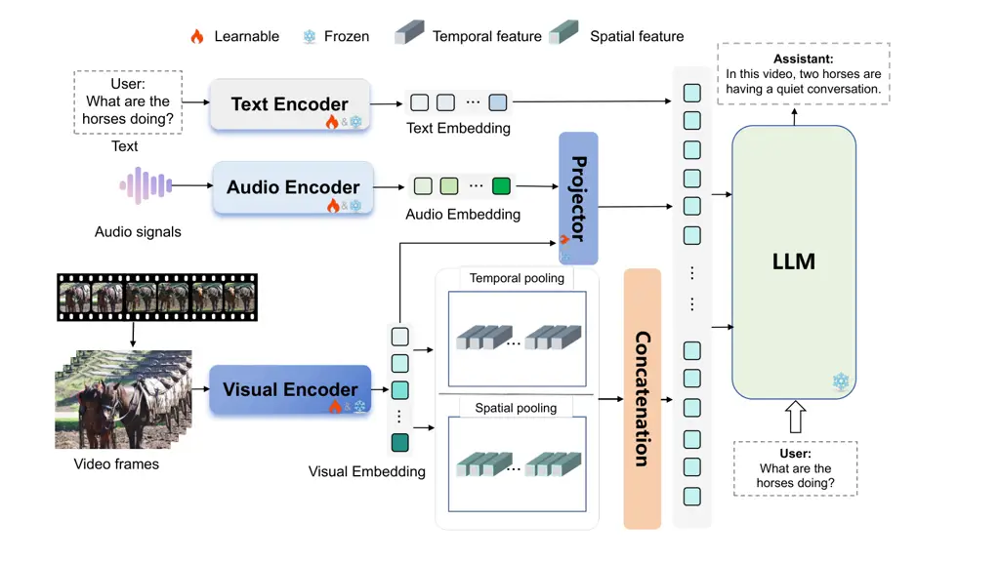
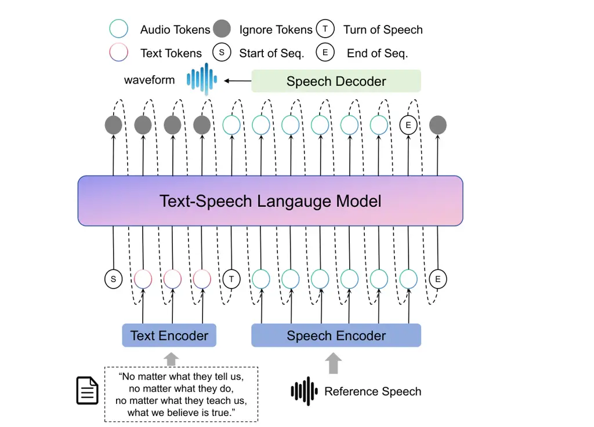
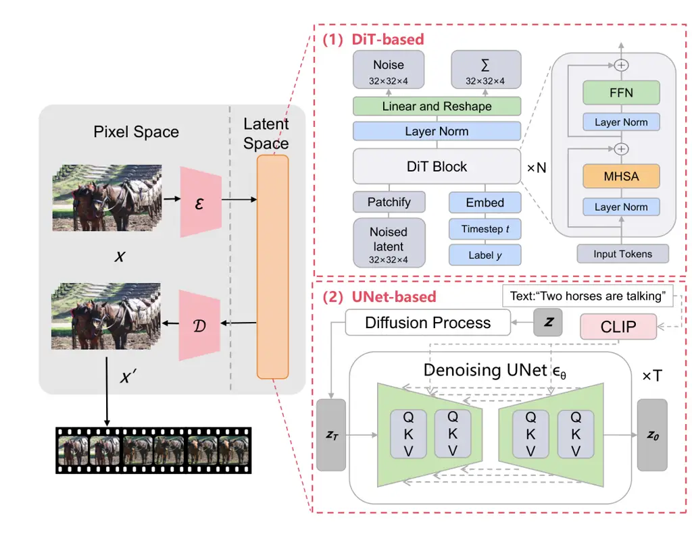

# Multimodal Large Language Model-Enabled Video Translation: A Role-Oriented Survey

Bingzheng Qu    Kehai Chen    Xuefeng Bai    Min Zhang ^(†)^(†)thanks:
Bingzheng Qu, Kehai Chen, Xuefeng Bai, and Min Zhang are with the School
of Computer Science and Technology, Harbin Institute of Technology
(Shenzhen), Shenzhen 518055, Guangdong, China.^(†)^(†)thanks:
Corresponding author: Kehai Chen (email:
chenkehai@hit.edu.cn).^(†)^(†)thanks: Bingzheng Qu: qbzz@stu.hit.edu.cn;
Xuefeng Bai: baixuefeng@hit.edu.cn; Min Zhang: zhangmin2021@hit.edu.cn.

###### Abstract

Recent progress in multimodal large language models (MLLMs) is reshaping
video translation from a cascaded pipeline of automatic speech
recognition, machine translation, text-to-speech, and lip
synchronization into a unified multimodal reasoning and generation
problem. High-quality video translation requires not only semantic
fidelity, but also temporal alignment, speaker consistency, and
emotional expressiveness across visual, acoustic, and linguistic
streams. This survey provides a focused review of MLLM-enabled video
translation through a role-oriented taxonomy. We organize MLLM-enabled
and MLLM-relevant studies into three functional roles: Semantic
Reasoner, which grounds translation in video understanding, temporal
reasoning, and multimodal fusion; Expressive Performer, which supports
controllable and context-aware speech generation; and Visual
Synthesizer, which enables lip synchronization and visually coherent
speaker rendering. We further summarize representative datasets,
benchmarks, and metrics for each role, and discuss how current
evaluation protocols fall short of end-to-end video translation
requirements. Finally, we identify open challenges in long-form video
understanding, temporal modeling, multimodal alignment, multilingual
robustness, and responsible deployment, outlining future directions for
natural and trustworthy cross-lingual video communication.

###### Index Terms: 

Multimodal Large Language Models, Text-to-Speech, Video Generation,
Video Translation, Video Understanding.

^(†)^(†)impactstatement: Video translation is increasingly important for
multilingual communication in education, entertainment, conferencing,
and public services. Yet existing systems often handle speech
recognition, machine translation, speech synthesis, and lip
synchronization as separate modules, weakening semantic fidelity,
speaker consistency, timing, and emotional expressiveness. This survey
shows how multimodal large language models can support more integrated
video translation by coordinating visual, acoustic, and textual
reasoning. Through a three-role taxonomy of Semantic Reasoner,
Expressive Performer, and Visual Synthesizer, it connects advances in
video understanding, controllable speech generation, and visual
synthesis. It also organizes datasets, benchmarks, and metrics, helping
guide more natural, accessible, and trustworthy cross-lingual video
translation systems.

## I Introduction

VIDEO translation aims to make video content accessible across languages
while preserving the semantic, acoustic, and visual experience of the
original content. Unlike text-only machine translation or speech
translation, video translation requires a system to jointly maintain
semantic fidelity, speaker identity, temporal alignment, lip
synchronization, and emotional expressiveness. These requirements are
increasingly important in multilingual video conferencing, online
education, entertainment, social media, and public communication, where
translated videos must remain both linguistically accurate and
perceptually natural.

Conventional video translation systems are usually built as cascaded
pipelines involving automatic speech recognition (ASR), machine
translation (MT), text-to-speech (TTS), and lip synchronization \[1, 2,
3, 4, 5\]. Although such pipelines are modular and practical, they often
suffer from error propagation and weak cross-modal coordination. For
example, ASR errors can distort downstream translation, translated
speech may fail to match the timing and emotion of the source video, and
lip-sync modules may generate visually plausible but semantically
disconnected facial motions. These limitations suggest that video
translation should be studied not only as a sequence of independent
subtasks, but also as an integrated multimodal reasoning and generation
problem.

Recent advances in multimodal large language models (MLLMs) provide a
new foundation for this integrated perspective. MLLMs have advanced from
vision-language pretraining and multimodal instruction tuning \[6, 7, 8,
9, 10\] to video-centric understanding, temporal reasoning, and
audio-visual modeling \[11, 12, 13, 14\]. Meanwhile, large-scale speech
generation and video generation models have improved controllability,
expressiveness, and visual realism \[15, 16, 17, 18\]. These advances
make it possible to reconsider video translation as a unified process in
which visual, acoustic, and textual signals are jointly interpreted,
translated, synthesized, and aligned. However, existing studies are
still scattered across video understanding, speech synthesis, speech
translation, talking-head generation, and video generation, leaving a
lack of systematic organization for MLLM-enabled video translation. In
this survey, we use the term MLLM-enabled video translation to denote
systems and methods in which multimodal language models provide semantic
understanding, cross-modal reasoning, planning, or coordination for
translating videos. We distinguish these core MLLM components from
supporting generation modules, such as expressive TTS, lip
synchronization, talking-head animation, and enabling visual backbones.
The latter are included only when their mechanisms are directly relevant
to translated-video generation, such as speaker preservation, duration
control, emotion transfer, audio-visual synchronization, or
identity-consistent rendering.

|                      |      |                              |                |                |                |                                                           |
| -------------------- | ---- | ---------------------------- | -------------- | -------------- | -------------- | --------------------------------------------------------- |
| Survey               | Year | Main Scope                   | SR             | EP             | VS             | Missing Link                                              |
| Shen et al. \[19\]   | 2024 | Multimodal MT                | $`\triangle`$  | –              | –              | Multimodal translation without speech or visual synthesis |
| Das et al. \[20\]    | 2025 | Video-guided MT              | $`\checkmark`$ | –              | –              | Video-guided text translation only                        |
| Yin et al. \[21\]    | 2024 | General MLLMs                | $`\checkmark`$ | $`\triangle`$  | $`\triangle`$  | Broad MLLM scope; not video-translation-specific          |
| Tang et al. \[22\]   | 2025 | Video Understanding          | $`\checkmark`$ | –              | –              | Video comprehension without cross-lingual generation      |
| Wu et al. \[23\]     | 2025 | Temporal Grounding           | $`\checkmark`$ | –              | –              | Temporal localization without translation/generation      |
| Gupta et al. \[24\]  | 2024 | Speech-to-speech Translation | $`\triangle`$  | $`\checkmark`$ | –              | Speech translation with limited visual synchronization    |
| Xie et al. \[25\]    | 2025 | Controllable TTS             | –              | $`\checkmark`$ | –              | Speech controllability without video grounding            |
| Xing et al. \[17\]   | 2024 | Video Diffusion              | –              | –              | $`\triangle`$  | Generic generation without translation constraints        |
| Rakesh et al. \[26\] | 2025 | Talking-head Generation      | –              | $`\triangle`$  | $`\checkmark`$ | Speaker animation without semantic translation            |

- •
  SR: Semantic Reasoner; EP: Expressive Performer; VS: Visual
  Synthesizer. $`\checkmark`$ indicates central coverage, $`\triangle`$
  indicates partial or related coverage.

TABLE I: Comparison with existing surveys related to MLLM-enabled video
translation.

To address this gap, this survey provides a role-oriented review of
MLLM-enabled video translation. Instead of treating ASR, MT, TTS, and
lip synchronization as isolated modules, we organize the literature
according to the functional roles that MLLMs and MLLM-related models can
play in the translation pipeline. The main contributions are summarized
as follows:

- •
  Role-oriented framework for MLLM-enabled video translation: We
  formulate video translation as an integrated multimodal reasoning and
  generation problem, where visual, acoustic, and textual signals are
  jointly used to preserve semantic fidelity, temporal alignment,
  speaker consistency, and emotional expressiveness.
- •
  Three-role taxonomy of existing methods: We organize related studies
  into three functional roles: _Semantic Reasoner_, which supports video
  understanding, temporal reasoning, and multimodal grounding;
  _Expressive Performer_, which supports controllable and context-aware
  speech generation; and _Visual Synthesizer_, which supports lip
  synchronization and visually coherent speaker rendering.
- •
  Role-oriented analysis of datasets, benchmarks, and metrics: We
  summarize representative resources and evaluation protocols for each
  role, and discuss the gap between current proxy evaluations and the
  requirements of end-to-end video translation.
- •
  Discussion of open challenges and future directions: We identify key
  challenges in long-form video understanding, temporal modeling,
  multimodal alignment, multilingual robustness, real-time deployment,
  and responsible use, providing a roadmap for future MLLM-enabled video
  translation systems.

The remainder of this survey is organized as follows. Section II
describes the literature search protocol and the relation to existing
surveys. Section III introduces the preliminaries of video translation
and MLLMs. Section IV presents the proposed role-oriented taxonomy.
Section V reviews representative benchmarks, datasets, and evaluation
metrics. Section VI discusses limitations and future research
directions. Section VII concludes the survey.

## II Survey Methodology and Scope

### II-A Literature Search Protocol

To ensure focused coverage, we adopted a role-oriented literature search
protocol. We searched IEEE Xplore, ACM Digital Library, ACL Anthology,
arXiv, Google Scholar, and Semantic Scholar for studies published up to
May 2026. We also traced references from representative and highly cited
studies to include relevant foundational works. Studies were included if
they contributed to at least one functional role in MLLM-enabled video
translation: semantic reasoning over video, expressive speech
generation, visual synchronization or speaker rendering, or benchmark
and evaluation design. We excluded generic image-language, TTS, or video
generation works unless they provide mechanisms directly relevant to
video translation, such as multimodal grounding, cross-lingual transfer,
expressive speech rendering, duration control, lip synchronization,
identity preservation, or temporally coherent speaker synthesis. For
duplicate or extended versions, we prioritized the peer-reviewed,
latest, or most complete version. The retained studies were organized
according to their functional role, modality coverage, task formulation,
and evaluation protocol.

### II-B Relation to Existing Surveys

Existing surveys have covered related areas, including multimodal and
video-guided machine translation, general MLLMs, video understanding
with LLMs, speech-to-speech translation, controllable speech synthesis,
video diffusion, and talking-head generation \[19, 20, 21, 22, 24, 25,
17, 26\]. However, they typically address isolated components rather
than the full path from multimodal grounding to target-language speech
and visual rendering. In contrast, this survey treats MLLM-enabled video
translation as an integrated reasoning-and-generation task. As
summarized in Table I, we organize existing studies into three roles:
Semantic Reasoner, Expressive Performer, and Visual Synthesizer, thereby
linking semantic grounding, cross-lingual transfer, expressive speech
generation, and temporally aligned visual synthesis.

## III Preliminaries

### III-A Video Translation

Video translation aims to transform a source-language video into a
target-language video or subtitle stream while preserving the meaning,
timing, speaker identity, prosody, emotion, and visual coherence of the
original content. A conventional video translation pipeline typically
consists of automatic speech recognition (ASR) \[1\], machine
translation (MT) \[2\], text-to-speech (TTS) \[3\], and lip
synchronization \[4\]. Its component technologies have evolved from
classical and neural ASR \[27, 28, 29, 30\], statistical and neural
MT \[31, 32, 33\], parametric and neural TTS \[34, 35, 36\], to lip
synchronization and talking-head generation \[37, 38, 39\]. Although
these modules can be developed independently, their errors and design
choices are tightly coupled in video translation.

ASR converts source speech into transcripts and timestamps, providing
the textual and temporal basis for downstream translation. Recognition
or segmentation errors may propagate to MT and alter the intended
meaning or speaker attribution. MT converts source-language transcripts
into target-language text, but in video translation it must also
consider visual context, speaker turns, timing constraints, and
cross-lingual duration differences. TTS renders the translated text into
speech and therefore determines naturalness, speaker similarity,
prosody, emotion, and speaking rate. Finally, lip synchronization or
talking-head generation aligns the translated speech with mouth
movements and facial dynamics, making upstream errors visually apparent.

### III-B Multimodal Large Language Models

Multimodal large language models (MLLMs) extend large language models
with visual, acoustic, or other modality inputs, enabling them to
perform cross-modal understanding, reasoning, and generation \[7, 9,
40\]. In typical MLLM architectures, modality-specific encoders extract
visual or audio features, and projection modules or adapters map these
features into token representations that can interact with the language
model. Through multimodal pretraining, instruction tuning, and
cross-modal alignment, MLLMs can connect language with objects, events,
speakers, temporal relations, and acoustic cues. The development of
MLLMs is closely related to scalable Transformer architectures, vision
Transformers, contrastive vision-language pretraining, and
video-language representation learning \[41, 6, 42, 43, 44, 45, 46, 47,
48, 49\]. More recent unified multimodal systems further extend this
line of work toward image, video, audio, language, and action
modeling \[50, 51, 52, 53\].

For video translation, MLLMs are valuable not simply as generic video
understanding models, but as potential coordinators of multimodal
reasoning and generation. They can ground ambiguous utterances in visual
context, maintain cross-shot semantic consistency, guide expressive
speech synthesis, and support temporally aligned visual rendering. This
motivates a role-oriented view of MLLM-enabled video translation, where
different models and techniques are analyzed according to their
functions in semantic reasoning, expressive speech generation, and
visual synthesis.

{forest}

Fig. 1: Role-oriented taxonomy of MLLM-enabled video translation. The
taxonomy separates three levels of relevance: core MLLM reasoning
methods, translation-supporting speech and visual generation methods,
and enabling generative backbones. Core methods directly perform
multimodal understanding or cross-lingual planning, while supporting and
enabling methods are discussed only through their contribution to
translated-video quality.

## IV A Multi-Role Taxonomy for MLLM-Enabled Video Translation

Building on the role-oriented framework introduced above, we propose a
multi-role taxonomy for MLLM-enabled video translation. As shown in
Fig. 1, the taxonomy organizes existing methods according to their
functional contribution to the translation pipeline rather than by
isolated task boundaries such as ASR, MT, TTS, and lip synchronization.
Specifically, we divide MLLM-enabled video translation into three
interconnected roles: the _Semantic Reasoner_, which interprets source
videos and produces translation-aware multimodal representations; the
_Expressive Performer_, which renders translated content into natural
and contextually appropriate speech; and the _Visual Synthesizer_, which
aligns translated speech with visually coherent speaker motion. This
role-oriented view clarifies how recent advances in video understanding,
speech generation, and visual synthesis can jointly support high-quality
cross-lingual video communication.

- •
  The Semantic Reasoner (Section IV-A): This role focuses on
  understanding the source video before and during translation. It
  grounds linguistic content in visual, acoustic, and temporal context,
  including speaker attribution, event boundaries, visual references,
  emotional cues, and long-range temporal structure. In our taxonomy,
  this role includes multimodal grounding, temporal and event reasoning,
  cross-lingual planning, and efficient adaptation.
- •
  The Expressive Performer (Section IV-B): This role focuses on
  generating target-language speech that is not only intelligible and
  semantically faithful, but also expressive and synchronized with the
  source video. It covers speech-token language modeling, prompt- and
  emotion-controlled TTS, and diffusion- or flow-based acoustic
  rendering. These techniques support speaker similarity, prosody,
  rhythm, emotion, and duration control in translated speech.
- •
  The Visual Synthesizer (Section IV-C): This role focuses on rendering
  the translated speech into visually coherent speaker motion. It
  includes lip synchronization, talking-head animation, and enabling
  visual backbones that support identity preservation, mouth-shape
  alignment, facial expression consistency, and temporal coherence. This
  role reduces perceptual mismatch between synthesized speech and
  on-screen appearance.

Fig. 2: Typical architecture of an MLLM-enabled video understanding
model. Text, audio, and video inputs are encoded by trainable or frozen
modality-specific encoders. The resulting embeddings are projected,
temporally and spatially pooled, and concatenated into multimodal
tokens.

### IV-A The Semantic Reasoner

As the comprehension and inference core of MLLM-enabled video
translation, the Semantic Reasoner is responsible for converting source
videos into semantically grounded, temporally organized, and
translation-aware representations. Unlike generic video understanding,
semantic reasoning for video translation must support cross-lingual
meaning transfer while preserving speaker attribution, event boundaries,
visual context, emotional cues, and temporal order. These capabilities
are essential because many translation decisions cannot be reliably
inferred from ASR transcripts alone, especially in videos with multiple
speakers, off-screen references, scene changes, gestures, or visually
grounded expressions. As shown in Fig. 1, we organize Semantic Reasoner
methods into four functional categories: _Multimodal Grounding_,
_Temporal/Event Reasoning_, _Cross-lingual Planning_, and _Efficient
Adaptation_.

#### IV-A1 Multimodal Grounding

Multimodal grounding establishes the basic interface between video
content and language reasoning. In most video-MLLM pipelines, visual
frames, audio signals, or clip-level features are first encoded by
modality-specific encoders and then projected into the token space of a
language model through linear projection, Q-Former-style modules,
cross-attention, or other adapter mechanisms. Once aligned with textual
prompts, these multimodal tokens allow the LLM to perform question
answering, instruction following, and semantic interpretation over video
content.

Representative methods differ in how they align visual, acoustic, and
textual information. Video-ChatGPT \[11\] adapts visual encoders for
video instruction following and introduces video-oriented instruction
data and evaluation. Video-LLaMA \[12\] incorporates both visual and
audio branches, making it more relevant to translation scenarios where
acoustic events and speech cues complement visual context.
LLaMA-VID \[13\] improves efficiency by representing each frame with
compact context and content tokens, while VideoChat \[54\],
Valley \[55\], VideoChat2 \[56\], InternVideo2 \[14\], and Video-LLaMA
3 \[57\] further strengthen video-language alignment through improved
video encoders or large-scale multimodal pretraining. For video
translation, such grounding is crucial for resolving visually dependent
ambiguities, identifying speakers and objects, and maintaining
consistency between translated expressions and the visual scene.

#### IV-A2 Temporal & Event Reasoning

Beyond static grounding, video translation requires temporal and
event-level reasoning. A translation system must determine when an
utterance occurs, which visual event it refers to, how speaker turns
evolve, and how long the translated output can last without breaking
audiovisual synchronization. This makes long-context modeling, temporal
localization, event segmentation, and motion-aware reasoning central to
the Semantic Reasoner.

Recent video-MLLMs address these challenges from different perspectives.
MovieChat \[58\], MovieLLM \[59\], LongVLM \[60\], MA-LMM \[61\], and
Video-XL \[62\] focus on long-form video comprehension by introducing
memory mechanisms, hierarchical representations, or efficient long-video
processing. TimeChat \[63\], VTimeLLM \[64\], Momentor \[65\],
LITA \[66\], VTG-LLM \[67\], and Time-R1 \[68\] emphasize temporal
grounding, moment localization, and fine-grained event reasoning.
VideoLLM-online \[69\] further explores streaming video understanding,
which is important for real-time translation settings. These methods
help video translation systems preserve temporal coherence, avoid
mistranslating visually grounded events, and align translated speech
with actions, pauses, and scene transitions. Related dense captioning,
long-form pretraining, streaming understanding, and temporal search
studies further show that event abstraction, temporal retrieval, and
keyframe selection are important for scaling video reasoning to
realistic translation scenarios \[70, 71, 72, 73, 74, 75\].

#### IV-A3 Cross-lingual Planning

Cross-lingual planning connects multimodal understanding with
translation-oriented decision making. While many MLLMs can describe or
answer questions about videos, video translation additionally requires
planning how source-language meaning should be transferred into
target-language text or speech under timing, speaker, and modality
constraints. This category therefore includes methods that support
speech-to-speech translation, multimodal translation, or visually
grounded machine translation.

Early direct speech-to-speech translation systems \[5\] reduce error
propagation by mapping source speech directly to target speech or target
representations. SEAMLESSM4T \[76\] extends this direction toward
massively multilingual and multimodal translation, providing a
foundation for multilingual speech and text transfer. More recent
audio-visual translation systems, such as AV2AV \[77\], explore direct
audio-visual speech-to-audio-visual speech translation, which is closely
aligned with the goal of translated-video generation. In addition,
adaptive speech-text alignment \[78\] and multimodal text-image
translation \[79\] highlight the importance of aligning linguistic
transfer with non-textual context. In MLLM-enabled video translation,
cross-lingual planning can guide what should be translated, when it
should be spoken, which contextual cues should be preserved, and how the
translation should interact with downstream speech and visual synthesis
modules.

#### IV-A4 Efficient Adaptation

Efficient adaptation determines whether large multimodal models can be
practically applied to video translation. Since video inputs are long,
redundant, and computationally expensive, directly fine-tuning
full-scale MLLMs is often infeasible. Parameter-efficient tuning,
lightweight temporal modules, visual token reduction, and reuse of
pretrained image-language models are therefore important for building
scalable Semantic Reasoners.

LLaMA-Adapter \[80\] demonstrates that instruction tuning can be
achieved by inserting lightweight learnable prompts into a frozen
language model. BT-Adapter \[81\] extends this idea to video by
introducing a temporal branch that enriches visual representations
without fully updating the backbone. Otter \[82\] explores multimodal
in-context instruction tuning, while PG-Video-LLaVA \[83\],
PLLaVA \[84\], RED-VILLM \[85\], REEF \[86\], and VLog \[87\]
investigate different strategies for video instruction tuning, efficient
adaptation, or relevance-aware video representation. For video
translation, these methods are important because practical systems must
process long videos, multiple speakers, and streaming inputs under
memory and latency constraints. Efficient adaptation also makes it
easier to specialize a general MLLM toward translation-specific
reasoning without retraining.

### IV-B The Expressive Performer

The Expressive Performer is responsible for rendering translated
linguistic content into natural, intelligible, and contextually
appropriate speech. In video translation, speech generation is not
merely a text-to-audio conversion problem. The generated speech must
preserve speaker identity, prosody, rhythm, emotion, speaking style, and
duration constraints so that it remains consistent with the source video
and can be synchronized with the visual stream. This requirement makes
expressive speech generation a central component of MLLM-enabled video
translation. As shown in Fig. 1, we organize related methods into three
functional categories: _Speech-token Language Modeling_, _Prompt &
Emotion Control_, and _Diffusion & Flow Rendering_.

#### IV-B1 Speech-token Language Modeling

Speech-token language modeling treats speech generation as a sequence
modeling problem over semantic, acoustic, or neural codec tokens.
Instead of directly predicting waveforms, these methods first represent
speech as discrete or structured token sequences and then use
language-model-like architectures to generate target speech. This
paradigm is particularly suitable for video translation because
translated speech must preserve linguistic content while allowing
control over speaker identity, style, and temporal structure. A typical
MLLM-enabled TTS architecture is illustrated in Fig. 3.

Recent systems demonstrate the effectiveness of this paradigm. VALL-E
R \[88\] improves the robustness of neural codec language modeling
through monotonic alignment between phoneme and acoustic token
sequences. CosyVoice \[89\] and CosyVoice 2 \[15\] use
language-model-based semantic token prediction together with flow-based
acoustic modeling to support scalable multilingual and streaming speech
synthesis. Spark-TTS \[90\] adopts a single-stream token design with a
BiCodec representation to enable fine-grained acoustic control.
Fish-Speech \[91\], HALL-E \[92\], VoxInstruct \[93\], MegaTTS 2 \[94\],
MegaTTS 3 \[95\], and Seed-TTS \[96\] further explore codec language
modeling, hierarchical token generation, prompting mechanisms, and
large-scale speech generation. For video translation, these methods
provide a flexible basis for generating target-language speech while
retaining speaker similarity and expressive variability.

#### IV-B2 Prompt & Emotion Control

Prompt- and emotion-controlled TTS focuses on controlling how the
translated speech should be spoken. In video translation, the target
utterance should not only be semantically correct but also match the
emotional tone, communicative intent, and audiovisual context of the
original video. Natural-language prompts, style descriptions, reference
speech, and preference signals provide convenient interfaces for
controlling prosody, emotion, speaking rate, and vocal style. Earlier
controllable and style-aware TTS systems, such as StyleTTS \[97\],
GenerSpeech \[98\], DurIAN-E \[99\], GradStyleSpeech \[100\], and
CLAM-TTS \[101\], also provide important foundations for modeling
speaker style, prosody, and expressive variation.

PromptTTS \[102\] and PromptTTS 2 \[103\] introduce text-prompt-based
speech style control, enabling synthesis systems to follow
natural-language descriptions of voice characteristics.
InstructTTS \[104\] extends this idea by modeling expressive TTS in a
discrete latent space guided by style instructions. EMO-DPO \[105\] uses
direct preference optimization to improve emotional controllability,
while StyleTTS 2 \[106\] enhances naturalness and style modeling through
diffusion and adversarial training with speech language modeling.
ControlSpeech \[107\] targets simultaneous control of speaker cloning
and language style, and SC VALL-E \[108\] introduces style-controllable
zero-shot speech synthesis. These methods are important because
emotional mismatch, unnatural prosody, or incorrect rhythm can make a
translated video perceptually inconsistent despite accurate textual
translation.

#### IV-B3 Diffusion & Flow Rendering

Diffusion- and flow-based speech rendering methods focus on
high-fidelity acoustic generation. While speech-token language models
provide flexible linguistic and speaker-level modeling, the final speech
waveform or acoustic representation must still be rendered with high
naturalness, stability, and temporal precision. Diffusion models and
flow-matching methods are therefore increasingly used to improve speech
quality, robustness, and controllability.

F5-TTS \[16\] and E2 TTS \[109\] simplify zero-shot TTS with
flow-matching-based generation, reducing reliance on complex handcrafted
pipelines. Voicebox \[110\] formulates speech generation as text-guided
speech infilling and supports multilingual speech generation, editing,
and denoising. NaturalSpeech 2 \[111\] and NaturalSpeech 3 \[112\] use
latent diffusion and factorized codec representations to improve
naturalness and zero-shot synthesis quality. DiTTO-TTS \[113\],
Mask-GCT \[114\], SimpleSpeech 2 \[115\], FlashSpeech \[116\],
DEX-TTS \[117\], and ARDiT \[118\] further explore diffusion
transformers, masked generation, scalar latent diffusion, consistency
acceleration, style disentanglement, and autoregressive diffusion. In
video translation, these rendering techniques are valuable because
speech must be not only natural, but also stable under duration
constraints and suitable for downstream lip synchronization.

Fig. 3: A typical architecture of MLLM-enabled text-to-speech synthesis.

Fig. 4: Comparison between UNet-based and DiT-based enabling visual
backbones. UNet-based models commonly employ convolutional
encoder–decoder denoisers with temporal modules, whereas DiT-based
models represent videos as spatio-temporal latent tokens and perform
denoising with Transformer blocks. In video translation, these backbones
are mainly relevant when adapted for audio-driven lip motion,
identity-preserving talking-head animation, and temporally coherent
speaker rendering.

### IV-C The Visual Synthesizer

The Visual Synthesizer is responsible for converting translated speech
and multimodal control signals into visually coherent speaker motion.
Unlike general video generation, visual synthesis in video translation
is constrained by the source video, the target-language speech, and the
identity of the original speaker. A high-quality system must align mouth
movements with translated phonemes, preserve facial identity and
expression, maintain temporal consistency across frames, and handle
duration mismatches introduced by cross-lingual translation. Therefore,
this section focuses on three functionally relevant directions: lip
synchronization, talking-head animation, and enabling visual backbones.

#### IV-C1 Lip Synchronization

Lip synchronization is the most direct visual requirement in video
translation. Given the translated speech and the source video, lip-sync
methods modify the mouth region so that visible articulatory motion
matches the target-language audio. Early systems relied on
phoneme-to-viseme rules or handcrafted facial animation, but they often
failed under large pose variations, expressive speech, or cross-lingual
duration changes. Recent neural methods learn audio-visual
correspondences from data and generate more realistic mouth movements.

Representative methods include Wav2Lip \[4\], which uses a lip-sync
expert to improve audio-visual synchronization in unconstrained videos,
and VideoReTalking \[119\], which edits talking-head videos by combining
expression editing and lip synchronization. TalkLip \[120\] further
introduces lip-reading guidance to strengthen the consistency between
generated lip motion and spoken content. Diffusion-based methods such as
Diff2Lip \[121\], MuseTalk \[122\], LatentSync \[123\], and
OmniSync \[18\] improve visual quality by performing audio-conditioned
generation or inpainting in latent spaces. For video translation, these
methods are especially important because translated speech often differs
from the source speech in phoneme structure, word order, and duration,
making direct reuse of the original lip motion insufficient.

#### IV-C2 Talking-head Animation

While lip synchronization focuses mainly on mouth motion, talking-head
animation aims to generate a more complete facial performance, including
head pose, expression, eye movement, and identity-preserving facial
dynamics. This is important for translated videos in which the target
speech must not only match the lips, but also remain consistent with the
speaker’s emotion, style, and visual identity.

Few-shot talking-head generation \[39\] shows that realistic neural
talking heads can be synthesized from limited identity-specific data.
IP-LAP \[124\] improves identity preservation by incorporating landmark
and appearance priors. More recent avatar-oriented systems, such as
Kling-Avatar \[125\], OmniHuman-1 \[126\], MIDAS \[127\], and
Empathyear \[128\], extend facial animation toward long-duration,
instruction-driven, or interactive digital-human generation. In the
context of video translation, these systems provide a path beyond
mouth-only editing: they can potentially coordinate translated speech
with facial expression, head motion, and communicative intent, which is
crucial for natural dubbed videos and multilingual virtual avatars.

#### IV-C3 Enabling Visual Backbones

General video generative models are not video translation systems by
themselves, but their backbone designs provide important mechanisms for
high-fidelity and temporally coherent visual synthesis. As shown in
Fig. 4, two representative families are UNet-based diffusion models and
diffusion Transformer (DiT)-based models. The backbone discussion builds
on UNet-based image generation, latent diffusion, diffusion
Transformers, and early text-to-image or text-to-video generation
studies \[129, 130, 131, 132, 133, 134, 135, 136\].

UNet-based video diffusion models extend image diffusion architectures
with temporal layers, motion modules, or latent-space video
representations. Models such as Stable Video Diffusion \[137\],
AnimateDiff \[138\], VideoCrafter \[139\], and Tune-A-Video \[140\]
demonstrate that pretrained image generators can be adapted to video
generation while preserving spatial fidelity. Their relevance to video
translation lies in localized editing, identity-preserving inpainting,
and temporally stable facial rendering.

DiT-based video generation models replace convolutional denoisers with
Transformer-based denoising over spatio-temporal latent tokens.
Representative models such as CogVideoX \[141\], Vidu \[142\],
Phantom \[143\], HunyuanVideo \[144\], Wan \[145\], and
Prompt-A-Video \[146\] improve long-range temporal modeling and
text-video alignment. For video translation, these properties are useful
when visual synthesis must maintain consistent speaker identity, facial
motion, and scene-level continuity across longer translated segments.
However, because most of these models are designed for general video
generation rather than audio-driven translated-video editing, their
direct application still requires stronger audio conditioning, identity
constraints, and controllable synchronization mechanisms.

## V Benchmarks, Metrics, and Evaluation Protocols

Evaluating MLLM-enabled video translation is challenging because the
task involves semantic transfer, expressive speech generation, and
visual synchronization at the same time. Existing studies rarely provide
a unified end-to-end benchmark for translated videos. Therefore, current
evaluation is mostly role-level and proxy-based: video question
answering benchmarks are used to assess semantic reasoning, speech
datasets and perceptual metrics are used to evaluate expressive
performance, and lip-sync or video generation metrics are used to
measure visual synthesis quality. This section summarizes these
evaluation practices according to the three roles in our taxonomy and
discusses their limitations for end-to-end video translation tasks.

|                                                        |                 |                   |                        |      |
| ------------------------------------------------------ | --------------- | ----------------- | ---------------------- | ---- |
| Model                                                  | MSVD-QA \[147\] | MSRVTT-QA \[147\] | ActivityNet-QA \[148\] | Avg. |
| _Audio-visual and omni-modal MLLMs_                    |                 |                   |                        |      |
| FAVOR \[149\]                                          | 67.8            | 59.3              | –                      | 63.5 |
| Dolphin \[150\]                                        | 72.7            | 62.6              | 49.1                   | 61.5 |
| Video-SALMONN \[151\]                                  | 67.9            | 59.5              | –                      | 63.7 |
| AV-LLM \[152\]                                         | 67.3            | 53.7              | 47.2                   | 56.1 |
| OneLLM \[40\]                                          | 56.5            | 53.8              | –                      | 55.1 |
| _Video-language alignment and grounding_               |                 |                   |                        |      |
| Video-ChatGPT \[11\]                                   | 64.9            | 49.3              | 35.2                   | 49.8 |
| Video-LLaMA \[12\]                                     | 51.6            | 29.6              | 12.4                   | 31.2 |
| LLaMA-VID \[13\]                                       | 69.7            | 57.7              | 47.4                   | 58.3 |
| VideoChat2 \[56\]                                      | 70.0            | 54.1              | 49.1                   | 57.7 |
| IG-VLM \[153\]                                         | 76.7            | 62.7              | 57.3                   | 65.6 |
| PLLaVA \[84\]                                          | 76.6            | 62.0              | 56.3                   | 65.0 |
| _Temporal and event reasoning_                         |                 |                   |                        |      |
| MovieChat \[58\]                                       | 61.0            | 49.7              | 51.5                   | 54.1 |
| LongVLM \[60\]                                         | 70.0            | 59.8              | 47.6                   | 59.1 |
| VTimeLLM \[64\]                                        | 69.8            | 58.8              | 45.5                   | 58.0 |
| ST-LLM \[154\]                                         | 74.6            | 63.2              | 50.9                   | 62.9 |
| Slot-VLM \[155\]                                       | 74.9            | 69.7              | 48.3                   | 64.3 |
| VideoLLaMA 3 \[57\]                                    | –               | –                 | 58.2                   | 58.2 |
| GPT4-Video \[156\]                                     | –               | –                 | 59.5                   | 59.5 |
| _Efficient adaptation and other representative models_ |                 |                   |                        |      |
| LLaMA-Adapter \[80\]                                   | 54.9            | 43.8              | 34.2                   | 44.3 |
| PG-Video-LLaVA \[83\]                                  | 64.1            | 51.6              | 39.9                   | 51.9 |
| RED-VILLM \[85\]                                       | 71.2            | 53.9              | 44.2                   | 56.4 |
| MiniGPT4-video \[157\]                                 | 73.9            | 58.8              | 44.4                   | 59.0 |

TABLE II: Zero-shot open-ended VideoQA accuracy of representative MLLMs.
Higher scores are better.

### V-A Semantic Reasoner Evaluation

The Semantic Reasoner is usually evaluated through video understanding
and video question answering benchmarks. These benchmarks measure
whether a model can identify objects, actions, events, temporal
relations, and scene-level context from video input. Although they are
not designed specifically for video translation, they provide useful
proxy evidence for evaluating whether a model can ground translation
decisions in visual and temporal information.

Representative benchmarks include MSRVTT-QA \[147\], MSVD-QA \[147\],
and ActivityNet-QA \[148\]. MSRVTT-QA is built on MSR-VTT \[158\] and
contains diverse open-domain videos with large-scale question–answer
pairs, making it suitable for evaluating general video-language
understanding. MSVD-QA is derived from MSVD \[159\] and focuses on
short, relatively simple clips, which makes it useful for testing basic
visual grounding. ActivityNet-QA contains longer untrimmed videos and
questions requiring temporal and event-level reasoning, making it more
relevant to realistic video translation scenarios where speaker actions,
scene transitions, and temporal dependencies affect translation choices.

However, high performance on VideoQA benchmarks does not necessarily
imply high-quality video translation. These benchmarks mainly evaluate
visual-language understanding, while video translation additionally
requires cross-lingual adequacy, timing control, speaker consistency,
and audiovisual alignment. Therefore, the results in Table II should be
interpreted as evidence of semantic reasoning ability rather than direct
evidence of end-to-end translation quality.

### V-B Expressive Performer Evaluation

The Expressive Performer is evaluated by the quality, intelligibility,
speaker similarity, and controllability of synthesized speech. Unlike
ordinary TTS evaluation, video translation requires the generated speech
to preserve not only linguistic content, but also speaking rhythm,
emotion, speaker identity, and duration constraints imposed by the
source video. Table III summarizes representative Expressive Performer
models according to their functional roles in video translation.
Speech-token language models mainly improve zero-shot voice cloning and
scalable speech generation; prompt- and emotion-control models provide
explicit control over speaking style and affect; diffusion- and
flow-based renderers improve acoustic fidelity and stability. These
capabilities are complementary for video translation, where the
generated speech must preserve target-language meaning while matching
speaker identity, rhythm, emotion, and video timing constraints.

|                                |                     |                |                              |                                                                |
| ------------------------------ | ------------------- | -------------- | ---------------------------- | -------------------------------------------------------------- |
| Method                         | Category            | Zero-shot      | Main Control                 | Key Architecture                                               |
| _Speech-token Language Models_ |                     |                |                              |                                                                |
| CosyVoice \[89\]               | Speech-token LM     | $`\checkmark`$ | Speaker, multilingual style  | Semantic tokenizer + text-to-token LLM + flow matching decoder |
| CosyVoice 2 \[15\]             | Speech-token LM     | $`\checkmark`$ | Streaming, speaker style     | FSQ tokenizer + streamlined LLM + chunk-aware flow matching    |
| Spark-TTS \[90\]               | Speech-token LM     | $`\checkmark`$ | Speaker, acoustic attributes | Qwen-based LLM + BiCodec tokenizers                            |
| VALL-E R \[88\]                | Speech-token LM     | $`\checkmark`$ | Speaker prompt               | Neural codec LM + monotonic alignment                          |
| HALL-E \[92\]                  | Speech-token LM     | $`\checkmark`$ | Long-form speech             | Hierarchical neural codec LM                                   |
| _Prompt and Emotion Control_   |                     |                |                              |                                                                |
| PromptTTS \[160\]              | Prompt control      | $`\times`$     | Style prompt                 | BERT-based style encoder + speech decoder                      |
| PromptTTS 2 \[103\]            | Prompt control      | $`\times`$     | Descriptive prompt           | NaturalSpeech 2 backbone + variation network                   |
| InstructTTS \[104\]            | Prompt control      | $`\times`$     | Natural-language style       | Style encoder + discrete diffusion model                       |
| EMO-DPO \[105\]                | Emotion control     | $`\times`$     | Emotion preference           | Emotion-aware LLM-TTS + DPO fine-tuning                        |
| StyleTTS 2 \[106\]             | Style control       | $`\checkmark`$ | Speaker, style               | Style diffusion + adversarial speech LM discriminator          |
| _Diffusion and Flow Rendering_ |                     |                |                              |                                                                |
| F5-TTS \[16\]                  | Flow rendering      | $`\checkmark`$ | Speaker prompt               | ConvNeXt encoder + flow matching DiT                           |
| E2 TTS \[109\]                 | Flow rendering      | $`\checkmark`$ | Speaker prompt               | Filler-token modeling + flow matching generator                |
| Voicebox \[110\]               | Flow rendering      | $`\checkmark`$ | Speech infilling             | Flow matching for text-guided speech infilling                 |
| NaturalSpeech 2 \[111\]        | Diffusion rendering | $`\checkmark`$ | Speaker prompt               | Codec encoder-decoder + latent diffusion                       |
| Mask-GCT \[114\]               | Codec generation    | $`\checkmark`$ | Speaker prompt               | Masked generative codec Transformer                            |

TABLE III: Representative Expressive Performer models for speech
synthesis and controllable speech generation.

|                     |              |             |                         |
| ------------------- | ------------ | ----------- | ----------------------- |
| Dataset             | Language     | Scale       | Primary Use             |
| LibriLight \[161\]  | English      | 60k h       | Speech Pretraining      |
| LibriTTS \[162\]    | English      | 585 h       | Speaker Synthesis       |
| LibriSpeech \[163\] | English      | 1k h        | ASR and Intelligibility |
| MLS \[164\]         | Multilingual | Large-scale | Multilingual Speech     |
| Emilia \[165\]      | Multilingual | Large-scale | Zero-shot TTS           |

TABLE IV: Representative speech datasets for Expressive Performer
evaluation.

Training and evaluation datasets for this role usually come from speech
recognition, speech synthesis, and speech representation learning.
LibriLight \[161\] provides large-scale unlabeled speech for
self-supervised acoustic representation learning. LibriSpeech \[163\] is
widely used for ASR and intelligibility evaluation. LibriTTS \[162\],
derived from LibriSpeech with improved segmentation and punctuation, is
commonly used for TTS training and evaluation. These datasets support
robust speech modeling, but they are mostly audiobook-style English
corpora and do not fully cover multilingual, conversational, emotional,
noisy, or video-synchronized speech conditions.

Common evaluation metrics include mean opinion score (MOS) for
naturalness, word error rate (WER) for intelligibility, speaker
similarity for identity preservation, and prosodic measures such as
pitch and duration consistency. For controllable TTS, emotion accuracy
and style similarity are also important. Nevertheless, zero-shot results
are difficult to compare across papers unless the same speakers,
prompts, languages, and evaluation protocols are used. For video
translation, future benchmarks should evaluate whether synthesized
speech matches the translated semantics, the source speaker identity,
and the temporal structure of the original video.

### V-C Visual Synthesizer Evaluation

The Visual Synthesizer is evaluated by how well the translated speech is
visually rendered on the speaker’s face and body. Existing evaluation
usually focuses on lip synchronization, visual fidelity, identity
preservation, and temporal consistency. Lip-sync methods are commonly
assessed with SyncNet-based metrics such as LSE-D and LSE-C, which
estimate the alignment between audio and mouth motion. Talking-head and
video generation methods are often evaluated with image or video quality
metrics such as FID, FVD, identity similarity, and perceptual
similarity.

These metrics are useful but incomplete. A model may obtain strong
lip-sync scores while still producing unnatural expressions, identity
drift, temporal flicker, or mismatched emotion. Conversely, a visually
realistic talking-head model may fail to align precisely with
target-language phonemes. Therefore, visual synthesis evaluation for
video translation should jointly consider audio-visual synchronization,
identity preservation, expression consistency, and robustness to
cross-lingual duration mismatch.

### V-D End-to-End Evaluation Gaps

Current role-level benchmarks provide useful diagnostic signals, but
they do not fully measure the quality of translated videos. A complete
evaluation protocol should combine automatic metrics with human
assessment across multiple dimensions: semantic adequacy, translation
fluency, speech naturalness, speaker similarity, emotional consistency,
lip synchronization, visual fidelity, temporal coherence, and overall
user preference.

Overall, existing evaluation remains fragmented. VideoQA benchmarks do
not test translation quality, speech metrics do not evaluate visual
grounding, and lip-sync metrics do not measure semantic adequacy. A
major open direction is therefore to develop end-to-end multilingual
video translation benchmarks with aligned source videos, target speech,
visual outputs, and human evaluation protocols.

## VI Limitations and Future Directions

Although MLLMs provide a promising foundation for video translation,
current systems remain far from reliable, natural, and deployable
cross-lingual video communication. Existing methods are still limited by
incomplete video understanding, weak temporal and multimodal alignment,
fragmented evaluation protocols, insufficient multilingual robustness,
high deployment cost, and growing safety concerns. This section
discusses these limitations and outlines future directions.

### VI-A Fine-grained and Long-form Video Understanding

Accurate video translation requires models to understand not only spoken
content, but also visual context, speaker behavior, emotion, gestures,
object interactions, and scene transitions. Current MLLMs still struggle
with fine-grained visual semantics \[166, 65, 149\] and long-form video
understanding \[58, 60, 59, 63, 167, 168\]. These limitations are
particularly harmful for translation because ambiguous utterances,
deixis, speaker turns, and visually grounded references often cannot be
resolved from ASR transcripts alone.

Future work should develop hierarchical and event-aware video
representations that combine global narrative structure with local
semantic details. Adaptive frame sampling \[169\], attention-guided
token selection \[170\], memory-augmented modeling, and retrieval-based
context expansion may reduce redundant visual tokens while preserving
translation-relevant information. More importantly, future datasets
should provide temporally grounded annotations of speakers, events,
emotions, and visual references, enabling models to learn which visual
cues should influence translation decisions.

### VI-B Temporal and Cross-modal Alignment

Temporal alignment is central to video translation. A translated
sentence must remain synchronized with source speech, speaker motion,
facial expression, and visual events. However, current systems often
model video frames, audio signals, ASR transcripts, and translated text
as loosely connected streams. This makes it difficult to handle rapid
scene changes, overlapping speech, long-range dependencies, and
cross-lingual duration mismatch. Existing temporal modeling methods use
frame indices, timestamp prompts, relative positional encoding \[171\],
or sequence-context learning \[172\], but there is still no unified
representation for linking linguistic units with audiovisual events.

Future research should move toward explicit audio-visual-text alignment
models that represent duration, order, rhythm, speaker turns, and causal
event structure. Such models should support both local alignment, such
as phoneme-to-viseme synchronization, and global alignment, such as
maintaining coherent translation across long scenes. Cross-modal
attention, event-level abstraction \[173\], and streaming temporal
memory may help MLLMs align translated outputs with dynamic video
context more precisely.

### VI-C End-to-end Evaluation and Benchmarks

A major bottleneck is the lack of end-to-end evaluation protocols for
MLLM-enabled video translation. Current studies typically rely on proxy
benchmarks: VideoQA for semantic reasoning, ASR or MT metrics for
linguistic quality, MOS for speech naturalness, and SyncNet-based scores
for lip synchronization. However, strong performance on these isolated
metrics does not guarantee high-quality translated videos. For example,
a model may achieve high lip-sync scores while producing unnatural
expressions, or strong VideoQA results while failing to preserve
cross-lingual meaning.

Future benchmarks should evaluate translated videos as complete
multimodal artifacts. A desirable protocol should jointly measure
semantic adequacy, translation fluency, speaker similarity, emotional
consistency, lip synchronization, visual fidelity, temporal coherence,
and user preference. Human evaluation remains necessary, but it should
be standardized with clear rubrics and multilingual test sets. Building
public end-to-end benchmarks with source videos, target translations,
dubbed speech, visual outputs, and human judgments would substantially
improve comparability across systems.

### VI-D Multilingual, Low-resource, and Cultural Generalization

Most existing video translation research is biased toward high-resource
languages, clean speech, and relatively standard visual scenarios.
Real-world videos often contain accents, dialects, code-switching,
cultural references, humor, politeness strategies, gestures, and
domain-specific expressions. These factors make video translation more
complex than literal cross-lingual conversion. A system that is
semantically correct at the sentence level may still fail pragmatically
if it ignores cultural context or mismatches the speaker’s communicative
intent.

Future work should expand beyond high-resource language pairs and
evaluate low-resource, accented, multilingual, and code-switched
scenarios. Culturally aware translation should incorporate visual
grounding, discourse context, and pragmatic intent, especially for
humor, emotion, honorifics, and gesture-related meaning. Cross-lingual
transfer, synthetic data generation, and human-in-the-loop refinement
may help reduce annotation cost while improving robustness across
languages and cultural settings.

### VI-E Real-time and Resource-efficient Deployment

Many video translation applications, such as livestreaming, online
meetings, education, and customer service, require low latency and
stable streaming performance. However, MLLM-enabled systems are
computationally expensive because they must process long video
sequences, audio streams, transcripts, translation history, and
generation modules simultaneously. High-resolution video understanding
and diffusion-based visual synthesis further increase memory and
inference cost \[174\].

Future systems should be designed for streaming and resource-constrained
deployment from the beginning. Promising directions include structured
sparsity \[175\], adaptive token pruning, lightweight temporal memory,
incremental decoding, and streaming speech translation \[176\]. Instead
of processing entire videos offline, models should selectively update
translation-relevant context and generate speech or visual edits with
controllable latency. This direction is essential for moving
MLLM-enabled video translation from offline demos to practical
applications.

### VI-F Responsible and Trustworthy Video Translation

Video translation technologies can alter a speaker’s voice, face,
language, and perceived intent, which creates serious ethical and safety
risks. Voice cloning, lip synchronization, and talking-head generation
may be misused for impersonation, misinformation, or unauthorized
identity manipulation. Even benign translation systems may distort
speaker identity, emotion, or cultural meaning if consent, attribution,
and transparency are not properly handled.

Future research should incorporate responsible design principles into
the technical pipeline. Important directions include consent-aware voice
and face cloning, watermarking for synthesized audio and video,
provenance tracking, misuse detection, identity protection, and
user-controllable translation styles. Evaluation should also include
trustworthiness dimensions, such as whether the translated video
preserves the speaker’s intent and whether synthetic modifications are
clearly disclosed.

## VII Conclusion

This survey reviewed how MLLMs can reshape video translation from a
cascaded processing pipeline into a role-oriented multimodal reasoning
and generation framework. We organized existing studies around three
functional roles: Semantic Reasoner, Expressive Performer, and Visual
Synthesizer, and analyzed how they contribute to semantic fidelity,
temporal alignment, speech expressiveness, and visual synchronization.
We also summarized representative datasets, benchmarks, and metrics,
highlighting the gap between current proxy evaluations and end-to-end
video translation quality. Finally, we discussed open challenges in
fine-grained and long-form understanding, cross-modal alignment,
end-to-end evaluation, multilingual generalization, real-time
deployment, and responsible use. We hope this survey provides a coherent
conceptual framework and practical roadmap for developing natural,
reliable, and trustworthy cross-lingual video translation systems.

## References

- \[1\] G. Hinton, L. Deng, D. Yu, G. E. Dahl, A. Mohamed, N. Jaitly, A.
  Senior, V. Vanhoucke, P. Nguyen, T. N. Sainath, and B.
  Kingsbury (2012) Deep neural networks for acoustic modeling in speech
  recognition: the shared views of four research groups. IEEE Signal
  Process. Mag. 29 (6), pp. 82–97. Cited by: §I, §III-A.
- \[2\] A. Vaswani, N. Shazeer, N. Parmar, J. Uszkoreit, L. Jones, A. N.
  Gomez, Ł. Kaiser, and I. Polosukhin (2017) Attention is all you need.
  In NeurIPS, pp. 5998–6008. Cited by: §I, §III-A.
- \[3\] Y. Wang, R. J. Skerry-Ryan, D. Stanton, Y. Wu, R. J. Weiss, N.
  Jaitly, Z. Yang, Y. Xiao, Z. Chen, S. Bengio, Q. Le, Y.
  Agiomyrgiannakis, R. Clark, and R. A. Saurous (2017) Tacotron: towards
  end-to-end speech synthesis. In Interspeech, pp. 4006–4010. Cited by:
  §I, §III-A.
- \[4\] K. R. Prajwal, R. Mukhopadhyay, V. P. Namboodiri, and C. V.
  Jawahar (2020) A lip sync expert is all you need for speech to lip
  generation in the wild. In ACM MM, pp. 484–492. Cited by: §I, §III-A,
  §IV-C1.
- \[5\] Y. Jia, R. J. Weiss, F. Biadsy, W. Macherey, M. Johnson, Z.
  Chen, and Y. Wu (2019) Direct speech-to-speech translation with a
  sequence-to-sequence model. In Interspeech, pp. 1123–1127. Cited by:
  §I, §IV-A3.
- \[6\] A. Radford, J. W. Kim, C. Hallacy, A. Ramesh, G. Goh, S.
  Agarwal, G. Sastry, A. Askell, P. Mishkin, J. Clark, G. Krueger,
  and I. Sutskever (2021) Learning transferable visual models from
  natural language supervision. In ICML, pp. 8748–8763. Cited by: §I,
  §III-B.
- \[7\] J. Alayrac, J. Donahue, P. Luc, A. Miech, I. Barr, Y. Hasson, K.
  Lenc, A. Mensch, K. Millican, M. Reynolds, R. Ring, E. Rutherford, S.
  Cabi, T. Han, Z. Gong, S. Samangooei, M. Monteiro, J. L. Menick, S.
  Borgeaud, A. Brock, A. Nematzadeh, S. Sharifzadeh, M. Bińkowski, R.
  Barreira, O. Vinyals, A. Zisserman, and K. Simonyan (2022) Flamingo: a
  visual language model for few-shot learning. In NeurIPS, Vol. 35,
  pp. 23716–23736. Cited by: §I, §III-B.
- \[8\] J. Li, D. Li, S. Savarese, and S. Hoi (2023) BLIP-2:
  bootstrapping language-image pre-training with frozen image encoders
  and large language models. In ICML, pp. 19730–19742. Cited by: §I.
- \[9\] H. Liu, C. Li, Q. Wu, and Y. J. Lee (2023) Visual instruction
  tuning. In NeurIPS, Vol. 36, pp. 34892–34916. Cited by: §I, §III-B.
- \[10\] Q. Ye, H. Xu, J. Ye, M. Yan, A. Hu, H. Liu, Q. Qian, J. Zhang,
  and F. Huang (2024) MPLUG-owl2: revolutionizing multi-modal large
  language model with modality collaboration. In CVPR, pp. 13040–13051.
  Cited by: §I.
- \[11\] M. Maaz, H. Rasheed, S. Khan, and F. Khan (2024) Video-chatgpt:
  towards detailed video understanding via large vision and language
  models. In ACL, pp. 12585–12602. Cited by: §I, §IV-A1, TABLE II.
- \[12\] H. Zhang, X. Li, and L. Bing (2023) Video-llama: an
  instruction-tuned audio-visual language model for video understanding.
  In EMNLP, pp. 543–553. Cited by: §I, §IV-A1, TABLE II.
- \[13\] Y. Li, C. Wang, and J. Jia (2024) LLaMA-vid: an image is worth
  2 tokens in large language models. In ECCV, pp. 323–340. Cited by: §I,
  §IV-A1, TABLE II.
- \[14\] Y. Wang, K. Li, X. Li, J. Yu, Y. He, G. Chen, B. Pei, R.
  Zheng, Z. Wang, Y. Shi, T. Jiang, S. Li, J. Xu, H. Zhang, Y. Huang, Y.
  Qiao, Y. Wang, and L. Wang (2024) InternVideo2: scaling foundation
  models for multimodal video understanding. In ECCV, pp. 396–416. Cited
  by: §I, §IV-A1.
- \[15\] Z. Du, Y. Wang, Q. Chen, X. Shi, X. Lv, T. Zhao, Z. Gao, Y.
  Yang, C. Gao, H. Wang, F. Yu, H. Liu, Z. Sheng, Y. Gu, C. Deng, W.
  Wang, S. Zhang, Z. Yan, and J. Zhou (2024) CosyVoice 2: scalable
  streaming speech synthesis with large language models.
  arXiv:2412.10117. Cited by: §I, §IV-B1, TABLE III.
- \[16\] Y. Chen, Z. Niu, Z. Ma, K. Deng, C. Wang, J. Zhao, K. Yu,
  and X. Chen (2025) F5-tts: a fairytaler that fakes fluent and faithful
  speech with flow matching. In ACL, pp. 6255–6271. Cited by: §I,
  §IV-B3, TABLE III.
- \[17\] Z. Xing, Q. Feng, H. Chen, Q. Dai, H. Hu, H. Xu, Z. Wu, and Y.
  Jiang (2024) A survey on video diffusion models. ACM Comput. Surv. 57
  (2), pp. 1–42. Cited by: TABLE I, §I, §II-B.
- \[18\] Z. Peng, J. Liu, H. Zhang, X. Liu, S. Tang, P. Wan, D.
  Zhang, H. Liu, and J. He (2025) OmniSync: towards universal lip
  synchronization via diffusion transformers. arXiv:2505.21448. Cited
  by: §I, §IV-C1.
- \[19\] H. Shen, L. Shao, W. Li, Z. Lan, Z. Liu, and J. Su (2024) A
  survey on multi-modal machine translation: tasks, methods and
  challenges. arXiv:2405.12669. Cited by: TABLE I, §II-B.
- \[20\] P. Das, V. Singh, P. Bhattacharyya, and G. Haffari (2025)
  Video-guided machine translation: a survey of models, datasets, and
  challenges. In IJCNLP-AACL, pp. 3346–3356. Cited by: TABLE I, §II-B.
- \[21\] S. Yin, C. Fu, S. Zhao, K. Li, X. Sun, T. Xu, and E.
  Chen (2024) A survey on multimodal large language models. Natl. Sci.
  Rev. 11 (12), pp. nwae403. Cited by: TABLE I, §II-B.
- \[22\] Y. Tang, J. Bi, S. Xu, L. Song, S. Liang, T. Wang, D. Zhang, J.
  An, J. Lin, R. Zhu, A. Vosoughi, C. Huang, Z. Zhang, P. Liu, M.
  Feng, F. Zheng, J. Zhang, P. Luo, J. Luo, and C. Xu (2025) Video
  understanding with large language models: a survey. TCSVT. Cited by:
  TABLE I, §II-B.
- \[23\] J. Wu, W. Liu, Y. Liu, M. Liu, L. Nie, Z. Lin, and C. W.
  Chen (2025) A survey on video temporal grounding with multimodal large
  language model. IEEE Trans. Pattern Anal. Mach. Intell.. Cited by:
  TABLE I.
- \[24\] M. Gupta, M. Dutta, and C. K. Maurya (2024) Direct
  speech-to-speech neural machine translation: a survey.
  arXiv:2411.14453. Cited by: TABLE I, §II-B.
- \[25\] T. Xie, Y. Rong, P. Zhang, W. Wang, and L. Liu (2025) Towards
  controllable speech synthesis in the era of large language models: a
  systematic survey. In EMNLP, pp. 764–791. Cited by: TABLE I, §II-B.
- \[26\] V. K. Rakesh, S. Mazumdar, R. P. Maity, S. Pal, A. Das, and T.
  Samanta (2025) Advancing talking head generation: a comprehensive
  survey of multi-modal methodologies, datasets, evaluation metrics, and
  loss functions. arXiv:2507.02900. Cited by: TABLE I, §II-B.
- \[27\] L. Rabiner and B. Juang (1993) Fundamentals of speech
  recognition. Prentice-Hall. Cited by: §III-A.
- \[28\] A. Graves, S. Fernández, F. Gomez, and J. Schmidhuber (2006)
  Connectionist temporal classification: labelling unsegmented sequence
  data with recurrent neural networks. In ICML, pp. 369–376. Cited by:
  §III-A.
- \[29\] A. Hannun, C. Case, J. Casper, B. Catanzaro, G. Diamos, E.
  Elsen, R. Prenger, S. Satheesh, S. Sengupta, A. Coates, and A. Y.
  Ng (2014) Deep speech: scaling up end-to-end speech recognition.
  arXiv:1412.5567. Cited by: §III-A.
- \[30\] W. Chan, N. Jaitly, Q. V. Le, and O. Vinyals (2016) Listen,
  attend and spell. In ICASSP, pp. 4960–4964. Cited by: §III-A.
- \[31\] P. F. Brown, S. A. D. Pietra, V. J. D. Pietra, and R. L.
  Mercer (1993) The mathematics of statistical machine translation:
  parameter estimation. Comput. Linguist. 19 (2), pp. 263–311. Cited by:
  §III-A.
- \[32\] P. Koehn, F. J. Och, and D. Marcu (2003) Statistical
  phrase-based translation. In NAACL, pp. 127–133. Cited by: §III-A.
- \[33\] I. Sutskever, O. Vinyals, and Q. V. Le (2014) Sequence to
  sequence learning with neural networks. In NeurIPS, pp. 3104–3112.
  Cited by: §III-A.
- \[34\] K. Tokuda, T. Yoshimura, T. Masuko, T. Kobayashi, and T.
  Kitamura (2000) Speech parameter generation algorithms for hmm-based
  speech synthesis. In ICASSP, Vol. 3, pp. 1315–1318. Cited by: §III-A.
- \[35\] H. Zen, K. Tokuda, and A. W. Black (2009) Statistical
  parametric speech synthesis. Speech Commun. 51 (11), pp. 1039–1064.
  Cited by: §III-A.
- \[36\] A. van den Oord, S. Dieleman, H. Zen, K. Simonyan, O.
  Vinyals, A. Graves, N. Kalchbrenner, A. Senior, and K.
  Kavukcuoglu (2016) WaveNet: a generative model for raw audio.
  arXiv:1609.03499. Cited by: §III-A.
- \[37\] E. Cosatto and H. P. Graf (2002) Photo-realistic talking-heads
  from image samples. IEEE Trans. Multimedia 2 (3), pp. 152–163. Cited
  by: §III-A.
- \[38\] J. S. Chung, A. Senior, O. Vinyals, and A. Zisserman (2017) Lip
  reading sentences in the wild. In CVPR, pp. 6447–6456. Cited by:
  §III-A.
- \[39\] E. Zakharov, A. Shysheya, E. Burkov, and V. Lempitsky (2019)
  Few-shot adversarial learning of realistic neural talking head models.
  In ICCV, pp. 9459–9468. Cited by: §III-A, §IV-C2.
- \[40\] J. Han, K. Gong, Y. Zhang, J. Wang, K. Zhang, D. Lin, Y.
  Qiao, P. Gao, and X. Yue (2024) OneLLM: one framework to align all
  modalities with language. In CVPR, pp. 26584–26595. Cited by: §III-B,
  TABLE II.
- \[41\] A. Dosovitskiy, L. Beyer, A. Kolesnikov, D. Weissenborn, X.
  Zhai, T. Unterthiner, M. Dehghani, M. Minderer, G. Heigold, S.
  Gelly, J. Uszkoreit, and N. Houlsby (2021) An image is worth 16x16
  words: transformers for image recognition at scale. In ICLR, Cited by:
  §III-B.
- \[42\] C. Jia, Y. Yang, Y. Xia, Y. Chen, Z. Parekh, H. Pham, Q. Le, Y.
  Sung, Z. Li, and T. Duerig (2021) Scaling up visual and
  vision-language representation learning with noisy text supervision.
  In ICML, pp. 4904–4916. Cited by: §III-B.
- \[43\] C. Sun, A. Myers, C. Vondrick, K. Murphy, and C. Schmid (2019)
  VideoBERT: a joint model for video and language representation
  learning. In ICCV, pp. 7464–7473. Cited by: §III-B.
- \[44\] L. Zhu and Y. Yang (2020) ActBERT: learning global-local
  video-text representations. In CVPR, pp. 8746–8755. Cited by: §III-B.
- \[45\] R. Zellers, X. Lu, J. Hessel, Y. Yu, J. S. Park, J. Cao, A.
  Farhadi, and Y. Choi (2021) MERLOT: multimodal neural script knowledge
  models. In NeurIPS, Vol. 34, pp. 23634–23651. Cited by: §III-B.
- \[46\] M. Bain, A. Nagrani, G. Varol, and A. Zisserman (2021) Frozen
  in time: a joint video and image encoder for end-to-end retrieval. In
  ICCV, pp. 1728–1738. Cited by: §III-B.
- \[47\] T. Fu, L. Li, Z. Gan, K. Lin, W. Y. Wang, L. Wang, and Z.
  Liu (2021) VIOLET: end-to-end video-language transformers with masked
  visual-token modeling. In NeurIPS, Cited by: §III-B.
- \[48\] J. Wang, D. Chen, Z. Wu, C. Luo, L. Zhou, Y. Zhao, Y. Xie, C.
  Liu, Y. Jiang, and L. Yuan (2022) OmniVL: one foundation model for
  image-language and video-language tasks. In NeurIPS, Vol. 35,
  pp. 5696–5710. Cited by: §III-B.
- \[49\] Y. Wang, K. Li, Y. Li, Y. He, B. Huang, Z. Zhao, H. Zhang, J.
  Xu, Y. Liu, Z. Wang, Y. Shi, Z. Zhang, Z. Li, Y. Wang, and L.
  Wang (2022) InternVideo: general video foundation models via
  generative and discriminative learning. arXiv:2212.03191. Cited by:
  §III-B.
- \[50\] M. Shukor, C. Dancette, A. Rame, and M. Cord (2023) UniVAL:
  unified model for image, video, audio and language tasks. TMLR. Cited
  by: §III-B.
- \[51\] J. Lu, C. Clark, S. Lee, Z. Zhang, S. Khosla, R. Marten, D.
  Hoiem, and A. Kembhavi (2024) Unified-io 2: scaling autoregressive
  multimodal models with vision language audio and action. In CVPR,
  pp. 26439–26455. Cited by: §III-B.
- \[52\] X. Chen, J. Djolonga, P. Padlewski, B. Mustafa, S.
  Changpinyo, J. Wu, C. R. Ruiz, S. Goodman, X. Wang, and Y. Tay (2023)
  PaLI-x: on scaling up a multilingual vision and language model.
  arXiv:2305.18565. Cited by: §III-B.
- \[53\] J. Bai, S. Bai, S. Yang, S. Wang, S. Tan, P. Wang, J. Lin, C.
  Zhou, and J. Zhou (2023) Qwen-vl: a versatile vision-language model
  for understanding, localization, text reading, and beyond.
  arXiv:2308.12966. Cited by: §III-B.
- \[54\] K. Li, Y. He, Y. Wang, Y. Li, W. Wang, P. Luo, Y. Wang, L.
  Wang, and Y. Qiao (2023) VideoChat: chat-centric video understanding.
  arXiv:2305.06355. Cited by: §IV-A1.
- \[55\] R. Luo, Z. Zhao, M. Yang, J. Dong, D. Li, P. Lu, T. Wang, L.
  Hu, M. Qiu, and Z. Wei (2023) Valley: video assistant with large
  language model enhanced ability. arXiv:2306.07207. Cited by: §IV-A1.
- \[56\] K. Li, Y. Wang, Y. He, Y. Li, Y. Wang, Y. Liu, Z. Wang, J.
  Xu, G. Chen, P. Luo, L. Wang, and Y. Qiao (2024) MVBench: a
  comprehensive multi-modal video understanding benchmark. In CVPR,
  pp. 22195–22206. Cited by: §IV-A1, TABLE II.
- \[57\] B. Zhang, K. Li, Z. Cheng, Z. Hu, Y. Yuan, G. Chen, S. Leng, Y.
  Jiang, H. Zhang, X. Li, P. Jin, W. Zhang, F. Wang, L. Bing, and D.
  Zhao (2025) VideoLLaMA 3: frontier multimodal foundation models for
  image and video understanding. arXiv:2501.13106. Cited by: §IV-A1,
  TABLE II.
- \[58\] E. Song, W. Chai, G. Wang, Y. Zhang, H. Zhou, F. Wu, H. Chi, X.
  Guo, T. Ye, Y. Lu, J. Hwang, and G. Wang (2024) MovieChat: from dense
  token to sparse memory for long video understanding. In CVPR,
  pp. 18221–18232. Cited by: §IV-A2, TABLE II, §VI-A.
- \[59\] Z. Song, C. Wang, J. Sheng, C. Zhang, G. Yu, J. Fan, and T.
  Chen (2024) MovieLLM: enhancing long video understanding with
  ai-generated movies. arXiv:2403.01422. Cited by: §IV-A2, §VI-A.
- \[60\] Y. Weng, M. Han, H. He, X. Chang, and B. Zhuang (2024) LongVLM:
  efficient long video understanding via large language models. In ECCV,
  pp. 453–470. Cited by: §IV-A2, TABLE II, §VI-A.
- \[61\] B. He, H. Li, Y. K. Jang, M. Jia, X. Cao, A. Shah, A.
  Shrivastava, and S. Lim (2024) Ma-lmm: memory-augmented large
  multimodal model for long-term video understanding. In CVPR,
  pp. 13504–13514. Cited by: §IV-A2.
- \[62\] Y. Shu, Z. Liu, P. Zhang, M. Qin, J. Zhou, Z. Liang, T. Huang,
  and B. Zhao (2025) Video-xl: extra-long vision language model for
  hour-scale video understanding. In CVPR, pp. 26160–26169. Cited by:
  §IV-A2.
- \[63\] S. Ren, L. Yao, S. Li, X. Sun, and L. Hou (2024) Timechat: a
  time-sensitive multimodal large language model for long video
  understanding. In CVPR, pp. 14313–14323. Cited by: §IV-A2, §VI-A.
- \[64\] B. Huang, X. Wang, H. Chen, Z. Song, and W. Zhu (2024)
  VTimeLLM: empower llm to grasp video moments. In CVPR,
  pp. 14271–14280. Cited by: §IV-A2, TABLE II.
- \[65\] L. Qian, J. Li, Y. Wu, Y. Ye, H. Fei, T. Chua, Y. Zhuang,
  and S. Tang (2024) Momentor: advancing video large language model with
  fine-grained temporal reasoning. arXiv:2402.11435. Cited by: §IV-A2,
  §VI-A.
- \[66\] D. Huang, S. Liao, S. Radhakrishnan, H. Yin, P. Molchanov, Z.
  Yu, and J. Kautz (2024) Lita: language instructed
  temporal-localization assistant. In ECCV, pp. 202–218. Cited by:
  §IV-A2.
- \[67\] Y. Guo, J. Liu, M. Li, D. Cheng, X. Tang, D. Sui, Q. Liu, X.
  Chen, and K. Zhao (2025) Vtg-llm: integrating timestamp knowledge into
  video llms for enhanced video temporal grounding. In AAAI, Vol. 39,
  pp. 3302–3310. Cited by: §IV-A2.
- \[68\] Y. Wang, Z. Wang, B. Xu, Y. Du, K. Lin, Z. Xiao, Z. Yue, J.
  Ju, L. Zhang, D. Yang, X. Fang, Z. He, Z. Luo, W. Wang, J. Lin, J.
  Luan, and Q. Jin (2025) Time-r1: post-training large vision language
  model for temporal video grounding. arXiv:2503.13377. Cited by:
  §IV-A2.
- \[69\] J. Chen, Z. Lv, S. Wu, K. Q. Lin, C. Song, D. Gao, J. Liu, Z.
  Gao, D. Mao, and M. Z. Shou (2024) Videollm-online: online video large
  language model for streaming video. In CVPR, pp. 18407–18418. Cited
  by: §IV-A2.
- \[70\] C. Zhang, T. Lu, M. M. Islam, Z. Wang, S. Yu, M. Bansal, and G.
  Bertasius (2024) A simple llm framework for long-range video
  question-answering. In EMNLP, pp. 21715–21737. Cited by: §IV-A2.
- \[71\] D. Yang, S. Huang, C. Lu, X. Han, H. Zhang, Y. Gao, Y. Hu,
  and H. Zhao (2024) Vript: a video is worth thousands of words. NeurIPS
  37, pp. 57240–57261. Cited by: §IV-A2.
- \[72\] J. Ye, Z. Wang, H. Sun, K. Chandrasegaran, Z. Durante, C.
  Eyzaguirre, Y. Bisk, J. C. Niebles, E. Adeli, F. Li, J. Wu, and M.
  Li (2025) Re-thinking temporal search for long-form video
  understanding. In CVPR, pp. 8579–8591. Cited by: §IV-A2.
- \[73\] C. Cheng, J. Guan, W. Wu, and R. Yan (2025) Scaling
  video-language models to 10k frames via hierarchical differential
  distillation. arXiv:2504.02438. Cited by: §IV-A2.
- \[74\] X. Tang, J. Qiu, L. Xie, Y. Tian, J. Jiao, and Q. Ye (2025)
  Adaptive keyframe sampling for long video understanding. In CVPR,
  pp. 29118–29128. Cited by: §IV-A2.
- \[75\] U. Upadhyay, M. Ranjan, Z. Shen, and M. Elhoseiny (2025) Time
  blindness: why video-language models can’t see what humans can?.
  arXiv:2505.24867. Cited by: §IV-A2.
- \[76\] Seamless Communication, L. Barrault, Y. Chung, M. C.
  Meglioli, D. Dale, N. Dong, P. Duquenne, H. Elsahar, H. Gong, K.
  Heffernan, J. Hoffman, C. Klaiber, P. Li, D. Licht, J. Maillard, A.
  Rakotoarison, K. R. Sadagopan, G. Wenzek, E. Ye, B. Akula, P.
  Chen, N. E. Hachem, B. Ellis, G. M. Gonzalez, J. Haaheim, P.
  Hansanti, R. Howes, B. Huang, M. Hwang, H. Inaguma, S. Jain, E.
  Kalbassi, A. Kallet, I. Kulikov, J. Lam, D. Li, X. Ma, R.
  Mavlyutov, B. Peloquin, M. Ramadan, A. Ramakrishnan, A. Sun, K.
  Tran, T. Tran, I. Tufanov, V. Vogeti, C. Wood, Y. Yang, B. Yu, P.
  Andrews, C. Balioglu, M. R. Costa-jussà, O. Celebi, M. Elbayad, C.
  Gao, F. Guzmán, J. Kao, A. Lee, A. Mourachko, J. Pino, S. Popuri, C.
  Ropers, S. Saleem, H. Schwenk, P. Tomasello, C. Wang, J. Wang, and S.
  Wang (2023) SeamlessM4T: massively multilingual & multimodal machine
  translation. arXiv:2308.11596. Cited by: §IV-A3.
- \[77\] J. Choi, S. J. Park, M. Kim, and Y. M. Ro (2024) Av2av: direct
  audio-visual speech to audio-visual speech translation with unified
  audio-visual speech representation. In CVPR, pp. 27325–27337. Cited
  by: §IV-A3.
- \[78\] H. Liu, A. Chen, K. Chen, X. Bai, M. Zhong, Y. Qiu, and M.
  Zhang (2025) Adaptive inner speech-text alignment for llm-based speech
  translation. In Natural Language Processing and Chinese Computing
  (NLPCC 2025), Cited by: §IV-A3.
- \[79\] F. Zuo, K. Chen, Y. Zhang, Z. Xue, and M. Zhang (2025)
  InImageTrans: multimodal llm-based text image machine translation. In
  Findings of the Association for Computational Linguistics: ACL 2025,
  Cited by: §IV-A3.
- \[80\] R. Zhang, J. Han, C. Liu, P. Gao, A. Zhou, X. Hu, S. Yan, P.
  Lu, H. Li, and Y. Qiao (2024) LLaMA-adapter: efficient fine-tuning of
  language models with zero-init attention. In ICLR, Cited by: §IV-A4,
  TABLE II.
- \[81\] R. Liu, C. Li, Y. Ge, T. H. Li, Y. Shan, and G. Li (2024)
  BT-adapter: video conversation is feasible without video instruction
  tuning. In CVPR, pp. 13658–13667. Cited by: §IV-A4.
- \[82\] B. Li, Y. Zhang, L. Chen, J. Wang, F. Pu, J. A. Cahyono, J.
  Yang, C. Li, and Z. Liu (2025) Otter: a multi-modal model with
  in-context instruction tuning. IEEE Trans. Pattern Anal. Mach.
  Intell.. Cited by: §IV-A4.
- \[83\] S. Munasinghe, R. Thushara, M. Maaz, H. A. Rasheed, S. Khan, M.
  Shah, and F. Khan (2023) PG-video-llava: pixel grounding large
  video-language models. arXiv:2311.13435. Cited by: §IV-A4, TABLE II.
- \[84\] L. Xu, Y. Zhao, D. Zhou, Z. Lin, S. K. Ng, and J. Feng (2024)
  PLLaVA: parameter-free llava extension from images to videos for video
  dense captioning. arXiv:2404.16994. Cited by: §IV-A4, TABLE II.
- \[85\] S. Huang, H. Zhang, L. Zhong, H. Chen, Y. Gao, Y. Hu, and Z.
  Qin (2024) From image to video, what do we need in multimodal llms?.
  arXiv:2404.11865. Cited by: §IV-A4, TABLE II.
- \[86\] S. Reza, X. Song, H. Yu, Z. Lin, M. Moghaddam, and O.
  Camps (2025) REEF: relevance-aware and efficient llm adapter for video
  understanding. In CVPR, pp. 2592–2603. Cited by: §IV-A4.
- \[87\] K. Q. Lin and M. Z. Shou (2025) VLog: video-language models by
  generative retrieval of narration vocabulary. In CVPR, pp. 3218–3228.
  Cited by: §IV-A4.
- \[88\] B. Han, L. Zhou, S. Liu, S. Chen, L. Meng, Y. Qian, Y. Liu, S.
  Zhao, J. Li, and F. Wei (2024) VALL-e r: robust and efficient
  zero-shot text-to-speech synthesis via monotonic alignment. In
  NeurIPS, Cited by: §IV-B1, TABLE III.
- \[89\] Z. Du, Q. Chen, S. Zhang, K. Hu, H. Lu, Y. Yang, H. Hu, S.
  Zheng, Y. Gu, Z. Ma, Z. Gao, and Z. Yan (2024) CosyVoice: a scalable
  multilingual voice generation model. arXiv:2407.05407. Cited by:
  §IV-B1, TABLE III.
- \[90\] Y. Wang, K. Zhang, Q. Chen, Z. Du, H. Liu, F. Yu, H. Wang,
  and J. Zhou (2025) Spark-tts: an efficient llm-based text-to-speech
  model with single-stream decoupled speech tokens. arXiv:2503.01710.
  Cited by: §IV-B1, TABLE III.
- \[91\] S. Liao, Y. Wang, T. Li, Y. Cheng, R. Zhang, R. Zhou, and Y.
  Xing (2024) Fish-speech: leveraging large language models for advanced
  multilingual text-to-speech synthesis. arXiv:2411.01156. Cited by:
  §IV-B1.
- \[92\] K. Nishimura, Y. Inoue, K. Kondo, Y. Shibata, K. Abe, T.
  Kashiwagi, M. Nagira, and R. Tanaka (2024) HALL-e: hierarchical neural
  codec language model for minute-long zero-shot text-to-speech
  synthesis. arXiv:2410.04380. Cited by: §IV-B1, TABLE III.
- \[93\] Y. Zhou, X. Qin, Z. Jin, S. Zhou, S. Lei, S. Zhou, Z. Wu,
  and J. Jia (2024) VoxInstruct: expressive human instruction-to-speech
  generation with unified multilingual codec language modelling. In ACM
  MM, pp. 554–563. Cited by: §IV-B1.
- \[94\] Z. Jiang, J. Liu, Y. Ren, J. He, Z. Ye, S. Ji, Q. Yang, C.
  Zhang, P. Wei, C. Wang, X. Yin, Z. Ma, and Z. Zhao (2024) Mega-tts 2:
  boosting prompting mechanisms for zero-shot speech synthesis. In AAAI,
  Cited by: §IV-B1.
- \[95\] Z. Jiang, Y. Ren, R. Li, S. Ji, B. Zhang, Z. Ye, C. Zhang, J.
  Bai, X. Yang, and Z. Zhao (2025) MegaTTS 3: sparse alignment enhanced
  latent diffusion transformer for zero-shot speech synthesis.
  arXiv:2502.18924. Cited by: §IV-B1.
- \[96\] P. Anastassiou, J. Chen, J. Chen, Y. Chen, Z. Chen, Z. Chen, J.
  Cong, L. Deng, C. Ding, L. Gao, M. Gong, P. Huang, Q. Huang, Z.
  Huang, Y. Huo, D. Jia, C. Li, F. Li, H. Li, J. Li, X. Li, X. Li, L.
  Liu, S. Liu, S. Liu, X. Liu, Y. Liu, Z. Liu, L. Lu, J. Pan, X.
  Wang, Y. Wang, Y. Wang, Z. Wei, J. Wu, C. Yao, Y. Yang, Y. Yi, J.
  Zhang, Q. Zhang, S. Zhang, W. Zhang, Y. Zhang, Z. Zhao, D. Zhong,
  and X. Zhuang (2024) Seed-tts: a family of high-quality versatile
  speech generation models. arXiv:2406.02430. Cited by: §IV-B1.
- \[97\] Y. A. Li, C. Han, and N. Mesgarani (2022) StyleTTS: a
  style-based generative model for natural and diverse text-to-speech
  synthesis. arXiv:2205.15439. Cited by: §IV-B2.
- \[98\] R. Huang, Y. Ren, J. Liu, C. Cui, and Z. Zhao (2022)
  GenerSpeech: towards style transfer for generalizable out-of-domain
  text-to-speech. In NeurIPS, pp. 2348–2361. Cited by: §IV-B2.
- \[99\] Y. Gu, Y. Bian, G. Lei, C. Weng, and D. Su (2023) DurIAN-e:
  duration informed attention network for expressive text-to-speech
  synthesis. arXiv:2309.12792. Cited by: §IV-B2.
- \[100\] M. Kang, D. Min, and S. J. Hwang (2023) Grad-stylespeech:
  any-speaker adaptive text-to-speech synthesis with diffusion models.
  ICASSP. Cited by: §IV-B2.
- \[101\] J. Kim, K. Lee, S. Chung, and J. Cho (2024) CLAM-tts:
  improving neural codec language model for zero-shot text-to-speech. In
  ICLR, Cited by: §IV-B2.
- \[102\] Z. Guo, Y. Leng, Y. Wu, S. Zhao, and X. Tan (2023) PromptTTS:
  controllable text-to-speech with text descriptions. In ICASSP,
  pp. 1–5. Cited by: §IV-B2.
- \[103\] Y. Leng, Z. Guo, K. Shen, X. Tan, Z. Ju, Y. Liu, Y. Liu, D.
  Yang, L. Zhang, K. Song, S. Zhao, and T. Qin (2023) PromptTTS 2:
  describing and generating voices with text prompt. arXiv:2309.02285.
  Cited by: §IV-B2, TABLE III.
- \[104\] D. Yang, S. Liu, R. Huang, C. Weng, and H. Meng (2023)
  InstructTTS: modelling expressive tts in discrete latent space with
  natural language style prompt. arXiv:2301.13662. Cited by: §IV-B2,
  TABLE III.
- \[105\] X. Gao, C. Zhang, Y. Chen, H. Zhang, and N. F. Chen (2024)
  Emo-dpo: controllable emotional speech synthesis through direct
  preference optimization. arXiv:2409.10157. Cited by: §IV-B2, TABLE
  III.
- \[106\] Y. A. Li, C. Han, V. S. Raghavan, G. Mischler, and N.
  Mesgarani (2023) StyleTTS 2: towards human-level text-to-speech
  through style diffusion and adversarial training with large speech
  language models. In NeurIPS, Vol. 36, pp. 20993–21010. Cited by:
  §IV-B2, TABLE III.
- \[107\] S. Ji, Q. Chen, W. Wang, J. Zuo, M. Fang, Z. Jiang, H. Huang,
  and B. Li (2025) ControlSpeech: towards simultaneous and independent
  zero-shot speaker cloning and zero-shot language style control. In
  ACL, pp. 6966–6981. Cited by: §IV-B2.
- \[108\] D. Kim, S. Hong, and Y. Choi (2023) SC vall-e:
  style-controllable zero-shot text to speech synthesizer.
  arXiv:2307.10550. Cited by: §IV-B2.
- \[109\] S. E. Eskimez, X. Wang, M. Thakker, C. Li, C. Tsai, Z.
  Xiao, H. Yang, Z. Zhu, M. Tang, X. Tan, Y. Liu, H. Wang, and S.
  Zhao (2024) E2 tts: embarrassingly easy fully non-autoregressive
  zero-shot tts. arXiv:2406.18009. Cited by: §IV-B3, TABLE III.
- \[110\] M. Le, A. Vyas, B. Shi, B. Karrer, L. Sari, R. Moritz, M.
  Williamson, V. Manohar, Y. Adi, J. Mahadeokar, and W. Hsu (2023)
  Voicebox: text-guided multilingual universal speech generation at
  scale. In NeurIPS, Vol. 36, pp. 14005–14034. Cited by: §IV-B3, TABLE
  III.
- \[111\] K. Shen, Z. Ju, X. Tan, Y. Liu, Y. Leng, L. He, T. Qin, S.
  Zhao, and J. Bian (2023) NaturalSpeech 2: latent diffusion models are
  natural and zero-shot speech and singing synthesizers.
  arXiv:2304.09116. Cited by: §IV-B3, TABLE III.
- \[112\] Z. Ju, Y. Wang, K. Shen, X. Tan, D. Xin, D. Yang, Y. Liu, Y.
  Leng, K. Song, S. Tang, Z. Wu, T. Qin, X. Li, and W. Liu (2024)
  NaturalSpeech 3: zero-shot speech synthesis with factorized codec and
  diffusion models. arXiv:2403.03100. Cited by: §IV-B3.
- \[113\] K. Lee, D. W. Kim, J. Kim, S. Chung, and J. Cho (2024)
  DiTTo-tts: diffusion transformers for scalable text-to-speech without
  domain-specific factors. arXiv:2406.11427. Cited by: §IV-B3.
- \[114\] Y. Wang, H. Zhan, L. Liu, R. Zeng, H. Guo, J. Zheng, Q.
  Zhang, X. Zhang, S. Zhang, and Z. Wu (2024) MaskGCT: zero-shot
  text-to-speech with masked generative codec transformer.
  arXiv:2409.00750. Cited by: §IV-B3, TABLE III.
- \[115\] D. Yang, R. Huang, Y. Wang, H. Guo, D. Chong, S. Liu, X. Wu,
  and H. Meng (2025) SimpleSpeech 2: towards simple and efficient
  text-to-speech with flow-based scalar latent transformer diffusion
  models. TASLP. Cited by: §IV-B3.
- \[116\] Z. Ye, Z. Ju, H. Liu, X. Tan, J. Chen, Y. Lu, P. Sun, J.
  Pan, W. Bian, S. Feng, T. Qin, and Z. Zhao (2024) FlashSpeech:
  efficient zero-shot speech synthesis. In ACM MM, pp. 6998–7007. Cited
  by: §IV-B3.
- \[117\] H. J. Park, J. S. Kim, W. Shin, and S. W. Han (2024) DEX-tts:
  diffusion-based expressive text-to-speech with style modeling on time
  variability. arXiv:2406.19135. Cited by: §IV-B3.
- \[118\] Z. Liu, S. Wang, S. Inoue, Q. Bai, and H. Li (2024)
  Autoregressive diffusion transformer for text-to-speech synthesis.
  arXiv:2406.05551. Cited by: §IV-B3.
- \[119\] K. Cheng, K. Long, C. Li, Z. Zhang, B. Wang, R. Yang, M.
  Wang, K. Musha, and S. Tyagi (2022) VideoReTalking: audio-based lip
  synchronization for talking head video editing in the wild. In Proc.
  SIGGRAPH Asia, Cited by: §IV-C1.
- \[120\] H. Zhou, Y. Sun, W. Wu, C. C. Loy, X. Wang, and Z. Liu (2023)
  Seeing what you said: talking face generation guided by a lip reading
  expert. In CVPR, pp. 2603–2612. Cited by: §IV-C1.
- \[121\] S. Mukhopadhyay, G. Kumar, R. Muthuganapathy, V. P.
  Namboodiri, and C. Jawahar (2024) Diff2Lip: audio conditioned
  diffusion models for lip-synchronization. In WACV, pp. 3822–3831.
  Cited by: §IV-C1.
- \[122\] Y. Zhang, M. Liu, Z. Chen, B. Wu, and Y. Shen (2024) MuseTalk:
  real-time high quality lip synchronization with latent space
  inpainting. arXiv:2404.01285. Cited by: §IV-C1.
- \[123\] C. Li, C. Zhang, W. Xu, J. Lin, J. Xie, W. Feng, B. Peng, C.
  Chen, and W. Xing (2024) LatentSync: audio conditioned latent
  diffusion models for lip sync. arXiv:2412.09262. Cited by: §IV-C1.
- \[124\] W. Nie, Y. Song, C. Liang, D. Zhang, and A. Liu (2023)
  Identity-preserving talking face generation with landmark and
  appearance priors. In CVPR, pp. 9729–9738. Cited by: §IV-C2.
- \[125\] Y. Ding, J. Liu, W. Zhang, Z. Wang, W. Hu, L. Cui, M. Lao, Y.
  Shao, H. Liu, X. Li, M. Chen, X. Liu, Y. Liu, and P. Wan (2025)
  Kling-avatar: grounding multimodal instructions for cascaded
  long-duration avatar animation synthesis. arXiv:2509.09595. Cited by:
  §IV-C2.
- \[126\] G. Lin, J. Jiang, J. Yang, Z. Zheng, and C. Liang (2025)
  OmniHuman-1: rethinking the scaling-up of one-stage conditioned human
  animation models. arXiv:2502.01061. Cited by: §IV-C2.
- \[127\] M. Chen, L. Cui, W. Zhang, H. Zhang, Y. Zhou, X. Li, S.
  Tang, J. Liu, B. Liao, H. Chen, X. Liu, and P. Wan (2025) Midas:
  multimodal interactive digital-human synthesis via real-time
  autoregressive video generation. arXiv:2508.19320. Cited by: §IV-C2.
- \[128\] H. Fei, H. Zhang, B. Wang, L. Liao, Q. Liu, and E.
  Cambria (2024) Empathyear: an open-source avatar multimodal empathetic
  chatbot. arXiv:2406.15177. Cited by: §IV-C2.
- \[129\] O. Ronneberger, P. Fischer, and T. Brox (2015) U-net:
  convolutional networks for biomedical image segmentation. In MICCAI,
  pp. 234–241. Cited by: §IV-C3.
- \[130\] R. Rombach, A. Blattmann, D. Lorenz, P. Esser, and B.
  Ommer (2022) High-resolution image synthesis with latent diffusion
  models. In CVPR, pp. 10684–10695. Cited by: §IV-C3.
- \[131\] W. Peebles and S. Xie (2023) Scalable diffusion models with
  transformers. In ICCV, pp. 4195–4205. Cited by: §IV-C3.
- \[132\] A. Ramesh, M. Pavlov, G. Goh, S. Gray, C. Voss, A. Radford, M.
  Chen, and I. Sutskever (2021) Zero-shot text-to-image generation. In
  ICML, pp. 8821–8831. Cited by: §IV-C3.
- \[133\] J. Yu, Y. Xu, J. Y. Koh, T. Luong, G. Baid, Z. Wang, V.
  Vasudevan, A. Ku, Y. Yang, B. K. Ayan, B. Hutchinson, W. Han, Z.
  Parekh, X. Li, H. Zhang, J. Baldridge, and Y. Wu (2022) Scaling
  autoregressive models for content-rich text-to-image generation.
  arXiv:2206.10789 2 (3), pp. 5. Cited by: §IV-C3.
- \[134\] U. Singer, A. Polyak, T. Hayes, X. Yin, J. An, S. Zhang, Q.
  Hu, H. Yang, O. Ashual, O. Gafni, D. Parikh, S. Gupta, and Y.
  Taigman (2023) Make-a-video: text-to-video generation without
  text-video data. In ICLR, Cited by: §IV-C3.
- \[135\] P. Esser, J. Chiu, P. Atighehchian, J. Granskog, and A.
  Germanidis (2023) Structure and content-guided video synthesis with
  diffusion models. In ICCV, pp. 7346–7356. Cited by: §IV-C3.
- \[136\] W. Hong, M. Ding, W. Zheng, X. Liu, and J. Tang (2022)
  CogVideo: large-scale pretraining for text-to-video generation via
  transformers. arXiv:2205.15868. Cited by: §IV-C3.
- \[137\] A. Blattmann, T. Dockhorn, S. Kulal, D. Mendelevitch, M.
  Kilian, D. Lorenz, Y. Levi, Z. English, V. Voleti, A. Letts, V.
  Jampani, and R. Rombach (2023) Stable video diffusion: scaling latent
  video diffusion models to large datasets. arXiv:2311.15127. Cited by:
  §IV-C3.
- \[138\] Y. Guo, C. Yang, A. Rao, Z. Liang, Y. Wang, Y. Qiao, M.
  Agrawala, D. Lin, and B. Dai (2023) Animatediff: animate your
  personalized text-to-image diffusion models without specific tuning.
  arXiv:2307.04725. Cited by: §IV-C3.
- \[139\] H. Chen, M. Xia, Y. He, Y. Zhang, X. Cun, S. Yang, J. Xing, Y.
  Liu, Q. Chen, X. Wang, et al. (2023) Videocrafter1: open diffusion
  models for high-quality video generation. arXiv:2310.19512. Cited by:
  §IV-C3.
- \[140\] J. Z. Wu, Y. Ge, X. Wang, S. W. Lei, Y. Gu, Y. Shi, W. Hsu, Y.
  Shan, X. Qie, and M. Z. Shou (2023) Tune-a-video: one-shot tuning of
  image diffusion models for text-to-video generation. In CVPR,
  pp. 7623–7633. Cited by: §IV-C3.
- \[141\] Z. Yang, J. Teng, W. Zheng, M. Ding, S. Huang, J. Xu, Y.
  Yang, W. Hong, X. Zhang, G. Feng, D. Yin, X. Gu, Y. Dong, W. Hsu, Y.
  Medvedev, X. Liu, and J. Tang (2024) CogVideoX: text-to-video
  diffusion models with an expert transformer. arXiv:2408.06072. Cited
  by: §IV-C3.
- \[142\] F. Bao, C. Xiang, G. Yue, G. He, H. Zhu, K. Zheng, M. Zhao, S.
  Liu, Y. Wang, and J. Zhu (2024) Vidu: a highly consistent, dynamic and
  skilled text-to-video generator with diffusion models.
  arXiv:2405.04233. Cited by: §IV-C3.
- \[143\] L. Liu, T. Ma, B. Li, Z. Chen, J. Liu, G. Li, S. Zhou, Q. He,
  and X. Wu (2025) Phantom: subject-consistent video generation via
  cross-modal alignment. arXiv:2502.11079. Cited by: §IV-C3.
- \[144\] W. Kong, Q. Tian, Z. Zhang, R. Min, Z. Dai, J. Zhou, J.
  Xiong, X. Li, B. Wu, J. Zhang, K. Wu, Q. Lin, J. Yuan, Y. Long, A.
  Wang, A. Wang, C. Li, D. Huang, F. Yang, H. Tan, H. Wang, J. Song, J.
  Bai, J. Wu, J. Xue, J. Wang, K. Wang, M. Liu, P. Li, S. Li, W.
  Wang, W. Yu, X. Deng, Y. Li, Y. Chen, Y. Cui, Y. Peng, Z. Yu, Z.
  He, Z. Xu, Z. Zhou, Z. Xu, Y. Tao, Q. Lu, S. Liu, D. Zhou, H. Wang, Y.
  Yang, D. Wang, Y. Liu, J. Jiang, and C. Zhong (2024) Hunyuanvideo: a
  systematic framework for large video generative models.
  arXiv:2412.03603. Cited by: §IV-C3.
- \[145\] T. Wan, A. Wang, B. Ai, B. Wen, C. Mao, C. Xie, D. Chen, F.
  Yu, H. Zhao, J. Yang, J. Zeng, J. Wang, J. Zhang, J. Zhou, J. Wang, J.
  Chen, K. Zhu, K. Zhao, K. Yan, L. Huang, M. Feng, N. Zhang, P. Li, P.
  Wu, R. Chu, R. Feng, S. Zhang, S. Sun, T. Fang, T. Wang, T. Gui, T.
  Weng, T. Shen, W. Lin, W. Wang, W. Wang, W. Zhou, W. Wang, W. Shen, W.
  Yu, X. Shi, X. Huang, X. Xu, Y. Kou, Y. Lv, Y. Li, Y. Liu, Y. Wang, Y.
  Zhang, Y. Huang, Y. Li, Y. Wu, Y. Liu, Y. Pan, Y. Zheng, Y. Hong, Y.
  Shi, Y. Feng, Z. Jiang, Z. Han, Z. Wu, and Z. Liu (2025) Wan: open and
  advanced large-scale video generative models. arXiv:2503.20314. Cited
  by: §IV-C3.
- \[146\] Y. Ji, J. Zhang, J. Wu, S. Zhang, S. Chen, C. Ge, P. Sun, W.
  Chen, W. Shao, X. Xiao, W. Huang, and P. Luo (2024) Prompt-a-video:
  prompt your video diffusion model via preference-aligned llm.
  arXiv:2412.15156. Cited by: §IV-C3.
- \[147\] D. Xu, Z. Zhao, J. Xiao, F. Wu, H. Zhang, X. He, and Y.
  Zhuang (2017) Video question answering via gradually refined attention
  over appearance and motion. In Proceedings of the 25th ACM
  International Conference on Multimedia, pp. 1645–1653. Cited by: §V-A,
  TABLE II, TABLE II.
- \[148\] Z. Yu, D. Xu, J. Yu, T. Yu, Z. Zhao, Y. Zhuang, and D.
  Tao (2019) ActivityNet-qa: a dataset for understanding complex web
  videos via question answering. In AAAI, pp. 9127–9134. Cited by: §V-A,
  TABLE II.
- \[149\] G. Sun, W. Yu, C. Tang, X. Chen, T. Tan, W. Li, L. Lu, Z. Ma,
  and C. Zhang (2023) Fine-grained audio-visual joint representations
  for multimodal large language models. arXiv:2310.05863. Cited by:
  TABLE II, §VI-A.
- \[150\] Y. Guo, S. Ma, S. Ma, X. Bao, C. Xie, K. Zheng, T. Weng, S.
  Sun, Y. Zheng, and W. Zou (2025) Aligned better, listen better for
  audio-visual large language models. In ICLR, Cited by: TABLE II.
- \[151\] G. Sun, W. Yu, C. Tang, X. Chen, T. Tan, W. Li, L. Lu, Z.
  Ma, Y. Wang, and C. Zhang (2024) Video-salmonn: speech-enhanced
  audio-visual large language models. In ICML, Cited by: TABLE II.
- \[152\] F. Shu, L. Zhang, H. Jiang, and C. Xie (2025) Audio-visual llm
  for video understanding. In ICCV, pp. 4246–4255. Cited by: TABLE II.
- \[153\] W. Kim, C. Choi, W. Lee, and W. Rhee (2024) An image grid can
  be worth a video: zero-shot video question answering using a vlm. IEEE
  Access. Cited by: TABLE II.
- \[154\] R. Liu, C. Li, H. Tang, Y. Ge, Y. Shan, and G. Li (2024)
  ST-llm: large language models are effective temporal learners. In
  ECCV, pp. 1–18. Cited by: TABLE II.
- \[155\] J. Xu, C. Lan, W. Xie, X. Chen, and Y. Lu (2024) Slot-vlm:
  slowfast slots for video-language modeling. arXiv:2402.13088. Cited
  by: TABLE II.
- \[156\] Z. Wang, L. Wang, Z. Zhao, M. Wu, C. Lyu, H. Li, D. Cai, L.
  Zhou, S. Shi, and Z. Tu (2024) GPT4Video: a unified multimodal large
  language model for instruction-followed understanding and safety-aware
  generation. In ACM MM, pp. 3907–3916. Cited by: TABLE II.
- \[157\] K. Ataallah, X. Shen, E. Abdelrahman, E. Sleiman, D. Zhu, J.
  Ding, and M. Elhoseiny (2024) MiniGPT4-video: advancing multimodal
  llms for video understanding with interleaved visual-textual tokens.
  arXiv:2404.03413. Cited by: TABLE II.
- \[158\] J. Xu, T. Mei, T. Yao, and Y. Rui (2016) MSR-vtt: a large
  video description dataset for bridging video and language. In CVPR,
  pp. 5288–5296. Cited by: §V-A.
- \[159\] D. L. Chen and W. B. Dolan (2011) Collecting highly parallel
  data for paraphrase evaluation. In ACL, pp. 190–200. Cited by: §V-A.
- \[160\] Z. Guo, Y. Leng, Y. Wu, S. Zhao, and X. Tan (2023) PromptTTS:
  controllable text-to-speech with text descriptions. In ICASSP,
  pp. 1–5. Cited by: TABLE III.
- \[161\] J. Kahn, M. Rivière, W. Zheng, E. Kharitonov, Q. Xu, P.
  Mazaré, J. Karadayi, V. Liptchinsky, R. Collobert, C. Fuegen, T.
  Likhomanenko, G. Synnaeve, A. Joulin, A. Mohamed, and E. Dupoux (2020)
  Libri-light: a benchmark for asr with limited or no supervision. In
  ICASSP, pp. 7669–7673. Cited by: §V-B, TABLE IV.
- \[162\] H. Zen, V. Dang, R. Clark, Y. Zhang, R. J. Weiss, Y. Jia, Z.
  Chen, and Y. Wu (2019) LibriTTS: a corpus derived from librispeech for
  text-to-speech. arXiv:1904.02882. Cited by: §V-B, TABLE IV.
- \[163\] V. Panayotov, G. Chen, D. Povey, and S. Khudanpur (2015)
  LibriSpeech: an asr corpus based on public domain audio books. In
  ICASSP, pp. 5206–5210. Cited by: §V-B, TABLE IV.
- \[164\] V. Pratap, Q. Xu, A. Sriram, G. Synnaeve, and R.
  Collobert (2020) MLS: a large-scale multilingual dataset for speech
  research. arXiv:2012.03411. Cited by: TABLE IV.
- \[165\] H. He, Z. Shang, C. Wang, X. Li, Y. Gu, H. Hua, L. Liu, C.
  Yang, J. Li, P. Shi, Y. Wang, K. Chen, P. Zhang, and Z. Wu (2024)
  Emilia: an extensive, multilingual, and diverse speech dataset for
  large-scale speech generation. In SLT, pp. 885–890. Cited by: TABLE
  IV.
- \[166\] Y. Tang, J. Bi, C. Huang, S. Liang, D. Shimada, H. Hua, Y.
  Xiao, Y. Song, et al. (2025) Caption anything in video: fine-grained
  object-centric captioning via spatiotemporal multimodal prompting.
  arXiv:2504.05541. Cited by: §VI-A.
- \[167\] R. Qian, X. Dong, P. Zhang, Y. Zang, S. Ding, D. Lin, and J.
  Wang (2024) Streaming long video understanding with large language
  models. Advances in Neural Information Processing Systems 37,
  pp. 119336–119360. Cited by: §VI-A.
- \[168\] Z. Ma, C. Gou, H. Shi, B. Sun, S. Li, H. Rezatofighi, and J.
  Cai (2025) Drvideo: document retrieval based long video understanding.
  In CVPR, pp. 18936–18946. Cited by: §VI-A.
- \[169\] W. Han, H. Chen, M. Kan, and S. Poria (2024) Self-adaptive
  sampling for accurate video question answering on image-text models.
  In Findings of NAACL, pp. 2522–2534. Cited by: §VI-A.
- \[170\] K. Huang, H. Zou, Y. Xi, B. Wang, Z. Xie, and L. Yu (2024)
  Ivtp: instruction-guided visual token pruning for large
  vision-language models. In ECCV, pp. 214–230. Cited by: §VI-A.
- \[171\] Y. Hao, D. Zhou, Z. Wang, C. Ngo, and M. Wang (2024)
  PosMLP-video: spatial and temporal relative position encoding for
  efficient video recognition. IJCV 132 (12), pp. 5820–5840. Cited by:
  §VI-B.
- \[172\] K. Q. Lin, P. Zhang, D. Gao, X. Xia, J. Chen, Z. Gao, J.
  Xie, X. Xiao, and M. Z. Shou (2024) Learning video context as
  interleaved multimodal sequences. In ECCV, pp. 375–396. Cited by:
  §VI-B.
- \[173\] Y. Wang, L. Meng, H. Ma, Y. Wang, H. Huang, and X. Meng (2024)
  Modeling event-level causal representation for video classification.
  In ACM MM, pp. 3936–3944. Cited by: §VI-B.
- \[174\] S. Wu, J. Chen, K. Q. Lin, Q. Wang, Y. Gao, Q. Xu, T. Xu, Y.
  Hu, E. Chen, and M. Z. Shou (2024) VideoLLM-mod: efficient
  video-language streaming with mixture-of-depths vision computation. In
  NeurIPS, Vol. 37, pp. 109922–109947. Cited by: §VI-E.
- \[175\] H. Zheng, X. Bai, X. Liu, Z. M. Mao, B. Chen, F. Lai, and A.
  Prakash (2024) Building structured sparsity in large language models.
  NeurIPS. Cited by: §VI-E.
- \[176\] A. Tripathi, J. Kim, Q. Zhang, H. Lu, and H. Sak (2020)
  Transformer transducer: one model unifying streaming and non-streaming
  speech recognition. arXiv:2010.03192. Cited by: §VI-E.
