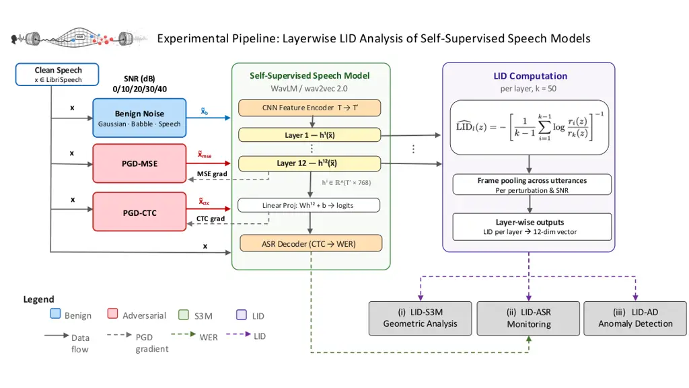
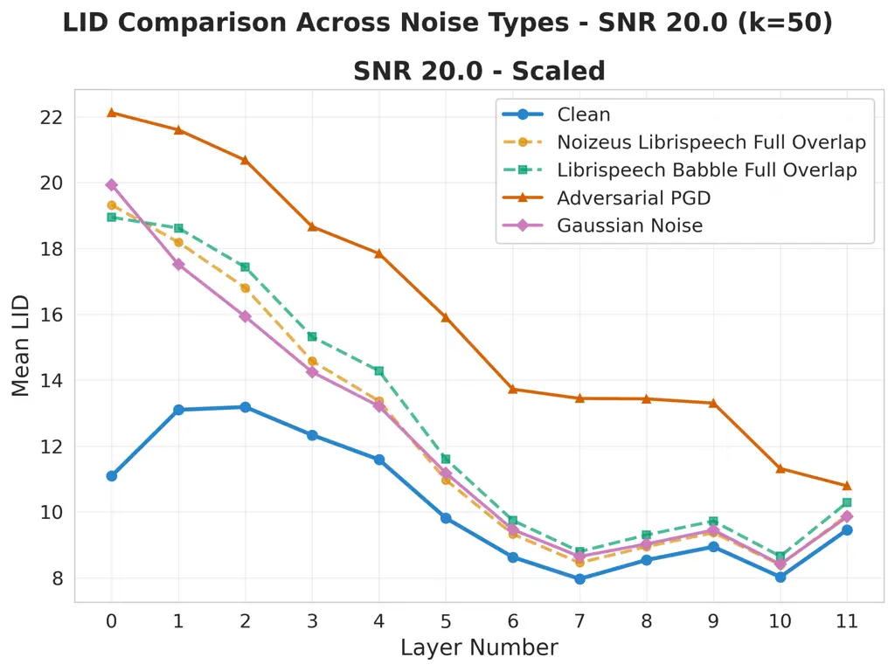
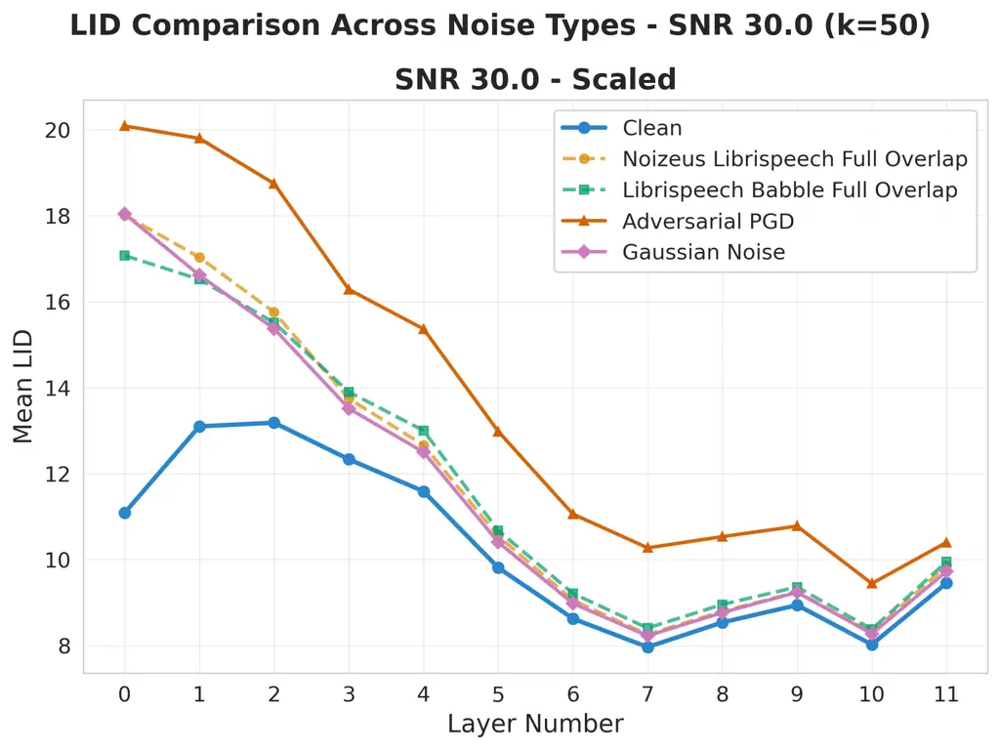
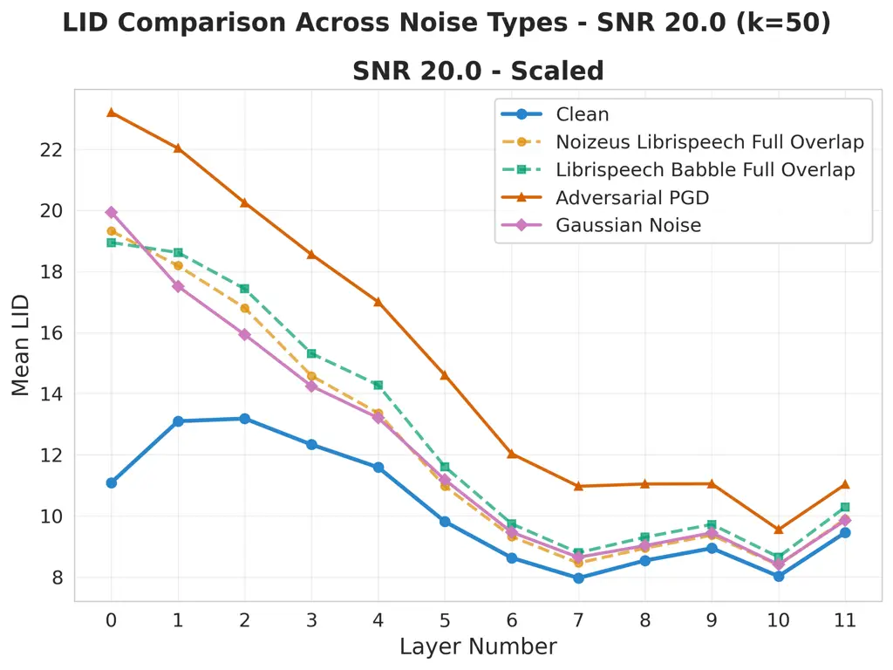
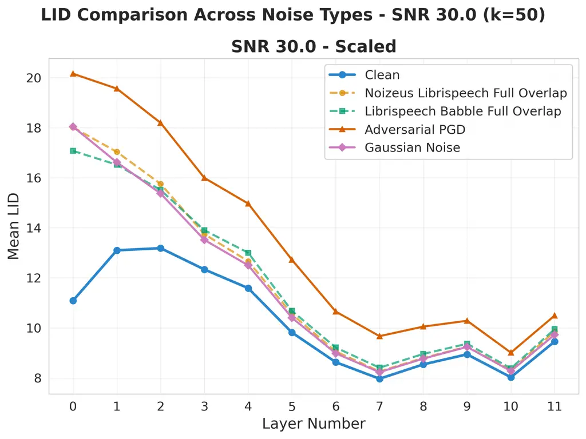
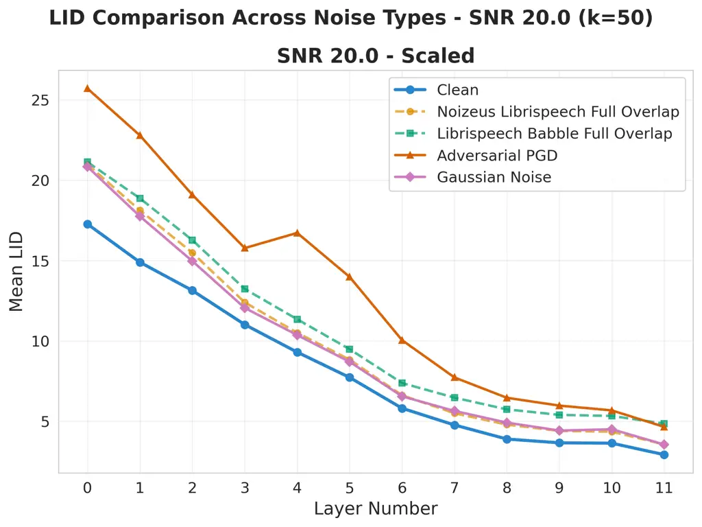
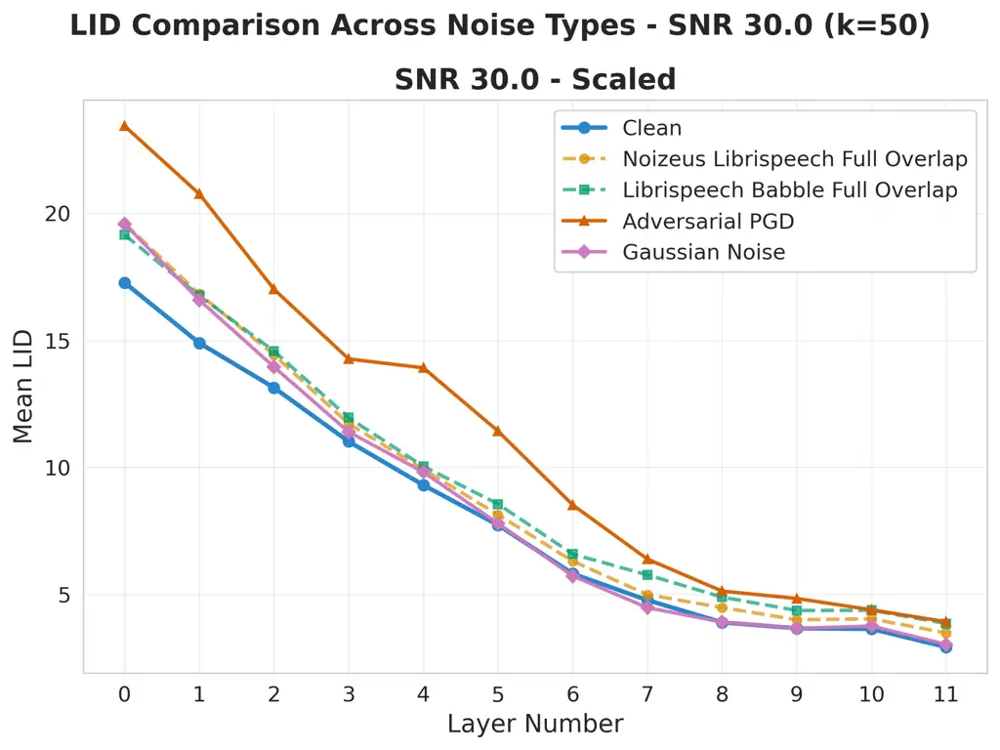
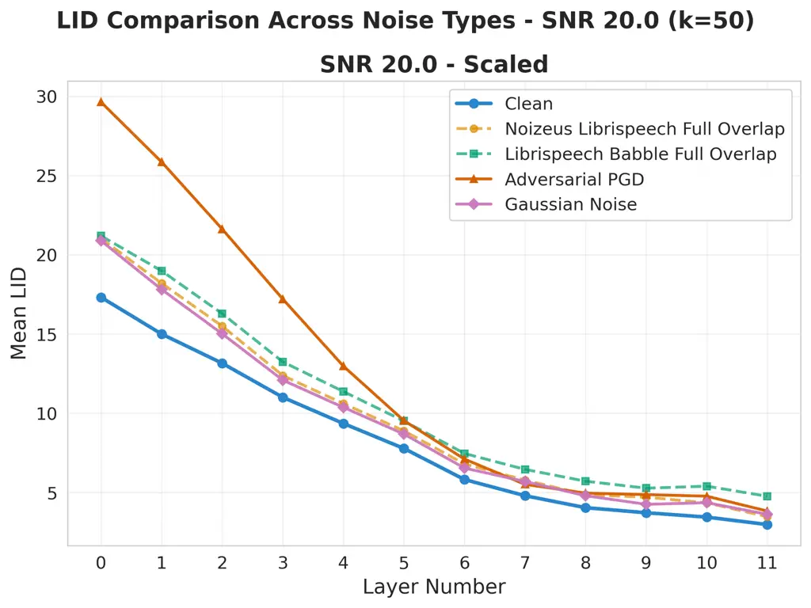
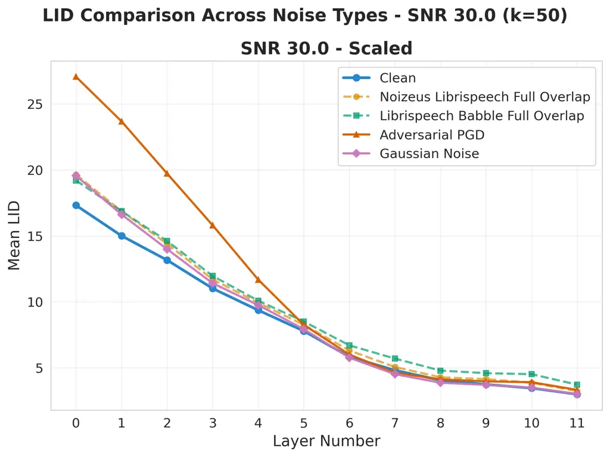

Arcos-Holzinger Erfani Bailey Khudanpur

# Dimensionality-Aware Anomaly Detection in Learned Representations of Self-Supervised Speech Models

Sandra    Sarah M    James    Sanjeev

###### Abstract

Self-supervised speech models (S3Ms) achieve strong downstream
performance, yet their learned representations remain poorly understood
under natural and adversarial perturbations. Prior studies rely on
representation similarity or global dimensionality, offering limited
visibility into local geometric changes. We ask: how do perturbations
deform local geometry, and do these shifts track downstream automatic
speech recognition (ASR) degradation? To address this, we present GRIDS,
a framework using Local Intrinsic Dimensionality (LID) across layer-wise
representations in WavLM and wav2vec 2.0. We find that LID increases for
all low signal-to-noise ratio (SNR) perturbations and diverges at high
SNR: benign noise converges toward the clean profile, while adversarial
inputs retain early-layer LID elevation. We show LID elevation co-occurs
with increased WER, and that layer-wise LID features enable anomaly
detection (AUROC 0.78–1.00), opening the door to transcript-free
monitoring in S3Ms.

###### keywords

self-supervised representations, local intrinsic dimensionality, anomaly
detection, layer-wise analysis, speech recognition

^(†)^(†)email: sarcosh1@jhu.edu ^(†)^(†)address: ¹ University of
Melbourne, School of Computing and Information Systems, Australia  
² Monash University, Department of Data Science and Artificial
Intelligence, Australia  
³ Johns Hopkins University, Center for Language and Speech Processing,
USA

## 1 Introduction

Self-supervised speech representations are an active area of research,
with prior work motivating a deeper analysis of information encoding in
model layers and understanding the behavior of representations under
distributional shifts \[1\]. Existing work has sought to enhance the
noise robustness of self-supervised speech models (S3Ms), as well as
characterize their adversarial vulnerability \[2, 3, 4, 5, 6\]. Analysis
of learned representations indicates that information content varies
substantially between layers in S3Ms, and that extracting features from
the last layers may not be optimal for tasks that require phonetic or
word-related information \[1\]. Motivated by these observations, we use
Local Intrinsic Dimensionality (LID) as a layer-wise geometric
diagnostic to quantify how benign and adversarial distortions deform
local neighborhood structure.

LID characterizes the geometric properties of learned representations by
quantifying how rapidly the number of neighboring samples grows as the
radius around a reference sample increases – a quantity known as the
local rate of probability mass expansion \[7, 8\]. It has been used in a
range of contexts, including outlier detection \[9\] and neural
networks \[10, 11\], and has proven effective in revealing how
adversarial perturbations alter learned representations in the image
\[12, 13, 14, 15, 16\] and text \[17\] domains, where perturbed samples
consistently exhibit higher LID values corresponding to low-density
regions in the pixel or deep feature space. In spite of this, and to the
best of our knowledge, LID has not been studied in the context of speech
representations in S3Ms. Intuitively, LID measures the relative rate at
which the neighborhood around a nearby sample grows: expanding rapidly
in high-dimensional regions, and slowly in low-dimensional ones.

We use _manifold_ to denote the low-dimensional structure that
clean-speech representations occupy within the high-dimensional
embedding space – the *ambient dimension* – of a model’s hidden layers,
consistent with the manifold hypothesis that high-dimensional data
concentrates on or near low-dimensional manifolds \[18, 19\]. The true
_degrees of freedom_ of the data, i.e., the number of independent
directions along which representations locally vary, are typically much
fewer than the ambient dimension. We use _geometry_ to denote the
measurable local neighborhood properties of that space – such as
distances to nearest neighbors, local density, expansion rate, and
effective local dimensionality – that characterize how representations
are arranged and how perturbations deform those arrangements.

LID is a geometric statistic in this sense: it estimates the effective
local dimensionality around a sample, which we leverage to quantify
shifts between natural and adversarial conditions relative to the clean
manifold structure. A progressive decrease in LID across layers reflects
representational compression – a reduction in effective degrees of
freedom as the model abstracts from acoustic to linguistic structure.
This abstraction hierarchy has been independently established through a
layer-wise representation analysis \[20\], and our LID trajectories in
S3Ms provide convergent geometric evidence for the same progression. If
geometric structure is integral to how S3Ms encode information across
layers, then geometric changes due to perturbations should impact
downstream performance degradation. This hypothesis motivates
understanding changes in LID to task-level metrics such as word error
rate (WER) in Automatic Speech Recognition (ASR).

We extend this geometric approach to ASR-based S3Ms to investigate how
layer-wise representations change under adversarial and benign acoustic
perturbations. This extension presents a non-trivial challenge: unlike
prior LID applications  \[21\] where each input yields a single feature
vector, S3Ms generate variable-length frame-level embeddings per
utterance. This requires careful aggregation of the embeddings to ensure
a stable and reliable LID estimation. Furthermore, S3M features are
learned via self-supervision and remain task-agnostic \[1\]. Whether LID
is equally effective in S3Ms as shown in supervised settings \[21\]
remains an open empirical question. Consequently, we utilize LID as a
diagnostic of S3M transformer layers, empirically linking intrinsic
geometry in the learned representations of S3Ms to downstream
robustness.

We refer to our framework as Geometric Robustness via Intrinsic
Dimensionality in Speech (GRIDS). We apply it to WavLM \[22\] and
wav2vec 2.0 \[23\], and make the following contributions:

1.  \[label=()\]
2.  1.  LID–S3M geometric analysis: measurement of local geometric changes
        in learned representations across transformer layers for clean,
        benign, and adversarial conditions;
3.  2.  LID–ASR monitoring: empirical evidence showing that increases in LID
        positively associate with WER, linking geometric changes to
        downstream ASR degradation;
4.  3.  LID–AD for anomaly detection: 12 LID-derived features from (i) for
        adversarial vs. benign classification.

## 2 Related Work

### 2.1 Representation Analysis and Dimensionality in Self-Supervised Models

Recent work on transformer representation geometry has shown that
learned features organize on low-dimensional curved manifolds within a
model’s hidden layers, and that attention heads manipulate this manifold
structure as a computational mechanism \[24\]. This provides empirical
support for the manifold hypothesis and reinforces the value of
geometric analysis – such as intrinsic dimensionality estimation – for
understanding how representations encode structure across layers.

Layer-wise representation analysis has proven to be instrumental in the
interpretation of self-supervised speech models, providing information
on how different layers encode phonetic, syntactic, and semantic
information \[25\]. Prior work has primarily employed similarity-based
metrics to study these relationships, each providing a complementary
lens on how representations evolve across a network. Canonical
Correlation Analysis (CCA) and Centred Kernel Alignment (CKA), for
instance, measure _how similar_ representations are between layers. CCA
and its variants identify linear relationships between representations
by finding optimal alignment transformations \[26, 27\] (with its
non-linear extensions \[28, 29, 30, 31, 32, 33\]), whereas CKA extends
this to high-dimensional spaces by directly comparing similarity
structures rather than feature values \[34\]. For speech models
specifically,  \[20\] applied these metrics to S3Ms such as
wav2vec 2.0 \[23\] and HuBERT \[35\], revealing a hierarchical flow of
information from acoustic to linguistic abstractions across layers.

While alignment-based similarity measures provide valuable insight into
_representation flow_, they do not directly quantify _representation
geometry_ or detect when individual samples deviate from the learned
manifold. Rank-based approaches \[36\] operating on the singular value
spectrum of embedding matrices address dimensionality more directly. In
 \[37\], it was shown that the effective rank of layer-wise embeddings
in HuBERT correlates with downstream task performance, demonstrating
that global measures of dimensionality are informative for assessing S3M
representation quality. However, rank captures dataset-level dimensional
collapse – the degree to which representations fail to occupy the full
embedding space – and cannot predict which layer performs best on a
given downstream task \[37\]. This suggests that global dimensionality
measures alone may not fully capture local variation in learned
representations across S3M layers. To date, dimensionality-based
approaches have not been extended to robustness analysis under
perturbation in S3Ms, nor used to relate geometric properties of learned
representations to downstream task degradation.

### 2.2 Local Intrinsic Dimensionality as a Geometric Diagnostic

LID offers a complementary perspective: rather than measuring a global
rank or how similar representations are between layers, LID estimates
the dimensional properties of representation manifolds in the
neighborhood of individual samples, capturing _how complex_ the geometry
of the representation manifold is within each layer. LID thus quantifies
the effective number of degrees of freedom – or intrinsic dimension –
required to describe the local geometry of representations within each
layer. It operates directly on each layer’s representation space,
estimating local geometric complexity through nearest-neighbor distance
and expansion rate – making it uniquely suitable for identifying
outliers and characterizing how adversarial or perturbed inputs distort
the representation manifold. The utility of LID to detect adversarial
examples in the latent space of vision models was first demonstrated
in \[21\]. It showed that adversarial samples exhibit abnormally high
LID values, which correspond to low-probability and high-dimensional
regions of feature space that require more dimensions to describe their
local neighborhood structure.

Subsequent studies have also extended LID to other domains: \[12\]
applied it for backdoor image detection, showing that poisoned samples
produce distinctive subspace anomalies, while \[17\] analyzed contextual
language models using LID to characterize perturbation effects in text
representations. Although LID has been explored in vision, text, and
even conventional audio analysis for voice detection \[38\], and
classification of audio with adversarial examples in neural networks
(i.e., AlexNet, GoogLeNet) and a linear SVM \[39\], it has not been
applied in the analysis of S3Ms such as WavLM \[22\] and
wav2vec 2.0 \[23\].

To the best of our knowledge, no prior work has performed a layer-wise
geometric analysis using LID across transformer representations in S3Ms
or investigated its potential as a dimensionality-aware diagnostic for
robustness monitoring. We address this gap by conducting a layer-wise
LID analysis of WavLM and wav2vec 2.0 under matched target-SNR
adversarial and benign perturbations, examining how intrinsic
dimensionality changes relate to robustness and perturbation sensitivity
in S3Ms. Our work adds a complementary local and geometric lens to the
analysis of S3M representations: where existing approaches measure
representational similarity or global dimensionality, LID captures local
distortion – enabling per-sample, per-layer detection of geometric
anomalies that global measures cannot resolve.

## 3 Methodology



Figure 1: Experimental end-to-end pipeline and overview of our GRIDS
framework. Clean and perturbed utterances, including benign noise
(Gaussian, babble, speech) and PGD-adversarial attacks (MSE, CTC), are
independently passed through WavLM and wav2vec 2.0 under matched
target-SNR conditions. Layer-wise LID estimates support three analyses:
(i) LID–S3M geometric analysis, (ii) LID–ASR monitoring, and
(iii) LID–AD anomaly detection.

### 3.1 LID Layer-wise Analysis in WavLM and wav2vec 2.0

Our goal is to quantify how benign and adversarial perturbations deform
the local geometry of S3M representations across transformer layers, and
to test whether these geometric shifts track downstream ASR degradation
and support anomaly detection. Figure 1 summarizes our GRIDS framework.
Clean LibriSpeech utterances and their perturbed counterparts, including
benign noise (blue blocks) and PGD adversarial attacks (red blocks), are
passed independently through WavLM and wav2vec 2.0 under matched
target-SNR conditions (green block). For the LID–S3M and LID–ASR
analyses, we use a kNN pipeline: local LID is estimated per frame,
reduced to a layer-level scalar by a harmonic mean over valid local
estimates, and then reduced across layers by a second harmonic mean when
an overall condition-level summary is needed.

Let $`x\in\mathbb{R}^{T}`$ be a waveform and let
$`h^{l}(x)\in\mathbb{R}^{T^{\prime}\times d}`$ denote its hidden
representation at transformer layer $`l`$, where $`T^{\prime}`$ is the
number of frames after convolutional subsampling and $`d`$ is the hidden
size. We index layers by $`l\in\{1,\dots,L\}`$, with $`L=12`$ for the
base WavLM and wav2vec 2.0 encoders considered here. Following a
Levina–Bickel style MLE estimator \[40\], we compute _local_ LID for a
frame-level embedding $`z=h_{t}^{l}(x)\in\mathbb{R}^{d}`$ from its first
$`k-1`$ nearest neighbors relative to the $`k`$-th-neighbor radius:

```math
\color{black}\widehat{\mathrm{LID}}_{l}(z)=-\left[\frac{1}{k-1}\sum_{i=1}^{k-1}\log\frac{r_{i}(z)}{r_{k}(z)}\right]^{-1}. \tag{1}
```

where $`r_{i}(z)`$ is the Euclidean distance from $`z`$ to its $`i`$-th
nearest neighbor and $`k`$ is the neighborhood size. Distances are
computed within each layer and perturbation condition, with embeddings
standardized to zero mean and unit variance separately for each
layer-condition pair before kNN search. In the implementation,
numerically unstable local estimates are clamped to a finite range for
stability, so $`\Delta\mathrm{LID}`$ should be interpreted as a change
in normalized local neighborhood geometry rather than as a comparison of
raw feature norms across conditions. We define a condition
$`c=(\text{model},\text{perturbation type},\text{SNR}`$) as a tuple
specifying the experimental setting under which embeddings are
extracted. For each condition $`c`$, we pool frame embeddings across
utterances within that condition and aggregate valid local LID estimates
with a harmonic mean:

```math
\color{black}\mathrm{LID}_{l}^{(c)}=\left[\frac{1}{|S_{l}^{(c)}|}\sum_{z\in S_{l}^{(c)}}\frac{1}{\widehat{\mathrm{LID}}_{l}(z)}\right]^{-1}, \tag{2}
```

where $`S_{l}^{(c)}`$ denotes the pooled set of layer-$`l`$ frame
embeddings for condition $`c`$. This pooled estimator is used for the
condition-level LID–S3M and LID–ASR analyses.

For per-layer perturbation effects, we report

```math
\color{black}\Delta\mathrm{LID}_{l}=\mathrm{LID}_{l}^{(\mathrm{pert})}-\mathrm{LID}_{l}^{(\mathrm{clean})}. \tag{3}
```

For LID–ASR analysis, we further define the cross-layer summary for
condition $`c`$ as

```math
\color{black}\mathrm{LID}_{\mathrm{overall}}^{(c)}=\left[\frac{1}{L}\sum_{l=1}^{L}\frac{1}{\mathrm{LID}_{l}^{(c)}}\right]^{-1}. \tag{4}
```

It follows that the perturbation-induced LID shift can be captured by

```math
\color{black}\Delta\mathrm{LID}=\mathrm{LID}_{\mathrm{overall}}^{(\mathrm{pert})}-\mathrm{LID}_{\mathrm{overall}}^{(\mathrm{clean})}. \tag{5}
```

In the current pipeline, $`k`$ is not treated as a purely fixed
hyperparameter. For each condition, we evaluate a grid of neighborhood
sizes and compute $`\Delta\mathrm{LID}(k)`$ from Eq. (5). We retain the
$`k`$ values whose overall $`\Delta\mathrm{LID}`$ lies within a fixed
fraction of the best value, and choose the candidate with minimum
across-layer standard deviation of $`\Delta\mathrm{LID}`$ (stability
across layers). When multiple candidates achieve this minimum, the
larger $`\Delta\mathrm{LID}`$ is chosen (discriminability against the
clean baseline); when both criteria are matched, a smaller $`k`$ is
chosen, given that a larger neighborhood would not improve stability or
discriminability and would only blur the local estimate.

For anomaly detection, we switch from pooled condition-level summaries
to utterance-level summaries. Each utterance $`x_{i}`$ is represented by
the 12-dimensional LID feature vector

```math
\color{black}\mathbf{v}_{i}=\bigl[\mathrm{LID}_{i,1},\ldots,\mathrm{LID}_{i,12}\bigr]^{\top}\in\mathbb{R}^{12}, \tag{6}
```

where $`\mathrm{LID}_{i,l}`$ is the utterance-level harmonic-mean LID
computed from the frame embeddings of utterance $`i`$ at layer $`l`$.
Accordingly, the geometry and WER analyses use pooled condition-level
LID summaries, whereas anomaly detection uses utterance-level LID
vectors.

### 3.2 Perturbation Generation

This section provides details on the generation of perturbations used in
our experiments.

#### 3.2.1 Target-SNR constraints and shared scaling

We compare benign and adversarial perturbations under controlled
target-SNR conditions by enforcing a per-utterance SNR constraint on the
perturbation energy. Given a clean waveform $`x`$ and additive
perturbation $`\delta`$, we define

```math
\mathrm{SNR}_{\mathrm{dB}}(x,\delta)=20\log_{10}\frac{\lVert x\rVert_{2}}{\lVert\delta\rVert_{2}}. \tag{7}
```

For a target SNR $`s`$ (in dB), we constrain
$`\lVert\delta\rVert_{2}\leq\epsilon_{\mathrm{SNR}}(x,s)`$ with

```math
\epsilon_{\mathrm{SNR}}(x,s)=\lVert x\rVert_{2}\,10^{-s/20}. \tag{8}
```

For benign perturbations, we first sample a raw waveform
$`\delta_{\mathrm{raw}}`$ and then rescale it to the target SNR as

```math
\delta=\epsilon_{\mathrm{SNR}}(x,s)\,\frac{\delta_{\mathrm{raw}}}{\lVert\delta_{\mathrm{raw}}\rVert_{2}}. \tag{9}
```

For Gaussian noise, the target SNR is enforced as a constraint (cap)
rather than an exact rescaling. The raw perturbation is projected into
the $`\ell_{2}`$ ball:

```math
\delta=\delta_{\mathrm{raw}}\cdot\min\left(1,\frac{\epsilon_{\mathrm{SNR}}(x,s)}{\lVert\delta_{\mathrm{raw}}\rVert_{2}}\right). \tag{10}
```

All perturbed waveforms are finally clipped by
$`\tilde{x}=\mathrm{clip}(x+\delta,-1,1)`$ to ensure a valid waveform
range.

#### 3.2.2 Benign and Adversarial Perturbations

Perturbations are generated from LibriSpeech \[41\] clean utterances
using our end-to-end GRIDS pipeline shown in Figure 1. The paired
utterance subset and train/evaluation protocol are specified in
Section 4. We consider three benign perturbations – Gaussian noise,
Noizeus babble noise \[42\], and a secondary LibriSpeech
competing-talker utterance, all rescaled to the target SNR (Eq. (9);
Eq. (10) for the Gaussian cap) – and PGD adversarial
perturbations \[43\] under an $`\ell_{2}`$-bounded budget calibrated to
the same target SNR levels. Per-perturbation settings are summarized in
Table 1. Adversarial examples use one of two objectives: Mean Squared
Error (MSE-loss), Eq. (11) or Connectionist Temporal Classification
(CTC-loss), Eq. (14) \[44\]. MSE-PGD serves as a baseline that maximally
distorts final-layer hidden representations (non-task-specific), whereas
CTC-PGD is task-aligned to ASR.

| Perturbation        | Settings                                                                                                                                                                                         |
| ------------------- | ------------------------------------------------------------------------------------------------------------------------------------------------------------------------------------------------ |
| (1) Gaussian noise  | i.i.d. $`\mathcal{N}(0,\sigma^{2})`$, $`\sigma{=}0.01`$; SNR cap via $`\ell_{2}`$ projection in Eq. (10); clip $`[-1,1]`$                                                                        |
| (2) Babble noise    | Noizeus babble-noise clips; full overlap; rescaled to the target SNR in Eq. (9)                                                                                                                  |
| (3) Speech noise    | LibriSpeech competing talker; full overlap; rescaled to the target SNR in Eq. (9)                                                                                                                |
| (4) Adversarial PGD | $`\ell_{2}`$ constraint Eq. (8); 300 iterations; base step size $`\eta{=}0.01`$ scaled by $`\epsilon_{\mathrm{SNR}}`$; post-loop rescale to exhaust $`\epsilon_{\mathrm{SNR}}`$; clip $`[-1,1]`$ |

Table 1: Perturbation-generation settings used in our experiments with
target SNR range $`\{0,10,20,30,40\}`$ dB.

#### 3.2.3 Adversarial examples and MSE loss

We use MSE loss as the squared Frobenius norm of the difference between
final-layer hidden representations:

```math
\mathcal{L}_{\mathrm{MSE}}(x,\delta)=\frac{1}{N}\left\lVert h^{L}(x+\delta)-h^{L}(x)\right\rVert_{F}^{2}, \tag{11}
```

where $`h^{L}(x)\in\mathbb{R}^{T^{\prime}\times d}`$ denotes the hidden
representations of the final transformer block (i.e., after the layer
norm) and $`\lVert\cdot\rVert_{F}`$ denotes the Frobenius norm.
$`T^{\prime}`$ is the number of time frames after the convolutional
subsampling stage in the model. The factor $`N=T^{\prime}\times d`$
normalizes the loss by averaging over all temporal frames and feature
dimensions.

#### 3.2.4 Adversarial examples and CTC loss

We use CTC loss as an adversarial objective to maximize transcription
disruption under the same SNR-constrained $`\ell_{2}`$ budget. Let
$`\mathcal{V}`$ denote the output token vocabulary and let
$`\mathcal{V}^{\prime}=\mathcal{V}\cup\{\varnothing\}`$ denote the
CTC-extended vocabulary including the blank symbol. For an utterance
$`x`$, the final-layer representation
$`h^{L}(x)\in\mathbb{R}^{T^{\prime}\times d}`$ induces frame-level
logits

```math
s_{t}(x)=Wh_{t}^{L}(x)+b,\qquad t=1,\ldots,T^{\prime}, \tag{12}
```

where $`W\in\mathbb{R}^{|\mathcal{V}^{\prime}|\times d}`$ and
$`b\in\mathbb{R}^{|\mathcal{V}^{\prime}|}`$. The posterior probability
of token $`k\in\mathcal{V}^{\prime}`$ at frame $`t`$ is

```math
p(k\mid x,t)=\mathrm{softmax}(s_{t}(x))_{k}.
```

A CTC path is a frame-level label sequence
$`\pi=(\pi_{1},\ldots,\pi_{T^{\prime}})\in(\mathcal{V}^{\prime})^{T^{\prime}}`$
with path probability

```math
p(\pi\mid x)=\prod_{t=1}^{T^{\prime}}p(\pi_{t}\mid x,t).
```

Let $`y=(y_{1},\ldots,y_{U})\in\mathcal{V}^{U}`$ denote the target
transcription, with $`U\leq T^{\prime}`$. The collapse operator
$`\mathcal{B}:(\mathcal{V}^{\prime})^{T^{\prime}}\rightarrow\mathcal{V}^{\leq T^{\prime}}`$
removes blank symbols and merges consecutive repeated labels. The
conditional probability of $`y`$ is therefore

```math
p(y\mid x)=\sum_{\pi\in\mathcal{B}^{-1}(y)}p(\pi\mid x), \tag{13}
```

and the CTC loss is

```math
\mathcal{L}_{\mathrm{CTC}}(x,y)=-\log p(y\mid x). \tag{14}
```

The untargeted adversarial objectives are therefore

```math
\displaystyle\max_{\lVert\delta\rVert_{2}\leq\epsilon_{\mathrm{SNR}}(x,s)}\mathcal{L}_{\mathrm{MSE}}(x,\delta), \tag{15}
```

```math
\displaystyle\max_{\lVert\delta\rVert_{2}\leq\epsilon_{\mathrm{SNR}}(x,s)}\mathcal{L}_{\mathrm{CTC}}(x+\delta,y). \tag{16}
```

We optimize $`\delta`$ with $`\ell_{2}`$-PGD using a normalized-gradient
update and projection to the SNR budget:

```math
\delta_{t+1}=\Pi_{\epsilon_{\mathrm{SNR}}}\left(\delta_{t}+\alpha_{t}\frac{\nabla_{\delta}\mathcal{L}(x+\delta_{t})}{\lVert\nabla_{\delta}\mathcal{L}(x+\delta_{t})\rVert_{2}}\right), \tag{17}
```

where $`\Pi_{\epsilon_{\mathrm{SNR}}}`$ denotes projection onto the
$`\ell_{2}`$ ball of radius $`\epsilon_{\mathrm{SNR}}(x,s)`$ defined in
Eq. 8. We use a per-utterance step schedule
$`\alpha_{t}=\eta\,\epsilon_{\mathrm{SNR}}(x,s)\,(1+2e^{-t/20})`$ with
$`\eta=0.01`$. After the final iteration, we rescale $`\delta`$ to
exhaust the budget (i.e.,
$`\lVert\delta\rVert_{2}=\epsilon_{\mathrm{SNR}}`$) and clip to
$`[-1,1]`$.

### 3.3 Classification with LID derived features

For anomaly detection, we construct a 12-dimensional LID feature vector
per utterance, as defined in Eq. (6), and train a lightweight classifier
on these utterance-level summaries. This classifier stage is distinct
from the pooled condition-level LID analysis used for geometry and WER,
and its evaluation protocol is detailed in Section 4. In this section,
we define the attack-effectiveness metric used to contextualize
classifier difficulty and then describe the LID-based anomaly-detection
task.

#### 3.3.1 Attack success rate

To quantify perturbation effectiveness, we define the attack success
rate $`\mathrm{SR}_{\gamma,\tau}`$ as the empirical fraction of
utterances for which the perturbed WER satisfies two joint conditions:
(1) it reaches at least an absolute threshold $`\tau`$, and (2) the
increase over the clean WER is at least $`\gamma`$:

```math
\color{black}\begin{aligned} \mathrm{SR}_{\gamma,\tau}&=\frac{1}{n}\sum_{i=1}^{n}\mathbf{1}\left[\mathrm{WER}_{\mathrm{pert},i}\geq\tau\right.\\
&\qquad\left.\land\ \bigl(\mathrm{WER}_{\mathrm{pert},i}-\mathrm{WER}_{\mathrm{clean},i}\bigr)\geq\gamma\right],\end{aligned} \tag{18}
```

where $`n`$ is the number of utterances and $`\mathbf{1}[\cdot]`$ is the
indicator function. We write $`\mathrm{WER}_{\mathrm{pert},i}`$ to
emphasize that the same definition is applied consistently across
perturbation types, while anomaly-detection results in Section 5.3 focus
specifically on adversarial-versus-benign separation.

#### 3.3.2 LID-based anomaly detection

For anomaly detection, each utterance $`x_{i}`$ is represented by the
feature vector $`\mathbf{v}_{i}`$ defined in Eq. (6). For each model,
attack objective, and SNR, we form a binary task with positives given by
adversarial utterances and negatives given by the pooled benign noise
set (Gaussian, babble, and speech) at the same SNR. We train a
logistic-regression classifier and evaluate it with 5-fold grouped
cross-validation keyed by normalized utterance ID, so that multiple
variants of the same underlying utterance never appear in both train and
test folds. We report AUROC, AUPRC, and FPR at TPR $`=0.95`$ from
concatenated out-of-fold scores.

## 4 Experimental Configuration

We draw utterances from LibriSpeech test-clean \[41\], selecting 40
speakers at random retaining only utterances of 5-10 s duration (16 kHz
sampling frequency). We follow this approach to reduce variance and
stabilize kNN-based LID estimation on a number of utterances across
different speakers. We further restrict this set to the intersection of
utterances present across all perturbations in Table 1, yielding 918
utterances that form a fully paired evaluation set. This design ensures
that every LID comparison across perturbation types and SNR levels is
computed over identical utterances. The utterance count also provides
sufficient frame-level pooling ($`{\sim}`$230k–460k embeddings per
condition after convolutional subsampling) to stabilize kNN-based LID
estimation across speakers.

For a fair comparison across perturbation types, we generate benign
acoustic noise and adversarial examples for all target SNR levels
(0–40 dB) summarized in Table 1: (1) Gaussian noise, (2) babble noise,
(3) speech noise, and (4) Adversarial PGD examples.

PGD is run for 300 iterations to maximize the MSE or CTC objective,
rescaling the final projected perturbation to fully exhaust the
per-utterance SNR budget $`\epsilon_{\mathrm{SNR}}`$. In the current kNN
pipeline, the neighborhood size is selected by a per-condition
$`k`$-sweep rather than assumed fixed a priori: candidate $`k`$ values
are ranked by overall $`\Delta`$LID, filtered to those near the best
value, and the final choice is taken to be the one with minimum
across-layer $`\Delta`$LID variability. Section 5.1.1 summarizes the
resulting robustness behavior and also includes a compact fixed-$`k`$
comparison for reference.

We select WavLM and wav2vec 2.0 Base models ($`L=12`$, $`d=768`$) as
complementary test cases representing distinct pretraining strategies.
Both are trained on LibriSpeech 960h, but WavLM additionally
incorporates a masked speech denoising objective that exposes the model
to simulated overlapped speech during pretraining \[22\], whereas
wav2vec 2.0 is trained with a contrastive objective on clean speech
only \[23\]. This pairing allows us to assess whether denoising-aware
pretraining is reflected in the geometric robustness of learned
representations under perturbation.

Our GRIDS framework is not inherently tied to a specific downstream
task: LID operates directly on learned representations independently of
task-specific labels or outputs. To evaluate LID as a diagnostic for ASR
degradation, we compute WER using JiWER¹¹ 1
https://jitsi.github.io/jiwer. To quantify perturbation effectiveness,
we apply Eq. (18) with $`(\gamma,\tau)=(0.2,\,0.3)`$ such that a
successful attack both increases WER by at least $`\gamma`$ and produces
a WER of at least $`\tau`$.

For anomaly detection, evaluation uses 5-fold grouped cross-validation
over normalized utterance IDs rather than plain random or stratified
folds, ensuring that all perturbation variants of the same underlying
utterance remain within a single fold. This grouped protocol is used
when reporting AUROC, AUPRC, and FPR@0.95 in Section 5.3.

For ASR evaluation, we use the pretrained ASR models associated with
wav2vec 2.0²² 2 https://huggingface.co/facebook/wav2vec2-base-960h and
WavLM³³ 3
https://huggingface.co/patrickvonplaten/wavlm-libri-clean-100h-base. The
encoder and CTC head are frozen, and decoding uses greedy decoding. The
same decoding configuration is used for both clean and perturbed
utterances, and WER is computed from the decoded transcripts using
JiWER.

## 5 Results and Analysis

We report results for the following three analyses aligned to our GRIDS
framework: (i) LID-S3M geometric analysis for layer-wise LID under
benign and adversarial perturbations; (ii) LID-ASR monitoring through
empirical evidence that supports the co-occurrence of $`\Delta`$LID–WER
under a range of target SNRs and perturbation types; and (iii) LID-AD
anomaly detection and classifier performance results trained with our 12
LID-derived features from learned representations in WavLM and
wav2vec 2.0.

### 5.1 LID-S3M Geometric Analysis

#### 5.1.1 LID Estimation and $`k`$-Sensitivity

We pool frame-level embeddings across all utterances within each
perturbation setting in Table 1, and compute layer-wise LID from $`k`$NN
distances on the pooled set. $`k`$ is selected per condition rather than
fixed globally. For each candidate neighborhood size, we compute the
overall perturbation shift $`\Delta`$LID from Eq. (5), retain the
candidates whose $`\Delta`$LID lies within a fixed fraction of the best
value, and then choose the one with minimum across-layer standard
deviation of $`\Delta`$LID, breaking ties by larger $`\Delta`$LID and
then smaller $`k`$. This selection rule favors neighborhoods that remain
both discriminative and stable across layers. Table 2 should therefore
be read as a compact fixed-$`k`$ robustness check rather than the full
selection procedure. Across both models, perturbation ordering is
qualitatively stable between $`k{=}50`$ and $`k{=}100`$: adversarial
conditions yield the largest $`\Delta`$LID at low SNR, benign conditions
move toward zero as SNR increases, and changing $`k`$ primarily rescales
magnitude rather than reversing the trend.

| Model       | Perturbation      | $`\Delta LID`$ (0 dB) |             | $`\Delta LID`$ (40 dB) |             |
| ----------- | ----------------- | --------------------- | ----------- | ---------------------- | ----------- |
|             |                   | $`k{=}50`$            | $`k{=}100`$ | $`k{=}50`$             | $`k{=}100`$ |
| WavLM       | PGD-MSE           | 12.40                 | 12.46       | 2.24                   | 2.10        |
|             | PGD-CTC           | 11.30                 | 11.46       | 1.99                   | 1.84        |
|             | Gaussian noise    | 2.51                  | 2.35        | 0.79                   | 0.60        |
|             | Babble noise      | 2.99                  | 4.48        | 0.84                   | 0.67        |
|             | Speech noise      | 4.85                  | 5.52        | 0.76                   | 0.64        |
| wav2vec 2.0 | PGD-MSE           | 9.62                  | 9.42        | 1.66                   | 1.95        |
|             | PGD-CTC           | 9.57                  | 10.60       | 0.55                   | 0.69        |
|             | Gaussian noise    | 1.73                  | 1.94        | 0.09                   | 0.08        |
|             | Babble noise      | 5.88                  | 7.51        | 0.35                   | 0.37        |
|             | Speech noise      | 5.18                  | 6.94        | 0.39                   | 0.43        |

Table 2: Sensitivity of overall $`\Delta`$LID to the neighborhood size
$`k`$, evaluated at $`k\in\{50,100\}`$ for SNR 0 and 40 dB, computed via
Eqs. (3)–(4).



(a) SNR 20 dB.



(b) SNR 30 dB.

Figure 2: Layer-wise harmonic mean LID under MSE-PGD for WavLM at SNR
20/30 dB (k=50)



(a) SNR 20 dB.



(b) SNR 30 dB.

Figure 3: Layer-wise harmonic mean LID under CTC-PGD for WavLM at SNR
20/30 dB (k=50)

#### 5.1.2 Layer-wise LID Trajectories

We analyze how hidden-space geometry evolves across transformer layers
by computing a layer-wise LID for clean speech and all perturbations in
Table 1. We restrict benign speech-like interference to full-temporal
overlap so that corruption spans all frames, yielding a conservative
naturalistic baseline that is directly comparable to SNR-constrained
adversarial perturbations. Across conditions, the mean LID typically
decreases from early to late layers, coherent with progressive
representational compression, from low-level acoustics to higher-level
abstractions as noted in previous work \[25\] capturing the layer-wise
trajectories in S3Ms.

In our experiments, perturbations generally appear as upward shifts in
LID across layers, relative to clean speech under a target SNR. We
interpret higher LID as evidence of less compact or more locally complex
neighborhood structure in the learned representation space, not as a
direct measurement of global manifold dimension. This makes layer-wise
LID useful for comparing how different perturbation families deform
local geometry at the same layer, while the direction and persistence of
those shifts are analyzed in the following section.

#### 5.1.3 Layer-wise LID in WavLM and wav2vec 2.0

Figures 2-3 show that adversarial perturbations are typically associated
with the largest and most persistent LID elevation in WavLM. At low
target SNR (0–10 dB), however, both babble and overlaid speech also
increase LID substantially, so elevated LID should not be treated as
uniquely adversarial. As target SNR increases to 30–40 dB, benign curves
move closer to the clean profile, especially in later layers, while
adversarial conditions more often retain elevated early-layer LID. We
therefore interpret early-layer persistence as a relative marker of
adversarial geometric shift under matched target-SNR conditions, rather
than as a binary signature that is entirely absent from benign
interference.

To test whether this behavior transfers across architectures, we repeat
the analysis for wav2vec 2.0 under the same perturbation families and
target-SNR settings used for WavLM. Figures 4-5 show the same broad
pattern: adversarial conditions remain above benign distortions more
often than not, the largest separations occur in early layers, and
benign perturbations converge more rapidly toward the clean profile as
target SNR increases. wav2vec 2.0 also exhibits a broad mid-layer peak,
indicating that the precise layer profile is model-dependent even when
the relative ordering across perturbation types is similar. We therefore
treat elevated LID under adversarial perturbations as a cross-model
tendency rather than as a WavLM-specific artifact.



(a) SNR 20 dB.



(b) SNR 30 dB.

Figure 4: Layer-wise harmonic mean LID under MSE-PGD for wav2vec 2.0 at
SNR 20/30 dB (k=50).



(a) SNR 20 dB.



(b) SNR 30 dB.

Figure 5: Layer-wise harmonic mean LID under CTC-PGD for wav2vec 2.0 at
SNR 20/30 dB (k=50).

#### 5.1.4 S3M robustness under varying SNR

Figures 2-5 show that the degree and shape of LID persistence depends on
the attack objective (PGD-MSE vs. task-aligned PGD-CTC), with PGD-MSE
producing the largest and most persistent elevation under the same SNR
budget. The clearest separation across perturbation types occurs in the
early transformer layers, suggesting that layer-wise LID provides a more
informative robustness signal than a single final-layer summary.

### 5.2 LID-ASR monitoring

#### 5.2.1 LID and WER Analysis

|             |                               |              |             |             |             |
| ----------- | ----------------------------- | ------------ | ----------- | ----------- | ----------- |
| SNR         | PGD-CTC                       | PGD-MSE      | Gaussian    | Babble      | Speech      |
| (dB)        | $`\Delta`$LID / $`\Delta`$WER |              |             |             |             |
| WavLM       |                               |              |             |             |             |
| 0           | 10.51 / 0.84                  | 16.03 / 0.94 | 1.67 / 0.04 | 3.50 / 0.72 | 4.63 / 1.00 |
| 10          | 5.71 / 0.46                   | 12.02 / 0.83 | 1.67 / 0.04 | 1.88 / 0.11 | 2.98 / 0.46 |
| 20          | 3.42 / 0.20                   | 6.71 / 0.47  | 1.10 / 0.01 | 0.92 / 0.01 | 1.49 / 0.10 |
| 30          | 2.23 / 0.08                   | 2.23 / 0.14  | 0.55 / 0.00 | 0.63 / 0.00 | 0.77 / 0.01 |
| 40          | 1.42 / 0.03                   | 1.71 / 0.04  | 0.36 / 0.00 | 0.45 / 0.00 | 0.43 / 0.00 |
| wav2vec 2.0 |                               |              |             |             |             |
| 0           | 6.21 / 0.76                   | 10.11 / 0.96 | 1.35 / 0.04 | 7.51 / 0.72 | 5.79 / 1.00 |
| 10          | 3.06 / 0.23                   | 5.74 / 0.90  | 1.37 / 0.04 | 4.15 / 0.11 | 4.74 / 0.46 |
| 20          | 1.43 / 0.05                   | 2.70 / 0.51  | 1.00 / 0.01 | 1.36 / 0.01 | 2.74 / 0.10 |
| 30          | 0.27 / 0.02                   | 1.19 / 0.10  | 0.13 / 0.00 | 0.60 / 0.00 | 0.96 / 0.01 |
| 40          | 0.00 / 0.01                   | 0.76 / 0.01  | 0.00 / 0.00 | 0.22 / 0.00 | 0.37 / 0.00 |

Table 3: Per-SNR overall $`\Delta`$LID and $`\Delta`$WER on the paired
918-utterance LibriSpeech test-clean subset. Clean baseline WER is 0.04
for both models.

As noted in Section 1, if geometric structure is integral to how S3Ms
encode information across layers, then perturbations that disrupt
representation geometry may also be associated with downstream
performance degradation. We test this by examining whether the magnitude
of LID-derived geometric shifts tracks the degree of ASR degradation
across perturbation types and target-SNR conditions.

Rather than reporting WER for adversarial PGD in isolation, we summarize
WER jointly with $`\Delta`$LID for _all_ perturbation types under the
layer-wise LID analysis detailed in Section 5.1.2. For each condition,
we compute two ASR metrics from per-utterance transcripts:
$`\mathrm{WER}_{\mathrm{pert}}`$ is the arithmetic mean of per-utterance
WER values on perturbed audio, and $`\Delta\mathrm{WER}`$ is the mean of
per-utterance differences, i.e.,

```math
\Delta\mathrm{WER}=\mathbb{E}_{i}\ \left[\mathrm{WER}_{\mathrm{pert},i}-\mathrm{WER}_{\mathrm{clean},i}\right].
```

Table 3 reports $`\Delta\mathrm{LID}`$ using Eq. (5) to reflect
geometric shift, alongside $`\Delta`$WER, showing a consistent
co-occurrence between geometric shift and ASR degradation under matched
SNR: both decrease as SNR rises from 0 to 40 dB across conditions. The
association is most apparent at low SNR (0–10 dB), where adversarial PGD
and speech-like interference (babble and overlaid speech) jointly
produce the largest deviations from clean behavior. At 0 dB, PGD-MSE
induces the largest geometric deformation ($`\Delta`$LID 16.03 for
WavLM, 10.11 for wav2vec 2.0), accompanied by large error increases
($`\Delta`$WER above 0.94). Overlaid speech maximizes $`\Delta`$WER
(1.00 for both models) at more moderate $`\Delta`$LID (4.63 and 5.79),
showing that severe transcription failure can occur even when the
geometric shift is not maximal. Gaussian noise remains low-impact
throughout ($`\Delta`$WER$`\leq`$0.04). Within a fixed SNR, adversarial
conditions typically dominate both axes relative to benign noise at
comparable energy, and PGD-MSE is more disruptive than PGD-CTC. At high
SNR (30–40 dB), benign corruptions become nearly clean-like in
$`\Delta`$WER, whereas PGD retains a non-trivial $`\Delta`$LID
footprint, indicating residual geometric displacement despite small
decoding error.

### 5.3 Anomaly Detection

Using the 12-dimensional LID feature vector defined in Eq. (6), we train
a lightweight logistic-regression classifier per SNR, with scores
evaluated out-of-fold under grouped 5-fold cross-validation. Detection
performance is overall strong but varies with both model and attack
objective: WavLM$`{}_{\text{MSE}}`$ is the most separable configuration
(mean AUROC 0.99, mean FPR@0.95 = 0.02), while
wav2vec2$`{}_{\text{MSE}}`$ is the least (mean AUROC 0.88, mean FPR@0.95
= 0.39). The relative difficulty of MSE- versus CTC-PGD is
model-dependent: MSE is more separable than CTC for WavLM, whereas the
ordering reverses for wav2vec 2.0 (Table 4).

| SNR | METRIC         | WavLM$`{}_{\text{CTC}}`$ | WavLM$`{}_{\text{MSE}}`$ | w2v2$`{}_{\text{CTC}}`$ | w2v2$`{}_{\text{MSE}}`$ |
| --- | -------------- | ------------------------ | ------------------------ | ----------------------- | ----------------------- |
| 0   | AUROC          | 1.00                     | 1.00                     | 1.00                    | 1.00                    |
|     | AUPRC          | 1.00                     | 1.00                     | 1.00                    | 1.00                    |
|     | FPR@0.95\[SR\] | 0.00\[1.00\]             | 0.00\[1.00\]             | 0.00\[1.00\]            | 0.00\[1.00\]            |
| 10  | AUROC          | 1.00                     | 1.00                     | 1.00                    | 0.97                    |
|     | AUPRC          | 0.99                     | 0.99                     | 0.99                    | 0.91                    |
|     | FPR@0.95\[SR\] | 0.01\[0.80\]             | 0.01\[0.99\]             | 0.01\[1.00\]            | 0.15\[0.33\]            |
| 20  | AUROC          | 0.97                     | 1.00                     | 1.00                    | 0.85                    |
|     | AUPRC          | 0.93                     | 0.99                     | 0.99                    | 0.59                    |
|     | FPR@0.95\[SR\] | 0.20\[0.28\]             | 0.00\[0.73\]             | 0.02\[0.78\]            | 0.48\[0.02\]            |
| 30  | AUROC          | 0.92                     | 1.00                     | 0.99                    | 0.80                    |
|     | AUPRC          | 0.83                     | 0.99                     | 0.98                    | 0.52                    |
|     | FPR@0.95\[SR\] | 0.43\[0.04\]             | 0.00\[0.18\]             | 0.05\[0.10\]            | 0.62\[0.00\]            |
| 40  | AUROC          | 0.87                     | 0.98                     | 0.94                    | 0.78                    |
|     | AUPRC          | 0.77                     | 0.96                     | 0.87                    | 0.50                    |
|     | FPR@0.95\[SR\] | 0.60\[0.01\]             | 0.11\[0.03\]             | 0.33\[0.00\]            | 0.69\[0.00\]            |

Table 4: Anomaly-detection performance for adversarial vs benign,
evaluated with 5-fold GroupKFold. AUROC, AUPRC, FPR at TPR$`=0.95`$, and
success rate \[SR\]. wav2vec 2.0 is abbreviated as w2v2.

As SNR increases, the attack success rate (SR) defined in Eq. (18) drops
sharply, consistent with the smaller $`\ell_{2}`$ perturbation budget at
higher SNR. This decline in SR coincides with a general increase in
FPR@0.95 and a decrease in AUROC, suggesting that reduced separability
at high SNR is partly driven by a growing fraction of low-impact
adversarial examples that fail to meaningfully degrade ASR. SR alone
does not fully account for classifier performance:
WavLM$`{}_{\text{CTC}}`$ achieves AUROC 0.92 at 30 dB despite SR of only
0.04, indicating that LID can retain discriminative geometric
information even when WER does not exceed the success threshold.

## 6 Conclusion

We have shown that layer-wise LID is an effective diagnostic for local
geometric changes in WavLM and wav2vec 2.0 under benign and adversarial
perturbations. Across both models, and despite distinct pretraining
objectives, our analysis reveals that the clearest divergence between
adversarial and benign profiles occurs in early transformer layers,
suggesting geometric distortion propagates through early representations
before being partially absorbed by deeper layers. We further demonstrate
that shifts in representational geometry can be measured using LID and
be linked to ASR degradation without requiring ground-truth transcripts:
higher LID co-occurs with WER increases. A lightweight
logistic-regression classifier on our 12 LID-derived features
distinguishes adversarial from benign inputs across SNRs, with
separability decreasing at high SNR as both converge toward the clean
manifold. Our GRIDS framework thus contributes an interpretable
geometric diagnostic for transcript-free monitoring in S3Ms. Current
limitations include restriction to 12-layer S3M variants and untargeted
attacks. Future work includes scaling to larger architectures, extending
to security-critical tasks such as speaker verification and emotion
recognition, and combining LID with global spectral measures (effective
rank \[37, 45\], PCA variance decomposition \[24\]) for multi-scale
geometric characterization.

## 7 Acknowledgments

This research was supported by the Australian Government Research
Training Program Scholarship \[DOI:
https://doi.org/10.82133/C42F-K220\].

## 8 Declaration on Generative AI

The author(s) used ChatGPT and Claude to edit, check grammar, spelling,
and minor paraphrasing. All technical claims, metrics, and artifact
references were manually verified.

## References

- \[1\] A. Mohamed, H. Lee, L. Borgholt, J. D. Havtorn, J. Edin, C.
  Igel, K. Kirchhoff, S. Li, K. Livescu, L. Maaløe, et al. (2022)
  Self-supervised speech representation learning: a review. IEEE Journal
  of Selected Topics in Signal Processing 16 (6), pp. 1179–1210. Cited
  by: §1, §1.
- \[2\] W. Hsu, A. Sriram, A. Baevski, T. Likhomanenko, Q. Xu, V.
  Pratap, J. Kahn, A. Lee, R. Collobert, G. Synnaeve, and M. Auli (2021)
  Robust wav2vec 2.0: Analyzing Domain Shift in Self-Supervised
  Pre-Training. In Proc. Interspeech, pp. 721–725. External Links:
  [Document](https://dx.doi.org/10.21437/Interspeech.2021-236), ISSN
  2958-1796 Cited by: §1.
- \[3\] K. Huang, Y. Fu, Y. Zhang, and H. Lee (2022) Improving
  distortion robustness of self-supervised speech processing tasks with
  domain adaptation. In Proc. Interspeech, pp. 2193–2197. External
  Links: [Document](https://dx.doi.org/10.21437/INTERSPEECH.2022-519)
  Cited by: §1.
- \[4\] H. Wang, Y. Qian, X. Wang, Y. Wang, C. Wang, S. Liu, T.
  Yoshioka, J. Li, and D. Wang (2022) Improving noise robustness of
  contrastive speech representation learning with speech reconstruction.
  In Proc. ICASSP, pp. 6062–6066. External Links:
  [Document](https://dx.doi.org/10.1109/ICASSP43922.2022.9746220) Cited
  by: §1.
- \[5\] Q. Zhu, J. Zhang, Z. Zhang, M. Wu, X. Fang, and L. Dai (2022) A
  noise-robust self-supervised pre-training model based speech
  representation learning for automatic speech recognition. In Proc.
  ICASSP, pp. 3174–3178. External Links:
  [Document](https://dx.doi.org/10.1109/ICASSP43922.2022.9747379) Cited
  by: §1.
- \[6\] H. Wu, B. Zheng, X. Li, X. Wu, H. Lee, and H. Meng (2022)
  Characterizing the adversarial vulnerability of speech self-supervised
  learning. In Proc. ICASSP, pp. 3164–3168. External Links:
  [Document](https://dx.doi.org/10.1109/ICASSP43922.2022.9747242) Cited
  by: §1.
- \[7\] L. Amsaleg, O. Chelly, T. Furon, S. Girard, M. E. Houle, K.
  Kawarabayashi, and M. Nett (2018) Extreme-value-theoretic estimation
  of local intrinsic dimensionality. Data Mining and Knowledge Discovery
  32 (6), pp. 1768–1805. External Links: ISSN 1573-756X,
  [Document](https://dx.doi.org/10.1007/s10618-018-0578-6) Cited by: §1.
- \[8\] J. Bailey, M. E. Houle, and X. Ma (2021) Relationships between
  local intrinsic dimensionality and tail entropy. In Lecture Notes in
  Computer Science, Lecture Notes in Computer Science, pp. 186–200.
  Cited by: §1.
- \[9\] M. E. Houle, E. Schubert, and A. Zimek (2018) On the correlation
  between local intrinsic dimensionality and outlierness. In 11th
  International Conference of Similarity Search and Applications,
  pp. 177–191. External Links: ISBN 978-3-030-02223-5,
  [Document](https://dx.doi.org/10.1007/978-3-030-02224-2%5F14) Cited
  by: §1.
- \[10\] A. Ansuini, A. Laio, J. H. Macke, and D. Zoccolan (2019)
  Intrinsic dimension of data representations in deep neural networks.
  In Proc. NeurIPS, Cited by: §1.
- \[11\] A. Ansuini, A. Laio, J. H. Macke, and D. Zoccolan (2019)
  Intrinsic dimension of data representations in deep neural networks.
  In Proceedings of the 33rd International Conference on Neural
  Information Processing Systems, Cited by: §1.
- \[12\] H. Huang, S. M. Erfani, Y. Li, X. Ma, and J. Bailey (2025)
  Detecting backdoor samples in contrastive language image pretraining.
  In Proc. ICLR, Cited by: §1, §2.2.
- \[13\] P. E. Pope, C. Zhu, A. Abdelkader, M. Goldblum, and T.
  Goldstein (2021) The intrinsic dimension of images and its impact on
  learning. In Proc. ICLR, Cited by: §1.
- \[14\] X. Ma, Y. Wang, M. E. Houle, S. Zhou, S. M. Erfani, S. Xia, S.
  Wijewickrema, and J. Bailey (2018) Dimensionality-driven learning with
  noisy labels. In Proc. ICML, Cited by: §1.
- \[15\] S. Gong, V. Boddeti, and A. Jain (2019) On the intrinsic
  dimensionality of image representations. In IEEE/CVF Conference on
  Computer Vision and Pattern Recognition (CVPR), pp. 3982–3991. Cited
  by: §1.
- \[16\] S. Weerasinghe, T. Abraham, T. Alpcan, S. M. Erfani, C. Leckie,
  and B. I. P. Rubinstein (2022) Local intrinsic dimensionality signals
  adversarial perturbations. In 61st IEEE Conference on Decision and
  Control, CDC 2022, Cancun, Mexico, December 6-9, 2022, pp. 6118–6125.
  External Links: [Link](https://doi.org/10.1109/CDC51059.2022.9992383),
  [Document](https://dx.doi.org/10.1109/CDC51059.2022.9992383) Cited by:
  §1.
- \[17\] B. M. Ruppik, J. von Rohrscheidt, C. van Niekerk, M. Heck, R.
  Vukovic, S. Feng, H. Lin, N. Lubis, B. Rieck, M. Zibrowius, and M.
  Gasic (2025) Less is more: local intrinsic dimensions of contextual
  language models. In Proc. NeurIPS, Cited by: §1, §2.2.
- \[18\] H. Narayanan and S. Mitter (2010) Sample complexity of testing
  the manifold hypothesis. In Proc. NeurIPS, J. Lafferty, C.
  Williams, J. Shawe-Taylor, R. Zemel, and A. Culotta (Eds.), Vol. 23.
  Cited by: §1.
- \[19\] C. Fefferman, S. Mitter, and H. Narayanan (2016) Testing the
  manifold hypothesis. Journal of the American Mathematical Society 29
  (4), pp. 983–1049. Cited by: §1.
- \[20\] A. Pasad, J. Chou, and K. Livescu (2021) Layer-wise analysis of
  a self-supervised speech representation model. In Proc. ASRU,
  pp. 914–921. External Links:
  [Document](https://dx.doi.org/10.1109/ASRU51503.2021.9688093) Cited
  by: §1, §2.1.
- \[21\] X. Ma, B. Li, Y. Wang, S. M. Erfani, S. Wijewickrema, G.
  Schoenebeck, D. Song, M. E. Houle, and J. Bailey (2018) Characterizing
  adversarial subspaces using local intrinsic dimensionality. In Proc.
  ICLR, Cited by: §1, §2.2.
- \[22\] S. Chen, C. Wang, Z. Chen, Y. Wu, S. Liu, Z. Chen, J. Li, N.
  Kanda, T. Yoshioka, X. Xiao, J. Wu, L. Zhou, S. Ren, Y. Qian, Y.
  Qian, J. Wu, M. Zeng, X. Yu, and F. Wei (2022) WavLM: large-scale
  self-supervised pre-training for full stack speech processing. IEEE
  Journal of Selected Topics in Signal Processing 16 (6), pp. 1505–1518.
  External Links:
  [Document](https://dx.doi.org/10.1109/JSTSP.2022.3188113) Cited by:
  §1, §2.2, §4.
- \[23\] A. Baevski, H. Zhou, A. Mohamed, and M. Auli (2020) Wav2vec
  2.0: a framework for self-supervised learning of speech
  representations. In Proc. NeurIPS, External Links: ISBN 9781713829546
  Cited by: §1, §2.1, §2.2, §4.
- \[24\] W. Gurnee, E. Ameisen, I. Kauvar, J. Tarng, A. Pearce, C. Olah,
  and J. Batson (2026) When models manipulate manifolds: the geometry of
  a counting task. External Links: 2601.04480,
  [Link](https://arxiv.org/abs/2601.04480) Cited by: §2.1, §6.
- \[25\] A. Pasad, B. Shi, and K. Livescu (2023) Comparative layer-wise
  analysis of self-supervised speech models. In Proc. ICASSP, pp. 1–5.
  External Links:
  [Document](https://dx.doi.org/10.1109/ICASSP49357.2023.10096149) Cited
  by: §2.1, §5.1.2.
- \[26\] M. Raghu, J. Gilmer, J. Yosinski, and J. Sohl-Dickstein (2017)
  SVCCA: singular vector canonical correlation analysis for deep
  learning dynamics and interpretability. In Proc. NeurIPS,
  pp. 6078–6087. Cited by: §2.1.
- \[27\] A. S. Morcos, M. Raghu, and S. Bengio (2018) Insights on
  representational similarity in neural networks with canonical
  correlation. In Proc. NeurIPS, pp. 5732–5741. Cited by: §2.1.
- \[28\] G. Andrew, R. Arora, J. Bilmes, and K. Livescu (2013) Deep
  canonical correlation analysis. In Proc. ICML, pp. 1247–1255. Cited
  by: §2.1.
- \[29\] W. Wang, R. Arora, K. Livescu, and J. Bilmes (2015) On deep
  multi-view representation learning. In Proc. ICML, pp. 1083–1092.
  Cited by: §2.1.
- \[30\] T. Melzer, M. Reiter, and H. Bischof (2001) Nonlinear feature
  extraction using generalized canonical correlation analysis. In
  International Conference on Artificial Neural Networks, pp. 353–360.
  External Links:
  [Document](https://dx.doi.org/10.1007/3-540-44668-0%5F50) Cited by:
  §2.1.
- \[31\] P. L. Lai and C. Fyfe (2000) Kernel and nonlinear canonical
  correlation analysis. International Journal of Neural Systems 10 (5),
  pp. 365–377. Cited by: §2.1.
- \[32\] P. L. Lai and C. Fyfe (1999) A neural implementation of
  canonical correlation analysis. Neural Networks 12 (10),
  pp. 1391–1397. Cited by: §2.1.
- \[33\] W. Wang, R. Arora, K. Livescu, and J. A. Bilmes (2015)
  Unsupervised learning of acoustic features via deep canonical
  correlation analysis. In Proc. ICASSP, pp. 4590–4594. Cited by: §2.1.
- \[34\] S. Kornblith, M. Norouzi, H. Lee, and G. Hinton (2019)
  Similarity of neural network representations revisited. In Proc. ICML,
  pp. 3519–3529. Cited by: §2.1.
- \[35\] W. Hsu, B. Bolte, Y. H. Tsai, K. Lakhotia, R. Salakhutdinov,
  and A. Mohamed (2021) HuBERT: self-supervised speech representation
  learning by masked prediction of hidden units. IEEE/ACM Trans. Audio,
  Speech and Lang. Proc. 29, pp. 3451–3460. External Links: ISSN
  2329-9290 Cited by: §2.1.
- \[36\] Q. Garrido, R. Balestriero, L. Najman, and Y. LeCun (2023)
  RankMe: assessing the downstream performance of pretrained
  self-supervised representations by their rank. ICML’23. Cited by:
  §2.1.
- \[37\] Z. Aldeneh, V. Thilak, T. Higuchi, B. Theobald, and T.
  Likhomanenko (2025) Towards automatic assessment of self-supervised
  speech models using rank. In Proc. ICASSP, pp. 1–5. External Links:
  [Document](https://dx.doi.org/10.1109/ICASSP49660.2025.10889651) Cited
  by: §2.1, §6.
- \[38\] B. Liu, E. Polce, and J. Jiang (2018) Application of local
  intrinsic dimension for acoustical analysis of voice signal
  components. Annals of Otology, Rhinology & Laryngology 127 (9),
  pp. 588–597. External Links:
  [Document](https://dx.doi.org/10.1177/0003489418780439) Cited by:
  §2.2.
- \[39\] M. Esmaeilpour, P. Cardinal, and A. Lameiras Koerich (2020) A
  robust approach for securing audio classification against adversarial
  attacks. IEEE Transactions on Information Forensics and Security 15
  (), pp. 2147–2159. External Links:
  [Document](https://dx.doi.org/10.1109/TIFS.2019.2956591) Cited by:
  §2.2.
- \[40\] E. Levina and P. J. Bickel (2004) Maximum likelihood estimation
  of intrinsic dimension. In Proc. NeurIPS, pp. 777–784. Cited by: §3.1.
- \[41\] V. Panayotov, G. Chen, D. Povey, and S. Khudanpur (2015)
  Librispeech: an asr corpus based on public domain audio books. In
  Proc. ICASSP, pp. 5206–5210. External Links:
  [Document](https://dx.doi.org/10.1109/ICASSP.2015.7178964) Cited by:
  §3.2.2, §4.
- \[42\] Y. Hu and P. C. Loizou (2007) Subjective comparison and
  evaluation of speech enhancement algorithms. Speech Communication 49
  (7), pp. 588–601. Note: Special issue on Speech Enhancement External
  Links: ISSN 0167-6393,
  [Document](https://dx.doi.org/https%3A//doi.org/10.1016/j.specom.2006.12.006)
  Cited by: §3.2.2.
- \[43\] A. Madry, A. Makelov, L. Schmidt, D. Tsipras, and A.
  Vladu (2018) Towards deep learning models resistant to adversarial
  attacks. In Proc. ICLR, Cited by: §3.2.2.
- \[44\] A. Graves, S. Fernández, F. Gomez, and J. Schmidhuber (2006)
  Connectionist temporal classification: labelling unsegmented sequence
  data with recurrent neural networks. In Proc. ICML, pp. 369–376.
  External Links: ISBN 1595933832,
  [Document](https://dx.doi.org/10.1145/1143844.1143891) Cited by:
  §3.2.2.
- \[45\] R. Whetten, L. Maison, T. Parcollet, M. Dinarelli, and Y.
  Estève (2025) Towards early prediction of self-supervised speech model
  performance. In Proc. Interspeech, pp. 1228–1232. Cited by: §6.
