\fancypagestyle

javisheader \fancyhf \fancyhead\[L\]![[Uncaptioned
image]](arxiv-2605-04045--2e87fa2f2053.figures/figure-1.webp)
\fancyfoot\[C\]1 \fancypagestylefirstheader \fancyhf \fancyhead\[C\]
![[Uncaptioned
image]](arxiv-2605-04045--2e87fa2f2053.figures/figure-2.webp)   
![[Uncaptioned
image]](arxiv-2605-04045--2e87fa2f2053.figures/figure-3.webp)   
![[Uncaptioned
image]](arxiv-2605-04045--2e87fa2f2053.figures/figure-4.webp)   
![[Uncaptioned
image]](arxiv-2605-04045--2e87fa2f2053.figures/figure-5.webp)   
![[Uncaptioned
image]](arxiv-2605-04045--2e87fa2f2053.figures/figure-6.webp)   
![[Uncaptioned
image]](arxiv-2605-04045--2e87fa2f2053.figures/figure-7.webp)   
![[Uncaptioned
image]](arxiv-2605-04045--2e87fa2f2053.figures/figure-8.webp)   
![[Uncaptioned
image]](arxiv-2605-04045--2e87fa2f2053.figures/figure-9.webp)

# Audio-Visual Intelligence in Large Foundation Models: A Comprehensive Survey

You Qin Affiliation: ¹National University of Singapore Equal
Contribution    Kai Liu Affiliation: ¹National University of Singapore
Equal Contribution    Shengqiong Wu Affiliation: ¹National University of
Singapore    Kai Wang Affiliation: ¹National University of Singapore   
Shijian Deng Affiliation: ¹National University of Singapore    Yapeng
Tian Affiliation: ¹National University of Singapore    Junbin Xiao
Affiliation: ¹National University of Singapore    Yazhou Xing
Affiliation: ¹National University of Singapore    Yinghao Ma
Affiliation: ¹National University of Singapore    Bobo Li
Affiliation: ¹National University of Singapore    Roger Zimmermann
Affiliation: ¹National University of Singapore    Lei Cui
Affiliation: ¹National University of Singapore    Furu Wei
Affiliation: ¹National University of Singapore    Jiebo Luo
Affiliation: ¹National University of Singapore    Hao Fei
Affiliation: ¹National University of Singapore Affiliation: ²University
of Oxford Affiliation: ³University of Toronto Affiliation: ⁴The
University of Texas at Dallas Affiliation: ⁵The Hong Kong University of
Science and Technology Affiliation: ⁶Queen Mary University of London
Affiliation: ⁷Microsoft Research Affiliation: ⁸University of Rochester
Correspondence ([haofei7419@gmail.com](mailto:haofei7419@gmail.com))

###### Abstract

Audio-Visual Intelligence (AVI) has emerged as a central frontier in
artificial intelligence, bridging auditory and visual modalities to
enable machines that can perceive, generate, and interact in the
multimodal real world. In the era of large foundation models, joint
modeling of audio and vision has become increasingly crucial, i.e., not
only for understanding but also for controllable generation and
reasoning across dynamic, temporally grounded signals. Recent advances,
such as Meta MovieGen and Google Veo-3, highlight the growing industrial
and academic focus on unified audio–vision architectures that learn from
massive multimodal data. However, despite rapid progress, the literature
remains fragmented, spanning diverse tasks, inconsistent taxonomies, and
heterogeneous evaluation practices that impede systematic comparison and
knowledge integration. This survey provides the first comprehensive
review of AVI through the lens of large foundation models. We establish
a unified taxonomy covering the broad landscape of AVI tasks, ranging
from understanding (e.g., speech recognition, sound localization) to
generation (e.g., audio-driven video synthesis, video-to-audio) and
interaction (e.g., dialogue, embodied, or agentic interfaces). We
synthesize methodological foundations, including modality tokenization,
cross-modal fusion, autoregressive and diffusion-based generation,
large-scale pretraining, instruction alignment, and preference
optimization. Furthermore, we curate representative datasets,
benchmarks, and evaluation metrics, offering a structured comparison
across task families and identifying open challenges in synchronization,
spatial reasoning, controllability, and safety. By consolidating this
rapidly expanding field into a coherent framework, this survey aims to
serve as a foundational reference for future research on large-scale
AVI.

^(†)^(†)date: August 24, 2026^(†)^(†)Homepage:
[https://github.com/JavisVerse/Awesome-AVI](https://github.com/JavisVerse/Awesome-AVI)

![[Uncaptioned
image]](arxiv-2605-04045--2e87fa2f2053.figures/figure-10.webp)

###### Contents

1.  1 Introduction
    1.  1.1 Contribution Summary
    2.  1.2 Scope and Organization
2.  2 Preliminary
    1.  2.1 The Audio Modality: Data and Representation
    2.  2.2 The Visual Modality: Data and Representation
3.  3 Task Taxonomy
    1.  3.1 Understanding the World: Audio-Visual Perception
    2.  3.2 Creating the World: Audio-Visual Generation
    3.  3.3 Interacting with the World: Audio-Visual Unified Perception
        and Generation
4.  4 Foundation Techniques
    1.  4.1 Representation-centric Methods
        1.  4.1.1 Audio-Visual Feature Extraction and Representation
        2.  4.1.2 Audio-Visual Variational Auto-Encoding and
            Reconstruction
        3.  4.1.3 Audio-Visual Discrete Tokenization
    2.  4.2 Generation-centric Methods
        1.  4.2.1 Generative Adversarial Networks
        2.  4.2.2 Diffusion-based Generation
        3.  4.2.3 Autoregressive Generation
        4.  4.2.4 Masked Autoregressive Generation
    3.  4.3 LLM-Centric Methods
        1.  4.3.1 Encoder+LLM for Multimodal Perception
        2.  4.3.2 LLM+Generator for Multimodal Generation
        3.  4.3.3 Unified Model for Joint Perception and Generation
        4.  4.3.4 Agentic System for Interactive Perception and
            Generation
        5.  4.3.5 Visual-Language-Action Models for Embodied Interaction
5.  5 Audio-Visual Perception
    1.  5.1 Audio-Visual Pixel Perception
        1.  5.1.1 Audio Perception
        2.  5.1.2 Visual Perception
        3.  5.1.3 Audio-Visual Event Localization/Grounding
        4.  5.1.4 Audio-Visual Segmentation
        5.  5.1.5 Audio-Visual Synchronization
    2.  5.2 Audio-Visual Content Understanding
        1.  5.2.1 Audio Understanding
        2.  5.2.2 Visual Understanding
        3.  5.2.3 Audio-Visual Question Answering
        4.  5.2.4 Audio-Visual Cross-Modal Retrieval
    3.  5.3 Audio-Visual Logical Reasoning
        1.  5.3.1 Audio Reasoning
        2.  5.3.2 Visual Reasoning
        3.  5.3.3 Audio-Visual Reasoning
6.  6 Audio-Visual Generation
    1.  6.1 Conditional Audio/Visual Generation
        1.  6.1.1 Conditional Audio Generation
        2.  6.1.2 Conditional Visual Generation
    2.  6.2 Audio-Visual Cross-Modal Generation
        1.  6.2.1 Video-to-Audio Generation
        2.  6.2.2 Audio-to-Video Generation
        3.  6.2.3 Audio-Synchronized Image Animation
        4.  6.2.4 Audio-Driven 3D Visual Generation
    3.  6.3 Joint Audio-Visual Generation
        1.  6.3.1 Text-to-Audio-Video Generation
        2.  6.3.2 Image-to-Audio-Video Generation
        3.  6.3.3 Joint Audio-Video Editing
7.  7 Audio-Visual Interaction
    1.  7.1 Interactive Audio-Visual Conversation
        1.  7.1.1 Audio-Driven Conversation
        2.  7.1.2 Unified Visual Understanding and Generation
        3.  7.1.3 Omni-Modal Audio-Visual Conversation
    2.  7.2 Interactive Audio-Visual Embodiment
        1.  7.2.1 Audio-Visual Navigation
        2.  7.2.2 Audio-Visual Scene Understanding and Reconstruction
        3.  7.2.3 Audio-Visual Embodiment Interaction and Manipulation
8.  8 Applications
    1.  8.1 AIGC and Creative Content Production
    2.  8.2 Digital Humans and Social Interaction
    3.  8.3 Human-Centric Intelligent Services
    4.  8.4 Immersive Experience and Metaverse
    5.  8.5 Embodied AI and Robotics
    6.  8.6 Ubiquitous Perception and Security
9.  9 Open Challenges, Limitations, and Future Directions
    1.  9.1 From Temporal Synchronization To Causal Event-Source
        Grounding
    2.  9.2 From Paired Clips to Action-Conditioned Audio-Visual World
        Models
    3.  9.3 Audio-Visual Context Memory
    4.  9.4 Causal AV Intervention
    5.  9.5 Verifier and Reward Ecosystems
    6.  9.6 Interactive and Responsible AVI
10. 10 Conclusion
11. References

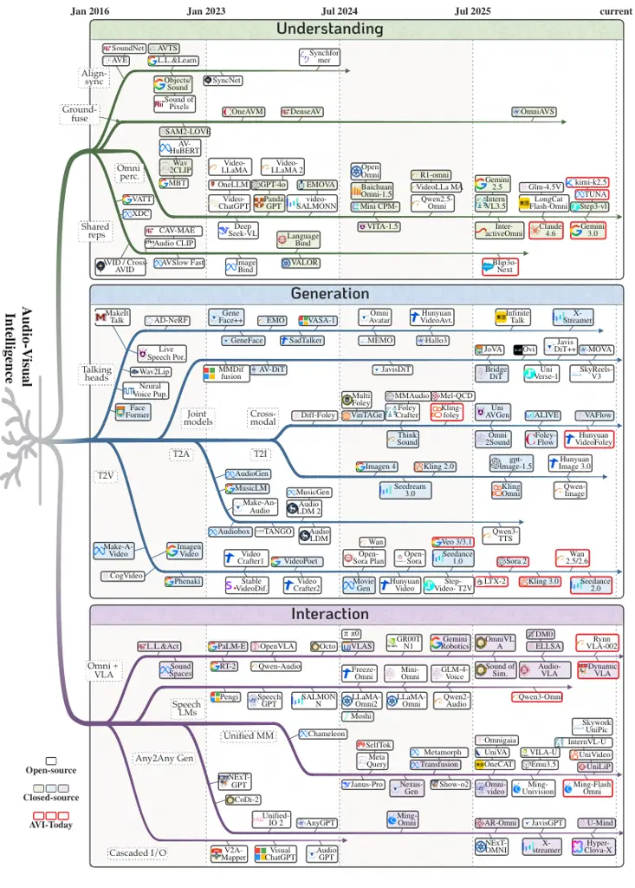

Figure 1: The evolutionary tree of Audio-Visual Intelligence from 2016
to 2026. The four columns track representative methods across
understanding the world (audio-visual perception), creating the world
(audio-visual generation), interacting with the world (unified
perception and generation), and the converged AVI systems of today.

## 1 Introduction

Large foundation models have transformed artificial intelligence by
scaling data, compute, and model capacity to unlock broad generalization
and emergent capabilities (Hurst et al., 2024; Guo et al., 2025a; Yang
et al., 2025a). Human perception is inherently multimodal, with audio
and vision forming the most pervasive and complementary pair for
understanding, prediction, and control in real-world environments (Xu et
al., 2025b; Kong et al., 2024a; Kim et al., 2024b; Fei et al., 2025).
Across society, this audio-visual pairing underpins assistive
technologies, education, robotics, entertainment, and creative tooling,
where perception and generation increasingly co-exist rather than appear
in isolation. In the large-model era, progress therefore depends on
unifying audio-visual intelligence (AVI) to support robust
understanding, controllable generation, and interactive reasoning under
temporal and spatial constraints. Industry systems such as Meta MovieGen
(Polyak et al., 2025) and Google Veo-3 (DeepMind, 2025) exemplify this
strategic shift toward end-to-end audio-vision modeling and coordinated
synthesis, signaling both technical maturity and growing application
demand. Against this backdrop, we position our work to consolidate
concepts, methods, and trends for AVI at foundation-model scale, laying
a coherent basis for research and deployment.

As outlined in fig. 1, AVI spans a wide and rapidly evolving task
spectrum that reflects how sound and sight co-occur in the wild. On the
perception side, representative problems include audio-visual speech
recognition (Malik et al., 2021), lip reading (Son Chung et al., 2017),
active speaker detection (Roth et al., 2020), sound source localization
and separation (Tzinis et al., 2020), event understanding (Monfort et
al., 2019), cross-modal retrieval (Hamilton et al., 2024), and AV
question answering (Yang et al., 2022), all of which rely on
synchronization and grounding across modalities. On the generative side,
research explores audio-driven talking heads (Wang et al., 2021b),
video-conditioned speech or Foley (Cheng et al., 2025a), music
generation aligned to visual rhythm (Hong et al., 2025), dubbing and
alignment (Luo et al., 2023), cross-modal editing and stylization (Fu et
al., 2025d), and controllable multimodal storytelling with long-horizon
coherence (Zhang et al., 2025f). Interactive settings further introduce
streaming inference (Xie et al., 2025c), tool use (Yao et al., 2022),
and embodiment (Kim et al., 2024b), where systems must reason over
temporally entangled signals while respecting latency and user intent.
Collectively, these task families motivate unified formalisms for
inputs, objectives, and evaluations that can compare methods fairly
across heterogeneous settings.

Methodologically, AVI builds on modality-specific encoders or tokenizers
for audio and vision, cross-modal fusion and alignment, and powerful
generative decoders (Xu et al., 2025b; Chen et al., 2025d).
Autoregressive transformers (Brown et al., 2020) drive sequence modeling
for speech, music, and video tokens, enabling conditional decoding and
instruction following at scale. Diffusion models (Ho et al., 2020; Liu
et al., 2023c) provide high-fidelity synthesis and flexible editing,
increasingly adapted to multimodal control via cross-attention and
guidance mechanisms. Self-supervised objectives such as contrastive
alignment and masked/denoising modeling remain central to representation
learning, while instruction tuning and preference optimization tailor
behaviors for interactive AV use (Girdhar et al., 2023; Xu et al.,
2025b). Scaling laws, data mixtures, and curation strategies, i.e.,
spanning speech corpora, music datasets, video-audio pairs, and
synthetic pipelines, jointly determine capability and robustness,
raising new questions about coverage, bias, and licensing (Yin et al.,
2024a).

Despite impressive progress, the literature remains fragmented across
subcommunities with overlapping definitions, inconsistent terminology,
and divergent taxonomies that hinder cumulative understanding.
Evaluation practices vary widely in datasets, metrics, and protocols,
especially for open-ended generation, alignment quality, temporal
coherence, and human-centric judgments, which complicates
reproducibility and benchmarking (Yang et al., 2022; Cao et al., 2025b).
Safety and governance concerns, e.g., privacy in audio/video, consent
for speech and music, watermarking and provenance, and the energy
footprint of foundation-scale training, are increasingly consequential
yet unevenly addressed (Chen et al., 2025g; DeepMind, 2025). These gaps
might underscore the need for a comprehensive, taxonomy-driven survey
that unifies the area and establishes actionable, comparable standards
for AVI research and practice.

### 1.1 Contribution Summary

- •
  First Comprehensive Survey: This work provides the first systematic
  and in-depth survey of Audio-Visual Intelligence within the paradigm
  of large foundation models, unifying perception, generation, and
  interaction research under a coherent framework.
- •
  Unified Taxonomy: We establish a principled taxonomy that organizes
  the diverse audio-visual tasks (covering speech, music, sound events,
  video, and open-world understanding, generation, and interaction)
  while clarifying task scope, assumptions, and relationships among
  subproblems.
- •
  Core Methodological Synthesis: We consolidate the methodological
  foundations of AVI, including audio/visual tokenization, cross-modal
  fusion, autoregressive and diffusion-based generation, instruction
  alignment, and large-scale pretraining strategies.
- •
  Benchmark and Evaluation Overview: We curate and summarize datasets,
  benchmarks, and evaluation metrics across task families, identify key
  gaps in assessment protocols, and propose practical guidelines to
  promote fair and reproducible comparisons.
- •
  Frontiers and Future Directions: We highlight emerging research
  challenges, such as temporal synchronization, spatial audio reasoning,
  multimodal controllability, safety, watermarking, and governance, and
  outline promising avenues for the next generation of audio-visual
  foundation models.
- •
  Resource Sharing: All summarized resources, references, and
  organizational structures will be publicly released to support
  transparency and accelerate progress within the research community.

### 1.2 Scope and Organization

As depicted in fig. 2, after laying a formal definition of the data
modalities of audio and vision representation (section 2), we first
present a principled taxonomy of Audio-Visual Intelligence (section 3)
that clarifies scope, assumptions, supervision signals, and
relationships among task families, providing a global map before delving
into specifics. We then synthesize the foundation techniques (section 4)
for AVI, covering tokenization and representations, cross-modal fusion
and alignment, autoregressive and diffusion generation, training
objectives, data scaling and curation, and instruction alignment for
interactive use. Building on this base, we organize the literature along
three pillars: perception (section 5), generation (section 6), and
interaction (section 7), where for each pillar, we review representative
methods, summarize datasets and metrics, and provide comparative
analyses with distilled takeaways. Afterwards, we walk through the
representative applications (section 8) under AVI, such as digital
humans and immersive experience, during which we also highlight the
relevant methods used in the pipeline. Finally, we discuss open
challenges and forward directions (section 9), including synchronization
and temporal reasoning, spatial audio and 3D/4D grounding,
controllability and editing, streaming efficiency and latency,
evaluation for open-ended AV generation, and safety, watermarking, and
data governance at scale.

Figure 2: Taxonomy of Audio-Visual Intelligence.

## 2 Preliminary

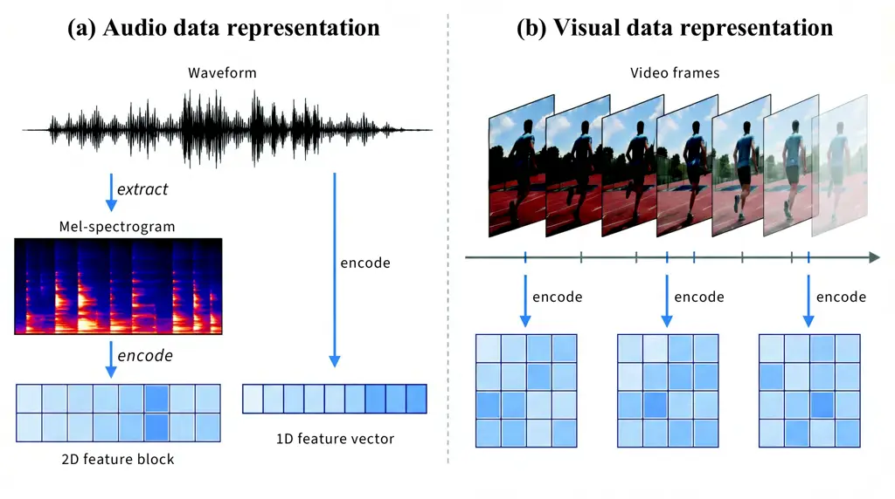

Figure 3: The overview of Audio-Visual data representation.

The remainder of the survey presupposes a clear picture of what “audio”
and “vision” mean in digital form: how physical signals are sampled, how
they are turned into tensors or tokens for neural models, and what
unimodal representations feed cross-modal and generative systems later
on. We therefore begin by defining each modality in isolation before any
fusion, alignment, or task-specific processing is introduced in later
sections. The overview in fig. 3 summarizes the main data shapes and
representation families; the subsections that follow make these notions
precise for sound and for images and video, respectively, including both
continuous embeddings and discrete tokenization.

### 2.1 The Audio Modality: Data and Representation

The audio modality originates from physical vibrations propagating as
sound waves, which can be categorized into speech, music (including
instrumental and vocal), and general sound events, which encompass
acoustic scenes such as environmental, urban, domestic sounds, or sound
effects. For digital processing, these analog signals are captured by
vibrations of sensors in microphones, and further sampled to produce 1D
time-series digital signals known as the waveform. This is typically
formatted as mono (1-channel) or stereo (2-channel), though
multi-channel spatial audio formats also exist.

As shown in fig. 3, audio signals are primarily modeled in two forms:
raw waveforms and time-frequency representations. A mono waveform is
represented as a 1D temporal sequence $`a\in\mathbb{R}^{L}`$ sampled at
a fixed rate, while multi-channel audio can be expressed as
$`A\in\mathbb{R}^{C\times L}`$. Alternatively, the waveform can be
transformed via Short-Time Fourier Transform (STFT) into a spectrogram,
whose magnitudes are typically projected onto the Mel scale and
logarithmically compressed to obtain a log-Mel spectrogram
$`S\in\mathbb{R}^{T\times F}`$. These two representations dominate the
inputs for audio encoders in multimodal foundation systems (Ma et al.,
2024a):

\(1\) Global Embeddings: Encoding an entire audio segment into a single
semantic vector can capture high-level acoustic and semantic
features (Hsu et al., 2021; Baevski et al., 2022; McCallum et al.,
2022). Formally, an encoder $`f_{\theta}^{g}`$ maps the input signal
into a $`d`$-dimensional embedding:
$`z=f_{\theta}^{g}(x)\in\mathbb{R}^{d}.`$

\(2\) Continuous Dense Representations: Beyond global pooling, many
methods preserve temporal (and optionally frequency) structure by
producing a latent feature sequence or map (Huang et al., 2022a; Chen et
al., 2023c). Let $`\tilde{x}`$ denote an audio input representation,
which may be the waveform itself or a time-frequency transform (e.g.,
log Mel-spectrogram) $`\tilde{x}\in\mathbb{R}^{F\times L}`$. An encoder
$`f_{\theta}`$ produces a (d)-dimensional, downsampled dense
representation:
$`e=f_{\theta}(\tilde{x})\in\mathbb{R}^{\frac{F}{s_{f}}\times\frac{L}{s_{t}}\times d}`$,
where $`s_{f}`$ and $`s_{t}`$ are downsampling factors along frequency
and time (for 1D waveform features, the frequency axis can be treated as
$`F=1`$.

\(3\) Discrete Token Representations: Vector quantization models
discretize audio into token sequences, enabling language-model-style
sequence modeling and generation (Zeghidour et al., 2021; Défossez et
al., 2022; Ji et al., 2025). Using a learned codebook, a tokenizer
$`f_{\theta}^{VQ}`$ maps $`\tilde{x}`$ to a sequence of $`m`$ token IDs:
$`q=f_{\theta}^{VQ}(\tilde{x})\in\mathbb{N}^{m}`$.

### 2.2 The Visual Modality: Data and Representation

Visual data generally refers to images and videos captured as pixel
intensities, where an image can be viewed as a projection of the 3D
scene onto a 2D image plane (as in a pinhole camera model), and a video
is composed of a sequence of image frames. Formally, a 3-channel RGB
color image is represented as a matrix
$`I\in\mathbb{R}^{H\times W\times 3}`$, where $`H,W`$ refer to height
and width, respectively. A video can be represented as an ordered series
of $`T`$ image frames
$`V=\{I_{1},I_{2},\dots,I_{T}\}\in\mathbb{R}^{T\times H\times W\times 3}`$,
often played at a fixed frame rate (e.g. 30 frames per second) and
stored and processed as 4D tensors in computer vision models.

Visual data encompasses a wide variety of forms, including natural
images (Russakovsky et al., 2015), virtual images (Ju et al., 2023),
paintings (Gontier et al., 2023), etc. In audio-visual applications,
human-centric content constitutes a key subset, including human body (Ju
et al., 2023), talking-head (Chen et al., 2025f), and lip-synchronized
videos (Jiang et al., 2024). Beyond 2D imagery, many works explore 3D
visual representations, such as depth maps (Ming et al., 2021), point
clouds (Guo et al., 2020), surface meshes (Kato et al., 2018),
NeRFs (Gao et al., 2022), and 3D Gaussian Splatting (Fei et al., 2024a).
These formats enable richer modeling of geometry and spatial interaction
in multimodal tasks.

Raw image or video data is high-dimensional, and thus various
representation methods are employed to extract compact, informative
features:

\(1\) Global Embeddings: A common approach encodes an entire image (or
video frame) into a single global feature vector capturing semantic
content (Radford et al., 2021). Models such as convolutional neural
networks (CNNs) (He et al., 2016) or vision transformers
(ViT) (Dosovitskiy, 2020) serve as extractor $`f_{\theta}^{g}`$, mapping
each image to a $`d`$-dimensional vector:
$`z=f_{\theta}^{g}(I)\in\mathbb{R}^{d}`$.

\(2\) Continuous Dense Representations: Another strategy is to map
images into continuous latent spaces while preserving spatial
structures (He et al., 2016; Dosovitskiy, 2020). Formally, one can
denote an encoder function $`f_{\theta}`$ that maps an image
$`I\in\mathbb{R}^{W\times H\times 3}`$ to a $`d`$-dimensional,
$`s`$-downsampled feature map or sequence
$`e=f_{\theta}(I)\in\mathbb{R}^{\frac{W}{s}\times\frac{H}{s}\times d}`$.

\(3\) Discrete Token Representations: Vector quantization models like
VQ-VAE (van den Oord et al., 2017) can further discretize image features
using a learned codebook. Each image is represented by a sequence of
$`m`$ token IDs corresponding to nearest codebook entries:
$`q=f_{\theta}^{VQ}(I)\in\mathbb{N}^{m}`$.

## 3 Task Taxonomy

This section provides a systematic overview of the tasks involved in
audio-visual intelligence across three key dimensions: understanding,
generation, and interaction. As depicted in fig. 4, these dimensions
outline a roadmap toward the future development of AGI. The specific
details of each task will be discussed in section 5, section 6, and
section 7.

### 3.1 Understanding the World: Audio-Visual Perception

Perception is the foundation of audio-visual intelligence, enabling
models to sense and interpret the world from raw auditory and visual
signals. This section presents a taxonomy of audio-visual perception
tasks along three progressively higher levels of abstraction:
pixel-level perception, content understanding, and logical reasoning.
Together, these task categories outline the perceptual and cognitive
capabilities required for building general audio-visual intelligence.

$`\bullet`$ Pixel-Level Perception. Focusing on learning direct
correspondences between raw audio signals and visual pixels, these tasks
emphasize low-level sensing and alignment, forming the basis of
multimodal perception. Representative examples include unimodal tasks
such as automatic speech recognition (ASR) in audio (Prabhavalkar et
al., 2023) and object detection (Zou et al., 2023) or tracking (Luo et
al., 2021) in vision, as well as cross-modal tasks such as audio-visual
event localization (Tian et al., 2018) and segmentation (Zhou et al.,
2022), which associate sounds with their spatial visual origins.
Overall, pixel-level perception provides fine-grained spatial and
temporal grounding of sound sources in visual scenes.

$`\bullet`$ Content Understanding. This aims to extract high-level
semantic information from audio-visual inputs, including objects,
events, and their temporal and causal relationships. A typical example
is audio-visual question answering (AVQA), where models answer questions
by jointly understanding audio and video content (Li et al., 2022a).
These tasks require aligning multimodal cues over time and interpreting
their semantic interactions. Compared to pixel-level perception, content
understanding operates at a higher level of abstraction and reflects a
model’s ability to comprehend what is happening in a multimodal scene.

$`\bullet`$ Logical Reasoning. It further extends audio-visual
understanding by requiring models to perform inference beyond direct
observation, incorporating physical commonsense, causality, or
mathematical reasoning. Models are required to infer latent causes or
predict outcomes from audio-visual evidence, such as physical
audio-visual commonsense reasoning (Yu et al., 2022b). These tasks
assess whether models can integrate perception with structured reasoning
to explain or anticipate events in the multimodal world.

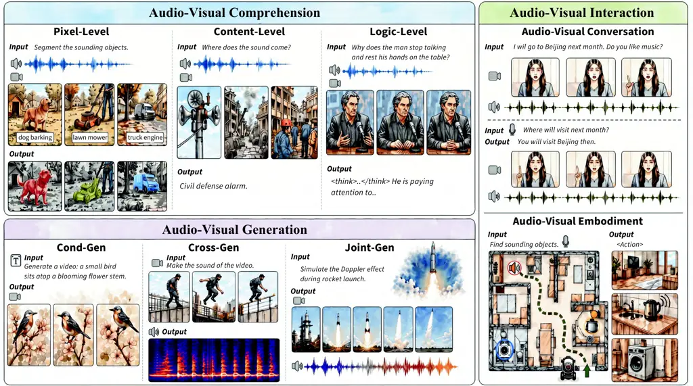

Figure 4: Overview of audio-visual intelligence tasks.

### 3.2 Creating the World: Audio-Visual Generation

Audio-visual generation aims to synthesize coherent and realistic
multimodal content by modeling the joint distribution of visual and
auditory signals. Unlike perception tasks that interpret inputs,
generation tasks require creating temporally aligned, semantically
consistent, and perceptually realistic outputs. This section categorizes
generation into three paradigms: conditional, cross-modal, and joint
audio-visual generation, which represent progressively deeper
integration for building world-creating multimodal systems.

$`\bullet`$ Conditional Audio-Visual Generation. This task produces
outputs guided by external control signals such as text, labels, or
structured attributes, including (1) conditional audio generation, where
models create sounds (e.g., speech, effects) based on text or audio
context (Liu et al., 2024c; Li et al., 2024f); and (2) conditional
visual generation, where models synthesize images or videos from text,
visual cues, or scene representations (Cao et al., 2025a; Wan et al.,
2025). These tasks emphasize controllability and semantic alignment,
bridging intent and output through high-level conditioning.

$`\bullet`$ Audio-Visual Cross-Modal Generation. This kind of task
synthesizes one modality conditioned on another, requiring fine-grained
cross-modal learning capabilities, including (1) audio-to-visual
generation, such as talking-head synthesis or audio-driven avatars (Gao
et al., 2025b; Agarwal et al., 2026); and (2) video-to-audio generation,
such as generating soundtracks, speech, or spatial audio from visual
inputs (Wang et al., 2025e; Cheng et al., 2025a). These tasks demand
strong temporal alignment and causal grounding between audio-visual
modalities beyond textual control signals.

$`\bullet`$ Audio-Visual Joint Generation. Unlike the above tasks, it
models the coupled evolution of sound and vision during generation,
enabling synchronized and causally consistent audio-visual outputs. Key
settings include (1) text/image-conditioned joint generation, where both
modalities are generated from a shared prompt (Liu et al., 2025i;
HaCohen et al., 2026); (2) audio-visual editing and extension, modifying
existing multimodal content while maintaining coherence (Fu et al.,
2025d); and (3) structured/spatial joint generation, such as text-to-3D
audio-visual synthesis involving geometry and spatialized audio (Yang et
al., 2025c). This paradigm seeks to capture holistic scene evolution and
multimodal consistency.

### 3.3 Interacting with the World: Audio-Visual Unified Perception and Generation

Audio-visual unified perception and generation integrates multimodal
understanding with generative decision-making in interactive settings.
Unlike isolated perception or offline generation, these systems must
interpret ongoing audio-visual inputs, reason over context or intent,
and produce timely multimodal outputs or actions. We categorize such
systems into two paradigms: interactive audio-visual conversation and
interactive audio-visual embodiment in the digital and physical world,
respectively.

$`\bullet`$ Interactive Audio-Visual Conversation. It involves dialogue
systems that process multimodal inputs and generate corresponding
responses, including conversational editing, instruction-following
generation, and multimodal world modeling. Based on output modality,
these systems can be divided into: (1) audio-centric, producing speech
responses from multimodal context (Huang et al., 2024c); (2)
visual-centric, generating or editing images and videos during
conversation (Deng et al., 2025a; Huang et al., 2025f); and (3)
omni-modal, supporting flexible input-output modalities in a unified
interface (Liu et al., 2025h; AI et al., 2025).

$`\bullet`$ Interactive Audio-Visual Embodiment. It extends into
physical environments, where systems convert multimodal understanding
into actions. Applications include (1) audio-visual navigation, using
sensory cues to guide movement (Liu et al., 2024h; Yang et al., 2024e);
(2) embodied QA and manipulation, where agents reason and act based on
audio-visual inputs (Zhao et al., 2025d; Wei et al., 2025c), etc. These
tasks demand tightly integrated perception, reasoning, and action,
positioning unified audio-visual models as key enablers of embodied
intelligence.

## 4 Foundation Techniques

This section introduces foundational techniques developed in the era of
large foundation models, which provide key technical pathways toward
achieving universal audio-visual intelligence, including
representation-centric, generation-centric, and LLM-centric methods.

### 4.1 Representation-centric Methods

As illustrated in fig. 5, representation-centric methods aim to
transform raw input data (including image pixels, video frames, and
audio waveforms) into either continuous embeddings or discrete tokens
that can be efficiently processed by neural networks and support
relevant artificial intelligence applications.

#### 4.1.1 Audio-Visual Feature Extraction and Representation

Audio-visual representation learning exploits natural synchronization
between visual and auditory signals in unlabeled videos to learn
cross-modal semantics without manual annotations. Existing approaches
mainly rely on self-supervised objectives, contrastive alignment,
correlation modeling, or task-oriented encoder designs to learn shared
audio-visual embeddings.

$`\bullet`$ Self-Supervised Representation Learning. Self-supervised
learning leverages cross-modal synchronization as a supervisory signal
to learn joint audio-visual representations. Early proxy tasks such as
Audio-Visual Correspondence and Temporal Synchronization encourage
models to predict cross-modal alignment (Arandjelovic and Zisserman,
2017; Korbar et al., 2018), while later methods extend this idea through
clustering-based representation learning, contrastive objectives, and
scalable transformer architectures (Alwassel et al., 2020; Morgado et
al., 2021b; Akbari et al., 2021). Recent work further explores
structured representation decomposition into shared, unique, and
synergistic speech information through evolving self-supervised
objectives (Zhang et al., 2024h).

$`\bullet`$ Multi-Modal Contrastive Learning. Contrastive learning
aligns audio and visual modalities by maximizing similarity between
synchronized pairs while separating mismatched samples in a shared
embedding space. Representative approaches range from cross-modal
semantic transfer and multi-modal alignment frameworks (Wu et al., 2022;
Girdhar et al., 2023) to improved contrastive objectives and sequential
alignment strategies (Kim et al., 2024a; Tsiamas et al., 2025; Huang et
al., 2023b). Additional work relaxes strict synchronization assumptions
or introduces task-specific contrastive objectives for downstream tasks
such as event localization (Sarkar and Etemad, 2023; Bao et al., 2023b).

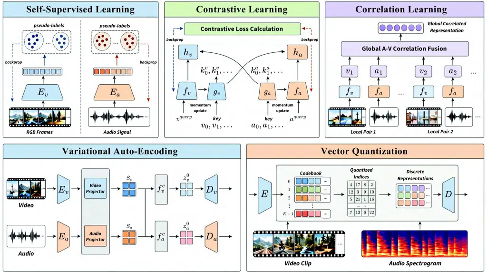

Figure 5: The overview comparison of different representation learning
techniques.

$`\bullet`$ Audio-Visual Correlation Modeling. Beyond global embedding
alignment, correlation modeling incorporates explicit cross-modal
interaction mechanisms within the representation architecture to capture
temporal and spatial dependencies. Examples include bottleneck-based
cross-modal attention (Nagrani et al., 2021), bidirectional
reconstruction frameworks for audio-visual segmentation (Hao et al.,
2024), and training strategies that tolerate partial temporal
misalignment (Sarkar and Etemad, 2023).

$`\bullet`$ Task-Oriented Encoders. Task-oriented encoders incorporate
domain knowledge or task-specific supervision to improve representation
learning for particular applications. Audio-visual speech unit learning
with masked prediction (Shi et al., 2022) and modality-aware masked
autoencoding for affective understanding (Wu et al., 2025i) are
representative examples.

#### 4.1.2 Audio-Visual Variational Auto-Encoding and Reconstruction

In audio-visual intelligence, variational auto-encoding (VAE) provides a
unified framework for learning compact representations and enabling
reconstruction across modalities (Kingma and Welling, 2013; Rezende et
al., 2014). As fig. 5 shows, VAE adopts an encoder-decoder architecture
that maps audio or visual inputs into a probabilistic latent space and
reconstructs the original signals by sampling from this space (Rezende
et al., 2014). By imposing a structured prior on latent variables, VAEs
support both representation learning and generative reconstruction,
making them a foundational technique for audio-visual modeling (Qiu et
al., 2025).

In particular, recent multimodal VAEs have explored learning joint
latent spaces from synchronized audio and visual inputs (Sadok et al.,
2024; Qiu et al., 2025). By structuring latent variables into shared and
modality-specific components, these models support cross-modal
reconstruction while disentangling modality-invariant semantics from
modality-specific information (Sadok et al., 2024; Qiu et al., 2025).
Such structured latent designs make VAEs a useful framework for
cross-modal reconstruction and generation in audio-visual
settings (Sadok et al., 2024).

#### 4.1.3 Audio-Visual Discrete Tokenization

Audio-visual discrete tokenization converts continuous acoustic and
visual signals into compact symbolic units, providing discrete token
interfaces commonly used in token-based multimodal models (Zeghidour et
al., 2021; van den Oord et al., 2017). By applying vector quantization
to learned latent spaces, structured signals are transformed into token
sequences suitable for autoregressive modeling.

In audio, vector-quantization-based codecs such as
SoundStream (Zeghidour et al., 2021), EnCodec (Défossez et al., 2022),
and DAC (Kumar et al., 2023) progressively improve reconstruction
quality, while WavTokenizer (Ji et al., 2025) reduces token rates.
Semantic tokens from self-supervised models such as HuBERT (Hsu et al., 2021) capture linguistic content but omit fine acoustic detail,
motivating hybrid designs including X-Codec (Ye et al., 2025),
BiCodec (Wang et al., 2025n), and Mimi (Défossez et al., 2024). In
vision, discrete latent modeling originates from VQ-VAE (van den Oord et
al., 2017) and VQGAN (Esser et al., 2020), with subsequent improvements
in codebook scalability and efficiency such as MAGVIT-2 (Yu et al.,
2023b), VQGAN-LC (Zhu et al., 2024c), SimVQ (Zhu et al., 2025b), and
TokenFlow (Qu et al., 2025), and extensions to video tokenization
including Divot (Ge et al., 2025).

Recent efforts pursue unified multimodal tokenization, where shared or
interleaved vocabularies support cross-modal reasoning and generation.
SpeechGPT (Zhang et al., 2023b), AnyGPT (Zhan et al., 2024), and
Moshi (Défossez et al., 2024) exemplify token-level multimodal modeling,
highlighting the importance of efficient and semantically grounded
tokenizer design for audio-visual foundation models.

### 4.2 Generation-centric Methods

Generation-centric methods support conditional synthesis and editing
across unimodal (T2I, T2V, T2A) and cross-modal (A2V, V2A, T2AV)
audio-visual tasks, with semantic coherence and temporal synchronization
as key requirements. Several dominant generation paradigms are presented
in fig. 6.

#### 4.2.1 Generative Adversarial Networks

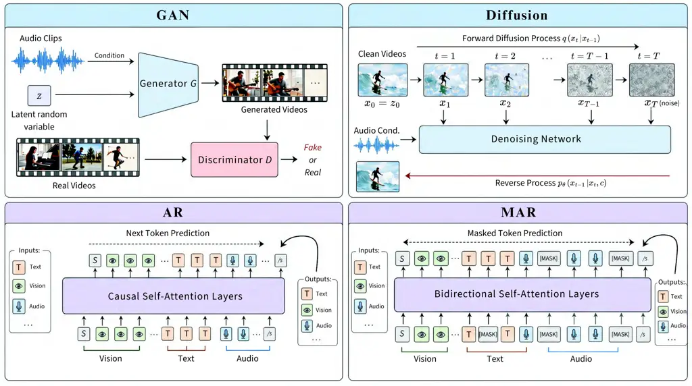

Figure 6: Overview comparison of generation mechanisms, including
Generative Adversarial Networks (GANs), diffusion models, autoregressive
(AR) models, and masked autoregressive (MAR) models.

Generative Adversarial Networks (GANs) learn generative models through
adversarial training between a generator and a discriminator (Goodfellow
et al., 2014). Improvements such as DCGAN (Radford et al., 2015),
WGAN (Arjovsky et al., 2017), and StyleGAN (Karras et al., 2019)
significantly advanced image synthesis before the rise of diffusion
models (Ho et al., 2020; Rombach et al., 2022). GANs were also explored
for cross-modal audio-visual generation (Pan et al., 2019), including
text-conditioned synthesis (Reed et al., 2016; Tulyakov et al., 2018),
neural audio generation (Kumar et al., 2019; Kong et al., 2020a), and
audio-driven visual animation (Prajwal et al., 2020; Lee et al., 2019;
Owens et al., 2016a; Zhou et al., 2018b).

Despite these early demonstrations (Baltrušaitis et al., 2018), progress
in diffusion-based generators has made those newer paradigms
increasingly common in recent audio-visual generation research (Yang et
al., 2023c; Rombach et al., 2022; Blattmann et al., 2023b).

#### 4.2.2 Diffusion-based Generation

Diffusion models generate data by learning a denoising process from
noise to the data distribution (Sohl-Dickstein et al., 2015; Ho et al.,
2020). Related continuous-time generators such as flow matching and
rectified flow learn velocity fields that transport noise to
data (Lipman et al., 2023; Liu et al., 2023c). Architecturally,
diffusion and related continuous-time models have evolved from
convolutional UNets (Ronneberger et al., 2015) to Diffusion Transformers
(DiT) (Peebles and Xie, 2023), which scale more effectively with data
and model size (Esser et al., 2024).

Building on these foundations, diffusion and related continuous-time
generators have driven rapid progress in audio-visual and multimodal
generation (Yang et al., 2023c). In image and video generation, latent
diffusion and rectified flow models underpin recent text-to-image (Cao
et al., 2025a; Wu et al., 2025a; Cai et al., 2025) and
text-to-video (Kong et al., 2024a; Gao et al., 2025c; Wan et al., 2025;
Liang et al., 2025) systems, enabling higher resolution, longer
duration, and improved temporal consistency. For audio generation,
latent-diffusion and related continuous-time models have been applied to
speech (Anastassiou et al., 2024) and sound effects (Liu et al., 2024c)
synthesis, often operating in learned latent spaces. Recent audio-visual
systems also explore aligned latent conditioning across text, audio, and
visual inputs for tasks such as audio-conditioned video synthesis (Gao
et al., 2025b), visually grounded sound generation (Cheng et al.,
2025a), and joint audio-video generation (Low et al., 2025).

Diffusion and related continuous-time models have become a prevalent
paradigm in modern audio-visual generation, offering improved stability
and scalability over earlier GAN-based approaches (Yang et al., 2023c;
Liu et al., 2023c; Yin et al., 2024b).

#### 4.2.3 Autoregressive Generation

Autoregressive (AR) generators model the data distribution as a sequence
of next-token predictions, enabling generation through sequential
decoding. With discrete tokenization of images, audio, and video,
multimodal generation can be formulated as language modeling over token
streams (Van den Oord et al., 2016; Van Den Oord et al., 2016; van den
Oord et al., 2017; Zeghidour et al., 2021; Défossez et al., 2022). This
paradigm enables token-based generators, including VAR (Tian et al.,
2024a), LlamaGen (Sun et al., 2024c), Emu3 (Wang et al.,
2024g)/Emu3.5 (Cui et al., 2025b), and NOVA (Deng et al., 2024a) for
images/video generation, as well as codec language models for audio and
music generation including AudioLM (Borsos et al., 2023a),
MusicLM (Agostinelli et al., 2023), MusicGen (Copet et al., 2023),
VALL-E 2 (Chen et al., 2024c), and CosyVoice 2 (Du et al., 2024b).

AR transformers share the next-token prediction interface of large
language models (Brown et al., 2020) and can support multimodal
prompting by interleaving modality-specific token streams, as
demonstrated in systems such as VideoPoet (Kondratyuk et al., 2024) and
V-AURA (Viertola et al., 2024) for synchronized audio-visual generation.
However, sequential decoding leads to high sampling latency and error
accumulation for long sequences, motivating more efficient alternatives
such as masked token generation (Section 4.2.4) and diffusion-based
approaches (Section 4.2.2).

#### 4.2.4 Masked Autoregressive Generation

Masked autoregressive (MAR) generation, a.k.a. mask-and-predict
decoding, replaces strictly sequential decoding with iterative masked
token prediction, enabling parallel generation over subsets of
tokens (Ghazvininejad et al., 2019). Representative systems include
MaskGIT (Chang et al., 2022) and Muse (Chang et al., 2023a) for images,
MAGVIT (Yu et al., 2023a; Yu et al., 2023b; Luo et al., 2024),
MaskViT (Gupta et al., 2022), and Phenaki (Villegas et al., 2022) for
video tokens, and SoundStorm for parallel audio codec generation (Borsos
et al., 2023b).

Compared to strictly autoregressive decoding, MAR enables faster
parallel refinement over discrete visual or audio tokens (Li et al.,
2024g), but its performance often depends on tokenization quality and
decoding schedules (Weber et al., 2024; Li et al., 2024g).

### 4.3 LLM-Centric Methods

As generative large language models (LLMs) (Achiam et al., 2023; Guo et
al., 2025a) have achieved strong performance in language understanding
and generation, LLM-centric frameworks have become a prominent direction
in audio-visual intelligence, where audio and visual inputs are
converted into representations that LLMs can process to elicit
multimodal intelligence.

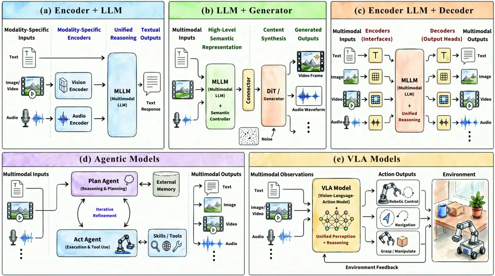

Figure 7: The overview comparison on the mechanism of (a) Encoder + LLM,
(b) LLM + Generator, (c) Encoder + LLM + Decoder, (d) Agentic LLM, (e)
VLA Model.

#### 4.3.1 Encoder+LLM for Multimodal Perception

$`\bullet`$ Definition. Encoder+LLM system connects modality encoders
(e.g., vision or audio) to a pretrained LLM backbone. Encoded sensory
features are projected into the LLM embedding space through lightweight
MLP or attention-based adapters, enabling the language model to
interpret and reason over multimodal inputs.

$`\bullet`$ Taxonomy and Representative Systems. Encoder+LLM approaches
can be grouped by modality awareness.

(1) Vision-LLM Perception. Vision-LLM pipelines project visual features
from pretrained encoders such as CLIP (Radford et al., 2021) and
SigLIP (Zhai et al., 2023; Bai et al., 2025b) into LLMs through adapters
or cross-attention modules, as in Flamingo (Alayrac et al., 2022),
BLIP-2 (Li et al., 2023b), and MiniGPT-style systems (Zhu et al.,
2024b). Extensions to video understanding include Video-ChatGPT (Maaz et
al., 2024), Video-LLaVA (Lin et al., 2024), Video-LLaMA (Zhang et al.,
2023c), Vitron Fei et al. (2024c) and LLaMA-VID (Li et al., 2024i).
Recent models scale perception with stronger encoders and token
compression, such as Qwen2.5/3-VL (Bai et al., 2025b; Bai et al.,
2025a), InternVL (Chen et al., 2024f; Wang et al., 2025k), and
long-video frameworks including LongVA (Zhang et al., 2024c) and
LongVU (Shen et al., 2024). Related inference-acceleration methods such
as FastV (Chen et al., 2024a) further improve token efficiency at
inference time.

(2) Audio-LLM Perception. Audio-LLM systems encode waveforms using
pretrained acoustic models such as HuBERT (Hsu et al., 2021),
SpeechT5 (Ao et al., 2022), BEATs (Chen et al., 2023c), and
Whisper (Radford et al., 2023), whose outputs are projected into the
language space. Representative efforts include Pengi (Deshmukh et al.,
2023), LLaSM (Shu et al., 2023), GAMA (Ghosh et al., 2024),
SALMONN (Tang et al., 2023), and Qwen-Audio series (Chu et al., 2023;
Chu et al., 2024).

(3) Audio-Visual Encoder-LLM Integration. Audio-visual reasoning systems
extend this idea by jointly integrating visual and acoustic encoders
with an LLM. Representative models include Video-LLaMA 2 (Cheng et al.,
2024), NExT-GPT (Wu et al., 2024), OneLLM (Han et al., 2024),
AnyGPT (Zhan et al., 2024), and VITA (Fu et al., 2025b). Related
omni-modal models, such as GPT-4o (Hurst et al., 2024), Qwen2.5-Omni (Xu
et al., 2025a), Ming-Omni (AI et al., 2025), and Qwen3-Omni (Xu et al.,
2025b), further explore tighter joint training and broader multimodal
interaction.

#### 4.3.2 LLM+Generator for Multimodal Generation

$`\bullet`$ Definition. LLM+Generator couples an instruction-following
LLM with external modality generators (e.g., diffusion models or neural
codecs for image/video/audio) to support controllable multimodal
synthesis and editing by interpreting and reasoning over user inputs,
and enable flexible multimodal generation by reusing off-the-shelf
generators and optional perception tools without training a monolithic
model.

$`\bullet`$ Taxonomy and Representative Systems. Existing LLM+Generator
systems fall into two groups.

(1) Prompt/Tool Orchestration. The LLM converts user intent into tool
calls and prompts with minimal learned interfaces. Visual ChatGPT (Wu et
al., 2023) composes multiple visual models for multi-step image editing
and generation, while AudioGPT (Huang et al., 2024c) routes requests to
specialized audio and talking-head generators, including AudioLDM (Liu
et al., 2023a). Although related to agentic tool use, these systems
operate over relatively fixed toolsets and remain generator-centered.

(2) Learned Bridging to Generators. These methods introduce trainable
interfaces, such as adapters or learnable queries, to connect LLMs with
downstream generators. NExT-GPT (Wu et al., 2024) and CoDi-2 (Tang et
al., 2024) extend this design to multimodal and any-to-any generation,
while JavisGPT (Liu et al., 2025h) targets unified audio-visual
comprehension and generation and A2-LLM (Hu et al., 2026) focuses on
conversational audio-avatar interaction. Standalone models such as
Qwen-Image (Wu et al., 2025a) and UniVideo (Wei et al., 2025a) can also
be used as plug-in visual renderers.

#### 4.3.3 Unified Model for Joint Perception and Generation

$`\bullet`$ Definition. Unified models perform multimodal perception and
generation within a single end-to-end architecture, integrating modality
tokenizers and decoders as native components of a shared backbone.
Compared with cascaded LLM+Generator pipelines, they reduce interface
mismatches and cascading errors while enabling tighter cross-modal
alignment and lower-latency interaction.

$`\bullet`$ Taxonomy and Representative Systems. Existing unified
systems can be broadly grouped into three threads based on their primary
modeling objectives.

(1) Omni streaming assistants. These models target real-time multimodal
interaction with tightly coupled perception and generation and support
native speech input and output, such as GPT-4o (Hurst et al., 2024),
Qwen2.5-Omni (Xu et al., 2025a), Mini-Omni (Xie and Wu, 2024b), and
InteractiveOmni (Tong et al., 2025). Recent additions include
Moshi (Défossez et al., 2024), a full-duplex speech-text foundation
model achieving 160ms theoretical latency through its Inner Monologue
method and multi-stream hierarchical token generation, and
Qwen3-Omni (Xu et al., 2025b), which introduces a Thinker-Talker MoE
architecture with joint multimodal training across 2 trillion tokens.

(2) Unified token-space / interleaved multimodal models. These systems
model mixed-modality token sequences within a single transformer,
enabling unified understanding and generation of interleaved text-image
content. Representative models include Emu (Sun et al., 2023a),
DreamLLM (Dong et al., 2023), Janus (Wu et al., 2025b), Chameleon (Team,
2024a), and Show-o (Xie et al., 2024). Recent advances include
Janus-Pro (Chen et al., 2025h), which decouples visual encoding into
SigLIP for understanding and a VQ tokenizer for generation; BAGEL (Deng
et al., 2025a), a MoT architecture exhibiting emergent compositional
reasoning; Emu3 (Wang et al., 2024g), which unifies image and video
understanding and generation through pure next-token prediction; and
Transfusion (Zhou et al., 2024), which combines autoregressive and
diffusion objectives within a single transformer.

(3) Unified audio-visual generators. These models support joint video
generation or editing with synchronized audio through closely coupled
multimodal generation frameworks. Representative examples include
VideoPoet (Kondratyuk et al., 2024) for autoregressive audio-video
generation, JavisGPT (Liu et al., 2025h) for unified audio-visual
comprehension and generation, and Object-AVEdit (Fu et al., 2025d) for
object-level audio-visual editing. Overall, audio-visual joint modeling
remains at an early stage, as both audio and video modeling are still
under active exploration.

#### 4.3.4 Agentic System for Interactive Perception and Generation

$`\bullet`$ Definition. Agentic systems treat a (multimodal) LLM as a
planner that decomposes user requests into multi-step actions and
interacts with external tools for perception and generation. Unlike
fixed cascaded pipelines in section 4.3.2, they dynamically select
tools, iterate over intermediate results, and maintain task state,
enabling adaptive control for complex multimodal tasks such as
audio-visual workflows.

$`\bullet`$ Taxonomy and Representative Systems. Existing agentic
systems can be grouped by their primary application:

(1) General tool-routing agents. These systems use an LLM to plan tasks
and dispatch requests to heterogeneous model hubs or APIs. A
representative example is HuggingGPT (Shen et al., 2023b), which
demonstrates large-scale tool selection and orchestration across diverse
models.

(2) Perception-centric video agents. Recent work explores interactive
agents for long-horizon video understanding, where the model iteratively
queries perception tools and updates reasoning based on intermediate
observations, such as DoraemonGPT (Yang et al., 2024f) and VCA (Yang et
al., 2025e).

(3) Generation-oriented creative agents. Other systems focus on
structured media creation through multi-step editing and generation
workflows. Examples include video creation agents such as V-Stylist (Yue
et al., 2025) and Preacher (Liu et al., 2025g), as well as audio-focused
frameworks like Audio-Agent (Wang et al., 2025u) and
AudioToolAgent (Wijngaard et al., 2025a).

#### 4.3.5 Visual-Language-Action Models for Embodied Interaction

$`\bullet`$ Definition. Vision-Language-Action (VLA) models extend LLMs
by incorporating action spaces and interacting with physical
environments, enabling agents to close the perception-reasoning-action
loop. A typical VLA system takes multimodal observations (e.g., images,
audios, and language instructions) and outputs actions or policies,
which may be discrete navigation commands or continuous robot control
signals.

$`\bullet`$ Taxonomy and Representative Systems. Recent VLA research
focuses on several design directions.

(1) Language-conditioned policy models. RT-2 (Zitkovich et al., 2023)
established the modern VLA paradigm by co-training pretrained
vision-language models on robot trajectories and internet-scale
vision-language data, representing actions as token sequences aligned
with language representations. Subsequent extensions such as
RT-H (Belkhale et al., 2024) introduce hierarchical policies to separate
high-level planning from low-level control, while RT-Trajectory (Gu et
al., 2023) uses hindsight trajectory sketches to improve task
generalization.

(2) Open-source and scalable VLAs. OpenVLA (Kim et al., 2024b)
demonstrates that large-scale multimodal pretraining combined with robot
demonstration datasets can produce strong generalization across tasks
and embodiments. Other efficient designs such as TinyVLA (Wen et al., 2025) and SmolVLA (Shukor et al., 2025) target lightweight deployment,
while large industrial systems such as GR00T-N1 (Bjorck et al., 2025)
and Gemini Robotics (Team et al., 2025) extend VLA concepts to
whole-body robot control.

(3) Diffusion and planning-based VLA policies. Several works explore
generative policy representations and structured planning for complex
control. Examples include flow-matching policies such as
$`\pi_{0}`$ (Black et al., 2024), open-source generalist policies such
as Octo (Team et al., 2024), unified perception-action models such as
GraspVLA (Deng et al., 2025b), and architectures incorporating
trajectory reasoning or modular action heads, including TraceVLA (Zheng
et al., 2024), CogACT (Li et al., 2024e), and CogVLA (Li et al., 2025e).
Recent work also explores robustness and failure recovery, such as
FailSafe (Lin et al., 2025b), as well as world-model integration, such
as RynnVLA-002 (Cen et al., 2025).

## 5 Audio-Visual Perception

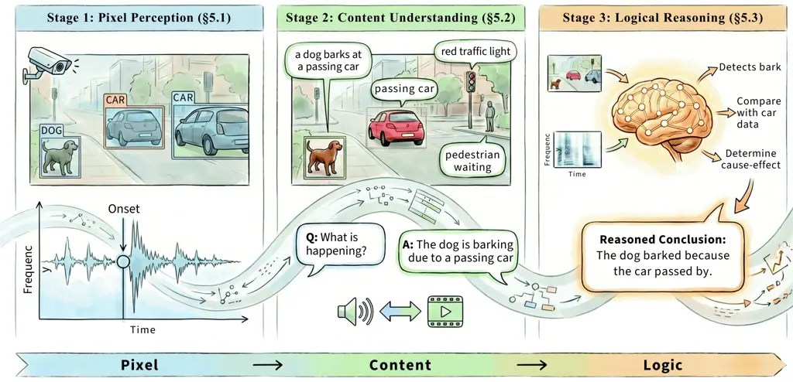

Figure 8: Organization of audio-visual perception and understanding. We
organize this section into pixel perception, content understanding, and
logical reasoning, moving from low-level signal detection to semantic
grounding and causal inference.

Perception in audio-visual systems begins with _what_ can be read off
raw signals, then moves to _what_ those signals mean in context, and
finally to _why_ and _how_ events are related over time; fig. 8
schematizes that progression. This section is organized in three parts
that mirror that ladder: we start from pixel- and sample-level structure
in each modality and in joint settings, then treat semantic content
understanding, and last cover reasoning that goes beyond one-step
recognition. Throughout, we distinguish unimodal preview material (brief
definitions and pointers) from audio-visual problems where cross-modal
alignment, data, and benchmarks are developed in more depth, as the
survey scope in section 3 requires.

### 5.1 Audio-Visual Pixel Perception

Pixel-level perception is concerned with time-frequency structure in
sound, spatial layout in images and video, and explicit alignment
between the two, including when events are jointly visible and audible.
The subsections below treat audio and vision in turn at this
granularity, then audio-visual event localization, segmentation, and
cross-modal temporal synchronization.

#### 5.1.1 Audio Perception

$`\bullet`$ Definition. Audio perception focuses on extracting low- and
mid-level structure directly from acoustic signals, operating at the
waveform or time-frequency level rather than at the level of semantic
interpretation or multi-step reasoning. Typical outputs include event
presence, temporal boundaries, onsets, beats, voice activity, and
separated source components across speech, environmental sound, and
music.

$`\bullet`$ Representative Tasks and Methods. We briefly summarize three
representative task families that provide useful acoustic primitives for
later audio-visual modeling:

Audio event detection and clip-level classification identify what
acoustic events are present in a clip or short time segment.
Self-supervised encoders such as HuBERT (Hsu et al., 2021), BEATs (Chen
et al., 2023c), MERT (Li et al., 2024j), and MuQ (Zhu et al., 2025a)
provide reusable representations for speech classification (Chang et
al., 2023b), music tagging (Ashraf et al., 2023), cross-modal
tagging (Huang et al., 2022b), and sound event detection (Martín-Morató
et al., 2023).

Temporal event localization and sequential labeling estimate when sounds
occur, including voice activity, sound-event boundaries, onsets, and
beats. Representative approaches include spiking networks for low-power
VAD (Yang et al., 2024c), teacher-student transformers for sound event
detection (Shao et al., 2024b), and rhythmic modeling for beat
tracking (Zhao et al., 2022). Recent analyses suggest that
general-purpose audio-text LLMs still lag behind task-specific models on
such fine-grained temporal perception tasks (Ma et al., 2025e).

Audio source separation recovers individual sources from mixtures by
disentangling overlapping acoustic components. Because separation is
both a perceptual primitive and a signal-generation operation, we only
note representative systems here, including TF-GridNet (Wang et al.,
2023b), Dual-Path Mamba (Jiang et al., 2025b), Hybrid Transformer
Demucs (Rouard et al., 2023), and Band-Split RNN (Luo and Yu, 2023); its
conditional transformation role is revisited in section 6.1.1.

#### 5.1.2 Visual Perception

$`\bullet`$ Definition. Visual pixel-level perception refers to the
fine-grained understanding of visual scenes by predicting spatially
resolved outputs for each pixel or region, rather than assigning a
single image-level label. These tasks are fundamental to grounding
objects, actions, and events in space and time, thereby providing the
structural basis for integrating visual content with audio in multimodal
systems.

$`\bullet`$ Representative Tasks and Methods. In this section, we
briefly introduce several core visual perception approaches that are
especially amenable to audio-visual integration. Other purely visual
perception methods, such as depth estimation (Ming et al., 2021), pose
estimation (Zheng et al., 2023), optical flow (Zhai et al., 2021), or
salient object detection/segmentation (Borji et al., 2019) are not
included due to space limitations.

Object Detection and Grounding, which aims to localize and classify
objects using bounding boxes (Zou et al., 2023). Classic approaches
include two-stage detectors (e.g., Faster R-CNN (Ren et al., 2016)) and
one-stage detectors (e.g., YOLO (Terven et al., 2023), DETR (Zhu et al.,
2020)), and recent advances move toward open-vocabulary and grounded
detection, allowing models to detect arbitrary objects via natural
language prompts (Minderer et al., 2023). Representative works include
GLIP (Zhang et al., 2022b), Grounding DINO (Liu et al., 2024g), and
MLLM-based systems (Zhang et al., 2023a) capable of visual
question-answering.

Object Segmentation, which assigns a class label or instance ID to each
pixel, delineating object boundaries in the scene (Yu et al., 2023c).
This includes: (1) semantic segmentation (Hao et al., 2020): labeling
each pixel with a category (e.g., road, car, person); (2) instance
segmentation (Hafiz and Bhat, 2020): distinguishing individual object
instances within each class; and (3) panoptic segmentation (Kirillov et
al., 2019): unifying both, by assigning every pixel to either a specific
object instance or a background category. Notable models include
Mask2Former (Cheng et al., 2022) for universal image segmentation and
Segment Anything Model (SAM) (Kirillov et al., 2023; Ravi et al., 2024;
Carion et al., 2025) for promptable, general-purpose segmentation.

Object Tracking, which aims to follow objects across video frames,
producing their spatio-temporal trajectories (bounding box and identity
sequences) (Luo et al., 2021). Single-object trackers (e.g.,
SUTrack (Chen et al., 2025i)) and multi-object trackers (e.g.,
ByteTrack (Zhang et al., 2022c)) maintain object identity over time.
Recent models like the Track Anything Model (TAM) (Yang et al., 2023b)
support prompt-based or language-guided tracking (Maalouf et al., 2024),
offering potential interactive capabilities useful for audio-visual
synchronization and temporal reasoning.

Temporal Action Detection, which involves identifying and localizing
action instances within untrimmed video sequences, typically by
predicting their start and end times (Liu et al., 2022a). Unlike
image-based action classification, this task requires understanding
temporal structure and motion cues, often at frame-level resolution.
Representative works include TriDet (Shi et al., 2023) and
transformer-based methods like TadTR (Liu et al., 2022b) and
ActionFormer (Zhang et al., 2022a). This task lays the groundwork for
aligning visual events with audio streams, such as matching gestures to
speech or locating sound-emitting activities.

#### 5.1.3 Audio-Visual Event Localization/Grounding

$`\bullet`$ Definition. Audio-visual event localization (AVEL) aims to
temporally localize events in a video that are both visible and audible
(_i.e_. events that are simultaneously present in visual and audio
modalities). In other words, given an unconstrained video containing
various sounds and scenes, the goal is to identify when and where an
event occurs that can be perceived in both vision and sound.

$`\bullet`$ Representative Tasks and Methods. For AVEL, Tian et al.
(2018) first introduced audio-guided visual attention and a dual
multimodal residual network. Subsequent work has improved robustness and
accuracy through several main directions: (1) cross-modal attention
strengthens discriminative feature extraction and modality
correspondence, including audio-guided spatial-channel attention (Zhao
et al., 2018; Xu et al., 2020), cross-modal co-attention (Wu et al.,
2019; Xuan et al., 2020), and gated attention (Lin et al., 2019); (2)
adaptive fusion methods exploit complementary information across
modalities, such as multimodal attention fusion (Zhou et al., 2021) and
spatiotemporal fusion encoders (Rao et al., 2022); and (3) semantic
modeling further improves localization via semantic relation
modulation (Xu et al., 2020), video-level semantic consistency (Tian et
al., 2020), and dense modality interaction (Rao et al., 2022).

Pre-trained models have further advanced AVEL and can be roughly divided
into two groups. One line adopts pre-trained audio and video encoders to
provide semantically rich modality-specific features before fusion,
improving robustness and generalization (Mahmud and Marculescu, 2023).
The other re-purposes large pre-trained image models as visual backbones
and equips them with lightweight cross-modal adapters for
parameter-efficient audio-visual learning (Lin et al., 2023; Wang et
al., 2024c; Wang et al., 2025f).

More recently, open-set or open-vocabulary AVEL introduces semantic
embeddings to relax the closed-set assumption and localize unseen event
categories (Yu et al., 2024b; Zhou et al., 2025a). Dense AVEL further
extends the task from trimmed to untrimmed videos with multiple
overlapping events, requiring joint reasoning over temporal boundaries
and audio-visual correspondence (Geng et al., 2023; Zhou et al., 2025g).
Overall, these advances push AVEL toward more scalable, robust, and
semantically flexible audio-visual understanding.

$`\bullet`$ Benchmarks. For audio-visual event localization (AVEL), the
standard benchmark is the AVE dataset (Tian et al., 2018), which
contains 4,143 trimmed 10-second videos with segment-level labels over
28 event categories. For weakly supervised settings, the LLP
dataset (Tian et al., 2020) provides only video-level labels for
training while using segment-level annotations for evaluation, covering
audio-only, visual-only, and audio-visual events. For dense AVEL in
untrimmed videos, datasets such as UnAV-100 (Geng et al., 2023) include
longer videos with multiple overlapping events, supporting evaluation of
fine-grained temporal boundary localization.

|                              |                        |                             |                               |
| ---------------------------- | ---------------------- | --------------------------- | ----------------------------- |
| Dataset                      | Scale                  | Annotation                  | Primary Use                   |
| AVE (Tian et al., 2018)      | 4,143 videos (10s)     | Segment-level AV labels     | Supervised AVEL               |
| LLP (Tian et al., 2020)      | 11K videos             | Video-level weak labels     | Weakly supervised AV parsing  |
| UnAV-100 (Geng et al., 2023) | 100 untrimmed videos   | Dense temporal boundaries   | Dense long-video localization |
| AVVP (Tian et al., 2020)     | 11K videos             | Multi-label temporal events | Unified AV parsing            |
| OpenAVE (Yu et al., 2024b)   | Large-scale web videos | Open-set semantic labels    | Open-vocabulary localization  |

Table 1: Representative benchmarks for audio-visual event localization
(AVEL).

|                              |                     |                              |          |
| ---------------------------- | ------------------- | ---------------------------- | -------- |
| Method                       | Pre-training Data   | Backbone                     | Acc. (%) |
| PSP (Zhou et al., 2021)      | ImageNet + AudioSet | VGG-19 + VGGish              | 77.8     |
| DAM (Wu et al., 2019)        | ImageNet + AudioSet | VGG-19 + VGGish              | 74.5     |
| DPNet (Rao et al., 2022)     | ImageNet            | VGG-19 + VGGish              | 78.9     |
| AVEL (Tian et al., 2018)     | ImageNet + AudioSet | ResNet-152 + VGGish          | 74.0     |
| CMRAN (Xu et al., 2020)      | ImageNet + AudioSet | ResNet-152 + VGGish          | 78.3     |
| AVSDN (Lin et al., 2019)     | ImageNet + AudioSet | ResNet-152 + VGGish          | 75.4     |
| LAViSH (Lin et al., 2023)    | ImageNet            | Swin-L (shared AV encoder)   | 81.1     |
| STG-CMA (Wang et al., 2024c) | CLIP                | ViT-L/14 (shared AV encoder) | 83.3     |
| AV-STFP (Wang et al., 2025f) | CLIP                | ViT-L/14 (shared AV encoder) | 83.0     |

Table 2: Performance comparison of representative AVEL methods on the
AVE dataset.

#### 5.1.4 Audio-Visual Segmentation

$`\bullet`$ Definition. Audio-visual segmentation (AVS) aims to identify
and delineate the visual regions (pixel-level maps) of objects that are
actively producing sound at the time of the image frame (Zhou et al.,
2022; Zhou et al., 2025b), given the audio track and optionally the
object category. The task requires learning fine-grained correspondences
between audio cues and visual regions, while ignoring silent or
off-screen sources.

$`\bullet`$ Methods. Recent progress in audio-visual segmentation (AVS)
has evolved from early modality fusion and weakly supervised learning to
transformer-based methods and large foundation models.

A major line of work learns fused audio-visual representations for
pixel-wise segmentation. TPAVI (Zhou et al., 2022) injects temporal
audio semantics into a visual feature pyramid, RAVS (Liu et al., 2025a)
mitigates audio ambiguity via semantic-density-aware visual grouping,
and DDESeg (Liu et al., 2025b) disentangles mixed audio cues and filters
noise with visual context.

To reduce annotation cost, weakly- and unsupervised AVS methods have
also been explored. WS-AVS (Mo and Raj, 2023) uses instance-level labels
with multi-scale alignment and contrastive learning, while SAMA-AVS (Liu
et al., 2024e) and MoCA (Bhosale et al., 2025) leverage pretrained
models (Kirillov et al., 2023; Oquab et al., 2024) to generate pseudo
labels.

Recent transformer-based methods adopt query-driven designs for
object-level audio-visual alignment (Li et al., 2024h). AQFormer (Huang
et al., 2023c) uses audio-conditioned object queries for mask
prediction, CPM (Chen et al., 2024e) introduces class-aware prompts,
AVSegFormer (Gao et al., 2024) implicitly separates audio sources to
match visual features, and DeepAVFusion (Mo and Morgado, 2024)
integrates audio-visual patches with learnable tokens.

More recently, AVS has increasingly benefited from large foundation
models, where audio serves as a high-level prompt rather than fused
feature input. GAVS (Wang et al., 2024i) and COMBO (Yang et al., 2024a)
build on SAM-like segmentation priors (Kirillov et al., 2023; Ravi et
al., 2024); DiffusionAVS (Mao et al., 2025) and BAVS (Liu et al., 2024a)
exploit diffusion-based generative priors (Bao et al., 2023a); and
TeSO (Wang et al., 2024j) and SSP (Lee et al., 2025) incorporate MLLMs
for higher-level reasoning.

Overall, AVS is shifting from pixel-level fusion toward audio-guided
prompting, reasoning, and generation on top of foundation models,
improving generalization and reducing reliance on dense annotations.

|                                     |                         |                         |                         |                         |                         |                         |
| ----------------------------------- | ----------------------- | ----------------------- | ----------------------- | ----------------------- | ----------------------- | ----------------------- |
|                                     | S4                      |                         | MS3                     |                         | AVSS                    |                         |
| Model                               | $`\mathcal{J}\uparrow`$ | $`\mathcal{F}\uparrow`$ | $`\mathcal{J}\uparrow`$ | $`\mathcal{F}\uparrow`$ | $`\mathcal{J}\uparrow`$ | $`\mathcal{F}\uparrow`$ |
| AVSBench (Zhou et al., 2022)        | 78.74                   | 87.90                   | 54.00                   | 64.50                   | 29.77                   | 35.20                   |
| BAVS (Liu et al., 2024a)            | 82.68                   | 89.75                   | 59.63                   | 65.89                   | 33.59                   | 37.52                   |
| CPM (Chen et al., 2024e)            | 81.37                   | 90.47                   | 59.80                   | 71.00                   | 34.53                   | 39.57                   |
| TESO (Wang et al., 2024j)           | 83.27                   | 93.30                   | 66.02                   | 80.10                   | 38.96                   | 45.10                   |
| WS-AVS (Mo and Raj, 2023)           | 34.13                   | 51.76                   | 30.85                   | 46.87                   | -                       | -                       |
| QDFormer (Li et al., 2024h)         | 79.50                   | 88.20                   | 61.90                   | 66.10                   | 53.40                   | -                       |
| COMBO (Yang et al., 2024a)          | 84.70                   | 91.90                   | 59.20                   | 71.20                   | 42.10                   | 46.10                   |
| VPO (Chen et al., 2024d)            | 85.77                   | 92.86                   | 62.39                   | 73.62                   | 44.70                   | 57.76                   |
| DeepAVFusion (Mo and Morgado, 2024) | 89.94                   | 92.34                   | 52.05                   | 58.29                   | -                       | -                       |
| RAVS (Liu et al., 2025a)            | 93.10                   | 93.80                   | 70.60                   | 82.10                   | 60.80                   | 70.60                   |
| DDESeg (Liu et al., 2025b)          | 92.40                   | 95.90                   | 72.30                   | 83.40                   | 63.40                   | 72.30                   |

Table 3: Performance comparison on AVSBench (Zhou et al., 2022) and
AVSBench-Semantic (Zhou et al., 2025b) with $`\mathcal{J}`$ and
$`\mathcal{F}`$ score metrics. Best results are marked in bold.

$`\bullet`$ Extension. Beyond conventional AVS, recent work extends the
task to referring audio-visual segmentation (Ref-AVS) and omnimodal
audio-visual segmentation (OmniAVS).

Ref-AVS (Wang et al., 2024k) segments sounding objects conditioned on
textual referring expressions, enabling finer disambiguation than
standard AVS. EEMC (Wang et al., 2024k) provides a baseline with
modality-specific encoders and a query-based decoder; later methods
improve this setting via reinforcement learning (Omni-R1 (Zhong et al.,
2025)), SAM-based prompting (SAM2-LOVE (Wang et al., 2025s);
TSAM (Radman and Laaksonen, 2025)), and agentic reasoning
(TGS-Agent (Zhou et al., 2025c)).

OmniAVS (Ying et al., 2025) further generalizes Ref-AVS to multimodal
referring expressions composed of text, speech, sound, and visual cues,
with OISA (Ying et al., 2025) as a baseline combining an MLLM with a
flexible mask head.

These trends indicate a shift from task-specific audio-visual fusion to
reasoning-centric segmentation, where MLLMs leverage world knowledge and
multi-step reasoning to handle open-vocabulary sounds, abstract
references, and complex multimodal scenes.

$`\bullet`$ Benchmarks. As summarized in table 4, AVS benchmarks have
evolved toward more challenging settings. AVSBench-Object (Zhou et al., 2022) introduces frame-level masks for sounding objects, and
AVSBench-Semantic (Zhou et al., 2025b) further adds class labels.
VPO (Chen et al., 2024d) studies visually diverse multi-source scenes,
AVSBench-Robust (Li et al., 2025d) evaluates robustness to distractors
and off-screen sounds, and AVISeg (Guo et al., 2025b) targets
audio-visual instance segmentation in long videos. Beyond audio-only
queries, Ref-AVS (Wang et al., 2024k) and OmniAVS (Ying et al., 2025)
extend benchmarking to text-guided and omnimodal referring settings.

|                                        |             |        |          |         |
| -------------------------------------- | ----------- | ------ | -------- | ------- |
| Dataset                                | Task        | Videos | Duration | Classes |
| AVSBench-Object (Zhou et al., 2022)    | Obj-AVS     | 5,356  | 5.0s     | 23      |
| AVSBench-Semantic (Zhou et al., 2025b) | Sem-AVS     | 12,356 | 7.8s     | 70      |
| VPO (Chen et al., 2024d)               | Obj&Sem-AVS | 25,057 | 1 frame  | 21      |
| AVSBench-Robust (Li et al., 2025d)     | Obj-AVS     | 5,356  | 5.0s     | 23      |
| AVISeg (Guo et al., 2025b)             | Ins-AVS     | 926    | 61.4s    | 26      |
| Ref-AVS (Wang et al., 2024k)           | Ref-AVS     | 4,002  | 10.0s    | 51      |
| OmniAVS (Ying et al., 2025)            | Omni-AVS    | 2,104  | 10.6s    | -       |

Table 4: Common benchmarks for audio-visual segmentation.

#### 5.1.5 Audio-Visual Synchronization

$`\bullet`$ Definition. Audio-visual synchronization (AV-Sync) studies
whether audio and visual streams in a video are temporally aligned and,
if not, estimates their relative offset. Existing formulations mainly
include three settings: binary synchronization detection, predicting
whether the two modalities are aligned (Ebenezer et al., 2021; Chen et
al., 2021c); temporal offset estimation, regressing the time shift
directly (Raina and Arora, 2022; Park et al., 2024b); and offset
classification, predicting a predefined offset interval (Voas et al.,
2025).

$`\bullet`$ Representative Tasks and Methods. Early AV synchronization
work mainly focused on lip-speech alignment, exploiting the strong
correlation between speech and mouth motion (Halperin et al., 2019;
Kadandale et al., 2022; Kim et al., 2021). This lip-centric paradigm
also supported related tasks such as lip-reading (Son Chung et al.,
2017), lip-shape generation (Prajwal et al., 2020), and active speaker
detection (Hershey and Movellan, 1999; Gao and Grauman, 2021).

Later work extends synchronization to general audio-visual alignment.
Most methods adopt dual-encoder architectures with CNNs (Chung and
Zisserman, 2016; Park et al., 2024b; Chen et al., 2021c; Ebenezer et
al., 2021) or Transformers (Fernandez-Labrador et al., 2024), and fuse
modality-specific features via attention, encoder-decoder structures, or
fully cross-modal Transformers (Khosravan et al., 2019; Kadandale et
al., 2022; Chen et al., 2021c).

For training objectives, contrastive learning has become dominant (Chung
and Zisserman, 2016; Fernandez-Labrador et al., 2024), using
synchronized pairs as positives and shifted or cross-video pairs as
negatives. Representative formulations include multi-way offset
classification in Perfect Match (Chung et al., 2019), InfoNCE in
AVST (Chen et al., 2021c), BCE in VocaLiST (Kadandale et al., 2022), and
improved negative sampling in ModEFormer (Gupta et al., 2023) and later
balanced-BCE designs (Park et al., 2024b).

Recent work increasingly formulates AV synchronization as offset
classification, which often yields more stable training and better
matches perceptual tolerance to small misalignment (Voas et al., 2025).

|                                  |                             |                             |                             |             |            |
| -------------------------------- | --------------------------- | --------------------------- | --------------------------- | ----------- | ---------- |
| Dataset                          | $`\text{N}_{\text{clips}}`$ | $`\text{T}_{\text{clips}}`$ | $`\text{T}_{\text{total}}`$ | Domain      | AVC        |
| AudioSet (Gemmeke et al., 2017)  | 2.1M                        | 10s                         | 243d                        | General     | ✗          |
| AVE (Tian et al., 2018)          | 4.1K                        | 10s                         | 11.5h                       | General     | ✓          |
| TennisED (Ebenezer et al., 2021) | 4                           | 1.5h                        | 6h                          | Sports      | $`\Delta`$ |
| VGGSound (Chen et al., 2020b)    | 200K                        | 10s                         | 550h                        | General     | $`\Delta`$ |
| VGGSync (Chen et al., 2021c)     | 100K                        | 10s                         | 275h                        | General     | ✓          |
| LRS2 (Son Chung et al., 2017)    | 118K                        | 6.8s                        | 224h                        | News        | ✓          |
| LRS3 (Afouras et al., 2018)      | 74.5k                       | 22.9s                       | 474h                        | TED Talks   | ✓          |
| RealSync (Voas et al., 2025)     | 11.2K                       | 5m                          | 927h                        | Sports/News | $`\Delta`$ |

Table 5: Statistics for common datasets in AV Sync. $`N_{\text{clips}}`$
is the total number of clips within the dataset; $`T_{\text{clips}}`$ is
the average duration of each clip; $`T_{\text{total}}`$ is the aggregate
duration of the dataset; AVC indicates whether the audio and video
components correspond. $`\Delta`$ indicates that the sound source is
visually discernible in the video, though synchronization is not
assured.

$`\bullet`$ Benchmarks. As summarized in table 5, large-scale datasets
such as AudioSet (Gemmeke et al., 2017) and VGGSound (Chen et al.,
2020b) provide diverse audio-visual events and are widely used for
representation learning. In contrast, synchronization-focused datasets,
including AVE (Tian et al., 2018), VGGSync (Chen et al., 2021c), and the
LRS series (Son Chung et al., 2017; Afouras et al., 2018), enforce
stronger correspondence, often in speech-driven settings with clear
lip-motion cues. More recent datasets such as RealSync (Voas et al., 2025) target realistic broadcast and streaming scenarios for practical
synchronization evaluation.

### 5.2 Audio-Visual Content Understanding

Once low-level structure is in place, models must map signals to
_meaning_: objects, events, questions, and retrieval targets stated in
language or other structured form. We cover unimodal audio and visual
content understanding, then the central audio-visual problems of
question answering and cross-modal retrieval, where the emphasis shifts
from per-modality recognition to shared semantics and spatio-temporal
evidence.

#### 5.2.1 Audio Understanding

$`\bullet`$ Definition. Audio content understanding aims to extract
semantic information from audio signals, including speaker traits,
emotional states, sound-event descriptions, and question-relevant
acoustic evidence. Unlike audio perception, which emphasizes
signal-level detection and localization, audio understanding maps
acoustic patterns to linguistic or semantic interpretations; explicit
multi-step inference is discussed separately in section 5.3.1.

$`\bullet`$ Representative Tasks and Methods. Representative tasks
include speaker recognition, emotion analysis, audio captioning, and
audio question answering, which capture different levels of semantic
interpretation:

Speaker recognition identifies or verifies speaker identity from speech
signals. Early systems relied on i-vectors with probabilistic linear
discriminant analysis, while modern methods learn neural speaker
embeddings. Representative approaches include d-vector (Variani et al.,
2014), x-vector (Snyder et al., 2018), ECAPA-TDNN (Desplanques et al.,
2020), and self-supervised speech representations such as WavLM (Chen et
al., 2022c).

Emotion and paralinguistic analysis infers affective states and
non-verbal cues from speech or general audio. Traditional systems relied
on handcrafted acoustic features with classical classifiers, while
modern approaches learn representations directly from spectrograms or
raw waveforms using deep neural networks (Pepino et al., 2021).
Self-supervised speech models, including Wav2Vec 2.0 (Baevski et al., 2020) and Emotion2Vec (Ma et al., 2024b), have significantly improved
robustness and transferability. Multimodal fusion with text or visual
signals further enhances performance in affective computing
settings (Tsai et al., 2019).

Audio captioning generates natural language descriptions of general
audio content. Most approaches adopt encoder–decoder architectures that
combine pretrained audio encoders such as PANNs (Kong et al., 2020b) and
HTSAT (Chen et al., 2022b) with sequence decoders (Mei et al., 2021).
Recent work explores retrieval-augmented generation (Ghosh et al.,
2023b) and large audio-language models such as SALMONN (Tang et al.,
2023), Audio Flamingo (Kong et al., 2024b), and Qwen-Audio (Chu et al.,
2023).

Audio question answering (AQA) requires models to answer natural
language questions grounded in audio content, often combining event
recognition with temporal comparison or counting. Early methods used
joint audio–text encoders with fusion modules (Fayek and Johnson, 2020),
while recent work leverages Audio LLMs (Gong et al., 2023; Chu et al.,
2024). Training strategies such as curriculum learning (Wijngaard et
al., 2025b) have been explored to improve question-conditioned acoustic
grounding.

#### 5.2.2 Visual Understanding

$`\bullet`$ Definition. Visual content understanding extracts semantic
information from images and videos, including objects, attributes,
actions, and spatial relations, to form coherent interpretations of
scenes and events in structured (Lin et al., 2014) or textual (Antol et
al., 2015) formats.

$`\bullet`$ Representative Tasks and Methods. Researchers addressed this
goal through several typical tasks:

Visual Recognition, which assigns semantic labels to visual inputs,
including image classification, object detection, and segmentation.
Classical supervised systems relied on convolutional or transformer
architectures such as ResNet (He et al., 2016) and Vision Transformer
(ViT) (Dosovitskiy, 2020). Large-scale representation learning further
enabled open-vocabulary recognition through vision-language alignment,
exemplified by CLIP (Radford et al., 2021). Subsequent multimodal
pretraining models, including BLIP (Li et al., 2023b), CoCa (Yu et al.,
2022a), and PaLI (Chen et al., 2022d), as well as instruction-tuned
MLLMs such as LLaVA (Liu et al., 2023b), Qwen2.5/3-VL (Bai et al.,
2025b; Bai et al., 2025a), and InternVL 3.5 (Wang et al., 2025k),
integrate recognition with multimodal reasoning, and recognition is
often done in the form of QA question answering.

Visual Grounding, which links language expressions to image regions or
video segments. Early referring expression models such as MAttNet (Yu et
al., 2018) relied on region proposals and modular reasoning (Mao et al.,
2016). Transformer-based models later unified detection and grounding,
including MDETR (Kamath et al., 2021), GLIP (Li et al., 2022d), and
GroundingDINO (Liu et al., 2024g). Recent multimodal LLMs incorporate
grounding capabilities into instruction-following frameworks, including
MiniGPT-v2 (Chen et al., 2023b), CogVLM (Wang et al., 2024e), and
Qwen2.5-VL (Bai et al., 2025b). Video grounding introduces temporal
localization challenges, studied by Moment-DETR (Lei et al., 2021),
Vid2Seq (Yang et al., 2023a), and time-aware VideoLLMs such as TimeChat
(Ren et al., 2024), VTimeLLM (Huang et al., 2024a), TimeSuite (Zeng et
al., 2024), Chrono Meinardus et al. (2024), Time-R1 (Liu et al., 2025k),
and VideoChat-R1/1.5 (Li et al., 2025g; Yan et al., 2025b), though
robustness issues remain under temporal perturbations or view variations
(Jung et al., 2025d; Jung et al., 2025c).

Visual Captioning, which generates natural language descriptions for
images or videos. Early CNN-RNN architectures trained on MS-COCO (Lin et
al., 2014) used attention and region features to improve grounding (Xu
et al., 2015; Anderson et al., 2018). Large-scale vision-language
pretraining later enabled stronger caption generation, including SimVLM
(Wang et al., 2021c), CoCa (Yu et al., 2022a), BLIP (Li et al., 2022c),
and BLIP-2 (Li et al., 2023b). Recent multimodal large language models
such as LLaVA series (Li et al., 2024b; An et al., 2025; Zhang et al.,
2024g), Qwen-VL series (Bai et al., 2025b; Bai et al., 2025a) and
InternVL series (Chen et al., 2024g; Wang et al., 2025k) treat
captioning as instruction-following multimodal generation, though
hallucination and evaluation limitations remain (Bai et al., 2024;
Vedantam et al., 2015; Zhao et al., 2025e).

Visual Question Answering (VQA), which requires answering natural
language questions grounded in visual content and is widely used to
evaluate vision-language reasoning. Early systems relied on
convolutional encoders and attention-based reasoning modules (Zhong et
al., 2022). Modern approaches adopt the multimodal LLM paradigm,
coupling visual encoders (Radford et al., 2021) with language models
(Touvron et al., 2023), such as Flamingo (Alayrac et al., 2022), BLIP-2
(Li et al., 2023b), and LLaVA (Liu et al., 2023b; An et al., 2025).
Video QA introduces additional temporal reasoning challenges, addressed
by systems such as Video-ChatGPT (Maaz et al., 2024), VideoChat (Li et
al., 2024d), LLaVA-Video (Zhang et al., 2024g), and Qwen (Team, 2026).
However, However, current systems still struggle with temporal
reasoning, long-context memory, egocentric perpection, and answer
consistency (Di et al., 2025; Yang et al., 2025b; Xiao et al., 2025b;
Zhou et al., 2025d; Xiao et al., 2024; Xiao et al., 2025a; Jung et al.,
2025d).

#### 5.2.3 Audio-Visual Question Answering

$`\bullet`$ Definition. Audio-Visual Question Answering (AVQA) (Li et
al., 2022a; Yang et al., 2022) aims to answer natural-language questions
by jointly understanding over visual content, audio signals, and
language, requiring models to associate sounds with visual events and
temporal dynamics. Compared with visual-only VQA (Antol et al., 2015;
Xiao et al., 2021), AVQA introduces modality-specific challenges such as
sound source localization, cross-modal temporal alignment (Alamri et
al., 2018), and audio-visual causal comprehension between what is seen
and heard.

$`\bullet`$ Methods. Recent AVQA methods can be roughly organized into
three lines:

The first line improves question-conditioned clue extraction and bias
control before final answering: TSPM (Li et al., 2024c) converts
questions into declarative prompts to guide temporal-spatial perception,
MCD (Ye et al., 2024a) attaches key audio-visual clues to textual
queries through mutual correlation distillation, QA-TIGER (Kim et al., 2025) models continuous question-aware temporal dynamics with Gaussian
experts, RAVEN (Biswas et al., 2025) performs query-guided cross-modal
representation alignment to suppress distractors, and AV-Master (Zhang
et al., 2025c) combines adaptive sampling with modality-preference
modeling for complex audio-visual scenes.

The second line moves AVQA from task-specific classifiers to generative
AV-LLM backbones. Audio-Visual LLM (Shu et al., 2025) introduces a
unified audio-visual representation for language-centric video
understanding, CAT (Ye et al., 2024b) strengthens fine-grained grounding
via cross-modal alignment transformers, VideoLLaMA 2 (Cheng et al., 2024) enhances joint spatial-temporal and audio modeling in video LLMs,
video-SALMONN (Sun et al., 2024a) injects speech-aware audio perception
into video-language modeling, and Meerkat (Chowdhury et al., 2024)
emphasizes space-time grounding for audio-visual instruction following
and QA.

The third line is formed by industrial omni models that explicitly
support joint audio-video input and therefore serve as increasingly
relevant general-purpose AVQA baselines. GPT-4o (Hurst et al., 2024) and
Gemini 2.5 Pro (Comanici et al., 2025) represent proprietary large-scale
omni systems, while Qwen3-Omni (Xu et al., 2025b), Baichuan-Omni-1.5 (Li
et al., 2025h), Ming-Omni (AI et al., 2025), Ming-Flash-Omni (Ma et al.,
2025a), and LongCat-Flash-Omni (Wang et al., 2025a) extend this trend to
open or domestic industrial ecosystems.

$`\bullet`$ Benchmarks. As shown in table 6, benchmark development has
similarly evolved from closed-set short-video QA toward robustness,
openness, and audio indispensability: representative datasets now
include AVQA (Yang et al., 2022) and MUSIC-AVQA (Li et al., 2022a) for
foundational evaluation, FortisAVQA (Ma et al., 2025c) for debiasing and
robustness, AVQACL (Wu et al., 2025c) for continual learning,
Valor32k-AVQA v2.0 (Riahi et al., 2025) for large-scale open-ended
assessment, and DAVE (Radevski et al., 2025), AVUT (Yang et al., 2025d),
and AVHBench (Kim et al., 2024c) for diagnosing genuine audio necessity,
shortcut resistance, and hallucination in modern AV-LLMs.

|                                         |        |        |       |             |                    |
| --------------------------------------- | ------ | ------ | ----- | ----------- | ------------------ |
| Dataset                                 | \# Vid | \# QAs | Ans.  | Len.        | Domain             |
| AVQA (Yang et al., 2022)                | 17K    | 17K    | MC    | 10s         | Real-life          |
| MUSIC-AVQA (Li et al., 2022a)           | 9.2K   | 9.2K   | MC    | 60s         | Music              |
| AVQACL (Wu et al., 2025c)               | 11K    | 11K    | MC    | 10s/60s     | Continual learning |
| FortisAVQA (Ma et al., 2025c)           | 211.6K | 211.6K | MC    | 60s         | Robustness         |
| Valor32k-AVQA v2.0 (Riahi et al., 2025) | 3.5K   | 26.1K  | Mixed | 10s         | Open domain        |
| DAVE (Radevski et al., 2025)            | 2.4K   | 2.4K   | MC    | $`\leq`$60s | Egocentric         |
| AVUT (Yang et al., 2025d)               | 2.7K   | 11.6K  | Mixed | 67.8s       | Audio-centric      |
| AVHBench (Kim et al., 2024c)            | 2.1K   | 5.3K   | Mixed | -           | Hallucination      |

Table 6: Comparison of representative AVQA benchmarks. Ans. uses three
categories: multiple-choice (MC), open-ended (OE), and mixed formats.

|                                            |      |            |      |          |
| ------------------------------------------ | ---- | ---------- | ---- | -------- |
| Method                                     | Size | MUSIC-AVQA | AVSD | VGGSound |
| PandaGPT (Su et al., 2023)                 | 13B  | 33.7       | 26.1 | 32.7     |
| Macaw-LLM (Lyu et al., 2023)               | 7B   | 31.8       | 34.3 | 36.1     |
| VideoLLaMA (Zhang et al., 2023c)           | 7B   | 36.6       | 36.7 | 40.8     |
| X-InstructBLIP (Panagopoulou et al., 2023) | 13B  | 44.5       | N/A  | N/A      |
| AV-LLM (Shu et al., 2025)                  | 13B  | 45.2       | 52.6 | 47.6     |
| OneLLM (Han et al., 2024)                  | 7B   | 47.6       | N/A  | N/A      |
| AVicuna (Tang et al., 2025b)               | 7B   | 49.6       | 53.1 | N/A      |
| CREMA (Yu et al., 2025)                    | 4B   | 52.6       | N/A  | N/A      |
| VideoLLaMA2-AV (Cheng et al., 2024)        | 7B   | 79.2       | 57.2 | 70.9     |
| VideoLLaMA2.1-AV (Cheng et al., 2024)      | 7B   | 80.9       | 57.2 | 71.4     |
| FastAV (Jung et al., 2026)                 | 7B   | 81.2       | N/A  | N/A      |

Table 7: Open-ended audio-visual QA on MUSIC-AVQA, AVSD, and VGGSound,
using the OE-AVQA setting and GPT-based scoring for AVSD and VGGSound as
in Cheng et al. (2024) (Table 8). MUSIC-AVQA and AVSD baselines are
zero-shot; VGGSound follow their protocol (first three models zero-shot,
remaining in-domain). N/A indicates results not reported in that table.
FastAV (Jung et al., 2026) reports MUSIC-AVQA for pruned
VideoLLaMA2.1-AV; AVSD and VGGSound are not reported there.

#### 5.2.4 Audio-Visual Cross-Modal Retrieval

$`\bullet`$ Definition. Audio-visual cross-modal retrieval retrieves
semantically corresponding samples across audio and visual modalities,
such as videos from audio queries or audio from visual scenes. Its core
challenge is learning shared representations over heterogeneous signals
while handling temporal and spatial misalignment. Recent work has
progressed from coarse clip-level matching to finer-grained retrieval.

$`\bullet`$ Methods. Unlike unimodal retrieval, audio-visual retrieval
requires learning a shared embedding space where heterogeneous
modalities can be meaningfully compared. Early representation learning
approaches relied on _knowledge distillation_ from visual networks to
audio models (Aytar et al., 2016; Owens et al., 2016b). Later work
adopted _paired sample discrimination_ to distinguish matched and
mismatched audio-video pairs (Arandjelovic and Zisserman, 2017;
Arandjelovic and Zisserman, 2018; Korbar et al., 2018; Owens and Efros,
2018). Modern methods formulate it as _contrastive learning_
(Rouditchenko et al., 2020; Sun et al., 2023b), improving robustness
through hard-negative mining, data augmentation, and multi-view
objectives (Morgado et al., 2021b; Morgado et al., 2021a; Recasens et
al., 2021; Wang et al., 2021a; Zeng et al., 2021), while newer studies
address asynchronous audio-visual relations and equivariant constraints
(Sarkar and Etemad, 2023; Kim et al., 2024a).

In parallel, _masked modeling_ approaches learn representations by
reconstructing masked inputs or latent features (Ishikawa et al., 2025).
Models such as CAV-MAE (Gong et al., 2022), AV-MAE (Georgescu et al.,
2023), MAViL (Huang et al., 2023b), and CrossMAE (Guo et al., 2024)
combine reconstruction with contrastive objectives to capture
cross-modal semantics. Extensions including PCAV-MAE (Li and Angelov,
2024), AVSiam (Lin and Bertasius, 2024), VAB (Su et al., 2024), and
CAV-MAE Sync (Araujo et al., 2025) further improve alignment,
efficiency, and spatial localization.

Beyond pairwise alignment, recent work explores unified multimodal
embeddings. ImageBind (Girdhar et al., 2023) aligns multiple modalities
using images as a semantic anchor, while LanguageBind (Zhu et al.,
2024a) maps modalities into a shared language space. DenseAV (Hamilton
et al., 2024) further demonstrates that aligning dense audio-visual
features with DINO (Caron et al., 2021) and HuBERT (Hsu et al., 2021)
significantly improves fine-grained localization and retrieval.

$`\bullet`$ Benchmarks. Audio-visual cross-modal retrieval is commonly
evaluated on large-scale datasets with paired or weakly aligned
audio-video signals. AudioSet (Gemmeke et al., 2017) is widely used for
its scale and diversity, while VGGSound (Chen et al., 2020b) offers
cleaner correspondence and balanced categories. Video datasets such as
MSR-VTT (Xu et al., 2016) and YouCook2 (Zhou et al., 2018a) are also
adapted for retrieval with audio tracks, and HowTo100M (Miech et al., 2019) supports large-scale weakly aligned pretraining. More recent
datasets, including MUGEN (Hayes et al., 2022) and AVSET-10M (Cheng et
al., 2025b), further reflect the trend toward larger and more structured
multimodal benchmarks.

|                                 |                    |             |           |                  |
| ------------------------------- | ------------------ | ----------- | --------- | ---------------- |
| Dataset                         | Scale              | Duration    | Alignment | Modalities       |
| AudioSet (Gemmeke et al., 2017) | $`\sim`$2M clips   | 10s         | Weak      | Audio Video      |
| VGGSound (Chen et al., 2020b)   | $`\sim`$200K clips | 10s         | Strong    | Audio Video      |
| MSR-VTT (Xu et al., 2016)       | 10K videos         | $`\sim`$20s | Weak      | Video Audio Text |
| YouCook2 (Zhou et al., 2018a)   | $`\sim`$2K videos  | Long-form   | Weak      | Video Audio Text |
| HowTo100M (Miech et al., 2019)  | 136M clips         | Variable    | Weak      | Video Audio Text |
| MUGEN (Hayes et al., 2022)      | $`\sim`$2M clips   | Short       | Strong    | Video Audio Text |
| AVSET-10M (Cheng et al., 2025b) | 10M clips          | Short       | Strong    | Audio Video      |

Table 8: Common benchmarks for audio-visual cross-modal retrieval. Scale
reports the approximate number of video clips. Alignment indicates
whether audio and visual signals are explicitly synchronized.

### 5.3 Audio-Visual Logical Reasoning

Reasoning subsections require models to combine evidence, follow
constraints, and justify conclusions rather than only label inputs. We
address audio-only and vision-only settings first, then audio-visual
reasoning, where sound and image streams jointly support multi-step and
causal inferences.

#### 5.3.1 Audio Reasoning

$`\bullet`$ Definition. Audio reasoning goes beyond basic audio
understanding by requiring multi-step inference, world knowledge, and
causal deduction from acoustic signals. Unlike recognition tasks that
identify “what” is present, audio reasoning addresses “why”, “how”, and
“what if” questions about events and their relationships. This
capability is important for applications requiring situational
awareness, including autonomous driving, medical diagnosis from acoustic
signals, and intelligent assistants (Ma et al., 2025g).

$`\bullet`$ Methods. Recent audio reasoning methods adapt LLM-style
inference to acoustic evidence, but the area remains less mature than
text or vision reasoning:

Prompt Engineering. Borrowing from text-LLM chain-of-thought
prompting (Wei et al., 2022), recent work instructs Audio LLMs to reason
over acoustic evidence before answering. Audio-specific prompting
strategies often decompose questions into perception (“What sounds are
present?”) and inference (“Given these sounds, what is happening?”)
stages, which helps reduce shortcut answers on complex questions.

Instruction tuning and supervised fine-tuning. Training Audio LLMs on
instruction or reasoning-annotated data teaches models to connect
acoustic events with textual explanations. GAMA (Ghosh et al., 2024)
demonstrates that fine-tuning on audio instruction data with diverse
reasoning requirements improves generalization to unseen reasoning
tasks. Multi-task training in systems such as SALMONN (Tang et al., 2023) and Audio Flamingo 2 (Ghosh et al., 2025) further suggests that
broad audio-language supervision can elicit stronger temporal and
commonsense reasoning.

Reasoning-oriented test-time behavior. Compared with audio-visual
reasoning, audio-only reinforcement learning and test-time scaling are
still emerging. Current systems more commonly rely on prompting,
instruction tuning, and benchmark-driven diagnosis, while RL-style
post-training is most clearly developed in audio-visual reasoning
settings discussed in section 5.3.3.

$`\bullet`$ Benchmarks. Several benchmarks evaluate audio reasoning
across perception and inference. CLEAR (Abdelnour et al., 2018) targets
compositional acoustic reasoning, MMAR (Ma et al., 2025g) spans speech,
music, environmental sounds, and mixtures, and CMDAR (Li et al., 2025b)
focuses on multi-step reasoning such as temporal ordering, causal
inference, and domain knowledge. Results show that current Audio LLMs
perform better on perception than on complex temporal and causal
reasoning (Ghosh et al., 2025).

#### 5.3.2 Visual Reasoning

$`\bullet`$ Definition. Visual reasoning refers to a model’s ability to
perform multi-step, compositional, and often abstract inference grounded
in visual inputs (Johnson et al., 2017; Girdhar and Ramanan, 2020; Yi et
al., 2019; Fei et al., 2024b). Unlike recognition-centric tasks, visual
reasoning emphasizes how conclusions are derived from visual evidence,
involving capabilities such as relational understanding (Hudson and
Manning, 2019; Ji et al., 2020; Xiao et al., 2021), counting (Jang et
al., 2017), causal inference (Xiao et al., 2021; Li et al., 2022e; Niu
et al., 2021), and commonsense reasoning (Zellers et al., 2019; Wang et
al., 2025p).

$`\bullet`$ Methods. Early visual reasoning models were largely
task-specific and symbolic or neuro-symbolic (Yi et al., 2018).
Benchmarks such as CLEVR (Johnson et al., 2017) and GQA (Hudson and
Manning, 2019) inspired methods that modeled reasoning via functional
programs (Subramanian et al., 2023; Surís et al., 2023), scene graphs
(Shi et al., 2019; Li et al., 2019; Hildebrandt et al., 2020), and
modular networks (Andreas et al., 2016; Chen et al., 2021d). Although
effective in controlled settings, their reliance on synthetic data and
predefined reasoning primitives limited real-world generalization.

Vision-language foundation models shifted this paradigm by leveraging
LLM reasoning. Systems such as Flamingo and BLIP-2 showed that pairing
visual encoders with frozen LLMs can yield emergent visual reasoning,
while instruction-tuned MLLMs (including the LLaVA series (Liu et al.,
2023b; Liu et al., 2024d; Li et al., 2024b; An et al., 2025), Qwen-VL
series (Bai et al., 2023; Bai et al., 2025b), and InternVL series (Chen
et al., 2024g; Wang et al., 2025k)) demonstrate strong reasoning via
prompting and chain-of-thought supervision (Han et al., 2025; Qin et
al., 2025; Sun et al., 2025b). Architectures such as QvQ (Team, 2024b)
further highlight how model design and reasoning-oriented training shape
visual reasoning.

To improve robustness beyond supervised reasoning signals, recent work
explores reinforcement learning (RL). Methods such as Reason-RFT (Tan et
al., 2025a), Point-RFT (Ni et al., 2025), Visionary-R1 (Xia et al.,
2025b), and VTool-R1 (Wu et al., 2025e) apply RL-based fine-tuning to
strengthen grounding, reasoning consistency, and tool-assisted
multimodal reasoning, achieving improved performance on complex tasks
including ChartXiv (Wang et al., 2024n). Visionary-R1 (Xia et al.,
2025b) trains VLMs with RL to encourage models to first interpret images
and then reason, mitigating shortcut paths and improving performance
against strong multimodal baselines such as GPT-4o (Hurst et al., 2024)
and Claude3.5-Sonnet (Anthropic, 2024).

Video reasoning introduces additional challenges due to temporal
structure and event dependencies. Recent RL-based methods encourage
temporally grounded reasoning, including Video-R1 (Feng et al., 2025)
with T-GRPO (Guo et al., 2025a), VideoRFT (Wang et al., 2025i),
VideoChat-R1/R1.5 (Li et al., 2025g; Yan et al., 2025b), and Time-R1
(Wang et al., 2025q). These approaches optimize temporal-aware rewards
to align reasoning with relevant video moments and improve long-video
spatio-temporal inference.

$`\bullet`$ Benchmarks. Several benchmarks evaluate visual reasoning
across perception and inference. MMMU (Yue et al., 2024) and MathVista
(Lu et al., 2024b) target reasoning over diverse visual formats and
mathematical visual contexts, while MATH-V (Wang et al., 2024d), Visual
CoT (Shao et al., 2024a), VisuLogic (Xu et al., 2025e), MuSLR (Xu et
al., 2025c) and MMReason (Yao et al., 2025) focus on multimodal
mathematical reasoning, grounded chain-of-thought reasoning,
vision-centric reasoning, and open-ended multi-step reasoning.

#### 5.3.3 Audio-Visual Reasoning

$`\bullet`$ Definition. Audio-visual reasoning requires models to infer
why, when, and how events unfold by jointly interpreting video and
audio. Beyond recognition or simple question answering, it emphasizes
temporal alignment, causal inference, cross-modal grounding, and
faithful rationale generation.

$`\bullet`$ Methods. Inspired by OpenAI-o1 (OpenAI, 2024a) and
DeepSeek-R1 (Guo et al., 2025a), recent work starts to optimize
reasoning explicitly for audio-video inputs. video-SALMONN-o1 (Sun et
al., 2025a) introduces process-level preference optimization for general
audio-visual reasoning, while EchoInk-R1 (Xing et al., 2025),
Omni-R1 (Zhong et al., 2025), and AVATAR (Kulkarni and Fazli, 2025)
apply RL-style post-training to improve grounded reasoning,
self-correction, and long-horizon credit assignment. In parallel,
ThinkOmni (Guan et al., 2026) transfers textual slow-thinking ability to
omni-modal inputs without extra training.

Another line targets reasoning reliability at inference time. AVCD (Jung
et al., 2025b) suppresses trimodal hallucination through contrastive
decoding, while Fork-Merge Decoding (Jung et al., 2025a) explicitly
separates early audio-only and video-only reasoning before late fusion,
reducing visually dominated shortcuts.

At the current frontier, industrial systems are also becoming explicitly
reasoning-centric. As OpenAI-o3 (OpenAI, 2025a) extends strong reasoning
to visual analysis, and Gemini 2.5/3.0 Pro (Comanici et al., 2025) is
positioned as a thinking model with native multimodal understanding over
audio and video. Qwen3-Omni-Thinking (Xu et al., 2025b) also explicitly
strengthens audio-visual reasoning in an open omni-modal setting.
Together, these models indicate a broader transition from multimodal
perception to reasoning-centric omni systems.

$`\bullet`$ Benchmarks. Recent benchmarks increasingly target
audiovisual reasoning rather than general multimodal understanding.
OmniBench (Li et al., 2024k) and AVQA-R1-6K (Xing et al., 2025) capture
audio-image reasoning, Daily-Omni (Zhou et al., 2025h) emphasizes
temporal alignment, AURA (Galougah et al., 2025) measures reasoning
fidelity, JointAVBench (Chao et al., 2025) emphasizes cross-modal
dependency, OmniVideoBench (Li et al., 2025a) extends evaluation to
long-form audio-video understanding, and AV-ConfuseBench (Ye et al., 2026) tests resistance to visually plausible but audio-absent
distractors.

|                                   |           |       |              |              |           |
| --------------------------------- | --------- | ----- | ------------ | ------------ | --------- |
| Benchmark                         | \# Source | \# QA | Format       | Duration     | Domain    |
| OmniBench (Li et al., 2024k)      | 1.1K      | 1.1K  | MCQA         | $`\sim`$ 9s  | General   |
| AVQA-R1-6K (Xing et al., 2025)    | 1.9K      | 1.9K  | MCQA         | $`\sim`$ 9s  | Synthetic |
| Daily-Omni (Zhou et al., 2025h)   | 684       | 1.2K  | MCQA         | 30s / 60s    | Daily     |
| JointAVBench (Chao et al., 2025)  | 1.0K      | 2.9K  | MCQA         | $`\sim`$ 97s | Movie     |
| OmniVideoBench (Li et al., 2025a) | 628       | 1.0K  | QA+rationale | up to 30 min | Long-form |
| AV-ConfuseBench (Ye et al., 2026) | 59        | 173   | Mixed        | –            | Confusion |

Table 9: Comparison of representative audio-visual reasoning benchmarks.
Recent benchmarks move beyond short closed-set QA, and increasingly
emphasize temporal alignment, modality complementarity, hallucination
diagnosis, and long-form reasoning.

|                                                |      |          |           |       |
| ---------------------------------------------- | ---- | -------- | --------- | ----- |
| Method                                         | Size | AV Align | Reasoning | Avg   |
| Unified-IO-2 XL (Lu et al., 2024a)             | 3B   | 30.25    | 21.71     | 28.32 |
| VideoLLaMA2 (Cheng et al., 2024)               | 7B   | 35.71    | 34.29     | 35.17 |
| Ola (Liu et al., 2025l)                        | 7B   | 40.34    | 69.71     | 50.71 |
| Qwen2.5-Omni-3B-Instruct (Xu et al., 2025a)    | 3B   | 50.84    | 70.29     | 60.23 |
| Qwen2.5-Omni-7B-Instruct (Xu et al., 2025a)    | 7B   | 48.32    | 73.14     | 62.07 |
| Qwen3-Omni-30B-A3B-Instruct (Xu et al., 2025b) | 30B  | 66.81    | 81.14     | 71.85 |
| Qwen3-Omni-30B-A3B-Thinking (Xu et al., 2025b) | 30B  | 65.97    | 80.57     | 73.60 |
| Gemini 2.5 Flash (Comanici et al., 2025)       | –    | 73.82    | 81.87     | 73.06 |

Table 10: Performance comparison of omni-modal models on
Daily-Omni (Zhou et al., 2025h). We report AV Align, Reasoning, and
overall average accuracy (Avg, %).

## 6 Audio-Visual Generation

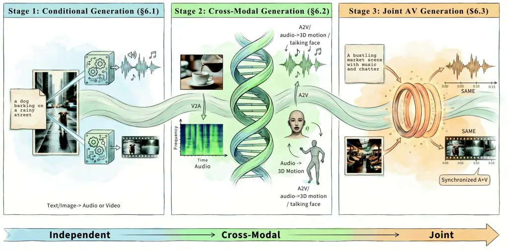

Figure 9: Organization of audio-visual generation tasks. We organize
this section into conditional generation, cross-modal generation, and
joint audio-visual generation, reflecting the transition from
independent modality synthesis to tightly synchronized audio-video
creation.

Audio-visual generation studies how to synthesize temporally aligned
sound and imagery from text, images, video, or audio. We organize this
section around three increasingly coupled regimes: conditional unimodal
generation, cross-modal translation, and joint audio-visual generation,
as summarized in fig. 9. The field has moved from composing strong
single-modality generators to explicitly coupled and, more recently,
unified architectures, with diffusion, flow matching, and multimodal
transformers as the dominant design choices.

### 6.1 Conditional Audio/Visual Generation

This part concerns generating or transforming one modality at a time
under external control (text, reference media, or instructions), without
yet requiring a full joint audio-video model. We treat conditional audio
and conditional visual generation in separate subsections, both as
building blocks for the cross-modal and joint settings that follow.

#### 6.1.1 Conditional Audio Generation

$`\bullet`$ Definition. Conditional audio generation aims to synthesize
or transform audio signals under external conditioning information, such
as text descriptions, reference audio, mixture recordings, or editing
instructions.

$`\bullet`$ Representative Tasks and Methods. We keep this
single-modality subsection concise and focus on three common
conditioning regimes:

Text-conditioned audio, music, and speech generation synthesizes sound
effects, ambient scenes, music, or speech from natural-language prompts.
Representative approaches include latent diffusion models such as
AudioLDM and Stable Audio Open (Liu et al., 2024c; Evans et al., 2025),
codec-token language models such as AudioLM (Borsos et al., 2023a), and
broader conditional frameworks such as AudioX (Tian et al., 2025b).
Across these systems, neural audio tokenizers and latent representations
remain central to fidelity, controllability, and efficiency.

Conditional audio transformation and separation modify or decompose an
existing recording, covering speech enhancement, source separation,
remixing, and restoration. TF-GridNet (Wang et al., 2023b) and Dual-Path
Mamba (Jiang et al., 2025b) improve temporal modeling for separation,
while Audio Prompt Tuning (Liu et al., 2024j) moves toward promptable
and open-set separation. In music, Band-Split RNN and Hybrid
Transformers (Luo and Yu, 2023; Rouard et al., 2023) show how
frequency-structured modeling supports instrument-level control.

Instruction-guided audio editing uses natural language or reference cues
to change selected attributes while preserving non-edited content.
Representative systems include InstructAudioEdit (Wang et al., 2023a),
SAO-Instruct (Ungersböck et al., 2025), Guiding Audio Editing with Audio
Language Model (Lan et al., 2025), SteerMusic (Niu et al., 2025),
Step-Audio-EditX (Yan et al., 2025a), and EmoCorrector (Liu et al.,
2025j). Related work on voice conversion, audio inpainting, and style
transfer (Popov et al., 2022; Moliner et al., 2023; Li et al., 2024f)
points toward controllable audio editors that behave more like
instruction-following generation systems.

#### 6.1.2 Conditional Visual Generation

$`\bullet`$ Definition. Conditional visual generation synthesizes or
transforms images and videos under external conditions, such as text
prompts, reference images, structured controls, or editing instructions.

$`\bullet`$ Representative Tasks and Methods. Depending on the
conditioning signal, this paradigm includes several related subtasks.

Text to Image/Video Generation. Text-to-image generation progressed from
DALL-E (Ramesh et al., 2022) and Stable Diffusion (Rombach et al., 2022)
to stronger native multimodal and industrial systems, such as GPT-4o
image generation (Hurst et al., 2024), Seedream 5.0 Lite (ByteDance Seed
Team, 2026b), HunyuanImage-3.0 (Cao et al., 2025a), Qwen-Image (Wu et
al., 2025a), and JoyAI-Image (Joy Future Academy, 2026). Text-to-video
generation likewise advanced from Make-A-Video (Singer et al., 2022) and
Imagen Video (Ho et al., 2022) to newer foundation and product models,
including Sora (OpenAI, 2024b), Veo (DeepMind, 2025), Step-Video-T2V (Ma
et al., 2025b), HunyuanVideo-1.5 (Kong et al., 2024a), Wan-2.1/2.2 (Wan
et al., 2025), LongCat-Video (Meituan LongCat Team, 2025),
Any2caption (Wu et al., 2025f), Hailuo 2.3 (MiniMax, 2025), Kling
3.0 (Kuaishou Technology, 2026), and Seedance 2.0 (ByteDance Seed Team,
2026a). Recent work also extends short-clip synthesis toward long and
online generation, including StreamingT2V (Henschel et al., 2024),
Stable Video Infinity (Li et al., 2025f), StreamDiT (Kodaira et al.,
2025), Self-Forcing (Huang et al., 2025d), and LoL (Cui et al., 2026).

Controllable Video Generation. Controllable generation increasingly
disentangles appearance, structure, motion, and temporal continuation.
ControlNet (Zhang et al., 2023d) and ControlVideo (Zhang et al., 2023f)
showed that pretrained diffusion models can absorb structured controls
without losing their generative prior. For image-to-video generation,
Motion-I2V (Shi et al., 2024), HunyuanVideo-I2V (Kong et al., 2024a),
and Step-Video-TI2V (Huang et al., 2025b) improve first-frame fidelity
and motion control, while product systems such as Kling 3.0 (Kuaishou
Technology, 2026), Veo (DeepMind, 2025), and Hailuo 2.3 (MiniMax, 2025)
further strengthen practical shot-level control. For video
interpolation, Generative Inbetweening (Wang et al., 2024f),
large-motion interpolation via I2V diffusion adaptation (Jin and
Watanabe, 2024), and ViBiDSampler (Yang et al., 2024d) adapt generative
backbones for keyframe-conditioned temporal completion.

Image/Video Editing. Image and video editing modify semantic content
while preserving scene identity and temporal coherence.
InstructPix2Pix (Brooks et al., 2023) established instruction-based
image editing, and Video-P2P (Liu et al., 2024f) extended this idea to
video. Recent systems, including Qwen-Image-Edit (Wu et al., 2025a),
JoyAI-Image-Edit (Joy Future Academy, 2026), DreamVE (Xia et al.,
2025a), InsViE-1M (Wu et al., 2025j), Nano-Banana (Google DeepMind,
2026b), and Wan-2.7 (Wan et al., 2025) further combine understanding and
editing in shared training pipelines.

### 6.2 Audio-Visual Cross-Modal Generation

Cross-modal generation uses one realized sensory stream to drive
another: adding sound to video, synthesizing video or motion from audio,
animating a still image with audio, or lifting audio into explicit 3D
structure. The subsections below follow that scope from video-to-audio
through audio-to-video, audio-synchronized image animation, and
audio-driven 3D visual generation.

#### 6.2.1 Video-to-Audio Generation

$`\bullet`$ Definition. Video-to-audio (V2A) generation adds a plausible
soundtrack to silent video, covering Foley, ambience, speech, or music
depending on the scene (Luo et al., 2023). The task is difficult because
models must jointly satisfy semantic relevance, event-level
synchronization, and acoustic plausibility under physical constraints.
Compared with early Foley synthesis, current V2A models are increasingly
expected to handle open-domain events, user control, and longer clips
rather than only short impact sounds.

$`\bullet`$ Methods. Recent V2A methods are best grouped by how they
enforce alignment and how much explicit reasoning they place before
waveform generation.

Alignment-first diffusion and flow models. Diff-Foley (Luo et al., 2023)
established the modern recipe of contrastive AV pretraining plus latent
diffusion conditioned on video features. FoleyCrafter (Zhang et al.,
2024f) adds explicit onset conditioning for cleaner event timing, while
FRIEREN and Tri-Ergon (Wang et al., 2024l; Li et al., 2024a) replace
diffusion-style denoising with rectified or flow-matching objectives to
improve efficiency without giving up fine-grained correspondence.

Jointly trained and controllable V2A systems. The recent wave shifts the
problem from narrow Foley generation to more controllable multimodal
synthesis. MMAudio (Cheng et al., 2025a) shows the value of large-scale
multimodal joint training, Smooth-Foley (Zhang et al., 2024e) adds
text-guided style control, Kling-Foley (Wang et al., 2025e) pushes
quality with a stronger multimodal diffusion transformer, and
HunyuanVideo-Foley (Shan et al., 2025) scales the recipe to stronger
video backbones and longer temporal windows.

Reasoning-guided, open-world, and long-form generation. Another recent
trend is to insert higher-level reasoning before audio decoding.
ThinkSound (Liu et al., 2025d) uses multimodal chain-of-thought to infer
what should sound when, PrismAudio (Liu et al., 2025c) uses multimodal
LLMs to parse richer scene semantics, and DreamFoley (Fu et al., 2025c)
pushes toward higher-fidelity generation by leveraging scalable
vision-language models. The frontier is now moving beyond short clip
synthesis: Omni2Sound (Dai et al., 2026) unifies video-text-to-audio
generation under a single any-to-audio framework, while ALIVE and Echoes
Over Time (Guo et al., 2026; Simon et al., 2026) target joint AV
generation and length generalization over much longer horizons.
AV-Link (Haji-Ali et al., 2025) shows that temporally aligned diffusion
features can support unified V2A/A2V generation.

$`\bullet`$ Benchmarks. V2A benchmarks remain fragmented by sound type
and synchronization granularity. VGGSound (Chen et al., 2020b) and
AudioSet (Gemmeke et al., 2017) remain the default open-domain
resources; Greatest Hits (Owens et al., 2016a) stresses impact timing;
AVSync15 (Zhang et al., 2024b) explicitly targets fine-grained
synchronization; and newer resources such as FoleyBench, AudioCanvas,
and VGGSound-Omni (Dixit et al., 2025; Liu et al., 2025c; Dai et al., 2026) move evaluation toward harder, more diverse, and longer-horizon
settings. Common metrics now mix perceptual audio quality, semantic
alignment, and synchronization quality rather than relying on a single
score.

|                                     |                   |                         |                              |
| ----------------------------------- | ----------------- | ----------------------- | ---------------------------- |
| Benchmark                           | Signal            | Focus                   | Metrics                      |
| VGGSound (Chen et al., 2020b)       | Open-domain clips | Training/testing        | FD, KL, IS, CLAP             |
| Greatest Hits (Owens et al., 2016a) | Contact clips     | Impact/onset timing     | Onset, sync                  |
| AVSync15 (Zhang et al., 2024b)      | Sync stress test  | Temporal alignment      | AVSync, VGGSync              |
| FoleyBench (Dixit et al., 2025)     | Foley clips       | Foley fidelity          | Human pref., sync, quality   |
| AudioCanvas (Liu et al., 2025c)     | Open-world scenes | Multi-event soundscapes | Semantic/spatial consistency |
| VGGSound-Omni (Dai et al., 2026)    | V/T/A conditions  | Omni-condition V2A      | Quality, align., instruction |

Table 11: Representative benchmarks for Video-to-Audio generation.

|                                        |                           |                                    |                                    |                |
| -------------------------------------- | ------------------------- | ---------------------------------- | ---------------------------------- | -------------- |
| Method                                 | Family                    | FD$`{}_{\text{P}}`$ $`\downarrow`$ | KL$`{}_{\text{P}}`$ $`\downarrow`$ | IS$`\uparrow`$ |
| Diff-Foley (Luo et al., 2023)          | Latent Diffusion          | 6.34                               | 6.15                               | 8.52           |
| FoleyCrafter (Zhang et al., 2024f)     | Diffusion + Onset Control | 4.12                               | 4.01                               | 14.59          |
| FRIEREN (Wang et al., 2024l)           | Rectified Flow            | 4.18                               | 4.16                               | 12.80          |
| MMAudio (Cheng et al., 2025a)          | Joint Multimodal Training | 2.89                               | 2.82                               | 15.70          |
| ThinkSound (Liu et al., 2025d)         | MLLM-guided V2A           | 2.70                               | 2.38                               | 16.48          |
| HunyuanVideo-Foley (Shan et al., 2025) | Scaled Controllable V2A   | 2.51                               | 2.17                               | 16.87          |

Table 12: Performance comparison of representative Video-to-Audio
generation methods on the VGGSound-Test leaderboard. Metrics follow the
official HunyuanVideo-Foley (Shan et al., 2025) evaluation protocol with
PANNs-based FD/KL and Inception Score (IS). Best result in bold.

#### 6.2.2 Audio-to-Video Generation

$`\bullet`$ Definition. Audio-to-video (A2V) generation synthesizes
video conditioned on sound, speech, or music. Compared with V2A, the
ambiguity is larger: the same audio can support many visually plausible
motions, so models must balance semantic faithfulness, rhythmic
alignment, and controllability.

$`\bullet`$ Representative Tasks and Methods. A2V methods fall into
three broad families.

Backbone adaptation. These methods retrofit pretrained video generators
with audio-conditioning modules. MusicInfuser (Hong et al., 2025)
injects music features through cross-attention and low-rank adaptation,
while Diverse and Aligned A2V (Yariv et al., 2024) maps audio into the
token space of pretrained text-to-video models. AV-Link (Haji-Ali et
al., 2025) further shows that a single temporally aligned framework can
support both A2V and V2A generation.

Motion-mediated pipelines. Rather than generating pixels directly, these
systems first predict intermediate motion such as keypoints or SMPL
trajectories and only then render video. ChoreoMuse (Wang et al., 2025o)
uses this decomposition for music-to-dance generation, and earlier
works (Zhu et al., 2021) follow a similar two-stage design. The
advantage is stronger beat alignment; the cost is higher pipeline
complexity and weaker end-to-end flexibility.

Identity-conditioned generation. Reference-image-based models reduce
ambiguity by anchoring appearance. DiffTalk (Shen et al., 2023a)
produces speech-driven talking heads with landmark-guided diffusion, and
AudCast (Guan et al., 2025a) extends the setting to full-body avatars
with cascaded diffusion transformers for facial motion, gestures, and
body dynamics.

$`\bullet`$ Benchmarks. Benchmarks are task-specific. AIST++ (Li et al., 2021) and AIOZ-GDance (Le et al., 2023) dominate music-to-dance
evaluation, VoxCeleb2 (Chung et al., 2018) and HDTF (Zhang et al., 2021)
are standard for speech-driven avatars, and VGGSound (Chen et al.,
2020b) remains the broadest open-domain benchmark for general A2V
generation. Many recent systems additionally report zero-shot or curated
in-the-wild evaluations (Guan et al., 2025a).

|                                |                |               |                    |                                       |
| ------------------------------ | -------------- | ------------- | ------------------ | ------------------------------------- |
| Dataset                        | Scale          | Input Audio   | Visual Target      | Primary Use                           |
| AIST++ (Li et al., 2021)       | 1.4K clips     | Music         | Human motion/video | Music-to-dance generation             |
| AIOZ-GDance (Le et al., 2023)  | 19.8K clips    | Music         | Group dance        | Choreography and formation control    |
| VoxCeleb2 (Chung et al., 2018) | 1M+ utterances | Speech        | Talking face       | Identity-generalized speech animation |
| HDTF (Zhang et al., 2021)      | 362 videos     | Speech        | Talking face       | High-resolution talking-head quality  |
| VGGSound (Chen et al., 2020b)  | 200K clips     | General sound | Open-domain video  | Broad audio-conditioned video         |

Table 13: Representative benchmarks for Audio-to-Video generation.

#### 6.2.3 Audio-Synchronized Image Animation

$`\bullet`$ Definition. Audio-synchronized image animation, or
audio-driven image-to-video (AI2V) generation, synthesizes video from a
reference image and driving audio while preserving identity and temporal
coherence. Beyond the classical talking-head setting (Prajwal et al.,
2020; Cui et al., 2025a), recent models also support general
audio+image+text generation (Zhang et al., 2024b; Gao et al., 2025b),
where text serves as auxiliary control over motion, emotion, or scene
behavior.

$`\bullet`$ Representative Tasks and Methods. Recent audio-synchronized
image animation methods can be divided into the following aspects:

Human-centric AI2V. Most existing work remains human-centric. In
talking-head and portrait animation, Wav2Lip (Prajwal et al., 2020)
emphasizes lip accuracy; DiffTalk (Shen et al., 2023a) and
SadTalker (Zhang et al., 2023e) add head pose and expression; EMO (Tian
et al., 2024b), VASA-1 (Xu et al., 2024), Hallo2 (Cui et al., 2024),
Hallo3 (Cui et al., 2025a), FantasyTalking (Wang et al., 2025g), and
StableAvatar (Tu et al., 2025) further improve expressiveness, duration,
and fidelity. Beyond talking heads, EchoMimicV2/V3 (Meng et al., 2025;
Meng et al., 2026) extends to semi-body animation, EMO2 (Tian et al.,
2025a) adds gesture-aware control, and OmniAvatar (Gan et al., 2025),
OmniHuman-1 (Lin et al., 2025a), HuMo (Chen et al., 2025e),
AudCast (Guan et al., 2025a), and Playmate2 (Ma et al., 2025d) expand
toward full-body, multi-character, and richer human motion. Recent
industrial systems such as HunyuanVideo-Avatar (Chen et al., 2025j),
Kling-Avatar (Ding et al., 2025; Chen et al., 2025c), and
JoyAvatar (Wang et al., 2026c) further combine audio, image, and
optional text to improve controllability and long-form avatar
generation.

General AI2V. General AI2V is still much smaller than the human-centric
branch, but it is not empty. ASVA (Zhang et al., 2024b) explicitly
formulates static-image animation from audio across multiple object and
scene classes, and KeyVID (Wang et al., 2025m) improves this setting
with keyframe-aware generation for highly dynamic motions. Scaling Up
ASVA (Zhang et al., 2025d) extends the task toward open-domain
audio-synchronized visual animation, while TIA2V (Zhao et al., 2025c)
and Syncphony (Song et al., 2025) achieve more controllable general
video generation. In industry, Wan-S2V (Gao et al., 2025b) sits near the
boundary between human-centric and general AI2V, while broader
multimodal foundation models such as SkyReels-V4 (Chen et al., 2026b),
Seedance 2.0 (ByteDance Seed Team, 2026a), and Veo 3.1 (DeepMind, 2025)
already support image-conditioned video generation with audio or sound.

$`\bullet`$ Benchmarks. As summarized in table 14,
VoxCeleb/VoxCeleb2 (Nagrani et al., 2017; Chung et al., 2018),
LRS2/LRS3 (Son Chung et al., 2017; Afouras et al., 2018), HDTF (Zhang et
al., 2021), and CelebV-HQ (Zhu et al., 2022) remain standard for
identity preservation, speech synchronization, and portrait quality.
Recent resources broaden the scope: TalkVid-Bench (Chen et al., 2025f)
target more diverse talking-head training and evaluation,
TalkVerse (Wang et al., 2025t) emphasizes minute-long generation,
TalkCuts (Chen et al., 2025b) targets multi-shot speech videos, MIT (Zhu
et al., 2025c) benchmarks multi-human interaction, and THEval (Quignon
et al., 2025) and EvalTalker (Zhou et al., 2025e) provide finer-grained
perceptual evaluation.

|                                    |                         |               |                               |
| ---------------------------------- | ----------------------- | ------------- | ----------------------------- |
| Dataset / Benchmark                | Scale                   | Target        | Primary Use                   |
| VoxCeleb2 (Chung et al., 2018)     | 1.13M utter., 2.44k h   | Face          | Identity generalization       |
| LRS2 (Son Chung et al., 2017)      | 144k utter.             | Face          | Lip-sync alignment            |
| LRS3 (Afouras et al., 2018)        | 400h+                   | Face          | AV speech alignment           |
| HDTF (Zhang et al., 2021)          | 15.8h, 300+ subj.       | Portrait      | Talking-head synthesis        |
| CelebV-HQ (Zhu et al., 2022)       | 35.7k clips             | Portrait      | Expressive portrait animation |
| TalkVid-Bench (Chen et al., 2025f) | 1,244h + 500 eval clips | Talking head  | Fairness-aware evaluation     |
| TalkVerse (Wang et al., 2025t)     | 2.3M clips, 6.3k h      | Single-person | Minute-long generation        |
| TalkCuts (Chen et al., 2025b)      | 164k clips, 500h+       | Multi-human   | Multi-shot speech videos      |
| MIT (Zhu et al., 2025c)            | 12h, 2–4 speakers       | Multi-human   | Multi-speaker interaction     |
| THEval (Quignon et al., 2025)      | 85k generated videos    | Talking head  | Fine-grained evaluation       |
| EvalTalker (Zhou et al., 2025e)    | 5,492 samples           | Multi-human   | Perceptual quality assessment |

Table 14: Representative datasets and evaluation benchmarks for
audio-driven image animation.

#### 6.2.4 Audio-Driven 3D Visual Generation

$`\bullet`$ Definition. Audio-driven 3D visual generation maps sound
into dynamic 3D facial, head, or body representations
$`\mathcal{V}_{3D}(t)`$. Relative to 2D animation, the 3D formulation
offers viewpoint consistency, explicit geometry, and better
compatibility with downstream rendering, but it also makes subtle motion
realism harder to learn.

$`\bullet`$ Representative Tasks and Methods. Audio-driven 3D synthesis
spans five recurring directions.

3D Face Animation & Talking Heads deform explicit mesh topologies such
as FLAME or SMPL. Early regression systems (VOCA (Cudeiro et al., 2019),
MeshTalk (Richard et al., 2021)) often over-smoothed motion, whereas
FaceFormer (Fan et al., 2022), CodeTalker (Xing et al., 2023), and
StreamingTalker (Yang et al., 2025c) improve co-articulation and
streaming behavior through stronger sequence modeling.

Neural Rendering & Dynamic Avatars focus on photorealism. AD-NeRF (Guo
et al., 2021) pioneered audio-conditioned NeRFs, GeneFace (Ye et al., 2023) improved cross-identity transfer, and recent 3D Gaussian Splatting
systems such as GaussianTalker (Yu et al., 2024a) and SynGauss (Zhou et
al., 2025f) make interactive rendering increasingly practical.

Emotion & Expression Enhancement explicitly combats “dead-face”
artifacts. EVP (Ji et al., 2021), DreamTalk (Ma et al., 2023), and
EmoGene (Wang and Fu, 2024) disentangle content from style or emotion so
that non-verbal dynamics are not washed out by phoneme tracking alone.

Co-speech Gestures & Full-Body Motion map speech to skeletal kinematics.
TalkSHOW (Yi et al., 2023) separates facial and bodily channels, while
EMAGE (Liu et al., 2024b) improves gesture diversity and beat
consistency with masked gesture transformers and compositional VQ-VAEs.

Holistic Human Synthesis targets full 3D humans. Stereo-Talker (Deng et
al., 2024b) and Real3D-Portrait (Ye et al., 2024c) move beyond the
head-only regime by coupling portrait reconstruction with coordinated
body and background dynamics.

$`\bullet`$ Benchmarks. Benchmarks depend on the output representation:
VoxCeleb2 (Chung et al., 2018) and HDTF (Zhang et al., 2021) support
portrait synthesis, MEAD (Wang et al., 2020) adds controlled emotion,
VOCASET (Cudeiro et al., 2019) and BIWI serve mesh-level evaluation, and
BEAT2 (Liu et al., 2024b) targets holistic gesture generation. Metrics
span geometric accuracy (LVE, vertex error), lip-sync quality
(LSE-C/LSE-D), perceptual realism (FID), and body-motion alignment such
as Beat Constancy or FGD (Liu et al., 2024b).

|                                |                 |            |                                                 |
| ------------------------------ | --------------- | ---------- | ----------------------------------------------- |
| Dataset                        | Modality        | Hours      | Focus                                           |
| VoxCeleb2 (Chung et al., 2018) | Face (2D video) | 2,442      | In-the-wild pretraining and identity robustness |
| MEAD (Wang et al., 2020)       | Face (2D video) | $`\sim`$40 | Multi-view emotion control                      |
| HDTF (Zhang et al., 2021)      | Face (2D video) | 15.8       | High-resolution talking-head rendering          |
| VOCASET (Cudeiro et al., 2019) | Face (3D mesh)  | 0.48       | Registered 4D scans and mesh-level evaluation   |
| BEAT2 (Liu et al., 2024b)      | Full body (3D)  | 60         | Holistic gesture/body generation with semantics |

Table 15: Representative datasets for audio-driven 3D visual generation.

### 6.3 Joint Audio-Visual Generation

Joint generation optimizes for coupled audio and video (or related
edits) in a single objective or training recipe, rather than stapling a
unimodal output to another model as an afterthought. The following
subsections cover text- and image-conditioned joint synthesis as well as
joint audio-video editing workflows.

#### 6.3.1 Text-to-Audio-Video Generation

$`\bullet`$ Definition. Text-to-audio-video (T2AV) generation
synthesizes both video and synchronized audio from a textual prompt (Liu
et al., 2025i). A strong model must satisfy three conditions at once:
within-modality quality, faithfulness to the prompt, and cross-modal
synchronization.

$`\bullet`$ Methods. MM-Diffusion (Ruan et al., 2023) first showed joint
audio-video diffusion, but only in narrow domains such as landscapes and
dance (Lee et al., 2022; Li et al., 2021). The text-conditional era
begins with JavisDiT (Liu et al., 2025i), after which several design
lines emerge.

Architecture Evolution. Early attempts such as JavisDiT (Liu et al.,
2025i), UniVerse-1 (Wang et al., 2025d), BridgeDiT (Guan et al., 2025b),
and Ovi (Low et al., 2025) keep audio and video branches partially
separate while exchanging information through specific synchronization
modules (e.g., cross-attention). Recent approaches including JoVA (Huang
et al., 2025c) and JavisDiT++ (Liu et al., 2026) move toward more
unified modeling by shared or tightly coupled attention blocks to
improve cross-modal coherence.

Audio-Visual Synchronization. Commonly-used strategies includes
text-derived temporal priors (Liu et al., 2025i), frame-level
cross-attention (Zhao et al., 2025b; Wang et al., 2025d; Hu et al.,
2025; Low et al., 2025), or aligned RoPE position IDs (Huang et al.,
2025c; Liu et al., 2026) keep both modalities in step. On the other
hand, data scaling (Yu et al., 2026) also plays a vital role in
achieving high-quality synchronization.

Multi-Task Unification. Beyond the standalone text-to-audio-video (T2AV)
generation, recent works (e.g., Harmony (Hu et al., 2025),
UniAVGen (Zhang et al., 2025b), and Apollo (Wang et al., 2026a)) widely
explore multi-task integration (e.g., A2V, V2A, TI2AV, etc.) to achieve
better modality learning and cross-task synergy, and OmniForcing (Su et
al., 2026) further extends to real-time joint audio-video generation.

Post-Training Application. Preference optimization via DPO (Liu et al.,
2025f) or GRPO (Liu et al., 2025e) is also becoming standard for
improving prompt following and subjective quality (Chen et al., 2025g).
For instance, JavisDiT++ (Liu et al., 2026) derives the AV-DPO strategy
to investigate DPO adaptation to joint audio-video generation.

Agentic Workflow. In contrast to end-to-end T2AV models, agentic
approaches decompose audio-visual generation into cascaded stages,
typically text-to-video plus video-to-audio. MV-Crafter (Chen et al.,
2025a) is an early workflow-style example, while ReelWave (Wang et al.,
2025v), LVAS-Agent (Zhang et al., 2025i), and AutoMV (Tang et al.,
2025a) more explicitly formulate soundtrack or music-video generation as
multi-agent pipelines. Related systems such as AesopAgent (Wang et al.,
2024a), MM-StoryAgent (Xu et al., 2025f), MovieAgent (Wu et al., 2025h),
AniME (Zhang et al., 2025e), and MAViS (Wang et al., 2026b) further
support the value of explicit planning for long-form generation.

Nowadays, commercial systems (including Sora2, Veo3.1 (DeepMind, 2025),
Kling3.0, Wan2.6, and Seedance 2.0 Pro) are still ahead because they
combine larger audio-video corpora, stronger base generators, and
heavier post-training. On the other hand, open-source models are
catching up with proprietary systems in performance, where
LTX-2 (HaCohen et al., 2026) and MOVA (Yu et al., 2026) demonstrate
promising potential and scalability.

|                                     |         |                |                    |                            |
| ----------------------------------- | ------- | -------------- | ------------------ | -------------------------- |
| Name                                | Type    | Scale          | Audio              | Primary Focus              |
| Greatest Hits (Owens et al., 2016a) | Dataset | 977 videos     | Sound              | Impact/onset sync          |
| Landscape (Lee et al., 2022)        | Dataset | 928 videos     | Sound              | Ambient scene realism      |
| VGGSound (Chen et al., 2020b)       | Dataset | 200K clips     | Sound              | Open-domain coverage       |
| AVSync15 (Zhang et al., 2024b)      | Suite   | 150 clips      | Mixed              | Fine-grained AV sync       |
| JavisBench (Liu et al., 2025i)      | Suite   | 10,140 prompts | Sound              | Quality, semantics, sync   |
| Verse-Bench (Wang et al., 2025d)    | Suite   | 600 prompts    | Sound Speech       | Speech-inclusive T2AV      |
| Harmony-Bench (Hu et al., 2025)     | Suite   | 150 prompts    | Sound Speech       | Prompt following; sync     |
| VABench (Hua et al., 2025)          | Suite   | 778 prompts    | Sound Music Speech | Broad audio coverage       |
| T2AV-Compass (Cao et al., 2025b)    | Suite   | 500 prompts    | Sound Music Speech | Unified multimodal scoring |
| PhyAVBench (Xie et al., 2025b)      | Suite   | 1,000 prompts  | Sound Music Speech | Physical/causal grounding  |

Table 16: Representative datasets and curated evaluation suites for
text-to-audio-video generation.

$`\bullet`$ Benchmarks. As shown in table 16, early benchmarks (Greatest
Hits (Owens et al., 2016a), Landscape (Lee et al., 2022), VGGSound (Chen
et al., 2020b), AVSync15 (Zhang et al., 2024b)) cover limited scenarios
without standardized metrics. Curated suites such as JavisBench (Liu et
al., 2025i), Verse-Bench (Wang et al., 2025d), Harmony-Bench (Hu et al.,
2025), VABench (Hua et al., 2025), and T2AV-Compass (Cao et al., 2025b)
provide broader prompt coverage and more systematic scoring, while
PhyAVBench (Xie et al., 2025b) explicitly measures physical
plausibility. The evaluation trend is moving from modality-specific
metrics toward composite scores that jointly assess prompt following,
perceptual quality, and temporal coherence.

|                                       |             |                |                |                |                |                       |                 |                 |                  |                |
| ------------------------------------- | ----------- | -------------- | -------------- | -------------- | -------------- | --------------------- | --------------- | --------------- | ---------------- | -------------- |
|                                       |             | Video Quality  |                | Audio Quality  |                | Cross-modal Alignment |                 |                 |                  |                |
| Model                                 | Open-Source | VT$`\uparrow`$ | VA$`\uparrow`$ | PQ$`\uparrow`$ | CU$`\uparrow`$ | A-V$`\uparrow`$       | T-A$`\uparrow`$ | T-V$`\uparrow`$ | DS$`\downarrow`$ | LS$`\uparrow`$ |
| Veo-3.1 (Google, 2025)                | ✗           | 13.39          | 5.425          | 7.015          | 6.621          | 0.2856                | 0.2335          | 0.2438          | 0.6776           | 1.509          |
| Sora-2 (OpenAI, 2025b)                | ✗           | 7.568          | 4.112          | 5.827          | 5.340          | 0.2419                | 0.2484          | 0.2432          | 0.8100           | 1.331          |
| Kling-2.6 (Kuaishou Technology, 2025) | ✗           | 11.41          | 5.417          | 6.882          | 6.449          | 0.2495                | 0.2495          | 0.2449          | 0.7852           | 1.502          |
| Wan-2.6 (Alibaba Cloud, 2025)         | ✗           | 11.87          | 4.605          | 6.658          | 6.222          | 0.2149                | 0.2572          | 0.2451          | 0.8818           | 1.081          |
| Seedance-1.5 (Chen et al., 2025g)     | ✗           | 12.74          | 5.007          | 7.555          | 7.250          | 0.2875                | 0.2320          | 0.2370          | 0.8650           | 1.560          |
| PixVerse-V5.5 (PixVerse, 2025)        | ✗           | 11.54          | 4.558          | 6.108          | 5.855          | 0.1816                | 0.2305          | 0.2431          | 0.6627           | 1.306          |
| Ovi-1.1 (Low et al., 2025)            | ✓           | 9.336          | 4.368          | 6.569          | 6.492          | 0.1620                | 0.1756          | 0.2391          | 0.9624           | 1.191          |
| JavisDiT (Liu et al., 2025i)          | ✓           | 6.850          | 3.575          | 4.299          | 5.204          | 0.1284                | 0.1257          | 0.2320          | 1.3220           | -              |

Table 17: Performance comparison of T2AV models on T2AV-Compass (Cao et
al., 2025b). Best results in bold.

#### 6.3.2 Image-to-Audio-Video Generation

$`\bullet`$ Definition. Image-to-audio-video (I2AV) generation turns a
single image into a sounding video clip. Unlike T2AV, appearance is
anchored by the reference image, while motion and sound must be inferred
jointly under a much tighter spatial constraint.

$`\bullet`$ Methods. Early I2AV solutions are mostly cascaded.
Independent generation combines an image-to-video model such as Stable
Video Diffusion (Blattmann et al., 2023a) with an image-to-audio model
such as IM2Wav (Sheffer and Adi, 2023), but provides weak audio-video
coupling. Video-first pipelines animate the image and then add sound
with video-to-audio models such as Diff-Foley (Luo et al., 2023) and
FoleyCrafter (Zhang et al., 2024f), while caption-mediated variants rely
on image-derived prompts for separate video and audio generators (Hong
et al., 2022; Kong et al., 2024a; Liu et al., 2024c).

A dedicated line emerged with Animate and Sound an Image (Wang et al.,
2025l), which explicitly formulates image-to-sounding-video generation
with joint transformer conditioning. Recent unified AV models further
absorb image-conditioned generation into a single framework, including
UniVerse-1 (Wang et al., 2025d), Ovi (Low et al., 2025), Klear (Wang et
al., 2026a), ALIVE (Guo et al., 2026), and SkyReels-V4 (Chen et al.,
2026b). The same trend appears in production systems such as Kling Video
2.6/3.0/3.0 Omni (Kuaishou Technology, 2026), Wan2.6 (Wan et al., 2025),
Seedance 1.5 pro/2.0 (Chen et al., 2025g; ByteDance Seed Team, 2026a),
Vidu Q3 (Vidu, 2026), Sora 2 (OpenAI, 2024b), Veo 3.1 (DeepMind, 2025),
and Runway Gen-4.5 (Runway, 2025), which all expose image-conditioned or
reference-guided audio-video generation in an integrated workflow.

$`\bullet`$ Benchmarks. Existing benchmarks for image-conditional I2AV
generation remain scarce. AVSync15 (Zhang et al., 2024b) is the most
used benchmark for synchronized sounding-video generation, and
Verse-Bench (Wang et al., 2025d) further supports image-conditioned
joint audio-video evaluation. More standardized benchmarks are still
needed for this setting.

#### 6.3.3 Joint Audio-Video Editing

$`\bullet`$ Definition. Joint audio-video editing edits video and sound
_together_ so that the result remains synchronized and semantically
consistent across modalities. Given $`(V,A)`$ and an edit condition
$`c`$, the model produces $`(V^{\prime},A^{\prime})`$ that applies the
intended change to both streams while preserving alignment and
minimizing changes to unrelated content.

$`\bullet`$ Representative Tasks and Methods. Early work, such as
one-shot adaptation (Liang et al., 2024) and AvED (Lin et al., 2026),
establishes instruction-based and zero-shot joint editing, mainly
targeting prompt-consistent changes without strong paired supervision.
Meanwhile, more recent methods move to finer granularity.
Object-AVEdit (Fu et al., 2025d) performs object-level addition,
replacement, and removal. VAInpaint (Wu et al., 2025d) addresses
zero-shot joint inpainting and removal with visual masks and
LLM-assisted audio querying. SAVE (Xu et al., 2025d) formulates paired
source-to-target audiovisual removal, while AVI-Edit (Zheng et al., 2025) further supports instance-level masked editing with refined
spatial control. For specialized settings, Coherent Audio-Visual
Editing (Ishii et al., 2025) edits audio conditionally after video
edits, and JUST-DUB-IT (Chen et al., 2026a) adapts joint AV diffusion
for dubbing-style speech and facial-motion editing.

A broader recent trend is to absorb editing into unified joint AV
backbones rather than treating it as a standalone task. UniAVGen (Zhang
et al., 2025b) and SkyReels-V4 (Chen et al., 2026b) suggest this
direction by supporting continuation, inpainting, and editing-like
workflows within a shared audio-video generation framework.

$`\bullet`$ Benchmarks. Dedicated joint AV editing benchmarks are still
limited, but they have evolved from small prompt-based sets to
large-scale mask-aware and paired-data benchmarks. As organized in
table 18, OAVE (Liang et al., 2024) is an early benchmark for one-shot
joint editing, and AvED-Bench (Lin et al., 2026) evaluates full-video
zero-shot editing. More recently, AVISet (Zheng et al., 2025) and
SAVEBench (Xu et al., 2025d) provide instance masks or paired
source-target supervision, enabling evaluation of edit faithfulness,
preservation, and synchronization under localized edits.

|                               |            |                        |                                    |
| ----------------------------- | ---------- | ---------------------- | ---------------------------------- |
| Dataset                       | Scale      | Edit Scope             | Key Feature                        |
| OAVE (Liang et al., 2024)     | 44 events  | One-shot event editing | Early dedicated benchmark          |
| AvED-Bench (Lin et al., 2026) | 110 videos | Full-video editing     | Zero-shot prompt-based evaluation  |
| AVISet (Zheng et al., 2025)   | 73k clips  | Instance-level editing | Masks and paired edit instructions |
| SAVEBench (Xu et al., 2025d)  | 17k pairs  | Object-level removal   | Paired source-target supervision   |

Table 18: Representative benchmarks for joint audio-video editing.

## 7 Audio-Visual Interaction

Audio-visual interaction concerns systems that do not merely perceive
multimodal content, but must respond to it in real time. We distinguish
two settings: _conversational interaction_, where the response is
language or speech, and _embodied interaction_, where the response is an
action in the physical world. Both require tightly coupled perception,
memory, reasoning, and generation under latency constraints, making
interaction a stricter test of AV intelligence than static understanding
alone.

### 7.1 Interactive Audio-Visual Conversation

Conversational AV systems aim for natural multi-turn interaction over
speech, images, video, and text. We organize this subsection around
three stages of conversational capability: speech-first interaction,
unified visual understanding and generation, and omni-modal conversation
that handles arbitrary input/output combinations, as summarized
in fig. 10. The persistent constraints are latency, context retention,
and the preservation of non-verbal cues such as prosody, emotion, and
temporal grounding.

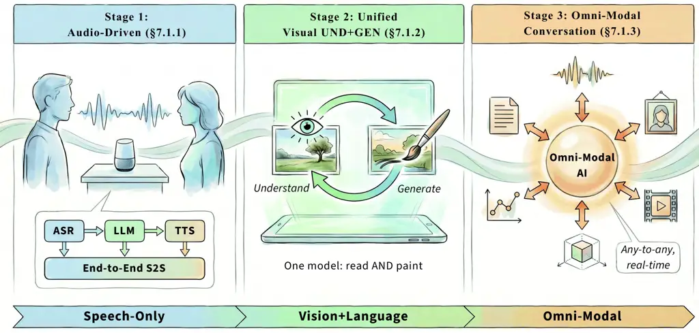

Figure 10: Organization of interactive audio-visual conversation. We
organize this subsection into audio-driven speech interaction, unified
visual understanding and generation, and omni-modal conversation for
real-time any-to-any multimodal exchange.

#### 7.1.1 Audio-Driven Conversation

$`\bullet`$ Definition. Audio-driven conversation refers to dialogue
systems that take speech, environmental sound, or music as
conversational input and respond in text or speech. Unlike text-only
chat, these systems must preserve acoustic content, linguistic
semantics, and paralinguistic cues such as prosody, emotion, and speaker
identity. Recent AudioLLMs (Ji et al., 2024) make this formulation
practical for assistants, agents, and streaming multimodal interaction.

$`\bullet`$ Methods. Current systems under this category can be
organized by how they pass acoustic information through the dialogue
loop:

Cascaded ASR–LLM–TTS pipelines explicitly transcribe speech, reason in
text, and synthesize speech again, as in AudioGPT (Huang et al., 2024c).
Cascades are modular and easy to debug, but they accumulate latency and
lose prosodic information at the text bottleneck.

Continuous-feature audio-to-text models feed speech or audio
representations into an LLM and usually return text. They use pretrained
encoders such as Wav2Vec (Schneider et al., 2019), HuBERT (Hsu et al.,
2021), Whisper (Radford et al., 2023), or WavLM (Chen et al., 2022c),
with representative systems including Qwen-Audio/Qwen2-Audio (Chu et
al., 2023; Chu et al., 2024), SpeechVerse (Das et al., 2024), and
E-Chat (Xue et al., 2024).

Discrete-token and end-to-end speech-to-speech models represent speech
with semantic or codec tokens and generate spoken responses directly or
through a vocoder (Du et al., 2024a). SpeechGPT (Zhang et al., 2023b),
Mini-Omni (Xie and Wu, 2024b), LLaMA-Omni (Fang et al., 2024),
Moshi (Défossez et al., 2024), IntrinsicVoice (Zhang et al., 2024d),
OmniFlatten (Zhang et al., 2025g), Freeze-Omni (Wang et al., 2024h), and
PSLM (Mitsui et al., 2024) are representative of this direction.

Acoustic-oriented and cross-domain audio models try to preserve
non-linguistic information such as emotion, timbre, speaker identity,
and environmental sound. Some models use unified encoders for speech,
sound, and music, such as Audio Flamingo (Kong et al., 2024b), Audio
Flamingo 2 (Ghosh et al., 2025), and Qwen-Audio (Chu et al., 2023);
others use multiple domain-specific encoders or projectors, such as
SALMONN (Tang et al., 2023) and GAMA (Ghosh et al., 2024). LauraGPT (Du
et al., 2023) and SpeechGPT-Gen (Zhang et al., 2024a) further show how
audio regeneration can preserve richer acoustic detail.

$`\bullet`$ Benchmarks. Evaluation is still fragmented across sound,
music, and speech. Domain-specific suites include Clotho-AQA (Lipping et
al., 2022) and AudioCaps (Kim et al., 2019) for environmental sounds,
MuChoMusic (Weck et al., 2024), MusicBench (Melechovsky et al., 2024),
and CMI-Bench (Ma et al., 2025e) for music, and LibriSQA (Zhao et al., 2024) plus Dynamic-SUPERB (Huang et al., 2024b) for speech. More recent
cross-domain suites such as AudioBench (Wang et al., 2025b),
AIR-Bench (Yang et al., 2024b), MMAU (Sakshi et al., 2024), and MMAR (Ma
et al., 2025g) better reflect the breadth expected from conversational
audio models.

|                                       |       |       |        |              |                                     |
| ------------------------------------- | ----- | ----- | ------ | ------------ | ----------------------------------- |
| Dataset                               | Sound | Music | Speech | Cross-domain | Primary Focus                       |
| Clotho-AQA (Lipping et al., 2022)     | ✓     | ✗     | ✗      | ✗            | Audio question answering            |
| AudioCaps (Kim et al., 2019)          | ✓     | ✗     | ✗      | ✗            | Grounded audio captioning           |
| MuChoMusic (Weck et al., 2024)        | ✗     | ✓     | ✗      | ✗            | Music understanding                 |
| MusicBench (Melechovsky et al., 2024) | ✗     | ✓     | ✗      | ✗            | Music instruction following         |
| CMI-Bench (Ma et al., 2025e)          | ✗     | ✓     | ✗      | ✗            | Comprehensive music understanding   |
| LibriSQA (Zhao et al., 2024)          | ✗     | ✗     | ✓      | ✗            | Spoken question answering           |
| Dynamic-SUPERB (Huang et al., 2024b)  | ✗     | ✗     | ✓      | ✗            | Robust speech interaction           |
| AudioBench (Wang et al., 2025b)       | ✓     | ✗     | ✓      | ✓            | Broad audio understanding           |
| AIR-Bench (Yang et al., 2024b)        | ✓     | ✓     | ✓      | ✓            | Instruction following and reasoning |
| MMAU (Sakshi et al., 2024)            | ✓     | ✓     | ✓      | ✓            | Multiple-choice audio understanding |
| MMAR (Ma et al., 2025g)               | ✓     | ✓     | ✓      | ✓            | Multi-step audio reasoning          |

Table 19: Representative evaluation suites relevant to audio-driven
conversation and audio-input dialogue models. Cross-domain denotes
benchmarks that intentionally mix multiple audio domains or reasoning
settings.

#### 7.1.2 Unified Visual Understanding and Generation

$`\bullet`$ Definition. Unified visual understanding and generation
seeks one model that can both interpret and synthesize images or videos.
The appeal is architectural consistency: a shared representation can
support perception, editing, and generation within a single
conversational loop.

$`\bullet`$ Representative Tasks and Methods. We discuss unified image
and video modeling separately.

Unified image understanding and generation. Recent image models can be
grouped by where understanding and generation are coupled:

(1) MLLM-to-diffusion bridging. This line keeps an MLLM as the semantic
core and links it to a diffusion or DiT-style generator through an
explicit interface. Representative examples include MetaQuery (Pan et
al., 2025), BLIP3o-NEXT (Chen et al., 2025d), and Skywork UniPic
2.0 (Wei et al., 2025b). These models retain strong reasoning and
generation modules, but the interface can limit deeper transfer.

(2) Block-level fusion of MLLM and diffusion-style generation modules. A
second family couples understanding and generation more tightly by
sharing transformer computation rather than using only a lightweight
connector. BAGEL (Deng et al., 2025a), JanusFlow (Ma et al., 2025f), and
Show-o2 (Xie et al., 2025a) are representative examples.

(3) Native all-modal next-token autoregression. A third line maps all
modalities into a shared token space and trains them with next-token
prediction. Earlier representatives such as Chameleon (Team, 2024a) and
Janus-Pro (Chen et al., 2025h) established this route. Recent work,
including SelfTok (Wang et al., 2025c), Ming-UniVision (Huang et al.,
2025f), and LongCat-Next (Xiao et al., 2026), further strengthens it
with improved tokenization and interleaved multimodal generation.

(4) Text autoregression with visual masked autoregression. Another line
keeps causal autoregression for text but adopts masked autoregressive
modeling for images. Harmon (Wu et al., 2025g) is a representative
example, and Skywork UniPic 1.0 (Wang et al., 2025h) is closely related.
This design keeps a unified semantic framework without forcing all
modalities to share the same decoding rule.

(5) Masked discrete diffusion. A newer line replaces autoregression with
mask-based discrete diffusion. Omni-Diffusion (Li et al., 2026) is the
clearest representative, while LLaDA-o (You et al., 2026) further
develops this direction by combining discrete masked diffusion for
understanding with continuous diffusion for visual generation.

Unified video understanding and generation. Compared with the image
side, unified video modeling remains less diverse and is still dominated
by hybrid designs. Most current systems pair an MLLM with a dedicated
video generator, as in Omni-Video (Tan et al., 2025b), UniVid (Luo et
al., 2025), and UniVideo (Wei et al., 2025a). Tokenizer-centric work
such as Divot (Ge et al., 2025) explores shared video representations
for both comprehension and generation, while Uni-ViGU (Qin et al., 2026)
moves toward a generation-centric design. Overall, unified video
modeling is still at an early stage.

$`\bullet`$ Benchmarks. Image understanding is commonly tested on COCO
Captioning (Chen et al., 2015), NoCaps (Agrawal et al., 2019),
VQAv2 (Goyal et al., 2017), GQA (Hudson and Manning, 2019),
ScienceQA (Saikh et al., 2022), MMBench (Liu et al., 2024i), and
SEED-Bench (Li et al., 2023a), while image generation uses MS-COCO (Lin
et al., 2014), DrawBench (Saharia et al., 2022), and GenEval (Ghosh et
al., 2023a). Video understanding uses MSVD-QA (Xu et al., 2017),
ActivityNet-QA (Yu et al., 2019), and TVQA (Lei et al., 2018); video
generation is typically measured on WebVid (Bain et al., 2021),
MSR-VTT (Xu et al., 2016), and VBench (Huang et al., 2024d). What is
still lacking is a benchmark that jointly punishes failures in both
understanding and generation over long visual contexts.

#### 7.1.3 Omni-Modal Audio-Visual Conversation

$`\bullet`$ Definition. Omni-modal audio-visual conversation concerns
dialogue systems that jointly ground responses in both what the model
sees and what it hears, while returning text or, increasingly, streaming
speech. Compared with video chat models that answer in text only, the
target here is end-to-end or tightly integrated audiovisual interaction,
often under low-latency, multi-turn, and real-time constraints.

$`\bullet`$ Methods. Recent work in this area follows two converging
lines.

The first line focuses on omni assistants for real-time audio-visual
dialogue with speech output. Early open efforts moved from the
speech-centric Mini-Omni (Xie and Wu, 2024b) to the visual-audio
Mini-Omni2 (Xie and Wu, 2024a), and then to stronger vision-speech
systems such as VITA-1.5 (Fu et al., 2025b), InteractiveOmni (Tong et
al., 2025), and Baichuan-Omni-1.5 (Li et al., 2025h). More recent omni
models, including GPT-4o (Hurst et al., 2024), Gemini 3.1 Flash (Google
DeepMind, 2026a), Qwen2.5-Omni (Xu et al., 2025a), Qwen3-Omni (Xu et
al., 2025b), Ming-Omni (AI et al., 2025), and LongCat-Flash-Omni (Wang
et al., 2025a), further unify video, audio, and speech generation within
a single conversational stack. Architecturally, these systems usually
combine visual and audio encoders with an LLM backbone and a streaming
speech decoder, with representative designs such as block-wise streaming
encoders, interleaved audio-video tokenization, and Thinker-Talker style
decoupling between reasoning and speech synthesis.

The second line studies unified understanding-generation models, where
conversation is treated as one instance of broader any-to-any multimodal
interaction. MultiDialog (Park et al., 2024a) introduced an early direct
face-to-face dialogue model that maps audio-visual speech to
audio-visual speech without relying on intermediate text.
VideoPoet (Kondratyuk et al., 2024), NExT-GPT (Wu et al., 2024), and
Unified-IO 2 (Lu et al., 2024a) broadened this agenda by leveraging
pretrained components or autoregressively modeling multimodal inputs and
outputs across video, audio, image, and text, making generation and
comprehension part of one framework. More recent systems, such as
JavisGPT (Liu et al., 2025h) and X-Streamer (Xie et al., 2025c), move
closer to genuine omni-modal audio-visual conversation by coupling
sounding-video comprehension with synchronized audiovisual generation
and real-time interaction. AR-Omni (Cheng et al., 2026) is also relevant
as a fully autoregressive bridge toward unified multimodal generation,
although its current formulation mainly centers on text, image, and
speech rather than strict video-grounded dialogue.

$`\bullet`$ Benchmarks. Naturalistic AV dialogue data is still scarce.
MultiDialog (Park et al., 2024a) provides 340 hours of face-to-face
conversation with aligned video, audio, and affective annotations, while
AVInstruct (Ye et al., 2024b) and Video-ChatGPT (Maaz et al., 2024)
expand instruction-style supervision. For evaluation, Video-MME (Fu et
al., 2025a) probes long-video reasoning with audio transcripts, and
OmniVideoBench (Li et al., 2025a) targets omni-modal AV understanding
more explicitly. Even with these additions, open-ended multi-turn AV
dialogue remains under-benchmarked. Very recently, AVI-Bench (Wang et
al., 2026d) categorizes the evaluation of audio-visual tasks into three
stages: perception, understanding, and reasoning, inspired by human
perceptual processes.

### 7.2 Interactive Audio-Visual Embodiment

Embodied AV intelligence grounds multimodal perception in action. We
organize this subsection around three abilities: navigating toward sound
sources, reconstructing environments from visual and acoustic cues, and
manipulating objects using contact sounds as feedback, as summarized
in fig. 11. Across all three, the key challenge is turning multimodal
understanding into control policies that remain robust outside clean
simulation.

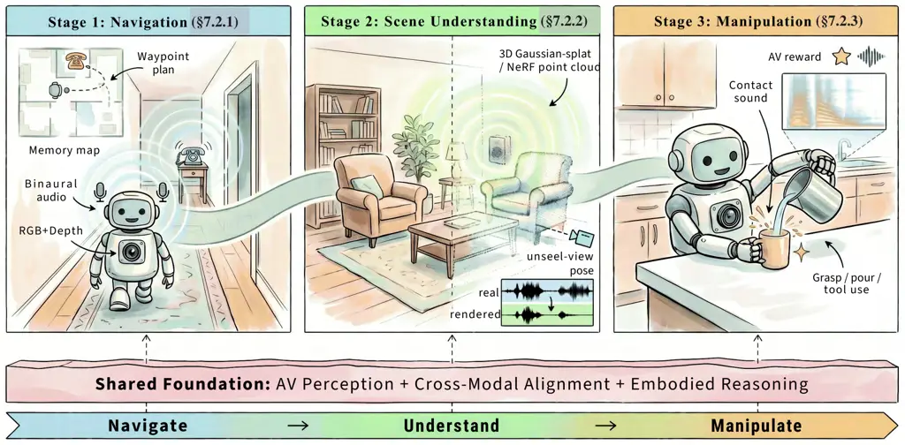

Figure 11: Organization of audio-visual embodied interaction. We
organize this subsection into navigation, scene understanding, and
manipulation, grounded in the shared foundations of audio-visual
perception, cross-modal alignment, and embodied reasoning.

#### 7.2.1 Audio-Visual Navigation

$`\bullet`$ Definition. Audio-visual navigation (AVN) asks an embodied
agent to reach a sound-emitting target by jointly using what it sees and
hears. Sound complements vision in two ways: it exposes out-of-view
goals and carries structural cues through reverberation and propagation.
The standard task variants are AudioGoal, where the sound itself defines
the target, and AudioPointGoal, where a coarse directional hint is also
provided (Chen et al., 2020a).

$`\bullet`$ Methods. AVN has evolved through several complementary
lines. _1) End-to-end RL_ methods (Li et al., 2025c; Chen et al., 2023a;
Chen et al., 2021b; Chen et al., 2020a) fuse visual and binaural
features and learn recurrent navigation policies directly from reward.
_Memory-augmented and hierarchical_ methods (Chen et al., 2021b; Gan et
al., 2020; Li et al., 2023c) introduce waypoint planning, spatial
memory, or transformer recurrence to reduce myopic behavior. *2)
Semantic navigation* (Chen et al., 2021a) shifts the task from tracking
an active sound source to reasoning about semantic sound events whose
source may become silent. _Robust navigation_ further addresses noise,
moving targets, and adversarial conditions through dynamic modality
weighting, stereo-aware fusion, and explicit robustness objectives (Zhao
et al., 2025f; Shi et al., 2025; Wang et al., 2025r; Li et al., 2025c;
Younes, 2022; Yu et al., 2022c). _3) Language-augmented_ systems
decouple perception from planning. AVLEN (Paul et al., 2022) introduces
language queries, and RILA-style agents (Yang et al., 2024e; Liu et al.,
2024h) use higher-level reasoning and self-correction to improve
zero-shot generalization. _4) Sim-to-real and acoustic-field modeling_
address the gap between clean simulation and physical deployment.
SoundSpaces 2.0 (Chen et al., 2022a) improves continuous acoustic
rendering, RAF (Chen et al., 2024h) provides real dense room impulse
responses, Sonicverse (Gao et al., 2023) supports multisensory embodied
simulation, and noisy navigation settings such as BeDAViN (Shi et al., 2025) stress robustness under more realistic sound conditions.

$`\bullet`$ Benchmarks. SoundSpaces (Chen et al., 2020a) provides
geometric acoustic simulation over Replica and Matterport3D scenes; its
PanoIR extension adds panoramic impulse responses across 100+ scenes;
and SoundSpaces 2.0 (Chen et al., 2022a) supports continuous acoustic
rendering on arbitrary 3D meshes. Real Acoustic Fields (RAF) (Chen et
al., 2024h) offers real-world dense RIRs with multi-view images and 6DoF
pose tracking. Sonicverse (Gao et al., 2023) is a multimodal simulation
platform for embodied AV tasks, and BeDAViN (Shi et al., 2025) extends
standard benchmarks with realistic noise conditions.

|                                      |          |                 |                    |             |                        |                     |                 |
| ------------------------------------ | -------- | --------------- | ------------------ | ----------- | ---------------------- | ------------------- | --------------- |
| Dataset                              | \#Scenes | Resolution      | Sampling Rate      | Real- world | Avg. Area              | \#Training Episodes | \#Test Episodes |
| Replica (Chen et al., 2020a)         | 18       | $`0.5\text{m}`$ | $`44100\text{Hz}`$ | ✗           | $`47.24\text{m}^{2}`$  | $`0.1\text{M}`$     | 1000            |
| Matterport3D (Chen et al., 2020a)    | 85       | $`1\text{m}`$   | $`16000\text{Hz}`$ | ✗           | $`517.34\text{m}^{2}`$ | $`2\text{M}`$       | 1000            |
| RAF (Chen et al., 2024h)             | 2        | Continuous      | $`48000\text{Hz}`$ | ✓           | $`45.1\text{m}^{2}`$   | 3000                | 500             |
| Sonicverse (Gao et al., 2023)        | 103      | Continuous      | $`44100\text{Hz}`$ | ✗           | $`215.3\text{m}^{2}`$  | $`5\text{M}`$       | 1000            |
| SoundSpaces 2.0 (Chen et al., 2022a) | 103      | Continuous      | $`16000\text{Hz}`$ | ✗           | $`435.4\text{m}^{2}`$  | $`10\text{M}`$      | 1000            |
| BeDAViN (Shi et al., 2025)           | 85       | $`1\text{m}`$   | $`96000\text{Hz}`$ | ✗           | $`517.3\text{m}^{2}`$  | $`1.5\text{M}`$     | 3000            |

Table 20: Summary of AVN benchmarks.

|                                                            |               |                 |                |
| ---------------------------------------------------------- | ------------- | --------------- | -------------- |
| Method                                                     | Paradigm      | SPL$`\uparrow`$ | SR$`\uparrow`$ |
| $`\blacktriangleright`$ AudioGoal: Replica (Heard)         |               |                 |                |
| SoundSpaces (Chen et al., 2020a)                           | End-to-End RL | 74.4            | 91.4           |
| AV-WaN (Chen et al., 2021b)                                | Waypoint Nav  | 86.6            | 98.7           |
| $`\blacktriangleright`$ Semantic AudioGoal: MP3D (Unheard) |               |                 |                |
| SoundSpaces (Chen et al., 2020a)                           | End-to-End RL | 15.5            | 16.5           |
| AV-WaN (Chen et al., 2021b)                                | Waypoint Nav  | 13.2            | 17.2           |
| SAVi (Chen et al., 2021a)                                  | Semantic Nav  | 17.2            | 24.8           |
| AVLEN (Paul et al., 2022)                                  | Language-Aug  | 17.6            | 26.2           |
| RILA^(‡) (Yang et al., 2024e)                              | LLM Agent     | 11.8            | 35.4           |

Table 21: Audio-visual navigation performance on SoundSpaces (Chen et
al., 2020a). Top: AudioGoal (continuous sound) on Replica (Heard).
Bottom: Semantic AudioGoal (intermittent sound) on MP3D (Unheard). The
two task settings differ substantially in difficulty. SPL and SR are in
%. $`\ddagger`$: zero-shot (no training trajectories). Best per-task
results in bold.

#### 7.2.2 Audio-Visual Scene Understanding and Reconstruction

$`\bullet`$ Definition. In the embodied setting, audio-visual scene
understanding and reconstruction aim to build an _actionable_ spatial
representation for an agent rather than a purely descriptive scene
label. The goal is to estimate geometry, acoustic response, and
language-grounded semantics tightly enough that a robot can localize
sound sources, reason about out-of-view structure, and update its
spatial memory while acting (Chen et al., 2022a; Luo et al., 2022). This
is therefore narrower than generic AV segmentation or event
classification: the output must be useful for navigation, manipulation,
or world modeling.

$`\bullet`$ Representative Tasks and Methods. Related approaches can be
categorized as follows:

Echo-based geometry and acoustic reconstruction. Early work such as
BatVision, Beyond2D, and few-shot acoustic reconstruction (Christensen
et al., 2020; Parida et al., 2021; Majumder et al., 2022) showed that
echoes can recover layout cues when vision is degraded. In embodied AV
systems, this line has evolved into queryable acoustic fields:
SoundSpaces 2.0 (Chen et al., 2022a) provides the simulation substrate,
and Neural Acoustic Fields (NAF) (Luo et al., 2022) represent room
acoustics as continuous functions that agents can query for
localization, reverberation, or planning.

Joint visual-acoustic scene fields. Recent work explicitly couples
geometry, appearance, and acoustics in one scene representation.
AV-NeRF (Liang et al., 2023), AV-GS (Bhosale et al., 2024),
NeRAF (Brunetto et al., 2024), and related audio-aware neural field
models move toward physically grounded visual-acoustic rendering. The
important embodied point is not photorealism by itself, but whether the
learned field stays spatially consistent enough to support downstream
decisions under viewpoint change.

Language-grounded spatial memory. Audio-Visual Language Maps (Huang et
al., 2023a) make this actionability explicit by grounding language,
vision, and audio in a shared 3D frame that can be queried during
navigation. The extension to Multimodal Spatial Language Maps (Huang et
al., 2025a) broadens the same map abstraction from navigation toward
manipulation, suggesting that embodied AV scene understanding is
converging on reusable spatial memory rather than task-specific
perception heads.

Toward interactive AV world models. The frontier is shifting from static
maps to updateable world models. X-Streamer (Xie et al., 2025c) is an
example of unified audiovisual world modeling, and even though it is not
limited to robot mapping, it points to the next step for embodiment:
scene representations that evolve with interaction, preserve
long-horizon audiovisual memory, and expose state variables useful for
control.

$`\bullet`$ Benchmarks. Embodied evaluation should reflect spatial
usefulness rather than generic AV recognition. The most relevant
resources are therefore simulators, acoustic-field datasets, and
map-based evaluation settings: SoundSpaces 2.0 (Chen et al., 2022a) and
SonicVerse (Gao et al., 2023) support embodied simulation, RAF (Chen et
al., 2024h) measures real acoustic reconstruction, and language-grounded
map settings such as AVLMaps/MSLMaps (Huang et al., 2023a; Huang et al.,
2025a) test whether the representation can support embodied queries and
downstream success. Typical metrics include localization error, RT60 or
field-reconstruction error, success rate, and task-completion metrics on
navigation/manipulation splits.

|                                                              |                      |                |                        |
| ------------------------------------------------------------ | -------------------- | -------------- | ---------------------- |
| Resource                                                     | Signal               | Use            | Metrics                |
| SoundSpaces 2.0 (Chen et al., 2022a)                         | 3D scans + sim audio | AV sim         | SPL/SR + loc err       |
| RAF (Chen et al., 2024h)                                     | Real RIRs + RGB      | Acoustic recon | RT60 + loc/recon err   |
| SonicVerse (Gao et al., 2023)                                | Sim AV rooms         | Sim2real       | Success + acoustic err |
| AVLMaps / MSLMaps (Huang et al., 2023a; Huang et al., 2025a) | AV-lang maps         | Grounded QA    | Success + grounding    |

Table 22: Representative resources and evaluation settings for
audio-visual scene understanding and reconstruction. The emphasis is on
spatial memory and field estimation rather than generic AV perception.

#### 7.2.3 Audio-Visual Embodiment Interaction and Manipulation

$`\bullet`$ Definition. Audio-visual embodiment interaction and
manipulation study how agents use sound together with vision for
contact-rich control. Contact sounds reveal events such as slip,
collision, pouring progress, or material change that are often ambiguous
in RGB alone, making audio a useful proxy for tactile feedback. Acoustic
sensing can be passive, where the agent listens to naturally occurring
contact sounds, or active, where the agent emits vibrations or probing
signals and interprets the returned acoustic response.

$`\bullet`$ Representative Tasks and Methods. Research has evolved
through four related directions. *Contact representation and feature
enhancement* (Mejia et al., 2024; Li et al., 2022b; Wang et al., 2022)
use audio to enrich visual perception, especially for contact events
that are visually subtle. _Active and passive acoustic sensing_ studies
how contact sounds or controlled acoustic probing reveal object state,
material, and interaction dynamics; SonicSense (Liu and Chen, 2024) is
representative of in-hand acoustic object perception. *World-model and
generative approaches* (Zhang and Gienger, 2025; Huang et al., 2025e;
Wang et al., 2025j; Yi et al., 2024) integrate audio into diffusion
policies or audio-centric predictive models so that agents can
anticipate physical interactions. *VLA integration* (Zhao et al., 2025d;
Wei et al., 2025c; Wang et al., 2024m) injects auditory tokens directly
into vision–language–action backbones for closed-loop multimodal
control.

$`\bullet`$ Benchmarks. Benchmarks are now appearing across both real
and simulated settings. ManiWAV (Liu et al., 2024k) collects in-the-wild
AV demonstrations through an ear-in-hand setup, ARIO (Wang et al.,
2024m) aggregates multi-robot trajectories into a unified format,
Kaiwu (Jiang et al., 2025a) targets real-world assembly with rich
synchronized sensing, and AV grounding-and-act (Wang et al., 2022)
stresses perception-action coupling. Audio-VLA (Wei et al., 2025c)
augments RLBench and LIBERO with collision audio and introduces Task
Completion Rate (TCR) for dynamic process tracking, while sim-to-real
evaluation increasingly uses intentionally hard-to-simulate audio (Wang
et al., 2025j).

|                               |           |                        |                   |                         |
| ----------------------------- | --------- | ---------------------- | ----------------- | ----------------------- |
| Benchmark                     | Setting   | Modalities             | Scale             | Primary Use             |
| ManiWAV (Liu et al., 2024k)   | Real      | RGB, audio, state      | In-wild demos     | Contact manipulation    |
| ARIO (Wang et al., 2024m)     | Real  Sim | Multimodal robot traj. | Millions episodes | Embodied pretraining    |
| Kaiwu (Jiang et al., 2025a)   | Real      | Audio, video, mocap    | Assembly data     | Industrial manipulation |
| Audio-VLA (Wei et al., 2025c) | Sim       | RGB, audio, action     | RLBench/LIBERO    | TCR process eval        |

Table 23: Representative benchmarks for audio-visual embodied
manipulation.

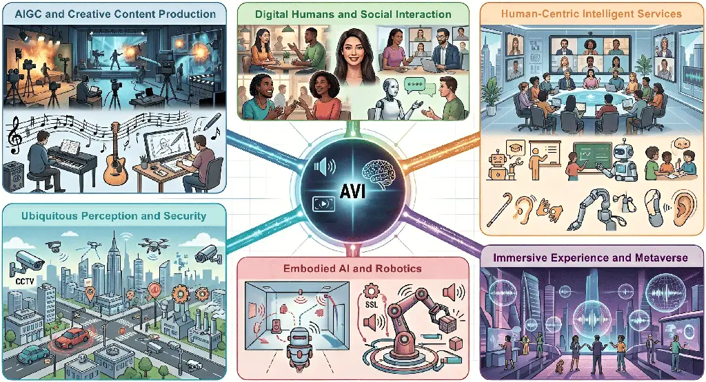

Figure 12: The landscape of AVI applications. We here highlight how
audio-visual foundation models act as a core intelligence layer for
AIGC, human-centric services, immersive environments, and ubiquitous
perception, etc.

## 8 Applications

Audio-visual intelligence powered by foundation models has enabled a
wide range of real-world applications spanning creative industries,
human-computer interaction, immersive technologies, and embodied
systems. This section surveys the major domains where these advances
have shown substantial impact.

### 8.1 AIGC and Creative Content Production

Generative tools are already changing how video and sound are produced,
from automated Foley and short-form co-creation to long-standing
workflows such as post-production, music scoring, and asset iteration.
The discussion below links foundation-model capabilities in generation
and editing to these creative pipelines, using film and game-oriented
examples before broadening to music and sound design.

$`\bullet`$ Film and Video Post-Production. The film and video
production industry has been transformed by foundation models capable of
generating and manipulating audio-visual content (Ruan et al., 2023; Liu
et al., 2025i). Foley synthesis, traditionally reliant on manual labor
and specialized studios, can now be automated by video-to-audio models
such as Diff-Foley (Luo et al., 2023), MMAudio (Cheng et al., 2025a),
and FoleyCrafter (Zhang et al., 2024f), which generate temporally
aligned sound effects and ambient audio directly from silent video,
reducing post-production time and cost. These models also support
dubbing and voice-over workflows: speech-driven talking head
generation (Prajwal et al., 2020; Ye et al., 2023) enables cross-lingual
lip-synchronized dubbing, while voice conversion systems (Popov et al., 2022) preserve emotional nuance during voice transformation. More
recently, joint text-to-audio-video generation models such as
JavisDiT (Liu et al., 2025i) and commercial systems including Veo-3 and
Seedance (Chen et al., 2025g) have opened the possibility of generating
complete scenes with synchronized audio and visuals from text, though
current performance is still strongest for short-form content.

$`\bullet`$ Music and Sound Design. Foundation models have also reshaped
music production and sound design workflows (Copet et al., 2023; Borsos
et al., 2023a; Agostinelli et al., 2023). Text-to-audio systems such as
AudioLDM (Liu et al., 2023a), MusicGen (Copet et al., 2023), and Stable
Audio allow creators to rapidly prototype audio from natural language
prompts, while source separation models including TF-GridNet (Wang et
al., 2023b) and Band-Split RNN (Luo and Yu, 2023) can isolate
instruments from mixed recordings for karaoke generation, remixing, and
restoration. These capabilities are increasingly integrated into digital
audio workstations and video editing tools (Kreuk et al., 2022). In
addition, audio manipulation models support style transfer, inpainting
of corrupted segments (Moliner et al., 2023), and instruction-based
editing (Wang et al., 2023a). In gaming, procedural sound generation
conditioned on game state and visual context reduces dependence on large
prerecorded libraries while enabling more dynamic and context-aware
audio experiences.

### 8.2 Digital Humans and Social Interaction

Synthesized faces, bodies, and consistent personas sit at the boundary
of entertainment, communication, and service interfaces; audio-driven
motion and identity-locked output are the usual technical levers. We
first sketch avatar and talking-head technology, then comment on
applications that require the same person (or character) to persist
across sessions and media.

$`\bullet`$ Talking Head and Avatars. Digital human synthesis has
progressed from simple 2D lip-syncing to photorealistic 3D avatar
generation (Cudeiro et al., 2019; Richard et al., 2021). Early methods
such as Wav2Lip (Prajwal et al., 2020) focused on robust audio-lip
synchronization at the pixel level, whereas newer approaches use
explicit 3D representations. Mesh-based methods such as FaceFormer (Fan
et al., 2022) and CodeTalker (Xing et al., 2023) animate parametric face
models, while neural rendering approaches, including AD-NeRF (Guo et
al., 2021) and GaussianTalker (Yu et al., 2024a), achieve photorealistic
synthesis through implicit representations. Recent work further
addresses the “dead-face” problem (Ji et al., 2021) by separating
emotional state from speech content. Models such as DreamTalk (Ma et
al., 2023) and EmoGene (Wang and Fu, 2024) improve expressive control,
and full-body systems such as EMAGE (Liu et al., 2024b) and
Stereo-Talker (Deng et al., 2024b) generate synchronized speech, facial
expressions, and co-speech gestures from a single reference image.

$`\bullet`$ Persona-Consistent Interaction. Maintaining identity
consistency across interactions is essential for virtual influencers,
customer service avatars, and personalized AI companions (Guan et al.,
2025a; Yi et al., 2023). Foundation models increasingly support one-shot
or few-shot avatar creation, where a small set of reference images or
videos establishes identity priors that persist across generated
content. Real3D-Portrait (Ye et al., 2024c) reconstructs animatable 3D
portraits from a single image, while identity-preserving video
generation maintains consistent appearance across varying poses and
expressions (Shen et al., 2023a). These capabilities enable applications
such as virtual influencer marketing, realistic telepresence
avatars (Wang et al., 2025o), and sign language synthesis for
accessibility. Cross-lingual voice conversion and lip-sync adaptation
further expand digital human applications to multilingual
settings (Zhang et al., 2021).

### 8.3 Human-Centric Intelligent Services

End-user and enterprise settings reward systems that can listen, watch,
and speak on human timescales: meetings, education, and accessibility
are representative stress tests for robust multimodal input and output.
Assistants and meeting analytics, learning and training, and inclusive
design illustrate that breadth without duplicating the technical review
earlier in the survey.

$`\bullet`$ Conversational Assistants and Meeting Intelligence. Audio
LLMs such as Qwen-Audio (Chu et al., 2023; Chu et al., 2024) and
SALMONN (Tang et al., 2023) expand conversational AI from text to native
audio understanding. By processing speech directly without intermediate
ASR transcription, they preserve paralinguistic cues such as emotion,
emphasis, and speaker identity (Deshmukh et al., 2023; Ghosh et al.,
2024). Omni models such as GPT-4o (Hurst et al., 2024) and Qwen-Omni (Xu
et al., 2025a; Xu et al., 2025b) further integrate real-time
audio-visual perception and generation, enabling more natural multimodal
dialogue (Tong et al., 2025). In parallel, meeting intelligence systems
use audio-visual understanding for speaker diarization, action item
extraction, and conference summarization (Nagrani et al., 2017; Chung et
al., 2018). Multimodal fusion improves speaker identification by
combining vocal and facial cues (Desplanques et al., 2020), while
emotion recognition supports analysis of meeting dynamics in
applications such as collaboration analytics and customer-facing
services (Ma et al., 2024b).

$`\bullet`$ Education and Training. Interactive educational content
benefits from both audio-visual generation and understanding (Liu et
al., 2024d; Li et al., 2023b). AI tutors can adapt presentation styles
according to learner engagement inferred from audio-visual signals (Wu
et al., 2025i), while generated explanatory videos with synchronized
narration and demonstrations support self-paced learning. Language
learning applications further use lip-sync generation (Prajwal et al., 2020) and audio-driven avatar teachers (Fan et al., 2022) to demonstrate
pronunciation and articulatory movements. In high-stakes training
domains such as medicine, aviation, and emergency response, audio-visual
generation can produce realistic scenarios without expensive physical
infrastructure (Gao et al., 2023; Chen et al., 2022a). Audio-visual
analysis also enables automated feedback on communication, procedural
performance, and situational awareness (Radford et al., 2023).

$`\bullet`$ Accessibility and Inclusive AI. Audio-visual foundation
models significantly improve accessibility for users with sensory
impairments (Drossos et al., 2020; Mei et al., 2021). Audio captioning
systems (Mei et al., 2021) generate descriptions of acoustic scenes for
deaf and hard-of-hearing users, while audio description generation helps
blind and low-vision users understand visual content through
synchronized narration (Maaz et al., 2024). Audio Question
Answering (Lipping et al., 2022) enables natural-language interaction
with sound scenes, and sign language synthesis combined with realistic
avatar rendering supports communication for deaf communities (Liu et
al., 2024b). These applications also underscore the importance of
inclusive training data and evaluation across diverse user groups and
acoustic conditions (Radford et al., 2023; Chen et al., 2022c).

### 8.4 Immersive Experience and Metaverse

Immersive applications (e.g., XR/AR/VR) depend on sound and image
staying coherent as the user moves, which ties rendering, spatial audio,
and scene understanding more tightly than in flat media.

$`\bullet`$ Spatial Audio and Scene Rendering. Immersive experiences
require audio that responds naturally to user movement and environmental
context (Chen et al., 2020a; Chen et al., 2022a). Neural acoustic field
methods (Luo et al., 2022) render spatial audio as a function of
listener position within reconstructed 3D scenes, enabling 6DoF audio
with appropriate attenuation, occlusion, and room acoustics.
AV-NeRF (Liang et al., 2023) and related approaches jointly model visual
appearance and acoustic propagation, allowing users to navigate virtual
environments while hearing spatially consistent sound. These techniques
also support virtual concerts and live events, where audiences can
experience performances from different virtual viewpoints (Majumder et
al., 2022). However, deployment on head-mounted displays and spatial
computing platforms requires low latency, often below 20ms, to avoid
perceptual mismatch and motion sickness. Therefore, current research
emphasizes efficient inference while preserving audio-visual consistency
in dynamic and acoustically complex scenes (Chen et al., 2022a).

$`\bullet`$ 3D-Aware AV Interaction. Audio-Visual Language Maps (Huang
et al., 2023a) and related representations enable semantic understanding
of 3D environments through combined audio and visual sensing (Chen et
al., 2020a; Chen et al., 2022a). They support natural language queries
about spatial scenes, such as locating a ringing phone, and enable more
context-aware interaction in virtual environments. Echo-based 3D
reconstruction further complements visual sensing by using acoustic
reflections to infer room geometry when line-of-sight is limited (Luo et
al., 2022). Metaverse applications additionally require seamless
integration of user-generated content with synthesized
environments (Chen et al., 2022a). Models that place sound sources at
plausible 3D locations with physically consistent propagation can
support collaborative creation in shared virtual spaces, although
challenges remain in maintaining consistent rendering across devices and
network conditions while meeting the low-latency demands of presence and
embodiment (Gao et al., 2023).

### 8.5 Embodied AI and Robotics

Physical platforms use vision for geometry and affordances while sound
often marks goals, off-screen events, and contact; the two modalities
rarely substitute for one another in deployment.

$`\bullet`$ Audio-Visual Navigation. Embodied agents operating in
real-world environments benefit from multimodal perception that combines
visual and acoustic information (Chen et al., 2020a; Chen et al.,
2022a). The SoundSpaces platform (Chen et al., 2020a) and follow-up work
train agents to locate sound-emitting targets in complex 3D environments
by using reverberation patterns, intensity gradients, and visual
context (Chen et al., 2022a). Semantic audio-visual navigation extends
this setting to object-level goals, such as locating a ringing phone
through joint reasoning over acoustic and visual evidence (Huang et al.,
2023a; Yu et al., 2022c). For service robots and autonomous systems,
acoustic sensing also complements vision in low-light conditions, under
occlusion, and beyond the visual field (Gao et al., 2023).
Vision-Language-Action models (Kim et al., 2024b; Zitkovich et al.,
2023; Black et al., 2024) further integrate multimodal perception into
end-to-end control policies that respond to verbal commands,
environmental sounds, and manipulation feedback.

$`\bullet`$ Manipulation with Feedback. Acoustic contact sensing
provides rich information about manipulation interactions that vision
alone often cannot capture (Gao et al., 2023). Sounds produced during
contact can reveal surface material, slip events, and grasp stability,
improving grasping, insertion, and assembly tasks when visual feedback
is limited (Team et al., 2024; Li et al., 2024e). Human-robot
interaction likewise benefits from audio-visual understanding of speech,
gesture, and facial expression (Zheng et al., 2024; Wen et al., 2025),
enabling more natural collaboration (Bjorck et al., 2025; Shukor et al.,
2025). In safety-critical applications, current research emphasizes
real-time reliability, failure detection (Lin et al., 2025b), and
sim-to-real transfer under changing acoustic conditions (Gao et al.,
2023; Cen et al., 2025).

### 8.6 Ubiquitous Perception and Security

Large-scale sensing for safety, industry, and the IoT still hinges on
fusing what cameras and microphones can jointly establish about scenes,
actors, and anomalies, often at the edge with tight compute budgets.

$`\bullet`$ Smart City and Forensics. Audio-visual event detection
systems support public safety and urban monitoring (Tian et al., 2018).
Joint analysis of surveillance video and environmental audio improves
detection of anomalous events such as accidents, altercations, and
emergencies compared with single-modality systems (Tian et al., 2018;
Bao et al., 2023b). Audio-visual scene understanding can also localize
sound sources within visual scenes, supporting incident reconstruction
and situational awareness for first responders (Bao et al., 2023b; Tian
et al., 2018). In forensics, audio-visual analysis assists evidence
authentication and investigation (Chung and Zisserman, 2016; Kumar et
al., 2009). Speaker recognition based on neural embeddings (Desplanques
et al., 2020) enables voice identification, while deepfake detection
methods examine the consistency between lip movements and speech to
identify manipulated media (Chung and Zisserman, 2016). As generation
quality advances, detection methods must continue to improve to preserve
trust in digital evidence (Chung and Zisserman, 2016).

$`\bullet`$ Industry and IoT. Industrial applications employ
audio-visual monitoring for predictive maintenance, quality control, and
safety compliance (Gemmeke et al., 2017; Chen et al., 2020b). Acoustic
anomaly detection identifies equipment faults from characteristic sound
signatures (Chen et al., 2023c; Baevski et al., 2020), while visual
inspection detects defects in manufactured products. Combining both
modalities improves reliability by correlating complementary indicators
of system state (Nagrani et al., 2021; Girdhar et al., 2023). IoT
deployments similarly integrate distributed audio-visual sensors for
environmental monitoring, smart building management, and
agriculture (Yang et al., 2024c; Schu et al., 2023). Because edge
deployment must satisfy tight power and compute budgets, efficient
architectures are essential (Zeghidour et al., 2021; Défossez et al.,
2022). Privacy-preserving pipelines that process data locally or
transmit only semantic representations are also increasingly important
for continuous sensing in public and private spaces (Wu et al., 2022;
Guzhov et al., 2022).

## 9 Open Challenges, Limitations, and Future Directions

Audio-visual intelligence has progressed from deciding whether two
modalities correspond, to generating synchronized videos and sounds, and
further to systems that can hear, see, speak, edit, and act. The central
difficulty, however, is not merely that audio and vision are different
signal types. They are two partially observed views of a dynamic world.
Sounds are produced by events, propagate through space, interact with
materials and occlusions, and are interpreted by users under
conversational, social, and physical context. This makes AVI different
from generic multimodal learning: the field must explain why audio and
visual evidence co-occur, and how.

Therefore, the next stage of AVI should not be framed as a longer
checklist of data, robustness, efficiency, and safety issues. These
issues remain important, but they are too generic to define the field. A
more useful framing is a research agenda for building audio-visual
systems that are causal, contextual, controllable, verifiable, and
interactive. The preceding sections reviewed perception, generation, and
interaction as three pillars of AVI. Below we develop 6 major axes (cf.
table 24): causal event-source grounding, audio-visual world models,
audio-visual context memory, causal audio-visual intervention, verifier
and reward ecosystems, and interactive and responsible AVI. fig. 13
frames these axes as a staged roadmap: the field is moving from
correspondence, perception, and generation toward interactive systems,
and then toward causal-contextual and verifiable agentic AVI.

|                            |                                                                            |                                                                                                                                                |
| -------------------------- | -------------------------------------------------------------------------- | ---------------------------------------------------------------------------------------------------------------------------------------------- |
| Aspect                     | Current dominant assumption                                                | Deeper AVI-specific objective                                                                                                                  |
| Synchronization            | Audio and video are aligned if their embeddings, labels, or offsets match. | Model source-level, event-level, and causal alignment under delay, occlusion, off-screen sound, and multi-source mixtures.                     |
| World modeling             | Audio and vision are paired observations of the same clip.                 | Treat audio and vision as complementary evidence for geometry, material, dynamics, affordance, and user/social state.                          |
| Context and memory         | Longer context windows or more tokens improve long-form AVI.               | Build selective, hierarchical, and provenance-aware audio-visual memory across streaming, episodic, and semantic levels.                       |
| Generation and editing     | Prompts specify desired audio-visual content.                              | Support local, causal, and synchronized interventions over objects, sounds, identities, emotions, space, and time.                             |
| Evaluation                 | FAD/FVD/CLIP/SyncNet-style metrics approximate quality and alignment.      | Develop verifier and reward ecosystems for grounding, physical plausibility, audio indispensability, long-horizon coherence, and task utility. |
| Interaction and deployment | Omni models can extend static perception and generation directly.          | Balance real-time response, deliberative reasoning, user intent modeling, privacy, consent, and provenance in embodied and conversational AVI. |

Table 24: Six central research axes for future AVI. Each axis connects a
concrete limitation of current systems to a structural capability
required by audio-visual intelligence.

![[Uncaptioned
image]](arxiv-2605-04045--2e87fa2f2053.figures/figure-22.webp)

Figure 13: Roadmap of AVI development stages. The first three stages
consolidate correspondence, perception, and generation; the current
frontier centers on interactive omni-modal and embodied systems; the
next two stages emphasize causal-contextual AVI and verifiable agentic
AVI. The associated research axes connect the discussion below to
concrete future capabilities.

### 9.1 From Temporal Synchronization To Causal Event-Source Grounding

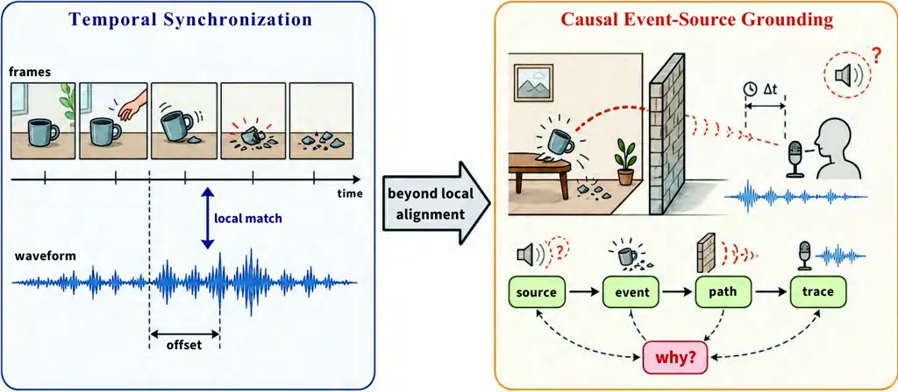

Figure 14: Temporal synchronization checks offsets; causal grounding
further infers sources, events, propagation, occlusion, and uncertainty.

Synchronization is often treated as a local temporal matching problem:
estimate whether the audio and video are aligned, or predict the offset
between them. This formulation was effective for early lip-sync and
synchronization systems, where mouth motion and speech are tightly
coupled (Chung and Zisserman, 2016; Prajwal et al., 2020), and it
remains useful for measuring local correspondence in generated media.
General AVI, however, requires a richer notion of alignment. A sound is
not aligned with a frame simply because the two embeddings are close. It
is aligned with a visual event if there is a plausible source, a
temporal onset, a propagation path, and a causal relation between what
is seen and what is heard. This distinction becomes critical beyond
talking heads, especially in V2A, T2AV, AVQA, AV segmentation, and
embodied perception. In practice, alignment is still often reduced to
labels, offsets, or embedding proximity, which is insufficient when
listeners must infer _which_ physical event caused _which_ sensory
trace.

fig. 14 illustrates this shift: synchronization checks local temporal
agreement, whereas event-source grounding asks which source produced
which sound through which causal path.

$`\bullet`$ Denser Correspondence and Generation. Dense audio–visual
correspondence and coordinated generation have improved: finer
localization and retrieval emerge from dense features (Hamilton et al.,
2024), and CAV-MAE Sync strengthens masked pretraining with explicit
synchronization (Araujo et al., 2025). Event-aware soundtrack models
such as Diff-Foley (Luo et al., 2023), FoleyCrafter (Zhang et al.,
2024f), MMAudio (Cheng et al., 2025a), ThinkSound (Liu et al., 2025d),
HunyuanVideo-Foley (Shan et al., 2025), and Kling-Foley (Wang et al.,
2025e) move video-to-audio beyond generic ambience, while joint
generators including JavisDiT (Liu et al., 2025i), AV-DiT (Wang et al.,
2024b), UniVerse-1 (Wang et al., 2025d), Harmony (Hu et al., 2025),
Ovi (Low et al., 2025), UniAVGen (Zhang et al., 2025b), and
JavisDiT++ (Liu et al., 2026) co-synthesize both modalities rather than
tacking sound onto video.

$`\bullet`$ Event-Source Graphs and Counterfactual Training. The next
step is to treat scenes as _event-source graphs_: nodes for objects,
latent sources, events, speakers, and environment; edges for production,
temporal order, propagation paths, and uncertainty. Perception could
then support questions about provenance and evidence; generation could
plan coherent event sequences instead of weakly coupled streams; editing
could specify what must follow when an object is removed or replaced.
Current practice still confuses co-occurrence with causation; a bark may
appear with a dog without knowing whether it is on-screen, delayed,
off-screen, or muffled by geometry, and global metrics can stay high
while source identity, timing, or propagation is wrong: SyncNet-style
scores reward lip motion, not whether a glass impact, rain density, or a
distant siren matches the scene. Training should therefore mix
contrastive alignment with temporal boundaries, separation,
interventions, and reconstruction on counterfactual-style supervision:
visible-but-silent sources, audible off-screen events, shifted onsets,
material conflicts, and mixtures where only one grounding is correct.
The objective is not only to decide whether two modalities match, but to
explain the event structure that makes them match.

### 9.2 From Paired Clips to Action-Conditioned Audio-Visual World Models

Most current AVI datasets are built from paired audio-video clips. This
form encourages correlation learning: a guitar image co-occurs with
guitar sound, a speaking face co-occurs with speech, and a car crash
co-occurs with impact noise. Correlation is necessary, but it is not
sufficient. Real audio-visual intelligence requires a model of the world
that can predict how visual and acoustic observations change when the
agent moves, when an object is occluded, when a room changes, or when an
action is executed. This is especially important for embodied agents,
XR, robotics, navigation, and manipulation, where the system must act
rather than merely classify.

$`\bullet`$ Partial Progress in Simulation, Fields, Maps, and Touch.
Pieces of such structure already exist: SoundSpaces (Chen et al., 2020a)
and SoundSpaces 2.0 (Chen et al., 2022a) support audio-visual
navigation; Neural Acoustic Fields (Luo et al., 2022), AV-NeRF (Liang et
al., 2023), AV-GS (Bhosale et al., 2024), and NeRAF (Brunetto et al., 2024) learn spatial acoustic or joint neural fields; Real Acoustic
Fields (Chen et al., 2024h) brings real impulse responses alongside
visuals; Audio-Visual and Multimodal Spatial Language Maps (Huang et
al., 2023a; Huang et al., 2025a) fuse language with traversable spatial
memory; ManiWAV (Liu et al., 2024k), Sound of Simulation (Wang et al.,
2025j), and Audio-VLA (Wei et al., 2025c) connect contact audio and
generative acoustics to manipulation and transfer.

$`\bullet`$ Toward Hybrid Action-Conditioned Latent Dynamics. Yet
rendering-centric fields, navigation benchmarks that treat sound only as
a goal cue, VLAs that bolt audio onto vision–language actions, and
pixel-heavy video generators each stop short of a shared predictive
abstraction. The agenda is _action-conditioned audio-visual world
models_ that forecast compact latent state, including sources,
materials, acoustics of the space, affordances, intent, and uncertainty,
and support queries such as muffling behind a wall, slip versus success
sounds during grasping, louder sources after a head turn, or co-evolving
evidence if synthesized thunder enters a clip. Hybrid stacks can combine
learned latent dynamics with approximate acoustic physics and
task-scoped scorers without rendering HD video every planning step.

Evaluation should prioritize navigation gains, manipulation success,
spatial reasoning, and counterfactual prediction rather than waveform or
pixel reconstruction alone.

### 9.3 Audio-Visual Context Memory

$`\bullet`$ Semantic Span Is Not Raw Token Count. Longer multimodal
contexts are often addressed by scaling windows or stuffing more tokens,
which is the wrong abstraction when a two-second sound matters more than
hundreds of redundant frames. Omni conversational stacks (GPT-4o (Hurst
et al., 2024); Qwen2.5-Omni (Xu et al., 2025a); Qwen3-Omni (Xu et al.,
2025b); Ming-Omni (AI et al., 2025); InteractiveOmni (Tong et al.,
2025)) illustrate unified interaction; unified representation lines
(ImageBind (Girdhar et al., 2023), LanguageBind (Zhu et al., 2024a),
OneLLM (Han et al., 2024), AnyGPT (Zhan et al., 2024), DenseAV (Hamilton
et al., 2024)) add shared embeddings. Yet flattened token sequences
still lose speaker identity, mix concurrent sources, or starve scarce
audio evidence.

Figure 15: Duration robustness on OmniVideoBench. The x-axis shows
short-video accuracy, the y-axis ultra-long-video accuracy, and the
bubble area denotes overall accuracy; distance below the diagonal
indicates long-context degradation.

fig. 15 uses OmniVideoBench duration splits (Li et al., 2025a) to show
the same issue empirically: high short-video accuracy does not
automatically translate to robust ultra-long-video accuracy.

$`\bullet`$ Layered AV Memory. Treat context as layered _audio-visual
memory_: sensory buffers preserving recoverable fidelity where needed;
event memory tracking onsets, tracks, masks, and positions; semantic
summaries tethered to evidence; user/task state for goals and
commitments, updated continuously without severing pointers to raw
observations. Specialists (audio events, trackers, diarizers, temporal
verifiers, intent models) should exchange structured messages rather
than forcing one backbone to attend uniformly. Faithfulness is the
bottleneck: brittle symbols, leaky summaries, and opaque embeddings each
fail alone, so credible systems retain raw handles, dense retrieval,
graphs, and summaries together, and benchmarks probe delayed recall,
audio-critical QA, modality conflict, and belief revision.

### 9.4 Causal AV Intervention

$`\bullet`$ Controlled Edits Versus One-Shot Prompts. User intent in
creation is rarely “any plausible soundtrack”: edits are local causal
requests, such as removing only the guitar stem, rerouting spatialized
sirens, or changing emotion without identity, that general prompts
mis-specify. Video-to-audio models (Diff-Foley (Luo et al., 2023),
MMAudio (Cheng et al., 2025a), ThinkSound (Liu et al., 2025d),
HunyuanVideo-Foley (Shan et al., 2025)) and audio-driven visuals
(Wav2Lip (Prajwal et al., 2020), DiffTalk (Shen et al., 2023a),
EMO (Tian et al., 2024b), VASA-1 (Xu et al., 2024), OmniAvatar (Gan et
al., 2025), AudCast (Guan et al., 2025a)) anchor one axis. Joint
generators (JavisDiT (Liu et al., 2025i), Harmony (Hu et al., 2025),
Ovi (Low et al., 2025), UniAVGen (Zhang et al., 2025b)) and localized
editors (Object-AVEdit (Fu et al., 2025d), AVI-Edit (Zheng et al.,
2025)) anchor another.

$`\bullet`$ Scene Graphs, Disentangled Latents, and Cross-Modal
Feedback. Residual entanglement persists: prompts couple camera and
identity; edits leak unrelated ambience or forget to update counterpart
modalities. The path forward is causal editing via explicit or latent
_audio-visual scene graphs_: objects, stems, identities, motions, causal
links. Operations become graph interventions; generators must freeze
what is untouched while propagating edits along dependencies. Practical
control needs factorized latents separating stems, speech, ambience,
identity, geometry, lighting, and camera so timing, ambience, and
emotion edits decouple unless the task demands otherwise.
Verifier-guided refinement only helps when feedback sees both
modalities, otherwise visuals can sharpen while synchronization silently
drifts.

### 9.5 Verifier and Reward Ecosystems

$`\bullet`$ Scalar Metrics Are Not Verifiers. fig. 16 summarizes the
target stack: FID-style audio and video scores, semantic similarity, and
lip-sync surrogates slice the problem (Kilgour et al., 2018; Unterthiner
et al., 2018; Chung and Zisserman, 2016; Girdhar et al., 2023), yet none
certify joint correctness: clip-level audio quality can coexist with
wrong sources; prompt alignment may violate physics; lip sync can
obscure mis-timed impacts.

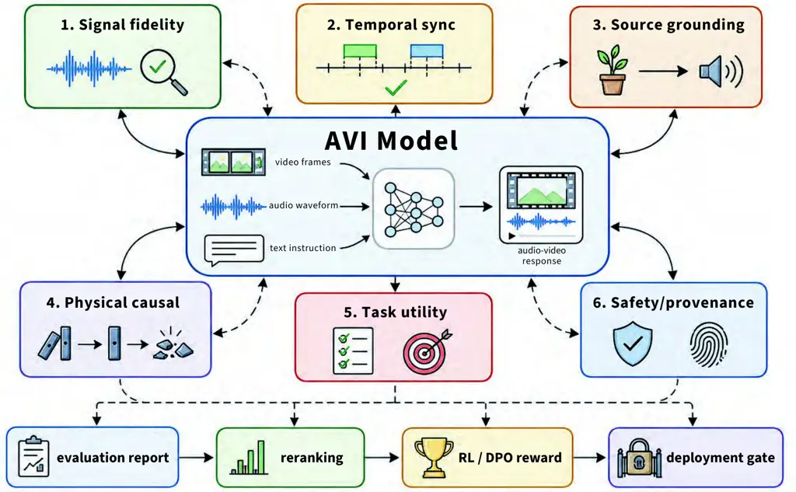

Figure 16: Verifier and reward ecosystems decompose AVI correctness into
signal, synchronization, grounding, causal/physical coherence, utility,
safety, and provenance signals for evaluation and training.

Understanding-centric suites such as AVUT (Yang et al., 2025d),
JointAVBench (Chao et al., 2025), OmniVideoBench (Li et al., 2025a), and
AURA (Galougah et al., 2025) broaden dependency and hallucination tests;
generation-oriented benchmarks including JavisBench (Liu et al., 2025i),
Verse-Bench (Wang et al., 2025d), PhyAVBench (Xie et al., 2025b), and
FoleyBench (Dixit et al., 2025) push alignment and acoustics realism.
Coverage is improving, but downstream utility ties remain uneven.

$`\bullet`$ Layered Verifiers as Evaluators and Training Rewards. Deploy
a staged verifier stack: signal fidelity; temporal synchronization;
source grounding across visible, occluded, and off-screen cases;
causal/physical coherence; instruction or task payoff; plus safety,
identity, and provenance. These models double as RL/DPO rerankers:
recent preference-tuned audio-video pipelines (Liu et al., 2025f; Liu et
al., 2025e) hint at the appetite, though rewards must unpack
faithfulness across modalities rather than collapsing to a prettier
frame. Treat narrow verifiers like narrow curricula: optimizing SyncNet
alone can starve prosody or expression; over-relying on CLIP-like
similarity excuses temporal hallucinations. Optimization should
therefore be paired with adversarial/counterfactual probes and explicit
failure taxonomies rather than leaderboard-only scores alone.

### 9.6 Interactive and Responsible AVI

Interaction is AVI’s stringent regime: latency, streaming evidence,
interruptions, embodied safety, privacy. Static captioning or offline
generation skips these constraints entirely.

$`\bullet`$ Omni Conversation and VLA-Style Action Interfaces. Realtime
omni pipelines (GPT-4o (Hurst et al., 2024), Qwen-Omni family (Xu et
al., 2025a; Xu et al., 2025b), VITA (Fu et al., 2025b), Mini-Omni (Xie
and Wu, 2024b), Freeze-Omni (Wang et al., 2024h), Ming-Omni (AI et al.,
2025), InteractiveOmni (Tong et al., 2025)) and architectures such as
X-Streamer (Xie et al., 2025c) emphasize streaming audiovisual world
modeling; embodied stacks connect foundation perception to manipulation
via OpenVLA (Kim et al., 2024b), RT-2 (Zitkovich et al., 2023),
Octo (Team et al., 2024), $`\pi_{0}`$ (Black et al., 2024),
Audio-VLA (Wei et al., 2025c), and Sound of Simulation (Wang et al.,
2025j). Useful policies must schedule perception, reasoning, and
actuation over time rather than concatenate encoders around an LLM.

$`\bullet`$ Fast Reactions, Deliberation, User Trust, and Safeguards.
Couple fast reactive pathways, such as collisions and turn-taking, with
verifier-backed deliberation for editing and planning and with
uncertainty gates deciding when to ask, defer, or fetch memory.
Sensitive user modeling (beliefs, affect, conversational roles)
inevitably collides with privacy, consent, impersonation risks,
continuous sensing, synthetic faces, and calibrated anthropomorphism.
Mitigate by design with provenance, watermarking where appropriate,
user-controlled memory partitioning, incidental-data minimization, and
consent-aware synthesis of speech and avatars, evaluating on-device,
federated, or redacted pipelines explicitly against accuracy and
usability constraints.

Overall, the frontier is not solely larger models or datasets but
weaving together _causal event-source grounding_, _audio-visual world
models_, _audio-visual context memory_, _causal audio-visual
intervention_, _verifier and reward ecosystems_, and _interactive and
responsible AVI_ into systems that jointly explain multimodal evidence,
forecast consequences under action, retain faithful memory, intervene
with causal control, close the loop with multimodal verifiers, and
deploy safely alongside humans.

## 10 Conclusion

This survey provides a comprehensive examination of audio-visual
intelligence (AVI) in the era of foundation models, organizing the
landscape around three interconnected pillars: representation-centric
methods for signal embedding, generation-centric methods for cross-modal
synthesis, and LLM-centric methods that utilize large language models as
reasoning engines. Our review has traced the progression of audio-visual
understanding from event recognition to complex spatial reasoning, while
the generation survey highlighted the pivotal role of diffusion and
autoregressive modeling in achieving synchronized, high-fidelity
synthesis. A central theme throughout is that cross-modal alignment
remains the foundational challenge underlying these diverse tasks.
Looking ahead, the field is moving toward unified architectures that
handle perception and generation within single ”omni” systems, yet this
brings new hurdles in temporal synchronization at scale and training
stability. Furthermore, as AVI extends into embodied robotics and
immersive XR, the demands for efficiency, robustness, and safety become
paramount. Ultimately, as these capabilities mature, addressing ethical
risks such as deepfakes and privacy remains essential for the
responsible development of AVI. We expect this survey to offer a
rigorous foundation for researchers navigating this rapidly evolving and
consequential frontier of artificial intelligence.

## References

- Abdelnour et al. (2018) J. Abdelnour, G. Salvi, and J. Rouat CLEAR: a
  dataset for compositional language and elementary acoustic reasoning.
  In NeurIPS 2018 Workshop on Visually Grounded Interaction and Language
  (ViGIL), External Links: 1811.10561 Cited by: §5.3.1.
- Achiam et al. (2023) J. Achiam, S. Adler, S. Agarwal, L. Ahmad, I.
  Akkaya, F. L. Aleman, D. Almeida, J. Altenschmidt, S. Altman, S.
  Anadkat, et al. Gpt-4 technical report. arXiv preprint
  arXiv:2303.08774. Cited by: §4.3.
- Afouras et al. (2018) T. Afouras, J. S. Chung, and A. Zisserman
  LRS3-TED: a large-scale dataset for visual speech recognition. arXiv
  preprint arXiv:1809.00496. Cited by: §5.1.5, Table 5, §6.2.3, Table 14.
- Afouras et al. (2020) T. Afouras, J. S. Chung, and A. Zisserman Asr is
  all you need: cross-modal distillation for lip reading. In ICASSP
  2020-2020 IEEE International Conference on Acoustics, Speech and
  Signal Processing (ICASSP), pp. 2143–2147. Cited by: Figure 2.
- Agarwal et al. (2026) M. Agarwal, M. Zhang, L. Sevilla-Lara, and S.
  McDonagh GaussianHeadTalk: wobble-free 3d talking heads with audio
  driven gaussian splatting. In Proceedings of the IEEE/CVF Winter
  Conference on Applications of Computer Vision (WACV), pp. 8017–8027.
  Cited by: §3.2.
- Agostinelli et al. (2023) A. Agostinelli, T. I. Denk, Z. Borsos, J.
  Engel, M. Verzetti, A. Caillon, Q. Huang, A. Jansen, A. Roberts, M.
  Tagliasacchi, et al. Musiclm: generating music from text. arXiv
  preprint arXiv:2301.11325. Cited by: Figure 2, §4.2.3, §8.1.
- Agrawal et al. (2019) H. Agrawal, K. Desai, Y. Wang, X. Chen, R.
  Jain, M. Johnson, D. Batra, D. Parikh, S. Lee, and P. Anderson Nocaps:
  novel object captioning at scale. In Proceedings of the IEEE/CVF
  international conference on computer vision, pp. 8948–8957. Cited by:
  §7.1.2.
- AI et al. (2025) I. AI, B. Gong, C. Zou, C. Zheng, C. Zhou, C. Yan, C.
  Jin, C. Shen, D. Zheng, F. Wang, et al. Ming-omni: a unified
  multimodal model for perception and generation. arXiv preprint
  arXiv:2506.09344. Cited by: Figure 2, Figure 2, Figure 2, §3.3,
  §4.3.1, §5.2.3, §7.1.3, §9.3, §9.6.
- Akbari et al. (2021) H. Akbari, L. Yuan, R. Qian, W. Chuang, S.
  Chang, Y. Cui, and B. Gong Vatt: transformers for multimodal
  self-supervised learning from raw video, audio and text. Advances in
  neural information processing systems 34, pp. 24206–24221. Cited by:
  Figure 2, Figure 2, §4.1.1.
- Alamri et al. (2018) H. Alamri, V. Cartillier, R. G. Lopes, A. Das, J.
  Wang, I. Essa, D. Batra, D. Parikh, A. Cherian, T. K. Marks, and C.
  Hori Audio visual scene-aware dialog (avsd) challenge at dstc7. arXiv
  preprint arXiv:1806.00525. Cited by: §5.2.3.
- Alayrac et al. (2022) J. Alayrac, J. Donahue, P. Luc, A. Miech, I.
  Barr, Y. Hasson, K. Lenc, A. Mensch, K. Millican, M. Reynolds, et al.
  Flamingo: a visual language model for few-shot learning. Advances in
  neural information processing systems 35, pp. 23716–23736. Cited by:
  Figure 2, §4.3.1, §5.2.2.
- Alibaba Cloud (2025) Alibaba Cloud Alibaba Unveils Wan2.6 Series
  Enabling Everyone to Star in Videos. Note:
  [https://www.alibabacloud.com/en/press-room/alibaba-unveils-wan2-6-series-enabling-everyone](https://www.alibabacloud.com/en/press-room/alibaba-unveils-wan2-6-series-enabling-everyone)Accessed:
  2026-04-30 Cited by: Table 17.
- Alwassel et al. (2020) H. Alwassel, D. Mahajan, B. Korbar, L.
  Torresani, B. Ghanem, and D. Tran Self-supervised learning by
  cross-modal audio-video clustering. Advances in neural information
  processing systems 33, pp. 9758–9770. Cited by: Figure 2, Figure 2,
  §4.1.1.
- An et al. (2025) X. An, Y. Xie, K. Yang, W. Zhang, X. Zhao, Z.
  Cheng, Y. Wang, S. Xu, C. Chen, C. Wu, et al. Llava-onevision-1.5:
  fully open framework for democratized multimodal training. arXiv
  preprint arXiv:2509.23661. Cited by: §5.2.2, §5.2.2, §5.3.2.
- Anastassiou et al. (2024) P. Anastassiou, J. Chen, J. Chen, Y.
  Chen, Z. Chen, Z. Chen, J. Cong, L. Deng, C. Ding, L. Gao, et al.
  Seed-tts: a family of high-quality versatile speech generation models.
  arXiv preprint arXiv:2406.02430. Cited by: §4.2.2.
- Anderson et al. (2018) P. Anderson, X. He, C. Buehler, D. Teney, M.
  Johnson, S. Gould, and L. Zhang Bottom-up and top-down attention for
  image captioning and visual question answering. In Proceedings of the
  IEEE conference on computer vision and pattern recognition,
  pp. 6077–6086. Cited by: §5.2.2.
- Andreas et al. (2016) J. Andreas, M. Rohrbach, T. Darrell, and D.
  Klein Neural module networks. In Proceedings of the IEEE conference on
  computer vision and pattern recognition, pp. 39–48. Cited by: §5.3.2.
- Anthropic (2024) Anthropic Claude 3.5 sonnet model card addendum.
  External Links:
  [Link](https://www-cdn.anthropic.com/fed9cc193a14b84131812372d8d5857f8f304c52/Model_Card_Claude_3_Addendum.pdf)
  Cited by: §5.3.2.
- Antol et al. (2015) S. Antol, A. Agrawal, J. Lu, M. Mitchell, D.
  Batra, C. L. Zitnick, and D. Parikh Vqa: visual question answering. In
  Proceedings of the IEEE international conference on computer vision,
  pp. 2425–2433. Cited by: §5.2.2, §5.2.3.
- Ao et al. (2022) J. Ao, R. Wang, L. Zhou, C. Wang, S. Ren, Y. Wu, S.
  Liu, T. Ko, Q. Li, Y. Zhang, et al. Speecht5: unified-modal
  encoder-decoder pre-training for spoken language processing. In
  Proceedings of the 60th annual meeting of the association for
  computational linguistics (volume 1: Long papers), pp. 5723–5738.
  Cited by: §4.3.1.
- Arandjelovic and Zisserman (2017) R. Arandjelovic and A. Zisserman
  Look, listen and learn. In Proceedings of the IEEE international
  conference on computer vision, pp. 609–617. Cited by: Figure 2, Figure
  2, §4.1.1, §5.2.4.
- Arandjelovic and Zisserman (2018) R. Arandjelovic and A. Zisserman
  Objects that sound. In Proceedings of the European conference on
  computer vision (ECCV), pp. 435–451. Cited by: Figure 2, Figure 2,
  Figure 2, §5.2.4.
- Araujo et al. (2025) E. Araujo, A. Rouditchenko, Y. Gong, S. Bhati, S.
  Thomas, B. Kingsbury, L. Karlinsky, R. Feris, J. R. Glass, and H.
  Kuehne CAV-MAE sync: improving contrastive audio-visual mask
  autoencoders via fine-grained alignment. In IEEE/CVF Conference on
  Computer Vision and Pattern Recognition, CVPR 2025, Nashville, TN,
  USA, June 11-15, 2025, pp. 18794–18803. Cited by: Figure 2, Figure 2,
  §5.2.4, §9.1.
- Arjovsky et al. (2017) M. Arjovsky, S. Chintala, and L. Bottou
  Wasserstein gan. arXiv preprint arXiv:1701.07875. Cited by: §4.2.1.
- Ashraf et al. (2023) M. Ashraf, F. Abid, I. U. Din, J. Rasheed, M.
  Yesiltepe, S. F. Yeo, and M. T. Ersoy A hybrid cnn and rnn variant
  model for music classification. Applied Sciences 13 (3), pp. 1476.
  Cited by: §5.1.1.
- Aytar et al. (2016) Y. Aytar, C. Vondrick, and A. Torralba Soundnet:
  learning sound representations from unlabeled video. Advances in
  neural information processing systems 29. Cited by: Figure 2, §5.2.4.
- Baevski et al. (2022) A. Baevski, W. Hsu, Q. Xu, A. Babu, J. Gu,
  and M. Auli Data2vec: a general framework for self-supervised learning
  in speech, vision and language. In International conference on machine
  learning, pp. 1298–1312. Cited by: §2.1.
- Baevski et al. (2020) A. Baevski, Y. Zhou, A. Mohamed, and M. Auli
  Wav2vec 2.0: a framework for self-supervised learning of speech
  representations. Advances in neural information processing systems 33,
  pp. 12449–12460. Cited by: §5.2.1, §8.6.
- Bai et al. (2023) J. Bai, S. Bai, S. Yang, S. Wang, S. Tan, P.
  Wang, J. Lin, C. Zhou, and J. Zhou Qwen-vl: a versatile
  vision-language model for understanding, localization, text reading,
  and beyond. External Links: 2308.12966,
  [Link](https://arxiv.org/abs/2308.12966) Cited by: Figure 2, §5.3.2.
- Bai et al. (2025a) S. Bai, Y. Cai, R. Chen, K. Chen, X. Chen, Z.
  Cheng, L. Deng, W. Ding, C. Gao, C. Ge, et al. Qwen3-vl technical
  report. arXiv preprint arXiv:2511.21631. Cited by: §4.3.1, §5.2.2,
  §5.2.2.
- Bai et al. (2025b) S. Bai, K. Chen, X. Liu, J. Wang, W. Ge, S.
  Song, K. Dang, P. Wang, S. Wang, J. Tang, et al. Qwen2. 5-vl technical
  report. arXiv preprint arXiv:2502.13923. Cited by: §4.3.1, §5.2.2,
  §5.2.2, §5.2.2, §5.3.2.
- Bai et al. (2024) Z. Bai, P. Wang, T. Xiao, T. He, Z. Han, Z. Zhang,
  and M. Z. Shou Hallucination of multimodal large language models: a
  survey. arXiv preprint arXiv:2404.18930. Cited by: §5.2.2.
- Bain et al. (2021) M. Bain, A. Nagrani, G. Varol, and A. Zisserman
  Frozen in time: a joint video and image encoder for end-to-end
  retrieval. In IEEE International Conference on Computer Vision, Cited
  by: §7.1.2.
- Baltrušaitis et al. (2018) T. Baltrušaitis, C. Ahuja, and L. Morency
  Multimodal machine learning: a survey and taxonomy. IEEE transactions
  on pattern analysis and machine intelligence 41 (2), pp. 423–443.
  Cited by: §4.2.1.
- Bao et al. (2023a) F. Bao, S. Nie, K. Xue, C. Li, S. Pu, Y. Wang, G.
  Yue, Y. Cao, H. Su, and J. Zhu One transformer fits all distributions
  in multi-modal diffusion at scale. In International Conference on
  Machine Learning, pp. 1692–1717. Cited by: §5.1.4.
- Bao et al. (2023b) P. Bao, W. Yang, B. P. Ng, M. H. Er, and A. C. Kot
  Cross-modal label contrastive learning for unsupervised audio-visual
  event localization. In Proceedings of the AAAI Conference on
  Artificial Intelligence, pp. 215–222. Cited by: §4.1.1, §8.6.
- Belkhale et al. (2024) S. Belkhale, T. Ding, T. Xiao, P. Sermanet, Q.
  Vuong, J. Tompson, Y. Chebotar, D. Dwibedi, and D. Sadigh RT-h: action
  hierarchies using language. In Robotics: Science and Systems, Cited
  by: §4.3.5.
- Bhosale et al. (2024) S. Bhosale, H. Yang, D. Kanojia, J. Deng, and X.
  Zhu AV-gs: learning material and geometry aware priors for novel view
  acoustic synthesis. In Advances in Neural Information Processing
  Systems, Vol. 37. External Links: 2406.08920 Cited by: §7.2.2, §9.2.
- Bhosale et al. (2025) S. Bhosale, H. Yang, D. Kanojia, J. Deng, and X.
  Zhu Unsupervised audio-visual segmentation with modality alignment. In
  Proceedings of the AAAI Conference on Artificial Intelligence, Vol.
  39, pp. 15567–15575. Cited by: §5.1.4.
- Biswas et al. (2025) S. Biswas, M. N. H. Khan, and B. Islam RAVEN:
  query-guided representation alignment for question answering over
  audio, video, embedded sensors, and natural language. arXiv preprint
  arXiv:2505.17114. Cited by: §5.2.3.
- Bjorck et al. (2025) J. Bjorck, F. Castañeda, N. Cherniadev, X. Da, R.
  Ding, L. Fan, Y. Fang, D. Fox, F. Hu, S. Huang, et al. Gr00t n1: an
  open foundation model for generalist humanoid robots. arXiv preprint
  arXiv:2503.14734. Cited by: Figure 2, Figure 2, Figure 2, §4.3.5,
  §8.5.
- Black et al. (2024) K. Black, N. Brown, D. Driess, A. Esmail, M.
  Equi, C. Finn, N. Fusai, L. Groom, K. Hausman, B. Ichter, et al.
  $`\pi_{0}`$: A vision-language-action flow model for general robot
  control. arXiv preprint arXiv:2410.24164. Cited by: Figure 2, Figure
  2, Figure 2, §4.3.5, §8.5, §9.6.
- Blattmann et al. (2023a) A. Blattmann, T. Dockhorn, S. Kulal, D.
  Mendelevitch, M. Kilian, D. Lorenz, Y. Levi, Z. English, V. Voleti, A.
  Letts, et al. Stable video diffusion: scaling latent video diffusion
  models to large datasets. arXiv preprint arXiv:2311.15127. Cited by:
  Figure 2, §6.3.2.
- Blattmann et al. (2023b) A. Blattmann, R. Rombach, H. Ling, T.
  Dockhorn, S. W. Kim, S. Fidler, and K. Kreis Align your latents:
  high-resolution video synthesis with latent diffusion models. In
  Proceedings of the IEEE/CVF conference on computer vision and pattern
  recognition, pp. 22563–22575. Cited by: §4.2.1.
- Borji et al. (2019) A. Borji, M. Cheng, Q. Hou, H. Jiang, and J. Li
  Salient object detection: a survey. Computational visual media 5 (2),
  pp. 117–150. Cited by: §5.1.2.
- Borsos et al. (2023a) Z. Borsos, R. Marinier, D. Vincent, E.
  Kharitonov, O. Pietquin, M. Sharifi, D. Roblek, O. Teboul, D.
  Grangier, M. Tagliasacchi, et al. Audiolm: a language modeling
  approach to audio generation. IEEE/ACM transactions on audio, speech,
  and language processing 31, pp. 2523–2533. Cited by: Figure 2, Figure
  2, §4.2.3, §6.1.1, §8.1.
- Borsos et al. (2023b) Z. Borsos, M. Sharifi, D. Vincent, E.
  Kharitonov, N. Zeghidour, and M. Tagliasacchi SoundStorm: efficient
  parallel audio generation. arXiv preprint arXiv:2305.09636. Cited by:
  §4.2.4.
- Brooks et al. (2023) T. Brooks, A. Holynski, and A. A. Efros
  InstructPix2Pix: learning to follow image editing instructions. arXiv
  preprint arXiv:2211.09800. Cited by: §6.1.2.
- Brown et al. (2020) T. Brown, B. Mann, N. Ryder, M. Subbiah, J. D.
  Kaplan, P. Dhariwal, A. Neelakantan, P. Shyam, G. Sastry, A. Askell,
  et al. Language models are few-shot learners. Advances in neural
  information processing systems 33, pp. 1877–1901. Cited by: §1,
  §4.2.3.
- Brunetto et al. (2024) A. Brunetto, S. Hornauer, and F. Moutarde
  NeRAF: 3d scene infused neural radiance and acoustic fields. arXiv
  preprint arXiv:2405.18213. Cited by: §7.2.2, §9.2.
- ByteDance Seed Team (2026a) ByteDance Seed Team Seedance 2.0: unified
  multimodal audio-video joint generation. ByteDance Technical Report.
  Cited by: §6.1.2, §6.2.3, §6.3.2.
- ByteDance Seed Team (2026b) ByteDance Seed Team Seedream 5.0 lite.
  Note:
  [https://seed.bytedance.com/en/seedream5_0_lite](https://seed.bytedance.com/en/seedream5_0_lite)Accessed:
  2026-04-14 Cited by: §6.1.2.
- Cai et al. (2025) H. Cai, S. Cao, R. Du, P. Gao, S. Hoi, S. Huang, Z.
  Hou, D. Jiang, X. Jin, L. Li, et al. Z-image: an efficient image
  generation foundation model with single-stream diffusion transformer.
  arXiv preprint arXiv:2511.22699. Cited by: §4.2.2.
- Cao et al. (2025a) S. Cao, H. Chen, P. Chen, Y. Cheng, Y. Cui, X.
  Deng, Y. Dong, K. Gong, T. Gu, X. Gu, et al. Hunyuanimage 3.0
  technical report. arXiv preprint arXiv:2509.23951. Cited by: Figure 2,
  Figure 2, §3.2, §4.2.2, §6.1.2.
- Cao et al. (2025b) Z. Cao, T. Wang, J. Wang, Y. Wang, Y. Zhang, J.
  Chen, M. Deng, J. Wang, Y. Guo, C. Liao, et al. T2AV-compass: towards
  unified evaluation for text-to-audio-video generation. arXiv preprint
  arXiv:2512.21094. Cited by: Figure 2, §1, §6.3.1, Table 16, Table 17,
  Table 17.
- Carion et al. (2025) N. Carion, L. Gustafson, Y. Hu, S. Debnath, R.
  Hu, D. Suris, C. Ryali, K. V. Alwala, H. Khedr, A. Huang, et al. Sam
  3: segment anything with concepts. arXiv preprint arXiv:2511.16719.
  Cited by: §5.1.2.
- Caron et al. (2021) M. Caron, H. Touvron, I. Misra, H. Jégou, J.
  Mairal, P. Bojanowski, and A. Joulin Emerging properties in
  self-supervised vision transformers. In 2021 IEEE/CVF International
  Conference on Computer Vision, ICCV 2021, Montreal, QC, Canada,
  October 10-17, 2021, pp. 9630–9640. Cited by: §5.2.4.
- Cen et al. (2025) J. Cen, S. Huang, Y. Yuan, H. Yuan, C. Yu, Y.
  Jiang, J. Guo, K. Li, H. Luo, F. Wang, et al. RynnVLA-002: a unified
  vision-language-action and world model. arXiv preprint
  arXiv:2511.17502. Cited by: Figure 2, §4.3.5, §8.5.
- Chang et al. (2023a) H. Chang, H. Zhang, J. Barber, A. J.
  Maschinot, J. Lezama, L. Jiang, M. Yang, K. Murphy, W. T. Freeman, M.
  Rubinstein, Y. Li, and D. Krishnan Muse: text-to-image generation via
  masked generative transformers. arXiv preprint arXiv:2301.00704. Cited
  by: Figure 2, §4.2.4.
- Chang et al. (2022) H. Chang, H. Zhang, L. Jiang, C. Liu, and W. T.
  Freeman MaskGIT: masked generative image transformer. arXiv preprint
  arXiv:2202.04200. Cited by: Figure 2, §4.2.4.
- Chang et al. (2023b) K. Chang, Y. Wang, H. Shen, I. Kang, W. Tseng, S.
  Li, and H. Lee Speechprompt v2: prompt tuning for speech
  classification tasks. arXiv preprint arXiv:2303.00733. Cited by:
  §5.1.1.
- Chao et al. (2025) J. Chao, J. Gao, W. Tan, Y. Sun, R. Song, and L. Ru
  JointAVBench: a benchmark for joint audio-visual reasoning evaluation.
  arXiv preprint arXiv:2512.12772. Cited by: §5.3.3, Table 9, §9.5.
- Chen et al. (2026a) A. Chen, N. K. Korem, T. Halperin, M. B. Yosef, U.
  Jelercic, O. Bibi, O. Patashnik, and D. Cohen-Or JUST-dub-it: video
  dubbing via joint audio-visual diffusion. arXiv preprint
  arXiv:2601.22143. Cited by: §6.3.3.
- Chen et al. (2021a) C. Chen, Z. Al-Halah, and K. Grauman Semantic
  audio-visual navigation. In IEEE Conference on Computer Vision and
  Pattern Recognition, CVPR 2021, virtual, June 19-25, 2021,
  pp. 15516–15525. Cited by: §7.2.1, Table 21.
- Chen et al. (2020a) C. Chen, U. Jain, C. Schissler, S. V. A. Garí, Z.
  Al-Halah, V. K. Ithapu, P. W. Robinson, and K. Grauman SoundSpaces:
  audio-visual navigation in 3d environments. In Computer Vision - ECCV
  2020 - 16th European Conference, Glasgow, UK, August 23-28, 2020,
  Proceedings, Part VI, Vol. 12351, pp. 17–36. Cited by: Figure 2,
  Figure 2, Figure 2, §7.2.1, §7.2.1, §7.2.1, Table 20, Table 20, Table
  21, Table 21, Table 21, Table 21, §8.4, §8.4, §8.5, §9.2.
- Chen et al. (2021b) C. Chen, S. Majumder, Z. Al-Halah, R. Gao, S. K.
  Ramakrishnan, and K. Grauman Learning to set waypoints for
  audio-visual navigation. In 9th International Conference on Learning
  Representations, ICLR 2021, Virtual Event, Austria, May 3-7, 2021,
  Cited by: §7.2.1, Table 21, Table 21.
- Chen et al. (2022a) C. Chen, C. Schissler, S. Garg, P. Kobernik, A.
  Clegg, P. Calamia, D. Batra, P. Robinson, and K. Grauman Soundspaces
  2.0: a simulation platform for visual-acoustic learning. Advances in
  Neural Information Processing Systems 35, pp. 8896–8911. Cited by:
  Figure 2, Figure 2, §7.2.1, §7.2.1, §7.2.2, §7.2.2, §7.2.2, Table 20,
  Table 22, §8.3, §8.4, §8.4, §8.5, §9.2.
- Chen et al. (2025a) C. Chen, S. Dang, Y. Liu, N. Zhao, Y. Shi, and N.
  Cao MV-crafter: an intelligent system for music-guided video
  generation. ACM Transactions on Interactive Intelligent Systems 15
  (3), pp. 15:1–15:27. External Links:
  [Document](https://dx.doi.org/10.1145/3748515) Cited by: §6.3.1.
- Chen et al. (2026b) G. Chen, D. Lin, J. Yang, Y. Zhang, Z. Fei, D.
  Li, S. Chen, C. Ao, N. Pang, Y. Wang, et al. SkyReels-v4: multi-modal
  video-audio generation, inpainting and editing model. arXiv preprint
  arXiv:2602.21818. Cited by: §6.2.3, §6.3.2, §6.3.3.
- Chen et al. (2021c) H. Chen, W. Xie, T. Afouras, A. Nagrani, A.
  Vedaldi, and A. Zisserman Audio-visual synchronisation in the wild.
  arXiv preprint arXiv:2112.04432. Cited by: §5.1.5, §5.1.5, §5.1.5,
  §5.1.5, Table 5.
- Chen et al. (2020b) H. Chen, W. Xie, A. Vedaldi, and A. Zisserman
  Vggsound: a large-scale audio-visual dataset. In ICASSP 2020-2020 IEEE
  International Conference on Acoustics, Speech and Signal Processing
  (ICASSP), pp. 721–725. Cited by: Figure 2, §5.1.5, §5.2.4, Table 5,
  Table 8, §6.2.1, §6.2.2, §6.3.1, Table 11, Table 13, Table 16, §8.6.
- Chen et al. (2025b) J. Chen, Z. Wang, A. Zeng, Y. Fu, X. Yu, S.
  Cen, J. Tanke, Y. Chen, K. Saito, Y. Mitsufuji, et al. Talkcuts: a
  large-scale dataset for multi-shot human speech video generation.
  arXiv preprint arXiv:2510.07249. Cited by: §6.2.3, Table 14.
- Chen et al. (2025c) J. Chen, Y. Ding, Z. Fang, K. Gai, Y. Gao, K.
  He, J. Hua, B. Jiang, M. Lao, et al. Klingavatar 2.0 technical report.
  arXiv preprint arXiv:2512.13313. Cited by: §6.2.3.
- Chen et al. (2023a) J. Chen, W. Wang, S. Liu, H. Li, and Y. Yang
  Omnidirectional information gathering for knowledge transfer-based
  audio-visual navigation. In IEEE/CVF International Conference on
  Computer Vision, ICCV 2023, Paris, France, October 1-6, 2023,
  pp. 10959–10969. Cited by: §7.2.1.
- Chen et al. (2025d) J. Chen, L. Xue, Z. Xu, X. Pan, S. Yang, C.
  Qin, A. Yan, H. Zhou, Z. Chen, L. Huang, et al. Blip3o-next: next
  frontier of native image generation. arXiv preprint arXiv:2510.15857.
  Cited by: Figure 2, §1, §7.1.2.
- Chen et al. (2023b) J. Chen, D. Zhu, X. Shen, X. Li, Z. Liu, P.
  Zhang, R. Krishnamoorthi, V. Chandra, Y. Xiong, and M. Elhoseiny
  Minigpt-v2: large language model as a unified interface for
  vision-language multi-task learning. arXiv preprint arXiv:2310.09478.
  Cited by: §5.2.2.
- Chen et al. (2022b) K. Chen, X. Du, B. Zhu, Z. Ma, T.
  Berg-Kirkpatrick, and S. Dubnov Hts-at: a hierarchical token-semantic
  audio transformer for sound classification and detection. In ICASSP
  2022-2022 IEEE International Conference on Acoustics, Speech and
  Signal Processing (ICASSP), pp. 646–650. Cited by: §5.2.1.
- Chen et al. (2024a) L. Chen, H. Zhao, T. Liu, S. Bai, J. Lin, C. Zhou,
  and B. Chang An image is worth 1/2 tokens after layer 2: plug-and-play
  inference acceleration for large vision-language models. In European
  Conference on Computer Vision, pp. 19–35. Cited by: §4.3.1.
- Chen et al. (2024b) L. Chen, H. Hu, M. Zhang, Y. Chen, Z. Wang, Y.
  Li, P. Shyam, T. Zhou, H. Huang, M. Yang, et al. Omnixr: evaluating
  omni-modality language models on reasoning across modalities. arXiv
  preprint arXiv:2410.12219. Cited by: Figure 2.
- Chen et al. (2025e) L. Chen, T. Ma, J. Liu, B. Li, Z. Chen, L. Liu, X.
  He, G. Li, Q. He, and Z. Wu Humo: human-centric video generation via
  collaborative multi-modal conditioning. arXiv preprint
  arXiv:2509.08519. Cited by: §6.2.3.
- Chen et al. (2020c) M. Chen, A. Radford, R. Child, J. Wu, H. Jun, D.
  Luan, and I. Sutskever Generative pretraining from pixels. In
  Proceedings of the 37th International Conference on Machine Learning,
  H. D. III and A. Singh (Eds.), Proceedings of Machine Learning
  Research, Vol. 119, pp. 1691–1703. External Links:
  [Link](https://proceedings.mlr.press/v119/chen20s.html) Cited by:
  Figure 2.
- Chen et al. (2024c) S. Chen, S. Liu, L. Zhou, Y. Liu, X. Tan, J.
  Li, S. Zhao, Y. Qian, and F. Wei Vall-e 2: neural codec language
  models are human parity zero-shot text to speech synthesizers. arXiv
  preprint arXiv:2406.05370. Cited by: §4.2.3.
- Chen et al. (2022c) S. Chen, C. Wang, Z. Chen, Y. Wu, S. Liu, Z.
  Chen, J. Li, N. Kanda, T. Yoshioka, X. Xiao, et al. Wavlm: large-scale
  self-supervised pre-training for full stack speech processing. IEEE
  Journal of Selected Topics in Signal Processing 16 (6), pp. 1505–1518.
  Cited by: §5.2.1, §7.1.1, §8.3.
- Chen et al. (2023c) S. Chen, Y. Wu, C. Wang, S. Liu, D. Tompkins, Z.
  Chen, W. Che, X. Yu, and F. Wei BEATs: audio pre-training with
  acoustic tokenizers. In International Conference on Machine Learning,
  pp. 5178–5193. Cited by: §2.1, §4.3.1, §5.1.1, §8.6.
- Chen et al. (2025f) S. Chen, H. Huang, Y. Liu, Z. Ye, P. Chen, C.
  Zhu, M. Guan, R. Wang, J. Chen, G. Li, et al. TalkVid: a large-scale
  diversified dataset for audio-driven talking head synthesis. arXiv
  preprint arXiv:2508.13618. Cited by: §2.2, §6.2.3, Table 14.
- Chen et al. (2023d) S. Chen, X. He, L. Guo, X. Zhu, W. Wang, J. Tang,
  and J. Liu Valor: vision-audio-language omni-perception pretraining
  model and dataset. arXiv preprint arXiv:2304.08345. Cited by: Figure 2.
- Chen et al. (2025g) S. Chen, Y. Chen, Y. Chen, Z. Chen, F. Cheng, X.
  Chi, J. Cong, Q. Cui, Q. Dong, J. Fan, et al. Seedance 1.5 pro: a
  native audio-visual joint generation foundation model. arXiv preprint
  arXiv:2512.13507. Cited by: §1, §6.3.1, §6.3.2, Table 17, §8.1.
- Chen et al. (2021d) W. Chen, Z. Gan, L. Li, Y. Cheng, W. Wang, and J.
  Liu Meta module network for compositional visual reasoning. In
  Proceedings of the IEEE/CVF Winter Conference on Applications of
  Computer Vision, pp. 655–664. Cited by: §5.3.2.
- Chen et al. (2022d) X. Chen, X. Wang, S. Changpinyo, A. J.
  Piergiovanni, P. Padlewski, D. Salz, S. Goodman, A. Grycner, B.
  Mustafa, L. Beyer, et al. Pali: a jointly-scaled multilingual
  language-image model. arXiv preprint arXiv:2209.06794. Cited by:
  §5.2.2.
- Chen et al. (2025h) X. Chen, Z. Wu, X. Liu, Z. Pan, W. Liu, Z. Xie, X.
  Yu, and C. Ruan Janus-pro: unified multimodal understanding and
  generation with data and model scaling. arXiv preprint
  arXiv:2501.17811. Cited by: Figure 2, Figure 2, §4.3.3, §7.1.2.
- Chen et al. (2025i) X. Chen, B. Kang, W. Geng, J. Zhu, Y. Liu, D.
  Wang, and H. Lu Sutrack: towards simple and unified single object
  tracking. In Proceedings of the AAAI Conference on Artificial
  Intelligence, Vol. 39, pp. 2239–2247. Cited by: §5.1.2.
- Chen et al. (2015) X. Chen, H. Fang, T. Lin, R. Vedantam, S. Gupta, P.
  Dollár, and C. L. Zitnick Microsoft coco captions: data collection and
  evaluation server. arXiv preprint arXiv:1504.00325. Cited by: §7.1.2.
- Chen et al. (2025j) Y. Chen, S. Liang, Z. Zhou, Z. Huang, Y. Ma, J.
  Tang, Q. Lin, Y. Zhou, and Q. Lu Hunyuanvideo-avatar: high-fidelity
  audio-driven human animation for multiple characters. arXiv preprint
  arXiv:2505.20156. Cited by: §6.2.3.
- Chen et al. (2024d) Y. Chen, Y. Liu, H. Wang, F. Liu, C. Wang, H.
  Frazer, and G. Carneiro Unraveling instance associations: a closer
  look for audio-visual segmentation. In Proceedings of the IEEE/CVF
  Conference on Computer Vision and Pattern Recognition,
  pp. 26497–26507. Cited by: §5.1.4, Table 3, Table 4.
- Chen et al. (2024e) Y. Chen, C. Wang, Y. Liu, H. Wang, and G. Carneiro
  Cpm: class-conditional prompting machine for audio-visual
  segmentation. In European Conference on Computer Vision, pp. 438–456.
  Cited by: §5.1.4, Table 3.
- Chen et al. (2024f) Z. Chen, W. Wang, Y. Cao, Y. Liu, Z. Gao, E.
  Cui, J. Zhu, S. Ye, H. Tian, Z. Liu, et al. Expanding performance
  boundaries of open-source multimodal models with model, data, and
  test-time scaling. arXiv preprint arXiv:2412.05271. Cited by: §4.3.1.
- Chen et al. (2024g) Z. Chen, J. Wu, W. Wang, W. Su, G. Chen, S.
  Xing, M. Zhong, Q. Zhang, X. Zhu, L. Lu, et al. Internvl: scaling up
  vision foundation models and aligning for generic visual-linguistic
  tasks. In Proceedings of the IEEE/CVF conference on computer vision
  and pattern recognition, pp. 24185–24198. Cited by: Figure 2, §5.2.2,
  §5.3.2.
- Chen et al. (2024h) Z. Chen, I. D. Gebru, C. Richardt, A. Kumar, W.
  Laney, A. Owens, and A. Richard Real acoustic fields: an audio-visual
  room acoustics dataset and benchmark. In IEEE/CVF Conference on
  Computer Vision and Pattern Recognition, CVPR 2024, Seattle, WA, USA,
  June 16-22, 2024, pp. 21886–21896. Cited by: Figure 2, §7.2.1, §7.2.1,
  §7.2.2, Table 20, Table 22, §9.2.
- Cheng et al. (2022) B. Cheng, I. Misra, A. G. Schwing, A. Kirillov,
  and R. Girdhar Masked-attention mask transformer for universal image
  segmentation. In Proceedings of the IEEE/CVF conference on computer
  vision and pattern recognition, pp. 1290–1299. Cited by: §5.1.2.
- Cheng et al. (2026) D. Cheng, R. Yuan, Y. Li, R. You, W. Wang, L.
  Nie, L. Zhang, and W. Li AR-omni: a unified autoregressive model for
  any-to-any generation. arXiv preprint arXiv:2601.17761. Cited by:
  §7.1.3.
- Cheng et al. (2025a) H. K. Cheng, M. Ishii, A. Hayakawa, T.
  Shibuya, A. Schwing, and Y. Mitsufuji MMAudio: taming multimodal joint
  training for high-quality video-to-audio synthesis. In Proceedings of
  the Computer Vision and Pattern Recognition Conference,
  pp. 28901–28911. Cited by: Figure 2, Figure 2, §1, §3.2, §4.2.2,
  §6.2.1, Table 12, §8.1, §9.1, §9.4.
- Cheng et al. (2025b) X. Cheng, Z. Zhang, M. Fang, Z. Wang, R. Hu, S.
  Zheng, R. Huang, T. Jin, and Z. Zhao AVSET-10m: an open large-scale
  audio-visual dataset with high correspondence. Note: Hugging Face
  dataset: https://huggingface.co/datasets/avset10m/avset10m Cited by:
  §5.2.4, Table 8.
- Cheng et al. (2024) Z. Cheng, S. Leng, H. Zhang, Y. Xin, X. Li, G.
  Chen, Y. Zhu, W. Zhang, Z. Luo, D. Zhao, et al. Videollama 2:
  advancing spatial-temporal modeling and audio understanding in
  video-llms. arXiv preprint arXiv:2406.07476. Cited by: Figure 2,
  Figure 2, §4.3.1, §5.2.3, Table 10, Table 7, Table 7, Table 7, Table 7.
- Chowdhury et al. (2024) S. Chowdhury, S. Nag, S. Dasgupta, J. Chen, M.
  Elhoseiny, R. Gao, and D. Manocha Meerkat: audio-visual large language
  model for grounding in space and time. In European Conference on
  Computer Vision, Cited by: §5.2.3.
- Christensen et al. (2020) J. Christensen, S. Hornauer, and S. X. Yu
  BatVision: learning to see 3d spatial layout with two ears. In IEEE
  International Conference on Robotics and Automation (ICRA),
  pp. 1581–1587. Cited by: §7.2.2.
- Chu et al. (2024) Y. Chu, J. Xu, Q. Yang, H. Wei, X. Wei, Z. Guo, Y.
  Leng, Y. Lv, J. He, J. Lin, et al. Qwen2-audio technical report. arXiv
  preprint arXiv:2407.10759. Cited by: Figure 2, Figure 2, §4.3.1,
  §5.2.1, §7.1.1, §8.3.
- Chu et al. (2023) Y. Chu, J. Xu, X. Zhou, Q. Yang, S. Zhang, Z.
  Yan, C. Zhou, and J. Zhou Qwen-audio: advancing universal audio
  understanding via unified large-scale audio-language models. arXiv
  preprint arXiv:2311.07919. Cited by: Figure 2, Figure 2, §4.3.1,
  §5.2.1, §7.1.1, §7.1.1, §8.3.
- Chung et al. (2018) J. S. Chung, A. Nagrani, and A. Zisserman
  VoxCeleb2: deep speaker recognition. In Interspeech, pp. 1086–1090.
  Cited by: Figure 2, §6.2.2, §6.2.3, §6.2.4, Table 13, Table 14, Table
  15, §8.3.
- Chung and Zisserman (2016) J. S. Chung and A. Zisserman Out of time:
  automated lip sync in the wild. In Asian conference on computer
  vision, pp. 251–263. Cited by: Figure 2, §5.1.5, §5.1.5, §8.6, §9.1,
  §9.5.
- Chung et al. (2019) S. Chung, J. S. Chung, and H. Kang Perfect match:
  improved cross-modal embeddings for audio-visual synchronisation. In
  ICASSP 2019-2019 IEEE International Conference on Acoustics, Speech
  and Signal Processing (ICASSP), pp. 3965–3969. Cited by: §5.1.5.
- Comanici et al. (2025) G. Comanici, E. Bieber, M. Schaekermann, I.
  Pasupat, N. Sachdeva, I. Dhillon, M. Blistein, O. Ram, D. Zhang, E.
  Rosen, et al. Gemini 2.5: pushing the frontier with advanced
  reasoning, multimodality, long context, and next generation agentic
  capabilities. arXiv preprint arXiv:2507.06261. Cited by: §5.2.3,
  §5.3.3, Table 10.
- Copet et al. (2023) J. Copet, F. Kreuk, I. Gat, T. Remez, D. Kant, G.
  Synnaeve, Y. Adi, and A. Défossez Simple and controllable music
  generation. In Proceedings of the 37th International Conference on
  Neural Information Processing Systems, pp. 47704–47720. Cited by:
  Figure 2, Figure 2, Figure 2, §4.2.3, §8.1.
- Cudeiro et al. (2019) D. Cudeiro, T. Bolkart, C. Laidlaw, A. Ranjan,
  and M. J. Black Capture, learning, and synthesis of 3D speaking
  styles. In Proceedings of the IEEE/CVF Conference on Computer Vision
  and Pattern Recognition (CVPR), pp. 10101–10111. Cited by: Figure 2,
  §6.2.4, §6.2.4, Table 15, §8.2.
- Cui et al. (2024) J. Cui, H. Li, Y. Yao, H. Zhu, H. Shang, K.
  Cheng, H. Zhou, S. Zhu, and J. Wang Hallo2: long-duration and
  high-resolution audio-driven portrait image animation. arXiv preprint
  arXiv:2410.07718. Cited by: §6.2.3.
- Cui et al. (2025a) J. Cui, H. Li, Y. Zhan, H. Shang, K. Cheng, Y.
  Ma, S. Mu, H. Zhou, J. Wang, and S. Zhu Hallo3: highly dynamic and
  realistic portrait image animation with video diffusion transformer.
  In Proceedings of the Computer Vision and Pattern Recognition
  Conference, pp. 21086–21095. Cited by: §6.2.3, §6.2.3.
- Cui et al. (2026) J. Cui, J. Wu, M. Li, T. Yang, X. Li, R. Wang, A.
  Bai, Y. Ban, and C. Hsieh LoL: longer than longer, scaling video
  generation to hour. arXiv preprint arXiv:2601.16914. Cited by: §6.1.2.
- Cui et al. (2025b) Y. Cui, H. Chen, H. Deng, X. Huang, X. Li, J.
  Liu, Y. Liu, Z. Luo, J. Wang, W. Wang, et al. Emu3. 5: native
  multimodal models are world learners. arXiv preprint arXiv:2510.26583.
  Cited by: Figure 2, Figure 2, §4.2.3.
- Dai et al. (2026) Y. Dai, Z. Chen, Y. Jiang, B. Gao, Q. Ke, J. Zhu,
  and J. Cai Omni2Sound: towards unified video-text-to-audio generation.
  arXiv preprint arXiv:2601.02731. Cited by: Figure 2, Figure 2, §6.2.1,
  §6.2.1, Table 11.
- Das et al. (2024) N. Das, S. Dingliwal, S. Ronanki, R. Paturi, Z.
  Huang, P. Mathur, J. Yuan, D. Bekal, X. Niu, S. M. Jayanthi, et al.
  Speechverse: a large-scale generalizable audio language model. arXiv
  preprint arXiv:2405.08295. Cited by: §7.1.1.
- DeepMind (2025) G. DeepMind Veo 3: tech report. External Links:
  [Link](https://storage.googleapis.com/deepmind-media/veo/Veo-3-Tech-Report.pdf)
  Cited by: §1, §1, §6.1.2, §6.1.2, §6.2.3, §6.3.1, §6.3.2.
- Défossez et al. (2022) A. Défossez, J. Copet, G. Synnaeve, and Y. Adi
  High fidelity neural audio compression. Transactions on Machine
  Learning Research. Cited by: Figure 2, §2.1, §4.1.3, §4.2.3, §8.6.
- Défossez et al. (2024) A. Défossez, L. Mazaré, M. Orsini, A. Royer, P.
  Pérez, H. Jégou, E. Grave, and N. Zeghidour Moshi: a speech-text
  foundation model for real-time dialogue. arXiv preprint
  arXiv:2410.00037. Cited by: Figure 2, §4.1.3, §4.1.3, §4.3.3, §7.1.1.
- Deng et al. (2025a) C. Deng, D. Zhu, K. Li, C. Gou, F. Li, Z. Wang, S.
  Zhong, W. Yu, X. Nie, Z. Song, et al. Emerging properties in unified
  multimodal pretraining. arXiv preprint arXiv:2505.14683. Cited by:
  Figure 2, §3.3, §4.3.3, §7.1.2.
- Deng et al. (2024a) H. Deng, T. Pan, H. Diao, Z. Luo, Y. Cui, H.
  Lu, S. Shan, Y. Qi, and X. Wang Autoregressive video generation
  without vector quantization. arXiv preprint arXiv:2412.14169. Cited
  by: §4.2.3.
- Deng et al. (2025b) S. Deng, M. Yan, S. Wei, H. Ma, Y. Yang, J.
  Chen, Z. Zhang, T. Yang, X. Zhang, W. Zhang, et al. Graspvla: a
  grasping foundation model pre-trained on billion-scale synthetic
  action data. arXiv preprint arXiv:2505.03233. Cited by: §4.3.5.
- Deng et al. (2024b) X. Deng, Y. Pang, X. Zhao, C. Xu, L. Wang, H.
  Xiao, S. Yan, H. Zhang, and Y. Liu Stereo-talker: audio-driven 3D
  human synthesis with prior-guided mixture-of-experts. arXiv preprint.
  External Links: 2410.23836 Cited by: §6.2.4, §8.2.
- Deshmukh et al. (2023) S. Deshmukh, B. Elizalde, R. Singh, and H. Wang
  Pengi: an audio language model for audio tasks. Advances in Neural
  Information Processing Systems 36, pp. 18090–18108. Cited by: Figure
  2, §4.3.1, §8.3.
- Desplanques et al. (2020) B. Desplanques, J. Thienpondt, and K.
  Demuynck ECAPA-tdnn: emphasized channel attention, propagation and
  aggregation in tdnn based speaker verification. In Interspeech,
  pp. 3830–3834. Cited by: §5.2.1, §8.3, §8.6.
- Di et al. (2025) S. Di, Z. Yu, G. Zhang, H. Li, T. Zhong, H. Cheng, B.
  Li, W. He, F. Shu, and H. Jiang Streaming video question-answering
  with in-context video kv-cache retrieval. ICLR. Cited by: §5.2.2.
- Ding et al. (2025) Y. Ding, J. Liu, W. Zhang, Z. Wang, W. Hu, L.
  Cui, M. Lao, Y. Shao, H. Liu, X. Li, et al. Kling-avatar: grounding
  multimodal instructions for cascaded long-duration avatar animation
  synthesis. arXiv preprint arXiv:2509.09595. Cited by: §6.2.3.
- Dixit et al. (2025) S. Dixit, K. Saito, Z. Zhong, Y. Mitsufuji, and C.
  Donahue FoleyBench: a benchmark for video-to-audio models. arXiv
  preprint arXiv:2511.13219. Cited by: Figure 2, §6.2.1, Table 11, §9.5.
- Dong et al. (2023) R. Dong, C. Han, Y. Peng, Z. Qi, Z. Ge, J. Yang, L.
  Zhao, J. Sun, H. Zhou, H. Wei, et al. Dreamllm: synergistic multimodal
  comprehension and creation. arXiv preprint arXiv:2309.11499. Cited by:
  §4.3.3.
- Dosovitskiy (2020) A. Dosovitskiy An image is worth 16x16 words:
  transformers for image recognition at scale. arXiv preprint
  arXiv:2010.11929. Cited by: §2.2, §2.2, §5.2.2.
- Driess et al. (2023) D. Driess, F. Xia, M. S. Sajjadi, C. Lynch, A.
  Chowdhery, B. Ichter, A. Wahid, J. Tompson, Q. Vuong, T. Yu, et al.
  Palm-e: an embodied multimodal language model. arXiv preprint
  arXiv:2303.03378. Cited by: Figure 2, Figure 2.
- Drossos et al. (2020) K. Drossos, S. Lipping, and T. Virtanen Clotho:
  an audio captioning dataset. IEEE International Conference on
  Acoustics, Speech and Signal Processing (ICASSP), pp. 736–740. Cited
  by: §8.3.
- Du et al. (2025) H. Du, G. Li, C. Zhou, C. Zhang, A. Zhao, and D. Hu
  Crab: a unified audio-visual scene understanding model with explicit
  cooperation. arXiv preprint arXiv:2503.13068. Cited by: Figure 2,
  Figure 2, Figure 2.
- Du et al. (2024a) Z. Du, Q. Chen, S. Zhang, K. Hu, H. Lu, Y. Yang, H.
  Hu, S. Zheng, Y. Gu, Z. Ma, et al. Cosyvoice: a scalable multilingual
  zero-shot text-to-speech synthesizer based on supervised semantic
  tokens. arXiv preprint arXiv:2407.05407. Cited by: §7.1.1.
- Du et al. (2023) Z. Du, J. Wang, Q. Chen, Y. Chu, Z. Gao, Z. Li, K.
  Hu, X. Zhou, J. Xu, Z. Ma, et al. Lauragpt: listen, attend,
  understand, and regenerate audio with gpt. arXiv preprint
  arXiv:2310.04673. Cited by: §7.1.1.
- Du et al. (2024b) Z. Du, Y. Wang, Q. Chen, X. Shi, X. Lv, T. Zhao, Z.
  Gao, Y. Yang, C. Gao, H. Wang, et al. Cosyvoice 2: scalable streaming
  speech synthesis with large language models. arXiv preprint
  arXiv:2412.10117. Cited by: §4.2.3.
- Ebenezer et al. (2021) J. P. Ebenezer, Y. Wu, H. Wei, S. Sethuraman,
  and Z. Liu Detection of audio-video synchronization errors via event
  detection. In ICASSP 2021-2021 IEEE International Conference on
  Acoustics, Speech and Signal Processing (ICASSP), pp. 4345–4349. Cited
  by: §5.1.5, §5.1.5, Table 5.
- Esser et al. (2024) P. Esser, S. Kulal, A. Blattmann, R. Entezari, J.
  Müller, H. Saini, Y. Levi, D. Lorenz, A. Sauer, F. Boesel, et al.
  Scaling rectified flow transformers for high-resolution image
  synthesis. In Forty-first international conference on machine
  learning, Cited by: §4.2.2.
- Esser et al. (2020) P. Esser, R. Rombach, and B. Ommer Taming
  transformers for high-resolution image synthesis. arXiv preprint
  arXiv:2012.09841. Cited by: §4.1.3.
- Evans et al. (2025) Z. Evans, J. Parker, C. J. Carr, Z. Zukowski, J.
  Taylor, and J. Pons Stable audio open. In ICASSP 2025-2025 IEEE
  International Conference on Acoustics, Speech and Signal Processing,
  Cited by: §6.1.1.
- Fan et al. (2022) Y. Fan, Z. Lin, J. Saito, W. Wang, and T. Komura
  FaceFormer: speech-driven 3D facial animation with transformers. In
  Proceedings of the IEEE/CVF Conference on Computer Vision and Pattern
  Recognition (CVPR), pp. 18770–18780. Cited by: Figure 2, §6.2.4, §8.2,
  §8.3.
- Fang et al. (2024) Q. Fang, S. Guo, Y. Zhou, Z. Ma, S. Zhang, and Y.
  Feng Llama-omni: seamless speech interaction with large language
  models. arXiv preprint arXiv:2409.06666. Cited by: Figure 2, §7.1.1.
- Fayek and Johnson (2020) H. M. Fayek and J. Johnson Temporal reasoning
  via audio question answering. IEEE/ACM Transactions on Audio, Speech,
  and Language Processing 28, pp. 2283–2294. Cited by: §5.2.1.
- Fei et al. (2024a) B. Fei, J. Xu, R. Zhang, Q. Zhou, W. Yang, and Y.
  He 3d gaussian splatting as new era: a survey. IEEE Transactions on
  Visualization and Computer Graphics. Cited by: §2.2.
- Fei et al. (2024b) H. Fei, S. Wu, W. Ji, H. Zhang, M. Zhang, M. Lee,
  and W. Hsu Video-of-thought: step-by-step video reasoning from
  perception to cognition. In Forty-first International Conference on
  Machine Learning, ICML, pp. 13109–13125. Cited by: §5.3.2.
- Fei et al. (2024c) H. Fei, S. Wu, H. Zhang, T. Chua, and S. Yan
  VITRON: a unified pixel-level vision llm for understanding,
  generating, segmenting, editing. In Proceedings of the Advances in
  neural information processing systems, NeurIPS, Cited by: §4.3.1.
- Fei et al. (2025) H. Fei, Y. Zhou, J. Li, X. Li, Q. Xu, B. Li, S.
  Wu, Y. Wang, J. Zhou, J. Meng, Q. Shi, Z. Zhou, L. Shi, M. Gao, D.
  Zhang, Z. Ge, S. Tang, K. Pan, Y. Ye, H. Yuan, T. Zhang, W. Wu, T.
  Ju, Z. Meng, S. Xu, L. Jia, W. Hu, M. Luo, J. Luo, T. Chua, S. Yan,
  and H. Zhang On path to multimodal generalist: general-level and
  general-bench. In Forty-second International Conference on Machine
  Learning, Cited by: §1.
- Feng et al. (2025) K. Feng, K. Gong, B. Li, Z. Guo, Y. Wang, T.
  Peng, J. Wu, X. Zhang, B. Wang, and X. Yue Video-r1: reinforcing video
  reasoning in mllms. arXiv preprint arXiv:2503.21776. Cited by: §5.3.2.
- Fernandez-Labrador et al. (2024) C. Fernandez-Labrador, M. Akçay, E.
  Abecassis, J. Massich, and C. Schroers DiVAS: video and audio
  synchronization with dynamic frame rates. In Proceedings of the
  IEEE/CVF Conference on Computer Vision and Pattern Recognition,
  pp. 26846–26854. Cited by: §5.1.5, §5.1.5.
- Fu et al. (2025a) C. Fu, Y. Dai, Y. Luo, L. Li, S. Ren, R. Zhang, Z.
  Wang, C. Zhou, Y. Shen, M. Zhang, et al. Video-mme: the first-ever
  comprehensive evaluation benchmark of multi-modal llms in video
  analysis. In Proceedings of the Computer Vision and Pattern
  Recognition Conference, pp. 24108–24118. Cited by: Figure 2, §7.1.3.
- Fu et al. (2025b) C. Fu, H. Lin, X. Wang, Y. Zhang, Y. Shen, X.
  Liu, H. Cao, Z. Long, H. Gao, K. Li, et al. Vita-1.5: towards gpt-4o
  level real-time vision and speech interaction. arXiv preprint
  arXiv:2501.01957. Cited by: Figure 2, Figure 2, Figure 2, §4.3.1,
  §7.1.3, §9.6.
- Fu et al. (2025c) L. Fu, W. Zhao, Y. Li, Z. Zhou, and D. He
  DreamFoley: scalable vlms for high-fidelity video-to-audio generation.
  arXiv preprint arXiv:2512.06022. Cited by: §6.2.1.
- Fu et al. (2025d) Y. Fu, R. Si, H. Wang, D. Zhou, J. Sun, P. Luo, D.
  Hu, H. Zhang, and X. Li Object-avedit: an object-level audio-visual
  editing model. arXiv preprint arXiv:2510.00050. Cited by: §1, §3.2,
  §4.3.3, §6.3.3, §9.4.
- Galougah et al. (2025) S. S. Galougah, R. Raj, S. Chowdhury, S. Nag,
  and R. Duraiswami Aura: a fine-grained benchmark and decomposed metric
  for audio-visual reasoning. arXiv preprint arXiv:2508.07470. Cited by:
  §5.3.3, §9.5.
- Gan et al. (2020) C. Gan, Y. Zhang, J. Wu, B. Gong, and J. B.
  Tenenbaum Look, listen, and act: towards audio-visual embodied
  navigation. In 2020 IEEE International Conference on Robotics and
  Automation, ICRA 2020, Paris, France, May 31 - August 31, 2020,
  pp. 9701–9707. Cited by: Figure 2, Figure 2, §7.2.1.
- Gan et al. (2025) Q. Gan, R. Yang, J. Zhu, S. Xue, and S. Hoi
  Omniavatar: efficient audio-driven avatar video generation with
  adaptive body animation. arXiv preprint arXiv:2506.18866. Cited by:
  §6.2.3, §9.4.
- Gao et al. (2025a) C. Gao, Z. Liu, Z. Chi, J. Huang, X. Fei, Y.
  Hou, Y. Zhang, Y. Lin, Z. Fang, Z. Jiang, et al. VLA-os: structuring
  and dissecting planning representations and paradigms in
  vision-language-action models. arXiv preprint arXiv:2506.17561. Cited
  by: Figure 2.
- Gao et al. (2022) K. Gao, Y. Gao, H. He, D. Lu, L. Xu, and J. Li NeRF:
  neural radiance field in 3d vision: a comprehensive review (updated
  post-gaussian splatting). arXiv preprint arXiv:2210.00379. Cited by:
  §2.2.
- Gao and Grauman (2021) R. Gao and K. Grauman Visualvoice: audio-visual
  speech separation with cross-modal consistency. In 2021 IEEE/CVF
  Conference on Computer Vision and Pattern Recognition (CVPR),
  pp. 15490–15500. Cited by: §5.1.5.
- Gao et al. (2023) R. Gao, H. Li, G. Dharan, Z. Wang, C. Li, F. Xia, S.
  Savarese, L. Fei-Fei, and J. Wu Sonicverse: a multisensory simulation
  platform for embodied household agents that see and hear. arXiv
  preprint arXiv:2306.00923. Cited by: Figure 2, §7.2.1, §7.2.1, §7.2.2,
  Table 20, Table 22, §8.3, §8.4, §8.5, §8.5.
- Gao et al. (2024) S. Gao, Z. Chen, G. Chen, W. Wang, and T. Lu
  Avsegformer: audio-visual segmentation with transformer. In
  Proceedings of the AAAI conference on artificial intelligence, Vol.
  38, pp. 12155–12163. Cited by: Figure 2, §5.1.4.
- Gao et al. (2025b) X. Gao, L. Hu, S. Hu, M. Huang, C. Ji, D. Meng, J.
  Qi, P. Qiao, Z. Shen, Y. Song, et al. Wan-s2v: audio-driven cinematic
  video generation. arXiv preprint arXiv:2508.18621. Cited by: Figure 2,
  §3.2, §4.2.2, §6.2.3, §6.2.3.
- Gao et al. (2025c) Y. Gao, H. Guo, T. Hoang, W. Huang, L. Jiang, F.
  Kong, H. Li, J. Li, L. Li, X. Li, et al. Seedance 1.0: exploring the
  boundaries of video generation models. arXiv preprint
  arXiv:2506.09113. Cited by: Figure 2, Figure 2, §4.2.2.
- Ge et al. (2025) Y. Ge, Y. Zou, J. Ding, S. Huang, Y. Chen, W.
  Wang, Y. Zhao, L. Liu, and Y. Shan Divot: diffusion powers video
  tokenizer for comprehension and generation. In Proceedings of the
  IEEE/CVF Conference on Computer Vision and Pattern Recognition, Cited
  by: §4.1.3, §7.1.2.
- Gemmeke et al. (2017) J. F. Gemmeke, D. P. Ellis, D. Freedman, A.
  Jansen, W. Lawrence, R. C. Moore, M. Plakal, and M. Ritter Audio set:
  an ontology and human-labeled dataset for audio events. In 2017 IEEE
  international conference on acoustics, speech and signal processing
  (ICASSP), pp. 776–780. Cited by: Figure 2, §5.1.5, §5.2.4, Table 5,
  Table 8, §6.2.1, §8.6.
- Geng et al. (2023) T. Geng, T. Wang, J. Duan, R. Cong, and F. Zheng
  Dense-localizing audio-visual events in untrimmed videos: a
  large-scale benchmark and baseline. In Proceedings of the IEEE/CVF
  Conference on Computer Vision and Pattern Recognition,
  pp. 22942–22951. Cited by: §5.1.3, §5.1.3, Table 1.
- Georgescu et al. (2023) M. Georgescu, E. Fonseca, R. T. Ionescu, M.
  Lucic, C. Schmid, and A. Arnab Audiovisual masked autoencoders. In
  Proceedings of the IEEE/CVF International Conference on Computer
  Vision, pp. 16144–16154. Cited by: §5.2.4.
- Ghazvininejad et al. (2019) M. Ghazvininejad, O. Levy, Y. Liu, and L.
  Zettlemoyer Mask-predict: parallel decoding of conditional masked
  language models. In Proceedings of the 2019 conference on empirical
  methods in natural language processing and the 9th international joint
  conference on natural language processing (EMNLP-IJCNLP),
  pp. 6112–6121. Cited by: §4.2.4.
- Ghosh et al. (2023a) D. Ghosh, H. Hajishirzi, and L. Schmidt Geneval:
  an object-focused framework for evaluating text-to-image alignment.
  Advances in Neural Information Processing Systems 36, pp. 52132–52152.
  Cited by: §7.1.2.
- Ghosh et al. (2025) S. Ghosh, Z. Kong, S. Kumar, S. Sakshi, J. Kim, W.
  Ping, R. Valle, D. Manocha, and B. Catanzaro Audio flamingo 2: an
  audio-language model with long-audio understanding and expert
  reasoning abilities. arXiv preprint arXiv:2503.03983. Cited by:
  §5.3.1, §5.3.1, §7.1.1.
- Ghosh et al. (2023b) S. Ghosh, S. Kumar, C. K. R. Evuru, R.
  Duraiswami, and D. Manocha RECAP: retrieval-augmented audio
  captioning. arXiv preprint arXiv:2309.09836. Cited by: §5.2.1.
- Ghosh et al. (2024) S. Ghosh, S. Kumar, A. Seth, C. K. R. Evuru, U.
  Tyagi, S. Sakshi, O. Nieto, R. Duraiswami, and D. Manocha Gama: a
  large audio-language model with advanced audio understanding and
  complex reasoning abilities. arXiv preprint arXiv:2406.11768. Cited
  by: Figure 2, Figure 2, §4.3.1, §5.3.1, §7.1.1, §8.3.
- Girdhar et al. (2023) R. Girdhar, A. El-Nouby, Z. Liu, M. Singh, K. V.
  Alwala, A. Joulin, and I. Misra Imagebind: one embedding space to bind
  them all. In Proceedings of the IEEE/CVF conference on computer vision
  and pattern recognition, pp. 15180–15190. Cited by: Figure 2, Figure
  2, Figure 2, §1, §4.1.1, §5.2.4, §8.6, §9.3, §9.5.
- Girdhar and Ramanan (2020) R. Girdhar and D. Ramanan CATER: a
  diagnostic dataset for compositional actions & temporal reasoning. In
  International Conference on Learning Representations, Cited by:
  §5.3.2.
- Gong et al. (2024) K. Gong, K. Feng, B. Li, Y. Wang, M. Cheng, S.
  Yang, J. Han, B. Wang, Y. Bai, Z. Yang, et al. Av-odyssey bench: can
  your multimodal llms really understand audio-visual information?.
  arXiv preprint arXiv:2412.02611. Cited by: Figure 2.
- Gong et al. (2023) Y. Gong, A. H. Liu, H. Luo, L. Karlinsky, and J.
  Glass Joint audio and speech understanding. In 2023 IEEE Automatic
  Speech Recognition and Understanding Workshop (ASRU), pp. 1–8. Cited
  by: §5.2.1.
- Gong et al. (2022) Y. Gong, A. Rouditchenko, A. H. Liu, D. Harwath, L.
  Karlinsky, H. Kuehne, and J. Glass Contrastive audio-visual masked
  autoencoder. arXiv preprint arXiv:2210.07839. Cited by: Figure 2,
  Figure 2, §5.2.4.
- Gontier et al. (2023) C. Gontier, J. Jordan, and M. A. Petrovici
  DELAUNAY: a dataset of abstract art for psychophysical and machine
  learning research. In International Conference on Soft Computing and
  Pattern Recognition, pp. 134–143. Cited by: §2.2.
- Goodfellow et al. (2014) I. J. Goodfellow, J. Pouget-Abadie, M.
  Mirza, B. Xu, D. Warde-Farley, S. Ozair, A. Courville, and Y. Bengio
  Generative adversarial nets. Advances in neural information processing
  systems 27. Cited by: §4.2.1.
- Google DeepMind (2026a) Google DeepMind Gemini 3.1 Flash Live Model
  Card. Note: Model card External Links:
  [Link](https://deepmind.google/models/model-cards/gemini-3-1-flash-live/)
  Cited by: §7.1.3.
- Google DeepMind (2026b) Google DeepMind Nano banana 2: the generative
  image foundation model for gemini 3 flash. Note:
  [https://deepmind.google/technologies/gemini/](https://deepmind.google/technologies/gemini/)Accessed:
  2026-04-15 Cited by: §6.1.2.
- Google (2025) Google Introducing Veo 3.1 and advanced capabilities in
  Flow. Note:
  [https://blog.google/innovation-and-ai/products/veo-updates-flow/](https://blog.google/innovation-and-ai/products/veo-updates-flow/)Accessed:
  2026-04-30 Cited by: Table 17.
- Goyal et al. (2017) Y. Goyal, T. Khot, D. Summers-Stay, D. Batra,
  and D. Parikh Making the v in vqa matter: elevating the role of image
  understanding in visual question answering. In Proceedings of the IEEE
  conference on computer vision and pattern recognition, pp. 6904–6913.
  Cited by: §7.1.2.
- Gu et al. (2023) J. Gu, S. Kirmani, P. Wohlhart, Y. Lu, M. G.
  Arenas, K. Rao, W. Yu, C. Fu, K. Gopalakrishnan, Z. Xu, et al.
  RT-trajectory: robotic task generalization via hindsight trajectory
  sketches. In The Twelfth International Conference on Learning
  Representations, Cited by: §4.3.5.
- Guan et al. (2025a) J. Guan, K. Wang, Z. Xu, Q. Yang, Y. Sun, S.
  He, B. Liang, Y. Cao, Y. Li, H. Feng, et al. AudCast: audio-driven
  human video generation by cascaded diffusion transformers. In
  Proceedings of the Computer Vision and Pattern Recognition Conference,
  pp. 10678–10689. Cited by: Figure 2, §6.2.2, §6.2.2, §6.2.3, §8.2,
  §9.4.
- Guan et al. (2025b) K. Guan, X. Wang, Z. Lai, X. Cheng, P. Zhang, X.
  Liu, R. Song, and M. Cao Taming text-to-sounding video generation via
  advanced modality condition and interaction. arXiv preprint
  arXiv:2510.03117. Cited by: §6.3.1.
- Guan et al. (2026) Y. Guan, S. Tu, D. Liang, L. Zhu, J. Ju, Z. Luo, J.
  Luan, Y. Liu, and X. Bai ThinkOmni: lifting textual reasoning to
  omni-modal scenarios via guidance decoding. arXiv preprint
  arXiv:2602.23306. Cited by: §5.3.3.
- Guo et al. (2025a) D. Guo, D. Yang, H. Zhang, J. Song, R. Zhang, R.
  Xu, Q. Zhu, S. Ma, P. Wang, X. Bi, et al. Deepseek-r1: incentivizing
  reasoning capability in llms via reinforcement learning. arXiv
  preprint arXiv:2501.12948. Cited by: Figure 2, §1, §4.3, §5.3.2,
  §5.3.3.
- Guo et al. (2025b) R. Guo, X. Ying, Y. Chen, D. Niu, G. Li, L. Qu, Y.
  Qi, J. Zhou, B. Xing, W. Yue, et al. Audio-visual instance
  segmentation. In Proceedings of the Computer Vision and Pattern
  Recognition Conference, pp. 13550–13560. Cited by: §5.1.4, Table 4.
- Guo et al. (2026) Y. Guo, Q. Gan, Y. Zhang, J. Liu, Y. Hu, P. Xie, D.
  Qian, Y. Zhang, R. Li, Y. Zhang, et al. ALIVE: animate your world with
  lifelike audio-video generation. arXiv preprint arXiv:2602.08682.
  Cited by: Figure 2, §6.2.1, §6.3.2.
- Guo et al. (2021) Y. Guo, K. Chen, S. Liang, Y. Liu, H. Bao, and J.
  Zhang AD-NeRF: audio driven neural radiance fields for talking head
  synthesis. In Proceedings of the IEEE/CVF International Conference on
  Computer Vision (ICCV), pp. 5784–5794. Cited by: Figure 2, §6.2.4,
  §8.2.
- Guo et al. (2020) Y. Guo, H. Wang, Q. Hu, H. Liu, L. Liu, and M.
  Bennamoun Deep learning for 3d point clouds: a survey. IEEE
  transactions on pattern analysis and machine intelligence 43 (12),
  pp. 4338–4364. Cited by: §2.2.
- Guo et al. (2024) Y. Guo, S. Sun, S. Ma, K. Zheng, X. Bao, S. Ma, W.
  Zou, and Y. Zheng Crossmae: cross-modality masked autoencoders for
  region-aware audio-visual pre-training. In Proceedings of the IEEE/CVF
  Conference on Computer Vision and Pattern Recognition,
  pp. 26721–26731. Cited by: Figure 2, §5.2.4.
- Gupta et al. (2022) A. Gupta, S. Tian, Y. Zhang, J. Wu, R.
  Martín-Martín, and L. Fei-Fei MaskViT: masked visual pre-training for
  video prediction. arXiv preprint arXiv:2206.11894. Cited by: §4.2.4.
- Gupta et al. (2023) A. Gupta, R. Tripathi, and W. Jang Modeformer:
  modality-preserving embedding for audio-video synchronization using
  transformers. In ICASSP 2023-2023 IEEE International Conference on
  Acoustics, Speech and Signal Processing (ICASSP), pp. 1–5. Cited by:
  §5.1.5.
- Guzhov et al. (2022) A. Guzhov, F. Raue, J. Hees, and A. Dengel
  Audioclip: extending clip to image, text and audio. In ICASSP
  2022-2022 IEEE International Conference on Acoustics, Speech and
  Signal Processing (ICASSP), pp. 976–980. Cited by: Figure 2, §8.6.
- HaCohen et al. (2026) Y. HaCohen, B. Brazowski, N. Chiprut, Y.
  Bitterman, A. Kvochko, A. Berkowitz, D. Shalem, D. Lifschitz, D.
  Moshe, E. Porat, et al. LTX-2: efficient joint audio-visual foundation
  model. arXiv preprint arXiv:2601.03233. Cited by: Figure 2, §3.2,
  §6.3.1.
- Hafiz and Bhat (2020) A. M. Hafiz and G. M. Bhat A survey on instance
  segmentation: state of the art. International journal of multimedia
  information retrieval 9 (3), pp. 171–189. Cited by: §5.1.2.
- Haji-Ali et al. (2025) M. Haji-Ali, W. Menapace, A. Siarohin, I.
  Skorokhodov, A. Canberk, K. S. Lee, V. Ordonez, and S. Tulyakov
  AV-link: temporally-aligned diffusion features for cross-modal
  audio-video generation. In Proceedings of the IEEE/CVF International
  Conference on Computer Vision, pp. 19373–19385. Cited by: §6.2.1,
  §6.2.2.
- Halperin et al. (2019) T. Halperin, A. Ephrat, and S. Peleg Dynamic
  temporal alignment of speech to lips. In ICASSP 2019-2019 IEEE
  International Conference on Acoustics, Speech and Signal Processing
  (ICASSP), pp. 3980–3984. Cited by: §5.1.5.
- Hamilton et al. (2024) M. Hamilton, A. Zisserman, J. R. Hershey,
  and W. T. Freeman Separating the ”chirp” from the ”chat”:
  self-supervised visual grounding of sound and language. In IEEE/CVF
  Conference on Computer Vision and Pattern Recognition, CVPR 2024,
  Seattle, WA, USA, June 16-22, 2024, pp. 13117–13127. Cited by: Figure
  2, §1, §5.2.4, §9.1, §9.3.
- Han et al. (2024) J. Han, K. Gong, Y. Zhang, J. Wang, K. Zhang, D.
  Lin, Y. Qiao, P. Gao, and X. Yue Onellm: one framework to align all
  modalities with language. In Proceedings of the IEEE/CVF Conference on
  Computer Vision and Pattern Recognition, pp. 26584–26595. Cited by:
  Figure 2, Figure 2, §4.3.1, Table 7, §9.3.
- Han et al. (2025) S. Han, W. Huang, H. Shi, L. Zhuo, X. Su, S.
  Zhang, X. Zhou, X. Qi, Y. Liao, and S. Liu Videoespresso: a
  large-scale chain-of-thought dataset for fine-grained video reasoning
  via core frame selection. In Proceedings of the Computer Vision and
  Pattern Recognition Conference, pp. 26181–26191. Cited by: §5.3.2.
- Hao et al. (2024) D. Hao, Y. Mao, B. He, X. Han, Y. Dai, and Y. Zhong
  Improving audio-visual segmentation with bidirectional generation. In
  Proceedings of the AAAI conference on artificial intelligence,
  pp. 2067–2075. Cited by: §4.1.1.
- Hao et al. (2020) S. Hao, Y. Zhou, and Y. Guo A brief survey on
  semantic segmentation with deep learning. Neurocomputing 406,
  pp. 302–321. Cited by: §5.1.2.
- Hayes et al. (2022) T. Hayes, S. Zhang, X. Yin, G. Pang, S. Sheng, H.
  Yang, S. Ge, Q. Hu, and D. Parikh MUGEN: A playground for
  video-audio-text multimodal understanding and generation. In Computer
  Vision - ECCV 2022 - 17th European Conference, Tel Aviv, Israel,
  October 23-27, 2022, Proceedings, Part VIII, pp. 431–449. Cited by:
  §5.2.4, Table 8.
- He et al. (2016) K. He, X. Zhang, S. Ren, and J. Sun Deep residual
  learning for image recognition. In Proceedings of the IEEE conference
  on computer vision and pattern recognition, pp. 770–778. Cited by:
  §2.2, §2.2, §5.2.2.
- Henschel et al. (2024) R. Henschel, L. Khachatryan, H. Poghosyan, D.
  Hayrapetyan, V. Tadevosyan, Z. Wang, S. Navasardyan, and H. Shi
  StreamingT2V: consistent, dynamic, and extendable long video
  generation from text. arXiv preprint arXiv:2403.14773. Cited by:
  §6.1.2.
- Hershey and Movellan (1999) J. Hershey and J. Movellan Audio vision:
  using audio-visual synchrony to locate sounds. Advances in neural
  information processing systems 12. Cited by: §5.1.5.
- Heusel et al. (2017) M. Heusel, H. Ramsauer, T. Unterthiner, B.
  Nessler, and S. Hochreiter Gans trained by a two time-scale update
  rule converge to a local nash equilibrium. Advances in neural
  information processing systems 30. Cited by: Figure 2.
- Hildebrandt et al. (2020) M. Hildebrandt, H. Li, R. Koner, V. Tresp,
  and S. Günnemann Scene graph reasoning for visual question answering.
  arXiv preprint arXiv:2007.01072. Cited by: §5.3.2.
- Ho et al. (2022) J. Ho, W. Chan, C. Saharia, J. Whang, R. Gao, A.
  Gritsenko, D. P. Kingma, B. Poole, M. Norouzi, D. J. Fleet, and T.
  Salimans Imagen video: high definition video generation with diffusion
  models. arXiv preprint arXiv:2210.02303. Cited by: Figure 2, Figure 2,
  §6.1.2.
- Ho et al. (2020) J. Ho, A. Jain, and P. Abbeel Denoising diffusion
  probabilistic models. Advances in neural information processing
  systems 33, pp. 6840–6851. Cited by: Figure 2, §1, §4.2.1, §4.2.2.
- Hong et al. (2025) S. Hong, I. Kemelmacher-Shlizerman, B. Curless,
  and S. M. Seitz MusicInfuser: making video diffusion listen and dance.
  arXiv preprint arXiv:2503.14505. Cited by: §1, §6.2.2.
- Hong et al. (2022) W. Hong, M. Ding, W. Zheng, X. Liu, and J. Tang
  Cogvideo: large-scale pretraining for text-to-video generation via
  transformers. arXiv preprint arXiv:2205.15868. Cited by: Figure 2,
  Figure 2, §6.3.2.
- Hsu et al. (2021) W. Hsu, B. Bolte, Y. H. Tsai, K. Lakhotia, R.
  Salakhutdinov, and A. Mohamed Hubert: self-supervised speech
  representation learning by masked prediction of hidden units. IEEE/ACM
  transactions on audio, speech, and language processing 29,
  pp. 3451–3460. Cited by: §2.1, §4.1.3, §4.3.1, §5.1.1, §5.2.4, §7.1.1.
- Hu et al. (2025) T. Hu, Z. Yu, G. Zhang, Z. Su, Z. Zhou, Y. Zhang, Y.
  Zhou, Q. Lu, and R. Yi Harmony: harmonizing audio and video generation
  through cross-task synergy. arXiv preprint arXiv:2511.21579. Cited by:
  Figure 2, Figure 2, §6.3.1, §6.3.1, §6.3.1, Table 16, §9.1, §9.4.
- Hu et al. (2026) X. Hu, H. Yuan, X. Sang, B. Yan, Z. Yu, C. Huang,
  and K. Chen A2-llm: an end-to-end conversational audio avatar large
  language model. arXiv preprint arXiv:2602.04913. Cited by: Figure 2,
  §4.3.2.
- Hua et al. (2025) D. Hua, X. Wang, B. Zeng, X. Huang, H. Liang, J.
  Niu, X. Chen, Q. Xu, and W. Zhang VABench: a comprehensive benchmark
  for audio-video generation. arXiv preprint arXiv:2512.09299. Cited by:
  Figure 2, §6.3.1, Table 16.
- Huang et al. (2024a) B. Huang, X. Wang, H. Chen, Z. Song, and W. Zhu
  Vtimellm: empower llm to grasp video moments. In Proceedings of the
  IEEE/CVF Conference on Computer Vision and Pattern Recognition,
  pp. 14271–14280. Cited by: §5.2.2.
- Huang et al. (2023a) C. Huang, O. Mees, A. Zeng, and W. Burgard Audio
  visual language maps for robot navigation. In International Symposium
  on Experimental Robotics, pp. 105–117. Cited by: Figure 2, §7.2.2,
  §7.2.2, Table 22, §8.4, §8.5, §9.2.
- Huang et al. (2025a) C. Huang, O. Mees, A. Zeng, and W. Burgard
  Multimodal spatial language maps for robot navigation and
  manipulation. International Journal of Robotics Research. Cited by:
  Figure 2, §7.2.2, §7.2.2, Table 22, §9.2.
- Huang et al. (2024b) C. Huang, K. Lu, S. Wang, C. Hsiao, C. Kuan, H.
  Wu, S. Arora, K. Chang, J. Shi, Y. Peng, et al. Dynamic-superb:
  towards a dynamic, collaborative, and comprehensive instruction-tuning
  benchmark for speech. In ICASSP 2024-2024 IEEE International
  Conference on Acoustics, Speech and Signal Processing (ICASSP),
  pp. 12136–12140. Cited by: §7.1.1, Table 19.
- Huang et al. (2025b) H. Huang, G. Ma, N. Duan, X. Chen, C. Wan, et al.
  Step-video-ti2v technical report: a state-of-the-art text-driven
  image-to-video generation model. arXiv preprint arXiv:2503.11251.
  Cited by: §6.1.2.
- Huang et al. (2023b) P. Huang, V. Sharma, H. Xu, C. Ryali, H. Fan, Y.
  Li, S. Li, G. Ghosh, J. Malik, and C. Feichtenhofer MAViL: masked
  audio-video learners. In Proceedings of the 37th International
  Conference on Neural Information Processing Systems, pp. 20371–20393.
  Cited by: §4.1.1, §5.2.4.
- Huang et al. (2022a) P. Huang, H. Xu, J. Li, A. Baevski, M. Auli, W.
  Galuba, F. Metze, and C. Feichtenhofer Masked autoencoders that
  listen. Advances in Neural Information Processing Systems 35,
  pp. 28708–28720. Cited by: §2.1.
- Huang et al. (2022b) Q. Huang, A. Jansen, J. Lee, R. Ganti, J. Y. Li,
  and D. P. Ellis Mulan: a joint embedding of music audio and natural
  language. arXiv preprint arXiv:2208.12415. Cited by: §5.1.1.
- Huang et al. (2024c) R. Huang, M. Li, D. Yang, J. Shi, X. Chang, Z.
  Ye, Y. Wu, Z. Hong, J. Huang, J. Liu, et al. Audiogpt: understanding
  and generating speech, music, sound, and talking head. In Proceedings
  of the AAAI Conference on Artificial Intelligence, Vol. 38,
  pp. 23802–23804. Cited by: Figure 2, §3.3, §4.3.2, §7.1.1.
- Huang et al. (2023c) S. Huang, H. Li, Y. Wang, H. Zhu, J. Dai, J.
  Han, W. Rong, and S. Liu Discovering sounding objects by audio queries
  for audio visual segmentation. In Proceedings of the Thirty-Second
  International Joint Conference on Artificial Intelligence,
  pp. 875–883. Cited by: §5.1.4.
- Huang et al. (2025c) X. Huang, H. Zhou, Q. Yang, S. Wen, and K. Han
  JoVA: unified multimodal learning for joint video-audio generation.
  arXiv preprint arXiv:2512.13677. Cited by: Figure 2, §6.3.1, §6.3.1.
- Huang et al. (2025d) X. Huang, Z. Li, G. He, M. Zhou, and E. Shechtman
  Self forcing: bridging the train-test gap in autoregressive video
  diffusion. arXiv preprint arXiv:2506.08009. Cited by: §6.1.2.
- Huang et al. (2024d) Z. Huang, Y. He, J. Yu, F. Zhang, C. Si, Y.
  Jiang, Y. Zhang, T. Wu, Q. Jin, N. Chanpaisit, et al. Vbench:
  comprehensive benchmark suite for video generative models. In
  Proceedings of the IEEE/CVF Conference on Computer Vision and Pattern
  Recognition, pp. 21807–21818. Cited by: §7.1.2.
- Huang et al. (2025e) Z. Huang, H. Hou, and D. Berenson Unified
  multimodal diffusion forcing for forceful manipulation. arXiv preprint
  arXiv:2511.04812. Cited by: §7.2.3.
- Huang et al. (2025f) Z. Huang, D. Zheng, C. Zou, R. Liu, X. Wang, K.
  Ji, W. Chai, J. Sun, L. Wang, Y. Lv, et al. Ming-univision: joint
  image understanding and generation with a unified continuous
  tokenizer. arXiv preprint arXiv:2510.06590. Cited by: Figure 2, Figure
  2, §3.3, §7.1.2.
- Hudson and Manning (2019) D. A. Hudson and C. D. Manning Gqa: a new
  dataset for real-world visual reasoning and compositional question
  answering. In Proceedings of the IEEE/CVF conference on computer
  vision and pattern recognition, pp. 6700–6709. Cited by: §5.3.2,
  §5.3.2, §7.1.2.
- Hurst et al. (2024) A. Hurst, A. Lerer, A. P. Goucher, A. Perelman, A.
  Ramesh, A. Clark, A. Ostrow, A. Welihinda, A. Hayes, A. Radford, et
  al. Gpt-4o system card. arXiv preprint arXiv:2410.21276. Cited by:
  Figure 2, §1, §4.3.1, §4.3.3, §5.2.3, §5.3.2, §6.1.2, §7.1.3, §8.3,
  §9.3, §9.6.
- Ishii et al. (2025) M. Ishii, A. Hayakawa, T. Shibuya, and Y.
  Mitsufuji Coherent audio-visual editing via conditional audio
  generation following video edits. arXiv preprint arXiv:2512.07209.
  Cited by: §6.3.3.
- Ishikawa et al. (2025) Y. Ishikawa, S. Nakada, H. Munakata, K.
  Saito, T. Komatsu, and Y. Aoki Language-guided contrastive
  audio-visual masked autoencoder with automatically generated
  audio-visual-text triplets from videos. In 26th Annual Conference of
  the International Speech Communication Association, Interspeech 2025,
  Rotterdam, The Netherlands, 17-21 August 2025, Cited by: §5.2.4.
- Jang et al. (2017) Y. Jang, Y. Song, Y. Yu, Y. Kim, and G. Kim
  Tgif-qa: toward spatio-temporal reasoning in visual question
  answering. In Proceedings of the IEEE conference on computer vision
  and pattern recognition, pp. 2758–2766. Cited by: §5.3.2.
- Ji et al. (2020) J. Ji, R. Krishna, L. Fei-Fei, and J. C. Niebles
  Action genome: actions as compositions of spatio-temporal scene
  graphs. In Proceedings of the IEEE/CVF conference on computer vision
  and pattern recognition, pp. 10236–10247. Cited by: §5.3.2.
- Ji et al. (2024) S. Ji, Y. Chen, M. Fang, J. Zuo, J. Lu, H. Wang, Z.
  Jiang, L. Zhou, S. Liu, X. Cheng, et al. Wavchat: a survey of spoken
  dialogue models. arXiv preprint arXiv:2411.13577. Cited by: §7.1.1.
- Ji et al. (2025) S. Ji, Z. Jiang, W. Wang, Y. Chen, M. Fang, J.
  Zuo, Q. Yang, X. Cheng, Z. Wang, R. Li, et al. WavTokenizer: an
  efficient acoustic discrete codec tokenizer for audio language
  modeling. In The Thirteenth International Conference on Learning
  Representations, Cited by: Figure 2, §2.1, §4.1.3.
- Ji et al. (2021) X. Ji, H. Zhou, K. Wang, W. Wu, C. C. Loy, X. Cao,
  and F. Xu Audio-driven emotional video portraits. In Proceedings of
  the IEEE/CVF Conference on Computer Vision and Pattern Recognition
  (CVPR), pp. 14080–14089. Cited by: §6.2.4, §8.2.
- Jiang et al. (2024) D. Jiang, J. Chang, L. You, S. Bian, R. Kosk,
  and G. Maguire Audio-driven facial animation with deep learning: a
  survey. Information 15 (11), pp. 675. Cited by: §2.2.
- Jiang et al. (2025a) S. Jiang, H. Li, R. Ren, Y. Zhou, Z. Wang, and B.
  He Kaiwu: a multimodal manipulation dataset and framework for robot
  learning and human-robot interaction. arXiv preprint arXiv:2503.05231.
  Cited by: §7.2.3, Table 23.
- Jiang et al. (2025b) X. Jiang, C. Han, and N. Mesgarani Dual-path
  mamba: short and long-term bidirectional selective structured state
  space models for speech separation. In ICASSP 2025-2025 IEEE
  International Conference on Acoustics, Speech and Signal Processing
  (ICASSP), pp. 1–5. Cited by: §5.1.1, §6.1.1.
- Jin and Watanabe (2024) L. Jin and H. Watanabe Adapting image-to-video
  diffusion models for large-motion frame interpolation. arXiv preprint
  arXiv:2412.17042. Cited by: §6.1.2.
- Johnson et al. (2017) J. Johnson, B. Hariharan, L. Van Der Maaten, L.
  Fei-Fei, C. Lawrence Zitnick, and R. Girshick Clevr: a diagnostic
  dataset for compositional language and elementary visual reasoning. In
  Proceedings of the IEEE conference on computer vision and pattern
  recognition, pp. 2901–2910. Cited by: §5.3.2, §5.3.2.
- Joy Future Academy (2026) Joy Future Academy JoyAI-image: awakening
  spatial intelligence in unified multimodal understanding and
  generation. Note:
  [https://github.com/jd-opensource/JoyAI-Image](https://github.com/jd-opensource/JoyAI-Image)GitHub
  repository, accessed: 2026-04-14 Cited by: §6.1.2, §6.1.2.
- Ju et al. (2023) X. Ju, A. Zeng, J. Wang, Q. Xu, and L. Zhang
  Human-art: a versatile human-centric dataset bridging natural and
  artificial scenes. In Proceedings of the IEEE/CVF conference on
  computer vision and pattern recognition, pp. 618–629. Cited by: §2.2.
- Jung et al. (2025a) C. Jung, Y. Jang, J. Choi, and J. S. Chung
  Fork-merge decoding: enhancing multimodal understanding in
  audio-visual large language models. arXiv preprint arXiv:2505.20873.
  Cited by: §5.3.3.
- Jung et al. (2025b) C. Jung, Y. Jang, and J. S. Chung AVCD: mitigating
  hallucinations in audio-visual large language models through
  contrastive decoding. arXiv preprint arXiv:2505.20862. Cited by:
  Figure 2, §5.3.3.
- Jung et al. (2026) C. Jung, Y. Jang, S. Lee, and J. S. Chung FastAV:
  efficient token pruning for audio-visual large language model
  inference. arXiv preprint arXiv:2601.13143. Cited by: Table 7, Table
  7, Table 7.
- Jung et al. (2025c) M. Jung, J. Xiao, J. Kim, B. Zhang, and A. Yao
  EgoExo-con: exploring view-invariant video temporal understanding.
  External Links: 2510.26113, [Link](https://arxiv.org/abs/2510.26113)
  Cited by: §5.2.2.
- Jung et al. (2025d) M. Jung, J. Xiao, B. Zhang, and A. Yao On the
  consistency of video large language models in temporal comprehension.
  In Proceedings of the IEEE/CVF Conference on Computer Vision and
  Pattern Recognition (CVPR), pp. 13713–13722. Cited by: §5.2.2, §5.2.2.
- Kadandale et al. (2022) V. S. Kadandale, J. F. Montesinos, and G. Haro
  Vocalist: an audio-visual synchronisation model for lips and voices.
  arXiv preprint arXiv:2204.02090. Cited by: §5.1.5, §5.1.5, §5.1.5.
- Kamath et al. (2021) A. Kamath, M. Singh, Y. LeCun, G. Synnaeve, I.
  Misra, and N. Carion Mdetr-modulated detection for end-to-end
  multi-modal understanding. In Proceedings of the IEEE/CVF
  international conference on computer vision, pp. 1780–1790. Cited by:
  §5.2.2.
- Karras et al. (2019) T. Karras, S. Laine, and T. Aila A style-based
  generator architecture for generative adversarial networks. In
  Proceedings of the IEEE/CVF conference on computer vision and pattern
  recognition, pp. 4401–4410. Cited by: §4.2.1.
- Kato et al. (2018) H. Kato, Y. Ushiku, and T. Harada Neural 3d mesh
  renderer. In Proceedings of the IEEE conference on computer vision and
  pattern recognition, pp. 3907–3916. Cited by: §2.2.
- Khosravan et al. (2019) N. Khosravan, S. Ardeshir, and R. Puri On
  attention modules for audio-visual synchronization.. In CVPR
  workshops, pp. 25–28. Cited by: §5.1.5.
- Kilgour et al. (2018) K. Kilgour, M. Zuluaga, D. Roblek, and M.
  Sharifi Fr$`\backslash`$’echet audio distance: a metric for evaluating
  music enhancement algorithms. arXiv preprint arXiv:1812.08466. Cited
  by: Figure 2, §9.5.
- Kim et al. (2019) C. D. Kim, B. Kim, H. Lee, and G. Kim Audiocaps:
  generating captions for audios in the wild. In Proceedings of the 2019
  Conference of the North American Chapter of the Association for
  Computational Linguistics: Human Language Technologies, Volume 1 (Long
  and Short Papers), pp. 119–132. Cited by: §7.1.1, Table 19.
- Kim et al. (2025) H. Kim, I. Jung, D. Suh, Y. Zhang, S. Lee, and S.
  Hong Question-aware gaussian experts for audio-visual question
  answering. In Proceedings of the Computer Vision and Pattern
  Recognition Conference, pp. 13681–13690. Cited by: §5.2.3.
- Kim et al. (2024a) J. Kim, H. Lee, K. Rho, J. Kim, and J. S. Chung
  EquiAV: leveraging equivariance for audio-visual contrastive learning.
  In Proceedings of the 41st International Conference on Machine
  Learning, pp. 24327–24341. Cited by: §4.1.1, §5.2.4.
- Kim et al. (2024b) M. J. Kim, K. Pertsch, S. Karamcheti, T. Xiao, A.
  Balakrishna, S. Nair, R. Rafailov, E. P. Foster, P. R. Sanketi, Q.
  Vuong, et al. OpenVLA: an open-source vision-language-action model. In
  8th Annual Conference on Robot Learning, Cited by: Figure 2, Figure 2,
  Figure 2, §1, §1, §4.3.5, §8.5, §9.6.
- Kim et al. (2024c) S. Kim, H. Oh, J. Lee, A. Senocak, J. S. Chung,
  and T. Oh AVHBench: a cross-modal hallucination benchmark for
  audio-visual large language models. arXiv preprint arXiv:2410.18325.
  Cited by: §5.2.3, Table 6.
- Kim et al. (2021) Y. J. Kim, H. S. Heo, S. Chung, and B. Lee
  End-to-end lip synchronisation based on pattern classification. In
  2021 IEEE Spoken Language Technology Workshop (SLT), pp. 598–605.
  Cited by: §5.1.5.
- Kingma and Welling (2013) D. P. Kingma and M. Welling Auto-encoding
  variational bayes. arXiv preprint arXiv:1312.6114. Cited by: §4.1.2.
- Kirillov et al. (2019) A. Kirillov, K. He, R. Girshick, C. Rother,
  and P. Dollár Panoptic segmentation. In Proceedings of the IEEE/CVF
  conference on computer vision and pattern recognition, pp. 9404–9413.
  Cited by: §5.1.2.
- Kirillov et al. (2023) A. Kirillov, E. Mintun, N. Ravi, H. Mao, C.
  Rolland, L. Gustafson, T. Xiao, S. Whitehead, A. C. Berg, W. Lo, et
  al. Segment anything. In Proceedings of the IEEE/CVF international
  conference on computer vision, pp. 4015–4026. Cited by: §5.1.2,
  §5.1.4, §5.1.4.
- Kodaira et al. (2025) A. Kodaira, T. Hou, J. Hou, M. Georgopoulos, F.
  Juefei-Xu, M. Tomizuka, and Y. Zhao StreamDiT: real-time streaming
  text-to-video generation. arXiv preprint arXiv:2507.03745. Cited by:
  §6.1.2.
- Kondratyuk et al. (2024) D. Kondratyuk, L. Yu, X. Gu, J. Lezama, J.
  Huang, G. Schindler, R. Hornung, V. Birodkar, J. Yan, M. Chiu, et al.
  VideoPoet: a large language model for zero-shot video generation.
  arXiv preprint arXiv:2312.14125. Cited by: Figure 2, Figure 2, §4.2.3,
  §4.3.3, §7.1.3.
- Kong et al. (2020a) J. Kong, J. Kim, and J. Bae Hifi-gan: generative
  adversarial networks for efficient and high fidelity speech synthesis.
  Advances in neural information processing systems 33, pp. 17022–17033.
  Cited by: §4.2.1.
- Kong et al. (2020b) Q. Kong, Y. Cao, T. Iqbal, Y. Wang, W. Wang,
  and M. D. Plumbley Panns: large-scale pretrained audio neural networks
  for audio pattern recognition. IEEE/ACM Transactions on Audio, Speech,
  and Language Processing 28, pp. 2880–2894. Cited by: §5.2.1.
- Kong et al. (2024a) W. Kong, Q. Tian, Z. Zhang, R. Min, Z. Dai, J.
  Zhou, J. Xiong, X. Li, B. Wu, J. Zhang, et al. Hunyuanvideo: a
  systematic framework for large video generative models. arXiv preprint
  arXiv:2412.03603. Cited by: Figure 2, Figure 2, §1, §4.2.2, §6.1.2,
  §6.1.2, §6.3.2.
- Kong et al. (2024b) Z. Kong, A. Goel, R. Badlani, W. Ping, R. Valle,
  and B. Catanzaro Audio flamingo: a novel audio language model with
  few-shot learning and dialogue abilities. arXiv preprint
  arXiv:2402.01831. Cited by: §5.2.1, §7.1.1.
- Korbar et al. (2018) B. Korbar, D. Tran, and L. Torresani Cooperative
  learning of audio and video models from self-supervised
  synchronization. Advances in Neural Information Processing Systems 31.
  Cited by: Figure 2, Figure 2, §4.1.1, §5.2.4.
- Kreuk et al. (2022) F. Kreuk, G. Synnaeve, A. Polyak, U. Singer, A.
  Défossez, J. Copet, D. Parikh, Y. Taigman, and Y. Adi Audiogen:
  textually guided audio generation. arXiv preprint arXiv:2209.15352.
  Cited by: Figure 2, Figure 2, §8.1.
- Kuaishou Technology (2025) Kuaishou Technology Kling AI Launches Video
  2.6 Model with “Simultaneous Audio-Visual Generation” Capability,
  Redefining AI Video Creation Workflow. Note:
  [https://ir.kuaishou.com/news-releases/news-release-details/kling-ai-launches-video-26-model-simultaneous-audio-visual/](https://ir.kuaishou.com/news-releases/news-release-details/kling-ai-launches-video-26-model-simultaneous-audio-visual/)Accessed:
  2026-04-30 Cited by: Table 17.
- Kuaishou Technology (2026) Kuaishou Technology Kling ai launches 3.0
  model, ushering in an era where everyone can be a director. Note:
  [https://ir.kuaishou.com/news-releases/news-release-details/kling-ai-launches-30-model-ushering-era-where-everyone-can-be/](https://ir.kuaishou.com/news-releases/news-release-details/kling-ai-launches-30-model-ushering-era-where-everyone-can-be/)Accessed:
  2026-04-14 Cited by: §6.1.2, §6.1.2, §6.3.2.
- Kulkarni and Fazli (2025) Y. Kulkarni and P. Fazli Avatar:
  reinforcement learning to see, hear, and reason over video. arXiv
  preprint arXiv:2508.03100. Cited by: §5.3.3.
- Kumar et al. (2009) K. Kumar, J. Navratil, E. Marcheret, V. Libal,
  and G. Potamianos Robust audio-visual speech synchrony detection by
  generalized bimodal linear prediction.. In INTERSPEECH, pp. 2251–2254.
  Cited by: §8.6.
- Kumar et al. (2019) K. Kumar, R. Kumar, T. De Boissiere, L.
  Gestin, W. Z. Teoh, J. Sotelo, A. De Brebisson, Y. Bengio, and A. C.
  Courville Melgan: generative adversarial networks for conditional
  waveform synthesis. Advances in neural information processing systems 32. Cited by: §4.2.1.
- Kumar et al. (2023) R. Kumar, P. Seetharaman, A. Luebs, I. Kumar,
  and K. Kumar High-fidelity audio compression with improved rvqgan.
  Advances in Neural Information Processing Systems 36, pp. 27980–27993.
  Cited by: §4.1.3.
- Lan et al. (2025) Z. Lan, Y. Hao, and M. Zhao Guiding audio editing
  with audio language model. arXiv preprint arXiv:2509.21625. Cited by:
  §6.1.1.
- Le et al. (2023) N. Le, T. Pham, T. Do, E. Tjiputra, Q. D. Tran,
  and A. Nguyen Music-driven group choreography. In Proceedings of the
  IEEE/CVF Conference on Computer Vision and Pattern Recognition,
  pp. 8673–8682. Cited by: §6.2.2, Table 13.
- Lee et al. (2019) H. Lee, X. Yang, M. Liu, T. Wang, Y. Lu, M. Yang,
  and J. Kautz Dancing to music. Advances in neural information
  processing systems 32. Cited by: §4.2.1.
- Lee et al. (2022) S. H. Lee, G. Oh, W. Byeon, C. Kim, W. J.
  Ryoo, S. H. Yoon, H. Cho, J. Bae, J. Kim, and S. Kim Sound-guided
  semantic video generation. In European Conference on Computer Vision,
  pp. 34–50. Cited by: §6.3.1, §6.3.1, Table 16.
- Lee et al. (2025) Y. Lee, P. Gao, Y. Xu, and W. Fan How do optical
  flow and textual prompts collaborate to assist in audio-visual
  semantic segmentation?. In Proceedings of the IEEE/CVF International
  Conference on Computer Vision, pp. 23342–23352. Cited by: §5.1.4.
- Lei et al. (2021) J. Lei, T. L. Berg, and M. Bansal Detecting moments
  and highlights in videos via natural language queries. Advances in
  Neural Information Processing Systems 34, pp. 11846–11858. Cited by:
  §5.2.2.
- Lei et al. (2018) J. Lei, L. Yu, M. Bansal, and T. Berg Tvqa:
  localized, compositional video question answering. In Proceedings of
  the 2018 conference on empirical methods in natural language
  processing, pp. 1369–1379. Cited by: §7.1.2.
- Li et al. (2024a) B. Li, F. Yang, Y. Mao, Q. Ye, H. Chen, and Y. Zhong
  Tri-ergon: fine-grained video-to-audio generation with multi-modal
  conditions and LUFS control. arXiv preprint arXiv:2412.20378. Cited
  by: §6.2.1.
- Li et al. (2024b) B. Li, Y. Zhang, D. Guo, R. Zhang, F. Li, H.
  Zhang, K. Zhang, P. Zhang, Y. Li, Z. Liu, et al. Llava-onevision: easy
  visual task transfer. arXiv preprint arXiv:2408.03326. Cited by:
  §5.2.2, §5.3.2.
- Li et al. (2023a) B. Li, R. Wang, G. Wang, Y. Ge, Y. Ge, and Y. Shan
  Seed-bench: benchmarking multimodal llms with generative
  comprehension. arXiv preprint arXiv:2307.16125. Cited by: §7.1.2.
- Li et al. (2025a) C. Li, Y. Chen, Y. Ji, J. Xu, Z. Cui, S. Li, Y.
  Zhang, J. Tang, Z. Song, D. Zhang, et al. OmniVideoBench: towards
  audio-visual understanding evaluation for omni mllms. arXiv preprint
  arXiv:2510.10689. Cited by: Figure 2, §5.3.3, Table 9, §7.1.3, §9.3,
  §9.5.
- Li et al. (2024c) G. Li, H. Du, and D. Hu Boosting audio visual
  question answering via key semantic-aware cues. In Proceedings of the
  32nd ACM International Conference on Multimedia, pp. 5997–6005. Cited
  by: §5.2.3.
- Li et al. (2022a) G. Li, Y. Wei, Y. Tian, C. Xu, J. Wen, and D. Hu
  Learning to answer questions in dynamic audio-visual scenarios. In
  Proceedings of the IEEE/CVF conference on computer vision and pattern
  recognition, pp. 19108–19118. Cited by: §3.1, §5.2.3, §5.2.3, Table 6.
- Li et al. (2022b) H. Li, Y. Zhang, J. Zhu, S. Wang, M. A. Lee, H.
  Xu, E. Adelson, L. Fei-Fei, R. Gao, and J. Wu See, hear, and feel:
  smart sensory fusion for robotic manipulation. arXiv preprint
  arXiv:2212.03858. Cited by: §7.2.3.
- Li et al. (2025b) H. Li, C. Jiang, H. Wang, M. Zhang, J. Sun, Z.
  Yang, Y. Cao, S. Dou, X. Fan, B. Fan, T. Ji, T. Gui, Q. Zhang, and X.
  Huang CMDAR: a chinese multi-scene dynamic audio reasoning benchmark
  with diverse challenges. arXiv preprint arXiv:2509.22461. Cited by:
  §5.3.1.
- Li et al. (2025c) J. Li, Y. Yu, L. Wang, F. Sun, and W. Zheng
  Audio-guided dynamic modality fusion with stereo-aware attention for
  audio-visual navigation. arXiv preprint arXiv:2509.16924. Cited by:
  §7.2.1.
- Li et al. (2025d) J. Li, W. Zhao, Z. Huang, Y. Guo, and Y. Tian Do
  audio-visual segmentation models truly segment sounding objects?.
  arXiv preprint arXiv:2502.00358. Cited by: §5.1.4, Table 4.
- Li et al. (2023b) J. Li, D. Li, S. Savarese, and S. Hoi Blip-2:
  bootstrapping language-image pre-training with frozen image encoders
  and large language models. In International conference on machine
  learning, pp. 19730–19742. Cited by: Figure 2, §4.3.1, §5.2.2, §5.2.2,
  §5.2.2, §8.3.
- Li et al. (2022c) J. Li, D. Li, C. Xiong, and S. Hoi Blip:
  bootstrapping language-image pre-training for unified vision-language
  understanding and generation. In International conference on machine
  learning, pp. 12888–12900. Cited by: §5.2.2.
- Li et al. (2024d) K. Li, Y. Wang, Y. He, Y. Li, Y. Wang, Y. Liu, Z.
  Wang, J. Xu, G. Chen, P. Luo, et al. Mvbench: a comprehensive
  multi-modal video understanding benchmark. In Proceedings of the
  IEEE/CVF Conference on Computer Vision and Pattern Recognition,
  pp. 22195–22206. Cited by: §5.2.2.
- Li et al. (2026) L. Li, Z. Long, Y. Shen, H. Gao, H. Cao, X. Sun, C.
  Shan, R. He, and C. Fu Omni-diffusion: unified multimodal
  understanding and generation with masked discrete diffusion. arXiv
  preprint arXiv:2603.06577. Cited by: §7.1.2.
- Li et al. (2019) L. Li, Z. Gan, Y. Cheng, and J. Liu Relation-aware
  graph attention network for visual question answering. In Proceedings
  of the IEEE/CVF international conference on computer vision,
  pp. 10313–10322. Cited by: §5.3.2.
- Li et al. (2022d) L. H. Li, P. Zhang, H. Zhang, J. Yang, C. Li, Y.
  Zhong, L. Wang, L. Yuan, L. Zhang, J. Hwang, et al. Grounded
  language-image pre-training. In Proceedings of the IEEE/CVF conference
  on computer vision and pattern recognition, pp. 10965–10975. Cited by:
  §5.2.2.
- Li et al. (2024e) Q. Li, Y. Liang, Z. Wang, L. Luo, X. Chen, M.
  Liao, F. Wei, Y. Deng, S. Xu, Y. Zhang, et al. Cogact: a foundational
  vision-language-action model for synergizing cognition and action in
  robotic manipulation. arXiv preprint arXiv:2411.19650. Cited by:
  §4.3.5, §8.5.
- Li et al. (2021) R. Li, S. Yang, D. A. Ross, and A. Kanazawa AI
  choreographer: music conditioned 3d dance generation with aist++. In
  Proceedings of the IEEE/CVF International Conference on Computer
  Vision, pp. 13401–13412. Cited by: Figure 2, §6.2.2, §6.3.1, Table 13.
- Li et al. (2024f) S. Li, Y. Zhang, F. Tang, C. Ma, W. Dong, and C. Xu
  Music style transfer with time-varying inversion of diffusion models.
  arXiv preprint arXiv:2402.13763. Cited by: §3.2, §6.1.1.
- Li et al. (2024g) T. Li, Y. Tian, H. Li, M. Deng, and K. He
  Autoregressive image generation without vector quantization. Advances
  in Neural Information Processing Systems 37, pp. 56424–56445. Cited
  by: §4.2.4.
- Li et al. (2025e) W. Li, R. Zhang, R. Shao, J. He, and L. Nie Cogvla:
  cognition-aligned vision-language-action model via instruction-driven
  routing & sparsification. arXiv preprint arXiv:2508.21046. Cited by:
  §4.3.5.
- Li et al. (2023c) W. Li, R. Hong, J. Shen, L. Yuan, and Y. Lu
  Transformer memory for interactive visual navigation in cluttered
  environments. IEEE Robotics and Automation Letters 8 (3),
  pp. 1731–1738. Cited by: §7.2.1.
- Li et al. (2025f) W. Li, W. Pan, P. Luan, Y. Gao, and A. Alahi Stable
  video infinity: infinite-length video generation with error recycling.
  arXiv preprint arXiv:2510.09212. Cited by: §6.1.2.
- Li et al. (2024h) X. Li, J. Wang, X. Xu, X. Peng, R. Singh, Y. Lu,
  and B. Raj Qdformer: towards robust audiovisual segmentation in
  complex environments with quantization-based semantic decomposition.
  In Proceedings of the IEEE/CVF Conference on Computer Vision and
  Pattern Recognition, pp. 3402–3413. Cited by: §5.1.4, Table 3.
- Li et al. (2025g) X. Li, Z. Yan, D. Meng, L. Dong, X. Zeng, Y. He, Y.
  Wang, Y. Qiao, Y. Wang, and L. Wang Videochat-r1: enhancing
  spatio-temporal perception via reinforcement fine-tuning. arXiv
  preprint arXiv:2504.06958. Cited by: §5.2.2, §5.3.2.
- Li et al. (2025h) Y. Li, J. Liu, T. Zhang, S. Chen, T. Li, Z. Li, L.
  Liu, L. Ming, G. Dong, D. Pan, et al. Baichuan-omni-1.5 technical
  report. arXiv preprint arXiv:2501.15368. Cited by: §5.2.3, §7.1.3.
- Li et al. (2024i) Y. Li, C. Wang, and J. Jia Llama-vid: an image is
  worth 2 tokens in large language models. In European Conference on
  Computer Vision, pp. 323–340. Cited by: §4.3.1.
- Li and Angelov (2024) Y. Li and P. P. Angelov Explainable audio-visual
  representation learning via prototypical contrastive masked
  autoencoder. In NeurIPS 2024 Workshop: Self-Supervised Learning-Theory
  and Practice, Cited by: §5.2.4.
- Li et al. (2022e) Y. Li, X. Wang, J. Xiao, W. Ji, and T. Chua
  Invariant grounding for video question answering. In Proceedings of
  the IEEE/CVF Conference on Computer Vision and Pattern Recognition,
  pp. 2928–2937. Cited by: §5.3.2.
- Li et al. (2024j) Y. Li, R. Yuan, G. Zhang, Y. Ma, X. Chen, H. Yin, C.
  Lin, A. Ragni, E. Benetos, N. Gyenge, et al. MERT: acoustic music
  understanding model with large-scale self-supervised training. In
  International Conference on Learning Representations, Cited by:
  §5.1.1.
- Li et al. (2024k) Y. Li, G. Zhang, Y. Ma, R. Yuan, K. Zhu, H. Guo, Y.
  Liang, J. Liu, Z. Wang, J. Yang, et al. Omnibench: towards the future
  of universal omni-language models. arXiv preprint arXiv:2409.15272.
  Cited by: Figure 2, §5.3.3, Table 9.
- Liang et al. (2023) S. Liang, C. Huang, Y. Tian, A. Kumar, and C. Xu
  Av-nerf: learning neural fields for real-world audio-visual scene
  synthesis. Advances in Neural Information Processing Systems 36,
  pp. 37472–37490. Cited by: §7.2.2, §8.4, §9.2.
- Liang et al. (2024) S. Liang, C. Huang, Y. Tian, A. Kumar, and C. Xu
  Language-guided joint audio-visual editing via one-shot adaptation.
  arXiv preprint arXiv:2410.07463. Cited by: §6.3.3, §6.3.3, Table 18.
- Liang et al. (2025) Z. Liang, D. Zhang, H. Zhou, R. Huang, B. Li, Y.
  Zhang, S. Wu, X. Wang, J. Luo, L. Liao, and H. Fei UniVA: universal
  video agent towards open-source next-generation video generalist.
  Cited by: §4.2.2.
- Lin et al. (2024) B. Lin, Y. Ye, B. Zhu, J. Cui, M. Ning, P. Jin,
  and L. Yuan Video-llava: learning united visual representation by
  alignment before projection. In Proceedings of the 2024 Conference on
  Empirical Methods in Natural Language Processing, pp. 5971–5984. Cited
  by: §4.3.1.
- Lin et al. (2025a) G. Lin, J. Jiang, J. Yang, Z. Zheng, C. Liang, Y.
  Zhang, and J. Liu Omnihuman-1: rethinking the scaling-up of one-stage
  conditioned human animation models. In Proceedings of the IEEE/CVF
  International Conference on Computer Vision, pp. 13847–13858. Cited
  by: §6.2.3.
- Lin et al. (2014) T. Lin, M. Maire, S. J. Belongie, J. Hays, P.
  Perona, D. Ramanan, P. Dollár, and C. L. Zitnick Microsoft COCO:
  common objects in context. In Computer Vision - ECCV 2014 - 13th
  European Conference, Zurich, Switzerland, September 6-12, 2014,
  Proceedings, Part V, Vol. 8693, pp. 740–755. Cited by: §5.2.2, §5.2.2,
  §7.1.2.
- Lin and Bertasius (2024) Y. Lin and G. Bertasius Siamese vision
  transformers are scalable audio-visual learners. In Computer Vision -
  ECCV 2024 - 18th European Conference, Milan, Italy, September
  29-October 4, 2024, Proceedings, Part XIV, Lecture Notes in Computer
  Science, Vol. 15072, pp. 303–321. Cited by: §5.2.4.
- Lin et al. (2019) Y. Lin, Y. Li, and Y. F. Wang Dual-modality seq2seq
  network for audio-visual event localization. In ICASSP 2019-2019 IEEE
  International Conference on Acoustics, Speech and Signal Processing
  (ICASSP), pp. 2002–2006. Cited by: §5.1.3, Table 2.
- Lin et al. (2026) Y. Lin, K. Lin, Z. Yang, L. Li, J. Wang, C. Lin, X.
  Wang, G. Bertasius, and L. Wang Zero-shot audio-visual editing via
  cross-modal delta denoising. In Proceedings of the IEEE/CVF Winter
  Conference on Applications of Computer Vision (WACV), pp. 7344–7354.
  Cited by: Figure 2, §6.3.3, §6.3.3, Table 18.
- Lin et al. (2023) Y. Lin, Y. Sung, J. Lei, M. Bansal, and G. Bertasius
  Vision transformers are parameter-efficient audio-visual learners. In
  Proceedings of the IEEE/CVF Conference on Computer Vision and Pattern
  Recognition, pp. 2299–2309. Cited by: §5.1.3, Table 2.
- Lin et al. (2025b) Z. Lin, J. Duan, H. Fang, D. Fox, R. Krishna, C.
  Tan, and B. Wen Failsafe: reasoning and recovery from failures in
  vision-language-action models. arXiv preprint arXiv:2510.01642. Cited
  by: §4.3.5, §8.5.
- Lipman et al. (2023) Y. Lipman, R. T. Q. Chen, H. Ben-Hamu, M. Nickel,
  and M. Le Flow matching for generative modeling. International
  Conference on Learning Representations. Cited by: §4.2.2.
- Lipping et al. (2022) S. Lipping, P. Sudarsanam, K. Drossos, and T.
  Virtanen Clotho-aqa: a crowdsourced dataset for audio question
  answering. In 2022 30th European Signal Processing Conference
  (EUSIPCO), pp. 1140–1144. Cited by: §7.1.1, Table 19, §8.3.
- Liu et al. (2025a) C. Liu, P. Li, L. Yang, D. Wang, L. Li, and X. Yu
  Robust audio-visual segmentation via audio-guided visual convergent
  alignment. In Proceedings of the Computer Vision and Pattern
  Recognition Conference, pp. 28922–28931. Cited by: §5.1.4, Table 3.
- Liu et al. (2024a) C. Liu, P. Li, H. Zhang, L. Li, Z. Huang, D. Wang,
  and X. Yu BAVS: bootstrapping audio-visual segmentation by integrating
  foundation knowledge. IEEE Transactions on Multimedia 26,
  pp. 10015–10028. Cited by: §5.1.4, Table 3.
- Liu et al. (2025b) C. Liu, L. Yang, P. Li, D. Wang, L. Li, and X. Yu
  Dynamic derivation and elimination: audio visual segmentation with
  enhanced audio semantics. In Proceedings of the Computer Vision and
  Pattern Recognition Conference, pp. 3131–3141. Cited by: §5.1.4, Table 3.
- Liu et al. (2024b) H. Liu, Z. Zhu, G. Becherini, Y. Peng, M. Su, Y.
  Zhou, X. Zhe, N. Iwamoto, B. Zheng, and M. J. Black EMAGE: towards
  unified holistic co-speech gesture generation via expressive masked
  audio gesture modeling. In Proceedings of the IEEE/CVF Conference on
  Computer Vision and Pattern Recognition (CVPR), pp. 1144–1154. Cited
  by: Figure 2, §6.2.4, §6.2.4, Table 15, §8.2, §8.3.
- Liu et al. (2023a) H. Liu, Z. Chen, Y. Yuan, X. Mei, X. Liu, D.
  Mandic, W. Wang, and M. D. Plumbley Audioldm: text-to-audio generation
  with latent diffusion models. arXiv preprint arXiv:2301.12503. Cited
  by: Figure 2, Figure 2, §4.3.2, §8.1.
- Liu et al. (2024c) H. Liu, Y. Yuan, X. Liu, X. Mei, Q. Kong, Q.
  Tian, Y. Wang, W. Wang, Y. Wang, and M. D. Plumbley Audioldm 2:
  learning holistic audio generation with self-supervised pretraining.
  IEEE/ACM Transactions on Audio, Speech, and Language Processing 32,
  pp. 2871–2883. Cited by: Figure 2, Figure 2, §3.2, §4.2.2, §6.1.1,
  §6.3.2.
- Liu et al. (2024d) H. Liu, C. Li, Y. Li, and Y. J. Lee Improved
  baselines with visual instruction tuning. In Proceedings of the
  IEEE/CVF conference on computer vision and pattern recognition,
  pp. 26296–26306. Cited by: Figure 2, §5.3.2, §8.3.
- Liu et al. (2023b) H. Liu, C. Li, Q. Wu, and Y. J. Lee Visual
  instruction tuning. Advances in neural information processing systems
  36, pp. 34892–34916. Cited by: §5.2.2, §5.2.2, §5.3.2.
- Liu et al. (2025c) H. Liu, K. Luo, W. Wang, Q. Chen, P. Sun, R.
  Huang, X. Li, J. Ye, and W. Xue PrismAudio: decomposed
  chain-of-thoughts and multi-dimensional rewards for video-to-audio
  generation. arXiv preprint arXiv:2511.18833. Cited by: §6.2.1, §6.2.1,
  Table 11.
- Liu et al. (2025d) H. Liu, J. Wang, K. Luo, W. Wang, Q. Chen, Z. Zhao,
  and W. Xue ThinkSound: chain-of-thought reasoning in multimodal large
  language models for audio generation and editing. arXiv preprint
  arXiv:2506.21448. Cited by: Figure 2, §6.2.1, Table 12, §9.1, §9.4.
- Liu and Chen (2024) J. Liu and B. Chen Sonicsense: object perception
  from in-hand acoustic vibration. arXiv preprint arXiv:2406.17932.
  Cited by: §7.2.3.
- Liu et al. (2025e) J. Liu, G. Liu, J. Liang, Y. Li, J. Liu, X.
  Wang, P. Wan, D. Zhang, and W. Ouyang Flow-grpo: training flow
  matching models via online rl. arXiv preprint arXiv:2505.05470. Cited
  by: Figure 2, §6.3.1, §9.5.
- Liu et al. (2025f) J. Liu, G. Liu, J. Liang, Z. Yuan, X. Liu, M.
  Zheng, X. Wu, Q. Wang, M. Xia, X. Wang, et al. Improving video
  generation with human feedback. arXiv preprint arXiv:2501.13918. Cited
  by: Figure 2, §6.3.1, §9.5.
- Liu et al. (2025g) J. Liu, L. Yang, H. Luo, F. Wang, H. Li, and M.
  Wang Preacher: paper-to-video agentic system. arXiv preprint
  arXiv:2508.09632. Cited by: §4.3.4.
- Liu et al. (2024e) J. Liu, Y. Wang, C. Ju, C. Ma, Y. Zhang, and W. Xie
  Annotation-free audio-visual segmentation. In Proceedings of the
  IEEE/CVF Winter Conference on Applications of Computer Vision,
  pp. 5604–5614. Cited by: §5.1.4.
- Liu et al. (2025h) K. Liu, J. Li, Y. Sun, S. Wu, J. Gao, D. Zhang, W.
  Zhang, S. Jin, S. Yu, G. Zhan, et al. Javisgpt: a unified multi-modal
  llm for sounding-video comprehension and generation. arXiv preprint
  arXiv:2512.22905. Cited by: Figure 2, §3.3, §4.3.2, §4.3.3, §7.1.3.
- Liu et al. (2025i) K. Liu, W. Li, L. Chen, S. Wu, Y. Zheng, J. Ji, F.
  Zhou, J. Luo, Z. Liu, H. Fei, et al. Javisdit: joint audio-video
  diffusion transformer with hierarchical spatio-temporal prior
  synchronization. arXiv preprint arXiv:2503.23377. Cited by: Figure 2,
  Figure 2, Figure 2, §3.2, §6.3.1, §6.3.1, §6.3.1, §6.3.1, §6.3.1,
  Table 16, Table 17, §8.1, §9.1, §9.4, §9.5.
- Liu et al. (2026) K. Liu, Y. Zheng, K. Wang, S. Wu, R. Zhang, J.
  Luo, D. Hatzinakos, Z. Liu, H. Fei, and T. Chua JavisDiT++: unified
  modeling and optimization for joint audio-video generation. arXiv
  preprint arXiv:2602.19163. Cited by: Figure 2, §6.3.1, §6.3.1, §6.3.1,
  §9.1.
- Liu et al. (2025j) R. Liu, P. Gao, J. Xi, B. Sisman, C. Busso, and H.
  Li Towards emotionally consistent text-based speech editing:
  introducing emocorrector and the ecd-tse dataset. In Interspeech 2025,
  Cited by: §6.1.1.
- Liu et al. (2024f) S. Liu, Y. Zhang, W. Li, Z. Lin, and J. Jia
  Video-p2p: video editing with cross-attention control. In Proceedings
  of the IEEE/CVF Conference on Computer Vision and Pattern Recognition,
  pp. 8599–8608. Cited by: §6.1.2.
- Liu et al. (2024g) S. Liu, Z. Zeng, T. Ren, F. Li, H. Zhang, J.
  Yang, Q. Jiang, C. Li, J. Yang, H. Su, et al. Grounding dino: marrying
  dino with grounded pre-training for open-set object detection. In
  European conference on computer vision, pp. 38–55. Cited by: §5.1.2,
  §5.2.2.
- Liu et al. (2022a) X. Liu, S. Bai, and X. Bai An empirical study of
  end-to-end temporal action detection. In Proceedings of the IEEE/CVF
  Conference on Computer Vision and Pattern Recognition,
  pp. 20010–20019. Cited by: §5.1.2.
- Liu et al. (2022b) X. Liu, Q. Wang, Y. Hu, X. Tang, S. Zhang, S. Bai,
  and X. Bai End-to-end temporal action detection with transformer. IEEE
  Transactions on Image Processing 31, pp. 5427–5441. Cited by: §5.1.2.
- Liu et al. (2023c) X. Liu, C. Gong, and Q. Liu Flow straight and fast:
  learning to generate and transfer data with rectified flow. In The
  Eleventh International Conference on Learning Representations (ICLR),
  Cited by: §1, §4.2.2, §4.2.2.
- Liu et al. (2024h) X. Liu, S. Paul, M. Chatterjee, and A. Cherian
  Caven: an embodied conversational agent for efficient audio-visual
  navigation in noisy environments. In Proceedings of the AAAI
  conference on artificial intelligence, Vol. 38, pp. 3765–3773. Cited
  by: §3.3, §7.2.1.
- Liu et al. (2024i) Y. Liu, H. Duan, Y. Zhang, B. Li, S. Zhang, W.
  Zhao, Y. Yuan, J. Wang, C. He, Z. Liu, et al. Mmbench: is your
  multi-modal model an all-around player?. In European conference on
  computer vision, pp. 216–233. Cited by: §7.1.2.
- Liu et al. (2024j) Y. Liu, X. Liu, Y. Zhao, Y. Wang, R. Xia, P. Tain,
  and Y. Wang Audio prompt tuning for universal sound separation. In
  ICASSP 2024-2024 IEEE International Conference on Acoustics, Speech
  and Signal Processing (ICASSP), pp. 1446–1450. Cited by: §6.1.1.
- Liu et al. (2024k) Z. Liu, C. Chi, E. Cousineau, N. Kuppuswamy, B.
  Burchfiel, and S. Song Maniwav: learning robot manipulation from
  in-the-wild audio-visual data. arXiv preprint arXiv:2406.19464. Cited
  by: §7.2.3, Table 23, §9.2.
- Liu et al. (2025k) Z. Liu, P. Han, H. Yu, H. Li, and J. You Time-r1:
  towards comprehensive temporal reasoning in llms. arXiv preprint
  arXiv:2505.13508. Cited by: §5.2.2.
- Liu et al. (2025l) Z. Liu, Y. Dong, J. Wang, Z. Liu, W. Hu, J. Lu,
  and Y. Rao Ola: pushing the frontiers of omni-modal language model.
  arXiv preprint arXiv:2502.04328. Cited by: Table 10.
- Low et al. (2025) C. Low, W. Wang, and C. Katyal Ovi: twin backbone
  cross-modal fusion for audio-video generation. arXiv preprint
  arXiv:2510.01284. Cited by: Figure 2, Figure 2, §4.2.2, §6.3.1,
  §6.3.1, §6.3.2, Table 17, §9.1, §9.4.
- Lu et al. (2024a) J. Lu, C. Clark, S. Lee, Z. Zhang, S. Khosla, R.
  Marten, D. Hoiem, and A. Kembhavi Unified-io 2: scaling autoregressive
  multimodal models with vision language audio and action. In
  Proceedings of the IEEE/CVF Conference on Computer Vision and Pattern
  Recognition, pp. 26439–26455. Cited by: Figure 2, Table 10, §7.1.3.
- Lu et al. (2024b) P. Lu, H. Bansal, T. Xia, J. Liu, C. Li, H.
  Hajishirzi, H. Cheng, K. Chang, M. Galley, and J. Gao MathVista:
  evaluating mathematical reasoning of foundation models in visual
  contexts. In International Conference on Learning Representations
  (ICLR), Cited by: §5.3.2.
- Luo et al. (2022) A. Luo, Y. Du, M. J. Tarber, K. Saenko, J. B.
  Tenenbaum, and A. Torralba Learning neural acoustic fields. Advances
  in Neural Information Processing Systems 35. Cited by: §7.2.2, §7.2.2,
  §8.4, §8.4, §9.2.
- Luo et al. (2025) J. Luo, J. Lin, Z. Zhang, B. Wu, M. Fang, L. Chen,
  and H. Tang Univid: the open-source unified video model. arXiv
  preprint arXiv:2509.24200. Cited by: §7.1.2.
- Luo et al. (2023) S. Luo, C. Yan, C. Hu, and H. Zhao Diff-foley:
  synchronized video-to-audio synthesis with latent diffusion models.
  Advances in Neural Information Processing Systems 36, pp. 48855–48876.
  Cited by: Figure 2, Figure 2, §1, §6.2.1, §6.2.1, §6.3.2, Table 12,
  §8.1, §9.1, §9.4.
- Luo et al. (2021) W. Luo, J. Xing, A. Milan, X. Zhang, W. Liu, and T.
  Kim Multiple object tracking: a literature review. Artificial
  intelligence 293, pp. 103448. Cited by: §3.1, §5.1.2.
- Luo and Yu (2023) Y. Luo and J. Yu Music source separation with
  band-split rnn. IEEE/ACM Transactions on Audio, Speech, and Language
  Processing 31, pp. 1893–1901. Cited by: §5.1.1, §6.1.1, §8.1.
- Luo et al. (2024) Z. Luo, F. Shi, Y. Ge, Y. Yang, L. Wang, and Y. Shan
  Open-magvit2: an open-source project toward democratizing
  auto-regressive visual generation. arXiv preprint arXiv:2409.04410.
  Cited by: §4.2.4.
- Lyu et al. (2023) C. Lyu, M. Wu, L. Wang, X. Huang, B. Liu, Z. Du, S.
  Shi, and Z. Tu Macaw-llm: multi-modal language modeling with image,
  audio, video, and text integration. arXiv preprint arXiv:2306.09093.
  Cited by: Table 7.
- Ma et al. (2025a) B. Ma, C. Zou, C. Yan, C. Jin, C. Shen, C. Lian, D.
  Zheng, F. Wang, F. Xu, et al. Ming-flash-omni: a sparse, unified
  architecture for multimodal perception and generation. arXiv preprint
  arXiv:2510.24821. Cited by: §5.2.3.
- Ma et al. (2025b) G. Ma, H. Huang, K. Yan, L. Chen, N. Duan, et al.
  Step-video-t2v technical report: the practice, challenges, and future
  of video foundation model. arXiv preprint arXiv:2502.10248. Cited by:
  §6.1.2.
- Ma et al. (2025c) J. Ma, Z. Gao, Q. Chai, J. Liu, P. Wang, J. Tao,
  and Z. Su Fortisavqa and maven: a benchmark dataset and debiasing
  framework for robust multimodal reasoning. arXiv preprint
  arXiv:2504.00487. Cited by: §5.2.3, Table 6.
- Ma et al. (2025d) X. Ma, S. Huang, J. Cai, Y. Guan, S. Zheng, H.
  Zhao, Q. Zhang, and S. Zhang Playmate2: training-free multi-character
  audio-driven animation via diffusion transformer with reward feedback.
  arXiv preprint arXiv:2510.12089. Cited by: §6.2.3.
- Ma et al. (2023) Y. Ma, S. Zhang, J. Wang, X. Wang, Y. Zhang, and Z.
  Deng DreamTalk: when expressive talking head generation meets
  diffusion probabilistic models. arXiv preprint. External Links:
  2312.09767 Cited by: §6.2.4, §8.2.
- Ma et al. (2025e) Y. Ma, S. Li, J. Yu, E. Benetos, and A. Maezawa
  CMI-bench: a comprehensive benchmark for evaluating music instruction
  following. arXiv preprint arXiv:2506.12285. Cited by: Figure 2,
  §5.1.1, §7.1.1, Table 19.
- Ma et al. (2024a) Y. Ma, A. Øland, A. Ragni, B. M. Del Sette, C.
  Saitis, C. Donahue, C. Lin, C. Plachouras, E. Benetos, E. Shatri, et
  al. Foundation models for music: a survey. arXiv preprint
  arXiv:2408.14340. Cited by: §2.1.
- Ma et al. (2025f) Y. Ma, X. Liu, X. Chen, W. Liu, C. Wu, Z. Wu, Z.
  Pan, Z. Xie, H. Zhang, X. Yu, et al. Janusflow: harmonizing
  autoregression and rectified flow for unified multimodal understanding
  and generation. In Proceedings of the Computer Vision and Pattern
  Recognition Conference, pp. 7739–7751. Cited by: §7.1.2.
- Ma et al. (2025g) Z. Ma, Y. Ma, Y. Zhu, C. Yang, Y. Chao, R. Xu, W.
  Chen, Y. Chen, Z. Chen, J. Cong, et al. MMAR: a challenging benchmark
  for deep reasoning in speech, audio, music, and their mix. arXiv
  preprint arXiv:2505.13032. Cited by: Figure 2, §5.3.1, §5.3.1, §7.1.1,
  Table 19.
- Ma et al. (2024b) Z. Ma, Z. Zheng, J. Ye, J. Li, Z. Gao, S. Zhang,
  and X. Chen Emotion2vec: self-supervised pre-training for speech
  emotion representation. In Findings of the Association for
  Computational Linguistics: ACL 2024, pp. 15747–15760. Cited by:
  §5.2.1, §8.3.
- Maalouf et al. (2024) A. Maalouf, N. Jadhav, K. M. Jatavallabhula, M.
  Chahine, D. M. Vogt, R. J. Wood, A. Torralba, and D. Rus Follow
  anything: open-set detection, tracking, and following in real-time.
  IEEE Robotics and Automation Letters 9 (4), pp. 3283–3290. Cited by:
  §5.1.2.
- Maaz et al. (2024) M. Maaz, H. Rasheed, S. Khan, and F. Khan
  Video-chatgpt: towards detailed video understanding via large vision
  and language models. In Proceedings of the 62nd Annual Meeting of the
  Association for Computational Linguistics (Volume 1: Long Papers),
  pp. 12585–12602. Cited by: Figure 2, §4.3.1, §5.2.2, §7.1.3, §8.3.
- Mahmud and Marculescu (2023) T. Mahmud and D. Marculescu Ave-clip:
  audioclip-based multi-window temporal transformer for audio visual
  event localization. In Proceedings of the IEEE/CVF Winter conference
  on applications of computer vision, pp. 5158–5167. Cited by: §5.1.3.
- Majumder et al. (2022) S. Majumder, C. Chen, Z. Al-Halah, and K.
  Grauman Few-shot audio-visual learning of environment acoustics. In
  Advances in Neural Information Processing Systems, Vol. 35. Cited by:
  §7.2.2, §8.4.
- Malik et al. (2021) M. Malik, M. K. Malik, K. Mehmood, and I. Makhdoom
  Automatic speech recognition: a survey. Multimedia Tools and
  Applications 80 (6), pp. 9411–9457. Cited by: §1.
- Mao et al. (2016) J. Mao, J. Huang, A. Toshev, O. Camburu, A. L.
  Yuille, and K. Murphy Generation and comprehension of unambiguous
  object descriptions. In Proceedings of the IEEE conference on computer
  vision and pattern recognition, pp. 11–20. Cited by: §5.2.2.
- Mao et al. (2025) Y. Mao, J. Zhang, M. Xiang, Y. Lv, D. Li, Y. Zhong,
  and Y. Dai Contrastive conditional latent diffusion for audio-visual
  segmentation. IEEE Transactions on Image Processing. Cited by: §5.1.4.
- Martín-Morató et al. (2023) I. Martín-Morató, M. Harju, P. Ahokas,
  and A. Mesaros Training sound event detection with soft labels from
  crowdsourced annotations. In ICASSP 2023-2023 IEEE International
  Conference on Acoustics, Speech and Signal Processing (ICASSP),
  pp. 1–5. Cited by: §5.1.1.
- McCallum et al. (2022) M. C. McCallum, F. Korzeniowski, S. Oramas, F.
  Gouyon, and A. F. Ehmann Supervised and unsupervised learning of audio
  representations for music understanding. Ismir 2022 Hybrid Conference.
  Cited by: §2.1.
- Mei et al. (2021) X. Mei, Q. Cao, X. Liu, M. D. Plumbley, and W. Wang
  Audio captioning transformer. arXiv preprint arXiv:2107.09817. Cited
  by: §5.2.1, §8.3.
- Meinardus et al. (2024) B. Meinardus, H. Rodriguez, A. Batra, A.
  Rohrbach, and M. Rohrbach Chrono: a simple blueprint for representing
  time in mllms. arXiv preprint arXiv:2406.18113. Cited by: §5.2.2.
- Meituan LongCat Team (2025) Meituan LongCat Team LongCat-video
  technical report. arXiv preprint arXiv:2510.22200. Cited by: §6.1.2.
- Mejia et al. (2024) J. Mejia, V. Dean, T. Hellebrekers, and A. Gupta
  Hearing touch: audio-visual pretraining for contact-rich manipulation.
  In 2024 IEEE International Conference on Robotics and Automation
  (ICRA), pp. 6912–6919. Cited by: §7.2.3.
- Melechovsky et al. (2024) J. Melechovsky, Z. Guo, D. Ghosal, N.
  Majumder, D. Herremans, and S. Poria Mustango: toward controllable
  text-to-music generation. In Proceedings of the 2024 Conference of the
  North American Chapter of the Association for Computational
  Linguistics: Human Language Technologies (Volume 1: Long Papers),
  pp. 8293–8316. Cited by: Figure 2, Figure 2, §7.1.1, Table 19.
- Meng et al. (2026) R. Meng, Y. Wang, W. Wu, R. Zheng, Y. Li, and C. Ma
  Echomimicv3: 1.3 b parameters are all you need for unified multi-modal
  and multi-task human animation. In Proceedings of the AAAI Conference
  on Artificial Intelligence, Vol. 40, pp. 8008–8015. Cited by: §6.2.3.
- Meng et al. (2025) R. Meng, X. Zhang, Y. Li, and C. Ma Echomimicv2:
  towards striking, simplified, and semi-body human animation. In
  Proceedings of the Computer Vision and Pattern Recognition Conference,
  pp. 5489–5498. Cited by: §6.2.3.
- Miech et al. (2019) A. Miech, D. Zhukov, J. Alayrac, M. Tapaswi, I.
  Laptev, and J. Sivic HowTo100M: learning a text-video embedding by
  watching hundred million narrated video clips. In 2019 IEEE/CVF
  International Conference on Computer Vision, ICCV 2019, Seoul, Korea
  (South), October 27 - November 2, 2019, pp. 2630–2640. Cited by:
  §5.2.4, Table 8.
- Minderer et al. (2023) M. Minderer, A. Gritsenko, and N. Houlsby
  Scaling open-vocabulary object detection. Advances in Neural
  Information Processing Systems 36, pp. 72983–73007. Cited by: §5.1.2.
- Ming et al. (2021) Y. Ming, X. Meng, C. Fan, and H. Yu Deep learning
  for monocular depth estimation: a review. Neurocomputing 438,
  pp. 14–33. Cited by: §2.2, §5.1.2.
- MiniMax (2025) MiniMax MiniMax hailuo 2.3: a new level of complex
  video performance & media agent. Note:
  [https://www.minimax.io/news/minimax-hailuo-23](https://www.minimax.io/news/minimax-hailuo-23)Accessed:
  2026-04-14 Cited by: §6.1.2, §6.1.2.
- Mitsui et al. (2024) K. Mitsui, K. Mitsuda, T. Wakatsuki, Y. Hono,
  and K. Sawada Pslm: parallel generation of text and speech with llms
  for low-latency spoken dialogue systems. arXiv preprint
  arXiv:2406.12428. Cited by: Figure 2, §7.1.1.
- Mo and Morgado (2024) S. Mo and P. Morgado Unveiling the power of
  audio-visual early fusion transformers with dense interactions through
  masked modeling. In Proceedings of the IEEE/CVF Conference on Computer
  Vision and Pattern Recognition, pp. 27186–27196. Cited by: §5.1.4,
  Table 3.
- Mo and Raj (2023) S. Mo and B. Raj Weakly-supervised audio-visual
  segmentation. Advances in Neural Information Processing Systems 36,
  pp. 17208–17221. Cited by: §5.1.4, Table 3.
- Moliner et al. (2023) E. Moliner, J. Lehtinen, and V. Välimäki Solving
  audio inverse problems with a diffusion model. In ICASSP 2023-2023
  IEEE International Conference on Acoustics, Speech and Signal
  Processing (ICASSP), pp. 1–5. Cited by: §6.1.1, §8.1.
- Monfort et al. (2019) M. Monfort, A. Andonian, B. Zhou, K.
  Ramakrishnan, S. A. Bargal, T. Yan, L. Brown, Q. Fan, D. Gutfreund, C.
  Vondrick, et al. Moments in time dataset: one million videos for event
  understanding. IEEE transactions on pattern analysis and machine
  intelligence 42 (2), pp. 502–508. Cited by: §1.
- Morgado et al. (2021a) P. Morgado, I. Misra, and N. Vasconcelos Robust
  audio-visual instance discrimination. In Proceedings of the IEEE/CVF
  Conference on Computer Vision and Pattern Recognition,
  pp. 12934–12945. Cited by: §5.2.4.
- Morgado et al. (2021b) P. Morgado, N. Vasconcelos, and I. Misra
  Audio-visual instance discrimination with cross-modal agreement. In
  Proceedings of the IEEE/CVF conference on computer vision and pattern
  recognition, pp. 12475–12486. Cited by: Figure 2, Figure 2, §4.1.1,
  §5.2.4.
- Nagrani et al. (2017) A. Nagrani, J. S. Chung, and A. Zisserman
  Voxceleb: a large-scale speaker identification dataset. arXiv preprint
  arXiv:1706.08612. Cited by: Figure 2, §6.2.3, §8.3.
- Nagrani et al. (2021) A. Nagrani, S. Yang, A. Arnab, A. Jansen, C.
  Schmid, and C. Sun Attention bottlenecks for multimodal fusion.
  Advances in neural information processing systems 34, pp. 14200–14213.
  Cited by: Figure 2, §4.1.1, §8.6.
- Ni et al. (2025) M. Ni, Z. Yang, L. Li, C. Lin, K. Lin, W. Zuo, and L.
  Wang Point-rft: improving multimodal reasoning with visually grounded
  reinforcement finetuning. arXiv preprint arXiv:2505.19702. Cited by:
  §5.3.2.
- Niu et al. (2025) X. Niu, K. W. Cheuk, J. Zhang, N. Murata, C. Lai, M.
  Mancusi, W. Choi, G. Fabbro, W. Liao, C. P. Martin, and Y. Mitsufuji
  SteerMusic: enhanced musical consistency for zero-shot text-guided and
  personalized music editing. arXiv preprint arXiv:2504.10826. Cited by:
  §6.1.1.
- Niu et al. (2021) Y. Niu, K. Tang, H. Zhang, Z. Lu, X. Hua, and J. Wen
  Counterfactual vqa: a cause-effect look at language bias. In
  Proceedings of the IEEE/CVF conference on computer vision and pattern
  recognition, pp. 12700–12710. Cited by: §5.3.2.
- OpenAI (2024a) OpenAI Learning to reason with llms. OpenAI Blog. Cited
  by: §5.3.3.
- OpenAI (2024b) OpenAI Video generation models as world simulators.
  Note:
  [https://openai.com/index/video-generation-models-as-world-simulators/](https://openai.com/index/video-generation-models-as-world-simulators/)Accessed:
  2026-04-14 Cited by: §6.1.2, §6.3.2.
- OpenAI (2025a) OpenAI Introducing openai o3 and o4-mini. Note: OpenAI
  blogAvailable at: https://openai.com/index/introducing-o3-and-o4-mini/
  Cited by: §5.3.3.
- OpenAI (2025b) OpenAI Sora 2 System Card. Note:
  [https://openai.com/index/sora-2-system-card/](https://openai.com/index/sora-2-system-card/)Accessed:
  2026-04-30 Cited by: Table 17.
- Oquab et al. (2024) M. Oquab, T. Darcet, T. Moutakanni, H. Vo, M.
  Szafraniec, V. Khalidov, P. Fernandez, D. Haziza, F. Massa, A.
  El-Nouby, et al. DINOv2: learning robust visual features without
  supervision. Transactions on Machine Learning Research Journal,
  pp. 1–31. Cited by: §5.1.4.
- Owens and Efros (2018) A. Owens and A. A. Efros Audio-visual scene
  analysis with self-supervised multisensory features. In Proceedings of
  the European conference on computer vision (ECCV), pp. 631–648. Cited
  by: §5.2.4.
- Owens et al. (2016a) A. Owens, P. Isola, J. McDermott, A.
  Torralba, E. H. Adelson, and W. T. Freeman Visually indicated sounds.
  In Proceedings of the IEEE conference on computer vision and pattern
  recognition, pp. 2405–2413. Cited by: Figure 2, §4.2.1, §6.2.1,
  §6.3.1, Table 11, Table 16.
- Owens et al. (2016b) A. Owens, J. Wu, J. H. McDermott, W. T. Freeman,
  and A. Torralba Ambient sound provides supervision for visual
  learning. In European conference on computer vision, pp. 801–816.
  Cited by: Figure 2, Figure 2, §5.2.4.
- Pan et al. (2025) X. Pan, S. N. Shukla, A. Singh, Z. Zhao, S. K.
  Mishra, J. Wang, Z. Xu, J. Chen, K. Li, F. Juefei-Xu, et al. Transfer
  between modalities with metaqueries. arXiv preprint arXiv:2504.06256.
  Cited by: §7.1.2.
- Pan et al. (2019) Z. Pan, W. Yu, X. Yi, A. Khan, F. Yuan, and Y. Zheng
  Recent progress on generative adversarial networks (gans): a survey.
  IEEE access 7, pp. 36322–36333. Cited by: §4.2.1.
- Panagopoulou et al. (2023) A. Panagopoulou, L. Xue, N. Yu, J. Li, D.
  Li, S. Joty, R. Xu, S. Savarese, C. Xiong, and J. C. Niebles
  X-instructblip: a framework for aligning x-modal instruction-aware
  representations to llms and emergent cross-modal reasoning. arXiv
  preprint arXiv:2311.18799. Cited by: Table 7.
- Parida et al. (2021) K. K. Parida, S. Srivastava, and G. Sharma Beyond
  image to depth: improving depth prediction using echoes. In
  Proceedings of the IEEE/CVF Conference on Computer Vision and Pattern
  Recognition, pp. 8268–8277. Cited by: §7.2.2.
- Park et al. (2024a) S. J. Park, C. W. Kim, H. Rha, M. Kim, J.
  Hong, J. H. Yeo, and Y. M. Ro Let’s go real talk: spoken dialogue
  model for face-to-face conversation. arXiv preprint arXiv:2406.07867.
  Cited by: §7.1.3, §7.1.3.
- Park et al. (2024b) S. Park, J. Yun, D. Lee, and M. Park Interpretable
  convolutional syncnet. arXiv preprint arXiv:2409.00971. Cited by:
  §5.1.5, §5.1.5, §5.1.5.
- Paul et al. (2022) S. Paul, A. Roy-Chowdhury, and A. Cherian Avlen:
  audio-visual-language embodied navigation in 3d environments. Advances
  in Neural Information Processing Systems 35, pp. 6236–6249. Cited by:
  §7.2.1, Table 21.
- Peebles and Xie (2023) W. Peebles and S. Xie Scalable diffusion models
  with transformers. In Proceedings of the IEEE/CVF international
  conference on computer vision, pp. 4195–4205. Cited by: Figure 2,
  §4.2.2.
- Pepino et al. (2021) L. Pepino, P. Riera, and L. Ferrer Emotion
  recognition from speech using wav2vec 2.0 embeddings. Interspeech,
  pp. 3400–3404. Cited by: §5.2.1.
- PixVerse (2025) PixVerse Our latest version v5.5/v5.6!. Note:
  [https://docs.platform.pixverse.ai/en/our-latest-version-v5-5-1810189m0](https://docs.platform.pixverse.ai/en/our-latest-version-v5-5-1810189m0)Accessed:
  2026-04-30 Cited by: Table 17.
- Polyak et al. (2025) A. Polyak, A. Zohar, A. Brown, A. Tjandra, A.
  Sinha, A. Lee, A. Vyas, B. Shi, C. Ma, C. Chuang, et al. Movie gen: a
  cast of media foundation models. arXiv preprint arXiv:2410.13720.
  Cited by: Figure 2, Figure 2, §1.
- Popov et al. (2022) V. Popov, I. Vovk, V. Gogoryan, T. Sadekova, M.
  Kudinov, and J. Wei Diffusion-based voice conversion with fast maximum
  likelihood sampling scheme. International Conference on Learning
  Representations. Cited by: §6.1.1, §8.1.
- Prabhavalkar et al. (2023) R. Prabhavalkar, T. Hori, T. N. Sainath, R.
  Schlüter, and S. Watanabe End-to-end speech recognition: a survey.
  IEEE/ACM Transactions on Audio, Speech, and Language Processing 32,
  pp. 325–351. Cited by: §3.1.
- Prajwal et al. (2020) K. Prajwal, R. Mukhopadhyay, V. P. Namboodiri,
  and C. Jawahar A lip sync expert is all you need for speech to lip
  generation in the wild. In Proceedings of the 28th ACM international
  conference on multimedia, pp. 484–492. Cited by: Figure 2, §4.2.1,
  §5.1.5, §6.2.3, §6.2.3, §8.1, §8.2, §8.3, §9.1, §9.4.
- Qin et al. (2026) L. Qin, J. Gong, Q. Qiao, T. Li, L. Xu, H. Pan, C.
  Qu, Z. Tan, and H. Li Uni-vigu: towards unified video generation and
  understanding via a diffusion-based video generator. arXiv preprint
  arXiv:2604.08121. Cited by: §7.1.2.
- Qin et al. (2025) Y. Qin, B. Wei, J. Ge, K. Kallidromitis, S. Fu, T.
  Darrell, and X. Wang Chain-of-visual-thought: teaching vlms to see and
  think better with continuous visual tokens. arXiv preprint
  arXiv:2511.19418. Cited by: §5.3.2.
- Qiu et al. (2025) P. Qiu, W. Zhu, S. Kumar, X. Chen, J. Yang, X.
  Sun, A. Razi, Y. Wang, and A. Sotiras Multimodal variational
  autoencoder: a barycentric view. In Proceedings of the AAAI Conference
  on Artificial Intelligence, Vol. 39, pp. 20060–20068. Cited by:
  §4.1.2, §4.1.2.
- Qu et al. (2025) L. Qu, H. Zhang, Y. Liu, X. Wang, Y. Jiang, Y.
  Gao, H. Ye, D. K. Du, Z. Yuan, and X. Wu Tokenflow: unified image
  tokenizer for multimodal understanding and generation. In Proceedings
  of the Computer Vision and Pattern Recognition Conference,
  pp. 2545–2555. Cited by: §4.1.3.
- Quignon et al. (2025) N. Quignon, B. Chopin, Y. Wang, and A. Dantcheva
  THEval. evaluation framework for talking head video generation. arXiv
  preprint arXiv:2511.04520. Cited by: §6.2.3, Table 14.
- Radevski et al. (2025) G. Radevski, T. Popordanoska, M. B. Blaschko,
  and T. Tuytelaars DAVE: diagnostic benchmark for audio visual
  evaluation. arXiv preprint arXiv:2503.09321. Cited by: §5.2.3, Table 6.
- Radford et al. (2021) A. Radford, J. W. Kim, C. Hallacy, A. Ramesh, G.
  Goh, S. Agarwal, G. Sastry, A. Askell, P. Mishkin, J. Clark, et al.
  Learning transferable visual models from natural language supervision.
  In International conference on machine learning, pp. 8748–8763. Cited
  by: Figure 2, Figure 2, §2.2, §4.3.1, §5.2.2, §5.2.2.
- Radford et al. (2023) A. Radford, J. W. Kim, T. Xu, G. Brockman, C.
  McLeavey, and I. Sutskever Robust speech recognition via large-scale
  weak supervision. In International conference on machine learning,
  pp. 28492–28518. Cited by: §4.3.1, §7.1.1, §8.3, §8.3.
- Radford et al. (2015) A. Radford, L. Metz, and S. Chintala
  Unsupervised representation learning with deep convolutional
  generative adversarial networks. arXiv preprint arXiv:1511.06434.
  Cited by: §4.2.1.
- Radman and Laaksonen (2025) A. Radman and J. Laaksonen TSAM: temporal
  sam augmented with multimodal prompts for referring audio-visual
  segmentation. In Proceedings of the Computer Vision and Pattern
  Recognition Conference, pp. 23947–23956. Cited by: Figure 2, §5.1.4.
- Raina and Arora (2022) A. Raina and V. Arora SyncNet: correlating
  objective for time delay estimation in audio signals. arXiv preprint
  arXiv:2203.14639. Cited by: §5.1.5.
- Ramesh et al. (2022) A. Ramesh, P. Dhariwal, A. Nichol, C. Chu, and M.
  Chen Hierarchical text-conditional image generation with clip latents.
  arXiv preprint arXiv:2204.06125 1 (2), pp. 3. Cited by: §6.1.2.
- Rao et al. (2022) V. Rao, M. I. Khalil, H. Li, P. Dai, and J. Lu Dual
  perspective network for audio-visual event localization. In European
  Conference on Computer Vision, pp. 689–704. Cited by: §5.1.3, Table 2.
- Ravi et al. (2024) N. Ravi, V. Gabeur, Y. Hu, R. Hu, C. Ryali, T.
  Ma, H. Khedr, R. Rädle, C. Rolland, L. Gustafson, et al. Sam 2:
  segment anything in images and videos. arXiv preprint
  arXiv:2408.00714. Cited by: §5.1.2, §5.1.4.
- Recasens et al. (2021) A. Recasens, P. Luc, J. Alayrac, L. Wang, F.
  Strub, C. Tallec, M. Malinowski, V. Pătrăucean, F. Altché, M. Valko,
  et al. Broaden your views for self-supervised video learning. In
  Proceedings of the IEEE/CVF international conference on computer
  vision, pp. 1255–1265. Cited by: §5.2.4.
- Reed et al. (2016) S. Reed, Z. Akata, X. Yan, L. Logeswaran, B.
  Schiele, and H. Lee Generative adversarial text to image synthesis. In
  International conference on machine learning, pp. 1060–1069. Cited by:
  §4.2.1.
- Ren et al. (2016) S. Ren, K. He, R. Girshick, and J. Sun Faster r-cnn:
  towards real-time object detection with region proposal networks. IEEE
  transactions on pattern analysis and machine intelligence 39 (6),
  pp. 1137–1149. Cited by: §5.1.2.
- Ren et al. (2024) S. Ren, L. Yao, S. Li, X. Sun, and L. Hou Timechat:
  a time-sensitive multimodal large language model for long video
  understanding. In Proceedings of the IEEE/CVF Conference on Computer
  Vision and Pattern Recognition, pp. 14313–14323. Cited by: §5.2.2.
- Rezende et al. (2014) D. J. Rezende, S. Mohamed, and D. Wierstra
  Stochastic backpropagation and approximate inference in deep
  generative models. In International conference on machine learning,
  pp. 1278–1286. Cited by: §4.1.2.
- Riahi et al. (2025) I. Riahi, A. Radman, Z. Guo, R. Hedjam, and J.
  Laaksonen Valor32k-avqa v2. 0: open-ended audio-visual question
  answering dataset and benchmark. In Proceedings of the 33rd ACM
  International Conference on Multimedia, pp. 13097–13103. Cited by:
  §5.2.3, Table 6.
- Richard et al. (2021) A. Richard, M. Zollhöfer, Y. Wen, F. D. la
  Torre, and Y. Sheikh MeshTalk: 3D face animation from speech using
  cross-modality disentanglement. In Proceedings of the IEEE/CVF
  International Conference on Computer Vision (ICCV), pp. 1173–1182.
  Cited by: §6.2.4, §8.2.
- Rombach et al. (2022) R. Rombach, A. Blattmann, D. Lorenz, P. Esser,
  and B. Ommer High-resolution image synthesis with latent diffusion
  models. In Proceedings of the IEEE/CVF conference on computer vision
  and pattern recognition, pp. 10684–10695. Cited by: Figure 2, §4.2.1,
  §4.2.1, §6.1.2.
- Ronneberger et al. (2015) O. Ronneberger, P. Fischer, and T. Brox
  U-net: convolutional networks for biomedical image segmentation. In
  International Conference on Medical image computing and
  computer-assisted intervention, pp. 234–241. Cited by: §4.2.2.
- Roth et al. (2020) J. Roth, S. Chaudhuri, O. Klejch, R. Marvin, A.
  Gallagher, L. Kaver, S. Ramaswamy, A. Stopczynski, C. Schmid, Z. Xi,
  et al. Ava active speaker: an audio-visual dataset for active speaker
  detection. In ICASSP 2020-2020 IEEE international conference on
  acoustics, speech and signal processing (ICASSP), pp. 4492–4496. Cited
  by: §1.
- Rouard et al. (2023) S. Rouard, F. Massa, and A. Défossez Hybrid
  transformers for music source separation. In ICASSP 2023-2023 IEEE
  International Conference on Acoustics, Speech and Signal Processing
  (ICASSP), pp. 1–5. Cited by: §5.1.1, §6.1.1.
- Rouditchenko et al. (2020) A. Rouditchenko, A. Boggust, D. Harwath, B.
  Chen, D. Joshi, S. Thomas, K. Audhkhasi, H. Kuehne, R. Panda, R.
  Feris, et al. Avlnet: learning audio-visual language representations
  from instructional videos. arXiv preprint arXiv:2006.09199. Cited by:
  Figure 2, Figure 2, §5.2.4.
- Ruan et al. (2023) L. Ruan, Y. Ma, H. Yang, H. He, B. Liu, J.
  Fu, N. J. Yuan, Q. Jin, and B. Guo Mm-diffusion: learning multi-modal
  diffusion models for joint audio and video generation. In Proceedings
  of the IEEE/CVF Conference on Computer Vision and Pattern Recognition,
  pp. 10219–10228. Cited by: Figure 2, §6.3.1, §8.1.
- Runway (2025) Runway Introducing runway gwm-1. Note: Runway research
  pageGen-4.5 now supports native audio generation and audio editing
  External Links:
  [Link](https://runwayml.com/research/introducing-runway-gwm-1) Cited
  by: §6.3.2.
- Russakovsky et al. (2015) O. Russakovsky, J. Deng, H. Su, J.
  Krause, S. Satheesh, S. Ma, Z. Huang, A. Karpathy, A. Khosla, M. S.
  Bernstein, A. C. Berg, and L. Fei-Fei ImageNet large scale visual
  recognition challenge. Int. J. Comput. Vis. 115 (3), pp. 211–252.
  Cited by: §2.2.
- Sadok et al. (2024) S. Sadok, S. Leglaive, L. Girin, X.
  Alameda-Pineda, and R. Séguier A multimodal dynamical variational
  autoencoder for audiovisual speech representation learning. Neural
  Networks 172, pp. 106120. Cited by: §4.1.2.
- Saharia et al. (2022) C. Saharia, W. Chan, S. Saxena, L. Li, J.
  Whang, E. Denton, S. K. Seyed Ghasemipour, B. K. Ayan, S. S.
  Mahdavi, R. G. Lopes, et al. Photorealistic text-to-image diffusion
  models with deep language understanding. arXiv preprint
  arXiv:2205.11487. Cited by: §7.1.2.
- Saikh et al. (2022) T. Saikh, T. Ghosal, A. Mittal, A. Ekbal, and P.
  Bhattacharyya Scienceqa: a novel resource for question answering on
  scholarly articles. International Journal on Digital Libraries 23 (3),
  pp. 289–301. Cited by: §7.1.2.
- Sakshi et al. (2024) S. Sakshi, U. Tyagi, S. Kumar, A. Seth, R.
  Selvakumar, O. Nieto, R. Duraiswami, S. Ghosh, and D. Manocha Mmau: a
  massive multi-task audio understanding and reasoning benchmark. arXiv
  preprint arXiv:2410.19168. Cited by: Figure 2, §7.1.1, Table 19.
- Sarkar and Etemad (2023) P. Sarkar and A. Etemad Self-supervised
  audio-visual representation learning with relaxed cross-modal
  synchronicity. In Proceedings of the AAAI Conference on Artificial
  Intelligence, pp. 9723–9732. Cited by: §4.1.1, §4.1.1, §5.2.4.
- Schneider et al. (2019) S. Schneider, A. Baevski, R. Collobert, and M.
  Auli Wav2vec: unsupervised pre-training for speech recognition. arXiv
  preprint arXiv:1904.05862. Cited by: §7.1.1.
- Schu et al. (2023) G. Schu, P. Janbakhshi, and I. Kodrasi On using the
  ua-speech and torgo databases to validate automatic dysarthric speech
  classification approaches. In ICASSP 2023-2023 IEEE International
  Conference on Acoustics, Speech and Signal Processing (ICASSP),
  pp. 1–5. Cited by: §8.6.
- Shan et al. (2025) S. Shan, Q. Li, Y. Cui, M. Yang, Y. Wang, Q.
  Yang, J. Zhou, Z. Zhong, et al. HunyuanVideo-foley: multimodal
  diffusion with representation alignment for high-fidelity foley audio
  generation. arXiv preprint arXiv:2508.16930. Cited by: Figure 2,
  §6.2.1, Table 12, Table 12, Table 12, §9.1, §9.4.
- Shao et al. (2024a) H. Shao, S. Qian, H. Xiao, G. Song, Z. Zong, L.
  Wang, Y. Liu, and H. Li Visual cot: advancing multi-modal language
  models with a comprehensive dataset and benchmark for chain-of-thought
  reasoning. In Advances in Neural Information Processing Systems
  (NeurIPS) 37, Datasets and Benchmarks Track, External Links:
  [Document](https://dx.doi.org/10.52202/079017-0275), 2403.16999,
  [Link](https://arxiv.org/abs/2403.16999) Cited by: §5.3.2.
- Shao et al. (2024b) N. Shao, X. Li, and X. Li Fine-tune the pretrained
  atst model for sound event detection. In ICASSP 2024-2024 IEEE
  International Conference on Acoustics, Speech and Signal Processing
  (ICASSP), pp. 911–915. Cited by: §5.1.1.
- Sheffer and Adi (2023) R. Sheffer and Y. Adi I hear your true colors:
  image guided audio generation. In ICASSP 2023-2023 IEEE International
  Conference on Acoustics, Speech and Signal Processing (ICASSP),
  pp. 1–5. Cited by: §6.3.2.
- Shen et al. (2023a) S. Shen, W. Zhao, Z. Meng, W. Li, Z. Zhu, J. Zhou,
  and J. Lu Difftalk: crafting diffusion models for generalized
  audio-driven portraits animation. In Proceedings of the IEEE/CVF
  conference on computer vision and pattern recognition, pp. 1982–1991.
  Cited by: Figure 2, §6.2.2, §6.2.3, §8.2, §9.4.
- Shen et al. (2024) X. Shen, Y. Xiong, C. Zhao, L. Wu, J. Chen, C.
  Zhu, Z. Liu, F. Xiao, B. Varadarajan, F. Bordes, et al. Longvu:
  spatiotemporal adaptive compression for long video-language
  understanding. arXiv preprint arXiv:2410.17434. Cited by: §4.3.1.
- Shen et al. (2023b) Y. Shen, K. Song, X. Tan, D. Li, W. Lu, and Y.
  Zhuang Hugginggpt: solving ai tasks with chatgpt and its friends in
  hugging face. Advances in Neural Information Processing Systems 36,
  pp. 38154–38180. Cited by: Figure 2, §4.3.4.
- Shi et al. (2022) B. Shi, W. Hsu, K. Lakhotia, and A. Mohamed Learning
  audio-visual speech representation by masked multimodal cluster
  prediction. arXiv preprint arXiv:2201.02184. Cited by: Figure 2,
  §4.1.1.
- Shi et al. (2023) D. Shi, Y. Zhong, Q. Cao, L. Ma, J. Li, and D. Tao
  Tridet: temporal action detection with relative boundary modeling. In
  Proceedings of the IEEE/CVF conference on computer vision and pattern
  recognition, pp. 18857–18866. Cited by: §5.1.2.
- Shi et al. (2019) J. Shi, H. Zhang, and J. Li Explainable and explicit
  visual reasoning over scene graphs. In Proceedings of the IEEE/CVF
  conference on computer vision and pattern recognition, pp. 8376–8384.
  Cited by: §5.3.2.
- Shi et al. (2024) X. Shi, Z. Huang, F. Wang, W. Bian, D. Li, Y.
  Zhang, M. Zhang, K. C. Cheung, S. See, H. Qin, J. Dai, and H. Li
  Motion-i2v: consistent and controllable image-to-video generation with
  explicit motion modeling. arXiv preprint arXiv:2401.15977. Cited by:
  §6.1.2.
- Shi et al. (2025) Z. Shi, L. Zhang, L. Li, and Y. Shen Towards
  audio-visual navigation in noisy environments: a large-scale benchmark
  dataset and an architecture considering multiple sound-sources. In
  Proceedings of the AAAI Conference on Artificial Intelligence, Vol.
  39, pp. 14673–14680. Cited by: §7.2.1, §7.2.1, Table 20.
- Shu et al. (2025) F. Shu, L. Zhang, H. Jiang, and C. Xie Audio-visual
  llm for video understanding. In Proceedings of the IEEE/CVF
  International Conference on Computer Vision (ICCV) Workshops,
  pp. 4246–4255. Cited by: §5.2.3, Table 7.
- Shu et al. (2023) Y. Shu, S. Dong, G. Chen, W. Huang, R. Zhang, D.
  Shi, Q. Xiang, and Y. Shi Llasm: large language and speech model.
  arXiv preprint arXiv:2308.15930. Cited by: §4.3.1.
- Shukor et al. (2025) M. Shukor, D. Aubakirova, F. Capuano, P.
  Kooijmans, S. Palma, A. Zouitine, M. Aractingi, C. Pascal, M.
  Russi, A. Marafioti, et al. Smolvla: a vision-language-action model
  for affordable and efficient robotics. arXiv preprint
  arXiv:2506.01844. Cited by: §4.3.5, §8.5.
- Simon et al. (2026) C. Simon, M. Ishii, W. Wang, K. Saito, A.
  Hayakawa, D. Shim, Z. Zhong, S. Cui, S. Takahashi, T. Shibuya, and Y.
  Mitsufuji Echoes over time: unlocking length generalization in
  video-to-audio generation models. arXiv preprint arXiv:2602.20981.
  Cited by: Figure 2, §6.2.1.
- Singer et al. (2022) U. Singer, A. Polyak, T. Hayes, X. Yin, J. An, S.
  Zhang, Q. Hu, H. Yang, O. Ashual, O. Gafni, et al. Make-a-video:
  text-to-video generation without text-video data. arXiv preprint
  arXiv:2209.14792. Cited by: Figure 2, §6.1.2.
- Snyder et al. (2018) D. Snyder, D. Garcia-Romero, G. Sell, D. Povey,
  and S. Khudanpur X-vectors: robust dnn embeddings for speaker
  recognition. In IEEE International Conference on Acoustics, Speech and
  Signal Processing (ICASSP), pp. 5329–5333. Cited by: §5.2.1.
- Sohl-Dickstein et al. (2015) J. Sohl-Dickstein, E. A. Weiss, N.
  Maheswaranathan, and S. Ganguli Deep unsupervised learning using
  nonequilibrium thermodynamics. In Proceedings of the 32nd
  International Conference on Machine Learning, pp. 2256–2265. Cited by:
  §4.2.2.
- Son Chung et al. (2017) J. Son Chung, A. Senior, O. Vinyals, and A.
  Zisserman Lip reading sentences in the wild. In Proceedings of the
  IEEE conference on computer vision and pattern recognition,
  pp. 6447–6456. Cited by: Figure 2, §1, §5.1.5, §5.1.5, Table 5,
  §6.2.3, Table 14.
- Song et al. (2025) J. Song, M. Kwon, J. Jeong, and Y. Uh Syncphony:
  synchronized audio-to-video generation with diffusion transformers.
  arXiv preprint arXiv:2509.21893. Cited by: §6.2.3.
- Su et al. (2024) K. Su, X. Liu, and E. Shlizerman From vision to audio
  and beyond: A unified model for audio-visual representation and
  generation. In Forty-first International Conference on Machine
  Learning, ICML 2024, Vienna, Austria, July 21-27, 2024, Cited by:
  §5.2.4.
- Su et al. (2026) Y. Su, Y. Li, Z. Xue, J. Huang, S. Fu, H. Li, Y.
  Li, Z. Qian, H. Huang, and N. Duan OmniForcing: unleashing real-time
  joint audio-visual generation. arXiv preprint arXiv:2603.11647. Cited
  by: Figure 2, §6.3.1.
- Su et al. (2023) Y. Su, T. Lan, H. Li, J. Xu, Y. Wang, and D. Cai
  Pandagpt: one model to instruction-follow them all. In Proceedings of
  the 1st Workshop on Taming Large Language Models: Controllability in
  the era of Interactive Assistants!, pp. 11–23. Cited by: Figure 2,
  Table 7.
- Subramanian et al. (2023) S. Subramanian, M. Narasimhan, K.
  Khangaonkar, K. Yang, A. Nagrani, C. Schmid, A. Zeng, T. Darrell,
  and D. Klein Modular visual question answering via code generation.
  arXiv preprint arXiv:2306.05392. Cited by: §5.3.2.
- Sun et al. (2025a) G. Sun, Y. Yang, J. Zhuang, C. Tang, Y. Li, W.
  Li, Z. Ma, and C. Zhang Video-salmonn-o1: reasoning-enhanced
  audio-visual large language model. arXiv preprint arXiv:2502.11775.
  Cited by: §5.3.3.
- Sun et al. (2024a) G. Sun, W. Yu, C. Tang, X. Chen, T. Tan, W. Li, L.
  Lu, Z. Ma, Y. Wang, and C. Zhang Video-salmonn: speech-enhanced
  audio-visual large language models. arXiv preprint arXiv:2406.15704.
  Cited by: Figure 2, §5.2.3.
- Sun et al. (2024b) M. Sun, W. Wang, Y. Qiao, J. Sun, Z. Qin, L.
  Guo, X. Zhu, and J. Liu Mm-ldm: multi-modal latent diffusion model for
  sounding video generation. In Proceedings of the 32nd ACM
  International Conference on Multimedia, pp. 10853–10861. Cited by:
  Figure 2, Figure 2.
- Sun et al. (2024c) P. Sun, Y. Jiang, S. Chen, S. Zhang, B. Peng, P.
  Luo, and Z. Yuan Autoregressive model beats diffusion: llama for
  scalable image generation. arXiv preprint arXiv:2406.06525. Cited by:
  §4.2.3.
- Sun et al. (2025b) P. Sun, J. Xiao, T. H. E. Tse, Y. Li, A. Akula,
  and A. Yao Visual intention grounding for egocentric assistants. ICCV.
  Cited by: §5.3.2.
- Sun et al. (2023a) Q. Sun, Q. Yu, Y. Cui, F. Zhang, X. Zhang, Y.
  Wang, H. Gao, J. Liu, T. Huang, and X. Wang Emu: generative
  pretraining in multimodality. arXiv preprint arXiv:2307.05222. Cited
  by: §4.3.3.
- Sun et al. (2023b) W. Sun, J. Zhang, J. Wang, Z. Liu, Y. Zhong, T.
  Feng, Y. Guo, Y. Zhang, and N. Barnes Learning audio-visual source
  localization via false negative aware contrastive learning. In
  Proceedings of the IEEE/CVF conference on computer vision and pattern
  recognition, pp. 6420–6429. Cited by: §5.2.4.
- Surís et al. (2023) D. Surís, S. Menon, and C. Vondrick Vipergpt:
  visual inference via python execution for reasoning. In Proceedings of
  the IEEE/CVF international conference on computer vision,
  pp. 11888–11898. Cited by: §5.3.2.
- Tan et al. (2025a) H. Tan, Y. Ji, X. Hao, M. Lin, P. Wang, Z. Wang,
  and S. Zhang Reason-rft: reinforcement fine-tuning for visual
  reasoning of vision language models. arXiv preprint arXiv:2503.20752.
  Cited by: §5.3.2.
- Tan et al. (2025b) Z. Tan, H. Yang, L. Qin, J. Gong, M. Yang, and H.
  Li Omni-video: democratizing unified video understanding and
  generation. arXiv preprint arXiv:2507.06119. Cited by: §7.1.2.
- Tang et al. (2023) C. Tang, W. Yu, G. Sun, X. Chen, T. Tan, W. Li, L.
  Lu, Z. Ma, and C. Zhang Salmonn: towards generic hearing abilities for
  large language models. arXiv preprint arXiv:2310.13289. Cited by:
  Figure 2, Figure 2, §4.3.1, §5.2.1, §5.3.1, §7.1.1, §8.3.
- Tang et al. (2025a) X. Tang, X. Lei, C. Zhu, S. Chen, R. Yuan, Y.
  Li, C. Oh, G. Zhang, W. Huang, E. Benetos, Y. Liu, J. Liu, and Y. Ma
  AutoMV: an automatic multi-agent system for music video generation.
  arXiv preprint arXiv:2512.12196. Cited by: §6.3.1.
- Tang et al. (2025b) Y. Tang, D. Shimada, J. Bi, M. Feng, H. Hua,
  and C. Xu Empowering llms with pseudo-untrimmed videos for
  audio-visual temporal understanding. In Proceedings of the AAAI
  Conference on Artificial Intelligence, Vol. 39, pp. 7293–7301. Cited
  by: Table 7.
- Tang et al. (2024) Z. Tang, Z. Yang, M. Khademi, Y. Liu, C. Zhu,
  and M. Bansal Codi-2: in-context interleaved and interactive
  any-to-any generation. In Proceedings of the IEEE/CVF Conference on
  Computer Vision and Pattern Recognition, pp. 27425–27434. Cited by:
  Figure 2, §4.3.2.
- Team (2024a) C. Team Chameleon: mixed-modal early-fusion foundation
  models. arXiv preprint arXiv:2405.09818. Cited by: Figure 2, §4.3.3,
  §7.1.2.
- Team et al. (2025) G. R. Team, S. Abeyruwan, J. Ainslie, J.
  Alayrac, M. G. Arenas, T. Armstrong, A. Balakrishna, R. Baruch, M.
  Bauza, M. Blokzijl, et al. Gemini robotics: bringing ai into the
  physical world. arXiv preprint arXiv:2503.20020. Cited by: Figure 2,
  §4.3.5.
- Team et al. (2024) O. M. Team, D. Ghosh, H. Walke, K. Pertsch, K.
  Black, O. Mees, S. Dasari, J. Hejna, T. Kreiman, C. Xu, et al. Octo:
  an open-source generalist robot policy. arXiv preprint
  arXiv:2405.12213. Cited by: Figure 2, Figure 2, §4.3.5, §8.5, §9.6.
- Team (2024b) Q. Team QVQ: to see the world with wisdom. External
  Links: [Link](https://qwenlm.github.io/blog/qvq-72b-preview/) Cited
  by: §5.3.2.
- Team (2026) Q. Team Qwen3.5: accelerating productivity with native
  multimodal agents. External Links:
  [Link](https://qwen.ai/blog?id=qwen3.5) Cited by: §5.2.2.
- Terven et al. (2023) J. Terven, D. Córdova-Esparza, and J.
  Romero-González A comprehensive review of yolo architectures in
  computer vision: from yolov1 to yolov8 and yolo-nas. Machine learning
  and knowledge extraction 5 (4), pp. 1680–1716. Cited by: §5.1.2.
- Tian et al. (2024a) K. Tian, Y. Jiang, Z. Yuan, B. Peng, and L. Wang
  Visual autoregressive modeling: scalable image generation via
  next-scale prediction. Advances in neural information processing
  systems 37, pp. 84839–84865. Cited by: §4.2.3.
- Tian et al. (2025a) L. Tian, S. Hu, Q. Wang, B. Zhang, and L. Bo Emo2:
  end-effector guided audio-driven avatar video generation. arXiv
  preprint arXiv:2501.10687. Cited by: §6.2.3.
- Tian et al. (2024b) L. Tian, Q. Wang, B. Zhang, and L. Bo Emo: emote
  portrait alive generating expressive portrait videos with audio2video
  diffusion model under weak conditions. In European Conference on
  Computer Vision, pp. 244–260. Cited by: §6.2.3, §9.4.
- Tian et al. (2020) Y. Tian, D. Li, and C. Xu Unified multisensory
  perception: weakly-supervised audio-visual video parsing. In European
  Conference on Computer Vision, pp. 436–454. Cited by: §5.1.3, §5.1.3,
  Table 1, Table 1.
- Tian et al. (2018) Y. Tian, J. Shi, B. Li, Z. Duan, and C. Xu
  Audio-visual event localization in unconstrained videos. In
  Proceedings of the European conference on computer vision (ECCV),
  pp. 247–263. Cited by: §3.1, §5.1.3, §5.1.3, §5.1.5, Table 1, Table 2,
  Table 5, §8.6.
- Tian et al. (2025b) Z. Tian, Z. Liu, Y. Jin, R. Yuan, X. Tan, Q.
  Chen, W. Xue, and Y. Guo AudioX: a unified framework for
  anything-to-audio generation. arXiv preprint arXiv:2503.10522. Cited
  by: §6.1.1.
- Tong et al. (2025) W. Tong, H. Guo, D. Ran, J. Chen, J. Lu, K.
  Wang, K. Li, X. Zhu, J. Li, K. Li, et al. Interactiveomni: a unified
  omni-modal model for audio-visual multi-turn dialogue. arXiv preprint
  arXiv:2510.13747. Cited by: Figure 2, §4.3.3, §7.1.3, §8.3, §9.3,
  §9.6.
- Touvron et al. (2023) H. Touvron, T. Lavril, G. Izacard, X.
  Martinet, M. Lachaux, T. Lacroix, B. Rozière, N. Goyal, E. Hambro, F.
  Azhar, et al. Llama: open and efficient foundation language models.
  arXiv preprint arXiv:2302.13971. Cited by: §5.2.2.
- Tsai et al. (2019) Y. H. Tsai, S. Bai, L. Peng, L. Morency, and R.
  Salakhutdinov Multimodal transformer for unaligned multimodal language
  sequences. In Proceedings of the 57th Annual Meeting of the
  Association for Computational Linguistics, pp. 6558–6569. Cited by:
  §5.2.1.
- Tsiamas et al. (2025) I. Tsiamas, S. Pascual, C. Yeh, and J. Serrà
  Sequential contrastive audio-visual learning. In ICASSP 2025-2025 IEEE
  International Conference on Acoustics, Speech and Signal Processing
  (ICASSP), pp. 1–5. Cited by: §4.1.1.
- Tu et al. (2025) S. Tu, Y. Pan, Y. Huang, X. Han, Z. Xing, Q. Dai, C.
  Luo, Z. Wu, and Y. Jiang Stableavatar: infinite-length audio-driven
  avatar video generation. arXiv preprint arXiv:2508.08248. Cited by:
  §6.2.3.
- Tulyakov et al. (2018) S. Tulyakov, M. Liu, X. Yang, and J. Kautz
  Mocogan: decomposing motion and content for video generation. In
  Proceedings of the IEEE conference on computer vision and pattern
  recognition, pp. 1526–1535. Cited by: §4.2.1.
- Tzinis et al. (2020) E. Tzinis, S. Venkataramani, Z. Wang, C. Subakan,
  and P. Smaragdis Two-step sound source separation: training on learned
  latent targets. In ICASSP 2020-2020 IEEE International Conference on
  Acoustics, Speech and Signal Processing (ICASSP), pp. 31–35. Cited by:
  §1.
- Ungersböck et al. (2025) S. Ungersböck, F. Grötschla, L. A.
  Lanzendörfer, J. Y. Yi, C. Choi, and R. Wattenhofer SAO-instruct:
  free-form audio editing using natural language instructions. arXiv
  preprint arXiv:2510.22795. Cited by: §6.1.1.
- Unterthiner et al. (2018) T. Unterthiner, S. Van Steenkiste, K.
  Kurach, R. Marinier, M. Michalski, and S. Gelly Towards accurate
  generative models of video: a new metric & challenges. arXiv preprint
  arXiv:1812.01717. Cited by: Figure 2, §9.5.
- Van Den Oord et al. (2016) A. Van Den Oord, S. Dieleman, H. Zen, K.
  Simonyan, O. Vinyals, A. Graves, N. Kalchbrenner, A. Senior, K.
  Kavukcuoglu, et al. Wavenet: a generative model for raw audio. arXiv
  preprint arXiv:1609.03499 12 (1). Cited by: §4.2.3.
- Van den Oord et al. (2016) A. Van den Oord, N. Kalchbrenner, L.
  Espeholt, O. Vinyals, A. Graves, et al. Conditional image generation
  with pixelcnn decoders. Advances in neural information processing
  systems 29. Cited by: §4.2.3.
- van den Oord et al. (2017) A. van den Oord, O. Vinyals, and K.
  Kavukcuoglu Neural discrete representation learning. In Proceedings of
  the 31st International Conference on Neural Information Processing
  Systems, pp. 6309–6318. Cited by: Figure 2, §2.2, §4.1.3, §4.1.3,
  §4.2.3.
- Variani et al. (2014) E. Variani, X. Lei, E. McDermott, I. Lopez
  Moreno, and J. Gonzalez-Dominguez Deep neural networks for small
  footprint text-dependent speaker verification. IEEE International
  Conference on Acoustics, Speech and Signal Processing (ICASSP),
  pp. 4052–4056. Cited by: §5.2.1.
- Vedantam et al. (2015) R. Vedantam, C. Lawrence Zitnick, and D. Parikh
  Cider: consensus-based image description evaluation. In Proceedings of
  the IEEE conference on computer vision and pattern recognition,
  pp. 4566–4575. Cited by: §5.2.2.
- Vidu (2026) Vidu Vidu q3: 16s ai video with native audio. Note:
  Official product pageSupports image-to-video and reference-to-video
  with native audio-video generation in one pass External Links:
  [Link](https://www.vidu.com/vidu-q3) Cited by: §6.3.2.
- Viertola et al. (2024) I. Viertola, V. Iashin, and E. Rahtu Temporally
  aligned audio for video with autoregression. arXiv preprint
  arXiv:2409.13689. Cited by: §4.2.3.
- Villegas et al. (2022) R. Villegas, M. Babaeizadeh, P. Kindermans, H.
  Moraldo, H. Zhang, M. T. Saffar, S. Castro, J. Kunze, and D. Erhan
  Phenaki: variable length video generation from open domain textual
  description. arXiv preprint arXiv:2210.02399. Cited by: Figure 2,
  §4.2.4.
- Voas et al. (2025) J. Voas, W. Tseng, L. Berry, X. Hu, P. Peng, J.
  Stuedemann, and D. Harwath Temporally streaming audio-visual
  synchronization for real-world videos. In 2025 IEEE/CVF Winter
  Conference on Applications of Computer Vision (WACV), pp. 1–9. Cited
  by: §5.1.5, §5.1.5, §5.1.5, Table 5.
- Wan et al. (2025) T. Wan, A. Wang, B. Ai, B. Wen, C. Mao, C. Xie, D.
  Chen, F. Yu, H. Zhao, J. Yang, et al. Wan: open and advanced
  large-scale video generative models. arXiv preprint arXiv:2503.20314.
  Cited by: Figure 2, Figure 2, §3.2, §4.2.2, §6.1.2, §6.1.2, §6.3.2.
- Wang et al. (2025a) B. Wang, B. Xiao, B. Zhang, B. Rong, B. Chen, C.
  Wan, C. Zhang, C. Huang, C. Chen, et al. Longcat-flash-omni technical
  report. arXiv preprint arXiv:2511.00279. Cited by: §5.2.3, §7.1.3.
- Wang et al. (2025b) B. Wang, X. Zou, G. Lin, S. Sun, Z. Liu, W.
  Zhang, Z. Liu, A. Aw, and N. Chen Audiobench: a universal benchmark
  for audio large language models. In Proceedings of the 2025 Conference
  of the Nations of the Americas Chapter of the Association for
  Computational Linguistics: Human Language Technologies (Volume 1: Long
  Papers), pp. 4297–4316. Cited by: Figure 2, §7.1.1, Table 19.
- Wang et al. (2025c) B. Wang, Z. Yue, F. Zhang, S. Chen, L. Bi, J.
  Zhang, X. Song, K. Y. Chan, J. Pan, W. Wu, et al. Selftok: discrete
  visual tokens of autoregression, by diffusion, and for reasoning.
  arXiv preprint arXiv:2505.07538. Cited by: §7.1.2.
- Wang et al. (2025d) D. Wang, W. Zuo, A. Li, L. Chen, X. Liao, D.
  Zhou, Z. Yin, X. Dai, D. Jiang, and G. Yu UniVerse-1: unified
  audio-video generation via stitching of experts. arXiv preprint
  arXiv:2509.06155. Cited by: Figure 2, Figure 2, §6.3.1, §6.3.1,
  §6.3.1, §6.3.2, §6.3.2, Table 16, §9.1, §9.5.
- Wang et al. (2024a) J. Wang, Z. Du, Y. Zhao, B. Yuan, K. Wang, J.
  Liang, Y. Zhao, Y. Lu, G. Li, J. Gao, X. Tu, and Z. Guo AesopAgent:
  agent-driven evolutionary system on story-to-video production. arXiv
  preprint arXiv:2403.07952. Cited by: §6.3.1.
- Wang et al. (2026a) J. Wang, C. Qiang, Y. Guo, Y. Wang, X. Zeng, C.
  Zhang, and P. Wan Klear: unified multi-task audio-video joint
  generation. arXiv preprint arXiv:2601.04151. Cited by: Figure 2,
  Figure 2, §6.3.1, §6.3.2.
- Wang et al. (2025e) J. Wang, X. Zeng, C. Qiang, R. Chen, S. Wang, L.
  Wang, W. Zhou, P. Cai, J. Zhao, N. Li, et al. Kling-foley: multimodal
  diffusion transformer for high-quality video-to-audio generation.
  arXiv preprint arXiv:2506.19774. Cited by: Figure 2, §3.2, §6.2.1,
  §9.1.
- Wang et al. (2024b) K. Wang, S. Deng, J. Shi, D. Hatzinakos, and Y.
  Tian AV-dit: efficient audio-visual diffusion transformer for joint
  audio and video generation. arXiv preprint arXiv:2406.07686. Cited by:
  Figure 2, Figure 2, §9.1.
- Wang et al. (2025f) K. Wang, S. Mo, Y. Tian, and D. Hatzinakos Prompt
  image to watch and hear: multimodal prompting for parameter-efficient
  audio-visual learning. In 36th British Machine Vision Conference 2025,
  BMVC 2025, Sheffield, UK, November 24-27, 2025, External Links:
  [Link](https://bmva-archive.org.uk/bmvc/2025/assets/papers/Paper_949/paper.pdf)
  Cited by: §5.1.3, Table 2.
- Wang et al. (2024c) K. Wang, Y. Tian, and D. Hatzinakos Towards
  efficient audio-visual learners via empowering pre-trained vision
  transformers with cross-modal adaptation. In Proceedings of the
  IEEE/CVF Conference on Computer Vision and Pattern Recognition,
  pp. 1837–1846. Cited by: §5.1.3, Table 2.
- Wang et al. (2024d) K. Wang, J. Pan, W. Shi, Z. Lu, H. Ren, A.
  Zhou, M. Zhan, and H. Li Measuring multimodal mathematical reasoning
  with math-vision dataset. In The Thirty-eight Conference on Neural
  Information Processing Systems Datasets and Benchmarks Track, External
  Links: [Link](https://openreview.net/forum?id=QWTCcxMpPA) Cited by:
  §5.3.2.
- Wang et al. (2020) K. Wang, Q. Wu, L. Song, Z. Yang, W. Wu, C.
  Qian, R. He, Y. Qiao, and C. C. Loy MEAD: a large-scale audio-visual
  dataset for emotional talking-face generation. In European Conference
  on Computer Vision (ECCV), pp. 700–717. Cited by: Figure 2, §6.2.4,
  Table 15.
- Wang et al. (2021a) L. Wang, P. Luc, A. Recasens, J. Alayrac,
  and A. v. d. Oord Multimodal self-supervised learning of general audio
  representations. arXiv preprint arXiv:2104.12807. Cited by: §5.2.4.
- Wang et al. (2025g) M. Wang, Q. Wang, F. Jiang, Y. Fan, Y. Zhang, Y.
  Qi, K. Zhao, and M. Xu Fantasytalking: realistic talking portrait
  generation via coherent motion synthesis. In Proceedings of the 33rd
  ACM International Conference on Multimedia, pp. 9891–9900. Cited by:
  §6.2.3.
- Wang et al. (2025h) P. Wang, Y. Peng, Y. Gan, L. Hu, T. Xie, X.
  Wang, Y. Wei, C. Tang, B. Zhu, C. Li, et al. Skywork unipic: unified
  autoregressive modeling for visual understanding and generation. arXiv
  preprint arXiv:2508.03320. Cited by: §7.1.2.
- Wang et al. (2025i) Q. Wang, Y. Yu, Y. Yuan, R. Mao, and T. Zhou
  VideoRFT: incentivizing video reasoning capability in mllms via
  reinforced fine-tuning. arXiv preprint arXiv:2505.12434. Cited by:
  §5.3.2.
- Wang et al. (2026b) Q. Wang, Z. Huang, R. Jia, P. Debevec, and N. Yu
  MAViS: a multi-agent framework for long-sequence video storytelling.
  In Proceedings of the 19th Conference of the European Chapter of the
  Association for Computational Linguistics (Volume 1: Long Papers),
  Rabat, Morocco, pp. 2273–2295. External Links:
  [Document](https://dx.doi.org/10.18653/v1/2026.eacl-long.101),
  [Link](https://aclanthology.org/2026.eacl-long.101/) Cited by: §6.3.1.
- Wang et al. (2025j) R. Wang, H. Geng, T. Li, P. Wu, F. Wang, G.
  Anumanchipalli, T. Darrell, B. Li, P. Abbeel, J. Malik, et al. The
  sound of simulation: learning multimodal sim-to-real robot policies
  with generative audio. In 9th Annual Conference on Robot Learning,
  Cited by: Figure 2, Figure 2, Figure 2, §7.2.3, §7.2.3, §9.2, §9.6.
- Wang et al. (2026c) R. Wang, J. Feng, L. Tian, H. Luo, C. Li, L.
  Zhou, H. Zhang, Y. Wu, and X. He JoyAvatar: unlocking highly
  expressive avatars via harmonized text-audio conditioning. arXiv
  preprint arXiv:2602.00702. Cited by: §6.2.3.
- Wang et al. (2021b) S. Wang, L. Li, Y. Ding, C. Fan, and X. Yu
  Audio2head: audio-driven one-shot talking-head generation with natural
  head motion. arXiv preprint arXiv:2107.09293. Cited by: §1.
- Wang et al. (2024e) W. Wang, Q. Lv, W. Yu, W. Hong, J. Qi, Y. Wang, J.
  Ji, Z. Yang, L. Zhao, S. XiXuan, et al. Cogvlm: visual expert for
  pretrained language models. Advances in Neural Information Processing
  Systems 37, pp. 121475–121499. Cited by: §5.2.2.
- Wang et al. (2025k) W. Wang, Z. Gao, L. Gu, H. Pu, L. Cui, X. Wei, Z.
  Liu, L. Jing, S. Ye, J. Shao, et al. Internvl3. 5: advancing
  open-source multimodal models in versatility, reasoning, and
  efficiency. arXiv preprint arXiv:2508.18265. Cited by: Figure 2,
  §4.3.1, §5.2.2, §5.2.2, §5.3.2.
- Wang and Fu (2024) W. Wang and Y. Fu EmoGene: audio-driven emotional
  3D talking-head generation. arXiv preprint. External Links: 2410.17262
  Cited by: §6.2.4, §8.2.
- Wang et al. (2024f) X. Wang, B. Zhou, B. Curless, I.
  Kemelmacher-Shlizerman, A. Holynski, and S. M. Seitz Generative
  inbetweening: adapting image-to-video models for keyframe
  interpolation. arXiv preprint arXiv:2408.15239. Cited by: §6.1.2.
- Wang et al. (2025l) X. Wang, R. Song, C. Li, X. Cheng, B. Li, Y.
  Wu, Y. Wang, H. Xu, and Y. Wang Animate and sound an image. In
  Proceedings of the Computer Vision and Pattern Recognition Conference,
  pp. 23369–23378. Cited by: Figure 2, §6.3.2.
- Wang et al. (2025m) X. Wang, J. Liu, Z. Wang, X. Yu, J. Wu, X. Sun, Y.
  Su, A. Yuille, Z. Liu, and E. Barsoum Keyvid: keyframe-aware video
  diffusion for audio-synchronized visual animation. arXiv preprint
  arXiv:2504.09656. Cited by: §6.2.3.
- Wang et al. (2024g) X. Wang, X. Zhang, Z. Luo, Q. Sun, Y. Cui, J.
  Wang, F. Zhang, Y. Wang, Z. Li, Q. Yu, et al. Emu3: next-token
  prediction is all you need. arXiv preprint arXiv:2409.18869. Cited by:
  §4.2.3, §4.3.3.
- Wang et al. (2025n) X. Wang, M. Jiang, Z. Ma, Z. Zhang, S. Liu, L.
  Li, Z. Liang, Q. Zheng, R. Wang, X. Feng, W. Bian, Z. Ye, S. Cheng, R.
  Yuan, Z. Zhao, X. Zhu, J. Pan, L. Xue, P. Zhu, Y. Chen, Z. Li, X.
  Chen, L. Xie, Y. Guo, and W. Xue Spark-TTS: an efficient llm-based
  text-to-speech model with single-stream decoupled speech tokens. arXiv
  preprint arXiv:2503.01710. Cited by: §4.1.3.
- Wang et al. (2024h) X. Wang, Y. Li, C. Fu, Y. Shen, L. Xie, K. Li, X.
  Sun, and L. Ma Freeze-omni: a smart and low latency speech-to-speech
  dialogue model with frozen llm. arXiv preprint arXiv:2411.00774. Cited
  by: Figure 2, §7.1.1, §9.6.
- Wang et al. (2025o) X. Wang, H. Wang, and W. Cai Choreomuse: robust
  music-to-dance video generation with style transfer and beat-adherent
  motion. In Proceedings of the 33rd ACM International Conference on
  Multimedia, pp. 7912–7921. Cited by: §6.2.2, §8.2.
- Wang et al. (2024i) Y. Wang, W. Liu, G. Li, J. Ding, D. Hu, and X. Li
  Prompting segmentation with sound is generalizable audio-visual source
  localizer. In Proceedings of the AAAI Conference on Artificial
  Intelligence, Vol. 38, pp. 5669–5677. Cited by: §5.1.4.
- Wang et al. (2024j) Y. Wang, P. Sun, Y. Li, H. Zhang, and D. Hu Can
  textual semantics mitigate sounding object segmentation preference?.
  In European Conference on Computer Vision, pp. 340–356. Cited by:
  §5.1.4, Table 3.
- Wang et al. (2024k) Y. Wang, P. Sun, D. Zhou, G. Li, H. Zhang, and D.
  Hu Ref-avs: refer and segment objects in audio-visual scenes. In
  European Conference on Computer Vision, pp. 196–213. Cited by: §5.1.4,
  §5.1.4, Table 4.
- Wang et al. (2025p) Y. Wang, S. Wu, Y. Zhang, S. Yan, Z. Liu, J. Luo,
  and H. Fei Multimodal chain-of-thought reasoning: a comprehensive
  survey. arXiv preprint arXiv:2503.12605. Cited by: §5.3.2.
- Wang et al. (2026d) Y. Wang, Z. Zhang, W. Tu, S. Xu, W. Du, C.
  Liang, W. Wang, Y. Li, G. Li, H. Fei, Y. Li, H. Ding, and Y. Liu
  AVIBench: toward human-like audio-visual intelligence of omni-mllms.
  Preprint. Cited by: §7.1.3.
- Wang et al. (2025q) Y. Wang, Z. Wang, B. Xu, Y. Du, K. Lin, Z.
  Xiao, Z. Yue, J. Ju, L. Zhang, D. Yang, et al. Time-r1: post-training
  large vision language model for temporal video grounding. arXiv
  preprint arXiv:2503.13377. Cited by: §5.3.2.
- Wang et al. (2022) Y. Wang, K. Wang, Y. Wang, D. Guo, H. Liu, and F.
  Sun Audio-visual grounding referring expression for robotic
  manipulation. In 2022 International Conference on Robotics and
  Automation (ICRA), pp. 9258–9264. Cited by: §7.2.3, §7.2.3.
- Wang et al. (2025r) Y. Wang, M. Zhu, and Y. Yu Boosting audio-visual
  navigation performance with channel attention in 3d environments. In
  Chinese Intelligent Automation Conference, pp. 198–206. Cited by:
  §7.2.1.
- Wang et al. (2024l) Y. Wang, W. Guo, R. Huang, J. Huang, Z. Wang, F.
  You, R. Li, and Z. Zhao Frieren: efficient video-to-audio generation
  network with rectified flow matching. arXiv preprint arXiv:2406.00320.
  Cited by: §6.2.1, Table 12.
- Wang et al. (2023a) Y. Wang, Z. Ju, X. Tan, L. He, Z. Wu, J. Bian,
  and S. Zhao AUDIT: audio editing by following instructions with latent
  diffusion models. arXiv preprint arXiv:2304.00830. Cited by: §6.1.1,
  §8.1.
- Wang et al. (2025s) Y. Wang, H. Xu, Y. Liu, J. Li, and Y. Tang
  SAM2-love: segment anything model 2 in language-aided audio-visual
  scenes. In Proceedings of the Computer Vision and Pattern Recognition
  Conference, pp. 28932–28941. Cited by: Figure 2, §5.1.4.
- Wang et al. (2025t) Z. Wang, J. Wang, K. Ma, D. Lin, and B. Zhou
  TalkVerse: democratizing minute-long audio-driven video generation.
  arXiv preprint arXiv:2512.14938. Cited by: §6.2.3, Table 14.
- Wang et al. (2024m) Z. Wang, H. Zheng, Y. Nie, W. Xu, Q. Wang, H.
  Ye, Z. Li, K. Zhang, X. Cheng, W. Dong, et al. All robots in one: a
  new standard and unified dataset for versatile, general-purpose
  embodied agents. arXiv preprint arXiv:2408.10899. Cited by: §7.2.3,
  §7.2.3, Table 23.
- Wang et al. (2023b) Z. Wang, S. Cornell, S. Choi, Y. Lee, B. Kim,
  and S. Watanabe TF-gridnet: making time-frequency domain models great
  again for monaural speaker separation. In ICASSP 2023-2023 IEEE
  international conference on acoustics, speech and signal processing
  (ICASSP), pp. 1–5. Cited by: §5.1.1, §6.1.1, §8.1.
- Wang et al. (2024n) Z. Wang, M. Xia, L. He, H. Chen, Y. Liu, R.
  Zhu, K. Liang, X. Wu, H. Liu, S. Malladi, et al. Charxiv: charting
  gaps in realistic chart understanding in multimodal llms. Advances in
  Neural Information Processing Systems 37, pp. 113569–113697. Cited by:
  §5.3.2.
- Wang et al. (2021c) Z. Wang, J. Yu, A. W. Yu, Z. Dai, Y. Tsvetkov,
  and Y. Cao Simvlm: simple visual language model pretraining with weak
  supervision. arXiv preprint arXiv:2108.10904. Cited by: §5.2.2.
- Wang et al. (2025u) Z. Wang, C. Tang, and Y. Tai Audio-agent:
  leveraging llms for audio generation, editing and composition. arXiv
  preprint arXiv:2410.03335. Cited by: §4.3.4.
- Wang et al. (2025v) Z. Wang, C. Tang, and Y. Tai ReelWave:
  multi-agentic movie sound generation through multimodal llm
  conversation. arXiv preprint arXiv:2503.07217. Cited by: §6.3.1.
- Weber et al. (2024) M. Weber, L. Yu, Q. Yu, X. Deng, X. Shen, D.
  Cremers, and L. Chen Maskbit: embedding-free image generation via bit
  tokens. arXiv preprint arXiv:2409.16211. Cited by: §4.2.4.
- Weck et al. (2024) B. Weck, I. Manco, E. Benetos, E. Quinton, G.
  Fazekas, and D. Bogdanov Muchomusic: evaluating music understanding in
  multimodal audio-language models. arXiv preprint arXiv:2408.01337.
  Cited by: §7.1.1, Table 19.
- Wei et al. (2025a) C. Wei, Q. Liu, Z. Ye, Q. Wang, X. Wang, P. Wan, K.
  Gai, and W. Chen Univideo: unified understanding, generation, and
  editing for videos. arXiv preprint arXiv:2510.08377. Cited by: §4.3.2,
  §7.1.2.
- Wei et al. (2025b) H. Wei, B. Xu, H. Liu, S. Wu, J. Liu, Y. Peng, P.
  Wang, Z. Liu, J. He, Y. Xietian, et al. Skywork unipic 2.0: building
  kontext model with online rl for unified multimodal model. arXiv
  preprint arXiv:2509.04548. Cited by: §7.1.2.
- Wei et al. (2022) J. Wei, X. Wang, D. Schuurmans, M. Bosma, B.
  Ichter, F. Xia, E. Chi, Q. Le, and D. Zhou Chain-of-thought prompting
  elicits reasoning in large language models. Advances in Neural
  Information Processing Systems 35, pp. 24824–24837. Cited by: §5.3.1.
- Wei et al. (2025c) X. Wei, H. Zhang, X. Cao, S. Xie, W. Ge, Y. Li,
  and C. Wang Audio-vla: adding contact audio perception to
  vision-language-action model for robotic manipulation. arXiv preprint
  arXiv:2511.09958. Cited by: Figure 2, Figure 2, §3.3, §7.2.3, §7.2.3,
  Table 23, §9.2, §9.6.
- Wen et al. (2025) J. Wen, Y. Zhu, J. Li, M. Zhu, Z. Tang, K. Wu, Z.
  Xu, N. Liu, R. Cheng, C. Shen, et al. Tinyvla: towards fast,
  data-efficient vision-language-action models for robotic manipulation.
  IEEE Robotics and Automation Letters. Cited by: §4.3.5, §8.5.
- Wijngaard et al. (2025a) G. Wijngaard, E. Formisano, M. Dumontier,
  and J. Jitsev Audiotoolagent: an agentic framework for audio-language
  models. arXiv preprint arXiv:2510.02995. Cited by: §4.3.4.
- Wijngaard et al. (2025b) G. Wijngaard, E. Formisano, M. Esposito,
  and M. Dumontier Data-balanced curriculum learning for audio question
  answering. arXiv preprint arXiv:2507.06815. Cited by: §5.2.1.
- Wu et al. (2025a) C. Wu, J. Li, J. Zhou, J. Lin, K. Gao, K. Yan, S.
  Yin, S. Bai, X. Xu, Y. Chen, et al. Qwen-image technical report. arXiv
  preprint arXiv:2508.02324. Cited by: Figure 2, Figure 2, §4.2.2,
  §4.3.2, §6.1.2, §6.1.2.
- Wu et al. (2023) C. Wu, S. Yin, W. Qi, X. Wang, Z. Tang, and N. Duan
  Visual chatgpt: talking, drawing and editing with visual foundation
  models. arXiv preprint arXiv:2303.04671. Cited by: Figure 2, §4.3.2.
- Wu et al. (2025b) C. Wu, X. Chen, Z. Wu, Y. Ma, X. Liu, Z. Pan, W.
  Liu, Z. Xie, X. Yu, C. Ruan, et al. Janus: decoupling visual encoding
  for unified multimodal understanding and generation. In Proceedings of
  the Computer Vision and Pattern Recognition Conference,
  pp. 12966–12977. Cited by: §4.3.3.
- Wu et al. (2022) H. Wu, P. Seetharaman, K. Kumar, and J. P. Bello
  Wav2clip: learning robust audio representations from clip. In ICASSP
  2022-2022 IEEE International Conference on Acoustics, Speech and
  Signal Processing (ICASSP), pp. 4563–4567. Cited by: Figure 2, §4.1.1,
  §8.6.
- Wu et al. (2025c) K. Wu, X. Li, X. Li, C. Hu, and G. Wu AVQACL: a
  novel benchmark for audio-visual question answering continual
  learning. In Proceedings of the Computer Vision and Pattern
  Recognition Conference, pp. 3252–3261. Cited by: §5.2.3, Table 6.
- Wu et al. (2025d) K. M. Wu, Z. Tian, L. Ji, and Q. Chen VAInpaint:
  zero-shot video-audio inpainting framework with llms-driven module.
  arXiv preprint arXiv:2509.17022. Cited by: §6.3.3.
- Wu et al. (2025e) M. Wu, J. Yang, J. Jiang, M. Li, K. Yan, H. Yu, M.
  Zhang, C. Zhai, and K. Nahrstedt VTool-r1: vlms learn to think with
  images via reinforcement learning on multimodal tool use. arXiv
  preprint arXiv:2505.19255. Cited by: §5.3.2.
- Wu et al. (2024) S. Wu, H. Fei, L. Qu, W. Ji, and T. Chua Next-gpt:
  any-to-any multimodal llm. In Forty-first International Conference on
  Machine Learning, Cited by: Figure 2, §4.3.1, §4.3.2, §7.1.3.
- Wu et al. (2025f) S. Wu, W. Ye, J. Wang, Q. Liu, X. Wang, P. Wan, D.
  Zhang, K. Gai, S. Yan, H. Fei, and T. Chua Any2Caption: interpreting
  any condition to caption for controllable video generation. Cited by:
  §6.1.2.
- Wu et al. (2025g) S. Wu, W. Zhang, L. Xu, S. Jin, Z. Wu, Q. Tao, W.
  Liu, W. Li, and C. C. Loy Harmonizing visual representations for
  unified multimodal understanding and generation. In Proceedings of the
  IEEE/CVF International Conference on Computer Vision, pp. 17739–17750.
  Cited by: §7.1.2.
- Wu et al. (2025h) W. Wu, Z. Zhu, and M. Z. Shou Automated movie
  generation via multi-agent cot planning. arXiv preprint
  arXiv:2503.07314. Cited by: §6.3.1.
- Wu et al. (2025i) X. Wu, H. Sun, Y. Wang, J. Nie, J. Zhang, Y.
  Wang, J. Xue, and L. He AVF-mae++: scaling affective video facial
  masked autoencoders via efficient audio-visual self-supervised
  learning. In Proceedings of the Computer Vision and Pattern
  Recognition Conference, pp. 9142–9153. Cited by: §4.1.1, §8.3.
- Wu et al. (2019) Y. Wu, L. Zhu, Y. Yan, and Y. Yang Dual attention
  matching for audio-visual event localization. In Proceedings of the
  IEEE/CVF international conference on computer vision, pp. 6292–6300.
  Cited by: §5.1.3, Table 2.
- Wu et al. (2025j) Y. Wu, L. Chen, R. Li, S. Wang, C. Xie, and L. Zhang
  InsViE-1m: effective instruction-based video editing with elaborate
  dataset construction. In Proceedings of the IEEE/CVF International
  Conference on Computer Vision (ICCV), pp. 16692–16701. Cited by:
  §6.1.2.
- Xia et al. (2025a) B. Xia, J. Liu, Y. Zhang, B. Peng, R. Chu, Y.
  Wang, X. Wu, B. Yu, and J. Jia DreamVE: unified instruction-based
  image and video editing. arXiv preprint arXiv:2508.06080. Cited by:
  §6.1.2.
- Xia et al. (2025b) J. Xia, Y. Zang, P. Gao, S. Li, and K. Zhou
  Visionary-r1: mitigating shortcuts in visual reasoning with
  reinforcement learning. arXiv preprint arXiv:2505.14677. Cited by:
  §5.3.2.
- Xiao et al. (2026) B. Xiao, C. Wang, C. Li, C. Zhang, C. Peng, H.
  Yu, H. Yang, H. Yan, H. Sun, et al. LongCat-next: lexicalizing
  modalities as discrete tokens. arXiv preprint arXiv:2603.27538. Cited
  by: §7.1.2.
- Xiao et al. (2025a) J. Xiao, N. Huang, H. Qin, D. Li, Y. Li, F.
  Zhu, Z. Tao, J. Yu, L. Lin, T. Chua, et al. VideoQA in the era of
  llms: an empirical study. International Journal of Computer Vision 133
  (7), pp. 3970–3993. Cited by: §5.2.2.
- Xiao et al. (2025b) J. Xiao, N. Huang, H. Qiu, Z. Tao, X. Yang, R.
  Hong, M. Wang, and A. Yao EgoBlind: towards egocentric visual
  assistance for the blind people. arXiv preprint arXiv:2503.08221.
  Cited by: §5.2.2.
- Xiao et al. (2021) J. Xiao, X. Shang, A. Yao, and T. Chua Next-qa:
  next phase of question-answering to explaining temporal actions. In
  Proceedings of the IEEE/CVF conference on computer vision and pattern
  recognition, pp. 9777–9786. Cited by: §5.2.3, §5.3.2.
- Xiao et al. (2024) J. Xiao, A. Yao, Y. Li, and T. Chua Can i trust
  your answer? visually grounded video question answering. In
  Proceedings of the IEEE/CVF Conference on Computer Vision and Pattern
  Recognition, pp. 13204–13214. Cited by: §5.2.2.
- Xie et al. (2024) J. Xie, W. Mao, Z. Bai, D. J. Zhang, W. Wang, K. Q.
  Lin, Y. Gu, Z. Chen, Z. Yang, and M. Z. Shou Show-o: one single
  transformer to unify multimodal understanding and generation. arXiv
  preprint arXiv:2408.12528. Cited by: Figure 2, Figure 2, §4.3.3.
- Xie et al. (2025a) J. Xie, Z. Yang, and M. Z. Shou Show-o2: improved
  native unified multimodal models. arXiv preprint arXiv:2506.15564.
  Cited by: §7.1.2.
- Xie et al. (2025b) T. Xie, W. Lei, G. Huang, P. Zhang, K. Jiang, C.
  Zhang, F. Ma, H. He, H. Zhang, J. He, et al. PhyAVBench: a challenging
  audio physics-sensitivity benchmark for physically grounded
  text-to-audio-video generation. arXiv preprint arXiv:2512.23994. Cited
  by: Figure 2, §6.3.1, Table 16, §9.5.
- Xie et al. (2025c) Y. Xie, T. Gu, Z. Li, C. Zhang, G. Song, X.
  Zhao, C. Liang, J. Jiang, H. Xu, and L. Luo X-streamer: unified human
  world modeling with audiovisual interaction. arXiv preprint
  arXiv:2509.21574. Cited by: Figure 2, §1, §7.1.3, §7.2.2, §9.6.
- Xie and Wu (2024a) Z. Xie and C. Wu Mini-omni2: towards open-source
  gpt-4o with vision, speech and duplex capabilities. arXiv preprint
  arXiv:2410.11190. Cited by: §7.1.3.
- Xie and Wu (2024b) Z. Xie and C. Wu Mini-omni: language models can
  hear, talk while thinking in streaming. arXiv preprint
  arXiv:2408.16725. Cited by: Figure 2, §4.3.3, §7.1.1, §7.1.3, §9.6.
- Xing et al. (2023) J. Xing, M. Xia, Y. Zhang, X. Cun, J. Wang, and T.
  Wong Codetalker: speech-driven 3d facial animation with discrete
  motion prior. In Proceedings of the IEEE/CVF Conference on Computer
  Vision and Pattern Recognition, pp. 12780–12790. Cited by: §6.2.4,
  §8.2.
- Xing et al. (2024) Y. Xing, Y. He, Z. Tian, X. Wang, and Q. Chen
  Seeing and hearing: open-domain visual-audio generation with diffusion
  latent aligners. In Proceedings of the IEEE/CVF Conference on Computer
  Vision and Pattern Recognition, pp. 7151–7161. Cited by: Figure 2,
  Figure 2.
- Xing et al. (2025) Z. Xing, X. Hu, C. Fu, W. Wang, J. Dai, and P. Heng
  Echoink-r1: exploring audio-visual reasoning in multimodal llms via
  reinforcement learning. arXiv preprint arXiv:2505.04623. Cited by:
  Figure 2, Figure 2, §5.3.3, §5.3.3, Table 9.
- Xu et al. (2017) D. Xu, Z. Zhao, J. Xiao, F. Wu, H. Zhang, X. He,
  and Y. Zhuang Video question answering via gradually refined attention
  over appearance and motion. In Proceedings of the 25th ACM
  international conference on Multimedia, pp. 1645–1653. Cited by:
  §7.1.2.
- Xu et al. (2020) H. Xu, R. Zeng, Q. Wu, M. Tan, and C. Gan Cross-modal
  relation-aware networks for audio-visual event localization. In
  Proceedings of the 28th ACM international conference on multimedia,
  pp. 3893–3901. Cited by: §5.1.3, Table 2.
- Xu et al. (2025a) J. Xu, Z. Guo, J. He, H. Hu, T. He, S. Bai, K.
  Chen, J. Wang, Y. Fan, K. Dang, et al. Qwen2. 5-omni technical report.
  arXiv preprint arXiv:2503.20215. Cited by: Figure 2, Figure 2, Figure
  2, §4.3.1, §4.3.3, Table 10, Table 10, §7.1.3, §8.3, §9.3, §9.6.
- Xu et al. (2025b) J. Xu, Z. Guo, H. Hu, Y. Chu, X. Wang, J. He, Y.
  Wang, X. Shi, T. He, X. Zhu, et al. Qwen3-omni technical report. arXiv
  preprint arXiv:2509.17765. Cited by: Figure 2, Figure 2, Figure 2, §1,
  §1, §4.3.1, §4.3.3, §5.2.3, §5.3.3, Table 10, Table 10, §7.1.3, §8.3,
  §9.3, §9.6.
- Xu et al. (2016) J. Xu, T. Mei, T. Yao, and Y. Rui MSR-VTT: A large
  video description dataset for bridging video and language. In 2016
  IEEE Conference on Computer Vision and Pattern Recognition, CVPR 2016,
  Las Vegas, NV, USA, June 27-30, 2016, pp. 5288–5296. Cited by: §5.2.4,
  Table 8, §7.1.2.
- Xu et al. (2025c) J. Xu, H. Fei, Y. Zhang, L. Pan, Q. Huang, Q.
  Liu, P. Nakov, M. Kan, W. Y. Wang, M. Lee, and W. Hsu MuSLR:
  multimodal symbolic logical reasoning. In Proceedings of the Annual
  Conference on Neural Information Processing Systems, Cited by: §5.3.2.
- Xu et al. (2015) K. Xu, J. Ba, R. Kiros, K. Cho, A. Courville, R.
  Salakhudinov, R. Zemel, and Y. Bengio Show, attend and tell: neural
  image caption generation with visual attention. In International
  conference on machine learning, pp. 2048–2057. Cited by: §5.2.2.
- Xu et al. (2024) S. Xu, G. Chen, Y. Guo, J. Yang, C. Li, Z. Zang, Y.
  Zhang, X. Tong, and B. Guo Vasa-1: lifelike audio-driven talking faces
  generated in real time. Advances in Neural Information Processing
  Systems 37, pp. 660–684. Cited by: §6.2.3, §9.4.
- Xu et al. (2025d) W. Xu, K. J. Cheng, K. Saito, M. J. Mirza, T. Li, Y.
  Liu, A. H. Liu, L. Wang, M. Ishii, T. Shibuya, et al. Schrodinger
  audio-visual editor: object-level audiovisual removal. arXiv preprint
  arXiv:2512.12875. Cited by: §6.3.3, §6.3.3, Table 18.
- Xu et al. (2025e) W. Xu, J. Wang, W. Wang, Z. Chen, W. Zhou, A.
  Yang, L. Lu, H. Li, X. Wang, X. Zhu, W. Wang, J. Dai, and J. Zhu
  VisuLogic: a benchmark for evaluating visual reasoning in multi-modal
  large language models. arXiv preprint arXiv:2504.15279. External
  Links: [Link](https://arxiv.org/abs/2504.15279) Cited by: §5.3.2.
- Xu et al. (2025f) X. Xu, J. Mei, C. Li, Y. Wu, M. Yan, S. Lai, J.
  Zhang, and M. Wu MM-storyagent: immersive narrated storybook video
  generation with a multi-agent paradigm across text, image and audio.
  arXiv preprint arXiv:2503.05242. Cited by: §6.3.1.
- Xuan et al. (2020) H. Xuan, Z. Zhang, S. Chen, J. Yang, and Y. Yan
  Cross-modal attention network for temporal inconsistent audio-visual
  event localization. In Proceedings of the AAAI Conference on
  Artificial Intelligence, Vol. 34, pp. 279–286. Cited by: §5.1.3.
- Xue et al. (2024) H. Xue, Y. Liang, B. Mu, S. Zhang, M. Chen, Q. Chen,
  and L. Xie E-chat: emotion-sensitive spoken dialogue system with large
  language models. In 2024 IEEE 14th International Symposium on Chinese
  Spoken Language Processing (ISCSLP), pp. 586–590. Cited by: §7.1.1.
- Yan et al. (2025a) C. Yan, B. Wu, P. Yang, P. Tan, G. Hu, Y. Zhang, F.
  Tian, X. Yang, D. Jiang, G. Yu, et al. Step-audio-editx technical
  report. arXiv preprint arXiv:2511.03601. Cited by: §6.1.1.
- Yan et al. (2025b) Z. Yan, X. Li, Y. He, Z. Yue, X. Zeng, Y. Wang, Y.
  Qiao, L. Wang, and Y. Wang Videochat-r1. 5: visual test-time scaling
  to reinforce multimodal reasoning by iterative perception. arXiv
  preprint arXiv:2509.21100. Cited by: §5.2.2, §5.3.2.
- Yang et al. (2025a) A. Yang, A. Li, B. Yang, B. Zhang, B. Hui, B.
  Zheng, B. Yu, C. Gao, C. Huang, C. Lv, et al. Qwen3 technical report.
  arXiv preprint arXiv:2505.09388. Cited by: §1.
- Yang et al. (2023a) A. Yang, A. Nagrani, P. H. Seo, A. Miech, J.
  Pont-Tuset, I. Laptev, J. Sivic, and C. Schmid Vid2seq: large-scale
  pretraining of a visual language model for dense video captioning. In
  Proceedings of the IEEE/CVF conference on computer vision and pattern
  recognition, pp. 10714–10726. Cited by: §5.2.2.
- Yang et al. (2023b) J. Yang, M. Gao, Z. Li, S. Gao, F. Wang, and F.
  Zheng Track anything: segment anything meets videos. arXiv preprint
  arXiv:2304.11968. Cited by: §5.1.2.
- Yang et al. (2023c) L. Yang, Z. Zhang, Y. Song, S. Hong, R. Xu, Y.
  Zhao, W. Zhang, B. Cui, and M. Yang Diffusion models: a comprehensive
  survey of methods and applications. ACM computing surveys 56 (4),
  pp. 1–39. Cited by: §4.2.1, §4.2.2, §4.2.2.
- Yang et al. (2022) P. Yang, X. Wang, X. Duan, H. Chen, R. Hou, C. Jin,
  and W. Zhu Avqa: a dataset for audio-visual question answering on
  videos. In Proceedings of the 30th ACM international conference on
  multimedia, pp. 3480–3491. Cited by: §1, §1, §5.2.3, §5.2.3, Table 6.
- Yang et al. (2024a) Q. Yang, X. Nie, T. Li, P. Gao, Y. Guo, C.
  Zhen, P. Yan, and S. Xiang Cooperation does matter: exploring
  multi-order bilateral relations for audio-visual segmentation. In
  Proceedings of the IEEE/CVF Conference on Computer Vision and Pattern
  Recognition, pp. 27134–27143. Cited by: §5.1.4, Table 3.
- Yang et al. (2024b) Q. Yang, J. Xu, W. Liu, Y. Chu, Z. Jiang, X.
  Zhou, Y. Leng, Y. Lv, Z. Zhao, C. Zhou, et al. Air-bench: benchmarking
  large audio-language models via generative comprehension. arXiv
  preprint arXiv:2402.07729. Cited by: Figure 2, §7.1.1, Table 19.
- Yang et al. (2024c) Q. Yang, Q. Liu, N. Li, M. Ge, Z. Song, and H. Li
  Svad: a robust, low-power, and light-weight voice activity detection
  with spiking neural networks. In ICASSP 2024-2024 IEEE International
  Conference on Acoustics, Speech and Signal Processing (ICASSP),
  pp. 221–225. Cited by: §5.1.1, §8.6.
- Yang et al. (2024d) S. Yang, T. Kwon, and J. C. Ye ViBiDSampler:
  enhancing video interpolation using bidirectional diffusion sampler.
  arXiv preprint arXiv:2410.05651. Cited by: §6.1.2.
- Yang et al. (2025b) Y. Yang, Z. Zhao, S. N. Shukla, A. Singh, S. K.
  Mishra, L. Zhang, and M. Ren Streammem: query-agnostic kv cache memory
  for streaming video understanding. arXiv preprint arXiv:2508.15717.
  Cited by: §5.2.2.
- Yang et al. (2025c) Y. Yang, Z. Cen, S. Peng, X. Chen, Y. Deng, et al.
  StreamingTalker: audio-driven 3D facial animation with autoregressive
  diffusion model. arXiv preprint. External Links: 2511.14223 Cited by:
  §3.2, §6.2.4.
- Yang et al. (2025d) Y. Yang, J. Zhuang, G. Sun, C. Tang, Y. Li, P.
  Li, Y. Jiang, W. Li, Z. Ma, and C. Zhang Audio-centric video
  understanding benchmark without text shortcut. In Proceedings of the
  2025 Conference on Empirical Methods in Natural Language Processing,
  Cited by: §5.2.3, Table 6, §9.5.
- Yang et al. (2025e) Z. Yang, D. Chen, X. Yu, M. Shen, and C. Gan VCA:
  video curious agent for long video understanding. arXiv preprint
  arXiv:2412.10471. Cited by: §4.3.4.
- Yang et al. (2024e) Z. Yang, J. Liu, P. Chen, A. Cherian, T. K.
  Marks, J. Le Roux, and C. Gan Rila: reflective and imaginative
  language agent for zero-shot semantic audio-visual navigation. In
  Proceedings of the IEEE/CVF Conference on Computer Vision and Pattern
  Recognition, pp. 16251–16261. Cited by: §3.3, §7.2.1, Table 21.
- Yang et al. (2024f) Z. Yang, G. Chen, X. Li, W. Wang, and Y. Yang
  DoraemonGPT: toward understanding dynamic scenes with large language
  models (exemplified as a video agent). In Proceedings of the 41st
  International Conference on Machine Learning, Cited by: §4.3.4.
- Yao et al. (2025) H. Yao, J. Huang, Y. Qiu, M. K. Chen, W. Liu, W.
  Zhang, W. Zeng, X. Zhang, J. Zhang, Y. Song, W. Wu, and D. Tao
  MMReason: an open-ended multi-modal multi-step reasoning benchmark for
  mllms toward agi. In Proceedings of the IEEE/CVF International
  Conference on Computer Vision (ICCV), pp. 273–283. Cited by: §5.3.2.
- Yao et al. (2022) S. Yao, J. Zhao, D. Yu, N. Du, I. Shafran, K. R.
  Narasimhan, and Y. Cao React: synergizing reasoning and acting in
  language models. In The eleventh international conference on learning
  representations, Cited by: §1.
- Yariv et al. (2024) G. Yariv, I. Gat, S. Benaim, L. Wolf, I. Schwartz,
  and Y. Adi Diverse and aligned audio-to-video generation via
  text-to-video model adaptation. In Proceedings of the AAAI Conference
  on Artificial Intelligence, pp. 6639–6647. Cited by: §6.2.2.
- Ye et al. (2024a) Q. Ye, Z. Yu, and X. Liu Answering diverse questions
  via text attached with key audio-visual clues. arXiv preprint
  arXiv:2403.06679. Cited by: §5.2.3.
- Ye et al. (2024b) Q. Ye, Z. Yu, R. Shao, X. Xie, P. Torr, and X. Cao
  Cat: enhancing multimodal large language model to answer questions in
  dynamic audio-visual scenarios. In European Conference on Computer
  Vision, pp. 146–164. Cited by: §5.2.3, §7.1.3.
- Ye et al. (2026) Q. Ye, W. Zeng, M. Liu, J. Zhang, Y. Hu, Z. Yu,
  and Y. Zhou When eyes and ears disagree: can mllms discern
  audio-visual confusion?. In Proceedings of the AAAI Conference on
  Artificial Intelligence, Vol. 40, pp. 11955–11963. Cited by: §5.3.3,
  Table 9.
- Ye et al. (2025) Z. Ye, P. Sun, J. Lei, H. Lin, X. Tan, Z. Dai, Q.
  Kong, J. Chen, J. Pan, Q. Liu, et al. Codec does matter: exploring the
  semantic shortcoming of codec for audio language model. In Proceedings
  of the AAAI Conference on Artificial Intelligence, pp. 25697–25705.
  Cited by: §4.1.3.
- Ye et al. (2023) Z. Ye, Z. Jiang, Y. Ren, J. Liu, J. He, and Z. Zhao
  GeneFace: generalized and high-fidelity audio-driven 3D talking face
  synthesis. In International Conference on Learning Representations
  (ICLR), External Links:
  [Link](https://openreview.net/forum?id=YfwMIDhPccD) Cited by: Figure
  2, §6.2.4, §8.1.
- Ye et al. (2024c) Z. Ye, T. Zhong, Y. Ren, J. Yang, W. Li, J.
  Huang, Z. Jiang, J. He, R. Huang, J. Liu, C. Zhang, X. Yin, Z. Ma,
  and Z. Zhao Real3D-portrait: one-shot realistic 3D talking portrait
  synthesis. In International Conference on Learning Representations
  (ICLR), External Links:
  [Link](https://openreview.net/forum?id=7ERQPyR2eb) Cited by: §6.2.4,
  §8.2.
- Yi et al. (2023) H. Yi, H. Liang, Y. Liu, Q. Cao, Y. Wen, T.
  Bolkart, D. Tao, and M. J. Black Generating holistic 3D human motion
  from speech. In Proceedings of the IEEE/CVF Conference on Computer
  Vision and Pattern Recognition (CVPR), pp. 469–480. Cited by: §6.2.4,
  §8.2.
- Yi et al. (2019) K. Yi, C. Gan, Y. Li, P. Kohli, J. Wu, A. Torralba,
  and J. B. Tenenbaum Clevrer: collision events for video representation
  and reasoning. arXiv preprint arXiv:1910.01442. Cited by: §5.3.2.
- Yi et al. (2018) K. Yi, J. Wu, C. Gan, A. Torralba, P. Kohli, and J.
  Tenenbaum Neural-symbolic vqa: disentangling reasoning from vision and
  language understanding. Advances in neural information processing
  systems 31. Cited by: §5.3.2.
- Yi et al. (2024) X. Yi, J. Lee, and N. Fazeli Visual-auditory
  extrinsic contact estimation. arXiv preprint arXiv:2409.14608. Cited
  by: §7.2.3.
- Yin et al. (2024a) S. Yin, C. Fu, S. Zhao, K. Li, X. Sun, T. Xu,
  and E. Chen A survey on multimodal large language models. National
  Science Review 11 (12), pp. nwae403. Cited by: §1.
- Yin et al. (2024b) T. Yin, M. Gharbi, R. Zhang, E. Shechtman, F.
  Durand, W. T. Freeman, and T. Park One-step diffusion with
  distribution matching distillation. In Proceedings of the IEEE/CVF
  conference on computer vision and pattern recognition, pp. 6613–6623.
  Cited by: §4.2.2.
- Ying et al. (2025) K. Ying, H. Ding, G. Jie, and Y. Jiang Towards
  omnimodal expressions and reasoning in referring audio-visual
  segmentation. In Proceedings of the IEEE/CVF International Conference
  on Computer Vision, pp. 22575–22585. Cited by: Figure 2, §5.1.4,
  §5.1.4, Table 4.
- You et al. (2026) Z. You, X. Zhang, J. Zhou, C. Li, and J. Wen
  LLaDA-o: an effective and length-adaptive omni diffusion model. arXiv
  preprint arXiv:2603.01068. Cited by: §7.1.2.
- Younes (2022) A. Younes Dynamical audio-visual navigation: catching
  unheard moving sound sources in unmapped 3d environments. arXiv
  preprint arXiv:2201.04279. Cited by: §7.2.1.
- Yu et al. (2026) D. Yu, M. Chen, Q. Chen, Q. Luo, Q. Wu, Q. Cheng, R.
  Li, T. Liang, W. Zhang, et al. MOVA: towards scalable and synchronized
  video-audio generation. arXiv preprint arXiv:2602.08794. Cited by:
  Figure 2, Figure 2, §6.3.1, §6.3.1.
- Yu et al. (2024a) H. Yu, Z. Qu, Q. Yu, J. Chen, Z. Jiang, Z. Chen, S.
  Zhang, J. Xu, F. Wu, C. Lv, et al. Gaussiantalker: speaker-specific
  talking head synthesis via 3d gaussian splatting. In Proceedings of
  the 32nd ACM International Conference on Multimedia, pp. 3548–3557.
  Cited by: §6.2.4, §8.2.
- Yu et al. (2022a) J. Yu, Z. Wang, V. Vasudevan, L. Yeung, M.
  Seyedhosseini, and Y. Wu Coca: contrastive captioners are image-text
  foundation models. arXiv preprint arXiv:2205.01917. Cited by: §5.2.2,
  §5.2.2.
- Yu et al. (2024b) J. Yu, B. Zhang, Z. Teng, and J. Fan OpenAVE: moving
  towards open set audio-visual event localization. In Proceedings of
  the 32nd ACM International Conference on Multimedia, pp. 7503–7512.
  Cited by: §5.1.3, Table 1.
- Yu et al. (2018) L. Yu, Z. Lin, X. Shen, J. Yang, X. Lu, M. Bansal,
  and T. L. Berg Mattnet: modular attention network for referring
  expression comprehension. In Proceedings of the IEEE conference on
  computer vision and pattern recognition, pp. 1307–1315. Cited by:
  §5.2.2.
- Yu et al. (2023a) L. Yu, Y. Cheng, K. Sohn, J. Lezama, H. Zhang, H.
  Chang, A. G. Hauptmann, M. Yang, Y. Hao, I. Essa, and L. Jiang MAGVIT:
  masked generative video transformer. arXiv preprint arXiv:2212.05199.
  Cited by: Figure 2, §4.2.4.
- Yu et al. (2023b) L. Yu, J. Lezama, N. B. Gundavarapu, L. Versari, K.
  Sohn, D. Minnen, Y. Cheng, V. Birodkar, A. Gupta, X. Gu, et al.
  Language model beats diffusion–tokenizer is key to visual generation.
  arXiv preprint arXiv:2310.05737. Cited by: Figure 2, §4.1.3, §4.2.4.
- Yu et al. (2022b) S. Yu, P. Wu, P. P. Liang, R. Salakhutdinov, and L.
  Morency Pacs: a dataset for physical audiovisual commonsense
  reasoning. In European Conference on Computer Vision, pp. 292–309.
  Cited by: §3.1.
- Yu et al. (2025) S. Yu, J. Yoon, and M. Bansal Crema: generalizable
  and efficient video-language reasoning via multimodal modular fusion.
  ICLR. Cited by: Table 7.
- Yu et al. (2022c) Y. Yu, W. Huang, F. Sun, C. Chen, Y. Wang, and X.
  Liu Sound adversarial audio-visual navigation. arXiv preprint
  arXiv:2202.10910. Cited by: §7.2.1, §8.5.
- Yu et al. (2023c) Y. Yu, C. Wang, Q. Fu, R. Kou, F. Huang, B. Yang, T.
  Yang, and M. Gao Techniques and challenges of image segmentation: a
  review. Electronics 12 (5), pp. 1199. Cited by: §5.1.2.
- Yu et al. (2019) Z. Yu, D. Xu, J. Yu, T. Yu, Z. Zhao, Y. Zhuang,
  and D. Tao Activitynet-qa: a dataset for understanding complex web
  videos via question answering. In Proceedings of the AAAI Conference
  on Artificial Intelligence, Vol. 33, pp. 9127–9134. Cited by: §7.1.2.
- Yue et al. (2024) X. Yue, Y. Ni, K. Zhang, T. Zheng, R. Liu, G.
  Zhang, S. Stevens, D. Jiang, W. Ren, Y. Sun, C. Wei, B. Yu, R.
  Yuan, R. Sun, M. Yin, B. Zheng, Z. Yang, Y. Liu, W. Huang, H. Sun, Y.
  Su, and W. Chen MMMU: a massive multi-discipline multimodal
  understanding and reasoning benchmark for expert agi. In Proceedings
  of the IEEE/CVF Conference on Computer Vision and Pattern Recognition
  (CVPR), pp. 9556–9567. Cited by: §5.3.2.
- Yue et al. (2025) Z. Yue, S. Zhuang, K. Li, Y. Ding, and Y. Wang
  V-stylist: video stylization via collaboration and reflection of mllm
  agents. arXiv preprint arXiv:2503.12077. Cited by: §4.3.4.
- Zeghidour et al. (2021) N. Zeghidour, A. Luebs, A. Omran, J. Skoglund,
  and M. Tagliasacchi Soundstream: an end-to-end neural audio codec.
  IEEE/ACM Transactions on Audio, Speech, and Language Processing 30,
  pp. 495–507. Cited by: Figure 2, §2.1, §4.1.3, §4.1.3, §4.2.3, §8.6.
- Zellers et al. (2019) R. Zellers, Y. Bisk, A. Farhadi, and Y. Choi
  From recognition to cognition: visual commonsense reasoning. In
  Proceedings of the IEEE/CVF conference on computer vision and pattern
  recognition, pp. 6720–6731. Cited by: §5.3.2.
- Zeng et al. (2024) X. Zeng, K. Li, C. Wang, X. Li, T. Jiang, Z.
  Yan, S. Li, Y. Shi, Z. Yue, Y. Wang, et al. Timesuite: improving mllms
  for long video understanding via grounded tuning. arXiv preprint
  arXiv:2410.19702. Cited by: §5.2.2.
- Zeng et al. (2021) Z. Zeng, D. McDuff, Y. Song, et al. Contrastive
  learning of global and local video representations. Advances in Neural
  Information Processing Systems 34, pp. 7025–7040. Cited by: §5.2.4.
- Zhai et al. (2021) M. Zhai, X. Xiang, N. Lv, and X. Kong Optical flow
  and scene flow estimation: a survey. Pattern Recognition 114,
  pp. 107861. Cited by: §5.1.2.
- Zhai et al. (2023) X. Zhai, B. Mustafa, A. Kolesnikov, and L. Beyer
  Sigmoid loss for language image pre-training. In Proceedings of the
  IEEE/CVF international conference on computer vision, pp. 11975–11986.
  Cited by: §4.3.1.
- Zhan et al. (2024) J. Zhan, J. Dai, J. Ye, Y. Zhou, D. Zhang, Z.
  Liu, X. Zhang, R. Yuan, G. Zhang, L. Li, et al. AnyGPT: unified
  multimodal llm with discrete sequence modeling. arXiv preprint
  arXiv:2402.12226. Cited by: Figure 2, Figure 2, §4.1.3, §4.3.1, §9.3.
- Zhang et al. (2023a) A. Zhang, Y. Yao, W. Ji, Z. Liu, and T. Chua
  Next-chat: an lmm for chat, detection and segmentation. arXiv preprint
  arXiv:2311.04498. Cited by: §5.1.2.
- Zhang et al. (2025a) B. Zhang, K. Li, Z. Cheng, Z. Hu, Y. Yuan, G.
  Chen, S. Leng, Y. Jiang, H. Zhang, X. Li, et al. Videollama 3:
  frontier multimodal foundation models for image and video
  understanding. arXiv preprint arXiv:2501.13106. Cited by: Figure 2,
  Figure 2.
- Zhang et al. (2022a) C. Zhang, J. Wu, and Y. Li Actionformer:
  localizing moments of actions with transformers. In European
  Conference on Computer Vision, pp. 492–510. Cited by: §5.1.2.
- Zhang et al. (2023b) D. Zhang, S. Li, X. Zhang, J. Zhan, P. Wang, Y.
  Zhou, and X. Qiu Speechgpt: empowering large language models with
  intrinsic cross-modal conversational abilities. arXiv preprint
  arXiv:2305.11000. Cited by: Figure 2, §4.1.3, §7.1.1.
- Zhang et al. (2024a) D. Zhang, X. Zhang, J. Zhan, S. Li, Y. Zhou,
  and X. Qiu Speechgpt-gen: scaling chain-of-information speech
  generation. arXiv preprint arXiv:2401.13527. Cited by: §7.1.1.
- Zhang and Gienger (2025) F. Zhang and M. Gienger Learning robot
  manipulation from audio world models. arXiv preprint arXiv:2512.08405.
  Cited by: §7.2.3.
- Zhang et al. (2025b) G. Zhang, Z. Zhou, T. Hu, Z. Peng, Y. Zhang, Y.
  Chen, Y. Zhou, Q. Lu, and L. Wang Uniavgen: unified audio and video
  generation with asymmetric cross-modal interactions. arXiv preprint
  arXiv:2511.03334. Cited by: Figure 2, Figure 2, Figure 2, §6.3.1,
  §6.3.3, §9.1, §9.4.
- Zhang et al. (2023c) H. Zhang, X. Li, and L. Bing Video-llama: an
  instruction-tuned audio-visual language model for video understanding.
  In Proceedings of the 2023 Conference on Empirical Methods in Natural
  Language Processing: System Demonstrations, pp. 543–553. Cited by:
  Figure 2, Figure 2, §4.3.1, Table 7.
- Zhang et al. (2022b) H. Zhang, P. Zhang, X. Hu, Y. Chen, L. Li, X.
  Dai, L. Wang, L. Yuan, J. Hwang, and J. Gao Glipv2: unifying
  localization and vision-language understanding. Advances in Neural
  Information Processing Systems 35, pp. 36067–36080. Cited by: §5.1.2.
- Zhang et al. (2025c) J. Zhang, Q. Ye, S. Ye, X. Lin, Z. Song, and Z.
  Yu AV-master: dual-path comprehensive perception makes better
  audio-visual question answering. arXiv preprint arXiv:2510.18346.
  Cited by: §5.2.3.
- Zhang et al. (2025d) L. Zhang, Z. Cai, Y. Zhou, S. Mo, J. Lin, C.
  Wu, Y. Wei, Y. Zhang, R. Zhang, W. Xiao, et al. Scaling up
  audio-synchronized visual animation: an efficient training paradigm.
  arXiv preprint arXiv:2508.03955. Cited by: §6.2.3.
- Zhang et al. (2024b) L. Zhang, S. Mo, Y. Zhang, and P. Morgado
  Audio-synchronized visual animation. In European Conference on
  Computer Vision, pp. 1–18. Cited by: Figure 2, §6.2.1, §6.2.3, §6.2.3,
  §6.3.1, §6.3.2, Table 11, Table 16.
- Zhang et al. (2025e) L. Zhang, B. Xu, S. Yang, M. Yin, J. Liu, C.
  Xu, S. Wang, Y. Wu, Y. Hong, Z. Zhang, Y. Liang, and Y. Jiang AniME:
  adaptive multi-agent planning for long animation generation. In
  Proceedings of the SIGGRAPH Asia 2025 Posters, pp. 1–3. External
  Links: [Document](https://dx.doi.org/10.1145/3757374.3771455) Cited
  by: §6.3.1.
- Zhang et al. (2023d) L. Zhang, A. Rao, and M. Agrawala Adding
  conditional control to text-to-image diffusion models. In Proceedings
  of the IEEE/CVF international conference on computer vision,
  pp. 3836–3847. Cited by: §6.1.2.
- Zhang et al. (2025f) M. Zhang, Z. Wang, L. Chen, K. Liu, and J. Lin
  Dialogue director: bridging the gap in dialogue visualization for
  multimodal storytelling. In 2025 IEEE International Conference on
  Multimedia and Expo (ICME), pp. 1–6. Cited by: §1.
- Zhang et al. (2024c) P. Zhang, K. Zhang, B. Li, G. Zeng, J. Yang, Y.
  Zhang, Z. Wang, H. Tan, C. Li, and Z. Liu Long context transfer from
  language to vision. arXiv preprint arXiv:2406.16852. Cited by: §4.3.1.
- Zhang et al. (2025g) Q. Zhang, L. Cheng, C. Deng, Q. Chen, W. Wang, S.
  Zheng, J. Liu, H. Yu, C. Tan, Z. Du, et al. Omniflatten: an end-to-end
  gpt model for seamless voice conversation. In Proceedings of the 63rd
  Annual Meeting of the Association for Computational Linguistics
  (Volume 1: Long Papers), pp. 14570–14580. Cited by: §7.1.1.
- Zhang et al. (2025h) S. Zhang, Z. Xu, P. Liu, X. Yu, Y. Li, Q. Gao, Z.
  Fei, Z. Yin, Z. Wu, Y. Jiang, et al. Vlabench: a large-scale benchmark
  for language-conditioned robotics manipulation with long-horizon
  reasoning tasks. In Proceedings of the IEEE/CVF International
  Conference on Computer Vision, pp. 11142–11152. Cited by: Figure 2.
- Zhang et al. (2023e) W. Zhang, X. Cun, X. Wang, Y. Zhang, X. Shen, Y.
  Guo, Y. Shan, and F. Wang SadTalker: learning realistic 3d motion
  coefficients for stylized audio-driven single image talking face
  animation. In Proceedings of the IEEE/CVF Conference on Computer
  Vision and Pattern Recognition, pp. 8652–8661. Cited by: Figure 2,
  §6.2.3.
- Zhang et al. (2024d) X. Zhang, X. Lyu, Z. Du, Q. Chen, D. Zhang, H.
  Hu, C. Tan, T. Zhao, Y. Wang, B. Zhang, et al. Intrinsicvoice:
  empowering llms with intrinsic real-time voice interaction abilities.
  arXiv preprint arXiv:2410.08035. Cited by: §7.1.1.
- Zhang et al. (2023f) Y. Zhang, Y. Wei, D. Jiang, X. Zhang, W. Zuo,
  and Q. Tian ControlVideo: training-free controllable text-to-video
  generation. arXiv preprint arXiv:2305.13077. Cited by: §6.1.2.
- Zhang et al. (2024e) Y. Zhang, X. Xu, and M. Wu Smooth-foley: creating
  continuous sound for video-to-audio generation under semantic
  guidance. arXiv preprint arXiv:2412.18157. Cited by: §6.2.1.
- Zhang et al. (2025i) Y. Zhang, X. Xu, X. Xu, D. Zhang, L. Liu, and Y.
  Chen Orchestrating audio: multi-agent framework for long-video audio
  synthesis. In Proceedings of the 2025 Conference on Empirical Methods
  in Natural Language Processing, Suzhou, China, pp. 22267–22282.
  External Links:
  [Document](https://dx.doi.org/10.18653/v1/2025.emnlp-main.1133),
  [Link](https://aclanthology.org/2025.emnlp-main.1133/) Cited by:
  §6.3.1.
- Zhang et al. (2022c) Y. Zhang, P. Sun, Y. Jiang, D. Yu, F. Weng, Z.
  Yuan, P. Luo, W. Liu, and X. Wang Bytetrack: multi-object tracking by
  associating every detection box. In European conference on computer
  vision, pp. 1–21. Cited by: §5.1.2.
- Zhang et al. (2024f) Y. Zhang, Y. Gu, Y. Zeng, Z. Xing, Y. Wang, Z.
  Wu, and K. Chen FoleyCrafter: bring silent videos to life with
  lifelike and synchronized sounds. arXiv preprint arXiv:2407.01494.
  Cited by: Figure 2, §6.2.1, §6.3.2, Table 12, §8.1, §9.1.
- Zhang et al. (2024g) Y. Zhang, J. Wu, W. Li, B. Li, Z. Ma, Z. Liu,
  and C. Li Llava-video: video instruction tuning with synthetic data.
  arXiv preprint arXiv:2410.02713. Cited by: §5.2.2, §5.2.2.
- Zhang et al. (2024h) Y. Zhang, S. Yang, S. Shan, and X. Chen Es3:
  evolving self-supervised learning of robust audio-visual speech
  representations. In Proceedings of the IEEE/CVF Conference on Computer
  Vision and Pattern Recognition, pp. 27069–27079. Cited by: §4.1.1.
- Zhang et al. (2021) Z. Zhang, L. Li, Y. Ding, and C. Fan Flow-guided
  one-shot talking face generation with a high-resolution audio-visual
  dataset. In Proceedings of the IEEE/CVF Conference on Computer Vision
  and Pattern Recognition (CVPR), pp. 3661–3670. Cited by: Figure 2,
  §6.2.2, §6.2.3, §6.2.4, Table 13, Table 14, Table 15, §8.2.
- Zhao et al. (2018) H. Zhao, C. Gan, A. Rouditchenko, C. Vondrick, J.
  McDermott, and A. Torralba The sound of pixels. In Proceedings of the
  European conference on computer vision (ECCV), pp. 570–586. Cited by:
  Figure 2, §5.1.3.
- Zhao et al. (2025a) J. Zhao, X. Wei, and L. Bo R1-omni: explainable
  omni-multimodal emotion recognition with reinforcement learning. arXiv
  preprint arXiv:2503.05379. Cited by: Figure 2, Figure 2.
- Zhao et al. (2022) J. Zhao, G. Xia, and Y. Wang Beat transformer:
  demixed beat and downbeat tracking with dilated self-attention. In
  Ismir 2022 Hybrid Conference, Cited by: §5.1.1.
- Zhao et al. (2025b) L. Zhao, L. Feng, D. Ge, R. Chen, F. Yi, C.
  Zhang, X. Zhang, and X. Li UniForm: a unified multi-task diffusion
  transformer for audio-video generation. arXiv preprint
  arXiv:2502.03897. Cited by: §6.3.1.
- Zhao et al. (2025c) M. Zhao, W. Wang, R. Zhang, H. Jia, and Q. Chen
  TIA2V: video generation conditioned on triple modalities of
  text–image–audio. Expert Systems with Applications 268, pp. 126278.
  Cited by: §6.2.3.
- Zhao et al. (2025d) W. Zhao, P. Ding, M. Zhang, Z. Gong, S. Bai, H.
  Zhao, and D. Wang Vlas: vision-language-action model with speech
  instructions for customized robot manipulation. arXiv preprint
  arXiv:2502.13508. Cited by: Figure 2, §3.3, §7.2.3.
- Zhao et al. (2025e) Y. Zhao, R. Zhang, J. Xiao, C. Ke, R. Hou, Y. Hao,
  and L. Li Sycophancy in vision-language models: a systematic analysis
  and an inference-time mitigation framework. Neurocomputing,
  pp. 131217. Cited by: §5.2.2.
- Zhao et al. (2025f) Z. Zhao, H. Tang, and Y. Yan Audio-visual
  navigation with anti-backtracking. In International Conference on
  Pattern Recognition, pp. 358–372. Cited by: §7.2.1.
- Zhao et al. (2024) Z. Zhao, Y. Jiang, H. Liu, Y. Wang, and Y. Wang
  LibriSQA: a novel dataset and framework for spoken question answering
  with large language models. IEEE Transactions on Artificial
  Intelligence. Cited by: §7.1.1, Table 19.
- Zhao et al. (2023) Z. Zhao, L. Guo, T. Yue, S. Chen, S. Shao, X.
  Zhu, Z. Yuan, and J. Liu Chatbridge: bridging modalities with large
  language model as a language catalyst. arXiv preprint
  arXiv:2305.16103. Cited by: Figure 2, Figure 2.
- Zheng et al. (2023) C. Zheng, W. Wu, C. Chen, T. Yang, S. Zhu, J.
  Shen, N. Kehtarnavaz, and M. Shah Deep learning-based human pose
  estimation: a survey. ACM computing surveys 56 (1), pp. 1–37. Cited
  by: §5.1.2.
- Zheng et al. (2025) H. Zheng, S. Weng, J. Liu, S. Yang, B. Shi, and X.
  Wang Audio-sync video instance editing with granularity-aware mask
  refiner. arXiv preprint arXiv:2512.10571. Cited by: §6.3.3, §6.3.3,
  Table 18, §9.4.
- Zheng et al. (2024) R. Zheng, Y. Liang, S. Huang, J. Gao, H. Daumé
  III, A. Kolobov, F. Huang, and J. Yang Tracevla: visual trace
  prompting enhances spatial-temporal awareness for generalist robotic
  policies. arXiv preprint arXiv:2412.10345. Cited by: §4.3.5, §8.5.
- Zhong et al. (2025) H. Zhong, M. Zhu, Z. Du, Z. Huang, C. Zhao, M.
  Liu, W. Wang, H. Chen, and C. Shen Omni-r1: reinforcement learning for
  omnimodal reasoning via two-system collaboration. arXiv preprint
  arXiv:2505.20256. Cited by: §5.1.4, §5.3.3.
- Zhong et al. (2022) Y. Zhong, W. Ji, J. Xiao, Y. Li, W. Deng, and T.
  Chua Video question answering: datasets, algorithms and challenges. In
  Proceedings of the 2022 conference on empirical methods in natural
  language processing, pp. 6439–6455. Cited by: §5.2.2.
- Zhou et al. (2024) C. Zhou, L. Yu, A. Babu, K. Tirumala, M.
  Yasunaga, L. Shamis, J. Kahn, X. Ma, L. Zettlemoyer, and O. Levy
  Transfusion: predict the next token and diffuse images with one
  multi-modal model. arXiv preprint arXiv:2408.11039. Cited by: Figure
  2, §4.3.3.
- Zhou et al. (2025a) J. Zhou, D. Guo, R. Guo, Y. Mao, J. Hu, Y.
  Zhong, X. Chang, and M. Wang Towards open-vocabulary audio-visual
  event localization. In Proceedings of the Computer Vision and Pattern
  Recognition Conference, pp. 8362–8371. Cited by: §5.1.3.
- Zhou et al. (2025b) J. Zhou, X. Shen, J. Wang, J. Zhang, W. Sun, J.
  Zhang, S. Birchfield, D. Guo, L. Kong, M. Wang, et al. Audio-visual
  segmentation with semantics. International Journal of Computer Vision
  133 (4), pp. 1644–1664. Cited by: §5.1.4, §5.1.4, Table 3, Table 3,
  Table 4.
- Zhou et al. (2022) J. Zhou, J. Wang, J. Zhang, W. Sun, J. Zhang, S.
  Birchfield, D. Guo, L. Kong, M. Wang, and Y. Zhong Audio–visual
  segmentation. In European Conference on Computer Vision, pp. 386–403.
  Cited by: §3.1, §5.1.4, §5.1.4, §5.1.4, Table 3, Table 3, Table 3,
  Table 4.
- Zhou et al. (2021) J. Zhou, L. Zheng, Y. Zhong, S. Hao, and M. Wang
  Positive sample propagation along the audio-visual event line. In
  Proceedings of the IEEE/CVF conference on computer vision and pattern
  recognition, pp. 8436–8444. Cited by: §5.1.3, Table 2.
- Zhou et al. (2025c) J. Zhou, Y. Zhou, M. Han, T. Wang, X. Chang, H.
  Cholakkal, and R. M. Anwer Think before you segment: an object-aware
  reasoning agent for referring audio-visual segmentation. arXiv
  preprint arXiv:2508.04418. Cited by: §5.1.4.
- Zhou et al. (2018a) L. Zhou, C. Xu, and J. J. Corso Towards automatic
  learning of procedures from web instructional videos. In Proceedings
  of the Thirty-Second AAAI Conference on Artificial Intelligence,
  (AAAI-18), the 30th innovative Applications of Artificial Intelligence
  (IAAI-18), and the 8th AAAI Symposium on Educational Advances in
  Artificial Intelligence (EAAI-18), New Orleans, Louisiana, USA,
  February 2-7, 2018, pp. 7590–7598. Cited by: §5.2.4, Table 8.
- Zhou et al. (2025d) S. Zhou, J. Xiao, Q. Li, Y. Li, X. Yang, D.
  Guo, M. Wang, T. Chua, and A. Yao Egotextvqa: towards egocentric
  scene-text aware video question answering. In Proceedings of the
  Computer Vision and Pattern Recognition Conference, pp. 3363–3373.
  Cited by: §5.2.2.
- Zhou et al. (2025e) Y. Zhou, X. Zhu, S. Ren, Z. Zhao, Z. Wang, F.
  Wen, Y. Zhou, J. Cao, X. Min, F. Chen, et al. EvalTalker: learning to
  evaluate real-portrait-driven multi-subject talking humans. arXiv
  preprint arXiv:2512.01340. Cited by: §6.2.3, Table 14.
- Zhou et al. (2018b) Y. Zhou, Z. Wang, C. Fang, T. Bui, and T. L. Berg
  Visual to sound: generating natural sound for videos in the wild. In
  Proceedings of the IEEE conference on computer vision and pattern
  recognition, pp. 3550–3558. Cited by: Figure 2, §4.2.1.
- Zhou et al. (2025f) Z. Zhou, Q. Feng, and H. Li Syngauss: real-time 3d
  gaussian splatting for audio-driven talking head synthesis. IEEE
  Access. Cited by: §6.2.4.
- Zhou et al. (2025g) Z. Zhou, J. Zhou, W. Qian, S. Tang, X. Chang,
  and D. Guo Dense audio-visual event localization under cross-modal
  consistency and multi-temporal granularity collaboration. In
  Proceedings of the AAAI Conference on Artificial Intelligence, Vol.
  39, pp. 10905–10913. Cited by: §5.1.3.
- Zhou et al. (2025h) Z. Zhou, R. Wang, and Z. Wu Daily-omni: towards
  audio-visual reasoning with temporal alignment across modalities.
  arXiv preprint arXiv:2505.17862. Cited by: Figure 2, Figure 2, Figure
  2, §5.3.3, Table 10, Table 10, Table 9.
- Zhu et al. (2024a) B. Zhu, B. Lin, M. Ning, Y. Yan, J. Cui, H.
  Wang, Y. Pang, W. Jiang, J. Zhang, Z. Li, C. Zhang, Z. Li, W. Liu,
  and L. Yuan LanguageBind: extending video-language pretraining to
  n-modality by language-based semantic alignment. In The Twelfth
  International Conference on Learning Representations, ICLR 2024,
  Vienna, Austria, May 7-11, 2024, Cited by: Figure 2, Figure 2, §5.2.4,
  §9.3.
- Zhu et al. (2024b) D. Zhu, J. Chen, X. Shen, X. Li, and M. Elhoseiny
  MiniGPT-4: enhancing vision-language understanding with advanced large
  language models. In The Twelfth International Conference on Learning
  Representations, Cited by: §4.3.1.
- Zhu et al. (2025a) H. Zhu, Y. Zhou, H. Chen, J. Yu, Z. Ma, R. Gu, Y.
  Luo, W. Tan, and X. Chen Muq: self-supervised music representation
  learning with mel residual vector quantization. arXiv preprint
  arXiv:2501.01108. Cited by: §5.1.1.
- Zhu et al. (2021) H. Zhu, Y. Li, F. Zhu, A. Zheng, and R. He Let’s
  play music: audio-driven performance video generation. In 2020 25th
  International Conference on Pattern Recognition (ICPR), pp. 3574–3581.
  Cited by: §6.2.2.
- Zhu et al. (2022) H. Zhu, W. Wu, W. Zhu, L. Jiang, S. Tang, L.
  Zhang, Z. Liu, and C. C. Loy CelebV-hq: a large-scale video facial
  attributes dataset. In European conference on computer vision,
  pp. 650–667. Cited by: §6.2.3, Table 14.
- Zhu et al. (2024c) L. Zhu, F. Wei, Y. Lu, and D. Chen Scaling the
  codebook size of vqgan to 100,000 with a utilization rate of 99%. In
  Advances in Neural Information Processing Systems, Cited by: §4.1.3.
- Zhu et al. (2020) X. Zhu, W. Su, L. Lu, B. Li, X. Wang, and J. Dai
  Deformable detr: deformable transformers for end-to-end object
  detection. arXiv preprint arXiv:2010.04159. Cited by: §5.1.2.
- Zhu et al. (2025b) Y. Zhu, B. Li, Y. Xin, Z. Xia, and L. Xu Addressing
  representation collapse in vector quantized models with one linear
  layer. In Proceedings of the IEEE/CVF International Conference on
  Computer Vision, pp. 22968–22977. Cited by: §4.1.3.
- Zhu et al. (2025c) Z. Zhu, W. Wu, and M. Z. Shou Multi-human
  interactive talking dataset. arXiv preprint arXiv:2508.03050. Cited
  by: §6.2.3, Table 14.
- Zitkovich et al. (2023) B. Zitkovich, T. Yu, S. Xu, P. Xu, T. Xiao, F.
  Xia, J. Wu, P. Wohlhart, S. Welker, A. Wahid, et al. Rt-2:
  vision-language-action models transfer web knowledge to robotic
  control. In Conference on Robot Learning, pp. 2165–2183. Cited by:
  Figure 2, Figure 2, Figure 2, §4.3.5, §8.5, §9.6.
- Zou et al. (2023) Z. Zou, K. Chen, Z. Shi, Y. Guo, and J. Ye Object
  detection in 20 years: a survey. Proceedings of the IEEE 111 (3),
  pp. 257–276. Cited by: §3.1, §5.1.2.
