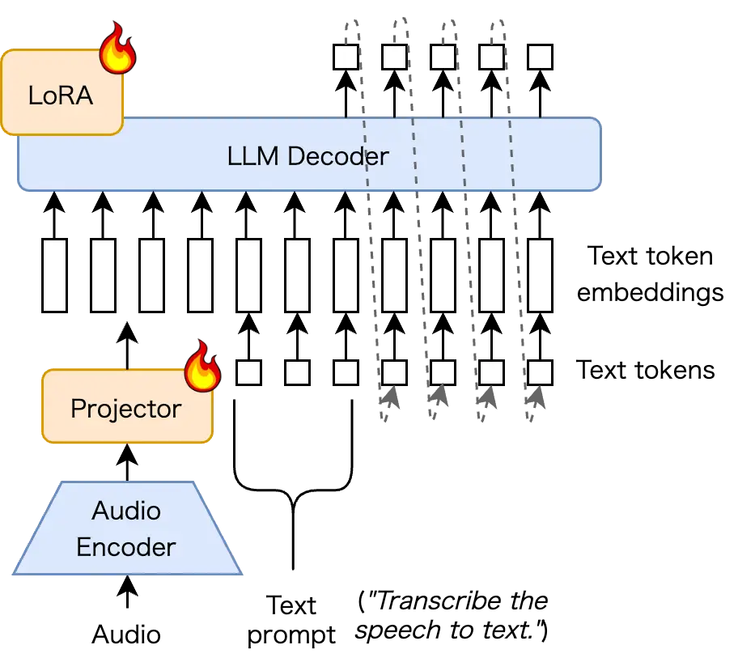
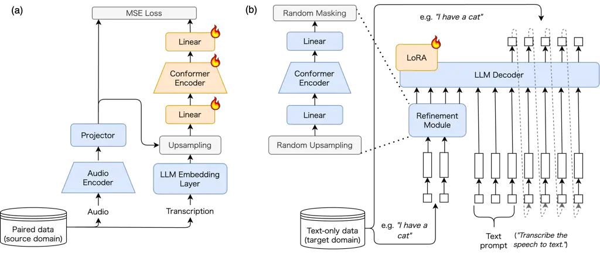

Magoshi Maekaku Shinohara

# Refining Pseudo-Audio Prompts with Speech-Text Alignment for Text-Only Domain Adaptation in LLM-Based ASR

Ryo    Takashi    Yusuke

###### Abstract

LLM-based automatic speech recognition models demonstrate strong
performance by connecting audio encoders and LLMs. However, data
scarcity of paired speech and transcription often hinders the adaptation
to new domains, making text-only domain adaptation crucial. Existing
methods typically rely on either fine-tuning the LLM alone or employing
pseudo-audio prompts. The former neglects essential acoustic context,
while the latter either suffers from limited scalability in data-scarce
conditions, or yields inexpressive prompts by leveraging only textual
features, ignoring audio modality. To address this, we propose a
framework that explicitly models speech-text alignment. Our method
efficiently generates highly expressive pseudo-audio prompts that bridge
the modality gap, enabling effective target-domain adaptation.
Experiments demonstrate that our approach outperforms existing text-only
methods, improving both overall error rates and out-of-vocabulary
coverage.

###### keywords

speech recognition, text-only domain adaptation, large language model

^(†)^(†)address: ¹ Graduate School of Informatics, Kyoto University,
Japan  
² LY Corporation, Japan ^(†)^(†)email:
magoshi@sap.ist.kyoto-u.ac.jp,tmaekaku,yusshino@lycorp.co.jp

## 1 Introduction

^(†)^(†) \* This work was done during an internship at LY Corporation.

Large Language Models (LLMs) equipped with speech understanding
abilities have demonstrated significant progress in recent years,
achieving high performance in speech-related tasks such as Automatic
Speech Recognition (ASR) \[1, 2, 3, 4, 5\], speech translation \[6, 2,
7, 3, 4\], and dialogue \[8, 9\]. As illustrated in Figure 1, these
architectures typically input representations from a pre-trained audio
encoder into a trainable projector. The projector output serves as an
audio prompt, providing acoustic information to the LLM.

In this study, we address text-only domain adaptation for ASR using an
LLM. ASR performance degrades under domain shift, yet target domains
sometimes lack paired audio-text data, motivating text-only adaptation.
Since collecting paired data for every new domain is impractical,
exploiting text data to transfer the LLM’s linguistic knowledge is
essential for rapid and scalable adaptation. Here, the source domain
provides paired speech-text data, while the target domain provides only
text for adaptation. We therefore first train the model on paired
source-domain data and then continue training using only target-domain
text for adaptation.

Unlike non-LLM ASR frameworks that require specialized architectures for
text-only domain adaptation \[10, 11, 12, 13, 14, 15, 16, 17\],
LLM-based ASR models adopt a loosely coupled architecture. Since the LLM
functions as a decoder distinct from the audio encoder, the model can be
effectively adapted to the target domain through fine-tuning of LLM with
target-domain text without modification of the architecture \[1\].

To perform text-only domain adaptation in LLM-based ASR, the absence of
audio input during adaptation must be addressed. Existing approaches are
categorized as follows:

- •
  LLM-only fine-tuning: Fine-tunes only the LLM to maximize the
  likelihood of the target-domain text \[18\]. While the pipeline is
  simple, adaptation is limited because it neglects the acoustic context
  (i.e., audio prompts) required for ASR, which induces modality
  mismatch.
- •
  Pseudo-audio prompt learning: Synthesizes pseudo-audio prompts from
  target-domain text to create pseudo-paired samples. This category is
  divided into two approaches:
  - –
    TTS-based synthesis: Generates pseudo-audio prompts using waveforms
    or mel-spectrogram features synthesized by Text-to-Speech (TTS)
    based systems \[19\]. While this yields high-quality prompts, it
    requires well-trained TTS models, limiting its scalability to
    multilingual or low-resource scenarios where such models are
    unavailable.
  - –
    Embedding-based synthesis: Constructs pseudo-audio prompts by
    manipulating text embeddings without speech synthesis \[13, 20\].
    Although this method does not require high-quality TTS systems,
    existing methods often do not sufficiently consider the output
    behavior of audio encoder and projector, resulting in suboptimal
    prompt quality.

In this study, we propose Text-Embedding-to-Speech-Latent (TE2SL), a
framework which enhances the embedding-based synthesis approach. The
core of TE2SL is a trainable module, which transforms text embeddings
into the latent space of audio prompts. The output of this module is a
more refined pseudo-audio prompt, which is aware of the characteristics
of the audio encoder and projector.

This architecture-aware refinement ensures that the synthesized
pseudo-audio prompts are expressive and modality-aligned, making the
approach scalable to various languages. Experimental results demonstrate
that TE2SL yields significant performance gains in both recognition
accuracy and coverage of target-domain out-of-vocabulary (OOV) tokens,
achieving more effective domain adaptation than existing methods.



Figure 1: Overview of the LLM-based ASR framework. The audio encoder and
projector generate audio prompts that are concatenated with token
embeddings and processed by the LLM.

## 2 Related Work

### 2.1 Text-only Fine-tuning without Audio Prompts

The most straightforward approach for domain adaptation involves
fine-tuning the LLM component using only target-domain text data \[18\].
Methods such as those designed for low-resource scenarios enable
adaptation without the use of audio prompts. While these approaches
allow the model to learn linguistic priors for the target domain, they
do not utilize pseudo-audio prompts during the adaptation phase.
Consequently, a modality mismatch occurs during inference when audio
prompts are reintroduced, as the adaptation process fails to account for
the acoustic context.

### 2.2 Pseudo-Audio Prompt Generation

To mitigate the modality mismatch, several researchers have proposed
synthesizing pseudo-audio prompts from text data to simulate paired
training.

Bataev et al. \[19\] introduced a mel-spectrogram generator to
synthesize high-quality acoustic features for text-only domain
adaptation. Despite achieving significant performance gains, the method
relies on a pre-trained generator derived from TTS modules. This
dependency limits its applicability to languages or domains where
high-quality TTS systems are unavailable, making it difficult to scale
across diverse settings.

Ma et al. \[20\] employ a trainable soft prompt that remains constant
during adaptation of LLM-based ASR. Although this ensures the presence
of a prompt during training, these representations fail to reflect the
characteristics of individual data samples or the audio encoder and
projector pipeline.

Sainath et al. \[13\] upsample and mask text embeddings in order to
align with speech representations. Although this method does not adopt
LLM-based ASR, synthesizing pseudo-audio prompts by upsampling and
masking text embeddings can be applied to LLM-based ASR, and Ma et
al. \[20\] use it as a comparison baseline. While these approaches
successfully reflect data-sample characteristics, they do not
incorporate the specific behaviors of the audio encoder and projector.

| Method                       | Pseudo Prompt | Sample- dependent | Enc/Proj- aware |
| ---------------------------- | ------------- | ----------------- | --------------- |
| Text-only FT \[18\]          | No            | –                 | –               |
| Soft Prompt \[20\]           | ✓             | No                | No              |
| Upsample-and-Mask \[13, 20\] | ✓             | ✓                 | No              |
| Proposed                     | ✓             | ✓                 | ✓               |

Table 1: Comparison of text-only domain adaptation methods for LLM-based
ASR. ✓ and – indicate the presence or absence of each feature,
respectively. “Sample-dependent” indicates whether the pseudo prompts
reflect individual data-sample characteristics, while “Enc/Proj-aware”
indicates whether the pseudo-audio prompt reflects the specific output
characteristics of the audio encoder and projector pipeline.

As summarized in Table 1, while previous non-TTS methods have progressed
toward sample-dependent synthesis, they remain agnostic to the
characteristics of the audio encoder and projector output. Neglecting
these modular characteristics leads to pseudo-audio prompts that are
insufficiently expressive for ASR tasks. Our proposed method is the
first to address this by synthesizing pseudo-audio prompts that reflect
both the individual data-sample characteristics and the output
properties of the audio encoder and projector pipeline.

## 3 Methods

### 3.1 LLM-based ASR

We follow an LLM-based ASR framework where the LLM is conditioned on an
acoustic representation \[1\]. Let $`D`$ be the embedding dimension of
the LLM, $`L`$ be the length of the transcription, and
$`L_{\text{inst}}`$ be the length of the instruction tokens. Let $`T`$
and $`C`$ be the sequence length and feature dimension of the audio
encoder output, and $`T^{\prime}`$ be the sequence length of the audio
prompt. In this architecture, the input to the LLM is divided into a
prompt, which consists of an audio prompt
$`\mathbf{Z}\in\mathbb{R}^{T^{\prime}\times D}`$ and a text instruction
prompt
$`\mathbf{E}_{\text{inst}}\in\mathbb{R}^{L_{\text{inst}}\times D}`$, and
the target transcription tokens $`\mathbf{y}=(y_{1},\dots,y_{L})`$.

Figure 1 illustrates the overall architecture. Given an input audio
waveform $`\mathbf{x}`$, the audio prompt $`\mathbf{Z}`$ is generated
through the audio encoder and projector as follows:

```math
\displaystyle\mathbf{H} \displaystyle=\mathrm{AudioEncoder}(\mathbf{x})\in\mathbb{R}^{T\times C}, \tag{1}
```

```math
\displaystyle\tilde{\mathbf{H}} \displaystyle=\mathrm{FrameStacking}(\mathbf{H})\in\mathbb{R}^{T^{\prime}\times(C\cdot k)},
```

```math
\displaystyle\mathbf{Z} \displaystyle=\mathrm{Projector}(\tilde{\mathbf{H}})\in\mathbb{R}^{T^{\prime}\times D}.
```

where $`k`$ is the factor for frame stacking, resulting in a downsampled
length $`T^{\prime}=\lfloor T/k\rfloor`$.

The LLM processes the concatenated sequence formed by prefixing the
prompt $`[\mathbf{Z};\mathbf{E}_{\text{inst}}]`$ with the embeddings of
the previously generated tokens
$`\mathbf{E}_{<t}=\mathrm{TokenEmbed}(\mathbf{y}_{<t})\in\mathbb{R}^{(t-1)\times D}`$.
The probability of the next transcription token $`y_{t}`$ is predicted
based on this combined sequence:

```math
p(y_{t}\mid\mathbf{Z},\mathbf{E}_{\text{inst}},\mathbf{y}_{<t})=\mathrm{LLM}\big([\mathbf{Z};\mathbf{E}_{\text{inst}};\mathbf{E}_{<t}]\big). \tag{2}
```

### 3.2 Upsample-and-Mask Baseline

In the LLM-based ASR framework, audio prompts are projected into the LLM
token embedding space, making audio prompts become similar to the
corresponding transcription token embeddings \[1\]. This alignment makes
target-domain token embeddings a reasonable proxy for constructing
pseudo-audio prompts in text-only domain adaptation. Consequently, the
upsample-and-mask \[13, 20\] method, which transforms text embeddings
into pseudo-audio prompts through upsampling and masking regularization,
is a compelling approach:

```math
\displaystyle\mathbf{E} \displaystyle=\mathrm{TokenEmbed}(\mathbf{y})\in\mathbb{R}^{L\times D}, \tag{3}
```

```math
\displaystyle\tilde{\mathbf{E}} \displaystyle=\mathrm{Upsample}(\mathbf{E};T)\in\mathbb{R}^{L^{\prime}\times D},
```

```math
\displaystyle\mathbf{Z} \displaystyle=\mathrm{Mask}(\tilde{\mathbf{E}})\in\mathbb{R}^{L^{\prime}\times D}.
```

Here, $`\mathrm{Mask}(\cdot)`$ zeros out the segments along the time
axis, and $`L^{\prime}`$ denotes the length of the upsampled token
embeddings.

However, such heuristic transformations often yield suboptimal prompts
because they rely on heuristic manipulations of text embeddings. A
critical limitation is their lack of awareness regarding the intrinsic
output characteristics of the audio encoder and projector. Even though
text token embeddings are close to audio prompts in the shared space, a
non-negligible modality gap remains between the two.

### 3.3 Proposed Method

To address these limitations, we propose Text-Embedding-to-Speech-Latent
(TE2SL). TE2SL is similar to the upsample-and-mask method, but inserts a
learnable refinement module between upsampling and masking; the module
transforms upsampled token embeddings so that they resemble audio
prompts more closely, enabling higher-quality pseudo-audio prompts.



Figure 2: Overview of TE2SL. (a) Training phase: the refinement module
learns alignment from LLM token embeddings to audio prompts with
pre-trained audio encoder/projector characteristics. (b) Domain
adaptation phase: the refinement module is freezed. Text embeddings are
randomly upsampled, transformed via the refinement module, and
time-masked to generate pseudo-audio prompts.

Figure 2 summarizes the overall TE2SL pipeline. The core of TE2SL is a
lightweight refinement module composed of a Conformer \[21\] encoder and
two linear layers. By transforming text embeddings into the latent space
of audio prompts, the module ensures that the synthesized features are
modality-aligned. This design allows the pseudo-audio prompts to reflect
the output characteristics of the audio encoder and projector.

During training, the module is optimized to minimize the discrepancy
between synthesized pseudo-audio prompts and ground-truth audio prompts
derived from the audio encoder and projector pipeline. Input text
embeddings are first upsampled to match the frame length of the real
audio prompts to ensure temporal alignment. Subsequently, the refinement
module processes these upsampled embeddings to generate pseudo-audio
prompts. The training objective is defined by a frame-wise Mean Squared
Error (MSE) loss, calculated between the generated prompts and the
ground-truth audio prompts.

During the domain adaptation phase (referred to as inference for TE2SL),
audio data is unavailable. Therefore, embeddings of target-domain text
are randomly upsampled before being processed by the trained TE2SL
module, similar to upsample-and-mask method. The output from the
refinement module is masked along the time axis for regularization.

## 4 Experiments

In this section, we evaluate the effectiveness of TE2SL through
text-only domain adaptation experiments. To demonstrate the impact of
our architecture-aware pseudo-audio prompts, we compared TE2SL against
three representative strategies summarized in Table 1: (1) the
non-adapted Baseline, (2) Soft Prompt \[20\], and (3)
Upsample-and-Mask \[13, 20\]. All experiments were conducted in two
language domains, English and Japanese, to ensure the generalizability
of our method.

### 4.1 Model Architecture

The LLM-based ASR framework utilized in this study consists of an audio
encoder, a projector, and an LLM.

- •
  Audio Encoder: We used WavLM-Large \[22\], which remained frozen
  during the training and adaptation phases.
- •
  Projector: The projector consists of a frame stacking layer followed
  by two 3072-dimensional linear layers and ReLU \[23\] activations. The
  frame stacking performs 1/5 downsampling, yielding audio prompts of 10
  Hz.
- •
  LLM: We employed instruction-tuned Llama-3.2 \[24\] 3B¹¹ 1
  [https://huggingface.co/meta-llama/Llama-3.2-3B-Instruct](https://huggingface.co/meta-llama/Llama-3.2-3B-Instruct)
  as the LLM. For parameter-efficient fine-tuning, we applied Low-Rank
  Adaptation (LoRA) \[25\] to the query and value projection matrices
  with rank $`r=8`$ and $`\alpha=16`$.

For the TE2SL refinement module, we used a 16-layer Conformer \[21\]
with a hidden size of 256. The module is implemented as a Conformer
encoder with input/output linear projections and has 18.6M parameters in
total.

### 4.2 Data Configuration

We evaluated the proposed method across three domain adaptation
scenarios in English and Japanese. In each case, the model was first
trained on paired source-domain data and subsequently adapted using
text-only data from the target domain. Table 2 summarizes the dataset
statistics. For the English experiments, we used LibriSpeech \[26\],
consisting of read audiobook speech, as the source domain. We considered
two distinct target domains to verify generalizability:
SPGISpeech \[27\], which comprises financial earnings-call speech, and
SlideSpeech \[28\], a corpus of presentation recordings²² 2 While
SlideSpeech is an audio-visual corpus, we do not use the visual modality
for our experiments.. For Japanese, we employed the Spontaneous Speech
(SPS) portion of the Corpus of Spontaneous Japanese (CSJ) \[29\] as the
source domain. The target domain for adaptation was the Academic
Presentation Speech (APS) portion of the CSJ. Performance on the
Japanese target domain was assessed using the official eval1 and eval2
test sets, both of which correspond to the APS domain.

| Language | Source      | Hours | Target      | \#Samples |
| -------- | ----------- | ----- | ----------- | --------- |
| English  | LibriSpeech | 960h  | SPGISpeech  | 1.93M     |
|          | LibriSpeech | 960h  | SlideSpeech | 482k      |
| Japanese | CSJ (SPS)   | 257h  | CSJ (APS)   | 130k      |

Table 2: Data configuration for source domain training and target-domain
adaptation. “Hours” denotes the total duration of paired audio-text data
used for source training, and “#Samples” represents the number of
text-only sentences used for target-domain adaptation.

| Source                       | LibriSpeech       |                                | LibriSpeech       |                                | CSJ (SPS)         |                                | CSJ (SPS)         |                                |
| ---------------------------- | ----------------- | ------------------------------ | ----------------- | ------------------------------ | ----------------- | ------------------------------ | ----------------- | ------------------------------ |
| Target                       | SPGISpeech        |                                | SlideSpeech       |                                | CSJ (eval1)       |                                | CSJ (eval2)       |                                |
| Method                       | WER$`\downarrow`$ | Rec$`{}_{\text{OOV}}\uparrow`$ | WER$`\downarrow`$ | Rec$`{}_{\text{OOV}}\uparrow`$ | CER$`\downarrow`$ | Rec$`{}_{\text{OOV}}\uparrow`$ | CER$`\downarrow`$ | Rec$`{}_{\text{OOV}}\uparrow`$ |
| Baseline                     | 11.1              | 39.4                           | 17.0              | 50.8                           | 21.5              | 15.7                           | 20.2              | 15.6                           |
| Soft Prompt \[20\]           | 11.1              | 39.3                           | 16.4              | 50.7                           | 21.0              | 16.2                           | 19.9              | 16.5                           |
| Upsample-and-Mask \[13, 20\] | 9.1               | 45.6                           | 16.3              | 51.0                           | 21.5              | 16.2                           | 19.4              | 16.4                           |
| Proposed (TE2SL)             | 8.5               | 50.1                           | 14.0              | 57.3                           | 19.6              | 19.7                           | 17.5              | 21.0                           |

Table 3: Recognition performance and OOV recall across domain adaptation
tasks. Word Error Rate (WER, %) and Character Error Rate (CER, %)
represent recognition accuracy, while $`\mathrm{Rec}_{\mathrm{OOV}}`$
(%) denotes out-of-vocabulary recall.

### 4.3 Training and Optimization

We trained on the source-domain data and then adapted using the
target-domain text-only data. All experiments used AdamW \[30\] with
$`\beta_{1}=0.9`$, $`\beta_{2}=0.999`$, and weight decay 0.001. We
extended ESPnet \[31\] for source-domain pre-training and target-domain
text-only adaptation, using dynamic batching with batch bins. For the
Baseline, we used a learning rate (LR) of $`3\times 10^{-4}`$ with
$`200`$M batch bins. Upsample-and-Mask was adapted with an LR of
$`1\times 10^{-5}`$ and $`200`$M batch bins. For Soft Prompt, the prompt
learning phase used an LR of $`1\times 10^{-4}`$ with $`250`$M batch
bins for 10 epochs, followed by an adaptation phase with an LR of
$`1\times 10^{-5}`$ and $`250`$M batch bins. For TE2SL, the refinement
module was trained with an LR of $`4\times 10^{-4}`$ and a batch size of
32, and domain adaptation was then performed with an LR of
$`5\times 10^{-5}`$ and $`200`$M batch bins.

### 4.4 Evaluation Setup

We measured performance using Word Error Rate (WER) for English and
Character Error Rate (CER) for Japanese. We also calculated token-based
OOV recall ($`\mathrm{Rec}_{\mathrm{OOV}}`$) to evaluate how well
target-domain vocabulary not seen in the source domain was recovered.
The English tokens were words delimited by whitespaces, and the Japanese
tokens were morphemes segmented by MeCab \[32\]. We built the
source-domain vocabulary from the training text, and for each utterance,
we filtered reference and hypothesis tokens to those not in that
vocabulary. We then computed a Levenshtein alignment on the filtered
sequences and defined $`\mathrm{Rec}_{\mathrm{OOV}}=\frac{N-S-D}{N}`$,
where $`N`$ is the number of reference OOV tokens and $`S`$/$`D`$ are
substitutions/deletions in the OOV alignment (insertions are ignored).
Training for each phase continued until the validation error rate
saturated. The checkpoint with the minimum validation WER or CER was
selected for the evaluation. For the soft prompt learning stage
specifically, we used a fixed training duration of 10 epochs for
SPGISpeech, and 20 epochs for CSJ (APS).

### 4.5 Experimental Results

Target-domain evaluation results for English (SPGISpeech, SlideSpeech)
and Japanese (CSJ eval1/eval2)³³ 3 WavLM, pre-trained only on English,
was used for the Japanese CSJ tasks to maintain consistency. Also, only
the SPS portion was used for the baseline training \[33\]: these are
likely to account for the degraded baseline performance. are summarized
in Table 3. The proposed TE2SL method consistently achieved the best
recognition accuracy and the highest OOV Recall in all of the settings.
This demonstrates that our approach not only improves ASR performance
but also enhances the model’s ability to recover OOV tokens. In
comparison to the Upsample-and-Mask baseline, the proposed method
yielded substantial gains in both accuracy and OOV Recall. This suggests
that the inclusion of a learnable refinement module effectively bridges
the modality gap by aligning pseudo-audio prompts with the specific
characteristics of the audio encoder and projector. While Soft Prompt
showed marginal improvements on the CSJ tasks, its gains are limited
compared to pseudo-audio prompt methods, highlighting the importance of
sample-dependent acoustic conditioning for effective text-only
adaptation.

## 5 Conclusion

In this paper, we addressed text-only domain adaptation for LLM-based
ASR by proposing Text-Embedding-to-Speech-Latent (TE2SL). Unlike methods
relying only on heuristic embedding manipulation, TE2SL employs a
learnable Conformer-based refinement module. This module synthesizes
pseudo-audio prompts that are both sample-dependent and aware of the
specific characteristics of the audio encoder and projector pipeline.
Experimental results across English and Japanese datasets demonstrated
that TE2SL consistently outperforms existing text-only adaptation
strategies. Our method achieved significant improvements not only in
overall recognition accuracy (WER and CER) but also in OOV Recall,
indicating its superior ability to recover domain-specific vocabulary.
These findings highlight that explicitly modeling the specific output
characteristics of the audio encoder and projector pipeline is effective
for bridging the modality gap during text-only adaptation.

## 6 Generative AI Use Disclosure

During the preparation of this work, the authors used generative AI
tools for the purpose of editing and polishing the manuscript to improve
linguistic clarity and grammatical correctness. The authors reviewed and
edited the content as needed and take full responsibility for the final
version and content of the paper.

## References

- \[1\] Y. Fathullah, C. Wu, E. Lakomkin, J. Jia, Y. Shangguan, K.
  Li, J. Guo, W. Xiong, J. Mahadeokar, O. Kalinli, C. Fuegen, and M.
  Seltzer (2024) Prompting large language models with speech recognition
  abilities. In ICASSP, Vol. , pp. 13351–13355. External Links:
  [Document](https://dx.doi.org/10.1109/ICASSP48485.2024.10447605) Cited
  by: §1, §1, §3.1, §3.2.
- \[2\] P. K. Rubenstein, C. Asawaroengchai, D. D. Nguyen, A. Bapna, Z.
  Borsos, F. de Chaumont Quitry, P. Chen, D. E. Badawy, W. Han, E.
  Kharitonov, et al. (2023) AudioPaLM: a large language model that can
  speak and listen. External Links: 2306.12925,
  [Link](https://arxiv.org/abs/2306.12925) Cited by: §1.
- \[3\] C. Tang, W. Yu, G. Sun, X. Chen, T. Tan, W. Li, L. Lu, Z. Ma,
  and C. Zhang (2024) SALMONN: towards generic hearing abilities for
  large language models. In ICLR, Cited by: §1.
- \[4\] S. Hu, L. Zhou, S. Liu, S. Chen, L. Meng, H. Hao, J. Pan, X.
  Liu, J. Li, S. Sivasankaran, et al. (2024) WavLLM: towards robust and
  adaptive speech large language model. In Findings of EMNLP,
  pp. 4552–4572. External Links:
  [Document](https://dx.doi.org/10.18653/v1/2024.findings-emnlp.263)
  Cited by: §1.
- \[5\] Z. Ma, G. Yang, Y. Yang, Z. Gao, J. Wang, Z. Du, F. Yu, Q.
  Chen, S. Zheng, S. Zhang, and X. Chen (2024) An embarrassingly simple
  approach for llm with strong asr capacity. External Links: 2402.08846,
  [Link](https://arxiv.org/abs/2402.08846) Cited by: §1.
- \[6\] J. Wu, Y. Gaur, Z. Chen, L. Zhou, Y. Zhu, T. Wang, J. Li, S.
  Liu, B. Ren, L. Liu, and Y. Wu (2023) On decoder-only architecture for
  speech-to-text and large language model integration. In ASRU, Vol. ,
  pp. 1–8. External Links:
  [Document](https://dx.doi.org/10.1109/ASRU57964.2023.10389705) Cited
  by: §1.
- \[7\] M. Wang, W. Han, I. Shafran, Z. Wu, C. Chiu, Y. Cao, N. Chen, Y.
  Zhang, H. Soltau, P. K. Rubenstein, L. Zilka, D. Yu, G. Pundak, N.
  Siddhartha, J. Schalkwyk, and Y. Wu (2023) SLM: bridge the thin gap
  between speech and text foundation models. In ASRU, Vol. , pp. 1–8.
  External Links:
  [Document](https://dx.doi.org/10.1109/ASRU57964.2023.10389703) Cited
  by: §1.
- \[8\] Z. Kong, A. Goel, R. Badlani, W. Ping, R. Valle, and B.
  Catanzaro (2024) Audio Flamingo: a novel audio language model with
  few-shot learning and dialogue abilities. In ICML, Cited by: §1.
- \[9\] Q. Fang, S. Guo, Y. Zhou, Z. Ma, S. Zhang, and Y. Feng (2025)
  LLaMA-Omni: seamless speech interaction with large language models. In
  ICLR, Cited by: §1.
- \[10\] S. Thomas, B. Kingsbury, G. Saon, and H. J. Kuo (2022)
  Integrating text inputs for training and adapting RNN transducer ASR
  models. In ICASSP, Vol. , pp. 8127–8131. External Links:
  [Document](https://dx.doi.org/10.1109/ICASSP43922.2022.9747862) Cited
  by: §1.
- \[11\] Z. Meng, Y. Gaur, N. Kanda, J. Li, X. Chen, Y. Wu, and Y.
  Gong (2022) Internal language model adaptation with text-only data for
  end-to-end speech recognition. In Interspeech, pp. 2608–2612. External
  Links: [Document](https://dx.doi.org/10.21437/Interspeech.2022-13),
  ISSN 2958-1796 Cited by: §1.
- \[12\] C. Chen, X. Gong, and Y. Qian (2023) Efficient text-only domain
  adaptation for CTC-based ASR. In ASRU, Vol. , pp. 1–7. External Links:
  [Document](https://dx.doi.org/10.1109/ASRU57964.2023.10389682) Cited
  by: §1.
- \[13\] T. N. Sainath, R. Prabhavalkar, A. Bapna, Y. Zhang, Z. Huo, Z.
  Chen, B. Li, W. Wang, and T. Strohman (2023) JOIST: a joint speech and
  text streaming model for asr. In SLT, Vol. , pp. 52–59. External
  Links: [Document](https://dx.doi.org/10.1109/SLT54892.2023.10022774)
  Cited by: 2nd item, §1, §2.2, Table 1, §3.2, Table 3, §4.
- \[14\] Z. Chen, Y. Zhang, A. Rosenberg, B. Ramabhadran, P. J.
  Moreno, A. Bapna, and H. Zen (2022) MAESTRO: matched speech text
  representations through modality matching. In Interspeech,
  pp. 4093–4097. External Links:
  [Document](https://dx.doi.org/10.21437/Interspeech.2022-10937), ISSN
  2958-1796 Cited by: §1.
- \[15\] B. Li, D. Hwang, Z. Huo, J. Bai, G. Prakash, T. N. Sainath, K.
  Chai Sim, Y. Zhang, W. Han, T. Strohman, and F. Beaufays (2023)
  Efficient domain adaptation for speech foundation models. In ICASSP,
  Vol. , pp. 1–5. External Links:
  [Document](https://dx.doi.org/10.1109/ICASSP49357.2023.10096330) Cited
  by: §1.
- \[16\] J. Zhu, W. Tong, Y. Xu, C. Song, Z. Wu, Z. You, D. Su, D. Yu,
  and H. Meng (2023) Text-only domain adaptation for end-to-end speech
  recognition through down-sampling acoustic representation. In
  Interspeech, pp. 1334–1338. External Links:
  [Document](https://dx.doi.org/10.21437/Interspeech.2023-1378), ISSN
  2958-1796 Cited by: §1.
- \[17\] W. Wang, X. Gong, H. Shao, D. Yang, and Y. Qian (2023) Text
  only domain adaptation with phoneme guided data splicing for
  end-to-end speech recognition. In Interspeech, pp. 3347–3351. External
  Links: [Document](https://dx.doi.org/10.21437/Interspeech.2023-1349),
  ISSN 2958-1796 Cited by: §1.
- \[18\] Y. Fang, J. Peng, X. Li, Y. Xi, C. Zhang, G. Zhong, and K.
  Yu (2025) Low-resource domain adaptation for speech llms via text-only
  fine-tuning. External Links: 2506.05671,
  [Link](https://arxiv.org/abs/2506.05671) Cited by: 1st item, §2.1,
  Table 1.
- \[19\] V. Bataev, R. Korostik, E. Shabalin, V. Lavrukhin, and B.
  Ginsburg (2023) Text-only domain adaptation for end-to-end ASR using
  integrated text-to-mel-spectrogram generator. In Interspeech,
  pp. 2928–2932. External Links:
  [Document](https://dx.doi.org/10.21437/Interspeech.2023-906), ISSN
  2958-1796 Cited by: 1st item, §2.2.
- \[20\] Y. Ma, Z. Liu, and O. Kalinli (2024) Effective text adaptation
  for llm-based asr through soft prompt fine-tuning. In SLT, Vol. ,
  pp. 64–69. External Links:
  [Document](https://dx.doi.org/10.1109/SLT61566.2024.10832227) Cited
  by: 2nd item, §2.2, §2.2, Table 1, Table 1, §3.2, Table 3, Table 3,
  §4.
- \[21\] A. Gulati, J. Qin, C. Chiu, N. Parmar, Y. Zhang, J. Yu, W.
  Han, S. Wang, Z. Zhang, Y. Wu, and R. Pang (2020) Conformer:
  convolution-augmented transformer for speech recognition. In
  Interspeech, pp. 5036–5040. External Links:
  [Document](https://dx.doi.org/10.21437/Interspeech.2020-3015), ISSN
  2958-1796 Cited by: §3.3, §4.1.
- \[22\] S. Chen, C. Wang, Z. Chen, Y. Wu, S. Liu, Z. Chen, J. Li, N.
  Kanda, T. Yoshioka, X. Xiao, J. Wu, L. Zhou, S. Ren, Y. Qian, Y.
  Qian, J. Wu, M. Zeng, X. Yu, and F. Wei (2022) WavLM: large-scale
  self-supervised pre-training for full stack speech processing. JSTSP
  16 (6), pp. 1505–1518. External Links:
  [Document](https://dx.doi.org/10.1109/JSTSP.2022.3188113) Cited by:
  1st item.
- \[23\] V. Nair and G. E. Hinton (2010) Rectified linear units improve
  restricted boltzmann machines. In ICML, pp. 807–814. Cited by: 2nd
  item.
- \[24\] A. Grattafiori, A. Dubey, A. Jauhri, A. Pandey, A. Kadian, A.
  Al-Dahle, A. Letman, A. Mathur, A. Schelten, A. Vaughan, et al. (2024)
  The Llama 3 herd of models. External Links: 2407.21783,
  [Link](https://arxiv.org/abs/2407.21783) Cited by: 3rd item.
- \[25\] E. J. Hu, yelong shen, P. Wallis, Z. Allen-Zhu, Y. Li, S.
  Wang, L. Wang, and W. Chen (2022) LoRA: low-rank adaptation of large
  language models. In ICLR, Cited by: 3rd item.
- \[26\] V. Panayotov, G. Chen, D. Povey, and S. Khudanpur (2015)
  Librispeech: an asr corpus based on public domain audio books. In
  ICASSP, Vol. , pp. 5206–5210. External Links:
  [Document](https://dx.doi.org/10.1109/ICASSP.2015.7178964) Cited by:
  §4.2.
- \[27\] P. K. O’Neill, V. Lavrukhin, S. Majumdar, V. Noroozi, Y.
  Zhang, O. Kuchaiev, J. Balam, Y. Dovzhenko, K. Freyberg, M. D.
  Shulman, B. Ginsburg, S. Watanabe, and G. Kucsko (2021) SPGISpeech:
  5,000 hours of transcribed financial audio for fully formatted
  end-to-end speech recognition. In Interspeech, pp. 1434–1438. External
  Links: [Document](https://dx.doi.org/10.21437/Interspeech.2021-1860),
  ISSN 2958-1796 Cited by: §4.2.
- \[28\] H. Wang, F. Yu, X. Shi, Y. Wang, S. Zhang, and M. Li (2024)
  SlideSpeech: a large scale slide-enriched audio-visual corpus. In
  ICASSP, Vol. , pp. 11076–11080. External Links:
  [Document](https://dx.doi.org/10.1109/ICASSP48485.2024.10448079) Cited
  by: §4.2.
- \[29\] K. Maekawa (2003) Corpus of spontaneous japanese: its design
  and evaluation. In ISCA/IEEE Workshop on Spontaneous Speech Processing
  and Recognition (SSPR), pp. 7–12. Cited by: §4.2.
- \[30\] I. Loshchilov and F. Hutter (2019) Decoupled weight decay
  regularization. In ICLR, Cited by: §4.3.
- \[31\] S. Watanabe, T. Hori, S. Karita, T. Hayashi, J. Nishitoba, Y.
  Unno, N. Enrique Yalta Soplin, J. Heymann, M. Wiesner, N. Chen, A.
  Renduchintala, and T. Ochiai (2018) ESPnet: end-to-end speech
  processing toolkit. In Interspeech, pp. 2207–2211. External Links:
  [Document](https://dx.doi.org/10.21437/Interspeech.2018-1456), ISSN
  2958-1796 Cited by: §4.3.
- \[32\] T. Kudo, K. Yamamoto, and Y. Matsumoto (2004) Applying
  conditional random fields to japanese morphological analysis. In
  EMNLP, pp. 230–237. Cited by: §4.4.
- \[33\] S. Ueno, M. Mimura, S. Sakai, and T. Kawahara (2019)
  Multi-speaker sequence-to-sequence speech synthesis for data
  augmentation in acoustic-to-word speech recognition. In ICASSP, Vol. ,
  pp. 6161–6165. External Links:
  [Document](https://dx.doi.org/10.1109/ICASSP.2019.8682816) Cited by:
  footnote 3.
