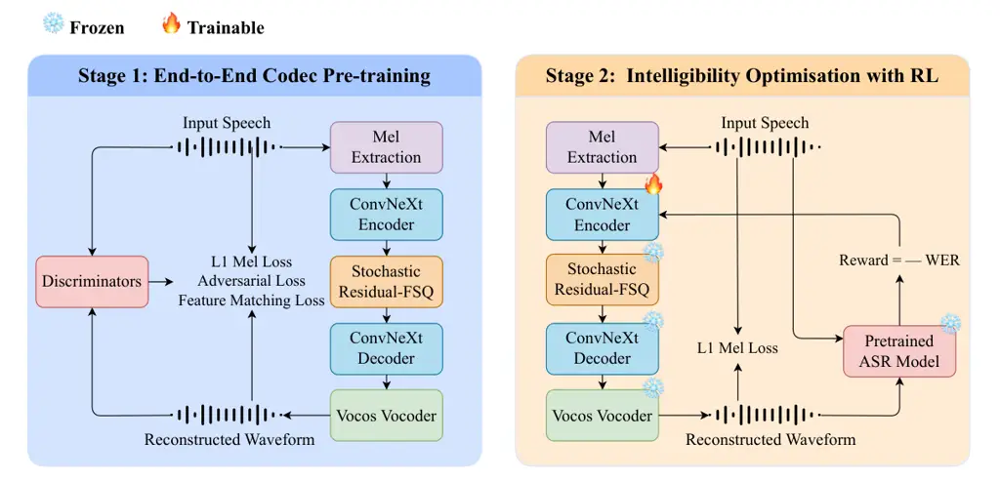

# Optimising Neural Speech Codecs for 300 bps Communication Using Reinforcement Learning

Junyi Wang^(1,\*), Chi Zhang^(1,\*), Jing Qian², Haifeng Luo², Hao
Wang², Zengrui Jin¹, and Chao Zhang^(1,†) Affiliation: ¹Tsinghua
University, China  
²Huawei Technologies Co., Ltd, China  
^(\*)Equal contribution   ^(†)Corresponding author  
junyiwa22@163.com, zc2215049@gmail.com, qianjing3@huawei.com,  
luohaifeng1@huawei.com, hunter.wanghao@huawei.com,  
zrjin@tsinghua.edu.cn, cz277@tsinghua.edu.cn

###### Abstract

In bandwidth-constrained communication such as satellite and underwater
channels, speech must often be transmitted at ultra-low bitrates where
intelligibility is the primary objective. At such extreme compression
levels, codecs trained with acoustic reconstruction losses tend to
allocate bits to perceptual detail, leading to substantial degradation
in word error rate (WER). This paper proposes ClariCodec, a neural
speech codec operating at 300 bits per second (bps) that reformulates
quantisation as a stochastic policy, enabling reinforcement learning
(RL)-based optimisation of intelligibility. Specifically, the encoder is
fine-tuned using WER-driven rewards while the acoustic reconstruction
pipeline remains frozen. Even without RL, ClariCodec achieves 4.64% WER
on the LibriSpeech test-clean set at 300 bps, already competitive with
codecs operating at higher bitrates. Further RL fine-tuning reduces WER
to 3.55% on test-clean, corresponding to a 23.5% relative reduction
while preserving perceptual quality. In addition, we adapt ClariCodec to
a streaming configuration and show that the proposed RL-based
optimisation remains effective under streaming constraints, achieving
4.53% WER on test-clean with a theoretical latency of 374 ms.

###### Index Terms: 

Neural speech codec, ultra-low bitrate, reinforcement learning, speech
intelligibility

## I Introduction

In bandwidth-constrained and reliability-limited environments such as
satellite and underwater communication, the available transmission
capacity may be restricted to only a few hundred bits per second (bps)
\[1, 2\]. Under such conditions, the objective of speech coding shifts
from preserving waveform fidelity to ensuring speech intelligibility,
where the reliable recovery of linguistic content becomes the primary
criterion for success. This constraint motivates the development of
ultra-low-bitrate coding strategies that prioritise semantic clarity
while reducing the need to reconstruct fine-grained acoustic details.

The integration of neural network models into speech coding has led to
the development of neural speech codecs \[3, 4\], which represent audio
signals as compact discrete token sequences for efficient transmission
at substantially reduced bitrates. Most such studies follow an
encoder-quantizer-decoder architecture, where the encoder maps the input
waveform to a latent representation, a quantisation module such as
residual vector quantisation or finite scalar quantisation (FSQ) \[5\]
discretises it into tokens, and the decoder reconstructs an approximate
waveform. Recent neural speech codecs have substantially improved
perceptual quality at low bitrates.

However, model structures and training paradigms remain largely rooted
in waveform reconstruction objectives. High-fidelity codecs primarily
focus on preserving fine-grained acoustic detail by improving vector
quantisation schemes \[6, 7, 8, 9, 10, 11, 12, 13\], model structures
\[6, 14, 7, 15, 16, 17, 18, 19, 20, 21, 22, 23, 9, 24, 25, 26, 27, 28,
13, 29, 30\], or explicit feature disentanglement \[31, 32, 33, 34, 35,
30\]. A parallel line of work has explored semantic codecs, which aim to
preserve linguistic content by leveraging representations derived from
self-supervised learning \[31, 35, 26, 36, 37, 28, 13, 29, 38, 39, 40,
41, 42\], automatic speech recognition (ASR) \[43, 27\] or language
models \[38, 44\]. Despite these advances, both paradigms face
increasing limitations as the bitrate approaches the few-hundred-bps
condition. In this extreme compression setting, the allocation of bits
often becomes misaligned with the information that is most critical for
intelligibility, leading to inefficient use of the already scarce
transmission budget.

This challenge can be interpreted through the lens of the information
bottleneck principle \[45\]. Spoken language contains substantial
statistical redundancy \[46\], which implies that the information
required to convey linguistic meaning is far smaller than the full
acoustic signal bandwidth \[47\]. In the extreme compression range of
around 300 bps, an effective codec must therefore learn representations
that remove acoustically redundant detail while retaining the minimal
information necessary for intelligible speech recovery. Conventional
reconstruction objectives, including mel-spectrogram $`L_{1}`$ losses
and adversarial waveform losses, do not enforce this property. These
losses prioritise acoustic similarity, whereas the automatic evaluation
of intelligibility commonly uses WER, which is a discrete and
non-differentiable metric. As a result, current training paradigms
struggle to align bitrate allocation with the information most critical
for linguistic decoding.

Beyond bitrate and intelligibility, practical speech communication
systems must also operate with low latency. Many existing neural speech
codecs rely on substantial future context, preventing streaming
operation and introducing unacceptable latency in interactive
communication. Although several studies have developed causal or
streaming codecs \[23, 14, 37\], preserving intelligibility under both
streaming constraints and extreme compression remains underexplored.
Achieving intelligible ultra-low-bitrate speech coding under restricted
future context therefore remains an important challenge.

To this end, we propose ClariCodec, a neural speech codec designed for
extreme compression at 300 bps, and further develop a streaming variant
for low-latency operation.¹¹ 1 Audio samples and source code are
publicly available at https://demo941.github.io/claricodec-demo-page/
and https://github.com/demo941/ClariCodec, respectively. Both variants
utilise a two-stage training strategy: an initial reconstruction-based
pre-training phase employing improved FSQ \[48\] to establish a stable
discrete representation, followed by an RL fine-tuning stage. In the
second stage, we introduce stochastic FSQ, which reformulates the
deterministic quantisation grid as a stochastic policy through
distance-based probabilistic mapping. Using group relative policy
optimisation (GRPO) \[49\], ClariCodec enables direct optimisation
against non-differentiable WER reward within a frozen acoustic pipeline.
This approach achieves superior semantic alignment without sacrificing
perceptual quality. For streaming operation, ClariCodec uses causal,
state-cached modules together with limited latent look-ahead, enabling
streaming encoding and decoding with bounded algorithmic delay.
Experiments on LibriSpeech \[50\] demonstrate that RL-based optimisation
yields a consistent $`\sim`$23% relative WER reduction on test-clean,
outperforming codecs operating at substantially higher bitrates in terms
of intelligibility. The streaming variant also benefits from RL
fine-tuning, reducing WER from 6.63% to 4.53% on test-clean with a
theoretical latency of 374 ms. The major contributions of this paper are
summarised as follows.

- •
  We propose ClariCodec, a neural speech codec operating at 300 bps that
  maintains competitive acoustic quality and intelligibility under
  extreme compression.
- •
  We reformulate discrete codec quantisation as a stochastic policy and
  apply GRPO with a WER-based reward, enabling RL to directly optimise
  intelligibility. To the best of our knowledge, this is the first study
  to apply RL for training neural speech codecs.
- •
  We extend ClariCodec to streaming operation and demonstrate that the
  proposed optimisation remains effective under restricted temporal
  context.



Fig. 1: Overview of the two-stage training framework of ClariCodec. In
Stage 1, the full codec is trained end-to-end using a combination of
$`L_{1}`$ mel reconstruction loss, adversarial loss, and feature
matching loss to ensure high-fidelity speech reconstruction. In Stage 2,
all modules except the encoder are frozen, and the encoder is fine-tuned
using an RL objective where the reward signal is derived from a
pretrained ASR model, explicitly optimising for speech intelligibility.
An $`L_{1}`$ mel reconstruction loss is used for preventing perceptual
degradation during RL optimisation.

## II Method

Achieving intelligible speech compression at 300 bps requires balancing
acoustic fidelity against the preservation of semantic information, a
trade-off that standard reconstruction objectives fail to address
effectively. This work tackles this challenge through a two-stage
training strategy that explicitly optimises for semantic information.

### II-A Model Architecture

#### II-A1 Overview

As illustrated in Fig. 1, the model operates on log-mel spectrograms
extracted with a hop size of 160 samples (10 ms). A ConvNeXt V2-based
encoder \[51\] compresses the input into discrete codec indices via the
proposed stochastic residual quantisation, and a symmetric decoder
reconstructs the log-mel spectrogram from the index sequence. The
reconstructed spectrogram is then converted to waveform samples by a
Vocos vocoder \[52\] trained from scratch jointly with the codec.

To achieve 300 bps, the encoder applies a total temporal downsampling
factor of $`8\times`$ via three successive $`2\times`$ layers
interleaved with ConvNeXt V2 blocks, each halving the temporal
resolution while doubling the channel dimension, yielding a latent frame
rate of 12.5 Hz. The decoder mirrors this with three $`2\times`$
upsampling blocks. Each resampling block combines a learnable
convolutional branch with a fixed shortcut using average pooling for
downsampling and nearest-neighbour interpolation for upsampling,
respectively. The shortcut output is then added to the convolutional
branch via residual summation.

#### II-A2 Streaming Adaptation

For streaming operation, log-mel features are extracted online using a
sliding analysis window. The feature extractor maintains a rolling
waveform buffer and emits newly available frames as successive audio
chunks arrive. All temporal convolutions in the encoder, decoder, and
Vocos vocoder are replaced with causal convolutions that cache the
historical context required for processing subsequent chunks. For
transposed convolutions, partial outputs within the overlapping region
are retained and combined with the outputs produced from the next chunk.
Similarly, the iSTFT module maintains its overlap-add state across
chunks to ensure continuous waveform reconstruction. Together, these
stateful operations enable chunk-wise processing without repeatedly
recomputing past inputs.

Enforcing strict causality throughout the model, however, restricts the
available temporal context and can degrade reconstruction quality. To
achieve a more favourable trade-off between reconstruction quality and
latency, we introduce a finite-look-ahead convolution at the encoder
output. This module allows each latent representation to incorporate
three future codec frames, while keeping the remaining operations
causal. Given the causal encoding pipeline and the finite future
context, the theoretical latency is

```math
D_{\mathrm{theory}}=\frac{N_{\mathrm{FFT}}+(r-1+N_{\mathrm{la}}r)H}{f_{s}}, \tag{1}
```

where $`N_{\mathrm{FFT}}=1024`$ is the analysis window size, $`H=160`$
is the hop size, $`r=8`$ is the temporal downsampling ratio,
$`N_{\mathrm{la}}=3`$ is the number of look-ahead codec frames, and
$`f_{s}=16`$ kHz is the sampling rate. This configuration results in a
theoretical latency of 374 ms. This theoretical latency denotes the
minimum duration of input audio that must be observed before valid
output audio can be produced, excluding computation time on the
deployment device.

#### II-A3 Stochastic Residual Quantization

To constrain the transmission bandwidth to 300 bps, a residual FSQ
(R-FSQ) module with two residual layers is employed. Each layer is
configured with level dimensions $`\mathcal{L}=[8,8,8,8]`$,
corresponding to an effective codebook size of 12 bits per layer. Given
a latent frame rate of 12.5 Hz, the overall bitrate is fixed at

```math
\mathrm{Bitrate}=12.5\mathrm{Hz}\times 24\mathrm{bits/frame}=300\mathrm{bps}. \tag{2}
```

To stabilise quantisation, improved FSQ (iFSQ) \[48\] replaces the
conventional hyperbolic tangent bounding function with a sigmoid
activation designed to better match the latent distribution, thereby
maximising codebook utilisation.

A central design choice is to reformulate quantisation as stochastic
sampling, enabling the encoder to serve as a trainable policy
$`\pi_{\theta}`$ for RL optimisation in Stage 2. Instead of
deterministically rounding to the nearest level, the negative squared
distances to each grid point are treated as logits, and the quantisation
level $`k_{d}`$ is sampled via Gumbel-Softmax \[53\]:

```math
\pi(k_{d}\mid z_{d})=\mathrm{Softmax}\left(\frac{-\alpha(z_{d}-g_{k})^{2}}{\tau}+\gamma_{k}\right), \tag{3}
```

where $`g_{k}\in\mathcal{G}_{d}`$ denotes the $`k`$-th grid level,
$`\alpha`$ is the distance scaling factor,
$`\gamma_{k}\sim\mathrm{Gumbel}(0,1)`$ represents Gumbel noise which is
independently sampled for each grid level, and $`\tau`$ is the
temperature parameter. This stochastic formulation renders the quantiser
a differentiable policy $`\pi_{\theta}`$, which can subsequently be
optimised using policy gradient-based approaches.

### II-B Stage 1: Reconstruction-based Pre-training

The model is optimised end-to-end to minimise a composite loss function:

```math
\mathcal{L}_{\mathrm{G}}=\lambda_{\text{rec}}\mathcal{L}_{\text{rec}}+\lambda_{\text{adv}}\mathcal{L}_{\text{adv}}+\lambda_{\text{fm}}\mathcal{L}_{\text{fm}}, \tag{4}
```

where $`\mathcal{L}_{\text{rec}}`$, $`\mathcal{L}_{\text{adv}}`$ and
$`\mathcal{L}_{\text{fm}}`$ denote the reconstruction, adversarial and
feature matching objectives, with $`\lambda_{\text{rec}}`$,
$`\lambda_{\text{adv}}`$, and $`\lambda_{\text{fm}}`$ as their
respective weights. The reconstruction loss minimises the $`L_{1}`$
distance between log-mel spectrograms of reconstructed and ground-truth
audio. The adversarial loss adopts a Hinge GAN \[54\] objective with an
ensemble of three discriminators following the Vocos \[52\] framework, a
multi-period discriminator ($`\mathcal{L}_{\text{adv\text{-}mpd}}`$)
\[55\] on raw waveforms, a multi-resolution discriminator
($`\mathcal{L}_{\text{adv\text{-}mrd}}`$) \[56\] on complex STFT
representations, and a multi-scale discriminator
($`\mathcal{L}_{\text{adv\text{-}msd}}`$) \[57\] on log-mel
spectrograms:

```math
\mathcal{L}_{\text{adv}}=\mathcal{L}_{\text{adv-msd}}+\mathcal{L}_{\text{adv-mpd}}+\lambda_{\text{mrd}}\mathcal{L}_{\text{adv-mrd}}, \tag{5}
```

where $`\lambda_{\text{mrd}}`$ balances the loss magnitudes across
discriminators. The feature matching loss $`\mathcal{L}_{\text{fm}}`$
minimises the $`L_{1}`$ distance between intermediate discriminator
representations of ground-truth and reconstructed samples:

```math
\mathcal{L}_{\text{fm}}=\mathcal{L}_{\text{fm-msd}}+\mathcal{L}_{\text{fm-mpd}}+\lambda_{\text{mrd}}\mathcal{L}_{\text{fm-mrd}}. \tag{6}
```

### II-C Stage 2: RL-Driven Semantic Optimisation

To maintain the acoustic quality established in Stage 1, all parameters
of the quantiser, decoder, and vocoder are frozen during Stage 2,
thereby fixing the mapping from discrete tokens to waveform. The encoder
is then modelled as a stochastic policy $`\pi_{\theta}`$ over
quantisation actions, following the formulation in Section II-A3, rather
than producing deterministic indices. This formulation recasts discrete
quantisation as a differentiable decision process, enabling the encoder
to explore semantically improved token configurations within the fixed
acoustic space. Both the reconstructed and ground-truth waveforms are
transcribed by a pre-trained ASR system, and the negative WER between
the two transcriptions serves as the reward signal.

The GRPO framework \[49\] is adopted to optimise the stochastic
quantizer. For each input $`x`$, a group of $`G`$ token sequences
$`\{o_{i}\}_{i=1}^{G}`$ is sampled from the stochastic quantization
distribution. Each sampled sequence $`o_{i}`$ consists of $`L`$ discrete
codec tokens $`\{o_{i}^{(1)},o_{i}^{(2)},\dots,o_{i}^{(L)}\}`$.

Given the corresponding sequence-level rewards $`\{R_{i}\}_{i=1}^{G}`$,
the group-relative advantage for the $`i`$-th sample is computed as:

```math
\hat{A}_{i}=\frac{R_{i}-\operatorname{mean}(\{R_{i}\}_{i=1}^{G})}{\operatorname{stddev}(\{R_{i}\}_{i=1}^{G})}. \tag{7}
```

Here, $`\operatorname{mean}(\cdot)`$ and
$`\operatorname{stddev}(\cdot)`$ denote the mean and standard deviation
operators, respectively.

Optimisation solely through RL risks degrading perceptual quality by
sacrificing speaker fidelity for intelligibility gains. However, Stage 1
is trained with deterministic quantisation and therefore does not yield
a stochastic reference policy. Although a categorical distribution can
be constructed from the Stage 1 model using the distance-based sampling
formulation, its probability mass is determined by the introduced
stochastic parameterisation and temperature rather than learned during
pre-training, making it an unsuitable reference for KL regularisation.
We therefore incorporate a mel spectrogram reconstruction loss to anchor
the policy to the original acoustic characteristics. The final loss is:

```math
\begin{split}L_{\text{total}}=&-\lambda_{\text{RL}}\mathbb{E}_{{\{o_{i}\}}_{i=1}^{G}\sim\pi_{\theta}}\\
&\bigg[\sum_{i=1}^{G}\bigg(\sum_{l=1}^{L}\log\pi_{\theta}(o_{i}^{(l)}|x)\bigg)\hat{A}_{i}\bigg]+\lambda_{\text{mel}}\mathcal{L}_{\text{mel}},\end{split} \tag{8}
```

where $`\lambda_{\text{RL}}`$ and $`\lambda_{\text{mel}}`$ denote the
weights for the RL and mel reconstruction terms, respectively.

|                       |          |          |                |            |       |                   |                   |                  |                    |                  |                       |
| --------------------- | -------- | -------- | -------------- | ---------- | ----- | ----------------- | ----------------- | ---------------- | ------------------ | ---------------- | --------------------- |
| Model                 | \# Param | \# hours | External prior | frame rate | bps   | test-clean        |                   |                  |                    |                  |                       |
|                       |          |          |                |            |       | STOI $`\uparrow`$ | PESQ $`\uparrow`$ | MOS $`\uparrow`$ | UTMOS $`\uparrow`$ | SIM $`\uparrow`$ | WER(%) $`\downarrow`$ |
| Ground Truth          | -        | -        | -              | -          | -     | 1.00              | 4.64              | 4.19             | 4.09               | 1.00             | 1.50                  |
| Encodec\[4\]          | 15M      | 17.5k    | No             | 75         | 750   | 0.77              | 1.25              | 1.10             | 1.25               | 0.25             | 16.1                  |
| StableCodec-700\[28\] | 950M     | 105k     | Yes            | 25         | 700   | 0.89              | 1.92              | 4.52             | 4.31               | 0.58             | 3.91                  |
| FlexiCodec\[27\]      | 450M     | 54k      | Yes            | 6.25       | 640   | 0.90              | 2.20              | 3.99             | 4.15               | 0.71             | 2.57                  |
| SAC\[43\]             | 533M     | 20k      | Yes            | 12.5/25    | 525   | 0.90              | 2.16              | 4.31             | 4.27               | 0.78             | 2.00                  |
| WavTokenizer\[20\]    | 72M      | 8k       | No             | 40         | 480   | 0.85              | 1.63              | 3.56             | 3.57               | 0.51             | 7.38                  |
| SoCodec\[13\]         | 54M      | 7.2k     | Yes            | 8.3        | 466   | 0.09              | 1.28              | 2.58             | 2.50               | 0.39             | 5.59                  |
| StableCodec-400\[28\] | 950M     | 105k     | Yes            | 25         | 400   | 0.89              | 1.92              | 4.41             | 4.31               | 0.53             | 4.88                  |
| SemantiCodec\[26\]    | 507M     | 37.6k    | Yes            | 12.5/12.5  | 312.5 | 0.78              | 1.38              | 3.02             | 2.72               | 0.34             | 22.7                  |
| ClariCodec (w/o RL)   | 301M     | 50k      | No             | 12.5       | 300   | 0.87              | 1.88              | 3.98             | 4.12               | 0.50             | 4.64                  |
| ClariCodec            | 301M     | 50k      | Yes            | 12.5       | 300   | 0.87              | 1.87              | 4.06             | 4.16               | 0.50             | 3.55                  |

TABLE I: Performance comparison of ClariCodec and baseline neural speech
codecs on LibriSpeech test-clean. “#Param” denotes the reported number
of codec model parameters, and “#hours” denotes the amount of audio
directly used for codec training. “External prior” indicates whether an
externally pre-trained model is used as a codec component, training
signal, or reward model. Acoustic quality is evaluated using STOI, PESQ,
MOS, UTMOS \[58\], and SIM, while speech intelligibility is measured by
WER. Bold indicates the best result in each column. Despite operating at
the lowest bitrate, ClariCodec maintains competitive acoustic quality
and intelligibility, with further improvements in intelligibility after
RL fine-tuning.

## III Experimental Setup

### III-A Datasets

The large subset of Libriheavy \[59\], comprising 50,000 hours of
speech, is used for training. Evaluation is conducted on the test-clean
and test-other subsets of LibriSpeech \[50\]. Out-of-domain
generalisation is further evaluated on LJSpeech \[60\]. All audio is
single-channel at 16 kHz.

### III-B Metrics and Baselines

System performance is evaluated across speech intelligibility and
acoustic quality. Intelligibility is measured by short-time objective
intelligibility (STOI) \[61\] and WER, where WER is computed using a
NeMo Conformer-Transducer²² 2
https://huggingface.co/nvidia/stt_en_conformer_transducer_xlarge \[62\].
Acoustic quality is assessed by perceptual evaluation of speech quality
(PESQ) \[63\], UTMOS \[58\], and speaker similarity (SIM), where SIM is
computed by a WavLM-based \[64\] speaker verification model³³ 3
https://github.com/microsoft/UniSpeech/tree/main/downstreams/speaker_verification.
Subjective quality is evaluated using MOS listening tests on 20 randomly
selected LibriSpeech test-clean utterances, each lasting 5–10 seconds.
For each source utterance, the ground-truth audio and reconstructed
samples from all evaluated systems are rated by five different
listeners, and system-level MOS is obtained by averaging over all
ratings.

Seven baseline systems are selected for comparison: EnCodec \[4\],
StableCodec \[28\], FlexiCodec \[27\], SAC \[43\], WavTokenizer \[20\],
SoCodec \[13\], and SemantiCodec \[26\]. For EnCodec, we use the first
level of RVQ to achieve a bitrate of 750 bps. All baselines are
evaluated using their respective official checkpoints.

### III-C Training Setup

In Stage 1, the model is trained for 500k steps on 8 NVIDIA H200 GPUs
with a batch size of 64, with audio randomly cropped to approximately 4
seconds. The loss coefficients are set to $`\lambda_{\text{rec}}=15`$,
$`\lambda_{\text{adv}}=1`$, $`\lambda_{\text{fm}}=1`$, and
$`\lambda_{\text{mrd}}=0.2`$.

In Stage 2, the model is further trained for 100k steps on 8 NVIDIA H200
GPUs with a batch size of 8 and a GRPO group size of 16, where audio
inputs are cropped to approximately 5-second segments. The loss
coefficients are set to $`\lambda_{\text{RL}}=10`$ and
$`\lambda_{\text{mel}}=1`$. WER rewards are computed using a
1.1B-parameter Hybrid FastConformer TDT-CTC model⁴⁴ 4
https://huggingface.co/nvidia/parakeet-tdt_ctc-1.1b \[65\].

Both stages use the AdamW \[66\] optimiser with $`\beta_{1}=0.8`$ and
$`\beta_{2}=0.9`$, with a one-cycle learning rate schedule comprising a
cosine warm-up over the first $`5\%`$ of updates followed by cosine
decay. The peak learning rate is $`1e-3`$ in Stage 1, and $`1e-5`$ in
Stage 2.

## IV Experimental Results

### IV-A Main Results

Table I compares ClariCodec against existing neural speech codecs across
a range of bitrates (300–750 bps) on LibriSpeech test-clean. ClariCodec
operates at 300 bps, the lowest bitrate among all evaluated systems,
with the primary objective of improving speech intelligibility under
extreme compression. Despite operating at only 300 bps, ClariCodec
achieves 3.55% WER, outperforming StableCodec-400 (4.88%) which operates
at 1.33$`\times`$ the bitrate, showing that intelligibility-oriented
training can compensate for the bitrate disadvantage. While FlexiCodec
and SAC achieve better PESQ and SIM scores, these systems operate at 640
and 525 bps, respectively, more than 1.75$`\times`$ the bitrate of
ClariCodec. ClariCodec achieves a comparable UTMOS of 4.16, maintaining
a predicted MOS competitive with these higher-bitrate systems on this
metric, while operating at a substantially lower bitrate. RL fine-tuning
yields a consistent intelligibility improvement, reducing WER from 4.64%
to 3.55% (23.5% relative) on test-clean. The subjective MOS also
increases from 3.98 to 4.06, indicating that this intelligibility gain
does not come at the cost of perceived quality.

### IV-B Analysis of Streaming Codec Performance

| Stage   | STOI $`\uparrow`$ | PESQ $`\uparrow`$ | UTMOS $`\uparrow`$ | SIM $`\uparrow`$ | WER(%) $`\downarrow`$ |
| ------- | ----------------- | ----------------- | ------------------ | ---------------- | --------------------- |
| Stage 1 | 0.85              | 1.62              | 3.54               | 0.48             | 6.63                  |
| Stage 2 | 0.85              | 1.63              | 3.65               | 0.48             | 4.53                  |

TABLE II: Performance of the streaming ClariCodec variant on LibriSpeech
test-clean. The streaming model uses a 374 ms theoretical latency and
follows the same two-stage training pipeline as the non-streaming codec.

Table II reports the performance of a streaming variant built upon
ClariCodec. Compared with the non-streaming model, the streaming codec
introduces a 374 ms theoretical latency, making the system more suitable
for low-latency communication scenarios while retaining the same
two-stage training paradigm. The Stage 1 streaming baseline achieves
6.63% WER on LibriSpeech test-clean. After Stage 2 RL fine-tuning, WER
decreases to 4.53%, corresponding to a 31.7% relative reduction, while
STOI, PESQ, and SIM remain unchanged. UTMOS also improves from 3.54 to
3.65, suggesting that the RL objective improves intelligibility without
degrading the predicted perceptual quality of the streaming codec. These
results indicate that the proposed RL-based optimisation strategy is not
limited to the offline setting; it also remains effective under
streaming constraints, where the codec must operate with restricted
temporal context and low latency.

### IV-C Analysis of Stage 2 Training Strategy

| Loss          | STOI $`\uparrow`$ | PESQ $`\uparrow`$ | UTMOS $`\uparrow`$ | SIM $`\uparrow`$ | WER(%) $`\downarrow`$ |
| ------------- | ----------------- | ----------------- | ------------------ | ---------------- | --------------------- |
| Stage 1       | 0.87              | 1.88              | 4.12               | 0.50             | 4.64                  |
| only RL loss  | 0.87              | 1.83              | 4.15               | 0.50             | 3.54                  |
| Mel + RL loss | 0.87              | 1.87              | 4.16               | 0.50             | 3.55                  |

TABLE III: Ablation study of Stage 2 loss components on LibriSpeech
test-clean. “Stage 1” denotes the reconstruction-trained baseline
without RL fine-tuning. “only RL loss” applies policy gradient
optimisation without the mel anchor. “Mel + RL loss” adds the mel
spectrogram reconstruction loss as an acoustic constraint.

Table III presents an ablation study of the Stage 2 loss design. We
compare three configurations: the Stage 1 reconstruction baseline (no RL
fine-tuning), RL optimisation alone (only RL loss), and the proposed
combination of RL with a mel spectrogram reconstruction regulariser
(Mel + RL loss). Applying RL fine-tuning without any acoustic constraint
yields a substantial reduction in WER—from 4.64 to 3.54 ( 23.7%
relative)—confirming that the optimisation effectively steers the model
towards more intelligible outputs. However, this gain comes at the cost
of perceptual quality: PESQ drops from 1.88 to 1.83, indicating that
unconstrained RL optimisation tends to sacrifice acoustic fidelity in
favour of intelligibility under extreme bitrate constraints. Introducing
the mel reconstruction loss as an acoustic regulariser largely recovers
this degradation, raising PESQ from 1.83 to 1.87, while preserving
nearly all of the intelligibility benefit. Notably, PESQ under Mel + RL
loss does not fully recover to the Stage 1 level, suggesting an inherent
trade-off between acoustic fidelity and semantic optimisation under
extreme bitrate constraints. STOI, UTMOS and SIM remain stable across
configurations, suggesting that the mel anchor does not interfere with
speaker similarity or overall signal integrity. Together, these results
validate the design choice of combining RL fine-tuning with a mel
reconstruction constraint, achieving a favourable balance between
intelligibility improvement and acoustic quality preservation.

### IV-D Analysis of Reward Robustness

|              |        |                   |                   |                    |                  |                       |
| ------------ | ------ | ----------------- | ----------------- | ------------------ | ---------------- | --------------------- |
| Reward model | Reward | STOI $`\uparrow`$ | PESQ $`\uparrow`$ | UTMOS $`\uparrow`$ | SIM $`\uparrow`$ | WER(%) $`\downarrow`$ |
| Stage 1      |        | 0.87              | 1.88              | 4.12               | 0.50             | 4.64                  |
| A            | WER    | 0.87              | 1.87              | 4.16               | 0.50             | 3.55                  |
| B            | WER    | 0.87              | 1.89              | 4.15               | 0.50             | 3.59                  |
| C            | WER    | 0.87              | 1.88              | 4.16               | 0.50             | 3.52                  |
| A            | CER    | 0.87              | 1.89              | 4.15               | 0.50             | 3.58                  |
| D            | PER    | 0.87              | 1.79              | 4.20               | 0.49             | 3.51                  |

TABLE IV: Analysis of Stage 2 reward design on LibriSpeech test-clean.
The upper block compares different reward recognisers under the WER
reward, while the lower block compares different error-rate reward
granularities.

Table IV analyses the robustness of the Stage 2 reward design from two
perspectives: the recogniser used to compute the reward and the
granularity of the error-rate objective. In this table, Model A is the
Parakeet-TDT-CTC recogniser⁵⁵ 5
https://huggingface.co/nvidia/parakeet-tdt_ctc-1.1b used in our main
experiments, Models B⁶⁶ 6
https://huggingface.co/facebook/wav2vec2-large-960h-lv60-self and C⁷⁷ 7
https://huggingface.co/nvidia/stt_en_conformer_transducer_xlarge are
alternative ASR recognisers used for WER rewards, and Model D⁸⁸ 8
https://huggingface.co/facebook/wav2vec2-lv-60-espeak-cv-ft is a phoneme
recogniser used only for PER rewards.

When WER is used as the reward, replacing the reward ASR model with
different pretrained recognisers still yields consistent WER reductions
over the Stage 1 baseline. This indicates that the proposed codec RL
framework is not tightly coupled to a particular recogniser, and that
the learned policy is driven by general intelligibility cues rather than
by overfitting to the idiosyncrasies of a single ASR model.

We further compare the WER setting with character error rate (CER) and
phoneme error rate (PER) rewards. Although all three reward formulations
improve intelligibility over the Stage 1 codec, their final WERs are
comparable, with PER yielding the lowest value in this experiment. These
results suggest that the proposed RL framework is not highly sensitive
to either the reward recogniser or the granularity of the error-rate
objective.

### IV-E Robustness under Challenging Speech Conditions

|                       |                   |                   |                    |                  |                       |
| --------------------- | ----------------- | ----------------- | ------------------ | ---------------- | --------------------- |
| Model                 | STOI $`\uparrow`$ | PESQ $`\uparrow`$ | UTMOS $`\uparrow`$ | SIM $`\uparrow`$ | WER(%) $`\downarrow`$ |
| Ground Truth          | 1.00              | 4.64              | 3.50               | 1.00             | 2.81                  |
| Encodec\[4\]          | 0.76              | 1.27              | 1.26               | 0.25             | 36.4                  |
| StableCodec-700\[28\] | 0.87              | 1.91              | 3.91               | 0.58             | 12.0                  |
| FlexiCodec\[27\]      | 0.88              | 2.11              | 3.74               | 0.71             | 4.69                  |
| SAC\[43\]             | 0.87              | 2.04              | 3.90               | 0.77             | 4.15                  |
| WavTokenizer\[20\]    | 0.82              | 1.60              | 3.16               | 0.48             | 21.1                  |
| SoCodec\[13\]         | 0.09              | 1.33              | 2.33               | 0.46             | 10.6                  |
| StableCodec-400\[28\] | 0.85              | 1.79              | 3.93               | 0.53             | 14.4                  |
| SemantiCodec\[26\]    | 0.76              | 1.39              | 2.41               | 0.38             | 40.2                  |
| ClariCodec (w/o RL)   | 0.84              | 1.75              | 3.67               | 0.51             | 13.3                  |
| ClariCodec            | 0.84              | 1.75              | 3.73               | 0.51             | 10.4                  |

TABLE V: Evaluation on LibriSpeech test-other, a challenging benchmark
used to assess robustness under challenging speech conditions.

Table V reports the results on LibriSpeech test-other, which contains
substantially more challenging utterances than test-clean. Overall, the
trends are largely consistent with those observed on test-clean, with
all codecs experiencing a performance degradation due to the increased
difficulty of the dataset. Importantly, the benefits of RL fine-tuning
generalise beyond clean speech. Compared with the reconstruction-only
model, RL optimisation reduces WER from 13.3% to 10.4% (21.8% relative)
while leaving STOI, PESQ, and speaker similarity unchanged.

### IV-F Out-of-Domain Generalisation

|                       |                   |                   |                    |                  |                       |
| --------------------- | ----------------- | ----------------- | ------------------ | ---------------- | --------------------- |
| Model                 | STOI $`\uparrow`$ | PESQ $`\uparrow`$ | UTMOS $`\uparrow`$ | SIM $`\uparrow`$ | WER(%) $`\downarrow`$ |
| Ground Truth          | 1.00              | 4.64              | 4.38               | 1.00             | 2.82                  |
| Encodec\[4\]          | 0.77              | 1.23              | 1.24               | 0.27             | 18.0                  |
| StableCodec-700\[28\] | 0.95              | 2.59              | 4.46               | 0.91             | 3.51                  |
| FlexiCodec\[27\]      | 0.92              | 2.18              | 4.33               | 0.70             | 3.51                  |
| SAC\[43\]             | 0.92              | 2.24              | 4.43               | 0.84             | 3.12                  |
| WavTokenizer\[20\]    | 0.87              | 1.72              | 3.69               | 0.48             | 6.93                  |
| SoCodec\[13\]         | 0.14              | 1.27              | 2.53               | 0.39             | 4.51                  |
| StableCodec-400\[28\] | 0.93              | 2.40              | 4.46               | 0.90             | 3.90                  |
| SemantiCodec\[26\]    | 0.82              | 1.43              | 2.65               | 0.38             | 17.4                  |
| ClariCodec (w/o RL)   | 0.92              | 2.21              | 4.37               | 0.78             | 4.44                  |
| ClariCodec            | 0.92              | 2.21              | 4.38               | 0.77             | 3.82                  |

TABLE VI: Out-of-domain evaluation on LJSpeech to assess cross-speaker
and cross-domain generalisation.

Table VI evaluates the out-of-domain generalisation capability of
ClariCodec on LJSpeech, which differs substantially from LibriSpeech in
speaker characteristics, recording conditions, and corpus composition.
Compared with the relatively consistent trends observed on test-clean
and test-other, codec performance varies more noticeably on LJSpeech,
revealing different levels of robustness to domain shift across
different codecs. RL optimisation reduces WER from 4.44% to 3.82% (14.0%
relative) while maintaining nearly unchanged acoustic quality metrics.

Moreover, the performance gap between ClariCodec and higher-bitrate
semantic codecs becomes smaller on LJSpeech. For example, the WER gap
relative to SAC decreases from 1.55% to 0.70%, while the gap relative to
FlexiCodec decreases from 0.98% to 0.31%. These results indicate that
the proposed representation generalises effectively across domains and
that the benefits of WER-guided optimisation extend beyond the training
distribution.

## V Conclusions

Maintaining speech intelligibility at ultra-low bitrates remains a
fundamental challenge for neural speech codecs in bandwidth-constrained
environments. To address this, we presented ClariCodec, a neural speech
codec operating at 300 bps that incorporates reinforcement learning to
explicitly optimise semantic retention. By reformulating quantisation as
a stochastic policy and leveraging WER-based reward signals, ClariCodec
achieves a WER of 3.55% on LibriSpeech test-clean, outperforming
baseline models operating at substantially higher bitrates. The
streaming variant achieves a WER of 4.53% with a theoretical latency of
374 ms, demonstrating that the proposed optimisation remains effective
under streaming constraints. Future work will further evaluate the
effects of operating at such low bitrates on downstream generative
tasks, including speech synthesis and codec-based speech large language
models, and explore more comprehensive RL objectives that incorporate
both WER and acoustic quality metrics as reward signals.

## References

- \[1\] M. Stojanovic and J. Preisig (2009) Underwater acoustic
  communication channels: Propagation models and statistical
  characterization. IEEE Communications Magazine 47 (1), pp. 84–89.
  External Links:
  [Document](https://dx.doi.org/10.1109/MCOM.2009.4752682) Cited by: §I.
- \[2\] K. Wojcicki, Y. Z. Isik, L. Lechler, M. Yesilbursa, I. Balić, W.
  Mack, R. Łaganowski, G. Zhang, Y. Adi, M. Kim, and S. Watanabe (2025)
  Low-resource audio codec (LRAC): 2025 challenge description. arXiv
  preprint arXiv:2510.23312. Cited by: §I.
- \[3\] N. Zeghidour, A. Luebs, A. Omran, J. Skoglund, and M.
  Tagliasacchi (2022) SoundStream: An end-to-end neural audio codec.
  IEEE/ACM Transactions on Audio, Speech, and Language Processing 30,
  pp. 495–507. Cited by: §I.
- \[4\] A. Défossez, J. Copet, G. Synnaeve, and Y. Adi (2023) High
  fidelity neural audio compression. Transactions on Machine Learning
  Research. External Links: ISSN 2835-8856 Cited by: §I, TABLE I,
  §III-B, TABLE V, TABLE VI.
- \[5\] F. Mentzer, D. Minnen, E. Agustsson, and M. Tschannen (2024)
  Finite scalar quantization: Vq-vae made simple. In Proc. ICLR, Vienna.
  Cited by: §I.
- \[6\] R. Kumar, P. Seetharaman, A. Luebs, I. Kumar, and K.
  Kumar (2023) High-fidelity audio compression with improved RVQGAN. In
  Proc. NeurIPS, New Orleans. Cited by: §I.
- \[7\] Y. Gu and E. Diao (2024) ESC: Efficient speech coding with
  cross-scale residual vector quantized Transformers. In Proc. EMNLP,
  Miami. Cited by: §I.
- \[8\] Z. Niu, S. Chen, L. Zhou, Z. Ma, X. Chen, and S. Liu (2024)
  NDVQ: Robust neural audio codec with normal distribution-based vector
  quantization. In Proc. SLT, Macao. Cited by: §I.
- \[9\] Y. Chae, W. Choi, Y. Takida, J. Koo, Y. Ikemiya, Z. Zhong, K. W.
  Cheuk, M. A. Martínez-Ramírez, K. Lee, W. Liao, and Y.
  Mitsufuji (2025) Variable bitrate residual vector quantization for
  audio coding. In Proc. ICASSP, Suzhou. Cited by: §I.
- \[10\] D. Yang, S. Liu, R. Huang, J. Tian, C. Weng, and Y. Zou (2023)
  HiFi-Codec: Group-residual vector quantization for high fidelity audio
  codec. arXiv preprint arXiv:2305.02765. Cited by: §I.
- \[11\] Y. Zheng, W. Tu, L. Xiao, and X. Xu (2024) Srcodec:
  Split-residual vector quantization for neural speech codec. In Proc.
  ICASSP, Seoul. Cited by: §I.
- \[12\] H. Siuzdak, F. Grötschla, and L. A. Lanzendörfer (2024) SNAC:
  multi-scale neural audio codec. In Audio Imagination: NeurIPS 2024
  Workshop AI-Driven Speech, Music, and Sound Generation, Vancouver.
  Cited by: §I.
- \[13\] H. Guo, F. Xie, K. Xie, D. Yang, D. Guo, X. Wu, and H.
  Meng (2024) SoCodec: A semantic-ordered multi-stream speech codec for
  efficient language model based text-to-speech synthesis. In Proc. SLT,
  Macao. Cited by: §I, TABLE I, §III-B, TABLE V, TABLE VI.
- \[14\] H. Wu, N. Kanda, S. E. Eskimez, and J. Li (2025) TS3-Codec:
  Transformer-based simple streaming single codec. In Proc. Interspeech,
  Rotterdam. Cited by: §I, §I.
- \[15\] H. Yang, I. Jang, and M. Kim (2024) Generative de-quantization
  for neural speech codec via latent diffusion. In Proc. ICASSP, Seoul.
  Cited by: §I.
- \[16\] Y. Ai, X. Jiang, Y. Lu, H. Du, and Z. Ling (2024) APCodec: A
  neural audio codec with parallel amplitude and phase spectrum encoding
  and decoding. IEEE/ACM Transactions on Audio, Speech, and Language
  Processing 32, pp. 3256–3269. Cited by: §I.
- \[17\] Y. Ai, Y. Lu, X. Jiang, Z. Sheng, R. Zheng, and Z. Ling (2024)
  A low-bitrate neural audio codec framework with bandwidth reduction
  and recovery for high-sampling-rate waveforms. In Proc. Interspeech,
  Kos Island. Cited by: §I.
- \[18\] S. Ahn, B. J. Woo, M. H. Han, C. Moon, and N. S. Kim (2024)
  HILCodec: High-fidelity and lightweight neural audio codec. IEEE
  Journal of Selected Topics in Signal Processing 18 (8), pp. 1517–1530.
  External Links:
  [Document](https://dx.doi.org/10.1109/JSTSP.2024.3469530) Cited by:
  §I.
- \[19\] Y. Zheng, W. Tu, L. Xiao, and X. Xu (2024) SuperCodec: A neural
  speech codec with selective back-projection network. In Proc. ICASSP,
  Seoul. Cited by: §I.
- \[20\] S. Ji, Z. Jiang, W. Wang, Y. Chen, M. Fang, J. Zuo, Q. Yang, X.
  Cheng, Z. Wang, R. Li, Z. Zhang, X. Yang, R. Huang, Y. Jiang, Q.
  Chen, S. Zheng, and Z. Zhao (2025) WavTokenizer: An efficient acoustic
  discrete codec tokenizer for audio language modeling. In Proc. ICLR,
  Singapore. Cited by: §I, TABLE I, §III-B, TABLE V, TABLE VI.
- \[21\] D. Xin, X. Tan, S. Takamichi, and H. Saruwatari (2024)
  BigCodec: Pushing the limits of low-bitrate neural speech codec. arXiv
  preprint arXiv:2409.05377. Cited by: §I.
- \[22\] X. Jiang, X. Peng, H. Xue, Y. Zhang, and Y. Lu (2023)
  Latent-domain predictive neural speech coding. IEEE/ACM Transactions
  on Audio, Speech, and Language Processing 31, pp. 2111–2123. Cited by:
  §I.
- \[23\] T. Jenrungrot, M. Chinen, W. B. Kleijn, J. Skoglund, Z.
  Borsos, N. Zeghidour, and M. Tagliasacchi (2023) LMCodec: A low
  bitrate speech codec with causal Transformer models. In Proc. ICASSP,
  Rhodes Island. Cited by: §I, §I.
- \[24\] X. Bie, X. Liu, and G. Richard (2025) Learning source
  disentanglement in neural audio codec. In Proc. ICASSP, Suzhou. Cited
  by: §I.
- \[25\] E. Casanova, R. Langman, P. Neekhara, S. Hussain, J. Li, S.
  Ghosh, A. Jukić, and S. Lee (2025) Low Frame-rate Speech Codec: A
  codec designed for fast high-quality speech LLM training and
  inference. In Proc. ICASSP, Hyderabad. Cited by: §I.
- \[26\] H. Liu, X. Xu, Y. Yuan, M. Wu, W. Wang, and M. D.
  Plumbley (2024) SemantiCodec: An ultra low bitrate semantic audio
  codec for general sound. IEEE Journal of Selected Topics in Signal
  Processing 18 (8), pp. 1448–1461. Cited by: §I, TABLE I, §III-B, TABLE
  V, TABLE VI.
- \[27\] J. Li, Y. Qian, Y. Hu, L. Zhang, X. Wang, H. Lu, M. Thakker, J.
  Li, S. Zhao, and Z. Wu (2026) FlexiCodec: A dynamic neural audio codec
  for low frame rates. In Proc. ICLR, Rio de Janeiro. Cited by: §I,
  TABLE I, §III-B, TABLE V, TABLE VI.
- \[28\] J. D. Parker, A. Smirnov, J. Pons, C. Carr, Z. Zukowski, Z.
  Evans, and X. Liu (2025) Scaling Transformers for low-bitrate
  high-quality speech coding. In Proc. ICLR, Singapore. Cited by: §I,
  TABLE I, TABLE I, §III-B, TABLE V, TABLE V, TABLE VI, TABLE VI.
- \[29\] A. Siahkoohi, M. Chinen, T. Denton, W. B. Kleijn, and J.
  Skoglund (2022) Ultra-low-bitrate speech coding with pretrained
  Transformers. In Proc. Interspeech, Incheon. Cited by: §I.
- \[30\] Y. Pan, L. Ma, and J. Zhao (2024) PromptCodec: High-fidelity
  neural speech codec using disentangled representation learning based
  adaptive feature-aware prompt encoders. arXiv preprint
  arXiv:2404.02702. Cited by: §I.
- \[31\] Y. Guo, Z. Li, C. Du, H. Wang, X. Chen, and K. Yu (2025)
  LSCodec: Low-bitrate and speaker-decoupled discrete speech codec. In
  Proc. Interspeech, Rotterdam. Cited by: §I.
- \[32\] H. Li, L. Xue, H. Guo, X. Zhu, Y. Lv, L. Xie, Y. Chen, H. Yin,
  and Z. Li (2024) Single-Codec: Single-codebook speech codec towards
  high-performance speech generation. In Proc. Interspeech, Kos Island.
  Cited by: §I.
- \[33\] X. Jiang, X. Peng, Y. Zhang, and Y. Lu (2023) Disentangled
  feature learning for real-time neural speech coding. In Proc. ICASSP,
  Rhodes Island. Cited by: §I.
- \[34\] Y. Ren, T. Wang, J. Yi, L. Xu, J. Tao, C. Y. Zhang, and J.
  Zhou (2024) Fewer-token neural speech codec with time-invariant codes.
  In Proc. ICASSP, Seoul. Cited by: §I.
- \[35\] Y. Zheng, W. Tu, Y. Kang, J. Chen, Y. Zhang, L. Xiao, Y. Yang,
  and L. Ma (2025) FreeCodec: A disentangled neural speech codec with
  fewer tokens. In Proc. Interspeech, Rotterdam. Cited by: §I.
- \[36\] X. Zhang, D. Zhang, S. Li, Y. Zhou, and X. Qiu (2024)
  SpeechTokenizer: Unified speech tokenizer for speech language models.
  In Proc. ICLR, Vienna. Cited by: §I.
- \[37\] A. Défossez, L. Mazaré, M. Orsini, A. Royer, P. Pérez, H.
  Jégou, E. Grave, and N. Zeghidour (2024) Moshi: A speech-text
  foundation model for real-time dialogue. arXiv preprint
  arXiv:2410.00037. Cited by: §I, §I.
- \[38\] H. Ma, R. Jing, S. Liu, C. Gong, C. Zhang, X. Zhang, and X.
  Li (2026) High-fidelity generative audio compression at 0.275 kbps.
  arXiv preprint arXiv:2602.00648. Cited by: §I.
- \[39\] Z. Ye, P. Sun, J. Lei, H. Lin, X. Tan, Z. Dai, Q. Kong, J.
  Chen, J. Pan, Q. Liu, Y. Guo, and W. Xue (2025) Codec does matter:
  Exploring the semantic shortcoming of codec for audio language model.
  In Proc. AAAI, Philadelphia. Cited by: §I.
- \[40\] Z. Ye, X. Zhu, C. Chan, X. Wang, X. Tan, J. Lei, Y. Peng, H.
  Liu, Y. Jin, Z. Dai, H. Lin, J. Chen, X. Du, L. Xue, Y. Chen, Z.
  Li, L. Xie, Q. Kong, Y. Guo, and W. Xue (2025) LLaSa: Scaling
  train-time and inference-time compute for LLaMa-based speech
  synthesis. arXiv preprint arXiv:2502.04128. Cited by: §I.
- \[41\] J. Shi, X. Ma, H. Inaguma, A. Sun, and S. Watanabe (2024) MMM:
  Multi-layer multi-residual multi-stream discrete speech representation
  from self-supervised learning model. In Proc. Interspeech, Kos Island.
  Cited by: §I.
- \[42\] P. Mousavi, J. Duret, S. Zaiem, L. Della Libera, A.
  Ploujnikov, C. Subakan, and M. Ravanelli (2024) How should we extract
  discrete audio tokens from self-supervised models?. In Proc.
  Interspeech, Kos Island. Cited by: §I.
- \[43\] W. Chen, X. Wang, R. Yan, Y. Chen, Z. Niu, Z. Ma, X. Li, Y.
  Liang, H. Wen, S. Yin, M. Tao, and X. Chen (2025) SAC: Neural speech
  codec with semantic-acoustic dual-stream quantization. arXiv preprint
  arXiv:2510.16841. Cited by: §I, TABLE I, §III-B, TABLE V, TABLE VI.
- \[44\] D. Yang, H. Guo, Y. Wang, R. Huang, X. Li, X. Tan, X. Wu,
  and H. Meng (2024) UniAudio 1.5: Large language model-driven audio
  codec is a few-shot audio task learner. In Proc. NeurIPS, Vancouver.
  Cited by: §I.
- \[45\] N. Tishby, F. C. Pereira, and W. Bialek (2000) The information
  bottleneck method. arXiv preprint physics/0004057. Cited by: §I.
- \[46\] P. B. Denes (1963) On the statistics of spoken English. The
  Journal of the Acoustical Society of America 35 (6), pp. 892–904.
  Cited by: §I.
- \[47\] S. Van Kuyk, W. B. Kleijn, and R. C. Hendriks (2017) On the
  information rate of speech communication. In Proc. ICASSP, New
  Orleans. Cited by: §I.
- \[48\] B. Lin, Z. Li, Y. Niu, K. Gong, Y. Ge, Y. Lin, M. Zheng, J.
  Zhang, M. Yang, Z. Zhong, L. Bo, and L. Yuan (2026) iFSQ: Improving
  FSQ for image generation with 1 line of code. arXiv preprint
  arXiv:2601.17124. Cited by: §I, §II-A3.
- \[49\] Z. Shao, P. Wang, Q. Zhu, R. Xu, J. Song, X. Bi, H. Zhang, M.
  Zhang, Y. K. Li, Y. Wu, and D. Guo (2024) DeepSeekMath: Pushing the
  limits of mathematical reasoning in open language models. arXiv
  preprint arXiv:2402.03300. Cited by: §I, §II-C.
- \[50\] V. Panayotov, G. Chen, D. Povey, and S. Khudanpur (2022)
  LibriSpeech: an ASR corpus based on public domain audio books. In
  Proc. ICASSP, Singapore. Cited by: §I, §III-A.
- \[51\] S. Woo, S. Debnath, R. Hu, X. Chen, Z. Liu, I. S. Kweon, and S.
  Xie (2023) ConvNeXt V2: Co-designing and scaling convnets with masked
  autoencoders. In Proc. CVPR, Vancouver. Cited by: §II-A1.
- \[52\] H. Siuzdak (2024) Vocos: Closing the gap between time-domain
  and fourier-based neural vocoders for high-quality audio synthesis. In
  Proc. ICLR, Vienna. Cited by: §II-A1, §II-B.
- \[53\] E. Jang, S. Gu, and B. Poole (2017) Categorical
  reparameterization with gumbel-softmax. In Proc. ICLR, Toulon. Cited
  by: §II-A3.
- \[54\] T. Miyato, T. Kataoka, M. Koyama, and Y. Yoshida (2018)
  Spectral normalization for generative adversarial networks. In Proc.
  ICLR, Vancouver. Cited by: §II-B.
- \[55\] J. Kong, J. Kim, and J. Bae (2020) HiFi-GAN: Generative
  adversarial networks for efficient and high fidelity speech synthesis.
  In Proc. NeurIPS, pp. 19655–19666. Cited by: §II-B.
- \[56\] W. Jang, D. Lim, J. Yoon, B. Kim, and J. Kim (2021) UnivNet: A
  neural vocoder with multi-resolution spectrogram discriminators for
  high-fidelity waveform generation. In Proc. Interspeech, Brno. Cited
  by: §II-B.
- \[57\] K. Kumar, R. Kumar, T. De Boissiere, L. Gestin, W. Z. Teoh, J.
  Sotelo, A. De Brebisson, Y. Bengio, and A. C. Courville (2019) MelGAN:
  Generative adversarial networks for conditional waveform synthesis. In
  Proc. NeurIPS, Vancouver. Cited by: §II-B.
- \[58\] T. Saeki, D. Xin, W. Nakata, T. Koriyama, S. Takamichi, and H.
  Saruwatari (2022) UTMOS: UTokyo-Sarulab system for VoiceMOS challenge 2022. In Proc. Interspeech, Incheon. Cited by: TABLE I, §III-B.
- \[59\] W. Kang, X. Yang, Z. Yao, F. Kuang, Y. Yang, L. Guo, L. Lin,
  and D. Povey (2024) Libriheavy: A 50,000 hours ASR corpus with
  punctuation casing and context. In Proc. ICASSP, Seoul. Cited by:
  §III-A.
- \[60\] K. Ito and L. Johnson (2017) The lj speech dataset. Note:
  https://keithito.com/LJ-Speech-Dataset/ Cited by: §III-A.
- \[61\] C. H. Taal, R. C. Hendriks, R. Heusdens, and J. Jensen (2010) A
  short-time objective intelligibility measure for time-frequency
  weighted noisy speech. In Proc. ICASSP, Dallas. Cited by: §III-B.
- \[62\] A. Gulati, J. Qin, C. Chiu, N. Parmar, Y. Zhang, J. Yu, W.
  Han, S. Wang, Z. Zhang, Y. Wu, and R. Pang (2020) Conformer:
  Convolution-augmented Transformer for speech recognition. In Proc.
  Interspeech, Shanghai. Cited by: §III-B.
- \[63\] A.W. Rix, J.G. Beerends, M.P. Hollier, and A.P. Hekstra (2001)
  Perceptual evaluation of speech quality (PESQ)-a new method for speech
  quality assessment of telephone networks and codecs. In Proc. ICASSP,
  Salt Lake City. Cited by: §III-B.
- \[64\] S. Chen, C. Wang, Z. Chen, Y. Wu, S. Liu, Z. Chen, J. Li, N.
  Kanda, T. Yoshioka, X. Xiao, J. Wu, L. Zhou, S. Ren, Y. Qian, Y.
  Qian, J. Wu, M. Zeng, X. Yu, and F. Wei (2022) WavLM: Large-scale
  self-supervised pre-training for full stack speech processing. IEEE
  Journal of Selected Topics in Signal Processing 16 (6), pp. 1505–1518.
  External Links:
  [Document](https://dx.doi.org/10.1109/JSTSP.2022.3188113) Cited by:
  §III-B.
- \[65\] D. Rekesh, N. R. Koluguri, S. Kriman, S. Majumdar, V.
  Noroozi, H. Huang, O. Hrinchuk, K. Puvvada, A. Kumar, J. Balam, and B.
  Ginsburg (2023) Fast conformer with linearly scalable attention for
  efficient speech recognition. In Proc. ASRU, Taipei. Cited by: §III-C.
- \[66\] I. Loshchilov and F. Hutter (2019) Decoupled weight decay
  regularization. In Proc. ICLR, New Orleans. Cited by: §III-C.
