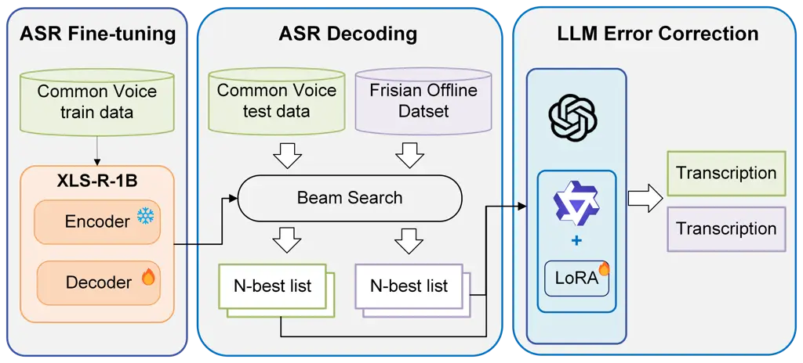
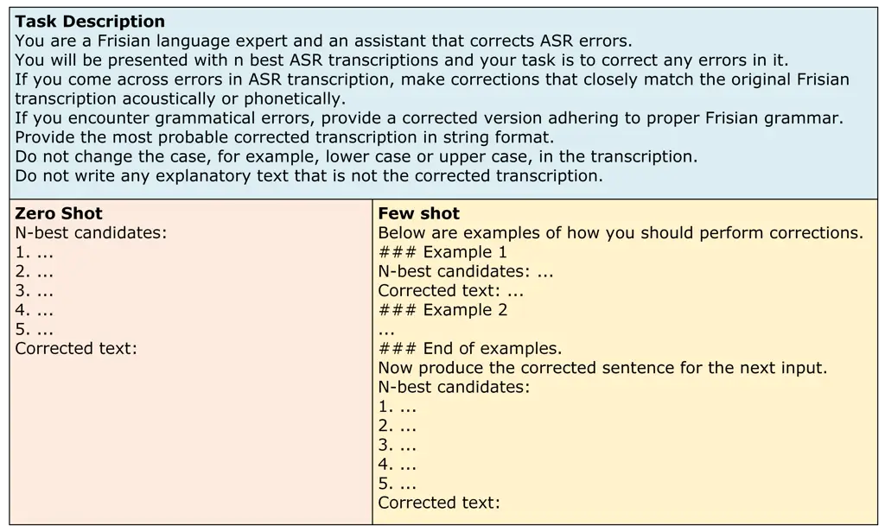
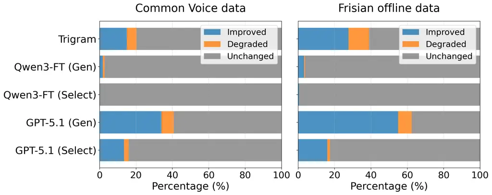

Hao Amooie de Vries van Noord Wieling

# Can Large Language Models Reliably Correct Errors in Low-Resource ASR? A Contamination-Aware Case Study on West Frisian

Yun    Reihaneh    Wietse    Rik    Martijn

###### Abstract

Automatic speech recognition (ASR) has improved substantially in recent
years, yet performance remains limited for low-resource languages. Large
language models (LLMs) have shown promise for improving ASR through
generative error correction (GER), but their effectiveness in
low-resource settings remains underexplored. In addition, it remains
unclear to what extent data contamination influences the reported
improvements in LLM-based GER.

This study investigates LLM-based GER for low-resource Frisian. In
addition to a public corpus, we construct and use a Frisian offline
dataset with non-public texts for evaluation to control for potential
data contamination. Results show that GER improves ASR performance in
most settings, with the best GPT-5.1 results surpassing oracle WERs.
Comparable gains on the offline dataset indicate that improvements
reflect true correction ability. We further provide a detailed error
analysis revealing model correction patterns.

###### keywords

automatic speech recognition, low-resource languages, large language
models, generative error correction, data contamination

^(†)^(†)address: University of Groningen, The Netherlands ^(†)^(†)email:
{yun.hao, r.amooie, wietse.de.vries, r.i.k.van.noord,
m.b.wieling}@rug.nl

## 1 Introduction

In recent years, automatic speech recognition (ASR) has seen remarkable
progress, with substantial gains in recognition accuracy and robustness.
Multilingual self-supervised and weakly supervised speech models,
including XLS-R \[1\] and Whisper \[2\], have played a central role in
improving ASR performance, particularly for low-resource languages.
Despite these advances, recognition accuracy remains limited for
languages with very scarce transcribed speech data or a small number of
speakers \[3, 4\].

Conventional methods typically improve ASR performance by combining the
acoustic model with a language model (LM), either during the decoding
process or by rescoring the N-best ASR hypotheses. Most recently, with
the rapid advancement of large language models (LLMs), researchers have
begun to explore generative error correction (GER) as a better
post-processing strategy for ASR outputs. Rather than selecting among
existing hypotheses, GER directly generates revised transcriptions
conditioned on ASR outputs, thereby allowing corrections beyond the
constraints of the original decoding space. This approach has
demonstrated substantial gains in high-resource languages, particularly
English \[5, 6, 7, 8\]. However, it remains unclear whether the
effectiveness of LLM-based GER generalizes to low-resource languages.
The success of GER depends heavily on the language-specific knowledge
encoded in LLMs, including lexical coverage and syntactic modeling
capacity. Such knowledge may not transfer uniformly across languages,
especially when pretraining data are scarce.

Another important concern when applying LLMs to ASR error correction is
data contamination. Evaluation data may overlap with the text seen
during LLM pretraining, potentially leading to inflated performance
estimates. This issue is especially relevant for low-resource languages,
where publicly available text is limited and often concentrated in a
small number of widely used sources. As a result, performance gains
observed on public datasets may partly reflect memorization rather than
actual error correction ability. Therefore, a careful
contamination-aware evaluation is required for assessing the real
effectiveness of LLM-based GER in low-resource ASR.

Motivated by these challenges, this work investigates the use of LLMs
for GER in low-resource ASR, with a particular focus on West Frisian, a
language spoken in the north of the Netherlands by about 400,000
speakers. In addition to the open-source Common Voice dataset \[9\], we
explicitly account for data contamination by evaluating on a newly
collected speech dataset with non-public text. Specifically, we address
the following research questions:¹¹ 1 The overall pipeline of our
approach is shown in Figure 1.

- •
  RQ1: To what extent can large language models improve ASR performance
  through generative error correction in a low-resource language
  setting?
- •
  RQ2: Does the effectiveness of LLM-based generative error correction
  differ between a publicly available benchmark and a non-public dataset
  where data contamination is not a concern?

## 2 Related Work

### 2.1 Generative Error Correction with LLMs

Ma et al. \[5\] first demonstrated that generative LLMs such as ChatGPT
can effectively correct ASR outputs using zero-shot and few-shot
prompting with N-best hypotheses as input. Chen et al. \[7\] introduced
HyPoradise, an open benchmark providing large-scale N-best hypotheses
paired with reference transcriptions to facilitate systematic evaluation
of LLM-based English GER. Yang et al. \[6\] demonstrate that through
instruction-based and task-activating prompting, LLMs can match
domain-tuned language models in rescoring and even exceed the N-best
oracle when combined with fine-tuning. Naderi et al. \[10\] proposed a
range of confidence filtering methods to mitigate over-correction in
GER.

While most early studies focused on English and other high-resource
languages, recent work has begun to extend LLM-based error correction to
multilingual and low-resource settings. Li et al. \[11\] investigate
multilingual one-best correction across 20 languages, and Yang et
al. \[12\] introduce CoVoGER, a multilingual and multitask benchmark
covering 15 languages for speech-to-text generative error correction. Xu
et al. \[13\] explored using LLMs in correcting ASR errors for
low-resource conversational child speech. However, existing studies have
rarely examined the issue of data contamination in LLM-based GER for
low-resource languages. In contrast to prior work, we explicitly
investigate the potential impact of contamination by constructing a
dataset with non-public text resources. Furthermore, we provide a
detailed analysis of correction behavior across different error types to
better understand how LLM-based GER improves low-resource ASR outputs.

### 2.2 Data Contamination in Large Language Models

Data contamination refers to situations in which language models have
been exposed to evaluation benchmarks during training, which may lead to
inflated performance estimates that do not reflect the LLM’s true
generalization ability \[14\]. This has become a central concern in the
evaluation of LLMs, particularly for widely used NLP benchmarks \[15,
16, 17\]. In the context of speech processing, Ma et al. \[18\] examined
GPT-3.5 and GPT-4 using a data contamination quiz and found measurable
signs of contamination in GPT-4 based on LibriSpeech and TED-LIUM3.
However, as Balloccu et al. \[19\] pointed out, direct contamination
detection for closed-source models such as GPT-4 may be unreliable, as
these systems employ mechanisms to prevent verbatim reproduction of
training data, thereby masking potential memorization effects. Moreover,
the likelihood of data contamination is influenced by the distribution
and reuse of publicly available text. For low-resource languages,
textual resources are typically scarce and drawn from a limited set of
widely reused sources, which increases the probability of data
contamination.

Xu et al. \[20\] provide a systematic survey of benchmark data
contamination and outline mitigation strategies, highlighting the
curation of new evaluation datasets as a practical solution when
pretraining data transparency is unavailable. To better control for
potential data contamination, we construct a new speech dataset with
non-public textual content. This allows us to more reliably assess the
generalization ability of LLM-based GER for low-resource languages.

Figure 1: Pipeline of the LLM-based generative error correction system.
Note that we use $`N=5`$ in this paper.

## 3 Methods

### 3.1 Datasets

Common Voice 17.0   The Common Voice corpus \[9\] is a
massively-multilingual collection of transcribed speech intended for
speech technology research and development. The text in Common Voice
primarily originates from publicly available sources, particularly
Wikipedia articles, and is supplemented by community-submitted sentences
that are validated by volunteers. We adopt the official data splits as
provided in the Common Voice release. The Frisian training split
contains 3,921 utterances from 195 speakers (5.5 hours), whereas the
validation split includes 3,170 utterances from 271 speakers (4.6
hours), and the test split comprises 3,171 utterances from 904 speakers
(4.7 hours).

Frisian Offline Dataset   To enable contamination-aware evaluation, we
construct a new speech dataset based on non-public textual prompts.²² 2
The data collection protocol was reviewed and approved by the Research
Ethics Committee of our research institute. The textual materials
consist of two parts. The first part consists of 103 sentences from a
Frisian storybook, for which we verified that no electronic version is
available online. The second part consists of 100 original sentences
written by a native Frisian speaker specifically for this study. Speech
recordings were made in a sound-attenuated speech laboratory at our
university using a head-mounted microphone. Audio was recorded in mono
at a sampling rate of 44.1 kHz with 16-bit resolution. Four male native
Frisian speakers participated in the recordings. The final dataset
contains 811 utterances, totaling 1.5 hours of speech.

### 3.2 ASR Model

We adopted the XLS-R 1B model \[1\] as our ASR backbone.³³ 3 In
preliminary experiments, we compared several pretrained speech models,
including Whisper and MMS, and found that XLS-R showed the best
performance for Frisian. XLS-R is a large-scale cross-lingual
self-supervised speech model based on wav2vec 2.0 \[21\], pretrained on
approximately 436,000 hours of speech data across 128 languages. We
fine-tuned XLS-R on the Common Voice Frisian training split for 2,000
steps using a Connectionist Temporal Classification (CTC) objective.
During fine-tuning, we froze the feature extractor and updated the
Transformer encoder layers. The model was trained with an effective
batch size of 64, a learning rate of 5e-5, and weight decay of 5e-5.

### 3.3 Large Language Models

We used GPT-4o-mini and GPT-5.1 (without reasoning) via API access as
closed-source commercial models. We also used the open-source Qwen3-8B
model (without reasoning) in its original pretrained form and fine-tuned
on the Common Voice Frisian training split.⁴⁴ 4 In preliminary
experiments, we also evaluated other open-source LLMs, including
Qwen2.5-7B-Instruct and Meta-Llama-3-8B-Instruct. Among the open-source
LLMs, Qwen3-8B achieved the best performance and was therefore selected
for further experiments. For fine-tuning, we generated the five best
hypotheses for each training utterance using the XLS-R model. The model
input consists of the zero-shot prompt together with these hypotheses,
and the reference transcription serves as the training target. We
applied Low-Rank Adaptation (LoRA) to the attention and feed-forward
projection layers with rank $`r=16`$, $`\alpha=32`$, and dropout
$`0.05`$. We trained for 3 epochs with an effective batch size of 16.

### 3.4 LLM-Based Generative Error Correction

For each utterance, we extract the five-best list using beam search
decoding (beam width = 50) from the fine-tuned XLS-R model. These
hypotheses are provided to the LLM, which is instructed to be a Frisian
language expert and to provide the final corrected transcription (see
Figure 2). In the $`k`$-shot ($`k`$=1,3,5,10) settings, we additionally
prepend $`k`$ correction examples from the Common Voice validation split
to guide the model’s behavior. We also include a selection-based
approach for comparison, where the model is prompted to choose the best
candidate from the ASR five-best list and output the corresponding
index.

Figure 2: The prompts used for our generative error correction system.

We evaluate performance using Word Error Rate (WER), with the XLS-R
one-best predictions as the ASR baseline. We also report the oracle
five-best WER, defined as the minimum WER achievable by selecting the
closest hypothesis to the reference from the five-best list.
Furthermore, we use a trigram language model trained on the Common Voice
Frisian training split into the decoding process as a conventional LM
baseline. Table 1 shows an example sentence of ASR error correction by
different methods. It shows that the LLMs are not restricted to the
N-best list, but have the freedom to correct errors outside of what was
present in the best examples.

|               |                                                                 |
| ------------- | --------------------------------------------------------------- |
| Reference     | der wiene mar sa’n tweintich minsken op de ynformaasjejûn       |
| Translation   | There were only about twenty people at the information evening. |
| N-best 1 (\*) | de wine mat sa’n tweintich minsken op de ynformaasje jûn        |
| N-best 2      | de wine moat sa’n tweintich minsken op de ynformaasje jûn       |
| N-best 3      | de wiene mat sa’n tweintich minsken op de ynformaasje jûn       |
| N-best 4      | de wiene moat sa’n tweintich minsken op de ynformaasje jûn      |
| N-best 5      | de wine hat sa’n tweintich minsken op de ynformaasje jûn        |
| Trigram       | de wiene moat sa’n tweintich minsken op de ynformaasje jûn      |
| GPT-5.1       | der wiene mar sa’n tweintich minsken op de ynformaasjejûn       |

Table 1: An example sentence from the Common Voice test dataset. Tokens
differing from the reference are highlighted in red, and correctly
corrected tokens are shown in green. The symbol (\*) denotes the
hypothesis selected by the selection-based GPT-5.1 method.

|             |           |        |        |        |        |         |     |
| ----------- | --------- | ------ | ------ | ------ | ------ | ------- | --- |
| Baseline    | WER(%)    |        |        |        |        |         |     |
| XLS-R       | 13.5      |        |        |        |        |         |     |
| - oracle    | 9.6       |        |        |        |        |         |     |
| - trigram   | 12.1      |        |        |        |        |         |     |
| LLM         | Selection | 0-shot | 1-shot | 3-shot | 5-shot | 10-shot |     |
| Qwen3       | 14.7      | 14.4   | 14.1   | 13.8   | 13.9   | 13.9    |     |
| Qwen3-FT    | 13.5      | 13.5   | 13.5   | 13.4   | 13.5   | 13.4    |     |
| GPT-4o-mini | 12.8      | 12.5   | 12.4   | 12.2   | 12.5   | 12.4    |     |
| GPT-5.1     | 12.1      | 10.1   | 9.5    | 8.9    | 8.9    | 9.0     |     |

Table 2: Generative and selection-based error correction WER(%) results
for Common Voice Frisian. Zero-shot to 10-shot WERs are based on the
generative method. Red numbers indicate performance worse than the XLS-R
baseline, green numbers indicate performance exceeding the XLS-R-based
five-best oracle, and black numbers indicate improvements over the
baseline that do not surpass the oracle.

## 4 Results and Discussion

Common Voice Test Dataset  Table 2 presents the WER results for the
Common Voice test dataset. We observe that, with the exception of the
original (non-fine-tuned) Qwen3 model, all LLMs improve over the
baseline XLS-R system. Even after LoRA fine-tuning and providing
examples, Qwen3-FT yields only a marginal improvement (13.4%),
indicating limited correction capability. Unsurprisingly, GPT-5.1
achieves the best results among all the models. In the generative
setting, it substantially outperforms both the trigram baseline and the
five-best oracle, reaching a minimum WER of 8.9% under 3-shot prompting.
Notably, the selection-based method achieves only 12.1% WER, which is
far from the oracle WER. This demonstrates the inherent limitation of
selecting from the fixed five-best list, whereas GER is able to move
beyond the hypothesis space and produce improved transcriptions not
present in the original beam outputs. Regarding few-shot prompting,
moderate improvements are observed when moving from zero-shot to 1- and
3-shot settings for all the LLMs, with 3-shot achieving the best overall
performance. Including more examples in the 5-shot and 10-shot settings
does not appear to improve performance further.

|             |        |        |        |        |        |         |     |
| ----------- | ------ | ------ | ------ | ------ | ------ | ------- | --- |
| Baseline    | WER(%) |        |        |        |        |         |     |
| XLS-R       | 21.1   |        |        |        |        |         |     |
| - oracle    | 18.0   |        |        |        |        |         |     |
| - trigram   | 19.2   |        |        |        |        |         |     |
| LLM         | Select | 0-shot | 1-shot | 3-shot | 5-shot | 10-shot |     |
| Qwen3       | 21.2   | 21.0   | 21.0   | 20.9   | 20.8   | 20.8    |     |
| Qwen3-FT    | 21.0   | 20.9   | 20.9   | 20.9   | 20.9   | 20.9    |     |
| GPT-4o-mini | 20.2   | 19.3   | 19.0   | 18.8   | 18.4   | 18.2    |     |
| GPT-5.1     | 19.9   | 15.3   | 14.7   | 13.9   | 13.8   | 13.8    |     |

Table 3: Generative and selection-based error correction WER(%) results
for Frisian Offline Data. Notations are the same as in Table 2.

Frisian Offline Dataset  Table 3 reports WER results for the Frisian
offline dataset. The overall patterns are consistent with those observed
for the Common Voice data. All LLMs improve over the baseline XLS-R
system, except for the selection-based approach using the original Qwen3
model. Both fine-tuned and non-fine-tuned Qwen3 variants yield only
marginal improvements. Generation-based methods consistently outperform
selection-based corrections. GPT-4o-mini-based GER achieves performance
comparable to or better than the trigram baseline. In particular,
GPT-5.1 substantially reduces WER under generative settings, reaching a
minimum WER of 13.8% (10-shot), substantially outperforming the oracle
WER. As this dataset is exclusively constructed from non-public textual
prompts, the strong performance of GPT-5.1 on this dataset suggests that
the observed gains cannot be explained by potential data contamination.
Instead, these results provide evidence that LLM-based generative
correction reflects genuine modeling capability beyond overlap with
publicly available corpora, even in low-resource settings.

### 4.1 Sentence-Level Improvement

To gain a better insight into how often the model genuinely improves
transcriptions, we analyze sentence-level behavior of the language
models by categorizing each utterance as improved, degraded, or
unchanged relative to the WER of the baseline ASR output. Figure 3
summarizes this distribution for both datasets. For Common Voice,
GPT-5.1 (Gen) improves 35.1% of the sentences, outperforming the trigram
baseline and Qwen3-FT models. However, this more aggressive correction
strategy is accompanied by a relatively higher degradation rate. In
contrast, GPT-5.1 (Select) improves only 13.6% of sentences and leaves
83.7% unchanged, reflecting the limitation of selecting within the fixed
five-best list. Qwen3-FT shows minimal correction behavior in both
generative and selection modes, leaving 97.3% and 99.8% of sentences
unchanged, respectively, indicating that it largely defaults to the
first hypothesis in the five-best list.

Figure 3: Sentence-level improvement rates of trigram, Qwen3-FT and
GPT-5.1 (generation vs. selection) on both Frisian ASR datasets.

This phenomenon is even more pronounced for the Frisian offline data.
GPT-5.1 (Gen) improves 54.9% of sentences, while the degradation rate
remains relatively low at 7.5%, even below that of the trigram model
(11.3%). As the trigram model is trained on the Common Voice text, it
likely suffers from domain mismatch for the Frisian offline data, while
GPT-5.1 demonstrates stronger generalization across different data
domains. Qwen3 again behaves in a very conservative manner for this
dataset.

### 4.2 Edit-Level Error Analysis

We further analyze the error correction behavior of the best-performing
models by examining their handling of substitutions (S), deletions (D),
and insertions (I). For each error type, we compute the number of errors
that are correctly adjusted by the model (true positives, TP), the
number of errors that remain uncorrected (false negatives, FN), and the
number of incorrect edits newly introduced by the model (false
positives, FP). Based on these counts, we compute precision and recall.

|                                   |       |       |       |     |       |      |
| --------------------------------- | ----- | ----- | ----- | --- | ----- | ---- |
| Dataset / Model                   | Type  | TP    | FN    | FP  | Prec. | Rec. |
| Common Voice GPT-5.1 (3-shot)     | S     | 1,376 | 1,765 | 281 | 83.0  | 43.8 |
|                                   | D     | 130   | 210   | 26  | 83.3  | 38.2 |
|                                   | I     | 245   | 140   | 115 | 68.1  | 63.6 |
|                                   | Total | 1,751 | 2,115 | 422 | 80.6  | 45.3 |
| Frisian Offline GPT-5.1 (10-shot) | S     | 865   | 1,185 | 119 | 87.9  | 42.2 |
|                                   | D     | 124   | 228   | 14  | 89.9  | 35.2 |
|                                   | I     | 140   | 85    | 89  | 61.1  | 62.2 |
|                                   | Total | 1,129 | 1,498 | 222 | 83.6  | 43.0 |

Table 4: Edit-level correction performance of GPT-5.1 on Common Voice
and Frisian offline data. S, D, and I denote substitution, deletion, and
insertion errors, respectively. Rec. and Prec. denote recall and
precision.

The overall recall and precision are comparable across the two datasets,
suggesting that the model exhibits consistent correction behavior
regardless of whether the evaluation text is publicly available or not.
Among the three error types, insertion errors show the lowest precision
on both datasets with the highest recall. This suggests that the model
adopts an aggressive strategy when handling extra words in ASR outputs,
but it may also introduce unnecessary insertions. In contrast, deletion
errors show the lowest recall but relatively high precision. Notably,
both deletion TPs and insertion FPs involve token addition: a TP for
deletion indicates that the model correctly inserts a missing word,
whereas an FP for insertion corresponds to the model mistakenly adding
an extra word. Considering deletion TPs and insertion FPs together, the
results suggest that the model struggles with token insertion decisions:
sometimes adding the correct word, but at other times introducing
unnecessary modifications. Finally, substitution errors account for the
majority of ASR errors, and the model exhibits intermediate performance
on this error type.

## 5 Conclusion

This work investigated the effectiveness of LLM-based generative error
correction for low-resource ASR on both public and non-public Frisian
datasets. We demonstrated that GPT models can substantially improve ASR
performance beyond the traditional trigram model and even surpass the
five-best oracle in certain settings (RQ1). The consistent improvements
observed on the non-public dataset suggest that the gains primarily stem
from genuine modeling capability rather than overlap with pretraining
data (RQ2). At the same time, Qwen3 achieved limited gains, together
with sentence-level analysis showing that it rarely modifies the ASR
outputs, indicating that effectively adapting open-source LLMs to
low-resource languages remains a challenge. Edit-level analysis reveals
an asymmetric correction strategy across error types in GPT-5.1, with
particular difficulty in token insertion decisions.

Future work may extend the evaluation to a wider range of LLMs and
languages to better understand cross-lingual differences in correction
capability. Exploring alternative input formulations and decoding
strategies may further enhance GER performance. More fine-grained error
analyses could also provide deeper insight into the mechanisms of
LLM-based GER.

## 6 Generative AI Use Disclosure

In preparing this manuscript, we used GPT-5.1 to improve the quality of
the writing, translate written text into English, and help with writing
code and debugging. It was not used for writing any major part of the
paper. The final content was fully reviewed by all the authors.

## References

- \[1\] A. Babu, C. Wang, A. Tjandra, K. Lakhotia, Q. Xu, N. Goyal, K.
  Singh, P. von Platen, Y. Saraf, J. Pino, A. Baevski, A. Conneau,
  and M. Auli (2022) XLS-R: Self-supervised Cross-lingual Speech
  Representation Learning at Scale. In Interspeech 2022, pp. 2278–2282.
  External Links:
  [Document](https://dx.doi.org/10.21437/Interspeech.2022-143), ISSN
  2958-1796 Cited by: §1, §3.2.
- \[2\] A. Radford, J. W. Kim, T. Xu, G. Brockman, C. McLeavey, and I.
  Sutskever (2023) Robust speech recognition via large-scale weak
  supervision. In International conference on machine learning,
  pp. 28492–28518. Cited by: §1.
- \[3\] M. Bartelds, N. San, B. McDonnell, D. Jurafsky, and M.
  Wieling (2023) Making more of little data: improving low-resource
  automatic speech recognition using data augmentation. In Proceedings
  of the 61st Annual Meeting of the Association for Computational
  Linguistics (Volume 1: Long Papers), pp. 715–729. Cited by: §1.
- \[4\] Z. X. Yong, V. Pratap, M. Auli, and J. Maillard (2025) Effects
  of Speaker Count, Duration, and Accent Diversity on Zero-Shot Accent
  Robustness in Low-Resource ASR. In Interspeech 2025, pp. 1148–1152.
  External Links:
  [Document](https://dx.doi.org/10.21437/Interspeech.2025-2351), ISSN
  2958-1796 Cited by: §1.
- \[5\] R. Ma, M. Qian, P. Manakul, M. Gales, and K. Knill (2023) Can
  generative large language models perform ASR error correction?. arXiv
  preprint arXiv:2307.04172. Cited by: §1, §2.1.
- \[6\] C. H. Yang, Y. Gu, Y. Liu, S. Ghosh, I. Bulyko, and A.
  Stolcke (2023) Generative speech recognition error correction with
  large language models and task-activating prompting. In 2023 IEEE
  Automatic Speech Recognition and Understanding Workshop (ASRU),
  pp. 1–8. Cited by: §1, §2.1.
- \[7\] C. Chen, Y. Hu, C. H. Yang, S. M. Siniscalchi, P. Chen, and E.
  Chng (2023) Hyporadise: an open baseline for generative speech
  recognition with large language models. Advances in Neural Information
  Processing Systems 36, pp. 31665–31688. Cited by: §1, §2.1.
- \[8\] N. Yamashita, M. Yamamoto, H. Kokubo, and Y. Kawaguchi (2025)
  LLM-based Generative Error Correction for Rare Words with Synthetic
  Data and Phonetic Context. In Interspeech 2025, pp. 3653–3657.
  External Links:
  [Document](https://dx.doi.org/10.21437/Interspeech.2025-649), ISSN
  2958-1796 Cited by: §1.
- \[9\] R. Ardila, M. Branson, K. Davis, M. Kohler, J. Meyer, M.
  Henretty, R. Morais, L. Saunders, F. Tyers, and G. Weber (2020) Common
  voice: a massively-multilingual speech corpus. In Proceedings of the
  twelfth language resources and evaluation conference, pp. 4218–4222.
  Cited by: §1, §3.1.
- \[10\] M. Naderi, E. Hermann, A. Nanchen, S. Hovsepyan, and M.
  Magimai.-Doss (2024) Towards interfacing large language models with
  ASR systems using confidence measures and prompting. In Interspeech
  2024, pp. 2980–2984. External Links:
  [Document](https://dx.doi.org/10.21437/Interspeech.2024-989), ISSN
  2958-1796 Cited by: §2.1.
- \[11\] S. Li, C. Chen, C. Y. Kwok, C. Chu, E. S. Chng, and H.
  Kawai (2024) Investigating ASR Error Correction with Large Language
  Model and Multilingual 1-best Hypotheses. In Interspeech 2024,
  pp. 1315–1319. External Links:
  [Document](https://dx.doi.org/10.21437/Interspeech.2024-368), ISSN
  2958-1796 Cited by: §2.1.
- \[12\] Z. Yang, Z. Wan, S. Li, C. H. Yang, and C. Chu (2025) CoVoGER:
  a multilingual multitask benchmark for speech-to-text generative error
  correction with large language models. In Proceedings of the 2025
  Conference on Empirical Methods in Natural Language Processing,
  pp. 6313–6325. Cited by: §2.1.
- \[13\] A. Xu, T. Feng, S. H. Kim, S. Bishop, C. Lord, and S.
  Narayanan (2025) Large Language Models based ASR Error Correction for
  Child Conversations. In Interspeech 2025, pp. 2840–2844. External
  Links: [Document](https://dx.doi.org/10.21437/Interspeech.2025-1088),
  ISSN 2958-1796 Cited by: §2.1.
- \[14\] O. Sainz, J. Campos, I. García-Ferrero, J. Etxaniz, O. L. de
  Lacalle, and E. Agirre (2023) NLP evaluation in trouble: on the need
  to measure LLM data contamination for each benchmark. In Findings of
  the Association for Computational Linguistics: EMNLP 2023, H.
  Bouamor, J. Pino, and K. Bali (Eds.), Singapore, pp. 10776–10787.
  External Links:
  [Link](https://aclanthology.org/2023.findings-emnlp.722/),
  [Document](https://dx.doi.org/10.18653/v1/2023.findings-emnlp.722)
  Cited by: §2.2.
- \[15\] Y. Li, Y. Guo, F. Guerin, and C. Lin (2024) An open-source data
  contamination report for large language models. In Findings of the
  Association for Computational Linguistics: EMNLP 2024, pp. 528–541.
  Cited by: §2.2.
- \[16\] C. Deng, Y. Zhao, X. Tang, M. Gerstein, and A. Cohan (2024)
  Investigating data contamination in modern benchmarks for large
  language models. In Proceedings of the 2024 Conference of the North
  American Chapter of the Association for Computational Linguistics:
  Human Language Technologies (Volume 1: Long Papers), pp. 8706–8719.
  Cited by: §2.2.
- \[17\] S. Chen, Y. Chen, Z. Li, Y. Jiang, Z. Wan, Y. He, D. Ran, T.
  Gu, H. Li, T. Xie, et al. (2025) Benchmarking large language models
  under data contamination: a survey from static to dynamic evaluation.
  In Proceedings of the 2025 Conference on Empirical Methods in Natural
  Language Processing, pp. 10091–10109. Cited by: §2.2.
- \[18\] R. Ma, M. Qian, M. Gales, and K. Knill (2025) ASR error
  correction using large language models. IEEE Transactions on Audio,
  Speech and Language Processing. Cited by: §2.2.
- \[19\] S. Balloccu, P. Schmidtová, M. Lango, and O. Dušek (2024) Leak,
  cheat, repeat: data contamination and evaluation malpractices in
  closed-source LLMs. In Proceedings of the 18th Conference of the
  European Chapter of the Association for Computational Linguistics
  (Volume 1: Long Papers), pp. 67–93. Cited by: §2.2.
- \[20\] C. Xu, S. Guan, D. Greene, M. Kechadi, et al. (2024) Benchmark
  data contamination of large language models: a survey. arXiv preprint
  arXiv:2406.04244. Cited by: §2.2.
- \[21\] A. Baevski, Y. Zhou, A. Mohamed, and M. Auli (2020) Wav2vec
  2.0: a framework for self-supervised learning of speech
  representations. Advances in neural information processing systems 33,
  pp. 12449–12460. Cited by: §3.2.
