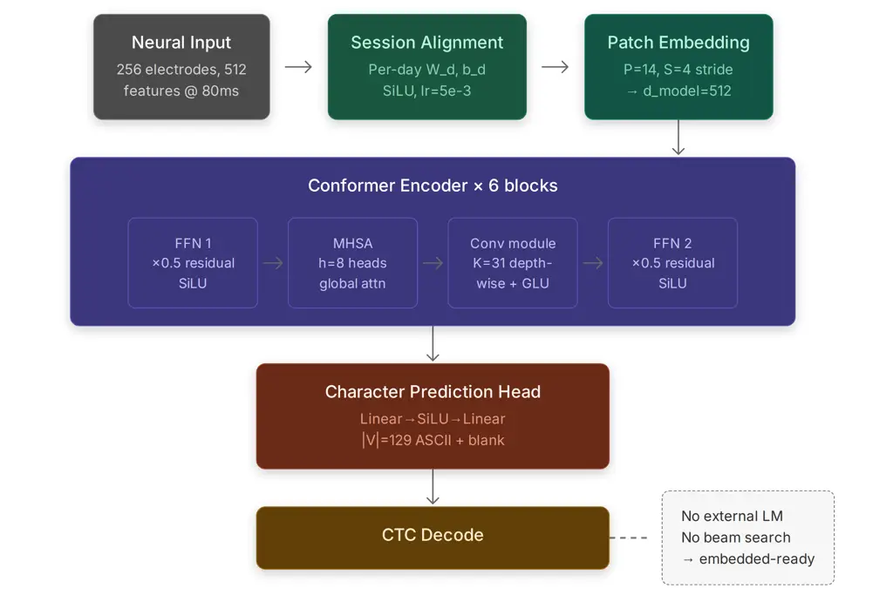

\interspeechcameraready

Khanday Gonzalez-Lopez Ouellet Galdón Olivares Granados University of
GranadaSpain University of GranadaSpain Hospital Virgen de Las Nieves
(Granada)Spain

# End-to-End Intracortical Speech Decoding from Neural Activity

Owais M    Jose A    Marc    Alberto    Gonzalo Affiliation: Dpt. of
Signal Theory, Telematics and Communications Affiliation: Brain, Mind,
and Behavior Research Center Affiliation: Grupo CSUR de Epilepsia
Refractaria Email: [{owaismujtaba,joseangl,mouellet}@ugr.es,
{alberto.galdon.sspa,gonzalo.olivares.sspa}@juntadeandalucia.es](mailto:%7Bowaismujtaba,joseangl,mouellet%7D@ugr.es,%20%7Balberto.galdon.sspa,gonzalo.olivares.sspa%7D@juntadeandalucia.es)

###### Abstract

Current high-performing intracortical speech neuroprostheses achieve low
word error rates but typically rely on external language models during
inference, increasing memory, computation, and latency. In this work, we
investigate whether meaningful character-level decoding is achievable
without such models. We propose an end-to-end Conformer-based neural
decoder trained directly on intracortical recordings from a participant
with amyotrophic lateral sclerosis (ALS). Without any external language
model, the system achieves a character error rate (CER) of 23.80% on
held-out validation data. Analysis shows that performance variability is
driven by inter-session signal degradation, while dominant errors arise
from incorrect word boundary segmentation. These results demonstrate
that effective character-level decoding is possible in a fully
end-to-end framework, providing a strong neural signal for downstream
linguistic processing.

###### keywords

brain-computer interface, speech neuroprosthesis, intracortical speech
decoding, neural speech decoding, conformer, end-to-end learning

## 1 Introduction

Neural speech prostheses \[1, 2\] represent one of the most ambitious
frontiers in modern neuroscience and biomedical engineering, offering
the prospect of restoring lost communication to individuals with severe
neurological conditions \[3, 4, 5, 6\]. Among the populations who stand
to benefit most are those affected by amyotrophic lateral sclerosis
(ALS), spinal cord injury (SCI), locked-in syndrome (LIS), or brainstem
stroke, conditions that progressively or abruptly sever the motor
pathways through which humans express intent, yet leave higher cognitive
function largely intact \[7, 8, 9\]. For these individuals, the
inability to speak, write, or gesture does not reflect an absence of
thought but rather an inability to translate intent into physical
action. Speech neuroprostheses aim to bridge this gap by decoding neural
signals directly from the brain, bypassing damaged motor pathways
entirely \[10, 11\]. The field has explored a wide range of recording
modalities, each offering a different trade-off between signal
resolution, invasiveness, and long-term stability \[12\]. Non-invasive
approaches such as electroencephalography (EEG) and functional magnetic
resonance imaging (fMRI) offer accessibility and safety but are limited
by low spatial resolution and susceptibility to noise \[13, 14, 15,
16\].

Electrocorticography (ECoG), which involves placing electrode grids
directly on the cortical surface, achieves substantially higher signal
fidelity and has enabled impressive speech and language decoding
results \[17, 18, 19, 20\]. At the highest end of the resolution
spectrum, intracortical microelectrode arrays record single-unit and
multi-unit spiking activity from small populations of neurons with
millisecond temporal precision, providing the richest neural signal
available to date \[21, 22, 23, 24\].

A series of landmark studies in recent years has helped define the
current state of the art in intracortical speech neuroprostheses \[25,
26, 27\]. Willett et al. \[25\] demonstrated that neural activity
recorded from the hand-knob area of the motor cortex could be decoded
into handwritten characters at approximately 90 characters per minute
with high accuracy, matching the speed of able-bodied typists and
establishing the motor cortex as a rich source of decodable linguistic
intent. Subsequently, Willett et al. \[26\] extended this paradigm to
direct speech decoding, achieving real-time synthesis of attempted
speech from a participant with ALS at 62 words per minute with a word
error rate of 23.8% on a large vocabulary, a performance level
approaching that of contemporary automatic speech recognition (ASR)
systems \[28, 29\]. Card et al. \[27\] further advanced this line of
work, reporting sub-5% word error rates sustained over 248 hours of
naturalistic conversation, demonstrating that intracortical speech BCIs
can achieve clinically meaningful accuracy over extended deployment
periods.

Despite these impressive achievements, a common architectural
characteristic of current state-of-the-art intracortical speech decoding
systems is their reliance on external language models (LMs) to rescore
the output of a connectionist temporal classification (CTC) \[30\] beam
search at inference time. In the system of Willett et al. \[26\], a
Transformer-based language model with a vocabulary of 125,000 words is
used to re-rank candidate transcriptions, contributing substantially to
the final word error rate reduction. Similarly, Card et al. \[27\]
employ an $`n`$-gram language model integrated into the decoding
pipeline.

While external language models are highly effective for improving
word-level accuracy, they introduce substantial practical constraints.
Large-vocabulary language models require significant memory, and CTC
beam search with LM integration is inherently sequential and not easily
parallelizable, introducing latency proportional to beam width \[31\].
For fully implanted speech neuroprostheses, where decoding hardware must
be miniaturized, power-efficient, and capable of real-time operation
without a tethered external computer, these requirements may become
prohibitive \[4, 32\]. Importantly, the role of the LM in these systems
is to impose linguistic structure and correct decoding errors, rather
than to extract information directly from the neural signal. This raises
a key question: to what extent can neural decoding performance be
improved in an end-to-end framework without relying on external LM
rescoring?

The central motivation of this work is therefore to investigate whether
meaningful character-level intracortical speech decoding is achievable
in a fully end-to-end setting. To this end, we propose a
Conformer-based \[33\] sequence decoder that maps intracortical neural
recordings directly to character sequences using a CTC objective \[30\],
without any LM at inference time. Furthermore, in order to address the
well-documented challenge of inter-session neural non-stationarity,
arising from electrode drift, impedance fluctuations, and day-to-day
changes in neural population dynamics \[34, 35, 36\], we introduce a
session-specific linear alignment layer that precedes the shared
Conformer encoder. This lightweight adapter allows the model to
normalize session-specific feature distributions while the shared
encoder learns more stable, session-invariant representations \[37\]. We
further develop a targeted data augmentation strategy to improve
generalization across 45 recording sessions spanning 20 months of
clinical data \[38\]. Our results demonstrate that meaningful
character-level decoding is achievable without external LM rescoring,
providing a promising step towards simpler and more deployable
intracortical speech neuroprostheses.

The rest of the paper is organized as follows. Section 2 reviews prior
work in neural speech decoding. Section 3 presents the proposed
methodology, including the participant and dataset, model architecture,
and data augmentation strategy. Section 4 reports the experimental
results, and Section 5 concludes the paper with limitations and future
directions.

## 2 Related Work

The decoding of speech and language from neural signals has progressed
rapidly across multiple recording modalities \[39, 40, 41\]. Early work
with ECoG demonstrated that neural activity in speech-related cortical
regions contains sufficient information to reconstruct acoustic features
and classify phonemes \[19, 41\]. Sequence-to-sequence approaches
further enabled direct neural-to-text mapping in constrained
vocabularies, although limited lexical coverage restricted their
applicability to open-ended communication \[17\].

Subsequent studies focused on clinically relevant scenarios. Moses et
al. \[18\] demonstrated real-time communication in a participant with
anarthria using a CNN–LSTM word classifier over a small vocabulary,
while later work increased communication rates and vocabulary
size \[42\].

In the intracortical domain, recent advances have achieved substantial
improvements in decoding accuracy and speed. Willett et al. \[25\]
showed high-rate character-level decoding from motor cortex activity,
and later extended this approach to direct speech decoding using
CTC-based models combined with language model rescoring \[26\]. Card et
al. \[27\] further improved performance using Conformer-based encoders,
achieving low word error rates over long-term recordings.

A common architectural paradigm has emerged in these systems: a neural
encoder produces phoneme or character probabilities, which are combined
with a language model during decoding \[31, 43\]. This approach,
inherited from automatic speech recognition (ASR), leverages the
statistical structure of language to improve word-level accuracy.

From a systems perspective, however, integrating language models
introduces additional computational and memory requirements, as well as
decoding latency due to beam search \[31\]. While effective, this
coupling motivates the exploration of approaches that strengthen the
neural decoding component itself, enabling a clearer separation between
neural signal extraction and downstream linguistic processing.

Another key challenge in intracortical speech neuroprostheses is the
non-stationarity of neural signals across recording sessions \[34, 35\].
Variability arises from electrode drift, changes in neural firing
patterns, and other biological factors, often degrading cross-session
generalization. Prior work has addressed this through
recalibration \[44\], manifold alignment \[45\], and lightweight
adaptation layers \[27, 37\].

Finally, Conformer architectures \[33\] have recently emerged as
effective encoders for neural-based speech decoding, combining
self-attention and convolutional modules to capture both global and
local temporal structure. Patch-based tokenization strategies further
improve efficiency by reducing sequence length while preserving temporal
context \[46, 47\]. In this work, we build on these ideas by combining a
Conformer encoder with a session-specific alignment layer and temporal
patch embedding for end-to-end character-level decoding.

## 3 Methods



Figure 1: Overview of the proposed Conformer-based intracortical speech
decoding architecture.

We evaluate an end-to-end intracortical speech decoder on the public
Brain-to-Text ’25 benchmark. The proposed pipeline, depicted in Fig. 1,
first applies a session-specific alignment layer to the neural features,
followed by temporal patch embedding and a Conformer encoder that
predicts character sequences with a CTC objective. During training, we
apply a set of neural data augmentation strategies designed to improve
robustness to inter-session variability and noise.

### 3.1 Participant and Dataset

In this study, we use the publicly available Brain-to-Text ’25
benchmark¹¹ 1
[https://www.kaggle.com/competitions/brain-to-text-25](https://www.kaggle.com/competitions/brain-to-text-25),
a large-scale dataset for intracortical speech decoding with
standardized training, validation, and test splits. The dataset consists
of neural recordings and behavioral data from a 45-year-old male
participant with ALS, as described in Card et al. \[27\], and spans 45
recording sessions collected over approximately 20 months. The
participant exhibited severe dysarthria and tetraparesis but retained
intact cognitive function.

Neural activity was recorded using four 64-channel intracortical
microelectrode arrays (256 electrodes in total) implanted in the left
ventral precentral gyrus. These arrays target cortical regions involved
in speech production, including the primary motor cortex (Brodmann area
4), ventral premotor cortex, and adjacent language-related areas.

The recorded neural signals are represented using 512 features,
comprising threshold crossing counts and spike band power extracted from
each electrode. These features are computed in non-overlapping temporal
bins of 20 ms, providing a high temporal resolution representation of
population-level neural activity. This representation captures both
spiking activity and local field potential dynamics relevant for
speech-related motor planning and execution.

The dataset contains a total of 10,948 trials, divided into 8,072
training trials, 1,426 validation trials, and 1,450 test trials. Each
trial corresponds to a prompted speech utterance, with aligned text
transcripts used as supervision for model training and evaluation.

The implementation details can be found at
https://github.com/owaismujtaba/E2ESpeechDecoding.git

### 3.2 Model Architecture

We introduce a Conformer-based sequence decoder for an uninterrupted
brain-to-text translation. The framework translates high-dimensional
intracortical neural recordings to character-level transcriptions
through a CTC objective \[30\]. The model has four components, as
depicted in Fig. 1: (i) a session-specific linear alignment layer, (ii)
a strided temporal patch-embedding module, (iii) a stack of Conformer
blocks, and (iv) a character prediction head. Model hyperparameters are
outlined in Table 1. In the following subsections, we describe these
four components in detail.

| Component            | Configuration                                                                                |
| -------------------- | -------------------------------------------------------------------------------------------- | ----------- | ---------------------- |
| Input Dimension      | 512 neural channels                                                                          |
| Session Alignment    | $`\mathbf{W}_{d}\in\mathbb{R}^{512\times 512}`$, $`\mathbf{b}_{d}\in\mathbb{R}^{512}`$, SiLU |
| Patch Embedding      | $`P=14`$, $`S=4`$, lin. project. to 512                                                      |
| Positional Encoding  | Sinusoidal (fixed), max length 5,000                                                         |
| Encoder Depth        | $`N_{L}=6`$ Conformer blocks                                                                 |
| $`d_{\text{model}}`$ | 512                                                                                          |
| Attention Heads      | $`h=8`$                                                                                      |
| $`d_{\text{ff}}`$    | 2,048 ($`4\times`$ expansion)                                                                |
| Convolution Kernel   | $`K=31`$ (depthwise)                                                                         |
| Prediction Head      | Linear $`\rightarrow`$ SiLU $`\rightarrow`$ Dropout $`\rightarrow`$ Linear                   |
| Vocabulary           | $`                                                                                           | \mathcal{V} | =129`$ (ASCII + blank) |
| Loss                 | CTC + entropy regularization ($`\lambda=0.05`$)                                              |
| Parameters           | $`\approx 47`$M                                                                              |

Table 1: Neural-decoding architecture configuration.

#### 3.2.1 Session-Specific Input Alignment

Significant inter-session variability emerges out from electrode drift,
impedance fluctuations, and day-to-day changes in neural signal
statistics in the intracortical neural recordings. In order to fend off
these non-stationarities, we carry out a session-specific linear adapter
layer _prior_ to the shared Conformer encoder. For a trial belonging to
session index $`d\in\{1,\dots,N_{\text{days}}\}`$, the input features
$`\mathbf{X}\in\mathbb{R}^{T\times C}`$ are transformed as:

```math
\mathbf{X}^{\prime}=\sigma\left(\mathbf{X}\mathbf{W}_{d}+\mathbf{b}_{d}\right), \tag{1}
```

where $`C`$ is the number of neural channels ,
$`\mathbf{W}_{d}\in\mathbb{R}^{C\times C}`$ is a session-specific weight
matrix, $`\mathbf{b}_{d}\in\mathbb{R}^{1\times C}`$ is a bias vector,
and $`\sigma(\cdot)`$ denotes the SiLU (Sigmoid Linear Unit) activation
function.

In order to enable stable convergence and maintain a ”pass-through”
state at the initial stage of training, we start each $`\mathbf{W}_{d}`$
as an identity matrix $`\mathbf{I}`$ and each $`\mathbf{b}_{d}`$ to
zero. Throughout the forward pass duration, these parameters are
dynamically indexed and applied via a clustered einsum process.

Optimization of these session-specific parameters is done independently
from the shared network weights. The set
$`\{\mathbf{W}_{d},\mathbf{b}_{d}\}`$ is given to a devoted performance
optimizer group within the AdamW optimizer. This group uses a higher
autonomous learning rate ($`\eta_{\mathrm{day}}=5\times 10^{-3}`$) and a
specific weight decay schedule ($`\lambda_{\mathrm{day}}`$). It permits
the model to quickly align session-specific parameters.

This group utilizes a higher independent learning rate
($`\eta_{\mathrm{day}}`$) and a specific weight decay schedule
($`\lambda_{\mathrm{day}}`$), allowing the model to rapidly align
session-specific feature distributions while the shared encoder learns
more stable, session-invariant representations.

#### 3.2.2 Temporal Patch Embedding

Inspired by the patch-based tokenization in Vision Transformers \[46\],
we implement a strided temporal patch embedding to reduce the sequence
length before it enters the Conformer encoder. Given the adapted neural
features $`\mathbf{X}\in\mathbb{R}^{T\times C}`$ from the
session-specific layer, we apply a 1-D unfolding operation along the
temporal dimension with patch size $`P`$ and stride $`S`$. This
operation yields a sequence of $`N`$ overlapping patches, where
$`N=\lfloor(T-P)/S\rfloor+1`$. Each patch
$`\mathbf{x}_{n}\in\mathbb{R}^{P\times C}`$ is flattened into a vector
$`\mathbf{v}_{n}\in\mathbb{R}^{PC}`$ and linearly projected into the
model’s latent space:

```math
\mathbf{z}_{n}=\mathbf{v}_{n}\mathbf{W}_{\text{proj}}+\mathbf{b}_{\text{proj}}, \tag{2}
```

where
$`\mathbf{W}_{\text{proj}}\in\mathbb{R}^{PC\times d_{\text{model}}}`$
and $`\mathbf{b}_{\text{proj}}\in\mathbb{R}^{d_{\text{model}}}`$
constitute the input projection layer. This design compresses the
temporal resolution by a factor approximately equal to $`S`$,
significantly reducing the computational complexity of the subsequent
self-attention layers while allowing each token to capture local
temporal dynamics.

Following the projection, a sinusoidal positional encoding
$`\mathbf{E}_{\text{pos}}\in\mathbb{R}^{N\times d_{\text{model}}}`$ is
element-wise added to the sequence to provide the model with relative
temporal information:

```math
\mathbf{Z}_{\text{input}}=\text{Dropout}(\mathbf{Z}+\mathbf{E}_{\text{pos}}), \tag{3}
```

where $`\mathbf{Z}=[\mathbf{z}_{1},\dots,\mathbf{z}_{N}]^{\top}`$. An
input dropout layer is applied to the resulting embeddings to improve
generalization before they are processed by the $`L`$ stacked Conformer
blocks.

#### 3.2.3 Conformer Encoder

The core encoder consists of $`N_{L}=6`$ stacked Conformer
blocks \[33\], implementing a _Macaron-style_ sandwich architecture.
Each block processes the input sequence through four distinct
sub-modules, using pre-normalization (LayerNorm) and residual
connections:

1.  1.  Feed-Forward Module 1. A half-step residual module consisting of a
        two-layer linear network with an expansion factor of 4. It applies
        $`\text{Linear}(d_{\text{model}},4d_{\text{model}})\to\text{SiLU}\to\text{Dropout}\to\text{Linear}(4d_{\text{model}},d_{\text{model}})\to\text{Dropout}`$.
        The output is scaled by $`0.5`$ before the residual addition.
2.  2.  Multi-Head Self-Attention (MHSA). Standard multi-head attention with
        $`h=8`$ heads and $`d_{\text{model}}=512`$. This module captures
        global temporal dependencies across the entire patched sequence:

    ```math
    \mathbf{x}\leftarrow\mathbf{x}+\text{Attention}(\text{LN}(\mathbf{x}),\text{LN}(\mathbf{x}),\text{LN}(\mathbf{x})). \tag{4}
    ```

3.  3.  Convolutional Module. A sequence-to-sequence transformation designed
        to capture local articulatory patterns. It utilizes a point-wise
        $`1{\times}1`$ convolution to expand channels to
        $`2d_{\text{model}}`$, followed by a Gated Linear Unit (GLU)
        activation, which reduces the dimension back to
        $`d_{\text{model}}`$. A depthwise 1D convolution with kernel size
        $`K=31`$ $`groups=d_{\text{model}}`$ is then applied, followed by
        Batch Normalization, SiLU activation, and a final $`1{\times}1`$
        point-wise projection and dropout.
4.  4.  Feed-Forward Module 2. A second half-step FFN, structurally
        identical to Module 1, completing the Macaron-style block. A final
        Layer Normalization is applied at the output of the block.

The total model capacity is defined by $`d_{\text{model}}=512`$ and
$`d_{\text{ff}}=2048`$. Dropout with $`p=0.1`$ (or as specified by
hyperparameters) is applied within all sub-modules to prevent
overfitting to session-specific noise.

#### 3.2.4 Character Prediction Head

The output of the final Conformer block is passed through a two-layer
prediction head:

```math
\mathbf{y}=\mathbf{W}_{2}\,\operatorname{SiLU}\left(\mathbf{W}_{1}\mathbf{h}+\mathbf{b}_{1}\right)+\mathbf{b}_{2}, \tag{5}
```

where
$`\mathbf{W}_{1}\in\mathbb{R}^{d_{\text{model}}\times d_{\text{model}}}`$
and
$`\mathbf{W}_{2}\in\mathbb{R}^{d_{\text{model}}\times|\mathcal{V}|}`$.
The vocabulary encodes $`|\mathcal{V}|=129`$ tokens: the 128 printable
ASCII characters shifted by 32 $`+1`$ (so that raw ASCII value $`c`$
maps to index $`c+1`$), with index 0 reserved as the CTC blank token.
Log-softmax is applied to produce log-probabilities for CTC decoding.

#### 3.2.5 Training Objective

The model is trained end-to-end with the CTC loss originally proposed
in \[30\] using blank index 0 and zero-infinity handling. To discourage
the model from collapsing to over-peaked blank predictions, an
entropy-regularization term is added:

```math
\mathcal{L}=\mathcal{L}_{\mathrm{CTC}}+\lambda\cdot\bigl(-\mathbb{E}[\log p(\mathbf{y}\mid\mathbf{x})]\bigr), \tag{6}
```

where $`\lambda=0.05`$ is the label-smoothing coefficient. This term
penalizes over-peaked output distributions and acts as output-entropy
regularization, analogous to label smoothing in classification tasks. A
summary of the architecture configuration is shown in Table 1

### 3.3 Data Augmentation

Intracortical arrays provide neural recordings that are subject to
considerable trial-to-trial and session-to-session variability. These
include additive noise from thermal and biological processes,
incremental drifts in baseline firing rates, electrode impedance
fluctuations, and trial-to-trial differences in movement kinematics. In
order to enhance the resilience and extrapolation of the decoder, we
employ a set of data augmentation methods to the neural attributes at
the time of training. The whole set of augmentations is applied in the
GPU feature space following loading but before the forward pass. At the
time of validation and inference, only Gaussian smoothing is used.

#### 3.3.1 Additive Noise Augmentations

Three forms of additive noise are applied independently to the feature
tensor $`x\in\mathbb{R}^{B\times T\times C}`$:

- •
  White Noise: Independent Gaussian noise
  $`\epsilon\sim\mathcal{N}(0,\sigma^{2}_{w})`$ is added to every
  element of the feature tensor. This simulates channel-level recording
  noise and prevents the model from overfitting to precise spike
  amplitude values.
- •
  Constant Offset Noise: A per-channel, per-trial offset
  $`\delta\sim\mathcal{N}(0,\sigma^{2}_{c})`$ is sampled once per batch
  element and broadcast across all time steps. This simulates slowly
  drifting electrode baselines.
- •
  Random Walk Noise: A cumulative sum of Gaussian increments along the
  time axis simulates non-stationary drift.

#### 3.3.2 Temporal Augmentations

Three augmentations manipulate the temporal structure of each trial:

- •
  Random Temporal Cutoff: A random number of time steps is removed from
  the beginning of each trial. This simulates variability in
  cue-to-movement onset latency and prevents the decoder from relying on
  absolute temporal position for early frames.
- •
  Time Warping: Each trial is independently time-warped by a factor
  $`w\sim\text{Uniform}(1-\alpha,1+\alpha)`$ using linear interpolation.
  The warped sequence is either zero-padded or truncated to the maximum
  buffer length. This augmentation encourages invariance to minor speed
  variations in attempted speech production.
- •
  Time Masking (SpecAugment-style): Following the SpecAugment framework
  \[38\] adapted for neural data, $`N_{m}`$ time masks are applied per
  trial. Each mask zeroes out a contiguous block of up to $`L_{m}=20`$
  consecutive time steps at a randomly chosen start position. This
  forces the model to rely on distributed temporal evidence rather than
  short, highly informative windows.

#### 3.3.3 Channel Augmentations

A channel dropout mask is applied by independently zeroing each channel
with probability $`p_{drop}`$. The mask is broadcasted across time,
simulating electrode failures or signal loss on individual channels
during recording. This regularization promotes the learning of
redundant, distributed representations across the electrode array.

#### 3.3.4 Gaussian Smoothing

After all stochastic augmentations, a fixed Gaussian kernel is convolved
along the time axis of the feature tensor to smooth the binned spike
rates. The kernel has standard deviation $`\sigma_{s}`$ time steps and a
support of $`K=100`$ points, applied as a depthwise convolution with
same padding. Smoothing is applied in both training and evaluation
modes. This operation reduces high-frequency noise in the spike rate
estimates and provides a smoother temporal trajectory for the encoder to
process.

The integration of these augmentation strategies is critical for
addressing the inherent non-stationarity and low signal-to-noise ratio
(SNR) of intracortical neural recordings. By injecting Additive Noise
and Constant Offsets, the model is forced to marginalize over
electrode-specific instabilities and biological background noise,
preventing overfitting to transient signal artifacts. Furthermore,
Temporal Augmentations and Channel Dropout ensure the decoder learns
robust, distributed representations that remain invariant to
fluctuations in movement timing and potential hardware failures.
Ultimately, these techniques facilitate superior generalization from
constrained training sets to real-time inference, where environmental
and physiological conditions frequently deviate from the calibration
phase. A snapshot of the augmentation values are presented in Table 2

| Augmentation        | Parameter        | Value   | Applied At  |
| ------------------- | ---------------- | ------- | ----------- |
| White Noise         | $`\sigma_{w}`$   | 1.0     | Train only  |
| Constant Offset     | $`\sigma_{c}`$   | 0.2     | Train only  |
| Random Temporal Cut | max cut          | 3 steps | Train only  |
| Time Warping        | $`\alpha`$       | 0.10    | Train only  |
| Time Masking        | $`N_{m}/L_{m}`$  | 2 / 20  | Train only  |
| Channel Dropout     | $`p_{drop}`$     | 0.05    | Train only  |
| Gaussian Smoothing  | $`\sigma_{s}/K`$ | 2 / 100 | Train + Val |

Table 2: Hyperparameter configurations for data augmentation. All
stochastic augmentations are restricted to the training phase to improve
model robustness, while Gaussian smoothing is applied across both
training and validation to ensure stable firing rate estimates.

### 3.4 Evaluation Protocol

We use the standard train/validation/test splits of the Brain-to-Text
’25 benchmark. Model selection is based on validation CER, with final
results reported from the best checkpoint (optionally using SWA).

Decoding is performed using greedy CTC without beam search or external
language model integration. Performance is measured using character
error rate (CER), computed as the normalized Levenshtein distance
between predicted and reference sequences. We do not report word error
rate (WER), as no language model is used during decoding. CER is used to
isolate the performance of the neural decoder.

## 4 Results

In this section, we report the performance of the proposed model on the
Brain-to-Text ’25 benchmark, focusing on the validation set (1,426
sentences), and analyze the main factors influencing its behavior.

### 4.1 Overall Performance and Model Comparison

| Model                        | Architecture              | CER (%) |
| ---------------------------- | ------------------------- | ------- |
| Baseline (Brain-to-Text ’25) | GRU + CTC                 | 30.00   |
| Conformer                    | Conformer + align. + aug. | 23.80   |
| Conformer w/o alignment.     | Conformer + aug.          | 24.28   |
| Conformer w/o augmentation   | Conformer + align.        | 39.55   |

Table 3: Comparison of character error rate (CER) on the validation set.

We first compare in Table 3 the proposed Conformer-based model against
the baseline provided with the Brain-to-text’25 benchmark \[27\], as
well as ablated variants of our architecture. The proposed model
achieves a minimum validation CER of 23.80%, outperforming the baseline
system.

In particular, our full model yields an absolute reduction in CER of
23.80% (relative improvement of 20.67%) compared to the baseline,
demonstrating the effectiveness of the proposed architecture. Training
without data augmentation results in a performance drop of 15.75% in
CER, confirming that augmentation plays a key role in improving
robustness and generalization.

Given that the full Conformer model achieves the best performance, the
following analyses focus exclusively on this configuration.

### 4.2 Session-wise Performance Variability

Figure 2: Mean CER per recording session.

We next analyze the robustness of the model across recording sessions.
Fig. 2 shows noticeable variability in CER across sessions, with a clear
temporal trend: earlier sessions achieve CER values around 10%, while
later sessions reach 40–45%. This pattern suggests a progressive
degradation in signal quality over time.

Possible contributing factors include long-term electrode drift, reduced
signal-to-noise ratio due to tissue encapsulation around the electrodes,
and changes in the neural population being recorded. These effects may
lead to less stable or less informative neural features, making decoding
more challenging in later sessions.

### 4.3 Utterance-level Error Distribution

Figure 3: Distribution of CER across validation utterances.

Fig. 3 presents the distribution of CER across utterances. The
distribution is right-skewed, with most samples concentrated at low
error rates and a long tail of high-error cases. The median CER is 0.22,
with an interquartile range of 0.18.

Figure 4: Mean CER as a function of utterance length (in characters).
The shaded area represents $`\pm`$ one standard deviation, and the
dashed line indicates a linear fit.

Fig. 4 shows a weak relationship between utterance length and CER
($`R^{2}=0.28`$). Performance is more stable for mid-length utterances
(approximately 20–50 characters), while short sequences exhibit higher
variability due to the impact of single-character errors. For longer
utterances, a gradual increase in CER is observed, suggesting that error
accumulation over time reduces decoding reliability.

### 4.4 Qualitative Analysis of Predictions

| Ref.                                    | Pred.                                   | CER  | Cat.  |
| --------------------------------------- | --------------------------------------- | ---- | ----- |
| How much is your card worth?            | How much is your card worth?            | 0.00 | Cor.  |
| We think it’s good.                     | We think it’s good.                     | 0.00 | Cor.  |
| I like to enjoy my life in the country. | I like to enjoe my live in the cuntrry. | 0.10 | Par.  |
| She used to love to do stuff like that. | She usd to love to do tuffe ligke that. | 0.10 | Par.  |
| Some new types of furniture.            | Thon ne lases are pier.                 | 0.64 | Fail. |
| Not too long ago.                       | Dit tyo w or?                           | 0.65 | Fail. |

Table 4: Representative qualitative examples (Validation Set). Incorrect
words are highlighted in red.

Table 4 presents representative examples of correct predictions, partial
errors, and failure cases. Correct predictions typically correspond to
phonetically clear and frequent expressions. Partial errors are
dominated by local substitutions and deletions that preserve overall
structure. In contrast, failure cases involve severe degradation and low
overlap with the reference, often associated with short or uncommon
utterances.

### 4.5 Character-level Error Analysis

|                |                          |                      |       |
| -------------- | ------------------------ | -------------------- | ----- |
| Rank           | Ref $`\rightarrow`$ Hyp  | Type                 | Count |
| 1              | e $`\rightarrow`$ \[SP\] | Deletion of boundary | 603   |
| 2              | \[SP\] $`\rightarrow`$ t | Insertion into word  | 500   |
| 3              | t $`\rightarrow`$ \[SP\] | Deletion of boundary | 476   |
| 4              | \[SP\] $`\rightarrow`$ e | Insertion into word  | 445   |
| 5              | \[SP\] $`\rightarrow`$ o | Insertion into word  | 442   |
| 6              | o $`\rightarrow`$ \[SP\] | Deletion of boundary | 378   |
| 7              | \[SP\] $`\rightarrow`$ a | Insertion into word  | 331   |
| 8              | s $`\rightarrow`$ \[SP\] | Deletion of boundary | 310   |
| 9              | n $`\rightarrow`$ \[SP\] | Deletion of boundary | 294   |
| 10             | \[SP\] $`\rightarrow`$ i | Insertion into word  | 278   |
| Total (top 10) |                          |                      | 4,057 |

Table 5: Top 10 most frequent character-level substitution errors on the
validation set.

Finally, to better understand systematic decoding errors, we analyze
character-level confusions. Table 5 shows the most frequent substitution
errors. Notably, all top errors involve the space token, indicating that
the dominant failure mode is incorrect word boundary segmentation rather
than phoneme-level confusion.

The model frequently merges adjacent words (space deletion) or inserts
spurious spaces within words, disrupting lexical structure. This pattern
suggests that the acoustic–neural evidence for word boundaries is
relatively weak compared to within-word character transitions. In
particular, the confusion between spaces and high-frequency characters
(e.g., e, t, o, a) indicates that boundary decisions are often replaced
by more probable character emissions.

This behavior is consistent with known limitations of CTC-based
decoders, where alignment is learned implicitly and no explicit
mechanism enforces consistent segmentation. As a result, errors tend to
concentrate at word boundaries rather than within well-supported
character sequences, which remain comparatively stable.

## 5 Conclusion

In this work, we presented an end-to-end Conformer-based decoder for
intracortical speech neuroprostheses that directly maps neural activity
to character sequences. By combining dataset augmentation, a
session-specific alignment layer, temporal patch embedding, and a
Conformer encoder trained with a CTC objective and entropy
regularization, the proposed model achieves a validation CER of 23.80%
on the Brain-to-text’25 benchmark. Ablation results further highlight
the importance of both the alignment mechanism and the tailored data
augmentation pipeline for achieving robust performance. Our analysis
shows that performance varies significantly across recording sessions,
with a clear degradation in later sessions, likely reflecting
non-stationarity and potential declines in signal quality. At the
character level, errors are dominated by incorrect word boundary
segmentation, with frequent confusions between spaces and high-frequency
characters, rather than purely phonetic substitutions.

Future work will focus on improving robustness to long-term signal drift
and addressing segmentation errors, for instance by incorporating
explicit word-boundary modeling or lightweight language constraints.
Additional directions include scaling model capacity and exploring
self-supervised pretraining on larger neural datasets.

## 6 Acknowledgement

This work was supported by grants PID2022-141378OB-C22 and
AIA2025-163317-C32 funded by MICIU/AEI/10.13039/501100011033 and
ERDF/EU.

## References

- \[1\] E. F. Chang (2024) Brain-computer interfaces for restoring
  communication. New England Journal of Medicine 391 (7), pp. 654–657.
  Cited by: §1.
- \[2\] A. B. Silva, K. T. Littlejohn, J. R. Liu, D. A. Moses, and E. F.
  Chang (2024) The speech neuroprosthesis. Nature Reviews Neuroscience
  25 (7), pp. 473–492. Cited by: §1.
- \[3\] L. R. Hochberg, M. D. Serruya, G. M. Friehs, J. A. Mukand, M.
  Saleh, A. H. Caplan, A. Branner, D. Chen, R. D. Penn, and J. P.
  Donoghue (2006) Neuronal ensemble control of prosthetic devices by a
  human with tetraplegia. Nature 442 (7099), pp. 164–171. Cited by: §1.
- \[4\] K. V. Shenoy, M. Sahani, and M. M. Churchland (2013) Cortical
  control of arm movements: a dynamical systems perspective. Annual
  Review of Neuroscience 36, pp. 337–359. Cited by: §1, §1.
- \[5\] R. A. Andersen, J. W. Burdick, S. Musallam, B. Pesaran,
  and J. G. Cham (2004) Cognitive neural prosthetics. Trends in
  Cognitive Sciences 8 (11), pp. 486–493. Cited by: §1.
- \[6\] J. P. Donoghue (2002) Connecting cortex to machines: recent
  advances in brain interfaces. Nature Neuroscience 5, pp. 1085–1088.
  Cited by: §1.
- \[7\] N. Birbaumer, N. Ghanayim, T. Hinterberger, I. Iversen, B.
  Kotchoubey, A. Kübler, J. Perelmouter, E. Taub, and H. Flor (1999) A
  spelling device for the paralysed. Nature 398 (6725), pp. 297–298.
  Cited by: §1.
- \[8\] U. Chaudhary, N. Birbaumer, and A. Ramos-Murguialday (2016)
  Brain-computer interfaces for communication and rehabilitation. Nature
  Reviews Neurology 12 (9), pp. 513–525. Cited by: §1.
- \[9\] M. J. Vansteensel, E. G. M. Pels, M. G. Bleichner, M. P.
  Branco, T. Denison, Z. V. Freudenburg, P. Gosselaar, S.
  Leinders, T. H. Ottens, M. A. Van Den Boom, P. C. Van Rijen, E. J.
  Aarnoutse, and N. F. Ramsey (2016) Fully implanted brain-computer
  interface in a locked-in patient with ALS. New England Journal of
  Medicine 375 (21), pp. 2060–2066. Cited by: §1.
- \[10\] J. R. Wolpaw, N. Birbaumer, D. J. McFarland, G. Pfurtscheller,
  and T. M. Vaughan (2002) Brain-computer interfaces for communication
  and control. Clinical Neurophysiology 113 (6), pp. 767–791. Cited by:
  §1.
- \[11\] M. A. Lebedev and M. A. L. Nicolelis (2006) Brain-machine
  interfaces: past, present and future. Trends in Neurosciences 29 (9),
  pp. 536–546. Cited by: §1.
- \[12\] E. C. Leuthardt, G. Schalk, J. R. Wolpaw, J. G. Ojemann,
  and D. W. Moran (2004) A brain-computer interface using
  electrocorticographic signals in humans. Journal of Neural Engineering
  1 (2), pp. 63–71. Cited by: §1.
- \[13\] G. Wang, C. Teng, K. Li, Z. Zhang, and Y. Chai (2022) The open
  dataset of EEG motor imagery: BCI motor imagery data from healthy
  subjects. Frontiers in Neuroscience 16, pp. 1044299. Cited by: §1.
- \[14\] J. Tang, A. LeBel, S. Jain, and A. G. Huth (2023) Semantic
  reconstruction of continuous language from non-invasive brain
  recordings. Nature Neuroscience 26 (5), pp. 858–866. Cited by: §1.
- \[15\] M. Nakanishi, Y. Wang, X. Chen, Y. Wang, X. Gao, and T.
  Jung (2018) Enhancing detection of ssveps for a high-speed brain
  speller using task-related component analysis. IEEE Transactions on
  Biomedical Engineering 65 (1), pp. 104–112. Cited by: §1.
- \[16\] R. Abiri, S. Borhani, E. W. Sellers, Y. Jiang, and X.
  Zhao (2019) A comprehensive review of EEG-based brain-computer
  interface paradigms. Journal of Neural Engineering 16 (1), pp. 011001.
  Cited by: §1.
- \[17\] J. G. Makin, D. A. Moses, and E. F. Chang (2020) Machine
  translation of cortical activity to text with an encoder-decoder
  framework. Nature Neuroscience 23 (4), pp. 575–582. Cited by: §1, §2.
- \[18\] D. A. Moses, S. L. Metzger, J. R. Liu, G. K.
  Anumanchipalli, J. G. Makin, P. F. Sun, J. Chartier, M. E.
  Dougherty, P. M. Liu, G. M. Abrams, A. Tu-Chan, K. Ganguly, and E. F.
  Chang (2021) Neuroprosthesis for decoding speech in a paralyzed person
  with anarthria. New England Journal of Medicine 385 (3), pp. 217–227.
  Cited by: §1, §2.
- \[19\] C. Herff, D. Heger, A. De Pesters, D. Telaar, P. Brunner, G.
  Schalk, and T. Schultz (2015) Brain-to-text: decoding spoken phrases
  from phone representations in the brain. Frontiers in Neuroscience 9,
  pp. 217. Cited by: §1, §2.
- \[20\] M. Angrick, C. Herff, E. Mugler, M. C. Tate, M. W.
  Slutzky, D. J. Krusienski, and T. Schultz (2019) Speech synthesis from
  ECoG using densely connected 3D convolutional neural networks. Journal
  of Neural Engineering 16 (3), pp. 036019. Cited by: §1.
- \[21\] C. Pandarinath, P. Nuyujukian, C. H. Blabe, B. L. Sorice, J.
  Saab, F. R. Willett, L. R. Hochberg, K. V. Shenoy, and J. M.
  Henderson (2017) High performance communication by people with
  paralysis using an intracortical brain-computer interface. eLife 6,
  pp. e18554. Cited by: §1.
- \[22\] V. Gilja, C. Pandarinath, C. H. Blabe, P. Nuyujukian, J. D.
  Simeral, A. A. Sarma, B. L. Sorice, J. A. Perge, B. Jarosiewicz, L. R.
  Hochberg, K. V. Shenoy, and J. M. Henderson (2015) Clinical
  translation of a high-performance neural prosthesis. Nature Medicine
  21 (10), pp. 1142–1145. Cited by: §1.
- \[23\] L. R. Hochberg, D. Bacher, B. Jarosiewicz, N. Y. Masse, J. D.
  Simeral, J. Vogel, S. Haddadin, J. Liu, S. S. Cash, P. van der Smagt,
  and J. P. Donoghue (2012) Reach and grasp by people with tetraplegia
  using a neurally controlled robotic arm. Nature 485 (7398),
  pp. 372–375. Cited by: §1.
- \[24\] E. M. Trautmann, S. D. Stavisky, S. Lahiri, K. C. Ames, M. T.
  Kaufman, D. J. O’Shea, S. Vyas, X. Sun, I. Bhowmick, S.
  Bhowmick, B. M. Yu, N. Even-Chen, J. M. Henderson, and K. V.
  Shenoy (2019) Accurate estimation of neural population dynamics
  without spike sorting. Neuron 103 (2), pp. 292–308. Cited by: §1.
- \[25\] F. R. Willett, D. T. Avansino, L. R. Hochberg, J. M. Henderson,
  and K. V. Shenoy (2021) High-performance brain-to-text communication
  via handwriting. Nature 593 (7858), pp. 249–254. Cited by: §1, §2.
- \[26\] F. R. Willett, E. M. Kunz, C. Fan, D. T. Avansino, G. H.
  Wilson, E. Y. Choi, F. Kamdar, L. R. Hochberg, J. M. Henderson, P.
  Bhatt, P. Rezaii, and K. V. Shenoy (2023) A high-performance speech
  neuroprosthesis. Nature 620 (7976), pp. 1031–1036. Cited by: §1, §1,
  §2.
- \[27\] N. S. Card, M. Wairagkar, C. Iacono, P. Bhatt, T.
  Singer-Clark, F. R. Willett, K. C. Ames, J. Liu, P. Rezaii, L. R.
  Hochberg, J. M. Henderson, K. V. Shenoy, and D. M. Brandman (2024) An
  accurate and rapidly calibrating speech neuroprosthesis. New England
  Journal of Medicine 391 (7), pp. 609–618. Cited by: §1, §1, §2, §2,
  §3.1, §4.1.
- \[28\] A. Baevski, H. Zhou, A. Mohamed, and M. Auli (2020) Wav2vec
  2.0: a framework for self-supervised learning of speech
  representations. Advances in Neural Information Processing Systems 33,
  pp. 12449–12460. Cited by: §1.
- \[29\] A. Radford, J. W. Kim, T. Xu, G. Brockman, C. McLeavey, and I.
  Sutskever (2023) Robust speech recognition via large-scale weak
  supervision. Proceedings of the International Conference on Machine
  Learning, pp. 28492–28518. Cited by: §1.
- \[30\] A. Graves, S. Fernández, F. Gomez, and J. Schmidhuber (2006)
  Connectionist temporal classification: labelling unsegmented sequence
  data with recurrent neural networks. Proceedings of the International
  Conference on Machine Learning, pp. 369–376. Cited by: §1, §1, §3.2.5,
  §3.2.
- \[31\] A. Hannun, C. Case, J. Casper, B. Catanzaro, G. Diamos, E.
  Elsen, R. Prenger, S. Satheesh, S. Sengupta, A. Coates, and A. Y.
  Ng (2014) Deep speech: scaling up end-to-end speech recognition. In
  arXiv preprint arXiv:1412.5567, Cited by: §1, §2, §2.
- \[32\] J. C. Kao, P. Nuyujukian, S. I. Ryu, M. M. Churchland, J. P.
  Cunningham, and K. V. Shenoy (2015) Single-trial dynamics of motor
  cortex and their applications to brain-machine interfaces. Nature
  Communications 6, pp. 7759. Cited by: §1.
- \[33\] A. Gulati, J. Qin, C. Chiu, N. Parmar, Y. Zhang, J. Yu, W.
  Han, S. Wang, Z. Zhang, Y. Wu, and R. Pang (2020) Conformer:
  convolution-augmented transformer for speech recognition. In Proc.
  Interspeech, pp. 5036–5040. Cited by: §1, §2, §3.2.3.
- \[34\] J. D. Simeral, S. Kim, M. J. Black, J. P. Donoghue, and L. R.
  Hochberg (2011) Neural control of cursor trajectory and click by a
  human with tetraplegia 1000 days after implant of an intracortical
  microelectrode array. Journal of Neural Engineering 8 (2), pp. 025027.
  Cited by: §1, §2.
- \[35\] J. A. Gallego, M. G. Perich, L. E. Miller, and S. A.
  Solla (2017) Neural manifolds for the control of movement. Neuron 94
  (5), pp. 978–984. Cited by: §1, §2.
- \[36\] C. A. Chestek, V. Gilja, P. Nuyujukian, J. D. Foster, J. M.
  Fan, M. T. Kaufman, M. M. Churchland, Z. Rivera-Alvidrez, J. P.
  Cunningham, S. I. Ryu, and K. V. Shenoy (2011) Single-unit stability
  using chronically implanted multielectrode arrays in motor cortex of
  macaque monkeys. Journal of Neurophysiology 105 (2), pp. 567–579.
  Cited by: §1.
- \[37\] J. Li, V. Lavrukhin, B. Ginsburg, R. Leary, O. Kuchaiev, J. M.
  Cohen, H. Nguyen, and R. T. Gadde (2019) Jasper: an end-to-end
  convolutional neural acoustic model. In Proc. Interspeech, pp. 71–75.
  Cited by: §1, §2.
- \[38\] D. S. Park, W. Chan, Y. Zhang, C. Chiu, B. Zoph, E. D. Cubuk,
  and Q. V. Le (2019) SpecAugment: a simple data augmentation method for
  automatic speech recognition. In Proc. Interspeech, pp. 2613–2617.
  Cited by: §1, 3rd item.
- \[39\] J. S. Brumberg, A. Nieto-Castanon, P. R. Kennedy, and F. H.
  Guenther (2010) Brain-computer interfaces for speech communication.
  Speech Communication 52 (4), pp. 367–379. Cited by: §2.
- \[40\] S. Martin, P. Brunner, C. Holdgraf, H. Heinze, N. E. Crone, J.
  Rieger, G. Schalk, R. T. Knight, and B. N. Pasley (2014) Decoding
  spectrotemporal features of overt and covert speech from the human
  cortex. Frontiers in Neuroengineering 7, pp. 14. Cited by: §2.
- \[41\] G. K. Anumanchipalli, J. Chartier, and E. F. Chang (2019)
  Speech synthesis from neural decoding of spoken sentences. Nature 568
  (7753), pp. 493–498. Cited by: §2.
- \[42\] S. L. Metzger, K. T. Littlejohn, A. B. Silva, D. A.
  Moses, M. P. Seaton, R. Wang, M. E. Dougherty, J. R. Liu, P. Wu, M. A.
  Berger, I. Zhuravleva, A. Tu-Chan, K. Ganguly, G. K. Anumanchipalli,
  and E. F. Chang (2023) A high-performance neuroprosthesis for speech
  decoding and avatar control. Nature 620 (7976), pp. 1037–1046. Cited
  by: §2.
- \[43\] W. Chan, N. Jaitly, Q. Le, and O. Vinyals (2016) Listen, attend
  and spell: a neural network for large vocabulary conversational speech
  recognition. In Proceedings of the IEEE International Conference on
  Acoustics, Speech and Signal Processing (ICASSP), pp. 4960–4964. Cited
  by: §2.
- \[44\] B. Jarosiewicz, A. A. Sarma, D. Bacher, N. Y. Masse, J. D.
  Simeral, B. Sorice, E. M. Oakley, C. Blabe, C. Pandarinath, V.
  Gilja, S. S. Cash, E. N. Eskandar, G. Friehs, J. M. Henderson, K. V.
  Shenoy, J. P. Donoghue, and L. R. Hochberg (2015) Virtual typing by
  people with tetraplegia using a self-calibrating intracortical
  brain-computer interface. Science Translational Medicine 7 (313),
  pp. 313ra179. Cited by: §2.
- \[45\] A. D. Degenhart, W. E. Bishop, E. R. Oby, E. C.
  Tyler-Kabara, S. M. Chase, A. P. Batista, and B. M. Yu (2020)
  Stabilization of a brain-computer interface via the alignment of
  low-dimensional spaces of neural activity. Nature Biomedical
  Engineering 4 (7), pp. 672–685. Cited by: §2.
- \[46\] A. Dosovitskiy, L. Beyer, A. Kolesnikov, D. Weissenborn, X.
  Zhai, T. Unterthiner, M. Dehghani, M. Minderer, G. Heigold, S.
  Gelly, J. Uszkoreit, and N. Houlsby (2021) An image is worth 16x16
  words: transformers for image recognition at scale. In Proc.
  International Conference on Learning Representations, Cited by: §2,
  §3.2.2.
- \[47\] Z. Liu, Y. Lin, Y. Cao, H. Hu, Y. Wei, Z. Zhang, S. Lin, and B.
  Guo (2021) Swin transformer: hierarchical vision transformer using
  shifted windows. In Proceedings of the IEEE/CVF International
  Conference on Computer Vision (ICCV), pp. 10012–10022. Cited by: §2.
