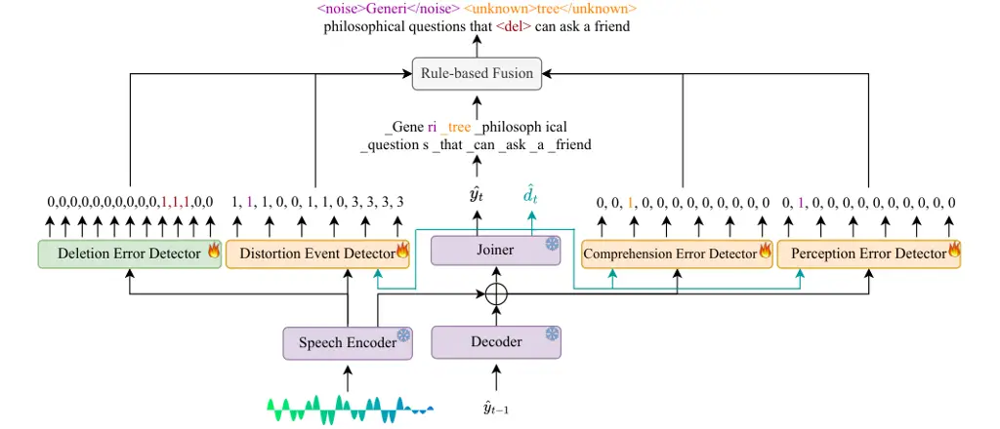
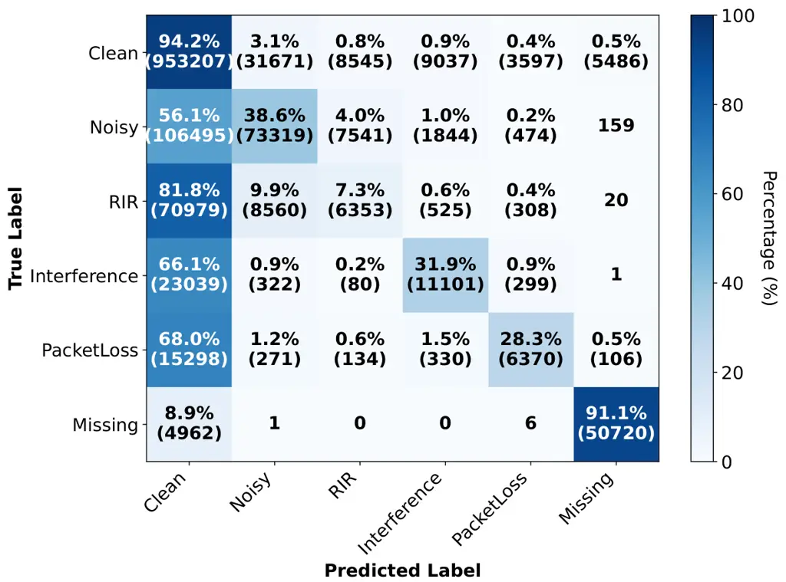
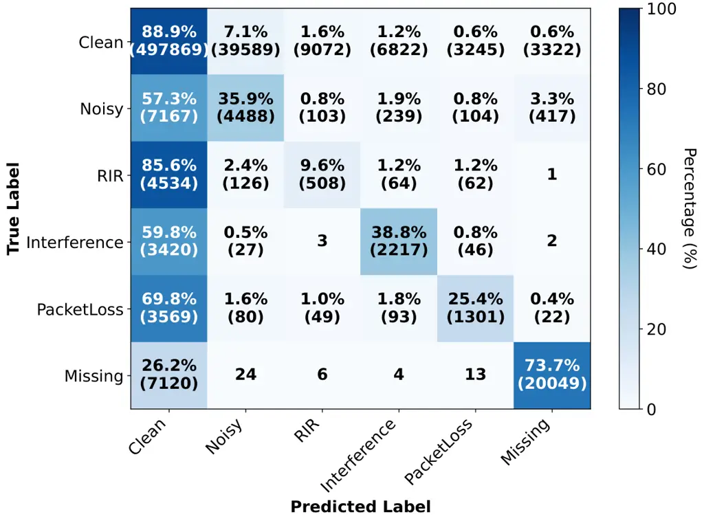

# Proactive for Uncertainty: Cause-Aware Error Diagnosis and Interactive Clarification for Spoken Dialogue Systems

Yizhou Peng ^(†)^(†)thanks: Equal contribution. Affiliation: Nanyang
Technological University, Singapore    Ziyang Ma¹¹footnotemark: 1
Affiliation: Nanyang Technological University, Singapore
Affiliation: Shanghai Jiao Tong University, China    Changsong Liu
Affiliation: Nanyang Technological University, Singapore    Yi-Wen Chao
Affiliation: Nanyang Technological University, Singapore    Xie Chen
Affiliation: Shanghai Jiao Tong University, China    Eng Siong Chng
Affiliation: Nanyang Technological University, Singapore

###### Abstract

Cascaded Automatic Speech Recognition – Large Language Model (ASR-LLM)
pipelines remain popular for industrial Spoken Dialogue Systems (SDS),
primarily because their decoupled design ensures perceptual
verifiability. However, cascaded systems suffer from error propagation,
as transcription failures inevitably cascade to subsequent components,
thereby degrading the final interaction quality. Although ASR confidence
scores offer a simple filter for unreliable inputs, this approach is
fundamentally limited because it typically fails to detect deletion
errors or to distinguish between acoustic (inability to hear clearly)
and linguistic (inability to understand) mismatches, both of which
require targeted recovery strategies. In this paper, we propose a
cause-aware error recovery paradigm that fundamentally rethinks
robustness in SDS. Unlike traditional confidence filtering, we introduce
a suite of small precision-focused detectors that exploit deep ASR
latent representations to disentangle token-level errors into
perception, comprehension, and deletion failures. This fine-grained
diagnostic intelligence empowers the LLM to orchestrate targeted,
multi-turn clarification strategies, effectively transforming ambiguous
signals into seamless user interactions. Experimental results validate
the precision of our approach, which more than doubles the recall on
domain-shift errors (57.96% vs. 23.66%) compared to baselines.
Crucially, this diagnostic precision yields up to a 31% reduction in WER
and a 19% improvement on the downstream task across diverse accents,
distortions, and domains.

## 1 Introduction

Modern spoken dialogue systems (SDS) generally follow two paradigms:
cascaded pipelines or end-to-end (E2E) architectures. While E2E models,
such as SALMONN Tang et al. (2024), Qwen-Omni Chu et al. (2023); Chu
et al. (2024); Xu et al. (2025), Step-Audio Huang et al. (2025); Wu
et al. (2025), and full-duplex models Ma et al. (2025b); Défossez et al.
(2024), have gained significant traction for their low latency and joint
optimization of linguistics and para-linguistics understanding, their
intrinsic "black-box" nature poses severe challenges for industrial
deployment, where explainability and rapid debugging are paramount.
Consequently, the cascaded pipeline in which user speech is first
transcribed by an automatic speech recognition (ASR) model and then
processed by a Large Language Model (LLM) remains the mainstream for
real-world applications An et al. (2024); Liu et al. (2025).

However, a critical limitation of these pipelines is that the ASR output
is not always reliable. In real-world conditions characterized by
background noise, accents, or domain-specific vocabulary, transcription
errors are inevitable. Without a mechanism to assess whether the
transcript matches the user’s actual speech, these errors propagate
downstream, corrupting intent recognition and response
generation Everson et al. (2024). While confidence scoring offers a
baseline for error detection, it is insufficient due to model
miscalibration Kuhn et al. (2025) and an inherent inability to capture
deletion errors. Furthermore, if we view the ASR pipeline as a noisy
channel, recognition failures stem from two distinct sources that
standard confidence metrics conflate. Perception errors are
channel-intrinsic: the acoustic signal itself is degraded (e.g.,
background noise, reverberation, or packet loss), so the model cannot
_hear_ clearly. Comprehension errors are speech-intrinsic: the signal is
clean, but its content mismatches the recognizer’s training
distribution, such as rare named entities, specialized jargon, or
accented pronunciations, so the model cannot _understand_ what it hears.
This distinction is critical because the two failure modes demand
different recovery strategies: channel-intrinsic failures call for
repetition or environmental adjustment, whereas speech-intrinsic
failures call for semantic clarification, such as spelling out a word.

We propose a lightweight, cause-aware framework for cascaded spoken
dialogue systems that proactively resolves ASR errors. Leveraging
diverse embeddings from a frozen ASR model, our model detects
token-level errors and diagnoses their underlying causes. These
diagnostics guide an LLM in generating targeted clarification strategies
to resolve uncertainties through efficient multi-turn dialogue. The
resulting clarified transcript prevents error propagation to downstream
tasks while minimizing unnecessary user reprompts. Our contributions are
threefold:

##### Cause-Aware Error Detection.

We formulate lightweight modules, including Comprehension, Perception,
Deletion, and Distortion Event detectors, that leverage internal
embeddings of a frozen ASR to provide token-level causal diagnostics,
crucially including deletion errors.

##### LLM-Driven Clarification.

We propose a clarification strategy that uses diagnostic error outputs
to prompt an LLM with targeted recovery questions. The
cause-conditioning strategy enables the system to mimic human-like
repair conversations, dynamically adapting its inquiries based on the
specific cause of the failures.

##### Interactive System Evaluation.

We empirically validate the framework against competing approaches
across several domains, demonstrating that targeted clarification
significantly reduces WER and directly improves downstream task outcomes
across diverse accents and distortions.



Figure 1: Architecture of the Cause-Aware Error Detector. The
Parakeet-tdt ASR backbone (purple) feeds four trainable modules: the
frame-level Deletion Error Detector (green) and three token-level error
detectors (orange). The duration prediction of Joiner $`\hat{d_{t}}`$
provides the temporal information for token alignment. The deletion
error and distortion event detectors use the embeddings output from the
speech encoder. In contrast, the comprehension and perception error
detectors use joint embeddings that are identical to the input of the
joiner network. Outputs are aggregated via rule-based fusion to tag
error spans with their specific causes (e.g., \<noise\>, \<del\>, and
\<unknown\>), enabling the LLM to generate targeted clarification
inquiries before downstream processing.

## 2 Related Work

### 2.1 Sound Event Detection

Sound Event Detection (SED) evolved from early GMM-HMM approaches to
deep architectures like CRNNs, which became a dominant paradigm for
temporal modeling Cakir et al. (2017). Transformer-based methods (e.g.,
AST Gong et al. (2021)) subsequently advanced global context modeling.
Recently, Self-Supervised Learning (SSL) has achieved state-of-the-art
performance by leveraging massive unlabeled data Gong et al. (2022).
However, multi-task frameworks that integrate SED directly with ASR
remain underexplored, particularly with respect to joint modeling
strategies that incorporate environmental awareness without compromising
ASR performance.

### 2.2 ASR Confidence Estimation and Error Detection

ASR confidence estimation assesses the reliability of recognition. While
early hybrid systems relied on lattice-based posteriors, E2E models
necessitate new approaches for subword sequences. Recent research
focuses on deriving confidence directly from neural decoder outputs,
particularly for RNN-Transducers (RNN-T). Methodologies range from
efficient non-parametric entropy measures, such as the Tsallis-entropy
confidence of Laptev and Ginsburg (2023) (our baseline, Sec. 3.1), to
auxiliary neural predictors that frame token-level estimation as a
binary classification task Ogawa and Hori (2017); Ogawa et al. (2021);
Wang et al. (2021). Furthermore, since downstream tasks typically
operate on words, effective aggregation strategies have been validated
to propagate these calibrated subword signals to word-level reliability
estimates Oneaţă et al. (2021); Qiu et al. (2021). However, these
methods inherently cannot flag deletion errors, as no emitted token
exists for frames the model skips.

### 2.3 ASR Error Correction and Clarification

Research addresses ASR noise through downstream adaptation or direct
correction. Approaches include adapting SLU models to error patterns Zhu
et al. (2018) and leveraging rich structures like word confusion
networks Everson et al. (2024). Recently, LLM-based post-correction has
gained traction, showing promise in contact-center data Koilakuntla
et al. (2024), multilingual settings Li et al. (2024), and generalized
error correction frameworks like HyPoradise CHEN et al. (2023); Ma
et al. (2025a); Asano et al. (2025). In parallel, the dialogue community
has established benchmarks (e.g., Qulac, ClarQ) for asking clarifying
questions to resolve semantic intent ambiguity Aliannejadi et al.
(2019); Kumar and Black (2020); Dhole (2020). However, these interactive
methods typically assume reliable text input and lack mechanisms to
ground clarification decisions in ASR-derived evidence. Notably, the
challenge of error recovery in spoken dialogue predates the LLM era:
foundational work by Bohus (2007) and Skantze (2007) established
principled frameworks for error awareness and recovery strategies in
conversational interfaces, demonstrating that effective recovery
requires balancing interaction efficiency against the risk of
misunderstanding. Our work revisits this challenge in the context of
modern cascaded ASR-LLM pipelines, grounding clarification decisions in
fine-grained, cause-aware diagnostics rather than coarse confidence
signals.

## 3 Method

### 3.1 Entropy-based Error Detection

To mitigate the overconfidence often observed in RNN-T models using
standard softmax or Shannon entropy, we adopt the training-free
confidence measure proposed by Laptev and Ginsburg (2023) based on
Tsallis entropy. This approach introduces a tunable entropic index
$`\alpha\in(0,1)`$ to better manage sensitivity of the probability
distribution. The Tsallis Confidence for a token $`u`$ over a vocabulary
of size $`|\mathcal{V}|`$ is defined as:

```math
C_{\text{token}}(u)=\frac{\exp\left(\frac{|\mathcal{V}|^{1-\alpha}-\sum_{\mathcal{V}}p_{v}^{\alpha}}{1-\alpha}\right)-1}{\exp\left(\frac{|\mathcal{V}|^{1-\alpha}-1}{1-\alpha}\right)-1}. \tag{1}
```

For a word composed of token sequences $`\{u_{1},\dots,u_{M}\}`$, the
word-level confidence is the arithmetic mean of its constituent token
scores:

```math
C_{\text{word}}(W)=\frac{1}{M}\sum_{k=1}^{M}C_{\text{token}}(u_{k}). \tag{2}
```

Finally, a word is classified as an Error if its confidence falls below
a calibrated threshold $`\tau`$. The threshold $`\tau`$ is tuned on each
set to satisfy a specific strictness constraint, maximizing error
detection recall while ensuring the False Positive Rate (FPR) remains
below a target limit $`\beta`$.

### 3.2 Token and Duration Transducer

We utilize the Parakeet-tdt-0.6b-v2 (en)¹¹ 1
[https://huggingface.co/nvidia/parakeet-tdt-0.6b-v2](https://huggingface.co/nvidia/parakeet-tdt-0.6b-v2)
model, which pairs a FastConformer encoder (80ms/frame) with a
Token-and-Duration Transducer (TDT) decoder Xu et al. (2023). TDT
optimizes inference by jointly predicting the subword token
$`\hat{y}_{t}\in\mathcal{V}`$ (where $`|\mathcal{V}|=1024`$) and its
duration $`\hat{d}_{t}\in\{0,1,2,3,4\}`$.

During greedy decoding, the model selects the optimal pair
$`(\hat{y_{t}},\hat{d_{t}})`$ via the Joiner and advances the encoder
state by $`\hat{d}_{t}`$ frames ($`t\leftarrow t+\hat{d}_{t}`$),
allowing it to skip redundant frames for faster inference.

Figure 2: The complete Cause-Aware Error Recovery pipeline. The process
begins with the User’s initial inquiry, which is transcribed by the ASR
and immediately analyzed by Cause-Aware Error Detectors. If failures are
identified, the Dialogue Manager (LLM1) orchestrates targeted
error-correction strategies to resolve ambiguities, prompting the user
for clarification directly via speech input (solid arrows). The dashed
pathway indicates the automated benchmarking setup, where a User
Simulator (LLM2) and TTS are employed solely as a Proxy to simulate this
interaction for experimental evaluation.

### 3.3 ASR Error Detectors

To directly flag recognition failures, we deploy three specialized
detectors: the Deletion, Comprehension, and Perception Error Detectors,
as shown in Figure 1. The Perception detector targets channel-intrinsic
failures, while the Comprehension detector targets speech-intrinsic
ones. The Comprehension and Perception detectors operate at the token
level and are designed to capture substitution and insertion errors. The
Deletion detector addresses the complementary case of missing content.
For word-level evaluation, a word is labeled as an error if any of its
constituent tokens are classified as erroneous.

To maintain efficiency, all detectors share a unified classification
formulation. Given an input embedding $`\mathbf{x}`$ and a task-specific
label set $`\mathcal{C}`$, each detector predicts the class $`\hat{c}`$
via:

```math
\hat{c}=\operatorname*{argmax}_{c\in\mathcal{C}}P(c\mid\mathbf{x}) \tag{3}
```

Comprehension & Perception Detectors: These modules operate at the token
level and utilize the TDT joint embedding
$`\mathbf{z}_{u}^{\text{joint}}`$ as input
($`\mathbf{x}=\mathbf{z}_{u}^{\text{joint}}`$). This embedding is
defined as:

```math
\mathbf{z}_{u}^{\text{joint}}=\mathbf{W}_{e}\mathbf{h}_{t_{u}}^{\text{enc}}+\mathbf{W}_{d}\mathbf{h}_{u}^{\text{dec}}+\mathbf{b}_{z} \tag{4}
```

where $`\mathbf{h}_{t_{u}}^{\text{enc}}`$ and
$`\mathbf{h}_{u}^{\text{dec}}`$ are the encoder and decoder states,
respectively. Both use the binary class set
$`\mathcal{C}=\{\text{Correct},\text{Error}\}`$.

Deletion Detector: Unlike the token-level modules, this detector
operates at the frame level to identify speech content missed by the
decoder. It utilizes the raw encoder outputs as input
($`\mathbf{x}=\mathbf{h}_{t}^{\text{enc}}`$) with the class set
$`\mathcal{C}=\{\text{Correct},\text{Deletion}\}`$. To distinguish valid
deletions from silence, we apply a masking condition based on TDT
emissions:

```math
e_{t}=\mathbb{I}(\hat{y}_{t}=\text{Del})\cdot\mathbb{I}(\text{No Emission at }t) \tag{5}
```

To count distinct deletion events, we aggregate consecutive positive
flags into single instances.

### 3.4 Distortion Event Detector

Distinct from detecting ASR errors, the Distortion Event Detector
characterizes the acoustic environment at the token level (see
Appendix A.7 for the empirical rationale behind this separation). It
utilizes the same formulation (Eq. 3) but operates on the Encoder
embeddings ($`\mathbf{x}=\mathbf{h}_{t_{u}}^{\text{enc}}`$) aligned to
the token duration.

We define a set of six environmental states: $`\mathcal{C}_{event}`$
(detailed in Appendix A.3), comprising: Clean, Interference, Noise, Room
Impulse Response (RIR), Packet Loss, Missing. This ensures the
distortion classification is strictly grounded in the specific acoustic
frame aligned with the token emission.

### 3.5 Cause-Aware Clarification Pipeline

We propose an iterative framework with up to $`K`$ rounds that
integrates a frozen ASR backbone, error detectors, and an LLM-based
Dialogue Manager into a unified recovery loop, as shown in Figure 2.

Given a user utterance $`U_{speech}`$, the ASR model generates a
transcript $`U_{transcript}`$ while the detector suite produces a
structured error profile $`E=\{Y_{comp},Y_{perc},Y_{del},Y_{event}\}`$.
This profile identifies both the location and root cause of failures.
The Dialogue Manager uses $`(U_{transcript},E)`$ to select a targeted
strategy: prompting repetition or seeking a quieter room if Perception
errors are flagged; or asking clarifying questions or requesting that
the word be spelled if comprehension errors are detected. When multiple
detectors flag the same token, we apply a deterministic priority rule
($`\text{Comprehension}>\text{Perception}>\text{Deletion}`$): linguistic
mismatches take precedence because acoustic-oriented strategies (e.g.,
“repeat”) would not resolve a speech-intrinsic, domain-mismatch error.

For clarification, the system engages in a $`K`$-iteration dialogue to
resolve errors. In each step $`k`$, the Dialogue Manager & Clarifier
formulates a query $`Q_{clarify}^{(k)}`$ addressing the specific
unresolved errors in $`E^{(k)}`$. The user’s spoken response is
re-transcribed and re-analyzed to refine the hypothesis. This cycle
repeats until the detectors confirm a clean transcript or the maximum
$`K`$ is reached, yielding $`U_{final}`$. Note that for dataset-level
benchmarking, we simulate the "User" role using an LLM to generate
clarifying text and a TTS model to synthesize the speech response, as
shown in the dashed arrow in Figure 2.

## 4 Experimental Setup

### 4.1 Datasets and Data Construction

We utilize three distinct corpora to cover a wide range of linguistic
and acoustic conditions for training and evaluation:
LibriSpeech Panayotov et al. (2015) as a standard reading benchmark,
SPGISpeech2 Grossman et al. (2025) for financial domain teleconference
speech, and AESRC2020 Shi et al. (2021) for diverse English accents. To
illustrate the robustness of the proposed method, we further include
Out-of-Domain (OOD) evaluation sets: Gigaspeech Chen et al. (2021),
WSJ Paul and Baker (1992), Openhermes Teknium (2023), and Alpaca Taori
et al. (2023), where the final two subsets Wang et al. (2025) are also
used for spoken dialogue evaluation. (Data details in Appendix A.2).

##### Comprehension Task.

To capture intrinsic model failures caused by domain shifts or accents,
we employ the raw, clean recordings from these corpora paired with their
groundtruth transcripts.

- •
  Labeling Strategy: We align the clean ASR hypothesis $`H_{clean}`$
  against the groundtruth $`Y_{GT}`$. A token is labeled as a
  Comprehension Error if it belongs to a word aligned as a substitution
  or insertion.

##### Perception Task and Event Detection.

To target errors induced by acoustic distortion, we generate
LibriSpeech-distortions and SPGI2-distortions by applying nine synthetic
acoustic conditions to the clean subsets, namely Interference, Missing,
Multi-dist (No RIR), Multi-dist (RIR), Noise, Noise (Partial), Packet
Loss, RIR, RIR+Noise.

- •
  Labeling Strategy: We employ a differential labeling approach,
  treating the clean hypothesis $`H_{clean}`$ as a pseudo-oracle. By
  aligning the distorted hypothesis $`H_{dist}`$ against it, we label a
  token as a Perception Error if it is different in $`H_{dist}`$, and as
  a Deletion Error if it is present in $`H_{clean}`$ but missing in
  $`H_{dist}`$.

|                     |                         |                       |     |                                 |                       |
| ------------------- | ----------------------- | --------------------- | --- | ------------------------------- | --------------------- |
|                     | Deletion Error Detector |                       |     | Percep. / Compr. Error Detector |                       |
| Test Condition      | FPR ($`\downarrow`$)    | Recall ($`\uparrow`$) |     | FPR ($`\downarrow`$)            | Recall ($`\uparrow`$) |
| Perception Task     |                         |                       |     |                                 |                       |
| Interference        | 0.62                    | 62.44                 |     | 4.79                            | 66.29                 |
| Missing             | 1.87                    | 92.42                 |     | 5.52                            | 64.10                 |
| Multi-dist (No RIR) | 1.27                    | 82.23                 |     | 5.72                            | 65.82                 |
| Multi-dist (RIR)    | 1.46                    | 77.52                 |     | 8.50                            | 72.75                 |
| Noise               | 0.33                    | 46.17                 |     | 5.63                            | 73.14                 |
| Noise (Partial)     | 0.28                    | 38.84                 |     | 4.75                            | 66.84                 |
| Packet Loss         | 0.32                    | 39.70                 |     | 4.37                            | 62.14                 |
| RIR                 | 0.29                    | 23.60                 |     | 4.61                            | 62.57                 |
| RIR + Noise         | 0.47                    | 44.36                 |     | 8.37                            | 74.10                 |
| Avg.                | 0.77                    | 56.36                 |     | 5.81                            | 67.53                 |
| Comprehension Task  |                         |                       |     |                                 |                       |
| AESRC-Test          | \-                      |                       |     | 1.61                            | 47.98                 |
| SPGI2-Test          | \-                      |                       |     | 1.78                            | 70.26                 |

Table 1: Token-level Error Detection Evaluation. False Positive Rates
(FPR) and Recall Rates are reported. Perception Task evaluates the
synthetic distorted SPGI2-Test using both the Deletion and Perception
Error Detector. Comprehension Task evaluates two clean sets using the
Comprehension Error Detector.

### 4.2 Model Configuration

We freeze the Parakeet-tdt-0.6b-v2 backbone. All four detectors employ
an identical architecture: a 5-layer 1D-CNN, selected based on
systematic ablation over linear, MLP, CNN, and Transformer architectures
(Appendix A.6). The Distortion Event Detector uses a 6-class output head
(defined in $`\mathcal{C}_{event}`$), while the other modules use binary
classification heads. Each detector comprises $`\approx`$10M parameters.
Full training hyperparameters are provided in Appendix A.4.

For K-round clarification and Spoken Dialogue Evaluation, we set
$`K=3`$, and utilize GPT-5.2 to power the Dialogue Manager (LLM1), the
User Simulator (LLM2), and the Model-as-a-Judge (MaJ) scorer, alongside
CosyVoice3 Du et al. (2025) for TTS, in a fixed-reference-voice setup:
all simulated user replies are synthesized with the same clean reference
speaker, irrespective of the original speaker’s voice (an
accent-preserving alternative is evaluated in Sec. 5.6). We implement a
rigorous quarantine protocol to prevent context leakage: LLM2 is
provided with the user’s specific target intent, whereas LLM1 is
explicitly denied access to this groundtruth. This ensures that the
Dialogue Manager must resolve ambiguities dynamically during
conversation, rather than cheating by relying on hidden context. Every
system-level experiment is executed as three independent full-pipeline
runs, and results in Sec. 5.4–5.6 are reported as empirical mean $`\pm`$
95% confidence intervals ($`t`$-distribution, $`n{=}3`$).

## 5 Quantitative Evaluations

We evaluate the proposed framework in two phases: component-level
detection accuracy and system-level interactive effectiveness
evaluation.

We evaluate the framework in two phases: component-level detection
accuracy (Recall, FPR, F1) and system-level recovery effectiveness
(WERR, MaJ scoring). Metric definitions are in Appendix A.5.

|                                                                                                      |                         |                       |                                 |                       |                      |                       |
| ---------------------------------------------------------------------------------------------------- | ----------------------- | --------------------- | ------------------------------- | --------------------- | -------------------- | --------------------- |
|                                                                                                      | Deletion Error Detector |                       | Percep. / Compr. Error Detector |                       |                      |                       |
|                                                                                                      |                         |                       | Entropy Baseline                |                       | Proposed Method      |                       |
| Test Condition                                                                                       | FPR ($`\downarrow`$)    | Recall ($`\uparrow`$) | FPR^(†) ($`\downarrow`$)        | Recall ($`\uparrow`$) | FPR ($`\downarrow`$) | Recall ($`\uparrow`$) |
| Perception Task (SPGI2-Test-Distorted)                                                               |                         |                       |                                 |                       |                      |                       |
| Interference                                                                                         | 4.82                    | 38.67                 | 8.32                            | 37.99                 | 8.31                 | 47.48                 |
| Missing                                                                                              | 6.00                    | 63.37                 | 9.78                            | 37.01                 | 9.78                 | 49.05                 |
| Multi-dist (No RIR)                                                                                  | 5.27                    | 56.81                 | 9.82                            | 39.41                 | 9.82                 | 50.06                 |
| Multi-dist (RIR)                                                                                     | 6.69                    | 47.42                 | 14.28                           | 53.33                 | 14.25                | 61.56                 |
| Noise                                                                                                | 3.85                    | 22.35                 | 9.39                            | 41.40                 | 9.39                 | 54.37                 |
| Noise (Partial)                                                                                      | 3.67                    | 21.94                 | 8.04                            | 37.28                 | 8.04                 | 47.93                 |
| Packet Loss                                                                                          | 3.34                    | 24.41                 | 7.21                            | 33.57                 | 7.21                 | 43.88                 |
| RIR                                                                                                  | 3.31                    | 20.79                 | 8.31                            | 37.84                 | 8.31                 | 48.24                 |
| RIR + Noise                                                                                          | 3.99                    | 20.21                 | 12.78                           | 51.03                 | 12.78                | 60.01                 |
| Avg.                                                                                                 | 4.70                    | 44.67                 | 9.66                            | 41.57                 | 9.64                 | 52.26                 |
| Comprehension Task (Clean)                                                                           |                         |                       |                                 |                       |                      |                       |
| AESRC-Test                                                                                           | \-                      |                       | 1.13                            | 13.26                 | 1.13                 | 39.38                 |
| SPGI2-Test                                                                                           | \-                      |                       | 4.01                            | 23.66                 | 3.98                 | 57.96                 |
| Out-of-Domain                                                                                        |                         |                       |                                 |                       |                      |                       |
| Gigaspeech                                                                                           | 3.35                    | 23.15                 | 5.37                            | 26.02                 | 5.37                 | 29.70                 |
| OpenHermes                                                                                           | 0.20                    | 0.00^(‡)              | 2.00                            | 75.00                 | 2.07                 | 43.63                 |
| Alpaca                                                                                               | 0.30                    | 0.00^(‡)              | 4.35                            | 53.33                 | 4.65                 | 71.05                 |
| wsj-eval92                                                                                           | 0.00                    | 2.52                  | 0.69                            | 7.37                  | 0.69                 | 29.72                 |
| ^(†) The threshold was tuned to align the Baseline FPR with the Proposed Method for fair comparison. |                         |                       |                                 |                       |                      |                       |
| ^(‡) 0% recall on OpenHermes/Alpaca due to negligible deletion errors ($`<`$2 instances).            |                         |                       |                                 |                       |                      |                       |

Table 2: Word-level Error Detection Evaluation. False Positive Rates
(FPR) and Recall Rates are reported. We benchmark the proposed Deletion,
Perception, and Comprehension Error Detectors against the Entropy-based
Baseline. Evaluations span three conditions: Perception, Comprehension,
and Out-of-Domain (OOD). Note that the Entropy method serves as the
comparator for the Perception or Comprehension Error Detector on the
corresponding task, and for the combination of the two detectors under
OOD conditions.

### 5.1 Token Level Evaluation

We perform token-level error detection on the in-domain test sets,
including AESRC-Test and SPGI2-Test, because we have only the artificial
token-level label under these conditions. Table 1 presents the
performance of the Deletion, Perception, and Comprehension error
detectors. The results demonstrate the efficacy of decoupling error
detection tasks to achieve targeted sensitivity.

##### Perception Task Performance

In acoustic distortion tasks, the Perception Error Detector is robust
(67.53% average recall, 5.81% FPR) and most effective in noisy
environments (\> 73% Recall). Conversely, the Deletion Error Detector
prioritizes precision (0.77% FPR). While it excels at identifying
missing segments (92.42% Recall), performance drops significantly in RIR
conditions (23.60% Recall), as reverberation smears the sharp signal
boundaries required to identify deletions.

##### Comprehension Task Performance

The Comprehension Error Detector maintains a conservative profile on
linguistic tasks ($`<`$1.8% FPR). Recall is domain-dependent: the
detector performs well on the finance-specific SPGI2-Test (70.26%).
Still, it shows moderate recall on the accented AESRC (47.98%),
indicating the model is more sensitive to terminology errors than accent
deviations.

### 5.2 Word Level Evaluation

To evaluate the system’s practical utility, we aggregate token-level
predictions into word-level error flags. Table 2 benchmarks our proposed
detectors against the Tsallis Entropy Baseline across three diverse
testing conditions. To ensure a fair comparison, we tune the baseline’s
confidence threshold to match the FPR of the proposed method.

##### Comparison with Entropy Baseline

Our proposed method consistently outperforms the entropy baseline across
both tasks. In the Perception Task, it achieves a superior average
Recall of 52.26% compared with 41.57%, indicating that our learned
modules capture signal artifacts more effectively than simple model
confidence. This performance gap becomes even more profound in the
Comprehension Task: our method drastically improves Recall from 23.66%
to 57.96% on SPGI2-Test and from 13.26% to 39.38% on AESRC-Test. These
results demonstrate that, although the entropy baseline fails when the
ASR model is "confidently wrong" under a clean recording environment,
our supervised detector successfully identifies these intrinsic
failures.

##### Deletion Detector Specialization

The Deletion Error Detector continues to exhibit a precision-oriented
behavior at the word level. Its average FPR on the Perception task is
significantly lower (4.70%) than the Perception Error Detector (9.64%).
Despite its narrower scope, it achieves a respectable Average Recall of
44.67%, with particular effectiveness in the Missing condition (63.37%),
validating its role as a specialized trigger for handling missing words.

| Distortion Type       | F1 Score ($`\uparrow`$) | Acc ($`\uparrow`$) |
| --------------------- | ----------------------- | ------------------ |
| Clean                 | 91.89                   | 88.92              |
| Noisy                 | 15.79                   | 35.85              |
| RIR                   | 6.76                    | 9.59               |
| Interference          | 29.26                   | 38.79              |
| Packet Loss           | 26.32                   | 25.44              |
| Missing               | 78.58                   | 73.67              |
| Macro F1 / Micro Acc. | 41.43                   | 85.49              |

Table 3: Token-level Evaluation Results for Sound Event Detection. F1
score (scale of 100) and Accuracy(%) are reported for each distortion
type. Macro-F1 is reported for Average.

##### OOD Generalization

We further evaluate robustness on datasets unseen during training
(Gigaspeech, OpenHermes, Alpaca, WSJ). Our proposed method demonstrates
strong generalization, notably achieving 71.05% Recall on Alpaca (vs.
53.33% baseline) and 29.72% on wsj-eval92 (vs. 7.37% baseline). In
contrast, the Deletion Detector shows near-zero recall on OpenHermes and
Alpaca; as noted in Table 2, this is an expected artifact of the test
sets containing almost no deletion errors, rather than a model failure.

|                                                       |         |                                 |        |                  |
| ----------------------------------------------------- | ------- | ------------------------------- | ------ | ---------------- |
| Setup                                                 | Init.   | Refinement (WER $`\downarrow`$) |        |                  |
|                                                       | ASR^(§) | Step 1                          | Step 2 | Step 3           |
| WSJ-eval92                                            |         |                                 |        |                  |
| HyPoradise CHEN et al. (2023)^(†)                     | 7.60    | 7.30                            | –      | 6.30             |
| Proposed                                              | 4.23    | 4.02                            | 3.90   | 3.77$`\pm`$0.17  |
| Gigaspeech (single run^(‡))                           |         |                                 |        |                  |
| Proposed                                              | 14.57   | 12.88                           | 12.47  | 12.28            |
| SPGI-noise                                            |         |                                 |        |                  |
| Proposed                                              | 17.57   | 15.24                           | 13.85  | 12.12$`\pm`$0.22 |
| AESRC-Indian                                          |         |                                 |        |                  |
| Proposed                                              | 6.08    | 4.91                            | 4.79   | 4.72$`\pm`$0.05  |
|      w/ accented TTS^(¶)                              | 6.08    | –                               | –      | 5.15$`\pm`$0.07  |
| ^(†)HyPoradise: Step 1 is 0-shot; Step 3 is 10-shot;  |         |                                 |        |                  |
| cross-backbone reference only.                        |         |                                 |        |                  |
| ^(§)Greedy one-best decoding.                         |         |                                 |        |                  |
| ^(‡)Single run; excluded from N=3 re-runs.            |         |                                 |        |                  |
| ^(¶)Replies cloned from the original accented speaker |         |                                 |        |                  |
| (Sec. 5.6).                                           |         |                                 |        |                  |

Table 4: WER comparison for 3 rounds of interactive clarification.
HyPoradise CHEN et al. (2023) is retained as a cross-backbone reference
on WSJ-eval92; the same-backbone, non-interactive N-best+LLM baseline is
reported in Appendix Table 12. Step 1–2 values are from run 1;
final-round (Step 3) values for WSJ, SPGI-noise, and AESRC are mean
$`\pm`$ 95% CI over N=3 independent full-pipeline runs.

### 5.3 Speech Event Detection

Table 3 evaluates the multi-class classification capability of the
Distortion Event Detector. Macro-F1, the appropriate summary for a
multi-class attribution task, is 41.43, with strongly bimodal per-class
behavior: it reliably identifies Clean (F1 91.89) and Missing (F1
78.58), but performs poorly on fine-grained distortion types. The
overall accuracy of 85.49%, reported for completeness, is dominated by
the majority Clean class and should not be read as a measure of
attribution quality. The high performance on the Missing class further
corroborates the reliability of our deletion-detection strategy by
distinguishing explicit signal loss from other artifacts.

Figure 3: WERR performance of 3-round Clarification for the four test
sets. Two reference horizontal dashed lines are results extracted from
HyPoradise (CHEN et al., 2023) for WSJ-eval92. Final-round points use
the N=3 mean WERs of Table 4 (error bars: 95% CIs propagated to WERR);
Gigaspeech is a single run.

However, the model struggles to differentiate between fine-grained
additive distortions. Performance drops significantly for RIR (F1=6.76)
and Noisy (F1=15.79) conditions. This suggests that while the ASR
backbone’s embeddings strongly encode the presence or absence of speech
(Clean vs. Missing), the representations for different environmental
corruptions (e.g., reverb vs. background noise) are highly entangled,
making specific cause classification challenging at the token level. A
detailed misdiagnosis analysis on the SPGI2-Test-Noise subset confirms
that 69.4% of noise-induced errors are correctly attributed, with the
main failure mode being conservative “Clean” classification rather than
cross-category confusion (Appendix A.8). Crucially, imperfect
attribution does not break the downstream recovery: conditioning
per-utterance $`\Delta`$WER on attribution correctness (Appendix A.14)
shows that misattributed utterances still retain roughly 60% of the
correctly-attributed gain, and the dominant residual cost comes instead
from error-bearing utterances that receive no tag at all.

### 5.4 3-Round Clarification

We validate the complete recovery pipeline through three independent
full-pipeline runs of 3-round clarification on specific
hard-to-recognize subsets: the AESRC-Indian accent, the SPGI-noise
condition, and a filtered version of Gigaspeech ($`\approx`$11k samples)
where utterances requiring complex numeric normalization were excluded;
final-round WERs are reported as mean $`\pm`$ 95% CI
($`t`$-distribution, $`n{=}3`$), except Gigaspeech, which is evaluated
in a single run due to its size and API cost. Table 4 reports the
absolute WER, while Figure 3 illustrates the relative WERR progression.

##### Robustness on in/out domain Subsets.

The system achieves consistent gains across all subsets, with WERR
peaking at 31.0% on SPGI and 22.4% on AESRC, demonstrating robust
recovery from both severe environmental noise and firm accent shifts.
The WERR increases monotonically with each round, confirming that our
multi-turn strategy effectively corrects residual errors.

##### Same-Backbone Baseline.

We further compare against a non-interactive, HyPoradise-style
post-correction baseline on the same backbone (beam-4 N-best + a single
gpt-5.2 correction call; Appendix A.13). On clean, read speech (WSJ),
the single-shot baseline is statistically indistinguishable from our
interactive system, whereas under accent and distortion the interactive
system leads by large, significant margins ($`p<10^{-4}`$ in every run).
Interaction is thus not a universally better correction method, but the
right tool precisely for the conditions this paper targets, where the
acoustic signal rather than the language model is the bottleneck.

##### Baseline Comparison.

On WSJ-eval92, our WERR surpasses HyPoradise’s CHEN et al. (2023)
zero-shot baseline but trails their 10-shot result. However, they
optimize a much weaker baseline (WER=7.60%), making gains easier. Our
method refines a stronger backbone (WER=4.23%) to a superior result
(WER=3.77%), significantly outperforming their best absolute result
(WER=6.30%).

|                                                                  |                   |                    |                  |
| ---------------------------------------------------------------- | ----------------- | ------------------ | ---------------- |
| Experimental Setting                                             |                   | Dial Quality (MaJ) |                  |
| Input Source                                                     | WER               | OpenH              | Alpaca           |
| Reference Upper Bounds                                           |                   |                    |                  |
| GT                                                               | Oracle            | 86.73$`\pm`$1.74   | 84.47$`\pm`$2.74 |
| ASR                                                              | Clean             | 86.00$`\pm`$3.10   | 83.87$`\pm`$0.29 |
| Distortion & Recovery                                            |                   |                    |                  |
| ASR                                                              | Dist$`{\dagger}`$ | 75.27$`\pm`$1.88   | 69.07$`\pm`$2.29 |
| Clarified                                                        | 3-round           | 82.73$`\pm`$2.74   | 82.53$`\pm`$3.73 |
| $`{\dagger}`$ The same setting as SPGI2-Test-Multi-dist (No RIR) |                   |                    |                  |

Table 5: Downstream Dialogue Evaluation on OpenHermes and Alpaca test
sets. MaJ scores (scaled 0-100) compare our proposed 3-Round
Clarification against the ASR-Dist baseline, with ASR-Clean and
GroundTruth inputs serving as upper bounds. All values are mean $`\pm`$
95% CI over N=3 independent full-pipeline runs, scored by the GPT judge.

### 5.5 Spoken Dialogue Evaluation

We assess downstream utility using the MaJ score on
instruction-following tasks over three independent runs, as shown in
Table 5. While distortions significantly degrade performance, our
cause-aware error detection and clarification pipeline restores the
score to 82.73 and 82.53. This recovery effectively bridges the gap to
the clean baseline ($`\sim`$86, 84): clarification recovers
$`78\%\pm 15\%`$ of the Dist$`\rightarrow`$GT judge-score gap under the
GPT judge ($`85\%\pm 14\%`$ under the independent judge of Sec. 5.6),
demonstrating that our semantic corrections directly translate to
improved task execution. A supplementary qualitative evaluation of 141
clarification rounds confirms that approximately 60% of system queries
are judged both natural and effective by MaJ scoring (Appendix A.15).

### 5.6 Validity of the Simulated Interaction

Our benchmark replaces the human interlocutor with three proxies: an LLM
judge, an LLM user simulator, and a TTS voice. A natural concern is that
each proxy makes the problem easier than deployment with real users. To
address this concern, we quantify the optimism introduced by each proxy
along its own dimension (Appendix A.12).

##### Scoring.

We re-scored every frozen output with an independent judge family
(Gemini-3.5-Flash), and the conclusions are unchanged: the two judges
agree closely, GPT is the _harsher_ of the two on every condition, and
the independent judge attributes an equal or larger share of the
recovery to clarification. The reported gains are therefore not an
artifact of GPT judging GPT.

##### User behavior.

We replaced the fully cooperative simulator with mildly and strongly
uncooperative variants (intent-only knowledge, imprecise paraphrasing,
and limited patience), and downstream MaJ remains statistically
unchanged: the gains do not depend on oracle cooperation.

##### Speech channel.

We additionally synthesized the clarification replies in the original
speaker’s accented voice rather than the clean fixed voice; the AESRC
recovery shrinks by $`{\approx}0.5`$ WER (Table 4). The benefit remains
significant in every run.

Together, these controls bound the simulator’s optimism rather than
assume it away: the judge is not self-preferring, the user need not be
an oracle, and the idealized speech channel accounts for roughly a third
of the accent-condition gain.

## 6 Conclusion

In this work, we presented a framework to make Spoken Dialogue Systems
proactive against uncertainty. We found that traditional
confidence-based filtering is insufficient for cascaded systems, as it
fails to distinguish between acoustic-perception failures and
linguistic-comprehension gaps. To address this, we introduced a
cause-aware diagnosis mechanism that leverages specialized detectors to
pinpoint the root cause of errors, doubling error detection recall with
comparable precision under domain shifts compared with baselines. By
coupling this diagnostic precision with interactive clarification, our
approach enables LLMs to resolve ambiguities through user-in-the-loop
engagement, offering context-sensitive mitigation strategies tailored to
the specific failure reason, ranging from requests for repetition to
suggestions for environmental adjustments. Experimental results confirm
the efficacy of this paradigm, demonstrating a 31% reduction in WER and
a 19% improvement in downstream utility. Ultimately, this validates that
moving from passive error filtration to proactive, cause-aware
resolution is essential for building resilient dialogue agents.

## Limitations

This study has several limitations that also imply practical risks. We
deliberately constrained the LLM to edit only detector-flagged tokens to
isolate detector precision, which may cause the system to miss unflagged
errors and may lead us to underestimate LLM–detector synergy. All
experiments target English speech only; other languages may introduce
challenges such as tonal distinctions or agglutinative morphology.
Training data is drawn from SPGISpeech2 (financial) and AESRC (Accented
English) with simulated distortions, so performance may degrade under
real-world conditions (e.g., non-stationary noise, overlapping speakers)
or unseen domains. We report automatic metrics without subjective human
validation, leaving open the question of whether cause-aware
clarifications feel natural to users.

## Acknowledgments

This research is supported by the RIE2025 Industry Alignment Fund -
Industry Collaboration Projects (IAF-ICP) (Award I2301E0026),
administered by A\*STAR, as well as supported by Alibaba Group and NTU
Singapore through Alibaba-NTU Global e-Sustainability CorpLab (ANGEL).

## Ethics Statement

Our experiments use only publicly available datasets, including
community benchmarks and competition datasets that are claimed to have
been desensitized, and we do not collect new data or conduct human
evaluation.

##### Potential risks.

The primary risks of this work relate to (i) misinterpretation or misuse
of model outputs, and (ii) performance disparities across domains,
accents, or conditions represented in the benchmarks. We clearly report
limitations and potential problems in Limitations.

##### AI assistance disclosure.

We utilized AI tools, including ChatGPT, Gemini, Claude, and Grammarly,
to assist with language editing, initial code generation, and README
preparation. In accordance with ACL policy, we disclose the scope of
this use; the authors have manually verified all outputs and retain full
responsibility for the final work.

## References

- Aliannejadi et al. (2019) Mohammad Aliannejadi, Hamed Zamani, Fabio
  Crestani, and W. Bruce Croft. 2019. [Asking clarifying questions in
  open-domain information-seeking
  conversations](https://doi.org/10.1145/3331184.3331265). In
  _Proceedings of the 42nd International ACM SIGIR Conference on
  Research and Development in Information Retrieval_, SIGIR’19, page
  475–484, New York, NY, USA. Association for Computing Machinery.
- An et al. (2024) Keyu An, Qian Chen, Chong Deng, Zhihao Du, Changfeng
  Gao, Zhifu Gao, Yue Gu, Ting He, Hangrui Hu, Kai Hu, and et al. 2024.
  Funaudiollm: Voice understanding and generation foundation models for
  natural interaction between humans and llms. _arXiv preprint
  arXiv:2407.04051_.
- Asano et al. (2025) Yuya Asano, Sabit Hassan, Paras Sharma, Anthony B
  Sicilia, Katherine Atwell, Diane Litman, and Malihe Alikhani. 2025.
  Contextual asr error handling with llms augmentation for goal-oriented
  conversational ai. In _Proceedings of COLING 2025 (Industry Track)_.
- Bohus (2007) Dan Bohus. 2007. _Error awareness and recovery in
  conversational spoken language interfaces_. Ph.D. thesis, Carnegie
  Mellon University.
- Cakir et al. (2017) Emre Cakir, Giambattista Parascandolo, Toni
  Heittola, Heikki Huttunen, and Tuomas Virtanen. 2017. Convolutional
  recurrent neural networks for polyphonic sound event detection.
  _IEEE/ACM Transactions on Audio, Speech, and Language Processing_,
  25(6):1291–1303.
- CHEN et al. (2023) CHEN CHEN, Yuchen Hu, Chao-Han Huck Yang,
  Sabato Marco Siniscalchi, Pin-Yu Chen, and Eng-Siong Chng. 2023.
  [Hyporadise: An open baseline for generative speech recognition with
  large language
  models](https://proceedings.neurips.cc/paper_files/paper/2023/file/6492267465a7ac507be1f9fd1174e78d-Paper-Datasets_and_Benchmarks.pdf).
  In _Advances in Neural Information Processing Systems_, volume 36,
  pages 31665–31688. Curran Associates, Inc.
- Chen et al. (2021) Guoguo Chen, Shuzhou Chai, Guan-Bo Wang, Jiayu Du,
  Wei-Qiang Zhang, Chao Weng, Dan Su, Daniel Povey, Jan Trmal, Junbo
  Zhang, Mingjie Jin, Sanjeev Khudanpur, Shinji Watanabe, Shuaijiang
  Zhao, Wei Zou, Xiangang Li, Xuchen Yao, Yongqing Wang, Zhao You, and
  Zhiyong Yan. 2021. [GigaSpeech: An Evolving, Multi-Domain ASR Corpus
  with 10,000 Hours of Transcribed
  Audio](https://doi.org/10.21437/Interspeech.2021-1965). In
  _Interspeech 2021_, pages 3670–3674.
- Chu et al. (2024) Yunfei Chu, Jin Xu, Qian Yang, Haojie Wei, Xipin
  Wei, Zhifang Guo, Yichong Leng, Yuanjun Lv, Jinzheng He, Junyang Lin,
  and 1 others. 2024. Qwen2-audio technical report. _arXiv preprint
  arXiv:2407.10759_.
- Chu et al. (2023) Yunfei Chu, Jin Xu, Xiaohuan Zhou, Qian Yang,
  Shiliang Zhang, Zhijie Yan, Chang Zhou, and Jingren Zhou. 2023.
  Qwen-audio: Advancing universal audio understanding via unified
  large-scale audio-language models. _arXiv preprint arXiv:2311.07919_.
- Défossez et al. (2024) Alexandre Défossez, Laurent Mazaré, Manu
  Orsini, Amélie Royer, Patrick Pérez, Hervé Jégou, Edouard Grave, and
  Neil Zeghidour. 2024. Moshi: a speech-text foundation model for
  real-time dialogue. _arXiv preprint arXiv:2410.00037_.
- Dhole (2020) Kaustubh D. Dhole. 2020. [Resolving intent ambiguities by
  retrieving discriminative clarifying
  questions](https://arxiv.org/abs/2008.07559). _Preprint_,
  arXiv:2008.07559.
- Du et al. (2025) Zhihao Du, Changfeng Gao, Yuxuan Wang, Fan Yu, Tianyu
  Zhao, Hao Wang, Xiang Lv, Hui Wang, Chongjia Ni, Xian Shi, and
  et al. 2025. Cosyvoice 3: Towards in-the-wild speech generation via
  scaling-up and post-training. _arXiv preprint arXiv:2505.17589_.
- Everson et al. (2024) Kevin Everson, Yile Gu, Huck Yang,
  Prashanth Gurunath Shivakumar, Guan-Ting Lin, Jari Kolehmainen, Ivan
  Bulyko, Ankur Gandhe, Shalini Ghosh, Wael Hamza, Hung-Yi Lee, Anya
  Rastrow, and Andreas Stolcke. 2024. [Towards asr robust spoken
  language understanding through in-context learning with word confusion
  networks](https://doi.org/10.1109/ICASSP48485.2024.10447938). In
  _ICASSP 2024 - 2024 IEEE International Conference on Acoustics, Speech
  and Signal Processing (ICASSP)_, pages 12856–12860.
- Gong et al. (2021) Yuan Gong, Yu-An Chung, and James Glass. 2021. Ast:
  Audio spectrogram transformer. In _Proceedings of Interspeech_, pages
  571–575.
- Gong et al. (2022) Yuan Gong, Cheng-I Lai, Yu-An Chung, and James
  Glass. 2022. Ssast: Self-supervised audio spectrogram transformer. In
  _Proceedings of the AAAI Conference on Artificial Intelligence_,
  volume 36, pages 10699–10709.
- Grossman et al. (2025) Raymond Grossman, Taejin Park, Kunal Dhawan,
  Andrew Titus, Sophia Zhi, Yulia Shchadilova, Weiqing Wang, Jagadeesh
  Balam, and Boris Ginsburg. 2025. [SPGISpeech 2.0: Transcribed
  multi-speaker financial audio for speaker-tagged
  transcription](https://doi.org/10.21437/Interspeech.2025-1896). In
  _Interspeech 2025_, pages 4048–4052.
- Huang et al. (2025) Ailin Huang, Boyong Wu, Bruce Wang, Chao Yan, Chen
  Hu, Chengli Feng, Fei Tian, Feiyu Shen, Jingbei Li, Mingrui Chen, and
  et al. 2025. Step-audio: Unified understanding and generation in
  intelligent speech interaction. _arXiv preprint arXiv:2502.11946_.
- Koilakuntla et al. (2024) Bramhendra Koilakuntla, Prajesh Rana, Paras
  Ahuja, Srikanth Konjeti, and Jithendra Vepa. 2024. Leveraging large
  language models for post-transcription correction in contact centers.
  In _Interspeech 2024_, pages 2038–2039.
- Kuhn et al. (2025) Korbinian Kuhn, Verena Kersken, and Gottfried
  Zimmermann. 2025. [Evaluating asr confidence scores for automated
  error detection in user-assisted correction
  interfaces](https://doi.org/10.1145/3706599.3720038). In _Proceedings
  of the Extended Abstracts of the CHI Conference on Human Factors in
  Computing Systems_, CHI EA ’25, New York, NY, USA. Association for
  Computing Machinery.
- Kumar and Black (2020) Vaibhav Kumar and Alan W. Black. 2020. [ClarQ:
  A large-scale and diverse dataset for clarification question
  generation](https://doi.org/10.18653/v1/2020.acl-main.651). In
  _Proceedings of the 58th Annual Meeting of the Association for
  Computational Linguistics_, pages 7296–7301.
- Laptev and Ginsburg (2023) Aleksandr Laptev and Boris Ginsburg. 2023.
  [Fast entropy-based methods of word-level confidence estimation for
  end-to-end automatic speech
  recognition](https://doi.org/10.1109/SLT54892.2023.10022960). In _2022
  IEEE Spoken Language Technology Workshop (SLT)_, pages 152–159.
- Li et al. (2024) Sheng Li, Chen Chen, Chin Yuen Kwok, Chenhui Chu,
  Eng Siong Chng, and Hisashi Kawai. 2024. Investigating asr error
  correction with large language model and multilingual 1-best
  hypotheses. In _Proc. Interspeech 2024_.
- Liu et al. (2025) Zhanxun Liu, Yifan Duan, Mengmeng Wang, Pengchao
  Feng, Haotian Zhang, Xiaoyu Xing, Yijia Shan, Haina Zhu, Yuhang Dai,
  Chaochao Lu, and et al. 2025. X-talk: On the underestimated potential
  of modular speech-to-speech dialogue system. _arXiv preprint
  arXiv:2512.18706_.
- Ma et al. (2025a) Rao Ma, Mengjie Qian, Mark Gales, and Kate Knill.
  2025a. [Asr error correction using large language
  models](https://doi.org/10.1109/TASLPRO.2025.3551083). _IEEE
  Transactions on Audio, Speech and Language Processing_, 33:1389–1401.
- Ma et al. (2025b) Ziyang Ma, Yakun Song, Chenpeng Du, Jian Cong, Zhuo
  Chen, Yuping Wang, Yuxuan Wang, and Xie Chen. 2025b. Language model
  can listen while speaking. In _Proceedings of the AAAI Conference on
  Artificial Intelligence_, 23, pages 24831–24839.
- Ogawa and Hori (2017) Atsunori Ogawa and Takaaki Hori. 2017. [Error
  detection and accuracy estimation in automatic speech recognition
  using deep bidirectional recurrent neural
  networks](https://doi.org/10.1016/j.specom.2017.02.009). _Speech
  Communication_, 89:70–83.
- Ogawa et al. (2021) Atsunori Ogawa, Naohiro Tawara, Takatomo Kano, and
  Marc Delcroix. 2021. [Blstm-based confidence estimation for end-to-end
  speech recognition](https://doi.org/10.1109/ICASSP39728.2021.9414977).
  In _ICASSP 2021 - 2021 IEEE International Conference on Acoustics,
  Speech and Signal Processing (ICASSP)_, pages 6383–6387.
- Oneaţă et al. (2021) Dan Oneaţă, Alexandru Caranica, Adriana Stan, and
  Horia Cucu. 2021. [An evaluation of word-level confidence estimation
  for end-to-end automatic speech
  recognition](https://doi.org/10.1109/SLT48900.2021.9383570). In
  _Proceedings of the 8th IEEE Spoken Language Technology Workshop (SLT 2021)_, Shenzhen, China.
- Panayotov et al. (2015) Vassil Panayotov, Guoguo Chen, Daniel Povey,
  and Sanjeev Khudanpur. 2015. Librispeech: an asr corpus based on
  public domain audio books. In _2015 IEEE international conference on
  acoustics, speech and signal processing (ICASSP)_, pages 5206–5210.
  IEEE.
- Paul and Baker (1992) Douglas B Paul and Janet M Baker. 1992. The
  design for the wall street journal-based csr corpus. In _Proceedings
  of the Workshop on Speech and Natural Language_, pages 357–362.
  Association for Computational Linguistics.
- Qiu et al. (2021) David Qiu, Qiujia Li, Yanzhang He, Yu Zhang, Bo Li,
  Liangliang Cao, Rohit Prabhavalkar, Deepti Bhatia, Wei Li, Ke Hu,
  Tara N. Sainath, and Ian McGraw. 2021. [Learning word-level confidence
  for subword end-to-end
  asr](https://doi.org/10.1109/ICASSP39728.2021.9413966). In _ICASSP
  2021 - 2021 IEEE International Conference on Acoustics, Speech and
  Signal Processing (ICASSP)_, pages 6393–6397.
- Shi et al. (2021) Xian Shi, Fan Yu, Yizhou Lu, Yuhao Liang, Qiangze
  Feng, Daliang Wang, Yanmin Qian, and Lei Xie. 2021. The accented
  english speech recognition challenge 2020: Open datasets, tracks,
  baselines, results and methods. In _ICASSP 2021-2021 IEEE
  International Conference on Acoustics, Speech and Signal Processing
  (ICASSP)_, pages 6918–6922. IEEE.
- Skantze (2007) G Skantze. 2007. Error handling in spoken dialogue
  systems-managing uncertainty, grounding and miscommunication: Chapter
  2, spoken dialogue systems. _KTH Computer Science and Communication_.
- Snyder et al. (2015) David Snyder, Guoguo Chen, and Daniel
  Povey. 2015. [Musan: A music, speech, and noise
  corpus](https://arxiv.org/abs/1510.08484). _Preprint_,
  arXiv:1510.08484.
- Tang et al. (2024) Changli Tang, Wenyi Yu, Guangzhi Sun, Xianzhao
  Chen, Tian Tan, Wei Li, Lu Lu, Zejun MA, and Chao Zhang. 2024.
  [Salmonn: Towards generic hearing abilities for large language
  models](https://openreview.net/forum?id=14rn7HpKVk). In _The Twelfth
  International Conference on Learning Representations_.
- Taori et al. (2023) Rohan Taori, Ishaan Gulrajani, Tianyi Zhang, Yann
  Dubois, Xuechen Li, Carlos Guestrin, Percy Liang, and Tatsunori B
  Hashimoto. 2023. Stanford alpaca: An instruction-following llama
  model.
  [https://github.com/tatsu-lab/stanford_alpaca](https://github.com/tatsu-lab/stanford_alpaca).
- Teknium (2023) Teknium. 2023. [Openhermes 2.5: An open dataset of
  synthetic data for generalist llm
  assistants](https://huggingface.co/datasets/teknium/OpenHermes-2.5).
- Valin et al. (2012) Jean-Marc Valin, Koen Vos, and Timothy B
  Terriberry. 2012. [Definition of the opus audio
  codec](https://doi.org/10.17487/RFC6716). RFC 6716, Internet
  Engineering Task Force (IETF).
- Wang et al. (2025) Bin Wang, Xunlong Zou, Geyu Lin, Shuo Sun, Zhuohan
  Liu, Wenyu Zhang, Zhengyuan Liu, AiTi Aw, and Nancy F. Chen. 2025.
  [AudioBench: A universal benchmark for audio large language
  models](https://doi.org/10.18653/v1/2025.naacl-long.218). In
  _Proceedings of the 2025 Conference of the Nations of the Americas
  Chapter of the Association for Computational Linguistics: Human
  Language Technologies (Volume 1: Long Papers)_, pages 4297–4316,
  Albuquerque, New Mexico. Association for Computational Linguistics.
- Wang et al. (2021) Mingqiu Wang, Hagen Soltau, Laurent El Shafey, and
  Izhak Shafran. 2021. [Word-level confidence estimation for rnn
  transducers](https://doi.org/10.1109/ASRU51503.2021.9688247). In _2021
  IEEE Automatic Speech Recognition and Understanding Workshop (ASRU)_,
  pages 1170–1177.
- Wu et al. (2025) Boyong Wu, Chao Yan, Chen Hu, Cheng Yi, Chengli Feng,
  Fei Tian, Feiyu Shen, Gang Yu, Haoyang Zhang, Jingbei Li, and
  et al. 2025. Step-audio 2 technical report. _arXiv preprint
  arXiv:2507.16632_.
- Xu et al. (2023) Hainan Xu, Fei Jia, Somshubra Majumdar, He Huang,
  Shinji Watanabe, and Boris Ginsburg. 2023. [Efficient sequence
  transduction by jointly predicting tokens and
  durations](https://proceedings.mlr.press/v202/xu23g.html). In
  _Proceedings of the 40th International Conference on Machine
  Learning_, volume 202 of _Proceedings of Machine Learning Research_,
  pages 38462–38484. PMLR.
- Xu et al. (2025) Jin Xu, Zhifang Guo, Hangrui Hu, Yunfei Chu, Xiong
  Wang, Jinzheng He, Yuxuan Wang, Xian Shi, Ting He, Xinfa Zhu, Yuanjun
  Lv, Yongqi Wang, Dake Guo, He Wang, Linhan Ma, Pei Zhang, Xinyu Zhang,
  Hongkun Hao, Zishan Guo, and 19 others. 2025. Qwen3-omni technical
  report. _arXiv preprint arXiv:2509.17765_.
- Zhu et al. (2018) Su Zhu, Ouyu Lan, and Kai Yu. 2018. Robust spoken
  language understanding with unsupervised asr-error adaptation. In
  _Proceedings of ICASSP 2018_, pages 6179–6183.

## Appendix A Appendix

### A.1 Open Source and Reproducibility

To facilitate future research and ensure the reproducibility of our
results, we release the complete codebase, covering the whole pipeline:
data preprocessing, distortion simulation, model training, inference
scripts, and the interactive LLM clarification module.²² 2
[https://github.com/pengyizhou/Cause-Aware-Error-Detection-and-Correction](https://github.com/pengyizhou/Cause-Aware-Error-Detection-and-Correction)
The model weights of the classifiers are also included in the
repository.

### A.2 Dataset Details

|                                           |                         |                   |            |                |
| ----------------------------------------- | ----------------------- | ----------------- | ---------- | -------------- |
| Exp. Task                                 | Dataset                 | Split             | \# Samples | Duration (hrs) |
| Comprehension                             | AESRC2020               | Train             | 119k       | 142.0          |
|                                           |                         | Valid             | 5.6k       | 6.7            |
|                                           |                         | Test              | 14.5k      | 16.8           |
|                                           | LibriSpeech             | Train (clean-100) | 28.5k      | 100.6          |
|                                           |                         | Dev (clean+other) | 5.5k       | 10.5           |
|                                           | SPGI2-clean             | Train             | 159k       | 421.0          |
|                                           |                         | Valid             | 6.9k       | 18.3           |
|                                           |                         | Test              | 7.6k       | 20.5           |
| Perception                                | LibriSpeech-distortions | Train             | 4.8k^(†)   | 16.7^(†)       |
|                                           |                         | Dev               | 0.9k^(†)   | 1.7^(†)        |
|                                           | SPGI2-distortions       | Train             | 26.5k^(†)  | 70.0^(†)       |
|                                           |                         | Valid             | 1.1k^(†)   | 3.0^(†)        |
|                                           |                         | Test              | 1.3k^(†)   | 3.5^(†)        |
| Out-of-Domain                             | Gigaspeech              | Test              | 19.9k      | 20             |
|                                           | WSJ-eval92              | Test              | 333        | 0.7            |
|                                           | OpenHermes              | Test              | 100        | 0.17           |
|                                           | Alpaca                  | Test              | 100        | 0.12           |
| ^(†) Averaged per nine distortion subset. |                         |                   |            |                |

Table 6: Statistics of the datasets used for Comprehension (Linguistic)
and Perception (Acoustic) experiments. For the Perception datasets, we
generate 9 types of distortions: Interference, Noise, Noise-partial,
RIR, RIR-Noise, Packet Loss, Missing, Multi-dist (w/o RIR), and
Multi-dist (w/ RIR). Note that the statistics for distorted sets are
reported per distortion type. For Out-of-Domain evaluation, we only have
test sets, while their training data is not included in our experiments.

Table 6 summarizes the statistics for all datasets used in our
experiments. Below we detail the source corpora and distortion
generation protocols.

#### A.2.1 Comprehension Corpora

We utilize three distinct datasets to represent varying levels of
linguistic difficulty:

- •
  AESRC2020: Sourced from the Accented English Speech Recognition
  Challenge, this dataset contains studio-quality recordings covering
  eight distinct English accents: American, British, Chinese, Indian,
  Japanese, Korean, Portuguese, and Russian.
- •
  LibriSpeech: A standard benchmark derived from audiobooks. We train on
  train-clean-100 and validate on the union of dev-clean and dev-other,
  representing high-quality, standard reading speech.
- •
  SPGI2-clean: A subset of the SPGISpeech2 corpus, consisting of
  multi-speaker spontaneous conversational teleconference recordings
  from the financial domain. We selected segments shorter than 20
  seconds, yielding 460 hours from the original 3780-hour corpus.

#### A.2.2 Out-of-Domain (OOD) Corpora

To evaluate the robustness of our error recovery pipeline against unseen
domains and acoustic conditions, we incorporate four distinct
Out-of-Domain (OOD) datasets. These sets introduce varying levels of
difficulty, ranging from standard reading tasks to complex,
instruction-following dialogue scenarios.

- •
  Gigaspeech: A large-scale multi-domain corpus derived from audiobooks,
  podcasts, and YouTube. For our OOD evaluation, we use the test split
  with very long segments ($`>`$30 s) removed, yielding 19.9k samples
  (20 hours); this is the set used for the baseline WER of Table 9 and
  the OOD detection results of Table 2. This dataset challenges the
  model with diverse recording environments and spontaneous speaking
  styles.
- •
  WSJ-eval92: The standard evaluation set from the Wall Street Journal
  (CSR-I) corpus. It consists of high-quality read speech of news text.
  We use this as a benchmark for "clean" but domain-shifted performance,
  enabling comparison with established baselines such as HyPoradise.
- •
  OpenHermes: A massive collection of synthetic instruction-following
  datasets, initially designed for fine-tuning Large Language Models
  (LLMs). We use the 100-sample subset from AudioBench Wang et al.
  (2025).
- •
  Alpaca: Similar to OpenHermes, this dataset consists of 52,000
  instructions generated by OpenAI’s text-davinci-003. We use the
  100-sample subset from AudioBench Wang et al. (2025).

### A.3 Perception Corpora Construction

For the Perception task, we introduced five fundamental distortion
types: Noise, Interference, Reverberation (RIR), Packet Loss, and Signal
Missing. We define these distortions as follows:

##### Noise (Additive).

This represents environmental background sounds that degrade the
signal-to-noise ratio (SNR) of the target speech. We sample non-speech
noise clips from the MUSAN corpus Snyder et al. (2015) and add them to
the clean audio at SNRs uniformly sampled from the range $`[-5,20]`$ dB.

##### Reverberation (RIR).

Reverberation simulates the multipath propagation of sound in enclosed
spaces. We convolve the clean speech with Room Impulse Responses (RIRs)
selected from the MUSAN corpus Snyder et al. (2015), specifically
targeting "medium" and "large" room profiles to introduce significant
late reflections and spectral coloration.

##### Interference (Competing Speaker).

This event simulates the "cocktail party problem" where a secondary
speaker talks simultaneously. We select interfering speech segments
(distinct from the target speaker) and mix them additively with the
target audio. The mixing SNR is sampled from $`[5,20]`$ dB to ensure the
target remains dominant but challenged.

##### Packet Loss (Low-Bitrate Compression).

To simulate transmission artifacts and information loss typical of
unstable network conditions (e.g., VoIP), we employ aggressive lossy
compression. We utilize FFmpeg with the Opus codec Valin et al. (2012),
a standard for real-time communication. Randomly selected segments are
compressed to extremely low bitrates $`b\in\{1,2,4,8\}`$ kbps using the
following command:

ffmpeg -i \$in -c:a libopus -b:a \$b \$out

This process introduces blocking artifacts and spectral truncation
analogous to severe packet loss concealment.

##### Missing (Temporal Masking).

This models hardware failures or mute errors where audio data is
completely lost. We simulate this by strictly zeroing out (masking) a
randomly selected contiguous segment of the audio waveform (setting
amplitude to 0).

By applying these to the clean subsets of LibriSpeech and SPGI2, we
generated nine distinct test conditions representing single-source,
partial, and composite distortions:

1.  1.  Single-Source: Noise (entire segment), RIR (entire segment).
2.  2.  Partial/Composite: Interference, Packet Loss, Missing, Noise-partial
        (applied to random sub-segments), RIR+Noise, Multi-distortion (w/
        RIR), and Multi-distortion (w/o RIR).

##### Data Sampling.

To construct the training and evaluation sets for these nine conditions,
we maintained the original Train/Valid/Test splits from the source
corpora. For each specific distortion subset, we randomly sampled 1/6 of
the corresponding clean source samples. This sampling ratio ensures
sufficient coverage while intentionally creating data overlap across
different distortion types, preventing the model from overfitting to a
specific subset size.

### A.4 Training Details

Both the encoder outputs (projected via the internal $`1024\!\to\!640`$
projection) and the joint embeddings share a unified dimension of
$`d_{model}=640`$. For the Tsallis entropy baseline, we set the entropic
index $`\alpha=0.33`$.

All four detectors use a kernel size of 5 and a dropout rate of 0.2.
Models are trained with the AdamW optimizer for 40 epochs, using a
learning rate of $`2\times 10^{-4}`$, weight decay of $`0.01`$, and a
batch size of 192. All models were trained on a single NVIDIA A40-48GB
GPU. The final model was derived by averaging the top 5 checkpoints
(saved at 500-step intervals) sorted by validation set error recall.

For the LLM-based evaluation pipeline, we use GPT-5.2 (snapshot:
2025-12-11).

### A.5 Evaluation Metrics

To comprehensively assess the performance of the proposed framework, we
employ a diverse set of metrics covering error detection, event
classification, and dialogue recovery.

#### A.5.1 Error Detection Metrics

For the binary error detectors (Comprehension, Perception, Deletion) at
both the token and word levels, we prioritize the trade-off between
sensitivity and false alarms. We define the Positive class as an Error
and the Negative class as a Correct token. Consequently, the confusion
matrix components are defined as: True Positive (TP): An actual error
correctly detected by the model. False Negative (FN): An actual error
missed by the model. False Positive (FP): A correct token incorrectly
flagged as an error. True Negative (TN): A correct token classified
adequately as correct.

Consequently, Recall and False Positive Rate (FPR) are defined as:

- •
  Recall (Sensitivity): Measures the proportion of actual errors
  correctly identified by the detector.

  ```math
  \text{Recall}=\frac{\text{TP}}{\text{TP}+\text{FN}} \tag{6}
  ```

- •
  FPR (Precisions): Measures the proportion of correct tokens that are
  incorrectly flagged as errors. Low FPR is critical to prevent
  unnecessary user interruptions.

  ```math
  \text{FPR}=\frac{\text{FP}}{\text{FP}+\text{TN}} \tag{7}
  ```

#### A.5.2 Events Classification Metrics

For the multi-class Distortion Event Detector, we utilize standard
classification metrics evaluated at the token level:

- •
  Accuracy: The ratio of correctly classified frames to the total number
  of frames.
- •
  F1 Score: The mean of precision and recall, averaged across all six
  environmental classes to account for class imbalance.

#### A.5.3 Error Correction Metrics

To evaluate the improvement in transcript quality after the
clarification loop, we report the following metrics:

- •
  Word Error Rate (WER): The standard metric for ASR performance,
  calculated as $`\text{WER}=\frac{S+D+I}{N}`$, where $`S,D,I`$ are
  substitutions, deletions, and insertions, and $`N`$ is the number of
  words in the reference.
- •
  WER Reduction (WERR): Quantifies the relative improvement achieved by
  the system compared to the initial frozen ASR baseline.

#### A.5.4 Dialogue Quality Metrics

To assess the generative performance of the clarification pipeline, we
employ a Model-as-a-Judge (MaJ) framework using OpenAI’s GPT-5.2.
Adopting the evaluation protocol from AudioBench Wang et al. (2025)³³ 3
[https://github.com/AudioLLMs/AudioBench](https://github.com/AudioLLMs/AudioBench),
the judge assigns a quality score (scale 0–100) based on the semantic
alignment of the Predicted Answer with the reference Groundtruth
Question and Groundtruth Answer triplet.

### A.6 Ablation on Classifier Architecture

A key design choice in our framework is the architecture of the
lightweight classification heads attached to the frozen ASR backbone. To
justify the selection of the 1D-CNN classifier described in Section 4.2,
we conducted an ablation study over nine architectural configurations,
evaluating each on the Perception Error Detection task using the
SPGI2-distortion validation set.

|                                |          |          |          |
| ------------------------------ | -------- | -------- | -------- |
| Architecture                   | Clean F1 | Noisy F1 | Macro F1 |
| Non-contextual                 |          |          |          |
| Linear (640$`\to`$2)           | 0.968    | 0.112    | 0.540    |
| 2-layer MLP                    | 0.969    | 0.234    | 0.602    |
| MLP + enc-proj                 | 0.970    | 0.337    | 0.654    |
| CNN variants                   |          |          |          |
| CNN ($`k\!=\!5`$, $`L\!=\!2`$) | 0.975    | 0.542    | 0.759    |
| CNN ($`k\!=\!5`$, $`L\!=\!4`$) | 0.976    | 0.555    | 0.766    |
| CNN ($`k\!=\!5`$, $`L\!=\!5`$) | 0.975    | 0.542    | 0.759    |
| Hybrid / Transformer           |          |          |          |
| MLP + enc-proj + CNN           | 0.971    | 0.382    | 0.677    |
|     + full-range               | 0.971    | 0.369    | 0.670    |
| Conv-TF                        | 0.971    | 0.404    | 0.688    |

Table 7: Architecture ablation for the Perception Error Detector on the
SPGI2-distortion validation set. “enc-proj” denotes the encoder’s
internal 1024$`\to`$640 projection. Conv-TF uses 2 CNN layers followed
by 3 Transformer layers with 8 attention heads. All models use a hidden
dimension of 640 and are trained for 40 epochs. The “full-range” setting
means that we label the whole perception error (full range of frames)
with the label, while other settings only label the first frame.

##### Results.

Table 7 reports the findings. Three clear trends emerge:

(1) Local context is essential. The jump from non-contextual baselines
(Linear/MLP, Macro F1 $`\leq`$ 0.654) to the CNN variants (Macro F1
$`\geq`$ 0.759) demonstrates that temporal context from neighboring
frames is critical for distinguishing real errors from transient
fluctuations. A single-frame classifier achieves high accuracy on the
dominant Clean class but catastrophically fails on the minority Noisy
class (F1 = 0.112).

(2) CNN outperforms Transformer on this task. The Conv-Transformer
hybrid (Macro F1 = 0.688) underperforms the pure CNN (0.766) despite
having more parameters and global attention. We attribute this to the
short-range, localized nature of acoustic distortion patterns: error
signals are typically confined to a few adjacent frames, matching the
CNN’s inductive bias for local pattern detection. The Transformer’s
global attention introduces unnecessary capacity that leads to
overfitting on the relatively small training set.

(3) Depth saturates at 4 layers. Among the CNN variants, $`L\!=\!4`$
achieves the best Macro F1 (0.766), while $`L\!=\!5`$ shows no further
gain (0.759). This suggests that a receptive field spanning
approximately 17 frames ($`\sim`$1.4 s at 80 ms/frame) is sufficient to
capture the relevant distortion context without overfitting. We adopt
the $`L\!=\!5`$ configuration in the final system for a marginal
receptive field increase as a safety margin, though the $`L\!=\!4`$
variant is equally viable.

### A.7 Rationale for separating Perception and Distortion Detectors

Our architecture explicitly disentangles the Perception Error Detector
from the Distortion Event Detector due to their distinct feature
dependencies. Through ablation studies, we observed conflicting
requirements for optimal performance:

- •
  Perception Error Detection requires understanding the alignment
  between the acoustic signal and the linguistic history to identify
  misrecognized content. Consequently, it achieves superior performance
  when utilizing the Joint embedding defined as Eq.4, which fuses the
  encoder’s acoustic representations with the decoder’s label history.
- •
  Distortion Event Detection, conversely, relies on preserving raw
  signal characteristics to identify environmental noise, artifacts, or
  blurring. Our experiments show that the Encoder embedding retains this
  necessary acoustic information, whereas the Joint embedding tends to
  abstract it during fusion.

Empirically, attempting to unify these tasks into a single model using
Joint embeddings resulted in a significant performance degradation for
distortion detection.

|       |                      |     |         |         |         |       |
| ----- | -------------------- | --- | ------- | ------- | ------- | ----- |
|       | Predicted Distortion |     |         |         |         |       |
| True  | Noise                | RIR | Interf. | PktLoss | Missing | Clean |
| Noise | 758                  | 47  | 11      | 6       | 3       | 268   |
| (%)   | 69.4                 | 4.3 | 1.0     | 0.5     | 0.3     | 24.5  |

Table 8: Cause attribution analysis on SPGI-Test-Noise. For 1,093 true
noise-induced perception errors, we report how the Distortion Event
Detector classified the underlying cause. The dominant correct
attribution (69.4% Noise) validates the detector’s reliability under
adverse conditions.

### A.8 Failure Analysis and Misdiagnosis

To assess the robustness of the cause-aware detectors in adversarial
conditions, we analyze the misdiagnosis rate: cases where the detector
correctly identifies an error but attributes it to the wrong
environmental cause. This analysis is critical because an incorrect
cause attribution can lead to an inappropriate recovery strategy (e.g.,
asking the user to repeat when the issue is network packet loss).

##### Setup.

We focus on the SPGI-Test-Noise subset, which contains 1,093 true
perception errors caused by additive noise. For each correctly detected
error token, we compare the Distortion Event Detector’s predicted cause
against the known ground-truth distortion type.

##### Results.

Table 8 presents the cause attribution breakdown. Of the 1,093
noise-induced errors, 69.4% are correctly attributed to the “Noise”
category, confirming that the detector reliably identifies the dominant
environmental cause. The most common misattribution is to “Clean”
(24.5%), which reflects the conservative detection strategy discussed in
Section A.10: at the token emission instant, the acoustic features
occasionally retain sufficient clarity for the model to perceive them as
undistorted, even though the surrounding context is noisy. Critically,
misattributions to other distortion types (RIR: 4.3%, Interference:
1.0%, Packet Loss: 0.5%, Missing: 0.3%) are rare, indicating that the
detector does not confuse fundamentally different failure modes.

|                                 |         |
| ------------------------------- | ------- |
| Condition / Accent              | WER (%) |
| Perception Task (SPGI-Test)     |         |
| Clean Baseline                  | 13.61   |
| Interference                    | 14.92   |
| Missing                         | 31.42   |
| Packet Loss                     | 12.23   |
| Noise                           | 17.57   |
| Noise (Partial)                 | 14.62   |
| RIR                             | 13.77   |
| RIR + Noise                     | 21.34   |
| Multi-dist (No RIR)             | 21.21   |
| Multi-dist (RIR)                | 26.25   |
| Comprehension Task (AESRC-Test) |         |
| Average                         | 5.36    |
| American                        | 3.74    |
| British                         | 0.72    |
| Chinese                         | 5.11    |
| Indian                          | 6.08    |
| Japanese                        | 9.74    |
| Korean                          | 6.83    |
| Portuguese                      | 5.08    |
| Russian                         | 7.81    |
| Out-of-Domain Test Sets         |         |
| Gigaspeech                      | 11.69   |
| OpenHermes$`{\dagger}`$         | 4.00    |
| Alpaca$`{\dagger}`$             | 4.12    |
| wsj-eval92                      | 4.23    |
| $`{\dagger}`$Synthesized speech |         |

Table 9: WER results of Parakeet-tdt-v2 model on the in-domain and
out-of-domain test sets. The AESRC-Test Average is the corpus-level
(micro) WER pooled over all eight accents, not the mean of the
per-accent rows.

##### Impact on Recovery Strategy.

The 24.5% “Clean” misattribution does not result in a missed error: the
token is still flagged by the Perception Error Detector. Instead, the
system falls back to a generic “please repeat” strategy rather than the
more targeted “move to a quieter environment” suggestion. While
suboptimal, this fallback remains a valid recovery action. In contrast,
cross-category confusion (e.g., Noise $`\to`$ Interference) is
sufficiently rare ($`<`$5%) that inappropriate strategies (e.g., “wait
for the other speaker to finish”) are unlikely to confuse users in
practice.

### A.9 ASR Results over Test Sets

Table 9 details the baseline performance (WER) of the Parakeet-tdt-v2
backbone across all evaluation conditions.

In the Perception Task, although the model remains robust to mild
interference, severe signal degradations, such as Signal Missing
(31.42%) and Multi-distortion (26.25%), cause substantial performance
drops relative to the clean baseline (13.61%). In the Comprehension
Task, we observe significant variance across accents: while standard
British and American English yield low WERs ($`<`$4%), heavily accented
speech such as Japanese (9.74%) and Russian (7.81%) presents a much more
complex challenge. Finally, the OOD results indicate that, although the
model excels on clean reading and instructional speech (WSJ, OpenHermes,
and Alpaca), it still struggles with the spontaneous and diverse nature
of Gigaspeech (11.69%).



(a) Frame-level confusion matrix



(b) Token-level confusion matrix

Figure 4: Confusion matrices showing classification performance for
distortion events. (a) Frame-level predictions aggregated across all
events. (b) Token-level predictions aggregated across all events. Both
matrices are normalized by row to yield percentages, facilitating
comparison of performance across classes with different sample sizes.

Figure 5: Theoretical performance limits of the $`3`$-round
clarification loop under ideal feedback conditions (bypassing the user
simulator’s TTS/ASR).

### A.10 Confusion Matrix for Distortion Event Detection

Figure 4 compares the confusion matrices for our distortion detection
module at the acoustic frame level (Figure 4(a)) versus the subword
token level (Figure 4(b)).

##### Impact of Sampling Strategy.

The shift from frame-level to token-level evaluation reveals how the
detector performs at the critical time-steps that drive ASR output.
While the global frame-level accuracy captures the detector’s behavior
across the entire audio duration (including silence and transitions),
the token-level metrics isolate the instants of symbol generation. We
observe that performance metrics shift based on this sampling; for
instance, the recall for Signal Missing drops from 91.1% (frame) to
73.7% (token), likely because true silence produces fewer tokens, and
the few tokens emitted during missing segments often align with
transient noise spikes that are harder to classify.

##### Conservative Detection Strategy.

A consistent "conservative" bias is evident in both settings. The model
frequently defaults to the Clean class when distortion features are not
overwhelming.

- •
  Subtle Distortions (RIR, Packet Loss): This bias is particularly
  pronounced for reverberation and packet loss. At the token level,
  85.6% of RIR emission frames and 69.8% of Packet Loss emission frames
  are misclassified as Clean. This indicates that at the exact moments
  of token emission, the acoustic features often retain enough clarity
  for the model to perceive them as "clean," despite the underlying
  distortion.
- •
  High Precision on Clean Speech: Conversely, this conservative
  threshold ensures very high reliability for actual Clean speech, with
  88.9% accuracy at the token level, minimizing false alarms that could
  trigger unnecessary clarification turns.

### A.11 Analysis for K-round Clarification (theoretical performance)

To assess the upper bound of our framework, we conducted a "theoretical
performance" analysis shown in Figure 5. In this setting, the acoustic
feedback loop is idealized: the User Simulator’s response is fed
directly into the Dialogue Manager as text, bypassing the TTS synthesis
and ASR recognition steps. This isolates the error correction logic from
potential recognition errors during the clarification turn itself.

##### Performance Potential (WERR & Improved Rate).

Eliminating acoustic noise from user feedback unlocks significant
performance gains. As seen in the WERR and Improved Rate subplots, the
theoretical reduction is substantially higher than the practical
acoustic scenarios. Notably, SPGI-noise achieves a WERR of over 45% (vs.
$`\sim`$30% in the practical setting), indicating that the dialogue
manager correctly identifies and formulates strategies for complex
noise-induced errors, provided the user’s feedback is received clearly.

##### Convergence & Complexity (Final Rate).

The Final Rate metric tracks the percentage of samples successfully
resolved (clean transcript confirmed) at each round.

- •
  Rapid Convergence: Gigaspeech and WSJ exhibit a "fast saturation"
  behavior, where the majority of errors are resolved in Round 1
  (Gigaspeech reaches $`\sim`$65% Final Rate immediately). This suggests
  that errors in these domains are often simple misunderstandings
  resolvable with a single clarification.
- •
  Iterative Resolution: In contrast, SPGI-noise shows a linear growth
  trend across all three rounds. This implies that environmental
  distortions create complex, multi-layered error spans that require
  iterative decomposition (e.g., first fixing the entity, then the
  context) rather than a "one-shot" fix.

##### Safety & Stability (False Positive Rate).

The False Positive Rate (FPR) measures samples where the clarification
process degraded the WER. Even in this theoretical setting, the FPR
remains low ($`\leq`$ 1.2%) for WSJ and AESRC. Gigaspeech shows a
slightly higher FPR ($`\sim`$5.5%), likely due to its spontaneous nature
and ambiguous groundtruths, yet the trade-off remains highly favorable
given the substantial WERR gains.

### A.12 Independent-Judge and Non-Cooperative-User Simulation

This section provides the full results behind Sec. 5.6.

##### Independent judge (Gemini-3.5-Flash).

We re-scored all 21 frozen answer sets with Gemini-3.5-Flash at
temperature 0, using the byte-identical judge prompt of the GPT pass: 7
conditions $`\times`$ 3 runs $`\times`$ 200 answers (100 OpenHermes +
100 Alpaca) $`=`$ 4,200 samples, covering the four input conditions of
Table 5 (GT, ASR-Clean, ASR-Dist, Clarified) plus the three
user-simulator profiles of Table 11 (cooperative, mild, strong).
Table 10 reports the combined MaJ (mean over OpenHermes+Alpaca) under
both judge families. Per-sample agreement is high: Pearson $`r=0.895`$,
quadratic-weighted $`\kappa=0.893`$ (exact match 75.6%), and
$`\kappa=0.923`$ at the GT/Dist calibration endpoints. The
GPT$`-`$Gemini delta is negative for _every_ condition family (Clarified
$`-2.37`$, Clean $`-2.57`$, GT $`-1.70`$, Dist $`-0.43`$): GPT is
uniformly the harsher judge on these GPT-generated answers, and the
Clarified delta sits within the range of the other high-scoring
families, so the headline recovery number is not selectively inflated by
self-preference. Gap recovery is $`0.78\pm 0.15`$ under GPT and
$`0.85\pm 0.14`$ under Gemini (mean $`\pm`$ 95% CI, $`n{=}3`$).

| Condition | GPT, N=3         | Gemini, N=3      |
| --------- | ---------------- | ---------------- |
| GT        | 85.60$`\pm`$0.90 | 87.30$`\pm`$1.79 |
| ASR-Clean | 84.93$`\pm`$1.69 | 87.50$`\pm`$0.43 |
| ASR-Dist  | 72.17$`\pm`$2.08 | 72.60$`\pm`$2.17 |
| Clarified | 82.63$`\pm`$2.45 | 85.00$`\pm`$2.40 |

Table 10: Combined MaJ (mean over OpenHermes+Alpaca; mean $`\pm`$ 95%
CI, $`n{=}3`$) under the GPT judge and the independent Gemini-3.5-Flash
judge, on identical frozen answer sets.

##### Non-cooperative user simulators.

The mild simulator receives only an LLM-generated intent summary (never
the reference transcript) and paraphrases imprecisely; the strong
simulator additionally has limited patience and may refuse follow-up
questions or give short answers. Table 11 shows that downstream MaJ is
statistically indistinguishable across the three profiles. Two caveats
apply: (i) these clarification turns are text-channel where the
simulator’s reply is fed directly to the Dialogue Manager without
TTS/ASR, which isolates user _behavior_ from the speech _channel_; the
channel is tested separately via accent-preserving TTS in Sec. 5.6; (ii)
the intent summaries occasionally paraphrase content words, which
elevates the mild/strong transcript WER upstream of the intended
behavioral manipulation, yet the judged answer quality remains flat
regardless.

| User simulator   | MaJ, N=3         | $`\Delta`$ vs. coop.           | $`p`$ |
| ---------------- | ---------------- | ------------------------------ | ----- |
| Cooperative      | 82.80$`\pm`$0.86 | —                              | —     |
| Mildly uncoop.   | 83.50$`\pm`$3.52 | $`+0.035`$ $`[-0.043,+0.115]`$ | 0.40  |
| Strongly uncoop. | 82.60$`\pm`$1.97 | $`-0.010`$ $`[-0.085,+0.068]`$ | 0.82  |

Table 11: Downstream MaJ under cooperative and non-cooperative user
simulators (mean $`\pm`$ 95% CI, $`n{=}3`$). $`\Delta`$ is the paired
per-sample bootstrap (10k resamples) of the 1–5 judge score pooled over
3 runs ($`n{=}600`$).

##### Accent-preserving TTS.

The main benchmark synthesizes all clarification replies with a fixed
clean reference voice (Sec. 4.2), which removes part of the original
acoustic difficulty. We therefore re-ran the full AESRC-Indian pipeline
(N=3) with zero-shot voice cloning from the original accented speaker. A
pilot ASR-proxy check on clarification-style sentences shows the clone
retains part of the accent (WER: cloned 2.82%, clean TTS 0.00%, real
accented speech $`{\sim}6.08\%`$). Final-round WER rises from
$`4.72\pm 0.05`$ under the clean fixed voice to $`5.15\pm 0.07`$ under
the cloned voice (Table 4). Rank-matched per-utterance comparisons of
the three run pairs give differences of $`+0.61`$, $`+0.51`$, and
$`+0.40`$ WER (paired bootstraps, $`p=0.0008`$, $`0.0018`$, $`0.0102`$);
pooling all per-utterance differences yields $`+0.51`$ WER, 95% CI
$`[+0.31,+0.70]`$. The clean-voice protocol thus overstates absolute
recovery by $`{\approx}0.5`$ WER, while the direction and significance
of the benefit are unchanged.

### A.13 Same-Backbone Non-Interactive Baseline

To isolate the value of interaction from the value of LLM
post-correction, we compare our final-round results against a
non-interactive, HyPoradise-style baseline built on the same Parakeet
backbone: beam-4 N-best hypotheses corrected by a single gpt-5.2 call.
Table 12 reports absolute WERs and per-utterance paired bootstraps (10k
resamples) of the baseline against each of our three system runs. On
clean, read speech (WSJ), the single-shot baseline is statistically
indistinguishable from the interactive system ($`+0.16\pm 0.19`$ WER,
$`p=0.18`$–$`0.69`$ across runs): the residual errors there are largely
language-model-recoverable, so one correction pass over the N-best list
already captures them, and a user would gain little from clarification
turns. The picture reverses under accent (AESRC, $`+1.32\pm 0.03`$) and
distortion (SPGI-noise, $`+5.13\pm 0.14`$), where the difference is
large and significant in every run ($`p<10^{-4}`$): there, the correct
words are absent from the N-best list entirely, so no amount of
single-shot correction can restore them; only asking the user can.

|                                               |           |            |                  |                      |              |
| --------------------------------------------- | --------- | ---------- | ---------------- | -------------------- | ------------ |
| Dataset                                       | Init.^(§) | N-best+LLM | Ours (N=3)       | $`\Delta`$           | $`p`$        |
| WSJ-eval92                                    | 4.23      | 3.78       | 3.77$`\pm`$0.17  | $`+0.16`$$`\pm`$0.19 | 0.18–0.69    |
| AESRC-Indian                                  | 6.08      | 5.84       | 4.72$`\pm`$0.05  | $`+1.32`$$`\pm`$0.03 | $`<10^{-4}`$ |
| SPGI-noise                                    | 17.57     | 17.08      | 12.12$`\pm`$0.22 | $`+5.13`$$`\pm`$0.14 | $`<10^{-4}`$ |
| ^(§)Greedy one-best decoding of the backbone. |           |            |                  |                      |              |

Table 12: Same-backbone, non-interactive N-best+LLM post-correction
baseline vs. our final-round WER. $`\Delta`$ = paired per-utterance mean
difference (baseline $`-`$ ours; positive favors ours), mean $`\pm`$ 95%
CI over the three rank-matched comparisons; $`p`$ ranges over the
per-run paired bootstraps.

### A.14 Attribution-Conditioned Recovery

To test whether misattribution breaks the recovery mechanism, we split
per-utterance recovery (round-0 $`\rightarrow`$ round-3 $`\Delta`$WER, 3
runs) by whether the initial attribution matched the known injected
cause (Table 13). Attribution is judged against the injected cause,
known by construction; $`n`$ counts error-bearing utterances per class
and is identical across runs because the initial-turn decode and
diagnosis are computed once and shared, and only the clarification turns
vary. “Typed” denotes error spans tagged with the specific
distortion-event type (e.g., \<noise\>); “untyped” denotes spans marked
without an event-type label. Typed tagging both flags more error-bearing
utterances (722 vs. 657 correctly attributed) and misattributes fewer
(122 vs. 169).

Where misattribution is testable at scale (SPGI-noise), recovery
degrades gracefully: wrongly attributed utterances still improve
substantially, achieving roughly 60% of the gain of correctly attributed
utterances. The only net degradation is in the 4-utterance AESRC bucket,
which is too small to generalize but is reported for completeness. The
more consequential finding is the _missed_ class: utterances with
recognition errors but no tag (67 for WSJ, 266 for AESRC, 322/304 for
SPGI-noise per run) never enter clarification and pass through
essentially unchanged ($`\Delta`$WER $`\approx 0`$). The mechanism’s
ceiling is therefore bounded by detection recall rather than by
cause-family accuracy.

| Dataset              | Correct               | Incorrect                          | Missed    |
| -------------------- | --------------------- | ---------------------------------- | --------- |
| AESRC-Indian         | $`-8.75`$$`\pm`$0.22  | $`+2.21`$$`\pm`$4.20 ($`n{=}4`$)   | $`-0.04`$ |
| SPGI-noise (untyped) | $`-11.10`$$`\pm`$0.27 | $`-6.45`$$`\pm`$0.95 ($`n{=}169`$) | $`0.00`$  |
| SPGI-noise (typed)   | $`-10.54`$$`\pm`$0.39 | $`-6.33`$$`\pm`$1.84 ($`n{=}122`$) | $`0.00`$  |
| WSJ                  | $`-4.17`$$`\pm`$1.17  | —                                  | $`0.00`$  |

Table 13: Per-utterance $`\Delta`$WER (round-0 $`\rightarrow`$ round-3;
mean $`\pm`$ 95% CI over 3 runs) conditioned on whether the initial
attribution matched the injected cause. “Missed” = error-bearing
utterances that received no tag. WSJ has no misattributed utterances.

### A.15 Qualitative Evaluation of Clarification Naturalness

To assess whether the system’s clarification attempts feel natural and
effective, we conducted a qualitative analysis using the
Model-as-a-Judge (MaJ) framework on the Alpaca and OpenHermes evaluation
sets.

##### Setup.

We sampled all 141 clarification rounds generated during the 3-round
interactive evaluation (Section 5.5). Each round was scored by GPT-5.2
along two binary dimensions: (1) Naturalness: whether the clarification
question reads as a plausible, conversational follow-up rather than a
mechanical prompt; and (2) Effectiveness: whether the clarification
successfully elicited the information needed to correct the flagged
error. We additionally report the distribution of overall MaJ quality
scores (0–100) across all rounds.

| Dimension | Pass Count | Pass Rate |
| --------- | ---------- | --------- |
| Natural   | 83 / 141   | 58.9%     |
| Effective | 85 / 141   | 60.3%     |

Table 14: Binary naturalness and effectiveness evaluation of 141
clarification rounds on the Alpaca and OpenHermes evaluation sets,
scored by the MaJ framework.

| Overall Assessment | Rounds | Percentage |
| ------------------ | ------ | ---------- |
| 90–100 (Excellent) | 18     | 12.8%      |
| 75–89 0(Good)      | 67     | 47.5%      |
| 55–74 0(Mixed)     | 40     | 28.4%      |
| 0–54 0(Poor)       | 16     | 11.3%      |

Table 15: Distribution of overall MaJ quality scores across 141
clarification rounds. Scores are binned into four tiers.

##### Results.

Tables 14 and 15 summarize the findings. Approximately 60% of
clarification attempts are judged both natural and effective, and the
majority of rounds (60.3%) receive an overall MaJ score of 75 or above
(Good or Excellent). The remaining 40% of rounds fall into the Mixed or
Poor categories, often corresponding to cases where (i) the system’s
clarification question is overly verbose or formulaic, or (ii) the
flagged error involves rare slang or proper nouns that resist targeted
questioning.

Figure 6: A failed case of iterative clarification. The groundtruth of
the user input is: We were dunzo.

Figure 7: A good case of iterative clarification. The groundtruth of the
user input is: Gary, the question came up about our reserves relative to
peers. I think it is helpful to mention that our criticized and
classified loan ratios are typically higher than the other banks because
of our aggressive gradation.

##### Discussion.

These results indicate that while cause-aware clarification
substantially outperforms blind confidence filtering in resolving
errors, the phrasing of clarification questions remains a bottleneck.
The 11.3% Poor rate is concentrated in deletion-error scenarios, where
the system must ask about content that was never transcribed: a
fundamentally harder conversational task. We note that this evaluation
is conducted with a simulated user; real users may exhibit more
cooperative behavior (e.g., proactively offering context), potentially
improving effectiveness. Nevertheless, these results highlight the need
for future work on optimizing dialogue strategies, particularly to
reduce verbosity and improve the pragmatic appropriateness of repair
initiations.

### A.16 Case Study of K-round Clarification

We present two examples of the system’s performance in resolving
speech-recognition errors. The first example (Figure 6) illustrates a
failure case: despite the user explicitly spelling out the correction
("D-U-N-Z-O"), the system fails to integrate this constraint, resulting
in a hallucinated entity ("Zoe") and a high final WER. The second
example (Figure 7) demonstrates a successful interaction: the system
accurately identifies low-confidence segments within a complex financial
statement (e.g., mistaking "gradation" for "radiation"). Through
iterative, targeted questioning, the system correctly incorporates the
user’s feedback, progressively reducing the WER from 41.0% to 2.4%.
