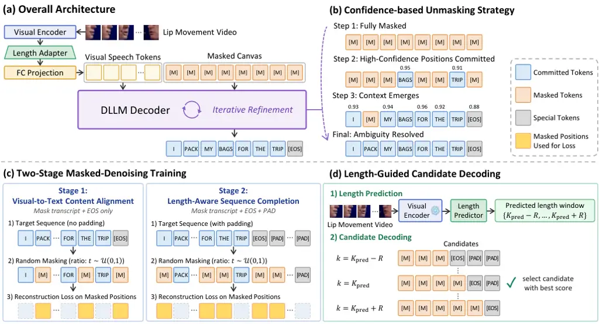

# Diffusion Large Language Models for Visual Speech Recognition

Jeong Hun Yeo    Chae Won Kim    Hyeongseop Rha    Yong Man Ro^(\*)
Affiliation: Integrated Vision Language Lab, KAIST, South Korea
Affiliation: {sedne246, chaewonkim, ryool_1832, ymro}@kaist.ac.kr

###### Abstract

Existing Visual Speech Recognition (VSR) systems commonly rely on
left-to-right autoregressive decoding, which can force premature
decisions on visually ambiguous tokens before sufficient context is
available. We propose DLLM-VSR, to the best of our knowledge, the first
Diffusion Large Language Model (DLLM)-based VSR framework, formulating
transcription as iterative masked denoising with flexible-order
decoding. With confidence-based unmasking, DLLM-VSR commits
high-confidence positions early and uses the committed tokens as
bidirectional context to refine ambiguous ones. To adapt DLLMs to VSR,
we introduce a two-stage masked-denoising training strategy that
separates visual-to-text content alignment from length modeling. We
further observe a performance gap compared with an upper-bound setting
where the ground-truth transcript length is provided at inference,
allowing the model to focus on transcript content decoding. To reduce
this gap, we develop length-guided candidate decoding, which uses video
duration to construct plausible transcript-length hypotheses and reranks
the decoded candidates using length plausibility and decoding
confidence. The proposed method achieves a 19.4% word error rate on
LRS3, establishing state-of-the-art performance among methods using only
LRS3 as labeled training data. The code is available at
[https://bit.ly/DLLM-VSR](https://bit.ly/DLLM-VSR).

^(†)^(†)footnotetext: ^(∗)Corresponding Author.

## 1 Introduction

Visual Speech Recognition (VSR) Afouras et al. (2018a); Ma et al.
(2023), also known as lip reading, aims to transcribe spoken utterances
into text using only visual cues from a speaker’s mouth movements. As a
visual-only speech interface, VSR can provide deaf and hard-of-hearing
users with visual access to spoken language and enable silent
communication in situations where audio input is impractical or
undesirable. Despite these promising applications, VSR remains a
challenging task due to the inherent phonetic ambiguity of lip
movements. Although spoken English contains approximately 40 distinct
phonemes, these phonemes collapse into only about 10–13 visually
distinguishable units, commonly referred to as visemes Cappelletta and
Harte (2012); Bear and Harvey (2016). As a result, multiple phonemes may
belong to the same viseme group (e.g., /p/, /b/, and /m/), making them
nearly indistinguishable from visual evidence alone.

Figure 1: Conceptual comparison between autoregressive decoding and the
proposed method.

To mitigate this ambiguity, recent VSR systems have improved through
advances in both visual encoders and text decoders. On the encoder side,
attention-based Transformer architectures have enabled long-range
temporal modeling of lip movement sequences, while self-supervised
pretraining has improved visual speech representations by leveraging
large-scale unlabeled audio-visual data Shi et al. (2022); Haliassos et
al. (2023). On the decoder side, autoregressive decoders have become a
common choice, generating transcripts token by token in a fixed
left-to-right order Afouras et al. (2018a); Ma et al. (2023). More
recently, Large Language Model (LLM)-based decoders Grattafiori et al.
(2024); Yang et al. (2025a) have further improved performance by
injecting stronger linguistic priors into the decoding process Yeo et
al. (2024a); Cappellazzo et al. (2025).

However, despite these gains, current LLM-based VSR systems remain
constrained by the fixed left-to-right token generation order of
autoregressive decoding. While suitable for sequential transcription,
this rigid order can be suboptimal for VSR, where visual evidence is
highly uneven across output positions. Due to viseme ambiguity and weak
visual cues, some tokens may remain highly uncertain, whereas others can
be predicted with relatively high confidence from visual evidence or
contextual constraints. Consequently, strict left-to-right generation
can force the model to commit to ambiguous early positions before
easier, high-confidence positions become available as contextual
anchors. This motivates a strategy that first commits high-confidence
positions and progressively uses the committed tokens to disambiguate
uncertain ones, as illustrated in Figure 1.

In this paper, we propose DLLM-VSR, the first Diffusion Large Language
Model (DLLM)-based framework for VSR to the best of our knowledge.
Unlike autoregressive decoders, DLLMs start from a fixed-length canvas
initialized with mask tokens and iteratively denoise masked positions
into text tokens, enabling flexible-order generation Nie et al. (2025);
Ye et al. (2025). To determine which positions to unmask and commit at
each iteration, we adopt confidence-based unmasking, a common DLLM
decoding strategy that prioritizes high-confidence positions Yu et al.
(2025). This naturally matches VSR by operationalizing the
high-confidence-first decoding strategy: reliable positions are unmasked
early, and through bidirectional refinement, the committed tokens guide
visually ambiguous positions.

To train the model, a standard DLLM formulation represents each target
sequence on a fixed-length masked canvas with transcript tokens followed
by an end-of-sequence (EOS) token and padding (PAD) tokens, enabling
variable-length transcripts to be trained under a unified denoising
objective. A direct instantiation for DLLM-VSR would therefore supervise
transcript positions with text tokens and positions beyond EOS with PAD
tokens. However, this can lead to padding-heavy supervision, as shorter
transcripts leave many canvas positions assigned to padding prediction.
Recent observations suggest that excessive padding loss can reduce
sample efficiency and cause generation instability in DLLMs Xie et al.
(2025). Inspired by this observation, we propose a two-stage
masked-denoising training strategy tailored to VSR, which separates
content learning from length modeling: the first stage predicts only
transcript tokens and the immediately following EOS token, while the
second additionally predicts PAD tokens beyond EOS for length modeling.

After two-stage training, DLLM-VSR outperforms recent LLM-based VSR
systems, showing the effectiveness of the proposed DLLM-based decoding
framework for VSR. Furthermore, to investigate its performance upper
bound, we evaluate the proposed method in an oracle setting where the
ground-truth transcript length is given and used to fix EOS and PAD
positions in advance. The substantial error reduction in this setting
indicates that reducing uncertainty in EOS and PAD placement could
further improve decoding. Motivated by this observation, we introduce
length-guided candidate decoding, which leverages video duration to
construct plausible transcript-length hypotheses, decodes candidates for
each hypothesis, and selects the final transcript by reranking them
using length plausibility and decoding confidence. Together, our
training and decoding strategies achieve a 19.4% word error rate (WER)
on LRS3, establishing state-of-the-art performance among methods using
only LRS3 as labeled training data.

## 2 Related Work

### 2.1 Visual Speech Recognition

VSR aims to transcribe silent lip movement videos into text. Modern VSR
systems typically follow an encoder–decoder paradigm, where a visual
encoder extracts visual speech representations from lip movements and a
text decoder converts them into text tokens. On the encoder side, prior
work has improved representations through visual front-ends Stafylakis
and Tzimiropoulos (2017), Transformer- and Conformer-based temporal
modeling Afouras et al. (2018a); Ma et al. (2021), audio-guided
multimodal self-supervised learning Shi et al. (2022); Haliassos et al.
(2023), and data scaling with ASR-generated pseudo labels Yeo et al.
(2024c); Ma et al. (2023). While these advances have strengthened
encoder-side representations, this work focuses on the decoding stage,
which remains crucial for resolving visual ambiguity.

Early VSR decoders were built on Connectionist Temporal Classification
(CTC) Assael et al. (2016), which offers efficient non-autoregressive
decoding but relies on a conditional independence assumption that limits
the modeling of dependencies among output tokens. Autoregressive
decoders Afouras et al. (2018a) address this limitation by incorporating
language modeling into decoding, where each token is predicted
conditioned on visual representations and previously generated tokens.
Recent work has further leveraged abundant audio and audio-text data to
strengthen decoder-side linguistic priors. Examples include transferring
knowledge from pretrained ASR models Zhao et al. (2020); Ren et al.
(2021), leveraging paired audio-text data for decoder pretraining Kim et
al. (2023); Yeo et al. (2024b), and aligning visual representations with
intermediate representations of strong speech models such as
Whisper Prajwal et al. (2024). More recently, LLM-based decoders Yeo et
al. (2024a); Cappellazzo et al. (2025) have been introduced to exploit
even stronger linguistic priors for resolving visual ambiguity in VSR.
However, most of these approaches still retain the standard
left-to-right generation order, despite the highly ambiguous and uneven
nature of visual speech evidence. In line with this decoder-centric
direction, our work improves VSR not by strengthening linguistic priors
alone, but by revisiting the token generation order itself.



Figure 2: Overview of DLLM-VSR. (a) Overall architecture with a frozen
visual encoder, a length adapter, FC projection layers, and a
LoRA-adapted DLLM decoder. (b) Confidence-based unmasking, where
high-confidence positions are committed first and the committed tokens
are used as bidirectional textual context. (c) Two-stage
masked-denoising training for visual-to-text content alignment and
length-aware sequence completion. Yellow boxes indicate masked positions
used for the reconstruction loss. (d) Length-guided candidate decoding
with multiple length hypotheses and joint candidate reranking. $`R`$
denotes the candidate-length search radius, i.e., candidate lengths are
decoded within $`K_{\mathrm{pred}}\pm R`$.

### 2.2 Diffusion Large Language Models

DLLMs have recently attracted increasing attention for enabling parallel
decoding with bidirectional attention, offering a promising direction
for improving LLM inference efficiency. Early scaling efforts such as
LLaDA Nie et al. (2025) demonstrated that diffusion-based language
modeling can be trained from scratch at the 8B scale and achieve
performance competitive with strong autoregressive LLMs. Another line of
work adapts pretrained autoregressive LLMs into diffusion language
models, from earlier efforts such as DiffuLLaMA and DiffuGPT Gong et al.
(2025) to recent models such as Dream Ye et al. (2025), which builds on
Qwen2.5 Yang et al. (2025a) and shows strong performance on general
language, mathematical reasoning, and code generation tasks. More
recently, multimodal DLLMs such as LLaDA-V You et al. (2026), LaViDa Li
et al. (2025), and Dimple Yu et al. (2025) have extended diffusion-style
decoding to visual inputs through visual instruction tuning or
adaptation from pretrained vision-language models. These advances
suggest that DLLMs are evolving from text-only generators into
general-purpose decoders for multimodal conditional generation.

Despite this progress, DLLMs face a fundamental challenge in
variable-length generation due to their fixed-length canvas. Unlike
autoregressive models, which terminate by emitting an EOS token, DLLMs
must commit to a canvas size before denoising. A too-short canvas may
truncate the output, whereas an overly long canvas wastes computation on
redundant EOS or padding positions and can degrade generation quality.
Existing approaches address this issue through three main directions:
training-based length control Yang et al. (2025b); Wu et al. (2026),
such as DreamOn’s \[expand\]/\[delete\] operations; training-free canvas
adaptation based on inference-time signals Li et al. (2026); Cheng et
al. (2026), such as DAEDAL’s EOS-confidence criterion; and
semi-autoregressive block-wise decoding, as in Block Diffusion Arriola
et al. (2025). Our approach follows the training-free direction, but
differs in how the target length is estimated. Instead of relying solely
on model-internal signals to search for an adequate canvas size, we
exploit a task-specific property of VSR: transcript length is strongly
correlated with input video duration.

## 3 Method

Our model is illustrated in Figure 2. Given a lip movement video and a
masked transcript canvas, the model generates a transcript by
iteratively denoising masked positions, where high-confidence positions
are committed and their tokens serve as textual context for resolving
visually ambiguous ones. We first describe the visual-conditioned DLLM
architecture, then introduce our two-stage masked-denoising training
strategy and length-guided candidate decoding.

### 3.1 Architecture

Following recent LLM-based VSR systems Yeo et al. (2024a); Cappellazzo
et al. (2025), we retain the visual encoder and projection interface but
replace the left-to-right autoregressive decoder with a DLLM decoder.
Given a lip movement video $`V=\{f_{1},\dots,f_{N}\}`$ consisting of
$`N`$ frames, our goal is to generate the transcript
$`x_{0}=\{x_{0}^{1},\dots,x_{0}^{K}\}`$ of length $`K`$. The
architecture consists of a pretrained visual encoder Shi et al. (2022);
Haliassos et al. (2026), a length adapter, two projection layers that
map visual features into the language embedding space, and a DLLM
decoder conditioned on the resulting visual speech tokens $`v`$.

A DLLM models the transcript on a fixed-length canvas of $`T`$ token
positions, where $`T`$ is chosen to accommodate the longest training
transcript including the EOS token. Starting from a fully masked canvas,
the DLLM iteratively predicts token distributions for all masked
positions conditioned on the visual speech tokens $`v`$ and the
currently unmasked tokens. Following confidence-based unmasking Yu et
al. (2025), we commit positions whose confidence exceeds a fixed
threshold, or the most confident position if none exceeds the threshold.
Once a position is committed, its predicted token is kept fixed and used
as bidirectional context for the remaining masked positions.

To train the DLLM decoder, we follow the masked diffusion
formulation Nie et al. (2025). Given a target sequence $`x_{0}`$ on the
canvas, we sample a masking ratio $`t\sim\mathcal{U}(0,1)`$ and replace
selected tokens with the mask token $`\mathrm{M}`$ to obtain $`x_{t}`$.
Let $`\mathcal{M}=\{i:x_{t}^{i}=\mathrm{M}\}`$ denote the masked
positions. Conditioned on the visual speech tokens $`v`$ and the
unmasked tokens in $`x_{t}`$, the model reconstructs the original tokens
at masked positions using the following loss:

```math
\mathcal{L}=-\mathbb{E}_{t,v,x_{0},x_{t}}\left[\frac{1}{t}\sum_{i\in\mathcal{M}}\log p_{\theta}(x_{0}^{i}\mid v,x_{t})\right], \tag{1}
```

where $`\theta`$ denotes the trainable parameters. Our two-stage
strategy below uses the same objective but differs in the target canvas
and the set of positions included in $`\mathcal{M}`$.

### 3.2 Two-Stage Masked-Denoising Training

A straightforward way to train the DLLM decoder is to apply the
diffusion objective directly over the full canvas containing transcript,
EOS, and PAD tokens. However, when the canvas is much longer than the
transcript, PAD tokens occupy a large fraction of supervised positions
and can dominate the loss. We therefore decompose training into two
stages: the first learns content prediction using only transcript and
EOS positions, while the second extends denoising to the full canvas to
learn padding completion beyond EOS. Since the EOS token is attached
directly after the transcript, the first stage still exposes the model
to transcript termination without requiring it to model a long
non-content suffix.

#### 3.2.1 Stage 1: Visual-to-Text Content Alignment

In the first stage, we exclude padding positions and train on the
transcript followed by an EOS token. Given
$`x_{0}=\{x_{0}^{1},\dots,x_{0}^{K},\mathrm{EOS}\}`$, we sample a
masking ratio $`t\sim\mathcal{U}(0,1)`$ and mask its tokens to obtain
$`x_{t}`$, so that $`\mathcal{M}`$ spans only the transcript tokens and
the following EOS token. Training with Eq. 1 over $`\mathcal{M}`$
encourages visual-to-text content alignment and transcript termination
without being dominated by padding prediction.

#### 3.2.2 Stage 2: Length-Aware Sequence Completion

Building on Stage 1, the second stage extends each sequence to the
canvas length $`T`$ by filling positions after the EOS token with PAD
tokens. We then apply masked reconstruction over the entire canvas, so
that $`\mathcal{M}`$ spans transcript, EOS, and PAD positions. Training
with Eq. 1 over this full-canvas $`\mathcal{M}`$ teaches the model to
preserve transcript and EOS prediction while completing the remaining
canvas with PAD tokens, enabling variable-length generation within a
fixed-length canvas.

### 3.3 Length-Guided Candidate Decoding

A DLLM generates a transcript by denoising a fixed-length canvas of
$`T`$ positions, where the transcript occupies a prefix and the
remaining positions are filled with an EOS token and PAD tokens. Thus,
the transcript length $`K`$ determines the partition between content and
non-content positions. Inferring $`K`$ implicitly during denoising can
be suboptimal for VSR: overestimated lengths introduce spurious content
positions, while underestimated lengths truncate the transcript. We
therefore propose length-guided candidate decoding, which predicts
plausible transcript lengths from the input video and decodes candidates
under multiple length hypotheses.

Length prediction. We attach a lightweight length predictor on top of
the frozen visual encoder to estimate the transcript length $`K`$ from
the visual feature sequence. Since the visual features are produced at a
fixed temporal rate, their sequence length reflects the input video
duration and provides a useful cue for transcript length. The predictor
pools the visual features with a learnable query token and classifies
over candidate lengths, yielding $`P(K\mid v)`$. It is trained
independently using cross-entropy loss against the ground-truth
transcript length.

Candidate decoding under length hypotheses. Rather than relying on a
single predicted length, we decode a candidate pool around the top-1
prediction,
$`\mathcal{K}=\{K_{\text{pred}}-R,\dots,K_{\text{pred}}+R\}`$, where
$`K_{\text{pred}}=\arg\max_{k}P(k\mid v)`$ and $`R`$ denotes the
candidate-length search radius. For each $`k\in\mathcal{K}`$, we
initialize the first $`k`$ positions as mask tokens, pin an EOS token at
position $`k+1`$, and fill the remaining positions with PAD tokens. The
pinned EOS and PAD tokens are kept fixed throughout decoding, and
confidence-based unmasking is applied only to the first $`k`$ transcript
positions. For efficiency, we batch the candidates corresponding to all
$`k\in\mathcal{K}`$ and perform denoising in parallel. Decoding each
length hypothesis yields a candidate transcript, together with the token
confidence values and the number of denoising iterations required for
completion, which are used for joint reranking.

Joint reranking. We select the final transcript by reranking candidates
with the following joint score:

```math
s(k)=\sum_{i=1}^{k}\log c_{i}+\lambda\log p_{k}-\beta n_{k}, \tag{2}
```

where $`c_{i}`$ is the confidence of the committed token at transcript
position $`i`$, $`p_{k}=P(k\mid v)`$ is the probability assigned to
length $`k`$ by the length predictor, $`n_{k}`$ is the number of
denoising iterations required to complete the candidate of length $`k`$,
and $`\lambda`$ and $`\beta`$ are balancing weights. We refer to the
three terms as the _sequence confidence score_, _length-prediction
score_, and _iteration penalty_, respectively. The sequence confidence
score aggregates the log-confidence of tokens at the time they are
committed and is used as a sequence-level confidence measure for
candidate comparison. The length-prediction score favors candidate
lengths assigned high probability by the video-conditioned length
predictor. The iteration penalty penalizes candidates according to the
number of denoising iterations required for completion. The final
transcript is obtained from the highest-scoring candidate:

```math
k^{*}=\arg\max_{k\in\mathcal{K}}s(k). \tag{3}
```

Method Pub. Encoder Decoder Encoder Pretraining Data (h) Labeled Data
(h) WER (%)$`\downarrow`$ Fully Supervised Afouras et al. (2018a)
TPAMI’18 Transformer Transformer – 1,519 58.9 Makino et al. (2019)
ASRU’19 BiLSTM RNN-T – 31,000 33.6 Prajwal et al. (2022) CVPR’22
Transformer Transformer – 2,676 30.7 Ma et al. (2023) ICASSP’23
Conformer Transformer – 3,448 19.1 Serdyuk et al. (2022) Interspeech’22
ViT3D RNN-T – 90,000 17.0 Chang et al. (2024) ICASSP’24 Conformer RNN-T
– 100,000 12.8 Self-Supervised Shi et al. (2022) ICLR’22 AV-HuBERT
Transformer 1,759 433 28.6 Zhu et al. (2024) TMM’24 VATLM Transformer
1,759 433 28.4 Haliassos et al. (2023) ICLR’23 RAVEn Transformer 1,759
433 27.8 Haliassos et al. (2026) ICLR’26 USR 2.0 Transformer 3,305 433
^(‡) 25.8 LLM-Augmented Yeo et al. (2024a) EMNLP’24 AV-HuBERT Llama2-7B
1,759 433 25.4 Cappellazzo et al. (2025) ICASSP’25 AV-HuBERT Llama3-8B
1,759 433 25.3 Cappellazzo et al. (2026) ICASSP’26 AV-HuBERT Qwen2.5-7B
1,759 433 24.9 Yuan et al. (2025) ICCV’25 AV-HuBERT Llama3-8B 1,759 433
^(†) 22.0 DLLM-Augmented Ours – AV-HuBERT Dream-7B 1,759 433 21.9 Ours –
USR 2.0 Dream-7B 3,305 433 19.4

Table 1: Comparison with state-of-the-art VSR methods on LRS3. ^(†)
indicates the use of additional video-level metadata, such as title,
description, and speaker name. ^(‡) indicates our reproduction.

## 4 Experimental Setup

### 4.1 Datasets

We evaluate on three sentence-level English VSR benchmarks: LRS3 Afouras
et al. (2018b), LRS2 Afouras et al. (2018a), and WildVSR Djilali et al.
(2024). LRS3 is a widely used TED/TEDx-based VSR benchmark and serves as
our primary dataset. Our LRS3 and WildVSR evaluations use models trained
for VSR using only the 433-hour LRS3 training set as labeled data. LRS2,
collected from BBC television programs, is used as a complementary
benchmark, with all systems evaluated on LRS2 trained on its 223-hour
training set. WildVSR is used for out-of-domain evaluation.

### 4.2 Implementation Details

We use two self-supervised pretrained visual encoders, USR 2.0
Huge Haliassos et al. (2026) and AV-HuBERT Large Shi et al. (2022), with
Dream-7B Ye et al. (2025) as the DLLM decoder. Visual features are
downsampled from 25 to 12.5 fps by a 1D convolutional length adapter and
mapped to Dream-7B’s 3584-dimensional hidden space by a 2-layer
projector. LoRA is applied to all linear layers with rank $`r=16`$ and
$`\alpha=32`$. Length-guided candidate decoding uses a lightweight
2-layer Transformer length predictor with roughly 4M trainable
parameters. Detailed architecture-, encoder-, and dataset-specific
optimization settings are provided in Appendix B. We report word error
rate (WER) to measure recognition accuracy and real-time factor (RTF) to
evaluate decoding efficiency, where RTF is defined as decoding time
divided by video duration. RTF is measured on 50 test videos with batch
size 1 on a single GPU, following 5 warm-up samples that are excluded
from measurement.

### 4.3 Inference and Decoding Strategies

To characterize the role of transcript-length information at inference,
we consider three decoding strategies. For oracle-length decoding, the
ground-truth sequence length is given, providing an upper bound with
respect to transcript-length uncertainty. Decoding is performed on a
length-matched canvas that exactly fits the transcript and its
terminating EOS token. For implicit-length decoding, the transcript
length is unknown, and decoding starts from a fully masked canvas of
length $`T=32`$. The model jointly predicts the transcript content and
length; once an EOS token is committed, the positions after it are
filled with PAD tokens and excluded from the output, while decoding
continues until all remaining masked positions are committed. For
length-guided candidate decoding, we decode a pool of length hypotheses
around the predicted length. For each hypothesis, transcript positions
are initialized with mask tokens and the corresponding EOS position is
fixed; for parallel decoding, shorter candidates are padded with PAD
tokens to the length of the longest candidate in the batch. The final
transcript is selected among the candidates within a search radius $`R`$
of $`K_{\mathrm{pred}}`$ using the joint score in Eq. 2. Reranking
weights $`\lambda`$ and $`\beta`$ are selected on the validation set by
grid search over $`[0,1]\times[0,1]`$ with a step size of 0.1. The
selected values are $`(0.9,0.7)`$ for AV-HuBERT/LRS3, $`(0.9,0.6)`$ for
USR 2.0/LRS3, and $`(1.0,0.9)`$ for USR 2.0/LRS2. For WildVSR, we use a
canvas length of $`T=96`$ to accommodate longer utterances, while
directly using the LRS3-trained model and length predictor with all
other LRS3-tuned decoding and reranking settings, without adaptation.
Unless otherwise specified, main results are reported with $`R=3`$ (see
Sec. 5.7). Across all decoding strategies, positions with confidence
above 0.9 are committed; if none exceeds the threshold, the most
confident position is committed.

## 5 Experimental Results

Method Decoding Bi-dir. Attn. Block Size WER (%)$`\downarrow`$ AV-HuBERT
USR 2.0 Cappellazzo et al. (2026) AR ✗ 1 24.9 – Implicit-length decoding
without length guidance Ours AR ✓ 1 24.3 22.2 Block ✓ 2 23.8 21.6 ✓ 4
23.5 21.1 ✓ 8 23.3 20.7 ✓ 16 23.2 20.6 Parallel ✓ 32 23.1 20.5

Table 2: Effect of token commitment order and bidirectional attention on
LRS3. Block size denotes the number of mask tokens in each block; a
block size of 32 corresponds to full-parallel decoding over the entire
masked canvas.

### 5.1 Comparison with the State-of-the-Art Methods

Table 1 compares the proposed method with state-of-the-art VSR methods
on LRS3 across fully supervised, self-supervised, and LLM-based
settings. Since our method builds on a self-supervised pretrained visual
encoder, we first compare it with self-supervised encoder-based VSR
models to assess the effect of replacing the autoregressive decoder with
our DLLM-based framework. AV-HuBERT with a Transformer decoder reaches
28.6% WER when trained for VSR using only LRS3 as labeled data. Coupling
the same AV-HuBERT encoder with an LLM reduces WER; in particular,
Cappellazzo et al. (2026) combine AV-HuBERT with a Qwen2.5-7B LLM
decoder and achieve 24.9% WER. Our AV-HuBERT-based variant is directly
comparable to this baseline, as Dream-7B is initialized from Qwen2.5-7B
and further trained with masked denoising. Replacing the LLM decoder
with a DLLM decoder further reduces WER from 24.9% to 21.9%.

We further evaluate our method with the USR 2.0 encoder. Since no prior
work reports USR 2.0-based VSR using only LRS3 as labeled training data,
we reproduce it with the encoder frozen, obtaining 25.8% WER.
Integrating this encoder into our framework reduces WER from 25.8% to
19.4%. WER reductions are observed with both visual encoders, indicating
that the effectiveness of the proposed framework is consistent across
encoder choices. The resulting 19.4% WER approaches the 19.1% WER of
Auto-AVSR, which is trained on 3,448 hours of labeled data, while our
model uses 433 hours of labeled LRS3 data.

Configuration WER (%)$`\downarrow`$ AV-HuBERT USR 2.0 Stage-1-only
training Oracle-length decoding 21.9 17.8 Implicit-length decoding 188.0
275.0 After Stage 2 training Oracle-length decoding (upper bound) 20.2
17.7 Implicit-length decoding (no length guidance) 23.1 20.5
Length-guided candidate decoding: reranking terms Sequence confidence
($`\sum\log c_{i}`$) + length prediction ($`\lambda\log p_{k}`$) 22.6
20.2 + Iteration penalty ($`-\beta n_{k}`$) 21.9 19.4

Table 3: Ablation of Stage 2 training and reranking terms in
length-guided candidate decoding on LRS3.

### 5.2 Effect of Token Commitment Order

Table 2 analyzes the effect of token commitment order by first isolating
bidirectional attention and then varying the block size. In block-based
decoding, token positions within each block are committed based on
confidence, and decoding proceeds to the next block only after the
current block is fully decoded. Larger blocks therefore allow a wider
range of positions to be committed in a flexible order. Compared with
the LLM-based VSR method Cappellazzo et al. (2026), our DLLM with
autoregressive decoding reduces WER from 24.9% to 24.3% under the same
left-to-right commitment order, showing the benefit of bidirectional
attention. Performance consistently improves as the block size increases
from 2 to 32, reducing WER from 23.8% to 23.1% with AV-HuBERT and from
21.6% to 20.5% with USR 2.0; full-parallel decoding performs best.

### 5.3 Ablation Study

Table 3 analyzes the effect of Stage 2 training and the contribution of
the reranking terms used in length-guided candidate decoding on LRS3. We
first examine the role of Stage 2 by evaluating a Stage-1-only model.
Under oracle-length decoding, the Stage-1-only model achieves 21.9% WER
with AV-HuBERT and 17.8% with USR 2.0. Under implicit-length decoding,
its WER is 188.0% and 275.0%, respectively. After Stage 2 training, WER
under the same implicit-length decoding setting is 23.1% with AV-HuBERT
and 20.5% with USR 2.0. Oracle-length decoding achieves 20.2% and 17.7%
WER, respectively, compared with 23.1% and 20.5% under implicit-length
decoding. This gap represents the performance loss when transcript
length must be inferred rather than provided. We then evaluate how the
reranking terms in length-guided candidate decoding mitigate this gap.
Using the sequence confidence and length-prediction scores in Eq. 2
reduces WER from 23.1% to 22.6% with AV-HuBERT and from 20.5% to 20.2%
with USR 2.0. Adding the iteration penalty further reduces WER to 21.9%
and 19.4%, respectively.

Model / Decoding WER (%)$`\downarrow`$ RTF$`\downarrow`$ Autoregressive
baselines Transformer decoder (greedy) 24.7 0.09 Qwen2.5-7B AR (greedy)
21.9 0.27 Qwen2.5-7B AR (beam=5) 20.5 0.34 Proposed method Oracle-length
decoding (upper bound) 14.7 0.12 Implicit-length decoding (no length
guidance) 17.7 0.14 Length-guided candidate decoding 16.8 0.86

Table 4: WER and decoding efficiency on LRS2. All models are trained and
evaluated on LRS2 using the USR 2.0 visual encoder.

### 5.4 Effectiveness Across Datasets

To verify that the effectiveness of the proposed method is not specific
to LRS3, we further evaluate it on LRS2. The Transformer decoder obtains
24.7% WER with an RTF of 0.09. Replacing it with a Qwen2.5-7B LLM
decoder reduces WER to 21.9% with greedy decoding and 20.5% with beam
search, with RTFs of 0.27 and 0.34, respectively. Using the proposed
method, oracle-length decoding achieves 14.7% WER with an RTF of 0.12,
while implicit-length decoding obtains 17.7% WER with an RTF of 0.14.
Length-guided candidate decoding further reduces WER to 16.8% with an
RTF of 0.86. Consistent with the results on LRS3, the proposed method
achieves lower WER than the autoregressive baselines on LRS2.

### 5.5 Out-of-Domain Generalization to WildVSR

To examine out-of-domain generalization, we compare the proposed method
with AV-HuBERT and VSP-LLM on WildVSR. Compared with AV-HuBERT, VSP-LLM
reduces WER from 28.6% to 25.4% on LRS3, while the WER on WildVSR
changes only from 51.7% to 51.6%. Using the same AV-HuBERT encoder, the
proposed method achieves 21.9% WER on LRS3 and 46.1% on WildVSR. Unlike
the LLM-based baseline, the improvement observed on LRS3 is also
observed on WildVSR. With the USR 2.0 encoder, WER is further reduced to
19.4% on LRS3 and 39.9% on WildVSR. Overall, the proposed method
achieves lower WER on both LRS3 and WildVSR across the two visual
encoders.

Method Encoder Decoder WER (%)$`\downarrow`$ LRS3 WildVSR AV-HuBERT Shi
et al. (2022) AV-HuBERT Transformer 28.6 51.7 VSP-LLM Yeo et al. (2024a)
AV-HuBERT Llama2-7B 25.4 51.6 Ours AV-HuBERT Dream-7B 21.9 46.1 USR 2.0
19.4 39.9

Table 5: Out-of-domain generalization from LRS3 to WildVSR. The proposed
method uses the LRS3-trained model and length predictor with $`T=96`$
and all other LRS3-tuned decoding and reranking hyperparameters
unchanged. WildVSR results for Shi et al. (2022) and Yeo et al. (2024a)
are reported by Jain and Harte (2026).

Encoder Test Set Acc@0 Acc@1 Acc@3 Acc@5 AV-HuBERT LRS3 43.68 88.04
99.39 100.00 WildVSR 18.78 50.11 84.58 95.09 USR 2.0 LRS3 44.21 87.59
99.32 99.92 WildVSR 18.96 51.89 84.90 95.97

Table 6: Length prediction accuracy (%) across LRS3 and WildVSR using
length predictors trained only on LRS3. Acc@$`k`$ denotes the proportion
of test samples whose ground-truth length falls within $`\pm k`$ tokens
of the predicted length.

### 5.6 Length Prediction Accuracy Across Datasets

To further analyze the out-of-domain results on WildVSR, Table 6
evaluates the length predictor, trained only on LRS3, on both LRS3 and
WildVSR. On LRS3, Acc@0 is around 44%, Acc@1 around 88%, and Acc@3 above
99% for both encoders. On WildVSR, Acc@0 decreases to around 19% and
Acc@1 to around 50–52%. However, the ground-truth length remains within
$`\pm 3`$ tokens of the prediction for about 85% of samples and within
$`\pm 5`$ tokens for about 95–96%. With the default search radius of
$`R=3`$, the ground-truth length is therefore included in the candidate
range for about 85% of WildVSR samples, supporting length-guided
candidate decoding under the out-of-domain setting.

$`R`$ \# Cand. WER (%)$`\downarrow`$ RTF$`\downarrow`$ AV-HuBERT USR 2.0
AV-HuBERT USR 2.0 Implicit-length decoding (no length guidance) – 1 23.1
20.5 0.14 0.14 Length-guided candidate decoding 1 3 22.6 20.3 0.31 0.29
2 5 22.1 19.7 0.60 0.55 3 7 21.9 19.4 0.91 0.87 5 11 21.9 19.5 1.59 1.51

Table 7: Accuracy–efficiency trade-off with varying candidate-length
search radius $`R`$ on LRS3. We use $`R=3`$ as the default setting.

[TABLE]

Table 8: Qualitative comparison of token commitment orders with
representative success and failure cases.

### 5.7 Effect of Candidate-Length Search Radius

Table 7 analyzes the accuracy–efficiency trade-off of length-guided
candidate decoding as the candidate-length search radius $`R`$ varies.
For this analysis, we decode the $`K_{\mathrm{pred}}\pm 5`$ candidate
pool once and restrict the candidate set during reranking for each
$`R`$; the reported RTF corresponds to decoding only the candidates
within the respective radius. Increasing $`R`$ from 1 to 3 reduces WER
from 20.3% to 19.4% with USR 2.0 and from 22.6% to 21.9% with AV-HuBERT,
while increasing RTF. Increasing $`R`$ further to 5 does not improve WER
and incurs additional decoding cost. We therefore use $`R=3`$ as the
default setting.

### 5.8 Qualitative Analysis

Table 8 shows qualitative success and failure cases. In the success
case, left-to-right decoding commits the erroneous prefix sage vision,
whereas full-parallel decoding first reveals reliable later context and
recovers science fiction. This shows that flexible-order decoding can
provide useful semantic constraints for ambiguous positions. The failure
cases show that errors can remain when ground-truth and predicted
phrases are both fluent and visually plausible, such as harvest versus
harvested or remember versus remembered.

## 6 Conclusion

We presented DLLM-VSR, a diffusion large language model-based framework
that revisits token commitment order for visual speech recognition. By
replacing left-to-right autoregressive decoding with flexible-order
masked denoising, the framework allows confident tokens to serve as
contextual anchors for resolving visually ambiguous positions. We
further introduced two-stage masked-denoising training and length-guided
candidate decoding to address fixed-canvas training and length
uncertainty. Experiments on LRS3 and LRS2 demonstrate consistent
improvements over autoregressive baselines, while evaluation on WildVSR
shows that these improvements extend to an out-of-domain setting.

## Limitations

We find that controlling token generation order substantially benefits
DLLM-based VSR, and oracle-length decoding reveals the upper bound
achievable when the transcript length is known. While our length-guided
candidate decoding narrows the gap to this oracle setting, a gap
remains, indicating that length modeling can be further improved.
Moreover, evaluating multiple length hypotheses increases inference
time, so reducing the computational overhead of length-guided candidate
decoding is an important direction for future work. Our evaluation is
limited to English benchmarks spanning curated and in-the-wild settings;
robustness to more heterogeneous visual conditions and potential
performance disparities across demographic and speaker-specific factors
have not been evaluated at the subgroup level and remain open questions.

## Ethical Considerations

VSR systems can improve accessibility for deaf and hard-of-hearing users
and enable silent communication, but they may raise privacy concerns
because spoken content could be inferred from silent videos without
speaker consent. Such systems should therefore be used only with
appropriate consent and safeguards. We use existing datasets and
pretrained models only for VSR research. Given potential performance
disparities across speakers and demographic groups, we do not recommend
deployment in high-stakes settings without careful validation and human
oversight.

## Acknowledgments

This work was supported in part by IITP grant funded by the Korea
government (MSIT) (No. RS-2020-II200004, Development of Previsional
Intelligence based on Long-Term Visual Memory Network), in part by the
National Research Foundation of Korea (NRF) grant funded by the Korea
government (MSIT) (RS-2022-NR070162), and in part by the KAIST Jang
Young Sil Fellow Program.

## References

- Afouras et al. (2018a) T. Afouras, J. S. Chung, A. Senior, O. Vinyals,
  and A. Zisserman Deep audio-visual speech recognition. IEEE
  transactions on pattern analysis and machine intelligence 44 (12),
  pp. 8717–8727. Cited by: §1, §1, §2.1, §2.1, Table 1, §4.1.
- Afouras et al. (2018b) T. Afouras, J. S. Chung, and A. Zisserman
  LRS3-ted: a large-scale dataset for visual speech recognition. arXiv
  preprint arXiv:1809.00496. Cited by: §4.1.
- Arriola et al. (2025) M. Arriola, A. Gokaslan, J. Chiu, Z. Yang, Z.
  Qi, J. Han, S. Sahoo, and V. Kuleshov Block diffusion: interpolating
  between autoregressive and diffusion language models. In International
  Conference on Learning Representations, Vol. 2025, pp. 50726–50753.
  Cited by: §2.2.
- Assael et al. (2016) Y. M. Assael, B. Shillingford, S. Whiteson,
  and N. De Freitas Lipnet: end-to-end sentence-level lipreading. arXiv
  preprint arXiv:1611.01599. Cited by: §2.1.
- Bear and Harvey (2016) H. L. Bear and R. Harvey Decoding visemes:
  improving machine lip-reading. In 2016 IEEE International Conference
  on Acoustics, Speech and Signal Processing (ICASSP), pp. 2009–2013.
  Cited by: §1.
- Cappellazzo et al. (2025) U. Cappellazzo, M. Kim, H. Chen, P. Ma, S.
  Petridis, D. Falavigna, A. Brutti, and M. Pantic Large language models
  are strong audio-visual speech recognition learners. In ICASSP
  2025-2025 IEEE International Conference on Acoustics, Speech and
  Signal Processing (ICASSP), pp. 1–5. Cited by: §A.2, §1, §2.1, §3.1,
  Table 1.
- Cappellazzo et al. (2026) U. Cappellazzo, X. Liu, P. Ma, S. Petridis,
  and M. Pantic Omni-avsr: towards unified multimodal speech recognition
  with large language models. In ICASSP 2026-2026 IEEE International
  Conference on Acoustics, Speech and Signal Processing (ICASSP),
  pp. 17772–17776. Cited by: Table 1, §5.1, §5.2, Table 2.
- Cappelletta and Harte (2012) L. Cappelletta and N. Harte
  Phoneme-to-viseme mapping for visual speech recognition. In
  International Conference on Pattern Recognition Applications and
  Methods, Vol. 2, pp. 322–329. Cited by: §1.
- Chang et al. (2024) O. Chang, H. Liao, D. Serdyuk, A. Shah, and O.
  Siohan Conformer is all you need for visual speech recognition. In
  ICASSP 2024-2024 IEEE International Conference on Acoustics, Speech
  and Signal Processing (ICASSP), pp. 10136–10140. Cited by: Table 1.
- Cheng et al. (2026) Z. Cheng, R. Jia, J. Li, G. Yang, M. Guo, and S.
  Hu Improving variable-length generation in diffusion language models
  via length regularization. arXiv preprint arXiv:2602.07546. Cited by:
  §2.2.
- Djilali et al. (2024) Y. A. D. Djilali, S. Narayan, E. LeBihan, H.
  Boussaid, E. Almazrouei, and M. Debbah Do vsr models generalize beyond
  lrs3?. In Proceedings of the IEEE/CVF Winter Conference on
  Applications of Computer Vision, pp. 6635–6644. Cited by: §4.1.
- Gong et al. (2025) S. Gong, S. Agarwal, Y. Zhang, J. Ye, L. Zheng, M.
  Li, C. An, P. Zhao, W. Bi, J. Han, H. Peng, and L. Kong Scaling
  diffusion language models via adaptation from autoregressive models.
  In International Conference on Learning Representations, Y. Yue, A.
  Garg, N. Peng, F. Sha, and R. Yu (Eds.), Vol. 2025, pp. 5046–5073.
  External Links:
  [Link](https://proceedings.iclr.cc/paper_files/paper/2025/file/0fa81c3f0d57f95b8776de3a248ef0ed-Paper-Conference.pdf)
  Cited by: §2.2.
- Grattafiori et al. (2024) A. Grattafiori, A. Dubey, A. Jauhri, A.
  Pandey, A. Kadian, A. Al-Dahle, A. Letman, A. Mathur, A. Schelten, A.
  Vaughan, A. Yang, A. Fan, A. Goyal, A. Hartshorn, A. Yang, A.
  Mitra, A. Sravankumar, A. Korenev, A. Hinsvark, A. Rao, A. Zhang, A.
  Rodriguez, A. Gregerson, A. Spataru, B. Roziere, B. Biron, B. Tang, B.
  Chern, C. Caucheteux, C. Nayak, C. Bi, C. Marra, C. McConnell, C.
  Keller, C. Touret, C. Wu, C. Wong, C. C. Ferrer, C. Nikolaidis, D.
  Allonsius, D. Song, D. Pintz, D. Livshits, D. Wyatt, D. Esiobu, D.
  Choudhary, D. Mahajan, D. Garcia-Olano, D. Perino, D. Hupkes, E.
  Lakomkin, E. AlBadawy, E. Lobanova, E. Dinan, E. M. Smith, F.
  Radenovic, F. Guzmán, F. Zhang, G. Synnaeve, G. Lee, G. L.
  Anderson, G. Thattai, G. Nail, G. Mialon, G. Pang, G. Cucurell, H.
  Nguyen, H. Korevaar, H. Xu, H. Touvron, I. Zarov, I. A. Ibarra, I.
  Kloumann, I. Misra, I. Evtimov, J. Zhang, J. Copet, J. Lee, J.
  Geffert, J. Vranes, J. Park, J. Mahadeokar, J. Shah, J. van der
  Linde, J. Billock, J. Hong, J. Lee, J. Fu, J. Chi, J. Huang, J.
  Liu, J. Wang, J. Yu, J. Bitton, J. Spisak, J. Park, J. Rocca, J.
  Johnstun, J. Saxe, J. Jia, K. V. Alwala, K. Prasad, K. Upasani, K.
  Plawiak, K. Li, K. Heafield, K. Stone, K. El-Arini, K. Iyer, K.
  Malik, K. Chiu, K. Bhalla, K. Lakhotia, L. Rantala-Yeary, L. van der
  Maaten, L. Chen, L. Tan, L. Jenkins, L. Martin, L. Madaan, L. Malo, L.
  Blecher, L. Landzaat, L. de Oliveira, M. Muzzi, M. Pasupuleti, M.
  Singh, M. Paluri, M. Kardas, M. Tsimpoukelli, M. Oldham, M. Rita, M.
  Pavlova, M. Kambadur, M. Lewis, M. Si, M. K. Singh, M. Hassan, N.
  Goyal, N. Torabi, N. Bashlykov, N. Bogoychev, N. Chatterji, N.
  Zhang, O. Duchenne, O. Çelebi, P. Alrassy, P. Zhang, P. Li, P.
  Vasic, P. Weng, P. Bhargava, P. Dubal, P. Krishnan, P. S. Koura, P.
  Xu, Q. He, Q. Dong, R. Srinivasan, R. Ganapathy, R. Calderer, R. S.
  Cabral, R. Stojnic, R. Raileanu, R. Maheswari, R. Girdhar, R.
  Patel, R. Sauvestre, R. Polidoro, R. Sumbaly, R. Taylor, R. Silva, R.
  Hou, R. Wang, S. Hosseini, S. Chennabasappa, S. Singh, S. Bell, S. S.
  Kim, S. Edunov, S. Nie, S. Narang, S. Raparthy, S. Shen, S. Wan, S.
  Bhosale, S. Zhang, S. Vandenhende, S. Batra, S. Whitman, S. Sootla, S.
  Collot, S. Gururangan, S. Borodinsky, T. Herman, T. Fowler, T.
  Sheasha, T. Georgiou, T. Scialom, T. Speckbacher, T. Mihaylov, T.
  Xiao, U. Karn, V. Goswami, V. Gupta, V. Ramanathan, V. Kerkez, V.
  Gonguet, V. Do, V. Vogeti, V. Albiero, V. Petrovic, W. Chu, W.
  Xiong, W. Fu, W. Meers, X. Martinet, X. Wang, X. Wang, X. E. Tan, X.
  Xia, X. Xie, X. Jia, X. Wang, Y. Goldschlag, Y. Gaur, Y. Babaei, Y.
  Wen, Y. Song, Y. Zhang, Y. Li, Y. Mao, Z. D. Coudert, Z. Yan, Z.
  Chen, Z. Papakipos, A. Singh, A. Srivastava, A. Jain, A. Kelsey, A.
  Shajnfeld, A. Gangidi, A. Victoria, A. Goldstand, A. Menon, A.
  Sharma, A. Boesenberg, A. Baevski, A. Feinstein, A. Kallet, A.
  Sangani, A. Teo, A. Yunus, A. Lupu, A. Alvarado, A. Caples, A. Gu, A.
  Ho, A. Poulton, A. Ryan, A. Ramchandani, A. Dong, A. Franco, A.
  Goyal, A. Saraf, A. Chowdhury, A. Gabriel, A. Bharambe, A.
  Eisenman, A. Yazdan, B. James, B. Maurer, B. Leonhardi, B. Huang, B.
  Loyd, B. D. Paola, B. Paranjape, B. Liu, B. Wu, B. Ni, B. Hancock, B.
  Wasti, B. Spence, B. Stojkovic, B. Gamido, B. Montalvo, C. Parker, C.
  Burton, C. Mejia, C. Liu, C. Wang, C. Kim, C. Zhou, C. Hu, C. Chu, C.
  Cai, C. Tindal, C. Feichtenhofer, C. Gao, D. Civin, D. Beaty, D.
  Kreymer, D. Li, D. Adkins, D. Xu, D. Testuggine, D. David, D.
  Parikh, D. Liskovich, D. Foss, D. Wang, D. Le, D. Holland, E.
  Dowling, E. Jamil, E. Montgomery, E. Presani, E. Hahn, E. Wood, E.
  Le, E. Brinkman, E. Arcaute, E. Dunbar, E. Smothers, F. Sun, F.
  Kreuk, F. Tian, F. Kokkinos, F. Ozgenel, F. Caggioni, F. Kanayet, F.
  Seide, G. M. Florez, G. Schwarz, G. Badeer, G. Swee, G. Halpern, G.
  Herman, G. Sizov, Guangyi, Zhang, G. Lakshminarayanan, H. Inan, H.
  Shojanazeri, H. Zou, H. Wang, H. Zha, H. Habeeb, H. Rudolph, H.
  Suk, H. Aspegren, H. Goldman, H. Zhan, I. Damlaj, I. Molybog, I.
  Tufanov, I. Leontiadis, I. Veliche, I. Gat, J. Weissman, J.
  Geboski, J. Kohli, J. Lam, J. Asher, J. Gaya, J. Marcus, J. Tang, J.
  Chan, J. Zhen, J. Reizenstein, J. Teboul, J. Zhong, J. Jin, J.
  Yang, J. Cummings, J. Carvill, J. Shepard, J. McPhie, J. Torres, J.
  Ginsburg, J. Wang, K. Wu, K. H. U, K. Saxena, K. Khandelwal, K.
  Zand, K. Matosich, K. Veeraraghavan, K. Michelena, K. Li, K.
  Jagadeesh, K. Huang, K. Chawla, K. Huang, L. Chen, L. Garg, L. A, L.
  Silva, L. Bell, L. Zhang, L. Guo, L. Yu, L. Moshkovich, L.
  Wehrstedt, M. Khabsa, M. Avalani, M. Bhatt, M. Mankus, M. Hasson, M.
  Lennie, M. Reso, M. Groshev, M. Naumov, M. Lathi, M. Keneally, M.
  Liu, M. L. Seltzer, M. Valko, M. Restrepo, M. Patel, M. Vyatskov, M.
  Samvelyan, M. Clark, M. Macey, M. Wang, M. J. Hermoso, M. Metanat, M.
  Rastegari, M. Bansal, N. Santhanam, N. Parks, N. White, N. Bawa, N.
  Singhal, N. Egebo, N. Usunier, N. Mehta, N. P. Laptev, N. Dong, N.
  Cheng, O. Chernoguz, O. Hart, O. Salpekar, O. Kalinli, P. Kent, P.
  Parekh, P. Saab, P. Balaji, P. Rittner, P. Bontrager, P. Roux, P.
  Dollar, P. Zvyagina, P. Ratanchandani, P. Yuvraj, Q. Liang, R.
  Alao, R. Rodriguez, R. Ayub, R. Murthy, R. Nayani, R. Mitra, R.
  Parthasarathy, R. Li, R. Hogan, R. Battey, R. Wang, R. Howes, R.
  Rinott, S. Mehta, S. Siby, S. J. Bondu, S. Datta, S. Chugh, S.
  Hunt, S. Dhillon, S. Sidorov, S. Pan, S. Mahajan, S. Verma, S.
  Yamamoto, S. Ramaswamy, S. Lindsay, S. Lindsay, S. Feng, S. Lin, S. C.
  Zha, S. Patil, S. Shankar, S. Zhang, S. Zhang, S. Wang, S. Agarwal, S.
  Sajuyigbe, S. Chintala, S. Max, S. Chen, S. Kehoe, S. Satterfield, S.
  Govindaprasad, S. Gupta, S. Deng, S. Cho, S. Virk, S. Subramanian, S.
  Choudhury, S. Goldman, T. Remez, T. Glaser, T. Best, T. Koehler, T.
  Robinson, T. Li, T. Zhang, T. Matthews, T. Chou, T. Shaked, V.
  Vontimitta, V. Ajayi, V. Montanez, V. Mohan, V. S. Kumar, V.
  Mangla, V. Ionescu, V. Poenaru, V. T. Mihailescu, V. Ivanov, W. Li, W.
  Wang, W. Jiang, W. Bouaziz, W. Constable, X. Tang, X. Wu, X. Wang, X.
  Wu, X. Gao, Y. Kleinman, Y. Chen, Y. Hu, Y. Jia, Y. Qi, Y. Li, Y.
  Zhang, Y. Zhang, Y. Adi, Y. Nam, Yu, Wang, Y. Zhao, Y. Hao, Y.
  Qian, Y. Li, Y. He, Z. Rait, Z. DeVito, Z. Rosnbrick, Z. Wen, Z.
  Yang, Z. Zhao, and Z. Ma The llama 3 herd of models. External Links:
  2407.21783, [Link](https://arxiv.org/abs/2407.21783) Cited by: §1.
- Haliassos et al. (2023) A. Haliassos, P. Ma, R. Mira, S. Petridis,
  and M. Pantic Jointly learning visual and auditory speech
  representations from raw data. In The Eleventh International
  Conference on Learning Representations, External Links:
  [Link](https://openreview.net/forum?id=BPwIgvf5iQ) Cited by: §1, §2.1,
  Table 1.
- Haliassos et al. (2026) A. Haliassos, R. Mira, and S. Petridis Pay
  attention to CTC: fast and robust pseudo-labelling for unified speech
  recognition. In The Fourteenth International Conference on Learning
  Representations, External Links:
  [Link](https://openreview.net/forum?id=sSbEEHNEsL) Cited by: §3.1,
  Table 1, §4.2.
- Jain and Harte (2026) R. Jain and N. Harte From hype to insight:
  rethinking large language model integration in visual speech
  recognition. In ICASSP 2026-2026 IEEE International Conference on
  Acoustics, Speech and Signal Processing (ICASSP), pp. 18717–18721.
  Cited by: Table 5.
- Kim et al. (2023) M. Kim, J. H. Yeo, J. Choi, and Y. M. Ro Lip reading
  for low-resource languages by learning and combining general speech
  knowledge and language-specific knowledge. In 2023 IEEE/CVF
  International Conference on Computer Vision (ICCV), Vol. ,
  pp. 15313–15325. External Links:
  [Document](https://dx.doi.org/10.1109/ICCV51070.2023.01409) Cited by:
  §2.1.
- Li et al. (2026) J. Li, X. Dong, Y. Zang, Y. Cao, J. Wang, and D. Lin
  Beyond fixed: training-free variable-length denoising for diffusion
  large language models. In The Fourteenth International Conference on
  Learning Representations, External Links:
  [Link](https://openreview.net/forum?id=Ic2A2gCseC) Cited by: §2.2.
- Li et al. (2025) S. Li, K. Kallidromitis, H. Bansal, A. Gokul, Y.
  Kato, K. Kozuka, J. Kuen, Z. Lin, K. Chang, and A. Grover LaViDa: a
  large diffusion language model for multimodal understanding. In
  Advances in Neural Information Processing Systems, D. Belgrave, C.
  Zhang, H. Lin, R. Pascanu, P. Koniusz, M. Ghassemi, and N. Chen
  (Eds.), Vol. 38, Main Conference, pp. 105101–105134. External Links:
  [Document](https://dx.doi.org/10.52202/085713-3511),
  [Link](https://proceedings.neurips.cc/paper_files/paper/2025/file/975affbe7b5f3b55fba62247b6877b1c-Paper-Conference.pdf)
  Cited by: §2.2.
- Ma et al. (2023) P. Ma, A. Haliassos, A. Fernandez-Lopez, H. Chen, S.
  Petridis, and M. Pantic Auto-avsr: audio-visual speech recognition
  with automatic labels. In ICASSP 2023-2023 IEEE International
  Conference on Acoustics, Speech and Signal Processing (ICASSP),
  pp. 1–5. Cited by: §1, §1, §2.1, Table 1.
- Ma et al. (2021) P. Ma, S. Petridis, and M. Pantic End-to-end
  audio-visual speech recognition with conformers. In ICASSP 2021-2021
  IEEE International Conference on Acoustics, Speech and Signal
  Processing (ICASSP), pp. 7613–7617. Cited by: §2.1.
- Makino et al. (2019) T. Makino, H. Liao, Y. Assael, B.
  Shillingford, B. Garcia, O. Braga, and O. Siohan Recurrent neural
  network transducer for audio-visual speech recognition. In 2019 IEEE
  automatic speech recognition and understanding workshop (ASRU),
  pp. 905–912. Cited by: Table 1.
- Nie et al. (2025) S. Nie, F. Zhu, Z. You, X. Zhang, J. Ou, J. Hu, J.
  Zhou, Y. Lin, J. Wen, and C. LI Large language diffusion models. In
  Advances in Neural Information Processing Systems, D. Belgrave, C.
  Zhang, H. Lin, R. Pascanu, P. Koniusz, M. Ghassemi, and N. Chen
  (Eds.), Vol. 38, Main Conference, pp. 50608–50646. External Links:
  [Document](https://dx.doi.org/10.52202/085713-1689),
  [Link](https://proceedings.neurips.cc/paper_files/paper/2025/file/48b383b24230e0e6e649d9c98dae4d8c-Paper-Conference.pdf)
  Cited by: §1, §2.2, §3.1.
- Prajwal et al. (2022) K. R. Prajwal, T. Afouras, and A. Zisserman
  Sub-word level lip reading with visual attention. In 2022 IEEE/CVF
  Conference on Computer Vision and Pattern Recognition (CVPR), Vol. ,
  pp. 5152–5162. External Links:
  [Document](https://dx.doi.org/10.1109/CVPR52688.2022.00510) Cited by:
  Table 1.
- Prajwal et al. (2024) K. Prajwal, T. Afouras, and A. Zisserman Speech
  recognition models are strong lip-readers. In Proc. Interspeech 2024,
  pp. 2425–2429. Cited by: §2.1.
- Ren et al. (2021) S. Ren, Y. Du, J. Lv, G. Han, and S. He Learning
  from the master: distilling cross-modal advanced knowledge for lip
  reading. In 2021 IEEE/CVF Conference on Computer Vision and Pattern
  Recognition (CVPR), Vol. , pp. 13320–13328. External Links:
  [Document](https://dx.doi.org/10.1109/CVPR46437.2021.01312) Cited by:
  §2.1.
- Serdyuk et al. (2022) D. Serdyuk, O. Braga, and O. Siohan
  Transformer-Based Video Front-Ends for Audio-Visual Speech Recognition
  for Single and Multi-Person Video. In Interspeech 2022, pp. 2833–2837.
  External Links:
  [Document](https://dx.doi.org/10.21437/Interspeech.2022-10920), ISSN
  2958-1796 Cited by: Table 1.
- Shi et al. (2022) B. Shi, W. Hsu, K. Lakhotia, and A. Mohamed Learning
  audio-visual speech representation by masked multimodal cluster
  prediction. In International Conference on Learning Representations,
  External Links: [Link](https://openreview.net/forum?id=Z1Qlm11uOM)
  Cited by: §1, §2.1, §3.1, Table 1, §4.2, Table 5, Table 5.
- Stafylakis and Tzimiropoulos (2017) T. Stafylakis and G. Tzimiropoulos
  Combining Residual Networks with LSTMs for Lipreading. In Interspeech
  2017, pp. 3652–3656. External Links:
  [Document](https://dx.doi.org/10.21437/Interspeech.2017-85), ISSN
  2958-1796 Cited by: §2.1.
- Wu et al. (2026) Z. Wu, L. Zheng, Z. Xie, J. Ye, J. Gao, S. Gong, Y.
  Feng, Z. Li, W. BI, G. Zhou, and L. Kong DreamOn: diffusion language
  models for code infilling beyond fixed-size canvas. In International
  Conference on Learning Representations, C. Vondrick, B. Hariharan, C.
  Raffel, L. Pinto, D. Yang, and A. Faust (Eds.), Vol. 2026,
  pp. 76626–76643. External Links:
  [Link](https://proceedings.iclr.cc/paper_files/paper/2026/file/7c020dd308d7413b5078686723b2f857-Paper-Conference.pdf)
  Cited by: §2.2.
- Xie et al. (2025) Z. Xie, J. Ye, L. Zheng, J. Gao, J. Dong, Z. Wu, X.
  Zhao, S. Gong, X. Jiang, Z. Li, and L. Kong Dream-coder 7b: an open
  diffusion language model for code. External Links: 2509.01142,
  [Link](https://arxiv.org/abs/2509.01142) Cited by: §1.
- Yang et al. (2025a) A. Yang, B. Yang, B. Zhang, B. Hui, B. Zheng, B.
  Yu, C. Li, D. Liu, F. Huang, H. Wei, H. Lin, J. Yang, J. Tu, J.
  Zhang, J. Yang, J. Yang, J. Zhou, J. Lin, K. Dang, K. Lu, K. Bao, K.
  Yang, L. Yu, M. Li, M. Xue, P. Zhang, Q. Zhu, R. Men, R. Lin, T.
  Li, T. Tang, T. Xia, X. Ren, X. Ren, Y. Fan, Y. Su, Y. Zhang, Y.
  Wan, Y. Liu, Z. Cui, Z. Zhang, and Z. Qiu Qwen2.5 technical report.
  External Links: 2412.15115, [Link](https://arxiv.org/abs/2412.15115)
  Cited by: §1, §2.2.
- Yang et al. (2025b) Y. Yang, C. Wang, S. Wang, Z. Wen, B. Qi, H. Xu,
  and L. Zhang Diffusion llm with native variable generation lengths:
  let \[eos\] lead the way. arXiv preprint arXiv:2510.24605. Cited by:
  §2.2.
- Ye et al. (2025) J. Ye, Z. Xie, L. Zheng, J. Gao, Z. Wu, X. Jiang, Z.
  Li, and L. Kong Dream 7b: diffusion large language models. arXiv
  preprint arXiv:2508.15487. Cited by: §1, §2.2, §4.2.
- Yeo et al. (2024a) J. H. Yeo, S. Han, M. Kim, and Y. M. Ro Where
  visual speech meets language: vsp-llm framework for efficient and
  context-aware visual speech processing. In Findings of the Association
  for Computational Linguistics: EMNLP 2024, pp. 11391–11406. Cited by:
  §1, §2.1, §3.1, Table 1, Table 5, Table 5.
- Yeo et al. (2024b) J. H. Yeo, M. Kim, J. Choi, D. H. Kim, and Y. M. Ro
  Akvsr: audio knowledge empowered visual speech recognition by
  compressing audio knowledge of a pretrained model. IEEE Transactions
  on Multimedia 26, pp. 6462–6474. Cited by: §2.1.
- Yeo et al. (2024c) J. H. Yeo, M. Kim, S. Watanabe, and Y. M. Ro Visual
  speech recognition for languages with limited labeled data using
  automatic labels from whisper. In ICASSP 2024-2024 IEEE International
  Conference on Acoustics, Speech and Signal Processing (ICASSP),
  pp. 10471–10475. Cited by: §2.1.
- You et al. (2026) Z. You, S. Nie, X. Zhang, J. ZHOU, Z. Lu, J. Wen,
  and C. Li LLaDA-v: large language diffusion models with visual
  instruction tuning. In Proceedings of the IEEE/CVF Conference on
  Computer Vision and Pattern Recognition (CVPR), pp. 10093–10105. Cited
  by: §2.2.
- Yu et al. (2025) R. Yu, X. Ma, and X. Wang Dimple: discrete diffusion
  multimodal large language model with parallel decoding. arXiv preprint
  arXiv:2505.16990. Cited by: §1, §2.2, §3.1.
- Yuan et al. (2025) Z. Yuan, S. Yang, S. Shan, and X. Chen Not only
  vision: evolve visual speech recognition via peripheral information.
  In Proceedings of the IEEE/CVF International Conference on Computer
  Vision (ICCV), pp. 3091–3100. Cited by: Table 1.
- Zhao et al. (2020) Y. Zhao, R. Xu, X. Wang, P. Hou, H. Tang, and M.
  Song Hearing lips: improving lip reading by distilling speech
  recognizers. In Proceedings of the AAAI Conference on Artificial
  Intelligence, Vol. 34, pp. 6917–6924. Cited by: §2.1.
- Zhu et al. (2024) Q. Zhu, L. Zhou, Z. Zhang, S. Liu, B. Jiao, J.
  Zhang, L. Dai, D. Jiang, J. Li, and F. Wei VatLM: visual-audio-text
  pre-training with unified masked prediction for speech representation
  learning. IEEE Transactions on Multimedia 26 (), pp. 1055–1064.
  External Links:
  [Document](https://dx.doi.org/10.1109/TMM.2023.3275873) Cited by:
  Table 1.

Tuned on $`(\lambda,\beta)`$ WER (%)$`\downarrow`$ LRS3 LRS2 WildVSR
Implicit-length decoding (no length guidance) – – 20.5 17.7 42.6
Length-guided candidate decoding: reranking weights LRS3 $`(0.9,0.6)`$
19.4 17.1 39.9 LRS2 $`(1.0,0.9)`$ 19.5 16.8 40.0 WildVSR tuning
(held-out analysis) WildVSR^(†) $`(0.62,0.32)`$ – – 40.0 $`\pm`$0.1

Table 9: Cross-dataset robustness of reranking weights using USR 2.0
with $`R=3`$. Since WildVSR has no validation set, ^(†) indicates that
the weights are tuned on a held-out 10% subset, and each tuned pair is
evaluated on the full test set; mean $`\pm`$ std over five random
splits.

|                               |       |       |       |       |       |       |       |       |       |       |       |
| ----------------------------- | ----- | ----- | ----- | ----- | ----- | ----- | ----- | ----- | ----- | ----- | ----- |
| LRS3 AV-HuBERT validation set |       |       |       |       |       |       |       |       |       |       |       |
| $`\lambda\backslash\beta`$    | 0.0   | 0.1   | 0.2   | 0.3   | 0.4   | 0.5   | 0.6   | 0.7   | 0.8   | 0.9   | 1.0   |
| 0.0                           | 15.76 | 15.24 | 15.24 | 15.53 | 15.78 | 15.78 | 15.91 | 16.06 | 16.26 | 16.45 | 16.55 |
| 0.1                           | 13.28 | 13.30 | 13.34 | 13.72 | 13.94 | 14.33 | 14.63 | 14.80 | 15.03 | 15.09 | 15.18 |
| 0.2                           | 12.63 | 12.45 | 12.74 | 12.84 | 13.13 | 13.48 | 13.64 | 13.92 | 14.05 | 14.16 | 14.42 |
| 0.3                           | 12.38 | 12.16 | 12.22 | 12.37 | 12.65 | 12.71 | 12.91 | 13.21 | 13.32 | 13.54 | 13.64 |
| 0.4                           | 12.38 | 11.96 | 12.02 | 12.12 | 12.29 | 12.39 | 12.60 | 12.78 | 12.86 | 13.02 | 13.15 |
| 0.5                           | 12.38 | 11.92 | 11.93 | 11.99 | 12.02 | 12.15 | 12.24 | 12.39 | 12.67 | 12.77 | 12.80 |
| 0.6                           | 12.50 | 12.06 | 11.94 | 11.91 | 11.93 | 11.92 | 12.04 | 12.13 | 12.27 | 12.53 | 12.65 |
| 0.7                           | 12.49 | 12.02 | 11.84 | 11.80 | 11.84 | 11.83 | 11.91 | 11.90 | 11.96 | 12.13 | 12.35 |
| 0.8                           | 12.50 | 12.08 | 11.88 | 11.85 | 11.78 | 11.74 | 11.77 | 11.78 | 11.81 | 11.94 | 12.12 |
| 0.9                           | 12.56 | 12.17 | 11.89 | 11.87 | 11.79 | 11.76 | 11.77 | 11.73 | 11.77 | 11.82 | 11.95 |
| 1.0                           | 12.64 | 12.30 | 12.06 | 11.92 | 11.80 | 11.77 | 11.78 | 11.77 | 11.85 | 11.82 | 11.91 |

Table 10: Validation WER (%) of length-guided reranking weights on LRS3
with AV-HuBERT. The best setting is $`(\lambda,\beta)=(0.9,0.7)`$, with
a validation WER of 11.73%.

|                             |       |       |       |       |       |       |       |       |       |       |       |
| --------------------------- | ----- | ----- | ----- | ----- | ----- | ----- | ----- | ----- | ----- | ----- | ----- |
| LRS3 USR 2.0 validation set |       |       |       |       |       |       |       |       |       |       |       |
| $`\lambda\backslash\beta`$  | 0.0   | 0.1   | 0.2   | 0.3   | 0.4   | 0.5   | 0.6   | 0.7   | 0.8   | 0.9   | 1.0   |
| 0.0                         | 19.57 | 19.24 | 19.63 | 19.87 | 19.96 | 20.38 | 20.85 | 21.01 | 21.16 | 21.31 | 21.55 |
| 0.1                         | 17.23 | 16.86 | 16.95 | 17.43 | 17.92 | 18.16 | 18.48 | 18.79 | 19.16 | 19.27 | 19.57 |
| 0.2                         | 16.92 | 16.51 | 16.60 | 16.63 | 17.01 | 17.24 | 17.73 | 17.86 | 18.18 | 18.37 | 18.55 |
| 0.3                         | 16.76 | 16.52 | 16.48 | 16.52 | 16.63 | 16.61 | 16.95 | 17.40 | 17.62 | 17.90 | 18.08 |
| 0.4                         | 16.85 | 16.34 | 16.27 | 16.29 | 16.41 | 16.44 | 16.61 | 16.73 | 17.16 | 17.40 | 17.57 |
| 0.5                         | 16.97 | 16.41 | 16.09 | 16.20 | 16.18 | 16.33 | 16.39 | 16.48 | 16.62 | 16.95 | 17.24 |
| 0.6                         | 17.06 | 16.47 | 16.24 | 16.17 | 16.16 | 16.19 | 16.27 | 16.34 | 16.45 | 16.55 | 16.71 |
| 0.7                         | 17.22 | 16.63 | 16.30 | 16.17 | 16.14 | 16.12 | 16.19 | 16.28 | 16.29 | 16.36 | 16.53 |
| 0.8                         | 17.31 | 16.70 | 16.42 | 16.15 | 16.11 | 16.15 | 16.18 | 16.22 | 16.29 | 16.28 | 16.40 |
| 0.9                         | 17.46 | 16.76 | 16.55 | 16.17 | 16.11 | 16.08 | 16.04 | 16.20 | 16.28 | 16.39 | 16.38 |
| 1.0                         | 17.43 | 16.94 | 16.55 | 16.20 | 16.11 | 16.11 | 16.05 | 16.09 | 16.32 | 16.32 | 16.37 |

Table 11: Validation WER (%) of length-guided reranking weights on LRS3
with USR 2.0. The best setting is $`(\lambda,\beta)=(0.9,0.6)`$, with a
validation WER of 16.04%.

|                             |       |       |       |       |       |       |       |       |       |       |       |
| --------------------------- | ----- | ----- | ----- | ----- | ----- | ----- | ----- | ----- | ----- | ----- | ----- |
| LRS2 USR 2.0 validation set |       |       |       |       |       |       |       |       |       |       |       |
| $`\lambda\backslash\beta`$  | 0.0   | 0.1   | 0.2   | 0.3   | 0.4   | 0.5   | 0.6   | 0.7   | 0.8   | 0.9   | 1.0   |
| 0.0                         | 30.29 | 30.64 | 31.49 | 32.23 | 33.35 | 33.89 | 34.67 | 35.42 | 35.65 | 35.95 | 36.12 |
| 0.1                         | 24.80 | 24.78 | 25.65 | 26.51 | 26.89 | 27.97 | 28.68 | 29.24 | 30.42 | 30.98 | 31.63 |
| 0.2                         | 24.03 | 23.62 | 23.84 | 24.33 | 24.75 | 25.21 | 25.73 | 26.43 | 27.19 | 27.98 | 28.57 |
| 0.3                         | 23.75 | 23.35 | 23.19 | 23.46 | 23.74 | 23.85 | 24.40 | 24.90 | 25.17 | 25.64 | 26.28 |
| 0.4                         | 23.89 | 23.44 | 23.15 | 23.16 | 23.21 | 23.33 | 23.53 | 23.96 | 24.40 | 24.50 | 24.89 |
| 0.5                         | 23.98 | 23.42 | 23.29 | 23.16 | 23.20 | 23.09 | 23.12 | 23.46 | 23.66 | 23.98 | 24.13 |
| 0.6                         | 23.90 | 23.49 | 23.24 | 23.07 | 23.07 | 23.06 | 23.07 | 23.15 | 23.21 | 23.40 | 23.71 |
| 0.7                         | 23.90 | 23.61 | 23.35 | 23.24 | 23.07 | 22.96 | 23.01 | 23.05 | 23.10 | 23.09 | 23.20 |
| 0.8                         | 23.99 | 23.58 | 23.34 | 23.19 | 23.20 | 22.93 | 22.85 | 22.96 | 23.02 | 22.92 | 22.96 |
| 0.9                         | 24.08 | 23.66 | 23.47 | 23.24 | 23.18 | 23.09 | 23.00 | 22.97 | 22.87 | 22.92 | 22.87 |
| 1.0                         | 24.15 | 23.76 | 23.54 | 23.37 | 23.18 | 23.15 | 23.01 | 22.98 | 22.88 | 22.83 | 22.91 |

Table 12: Validation WER (%) of length-guided reranking weights on LRS2
with USR 2.0. The best setting is $`(\lambda,\beta)=(1.0,0.9)`$, with a
validation WER of 22.83%.

## Appendix A Additional Experiments

### A.1 Cross-Dataset Robustness of Reranking Weights

To examine the robustness of the reranking weights $`(\lambda,\beta)`$
across datasets, Table 9 uses implicit-length decoding without length
guidance as a reference. Applying the LRS3-tuned weights directly to
LRS2 and WildVSR reduces WER from 17.7% to 17.1% and from 42.6% to
39.9%, respectively. Similarly, applying the LRS2-tuned weights to LRS3
and WildVSR reduces WER from 20.5% to 19.5% and from 42.6% to 40.0%,
respectively. To further examine whether tuning directly on WildVSR
provides additional benefit, we conduct a held-out analysis because
WildVSR does not provide a validation set. We tune the weights on a
randomly held-out 10% subset, and evaluate each tuned pair on the full
test set, obtaining 40.0% WER with a standard deviation of 0.1 over five
random splits. This result is comparable to the 39.9% and 40.0% WER
obtained using the LRS3- and LRS2-tuned weights, indicating that the
reranking weights remain effective without dataset-specific tuning.

### A.2 Behavior under Low-Confidence Conditions

To examine how DLLM-VSR behaves when visual evidence does not support
confident token commitment, we analyze decoding behavior under
low-confidence conditions. Specifically, we consider cases where
confidence remains low across the sequence. We first compute an
utterance-level mean commit confidence by averaging the confidence of
each transcript token at the step when it is committed. This confidence
measure is negatively correlated with WER, with Pearson $`r=-0.73`$ on
LRS3 and $`-0.81`$ on WildVSR, indicating that utterances with lower
commit confidence tend to have higher recognition error. We further
compare DLLM-VSR with an LLM-based VSR baseline Cappellazzo et al.
(2025) on the low-confidence subset, defined as utterances with mean
commit confidence below 0.5. On LRS3, this subset contains 29 utterances
(2.2%), where DLLM-VSR obtains 90.1% WER compared with 119.8% for the
baseline. On WildVSR, the subset contains 158 utterances (5.5%), with
WERs of 87.6% and 161.0%, respectively. In these subsets, 38% of the
baseline outputs exceed 100% WER due to repetitive hallucinations,
compared with 3–9% for DLLM-VSR. The fixed-length canvas constrains the
maximum output length, limiting such repetitive generation under
low-confidence conditions. We also examine the prevalence of
low-confidence cases. On LRS3, utterances for which more than 80% of
tokens have confidence below 0.5 account for only 0.5% of the test set.
Low-confidence cases are more frequent among short utterances, with a
rate of 16.1% for utterances of four words or fewer compared with 7.4%
for longer utterances.

### A.3 Reranking Weight Selection

We analyze the selection of the balancing weights $`\lambda`$ and
$`\beta`$ in the joint reranking score. Recall that $`\lambda`$ controls
the contribution of the length-prediction score, while $`\beta`$
controls the iteration penalty. We select $`(\lambda,\beta)`$ by grid
search over $`[0,1]\times[0,1]`$ with a step size of 0.1 on the
validation set. Tables 10–12 report the full validation grids for the
three evaluated settings. The selected values are $`(0.9,0.7)`$ for
AV-HuBERT/LRS3, $`(0.9,0.6)`$ for USR 2.0/LRS3, and $`(1.0,0.9)`$ for
USR 2.0/LRS2, yielding validation WERs of 11.73%, 16.04%, and 22.83%,
respectively. Across the three settings, the selected values fall within
$`\lambda\in[0.9,1.0]`$ and $`\beta\in[0.6,0.9]`$.

## Appendix B Implementation Details

Data statistics. In our processed datasets, the LRS3 training set (433
hours) consists of 164,916 utterances, of which 998 are held out as a
validation set for tuning the reranking weights. The LRS3 test set
contains 1,321 utterances. The LRS2 training set (223 hours) consists of
148,287 utterances, with 1,082 and 1,243 utterances used for validation
and testing, respectively. WildVSR is used exclusively for evaluation
and contains 2,854 test utterances.

Pre-processing. We follow the standard VSR preprocessing protocol for
LRS3 and LRS2. Video inputs are converted to greyscale mouth ROIs of
size $`88\times 88`$, using random cropping during training and center
cropping during evaluation. Frames are sampled at 25 fps and normalized
with mean 0.421 and standard deviation 0.165. During training, we apply
temporal masking with a window of 10 frames and stride of 25 frames.

Tokenization. Dream-7B and Qwen2.5-based experiments use the 152K Qwen2
tokenizer, with \<\|im_end\|\> as EOS and \<\|image_pad\|\> as PAD.
Inputs are formatted with the standard Hugging Face apply_chat_template
using one user turn with the instruction: “You are given a silent video
of a speaker. Infer the spoken content from the lip movements and
generate the corresponding transcription.”

Architecture. The frozen visual encoder is either USR 2.0 Huge (32
layers, hidden size 1280) or AV-HuBERT Large (24 layers, hidden size
1024). Visual features are passed through a 1D convolutional length
adapter with kernel size 2 and stride 2, followed by a two-layer
projector consisting of LayerNorm–Linear–GELU–Linear. The projector uses
a hidden dimension of $`\lfloor(d_{\mathrm{enc}}+3584)/2\rfloor`$ and
maps the visual features to the 3584-dimensional DLLM hidden space. The
base parameters of Dream-7B are frozen, while LoRA is applied to all
linear layers with rank $`r=16`$, $`\alpha=32`$, and dropout 0.05. The
total number of trainable parameters is 61.1M with USR 2.0, comprising
40.4M LoRA, 17.4M projector, and 3.3M length adapter parameters, and
53.1M with AV-HuBERT.

|                  |                                                          |
| ---------------- | -------------------------------------------------------- |
| Component        | Setting                                                  |
| Visual encoder   | USR 2.0 Huge / AV-HuBERT, frozen                         |
| Length adapter   | Conv1d, kernel size 2, stride 2                          |
| Projector        | 2-layer MLP to 3584-dim LLM space                        |
| LLM decoder      | Dream-7B, frozen                                         |
| LoRA             | $`r=16`$, $`\alpha=32`$, dropout 0.05, all linear layers |
| Canvas length    | $`T=32`$ ($`T=96`$ for WildVSR)                          |
| Block size       | 32                                                       |
| Commit threshold | 0.9                                                      |
| Candidate pool   | $`K_{\text{pred}}\pm 5`$ (selection radius $`R=3`$)      |

Table 13: Main implementation settings for DLLM-VSR.

Component Peak VRAM / GPU Steps Wall-clock Stage-1 training 22.6 GB
42,000 24.2 h Stage-2 training 22.5 GB 4,000 2.4 h Length predictor 10.5
GB 18,000 4.2 h Inference ($`R=3`$) 20.2 GB – RTF 0.87

Table 14: Measured computational cost of the full USR 2.0 pipeline.
Training wall-clock times are on 8$`\times`$ RTX 3090 (24GB) with
DeepSpeed ZeRO-2 and bf16 mixed precision; inference runs on a single
RTX 3090. The complete pipeline takes approximately 31 hours (about 245
GPU-hours).

Training. Both stages use AdamW with $`\beta_{1}=0.9`$,
$`\beta_{2}=0.999`$, weight decay 0.01, and gradient clipping with
maximum norm 1.0. Training uses bf16 mixed precision, DeepSpeed ZeRO-2
on 8 RTX 3090 GPUs, and dynamic batching with a maximum batch size of 32. Stage 1 is trained for 42K steps with a learning rate of
$`1\mathrm{e}{-4}`$, and Stage 2 is fine-tuned from Stage 1 for 4K steps
with a learning rate of $`5\mathrm{e}{-5}`$. We use a cosine scheduler
with a minimum learning-rate scale of 0.1. Due to computational cost,
each configuration is trained once, and all reported WER results are
from a single run unless otherwise stated.

Length predictor. The length predictor uses the same frozen visual
encoder as the main model. It consists of a two-layer Transformer
encoder with hidden dimension 384, 6 attention heads, feed-forward
dimension 1536, and dropout 0.1. A learnable \[LEN\] token is prepended
to the visual feature sequence, and its output is classified over
candidate transcript lengths. The predictor has approximately 4M
trainable parameters and is trained independently with cross-entropy
loss on the target transcript length for 18K/5K steps with
USR 2.0/AV-HuBERT on LRS3 and 20K steps on LRS2.

Decoding and reranking. At inference, we use a fixed canvas length of
$`T=32`$ ($`T=96`$ for WildVSR) and a block size of 32. We decode the
candidate pool within $`K_{\text{pred}}\pm 5`$, resulting in up to 11
candidates; all candidates are batched and decoded in parallel. During
denoising, positions whose confidence exceeds 0.9 are committed; if no
position exceeds the threshold, the most confident position is
committed. The final transcript is selected among candidates within
radius $`R=3`$ of $`K_{\text{pred}}`$ using the joint reranking score in
Eq. 2; the search-radius analysis in Sec. 5.7 varies only this selection
radius. Reranking weights $`(\lambda,\beta)`$ are selected by grid
search over $`[0,1]\times[0,1]`$ with a step size of 0.1 on the
validation set. The selected values are $`(0.9,0.7)`$ for
AV-HuBERT/LRS3, $`(0.9,0.6)`$ for USR 2.0/LRS3, and $`(1.0,0.9)`$ for
USR 2.0/LRS2.
