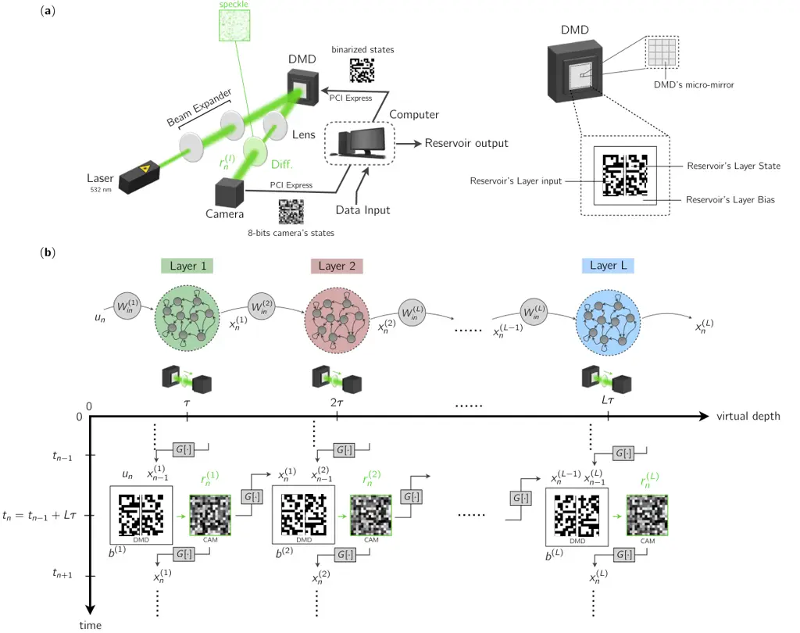
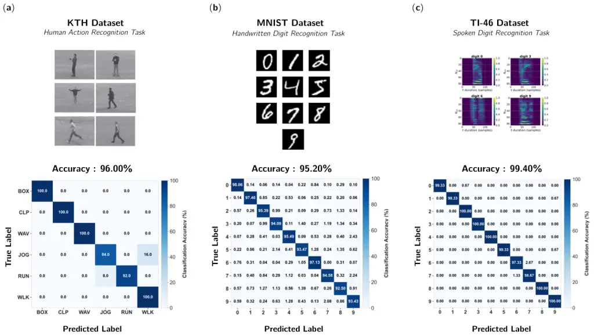
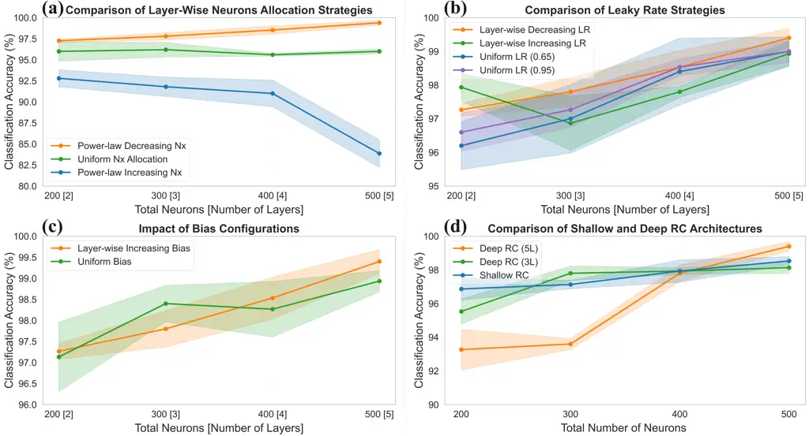

# Deep Binarized Photonic Reservoir Computing for Ultrafast Multimedia Signal Processing

Muhammad Waqar Iqbal Affiliation: Université de Lorraine,
CentraleSupélec, LMOPS Laboratory, F-57070 Metz, France Affiliation:
Chaire Photonique, LMOPS Laboratory, CentraleSupélec, F-57070 Metz,
France Affiliation: muhammad-waqar.iqbal@centralesupélec.fr -
damien.rontani@centralesupelec.fr    Mohamad Alassir Affiliation:
Université de Lorraine, CentraleSupélec, LMOPS Laboratory, F-57070 Metz,
France Affiliation: Chaire Photonique, LMOPS Laboratory,
CentraleSupélec, F-57070 Metz, France    Nicolas Marsal Affiliation:
Université de Lorraine, CentraleSupélec, LMOPS Laboratory, F-57070 Metz,
France Affiliation: Chaire Photonique, LMOPS Laboratory,
CentraleSupélec, F-57070 Metz, France    Damien Rontani Affiliation:
Université de Lorraine, CentraleSupélec, LMOPS Laboratory, F-57070 Metz,
France Affiliation: Chaire Photonique, LMOPS Laboratory,
CentraleSupélec, F-57070 Metz, France Affiliation:
muhammad-waqar.iqbal@centralesupélec.fr -
damien.rontani@centralesupelec.fr

###### Abstract

We present a deep photonic neural network architecture based on
ultrafast binary optical modulation from a digital micro-mirror device
(DMD), optical scattering in random medium, high-speed photodetection
with a CMOS sensor, and time-multiplexed deep layer structure. Operating
at Gigabit-per-second (Gb/s) processing rates, our system based on the
reservoir computing (RC) framework achieves state-of-the-art performance
across various multimedia tasks, including video, image and speech
recognition. We show that the careful optimization of key physical
intra- and inter-layer hyper-parameters can significantly enhance the
deep photonic RC system ability to extract relevant temporal and spatial
features via balancing memory retention and dynamical response of
individual layers. This approach paves the way for highly scalable
hierarchical photonic reservoir computing systems for high-throughput
real-time multimedia signal processing.

###### keywords

Photonic Reservoir Computing, Binarized Neural Networks, Fast Multimedia
Processing

## 1 Introduction

Reservoir computing (RC) is an innovative machine learning framework for
efficiently training recurrent neural networks (RNNs). It uses a fixed
and randomly initialized input layer, an untrained interconnected neural
network ("the so-called reservoir") and a trainable output layer \[31,
20\]. The reservoir acts as a high-dimensional nonlinear dynamical
system that projects input data into feature representations more
suitable for learning. In conventional reservoir computing, training is
typically restricted to a linear readout layer that maps reservoir
states to the desired output, significantly reducing computational cost
\[29\]. More advanced implementations may employ nonlinear readout
layers to further enhance expressive capacity \[1\]. Overall, this
approach enables RC to achieve strong expressive power while maintaining
a simplified learning process compared to traditional RNNs, with high
performance across a wide range of machine learning tasks \[45\].

Multiple physical platforms have been used to implement fast and
energy-efficient RC systems, including analog/digital electronics \[3,
11, 41, 19\], spintronics \[46, 22\], and photonics \[47, 28\]. Among
the most widely studied physical reservoir architectures, two main
categories can be identified: (i) spatiotemporal reservoirs and (ii)
single-node reservoirs with delayed feedback. Spatiotemporal reservoirs
consist of discretely interconnected nonlinear devices forming a
scalable network. Single-node reservoirs rely on a single nonlinear
element with a delayed feedback loop to generate a time-multiplexed
virtual high-dimensional space while reducing hardware complexity\[52\].

Photonics has enabled a wide range of high-performance physical
implementations of reservoir computing (RC), spanning fiber-based
oscillators \[12, 32, 25, 24, 7\], semiconductor lasers with optical
feedback \[4, 49, 6, 18\], photonic integrated circuits \[48, 43, 42,
30\], and free-space architectures based on spatial light modulation
(SLM) \[37, 5, 2, 10\]. Among these approaches, SLM-based
implementations stand out for their scalability and ability to exploit
optical wavefront parallelism, enabling high-throughput and
energy-efficient computation. However, their operation is typically
limited to tens to a few hundred Hz due to the slow response time of
liquid crystal on silicon (LCoS) technology, which constrains their
applicability to high-speed processing tasks.

In parallel, alternative photonic hardware platforms have been explored
to overcome the limitations of SLM-based systems. Digital micromirror
devices (DMDs), for example, provide significantly higher modulation
speeds by rapidly switching micromirror arrays between discrete ON/OFF
states. While this binary operation constrains direct grayscale or
high-precision modulation, recent studies have proposed binarized
encoding approaches to better exploit DMD-based architectures for
optical computing tasks \[10\]. Moreover, grayscale patterns can be
approximated using pulse-width modulation or dithering techniques, and
both phase and amplitude modulation can be achieved through the
superpixel method, as demonstrated in \[16\]. Nevertheless, the
effectiveness of these strategies for complex machine learning tasks
involving high-dimensional multimedia signals remains largely
unexplored, leaving open questions regarding their full computational
potential.

Beyond hardware considerations, conventional single-layer reservoir
computing architectures also exhibit intrinsic functional limitations,
including trade-offs between non-linearity and memory capacity \[9\],
limited capacity to preserve long-range nonlinear temporal dependencies,
and difficulties in processing hierarchical or multi-scale temporal
dynamics \[33\]. These constraints restrict their performance on more
complex machine learning tasks. To address these limitations,
hierarchical extensions known as deep reservoir computing (deep RC) have
been proposed, where multiple reservoirs are stacked with unidirectional
connectivity \[13, 33\]. Such deep architectures have demonstrated
improved nonlinear memory \[14\] and enhanced performance across machine
learning benchmarks \[27\], attributed to increased dynamical richness
and representational capacity \[15\]. Recent photonic implementations of
deep RC, involving the utilization of semiconductor lasers and optical
fiber systems have shown that deep RC can enable fully analog
multi-layer processing with improved performance in tasks such as speech
recognition and signal processing \[39\]. These developments are
strongly motivated by the broader success of deep learning in
conventional machine learning, where convolutional neural networks
(CNNs) have demonstrated that hierarchical multi-layer processing is
essential for extracting complex features and learning abstract
representations \[26\], thereby driving growing interest in photonic
implementations of deep neural architectures that combine the
computational efficiency of optics with the representational power of
deep learning.

While these deep architectures motivate more advanced photonic
implementations, the performance of physical reservoir computing systems
remains strongly constrained by their underlying architectural choices.
Time-delay reservoir computing (TDRC) systems, while experimentally
convenient, rely on time multiplexing, which fundamentally restricts
throughput to sequential processing of a single data stream and
introduces latency that limits real-time operation. A better alternative
is free-space reservoir computing (FSRC), which provides a fundamentally
different approach by exploiting spatial degrees of freedom to achieve
true parallelism. Using diffractive optical elements or spatial light
modulators, FSRC enables simultaneous processing of information in
multiple channels, significantly improving computational speed and
scalability \[4, 54\], making it more suitable for computationally
demanding machine learning tasks requiring both high throughput and
increased network capacity.

In this work, we propose a deep photonic reservoir computing
architecture integrating a digital micromirror device (DMD), optical
scattering in random media, and high-speed CMOS photodetection to enable
ultrafast (Gb/s) hierarchical processing of multimedia signals for
scalable real-time intelligent information processing. To mitigate the
encoding constraints imposed by binary DMD operation, we incorporate
advanced binarized encoding strategies, such as basket encoding
introduced in\[10\], into the proposed deep RC architecture, enabling
richer input representations beyond conventional binarized modulation.
By stacking multiple reservoir layers hierarchically, our architecture
enables progressive spatiotemporal feature extraction, improved
robustness to noise, and enhanced nonlinear processing capabilities.
Combined with the ultrafast modulation speed of DMDs, this deep
reservoir architecture achieves efficient high-throughput computation
for multimedia machine learning tasks, including image, video, and
speech processing. Our results demonstrate that deep binarized photonic
RC can achieve state-of-the-art performance among hardware reservoir
implementations while operating at Gb/s rates, highlighting its
potential as a scalable platform for real-time photonic machine
learning.

## 2 Deep Binarized Reservoir Computing Architecture

### 2.1 Experimental Implementation



Figure 1: (a) Optical setup implementing the deep RC system. It consists
of a 532-nm laser source, a digital micromirror device (DMD), and a
ground-glass diffuser (Diff.) used to generate optical speckle patterns
that are recorded by an $`8`$-bit monochrome high-speed camera. The
discrete-temporal dynamics are produced by a digital feedback loop using
PCI Express connectivity. The computer performs a basket encoding (8-bit
to binarized 10 bits vector) to efficiently encode and map both the
input data and the reservoir states onto the DMD. A conceptual
representation of the locations of the reservoir input, states, and bias
is also shown on the inset figure on the right. (b) Schematic
illustration of the time virtualization strategy used in the deep RC
architecture. The setup is used sequentially $`L`$ times to emulate the
network’s depth $`L`$. It leads to a total duration of $`L\tau`$, where
$`\tau`$ is the digital clock period of the system. This process yields
one full time-step iteration of the deep RC. The state $`x_{n}^{(l)}`$
of the $`l`$-th layer $`(l=1,\dots,L)`$ at time $`t_{n}`$ is obtained
via basket encoding of the optical speckle pattern corresponding to the
reservoir state $`r_{n}^{(l)}`$, and is subsequently stored and
propagated to the next deep RC iteration at $`t_{n+1}=t_{n}+L\tau`$.

In this section, we describe the experimental implementation of the
proposed deep reservoir computing (deep RC) architecture. Figure 1
presents both the optical setup and a schematic illustration of the deep
time-multiplexed RC architecture. The experimental system consists of a
532-nm laser source, a digital micromirror device (DMD) (ViALUX -
V-9502c), a ground-glass diffuser (GGD), and a high-speed monochrome
CMOS camera. The expanded and collimated laser beam uniformly
illuminates the full active area of the DMD, where the input data and
reservoir states are encoded as binary patterns. The reflected
structured optical field is collected by a spherical lens and focused
onto the GGD, which introduces multiple random scattering events and
generates complex optical speckle patterns. These speckle patterns are
recorded by the camera and provide the high-dimensional optical
transformation underlying the reservoir dynamics, while intensity
detection of the complex optical speckle field introduces the required
nonlinearity through the modulus-square operation (see Fig. 1(a)).

To construct the reservoir state, only a subset of de-correlated
macro-pixels, defined as spatially grouped neighboring camera pixels
treated as individual state neurons, is selected from each captured
speckle image and stored digitally. At the next iteration, the new input
and the previous reservoir state are concatenated, binarized encoded,
and projected onto the DMD, thereby creating the recurrent feedback
required for reservoir dynamics. Since the DMD operates intrinsically in
binary mode, an efficient binarized encoding strategy, namely basket
encoding \[10\], is employed to map each 8-bit value into a 10-bit
binary vector, enabling richer information representation while
remaining compatible with the binary actuation (ON/OFF) of DMD
micro-mirrors. A conceptual illustration of the encoded input, reservoir
state, and bias regions is shown in the inset of Fig. 1(a), where a bias
region refers to a dedicated area surrounding the encoded patterns that
is kept in a fixed ON state, it contributes to the effective
input–reservoir connectivity through optical scattering.

Figure 1(b) illustrates the implementation of the deep architecture. At
each time step $`t_{n}`$, the encoded external input $`u_{n}`$, the
previous encoded reservoir state $`x_{n-1}^{(1)}`$, and the
layer-dependent bias term $`b^{(1)}`$ are simultaneously displayed on
the DMD to compute the updated encoded state $`x_{n}^{(1)}`$ for the
first layer. After optical propagation and camera acquisition, the
resulting speckle pattern is used to extract the updated new reservoir
state (i.e. $`r_{n}^{(1)}`$). This state is stored as an 8-bit
representation for reservoir dynamics and, in parallel, converted into a
binarized representation via basket encoding to be used in the
subsequent input–state encoding cycle.

One full reservoir update requires a clock period $`\tau`$, determined
by synchronization between the DMD, camera acquisition, and digital
processing. To realize a deep RC with $`L`$ layers, the same physical
system is sequentially reused $`L`$ times in a time-multiplexed manner.
Specifically, the binarized output state of layer $`l-1`$, denoted
$`x_{n}^{(l-1)}`$, is fed as the input to layer $`l`$, yielding the
updated binarized encoded state $`x_{n}^{(l)}`$. Consequently, one full
deep reservoir update requires a total duration of $`L\tau`$. This
temporal virtualization strategy enables the implementation of
hierarchical reservoir depth without requiring physical duplication of
optical components such as the DMD, diffuser, and camera.

Only the first reservoir layer directly receives the external input,
while subsequent layers process progressively transformed reservoir
states. As a result, the influence of the original input is gradually
attenuated with depth, enabling the emergence of hierarchical internal
representations. To control information propagation across layers,
layer-dependent leakage rates $`\alpha^{(l)}`$ are introduced within the
state update dynamics. The leakage parameter governs the trade-off
between temporal memory retention and dynamical responsiveness, where
lower values emphasize slower state evolution and higher values increase
sensitivity to recent temporal variations.

In addition, the bias term $`b^{(l)}`$ is independently adjusted for
each layer by modulating the proportion of fixed ON pixels on the DMD.
This helps prevent over-dominance of bias-driven dynamics, stabilizes
the reservoir evolution, and maintains sufficient diversity in the
generated speckle patterns across layers. Since the bias modifies the
illumination pattern incident on the scattering medium, it effectively
leads to different input–reservoir mappings for each layer, despite
using the same physical optical system.

### 2.2 Theoretical Model

Here, we present a detailed theoretical modeling framework for our
proposed deep binarized photonic RC. As described above, the
architecture consists of multiple reservoir layers stacked
hierarchically: Only the first layer receives the external input, while
each subsequent layer processes the output state of the previous one.
The state transition function governing the deep RC dynamics is then
formulated as follows

```math
r^{(l)}_{n}=(1-\alpha^{(l)})r^{(l)}_{n-1}+\alpha^{(l)}f\left(W_{in}^{(l)}G[u^{(l)}_{n}]+W_{res}^{(l)}G[r^{(l)}_{n-1}]+W_{b}b^{(l)}\right), \tag{1}
```

where $`G[r_{n}^{(l)}]=x^{(l)}_{n}`$ represents the binarized reservoir
state at time step $`t_{n}`$ for the $`l`$-th layer obtained from the
basked encoding function $`G(\cdot)`$ applied to the optical intensity
speckle (stored as a reservoir state i.e. $`r_{n}^{(l)}`$) detected
during the $`l`$-th use of hardware resource. $`u^{(l)}_{n}`$ is the
$`l`$-th reservoir layer input and reads:

```math
u^{(l)}_{n}=i_{n}\text{ if }l=1\quad\text{ and }\quad u_{n}^{(l)}=x^{(l-1)}_{n}\text{ if }l>1 \tag{2}
```

with $`i_{n}`$ representing the external input data at $`n`$-th
iteration. The parameter $`\alpha^{(l)}`$ denotes the leakage rate
associated with the $`l`$-th reservoir layer in the deep RC
architecture. It governs the balance between memory retention and state
update dynamics. In deep reservoir architectures, this parameter can be
kept constant or varied across layers to control temporal processing. In
this work, we adopt a depth-dependent scheduling strategy to better
separate short- and long-term temporal representations. Specifically,
layer-dependent leakage rates are employed to induce diverse temporal
dynamics across the network, enabling different layers to capture
information over multiple timescales and balance memory retention with
responsiveness to incoming inputs and nonlinear transformations. The
layer-wise leakage rate is defined as a linear function of depth:

```math
\alpha^{(l)}=\alpha_{\min}+\frac{(\alpha_{\max}-\alpha_{\min})(l-1)}{L-1},\quad l\in[1,L], \tag{3}
```

where $`L`$ is the total number of reservoir layers in the deep RC
architecture, and $`\alpha_{\min}`$ and $`\alpha_{\max}`$ define the
leakage range across the network depth. The matrices $`W_{in}^{(l)}`$
and $`W_{res}^{(l)}`$ refer to the input connectivity and the reservoir
connectivity matrices for the $`l`$-th layer, respectively. In our
experimental setup, these matrices are physically implemented using a
ground glass diffuser in combination with the bias term $`b^{(l)}`$,
which makes them static (and different) for the $`L`$ layers within the
deep RC. The function $`f`$ denotes the nonlinear activation function
and in our Deep photonic RC architecture, the light intensity measured
by the camera constitutes the only source of nonlinearity. The final
output of the deep photonic RC system is computed as

```math
Y_{\text{RC},n}=W_{\text{out}}\big[r^{(1)}_{n},r^{(2)}_{n},\dots,r^{(L)}_{n}\big]^{T}. \tag{4}
```

Here, $`r^{(l)}_{n}\in\mathbb{R}^{N_{l}}`$ denotes the reservoir state
vector at time step $`t_{n}`$ from the $`l`$-th photonic reservoir layer
with $`N_{l}`$ the associated number of neurons. The concatenated vector
$`R_{n}\in\mathbb{R}^{N_{X}}`$ represents the entire system’s state
across all layers with $`N_{X}=\sum_{l=1}^{L}N_{l}`$. The readout weight
matrix $`W_{\text{out}}\in\mathbb{R}^{N_{Y}\times N_{X}}`$ maps the
transposed reservoir state vector to the final output
$`Y_{n}\in\mathbb{R}^{N_{Y}}`$, where $`N_{Y}`$ is the number of output
classes. The training of the RC system is carried out in a supervised
learning framework, where the goal is to optimize $`W_{\text{out}}`$
such that the system’s output approximates the desired target responses.
During training, $`T`$ input samples are presented to the reservoir, and
the corresponding reservoir states are collected into the matrix
$`\mathbf{R}_{0:T-1}\in\mathbb{R}^{N_{X}\times T}=[R_{0},\dots,R_{T-1}]`$.
The associated target outputs form the matrix
$`\mathbf{Y}_{0:T-1}\in\mathbb{R}^{N_{Y}\times T}`$ (one hot encoded
labels for each output class). The optimal readout weights are obtained
by solving the ridge regression problem:

```math
W_{\text{out}}=\arg\min_{W}\,\|W\mathbf{R}_{0:T-1}-\mathbf{Y}_{0:T-1}\|_{2}^{2}+\lambda\|W\|_{2}^{2}, \tag{5}
```

where $`\lambda`$ is the regularization parameter, whose value is
determined through Bayesian optimization to ensure robust generalization
and optimal performance.

## 3 Experimental Results

### 3.1 Benchmark Performance

In this section, we evaluate the performance of the proposed deep
photonic RC architecture on classification tasks spanning multiple
multimedia signal modalities. Specifically, we assess the system on
three representative machine learning benchmarks: (i) human action
recognition using the KTH video dataset, (ii) handwritten digit
classification using the MNIST image dataset, and (iii) spoken digit
recognition using the TI-46 audio dataset. A summary of the obtained
results is presented in Fig. 2, while a comparative analysis with
existing digital and hardware-based implementations is provided in Table

1.



Figure 2: Deep photonic reservoir computing (RC) performance across
three multimedia signal processing tasks: (a) human action recognition
using the KTH dataset, (b) handwritten digit classification using the
MNIST dataset, and (c) spoken digit classification using the TI-46
dataset. Confusion matrices report mean classification accuracies over
three independent experiments for five-layer deep RC architectures
employing 10000 neurons for KTH, 3,500 neurons for MNIST, and 500
neurons for TI-46. The results demonstrate that the proposed deep
photonic RC achieves classification accuracies exceeding 95% across all
tasks. Representative input samples are displayed above each confusion
matrix, including video frames from KTH, handwritten digit images from
MNIST, and time-frequency cochleagrams derived from TI-46 audio
recordings.

|                 |                              |                                                                     |              |              |                   |
| --------------- | ---------------------------- | ------------------------------------------------------------------- | ------------ | ------------ | ----------------- |
| Task            | Reference                    | Method & Preprocessing                                              | Network Size | Speed (fps)  | Accuracy (%)      |
| \Block 7-1KTH   | Jaouedi et al. (2020)\[21\]  | GRNN + motion tracking + GMM/KF                                     | –            | –            | FD 96.30 S1 –     |
|                 | Sharif et al. (2017)\[38\]   | Multi-class SVM + HOG + LBP + texture features                      | –            | 10           | FD 99.30 S1 –     |
|                 | Khan et al. (2021)\[23\]     | 26-layer CNN + PDaUM preprocessing                                  | $`\sim`$195M | –            | FD 98.30 S1 –     |
|                 | Shu et al. (2014)\[40\]      | Bio-inspired SNN + preprocessing                                    | 24,000       | –            | FD 92.30 S1 95.30 |
|                 | Picco et al. (2023)\[35\]    | TDRC + silhouette segmentation, keyframe selection, HOG, PCA        | 600          | 160          | FD 90.83 S1 96.67 |
|                 | Antonik et al. (2019)\[2\]   | Photonic RC + HOG/PCA                                               | 16,384       | 2–7          | FD – S1 91.30     |
|                 | This work                    | Deep binarized photonic RC + HOG/PCA                                | 10,000       | $`\sim`$1000 | FD – S1 96.00     |
| \Block 6-1MNIST | Yepes et al. (2017)\[53\]    | SNN deployed on IBM TrueNorth chip                                  | –            | –            | 98.00             |
|                 | Wang et al. (2025)\[51\]     | Deep photonic NN + PCA reduces 784 features to 8                    | –            | –            | 95.80             |
|                 | Du et al. (2017)\[11\]       | Memristor-based RC hardware                                         | 88           | –            | 88.10             |
|                 | Talukder et al. (2025)\[44\] | Spiking photonic NN trained on $`\sim`$6000 images                  | 40,000       | –            | 83.50             |
|                 | Han et al. (2020)\[17\]      | SNN implemented on FPGA                                             | 16,384       | 161          | 97.06             |
|                 | This work                    | Deep binarized photonic RC + HOG/PCA                                | 3500         | $`\sim`$1000 | 95.20             |
| \Block 6-1TI-46 | Zheng et al. (2021)\[55\]    | TDRC + nonlinear Duffing oscillator + Lyon cochleagram              | 100          | –            | 99.80             |
|                 | Picco et al. (2025)\[36\]    | Deep photonic RC + CMA-ES evolutionary algorithm + Lyon cochleagram | 600          | –            | 99.40             |
|                 | Paquot et al. (2012)\[34\]   | Optoelectronic RC + Lyon cochleagram                                | 200          | –            | 99.60             |
|                 | Wan et al. (2025)\[50\]      | TDRC system based on polymer electrolyte-gated MoS₂ transistors     | –            | –            | 95.10             |
|                 | Zhong et al. (2021)\[56\]    | Dynamic memristor-based RC + Lyon cochleagram                       | 400          | –            | 99.60             |
|                 | This work                    | Deep binarized photonic RC + Lyon cochleagram                       | 500          | $`\sim`$1000 | 99.40             |

- •
  Network size and processing speed are reported as provided in the
  cited works. Missing values were not reported.
- •
  Abbreviations — FD: Full Dataset; S1: Scenario 1 (KTH); HOG: Histogram
  of Oriented Gradients; PCA: Principal Component Analysis; CNN:
  Convolutional Neural Network; SNN: Spiking Neural Network; RC:
  Reservoir Computing; PIC: Photonic Integrated Circuit; FPGA:
  Field-Programmable Gate Array; CMA-ES: Covariance Matrix Adaptation
  Evolution Strategy.

Table 1: Performance comparison of the proposed deep binarized photonic
reservoir computing system with representative state-of-the-art digital
and hardware-based approaches on KTH, MNIST, and TI-46 benchmarks.

Across all benchmark tasks, the proposed deep photonic RC architecture
achieves highly competitive performance, reaching approximately $`96\%`$
on KTH, $`95.2\%`$ on MNIST, and $`99.4\%`$ on TI-46 (see Fig. 2), while
operating at ultrafast processing speeds of approximately 1000 fps per
layer.

As summarized in Table 1, the proposed system achieves competitive
performance compared to existing neuromorphic hardware and photonic
reservoir computing implementations, while maintaining high
classification accuracy, favorable processing throughput, and reduced
network complexity with compact reservoir sizes. While several prior
approaches report slightly higher accuracies, these methods often rely
on substantially larger trainable models or computationally intensive
preprocessing pipelines. For example, the KTH task performance reported
in Ref. \[35\] relies on multiple preprocessing and feature-engineering
stages, including keyframe subsampling, silhouette extraction, and
feature reduction prior to reservoir inference, enabling operation with
a smaller reservoir size. In contrast, our approach achieves comparable
performance while maintaining ultrafast processing speeds and moderate
network complexity within a streamlined HOG/PCA-based pipeline.
Similarly, on the MNIST task, competing approaches frequently depend on
large-scale deep or spiking neural architectures \[53, 17, 51\], while
our system attains competitive accuracy using a compact deep photonic
reservoir operating in real time. For the TI-46 task, the proposed
architecture achieves performance comparable to state-of-the-art
hardware RC systems using only standard Lyon cochleagram preprocessing
and a moderate reservoir size. Furthermore, direct efficiency
comparisons remain challenging for several previously reported systems
due to the absence of reported throughput or network-size metrics.
Overall, these results highlight the potential of deep photonic RC as a
scalable, hardware-efficient, and high-throughput platform for real-time
multimedia neuromorphic computing.

The dataset-specific preprocessing pipelines are detailed in the Methods
section. To optimize system performance, we performed a systematic
exploration of the deep RC design space, including the number of
reservoir layers ($`L=2`$ to $`5`$), neuron distributions across layers,
layer-wise leakage rate scheduling, and inter-layer bias optimization.
These architectural and hyperparameter studies were found to be
essential for achieving robust performance across heterogeneous tasks.
The following section presents a detailed parametric analysis
highlighting the role of these key design parameters and providing
practical guidelines for tuning deep RC architectures across different
machine learning tasks.

### 3.2 Parametric Sensitivity Analysis

In this section, we perform a detailed parametric sensitivity analysis
on our system using the TI-46 spoken digit recognition benchmark. We
chose this dataset because it exhibits rich multi-timescale temporal
dynamics, containing both short-term acoustic features (e.g., phonetic
transitions and spectral variations) and long temporal dependencies
associated with the sequential structure of spoken digits. Such
characteristics make TI-46 a particularly relevant benchmark for
evaluating the ability of deep binarized photonic RC architecture to
hierarchically process and retain temporal information across multiple
layers. Details of the TI-46 dataset, as well as the preprocessing
pipeline and training procedure, are provided in the Methods section.

#### Effect of Neuron Distribution Across Layers

We first investigate the impact of neurons allocation across layers in
the deep RC architecture. Three layer-wise neurons allocation strategies
are considered: (i) decreasing neurons allocation with increasing depth,
(ii) uniform allocation of neurons across all layers, and (iii)
increasing neuron allocation with increasing depth, corresponding to the
reverse ordering in (i). The decreasing neurons allocation strategy
follows a normalized power-law distribution under a fixed total neuron
budget, with implementation details provided in the Methods section.

Figure 3(a) shows the classification performance of deep RC architecture
with depths ranging from 2 to 5 layers under the three neuron allocation
strategies. In all experiments, the total number of neurons is kept
constant, while a layer-wise decreasing leakage schedule is applied
according to Eq. 3. A mild layer-wise increasing bias profile is also
introduced by progressively increasing the fraction of DMD micromirrors
maintained in a fixed ON state across deeper layers.

The results clearly show that allocating more neurons to earlier layers
and progressively fewer neurons to deeper layers yields the highest
classification accuracy across all network depths. This behavior arises
from the particular structure of the proposed deep RC where only the
first reservoir layer directly receives the external input and therefore
require a bigger representational capacity to encode data features. In
contrast, deeper layers process progressively transformed internal
reservoir states, thus assigning larger neuron budgets in later layers
is less efficient computationally and more prone to propagating
redundant or noisy representations. This qualitative interpretation is
consistent with the lowest performance observed with the increasing
allocation strategy, where deeper layers contain more neurons (see blue
curve in Fig. 3(a)).

The decreasing neurons allocation strategy also aligns with the
hierarchical processing mechanism of deep RC, where early layers capture
rapidly varying input features and deeper layers progressively refine
and integrate higher-level temporal representations. Such a hierarchy is
particularly advantageous for the TI-46 spoken digit recognition task,
where each utterance contains both rapidly varying local acoustic
transitions and slower temporal dependencies distributed across the full
digit utterance. Overall, these results indicate that decreasing neuron
allocation strategy improves both computational efficiency and
hierarchical spatiotemporal processing in our deep binarized photonic RC
system.



Figure 3: Ablation studies on key architectural hyperparameters in deep
reservoir computing (RC) for the TI-46 audio recognition task,
evaluating their impact on classification accuracy across network depths
of 2 to 5 layers while maintaining a fixed total neuron budget of
$`N=100\times L`$. Shaded regions represent confidence intervals based
on standard deviation over multiple experimental runs (three experiments
per configuration, each using 10-fold cross-validation). (a) Comparison
of neurons distribution strategies under a linearly decreasing leakage
rate configuration (from $`\alpha_{max}=0.95`$ to $`\alpha_{min}=0.65`$
via Eq. 3) and a mild layer-wise increasing bias profile; decreasing
neurons allocation via power-law decay (orange), uniform allocation of
100 neurons per layer (green), and increasing neurons allocation
obtained by reversing the power-law decay profile (blue). (b) Effect of
leakage rate configurations under decreasing neurons allocation strategy
and mild layer-wise increasing bias profile across network depths of 2
to 5: linearly decreasing leakage rates from $`\alpha_{max}=0.95`$ to
$`\alpha_{min}=0.65`$ (orange), linearly increasing leakage rates from
$`\alpha_{max}=0.65`$ to $`\alpha_{min}=0.95`$ (green), and fixed
leakage rates of $`\alpha=0.65`$ (blue) and $`\alpha=0.95`$ (purple)
across layers. (c) Influence of bias configurations under decreasing
neurons allocation strategy and linearly decreasing leakage rates from
$`\alpha_{max}=0.95`$ to $`\alpha_{min}=0.65`$ via Eq. 3: layer-wise
increasing bias profile in the shallow layers (orange) versus uniform
bias across all layers in the deep RC architecture (green). (d)
Performance of shallow RC (i.e., a single-layer RC (blue) with all
neurons in the input layer and fixed $`\alpha=0.95`$) compared to deep
RC with network depths of three (green) and five layers (orange), under
decreasing neurons allocation strategy and mild layer-wise increasing
bias profile, highlighting the benefits of hierarchical temporal
representations in deeper architectures.

#### Effect of Leakage Rate Variation

The leakage parameter $`\alpha`$ controls the temporal integration
dynamics of reservoir neurons and therefore directly influences the
memory properties of the deep RC architecture. To evaluate its effect,
we compare four layer-wise leakage rate configurations: (i) a fixed
leakage rate across all layers with $`\alpha=0.65`$, (ii) a fixed
leakage rate with $`\alpha=0.95`$, (iii) a linearly decreasing leakage
rate schedule across depth, defined by Eq. 3 with $`\alpha_{\max}=0.95`$
and $`\alpha_{\min}=0.65`$, and (iv) a linearly increasing leakage rate
schedule using the reverse ordering in (iii). All experiments are
conducted using the decreasing neuron allocation strategy described in
the previous subsection, while keeping the same layer-wise increasing
bias profile across depth.

Figure 3(b) shows that the impact of leakage rate scheduling is more
pronounced in deep RC architectures with up to three layers, where clear
performance differences are observed between the tested configurations.
In this regime, the choice of leakage profile has a stronger influence
on the reservoir dynamics, leading to noticeable variations in
classification accuracy. However, as the network depth increases beyond
three layers, the performance gap between different leakage strategies
progressively reduces. For four- and five-layer architectures, all
configurations converge toward similar performance levels, suggesting a
partial saturation of the benefit provided by leakage tuning in deeper
hierarchies.

For the TI-46 task, the linearly decreasing leakage rate schedule
consistently achieves the most favorable performance, particularly in
deeper architectures. In this configuration, higher leakage values in
the first layer enable rapid adaptation to incoming acoustic features,
which is important for capturing fast local variations in speech
signals. In contrast, lower leakage values in deeper layers promote
slower temporal integration, allowing these layers to accumulate and
refine higher-level temporal structure over longer time horizons.

Importantly, the effectiveness of a given leakage schedule is task
dependent. Although not explicitly shown here, additional experiments on
datasets such as KTH and MNIST indicate that alternative leakage
configurations can yield comparable or slightly improved performance,
reflecting their different temporal and spatial complexity profiles.
Overall, these results indicate that no single leakage scheduling
strategy is universally optimal. Instead, leakage rate should be treated
as a task-dependent hyperparameter that controls the balance between
short-term responsiveness and long-term temporal integration across the
reservoir hierarchy.

#### Effect of Bias Configuration Across Layers

In this parametric study, we further investigate the influence of
layer-wise bias configuration on the performance of the proposed deep
photonic RC architecture. As introduced in the experimental
implementation, the bias is defined as the fraction of DMD mirrors
maintained in the ON state throughout each input presentation. This
parameter controls the baseline optical intensity level and influences
the operating regime of the reservoir by modifying the speckle field
statistics and, consequently, the resulting reservoir state dynamics.

Two bias configurations are considered: (i) a mild layer-wise increasing
bias profile, in which the fraction of fixed ON micromirrors is
gradually increased in deeper layers, and (ii) a uniform bias applied
identically across all layers. The motivation for introducing an
increasing bias profile is to compensate for the progressively reduced
direct influence of the external input in deeper reservoir layers,
thereby maintaining sufficient activation levels and preserving the
effective dynamic range across the hierarchical architecture.

All experiments are performed on deep RC architectures with depths
ranging from 2 to 5 layers. Neurons are distributed according to the
power-law allocation strategy described in the Methods section, while
the leakage rate follows a linearly decreasing schedule from
$`\alpha_{max}=0.95`$ to $`\alpha_{min}=0.65`$ via Eq. 3. These
configurations correspond to the favorable operating conditions
identified in the previous parametric analyses.

Figure 3(c) shows that for shallow and intermediate architectures (up to
four layers), both bias configurations yield comparable classification
performance, indicating that the system remains relatively insensitive
to bias modulation at moderate depths. However, for deeper architectures
with five layers, the mild increasing bias configuration consistently
provides a small but systematic improvement in classification accuracy.

Interestingly, under the increasing bias strategy, performance continues
to improve progressively with increasing depth, whereas the uniform bias
configuration exhibits a comparatively earlier performance saturation,
with only marginal gains beyond shallow architectures. This behavior
suggests that layer-wise bias adaptation becomes increasingly relevant
as the reservoir hierarchy deepens.

The observed improvement can be attributed to enhanced dynamical
stability in deeper reservoir layers. Specifically, introducing a
slightly elevated baseline optical activation helps prevent weak signal
attenuation in later stages and preserves a richer distribution of
speckle-induced reservoir states. As a result, information propagation
across layers remains more stable, reducing progressive signal
degradation and improving robustness of the hierarchical state
representation.

Overall, these results indicate that bias plays a secondary but
non-negligible role in our deep photonic RC system. Although its
influence is less pronounced than neurons allocation, an appropriately
designed layer-wise bias profile can improve dynamical stability and
yield measurable performance gains in deeper reservoir architectures.

#### Effect of Network Depth (Shallow vs. Deep RC)

To assess the influence of architectural depth on system performance, we
compare a conventional shallow RC architecture consisting of a single
recurrent layer with deep RC architectures comprising 3 and 5 reservoir
layers. For a fair comparison, all configurations are evaluated under
identical total neuron budgets.

In the shallow RC configuration, all neurons are concentrated in a
single reservoir layer directly receiving the external input. In
contrast, for our deep RC architectures, the total neuron budget is
distributed across layers using the decreasing power-law allocation
strategy introduced previously, where earlier layers receive a larger
fraction of neurons. This allocation was shown in Fig. 3(a) to be the
most favorable configuration for the proposed hierarchical architecture.
In addition, deep RC architectures employ the optimized layer-wise
decreasing leakage schedule defined in Eq. 3, together with a mild
increasing bias profile across depth, as identified in the preceding
analyses.

Figure 3(d) presents the classification accuracy as a function of the
total neuron budget for shallow and deep configurations. For small
computational budgets (approximately 200 total neurons), the shallow RC
exhibits competitive performance. This behavior is expected, as all
available neurons are directly allocated to the input-facing reservoir
layer, maximizing immediate encoding capacity of the incoming signal.
Under such constrained resource conditions, distributing neurons across
multiple layers reduces the number of neurons available in the first
layer, which can limit initial feature extraction.

However, as the total neuron budget increases, the advantages of
hierarchical processing become progressively more pronounced. In
particular, deep RC with 3 layers already surpasses the shallow RC for
intermediate budgets (300–400 neurons), while the 5-layer deep RC
achieves the highest overall performance once the total neuron budget
reaches approximately 500 neurons. This transition indicates that deeper
architectures begin to benefit from sufficient representational capacity
in both early and deeper layers, allowing the system to exploit
hierarchical temporal processing more effectively.

The improved performance of deeper architectures can be attributed to
progressive feature transformation across layers. While early layers
primarily encode rapidly varying input features, deeper layers operate
on increasingly abstract internal reservoir representations, enabling
richer temporal integration and improved modeling of long-range
dependencies. Combined with optimized neuron allocation, leakage
scheduling, and bias tuning, this hierarchical organization allows the
deep RC to extract more informative spatiotemporal features than a
shallow architecture under sufficiently large computational budgets.

Overall, this parametric sensitivity analysis demonstrate that
architectural depth alone does not guarantee improved performance.
Instead, the benefits of deep RC emerge only when the number of layers
is carefully matched to the available neuron budget and accompanied by
appropriate layer-wise hyperparameter optimization. For limited
computational resources, shallow RC may remain preferable, however,
under moderate-to-large neuron budgets, properly optimized deep RC
architectures consistently outperform their shallow counterparts,
highlighting the importance of jointly designing depth and resource
allocation in our deep binarized photonic RC.

## 4 Conclusion

In this work, we presented a deep binarized photonic reservoir computing
architecture combining DMD-based binary optical modulation, optical
random scattering, and high-speed CMOS detection within a
time-multiplexed hierarchical reservoir framework. By integrating
advanced binarized encoding strategies with multi-layer reservoir
dynamics, the proposed system overcomes key limitations of conventional
DMD-based photonic RC architectures for multimedia signal processing,
particularly the restricted encoding resolution imposed by binary
modulation. The proposed time-multiplexed deep architecture enables
hierarchical processing of multimedia signals across successive
reservoir layers while preserving high-throughput operation, achieving
an effective information processing speed in the Gigabit-per-second
(Gb/s).

The proposed architecture achieves state-of-the-art performance among
hardware-based reservoir computing systems across multiple multimedia
classification benchmarks, reaching classification accuracies of
$`99.40\%`$ on the TI-46 spoken digit dataset, $`95.20\%`$ on MNIST
handwritten digit recognition, and $`96.00\%`$ on KTH human action
recognition. These results demonstrate strong generalization across both
spatial and temporal data modalities while operating within a real-time
photonic computing framework. Through systematic parametric analysis, we
further showed that architectural depth, layer-wise neuron allocation,
leakage scheduling, and bias optimization all play a critical role in
shaping the dynamical properties and overall performance of deep
binarized photonic RC system.

Beyond benchmark performance, this work highlights the potential of
hierarchical photonic reservoir architectures for scalable and
high-throughput intelligent signal processing. The combination of
ultrafast DMD modulation, free-space optical parallelism, and deep
reservoir dynamics provides an efficient hardware platform capable of
robust feature extraction and temporal information processing with
reduced hardware complexity. In particular, the proposed architecture
demonstrates that deep binarized photonic RC can effectively bridge the
gap between the computational efficiency of optical hardware and the
representational advantages of deep learning-inspired architectures.
Future work will investigate deeper reservoir hierarchies, hybrid
photonic-electronic implementations to further improve scalability and
applicability to real-world signal processing tasks. Overall, this study
establishes deep binarized photonic reservoir computing as a promising
direction toward next-generation high-speed neuromorphic computing
systems.

## Methods

### Basket Encoding

To enable binary-compatible encoding on the DMD while preserving
similarity relationships between nearby input values, we employ basket
encoding, originally proposed by Dong et al. for optical reservoir
computing using multiple light scattering \[10\]. This encoding maps
scalar values into overlapping binary activation patterns, such that
similar input values produce similar binary representations with small
Hamming distances, while more distant values become progressively
decorrelated.

Basket encoding is employed to map continuous-valued input and reservoir
states onto the DMD, which intrinsically supports only binary
modulation. It is defined as a transformation operator $`G(\cdot)`$ that
converts each scalar value of an input or reservoir state vector into a
distributed binary representation. The action of basket encoding on each
scalar value $`x`$ is defined component-wise as

```math
G_{i}(x)=\begin{cases}1,&\text{if }x\in[c_{i}-s,\;c_{i}+s],\\
0,&\text{otherwise},\end{cases} \tag{6}
```

for $`i=1,\dots,n_{\text{bin}}`$, where $`n_{\text{bin}}`$ denotes the
encoding dimension. The bin centers $`c_{i}`$ and window half-width
$`s`$ are given by

```math
c_{i}=\frac{2i-1}{2n_{\text{bin}}},\quad i=1,\dots,n_{\text{bin}}, \tag{7}
```

```math
s=\frac{2\lfloor n_{\text{bin}}/2\rfloor-1}{4n_{\text{bin}}}. \tag{8}
```

In this work, we use $`n_{\text{bin}}=10`$, corresponding to a 10-bit
binary representation for each scalar input or reservoir value, with
$`s=0.225`$. This encoding strategy produces overlapping distributed
binary patterns, ensuring that nearby continuous-valued inputs are
mapped to binary vectors with small Hamming distances. As a result,
basket encoding preserves local similarity structure in the binary
embedding space while remaining fully compatible with the binary ON/OFF
actuation of DMD micro-mirrors.

In addition to enabling efficient hardware-compatible encoding, the
distributed and overlapping nature of basket encoding introduces
redundancy in the binary representation, improving robustness against
quantization artifacts and facilitating smoother state transitions in
the reservoir dynamics.

### Power-law Neuron Allocation Across Deep Reservoir Layers

To investigate the effect of layer-wise neuron allocation in the
proposed deep RC architecture, neurons are distributed across reservoir
layers according to a normalized power-law decay. This strategy
allocates a larger proportion of neurons to earlier layers and
progressively fewer neurons to deeper layers, consistent with the
hierarchical information flow of the architecture, where only the first
reservoir layer directly receives the external input.

The layer-wise weighting profile is first defined using a power-law
decay function:

```math
\phi(l)=l^{-\gamma},\quad l=1,\dots,L, \tag{9}
```

where $`L`$ denotes the total number of reservoir layers and $`\gamma`$
controls the decay rate of the neuron distribution. In all experiments,
we use $`\gamma=1.2`$. These weights are then normalized to preserve the
total neuron budget:

```math
w_{l}=\frac{\phi(l)}{\sum_{k=1}^{L}\phi(k)}, \tag{10}
```

such that $`\sum_{l=1}^{L}w_{l}=1`$. Given a total neuron budget $`N`$,
the layer-wise neurons allocation is first computed as

```math
\tilde{n}_{l}=Nw_{l}. \tag{11}
```

To ensure compatibility with the experimental encoding pipeline and
facilitate efficient mapping onto the DMD, the number of neurons in each
reservoir layer is constrained to be a multiple of 25. Accordingly, the
neurons allocation is discretized as

```math
n_{l}=25\left\lfloor\frac{\tilde{n}_{l}}{25}+\frac{1}{2}\right\rfloor,\quad l=1,\dots,L. \tag{12}
```

This rounding operation may introduce a small discrepancy with respect
to the target total neuron budget. To preserve the exact neuron count, a
global correction term is computed:

```math
\Delta N=N-\sum_{l=1}^{L}n_{l}, \tag{13}
```

and applied to the first layer as

```math
n_{1}\leftarrow n_{1}+25\left\lfloor\frac{\Delta N}{25}+\frac{1}{2}\right\rfloor. \tag{14}
```

The correction term is applied to the first reservoir layer, which
typically contains the largest neuron allocation, thereby minimizing
perturbations to the overall power-law distribution. This final
adjustment ensures that the total neuron budget remains identical across
all compared architectures while satisfying the hardware discretization
constraints. Unless otherwise specified, all shallow and deep reservoir
configurations are evaluated under the same fixed total neuron budget
using this allocation strategy.

### Benchmark tasks

For each benchmark task described below, each input have specific
preprocessing and are subsequently binarized by the basket encoding
scheme described above. All target labels are represented using one-hot
encoding, and classification is performed using ridge regression as
described in the theoretical model section, with the regularization
hyperparameter $`\lambda`$ selected via Bayesian Optimization.

##### Video Classification Task (KTH Dataset)

The KTH human action recognition dataset is a standard benchmark for
video-based action classification, containing six actions (walking,
running, jogging, boxing, hand waving, and hand clapping) performed by
25 subjects under four recording scenarios. In this work, only the S1
outdoor scenario was considered, corresponding to 600 video sequences
recorded at 25 frames per second.

For each video sequence, we perform frame extraction, convert them to
grayscale, and normalized their intensity in the range \[0,1\].
Subsequently, we extract the Histogram of Oriented Gradients (HOG)
descriptors \[8\] for each individual frame to capture spatial and
motion-related information. To reduce dimensionality, we apply Principal
Component Analysis (PCA) and retain the first 1000 components per frame,
corresponding to approximately 50 $`\%`$ of the cumulative explained
variance.

To increase training diversity, each video sequence was divided into
four equal temporal segments approximately capturing different temporal
phases of the repeated action patterns within a recording. Each segment
is then treated as an independent samples and are shuffled across action
classes to generate temporally interleaved input streams and reduce
overfitting to long recordings or subject-specific correlations.
Finally, we evaluate the performance using 2-fold cross-validation with
the two central segments used alternately for testing and the remaining
three for training. Central segments were selected for testing because
the beginning and end segments of a video sequence often contain
entrance and exit frames with limited discriminative motion content.

##### Image Classification Task (MNIST Dataset)

The MNIST dataset contains $`70,000`$ grayscale images of handwritten
digits ($`0`$–$`9`$) with a spatial resolution of $`28\times 28`$
pixels. Since MNIST is a static image dataset, a preprocessing pipeline
was used to convert each image into a sequential representation
compatible with the temporally driven deep RC architecture. First,
images are normalized to the same intensity scale, then they are divided
into four non-overlapping horizontal regions of 7 columns, from which
Histogram of Oriented Gradients (HOG) features \[8\] are extracted. This
yields a sequence of four feature vectors per image, which preserves
local spatial information while enabling sequential processing by the
deep RC system. The extracted HOG descriptors were reduced using PCA to
25 principal components per input segment, preserving approximately 50
$`\%`$ of the cumulative variance. Finally, we concatenate the reservoir
response of the four sequential input segments into a single feature
vector to train the deep RC. For the performance evaluation, we did a
$`7`$-fold cross validation where each fold was tested on $`10,000`$
images and trained on the remaining $`60,000`$ images to guarantee that
each image was precisely tested one time.

##### Audio Classification Task (TI-46 Dataset)

The TI-46 spoken digit dataset consists of isolated utterances of the
digits $`0`$-$`9`$ in $`500`$ audio recordings, with all ten digits
being spoken ten times by five different speakers. Each audio recording
is transformed into a two-dimensional time-frequency representation
using Lyon’s cochlear model, resulting in a biologically inspired
cochleagram. This preprocessing keeps the fine grained temporal and
spectral information.

Each cochleagram was zero-padded along the temporal dimension to a fixed
size of $`86`$ frequency channels $`\times`$ $`130`$ time steps, to
ensure uniform input dimensionality and avoid sequence-length bias
during training. Then the cochleagrams were presented sequentially
column-wise (_i.e._ spectral activity at each time step). The dataset
was further divided into groups of $`50`$ utterances, with each group
having $`5`$ samples from each digit class, to ensure balanced
evaluation folds. Within each group the utterances were shuffled
randomly once before presentation, thus preventing the reservoir from
processing long consecutive sequences of the same class while keeping
balanced training and testing subsets. We evaluated performance using
$`10`$-fold cross-validation, where each fold consists of $`50`$
utterances for the test set and the remaining $`450`$ for training.

## Acknowledgments

This work was supported financially by the Conseil of Région Grand-Est
and by the European Office of Aerospace Research and Development (EAORD)
and AirForce Office for Scientific Research (AFOSR) via Grant
FA8655-22-1-7031. The authors acknowledge the support of the Chair in
Photonics.

## Author contributions statement

D.R. designed the study. D.R. and N.M. managed the project and
supervised M.W.I and M.A. M.W.I, N.M. and D.R. designed the experimental
setup. All authors participated in the construction of the experimental
setup. M.W.I performed the experiments, processed and analyzed the data.
M.W.I, N.M and D.R. discussed and analyzed the results. M.W.I wrote the
manuscript. N.M and D.R. presented suggestions for improving the quality
of the work and revised the manuscript. M.W.I, N.M and D.R discussed and
commented on the manuscript.

## Conflict of interest

The authors declare no competing interests.

## References

- \[1\] P. Antonik, M. Haelterman, and S. Massar (2017) Online training
  for high-performance analogue readout layers in photonic reservoir
  computers. Cognitive Computation 9 (3), pp. 297–306. Cited by: §1.
- \[2\] P. Antonik, N. Marsal, D. Brunner, and D. Rontani (2019) Human
  action recognition with a large-scale brain-inspired photonic
  computer. Nature Machine Intelligence 1 (11), pp. 530–537. Cited by:
  §1, Table 1.
- \[3\] L. Appeltant, M. C. Soriano, G. Van der Sande, J. Danckaert, S.
  Massar, J. Dambre, B. Schrauwen, C. R. Mirasso, and I. Fischer (2011)
  Information processing using a single dynamical node as complex
  system. Nature communications 2 (1), pp. 468. Cited by: §1.
- \[4\] D. Brunner, M. C. Soriano, C. R. Mirasso, and I. Fischer (2013)
  Parallel photonic information processing at gigabyte per second data
  rates using transient states. Nature communications 4 (1), pp. 1364.
  Cited by: §1, §1.
- \[5\] J. Bueno, S. Maktoobi, L. Froehly, I. Fischer, M. Jacquot, L.
  Larger, and D. Brunner (2018) Reinforcement learning in a large-scale
  photonic recurrent neural network. Optica 5 (6), pp. 756–760. Cited
  by: §1.
- \[6\] J. Bueno, J. Robertson, M. Hejda, and A. Hurtado (2021)
  Comprehensive performance analysis of a vcsel-based photonic reservoir
  computer. IEEE Photonics Technology Letters 33 (16), pp. 920–923.
  Cited by: §1.
- \[7\] L. Butschek, A. Akrout, E. Dimitriadou, A. Lupo, M. Haelterman,
  and S. Massar (2022) Photonic reservoir computer based on frequency
  multiplexing. Optics Letters 47 (4), pp. 782–785. Cited by: §1.
- \[8\] N. Dalal and B. Triggs (2005) Histograms of oriented gradients
  for human detection. In 2005 IEEE computer society conference on
  computer vision and pattern recognition (CVPR’05), Vol. 1,
  pp. 886–893. Cited by: Video Classification Task (KTH Dataset), Image
  Classification Task (MNIST Dataset).
- \[9\] J. Dambre, D. Verstraeten, B. Schrauwen, and S. Massar (2012)
  Information processing capacity of dynamical systems. Scientific
  reports 2 (1), pp. 514. Cited by: §1.
- \[10\] J. Dong, M. Rafayelyan, F. Krzakala, and S. Gigan (2019)
  Optical reservoir computing using multiple light scattering for
  chaotic systems prediction. IEEE Journal of Selected Topics in Quantum
  Electronics 26 (1), pp. 1–12. Cited by: §1, §1, §1, §2.1, Basket
  Encoding.
- \[11\] C. Du, F. Cai, M. A. Zidan, W. Ma, S. H. Lee, and W. D.
  Lu (2017) Reservoir computing using dynamic memristors for temporal
  information processing. Nature communications 8 (1), pp. 2204. Cited
  by: §1, Table 1.
- \[12\] F. Duport, B. Schneider, A. Smerieri, M. Haelterman, and S.
  Massar (2012) All-optical reservoir computing. Optics express 20 (20),
  pp. 22783–22795. Cited by: §1.
- \[13\] C. Gallicchio, A. Micheli, and L. Pedrelli (2017) Deep
  reservoir computing: a critical experimental analysis. Neurocomputing
  268, pp. 87–99. External Links: ISSN 09252312 Cited by: §1.
- \[14\] C. Gallicchio, A. Micheli, and L. Pedrelli (2018) Design of
  deep echo state networks. Neural Networks 108, pp. 33–47. External
  Links: ISSN 08936080 Cited by: §1.
- \[15\] C. Gallicchio and A. Micheli (2023) Architectural richness in
  deep reservoir computing. Neural Computing and Applications 35,
  pp. 24525–24542. External Links: ISSN 0941-0643 Cited by: §1.
- \[16\] S. A. Goorden, J. Bertolotti, and A. P. Mosk (2014)
  Superpixel-based spatial amplitude and phase modulation using a
  digital micromirror device. Optics Express 22 (15), pp. 17999–18009.
  Cited by: §1.
- \[17\] J. Han, Z. Li, W. Zheng, and Y. Zhang (2020) Hardware
  implementation of spiking neural networks on FPGA. Tsinghua Science
  and Technology 25 (4), pp. 479–486. External Links: ISSN 1007-0214,
  [Link](https://ieeexplore.ieee.org/document/8954866) Cited by: §3.1,
  Table 1.
- \[18\] K. Harkhoe, G. Verschaffelt, A. Katumba, P. Bienstman,
  and G. V. der Sande (2020) Demonstrating delay-based reservoir
  computing using a compact photonic integrated chip. Optics Express 28,
  pp. 3086. External Links: ISSN 10944087 Cited by: §1.
- \[19\] N. D. Haynes, M. C. Soriano, D. P. Rosin, I. Fischer, and D. J.
  Gauthier (2015) Reservoir computing with a single time-delay
  autonomous boolean node. Physical Review E 91 (2), pp. 020801. Cited
  by: §1.
- \[20\] H. Jaeger and H. Haas (2004) Harnessing nonlinearity:
  predicting chaotic systems and saving energy in wireless
  communication. Science 304 (5667), pp. 78–80. Cited by: §1.
- \[21\] N. Jaouedi, N. Boujnah, and M. S. Bouhlel (2020) A new hybrid
  deep learning model for human action recognition. Journal of King Saud
  University - Computer and Information Sciences 32 (4), pp. 447–453
  (en). External Links: ISSN 13191578,
  [Link](https://linkinghub.elsevier.com/retrieve/pii/S1319157819300412)
  Cited by: Table 1.
- \[22\] W. Jiang, L. Chen, K. Zhou, L. Li, Q. Fu, Y. Du, and R.
  Liu (2019) Physical reservoir computing using magnetic skyrmion
  memristor and spin torque nano-oscillator. Applied Physics Letters 115
  (19). Cited by: §1.
- \[23\] M. A. Khan, Y. Zhang, S. A. Khan, M. Attique, A. Rehman, and S.
  Seo (2021) A resource conscious human action recognition framework
  using 26-layered deep convolutional neural network. Multimed Tools
  Appl 80 (28), pp. 35827–35849 (en). External Links: ISSN 1573-7721,
  [Link](https://doi.org/10.1007/s11042-020-09408-1) Cited by: Table 1.
- \[24\] L. Larger, A. Baylón-Fuentes, R. Martinenghi, V. S.
  Udaltsov, Y. K. Chembo, and M. Jacquot (2017) High-speed photonic
  reservoir computing using a time-delay-based architecture: million
  words per second classification. Physical Review X 7 (1), pp. 011015.
  Cited by: §1.
- \[25\] L. Larger, M. C. Soriano, D. Brunner, L. Appeltant, J. M.
  Gutiérrez, L. Pesquera, C. R. Mirasso, and I. Fischer (2012) Photonic
  information processing beyond turing: an optoelectronic implementation
  of reservoir computing. Optics express 20 (3), pp. 3241–3249. Cited
  by: §1.
- \[26\] Y. LeCun, Y. Bengio, and G. Hinton (2015) Deep learning. nature
  521 (7553), pp. 436–444. Cited by: §1.
- \[27\] T. Li, Z. Guo, Q. Li, and Z. Wu (2024) Multi-scale deep echo
  state network for time series prediction. Neural Computing and
  Applications 36, pp. 13305–13325. External Links: ISSN 0941-0643 Cited
  by: §1.
- \[28\] A. Lugnan, A. Katumba, F. Laporte, M. Freiberger, S.
  Sackesyn, C. Ma, E. Gooskens, J. Dambre, and P. Bienstman (2020)
  Photonic neuromorphic information processing and reservoir computing.
  APL Photonics 5, pp. 020901. Cited by: §1.
- \[29\] M. Lukoševičius and H. Jaeger (2009) Reservoir computing
  approaches to recurrent neural network training. Computer Science
  Review 3 (3), pp. 127–149. Cited by: §1.
- \[30\] C. Ma, J. Van Kerrebrouck, H. Deng, S. Sackesyn, E.
  Gooskens, B. Bai, J. Dambre, and P. Bienstman (2023) Integrated
  photonic reservoir computing with an all-optical readout. Optics
  Express 31 (21), pp. 34843–34854. Cited by: §1.
- \[31\] W. Maass, T. Natschläger, and H. Markram (2002) Real-time
  computing without stable states: a new framework for neural
  computation based on perturbations. Neural computation 14 (11),
  pp. 2531–2560. Cited by: §1.
- \[32\] R. Martinenghi, S. Rybalko, M. Jacquot, Y.K. Chembo,
  and L. L. (2012) Photonic nonlinear transient computing with
  multiple-delay wavelength dynamics. Physical Review Letters 108 (24),
  pp. 244101. Cited by: §1.
- \[33\] J. Moon, Y. Wu, and W. D. Lu (2021) Hierarchical architectures
  in reservoir computing systems. Neuromorphic Computing and Engineering
  1 (1), pp. 014006. Cited by: §1.
- \[34\] Y. Paquot, F. Duport, A. Smerieri, J. Dambre, B. Schrauwen, M.
  Haelterman, and S. Massar (2012) Optoelectronic reservoir computing.
  Scientific reports 2 (1), pp. 287. Cited by: Table 1.
- \[35\] E. Picco, P. Antonik, and S. Massar (2023) High speed human
  action recognition using a photonic reservoir computer. Neural
  Networks 165, pp. 662–675. External Links: ISSN 0893-6080,
  [Link](https://www.sciencedirect.com/science/article/pii/S0893608023003258)
  Cited by: §3.1, Table 1.
- \[36\] E. Picco, A. Lupo, and S. Massar (2025) Deep Photonic Reservoir
  Computer for Speech Recognition. IEEE Transactions on Neural Networks
  and Learning Systems 36 (4), pp. 7606–7614. External Links: ISSN
  2162-2388,
  [Link](https://ieeexplore.ieee.org/abstract/document/10536127) Cited
  by: Table 1.
- \[37\] M. Rafayelyan, J. Dong, Y. Tan, F. Krzakala, and S.
  Gigan (2020) Large-scale optical reservoir computing for
  spatiotemporal chaotic systems prediction. Physical Review X 10 (4),
  pp. 041037. Cited by: §1.
- \[38\] M. Sharif, M. A. Khan, T. Akram, M. Y. Javed, T. Saba, and A.
  Rehman (2017) A framework of human detection and action recognition
  based on uniform segmentation and combination of Euclidean distance
  and joint entropy-based features selection. J Image Video Proc. 2017
  (1), pp. 89 (en). External Links: ISSN 1687-5281,
  [Link](https://doi.org/10.1186/s13640-017-0236-8) Cited by: Table 1.
- \[39\] Y. Shen, R. Li, G. Liu, J. Yu, X. He, L. Yi, and C. Wang (2023)
  Deep photonic reservoir computing recurrent network. Optica 10 (12),
  pp. 1745–1751. Cited by: §1.
- \[40\] N. Shu, Q. Tang, and H. Liu (2014) A bio-inspired approach
  modeling spiking neural networks of visual cortex for human action
  recognition. In 2014 International Joint Conference on Neural Networks
  (IJCNN), pp. 3450–3457. External Links:
  [Link](https://ieeexplore.ieee.org/abstract/document/6889832) Cited
  by: Table 1.
- \[41\] L. Sun, Z. Wang, J. Jiang, Y. Kim, B. Joo, S. Zheng, S.
  Lee, W. J. Yu, B. Kong, and H. Yang (2021) In-sensor reservoir
  computing for language learning via two-dimensional memristors.
  Science advances 7 (20), pp. eabg1455. Cited by: §1.
- \[42\] S. Sunada and A. Uchida (2019) Photonic reservoir computing
  based on nonlinear wave dynamics at microscale. Scientific Reports 9,
  pp. 19078. Cited by: §1.
- \[43\] K. Takano, C. Sugano, M. Inubushi, K. Yoshimura, S. Sunada, K.
  Kanno, and A. Uchida (2018) Compact reservoir computing with a
  photonic integrated circuit. Optics express 26 (22), pp. 29424–29439.
  Cited by: §1.
- \[44\] R. Talukder, A. Skalli, J. Porte Parera, S. Thorpe, and D.
  Brunner (2025) A spiking photonic neural network of 40,000 neurons,
  trained with latency and rank-order coding for leveraging sparsity.
  Neuromorph. Comput. Eng. (en). External Links: ISSN 2634-4386,
  [Link](http://iopscience.iop.org/article/10.1088/2634-4386/addee7)
  Cited by: Table 1.
- \[45\] G. Tanaka, T. Yamane, J. B. Héroux, R. Nakane, N. Kanazawa, S.
  Takeda, H. Numata, D. Nakano, and A. Hirose (2019) Recent advances in
  physical reservoir computing: a review. Neural Networks 115,
  pp. 100–123. Cited by: §1.
- \[46\] J. Torrejon, M. Riou, F. A. Araujo, S. Tsunegi, G. Khalsa, D.
  Querlioz, P. Bortolotti, V. Cros, K. Yakushiji, A. Fukushima, et
  al. (2017) Neuromorphic computing with nanoscale spintronic
  oscillators. Nature 547 (7664), pp. 428–431. Cited by: §1.
- \[47\] G. Van der Sande, D. Brunner, and M. C. Soriano (2017) Advances
  in photonic reservoir computing. Nanophotonics 6 (3), pp. 561–576.
  Cited by: §1.
- \[48\] K. Vandoorne, P. Mechet, T. Van Vaerenbergh, M. Fiers, G.
  Morthier, D. Verstraeten, B. Schrauwen, J. Dambre, and P.
  Bienstman (2014) Experimental demonstration of reservoir computing on
  a silicon photonics chip. Nature communications 5 (1), pp. 3541. Cited
  by: §1.
- \[49\] J. Vatin, D. Rontani, and M. Sciamanna (2019) Experimental
  reservoir computing using vcsel polarization dynamics. Optics Express
  27, pp. 18579. External Links: ISBN 978-1-5386-4862-9, ISSN 1094-4087,
  [Link](https://www.osapublishing.org/abstract.cfm?URI=oe-27-13-18579%20https://ieeexplore.ieee.org/document/8535419/)
  Cited by: §1.
- \[50\] X. Wan, Q. Yuan, L. Sun, K. Chen, D. Khim, and Z. Luo (2025)
  Reservoir Computing Enabled by Polymer Electrolyte-Gated MoS2
  Transistors for Time-Series Processing. Polymers 17 (9), pp. 1178
  (en). External Links: ISSN 2073-4360,
  [Link](https://www.mdpi.com/2073-4360/17/9/1178) Cited by: Table 1.
- \[51\] Y. Wang, M. Chen, C. Yao, J. Ma, T. Yan, R. Penty, and Q.
  Cheng (2025) Asymmetrical estimator for training encapsulated deep
  photonic neural networks. Nat Commun 16 (1), pp. 2143 (en). External
  Links: ISSN 2041-1723,
  [Link](https://www.nature.com/articles/s41467-025-57459-5) Cited by:
  §3.1, Table 1.
- \[52\] M. Yan, C. Huang, P. Bienstman, P. Tino, W. Lin, and J.
  Sun (2024) Emerging opportunities and challenges for the future of
  reservoir computing. Nature Communications 15 (1), pp. 2056. Cited by:
  §1.
- \[53\] A. J. Yepes, J. Tang, and B. S. Mashford (2017) Improving
  classification accuracy of feedforward neural networks for spiking
  neuromorphic chips. arXiv. Note: arXiv:1705.07755 External Links:
  [Link](http://arxiv.org/abs/1705.07755) Cited by: §3.1, Table 1.
- \[54\] M. Yildirim, N. U. Dinc, I. Oguz, D. Psaltis, and C.
  Moser (2024) Nonlinear processing with linear optics. Nature Photonics
  18 (10), pp. 1076–1082. Cited by: §1.
- \[55\] T. Y. Zheng, W. H. Yang, J. Sun, X. Y. Xiong, Z. T. Li,
  and X. D. Zou (2021) Parameters optimization method for the
  time-delayed reservoir computing with a nonlinear duffing mechanical
  oscillator. Sci Rep 11 (1), pp. 997 (en). External Links: ISSN
  2045-2322, [Link](https://www.nature.com/articles/s41598-020-80339-5)
  Cited by: Table 1.
- \[56\] Y. Zhong, J. Tang, X. Li, B. Gao, H. Qian, and H. Wu (2021)
  Dynamic memristor-based reservoir computing for high-efficiency
  temporal signal processing. Nature communications 12 (1), pp. 408.
  Cited by: Table 1.
