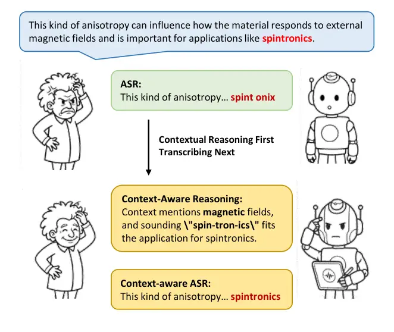
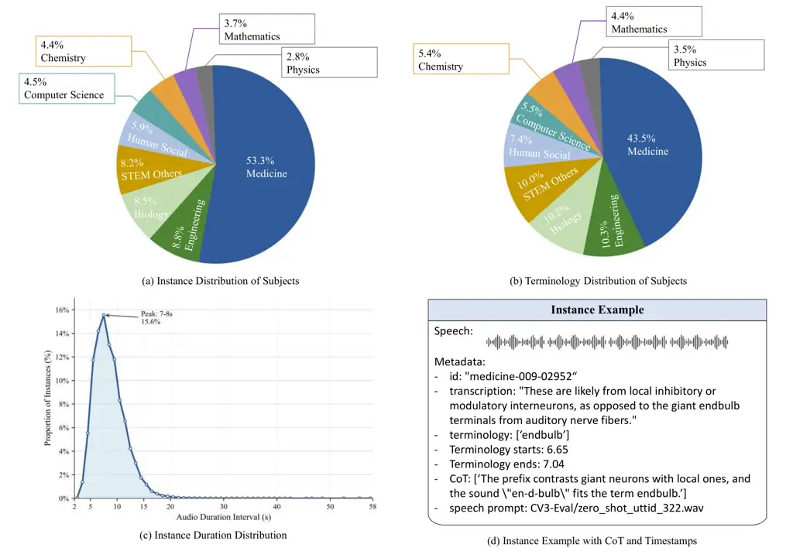
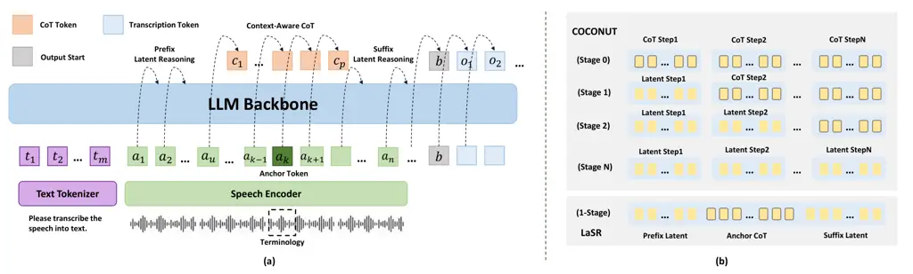
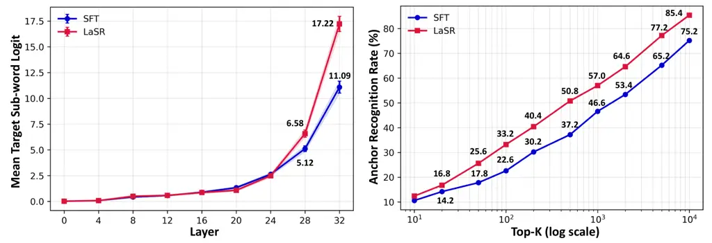
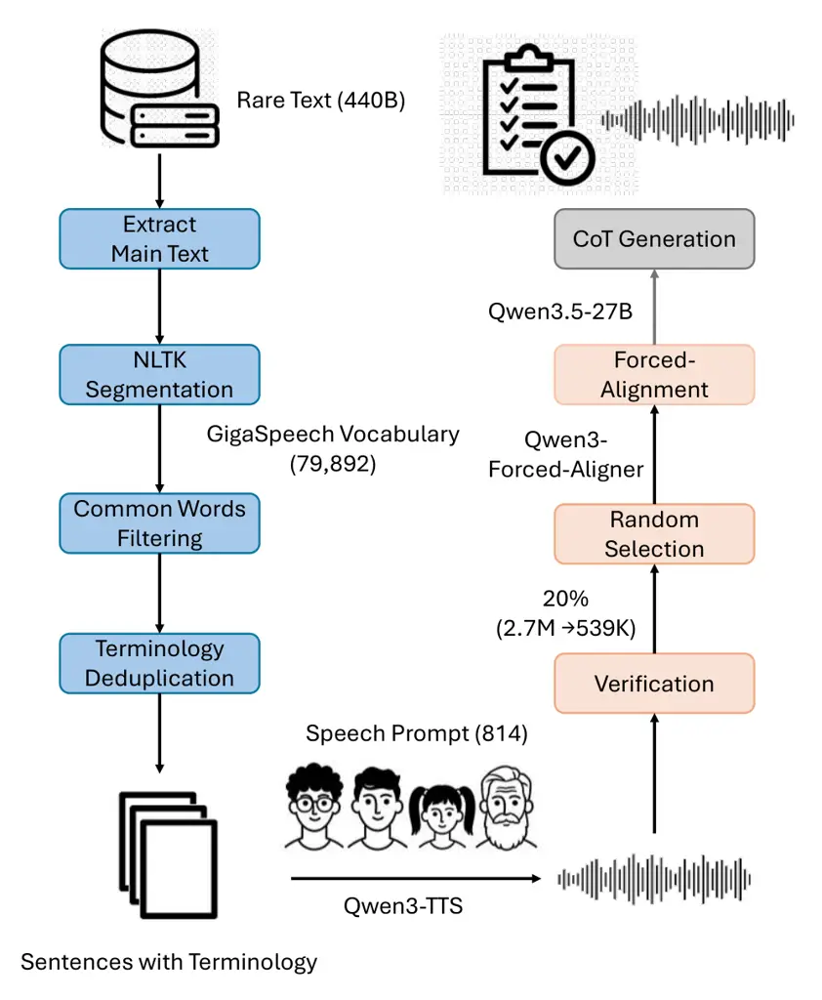
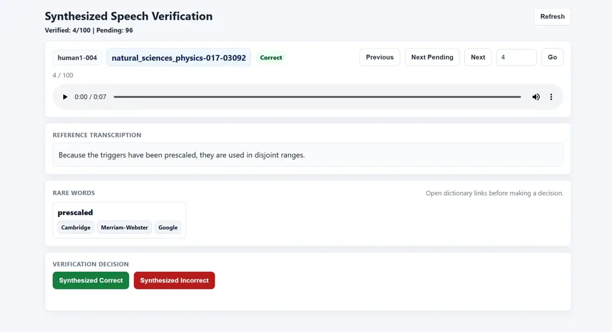

# LaSR: Context-Aware Speech Recognition via Latent Reasoning

Heyang Liu Affiliation: Shanghai Jiao Tong University Affiliation:  Ant
Group Email: [liuheyang@sjtu.edu.cn](mailto:)    Ziyang Cheng
Affiliation: Shanghai Jiao Tong University Affiliation:  Ant Group
Email: [muye12@sjtu.edu.cn](mailto:)    Jiayi Huang
Affiliation: Shanghai Jiao Tong University
Email: [hjy-sjtu@sjtu.edu.cn](mailto:)    Wenyang Xiao
Affiliation: Shanghai Jiao Tong University
Email: [onesheep@sjtu.edu.cn](mailto:)    Ronghua Wu Affiliation:  Ant
Group Email: [wangyanfeng622@sjtu.edu.cn](mailto:)    Qunshan Gu
Affiliation:  Ant Group Email: [yuwangsjtu@sjtu.edu.cn](mailto:)   
Yanfeng Wang Affiliation: Shanghai Jiao Tong University
Email: [r.wu@antgroup.com](mailto:)    Yu Wang
Email: [guqunshan.gqs@antgroup.com](mailto:)

###### Abstract

Speech recognition in specialized domains requires leveraging contextual
or topical information to improve the recognition of domain-specific
entities. Speech Large Language Models (Speech LLMs) have substantially
advanced speech understanding and reasoning capabilities, making
context-aware speech recognition possible without predefined bias lists.
In this paper, we propose LaSR (Latent Speech Reasoning), a novel
training paradigm featuring a context-aware reasoning trajectory that
leverages the latent reasoning process. Instead of generating explicit
intermediate tokens, LaSR aligns chain-of-thought (CoT) supervision
around the acoustic feature region of the target word, and introduces
latent reasoning periods for context information grounding and
transcriptional transition. Furthermore, to effectively benchmark
context-aware speech recognition, we propose Spoken Darwin-Science, a
large-scale corpus focusing on academic terminologies. Preliminary
experiments on Fun-Audio-Chat demonstrate that LaSR significantly
improves terminology recognition without introducing additional latency
and consistently outperforms standard supervised fine-tuning baselines.
Our findings highlight the potential of latent reasoning in building
efficient, context-aware speech assistants.

## 1 Introduction

Recent advances in speech large language models (Speech LLMs) have
demonstrated impressive capabilities in the understanding and generation
of spoken language Wang et al. (2025); Team et al. (2025); Xu et al.
(2025). These models capture long-range dependencies in audio, leverage
contextual cues, and perform reasoning over complex speech inputs.
However, the performance of existing models is constrained by intrinsic
limitations. On one hand, directly adopting Chain-of-Thought (CoT)
techniques often results in limited stability and can even degrade the
general intelligence Li et al. (2025); Xu et al. (2025); Wu et al.
(2025); Comanici et al. (2025). On the other hand, explicit generation
of intermediate reasoning steps introduces substantial computational
overhead and latency, which is unacceptable in real-time transcriptions
and conversations, negatively impacting user experience. Therefore, it
is necessary to simultaneously achieve contextual reasoning enhancement
of the Speech LLMs without additional computational delay.



Figure 1: Context-aware ASR perceives the context for reasonable
transcription without a predefined bias list.

Contextual automatic speech recognition (CASR) extends the basic
framework by incorporating the bias list, a curated set of task-relevant
terms typically ranging from dozens to thousands of entries Sun et al.
(2021); Yang et al. (2024); Kong et al. (2025); Deng et al. (2026). By
explicitly increasing the recognition probability of these target words,
CASR achieves improved accuracy for hot words in downstream
applications. However, bias lists are not always available in practice,
particularly in general-purpose specialized domains. List-free
contextual ASR, or context-aware ASR, addresses this limitation by
leveraging the contextual reasoning capabilities of large language
models (LLMs). As illustrated in Figure 1, this approach performs
contextual reasoning to identify semantically relevant target words
without relying on an explicit keyword list. In this paper, we construct
Spoken Darwin-Science, a large-scale synthesized corpus consisting of
broad terminologies, and corresponding real-world speech evaluation sets
from online resources. From mainstream ASR models and Speech LLMs, we
demonstrate that supervised fine-tuning (SFT) with high-quality
synthetic data can effectively improve the model’s generalization on
real recordings. Building on this, we propose LaSR (Latent Speech
Reasoning), a training scheme applicable to speech models that utilizes
CoT to enhance contextual reasoning capabilities without additional
latency and improve the recognition of hard terminologies. Specifically,
LaSR follows a listening-while-thinking manner, proposes to align the
critical contextual reasoning procedure with the acoustic feature inputs
of targeted terminologies, and performs latent reasoning before and
after the supervision of the context-aware CoT stage. It addresses the
latency overload of explicit CoT outputs before transcriptions and
exceeds standard SFT baselines. Our contributions are as follows:

- •
  We develop a challenging suite for contextual reasoning capabilities
  of Speech LLMs. The model is developed to enhance the recognition of
  academic terminologies through the analysis of previous context.
- •
  We propose LaSR, a training strategy that injects intermediate
  reasoning supervision and latent reasoning periods into audio encoding
  periods, allowing Speech LLMs to capture contextual dependencies and
  reasoning cues without explicit CoT outputs.
- •
  Extensive experiments have demonstrated that LaSR successfully
  leverages the reasoning trajectory and inherent latent reasoning, and
  validated its effectiveness and efficiency.

## 2 Related Works

### 2.1 CoT Prompting and Latent Reasoning

The enhancement of reasoning capabilities is a critical feature of LLM
advancement. Early approaches improve model reasoning by explicitly
providing intermediate reasoning steps, represented by CoT prompting Wei
et al. (2022). By exposing to structured solution trajectories, these
methods have been shown to improve performance on arithmetic, logical,
and commonsense reasoning benchmarks Yue et al. (2024); Ye et al.
(2025). Recently, latent reasoning has received increasing attention
without explicit intermediate outputs. COCONUT Hao et al. (2024) breaks
down the reasoning procedure into fixed steps. It gradually removes the
explicit CoT steps at the front positions, replacing them with
autoregressive propagations of the hidden states, thereby providing a
wider beam size decoding space. CODI Shen et al. (2025) incorporates
self-distillation, using the model with explicit CoT as the teacher and
latent reasoning as the student, aligning their distribution of
generated responses. The compression of explicit CoT is another
approach. CoLaR Tan et al. (2026) samples the compressed CoT tokens at
different ratios, while Token Assorted Su et al. (2025) uses an external
VQ-VAE to obtain latent CoT tokens for direct model training. While
achievements in text modalities, their effect on speech has not been
verified.

### 2.2 Contextual ASR

CASR requires the model to perceive the speaker’s context and perform
favored transcriptions of a bias list. Traditional ASR methods mainly
employ two approaches: biased word probability enhancement based on
Weighted Finite-State Transducer (WFST) Zhao et al. (2019), and
explicitly adding a bias encoder to inject relevant vocabulary Pundak
et al. (2018). The initial LLM-based attempt employed an additional hot
words prompt, explicitly injecting a fixed-size bias list into the LLM
backbone Yang et al. (2024). These approaches all require biased lists
(hot words), whether based on training word frequency or simulated user
definitions, ignoring the ability of LLMs to perceive and reason about
contexts. In Deng et al. (2026), CoT-ASR is proposed to produce
higher-quality transcriptions by generating analytical reasoning first.
This fully utilizes the generative reasoning capabilities of LLMs
without predefined bias lists, achieving context-aware speech
recognition, while the additional CoT output results in excessive
decoding latency and cannot support real-time transcriptions. In
contrast, LaSR proposes to influence the latent thinking process
streamingly, thereby improving the model’s contextual perception and
rare-word transcriptions without additional latency.



Figure 2: Dataset statistics of Spoken Darwin-Science 20% subset. (a):
The instance distribution of various subjects; (b) The distinct
terminology distribution of various subjects; (c) The duration
distribution of instances; (d) Instance example with timestamps and CoT
annotations.

## 3 Spoken Darwin-Science

In this section, we introduce the corpus proposed in the experiment,
including the design principles, main features, construction process,
and statistics.

### 3.1 Data Principles

Previous work on CASR typically relied on general conversational corpora
(e.g., LibriSpeech, GigaSpeech Panayotov et al. (2015); Chen et al.
(2021)), and constructed test sets by selecting low-frequency words from
these corpora to evaluate context-dependent recognition Sun et al.
(2021); Cui et al. (2025). However, the scaling of recent speech models,
particularly Speech LLMs, has diminished the effectiveness: abundant
high-quality conversational data in training reduces the scarcity of
rare words, making these test sets less challenging. To address this
limitation, we focus on the scientific domain comprising academic
terminology. These scientifically named entities are highly specialized
and often require models to leverage both local acoustic cues and
broader contextual information for accurate transcription. Consequently,
this dataset directly reflects the contextual reasoning capabilities of
speech LLMs.

|                  |                                      |
| ---------------- | ------------------------------------ |
| Subject          | Terminology                          |
| Computer Science | biqubits, chainwork                  |
| Engineering      | suffusion, rhizotron                 |
| Human Social     | floristry, chieftaincies             |
| Medicine         | flavonolignans, phosphatide          |
| Biology          | abacopterin, dysmorphogenesis        |
| Chemistry        | phenyltrimethoxysilane, pentanethiol |
| Math             | polynomiography, contactomorphic     |
| Physics          | graviscalars, nonpolarizing          |
| STEM (Others)    | nakhlites, equatorwards              |

Table 1: Example terminology of different subjects of Spoken
Darwin-Science.

### 3.2 Data Construction

#### 3.2.1 Terminology Definition

Terminologies represent highly specialized vocabularies that rarely
appear in daily conversations but play a crucial role in semantic
understanding and academic dialogue. We refer to the vocabulary from the
GigaSpeech-XL training set and calculate word frequencies Chen et al.
(2021). GigaSpeech is a massive speech dataset with over 10,000 hours of
transcribed text, primarily sourced from YouTube, Podcast, and
Audiobook, and most are daily words. We defined words appearing less
than 10 times as terminologies, which is validated through manual
verifications.

#### 3.2.2 Training Set

We select academic papers from various disciplines as our initial
sources. Specifically, the corpus is sourced from Darwin-Science Qin
et al. (2026), a high-quality collection of papers that has undergone
multiple stages of text cleaning, covering nine scientific fields,
including biology, chemistry, and human social. We removed the
fixed-length characters at the beginning and end, retaining only the
main text, and segmented it into sentences using NLTK Bird (2006). A
single sentence is retained only if it contains terminology, and a
maximum of five sentences with the same terminology are kept. The final
corpus comprises 2.7M instances filtered from text related to 440B
tokens. For speech synthesis, we use Qwen3-TTS-1.7B Hu et al. (2026),
and clips with DNSMOS Pro Cumlin et al. (2024) above 3 from CV3-Eval Du
et al. (2025) and seed-tts-eval Anastassiou et al. (2024) are selected
as the speech prompts to ensure the quality of the synthesized speech.
In our experiments, Qwen3-TTS demonstrates strong generalization
capabilities, effectively converting words into speech based on their
orthographic composition and general pronunciation rules. This is
particularly advantageous for synthesizing scientific terminology, which
often consists of multiple common phonetic units and frequently forms
compound words. Such a systematic structure enables accurate and natural
pronunciation even for previously unseen terminology. Terminology
examples in our constructed corpus are shown in Table 1, and more
detailed pipeline is summarized in Appendix A.

#### 3.2.3 Evaluation Set

We construct the evaluation set of real-world scientific audio scenarios
from publicly available resources. Candidate videos are sourced from
YouTube, covering biology, medicine, chemistry, physics, geography, and
general sciences. We preserve videos of lectures, popular science
courses, documentaries, and TED talks that provide human-annotated
subtitles, ensuring high reliability in speech transcription. The video
metadata is parsed into timestamped segments and then merged based on
intervals and sentence-ending punctuation to form sentence-level audio
segments. Those containing terminologies are retained, and we limit the
speech length to within 30 seconds. Following this procedure, we
construct a total of 2,000 real-world scientific speech segments for
evaluation.

#### 3.2.4 CoT

Considering the scale of the training corpus, we randomly select 20%
instances (539K) and construct the CoT. To avoid the additional time
overhead of explicit reasoning based on full text, we followed a
"listen-while-think" strategy, providing the terminology and its
preceding text when generating the inference trajectory.
Qwen3.5-27B Team (2026) is instructed to infer the context and intent,
and then decompose the terminology pronunciation, and finally transcribe
the word. The prompt used is shown in Appendix A. In addition, we
leverage Qwen3-ForcedAligner Shi et al. (2026) to generate word-level
timestamps in order to determine the time anchor point for model
reasoning.



Figure 3: LaSR training method. (a) Structured causal reasoning
trajectory of LaSR; (b) Comparison with textual implicit reasoning
(e.g., COCONUT).

### 3.3 Human Verification

To validate the quality of the terminology speech synthesis, we randomly
select 1000 training samples for four humans fluent in English with
mainstream online dictionaries as references. Regarding pronunciation
accuracy, the human experts consider that 96.8% of the terminologies are
synthesized correctly and with normal pronunciation, on average. This
confirms the high quality of Spoken Darwin-Science training corpus. The
details of the annotation process are located in Appendix C.

### 3.4 Dataset Statistics

The dataset statistics of 20% Spoken Darwin-Science with CoT annotations
are shown in Figure 2. Regarding the subject and speech duration, the
full corpus shares similar distributions. Spoken Darwin-Science consists
of 9 main scientific domains. Medicine comprised the majority of the
dataset, accounting for 53.3% of the entries (and a similar proportion
of the duration), and contributing 43.5% of the terminology. The other
three major subjects are engineering, biology, and STEM (Others), which
each contributed more than 10% of the terminology, corresponding to more
than 8% of the duration and entries. The remaining five subjects are
human social, computer science, chemistry, mathematics, and physics,
which together account for approximately 26% of the terminology and 21%
of the data volume. This distribution is related to the inherent
characteristics of these disciplines; some subjects extensively utilize
daily language (e.g., mathematics), resulting in fewer highly
specialized terms. A more detailed data distribution is shown in
Appendix B.

## 4 LaSR

### 4.1 Overview

LaSR decomposes the single training step into two phases. The continuous
speech signals are converted into audio tokens and progressively input
into the LLM backbone. LaSR imposes a structured causal trajectory over
the audio-token sequence: unlabeled latent audio states first, then
timestamp-aligned explicit CoT supervision around the terminology
region, unlabeled latent states after the CoT span, and final
transcription supervision at the response positions. Unlike text-based
approaches that gradually convert explicit CoT into implicit reasoning,
LaSR modulates the model’s internal reasoning both before and after key
stages by targeting intermediate thought processes. The model’s
intrinsic trajectory does not need to be predefined, but rather to
execute the necessary reasoning at intermediate stages.

### 4.2 Methodology

As shown in Figure 3 (a), the Speech LLM is fine-tuned with a text
instruction $`T`$ and a speech input $`A`$ of duration $`d_{a}`$. For
the causal LLM backbone, text instruction is tokenized into discrete
tokens $`(t_{1},t_{2},...,t_{m})`$, and speech input is encoded as
features $`(a_{1},a_{2},...,a_{n})`$. Different from traditional
autoregressive training, the prefill phase is incorporated into the
training process to enhance the model’s reasoning and thinking process
under partial information. Before the acoustic features $`a_{u}`$ are
input into the backbone, the model performs prefix latent reasoning,
perceiving the context along the internal trajectory. Upon input of
$`a_{u}`$ into the model, the large model backbone is guided to perform
explicit CoT reasoning of length $`p`$, which sequentially summarizes
the preceding context, the pronunciation of terminology, and finally
yields the grapheme of the terminology. After the explicit reasoning,
the model continues with suffix latent reasoning until the speech
information is fully processed, naturally transitioning to the
subsequent transcription output. At this point, the model generates a
response start signal $`b`$ and produces the corresponding transcribed
text $`O=(o1,o2,...,o_{q})`$.

Under this premise, the starting position of CoT, $`c_{1}`$, needs to be
determined, corresponding to the audio token $`a_{u}`$. For a speech
input of duration $`d_{a}`$, we define $`\tau`$ as the terminology start
time obtained through forced alignment. Under non-streaming speech
encoder conditions, the anchored index $`k`$ is calculated as:

```math
k=\left\lfloor\frac{\tau}{d_{a}}n\right\rfloor \tag{1}
```

In this setting, the anchor token represents the input audio feature
when the terminology word has the most significant impact, affecting the
time when CoT participates in model supervision. There are two
considerations in the design: a) CoT is added after the anchor token to
ensure that the model fully begins to perceive the terminology; b) CoT
is added before the anchor to ensure that contextual consideration is
given first, especially the topic and intent. In the experiment, we
evaluate both methods. The former shifted CoT backward by features
related to 0.15s, while the latter shifts it forward to 0.50s, or
randomly, but ensures that the hidden state corresponding to the
terminology falls within the supervision range of CoT.

In the implementation, consecutive audio placeholder labels are
overwritten with the tokenized latent CoT labels until either the CoT
sequence is exhausted or the audio suffix ends. Other prompt and audio
input positions remain masked, except for the assistant transcription
positions of the ASR target token labels. Therefore, the latent
reasoning and CoT phase are not generated as part of the visible output
sequence. The language-model loss is the standard next-token
cross-entropy over the union of the transcription labels and latent CoT
labels:

```math
\mathcal{L}_{\mathrm{LM}}=-\frac{1}{L}\sum_{i\in\Omega_{\mathrm{ASR}}\cup\Omega_{\mathrm{CoT}}}\log p_{\theta}(y_{i}\mid x_{<i}) \tag{2}
```

where $`L=|\Omega_{\mathrm{ASR}}\cup\Omega_{\mathrm{CoT}}|`$, and
$`x_{i}\in\{A,b,O\}`$.

|                   |     |          |                                                                        |                                                                         |                                                                         |                                                                         |
| ----------------- | --- | -------- | ---------------------------------------------------------------------- | ----------------------------------------------------------------------- | ----------------------------------------------------------------------- | ----------------------------------------------------------------------- |
| Model             | CoT | Anchor   | WER (%)                                                                | EER (Base, %)                                                           | EER (Hard, %)                                                           | EER (Avg, %)                                                            |
| Qwen3-ASR-0.6B    | ✘   | \-       | 6.27                                                                   | 18.50                                                                   | 42.93                                                                   | 27.84                                                                   |
| Qwen3-ASR-1.7B    | ✘   | \-       | 5.60                                                                   | 10.55                                                                   | 30.93                                                                   | 18.37                                                                   |
| Whisper-large-v3  | ✘   | \-       | 4.50                                                                   | 8.35                                                                    | 30.56                                                                   | 16.86                                                                   |
| Fun-Audio-Chat-8B | ✘   | \-       | 6.25                                                                   | 12.68                                                                   | 32.74                                                                   | 20.37                                                                   |
| + SFT             | ✘   | \-       | $`6.90_{{\color[rgb]{1,0,0}\hskip 2.84526pt0.65\uparrow}}`$            | $`13.23_{{\color[rgb]{1,0,0}\hskip 2.84526pt0.55\uparrow}}`$            | $`26.64_{{\color[rgb]{0,1,0}\hskip 2.84526pt6.10\downarrow}}`$          | $`18.32_{{\color[rgb]{0,1,0}\hskip 2.84526pt2.05\downarrow}}`$          |
|                   | ✔  | \-       | $`7.93_{{\color[rgb]{1,0,0}\hskip 2.84526pt1.68\uparrow}}`$            | $`18.83_{{\color[rgb]{1,0,0}\hskip 2.84526pt6.15\uparrow}}`$            | $`28.08_{{\color[rgb]{0,1,0}\hskip 2.84526pt4.66\downarrow}}`$          | $`22.39_{{\color[rgb]{1,0,0}\hskip 2.84526pt2.02\uparrow}}`$            |
| \+ CoT-ASR        | ✔  | \-       | $`6.52_{{\color[rgb]{1,0,0}\hskip 2.84526pt0.27\uparrow}}`$            | $`11.42_{{\color[rgb]{0,1,0}\hskip 2.84526pt1.26\downarrow}}`$          | $`25.13_{{\color[rgb]{0,1,0}\hskip 2.84526pt7.61\downarrow}}`$          | $`16.67_{{\color[rgb]{0,1,0}\hskip 2.84526pt3.70\downarrow}}`$          |
| + LaSR            | ✔  | + 0.15s  | $`6.97_{{\color[rgb]{1,0,0}\hskip 2.84526pt0.72\uparrow}}`$            | $`12.05_{{\color[rgb]{0,1,0}\hskip 2.84526pt0.63\downarrow}}`$          | $`26.64_{{\color[rgb]{0,1,0}\hskip 2.84526pt6.10\downarrow}}`$          | $`17.64_{{\color[rgb]{0,1,0}\hskip 2.84526pt2.73\downarrow}}`$          |
|                   | ✔  | - 0.50s  | $`\textbf{6.09}_{{\color[rgb]{0,1,0}\hskip 2.84526pt0.16\downarrow}}`$ | $`\textbf{10.79}_{{\color[rgb]{0,1,0}\hskip 2.84526pt1.89\downarrow}}`$ | $`\textbf{25.00}_{{\color[rgb]{0,1,0}\hskip 2.84526pt7.74\downarrow}}`$ | $`\textbf{16.23}_{{\color[rgb]{0,1,0}\hskip 2.84526pt4.14\downarrow}}`$ |
|                   | ✔  | - Random | $`6.17_{{\color[rgb]{0,1,0}\hskip 2.84526pt0.08\downarrow}}`$          | $`11.10_{{\color[rgb]{0,1,0}\hskip 2.84526pt1.58\downarrow}}`$          | $`25.13_{{\color[rgb]{0,1,0}\hskip 2.84526pt7.61\downarrow}}`$          | $`16.42_{{\color[rgb]{0,1,0}\hskip 2.84526pt3.95\downarrow}}`$          |

Table 2: Context-aware ASR performance. The best individual results for
each type are highlighted in bold, and absolute performance changes
compared to the Base model are denoted by
$`{\color[rgb]{0,1,0}\hskip 2.84526pt\downarrow}`$ (improved) and
$`{\color[rgb]{1,0,0}\hskip 2.84526pt\uparrow}`$ (degraded).

### 4.3 Latent Reasoning Comparison

In Figure 3 (b), we compare LaSR with textual implicit reasoning,
represented by COCONUT. Most prior latent reasoning approaches focus on
progressively transforming externally visible reasoning trajectories
into internal thought processes. While these methods have demonstrated
the potential of latent supervision, they generally rely heavily on a
structured reasoning sequence, limiting the model’s ability to explore
alternative or emergent reasoning paths. LaSR addresses these
limitations by establishing fixed anchor points within the reasoning
process, allowing the model to perform inner thinking both before and
after these key steps. Specifically, prefix latent reasoning is aligned
toward the CoT anchor, guiding the model to capture intermediate
reasoning, whereas suffix latent reasoning is aligned toward the final
transcription, ensuring that latent reasoning ultimately supports
accurate output. Furthermore, empirical studies, particularly in speech
tasks, indicate that automatically generated or manually defined CoT
sequences can be detrimental to performance Li et al. (2025); Xu et al.
(2025), as they may misalign with the natural temporal dynamics of audio
or constrain the model’s internal representations. LaSR explicitly
considers the temporal structure of speech. Without such time-aligned
latent supervision, the model may fail to attend to critical acoustic
information, rendering intermediate reasoning less effective than
directly producing the final transcription. By combining result
supervision with time-aligned latent reasoning, LaSR enables a flexible
yet structured approach to enhancing context-awareness and reasoning.

## 5 Experiment

### 5.1 Experiment Settings

#### 5.1.1 Baseline Models

We first demonstrate that the synthesized Spoken Darwin-Science enables
the improvement of terminology recognition of real recordings. We
perform SFT with LLM-based ASR models, including Qwen3-ASR-0.6B and
Qwen3-ASR-1.7B Shi et al. (2026). For context-aware speech recognition,
we proceed with Fun-Audio-Chat-8B Team et al. (2025) to ensure strong
contextual reasoning capabilities. Fun-Audio-Chat leverages existing
pre-trained models and undergoes multi-stage post-training, enabling
text and speech interactions with speech recognition capabilities. The
ASR models are trained using 1 NVIDIA A100 GPU, guided by the official
implementation, while Fun-Audio-Chat uses 8 NVIDIA A100 GPUs based on
LLaMA-Factory Zheng et al. (2024). In addition, we report on the
performance of Whisper-large-v3 Radford et al. (2023) on the evaluation
set, as a reference for absolute performance.

#### 5.1.2 Training Corpus and Evaluated Metrics

For model training, all experiments use a 20% training subset, and
Qwen3-ASR is further trained on the full corpus to validate data
quality. For evaluation, as explained in Section 3.2.3, we use
real-world recordings, each containing terminology that is difficult for
speech models. Based on GigaSpeech-XL word frequencies, we decompose a
Base set of 1-9 frequency terminologies and a Hard set containing
out-of-vocabulary (OOV) words. We report the word error rate (WER) for
overall transcription accuracy, and the entity error rate (EER) for
terminologies Deng et al. (2026).

### 5.2 Supervised Fine-tuning

The supervised fine-tuning results on Qwen3-ASR are shown in Appendix D.
With 20% of the training corpus, both models show steady improvement in
overall transcription and terminology recognition. The WER of the 0.6B
model decreased from 6.27% to 5.83%, while that of the 1.7B model
dropped from 5.60% to 5.34%. When increasing to full volume, the EER
steadily drops while the WER fluctuates upward, possibly due to a
discrepancy between the fine-tuned vocabulary and the general words.
This experiment demonstrates that training with Spoken Darwine-Science
enables generalization to real-world scientific speech scenarios.

### 5.3 LaSR Results

We evaluate various training strategies, as shown in Table 2. Standard
SFT improves the hard set and overall terminology, though the base set
slightly underperforms. For explicit thinking sequences before
transcriptions, we evaluate partial-context CoT identical to LaSR (SFT
with CoT in the main table), and full-context CoT generated according to
CoT-ASR. For the former, the performance degrades. Specifically, the
recognition accuracy of the base set terminology drops sharply, with EER
increasing from 12.68% to 18.83%. The hard set performance has improved,
but still underperforms non-thinking SFT. In contrast, the incorporation
of full-context CoT yields consistent performance improvements, with all
metrics outperforming standard SFT; notably, the overall EER drops to
16.67%. This demonstrates that the CoT content is particularly critical
for explicit thinking approaches.

For LaSR, we have evaluated 3 distinct CoT timestamps. By delaying the
terminology CoT timing by 0.15s, the model backbone aggregates more
auditory information. The speech recognition results are similar to
simple SFT without thinking, but it achieves better results in base
terminology, and the overall terminology EER decreases by 2.73%. In the
second method, the CoT thinking strategy is added 0.50s before the
terminology appears, ensuring the backbone perceives intent and speech
topic first, then addressing the terminology pronunciation. This
configuration achieves optimal performance, with all metrics surpassing
CoT-ASR, and the hard-set EER decreases by 7.74%. Compared with the base
model, the proposed method reduced the overall EER by 4.14%,
corresponding to a relative improvement of 20.32%. This result surpasses
the evaluated ASR models in terminology recognition, highlighting the
potential in real-world scientific dialogue and interaction scenarios.
For the last setting, the CoT start point is randomly placed ahead of
the anchor time, while we guarantee that the terminology anchor token
remains in the CoT region. All metrics have improved, with the overall
WER remaining stable. These experiments demonstrate that LaSR can
effectively improve context-aware speech recognition.

### 5.4 Context-driven Inference

To thoroughly elucidate the underlying mechanism of LaSR, we conduct a
rigorous Logit-Lens probing experiment. We randomly sample an evaluation
subset of 500 academic terms and generate temporal anchors. We extract
the hidden states at the targeted anchor frames from both the standard
SFT baseline and the optimal LaSR model. These states are hierarchically
projected through the frozen textual LM head to assess the logit values
and rank shifts of the target subwords. A non-parametric paired sign
test is applied to ensure statistical rigor. As shown in Figure 4, in
the deeper layers (Layer 28-32), LaSR substantially increases the logit
of the target subword, indicating that it preconditions the hidden
states toward the targeted semantic token, and the network has already
formulated a sharp internal prior. Moreover, at Layer 32, the proportion
of samples in which the target terminology subword enters the decoder’s
Top-$`k`$ predictions (anchor recognition rate) consistently exceeds
that of the SFT baseline across all $`k`$ settings, with the Top-100
lead exceeding 10.6%. These results provide direct mechanistic evidence
that LaSR fundamentally reshapes the internal representations in the
deep layers. More detailed metrics and analyses are provided in
Appendix E.



Figure 4: Mechanism analysis. Left: mean target token logits across
layers; Right: proportions of target tokens entering Top-k predictions
at Layer 32.

### 5.5 Zero Shot Performance

LaSR eliminates the need to construct corresponding bias lists based on
specific scenes and contexts. In essence, the training aims to develop
the ability to reason based on context, which allows for direct
deployment across various proprietary scenarios. We crawl additional
instances for finance and gaming topics, each around 1k sentences, as
shown in Table 3. The experimental results demonstrate that despite the
absence of specialized training, LaSR still achieves performance
improvements compared to standard SFT, especially for hard terms.

|         |         |        |             |             |            |
| ------- | ------- | ------ | ----------- | ----------- | ---------- |
| Domain  | Method  | WER(%) | EER(Base,%) | EER(Hard,%) | EER(Avg,%) |
| Finance | Base    | 12.37  | 30.65       | 56.74       | 39.12      |
|         | SFT     | 14.16  | 28.19       | 54.42       | 36.71      |
|         | CoT-ASR | 15.52  | 29.98       | 55.35       | 38.22      |
|         | LaSR    | 14.15  | 27.07       | 53.49       | 35.65      |
| Gaming  | Base    | 11.95  | 38.27       | 60.36       | 48.44      |
|         | SFT     | 11.70  | 36.35       | 53.60       | 44.29      |
|         | CoT-ASR | 12.81  | 35.19       | 54.28       | 43.98      |
|         | LaSR    | 12.02  | 37.31       | 52.03       | 44.09      |

Table 3: Performance in Finance and Gaming scenarios.

### 5.6 With Contextual Biasing

We have evaluated performance with bias lists. In addition to the
ground-truth terminology, distractors are randomly selected from the
training set terminology vocabulary. The experimental results are listed
in Table 4. For instances where standard ASR transcriptions cannot be
generated due to instruction-following failures, we fall back on a
prompt without contextual biasing. Taking the 1000-word bias list as an
example, LaSR successfully reduces the failure rate from 1.5% to 0%.
This demonstrates that the enhancement in reasoning capability directly
translates to improved instruction-following performance. In terms of
overall performance, contextual biasing exhibits a slightly higher
efficacy than LaSR on the 1000-entry bias list due to additional word
constraints. Nevertheless, when combined, they achieve a steadier
enhancement, culminating in an EER of 13.75%.

|             |           |        |         |         |        |
| ----------- | --------- | ------ | ------- | ------- | ------ |
| Method      | Bias List | WER(%) | Base(%) | Hard(%) | Avg(%) |
| Base        | \-        | 6.25   | 12.68   | 32.74   | 20.37  |
| \+ LaSR     | \-        | 6.09   | 10.79   | 25.00   | 16.23  |
| \+ CB       | 2000      | 9.33   | 10.00   | 26.26   | 16.23  |
| \+ LaSR, CB | 2000      | 6.28   | 8.90    | 23.99   | 14.67  |
| \+ CB       | 1000      | 5.81   | 9.37    | 25.00   | 15.35  |
| \+ LaSR, CB | 1000      | 6.21   | 8.74    | 21.84   | 13.75  |

Table 4: Performance with contextual biasing (CB).

### 5.7 Latency-free Inference

The thinking-while-listening paradigm of LaSR constrains the CoT period
to be synchronous with the speech encoding process, introducing a
fundamental trade-off between interaction latency and flexibility.
CoT-ASR introduces explicit reasoning after the multimodal input is
completely processed. While this allows for flexible, unconstrained CoT
exposure to full context, it inevitably introduces significant decoding
delays. On the contrary, LaSR achieves zero additional latency and
overhead-free absolute improvement. With a single NVIDIA L20 GPU,
CoT-ASR introduces an average delay of 1.304 seconds, while LaSR
completely solves this problem. Detailed analysis is in Appendix F.

## 6 Conclusion

We explore the bias-list-free CASR of Speech LLMs and propose LaSR, a
latency-free latent reasoning strategy. By structuring a causal
trajectory for reasoning anchored to the timestamp of the targeted word,
LaSR successfully internalizes the context-aware reasoning process. It
forces the model to capture intermediate contextual dependencies before
and after key acoustic stages without the latency burden of explicit
reasoning outputs. To support this research, we construct Spoken
Darwin-Science, a comprehensive terminology-centric speech dataset
tailored for rigorous contextual evaluation. Our experiments indicate
that LaSR yields substantial improvements in recognizing challenging
scientific terminologies over supervised fine-tuning and explicit CoT
approaches.

## Limitations

LaSR represents a preliminary exploration of latent reasoning within
Speech LLMs. Current experiments are based on the Fun-Audio-Chat
framework; although the underlying model architecture is broadly
generalizable, it has not yet undergone more extensive empirical
validation on other models. Furthermore, the speech encoding process is
non-streaming, which implies our anchor token timestamps serve merely as
approximations. Finally, LaSR is currently confined to contextual ASR
tasks. Extending to speech interaction and audio reasoning would broaden
its scope, which would also impose more rigorous demands on the
reasoning chain. Finally, the CoT construction scheme, especially the
length, affects the period ratio, thus influencing the improvement
effect.

## Ethical Considerations

All the models in our paper are downloaded from publicly released model
cards, and we strictly follow the user license. The sourced data is
collected from publicly available resources, and we perform speech
synthesis using publicly available speech prompts and TTS models. Human
verifications are conducted by college students in the author lists. The
evaluation set is sourced from online resources and is for academic
usage only. The real evaluation data will not be made public, but the
corresponding acquisition methods and metadata will be available.

## References

- Abouelenin et al. (2025) Abdelrahman Abouelenin, Atabak Ashfaq, Adam
  Atkinson, Hany Awadalla, Nguyen Bach, Jianmin Bao, Alon Benhaim,
  Martin Cai, Vishrav Chaudhary, Congcong Chen, and 1 others. 2025.
  Phi-4-mini technical report: Compact yet powerful multimodal language
  models via mixture-of-loras. _arXiv preprint arXiv:2503.01743_.
- Anastassiou et al. (2024) Philip Anastassiou, Jiawei Chen, Jitong
  Chen, Yuanzhe Chen, Zhuo Chen, Ziyi Chen, Jian Cong, Lelai Deng,
  Chuang Ding, Lu Gao, and 1 others. 2024. Seed-tts: A family of
  high-quality versatile speech generation models. _arXiv preprint
  arXiv:2406.02430_.
- Bird (2006) Steven Bird. 2006. Nltk: the natural language toolkit. In
  _Proceedings of the COLING/ACL 2006 interactive presentation
  sessions_, pages 69–72.
- Chen et al. (2021) Guoguo Chen, Shuzhou Chai, Guanbo Wang, Jiayu Du,
  Wei Qiang Zhang, Chao Weng, Dan Su, Daniel Povey, Jan Trmal, Junbo
  Zhang, and 1 others. 2021. Gigaspeech: An evolving, multi-domain asr
  corpus with 10,000 hours of transcribed audio. In _22nd Annual
  Conference of the International Speech Communication Association,
  INTERSPEECH 2021_, pages 4376–4380. International Speech Communication
  Association.
- Comanici et al. (2025) Gheorghe Comanici, Eric Bieber, Mike
  Schaekermann, Ice Pasupat, Noveen Sachdeva, Inderjit Dhillon, Marcel
  Blistein, Ori Ram, Dan Zhang, Evan Rosen, and 1 others. 2025. Gemini
  2.5: Pushing the frontier with advanced reasoning, multimodality, long
  context, and next generation agentic capabilities. _arXiv preprint
  arXiv:2507.06261_.
- Cui et al. (2025) Mingyu Cui, Yifan Yang, Jiajun Deng, Jiawen Kang,
  Shujie Hu, Tianzi Wang, Zhaoqing Li, Shiliang Zhang, Xie Chen, and
  Xunying Liu. 2025. Exploring ssl discrete speech features for
  zipformer-based contextual asr. In _Proc. Interspeech 2025_, pages
  1203–1207.
- Cumlin et al. (2024) Fredrik Cumlin, Xinyu Liang, Victor Ungureanu,
  Chandan KA Reddy, Christian Schüldt, and Saikat Chatterjee. 2024.
  Dnsmos pro: A reduced-size dnn for probabilistic mos of speech. In
  _Proc. Interspeech 2024_, pages 4818–4822.
- Deng et al. (2026) Keqi Deng, Ruchao Fan, Bo Ren, Yiming Wang, and
  Jinyu Li. 2026. Speech llms are contextual reasoning transcribers.
  _arXiv preprint arXiv:2604.00610_.
- Du et al. (2025) Zhihao Du, Changfeng Gao, Yuxuan Wang, Fan Yu, Tianyu
  Zhao, Hao Wang, Xiang Lv, Hui Wang, Chongjia Ni, Xian Shi, and 1
  others. 2025. Cosyvoice 3: Towards in-the-wild speech generation via
  scaling-up and post-training. _arXiv preprint arXiv:2505.17589_.
- Fan et al. (2026) Jiajun Fan, Roger Ren, Jingyuan Li, Rahul Pandey,
  Prashanth Gurunath Shivakumar, Ivan Bulyko, Ankur Gandhe, Ge Liu, and
  Yile Gu. 2026. Incentivizing consistent, effective and scalable
  reasoning capability in audio llms via reasoning process rewards. In
  _International Conference on Learning Representations_, volume 2026,
  pages 2110–2173.
- Hao et al. (2024) Shibo Hao, Sainbayar Sukhbaatar, DiJia Su, Xian Li,
  Zhiting Hu, Jason Weston, and Yuandong Tian. 2024. Training large
  language models to reason in a continuous latent space. _arXiv
  preprint arXiv:2412.06769_.
- Hu et al. (2026) Hangrui Hu, Xinfa Zhu, Ting He, Dake Guo, Bin Zhang,
  Xiong Wang, Zhifang Guo, Ziyue Jiang, Hongkun Hao, Zishan Guo, and 1
  others. 2026. Qwen3-tts technical report. _arXiv preprint
  arXiv:2601.15621_.
- Kong et al. (2025) YuXiang Kong, JunFeng Hou, Jian Tang, Bingqing Zhu,
  Jicheng Zhang, and Shaofei Xue. 2025. Contextual biasing for llm-based
  asr with hotword retrieval and reinforcement learning. _arXiv preprint
  arXiv:2512.21828_.
- Li et al. (2025) Gang Li, Jizhong Liu, Heinrich Dinkel, Yadong Niu,
  Junbo Zhang, and Jian Luan. 2025. Reinforcement learning outperforms
  supervised fine-tuning: A case study on audio question answering.
  _arXiv preprint arXiv:2503.11197_.
- Liu et al. (2026) Heyang Liu, Jiayi Huang, Wenyang Xiao, Ziyang Cheng,
  Lixin Zhang, Zhen Liu, Miao He, Ronghua Wu, Qunshan Gu, Yanfeng Wang,
  and Yu Wang. 2026. $`s^{3}`$-bench: Evaluating speech interaction
  models as scientific voice assistants. _arXiv preprint
  arXiv:2609.09852_.
- Panayotov et al. (2015) Vassil Panayotov, Guoguo Chen, Daniel Povey,
  and Sanjeev Khudanpur. 2015. Librispeech: an asr corpus based on
  public domain audio books. In _2015 IEEE international conference on
  acoustics, speech and signal processing (ICASSP)_, pages 5206–5210.
  IEEE.
- Pundak et al. (2018) Golan Pundak, Tara N Sainath, Rohit Prabhavalkar,
  Anjuli Kannan, and Ding Zhao. 2018. Deep context: end-to-end
  contextual speech recognition. In _2018 IEEE spoken language
  technology workshop (SLT)_, pages 418–425. IEEE.
- Qin et al. (2026) Yiwei Qin, Zhen Huang, Tiantian Mi, Weiye Si,
  Chenyang Zhou, Qipeng Guo, Siyuan Feng, and Pengfei Liu. 2026. Data
  darwinism part i: Unlocking the value of scientific data for
  pre-training. _arXiv preprint arXiv:2602.07824_.
- Radford et al. (2023) Alec Radford, Jong Wook Kim, Tao Xu, Greg
  Brockman, Christine McLeavey, and Ilya Sutskever. 2023. Robust speech
  recognition via large-scale weak supervision. In _International
  conference on machine learning_, pages 28492–28518. PMLR.
- Shen et al. (2025) Zhenyi Shen, Hanqi Yan, Linhai Zhang, Zhanghao Hu,
  Yali Du, and Yulan He. 2025. Codi: Compressing chain-of-thought into
  continuous space via self-distillation. In _Proceedings of the 2025
  Conference on Empirical Methods in Natural Language Processing_, pages
  677–693.
- Shi et al. (2026) Xian Shi, Xiong Wang, Zhifang Guo, Yongqi Wang, Pei
  Zhang, Xinyu Zhang, Zishan Guo, Hongkun Hao, Yu Xi, Baosong Yang, and
  1 others. 2026. Qwen3-asr technical report. _arXiv preprint
  arXiv:2601.21337_.
- Su et al. (2025) Dijia Su, Hanlin Zhu, Yingchen Xu, Jiantao Jiao,
  Yuandong Tian, and Qinqing Zheng. 2025. Token assorted: Mixing latent
  and text tokens for improved language model reasoning. In
  _International Conference on Machine Learning_, pages 57144–57163.
  PMLR.
- Sun et al. (2021) Guangzhi Sun, Chao Zhang, and Philip C
  Woodland. 2021. Tree-constrained pointer generator for end-to-end
  contextual speech recognition. In _2021 IEEE Automatic Speech
  Recognition and Understanding Workshop (ASRU)_, pages 780–787. IEEE.
- Tan et al. (2026) Wenhui Tan, Jiaze Li, Jianzhong Ju, Zhenbo Luo,
  Ruihua Song, and Jian Luan. 2026. Think silently, think fast: Dynamic
  latent compression of llm reasoning chains. _Advances in Neural
  Information Processing Systems_, 38:4646–4668.
- Team (2026) Qwen Team. 2026. [Qwen3.5: Accelerating productivity with
  native multimodal agents](https://qwen.ai/blog?id=qwen3.5).
- Team et al. (2025) Tongyi Fun Team, Qian Chen, Luyao Cheng, Chong
  Deng, Xiangang Li, Jiaqing Liu, Chao-Hong Tan, Wen Wang, Junhao Xu,
  Jieping Ye, and 1 others. 2025. Fun-audio-chat technical report.
  _arXiv preprint arXiv:2512.20156_.
- Tian et al. (2025) Fei Tian, Xiangyu Tony Zhang, Yuxin Zhang, Haoyang
  Zhang, Yuxin Li, Daijiao Liu, Yayue Deng, Donghang Wu, Jun Chen, Liang
  Zhao, and 1 others. 2025. Step-audio-r1 technical report. _arXiv
  preprint arXiv:2511.15848_.
- Wang et al. (2025) Yuhao Wang, Heyang Liu, Ziyang Cheng, Ronghua Wu,
  Qunshan Gu, Yanfeng Wang, and Yu Wang. 2025. Vocalnet: Speech llms
  with multi-token prediction for faster and high-quality generation. In
  _Proceedings of the 2025 Conference on Empirical Methods in Natural
  Language Processing_, pages 19595–19612.
- Wei et al. (2022) Jason Wei, Xuezhi Wang, Dale Schuurmans, Maarten
  Bosma, Fei Xia, Ed Chi, Quoc V Le, Denny Zhou, and 1 others. 2022.
  Chain-of-thought prompting elicits reasoning in large language models.
  _Advances in neural information processing systems_, 35:24824–24837.
- Wu et al. (2025) Boyong Wu, Chao Yan, Chen Hu, Cheng Yi, Chengli Feng,
  Fei Tian, Feiyu Shen, Gang Yu, Haoyang Zhang, Jingbei Li, and 1
  others. 2025. Step-audio 2 technical report. _arXiv preprint
  arXiv:2507.16632_.
- Xu et al. (2025) Jin Xu, Zhifang Guo, Hangrui Hu, Yunfei Chu, Xiong
  Wang, Jinzheng He, Yuxuan Wang, Xian Shi, Ting He, Xinfa Zhu, and 1
  others. 2025. Qwen3-omni technical report. _arXiv preprint
  arXiv:2509.17765_.
- Yang et al. (2024) Guanrou Yang, Ziyang Ma, Zhifu Gao, Shiliang Zhang,
  and Xie Chen. 2024. Ctc-assisted llm-based contextual asr. In _2024
  IEEE Spoken Language Technology Workshop (SLT)_, pages 126–131. IEEE.
- Ye et al. (2025) Yixin Ye, Zhen Huang, Yang Xiao, Ethan Chern, Shijie
  Xia, and Pengfei Liu. 2025. Limo: Less is more for reasoning. _arXiv
  preprint arXiv:2502.03387_.
- Yue et al. (2024) Xiang Yue, Xingwei Qu, Ge Zhang, Yao Fu, Wenhao
  Huang, Huan Sun, Yu Su, and Wenhu Chen. 2024. Mammoth: Building math
  generalist models through hybrid instruction tuning. In _International
  Conference on Learning Representations_, volume 2024, pages
  40320–40341.
- Zhao et al. (2019) Ding Zhao, Tara N Sainath, David Rybach, Pat
  Rondon, Deepti Bhatia, Bo Li, and Ruoming Pang. 2019. Shallow-fusion
  end-to-end contextual biasing. In _Interspeech_, pages 1418–1422.
- Zheng et al. (2024) Yaowei Zheng, Richong Zhang, Junhao Zhang, Yanhan
  Ye, and Zheyan Luo. 2024. Llamafactory: Unified efficient fine-tuning
  of 100+ language models. In _Proceedings of the 62nd annual meeting of
  the association for computational linguistics (volume 3: system
  demonstrations)_, pages 400–410.

## Appendix A Detailed Construction Pipeline



Figure 5: Construction pipeline of Spoken Darwin-Science training set.

The construction pipeline of Spoken Darwin-Science is shown in Figure 5.
The rare text corpus contains extensive papers related to 440B tokens,
and we extract the main text by removing the sentences at the front and
end of around 200 characters each. The remaining text is further
segmented into sentences using NLTK, and sentences that contain only
common words are filtered, using the GigaSpeech vocabulary (79,892
words). The retained sentences are deduplicated, and speech synthesis is
performed using 814 different voice clips. The generated speech is
compared with the estimated duration, and excessively long audio caused
by model errors is removed. After that, we select 20% of the data for
each subject, perform forced alignment to obtain the start and end
timestamps of the terminology, and use Qwen3.5-27B to obtain the CoT
based on the preceding history of the terminology. The prompt to
generate CoT based on the previous context of the terminology is shown
in Figure 6.

Figure 6: Qwen3.5-27B prompt for CoT generation.

## Appendix B Spoken Darwin-Science Statistics

The number of instances and total duration of Spoken Darwin-Science are
shown in Table 5. The full training corpus consists of over 6,000 hours
of speech and around 2.7M instances, and the 20% subset we randomly
selected is highly aligned with its distribution. The evaluation set
consists of 2,000 real-world speech samples, totaling 6.081 hours.

|              |           |          |
| ------------ | --------- | -------- |
| Set          | Instance  | Dur (h)  |
| Train (full) | 2,695,953 | 6424.337 |
| Train (20%)  | 539,082   | 1284.519 |
| Evaluation   | 2,000     | 6.081    |

Table 5: Dataset Distribution

The subject distribution statistics of the 20% training set are shown in
Table 6. Most terminologies only appear 1-2 times.

|                  |              |         |             |                    |
| ---------------- | ------------ | ------- | ----------- | ------------------ |
| Subject          | Instance Num | Dur (h) | Terminology | Unique Terminology |
| Medicine         | 287,390      | 696.058 | 296,113     | 160,900            |
| Engineering      | 47,400       | 112.820 | 48,794      | 38,112             |
| Biology          | 45,727       | 108.823 | 47,291      | 37,762             |
| STEM (Others)    | 43,953       | 102.945 | 45,706      | 36,834             |
| Human Social     | 31,658       | 75.279  | 33,058      | 27,218             |
| Chemistry        | 23,782       | 55.820  | 24,501      | 19,959             |
| Computer Science | 24,015       | 54.731  | 24,705      | 20,241             |
| Mathematics      | 20,112       | 43.383  | 20,488      | 16,279             |
| Physics          | 15,045       | 34.659  | 15,349      | 12,749             |

Table 6: Subject Distribution

## Appendix C Human Verification

Four students fluent in English were guided to participate in the manual
verification work. All of them are currently pursuing undergraduate or
graduate degrees. Considering the wide range of subjects covered in
Spoken Darwin-Science and the difficulty of pronunciation, we provided
links to the Cambridge and Merriam-Webster online dictionaries for
pronunciation correction in terminology; in addition, Google search
links were provided for easy access to additional information. The
screenshot of the verification process is shown in Figure 7.



Figure 7: The screenshot of human verification.

## Appendix D Supervised Fine-tuning Performance

Figure 8: Supervised finetuning results on Qwen3-ASR.

The detailed statistics of fine-tuned LLM-based ASR models are shown in
Figure 8. The terminology recognition performance of both models
improves as the training data volume increases, although only marginal
gains are observed when scaling from 20% to the full training set. The
overall recognition performance is stronger with only 20% of the
training data, which may be attributed to the inclusion of a large
number of rare and unfamiliar terms in the full training set. These
terms may alter the distribution of the training vocabulary, potentially
compromising the model’s recognition performance on more common
terminology. Under the 20% training data setting, the EER of the 0.6B
model on the Hard set decreases from 42.93% to 33.33%, corresponding to
a 22.36% relative improvement, while the EER on the Base set drops from
18.50% to 13.46%, corresponding to a 27.24% relative improvement. With
the full training data, the EERs on the Hard set are 29.80% and 25.63%,
respectively. The 1.7B model consistently outperforms the 0.6B model
across all settings, while exhibiting a similar performance trend as the
0.6B model.

|       |         |          |                               |                       |                   |
| ----- | ------- | -------- | ----------------------------- | --------------------- | ----------------- |
| Top-K | SFT (%) | LaSR (%) | Absolute Gain ($`\Delta`$, %) | Sign-Test $`p`$-value | LaSR-wins / flips |
| 50    | 17.8    | 25.6     | +7.8                          | $`4.7\times 10^{-5}`$ | 68/97             |
| 100   | 22.6    | 33.2     | +10.6                         | $`1.2\times 10^{-6}`$ | 89/125            |
| 200   | 30.2    | 40.4     | +10.2                         | $`6.7\times 10^{-6}`$ | 93/135            |
| 500   | 37.2    | 50.8     | +13.6                         | $`2.9\times 10^{-9}`$ | 103/138           |

Table 7: Anchor-Frame Recognition Rate at Layer-32.

|        |       |       |                               |                       |
| ------ | ----- | ----- | ----------------------------- | --------------------- |
| Subset | SFT   | LaSR  | Absolute Gain ($`\Delta`$, %) | Sign-Test $`p`$-value |
| Base   | 23.2% | 32.8% | +9.6                          | $`9.2\times 10^{-4}`$ |
| Hard   | 22.0% | 33.6% | +11.6                         | $`3.2\times 10^{-4}`$ |

Table 8: Robustness across different difficulty levels.

|         |        |       |       |
| ------- | ------ | ----- | ----- |
| subject | Metric | SFT   | LaSR  |
| Rank    | Median | 1368  | 470   |
| Rank    | Mean   | 9172  | 5518  |
| Logit   | Mean   | 11.09 | 17.22 |

Table 9: Robustness across different difficulty levels.

## Appendix E LaSR Mechanism

To thoroughly justify why LaSR works, we conducted a rigorous Logit-Lens
probing experiment. We used a probe set of 500 test samples containing
academic terminology, completely disjoint from the training data. The
rare-word temporal anchors are derived using Qwen3-ForcedAligner-0.6B on
test audio. We extracted the hidden states of both the standard SFT
baseline and LaSR (-0.50s) models at the terminology anchor frame. These
states are projected through the frozen text lm_head across layers to
evaluate the logit and rank shift of the target subwords. A
non-parametric paired sign-test is applied to ensure statistical rigor.
The probing results provide direct mechanistic evidence that LaSR
fundamentally reshapes the internal representations in the deep layers
(specifically emerging sharply at layers 28–32).

### E.1 Anchor-Frame Recognition Rate

We measure the fraction of samples whose target terminology subword
successfully enters the decoder’s Top-k predictions at the anchor frames
at Layer-32. As shown in Table 7, 33.2% of instances of the model with
LaSR enter the Top-100, while this statistic for the model with SFT is
only 22.6%. Furthermore, over half of the targeted subwords ranks
Top-500 with LaSR, compared to only 37.2% after standard SFT.

For the targeted subwords, we further report the median and mean rank,
as well as the average target logit in Table 9. LaSR improves the median
rank of the optimal token from 1,368 to 470, accompanied by a
substantial increase in its corresponding logit. Notably, this effect is
difficult to observe in the shallow layers but becomes increasingly
pronounced in the deeper layers. Among the 138 samples exhibiting
changes across the 500 speech inputs, 103 move in the direction
favorable to LaSR. This provides a mechanistic signature of an
anchor-prefix representation that is pre-conditioned to carry
information about the target word before the decoder emits it.

### E.2 Difficulty Comparison

To verify that this mechanism isn’t merely inflating frequent tokens, we
broke down the Layer-32 Top-100 recognition rate by terminology
difficulty, as listed in Table 8. Both base and hard subsets comprise
250 instances. These results indicate that the reshaping effect is at
least as strong on the OOV hard subset as on the easier rare words,
supporting the idea that LaSR improves contextual reasoning for
low-frequency terminology rather than inflating frequent tokens.

## Appendix F Inference Latency Analysis

|       |           |        |         |               |               |              |
| ----- | --------- | ------ | ------- | ------------- | ------------- | ------------ |
| Model | Mode      | RTF    | WER (%) | EER (Base, %) | EER (Hard, %) | EER (All, %) |
| Base  | 1-Forward | 0.1033 | 6.25    | 12.68         | 32.74         | 20.37        |
| A     | 1-Forward | 0.1036 | 6.09    | 10.79         | 25.00         | 16.23        |
| A     | N-Forward | 0.2705 | 6.06    | 10.63         | 24.87         | 16.08        |
| B     | 1-Forward | 0.1037 | 6.17    | 11.10         | 25.13         | 16.42        |
| B     | N-Forward | 0.2706 | 6.17    | 11.34         | 25.00         | 16.52        |

Table 10: Model performance under different inference modes.

### F.1 LaSR Inference Latency

At inference time, LaSR does not require explicit generation of the
latent chain-of-thought sequence. The latent supervision is introduced
only during training by assigning CoT targets to selected
audio-placeholder positions, thereby shaping the internal speech-context
representations of the backbone. For non-streaming ASR decoding, the
complete audio prompt can therefore be prefetched in a single causal
forward pass before autoregressive transcription generation. This
standard batched-prefill decoding is theoretically equivalent to
sequentially consuming the prompt with a KV cache under the same causal
attention pattern, but is substantially more efficient in wall-clock
time. Since the sequential latent-style decoder does not explicitly
decode or feed back latent CoT tokens, it is not expected to provide an
intrinsic accuracy advantage over standard speech-to-text (S2T)
decoding; any performance difference mainly arises from implementation
details such as numerical effects, stopping criteria, and cache-based
prompt processing.

The comparison of these two decoding schemes is located in Table  10. We
select the baseline model and two random model checkpoints,
corresponding to Rows 2 and 3 with LaSR of Table 2, respectively. The
difference in recognition accuracy between the two modes is negligible.
In addition, we report the real-time factor (RTF) for both decoding
schemes, defined as decoding time divided by speech duration. All
experiments are performed on a single NVIDIA L20 GPU, averaging the
first 100 evaluation instances after an additional 10 instances for GPU
warm-up.

|         |                |        |                 |
| ------- | -------------- | ------ | --------------- |
| Method  | Token/Instance | RTF    | CoT Latency (s) |
| CoT-ASR | 81.47          | 0.2227 | 1.304           |
| LaSR    | 37.90          | 0.1036 | 0               |

Table 11: Latency comparison with CoT-ASR.

### F.2 Comparison with CoT-ASR

CoT-ASR requires the reasoning trajectory to be explicitly generated and
displayed before the model produces the transcription, making it less
suitable for seamless, real-time speech recognition and interaction. We
compare LaSR with CoT-ASR on the test set, as shown in Table 11. CoT-ASR
first generates reasoning tokens that exceed the whole length of the
transcriptions, introducing an average latency of 1.304s during
inference on an L20 GPU. In contrast, LaSR does not require explicit
reasoning outputs, resulting in zero CoT latency.

## Appendix G Latent Reasoning Period Ratio

Figure 9: Average period ratio in our anchor strategies.

In Figure 9, we present the period ratio before transcription
generation. In our setup, the prefix latent reasoning stage and the CoT
region occupy the largest proportions. A longer prefix reasoning phase
enables the model to better capture contextual information, thereby
facilitating more plausible reasoning processes. In contrast, the suffix
latent reasoning stage exhibited the smallest proportion and was even
absent in certain samples. In the random pre-position experiments,
extending the suffix latent reasoning stage led to a slight degradation
in performance. This observation highlights the importance of allocating
more reasoning capacity to contextual perception and acoustic
information grounding, rather than to response planning strategies and
transcriptional transition, which is mainly addressed in the interval
between the end of CoT generation and the beginning of transcription.

## Appendix H Parameter Constraints

|        |         |                     |       |       |
| ------ | ------- | ------------------- | ----- | ----- |
| Method | WER (%) | Terminology EER (%) |       |       |
|        |         | Base                | Hard  | All   |
| \-     | 5.60    | 10.55               | 30.93 | 18.37 |
| SFT    | 5.34    | 9.06                | 27.15 | 15.99 |
| AR CoT | 6.26    | 22.70               | 38.38 | 28.73 |
| LaSR   | 5.83    | 10.79               | 31.69 | 18.80 |

Table 12: Evaluation results on Qwen3-ASR-1.7B. Best performance is
marked as Bold.

LaSR requires initial reasoning capability of the backbone. This is
reflected in the fact that for models with a small number of parameters,
the addition of extra thinking content may increase interference and
seriously affect the overall transcription performance, thus making LaSR
less effective than non-thinking CoT. As shown in Table 12,
Qwen3-ASR-1.7B is further employed. After training the model to
autoregressively generate CoT thinking text before transcription (AR
CoT), the LLM-based ASR model successfully generated reasoning paths,
while the overall recognition and terminology recognition both
deteriorated significantly. LaSR’s effect is more moderate, but all
metrics show some decline, and it performs worse than the non-thinking
SFT. This indicates that with limited parameters and insufficient
reasoning capabilities, LaSR could produce interference.

## Appendix I Impact on Other Tasks

This paper primarily focuses on terminology speech recognition, where
the target words are predominantly named entities that are crucial for
downstream tasks such as semantic understanding, scientific question
answering, and dialogue generation. We further extend our experiments in
two directions. First, we evaluate the general speech performance in
general scenarios to broaden the ASR scope. Second, we extend the task
to terminology perception in the scientific question answering task,
investigating whether improved terminology recognition can potentially
benefit downstream semantic understanding.

### I.1 General Speech Recognition

In Section 5.5, we have demonstrated that the model trained on
scientific domains with LaSR generalizes well to speech recognition in
other specialized domains. In contrast, general scenarios dominated by
daily-use words may not benefit from additional reasoning. Indeed,
extensive studies have shown that on relatively simple tasks,
thinking-based models can underperform non-thinking baselines,
particularly in speech-related tasks Tian et al. (2025); Fan et al.
(2026).

To further investigate this phenomenon, we conduct additional
experiments on LibriSpeech, as shown in Table 13. Standard SFT
consistently degrades the model performance across all four sets,
primarily stemming from a mismatch in vocabulary distributions, as the
additional training stages alter the distribution of the training data.
The LaSR-based model performs worse than the SFT baseline, with the two
models achieving comparable performance only on the test-clean set.
Since the training strategy is the only variable between these models,
these results suggest that excessive reasoning may introduce unnecessary
complexity and confuse the model to some extent when processing
relatively simple speech recognition tasks.

|            |                    |          |           |
| ---------- | ------------------ | -------- | --------- |
| Set        | Fun-Audio-Chat (%) | +SFT (%) | +LaSR (%) |
| Dev Clean  | 1.96               | 3.29     | 3.41      |
| Dev Other  | 3.63               | 7.27     | 7.50      |
| Test Clean | 1.91               | 3.29     | 3.28      |
| Test Other | 4.03               | 6.83     | 7.61      |
| Avg        | 2.87               | 5.14     | 5.42      |

Table 13: Evaluation results on LibriSpeech.

|                   |                    |           |
| ----------------- | ------------------ | --------- |
| Set               | Fun-Audio-Chat (%) | +LaSR (%) |
| Core Entity       | 76.54              | 77.16     |
| Target Concept    | 66.78              | 63.84     |
| Knowledge Anchors | 75.57              | 64.66     |

Table 14: Perception performance of different entity types on
$`S^{3}`$-Knowledge-Terminology.

### I.2 Terminology Perception in Scientific Question Answering

|               |                                                                                                                                                                                                                                                         |
| ------------- | ------------------------------------------------------------------------------------------------------------------------------------------------------------------------------------------------------------------------------------------------------- |
| Source        | Content                                                                                                                                                                                                                                                 |
| Transcription | A hybrid worker species. This is what was assumed to be going on with Messor ibericus, but Jonathan couldn’t find any evidence for that.                                                                                                                |
|               |                                                                                                                                                                                                                                                         |
| CoT           | This is a scientific discussion regarding the classification of the hybrid worker species Messor barbaricus, where the speaker contrasts previous assumptions with new findings by researcher Jonathan.                                                 |
|               |                                                                                                                                                                                                                                                         |
| ASR Result    | A hybrid worker species? This is what was assumed to be going on with Messor barbaricus, but Jonathan couldn’t find any evidence for that.                                                                                                              |
| Transcription | It has spherical cells which undergo something called coenocytic division. In this process, the nucleus divides repeatedly within a single cell until the cell comes apart.                                                                             |
|               |                                                                                                                                                                                                                                                         |
| CoT           | This is an educational or scientific explanation describing the unique cellular behavior of spherical cells, specifically focusing on a process known as syncytic division where the nucleus divides repeatedly within a single cell until it ruptures. |
|               |                                                                                                                                                                                                                                                         |
| ASR Result    | It has spherical cells, which undergo something called syncytic division. In this process, the nucleus divides repeatedly within a single cell until the cell comes apart.                                                                              |

Table 15: Bad cases from the recognition results of CoT-ASR. Bold
indicates the targeted terminology.

Since the Fun-Audio-Chat variant is fine-tuned solely in an ASR setting,
directly evaluating it on scientific question answering would be unfair.
We adopt the perception dimension of $`S^{3}`$-Knowledge-Terminology Liu
et al. (2026) as a compromise. In its open-ended question answering
setting, it focuses on the entities recognized in the model output and
compares them against a predefined vocabulary of associated terms,
including core entities, target concepts, and knowledge anchors. Core
entities represent the key named entities explicitly mentioned in the
question, while the latter two categories capture, to different extents,
concepts associated with knowledge reasoning and key elements along the
corresponding reasoning chains. As listed in Table 14, the model trained
with LaSR-based ASR achieves improved perception performance on core
entities compared with the base model, while its performance on the
other two categories decreases substantially. This result suggests that
LaSR strengthens the capabilities most directly associated with
terminology recognition, whereas the association with extrapolated
concepts is weakened by the constraints of the training task. These
results demonstrate the potential of LaSR to generalize beyond speech
recognition to downstream tasks by adjusting training tasks and
reasoning trategies.

## Appendix J Compare with Explicit CoT (CoT-ASR)

LaSR places CoT supervision before the model outputs. In contrast,
CoT-ASR explicitly generates and displays the reasoning trajectory
before producing the transcription, with the full contextual information
already available when the reasoning process begins. In our main
experiments, LaSR demonstrates a clear advantage in reasoning
efficiency. Counterintuitively, it also achieves slightly better
recognition accuracy than CoT-ASR. In this section, we compare the
differences between our implementation and experiments of CoT-ASR Deng
et al. (2026) and investigate the potential factors that may account for
the performance gap.

- •
  Training Data Scale: The experiments in CoT-ASR use 38,000 hours of
  anonymized internal English ASR data, whereas our comparison uses only
  1,285 hours. Training on our scope takes approximately 33 hours on 8
  A100 GPUs, implying a prohibitively high computational cost if scaled
  to the data volume used by CoT-ASR. Moreover, speech interaction
  models such as Fun-Audio-Chat are generally trained without a thinking
  mode. Under a limited training scale, explicit CoT fine-tuning may
  therefore struggle to override the model’s existing tendency. In
  contrast, LaSR incorporates reasoning into the encoding-side prior,
  enabling the model to benefit from reasoning without requiring an
  explicit reasoning trajectory during decoding, and consequently
  achieves comparable or even better recognition performance.
- •
  Initial Model: CoT-ASR fine-tunes the text LLM
  Phi-4-mini-instruct Abouelenin et al. (2025), whereas LaSR starts from
  a well-trained Speech LLM. Explicit CoT training has been shown to
  cause performance degradation in Speech LLMs Tian et al. (2025); Fan
  et al. (2026). However, since CoT-ASR starts from a text-based model
  and is trained exclusively on data containing reasoning chains, this
  issue may be alleviated.
- •
  Entity Definition: CoT-ASR does not disclose the entity definitions
  used in its training and test data, but its illustrative CoT examples
  include the software application "BitWarden". Such proper nouns differ
  from the scientific content terms considered in LaSR. Entities such as
  "BitWarden” generally require more comprehensive contextual
  information to infer their underlying concepts, whereas scientific
  terminology can often be identified from a small number of keywords
  that indicate the relevant topic. Therefore, LaSR can achieve strong
  performance by performing reasoning from only partial context.
- •
  Excessive focus on semantics: Regarding the decoding behavior of
  CoT-ASR, we hypothesize that its relatively weaker performance may
  stem from an excessive emphasis on semantic interpretation at the
  expense of pronunciations. In contrast, LaSR incorporates both
  contextual information and pronunciation-related constraints. This
  observation is supported by an analysis of bad cases from the CoT-ASR
  model in Table 15, where the generated reasoning trajectories tend to
  prioritize semantic associations while overlooking pronunciation cues
  that are important for accurately recognizing the terminology.
