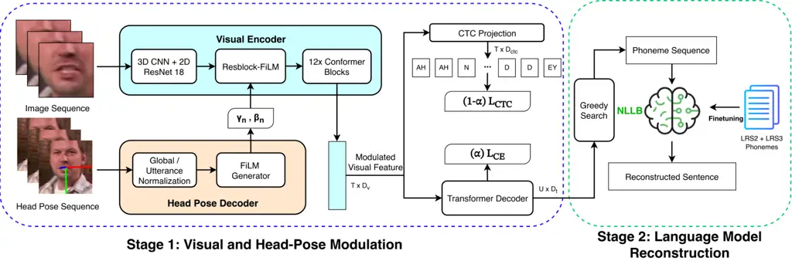
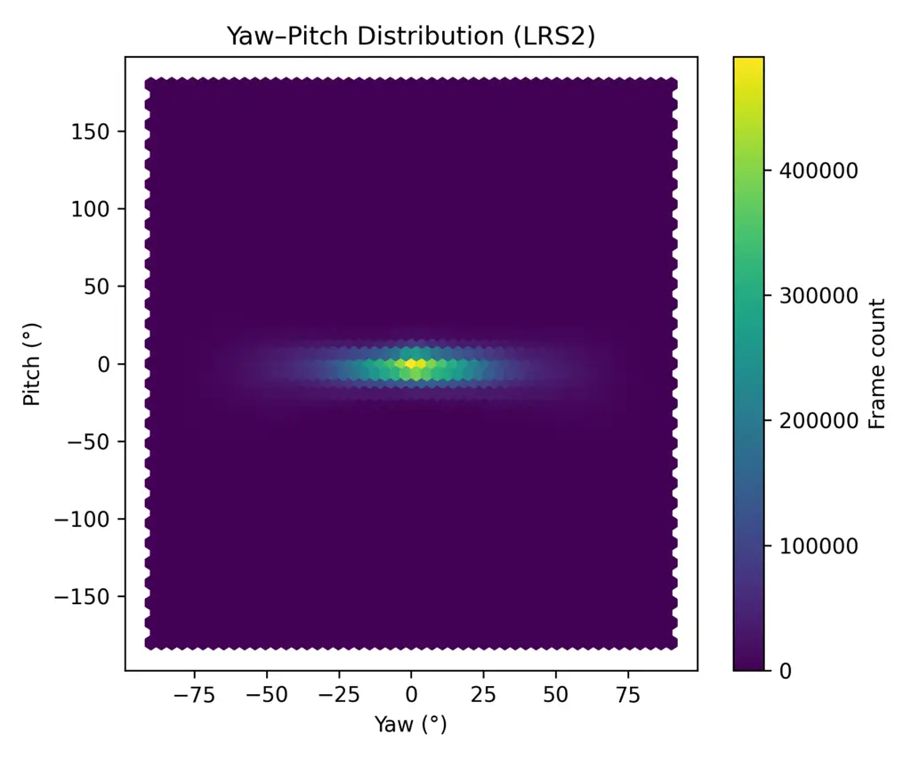
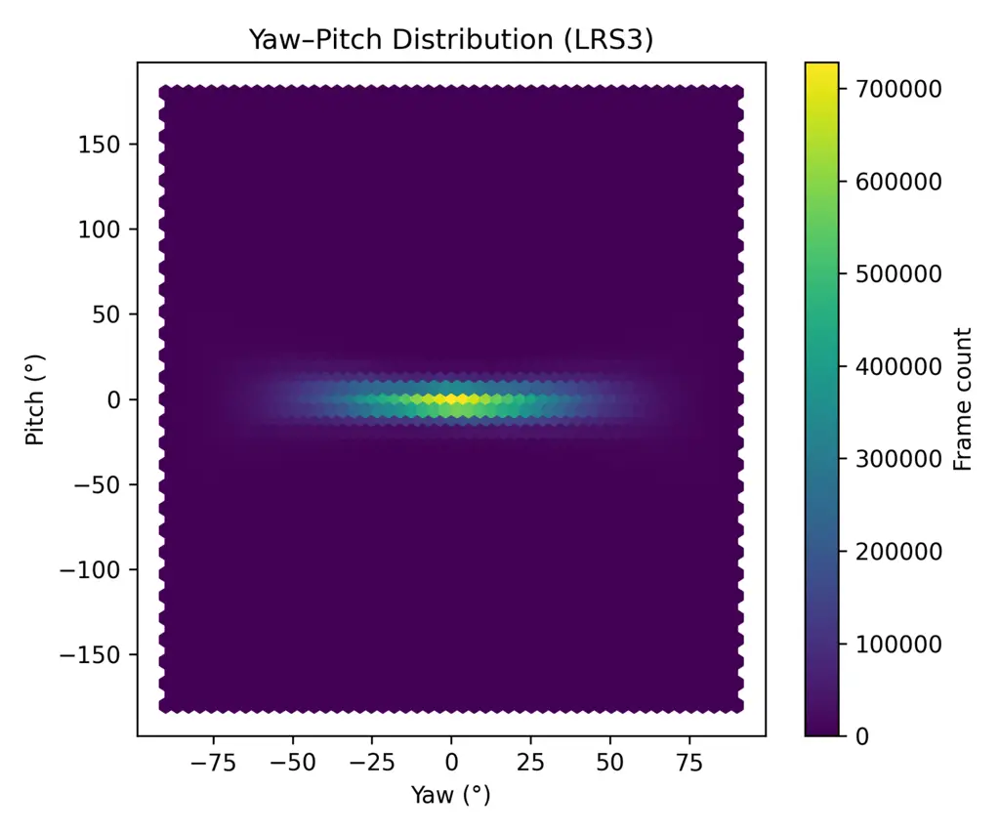
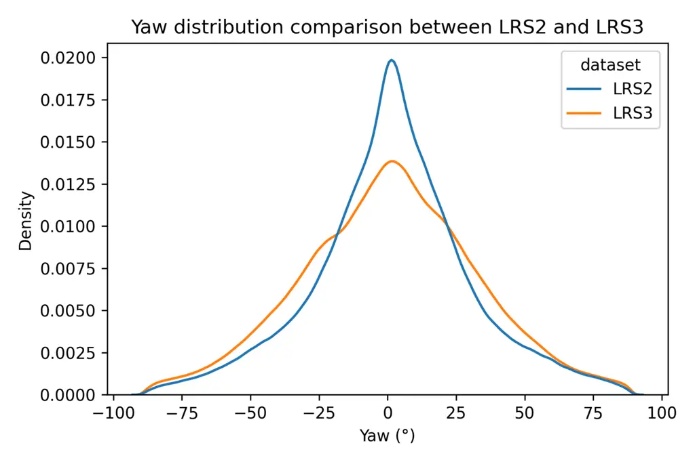

# Head-Pose-Aware Visual Speech Recognition with FiLM Modulation

Matthew Kit Khinn Teng Email: <teng.khinn-matthew178@mail.kyutech.jp>
Affiliation: Department of Artificial Intelligence, Kyushu Institute of
Technology, Iizuka, 820-8502, Fukuoka, Japan    Haibo Zhang
Email: <haiboz@ai.kyutech.ac.jp> Affiliation: Department of Artificial
Intelligence, Kyushu Institute of Technology, Iizuka, 820-8502, Fukuoka,
Japan    Takeshi Saitoh Email: <saitoh@ai.kyutech.ac.jp>
Affiliation: Department of Artificial Intelligence, Kyushu Institute of
Technology, Iizuka, 820-8502, Fukuoka, Japan

###### Abstract

Visual Speech Recognition (VSR) aims to recognize speech from visual
cues such as lip movements. Still, its performance is fundamentally
limited by viseme ambiguity and pose-induced variations that introduce
geometric distortions and occlusions. Existing approaches mainly rely on
linguistic context or implicit invariance, leaving visual
representations insufficiently robust under non-frontal views. In this
work, we propose a pose-aware phoneme-level framework, termed
HP-VSR-ResFiLM, that explicitly incorporates head-pose information into
visual feature extraction. The proposed framework adopts a two-stage
pipeline consisting of a pose-conditioned visual encoder in Stage 1 and
a pretrained NLLB language model in Stage 2 for phoneme-to-text
reconstruction. Specifically, Stage 1 incorporates a pose-conditioned
residual Feature-wise Linear Modulation (FiLM) block after the 2D CNN
frontend to refine visual representations adaptively using head-pose
information. Experiments on LRS2 and LRS3 demonstrate that
HP-VSR-ResFiLM achieves competitive performance under comparable
training conditions, attaining word error rates (WER) of 24.7% and
30.3%, respectively, without relying on additional training data.
Comprehensive ablation studies reveal that different FiLM modulation
strategies exhibit complementary strengths: HP-VSR-FiLMFuse (L4)
achieves the best overall performance on LRS2, whereas the proposed
HP-VSR-ResFiLM provides the greatest improvements under large head-pose
variations on LRS3 and consistently outperforms previous pose-aware
methods for high-yaw samples. These results demonstrate the
effectiveness of explicit pose-conditioned feature modulation for robust
visual speech recognition in unconstrained settings.

###### keywords

Lip-reading, Head Pose, Deep Learning, LLM, Phonemes-to-Text
Reconstruction

## 1 Introduction

Human speech communication is inherently multimodal, where visual cues
from lip movements and facial dynamics complement acoustic information
Pollack (1954). In challenging acoustic environments, such as noisy
public spaces or far-field recording conditions, visual signals become
particularly important for reliable recognition. Motivated by this
observation, VSR, also known as lip-reading, aims to recognize spoken
content solely from visual input. Recent advances in deep learning have
significantly improved VSR performance, enabling end-to-end learning
from large-scale in-the-wild datasets such as LRS2 and LRS3. These
developments have positioned VSR as a promising alternative or
complement to traditional audio-based automatic speech recognition
systems. Modern VSR architectures have evolved from early
spatio-temporal convolutional and recurrent models to Transformer-based
frameworks Ma et al. (2023); Ma et al. (2022) with sequence-to-sequence
decoding. Large-scale datasets have facilitated the adoption of deeper
visual backbones, self-supervised pretraining, and language-model-based
decoding strategies.

### 1.1 Problem and Motivation

Despite recent progress in visual speech recognition, several
fundamental challenges remain unresolved. In particular, existing
approaches struggle to handle inherent visual ambiguities, underutilize
pose-related information, and lack effective mechanisms for
incorporating such cues into visual feature learning. To address these
limitations, we identify the following key problems that this work aims
to solve:

1.  1.  Viseme Ambiguity and the Limits of Context-Only Disambiguation. A
        fundamental bottleneck in visual speech recognition is viseme
        ambiguity, where acoustically distinct phonemes — such as /b/ vs.
        /p/ in ”back” vs. ”pack” — produce visually indistinguishable lip
        configurations. Existing approaches address this through
        phoneme-centric modeling and large language model integration, both
        of which exploit linguistic context to infer the intended utterance.
        While effective in high-context settings, these strategies are
        unreliable when ambiguous phonemes occur in low-context or
        semantically balanced environments, where linguistic priors offer
        insufficient discriminative signal.

    Critically, neither strategy resolves ambiguity at the level of
    visual features — the representations fed into downstream decoders
    remain equally ambiguous regardless of the language model’s
    capacity. We argue that this limitation can be partially mitigated
    during feature extraction by incorporating complementary geometric
    information. Head pose introduces structured geometric variations in
    lip appearance, revealing cues such as lateral contours and oral
    cavity depth that are absent in frontal views. This suggests that
    resolving ambiguity requires improving the quality of visual
    representations themselves, motivating the use of complementary
    geometric cues.

2.  2.  Head-Pose Variation as an Underexploited Modeling Factor. Although
        large-scale in-the-wild benchmarks such as LRS2 and LRS3 naturally
        contain substantial head-pose variation, this variability is rarely
        treated as an explicit modeling factor. Existing approaches
        typically address pose variation in two ways: either by normalizing
        faces toward a canonical frontal view during preprocessing, or by
        relying on large-scale training data to learn pose-invariant
        representations implicitly. The former reduces pose-dependent
        geometric variability by treating it as incidental noise, while the
        latter assumes that sufficiently large models and datasets can
        capture pose effects without explicit supervision.

    However, pose-induced changes are not random; they introduce
    structured variations in lip appearance, articulation visibility,
    and oral cavity geometry that directly influence the
    discriminability of visual speech features. As a result, models may
    learn compressed representations that fail to capture pose-dependent
    cues.

    Our empirical analysis of head-pose distributions in LRS2 and LRS3
    (see Section 4.3) shows that non-frontal poses are prevalent,
    indicating that pose variation is not an edge case but a fundamental
    characteristic of real-world VSR data. This observation motivates
    moving beyond implicit handling and treating head pose as an
    explicit, informative signal within the modeling process rather than
    a preprocessing artifact.

3.  3.  Limitations of implicit and additive pose integration. Existing
        methods that address pose variation rely on either multi-view
        modeling under controlled viewpoint supervision or
        augmentation-based strategies that simulate pose variability through
        synthetic transformations. While these approaches improve robustness
        within their respective settings, neither provides a general
        solution for unconstrained in-the-wild conditions. Multi-view
        designs depend on discrete, predefined viewpoints and do not extend
        to continuously varying poses within a single video stream.
        Augmentation strategies treat pose as a nuisance factor to be
        neutralized, discarding the discriminative geometric cues that
        non-frontal views carry rather than modeling them explicitly.

    A deeper representational issue compounds this limitation: head pose
    does not affect visual features uniformly. Pose-induced distortions
    are spatially localized and channel-specific, manifesting
    differently across network depths — altering lip boundary sharpness,
    oral aperture structure, and lateral contour visibility in ways that
    depend jointly on viewing angle and feature abstraction level.
    Strategies that handle pose globally or implicitly are insufficient
    to capture these layer-dependent and spatially varying effects.

    This motivates conditioning the visual encoder on head pose through
    a mechanism capable of depth-adaptive and channel-selective feature
    refinement. We adopt FiLM-based affine modulation, which learns to
    rescale and shift intermediate feature map channels as a function of
    instantaneous pose, providing a principled and flexible mechanism
    for pose-aware visual feature adaptation that neither augmentation
    nor multi-view alignment can offer. These observations suggest that
    head pose should be treated not as a nuisance factor, but as a
    fundamental signal for visual speech representation learning.

### 1.2 Our Contribution

In this paper, we propose a pose-aware modulation framework,
HP-VSR-ResFiLM, that incorporates a single pose-conditioned residual
FiLM block after the 2D CNN frontend, enabling adaptive refinement of
visual representations under varying head-pose conditions. Extensive
experiments on large-scale benchmarks demonstrate that explicit
pose-aware modulation significantly improves performance under
unconstrained head movements. Our approach achieves substantial
reductions in WER on both LRS2 and LRS3, with particularly pronounced
gains on the more diverse LRS3 dataset. These results highlight the
importance of explicitly modeling geometric variability in VSR and
suggest that conditional feature modulation provides a principled
mechanism for improving visual speech recognition.

In this work, we make the following contributions:

- •
  Reframing head pose as a fundamental signal in VSR. We show that head
  pose introduces structured geometric variations that directly affect
  visual speech representations, challenging the common assumption that
  pose should be normalized or treated as noise.
- •
  Pose-conditioned residual feature modulation for VSR. We propose
  HP-VSR-ResFiLM, which incorporates a single pose-conditioned residual
  FiLM block after the visual frontend to refine visual representations
  under varying head-pose conditions adaptively.
- •
  Comprehensive analysis of pose-aware modulation strategies. Through
  controlled experiments and pose-stratified evaluations, we demonstrate
  that the proposed single residual FiLM block achieves the best overall
  WER performance across mixed-pose scenarios. Furthermore, deeper
  modulation at ResNet-18 Layers 3 and 4 yields larger improvements for
  samples with yaw angles greater than $`30^{\circ}`$, while exhibiting
  comparatively lower effectiveness under near-frontal pose conditions.
  These findings highlight the trade-off between pose-specific
  robustness and general pose generalization across different modulation
  depths.

## 2 Related Works

### 2.1 Visual Speech Recognition in the Wild

Deep learning has substantially advanced VSR, evolving from early
spatio-temporal convolutional models to attention-based and Transformer
architectures. Initial end-to-end approaches combined convolutional
encoders with recurrent networks to model temporal lip dynamics
Stafylakis and Tzimiropoulos (2017); Petridis et al. (2017); Wand et al.
(2016); Assael et al. (2016). Subsequently, the availability of
large-scale datasets such as GRID Cooke et al. (2006), LRW Chung and
Zisserman (2016), LRS2 Chung et al. (2017), and LRS3 Afouras et al.
(2018) enabled the development of more powerful architectures leveraging
deeper convolutional backbones and sequence-to-sequence modeling. More
recent works employ Transformer-based encoders and self-supervised
pretraining to capture long-range dependencies and improve
generalization in unconstrained settings.

Beyond purely visual modeling, several approaches incorporate audio
information to guide visual representation learning. These methods range
from direct audio-visual fusion Serdyuk et al. (2022); Hu et al.
(2023a); Hu et al. (2023b) to synthetic pretraining with audio
supervision Ma et al. (2023); Liu et al. (2023). In this context,
AlignVSR Liu et al. (2025) introduces a cross-modal alignment framework
that exploits both global and local audio-visual correspondence to
improve visual-to-text inference, demonstrating the effectiveness of
auxiliary audio supervision. While such approaches are effective, they
rely on audio signals or pre-trained ASR models, which may not be
available in scenarios where lip-reading is most critical.

In contrast, VSR focuses exclusively on visual input during training
Zhang et al. (2019). Recent work further explores adapting visual
encoders for pre-trained audio-based VSR models by aligning lip features
with audio latent spaces Djilali et al. (2023); Laux et al. (2024).
Although this approach benefits from strong linguistic priors learned
during ASR pretraining, it typically requires substantial data to learn
reliable visual representations that can bridge modality gaps.

To improve sentence-level modeling, phoneme-centric strategies introduce
intermediate linguistic representations. Prajwal et al. Prajwal et al.
(2022) propose a Transformer-based encoder–decoder architecture that
captures sub-word units through visual attention mechanisms. Earlier
phoneme-based approaches El‐Bialy et al. (2023) explicitly model
phonetic units before word-level decoding, aiming to enhance
interpretability and linguistic structure. More recently, LLMs have been
incorporated into lip-reading pipelines. Yeo et al. Yeo et al. (2024);
Yeo et al. (2025) directly project visual features into LLM embedding
spaces, leveraging powerful language priors for sentence reconstruction.
Similarly, Thomas et al. Thomas et al. (2025) introduce VALLR, a
two-stage framework that first predicts phonemes from visual input and
subsequently reconstructs coherent sentences using a decoder-only LLM.

While these LLM-based approaches benefit from strong language modeling
capabilities, decoder-only architectures rely heavily on the quality of
intermediate phoneme predictions, and their unidirectional decoding
structure may limit refinement of noisy representations under
challenging visual conditions. Encoder–decoder LLM architectures, by
contrast, provide context-aware encoding mechanisms that can mitigate
inconsistencies in intermediate predictions through bidirectional
contextual modeling Eickhoff et al. (2023). This architectural
distinction suggests potential performance advantages when integrating
phoneme-level representations into sentence reconstruction frameworks.

In parallel, landmark-based approaches explore geometric modeling of lip
motion. Graph convolutional networks have demonstrated effectiveness in
modeling non-Euclidean structures such as facial landmarks. Liu et
al. Liu et al. (2020) introduced ST-GCN for lip-reading, leveraging a
fixed graph adjacency matrix to capture spatial-temporal dynamics of lip
landmarks. Building upon this framework, Sheng et al. Sheng et al.
(2021) proposed ASST-GCN, which incorporates adaptive graph learning and
evaluates performance on large-scale datasets, including LRS2 and LRS3.
These works highlight the complementary role of geometric
representations alongside appearance-based features.

Collectively, modern VSR research has progressed from spatio-temporal
convolutional modeling to Transformer-based architectures, multimodal
supervision, phoneme-centric decoding, LLM integration, and graph-based
geometric reasoning. These advances have substantially improved
recognition accuracy on large-scale in-the-wild benchmarks such as LRS2
and LRS3. However, despite these improvements, geometric variations such
as head pose are typically not modeled explicitly in current VSR
systems.

Underexplored Role of Head-Pose Variation in VSR. Despite the diversity
of in-the-wild benchmarks, head-pose variation remains insufficiently
characterized in current VSR systems. Large-scale datasets such as LRS2
and LRS3 exhibit substantial real-world variability, including
illumination changes, motion blur, occlusions, and head movements.
However, most VSR pipelines rely on face detection and alignment
procedures that normalize faces toward a canonical frontal
configuration Afouras et al. (2018). While effective for reducing
appearance variation, such preprocessing implicitly suppresses pose
diversity, limiting the model’s ability to capture pose-dependent
articulation patterns. As a result, the impact of head-pose variation on
large-scale VSR performance remains insufficiently characterized.

### 2.2 Pose-Aware Visual Speech Recognition

Head pose variation introduces structured geometric transformations that
can significantly alter the spatial configuration of lip regions and,
consequently, affect visual speech representations. While pose
variability is naturally present in large-scale in-the-wild datasets, it
has been more explicitly investigated in controlled multi-view settings.

Datasets such as OuluVS2 Anina et al. (2015) provide synchronized
recordings from multiple viewing angles, enabling the development of
view-specific encoders Ma et al. (2021); Isobe et al. (2021) and
pose-adaptive universal models Maeda and Tamura (2021). These approaches
either learn separate representations for distinct viewpoints or
construct shared latent spaces that align multi-view observations. Such
designs demonstrate that explicitly modeling viewpoint differences can
improve recognition performance under predefined angular variations.

In addition to multi-view learning, several studies have attempted to
simulate pose variability through data augmentation. These include 3D
morphable model-based pose synthesis Cheng et al. (2020), synthetic data
generation Hao et al. (2025), and visual perturbation techniques
Fernandez-Lopez et al. (2023). While these methods improve performance
to specific distortions, they often depend on synthetic transformations
that may introduce distribution shifts relative to real-world data.
Moreover, augmentation-based strategies typically address pose variation
implicitly rather than modeling it as a structured factor in the
representation-learning process.

Limitations of Implicit Head-Pose Integration. Prior work has explored
head-pose estimation and its integration into visual perception tasks.
However, explicit modeling of head pose within large-scale VSR systems
remains limited. Rather than being treated as a structured geometric
factor, head pose is often handled implicitly through preprocessing,
overlooking its role in systematically altering articulation appearance
and spatial relationships. Consequently, how pose-induced representation
shifts affect sentence-level lip-reading performance remains poorly
understood, particularly in unconstrained real-world settings.

### 2.3 Conditional Feature Modulation and Representation Adaptation

Conditional feature modulation techniques have demonstrated strong
capability in adapting neural representations using auxiliary signals.
Notably, FiLM Perez et al. (2018) and related conditioning mechanisms
such as conditional normalization Dumoulin et al. (2016) dynamically
modulate intermediate feature maps to incorporate contextual or
task-specific information. These methods have shown strong effectiveness
in vision-language reasoning and multimodal learning tasks Perez et al.
(2018); De Vries et al. (2017), where conditioning signals guide the
network to emphasize task-relevant representations while suppressing
irrelevant variations.

Despite their success in representation adaptation, conditional
modulation techniques remain underexplored in visual speech recognition.
In particular, their potential to adapt visual features in response to
geometric variations, such as those induced by head pose, has not been
systematically investigated.

Meanwhile, modern VSR systems achieve strong performance on large-scale
benchmarks such as LRS2 and LRS3 by leveraging powerful sequence
modeling architectures and large-scale training. However, these
approaches primarily rely on implicit handling of pose variation and do
not explicitly model head-pose-dependent changes in visual articulation.
Furthermore, existing pose-aware methods are often evaluated in
controlled or synthetic settings, leaving their effectiveness under
real-world pose variability insufficiently understood.

Lack of Pose-Conditioned Feature Modulation in VSR. Taken together,
these observations indicate that the role of head-pose variability in
large-scale in-the-wild lip-reading remains underexplored. In
particular, there is a lack of principled approaches that explicitly
incorporate pose information to guide visual feature adaptation. This
gap motivates the development of pose-conditioned modulation strategies
for improving robustness to pose-induced distortions in visual speech
recognition.

## 3 Methodology



Figure 1: Overview of the proposed HP-VSR-ResFiLM framework. In Stage 1,
visual features are extracted using a spatiotemporal visual encoder,
while complementary geometric information is obtained from a head-pose
encoder. The estimated head-pose representation is used to generate FiLM
parameters that adaptively modulate intermediate visual representations
through a residual FiLM block within the visual encoder, enabling
pose-aware feature refinement. The modulated visual features are then
processed by a temporal encoder and optimized using hybrid CTC/attention
objectives for phoneme sequence prediction. In Stage 2, the predicted
phoneme sequence is decoded using greedy autoregressive decoding and
subsequently reconstructed into natural language using a fine-tuned NLLB
model. Here, $`T`$ and $`U`$ denote the input and output sequence
lengths, respectively; $`D_{v}`$ represents the visual feature
dimension, $`D_{ctc}`$ denotes the CTC projection dimension, and
$`D_{t}`$ corresponds to the phoneme vocabulary size.

The overall proposed system follows a two-stage phoneme-based
architecture as shown in Figure 1. In Stage 1, head-pose information is
incorporated into the visual encoder through a residual FiLM block
inserted after the 2D CNN frontend, enabling adaptive refinement of
visual representations. The modulated features are subsequently
processed by the Conformer encoder, followed by a Transformer decoder
and optimized using a Connectionist Temporal Classification (CTC)
objective for phoneme prediction.

In Stage 2, we conduct language-based reconstruction using a pre-trained
large language model. Specifically, we adopt the same NLLB model as in
prior work Teng et al. (2026) and make no architectural modifications or
additional fine-tuning. By keeping Stage 2 fixed, we ensure that
performance differences are attributable solely to the proposed
improvements in pose-aware visual feature modeling.

### 3.1 Stage 1: Visual and Head-Pose Modulation.

Visual encoder. We employ a visual backbone consisting of a
spatiotemporal convolution frontend that uses a 3D convolutional layer
with a stride of $`1\times 2\times 2`$ and a kernel size of
$`5\times 7\times 7`$ to extract low- and mid-level spatiotemporal
representations from input video frames. The frontend is followed by a
modified ResNet-18 Teng et al. (2026) and a residual FiLM block that
modulates visual features using head-pose information. Specifically,
head-pose representations generated by the proposed head-pose encoder
are injected into the residual block through FiLM, where
pose-conditioned scaling and shifting parameters are learned to refine
intermediate visual representations adaptively. This design enables the
visual encoder to dynamically adjust its representations in response to
head-pose variations while preserving the overall backbone architecture.
The pose-aware visual features are subsequently processed by a 12-layer
Conformer, which serves as the temporal back-end. The Conformer
integrates multi-head self-attention and convolutional modules to
capture both long-range temporal dependencies (e.g., phoneme
coarticulation across frames) and local temporal dynamics (e.g.,
fine-grained lip movements), producing context-aware embeddings at each
time step.

Pose-aware FiLM modulation. To enable head-pose-conditioned adaptation
of visual features, we employ FiLM as a conditioning mechanism. FiLM
applies a feature-wise affine transformation to intermediate activations
of a neural network, allowing external pose information to influence
visual representations adaptively.

Let $`F_{i,c}`$ denote the activation of the $`c`$-th feature channel
corresponding to the $`i`$-th input sample. FiLM modulates this
activation using a channel-wise scaling parameter $`\gamma_{i,c}`$ and
shifting parameter $`\beta_{i,c}`$, defined as

```math
\tilde{F}_{i,c}=\gamma_{i,c}F_{i,c}+\beta_{i,c}. \tag{1}
```

Head-pose FiLM generator. The normalized head-pose representation
$`\tilde{\mathbf{h}}_{t}`$ is passed through a FiLM generator consisting
of two fully connected layers with a ReLU activation to produce the
pose-conditioned modulation parameters $`\boldsymbol{\gamma}_{t}`$ and
$`\boldsymbol{\beta}_{t}`$. These parameters are subsequently applied to
the intermediate visual feature maps according to Eq. (1), enabling
adaptive modulation of visual representations based on head-pose
dynamics.

CTC Watanabe et al. (2017). The projected encoder features are passed
through a linear layer to produce phoneme-level logits. These logits are
used to compute the CTC loss, which enforces monotonic alignment between
input feature sequences and phoneme targets without requiring
frame-level annotations. In the hybrid CTC/attention framework, the CTC
objective complements the decoder loss, facilitating faster convergence
and improving beam-search decoding performance.

Transformer decoder. The decoder architecture follows the standard
Transformer formulation. Input tokens are first embedded and augmented
with positional encodings. The embeddings are then processed by stacked
decoder layers, each consisting of masked self-attention,
encoder-decoder attention, and position-wise feed-forward networks with
residual connections and dropout. A final linear projection maps decoder
outputs to the phoneme vocabulary.

### 3.2 Stage 2: Language Model Reconstruction.

For language reconstruction, we adopt the pre-trained NLLB model
from Teng et al. (2026). The NLLB encoder transforms phoneme sequences
into contextualized representations using multi-head self-attention and
feed-forward layers. The decoder generates word tokens autoregressively
by attending to encoder outputs and previously generated tokens. The
final outputs are projected to the vocabulary space and normalized with
softmax to produce word probabilities.

## 4 Experiments

### 4.1 Datasets

The LRS2 dataset Chung et al. (2017) comprises 144,482 sentence-level
video clips collected from BBC broadcasts, totaling approximately 224.5
hours of data. Each utterance contains a spoken sentence of up to 100
characters. The dataset is divided into four subsets: a pretraining set
with 96,318 utterances (195 hours), a training set with 45,839
utterances (28 hours), a validation set with 1,082 utterances (0.6
hours), and a test set with 1,243 utterances (0.5 hours).

The LRS3 dataset Afouras et al. (2018) is the largest publicly available
English audio-visual speech dataset, comprising 438.9 hours of video
extracted from over 5,000 TED and TEDx talks. The dataset contains
151,819 utterances. Specifically, the pretraining set includes 118,516
utterances (408 hours), the train-validation set contains 31,982
utterances (30 hours), and the test set consists of 1,321 utterances
(0.9 hours).

### 4.2 Preprocessing

The mouth region is cropped using a fixed $`96\times 96`$ pixel bounding
box. Each video frame is normalized by subtracting the mean and dividing
by the standard deviation computed over the training set. To estimate
head-pose information for each video sequence, including yaw, pitch, and
roll angles, we employ the 6DRepNet model Hempel et al. (2022) to
extract per-frame head-pose values. For all sequences in the LRS2 and
LRS3 datasets, head-pose parameters are computed frame by frame using
this 6DRepNet estimator.

To account for dataset-specific pose biases and scale variations, we
perform z-score normalization on the head-pose values. Specifically, we
compute the dataset-level mean and standard deviation of yaw, pitch, and
roll across all frames. Each frame-level head pose is then normalized by
subtracting its mean and dividing by its standard deviation, yielding
zero-mean, unit-variance representations. Let
$`\mathbf{h}_{t}=[y_{t},p_{t},r_{t}]`$ denote the yaw, pitch, and roll
angles at frame $`t`$, and let
$`\boldsymbol{\mu}=[\bar{y},\bar{p},\bar{r}]`$ and
$`\boldsymbol{\sigma}=[\sigma_{y},\sigma_{p},\sigma_{r}]`$ represent the
dataset-level mean and standard deviation, respectively. The normalized
head pose is computed as:

```math
\tilde{\mathbf{h}}_{t}=\frac{\mathbf{h}_{t}-\boldsymbol{\mu}}{\boldsymbol{\sigma}}. \tag{2}
```

This normalization strategy reduces inter-dataset bias and stabilizes
the scale of head-pose variations across sequences, thereby facilitating
more consistent learning when head-pose information is incorporated as
an auxiliary cue. The normalized head-pose features are subsequently
used in downstream processing without introducing any additional
supervision. All normalization statistics are computed on the training
split and applied consistently to validation and test sets.

For English grapheme-to-phoneme (G2P) conversion, text containing
numbers, dates, and currency expressions is first normalized into their
spoken forms using the text normalization module from the NVIDIA NeMo
toolkit Zhang et al. (2024). This preprocessing step ensures that the
subsequent G2P conversion can handle non-standard written expressions.
We then employ the open-source SoundChoice toolkit Ploujnikov and
Ravanelli (2022), which processes entire phrases rather than individual
words, generating context-aware ARPAbet phoneme sequences. This
preprocessing pipeline is consistent with our prior work Teng et al.
(2026) and adapted to the current experimental setting.

The resulting phoneme sequences are represented using the ARPAbet set, a
standardized ASCII-based system for English phonemes, as summarized in
Table 1. Each symbol corresponds to a distinct sound and provides a
computationally convenient alternative to the International Phonetic
Alphabet (IPA). The representation includes both vowels (e.g., “AA”,
“IY”, “OW”) and consonants (e.g., “K”, “SH”, “TH”), and is commonly used
in automatic speech recognition and phoneme-based modeling Teng et al.
(2026).

SentencePiece tokenization is used to convert the LRS2 and LRS3
transcriptions into phoneme sequences. The model is trained on 39
phoneme classes, excluding the special symbols “\<unk\>” and “\_”, which
represent unknown phonemes and spaces, respectively. This design is
consistent with established phoneme-level AVSR settings Ma et al. (2023)
and provides a balance between expressivity and computational
efficiency.

|                                                                                                                                                            |
| ---------------------------------------------------------------------------------------------------------------------------------------------------------- |
| {\<unk\>, \_, AA, AE, AH, AO, AW, AY, B, CH, D, DH, EH, ER, EY, F, G, HH, IH, IY, JH, K, L, M, N, NG, OW, OY, P, R, S, SH, T, TH, UH, UW, V, W, Y, Z, ZH } |

Table 1: Set of phoneme classes used in the proposed model, including
vowel, consonant, and special tokens.

### 4.3 Head-Pose Statistics

To better understand the extent of head-pose variation in large-scale
VSR datasets, we analyze the distribution of head poses in LRS2 and
LRS3. Specifically, we examine the joint distribution of yaw and pitch
angles, as well as the marginal distribution of yaw, to characterize the
prevalence of non-frontal views.

Figure 2 presents the joint yaw-pitch distributions for LRS2 and LRS3 as
heatmaps. While both datasets exhibit a high-density region around
frontal orientations, the distributions extend broadly across the
yaw-pitch space rather than being tightly concentrated. This widespread
dispersion indicates that a substantial portion of frames involve
non-frontal views with noticeable out-of-plane head rotations,
reflecting the unconstrained nature of in-the-wild video recordings.

Figure 3 further compares the marginal yaw distributions of the two
datasets using density curves. Although both distributions show a peak
around frontal orientations, they exhibit long tails and significant
spread toward larger yaw angles, indicating that non-frontal views occur
frequently. In particular, LRS3 demonstrates a noticeably wider
distribution, suggesting greater pose variability. This difference is
consistent with the TED Talk format, where speakers often turn their
heads to engage different sections of the audience.

Table 2 reports the distribution of frames across yaw, pitch, and roll
angle ranges for the LRS2 and LRS3 datasets. Although near-frontal views
(within $`15^{\circ}`$) constitute the largest portion of the data, a
substantial proportion of frames exhibit pronounced yaw variations. In
particular, frames with yaw angles exceeding $`30^{\circ}`$ account for
$`26.51\%`$ of LRS2 and $`34.78\%`$ of LRS3, indicating that more than
one-quarter to one-third of the data involves significant non-frontal
views. Furthermore, extreme poses beyond $`45^{\circ}`$ still represent
$`13.31\%`$ and $`16.89\%`$ of the datasets, respectively, which is
non-negligible for reliable lip-reading. These results highlight that,
despite a concentration around frontal orientations, yaw variation is
both widespread and substantial, introducing frequent self-occlusion and
geometric distortion in the lip region. This level of pose variation is
more pronounced than typically assumed and underscores the need for VSR
models to handle non-frontal views explicitly.

|                                         |           |                |            |                |
| --------------------------------------- | --------- | -------------- | ---------- | -------------- |
| Yaw Range                               | LRS2      |                | LRS3       |                |
|                                         | Frames    | Percentage (%) | Frames     | Percentage (%) |
| $`<15^{\circ}`$ (Frontal)               | 9,450,773 | 46.99          | 14,629,800 | 37.25          |
| $`15`$–$`30^{\circ}`$ (Semi-frontal)    | 5,327,743 | 26.49          | 10,988,773 | 27.98          |
| $`30`$–$`45^{\circ}`$ (Side)            | 2,654,236 | 13.20          | 7,025,340  | 17.89          |
| $`45`$–$`60^{\circ}`$ (Profile/Extreme) | 1,526,894 | 7.59           | 3,889,761  | 9.90           |
| $`>60^{\circ}`$ (Extra Extreme)         | 1,150,859 | 5.72           | 2,743,914  | 6.99           |

Table 2: Yaw angle distribution statistics for the LRS2 and LRS3
datasets. More than 50% of frames in both datasets exhibit yaw angles
greater than $`15^{\circ}`$, indicating the presence of substantial
non-frontal head motion.

In contrast, pitch and roll angles are highly concentrated around
near-frontal orientations. For pitch, $`85.16\%`$ and $`87.36\%`$ of
frames fall within $`15^{\circ}`$ in LRS2 and LRS3, respectively, while
roll exhibits a similar trend with $`83.52\%`$ and $`88.56\%`$ of frames
in the same range. Only a small fraction of frames exceed $`30^{\circ}`$
for both pitch and roll in either dataset. These head-pose statistics
are computed from raw video frames before face alignment. The
face-alignment preprocessing further normalizes vertical (pitch) and
in-plane (roll) rotations toward canonical frontal views. As a result,
the effective variation of pitch and roll observed by the model during
training and inference is likely even smaller than indicated by these
statistics. In contrast, yaw variations are less constrained by
alignment and remain substantially more pronounced, making them a
primary source of pose-induced difficulty in visual speech recognition.

Although prior work Ma et al. (2023); Teng et al. (2026); Yeo et al.
(2024) recognizes that LRS2 and LRS3 contain significant pose variation,
existing studies typically treat this variability implicitly and do not
report quantitative head-pose statistics. By explicitly analyzing yaw
and pitch distributions and pose-dependent frame counts, our study
reveals that non-frontal views constitute a non-trivial portion of both
datasets. This analysis directly motivates our head-pose–aware modeling
strategy, which addresses pose-induced appearance changes and
self-occlusion in lip-reading.



(a) LRS2 Yaw-Pitch Heatmap



(b) LRS3 Yaw-Pitch Heatmap

Figure 2: Yaw–pitch distribution heatmaps for the LRS2 and LRS3
datasets. The left panel shows LRS2, while the right panel shows LRS3.
Both datasets are dominated by frontal and semi-frontal views, with a
non-negligible presence of large out-of-plane rotations.



Figure 3: Comparison of yaw angle distributions in LRS2 and LRS3. Both
datasets show a strong concentration around near-frontal poses, with a
gradual decrease toward larger yaw angles, indicating pose variability
in unconstrained settings.

### 4.4 Loss Function

To simplify the conditional independent assumption of CTC and enforce
monotonic alignments, we use a hybrid CTC/Attention architecture
Watanabe et al. (2017) in this study. The following is the definition of
the overall training goal:

```math
\mathcal{L}=\alpha\mathcal{L}_{\text{CE}}+(1-\alpha)\mathcal{L}_{\text{CTC}} \tag{3}
```

where $`\mathcal{L}_{\text{CTC}}`$ is the CTC loss and
$`\mathcal{L}_{\text{CE}}`$ is the cross-entropy loss. The adjustable
parameter $`\alpha\in[0,1]`$ controls the trade-off between the
cross-entropy loss and the CTC loss.

### 4.5 Experimental Setup

All experiments are conducted on a single NVIDIA A6000 GPU with 49GB of
memory. For Stage 1, following the experimental protocol of Teng et al.
(2026), we train the model for 80 epochs using the AdamW optimizer with
an initial learning rate of $`1\times 10^{-4}`$. We use a cosine
learning-rate scheduler with a 5-epoch warm-up. The maximum number of
frames per training batch is set to 1,800. We also initialize the visual
encoder from the publicly released Auto-AVSR model Ma et al. (2023),
which is trained on a large-scale VSR dataset comprising LRW Chung and
Zisserman (2016), LRS2, LRS3, VoxCeleb2 Chung et al. (2018), and
AVSpeech Ephrat et al. (2018) with automatically generated
transcriptions, totaling 3,448 hours. In contrast to the original
training protocol, we fine-tune the model using only the labeled data
from LRS2 or LRS3, without incorporating additional external data during
training.

The 3D convolution frontend of the visual encoder is kept frozen, while
the remaining components are fine-tuned. This training protocol ensures
a controlled comparison across ablation variants by avoiding confounding
effects from differing fine-tuning strategies. Early stopping with a
patience of 5 epochs is applied to mitigate overfitting. For evaluation,
we report results by averaging the model parameters from the final 10
checkpoints, which stabilizes performance estimates and reduces variance
from epoch-to-epoch fluctuations.

For Stage 2, we reimplement the LLM architecture and training
configuration introduced in our prior work Teng et al. (2026), and do
not perform any additional fine-tuning in this study. In Teng et al.
(2026), the model was fine-tuned using the AdamW optimizer with an
initial learning rate of $`5\times 10^{-5}`$. The default English
tokenizer is employed, and phoneme sequences are treated as a distinct
input language, enabling the model to learn a mapping from phonemic
representations to natural language. During decoding, beam search is
applied, with hyperparameters tuned on the validation set; a beam size
of 15 and a length penalty of 0.1 were found to yield the best
performance.

### 4.6 Evaluation Metrics

To evaluate lip-reading performance, we adopt WER Jelinek et al. (1975)
as the primary metric. WER quantifies the discrepancy between the
predicted text and the reference transcript by accounting for
substitutions, deletions, and insertions. Formally, WER is defined as:

```math
\text{WER}=\frac{S+D+I}{N} \tag{4}
```

where $`S`$, $`D`$, and $`I`$ denote the number of substitutions,
deletions, and insertions, respectively, and $`N`$ represents the total
number of words in the reference transcript.

In addition to WER, we report phoneme error rate (PER) to evaluate the
accuracy of phoneme-level predictions. Together, these metrics provide a
comprehensive and fine-grained assessment of lip-reading performance.

### 4.7 Comparison with State-of-the-Art Methods

|                              |                |                  |            |            |            |       |            |       |
| ---------------------------- | -------------- | ---------------- | ---------- | ---------- | ---------- | ----- | ---------- | ----- |
| Method                       | Phoneme -based | Input            | LLM        | Extra Data | LRS2       |       | LRS3       |       |
|                              |                |                  |            |            | Training   | WER   | Training   | WER   |
|                              |                |                  |            |            | Data \[h\] | \[%\] | Data \[h\] | \[%\] |
| ASSTGCN Sheng et al. (2021)  | \-             | Video+38-Points  | \-         | \-         | 223        | 55.7  | 438        | 62.7  |
| Hyb.-Conf. Ma et al. (2021)  | \-             | Video            | \-         | ✓          | 381        | 37.9  | 590        | 43.3  |
| VTP Prajwal et al. (2022)    | \-             | Video            | \-         | ✓          | 698        | 48.9  | 698        | 40.6  |
| CM-aux Ma et al. (2022)      | \-             | Video            | \-         | \-         | 223        | 32.9  | 438        | 36.3  |
| VTP Prajwal et al. (2022)    | \-             | Video            | \-         | ✓          | 2676       | 22.6  | 2676       | 30.7  |
| Auto-AVSR Ma et al. (2023)   | \-             | Video            | \-         | ✓          | 818        | 27.9  | 818        | 33.0  |
| Auto-AVSR Ma et al. (2023)   | \-             | Video            | \-         | ✓          | 3448       | 14.6  | 3448       | 19.1  |
| VALLR Thomas et al. (2025)   | ✓              | Video            | LLaMA      | \-         | 28         | 20.8  | 30         | 18.7  |
| ViT-3D Serdyuk et al. (2022) | \-             | Video            | \-         | ✓          | \-         | \-    | 90000      | 17.0  |
| SyncVSR Ahn et al. (2024)    | ✓              | Video            | \-         | \-         | 223        | 28.9  | 438        | 31.2  |
| GLip Wang et al. (2025)      | ✓              | Video            | \-         | \-         | 223        | 27.4  | 438        | 30.1  |
| V-ASR Teng et al. (2026)     | ✓              | Video            | NLLB(1.3B) | \-         | 223        | 35.2  | 438        | 41.2  |
| PV-ASR Teng et al. (2026)    | ✓              | Video+117-Points | NLLB(1.3B) | \-         | 223        | 26.9  | 438        | 38.7  |
| Auto-AVSR Finetuned Baseline | \-             | Video            | \-         | \-         | 223        | 33.0  | 438        | 29.8  |
| HP-VSR-Base (Our)            | ✓              | Video+Head Pose  | NLLB(1.3B) | \-         | 223        | 33.3  | 438        | 40.8  |
| HP-VSR-FiLMFuse(L4) (Our)    | ✓              | Video+Head Pose  | NLLB(1.3B) | \-         | 223        | 23.3  | 438        | 33.0  |
| HP-VSR-ResFiLM (Our)         | ✓              | Video+Head Pose  | NLLB(1.3B) | \-         | 223        | 24.7  | 438        | 30.3  |

Table 3: Comparison of phoneme-based and word-based visual speech
recognition methods on the LRS2 and LRS3 datasets. The table reports
input modality, LLM usage, external data usage, and target-domain
training duration. Training Data (h) denotes the amount of labeled
LRS2/LRS3 data used during supervised fine-tuning and evaluation. Extra
Data indicates whether additional datasets are used during pretraining
or training beyond the target benchmarks. Our methods are initialized
from Auto-AVSR pretrained weights trained on 3,448 hours of large-scale
audio-visual data. Still, they are fine-tuned only on the standard
LRS2/LRS3 training sets without additional external data during
adaptation. Similarly, the Auto-AVSR Fine-tuned Baseline is initialized
from the same pretrained weights and fine-tuned only on the target
datasets. V-ASR and PV-ASR are re-evaluated using greedy autoregressive
decoding for consistency with the proposed framework.

Table 3 compares the proposed method with recent word-based and
phoneme-based visual speech recognition approaches on the LRS2 and LRS3
benchmarks. The comparison additionally reports input modality, language
model usage, and the amount of external training data to provide a fair
assessment across different experimental settings. We report results for
three variants of our framework: HP-VSR-Base, which directly
incorporates head-pose information through feature fusion;
HP-VSR-FiLMFuse, which applies FiLM-based modulation with explicit pose
fusion at deeper visual layers; and HP-VSR-ResFiLM, the proposed
residual FiLM formulation.

Existing visual-only lip-reading approaches Sheng et al. (2021); Ma et
al. (2021) rely primarily on appearance-based visual representations
without explicit pose-aware conditioning, making them sensitive to
pose-induced geometric distortion and self-occlusion under unconstrained
viewing conditions. Although large-scale pretraining Prajwal et al.
(2022); Ma et al. (2023) substantially improves recognition performance,
these gains rely heavily on massive external audio-visual corpora and
computationally intensive pretraining pipelines. More recently,
phoneme-based frameworks Thomas et al. (2025); Teng et al. (2026) have
explored decoupling visual recognition from linguistic reconstruction
through external language models, enabling improved phonetic modeling
and more flexible integration of linguistic priors. Recent phoneme-based
approaches have further investigated alternative strategies for
improving VSR robustness. SyncVSR Ahn et al. (2024) introduces
crossmodal audio-token synchronization as an auxiliary learning
objective to provide frame-level supervision, while GLip Wang et al.
(2025) employs a progressive global–local visual representation learning
framework to improve recognition under challenging visual conditions.
These approaches demonstrate the effectiveness of additional supervisory
signals and enhanced visual representations for phoneme-based VSR.
However, they do not explicitly incorporate head-pose information as a
conditioning signal during visual feature extraction. In contrast, our
HP-VSR framework explicitly models head-pose dynamics and uses them to
adaptively modulate visual representations, thereby targeting
pose-induced variations directly.

To establish a controlled comparison under limited target-domain
supervision, we additionally fine-tune the released Auto-AVSR pretrained
model using only the standard LRS2 and LRS3 training sets without
introducing additional external data during adaptation. The resulting
performance gap compared with the original large-scale Auto-AVSR results
highlights the substantial dependence of end-to-end visual speech
recognition systems on large-scale pretraining data.

In addition, for fair comparison under practical inference settings, the
reported V-ASR and PV-ASR results are re-evaluated using greedy
autoregressive decoding rather than the teacher-forced decoding protocol
reported in the original work Teng et al. (2026). Teacher-forced
evaluation conditions the decoder on ground-truth previous tokens during
inference and may therefore overestimate real-world recognition
performance. In contrast, greedy decoding reflects fully autoregressive
inference and provides a more realistic assessment of end-to-end
transcription robustness.

Under these controlled evaluation settings, HP-VSR-Base, which
incorporates head-pose information through direct feature fusion,
achieves performance comparable to the video-only baseline but does not
consistently improve robustness across datasets. This observation
suggests that naive multimodal fusion alone is insufficient for
effectively utilizing pose information within the visual encoder. In
contrast, both HP-VSR-FiLMFuse (L4) and the proposed HP-VSR-ResFiLM
achieve substantial improvements over the baseline approaches,
demonstrating the effectiveness of pose-conditioned feature modulation.

As shown in Table 3, the proposed HP-VSR-ResFiLM achieves WERs of 24.7%
on LRS2 and 30.3% on LRS3 while being fine-tuned only on the standard
LRS2/LRS3 training sets using pretrained Auto-AVSR initialization.
Compared with the video-only V-ASR baseline Teng et al. (2026), the
proposed method reduces WER from 35.2% to 24.7% on LRS2 and from 41.2%
to 30.3% on LRS3, demonstrating that explicit pose-conditioned
modulation consistently improves phoneme-based visual speech recognition
across both datasets. Furthermore, compared with PV-ASR Teng et al.
(2026), which relies on dense 117-point facial landmark representations,
HP-VSR-ResFiLM achieves lower WER on both datasets while requiring only
head-pose information in addition to the video stream.

Among recent phoneme-based approaches, SyncVSR Ahn et al. (2024) and
GLip Wang et al. (2025) provide strong recent baselines. HP-VSR-ResFiLM
achieves a WER of 24.7% on LRS2, outperforming both SyncVSR (28.9%) and
GLip (27.4%). On LRS3, HP-VSR-ResFiLM achieves 30.3%, improving over
SyncVSR (31.2%) while remaining competitive with GLip (30.1%). These
results demonstrate that pose-conditioned modulation provides
competitive performance with recent phoneme-based VSR approaches without
introducing additional external data during target-domain adaptation.

Although the Auto-AVSR Fine-tuned Baseline achieves a lower WER on LRS3,
it remains a fully end-to-end sequence generation framework directly
optimized for word-level transcription. In contrast, the proposed
approach explicitly decomposes visual speech recognition into phoneme
prediction and language-level reconstruction. While this intermediate
phoneme representation may introduce additional reconstruction errors,
it provides improved interpretability, modularity, and flexibility for
analyzing pose-aware visual speech modeling. These results suggest that
the proposed FiLM-based modulation primarily improves the robustness of
phoneme-level visual representations rather than directly optimizing
end-to-end language reconstruction performance.

The results further reveal important differences between fusion-based
and modulation-based integration strategies. While direct feature fusion
introduces additional pose features at a later stage, FiLM-based
conditioning adaptively modulates intermediate visual representations
according to pose dynamics during feature extraction. This enables the
network to recalibrate visual representations according to head
orientation and results in improved robustness across the two
benchmarks. HP-VSR-FiLMFuse (L4) achieves the strongest performance on
LRS2, indicating that explicit pose fusion can effectively complement
deep FiLM conditioning. In contrast, the proposed HP-VSR-ResFiLM
achieves the strongest performance among our pose-aware variants on LRS3
while maintaining competitive performance on LRS2, providing the most
balanced performance across both benchmarks. These findings suggest that
residual FiLM conditioning provides a robust mechanism for pose-aware
adaptation, while explicit feature fusion can provide additional gains
when combined with carefully selected deep-layer modulation.

### 4.8 Ablation Studies

#### 4.8.1 Impact of FiLM Layer Placement and Multimodal Head-pose Fusion

We conduct a systematic ablation study under strictly controlled
experimental settings to analyze the contribution of FiLM-based pose
modulation and its interaction with multimodal head-pose fusion. All
variants share identical backbone architecture, optimizer configuration,
training schedule, preprocessing pipeline, hyperparameter settings,
random seeds, cross-validation splits, and decoding framework, differing
only in the placement of FiLM modulation and the inclusion of head-pose
fusion. In addition, Stage 2 is fixed across all experiments to ensure
that performance differences arise solely from architectural
modifications in Stage 1. All experiments are evaluated using identical
protocols on both LRS2 and LRS3, enabling reproducible and fair
comparisons while isolating the effect of pose-conditioned modulation
from other confounding factors.

Table 4 summarizes the ablation results. Incorporating head-pose
information through FiLM-based conditioning consistently improves both
phoneme-level recognition and downstream sentence reconstruction
compared with the unmodulated HP-VSR-Base across both datasets,
confirming that pose cues provide complementary information beyond
visual speech features alone. The proposed HP-VSR-ResFiLM achieves the
strongest overall cross-dataset performance, obtaining 16.20% / 20.96%
PER and 24.68% / 30.32% WER on LRS2 and LRS3, respectively. Relative to
HP-VSR-Base, this corresponds to absolute WER reductions of 8.62% on
LRS2 and 10.51% on LRS3. HP-VSR-FiLMFuse (L4) performance degrades on
LRS3, indicating reduced cross-dataset robustness. Overall, the results
demonstrate that pose-conditioned feature adaptation substantially
improves recognition under unconstrained pose variations while
highlighting the importance of modulation strategy and placement.

|                           |                |        |                  |       |                  |       |
| ------------------------- | -------------- | ------ | ---------------- | ----- | ---------------- | ----- |
| Configuration             | FiLM Placement | Fusion | Stage 1 (PER, %) |       | Stage 2 (WER, %) |       |
|                           |                |        | LRS2             | LRS3  | LRS2             | LRS3  |
| PV-ASR Teng et al. (2026) | –              | ✓      | 18.53            | 25.25 | 26.55            | 35.96 |
| V-ASR Teng et al. (2026)  | –              | –      | 23.26            | 26.90 | 34.91            | 38.62 |
| HP-VSR-Base               | –              | ✓      | 23.28            | 29.62 | 33.30            | 40.83 |
| HP-VSR-FiLM (L1–2)        | Early          | –      | 18.98            | 34.11 | 29.16            | 48.08 |
| HP-VSR-FiLM (L3–4)        | Late           | –      | 21.49            | 47.56 | 32.68            | 66.59 |
| HP-VSR-FiLM (L4)          | Deep           | –      | 16.31            | 22.62 | 24.69            | 32.75 |
| HP-VSR-FiLMFuse (L1–2)    | Early          | ✓      | 19.42            | 31.79 | 27.85            | 43.51 |
| HP-VSR-FiLMFuse (L3–4)    | Late           | ✓      | 17.28            | 22.92 | 25.44            | 32.54 |
| HP-VSR-FiLMFuse (L4)      | Deep           | ✓      | 15.81            | 22.85 | 23.25            | 33.00 |
| Global FiLM               | Post-ResNet    | –      | 16.21            | 21.29 | 24.58            | 30.43 |
| HP-VSR-ResFiLM            | Post-ResNet    | –      | 16.20            | 20.96 | 24.68            | 30.32 |
| HP-VSR-ResFiLMFuse        | Post-ResNet    | ✓      | 19.08            | 26.19 | 27.06            | 36.68 |

Table 4: Ablation study on FiLM modulation strategies and head-pose
fusion. Stage 1 produces phoneme-level predictions evaluated using PER,
while Stage 2 generates word-level outputs evaluated using WER. Stage 2
is fixed across all experiments to ensure that performance differences
arise solely from architectural variations in Stage 1. The results show
that incorporating a single FiLM-modulated residual block after the
visual frontend consistently provides the best overall performance,
demonstrating the effectiveness of simple pose-conditioned feature
modulation. Additional experiments on deeper FiLM placement further
analyze the effect of modulation depth and its interaction with
multimodal fusion.

The effectiveness of FiLM modulation is strongly dependent on its
placement within the visual hierarchy. Applying FiLM to early ResNet18
layers, as implemented in HP-VSR-FiLM (L1–2), significantly degrades
performance, particularly on LRS3, where WER increases from 40.83% to
48.08%. This behavior suggests that low-level convolutional
representations primarily encode local texture and edge statistics that
remain insufficiently discriminative for stable pose-conditioned
modulation. In contrast, deeper representations contain higher-level
articulatory and semantic information that are more suitable for
adaptive conditioning. However, directly modulating multiple deep layers
without residual stabilization produces severe optimization instability.
In particular, HP-VSR-FiLM (L3–4) suffers substantial degradation on
LRS3, reaching 66.59% WER, indicating that aggressive modulation of
latent visual representations can amplify pose-induced feature shifts
and destabilize temporal alignment learning.

We further analyze the interaction between FiLM conditioning and
explicit head-pose fusion. The effect of fusion depends strongly on the
FiLM placement strategy. For early-layer modulation, HP-VSR-FiLMFuse
(L1–2) improves upon HP-VSR-FiLM (L1–2), reducing WER from 29.16% /
48.08% to 27.85% / 43.51% on LRS2 and LRS3, respectively. More
substantial gains are observed for deeper modulation strategies. In
particular, HP-VSR-FiLMFuse (L3–4) dramatically improves LRS3
performance, reducing WER from 66.59% to 32.54%, while simultaneously
lowering PER from 47.56% to 22.92%. Similarly, HP-VSR-FiLMFuse (L4)
achieves the lowest LRS2 WER among all evaluated variants, improving
from 24.69% to 23.25%. These consistent improvements indicate that
explicit head-pose fusion can effectively stabilize FiLM conditioning,
particularly when modulation is applied to deeper visual representations
where pose-induced feature shifts become more pronounced.

The proposed residual FiLM formulation further demonstrates advantages
over alternative modulation strategies. Compared with Global FiLM,
HP-VSR-ResFiLM achieves lower PER on both datasets and obtains the best
WER on LRS3 while maintaining competitive performance on LRS2. Although
Global FiLM achieves a marginally lower WER on LRS2 (24.58% versus
24.68%), its higher PER and weaker gains on LRS3 suggest that globally
conditioning the entire feature representation is less effective than
localized residual adaptation. These results support the hypothesis that
residual conditioning preserves the underlying visual feature manifold
while enabling pose-aware refinement through additive modulation,
thereby improving optimization stability and cross-dataset
generalization.

Nevertheless, despite the benefits of fusion for deeper FiLM
configurations, HP-VSR-ResFiLM remains the most balanced and robust
approach across datasets. HP-VSR-ResFiLM achieves the best performance
on LRS3 while maintaining competitive results on LRS2 without requiring
explicit pose fusion. These findings suggest that residual FiLM
conditioning provides an effective mechanism for integrating pose
information through adaptive feature refinement. In contrast, explicit
fusion primarily serves as a complementary stabilization strategy for
more aggressively modulated architectures.

Overall, the ablation study demonstrates that the primary advantage of
FiLM lies in enabling adaptive pose-conditioned refinement of visual
representations rather than simply increasing model capacity. The
observed performance trends remain consistent across both LRS2 and LRS3,
indicating that the improvements are not dataset-specific artifacts but
reflect stable architectural behavior under varying pose distributions.
While several variants achieve strong results on individual datasets,
their performance varies considerably across evaluation conditions.
HP-VSR-FiLMFuse (L4) achieves the best LRS2 performance. In contrast,
HP-VSR-ResFiLM consistently delivers strong PER and WER performance
across both datasets and achieves the best results on the more
challenging LRS3 benchmark. Furthermore, the substantial degradation
observed in HP-VSR-FiLM (L3–4) highlights the sensitivity of direct
deep-layer modulation, whereas the residual formulation maintains stable
optimization and effective pose adaptation. These findings support the
design choice of introducing a single residual FiLM block after the
visual frontend, where pose-aware conditioning can refine high-level
visual representations while preserving stable feature propagation
throughout the network.

#### 4.8.2 Performance under Head-Pose Variations

We evaluate robustness to pose variation by grouping test samples
according to yaw angle, following Cheng et al. (2020). For each sample,
frame-level yaw angles are averaged to obtain a scene-level estimate,
and samples are categorized into three ranges: near-frontal
($`<15^{\circ}`$), moderate ($`15^{\circ}`$–$`30^{\circ}`$), and large
($`>30^{\circ}`$) poses. We focus on yaw as it represents the dominant
source of pose variation in both LRS2 and LRS3, while pitch and roll
remain largely within near-frontal ranges.

Table 5 reports performance across different pose conditions. Overall,
all methods experience degradation as yaw angle increases, highlighting
the inherent difficulty of visual speech recognition under large
out-of-plane head rotations. However, the magnitude of degradation
differs substantially across architectures, providing important insight
into the effectiveness of explicit pose modeling and feature modulation
strategies.

|                               |                               |                  |       |                  |       |
| ----------------------------- | ----------------------------- | ---------------- | ----- | ---------------- | ----- |
| Method                        | Yaw Angles                    | Stage 1 (PER, %) |       | Stage 2 (WER, %) |       |
|                               |                               | LRS2             | LRS3  | LRS2             | LRS3  |
| V-ASR Teng et al. (2026)      | $`<15^{\circ}`$               | 16.76            | 25.15 | 24.16            | 37.47 |
|                               | $`15^{\circ}`$–$`30^{\circ}`$ | 21.16            | 26.29 | 30.23            | 37.09 |
|                               | $`>30^{\circ}`$               | 20.80            | 29.55 | 28.92            | 41.95 |
| PV-ASR Teng et al. (2026)     | $`<15^{\circ}`$               | 21.66            | 24.92 | 33.19            | 35.63 |
|                               | $`15^{\circ}`$–$`30^{\circ}`$ | 24.99            | 23.39 | 36.62            | 33.13 |
|                               | $`>30^{\circ}`$               | 26.49            | 28.18 | 38.27            | 40.22 |
| HP-VSR-Base (Ours)            | $`<15^{\circ}`$               | 22.19            | 29.56 | 31.07            | 41.19 |
|                               | $`15^{\circ}`$–$`30^{\circ}`$ | 24.87            | 28.43 | 36.13            | 38.83 |
|                               | $`>30^{\circ}`$               | 24.73            | 31.33 | 36.61            | 43.23 |
| HP-VSR-FiLMFuse (L3–4) (Ours) | $`<15^{\circ}`$               | 15.31            | 22.26 | 22.80            | 32.20 |
|                               | $`15^{\circ}`$–$`30^{\circ}`$ | 20.20            | 21.92 | 29.45            | 30.64 |
|                               | $`>30^{\circ}`$               | 19.82            | 24.97 | 28.14            | 35.52 |
| HP-VSR-FiLMFuse (L4) (Ours)   | $`<15^{\circ}`$               | 14.38            | 21.99 | 21.36            | 31.77 |
|                               | $`15^{\circ}`$–$`30^{\circ}`$ | 17.86            | 22.29 | 26.53            | 32.05 |
|                               | $`>30^{\circ}`$               | 17.78            | 24.52 | 25.12            | 35.59 |
| HP-VSR-ResFiLM (Ours)         | $`<15^{\circ}`$               | 14.70            | 20.26 | 23.06            | 29.76 |
|                               | $`15^{\circ}`$–$`30^{\circ}`$ | 18.59            | 20.20 | 27.19            | 28.74 |
|                               | $`>30^{\circ}`$               | 17.84            | 22.74 | 26.29            | 33.10 |

Table 5: Performance evaluation under different head-pose ranges. Test
samples are grouped according to yaw angle to analyze the effect of pose
variation. Stage 1 reports PER, while Stage 2 reports WER. Lower values
indicate better performance.

Methods without explicit pose-aware conditioning, such as V-ASR, exhibit
noticeable performance degradation as head rotation increases. On LRS2,
the WER of V-ASR rises from 24.16% under near-frontal views to 28.92%
for poses exceeding $`30^{\circ}`$, while on LRS3 the WER increases from
37.47% to 41.95%. Although PV-ASR incorporates explicit landmark-based
pose information and achieves improved overall performance, it remains
sensitive to large pose variations. In particular, its LRS2 WER
increases from 33.19% to 38.27%, while LRS3 WER rises from 35.63% to
40.22% as yaw exceeds $`30^{\circ}`$. These results suggest that
landmark-based representations alone remain vulnerable to geometric
distortion, self-occlusion, and viewpoint-dependent appearance changes
introduced by large head rotations.

The proposed FiLM-based approaches demonstrate substantially improved
robustness across all pose conditions. Compared with HP-VSR-Base, all
FiLM variants achieve lower PER and WER across the three yaw ranges,
indicating that pose-conditioned feature modulation effectively improves
the quality of visual representations. Among the evaluated methods,
HP-VSR-ResFiLM consistently achieves the strongest performance on LRS3
across all pose ranges. Under near-frontal conditions ($`<15^{\circ}`$),
it achieves 29.76% WER, compared with 32.20% for HP-VSR-FiLMFuse (L3–4)
and 31.77% for HP-VSR-FiLMFuse (L4). The advantage persists under
moderate poses ($`15^{\circ}`$–$`30^{\circ}`$), where HP-VSR-ResFiLM
achieves 28.74% WER compared with 30.64% and 32.05% for the two
fusion-based variants, respectively.

As pose variation becomes more severe, the benefits of explicit
pose-conditioned adaptation become increasingly apparent. Under large
head rotations ($`>30^{\circ}`$), HP-VSR-ResFiLM achieves the lowest
LRS3 WER of 33.10%, outperforming both HP-VSR-FiLMFuse (L3–4) at 35.52%
and HP-VSR-FiLMFuse (L4) at 35.59%. Similar trends are observed at the
phoneme level, where HP-VSR-ResFiLM achieves the lowest LRS3 PER of
22.74% under large-pose conditions. These results indicate that residual
FiLM conditioning provides more effective pose-aware adaptation than
direct deep-layer modulation, particularly when generalizing to
challenging pose distributions.

On LRS2, the performance differences between FiLM variants are smaller.
HP-VSR-FiLMFuse (L4) achieves the lowest WER across all yaw ranges,
obtaining 21.36%, 26.53%, and 25.12% WER for near-frontal, moderate, and
large poses, respectively. However, the performance gap relative to
HP-VSR-ResFiLM remains modest, suggesting that both approaches are
effective for handling pose variation on LRS2. In contrast, the
substantially larger improvements observed on LRS3 indicate that the
benefits of residual FiLM conditioning become more pronounced under more
challenging and diverse visual conditions.

These observations provide important insight into the role of FiLM-based
conditioning. While explicit pose fusion combined with deep modulation
can achieve strong performance on specific datasets and pose ranges, the
proposed residual formulation exhibits greater consistency across pose
conditions and datasets. By refining high-level visual representations
through residual pose-aware adaptation while preserving the original
feature manifold, HP-VSR-ResFiLM maintains stable performance from
near-frontal to large-pose scenarios without requiring aggressive
modulation of multiple deep layers.

Overall, the results demonstrate that explicitly incorporating head-pose
information into the visual encoder substantially improves robustness to
pose variation. Among the evaluated approaches, HP-VSR-ResFiLM provides
the most consistent performance across datasets and pose conditions,
while HP-VSR-FiLMFuse (L4) achieves the strongest results on LRS2. These
findings further support the effectiveness of residual FiLM conditioning
as a robust mechanism for pose-aware visual speech recognition in
unconstrained real-world environments.

## 5 Limitations and Future Work

While the proposed framework demonstrates strong performance, several
limitations highlight important directions for future research.

- •
  robustness under extreme pose variation. Although pose-conditioned
  FiLM modulation improves performance across a wide range of head
  poses, recognition accuracy still degrades under extreme yaw angles
  due to severe self-occlusion and asymmetric facial deformation.
  Ablation studies further reveal that the optimal modulation strategy
  depends strongly on pose severity. While the proposed residual FiLM
  formulation provides the best overall trade-off under standard viewing
  conditions, deeper Layer 3–4 modulation combined with explicit
  head-pose fusion becomes increasingly beneficial under large yaw
  angles exceeding $`30^{\circ}`$. This observation suggests that
  different pose regimes may require different levels of feature
  adaptation within the visual hierarchy. Future work will therefore
  investigate adaptive pose-aware modulation strategies that dynamically
  adjust the depth and strength of FiLM conditioning according to
  estimated pose magnitude. Potential directions include pose-adaptive
  gating mechanisms, hierarchical multi-stage FiLM conditioning, and
  geometry-aware representations that explicitly compensate for
  pose-induced distortions and self-occlusions.
- •
  Intrinsic ambiguity of visual speech representations. Despite the use
  of phoneme-level modeling, visual speech recognition remains
  inherently ambiguous due to the many-to-one mapping between phonemes
  and visemes. This limitation indicates that improvements at the visual
  feature level alone may be insufficient to resolve ambiguity fully.
  Future research may benefit from integrating additional modalities or
  contextual cues and from designing more effective interfaces between
  visual recognition and language modeling to handle uncertainty in
  phoneme predictions better.
- •
  Decoupled visual and linguistic modeling. The current two-stage
  framework isolates visual representation learning from language
  modeling to enable controlled analysis. However, this separation
  limits cross-stage interaction and may lead to suboptimal end-to-end
  performance. A promising direction is to explore tighter integration
  between visual and linguistic components, allowing joint optimization
  and improved error correction across stages. In particular, future
  work may investigate whether pose-aware visual conditioning can be
  jointly optimized with language-aware contextual refinement to improve
  robustness under challenging viewing conditions.
- •
  Underexplored role of intermediate supervision signals. While CTC
  supervision is used during training, its potential for guiding
  inference and uncertainty estimation remains underutilized. This
  suggests a broader opportunity to leverage intermediate alignment
  signals for improving robustness, for example, through
  confidence-aware decoding, uncertainty-guided multimodal fusion, or
  hybrid inference strategies that dynamically combine multiple
  supervisory signals according to pose reliability and phonetic
  uncertainty.

## 6 Conclusion

This paper presented HP-VSR-ResFiLM, a pose-aware phoneme-based visual
speech recognition framework that explicitly incorporates head-pose
dynamics through FiLM-based feature modulation. By conditioning
intermediate visual representations on estimated head pose, the proposed
approach enables adaptive refinement of articulatory features under
varying viewing conditions and improves robustness to pose-induced
appearance changes. The framework adopts a two-stage architecture in
which Stage 1 performs pose-aware phoneme prediction, while Stage 2
reconstructs word sequences using a fixed pretrained NLLB decoder. By
keeping the linguistic component unchanged across experiments, the
proposed framework enables controlled analysis of the contribution of
pose-conditioned visual modeling. Extensive experiments on LRS2 and LRS3
demonstrate that the proposed approach consistently improves both
phoneme-level and word-level recognition performance under comparable
training conditions, outperforming prior phoneme-based approaches
trained on the same datasets. The ablation studies further provide
important mechanistic insights into the role of pose-conditioned
modulation. In particular, the results show that the effectiveness of
FiLM conditioning depends strongly on modulation placement and
integration strategy. While deeper FiLM modulation combined with
explicit head-pose fusion can provide strong performance on specific
datasets, the proposed residual FiLM formulation achieves the strongest
overall cross-dataset performance and the best balance between
optimization stability, pose-aware adaptation, and recognition accuracy.
Furthermore, the pose-based analysis demonstrates that residual FiLM
conditioning maintains robust performance across a wide range of head
orientations, indicating that adaptive pose-aware refinement effectively
mitigates viewpoint-induced appearance variations and self-occlusion
effects. Overall, the proposed framework demonstrates that explicitly
incorporating head-pose information through residual FiLM-based feature
modulation is an effective strategy for improving visual speech
recognition under unconstrained pose variations. Beyond improving
performance, the study also provides broader insight into how pose-aware
conditioning interacts with hierarchical visual representations,
offering a foundation for future research on adaptive, geometry-aware,
and pose-robust visual speech recognition systems.

## Declarations

### Ethical Approval

This article does not contain any studies with human participants or
animals performed by any of the authors.

### Conflict of Interest

The authors declare that they have no conflict of interest.

### Funding

This work was supported by JSPS KAKENHI Grant Number JP23H03787.

### Data Availability

The datasets used in this study include LRS2 Chung et al. (2017) and
LRS3 Afouras et al. (2018), which are publicly available from their
respective sources.

### Consent for Publication

Not applicable.

### Consent to Participate

Not applicable.

### Author Contributions

Matthew Kit Khinn Teng: Conceptualization, Methodology, Software,
Experiments, Writing – Original Draft.  
Haibo Zhang: Supervision, Writing – Review & Editing.  
Takeshi Saitoh: Conceptualization, Supervision, Writing – Review &
Editing.  
All authors reviewed and approved the final manuscript.

## References

- Afouras et al. (2018) T. Afouras, J. S. Chung, and A. Zisserman
  LRS3-TED: a large-scale dataset for visual speech recognition. arXiv
  preprint arXiv:1809.00496. External Links:
  [Document](https://dx.doi.org/10.48550/arXiv.1809.00496) Cited by:
  §2.1, §2.1, §4.1, Data Availability.
- Ahn et al. (2024) Y. J. Ahn, J. Park, S. Park, J. Choi, and K. Kim
  SyncVSR: data-efficient visual speech recognition with end-to-end
  crossmodal audio token synchronization. In Interspeech 2024,
  pp. 867–871. External Links:
  [Document](https://dx.doi.org/10.21437/Interspeech.2024-432) Cited by:
  §4.7, §4.7, Table 3.
- Anina et al. (2015) I. Anina, Z. Zhou, G. Zhao, and M. Pietikäinen
  Ouluvs2: a multi-view audiovisual database for non-rigid mouth motion
  analysis. In 2015 11th IEEE international conference and workshops on
  automatic face and gesture recognition (FG), Vol. 1, pp. 1–5. Cited
  by: §2.2.
- Assael et al. (2016) Y. M. Assael, B. Shillingford, S. Whiteson,
  and N. de Freitas LipNet: end-to-end sentence-level lipreading. arXiv
  preprint arXiv:1611.01599. External Links:
  [Document](https://dx.doi.org/10.48550/arXiv.1611.01599) Cited by:
  §2.1.
- Cheng et al. (2020) S. Cheng, P. Ma, G. Tzimiropoulos, S. Petridis, A.
  Bulat, J. Shen, and M. Pantic Towards pose-invariant lip-reading. In
  ICASSP 2020-2020 IEEE International Conference on Acoustics, Speech
  and Signal Processing (ICASSP), pp. 4357–4361. Cited by: §2.2, §4.8.2.
- Chung et al. (2018) J. S. Chung, A. Nagrani, and A. Zisserman
  Voxceleb2: deep speaker recognition. arXiv preprint arXiv:1806.05622.
  Cited by: §4.5.
- Chung et al. (2017) J. S. Chung, A. Senior, O. Vinyals, and A.
  Zisserman Lip reading sentences in the wild. In IEEE Conference on
  Computer Vision and Pattern Recognition (CVPR), pp. 3444–3453.
  External Links: [Document](https://dx.doi.org/10.1109/CVPR.2017.367)
  Cited by: §2.1, §4.1, Data Availability.
- Chung and Zisserman (2016) J. S. Chung and A. Zisserman Lip reading in
  the wild. In 13th Asian Conference on Computer Vision (ACCV),
  pp. 87–103. Cited by: §2.1, §4.5.
- Cooke et al. (2006) M. Cooke, J. Barker, S. Cunningham, and X. Shao An
  audio-visual corpus for speech perception and automatic speech
  recognition. The Journal of the Acoustical Society of America 120 (5),
  pp. 2421–2424. Cited by: §2.1.
- De Vries et al. (2017) H. De Vries, F. Strub, J. Mary, H.
  Larochelle, O. Pietquin, and A. C. Courville Modulating early visual
  processing by language. Advances in neural information processing
  systems 30. Cited by: §2.3.
- Djilali et al. (2023) Y. A. D. Djilali, S. Narayan, H. Boussaid, E.
  Almazrouei, and M. Debbah Lip2Vec: efficient and robust visual speech
  recognition via latent-to-latent visual to audio representation
  mapping. In IEEE/CVF International Conference on Computer Vision
  (ICCV), pp. 13744–13755. External Links:
  [Document](https://dx.doi.org/10.1109/ICCV51070.2023.01268) Cited by:
  §2.1.
- Dumoulin et al. (2016) V. Dumoulin, J. Shlens, and M. Kudlur A learned
  representation for artistic style. arXiv preprint arXiv:1610.07629.
  Cited by: §2.3.
- Eickhoff et al. (2023) P. Eickhoff, M. Möller, T. P. Rosin, J.
  Twiefel, and S. Wermter Bring the noise: introducing noise robustness
  to pretrained automatic speech recognition. In International
  Conference on Artificial Neural Networks (ICANN), pp. 376–388.
  External Links:
  [Document](https://dx.doi.org/10.1007/978-3-031-44195-0%5F31) Cited
  by: §2.1.
- El‐Bialy et al. (2023) R. El‐Bialy, D. Chen, S. Fenghour, W.
  Hussein, P. Xiao, O. H. Karam, and B. Li Developing phoneme-based
  lip-reading sentences system for silent speech recognition. CAAI
  Transactions on Intelligence Technology 8 (1), pp. 129–138. External
  Links: [Document](https://dx.doi.org/10.1049/cit2.12131) Cited by:
  §2.1.
- Ephrat et al. (2018) A. Ephrat, I. Mosseri, O. Lang, T. Dekel, K.
  Wilson, A. Hassidim, W. T. Freeman, and M. Rubinstein Looking to
  listen at the cocktail party: a speaker-independent audio-visual model
  for speech separation. ACM Transactions on Graphics (TOG) 37 (4),
  pp. 1–11. Cited by: §4.5.
- Fernandez-Lopez et al. (2023) A. Fernandez-Lopez, H. Chen, P. Ma, A.
  Haliassos, S. Petridis, and M. Pantic SparseVSR: lightweight and noise
  robust visual speech recognition. arXiv preprint arXiv:2307.04552.
  Cited by: §2.2.
- Hao et al. (2025) B. Hao, D. Zhou, X. Li, X. Zhang, L. Xie, J. Wu,
  and E. Yin Lipgen: viseme-guided lip video generation for enhancing
  visual speech recognition. In ICASSP 2025-2025 IEEE International
  Conference on Acoustics, Speech and Signal Processing (ICASSP),
  pp. 1–5. Cited by: §2.2.
- Hempel et al. (2022) T. Hempel, A. A. Abdelrahman, and A. Al-Hamadi 6d
  rotation representation for unconstrained head pose estimation. In
  2022 IEEE International Conference on Image Processing (ICIP),
  pp. 2496–2500. Cited by: §4.2.
- Hu et al. (2023a) Y. Hu, R. Li, C. Chen, C. Qin, Q. Zhu, and E. S.
  Chng Hearing lips in noise: universal viseme-phoneme mapping and
  transfer for robust audio-visual speech recognition. In Proceedings of
  the 61st Annual Meeting of the Association for Computational
  Linguistics (Volume 1: Long Papers), pp. 15213–15232. Cited by: §2.1.
- Hu et al. (2023b) Y. Hu, R. Li, C. Chen, H. Zou, Q. Zhu, and E. S.
  Chng Cross-modal global interaction and local alignment for
  audio-visual speech recognition. arXiv preprint arXiv:2305.09212.
  Cited by: §2.1.
- Isobe et al. (2021) S. Isobe, S. Tamura, S. Hayamizu, Y. Gotoh, and M.
  Nose Multi-angle lipreading with angle classification-based feature
  extraction and its application to audio-visual speech recognition.
  Future Internet 13 (7), pp. 182. Cited by: §2.2.
- Jelinek et al. (1975) F. Jelinek, L. Bahl, and R. Mercer Design of a
  linguistic statistical decoder for the recognition of continuous
  speech. IEEE Transactions on Information Theory 21 (3), pp. 250–256.
  External Links:
  [Document](https://dx.doi.org/10.1109/TIT.1975.1055384) Cited by:
  §4.6.
- Laux et al. (2024) H. Laux, E. Mededovic, A. Hallawa, L. Martin, A.
  Peine, and A. Schmeink LITEVSR: efficient visual speech recognition by
  learning from speech representations of unlabeled data. In IEEE
  International Conference on Acoustics, Speech and Signal Processing
  (ICASSP), pp. 10391–10395. External Links:
  [Document](https://dx.doi.org/10.1109/ICASSP48485.2024.10448428) Cited
  by: §2.1.
- Liu et al. (2020) H. Liu, Z. Chen, and B. Yang Lip graph assisted
  audio-visual speech recognition using bidirectional synchronous
  fusion. In INTERSPEECH, pp. 3520–3524. External Links:
  [Document](https://dx.doi.org/10.21437/Interspeech.2020-3146) Cited
  by: §2.1.
- Liu et al. (2023) X. Liu, E. Lakomkin, K. Vougioukas, P. Ma, H.
  Chen, R. Xie, M. Doulaty, N. Moritz, J. Kolar, S. Petridis, M. Pantic,
  and C. Fuegen SynthVSR: scaling up visual speech recognition with
  synthetic supervision. In IEEE/CVF Conference on Computer Vision and
  Pattern Recognition (CVPR), pp. 18806–18815. External Links:
  [Document](https://dx.doi.org/10.1109/CVPR52729.2023.01803) Cited by:
  §2.1.
- Liu et al. (2025) Z. Liu, X. Li, C. Chen, L. Guo, L. Li, and D. Wang
  AlignVSR: audio-visual cross-modal alignment for visual speech
  recognition. In Proceedings of the 2025 11th International Conference
  on Communication and Information Processing, pp. 161–165. Cited by:
  §2.1.
- Ma et al. (2023) P. Ma, A. Haliassos, A. Fernandez-Lopez, H. Chen, S.
  Petridis, and M. Pantic Auto-AVSR: audio-visual speech recognition
  with automatic labels. In IEEE International Conference on Acoustics,
  Speech and Signal Processing (ICASSP), pp. 1–5. External Links:
  [Document](https://dx.doi.org/10.1109/ICASSP49357.2023.10096889) Cited
  by: §1, §2.1, §4.2, §4.3, §4.5, §4.7, Table 3, Table 3.
- Ma et al. (2021) P. Ma, S. Petridis, and M. Pantic End-to-end
  audio-visual speech recognition with conformers. In IEEE International
  Conference on Acoustics, Speech and Signal Processing (ICASSP),
  pp. 7613–7617. External Links:
  [Document](https://dx.doi.org/10.1109/ICASSP39728.2021.9414567) Cited
  by: §2.2, §4.7, Table 3.
- Ma et al. (2022) P. Ma, S. Petridis, and M. Pantic Visual speech
  recognition for multiple languages in the wild. Nature Machine
  Intelligence 4 (11), pp. 930–939. External Links:
  [Document](https://dx.doi.org/10.1038/s42256-022-00550-z) Cited by:
  §1, Table 3.
- Maeda and Tamura (2021) T. Maeda and S. Tamura Multi-view convolution
  for lipreading. In 2021 Asia-Pacific Signal and Information Processing
  Association Annual Summit and Conference (APSIPA ASC), pp. 1092–1096.
  Cited by: §2.2.
- Perez et al. (2018) E. Perez, F. Strub, H. De Vries, V. Dumoulin,
  and A. Courville Film: visual reasoning with a general conditioning
  layer. In Proceedings of the AAAI conference on artificial
  intelligence, Vol. 32. Cited by: §2.3.
- Petridis et al. (2017) S. Petridis, Z. Li, and M. Pantic End-to-end
  visual speech recognition with lstms. In 2017 IEEE international
  conference on acoustics, speech and signal processing (ICASSP),
  pp. 2592–2596. Cited by: §2.1.
- Ploujnikov and Ravanelli (2022) A. Ploujnikov and M. Ravanelli
  SoundChoice: grapheme-to-phoneme models with semantic disambiguation.
  In INTERSPEECH, pp. 486–490. External Links:
  [Document](https://dx.doi.org/10.21437/Interspeech.2022-11066) Cited
  by: §4.2.
- Pollack (1954) I. Pollack Visual contribution to speech
  intelligibility in noise. The journal of the acoustical society of
  america 26 (2), pp. 212–215. Cited by: §1.
- Prajwal et al. (2022) K. R. Prajwal, T. Afouras, and A. Zisserman
  Sub-word level lip reading with visual attention. In IEEE/CVF
  Conference on Computer Vision and Pattern Recognition (CVPR),
  pp. 5162–5172. External Links:
  [Document](https://dx.doi.org/10.1109/CVPR52688.2022.00510) Cited by:
  §2.1, §4.7, Table 3, Table 3.
- Serdyuk et al. (2022) D. Serdyuk, O. Braga, and O. Siohan
  Transformer-based video front-ends for audio-visual speech recognition
  for single and muti-person video. In INTERSPEECH, External Links:
  [Document](https://dx.doi.org/10.21437/Interspeech.2022-10920) Cited
  by: §2.1, Table 3.
- Sheng et al. (2021) C. Sheng, X. Zhu, H. Xu, M. Pietikäinen, and L.
  Liu Adaptive semantic-spatio-temporal graph convolutional network for
  lip reading. IEEE Transactions on Multimedia 24, pp. 3545–3557.
  External Links:
  [Document](https://dx.doi.org/10.1109/TMM.2021.3102433) Cited by:
  §2.1, §4.7, Table 3.
- Stafylakis and Tzimiropoulos (2017) T. Stafylakis and G. Tzimiropoulos
  Combining residual networks with LSTMs for lipreading. In INTERSPEECH,
  pp. 3652–3656. External Links:
  [Document](https://dx.doi.org/10.21437/Interspeech.2017-85) Cited by:
  §2.1.
- Teng et al. (2026) M. K. K. Teng, H. Zhang, and T. Saitoh
  Phoneme-level visual speech recognition via point-visual fusion and
  language model reconstruction. In ICASSP 2026-2026 IEEE International
  Conference on Acoustics, Speech and Signal Processing (ICASSP),
  pp. 10477–10481. Cited by: §3.1, §3.2, §3, §4.2, §4.2, §4.3, §4.5,
  §4.5, §4.7, §4.7, §4.7, Table 3, Table 3, Table 4, Table 4, Table 5,
  Table 5.
- Thomas et al. (2025) M. Thomas, E. Fish, and R. Bowden Vallr: visual
  asr language model for lip reading. In Proceedings of the IEEE/CVF
  International Conference on Computer Vision, pp. 2846–2856. Cited by:
  §2.1, §4.7, Table 3.
- Wand et al. (2016) M. Wand, J. Koutník, and J. Schmidhuber Lipreading
  with long short-term memory. In 2016 IEEE International Conference on
  Acoustics, Speech and Signal Processing (ICASSP), pp. 6115–6119. Cited
  by: §2.1.
- Wang et al. (2025) T. Wang, S. Yang, S. Shan, and X. Chen GLip: a
  global-local integrated progressive framework for robust visual speech
  recognition. arXiv preprint arXiv:2509.16031. Cited by: §4.7, §4.7,
  Table 3.
- Watanabe et al. (2017) S. Watanabe, T. Hori, S. Kim, J. R. Hershey,
  and T. Hayashi Hybrid CTC/attention architecture for end-to-end speech
  recognition. IEEE Journal of Selected Topics in Signal Processing 11
  (8), pp. 1240–1253. External Links:
  [Document](https://dx.doi.org/10.1109/JSTSP.2017.2763455) Cited by:
  §3.1, §4.4.
- Yeo et al. (2025) J. H. Yeo, C. W. Kim, H. Kim, H. Rha, S. Han, W.
  Cheng, and Y. M. Ro Personalized lip reading: adapting to your unique
  lip movements with vision and language. In AAAI Conference on
  Artificial Intelligence, Vol. 39, pp. 9472–9480. External Links:
  [Document](https://dx.doi.org/10.1609/aaai.v39i9.33026) Cited by:
  §2.1.
- Yeo et al. (2024) J. Yeo, S. Han, M. Kim, and Y. M. Ro Where visual
  speech meets language: vsp-llm framework for efficient and
  context-aware visual speech processing. In Findings of the Association
  for Computational Linguistics: EMNLP 2024, pp. 11391–11406. Cited by:
  §2.1, §4.3.
- Zhang et al. (2019) X. Zhang, F. Cheng, and W. Shilin Spatio-temporal
  fusion based convolutional sequence learning for lip reading. In
  IEEE/CVF International Conference on Computer Vision (ICCV),
  pp. 713–722. External Links:
  [Document](https://dx.doi.org/10.1109/ICCV.2019.00080) Cited by: §2.1.
- Zhang et al. (2024) Y. Zhang, T. M. Bartley, M. Graterol-Fuenmayor, V.
  Lavrukhin, E. Bakhturina, and B. Ginsburg A chat about boring
  problems: studying GPT-based text normalization. In IEEE International
  Conference on Acoustics, Speech and Signal Processing (ICASSP),
  pp. 10921–10925. External Links:
  [Document](https://dx.doi.org/10.1109/ICASSP48485.2024.10447169) Cited
  by: §4.2.
