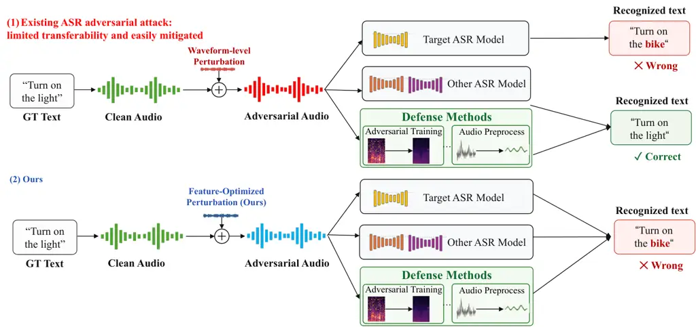
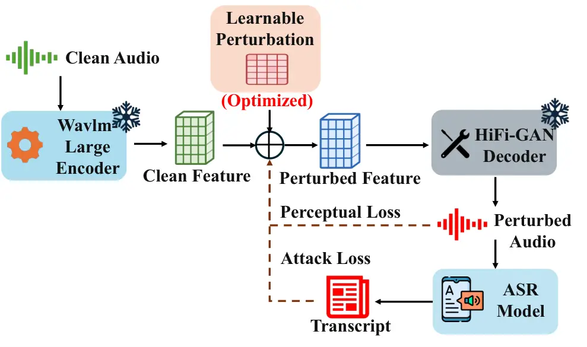
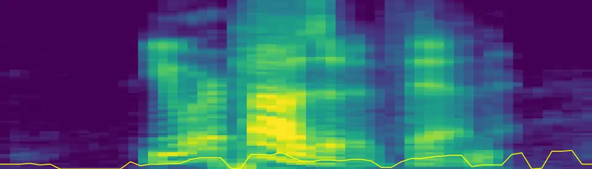
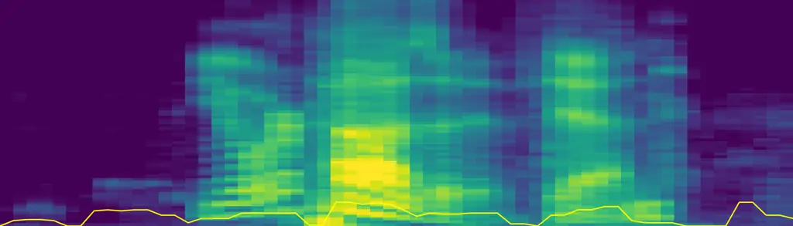

rmTeXGyreTermesX \[\*devanagari\]rmLohit Devanagari \[\*arabic\]rmNoto
Sans Arabic

# Beyond Waveform Robustness: Robust Feature-Vocoder Adversarial Attacks on Automatic Speech Recognition

Yifan Liao Zongmin Zhang Zhen Sun Yuhui Sun Xinhu Zheng Xinlei He
^(†)^(†)thanks: Corresponding author: Xinlei He
([xinlei.he@whu.edu.cn](mailto:xinlei.he@whu.edu.cn)) Affiliation: The
Hong Kong University of Science and Technology (Guangzhou) Affiliation:
Wuhan University

###### Abstract

Automatic speech recognition (ASR) systems have become widely used for
multilingual speech-to-text transcription. Their robustness to
adversarial attacks has become an important topic for the community.
Existing adversarial attacks directly add adversarial noise to the
speech audio. However, prior work has shown that existing adversarial
attacks face two limitations: they often transfer poorly to black-box
ASR systems and are increasingly mitigated by defenses tailored to
input-space perturbations. In this work, we propose a Clean-Referenced
Feature-Vocoder Attack, a surrogate-based black-box attack that moves
the adversarial search space from raw waveforms to self-supervised
learning (SSL) representations. To address the transferability
limitation, we perturb more generalizable acoustic-phonetic
representations rather than low-level waveform samples, reducing
dependence on surrogate-specific waveform gradients and encouraging
adversarial perturbations that generalize across ASR systems. To bypass
different defenses, we shift the adversarial signal from explicit
additive waveform noise to SSL feature-space perturbations and
reconstruct them through a vocoder into speech-like waveform adversarial
signals, making the resulting samples less aligned with waveform-bounded
defenses. Extensive experiments show that, when optimized only on raw
Whisper-small as a public surrogate model, our attack transfers
effectively to black-box ASR models with a +26.6 WER improvement over
the SOTA baseline, while also remaining effective against multiple
training defenses with a +36.2 WER improvement. These results reveal a
blind spot in current ASR robustness evaluation.

## Introduction



Figure 1: Traditional waveform-level attacks directly add perturbations
to the input audio, which can induce transcription errors on target ASR
models but often suffer from limited transferability and are
increasingly addressed by defenses such as adversarial training. In
contrast, our method optimizes adversarial perturbation in the feature
space, improving transferability across ASR models and maintaining
effectiveness against defended ASR systems.

Automatic speech recognition (ASR) has become a mainstream technology
for converting spoken audio into text (Hannun et al., 2014; Baevski et
al., 2020b). Recent speech foundation models, such as Whisper improve
the generality of ASR systems by supporting multilingual speech-to-text
transcription across diverse acoustic conditions (Radford et al., 2023b;
Baevski et al., 2020a). As ASR systems are increasingly deployed in
real-world applications, their robustness to adversarial attacks has
become an important concern for the communities.

The goal of adversarial attack on ASR is to induce transcription errors
while preserving the speech quality of the original audio. Figure 1
illustrates the scenario: adversarial attack on ASR can cause incorrect
recognition. Existing attacks typically achieve this by adding small
perturbations to the input waveform (Carlini and Wagner, 2018a; Qin et
al., 2019b; Neekhara et al., 2019; Raina et al., 2024; Raina and Gales,
2024). While these attacks reveal important vulnerabilities on ASR,
according to prior work in other domains Zhang et al. (2024); Li et al.
(2024), these attacks constrained to the input space often suffer two
inherent limitations. First, they often suffer from limited black-box
transferability because they optimize low-level, sample-wise
perturbations in the raw audio space. These perturbations can overfit to
surrogate-specific gradients and may not generalize to unseen ASR
systems. Second, waveform-level perturbations are increasingly addressed
by existing defenses because the adversarial information is explicitly
represented as additive waveform noise. This makes the attack align with
the assumptions of waveform-oriented defenses, such as input
preprocessing and adversarial training defenses against waveform-bounded
perturbations. Dong et al. (2019); Hussain et al. (2021); Olivier and
Raj (2021); Wu et al. (2023b)

To address these two limitations, we propose Clean-Referenced
Feature-Vocoder Attack, a surrogate-based black-box attack against
defended ASR models. Firstly, to address the transferability limitation,
we avoid optimizing low-level sample-wise perturbations on the raw
waveform. Instead, we perturb intermediate self-supervised learning
(SSL) representations Chen et al. (2022), which encode higher-level
acoustic and phonetic information shared across ASR systems. This
reduces the dependence on surrogate-specific waveform gradients and
encourages adversarial perturbations that can generalize across
different ASR models. To bypass current defense methods, we reconstruct
the perturbed representation back into audio using a frozen neural
vocoder Kong et al. (2020), rather than adding the perturbation directly
to the waveform. In this way, the adversarial perturbation is embedded
through a feature-to-waveform speech reconstruction process, making it
less aligned with waveform-bounded defenses such as input
transformations and adversarial training.

Extensive experiments show that our attack reveals a blind spot in
current ASR robustness evaluation. Optimized only on raw Whisper-small
as a public surrogate model, our attack transfers effectively to
black-box ASR models across both Whisper-family variants and CTC-based
architectures, outperforming the strongest baseline by an average of
+26.6 WER. It also remains effective against multiple
adversarial-training defenses, achieving an average improvement of +36.2
WER over the SOTA baseline on English dataset and +31.3 CER over the
SOTA baseline on Chinese dataset. Moreover, our attack maintains strong
performance under input preprocessing defenses, showing that
feature-vocoder adversarial examples are not well covered by defenses
designed for waveform-bounded perturbations. These results indicate that
robustness against additive waveform noise or adversarial prefixes can
overestimate the security of ASR systems.

Our contributions are as follows:

- •
  We introduce a clean-referenced feature-vocoder attack space for ASR,
  where adversarial examples are generated by perturbing SSL speech
  features rather than by adding waveform noise.
- •
  We design a clean-referenced feature-vocoder framework that embeds
  adversarial variation into SSL speech representations and reconstructs
  them into natural waveform audio through a frozen vocoder instead of
  adding explicit waveform noise.
- •
  Extensive experiments show that adversarial audio optimized on raw
  Whisper-small transfers strongly to multiple defense methods,
  revealing a blind spot of waveform-oriented ASR robustness.

## Related Work

In recent years, large-scale weakly supervised ASR foundation models,
exemplified by Whisper Radford et al. (2023b), have substantially
improved the generalization ability and practical robustness of speech
recognition across multilingual, multitask, and naturally noisy settings
Radford et al. (2023a). However, prior studies have shown that
robustness under natural conditions does not automatically translate
into adversarial robustness. Early work demonstrated that end-to-end ASR
systems can be steered toward target transcriptions by carefully crafted
small waveform perturbations with little impact on human perception
Carlini and Wagner (2018b); subsequent studies further advanced such
attacks toward settings that simultaneously emphasize psychoacoustic
imperceptibility and environmental robustness Qin et al. (2019a). In the
foundation ASR setting, Whisper has likewise been shown to remain highly
vulnerable to adversarial examples Olivier and Raj (2022), and recent
attacks have evolved from per-example optimization to more practical
universal acoustic prefixes and controllable triggers that can induce
muting or manipulate model outputs Raina et al. (2024); Raina and Gales
(2024). Besides, recent work has shown that the adversarial attack
targeting the SSL model can be robust Liao et al. (2026).
Correspondingly, existing defenses have mainly focused on input
preprocessing based on audio transformations and consistency checking,
sequential randomized smoothing, and generative purification Hussain et
al. (2021); Olivier and Raj (2021); Wu et al. (2023a), but these methods
are still largely developed under a waveform-level perturbation threat
model. On the other hand, modern voice conversion research suggests that
high-quality speech generation increasingly relies on a representational
manifold jointly constrained by SSL representations and neural vocoders:
large-scale speech representations such as WavLM provide a unified
foundation for modeling content and speaker-related attributes Chen et
al. (2022), kNN-VC shows that high-quality any-to-any conversion can be
achieved through local neighborhood replacement in the representation
space alone Baas et al. (2023), and ACE-VC further demonstrates the
stronger controllability enabled by explicit disentanglement Hussain et
al. (2023); meanwhile, HiFi-GAN and subsequent timbre-aware vocoders
make it possible to stably map intermediate representations back to
natural waveforms Kong et al. (2020); Guo et al. (2024). Building on
these advances, we argue that voice conversion should not be viewed
merely as a speech editing tool, but also as a natural speech manifold
jointly shaped by representation-space structure and the reconstructor.
This provides a direct motivation for shifting adversarial example
search from arbitrary waveform noise to content-preserving generation
within a VC manifold, and it also serves as the starting point of this
work for re-examining the robustness boundary of adversarially trained
ASR.

## Threat model

We study a surrogate-based black-box attack against ASR systems. Let
$`f_{t}`$ denote the target ASR model and $`f_{s}`$ denote a public
surrogate model. The adversary has white-box access to $`f_{s}`$ but has
no access to $`f_{t}`$. During attack generation, the target model
$`f_{t}`$ is not used.

Given a clean speech audio $`x`$ with ground-truth transcript $`y`$, an
ASR model maps the input waveform to a predicted token sequence:

```math
\hat{y}_{s}=f_{s}(x),\qquad\hat{y}_{t}=f_{t}(x). \tag{1}
```

We evaluate transcription failure using an error-rate function
$`\operatorname{Err}(\hat{y},y)`$, such as WER for English or CER for
Chinese.

The goal of the attacker is to construct an adversarial example
$`x_{\mathrm{adv}}`$ that transfers from the surrogate model to the
target model, causing a high error rate on $`f_{t}`$ while preserving
the perceived speech content and quality of the original audio. Since
$`f_{t}`$ is black-box, this goal is implemented by optimizing only a
surrogate loss on $`f_{s}`$.

In our feature-vocoder attack, the feasible set is defined by perturbing
the SSL feature representation of the clean audio and reconstructing the
perturbed feature through a frozen vocoder. Let $`E`$ be the frozen SSL
encoder and $`V`$ be the frozen vocoder. We generate

```math
x_{\mathrm{adv}}(\delta)=V(E(x)+\delta), \tag{2}
```

where $`\delta`$ denotes the feature-space perturbation

After generation, transferability is evaluated by measuring

```math
\operatorname{Err}\bigl(f_{t}(x_{\mathrm{adv}}),y\bigr) \tag{3}
```

on the black-box target models and defenses.



Figure 2: Overview of the proposed Clean-Referenced Feature-Vocoder
Attack.

## Method

We propose a clean-referenced feature-vocoder attack for evaluating the
robustness of ASR systems beyond waveform-bounded perturbations. The
pipeline is shown in Figure 2. Given a clean speech audio, a frozen
encoder extracts the SSL feature. We optimize a learnable perturbation
in the SSL feature space and reconstruct the perturbed feature
trajectory into waveform audio using a frozen vocoder. The generated
audio is fed into the surrogate ASR model, and the ASR loss together
with a perceptual regularizer loss are back-propagated to update the
feature-space perturbation.

### Feature extraction.

Given a clean speech audio $`x`$ with ground-truth transcript $`y`$, we
use a frozen SSL speech encoder $`E(\cdot)`$ to extract a frame-level
representation:

```math
q=E(x),\qquad q=(q_{1},\ldots,q_{T}). \tag{4}
```

Here, $`q_{t}`$ denotes the SSL feature at frame $`t`$. The encoder is
frozen during attack optimization.

### Direct feature-space perturbation.

Let $`q=E(x)\in\mathbb{R}^{T\times D}`$ denote the SSL feature
trajectory of the clean audio, where $`T`$ is the number of frames and
$`D`$ is the feature dimension. We introduce a learnable feature-space
perturbation $`\delta\in\mathbb{R}^{T\times D}`$ and define the
perturbed feature trajectory as

```math
z(\delta)=q+\delta. \tag{5}
```

To make the attack budget explicit, we constrain $`\delta`$ by a
normalized feature-space radius:

```math
\mathcal{U}_{\rho}(x)=\left\{\delta:\frac{\|\delta\|_{F}}{\|q\|_{F}+\epsilon}\leq\rho\right\}, \tag{6}
```

where $`\rho`$ controls the perturbation scale and $`\epsilon`$ is a
small constant for numerical stability. The adversarial waveform is
reconstructed by a frozen vocoder:

```math
x_{\mathrm{adv}}(\delta)=V(z(\delta))=V(E(x)+\delta). \tag{7}
```

Thus, the feasible attack space is

```math
\mathcal{M}_{\mathrm{FV}}(x;\rho)=\left\{V(E(x)+\delta):\delta\in\mathcal{U}_{\rho}(x)\right\}. \tag{8}
```

Unlike waveform-level attacks, this constraint is imposed in the SSL
representation space.

### Attack loss.

Let $`f_{s}`$ denote the surrogate ASR model used for optimization. We
optimize the feature-space perturbation $`\delta`$ to reduce the
surrogate model’s probability of the correct transcript. Formally, we
maximize the negative log-likelihood of the ground-truth transcript
under the adversarial audio:

```math
\max_{\delta\in\mathcal{U}_{\rho}(x)}\operatorname{NLL}_{\mathrm{text}}\left(y\mid x_{\mathrm{adv}}(\delta);f_{s}\right). \tag{9}
```

Equivalently, we minimize

```math
\mathcal{L}_{\mathrm{attack}}(\delta)=-\operatorname{NLL}_{\mathrm{text}}\left(y\mid x_{\mathrm{adv}}(\delta);f_{s}\right). \tag{10}
```

We compute $`\operatorname{NLL}_{\mathrm{text}}`$ over lexical
transcript tokens and exclude Whisper prompt, language, task, and other
special tokens.

### Clean-referenced perceptual loss.

Directly optimizing feature-space perturbations may produce temporally
unstable feature trajectories or abnormally high-frequency artifacts
after vocoding. We therefore use a clean-referenced perceptual
regularizer. The perceptual loss is

```math
\mathcal{L}_{\mathrm{perc}}(\delta)=\frac{\operatorname{TV}(z(\delta))}{\operatorname{sg}(\operatorname{TV}(q))+\epsilon}+\alpha\frac{\operatorname{HF}(x_{\mathrm{adv}}(\delta))}{\operatorname{sg}(\operatorname{HF}(x))+\epsilon}, \tag{11}
```

where $`\operatorname{sg}(\cdot)`$ denotes stop-gradient normalization.

The first term penalizes temporal jitter in the perturbed SSL feature
trajectory:

```math
\operatorname{TV}(z)=\frac{1}{T-1}\sum_{t=2}^{T}\|z_{t}-z_{t-1}\|_{2}^{2}. \tag{12}
```

The second term penalizes the high-frequency energy in the generated
audio:

```math
\operatorname{HF}(x)=\frac{\sum_{f>f_{c}}|S_{f}(x)|^{2}}{\sum_{f}|S_{f}(x)|^{2}}, \tag{13}
```

where $`S_{f}(x)`$ denotes the short-time Fourier transform coefficient
at frequency bin $`f`$. The high-frequency term is normalized by the
clean audio rather than by a reconstructed baseline, so that the
regularizer directly references the frequency statistics of the original
audio.

### Final objective.

The final optimization objective contains the surrogate attack loss and
the clean-referenced perceptual regularizer:

```math
\delta^{\star}=\arg\min_{\delta\in\mathcal{U}_{\rho}(x)}\left[\mathcal{L}_{\mathrm{attack}}(\delta)+\lambda_{\mathrm{perc}}\mathcal{L}_{\mathrm{perc}}(\delta)\right]. \tag{14}
```

The final adversarial audio is then

```math
x_{\mathrm{adv}}=x_{\mathrm{adv}}(\delta^{\star})=V(E(x)+\delta^{\star}). \tag{15}
```

The attack loss drives the adversarial audio away from the correct
transcript on the surrogate ASR model, while the perceptual regularizer
discourages temporal instability and abnormal high-frequency artifacts.
Gradients are back-propagated through the surrogate ASR model, the
frozen vocoder, and the perturbed SSL feature trajectory to update only
$`\delta`$.

## Experiments

Dataset and Models. We evaluate the proposed method on two
representative ASR datasets covering two languages. The first is
LibriSpeech train-clean 100 Panayotov et al. (2015), which contains
approximately 100 hours of English read speech. The second is AISHELL-1
Bu et al. (2017), a Mandarin Chinese ASR corpus with approximately 170
hours of speech.

The target models are Whisper-family and SSL-based ASR models Radford et
al. (2023b); Guo et al. (2024); Hsu et al. (2021), and to assess the
robustness of the attack under practical defensive settings, we further
evaluate it against two categories of defenses. The first category
consists of adversarial-training-based defenses, including Cross-Entropy
adversarial training (CE-AT), Decoding Trajectory adversarial training
(DE-AT), Dynamic Margin Weighting (DMW), and Translation-Invariant (TI)
Madry et al. (2018b); Dong et al. (2019); Liu et al. (2021). The second
category consists of input-preprocessing-based defenses, including LPF,
WaveGuard, AudioPure, and PVP Vote Kwon et al. (2020); Hussain et al.
(2021); Wu et al. (2023a); Olivier and Raj (2021).

Baselines. We compare our method with representative adversarial
attacks, including PGD Madry et al. (2018a), MI-FGSM Dong et al. (2018),
VMI-FGSM Wang and He (2021), Muting Whisper Raina et al. (2024), and
SlothSpeech Haque et al. (2023). For fair comparison, all attacks are
generated from the same clean utterances and optimized only on the same
public surrogate model. We use raw Whisper-small as the surrogate for
LibriSpeech and the AISHELL-1 fine-tuned Whisper-small surrogate for
AISHELL-1. All generated adversarial examples are then evaluated on the
same black-box target models and defenses. The details can be reviewed
in A

|                       |           |                               |       |       |       |                              |           |           |          |
| --------------------- | --------- | ----------------------------- | ----- | ----- | ----- | ---------------------------- | --------- | --------- | -------- |
| Attack Method         | Raw Model | Adversarial Training Defenses |       |       |       | Input Preprocessing Defenses |           |           |          |
|                       |           | CE-AT                         | DT-AT | DMW   | TI    | LPF                          | WaveGuard | AudioPure | PVP Vote |
| LibriSpeech (English) |           |                               |       |       |       |                              |           |           |          |
| Clean (No Attack)     | 4.75      | 5.72                          | 5.70  | 5.86  | 5.81  | 6.45                         | 6.76      | 6.17      | 4.80     |
| PGD                   | 61.06     | 8.69                          | 8.13  | 9.61  | 9.80  | 16.28                        | 15.47     | 8.38      | 45.62    |
| MI-FGSM               | 77.65     | 16.20                         | 16.98 | 16.86 | 16.85 | 39.24                        | 32.25     | 27.33     | 76.11    |
| VMI-FGSM              | 78.84     | 30.29                         | 30.91 | 34.48 | 39.14 | 42.04                        | 55.36     | 42.38     | 78.34    |
| Muting Whisper        | 99.52     | 6.11                          | 6.09  | 5.94  | 6.04  | 7.52                         | 7.62      | 6.80      | 79.52    |
| Sloth                 | 39.50     | 9.38                          | 8.71  | 9.26  | 9.38  | 14.88                        | 14.98     | 8.70      | 28.47    |
| Feature Attack (Ours) | 75.43     | 71.26                         | 67.23 | 70.61 | 70.63 | 68.39                        | 57.03     | 70.86     | 78.60    |
| AISHELL-1 (Chinese)   |           |                               |       |       |       |                              |           |           |          |
| Clean (No Attack)     | 6.29      | 5.51                          | 5.87  | 5.66  | 5.22  | 10.03                        | 7.74      | 27.67     | 5.75     |
| PGD                   | 69.01     | 15.08                         | 14.86 | 15.19 | 17.39 | 26.30                        | 12.67     | 26.71     | 64.27    |
| MI-FGSM               | 79.87     | 23.29                         | 23.72 | 28.33 | 23.25 | 51.71                        | 59.45     | 33.49     | 74.18    |
| VMI-FGSM              | 80.36     | 31.26                         | 31.90 | 35.58 | 40.39 | 43.38                        | 57.13     | 43.73     | 79.82    |
| Muting Whisper        | 94.47     | 5.93                          | 6.05  | 5.87  | 5.41  | 6.74                         | 6.89      | 5.96      | 75.24    |
| Sloth                 | 53.11     | 14.33                         | 11.26 | 8.43  | 9.82  | 36.04                        | 31.92     | 20.24     | 54.29    |
| Feature Attack (Ours) | 72.25     | 66.57                         | 66.10 | 66.07 | 65.49 | 72.10                        | 70.34     | 69.92     | 75.31    |

Table 1: Performance of the proposed Feature Attack against various
baseline attacks and defense mechanisms on the Whisper-small model.
Performance is evaluated using WER (%) for English and CER (%) for
Chinese.

Metrics. We use word error rate (WER, %) for English speech recognition
on LibriSpeech and character error rate (CER, %) for Chinese speech
recognition on AISHELL-1. Higher WER or CER indicates stronger attack
effectiveness, as it reflects a larger degradation in the transcription
quality of the ASR model.

Implementation Details. We implement our attack using a frozen
WavLM-Large model as the SSL feature encoder and a frozen HiFi-GAN
vocoder for waveform reconstruction. For each clean audio, we extract
its SSL feature trajectory and optimize a bounded feature-space
perturbation $`\delta`$ for 50 steps. Unless otherwise specified, we set
the normalized feature perturbation budget to $`\rho=0.1`$ and the
clean-referenced perceptual regularization weight to
$`\lambda_{\mathrm{perc}}=1`$. We set the $`6000\penalty\ \mathrm{Hz}`$
for the $`f_{c}`$ in frequency energy loss. For English experiments on
LibriSpeech, we use raw Whisper-small as the surrogate model. For
AISHELL-1, we initialize the surrogate model from Whisper-small and
fine-tune it on the AISHELL-1 development set to obtain a Mandarin
surrogate. The defended target models are trained on the AISHELL-1
training set, and all final attack results are reported on the held-out
AISHELL-1 test set. The test set is never used for surrogate fine-tuning
and defense training.

Effectiveness Results. Table 1 compares our Feature Attack with
representative waveform-level attacks on Whisper-small under both
adversarial training and input preprocessing defenses. Overall, existing
attacks can be highly effective on the undefended raw model, but their
performance drops sharply once defenses are applied. For example, Muting
Whisper achieves the highest raw-model error rate, reaching 99.52% WER
on LibriSpeech and 94.47% CER on AISHELL-1, but its error rate falls
close to the clean baseline under adversarial training defenses. MI-FGSM
is more robust than PGD and Sloth under some preprocessing defenses, but
it still degrades substantially under adversarial training.

In contrast, our Feature Attack consistently maintains high error rates
across defended models. For instance, on LibriSpeech, our method
achieves 71.26% WER under CE-AT and 70.86% WER under AudioPure, while
all baseline attacks are much less effective in these settings. On
AISHELL-1, our attack similarly remains effective, achieving 66.57% CER
under CE-AT and 70.34% CER under WaveGuard. This indicates that
conventional waveform-level attacks are largely aligned with the
assumptions of existing defenses, whereas our feature-vocoder attack
exposes vulnerabilities that remain under both adversarial training and
input preprocessing.

Transferability Evaluation Results. We first evaluate whether
adversarial examples generated on Whisper-small can transfer to other
models within the Whisper family. Specifically, we use Whisper-small as
the public surrogate to generate adversarial audio, and then evaluate
the same audio on Whisper-tiny and Whisper-large under both adversarial
training and input preprocessing defenses. As shown in Figure 3, our
Feature Attack consistently achieves the strongest transfer performance
across both smaller and larger Whisper models. Existing waveform-level
attacks, such as Muting, PGD, MI-FGSM, and Sloth, either perform
moderately on the raw model or degrade substantially under defenses. In
contrast, our attack remains effective across almost all defended
settings. For instance, on Whisper-tiny, our method achieves 64.90% WER
under DT-AT and 54.75% WER under WaveGuard, while the strongest
baselines are much lower. On Whisper-large, which is substantially
different in model capacity from the surrogate Whisper-small, our attack
still achieves 52.96% WER on the raw model and remains effective under
defenses such as CE-AT, AudioPure, and PVP Vote. This indicates that
feature-vocoder adversarial examples are not merely overfitted to the
waveform-level gradients of Whisper-small, but can transfer across
Whisper models with different capacities.

We further evaluate cross-architecture transfer by applying adversarial
examples generated on Whisper-small to self-supervised CTC-based ASR
models, including HuBERT CTC and Wav2Vec2 CTC. This setting is more
challenging because the target models use different acoustic encoders
and decoding objectives from Whisper. As shown in Figure 4, most
baseline attacks transfer poorly to these CTC models, with WER often
remaining close to the clean or weakly attacked performance, especially
under adversarial training and preprocessing defenses. In contrast, our
Feature Attack achieves consistently higher WER across both
architectures and all defense settings. For instance, on HuBERT CTC, our
method reaches 39.80% WER on the raw model and remains above 30% WER
under all defenses. On Wav2Vec2 CTC, our attack achieves 42.12% WER on
the raw model and 48.24% WER under LPF, outperforming all waveform-level
baselines by a large margin. This indicates that perturbing SSL feature
trajectories and reconstructing them through a neural vocoder produces
adversarial speech that transfers beyond the Whisper family, revealing
vulnerabilities shared across different ASR architectures.

(a) Whisper-tiny

(b) Whisper-base

(c) Whisper-medium

(d) Whisper-large

Figure 3: Transferability across the Whisper model family.

(a) Wav2Vec2 CTC

(b) HuBERT CTC

Figure 4: Cross-architecture transferability to self-supervised
CTC-based ASR models.

Imperceptibility Results. We evaluate the imperceptibility of our
adversarial audio by sweeping two key hyperparameters in our objective:
the perceptual regularization weight $`\lambda_{\mathrm{perc}}`$ and the
normalized feature perturbation budget $`\rho`$. For each setting, we
report both attack effectiveness, measured by WER, and perceptual speech
quality, measured by DNSMOS Reddy et al. (2021), NISQA Mittag et al.
(2021), and UTMOS Saeki et al. (2022). The clean reference audio obtains
3.07 DNSMOS, 3.71 NISQA, and 3.76 UTMOS. Based on this trade-off, we
choose $`\lambda_{\mathrm{perc}}=1`$ and $`\rho=0.1`$ as our default
setting. Under this configuration, our adversarial audio achieves 75.43%
WER while maintaining perceptual quality close to the clean reference,
with 2.95 DNSMOS, 3.53 NISQA, and 3.59 UTMOS. This indicates that the
attack can induce substantial transcription errors without noticeably
degrading speech quality. The hyperparameter trends further justify this
choice. As shown in Figure 5, increasing $`\lambda_{\mathrm{perc}}`$
generally improves perceptual quality but gradually reduces attack
strength, while a smaller $`\lambda_{\mathrm{perc}}`$ gives only
marginally higher WER at the cost of weaker regularization. Similarly,
as shown in Figure 6, increasing $`\rho`$ can further increase WER, but
it substantially degrades speech quality, especially under larger
feature perturbation budgets. In contrast, $`\rho=0.1`$ provides a
balanced operating point: it significantly improves attack effectiveness
over a very small perturbation budget while keeping all perceptual
metrics close to the clean audio. These results suggest that our
selected hyperparameters achieve a favorable trade-off between
adversarial effectiveness and imperceptibility.

We further conduct a human study to validate the perceptual stealthiness
of our adversarial audio. We recruit ten volunteers and ask each
participant to evaluate two independent sets of audio samples, with 100
samples in each set. In the first set, participants are presented with
paired clean and adversarial audio clips and asked whether they can
perceive any difference between them. In the second assessment,
participants listen to adversarial audio clips alone, without access to
the clean reference, and are asked to flag samples with noticeable
distortion or suspicious artifacts. The results show that 86% of the
paired samples are judged to be indistinguishable between clean and
adversarial audio, and 92% of the adversarial samples are not perceived
as having significant distortion in the single assessment. We also ask
participants to manually transcribe the adversarial audio. The resulting
human transcription WER is 5.47%, indicating that the adversarial audio
remains intelligible to human listeners despite causing substantial ASR
errors. These results are consistent with the objective perceptual
metrics and indicate that our feature-vocoder attack preserves high
perceptual quality while inducing substantial transcription errors.

To further analyze the imperceptibility of our adversarial audio, we
visualize the Mel-spectrogram and pitch contour of a representative
clean audio and its corresponding adversarial example. As shown in
Figure 7, the adversarial audio preserves the global time-frequency
structure of the clean audio, including the main energy regions and
pitch trajectory. Quantitatively, this sample achieves a high
Mel-spectrogram correlation of 0.9733 between the clean and adversarial
audio, indicating that the feature-vocoder attack largely maintains the
acoustic structure of the original speech.

Figure 5: Ablation study on the $`\lambda`$ Selection.

Figure 6: Ablation study on the $`\rho`$ Selection.





Figure 7: Mel-spectrogram and pitch contour comparison between the clean
reference audio (above) and the corresponding adversarial audio (down).

Loss Ablation Results. We conduct a loss ablation study to understand
the contribution of each component in our clean-referenced perceptual
objective. Starting from the full objective, we remove one component at
a time, including the ASR attack loss, the overall perceptual
constraints, the temporal jitter regularization, and the
frequency-energy regularization. We then evaluate both attack
effectiveness, measured by WER, and perceptual quality, measured by
DNSMOS. Without the ASR attack loss, the generated audio only reaches
6.6% WER, which is close to the clean baseline and confirms that the
attack objective is necessary for inducing transcription errors. The
results show that the full objective achieves the best balance between
attack strength and audio quality. Removing the perceptual constraints
leads to both lower WER and degraded perceptual quality, suggesting that
the perceptual loss is not merely a restrictive constraint but also
helps guide the feature perturbation toward vocoder-compatible and
speech-like directions. Removing either temporal jitter or
frequency-energy regularization also weakens the attack and reduces
speech quality, indicating that both terms are useful for stabilizing
the reconstructed audio and avoiding abnormal artifacts. Overall, the
ablation confirms that our loss design improves imperceptibility while
also supporting stronger effective attacks after neural vocoding.

Figure 8: Ablation study on the loss.

Physical Experiment. To examine whether our attack remains effective
beyond the digital setting, we conduct a preliminary over-the-air (OTA)
experiment with 100 English utterances from three human speakers. The
adversarial audio is generated using the same feature-vocoder attack
pipeline, played through a loudspeaker, re-recorded by smartphones, and
then transcribed by the target ASR system. As shown in Table 3, the
clean OTA recordings obtain a WER of 7.45%, indicating that the playback
and re-recording pipeline itself does not severely degrade ASR
performance. In contrast, the adversarial OTA recordings still achieve a
WER of 78.23%. This large gap suggests that the proposed attack can
retain substantial effectiveness under physical playback and
re-recording conditions. We provide additional setup details in Appendix
B.

## Conclusion

In this paper, we propose a Clean-Referenced Feature-Vocoder Attack that
moves adversarial optimization from raw waveforms to SSL speech
representations and reconstructs the perturbed features into audio
through a frozen vocoder. This design improves black-box transferability
and avoids representing adversarial variation as explicit additive
waveform noise.

## Limitations

Our work has several limitations. Firstly, although our attack transfers
across Whisper-family models and CTC-based architectures, the evaluation
is still limited to a finite set of ASR systems and defenses. Future
work should study whether similar feature-vocoder attacks generalize to
broader commercial ASR services, streaming ASR systems, and larger
multilingual speech foundation models. Secondly, our current
implementation relies on a specific SSL encoder and neural vocoder.
Different choices of SSL features, vocoder architectures, or
reconstruction quality may affect both attack effectiveness and
perceptual quality. Third, while our objective and human study suggest
that the generated adversarial audio is perceptually similar to clean
speech, imperceptibility remains difficult to fully characterize with
automatic metrics alone. Larger-scale human studies under more diverse
listening environments would provide a more comprehensive evaluation.
Finally, our physical-world experiment demonstrates initial feasibility,
but it is conducted with a limited number of speakers, devices, and
acoustic conditions. More extensive over-the-air evaluations are needed
to understand robustness under real-world playback, room reverberation,
background noise, and device-specific recording pipelines.

## Ethical Considerations

This work studies adversarial attacks on ASR systems to better
understand and improve their robustness. The proposed attack could
potentially be misused to degrade transcription systems or bypass
defenses if applied irresponsibly. To mitigate this risk, we frame the
study as a robustness evaluation tool and focus on exposing limitations
of current waveform-bounded defenses rather than enabling real-world
abuse. Our experiments are conducted on research datasets and controlled
evaluation settings. The physical-world study is performed with
volunteer participants, and no sensitive or private speech content is
used. We encourage future use of this work for defensive purposes, such
as evaluating ASR systems under broader threat models, developing
feature-space-aware defenses, and improving adversarial training beyond
waveform-level perturbations. Any deployment of the proposed method
should follow responsible disclosure practices and avoid targeting real
users or production ASR services without authorization.

## References

- \[1\] M. Baas, B. van Niekerk, and H. Kamper (2023) Voice conversion
  with just nearest neighbors. arXiv preprint arXiv:2305.18975. Cited
  by: §2.
- \[2\] A. Baevski, Y. Zhou, A. Mohamed, and M. Auli (2020) Wav2vec 2.0:
  a framework for self-supervised learning of speech representations.
  Advances in neural information processing systems 33, pp. 12449–12460.
  Cited by: §1.
- \[3\] A. Baevski, Y. Zhou, A. Mohamed, and M. Auli (2020) Wav2vec 2.0:
  A framework for self-supervised learning of speech representations. In
  Advances in Neural Information Processing Systems 33: Annual
  Conference on Neural Information Processing Systems 2020, NeurIPS
  2020, December 6-12, 2020, virtual, H. Larochelle, M. Ranzato, R.
  Hadsell, M. Balcan, and H. Lin (Eds.), External Links:
  [Link](https://proceedings.neurips.cc/paper/2020/hash/92d1e1eb1cd6f9fba3227870bb6d7f07-Abstract.html)
  Cited by: §1.
- \[4\] H. Bu, J. Du, X. Na, B. Wu, and H. Zheng (2017) AISHELL-1: an
  open-source mandarin speech corpus and a speech recognition baseline.
  In 20th Conference of the Oriental Chapter of the International
  Coordinating Committee on Speech Databases and Speech I/O Systems and
  Assessment, O-COCOSDA 2017, Seoul, South Korea, November 1-3, 2017,
  pp. 1–5. External Links:
  [Link](https://doi.org/10.1109/ICSDA.2017.8384449),
  [Document](https://dx.doi.org/10.1109/ICSDA.2017.8384449) Cited by:
  §5.
- \[5\] N. Carlini and D. A. Wagner (2018) Audio adversarial examples:
  targeted attacks on speech-to-text. In 2018 IEEE Security and Privacy
  Workshops, SP Workshops 2018, San Francisco, CA, USA, May 24, 2018,
  pp. 1–7. External Links:
  [Link](https://doi.org/10.1109/SPW.2018.00009),
  [Document](https://dx.doi.org/10.1109/SPW.2018.00009) Cited by: §1.
- \[6\] N. Carlini and D. Wagner (2018) Audio adversarial examples:
  targeted attacks on speech-to-text. In 2018 IEEE security and privacy
  workshops (SPW), pp. 1–7. Cited by: §2.
- \[7\] S. Chen, C. Wang, Z. Chen, Y. Wu, S. Liu, Z. Chen, J. Li, N.
  Kanda, T. Yoshioka, X. Xiao, et al. (2022) Wavlm: large-scale
  self-supervised pre-training for full stack speech processing. IEEE
  Journal of Selected Topics in Signal Processing 16 (6), pp. 1505–1518.
  Cited by: §1, §2.
- \[8\] Y. Dong, F. Liao, T. Pang, H. Su, J. Zhu, X. Hu, and J.
  Li (2018) Boosting adversarial attacks with momentum. In Proceedings
  of the IEEE Conference on Computer Vision and Pattern Recognition,
  Cited by: §5.
- \[9\] Y. Dong, T. Pang, H. Su, and J. Zhu (2019) Evading defenses to
  transferable adversarial examples by translation-invariant attacks. In
  Proceedings of the IEEE/CVF Conference on Computer Vision and Pattern
  Recognition, Cited by: §1, §5.
- \[10\] Y. Guo, Z. Li, J. Li, C. Du, H. Wang, S. Wang, X. Chen, and K.
  Yu (2024) Vec2wav 2.0: advancing voice conversion via discrete token
  vocoders. arXiv preprint arXiv:2409.01995. Cited by: §2, §5.
- \[11\] A. Y. Hannun, C. Case, J. Casper, B. Catanzaro, G. Diamos, E.
  Elsen, R. Prenger, S. Satheesh, S. Sengupta, A. Coates, and A. Y.
  Ng (2014) Deep speech: scaling up end-to-end speech recognition. CoRR
  abs/1412.5567. External Links: [Link](http://arxiv.org/abs/1412.5567),
  1412.5567 Cited by: §1.
- \[12\] M. Haque, R. Shah, S. Chen, B. Şişman, C. Liu, and W.
  Yang (2023) Slothspeech: denial-of-service attack against speech
  recognition models. arXiv preprint arXiv:2306.00794. Cited by: §5.
- \[13\] W. Hsu, B. Bolte, Y. H. Tsai, K. Lakhotia, R. Salakhutdinov,
  and A. Mohamed (2021) Hubert: self-supervised speech representation
  learning by masked prediction of hidden units. IEEE/ACM transactions
  on audio, speech, and language processing 29, pp. 3451–3460. Cited by:
  §5.
- \[14\] S. Hussain, P. Neekhara, S. Dubnov, J. McAuley, and F.
  Koushanfar (2021) WaveGuard: understanding and mitigating audio
  adversarial examples. In USENIX Security Symposium, Cited by: §1, §2,
  §5.
- \[15\] S. Hussain, P. Neekhara, J. Huang, J. Li, and B.
  Ginsburg (2023) Ace-vc: adaptive and controllable voice conversion
  using explicitly disentangled self-supervised speech representations.
  In ICASSP 2023-2023 IEEE International Conference on Acoustics, Speech
  and Signal Processing (ICASSP), pp. 1–5. Cited by: §2.
- \[16\] J. Kong, J. Kim, and J. Bae (2020) Hifi-gan: generative
  adversarial networks for efficient and high fidelity speech synthesis.
  Advances in neural information processing systems 33, pp. 17022–17033.
  Cited by: §1, §2.
- \[17\] H. Kwon, H. Yoon, and K. Park (2020) Acoustic-decoy: detection
  of adversarial examples through audio modification on speech
  recognition system. Neurocomputing 417, pp. 357–370. Cited by: §5.
- \[18\] S. Li, X. Jiang, and X. Ma (2024) Transcending adversarial
  perturbations: manifold-aided adversarial examples with legitimate
  semantics. arXiv preprint arXiv:2402.03095. Cited by: §1.
- \[19\] Y. Liao, Y. Liu, Z. Sun, Z. Zhang, Y. He, J. Wei, X. Zheng,
  and X. He (2026) Escaping the linearity trap: manifold detours for
  black-box adversarial attacks on singing audio deepfake detection.
  arXiv preprint arXiv:2605.30366. Cited by: §2.
- \[20\] F. Liu, B. Han, T. Liu, C. Gong, G. Niu, M. Zhou, M. Sugiyama,
  et al. (2021) Probabilistic margins for instance reweighting in
  adversarial training. Advances in neural information processing
  systems 34, pp. 23258–23269. Cited by: §5.
- \[21\] A. Madry, A. Makelov, L. Schmidt, D. Tsipras, and A.
  Vladu (2018) Towards deep learning models resistant to adversarial
  attacks. In International Conference on Learning Representations,
  Cited by: §5.
- \[22\] A. Madry, A. Makelov, L. Schmidt, D. Tsipras, and A.
  Vladu (2018) Towards deep learning models resistant to adversarial
  attacks. In International Conference on Learning Representations,
  Cited by: §5.
- \[23\] G. Mittag, B. Naderi, A. Chehadi, and S. Möller (2021) NISQA: a
  deep cnn-self-attention model for multidimensional speech quality
  prediction with crowdsourced datasets. arXiv preprint
  arXiv:2104.09494. Cited by: §5.
- \[24\] P. Neekhara, S. Hussain, P. Pandey, S. Dubnov, J. J. McAuley,
  and F. Koushanfar (2019) Universal adversarial perturbations for
  speech recognition systems. In 20th Annual Conference of the
  International Speech Communication Association, Interspeech 2019,
  Graz, Austria, September 15-19, 2019, G. Kubin and Z. Kacic (Eds.),
  pp. 481–485. External Links:
  [Link](https://doi.org/10.21437/Interspeech.2019-1353),
  [Document](https://dx.doi.org/10.21437/INTERSPEECH.2019-1353) Cited
  by: §1.
- \[25\] R. Olivier and B. Raj (2021) Sequential randomized smoothing
  for adversarially robust speech recognition. In Proceedings of the
  2021 Conference on Empirical Methods in Natural Language Processing,
  pp. 6372–6386. Cited by: §1, §2, §5.
- \[26\] R. Olivier and B. Raj (2022) There is more than one kind of
  robustness: fooling whisper with adversarial examples. arXiv preprint
  arXiv:2210.17316. Cited by: §2.
- \[27\] V. Panayotov, G. Chen, D. Povey, and S. Khudanpur (2015)
  Librispeech: an ASR corpus based on public domain audio books. In 2015
  IEEE International Conference on Acoustics, Speech and Signal
  Processing, ICASSP 2015, South Brisbane, Queensland, Australia, April
  19-24, 2015, pp. 5206–5210. External Links:
  [Link](https://doi.org/10.1109/ICASSP.2015.7178964),
  [Document](https://dx.doi.org/10.1109/ICASSP.2015.7178964) Cited by:
  §5.
- \[28\] Y. Qin, N. Carlini, G. Cottrell, I. Goodfellow, and C.
  Raffel (2019) Imperceptible, robust, and targeted adversarial examples
  for automatic speech recognition. In International conference on
  machine learning, pp. 5231–5240. Cited by: §2.
- \[29\] Y. Qin, N. Carlini, G. W. Cottrell, I. J. Goodfellow, and C.
  Raffel (2019) Imperceptible, robust, and targeted adversarial examples
  for automatic speech recognition. In Proceedings of the 36th
  International Conference on Machine Learning, ICML 2019, 9-15 June
  2019, Long Beach, California, USA, K. Chaudhuri and R. Salakhutdinov
  (Eds.), Proceedings of Machine Learning Research, pp. 5231–5240.
  External Links: [Link](http://proceedings.mlr.press/v97/qin19a.html)
  Cited by: §1.
- \[30\] A. Radford, J. W. Kim, T. Xu, G. Brockman, C. McLeavey, and I.
  Sutskever (2023) Robust speech recognition via large-scale weak
  supervision. In International conference on machine learning,
  pp. 28492–28518. Cited by: §2.
- \[31\] A. Radford, J. W. Kim, T. Xu, G. Brockman, C. McLeavey, and I.
  Sutskever (2023) Robust speech recognition via large-scale weak
  supervision. In Proceedings of the 40th International Conference on
  Machine Learning, pp. 28492–28518. Cited by: §1, §2, §5.
- \[32\] V. Raina and M. Gales (2024) Controlling whisper: universal
  acoustic adversarial attacks to control multi-task automatic speech
  recognition models. In 2024 IEEE Spoken Language Technology Workshop
  (SLT), pp. 208–215. Cited by: §1, §2.
- \[33\] V. Raina, R. Ma, C. McGhee, K. Knill, and M. Gales (2024)
  Muting whisper: a universal acoustic adversarial attack on speech
  foundation models. In Proceedings of the 2024 Conference on Empirical
  Methods in Natural Language Processing, pp. 7549–7565. Cited by: §1,
  §2, §5.
- \[34\] C. K. Reddy, V. Gopal, and R. Cutler (2021) DNSMOS: a
  non-intrusive perceptual objective speech quality metric to evaluate
  noise suppressors. In ICASSP 2021-2021 IEEE International Conference
  on Acoustics, Speech and Signal Processing (ICASSP), pp. 6493–6497.
  Cited by: §5.
- \[35\] T. Saeki, D. Xin, W. Nakata, T. Koriyama, S. Takamichi, and H.
  Saruwatari (2022) Utmos: utokyo-sarulab system for voicemos challenge 2022. arXiv preprint arXiv:2204.02152. Cited by: §5.
- \[36\] X. Wang and K. He (2021) Enhancing the transferability of
  adversarial attacks through variance tuning. In Proceedings of the
  IEEE/CVF conference on computer vision and pattern recognition,
  pp. 1924–1933. Cited by: §5.
- \[37\] S. Wu, J. Wang, W. Ping, W. Nie, and C. Xiao (2023) Defending
  against adversarial audio via diffusion model. In International
  Conference on Learning Representations, Cited by: §2, §5.
- \[38\] S. Wu, J. Wang, W. Ping, W. Nie, and C. Xiao (2023) Defending
  against adversarial audio via diffusion model. In International
  Conference on Learning Representations, Cited by: §1.
- \[39\] A. Zhang, M. Zhang, and D. Wischik (2024) Constructing
  semantics-aware adversarial examples with a probabilistic perspective.
  Advances in Neural Information Processing Systems 37,
  pp. 136259–136285. Cited by: §1.

## Appendix A Baseline Implementation Details

Because the compared attacks operate in different spaces, exact norm
matching is not meaningful across additive waveform perturbations,
universal acoustic prefixes, and feature-vocoder transformations. We
therefore use a common validation-based selection protocol under fixed
perceptual-quality constraints. For each attack, we sweep its
attack-strength hyperparameters on a held-out validation split and
discard configurations whose DNSMOS, NISQA, or UTMOS score is lower than
2.5. Among the remaining configurations, we select the one with the
highest surrogate WER/CER on the validation split. Target model and
defense results are not used during this selection.

```math
\theta_{a}^{\star}=\arg\max_{\theta\in\Theta_{a}}\operatorname{Err}\left(f_{s}(x_{\mathrm{adv}}^{a,\theta}),y\right) \tag{16}
```

The selected configuration $`\theta_{a}^{\star}`$ is then fixed and used
for all black-box target models and defense evaluations. Target model
and defense results are never used for hyperparameter selection.

For iterative attacks, including PGD, MI-FGSM, VMI-FGSM, SlothSpeech,
and our Feature Attack, we use the same optimization budget of 50 update
steps. For our method, we use $`\rho=0.1`$,
$`\lambda_{\mathrm{perc}}=1`$, and 50 optimization steps, selected by
the same validation protocol. The complete hyperparameter search ranges,
perceptual thresholds, and selected configurations are reported in
Tables 2 and 4.

|                       |                                                                                                                                      |                                                                                                                                                                        |                                                                                        |                                                                        |
| --------------------- | ------------------------------------------------------------------------------------------------------------------------------------ | ---------------------------------------------------------------------------------------------------------------------------------------------------------------------- | -------------------------------------------------------------------------------------- | ---------------------------------------------------------------------- |
| Attack                | Tuned Hyperparameters                                                                                                                | Validation Search Grid                                                                                                                                                 | Selected Configuration                                                                 | Selection Rule                                                         |
| PGD                   | Perturbation budget $`\epsilon`$, step size $`\alpha`$                                                                               | $`\epsilon\in\{0.001,0.002,0.005,0.01,0.02\}`$, $`\alpha\in\{\epsilon/50,2\epsilon/50,\epsilon/10\}`$                                                                  | $`\epsilon=0.02`$, $`\alpha=2\epsilon/50`$                                             | Max validation WER/CER on $`f_{s}`$ with DNSMOS, NISQA, UTMOS $`>2.5`$ |
| MI-FGSM               | Perturbation budget $`\epsilon`$, step size $`\alpha`$, momentum decay $`\mu`$                                                       | $`\epsilon\in\{0.001,0.002,0.005,0.01,0.02\}`$, $`\alpha\in\{\epsilon/50,2\epsilon/50,\epsilon/10\}`$, $`\mu\in\{0.5,1.0\}`$                                           | $`\epsilon=0.02`$, $`\alpha=2\epsilon/50`$, $`\mu=1.0`$                                | Max validation WER/CER on $`f_{s}`$ with DNSMOS, NISQA, UTMOS $`>2.5`$ |
| VMI-FGSM              | Perturbation budget $`\epsilon`$, step size $`\alpha`$, momentum decay $`\mu`$, variance samples $`N`$, neighborhood scale $`\beta`$ | $`\epsilon\in\{0.001,0.002,0.005,0.01,0.02\}`$, $`\alpha\in\{\epsilon/50,2\epsilon/50,\epsilon/10\}`$, $`\mu\in\{1.0\}`$, $`N\in\{3,5\}`$, $`\beta\in\{1.0,1.5,2.0\}`$ | $`\epsilon=0.02`$, $`\alpha=2\epsilon/50`$, $`\mu=1.0`$, $`N=5`$, $`\beta=1.5`$        | Max validation WER/CER on $`f_{s}`$ with DNSMOS, NISQA, UTMOS $`>2.5`$ |
| Muting Whisper        | Prefix length, prefix amplitude scale                                                                                                | Prefix length $`\in\{5120,10240,20480\}`$ samples $`(0.32\mathrm{s},0.64\mathrm{s},1.28\mathrm{s}`$ at 16 kHz), amplitude scale $`\in\{0.005,0.01,0.02\}`$             | Prefix length $`=0.64s`$, amplitude scale $`=0.02`$                                    | Max validation WER/CER on $`f_{s}`$ with DNSMOS, NISQA, UTMOS $`>2.5`$ |
| SlothSpeech           | Distance criterion, learning rate, distance regularization weight                                                                    | Distance criterion $`\in\{\ell_{2},\ell_{\infty}\}`$, learning rate $`\in\{10^{-2},5{\times}10^{-2},10^{-1}\}`$, distance factor $`\in\{0.05,0.1,0.2\}`$               | Distance criterion $`=\ell_{2}`$, learning rate $`=10^{-1}`$, distance factor $`=0.1`$ | Max validation WER/CER on $`f_{s}`$ with DNSMOS, NISQA, UTMOS $`>2.5`$ |
| Feature Attack (Ours) | Feature budget $`\rho`$, perceptual weight $`\lambda_{\mathrm{perc}}`$                                                               | $`\rho\in\{0.05,0.1,0.5,1.0\}`$, $`\lambda_{\mathrm{perc}}\in\{0.1,0.5,1.0,2.0\}`$                                                                                     | $`\rho=0.1`$, $`\lambda_{\mathrm{perc}}=1.0`$                                          | Max validation WER/CER on $`f_{s}`$ with DNSMOS, NISQA, UTMOS $`>2.5`$ |

Table 2: Hyperparameter tuning protocol for all attacks. All
hyperparameters are selected on a held-out validation split using only
the surrogate model $`f_{s}`$ and objective speech-quality metrics.
Configurations whose DNSMOS, NISQA, or UTMOS score is below 2.5 are
discarded before selecting the strongest validation attack. Target
models and defenses are never used during hyperparameter tuning. The
selected configuration for each attack is fixed before black-box
evaluation.

## Appendix B Physical-World Evaluation Details

We conduct an over-the-air (OTA) evaluation to test whether the proposed
feature-vocoder adversarial examples remain effective after physical
playback and re-recording. The experiment uses 100 English utterances
recorded from three human speakers. For each utterance, we generate
adversarial audio using the same feature-vocoder attack pipeline as in
the digital experiments. The generated audio is then played through a
loudspeaker and re-recorded by smartphones before being transcribed by
the target ASR system.

All recordings are conducted in an indoor environment. During recording,
the phone microphone is placed facing the loudspeaker, and the playback
volume is kept fixed across trials. This setup introduces common
physical-channel distortions, including loudspeaker response, room
acoustics, smartphone microphone response, and device-specific recording
effects.

We evaluate two OTA conditions: clean OTA audio and adversarial OTA
audio. The clean OTA condition serves as a control for ASR errors caused
by playback and re-recording alone. As shown in Table 3, clean OTA audio
obtains a WER of 7.45%, while adversarial OTA audio obtains a WER of
78.23%. The large increase in WER indicates that the adversarial effect
is not explained by the physical recording pipeline alone. We view this
result as an initial physical-world validation; more extensive
evaluation across different rooms, devices, distances, playback volumes,
and background-noise conditions is left for future work.

|                       |         |
| --------------------- | ------- |
| Condition             | WER (%) |
| Clean OTA audio       | 7.45    |
| Adversarial OTA audio | 78.23   |

Table 3: Physical-world over-the-air evaluation. Audio is played through
a loudspeaker and re-recorded by smartphones before ASR transcription.
Clean OTA audio serves as a control for errors introduced by the
playback and re-recording pipeline.

|                       |                 |                                       |       |       |
| --------------------- | --------------- | ------------------------------------- | ----- | ----- |
| Attack Method         | Attack Domain   | Perceptual Quality (MOS $`\uparrow`$) |       |       |
|                       |                 | DNSMOS                                | NISQA | UTMOS |
| Clean                 | —               | 3.075                                 | 3.714 | 3.755 |
| PGD                   | Waveform        | 2.761                                 | 3.094 | 3.314 |
| MI-FGSM               | Waveform        | 2.804                                 | 2.523 | 2.518 |
| VMI-FGSM              | Waveform        | 2.763                                 | 2.517 | 2.528 |
| Muting Whisper        | Prefix          | 3.011                                 | 3.640 | 3.729 |
| SlothSpeech           | Waveform        | 2.895                                 | 3.152 | 3.458 |
| Feature Attack (Ours) | Feature-vocoder | 2.954                                 | 3.526 | 3.590 |

Table 4: Objective acoustic perceptual quality evaluation of various
adversarial audio attacks. The results demonstrate that our Feature
Attack preserves high objective speech quality (MOS) compared to
baseline waveform attacks that perturb the entire sequence.

## Appendix C Artifacts and Licenses.

We use publicly available research artifacts, including LibriSpeech,
AISHELL-1, Whisper, WavLM, HuBERT, Wav2Vec2, and HiFi-GAN, following
their respective licenses and terms of use. All datasets are used only
for research evaluation, and we do not redistribute the original
datasets or model checkpoints.

## Appendix D Computational Budget.

All attacks are generated on a single NVIDIA L20 GPU (46GB). Our attack
uses 50 optimization steps per utterance, with an average generation
time of approximately 10 seconds per utterance. For LibriSpeech,
train-clean-100 is used only for training-related preparation and
fine-tuning where applicable, while the computational budget reported
here is computed on the held-out 999-utterance subset of test-clean used
for attack evaluation. Generating adversarial examples for this
test-clean subset takes about 2.8 GPU-hours; including model loading,
I/O overhead, and evaluation runs, we conservatively report
approximately 4 GPU-hours.
