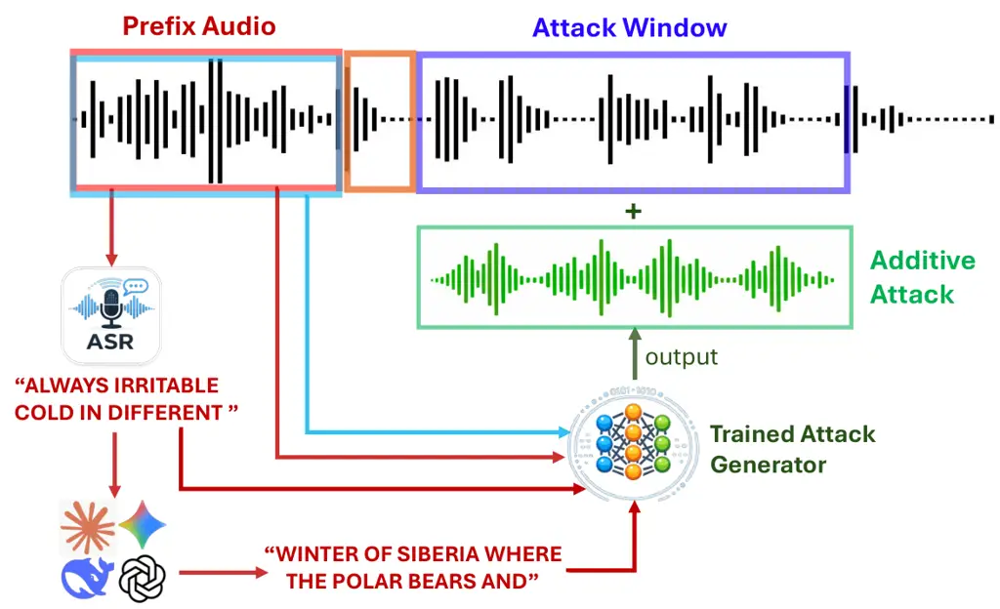

# Hearing the Unspoken: Language Model Priors for Acoustic Adversarial Attacks

Jiani Xie Affiliation: University of Melbourne
Email: [jiani.xie1@unimelb.edu.au](mailto:)    Andrew C. Cullen
Affiliation: University of Melbourne    Paul Montague Affiliation: DST
Group    Benjamin I. P. Rubinstein Affiliation: University of Melbourne

###### Abstract

Automatic Speech Recognition (ASR) systems operating in real-time
settings must process acoustic input under strict temporal constraints,
where transcription decisions are inherently made on incomplete
information. This causal constraint serves as an information bottleneck
on attackers, significantly limiting attack performance. Our new
Semantic Gambit attack overcomes this causal limitation by augmenting
the adversary with predictive context derived from a Large Language
Model in real-time. Our experiments show that this form of augmentation
can elevate the corpus-level Word Error Rate to 35.6%—a three-fold
increase over the current state-of-the-art streaming attack. Ultimately,
this work reveals how common, low-latency LLM tooling can be exploited
to systematically subvert real-time ASR pipelines.

|     |
| --- |
|     |

## 1 Introduction

Modern Automatic Speech Recognition (ASR) systems are vulnerable to
adversarial perturbations, which, when overlaid on speech, degrade the
resulting transcription (Carlini & Wagner, 2018; Olivier et al., 2023;
Cheng et al., 2024). Intuitively, attack performance is proportional to
the information available to the attacker—the more the attacker knows
about the target utterance, the more precisely the perturbation can be
shaped to disrupt it. In offline settings, this is no obstacle, since
the attacker can leverage the full utterance.

However, many attack scenarios require constructing attacks in situ,
where the attacker can only access information from _before_ the attack
is deployed (Chiquier et al., 2022). The moment the perturbation is
injected, it distorts the acoustic environment, foreclosing further
clean observation and bounding accessible information.

While future speech cannot be heard, the partial transcript of what has
already been spoken is often sufficient for a Large Language Model (LLM)
to predict what comes next. We exploit this observation to circumvent
the information bound with our Semantic Gambit (SG) attack. A multimodal
generator then fuses this predicted continuation with the acoustic
prefix to produce an input-specific perturbation in real time
(Figure 1). To the best of our knowledge, this is the first attack
framework to use LLM-based predictions to guide perturbation generation
in a different modality.

At its strongest configuration, the system elevates the victim model’s
word error rate from 2% to over 35% under a realistic 20 dB SNR
constraint, approximately three times the degradation achieved by the
state-of-the-art streaming attack (Chiquier et al., 2022). Ablations
confirm that semantic conditioning contributes up to 20 percentage
points beyond what acoustic context alone provides, and the full
pipeline generates a 3-second perturbation in just 0.6 seconds on
average, operating at roughly 5× real-time without specialist
optimization—fast enough to attack live speech. These results
demonstrate that the community may be significantly underestimating ASR
risks, and that AI risks should consider the potential of augmented
information.



Figure 1: Overview of Attack Pathways. In streaming attacks, a prefix
audio segment is exploited by a generator to construct an attack in the
attack window. Our SG attack enhances information availability by
supplementing audio information with prefix audio, an ASR transcript of
the prefix, and an LLM forecast (red arrows), producing an information
advantage over the current SOTA for such attacks (blue arrow). The
orange box denotes the computational delay for synthesizing attacks.

## 2 Related Work

#### Audio-Specific Challenges

Audio adversarial attacks differ from image attacks in ways that
complicate both design and evaluation. Standard $`\ell_{p}`$ distances
correlate poorly with perceived audibility, motivating perceptually
grounded budgets such as psychoacoustic masking constraints (Qin et al.,
2019; Schönherr et al., 2019; Szurley & Kolter, 2019). ASR systems also
operate on diverse input representations, from raw waveforms to Mel
spectrograms (Jung et al., 2019; Chan et al., 2016), and a perturbation
that appears small in one can become salient in another (Hussain et al.,
2021). Deployed pipelines also add microphone, room, and codec effects
with no analogue in image settings (Yakura & Sakuma, 2019), and
streaming deployments impose causal constraints.

#### Attacks on ASR Systems

Early attacks on ASR pursued offline, targeted perturbations against
end-to-end models (Carlini & Wagner, 2018; Yakura & Sakuma, 2019; Yuan
et al., 2018), followed by universal variants that generalize across
utterances (Neekhara et al., 2019; Abdoli et al., 2019) and later
incorporated EoT-based robustness and psychoacoustic objectives (Zong
et al., 2021; Sun et al., 2024). Recent studies on Wav2Vec 2.0 and
Whisper typically adopt standard gradient-based objectives within larger
pipelines (Olivier et al., 2023), and some sidestep transcription
attacks entirely by manipulating task-level behavior, such as forcing
Whisper to translate rather than transcribe (Raina & Gales, 2024). Few
of these methods employ generative networks that map inputs to
utterance-specific perturbations in a single forward pass. Under causal
streaming constraints, Gong et al. (2019) train a generator to emit
perturbations on streaming input, though for keyword classification
rather than speech recognition; the closest such work on ASR, Neural
Voice Camouflage (Chiquier et al., 2022), conditions solely upon
acoustic information.

#### Modern ASR Architectures

The ASR landscape has shifted rapidly in ways relevant to adversarial
robustness. DeepSpeech 2 (Amodei et al., 2016) paired recurrent encoders
with a CTC (Graves et al., 2006) objective; Wav2Vec 2.0 (Baevski et al., 2020) introduced self-supervised Transformer-based pre-training and
became the de facto acoustic backbone; Whisper (Radford et al., 2023)
scaled to encoder-decoder generation trained on roughly 680k hours of
weakly supervised multilingual audio. Each generation brings different
inductive biases and decoding mechanisms, so vulnerabilities established
on one do not necessarily transfer to another. The present work targets
Wav2Vec 2.0, whose clean WER on LibriSpeech test-clean is below 2%.

#### Language Models as Auxiliary Components in Adversarial Systems

In prior works, LLM-generated paraphrases and synonym substitutions have
been deployed against NLP classifiers (Li et al., 2020b), and stronger
LLMs have served as autonomous red-team actors, that iteratively refine
jailbreak prompts against other models (Chao et al., 2025). LLMs have
also been adopted as evaluators during training and assessment (Zheng
et al., 2023), though this practice carries known issues with
inconsistency, positional bias, and prompt sensitivity (Wang et al.,
2024). In each of these roles, however, the language model either
operates within the same modality as the attack or serves as an
evaluation proxy. To our knowledge, no prior work has used a language
model’s predictive capabilities to guide cross-modal attacks.

## 3 An Acoustic Attack Taxonomy

An unacknowledged but key taxonomical distinction between attacks on ASR
systems relates to the attacker’s knowledge, where increasing both the
available information and the relevance of the information yields
stronger attacks. Based upon this observation, we begin by classifying
attacks in terms of an _information filtration operator_ that determines
what portion of the target utterance is visible to the generator.

#### General Formulation.

Let $`\mathcal{X}\subseteq\mathbb{R}^{T}`$ denote the space of valid
acoustic waveforms and let $`\mathcal{Y}`$ be the space of token
sequences. An ASR model is defined as the mapping
$`M:\mathcal{X}\to\mathcal{Y}`$, which assigns a transcription
$`y=M(x)`$ to an input $`x\in\mathcal{X}`$. An adversarial attack seeks
a perturbation $`\delta\in\mathcal{X}`$ to maximize the divergence
between the original transcription and the perturbed result
$`y^{\prime}=M(x+\delta)`$, typically measured via Word Error Rate
(WER). To formalize the bounds on the attacker’s knowledge, we rely on
the concept of a filtration—which represents the total information
accumulated by the process up to a specific moment. Let
$`\mathcal{F}_{t}=\sigma(x_{1},\ldots,x_{t})`$ denote the filtration of
the clean signal and $`\mathcal{F}_{t}^{W}=\sigma(w_{1},\ldots,w_{t})`$
the observed filtration of the perturbed signal $`w=x+\delta`$ at time
$`t`$.

We characterize the attacker’s capability through an information
operator $`H:\mathcal{X}\to\mathcal{Z}`$, where $`\mathcal{Z}`$ denotes
the observation space. A learned attack mechanism
$`f_{\theta}:\mathcal{Z}\to\mathcal{X}`$ produces the perturbation
$`\delta=f_{\theta}(H(x))`$. The adversarial objective is thus:

```math
\max_{f_{\theta}\in F(H)}\;\;\text{WER}\bigl(M(x),M(x+f_{\theta}(H(x)))\bigr)\kern 5.0pt, \tag{1}
```

where $`F(H)`$ represents the class of appropriate structural
constraints.

#### Perfect Information.

The most permissive regime grants the attacker full access to the
utterance, $`H(x)=x`$. This characterizes Projected Gradient Descent
(PGD)-style attacks (Carlini & Wagner, 2018) and offline methods that
optimize over the entire signal (Qin et al., 2019; Cheng et al., 2024).
Here, the generator can iteratively refine $`\delta`$ against the victim
model. However, these attacks are _retroactive_ by construction: by the
time optimization ends, the utterance has already been spoken.

#### Hidden Information.

At the opposite extreme, universal attacks discard input dependence
entirely, $`H(x)=\varnothing`$. A single perturbation is precomputed
offline and applied to every utterance (Neekhara et al., 2019; Sun
et al., 2024). While sidestepping temporal constraints, this forces the
perturbation to optimize for average-case degradation across the
training distribution, foreclosing access to input-dependent victim
vulnerabilities.

#### Partial Information.

Real-world threats exist in the space between these extremes, where the
attacker’s knowledge is limited by causal and environmental factors. In
streaming settings, for example, the presence of the perturbation
$`\delta`$ induces a form of deleterious self-interference. As it is
assumed that the attacker’s perturbation induces a non-invertible
physical channel transformation, the underlying clean signal is obscured
in an unrecoverable manner. This forces the information histories to
diverge such that $`\mathcal{F}_{t}^{W}\subset\mathcal{F}_{t}`$, whereby
$`\delta\neq 0`$ must induce a degradation in conditional entropies
$`\mathcal{H}(x_{t}|\mathcal{F}_{t}^{W})>\mathcal{H}(x_{t}|\mathcal{F}_{t})`$.
To practically model this, we define a _causal barrier_ $`t_{p}`$ where
$`\delta_{t\leq t_{p}}=0`$.

###### Proposition 1 (Information Admissibility).

An attack is admissible with respect to a causal barrier $`t_{p}`$ if
the operator $`H(x)`$ is $`\mathcal{F}_{t_{p}}`$-measurable. Crucially,
while $`t_{p}`$ bounds what the attacker can measure, it does not bound
the set of computable functions of those measurements. For any
$`\mathcal{F}_{t_{p}}`$-measurable function $`\phi`$, the operator
$`H(x)=[x_{p},\phi(x_{p})]`$ is admissible.

To formalize this, we assume that the attacker observes the prefix
$`H(x;t_{p})=x\cdot\mathbbm{1}[t<t_{p}]`$. Following the Neural Voice
Camouflage attack of Chiquier et al. (2022), we also assume that the
attack requires a computation delay $`\tau`$, and targets a window of
duration $`\Delta`$. The resulting perturbation is thus

```math
\delta_{t}=f_{\theta,t}\bigl(H(x;t_{p})\bigr),\quad t\in\{t_{p}+\tau,\ldots,t_{p}+\tau+\Delta\}\kern 5.0pt. \tag{2}
```

This framework captures the fundamental tension of real-time ASR
attacks: the necessity of acting upon partial history while managing the
informational loss induced by the attack itself.

#### Attack Constraints.

In addition to the informational restriction imposed by $`H`$, the
perturbation is typically constrained to be imperceptible to a human
listener. In the vision literature, this is conventionally expressed as
a magnitude bound on $`\delta`$ under an $`\ell_{p}`$ norm,
$`\|\delta\|_{p}\leq\epsilon`$. In the audio domain, however,
$`\ell_{p}`$ bounds correlate poorly with human audibility (Qin et al.,
2019; Schönherr et al., 2019): the human ear is sensitive to energy
rather than per-sample magnitude, so a perturbation that is small under
$`\ell_{p}`$ may still be clearly audible while one that is large under
$`\ell_{p}`$ may be masked entirely by the signal. We therefore adopt
the signal-to-noise ratio,

```math
\mathrm{SNR}(\delta,x)=10\log_{10}\!\bigl(\|x\|_{2}^{2}\,/\,\|\delta\|_{2}^{2}\bigr)\;\geq\;\mathrm{SNR}_{\text{tgt}}\kern 5.0pt, \tag{3}
```

which constrains perturbation energy relative to the energy of the
signal segment being perturbed. The same constraint applies to every
method evaluated.

## 4 Semantic Gambit: An Augmented Information Attack

Our information-driven taxonomy begets the question: if attack
performance is correlated with information, can an attacker improve the
volume of information available to them without violating causal
barriers? This is not as impossible a task as it sounds. While the
acoustic channel is bound by the self-interference that increases
entropy $`\mathcal{H}(x_{t}|\mathcal{F}_{t}^{W})`$, LLMs, by their
nature, are trained to construct viable snapshots of the future. As
such, we extend the partial-information operator to expose both the
acoustic prefix and a predicted linguistic continuation:

```math
H(x)\;=\;\bigl[\,x_{p},\;\tilde{T}(x)\,\bigr],\qquad\tilde{T}(x)\;=\;M(x_{p})\,\oplus\,L\bigl(M(x_{p})\bigr)\kern 5.0pt, \tag{4}
```

where $`x_{p}`$ is the observed prefix, $`L`$ is an LLM for future-text
prediction, and $`\oplus`$ denotes concatenation.

###### Proposition 2 (Symbolic Invariance).

Let $`\delta`$ be a perturbation emitted at time $`t>t_{p}`$. The
textual channel $`\tilde{T}(x)`$ is invariant to $`\delta`$, whereas the
acoustic filtration $`\mathcal{F}_{t}^{W}`$ is a function of $`\delta`$.

The value of this invariance is central to our method. The acoustic
channel is bound by the temporal requirement that the attacker cannot
hear what has not been spoken, and cannot reliably discern information
after the perturbation has been emitted. The textual channel
$`\tilde{T}(x)`$, however, is purely $`\mathcal{F}_{t_{p}}`$-measurable;
it requires no further audio and is immune to the acoustic degradation
induced by the emitted perturbation. Prior streaming attacks (Gong
et al., 2019; Chiquier et al., 2022) have implicitly restricted $`\phi`$
to the identity, equating “available information” with “observed audio.”
Semantic Gambit operates beyond these bounds by using pre-trained
linguistic priors that an acoustic-only generator cannot access. It
breaks the information barrier not by hearing more, but by knowing more.

### 4.1 Implementation

We now describe the concrete realization of the augmented operator $`H`$
introduced in Section 4. Each utterance $`x`$ is partitioned into four
contiguous segments: the _prefix_ signal $`x_{p}`$ of length $`t_{p}`$,
during which the attacker passively observes; the _delay_ of length
$`\tau`$, modeling the computational latency of the real-time pipeline;
the injection-window signal $`x_{\star}`$ of fixed length
$`\Delta_{\star}=3\,\text{s}`$, into which the perturbation is injected;
and the suffix which corresponds to the remaining audio. The
perturbation $`\delta`$ is then defined over the same temporal window as
$`x_{\star}`$. The augmented filtration operator
$`H(x)=[x_{p},\,\tilde{y}_{\star}]`$, where $`\tilde{y}_{\star}`$ is the
ASR-transcribed prefix concatenated with an LLM-predicted continuation,
depends on $`x`$ only through the prefix $`x_{p}`$.

1: Victim ASR $`M`$, language model $`L`$, generator $`G_{\theta}`$,
training set $`\mathcal{D}`$, target SNR $`\mathrm{SNR}_{\text{tgt}}`$

2: Optimized generator parameters $`\hat{\theta}`$

3: for $`\text{epoch}=1,\dots,E`$ do

4:   for each utterance $`(x,y^{\text{gt}})\in\mathcal{D}`$ do

5:    Partition $`x`$ into $`x_{p}`$ and $`x_{\star}`$ per the fixed
temporal schedule

6:    $`y_{p}\leftarrow M(x_{p})`$; $`y_{f}\leftarrow L(y_{p})`$
$`\triangleright`$ Semantic expansion

7:
   $`\tilde{\delta}\leftarrow G_{\theta}\bigl(\text{MFCC}(x_{p}),\;E_{\text{sem}}(y_{p}\oplus y_{f})\bigr)`$
$`\triangleright`$ Perturbation generation

8:
   $`\delta\leftarrow\textsc{ScaleToSNR}(\tilde{\delta},\,x_{\star},\,\mathrm{SNR}_{\text{tgt}})`$
^($`\dagger`$) $`\triangleright`$ Constraint enforcement

9:
   $`\theta\leftarrow\theta-\eta\,\nabla_{\theta}\bigl(-\mathcal{L}_{\text{CTC}}(M(x+\delta),\,y^{\text{gt}})\bigr)`$
$`\triangleright`$ Optimization

10:   end for

11: end for

12: return $`\hat{\theta}`$

$`\dagger`$ The ScaleToSNR operator applies a uniform scalar rescaling
to match a prescribed perturbation budget; it does not feed
target-window information into the generator. See Appendix A,
§ *Perturbation scaling*.

Algorithm 1 Semantic Gambit (SG) Training Procedure.

#### Attack Pipeline.

The generator is a composition of three maps acting on the prefix. The
victim ASR $`M`$ produces a partial transcript $`y_{p}`$; the language
model $`L`$ extends it into a forecast $`y_{f}`$ of upcoming linguistic
content, so that $`y_{p}\oplus y_{f}`$ provides the text channel; and
the multimodal generator $`G_{\theta}`$ fuses acoustic features
extracted by $`\text{MFCC}(\cdot)`$ from the prefix audio with semantic
embeddings produced by $`E_{\text{sem}}(\cdot)`$ from the concatenated
token sequence, yielding the raw perturbation $`\tilde{\delta}`$
supported on the target interval, i.e., the time window into which the
perturbation is injected. $`\delta`$ is then produced by rescaling to
the target SNR (relative to $`x_{\star}`$), with end-to-end training
maximizing Connectionist Temporal Classification (CTC) loss (Graves
et al., 2006) against the ground-truth transcript $`y^{\text{gt}}`$.

#### Generator Architecture.

$`G_{\theta}`$ has two stages. Stage 1 applies multi-modal
self-attention jointly over audio frames and text tokens, letting the
network learn which aspects of the linguistic forecast most inform the
perturbation. Stage 2 is a Perceiver (Jaegle et al., 2021) that
compresses this fused representation into a fixed-dimensional latent
set, from which the perturbation waveform is decoded. Joint attention
over both channels lets the perturbation be shaped by past ($`y_{p}`$)
and predicted ($`y_{f}`$) speech simultaneously. Appendix E compares
this design with three alternative fusion strategies.

## 5 Experiments

We evaluate Semantic Gambit along two axes. First, _attack efficacy
across information regimes_: we benchmark SG against representatives of
each regime from Section 3—a hidden-information universal perturbation
and a white-noise control at the floor, an offline PGD attack with
perfect-information access at the ceiling, and partial-information
methods that share the streaming constraint but differ in the
information operator $`H`$. This design tests whether linguistic
forecasting closes the gap to perfect-information performance without
violating causality, decomposes any gain into acoustic, architectural,
and semantic components, and verifies real-time feasibility via
end-to-end latency. Second, _dataset transferability_: whether a
generator trained on one corpus retains efficacy on held-out
distributions. This isolates generalizable adversarial structure from
corpus-specific overfitting and bounds the attack’s practical reach
beyond the training distribution.

### 5.1 Experimental Setup

Our primary experiments train and evaluate on the LibriSpeech
corpus (Panayotov et al., 2015, CC BY 4.0 License): train-clean-100
(approximately 28,500 utterances) for training, dev-clean for validation
and model selection, and test-clean for evaluation. Cross-dataset
experiments additionally use Common Voice 25.0 English (Ardila et al.,
2020, CC0 1.0 License), training a separate generator under matched
compute (Section 5.4). The default victim is a Wav2Vec 2.0 Large
model (Baevski et al., 2020, MIT License), pre-trained on Libri-Light
(LV-60K) and fine-tuned with CTC on 960 h of LibriSpeech, achieving
approximately 2% clean WER on test-clean; cross-model experiments
substitute HuBERT-Large (Hsu et al., 2021, Apache 2.0 License) and
Whisper-small (Radford et al., 2023, Apache 2.0 License) at evaluation
time without retraining the generator (Section 5.5). The generator
$`G_{\theta}`$ contains approximately 7.3M parameters. Semantic
forecasts are provided by Llama 3 8B (Grattafiori et al., 2024, Meta
Llama 3 Community License) quantized to 8-bit precision, serving as the
language model $`L`$ that produces up to 15 continuation tokens per
prefix transcript $`y_{p}`$, which are decoded and re-tokenized at the
character level before entering $`G_{\theta}`$ (see Appendix A). All
attacks are evaluated under a 20 dB SNR constraint.

We systematically vary two temporal parameters: the prefix length
$`t_{p}\in\{1.0,\,2.0,\,3.0,\,4.0\}\,\text{s}`$, which controls the
volume of acoustic and linguistic context available to the attacker
before it acts, and the injection delay
$`\tau\in\{0.0,\,0.5,\,1.0\}\,\text{s}`$, which controls the recency of
that information relative to the point at which the perturbation is
injected. Concretely, $`t_{p}`$ governs how much context the attacker
can extract from the prefix, while $`\tau`$ represents the processing
time required to access the acoustic signal and pass it through the
pipeline before the perturbation is ready. The range of tested delays
allows us to understand the influence of information recency on attack
performance; Appendix D reports hardware measurements confirming that
the actual pipeline latency falls within this range. Together, this grid
tests whether the value of linguistic forecasting persists as
operational conditions tighten.

### 5.2 Baselines

We compare Semantic Gambit against five reference points spanning the
information regimes of Section 3. White Noise, matched in duration and
SNR to our perturbations, verifies that degradation stems from
adversarial optimization rather than simple acoustic masking. AO\*
reimplements the purely acoustic convolutional generator of Chiquier
et al. (2022), the closest prior attack on ASR in the streaming
input-specific setting and therefore our state-of-the-art reference
point. AO retains SG’s full generator architecture and training
procedure but zeroes the text channel, suppressing both the prefix
transcription and the LLM continuation; any gap to SG is therefore
attributable to linguistic anticipation rather than architectural
differences. Universal applies a single input-agnostic perturbation to
every utterance, establishing a lower bound in the absence of
input-specific information. Prior universal audio perturbations target a
different ASR victim (Neekhara et al., 2019) or audio
classifiers (Abdoli et al., 2019), so we optimize one directly against
our victim under our SNR budget. GT replaces the LLM-generated forecast
with the victim ASR’s own transcript of the target window, an oracle for
the forecast SG’s LLM attempts to produce. PGD (Madry et al., 2018)
optimizes the perturbation with non-causal _access to the complete
utterance_, providing a ceiling for purely gradient-based attacks that
violate the streaming constraint. Implementation details and
hyperparameters are deferred to Appendix B.

### 5.3 Main Results

#### Overall Efficacy.

Semantic Gambit achieves a roughly 17-fold increase in corpus-level WER
over clean (2.05% $`\to`$ 35.63%) at its strongest operating point under
a 20 dB SNR constraint, with sentence-level mean WER reaching 49.6%
(Table 3). At every zero-delay configuration, SG exceeds even the
offline PGD baseline despite PGD having non-causal access to the
complete waveform and ground-truth transcript during optimization. SG
operates under a strictly causal constraint—only the prefix audio is
available at generation time—yet surpasses PGD, demonstrating that the
linguistic channel compensates for the information deficit imposed by
the streaming setting. This performance difference is indicative of the
utility of providing the attacker with LLM-generated context, as this
additional information is enough to surpass the performance of an attack
(PGD) that is able to look past the causal barrier. Furthermore, the
white-noise control confirms that these gains reflect learned
adversarial structure rather than acoustic masking.

| Prefix (s) | Delay (s) | Clean | SG    | AO    | AO\*  | Universal | GT (Oracle) | PGD   |
| ---------- | --------- | ----- | ----- | ----- | ----- | --------- | ----------- | ----- |
| 1.0        | 0.0       | 2.05  | 35.63 | 15.15 | 12.23 | 17.37     | 23.53       | 17.01 |
|            | 0.5       | 2.05  | 16.26 | 19.57 | 8.28  | 14.91     | 16.00       | 15.64 |
|            | 1.0       | 2.02  | 18.89 | 14.52 | 5.34  | 17.21     | 21.42       | 14.58 |
| 2.0        | 0.0       | 2.02  | 32.72 | 12.58 | 2.16  | 14.45     | 19.01       | 14.46 |
|            | 0.5       | 2.01  | 20.32 | 14.17 | 4.38  | 10.46     | 14.51       | 13.75 |
|            | 1.0       | 2.03  | 18.95 | 13.42 | 3.19  | 10.62     | 23.40       | 13.17 |
| 3.0        | 0.0       | 2.03  | 22.69 | 14.82 | 4.27  | 13.14     | 16.47       | 13.21 |
|            | 0.5       | 2.02  | 21.17 | 19.46 | 2.35  | 18.52     | 20.00       | 12.70 |
|            | 1.0       | 2.01  | 11.32 | 11.11 | 8.45  | 9.99      | 12.94       | 12.02 |
| 4.0        | 0.0       | 2.01  | 20.57 | 19.85 | 5.80  | 10.05     | 12.44       | 12.18 |
|            | 0.5       | 1.98  | 19.12 | 15.03 | 4.84  | 11.89     | 14.27       | 12.13 |
|            | 1.0       | 1.97  | 18.68 | 17.68 | 8.78  | 11.15     | 14.46       | 11.56 |

Table 1: Corpus-level WER (%) under a 20 dB SNR constraint, with a 3.0 s
target window. White noise produced negligible degradation (within 0.2%
of clean) and is omitted. Bold marks the strongest attack per row among
streaming-comparable methods (SG, AO, AO\*, Universal). Note that GT and
PGD break the causality barrier, and as such are not directly comparable
to the prefix attacks.

#### Information Hierarchy and Attack Effectiveness.

The three configurations, Universal, Acoustic-Only (AO), and Semantic
Gambit, occupy progressively richer positions along the information axis
constraining real-time ASR attacks, and their performance traces this
hierarchy directly. At zero delay, averaging across prefix lengths,
transitioning from the utterance-agnostic Universal attack (13.8% WER)
to AO (15.6%) induces a modest gain, while transitioning from AO to SG
(27.9%) yields a 79% relative increase, confirming that linguistic
augmentation is the decisive factor. Universal’s ceiling is structural:
a fixed perturbation forecloses access to input-dependent
vulnerabilities, and the per-utterance signals it sees during training
are averaged across the distribution, diluted past the point where any
single input meaningfully shapes the perturbation. AO recovers
per-utterance adaptivity, but acoustics are only one layer of what audio
carries: AO observes the waveform alone, blind to the lexical and
semantic structure that lives in the same signal. SG’s linguistic priors
widen the information channel along two axes: the LLM extrapolates
likely future content, and the prefix transcription itself supplies the
generator with explicit linguistic context for crafting the
perturbation. The augmentation pays off most at the strongest operating
point (1.0 s prefix, zero delay), where SG yields a 135% relative
increase over AO (35.63% vs. 15.15%), confirming that what governs
real-time attack effectiveness is not what the attacker hears, but what
it already knows.

#### Effect of Prefix Length.

Across methods, attack efficacy decreases as the observed prefix grows
longer: SG drops from 35.63% WER at a 1.0 s prefix to 20.57% at 4.0 s
under zero delay, and the same trend appears in GT, PGD, and AO\*. Since
PGD uses no text conditioning and AO\* uses no generator network, the
effect cannot be attributed to the text pipeline alone. Two mechanisms
appear to compound. First, longer prefixes give the victim a cleaner
context to anchor its decoding, making later frames harder to perturb
regardless of attack origin; this accounts for the baseline slope
visible in PGD and AO\*. Second, for text-conditioned attacks, the
forecast’s value depends on target predictability, which degrades with
position as accumulated branching uncertainty outpaces the benefit of
additional prefix conditioning. AO faces the victim-side mechanism but
bypasses the text channel entirely, and does not exhibit the same
decline across prefix lengths, consistent with a text-specific
component. Quantitatively, SG’s advantage over AO narrows from 20.5
points at 1.0 s to under 1 point at 4.0 s. Comparisons between methods
hold within each row, where all methods share the same evaluation
subset; across rows, the duration filter means longer prefixes are
evaluated on progressively longer utterances, so the trend combines
prefix length with utterance length (Appendix G.4). We examine
architectural and training considerations in Appendix F.

#### Sensitivity to Injection Delay.

Increasing delay forces the perturbation to target audio further removed
from the last observed context without providing any compensating
information, producing commensurate decreases in performance. We stress
that the purpose of the delay sweep is not to seek a better operating
point but to characterize the framework’s robustness under realistic
computational latency, since any deployed streaming attack will incur
non-zero processing time.

#### Relationship to the Ground-Truth Oracle.

At most operating points, and at every zero-delay configuration,
Semantic Gambit surpasses the Ground-Truth (GT) oracle, which keeps the
prefix transcript but replaces the LLM forecast with the victim’s own
transcript of the target window. Because GT retains the rest of SG’s
training procedure, the two generators differ only in the content of
this channel, so the ordering indicates that a forecast taken from the
window under attack is not by itself a stronger training signal than one
predicted from the prefix. Together with the AO ablation, which removes
the channel entirely, the two comparisons attribute SG’s advantage to
the presence of a text channel and show that this advantage does not
require the forecast to match what is spoken.

### 5.4 Cross-Dataset Transferability

We train generators on LibriSpeech-100 (LS) (Panayotov et al., 2015) and
Common Voice 25.0 English (CV) (Ardila et al., 2020) independently under
matched compute budgets and evaluate all four train–eval combinations.
CV differs substantially from LS in speaker diversity, accent coverage,
recording quality, and utterance length (Appendix G.1). Because the
victim was pretrained on LS, clean WER on CV is 26% vs. 2% on LS; we
report $`\Delta\mathrm{WER}`$ (attack WER $`-`$ clean WER) to control
for this baseline gap. The full numerical transferability matrix is in
Appendix G.3.

#### Attack Effectiveness Transfers Across Datasets.

The generator does not overfit to its training distribution. Figure 2
plots ASR@$`\tau`$ across the full threshold range for all four
train–eval combinations. Comparing same-dataset (top row) and
cross-dataset (bottom row) panels within each column, the curve shapes
are nearly identical at every prefix: the generator produces the same
distribution of per-utterance degradation severities regardless of
whether it was trained on matched or mismatched data. On LS evaluation
at prefixes 2.0–3.0 s, same-dataset and cross-dataset curves overlap
across the full threshold range, with ASR values agreeing within 1
percentage point at both moderate ($`\tau{=}0.50`$) and severe
($`\tau{=}1.00`$) thresholds. On CV evaluation the match is tighter
still, with curves virtually indistinguishable at prefixes 1.0–3.0 s. At
prefix 4.0 s the relationship inverts: the cross-dataset generator
trained on LS outperforms the matched CV-trained one, demonstrating that
a mismatched but acoustically richer training set can surpass a matched
but data-constrained one.

Figure 2: ASR@$`\tau`$ exceedance curves for all four cross-dataset
conditions at delay 0.0 s. Each panel shows four prefix configurations
(colors). Top row: same-dataset training; bottom row: cross-dataset
training. Left column: evaluation on LibriSpeech; right column:
evaluation on Common Voice (y-axis 40–100%, note different scale). The
correspondence between same-dataset and cross-dataset curves confirms
that transfer preserves the full severity profile, not just attack rates
at individual thresholds.

#### Prefix-Length Dependence Generalizes.

Within each panel of Figure 2, the two shortest prefixes (1.0 and 2.0 s)
dominate the two longest (3.0 and 4.0 s) across all four train–eval
combinations. This rules out accidental single-prefix transfer and
indicates that the generator exploits properties of the victim
architecture rather than dataset-specific acoustic patterns:
prefix-length difficulty is determined by how the victim processes
streaming audio, not by what the generator was trained on.

### 5.5 Cross-Model Transferability

We next ask whether perturbations crafted against one victim ASR model
retain effectiveness on an unseen model. Prior work finds that targeted
optimization attacks are unlikely to transfer between real-world ASR
systems (Abdullah et al., 2022); our attack is untargeted, so its
transfer behavior is an open empirical question. We evaluate in a strict
black-box transfer setting: the generator is trained against a single
CTC surrogate and never updated; at test time, only the transcription
model is substituted. We test bidirectional transfer within the CTC
self-supervised family (between W2V2 and HuBERT-Large (Hsu et al.,
2021)) and cross-architecture transfer to Whisper-small (Radford et al.,
2023), an encoder–decoder seq2seq model. Table 2 reports attack WER at
delay 0.0 s alongside each surrogate’s in-domain baseline; the full
prefix-by-delay grid is in Appendix H.

| Prefix | W2V2 surrogate |          | HuBERT surrogate |          |
| ------ | -------------- | -------- | ---------------- | -------- |
|        | In-domain      | Transfer | In-domain        | Transfer |
| 1.0 s  | 35.63          | 19.05    | 21.21            | 11.97    |
| 2.0 s  | 32.72          | 19.04    | 25.17            | 03.85    |
| 3.0 s  | 22.69          | 11.57    | 14.64            | 07.41    |
| 4.0 s  | 20.57          | 09.14    | 14.97            | 06.74    |

Table 2: Cross-model transfer attack WER (%) at delay 0.0 s and 20 dB
SNR. “In-domain” is the surrogate evaluated on itself; “Transfer” is the
same generator evaluated on the other CTC victim. Clean WER $`\approx`$
2% on both models. Full results in Appendix H.

#### Perturbations Transfer Within the CTC Family.

Adversarial perturbations crafted against one CTC surrogate degrade an
unseen CTC victim across every prefix configuration evaluated, with
transfer attack WER reaching up to 19% against a 2% clean baseline
(Appendix H.3). W2V2 and HuBERT share a raw-waveform CNN frontend,
frame-level CTC decoding, and self-supervised pretraining objectives
that encourage temporally localized representations, so perturbations
exploiting fine-grained frame-level structure in one model find
analogous structure in the other. Transfer is asymmetric, however: the
W2V2 surrogate produces roughly twice the attack WER of HuBERT across
configurations, plausibly because W2V2’s contrastive loss encourages
linearly separable frame-level features whose adversarial directions
generalize more readily, whereas HuBERT’s cluster-prediction objective
produces more idiosyncratic decision boundaries. Thus, a single CTC
surrogate, particularly W2V2, suffices to threaten the broader
self-supervised CTC family.

#### Transfer Does Not Cross the CTC–seq2seq Boundary.

Against Whisper-small, four black-box attack variants all converge on
attack WER within $`\sim`$1.5 percentage points of the 4% clean
baseline, pointing to the victim architecture rather than the attack
design as the dominant factor (Appendix H.4). Whisper differs from the
CTC models on every axis: its autoregressive decoder can override
locally corrupted acoustic evidence using surrounding context; its
supervised training on 680k hours of labeled audio encourages
representations more robust to local distortions than frame-level
self-supervised objectives; and its log-mel spectrogram front end
occupies a fundamentally different input space from the raw-waveform CNN
shared by W2V2 and HuBERT. These results indicate that CTC and seq2seq
systems present distinct robustness profiles requiring distinct threat
models: perturbations that transfer freely within the CTC family are
ineffective across the architectural boundary.

### 5.6 Limitations and Future Work

This work’s focus was to demonstrate the utility of LLM-guided
augmentation in ASR attacks. This work lays the foundations for fertile
grounds of new research, including how resilient these attacks are in
over-the-air attacks and in the presence of adaptive defenders.
Additional performance may be unlocked through updates to the LLM
framework employed beyond our choice of Llama 3 8B, especially given our
use of 8-bit quantization with fixed token prediction lengths.

## 6 Conclusion

We rethink the information available to adversarial attackers by routing
LLM-generated forecasts of upcoming linguistic content into a streaming
perturbation generator. Changing the available information in a
streaming regime produces results that consistently surpass both
acoustic-only streaming baselines and an offline gradient attacker with
full waveform access.

Semantic Gambit (SG) improves on the acoustic-only generator by 79% on
average at zero delay, and its gains are largest where the audio
bottleneck is tightest. This pattern demonstrates that attack
effectiveness scales with the informational content of the conditioning
signal. Direct access to the upcoming transcription nevertheless does
not yield the strongest attacks, since SG surpasses the ground-truth
oracle at most operating points. Observed prefix-length effects persist
across datasets and architectures, identifying late-utterance positions
as the harder regime. Most crucially, this work establishes that the
binding constraint on streaming adversarial attacks is no longer the
duration of observed audio but the quality of what can be predicted from
it.

### AI use statement

This section discloses how generative AI tools were used in the
preparation of this work.

What we used generative AI tools for. We used generative AI tools for
the following purposes. (i) Code: to assist in writing and debugging
parts of the code that implements our method, the baselines and the
evaluation. (ii) Literature discovery: to help search for related work.
(iii) Writing: the authors wrote the main text themselves; generative AI
tools were used to help revise it for logical flow and fluency, and to
help draft parts of the appendix from the authors’ code, settings and
results. (iv) The manuscript also received automated feedback from an
AI-based paper feedback tool during preparation.

What we did not use them for. The scientific contribution of this work
is the authors’ own. The authors conceived the central idea, that a
language model’s forecast of upcoming speech can compensate for the
causal information bottleneck faced by a real-time attacker, and
formulated the information-based taxonomy and the threat model in which
it is studied. The authors designed the proposed method, including the
generator architecture and the training procedure, and designed the
experiments, including the choice of baselines, datasets, operating
conditions and ablations. The conclusions drawn from the results are the
authors’ own. Generative AI tools were not used to conceive the idea, to
design the method or the experiments, to generate synthetic datasets, or
to formulate or prove mathematical claims.

How AI-assisted work was verified. We have reviewed all AI-assisted
work. All AI-assisted code was reviewed, run and tested by the authors.
All experiments were run by the authors, and all reported numbers come
from these runs. Every work surfaced through AI-assisted search was
located and checked by the authors at its original source before being
cited. We confirmed that each cited work exists, and checked its
authors, title, venue and year against the publisher, DOI or arXiv
record. We also checked the cited works against the statements they are
cited for. The authors also conducted their own literature review
without direct AI assistance. All AI-revised or AI-drafted text was
reviewed by the authors, who checked its technical content against the
code and the results.

Language model as a component of the method. Separately from the
assistance described above, a large language model is part of the
proposed attack itself. We use a publicly available pretrained
checkpoint (Llama 3 8B), without fine-tuning, for a single purpose:
given the partial transcript of the speech heard so far, it forecasts
the words likely to follow, and this forecast, together with the partial
transcript, is passed to the perturbation generator as a conditioning
input. This is a scientific component of the pipeline that we study, not
a form of research assistance. The language model plays no other role in
this work. In particular, it was not used to create or label evaluation
data, to judge or score any output, or to compute any reported metric.
Attack effectiveness is measured by word error rate and quantities
derived from it, and all reported metrics are computed by scripts with
no language model involved.

We take responsibility for the final content of this work, including
text, claims or artifacts produced with the aid of generative AI.

### Ethics statement

This work presents methods for generating adversarial attacks against
automatic speech recognition (ASR) systems. We acknowledge that such
attacks carry a meaningful potential for harm. ASR systems increasingly
serve as a primary interface through which people interact with AI, and
demonstrating that their outputs can be systematically manipulated
raises legitimate safety concerns. These concerns are particularly acute
for communities that rely on audio communication over text-based
modalities, as such users may have limited ability to independently
verify ASR performance or detect adversarial interference. All
experiments were conducted offline on public speech corpora against
publicly available pretrained models; no deployed system was attacked
and no human subjects were involved.

Nevertheless, we subscribe to core tenets of the computer security
research community, that conducting adversarial research is crucial to
understanding, communicating and (where possible) addressing limitations
in current systems. Identifying the risks associated with adversarial
manipulation of ASR models requires first establishing what those risks
concretely are: under what conditions attacks succeed, what
architectural properties they exploit, and how their effectiveness
transfers across models and domains. Without this understanding, the
research community and downstream deployers of ASR technology operate
under a false sense of security, in which vulnerabilities persist but
remain unknown. The absence of published attacks does not imply the
absence of exploitable vulnerabilities; it implies only that those
vulnerabilities are poorly understood. Choosing not to study potential
failure modes offers the appearance of robustness without its substance.
By systematically exposing and analyzing the conditions under which ASR
systems can be reliably manipulated, we aim to provide the empirical
foundation upon which more effective defenses and more responsible
deployment practices can be built.

### Reproducibility statement

We have aimed to describe the method and the experimental protocol in
sufficient detail for reimplementation. The training procedure is given
in Algorithm 1 and the experimental setup in Section 5.1, with training
hyperparameters and compute in Appendix A and the implementation of
every baseline in Appendix B. The cross-dataset and cross-model
protocols are detailed in Appendices G and H. All models used are
publicly available pretrained checkpoints, and all experiments use the
public LibriSpeech and Common Voice corpora. The funding agreement
underpinning this work requires the funding body’s approval before any
release of the code, including in anonymized form, and this process can
only begin once the paper is accepted. We will release the code publicly
once that approval is obtained.

## References

- Abdoli et al. (2019) Sajjad Abdoli, Luiz G. Hafemann, Jerome Rony,
  Ismail Ben Ayed, Patrick Cardinal, and Alessandro L. Koerich.
  Universal adversarial audio perturbations. _arXiv preprint
  arXiv:1908.03173_, 2019.
- Abdullah et al. (2022) Hadi Abdullah, Aditya Karlekar, Vincent
  Bindschaedler, and Patrick Traynor. Demystifying limited adversarial
  transferability in automatic speech recognition systems. In
  _International Conference on Learning Representations_, 2022. URL
  [https://openreview.net/forum?id=l5aSHXi8jG5](https://openreview.net/forum?id=l5aSHXi8jG5).
- Amodei et al. (2016) Dario Amodei, Sundaram Ananthanarayanan, Rishita
  Anubhai, Jingliang Bai, Eric Battenberg, Carl Case, Jared Casper,
  Bryan Catanzaro, Qiang Cheng, Guoliang Chen, et al. Deep Speech 2:
  End-to-end speech recognition in English and Mandarin. In _Proceedings
  of the 33rd International Conference on Machine Learning (ICML)_, pp.
  173–182, 2016.
- Ardila et al. (2020) Rosana Ardila, Megan Branson, Kelly Davis,
  Michael Kohler, Josh Meyer, Michael Henretty, Reuben Morais, Lindsay
  Saunders, Francis Tyers, and Gregor Weber. Common Voice: A
  massively-multilingual speech corpus. In _Proceedings of the 12th
  Language Resources and Evaluation Conference_, pp. 4218–4222,
  Marseille, France, 2020. URL
  [https://aclanthology.org/2020.lrec-1.520/](https://aclanthology.org/2020.lrec-1.520/).
- Baevski et al. (2020) Alexei Baevski, Henry Zhou, Abdelrahman Mohamed,
  and Michael Auli. wav2vec 2.0: A framework for self-supervised
  learning of speech representations. In _Advances in Neural Information
  Processing Systems (NeurIPS)_, 2020.
- Carlini & Wagner (2018) Nicholas Carlini and David Wagner. Audio
  adversarial examples: Targeted attacks on speech-to-text. In _IEEE
  Security and Privacy Workshops (SPW)_, 2018.
- Chan et al. (2016) William Chan, Navdeep Jaitly, Quoc V. Le, and Oriol
  Vinyals. Listen, Attend and Spell: A neural network for large
  vocabulary conversational speech recognition. In _IEEE International
  Conference on Acoustics, Speech and Signal Processing (ICASSP)_.
  IEEE, 2016.
- Chao et al. (2025) Patrick Chao, Alexander Robey, Edgar Dobriban,
  Hamed Hassani, George J. Pappas, and Eric Wong. Jailbreaking black box
  large language models in twenty queries. In _2025 IEEE Conference on
  Secure and Trustworthy Machine Learning (SaTML)_, pp. 23–42, 2025.
  doi: 10.1109/SaTML64287.2025.00010.
- Cheng et al. (2024) Peng Cheng, Yuwei Wang, Peng Huang, Zhongjie Ba,
  Xiaodong Lin, Feng Lin, Li Lu, and Kui Ren. ALIF: Low-cost adversarial
  audio attacks on black-box speech platforms using linguistic features.
  In _2024 IEEE Symposium on Security and Privacy (SP)_, pp.
  1628–1645, 2024. doi: 10.1109/SP54263.2024.00056.
- Chiquier et al. (2022) Mia Chiquier, Chengzhi Mao, and Carl Vondrick.
  Real-time neural voice camouflage. In _International Conference on
  Learning Representations (ICLR)_, 2022.
- Gong et al. (2019) Yuan Gong, Boyang Li, Christian Poellabauer, and
  Yiyu Shi. Real-time adversarial attacks. In _Proceedings of the 28th
  International Joint Conference on Artificial Intelligence (IJCAI)_,
  pp. 4672–4680, 2019.
- Grattafiori et al. (2024) Aaron Grattafiori, Abhimanyu Dubey, Abhinav
  Jauhri, Abhinav Pandey, Abhishek Kadian, Ahmad Al-Dahle, Aiesha
  Letman, Akhil Mathur, Alan Schelten, Alex Vaughan, Amy Yang, Angela
  Fan, et al. The Llama 3 herd of models. _arXiv preprint
  arXiv:2407.21783_, 2024.
- Graves et al. (2006) Alex Graves, Santiago Fernández, Faustino Gomez,
  and Jürgen Schmidhuber. Connectionist temporal classification:
  Labelling unsegmented sequence data with recurrent neural networks. In
  _Proceedings of the 23rd International Conference on Machine Learning
  (ICML)_, pp. 369–376. ACM, 2006.
- Hsu et al. (2021) Wei-Ning Hsu, Benjamin Bolte, Yao-Hung Hubert Tsai,
  Kushal Lakhotia, Ruslan Salakhutdinov, and Abdelrahman Mohamed.
  HuBERT: Self-supervised speech representation learning by masked
  prediction of hidden units. _IEEE/ACM Transactions on Audio, Speech,
  and Language Processing_, 29:3451–3460, 2021. doi:
  10.1109/TASLP.2021.3122291.
- Hussain et al. (2021) Shehzeen Hussain, Paarth Neekhara, Shlomo
  Dubnov, Julian McAuley, and Farinaz Koushanfar. WaveGuard:
  Understanding and mitigating audio adversarial examples. In _30th
  USENIX Security Symposium (USENIX Security 21)_, pp. 2273–2290. USENIX
  Association, 2021.
- Jaegle et al. (2021) Andrew Jaegle, Felix Gimeno, Andrew Brock, Andrew
  Zisserman, Oriol Vinyals, and João Carreira. Perceiver: General
  perception with iterative attention. In _Proceedings of the 38th
  International Conference on Machine Learning_, volume 139, pp.
  4651–4664. PMLR, 2021.
- Jung et al. (2019) Jee-weon Jung, Hee-Soo Heo, Ju-ho Kim, Hye-jin
  Shim, and Ha-Jin Yu. RawNet: Advanced end-to-end deep neural network
  using raw waveforms for text-independent speaker verification. In
  _Interspeech_, pp. 1268–1272, 2019. doi:
  10.21437/Interspeech.2019-1982.
- Li et al. (2020a) Bo Li, Shuo-yiin Chang, Tara N Sainath, Ruoming
  Pang, Yanzhang He, Trevor Strohman, and Yonghui Wu. Towards fast and
  accurate streaming end-to-end ASR. In _IEEE International Conference
  on Acoustics, Speech and Signal Processing (ICASSP)_, pp. 6069–6073,
  2020a.
- Li et al. (2020b) Linyang Li, Ruotian Ma, Qipeng Guo, Xiangyang Xue,
  and Xipeng Qiu. BERT-ATTACK: Adversarial attack against BERT using
  BERT. In _Proceedings of the 2020 Conference on Empirical Methods in
  Natural Language Processing (EMNLP)_, pp. 6193–6202, 2020b.
- Madry et al. (2018) Aleksander Madry, Aleksandar Makelov, Ludwig
  Schmidt, Dimitris Tsipras, and Adrian Vladu. Towards deep learning
  models resistant to adversarial attacks. In _International Conference
  on Learning Representations (ICLR)_, 2018.
- Neekhara et al. (2019) Paarth Neekhara, Shehzeen Hussain, Prakhar
  Pandey, Shlomo Dubnov, Julian McAuley, and Farinaz Koushanfar.
  Universal adversarial perturbations for speech recognition systems. In
  _Interspeech_, pp. 481–485, 2019.
- Olivier et al. (2023) Raphael Olivier, Hadi Abdullah, and Bhiksha Raj.
  Transferable adversarial perturbations between self-supervised speech
  recognition models. In _ICML 2023 Workshop on New Frontiers in
  Adversarial Machine Learning (AdvML-Frontiers)_, 2023. URL
  [https://openreview.net/forum?id=XHtyRYd3m3](https://openreview.net/forum?id=XHtyRYd3m3).
- Panayotov et al. (2015) Vassil Panayotov, Guoguo Chen, Daniel Povey,
  and Sanjeev Khudanpur. LibriSpeech: An ASR corpus based on public
  domain audio books. In _2015 IEEE International Conference on
  Acoustics, Speech and Signal Processing (ICASSP)_, pp.
  5206–5210, 2015. doi: 10.1109/ICASSP.2015.7178964.
- Qin et al. (2019) Yao Qin, Nicholas Carlini, Ian Goodfellow, Garrison
  Cottrell, and Colin Raffel. Imperceptible, robust, and targeted
  adversarial examples for automatic speech recognition. In _Proceedings
  of the 36th International Conference on Machine Learning
  (ICML)_, 2019.
- Radford et al. (2023) Alec Radford, Jong Wook Kim, Tao Xu, Greg
  Brockman, Christine McLeavey, and Ilya Sutskever. Robust speech
  recognition via large-scale weak supervision. In _Proceedings of the
  40th International Conference on Machine Learning (ICML)_, volume 202,
  pp. 28492–28518. PMLR, 2023.
- Raina & Gales (2024) Vyas Raina and Mark Gales. Controlling Whisper:
  Universal acoustic adversarial attacks to control multi-task automatic
  speech recognition models. In _2024 IEEE Spoken Language Technology
  Workshop (SLT)_, pp. 208–215, 2024. doi:
  10.1109/SLT61566.2024.10832273. URL
  [https://ieeexplore.ieee.org/document/10832273](https://ieeexplore.ieee.org/document/10832273).
- Schönherr et al. (2019) Lea Schönherr, Katharina Kohls, Steffen
  Zeiler, Thorsten Holz, and Dorothea Kolossa. Adversarial attacks
  against automatic speech recognition systems via psychoacoustic
  hiding. In _Network and Distributed System Security Symposium
  (NDSS)_, 2019. doi: 10.14722/ndss.2019.23288.
- Sun et al. (2024) Zheng Sun, Jinxiao Zhao, Feng Guo, Yuxuan Chen, and
  Lei Ju. CommanderUAP: a practical and transferable universal
  adversarial attacks on speech recognition models. _Cybersecurity_,
  7:38, 2024. doi: 10.1186/s42400-024-00218-8. URL
  [https://link.springer.com/article/10.1186/s42400-024-00218-8](https://link.springer.com/article/10.1186/s42400-024-00218-8).
- Szurley & Kolter (2019) Joseph Szurley and J. Zico Kolter. Perceptual
  based adversarial audio attacks. _arXiv preprint
  arXiv:1906.06355_, 2019.
- Wang et al. (2024) Peiyi Wang, Lei Li, Liang Chen, Zefan Cai, Dawei
  Zhu, Binghuai Lin, Yunbo Cao, Lingpeng Kong, Qi Liu, Tianyu Liu, and
  Zhifang Sui. Large language models are not fair evaluators. In
  _Proceedings of the 62nd Annual Meeting of the Association for
  Computational Linguistics (ACL)_, pp. 9440–9450, 2024. doi:
  10.18653/v1/2024.acl-long.511. URL
  [https://aclanthology.org/2024.acl-long.511/](https://aclanthology.org/2024.acl-long.511/).
- Yakura & Sakuma (2019) Hiromu Yakura and Jun Sakuma. Robust audio
  adversarial example for a physical attack. In _Proceedings of the
  Twenty-Eighth International Joint Conference on Artificial
  Intelligence (IJCAI)_, 2019. URL
  [https://www.ijcai.org/proceedings/2019/741](https://www.ijcai.org/proceedings/2019/741).
- Yuan et al. (2018) Xuejing Yuan, Yuxuan Chen, Yue Zhao, Yunhui Long,
  Xiaokang Liu, Kai Chen, Shengzhi Zhang, Heqing Huang, Xiaofeng Wang,
  and Carl A. Gunter. CommanderSong: A systematic approach for practical
  adversarial voice recognition. In _Proceedings of the 27th USENIX
  Security Symposium (USENIX Security 2018)_, pp. 49–64. USENIX
  Association, 2018.
- Zheng et al. (2023) Lianmin Zheng, Wei-Lin Chiang, Ying Sheng, Siyuan
  Zhuang, Zhanghao Wu, Yonghao Zhuang, Zi Lin, Zhuohan Li, Dacheng Li,
  Eric Xing, et al. Judging LLM-as-a-Judge with MT-Bench and Chatbot
  Arena. In _Advances in Neural Information Processing Systems
  (NeurIPS)_, 2023.
- Zong et al. (2021) Wei Zong, Yang-Wai Chow, Willy Susilo, Santu Rana,
  and Svetha Venkatesh. Targeted universal adversarial perturbations for
  automatic speech recognition. In _Information Security_, volume 13118
  of _Lecture Notes in Computer Science_, pp. 358–373. Springer
  International Publishing, 2021. ISBN 978-3-030-91356-4. URL
  [https://link.springer.com/chapter/10.1007/978-3-030-91356-4_19](https://link.springer.com/chapter/10.1007/978-3-030-91356-4_19).

## Appendix A Training and Architectural Details

#### Training Procedure.

The generator (approximately 7.3M parameters) is trained for 4 epochs
with Adam (learning rate $`1.5\times 10^{-4}`$, $`\beta_{1}=0.9`$,
$`\beta_{2}=0.999`$) and an exponential learning rate schedule
($`\gamma=0.99`$), decayed once per epoch. No gradient clipping is
applied. Training uses a batch size of 4 on a single NVIDIA A100 80 GB
GPU (or H100 80 GB for AO runs), with a fixed random seed for
reproducibility. Each SG training run (4 epochs) required approximately
15.5 A100 GPU-hours; GT and AO ablations required approximately 3.2 and
1.4 GPU-hours per run, respectively. Across the full $`(t_{p},\tau)`$
grid and both corpora, all reported experiments consumed approximately
500 GPU-hours. The SNR constraint is enforced by rescaling the generator
output to the target noise RMS prior to injection; empirical SNR
measured on the injected waveform matches the nominal value to within
0.15 dB throughout training. The final checkpoint after 4 epochs is used
for evaluation. The same training procedure applies to the AO ablation
and the GT oracle (Section 5.2), differing only in the content of the
text channel.

#### Perturbation Scaling.

Algorithm 2 details the ScaleToSNR operator invoked at Line 6 of
Algorithm 1. The operation applies a single scalar multiplication that
modulates only the amplitude of the raw generator output
$`\tilde{\delta}`$; the waveform shape, which encodes the adversarial
content, is produced entirely from causal, prefix-derived inputs by
$`G_{\theta}`$ (Algorithm 1, Line 5). Because the scaling factor is
computed under torch.no*grad, no gradient signal from the target window
$`x*{\star}`$ reaches the generator during training. The rescaled
perturbation is injected in the $`\tanh`$ domain,
$`x*{\mathrm{adv}}=\tanh(\operatorname{artanh}(x*{\star})+\delta)`$, so
that the perturbed waveform remains within the valid amplitude range
$`(-1,1)`$ by construction. Because $`\tanh`$ is non-linear, the
realized perturbation differs slightly from $`\delta`$; the empirical
SNR measured on $`x\_{\mathrm{adv}}`$ matches the nominal
$`20\,\mathrm{dB}`$ to within $`0.15\,\mathrm{dB}`$ throughout training.

Since the scaling factor depends on $`\mathrm{RMS}(x_{\star})`$, a
natural question is whether this introduces a non-causal dependency at
inference time. In a deployment setting the attacker controls the
injection gain directly, for instance by calibrating loudspeaker volume
or setting a digital mixing coefficient, and therefore does not need to
compute the exact RMS of future speech in real time. This observation
applies to any causal adversarial audio method: the energy of the
yet-unobserved signal is never available at injection time, so every
real-time attack must either estimate it or sidestep it through gain
calibration. The causal information barrier of Section 3 governs the
semantic content of the perturbation; amplitude scaling requires only a
scalar energy estimate that can be derived causally with negligible loss
of constraint precision. Empirically, speech energy is sufficiently
stationary that a causal RMS estimate derived from the observed prefix
shifts the effective SNR by only 1.3 dB at the median (mean 1.6 dB; 90th
percentile 3.4 dB),¹¹ 1 Measured over 1,263 LibriSpeech test utterances
using equal-length adjacent windows of $`3.0`$ s with no delay
($`\tau=0`$). a shift small relative to the 20 dB budget. We nonetheless
use the exact target-window energy in all reported experiments, so that
constraint compliance is measured precisely rather than confounded by
estimation noise. The perturbation waveform is therefore
$`\mathcal{F}_{t_{p}}`$-measurable, while the amplitude normalization
uses the exact target-window energy as an evaluation convention.

1: Raw perturbation $`\tilde{\delta}\in\mathbb{R}^{N}`$,
injection-window signal $`x_{\star}\in\mathbb{R}^{N}`$, target SNR
$`\mathrm{SNR}_{\text{tgt}}`$ (dB)

2: Constrained perturbation $`\delta`$ satisfying
$`\mathrm{SNR}(x_{\star},\delta)=\mathrm{SNR}_{\text{tgt}}`$

3:
$`\sigma_{s}\leftarrow\mathrm{RMS}(x_{\star})=\sqrt{\tfrac{1}{N}\sum_{n=1}^{N}x_{\star}[n]^{2}}`$
$`\triangleright`$ Signal energy

4:
$`\sigma_{\text{tgt}}\leftarrow\sigma_{s}\,/\,10^{\,\mathrm{SNR}_{\text{tgt}}/20}`$
$`\triangleright`$ Target noise RMS

5: $`\sigma_{\delta}\leftarrow\mathrm{RMS}(\tilde{\delta})`$
$`\triangleright`$ Current perturbation energy

6:
$`\delta\leftarrow(\sigma_{\text{tgt}}\,/\,\sigma_{\delta})\;\tilde{\delta}`$
$`\triangleright`$ Uniform rescaling

7: return $`\delta`$

Algorithm 2 ScaleToSNR: Perturbation amplitude normalization.

#### Design Choices.

The victim model (Wav2Vec 2.0 Large, CTC-finetuned; torchaudio bundle
WAV2VEC2_ASR_LARGE_LV60K_960H) is chosen as a widely benchmarked
self-supervised ASR system representative of the CTC family;
cross-architecture generality is tested separately in Section 5.5. The
language model (Llama 3 8B, 8-bit quantized) balances forecast quality
against inference latency within the streaming budget. The 15-token
forecast horizon reflects the median token count of a 3.0 s speech
segment in LibriSpeech; generating beyond this yields diminishing
returns as excess tokens fall outside the target window. The 20,dB SNR
constraint follows the distortion measure of Carlini & Wagner (2018),
who bound perturbation magnitude in dB relative to the original signal.
The 3.0 s target window is set to match typical ASR chunk sizes in
streaming deployments. Ablations comparing the primary generator
architecture against three alternative fusion strategies are reported in
Appendix E.

#### Text Tokenization Pipeline.

The language model $`L`$ (Llama 3 8B) operates over its native BPE
vocabulary and produces up to 15 subword continuation tokens per prefix
transcript $`y_{p}`$. These tokens are decoded back into a raw string,
concatenated with the prefix transcript, and then re-tokenized at the
character level using the victim model’s CTC alphabet (26 uppercase
letters, apostrophe, and word-boundary marker, giving a vocabulary of 29
symbols). The resulting character indices are the input to the
generator’s text embedding layer (labeled “Char embedding” in Figure 3).
The 15-token horizon therefore refers to the LLM’s generation budget,
not to the dimensionality of the generator’s text input; the character
sequence seen by $`G_{\theta}`$ is typically longer than 15 symbols,
since each BPE token may decode to multiple characters.

## Appendix B Baseline Implementation Details

This appendix expands on the baselines summarized in Section 5.2.

#### White Noise.

Gaussian noise is sampled at the input sample rate, applied over the
same temporal extent as adversarial perturbations, and rescaled per
utterance to enforce the SNR budget used by Semantic Gambit. No
optimization is performed.

#### Acoustic-Only Variants (AO and AO\*).

AO uses the same generator architecture, training procedure, and
hyperparameters as Semantic Gambit but with the text channel zeroed:
both the prefix transcription and the LLM continuation are replaced with
zero vectors at the input to Stage 1, so the generator conditions only
on the audio stream. No other modifications are made.

AO\* replicates the convolutional encoder-decoder of Chiquier et al.
(2022), mapping past spectral features to future adversarial waveforms
without any text input. Two adaptations are required for comparison
under our threat model: the perturbation budget is enforced via SNR
rather than the original $`\ell_{\infty}`$ constraint, and the attack
target is redirected to the Wav2Vec 2.0 victim used throughout this
work. All other architectural details follow the original
implementation. AO\* is trained for 4 epochs with Adam (learning rate
$`1.5\times 10^{-4}`$) and an exponential schedule ($`\gamma=0.99`$); no
gradient clipping is applied, following the original implementation.
Together, AO\*$`\,\to\,`$AO$`\,\to\,`$SG decomposes improvement
over Chiquier et al. (2022) into an architectural component
(AO\*$`\,\to\,`$AO, information held constant) and an informational
component (AO$`\,\to\,`$SG, architecture held constant).

#### Universal Adversarial Perturbation.

Universal perturbations for ASR were introduced by Neekhara et al.
(2019), who build the perturbation by iteratively aggregating
per-utterance minimal perturbations against DeepSpeech. Since their
victim and distortion constraint differ from ours, we instead optimize a
single 3.0 s perturbation vector directly, via projected gradient ascent
on CTC loss across the LibriSpeech training set. At inference, the
vector is tiled to match the target utterance length and rescaled per
sample to enforce the SNR constraint. Training uses Adam with a learning
rate of $`5\times 10^{-3}`$ for 10 epochs; no learning rate schedule or
gradient clipping is applied.

#### Ground-Truth Oracle (GT).

The ground-truth forecast $`\tilde{y}_{\star}^{\text{GT}}`$ is obtained
by passing the clean target window $`x_{\star}`$ through the victim ASR
model directly, rather than via forced alignment of the reference
transcript. This avoids alignment artifacts and ensures the oracle
reflects exactly what the victim would output absent any attack. To
match SG’s information budget, GT forecasts are truncated to at most 15
tokens using the Llama 3 tokenizer, ensuring the only difference between
GT and SG is prediction accuracy rather than token count (denoted with
the suffix \_tok15). All other training hyperparameters (Adam, learning
rate $`1.5\times 10^{-4}`$, exponential schedule $`\gamma=0.99`$, 4
epochs) follow Semantic Gambit.

#### Projected Gradient Descent (PGD).

We use the standard PGD attack of Madry et al. (2018) with 40 iteration
steps and step size $`\alpha=0.2\,\varepsilon`$, where $`\varepsilon`$
is the RMS bound implied by the 20 dB SNR constraint, following Chiquier
et al. (2022). Concretely, the per-utterance perturbation budget is

```math
\varepsilon=\lVert x_{\star}\rVert_{2}\;\cdot 10^{-\mathrm{SNR_{dB}}/20}\kern 5.0pt, \tag{5}
```

and the perturbation is updated by

```math
\delta^{(t+1)}=\Pi_{\mathcal{B}_{\varepsilon}}\!\biggl(\delta^{(t)}+\alpha\,\frac{\nabla_{\delta}\,\mathcal{L}_{\mathrm{CTC}}\!\bigl(M(\tilde{x}^{(t)}),\;y^{\mathrm{gt}}\bigr)}{\bigl\lVert\nabla_{\delta}\,\mathcal{L}_{\mathrm{CTC}}\bigr\rVert_{2}}\biggr)\kern 5.0pt, \tag{6}
```

where $`\tilde{x}^{(t)}`$ denotes the full utterance $`x`$ with the
target segment replaced by $`x_{\star}+\delta^{(t)}`$,
$`\Pi_{\mathcal{B}_{\varepsilon}}`$ projects onto
$`\{\delta:\lVert\delta\rVert_{2}\leq\varepsilon\}`$, $`M`$ is the
victim CTC model, and $`y^{\mathrm{gt}}`$ is the full length
ground-truth transcription. Because PGD is an untargeted attack that
maximizes the CTC loss with respect to the ground-truth transcription,
the update follows the gradient (ascent) rather than negating it. PGD
has non-causal access to the complete utterance during optimization –
the full waveform, including audio beyond the target window, is passed
through $`M`$ at every iteration – and so violates the streaming
constraint of Section 3; it is included only as a reference ceiling.

## Appendix C Sentence-Level Results with Confidence Intervals

| Prefix | Delay | SG (Ours) |                | AO   |                | AO^(∗) |                |
| ------ | ----- | --------- | -------------- | ---- | -------------- | ------ | -------------- |
|        |       | Mean      | 95% CI         | Mean | 95% CI         | Mean   | 95% CI         |
| 1.0    | 0.0   | 49.6      | \[47.3, 51.9\] | 21.0 | \[19.9, 22.2\] | 16.4   | \[15.6, 17.3\] |
|        | 0.5   | 21.9      | \[20.7, 23.0\] | 25.8 | \[24.5, 27.0\] | 10.5   | \[9.9, 11.2\]  |
|        | 1.0   | 23.7      | \[22.6, 24.8\] | 18.5 | \[17.6, 19.5\] | 6.4    | \[6.0, 6.9\]   |
| 2.0    | 0.0   | 41.9      | \[39.9, 43.8\] | 15.9 | \[15.1, 16.8\] | 2.3    | \[2.1, 2.5\]   |
|        | 0.5   | 25.7      | \[24.2, 27.2\] | 17.3 | \[16.4, 18.1\] | 5.1    | \[4.8, 5.5\]   |
|        | 1.0   | 23.4      | \[22.1, 24.6\] | 16.5 | \[15.5, 17.4\] | 3.5    | \[3.2, 3.8\]   |
| 3.0    | 0.0   | 28.0      | \[26.4, 29.6\] | 17.9 | \[16.9, 18.9\] | 4.7    | \[4.4, 5.1\]   |
|        | 0.5   | 25.4      | \[23.9, 26.9\] | 23.3 | \[22.1, 24.4\] | 2.5    | \[2.3, 2.7\]   |
|        | 1.0   | 13.2      | \[12.4, 14.0\] | 13.0 | \[12.2, 13.7\] | 9.7    | \[9.1, 10.2\]  |
| 4.0    | 0.0   | 24.3      | \[22.8, 25.8\] | 23.3 | \[22.0, 24.7\] | 6.5    | \[6.1, 6.9\]   |
|        | 0.5   | 22.3      | \[20.9, 23.8\] | 17.4 | \[16.4, 18.4\] | 5.4    | \[5.0, 5.8\]   |
|        | 1.0   | 21.5      | \[20.3, 22.7\] | 20.3 | \[19.2, 21.4\] | 9.8    | \[9.2, 10.3\]  |

Table 3: Sentence-level mean WER (%) with 95% confidence intervals on
LibriSpeech under a 20 dB SNR budget. CIs use the Gaussian approximation
$`\bar{x}\pm 1.96\,(\mathrm{std}/\sqrt{n})`$. Best attack per row in
bold. Sample size $`n`$ varies (859 to 1850) with the prefix, target,
and delay window length.

The corpus-level WER reported in Section 5.3 aggregates errors across
all evaluation utterances and is appropriate for assessing overall
attack efficacy on the test set as a whole. To complement this view, we
report sentence-level mean WER with 95% confidence intervals (Table 3),
which characterizes the distribution of attack effectiveness across
individual utterances rather than the pooled error rate. Confidence
intervals use the Gaussian approximation
$`\bar{x}\pm 1.96\,(\mathrm{std}/\sqrt{n})`$, where $`n`$ ranges from
859 to 1850 depending on the (prefix, delay) configuration. The
variation in $`n`$ reflects the streaming evaluation protocol: at longer
prefix and delay combinations, fewer LibriSpeech utterances are long
enough to admit a complete (prefix, delay, target) window of the
required duration. The clean sentence-level mean WER is stable across
configurations at 2.04% to 2.16%, within 0.2% of its corpus-level
counterpart, and we omit it from the table.

#### Statistical Robustness Across the Streaming Grid.

SG’s interval lies strictly above Chiquier et al.’s (AO^(∗)) in every
cell, so the improvement over the prior streaming baseline is uniform
rather than concentrated in a few favorable configurations. Against the
AO ablation, the geometry is more textured: SG’s interval sits cleanly
above AO’s across the short-prefix, zero-delay regime where semantic
forecasting is expected to contribute most, and the two methods converge
toward statistical parity as prefix length and delay grow. This pattern
empirically corroborates the information-hierarchy argument of
Section 5.3, with the separation between methods greatest precisely
where the acoustic channel alone is most impoverished. We note one
departure at a 1.0 s prefix and 0.5 s delay, where AO exceeds SG under
non-overlapping intervals; its position at the shortest prefix with
non-zero delay suggests a specific interaction with the Perceiver latent
bottleneck that warrants separate investigation. Chiquier et al.’s
performance reinforces the information-hierarchy argument from a
different angle: even a purpose-built streaming attack collapses to
near-clean WER at the tightest configurations when restricted to
acoustic information alone.

#### Sentence- versus Corpus-Level Magnitudes.

The sentence-level means systematically exceed the corresponding
corpus-level WER under attack, and the gap scales with attack strength.
At SG’s strongest cell (prefix 1.0 s, delay 0.0 s), the sentence-level
mean of 49.6% exceeds the corpus-level value of 35.6% by roughly 14%; at
weaker configurations the gap compresses to a few percent; under clean
conditions, where there is no induced error to amplify, the two views
agree to within 0.2%. The discrepancy is methodological. Corpus-level
WER weights errors by total reference length, so longer utterances
dominate the aggregate, whereas the sentence-level mean treats each
utterance equally. Length-stratified analysis confirms the mechanism: at
SG’s strongest cell, medium-length utterances (6 to 15 words,
$`n{=}456`$) reach a median attack WER of 93.3%, while long utterances
(16 or more words, $`n{=}1392`$) sit at 27.2%. The fixed 3.0 s target
window covers a larger fraction of short transcripts, so even a modest
number of induced errors translates into a high per-sentence WER, which
the equal-weighted mean preserves but the length-weighted aggregate
dilutes. We treat both views as complementary: corpus-level WER governs
comparisons against the prior streaming literature, which reports the
same aggregate, while sentence-level intervals support the
per-configuration significance claims above.

## Appendix D Streaming Latency Decomposition

The injection delay $`\tau`$ in Section 5.1 parameterizes the time
between the attacker’s last observation and the start of the
perturbation window. In a deployed system, this delay reflects the
wall-clock cost of three sequential operations: (i) the victim ASR
transcribing the observed prefix, (ii) the LLM generating a semantic
forecast from that transcript, and (iii) the generator producing the
adversarial waveform. We measure each component independently and
summarize the results in Table 4.

#### Victim ASR Transcription.

In a streaming deployment, victim inference runs concurrently with audio
arrival: the encoder processes frames as they are spoken, so only the
final chunk contributes additional delay beyond the prefix duration
itself. For CTC-based victims this cost is minimal, since
frame-synchronous decoding requires no right-context lookahead. Across
all four prefix lengths, Wav2Vec 2.0 completes its forward pass in under
7 ms on average, with near-constant latency confirming that this
reflects fixed per-call GPU overhead rather than scaling with input
duration.

| Component                | Mean (ms) | Range (ms) | Share (%)         |
| ------------------------ | --------- | ---------- | ----------------- |
| Victim ASR transcription | 5.9       | 5.22–6.97  | $`{<}\,1`$        |
| LLM forecast             | 654       | 562–725    | $`{\approx}\,99`$ |
| Generator forward pass   | 3.3       | 2.56–4.10  | $`{<}\,1`$        |
| Total pipeline           | 663       | 564–729    | 100               |

Table 4: Streaming latency decomposition across the full
$`(t_{p},\tau)`$ grid (NVIDIA A100).

#### LLM Forecasting.

The LLM forecast (Llama 3 8B, 8-bit quantized, generating up to 15
tokens) is the dominant cost, accounting for about 99% of the pipeline.
Inference averages approximately 654 ms, ranging from 562 to 725 ms
across the grid. The variation reflects prompt length: longer prefixes
produce longer transcripts, yielding a longer LLM context window.

#### Generator Forward Pass.

The generator averages 3.3 ms, ranging from 2.56 to 4.10 ms. This cost
scales mildly with prefix length due to the increased number of encoder
frames, but remains negligible in all configurations.

#### End-to-end Budget.

The full pipeline completes in 564 to 729 ms, comfortably within the
$`\tau=1.0`$ s budget of our most relaxed configuration. Victim
transcription and generator inference together contribute under 12 ms;
the pipeline is bottlenecked entirely by the LLM forecast. This
bottleneck is architectural rather than fundamental: replacing Llama 3
8B with a smaller or distilled language model, adopting speculative
decoding, or moving to a dedicated inference backend would reduce LLM
latency substantially without any change to the attack framework itself.
Since the generator and victim ASR components together contribute under
12 ms, improvements to LLM serving translate directly into tighter
real-time budgets. These numbers also align with the latency tolerances
of production streaming ASR systems, which typically operate with
endpointing latencies of several hundred milliseconds to nearly one
second (Li et al., 2020a), meaning that an attacker’s pipeline cost is
comparable to delays already present in deployed systems. Comparison
against AO and AO^(∗) is uninformative on this axis, since neither
invokes a language model; the relevant claim is not that SG is faster
than methods that pay no semantic cost, but that the cost it does pay
fits within the delays we evaluate.

## Appendix E Transformer Architecture Comparison

This appendix presents the full experimental comparison of four
Transformer-based generator variants, all sharing identical front-end
encoders and waveform decoder. The variants differ only in the
intermediate fusion mechanism that compresses the multi-modal context
into a fixed-size latent representation, enabling controlled attribution
of performance differences to the fusion strategy alone.

All four variants share a common backbone: audio features and text
tokens are first projected into a shared embedding space, then routed
through a fusion module that produces a fixed-size latent summary, from
which transposed convolutions decode the waveform perturbation
$`\delta`$. The fusion module is built around a Perceiver (Jaegle
et al., 2021), chosen because its learnable latent queries decouple
decoder cost from input length, allowing the same architecture to handle
variable-length audio and text without quadratic scaling. The variants
differ in (i) whether a Stage 1 self-attention encoder precedes the
Perceiver, (ii) how modalities are tagged via segment embeddings (2-way
audio/text vs. 3-way audio/prefix/forecast), and (iii) whether audio and
text share a joint softmax inside the Perceiver or are kept as separate
streams with gated fusion.

### E.1 Variant Descriptions

| Variant | Stage 1           | Stage 2               | Tests                      | Params         |
| ------- | ----------------- | --------------------- | -------------------------- | -------------- |
| Var. A  | None              | Joint softmax, 2-way  | 3-way segments + Stage 1   | $`{\sim}`$5.7M |
| Var. B  | None              | Joint softmax, 3-way  | Stage 1 self-attention     | $`{\sim}`$5.7M |
| Var. C  | None              | Gated dual cross-attn | Separated modality streams | $`{\sim}`$7.5M |
| SG      | 2-layer self-attn | Joint softmax, 3-way  | Full model                 | $`{\sim}`$7.3M |

Table 5: Summary of generator architecture variants. All Perceiver
modules use 16 latent queries and 4 layers. “3-way” denotes segment
embeddings for audio, prefix text, and forecast text; “2-way” merges the
two text segments into one.

#### Variant A – Perceiver Only.

Audio and text tokens are concatenated with two segment embeddings and
fused exclusively through a 4-layer Perceiver cross-attention module.
The two modalities interact only through the query bottleneck.

#### Variant B – Perceiver with 3-way Segment Embeddings.

Identical to Variant A except that text tokens receive per-position
segment embeddings distinguishing prefix text (grounded in observed
audio) from forecast text (LLM-predicted). Comparing Variant B with SG
isolates the contribution of Stage 1, since both share the same segment
embedding scheme.

#### Variant C – Gated Dual Cross-Attention.

Audio and text are kept as separate streams throughout. At each
Perceiver layer, latent queries independently cross-attend to audio and
text through separate attention heads, then a learned sigmoid gate
combines the outputs per query. Each modality has its own softmax
normalization, preventing mutual dilution.

#### SG – Multi-Modal Self-Attention + Perceiver.

The full two-stage architecture. Stage 1 consists of 2
TransformerEncoder layers enabling direct bidirectional attention
between audio frames and text tokens. Stage 2 is a standard 4-layer
Perceiver with 3-way segment embeddings. The additional self-attention
layers add $`{\sim}`$1.6M parameters over Variant A/Variant B.

### E.2 Results and Analysis

| Prefix (s) | Delay (s) | Clean | Architecture Variants |        |        | SG    |
| ---------- | --------- | ----- | --------------------- | ------ | ------ | ----- |
|            |           |       | Var. A                | Var. B | Var. C |       |
| 1.0        | 0.0       | 2.05  | 21.84                 | 25.18  | 28.31  | 35.63 |
|            | 0.5       | 2.05  | 25.85                 | 23.86  | 20.62  | 16.26 |
|            | 1.0       | 2.02  | 17.27                 | 17.79  | 21.45  | 18.89 |
| 2.0        | 0.0       | 2.02  | 21.20                 | 20.82  | 11.69  | 32.72 |
|            | 0.5       | 2.01  | 21.97                 | 20.86  | 14.12  | 20.32 |
|            | 1.0       | 2.03  | 16.62                 | 28.28  | 14.70  | 18.95 |
| 3.0        | 0.0       | 2.03  | 14.96                 | 16.63  | 16.44  | 22.69 |
|            | 0.5       | 2.02  | 11.48                 | 24.13  | 14.00  | 21.17 |
|            | 1.0       | 2.01  | 20.91                 | 12.35  | 21.47  | 11.32 |
| 4.0        | 0.0       | 2.01  | 15.12                 | 17.57  | 15.24  | 20.57 |
|            | 0.5       | 1.98  | 24.66                 | 18.96  | 13.03  | 19.12 |
|            | 1.0       | 1.97  | 12.84                 | 11.94  | 15.38  | 18.68 |

Table 6: Architecture comparison (Target: 3.0 s): Corpus-level WER (%)
against Wav2Vec 2.0 Large under 20 dB SNR.

| Prefix (s) | Delay (s) | Clean | Architecture Variants |        |        | SG    |
| ---------- | --------- | ----- | --------------------- | ------ | ------ | ----- |
|            |           |       | Var. A                | Var. B | Var. C |       |
| 1.0        | 0.0       | 2.16  | 30.46                 | 34.58  | 38.68  | 49.60 |
|            | 0.5       | 2.15  | 34.68                 | 32.19  | 27.71  | 21.90 |
|            | 1.0       | 2.08  | 21.98                 | 22.36  | 27.61  | 23.72 |
| 2.0        | 0.0       | 2.08  | 27.30                 | 26.38  | 14.92  | 41.86 |
|            | 0.5       | 2.09  | 27.17                 | 25.72  | 17.38  | 25.69 |
|            | 1.0       | 2.12  | 20.08                 | 35.11  | 17.89  | 23.35 |
| 3.0        | 0.0       | 2.12  | 18.33                 | 20.39  | 19.87  | 28.01 |
|            | 0.5       | 2.12  | 13.59                 | 28.81  | 16.83  | 25.44 |
|            | 1.0       | 2.10  | 24.55                 | 14.25  | 25.55  | 13.18 |
| 4.0        | 0.0       | 2.10  | 17.67                 | 20.67  | 17.79  | 24.33 |
|            | 0.5       | 2.06  | 28.82                 | 22.04  | 16.26  | 22.33 |
|            | 1.0       | 2.04  | 14.60                 | 13.55  | 17.74  | 21.50 |

Table 7: Architecture comparison (Target: 3.0 s): Sentence-level mean
WER (%) against Wav2Vec 2.0 Large under 20 dB SNR.

At zero delay, SG achieves the highest corpus-level WER at every prefix
length, with a substantial margin at short prefixes (35.63% vs the
next-best 28.31% from Variant C at prefix of 1.0 s). The advantage
narrows at longer prefixes (20.57% vs 17.57% from Variant B at prefix of
4.0 s), consistent with the general observation that all text-containing
architectures converge toward similar performance as prefix length
increases.

#### Contribution of Stage 1 (Variant B vs SG).

Comparing Variant B and SG isolates the effect of the 2-layer
self-attention encoder. At zero delay, SG consistently outperforms
Variant B: by 10.45 percentage points at prefix of 1.0 s, 11.90
percentage points at prefix of 2.0 s, 6.06 percentage points at prefix
of 3.0 s, and 3.00 percentage points at prefix of 4.0 s. The diminishing
gap at longer prefixes suggests that Stage 1’s cross-modal attention is
most valuable when the context is compact enough for the model to learn
meaningful audio–text correspondences.

#### Value of Segment Embeddings (Variant A vs Variant B).

Variant A and Variant B differ only in their segment embedding scheme:
2-way vs 3-way. At zero delay, Variant B outperforms Variant A at three
of four prefix lengths (by 3.34 percentage points at prefix of 1.0 s,
1.67 percentage points at prefix of 3.0 s, and 2.45 percentage points at
prefix of 4.0 s), while Variant A holds a marginal edge at prefix of
2.0 s (21.20% vs 20.82%). The benefit of distinguishing prefix
transcription from LLM forecast is therefore modest but broadly
consistent.

Figure 3: Architecture of the SG generator. Audio features (MFCC) and
text tokens (prefix transcript + LLM forecast, character-tokenized; see
Appendix A) are encoded separately, annotated with modality and role
segment embeddings, and fused through two stages: joint self-attention
over the concatenated sequence (Stage 1, 2 layers), followed by
Perceiver cross-attention from 16 learnable latent queries (Stage 2, 4
layers). The resulting latent summary is decoded into a waveform
perturbation $`\delta`$ via transposed convolutions. All components are
trained jointly.

#### Separate Modality Streams (Variant C vs SG).

Variant C’s gated dual cross-attention underperforms SG at zero delay
across all prefix lengths (28.31% vs 35.63% at prefix of 1.0 s; 15.24%
vs 20.57% at prefix of 4.0 s). Variant C tests whether a more powerful
separate-stream mechanism (gated dual cross-attention with dedicated
per-modality softmax normalization and $`{\sim}`$7.5M parameters,
exceeding even SG’s $`{\sim}`$7.3M) can match joint self-attention. The
fact that it cannot suggests that the disadvantage of separate modality
streams is not purely a capacity limitation but reflects a more
fundamental issue: keeping audio and text in isolated pathways, even
with learned gating, prevents the fine-grained token-level interactions
that joint self-attention enables in SG. The separate-stream design may
preserve cleaner per-modality representations, but at the cost of the
direct audio–text alignment that appears critical for generating
effective perturbations.

However, Variant C shows more competitive results at a delay of 1.0 s
(e.g. 21.45% and 21.47% at prefix of 1.0 s and 3.0 s), suggesting that
the separate-stream design may have advantages in the delayed-injection
scenario where temporal alignment between modalities is less direct.
More broadly, the configuration-dependent instability observed at
non-zero delays persists across all four Transformer variants, which
suggests that this variance is a systematic property of adversarial CTC
optimization rather than an artifact of any particular fusion design.

## Appendix F Investigating the Prefix Length Effect

The corpus-level WER results in the main paper (Table 1) show that the
WER of all text-conditioned attacks decreases as the observed prefix
grows longer at zero delay, while the acoustic-only ablation does not.
The same pattern holds across every text-containing generator variant we
evaluated, which rules out the fusion architecture as the cause: Variant
A, Variant B, Variant C and SG are all lower at a 4.0 s prefix than at
1.0 s (Appendix E, Tables 6–7). This appendix documents the
investigation behind the main paper’s claim that the decline reflects an
intrinsic diminishing of the text channel’s marginal value. We test
three hypotheses, conduct attention-map analysis, run two architectural
interventions, and rule out training-budget confounds; the effect does
not track any specific architectural design choice, and is consistent
with a property of the prediction problem itself.

### F.1 The Observation

The main paper attributes the prefix-length decline to two compounding
mechanisms: a victim-side effect, in which longer prefixes give the ASR
a cleaner anchor for decoding, and a text-channel effect specific to
text-conditioned attacks. The decline is broad: PGD, AO^(\*), GT, and SG
all decline with prefix length, but its magnitude varies across methods,
and the contrast that frames this appendix’s investigation is the gap
between text-conditioned attacks and the acoustic-only ablation. If the
victim-side effect were the dominant mechanism, the acoustic-only
ablation should decline at a comparable rate to the text-conditioned
variants. It does not (corpus-level WER of 15.15%, 12.58%, 14.82%,
19.85% across the four prefix lengths), suggesting that an additional,
text-channel-specific mechanism is contributing to the steeper declines
observed in Variant A, Variant B, SG, and Variant C. Quantitatively,
SG’s advantage over the acoustic-only ablation collapses from +20.48
points at a prefix of 1.0 s to just +0.72 points at a prefix of 4.0 s.
The text channel’s contribution to attack effectiveness diminishes
sharply as prefix length grows.

### F.2 Hypotheses and Interventions

Three hypotheses were formulated and tested.

#### Hypothesis 1: Victim-Side CTC Anchor Effect.

A longer clean prefix provides the victim ASR with more
correctly-aligned frames, creating a stronger alignment anchor that
helps resist corruption in the target window. The GT oracle declines
from 23.53% to 12.44% across prefix lengths, confirming that the attack
problem does become harder. This is unlikely to be the sole explanation,
however, since the acoustic-only ablation, which faces the same victim,
does not decline.

#### Hypothesis 2: Perceiver Bottleneck.

The fixed 16 latent queries may be insufficient to compress the growing
multi-modal context (108 tokens at prefix = 1.0 s vs 168 at
prefix = 4.0 s). Attention map analysis confirmed that attention entropy
saturates at longer prefixes: peak weights collapse from 0.05–0.20 at
prefix = 1.0 s to 0.008–0.018 at prefix = 4.0 s, and Shannon entropy
approaches the theoretical maximum (see Subsection F.4). We tested two
interventions (Table 8):

| Prefix (s) | SG    | 32-query | Sep-softmax |
| ---------- | ----- | -------- | ----------- |
| 1.0        | 35.63 | 19.70    | 24.28       |
| 2.0        | 32.72 | 13.75    | 19.39       |
| 3.0        | 22.69 | 19.79    | 16.64       |
| 4.0        | 20.57 | 21.28    | 14.65       |

Table 8: Architectural interventions targeting the Perceiver bottleneck,
compared against standard SG (delay = 0.0 s, 20 dB SNR).

- •
  Increased query count ($`n_{\text{latent}}=32`$): Performance degraded
  at three of the four prefix lengths (e.g. 19.70% vs 35.63% at
  prefix = 1.0 s) and was marginally higher at prefix = 4.0 s (21.28% vs
  20.57%). However, this result is confounded by the waveform decoder’s
  architectural coupling to 16 temporal frames; doubling the query count
  disrupts the decoder’s transposed-convolution chain, making the
  comparison inconclusive.
- •
  Separate-softmax cross-attention: Audio and text tokens receive
  independent softmax normalization with a learned gate combining the
  outputs. Performance degraded at all four prefix lengths, including
  short prefixes where entropy saturation was not observed (24.28% vs
  35.63% at prefix = 1.0 s, and 14.65% vs 20.57% at 4.0 s). This
  demonstrates that the joint softmax is actively beneficial, not a
  bottleneck.

Taken together, the entropy saturation observed in the attention
analysis is a real correlational phenomenon but is not causally
responsible for the WER decline. The joint softmax and fixed query count
are well-functioning components of the architecture.

#### Hypothesis 3: Diminishing Marginal Value of Text.

The text channel’s informational value for generating adversarial
perturbations may inherently diminish at longer prefixes. The text
channel’s contribution (SG minus acoustic-only) collapses from
$`{\sim}`$20 points to $`<`$1 point. The acoustic-only ablation, which
processes only audio tokens (13–51 tokens across prefix lengths) and
never faces the growing text context, does not decline. Since the
decline is universal across architectures with fundamentally different
fusion mechanisms (joint attention, separate streams, with/without Stage
1), it cannot be attributed to any particular design choice. This
explanation is consistent with the evidence above, and we do not
separate it from the victim-side effect of Hypothesis 1.

### F.3 Training Convergence

One potential confound is that longer-prefix models, which process more
context tokens per step, may be under-trained given the same training
budget (4 epochs, $`{\sim}`$28,500 steps). We rule this out by examining
the final training CTC loss: at both prefix = 1.0 s and prefix = 4.0 s,
the loss in the final 1,500 steps oscillates in the same range
(approximately 0.2–2.5) with comparable gradient norms and identical
learning rates. Neither model shows a systematic downward trend,
indicating that both have converged.

### F.4 Attention Map Analysis

To understand the internal dynamics of SG under varying prefix
configurations, we extracted attention weights from all four Perceiver
decoder layers by patching PyTorch’s MultiheadAttention modules to
capture per-head matrices during evaluation. For each prefix
configuration (1.0–4.0 s, delay = 0.0 s), we analyzed 20 batches
($`{\sim}`$60 samples).

#### Modality Balance.

The audio attention fraction remains stable at 30–40% across all prefix
configurations (Table 9). The Pearson correlation with WER is weak
($`r=-0.29`$), ruling out the hypothesis that audio tokens progressively
dominate the softmax at longer prefixes. The same picture holds at the
per-query level: audio fractions fall in the 15–60% range at both prefix
lengths, with no query attending exclusively to one modality and the
aggregate balance broadly preserved.

| Prefix (s) | L0   | L1   | L2   | L3   | Avg  |
| ---------- | ---- | ---- | ---- | ---- | ---- |
| 1.0        | 33.8 | 37.0 | 32.2 | 46.8 | 37.5 |
| 2.0        | 38.5 | 33.2 | 29.3 | 17.1 | 29.5 |
| 3.0        | 45.1 | 52.1 | 29.6 | 35.7 | 40.6 |
| 4.0        | 35.3 | 33.5 | 37.3 | 30.6 | 34.2 |

Table 9: Mean audio attention fraction (%) in Stage 2 cross-attention by
decoder layer (delay = 0.0 s, 20 dB SNR).

#### Peak Weight Collapse and Entropy Saturation.

While modality balance is broadly preserved, attention selectivity is
not. For a representative example, peak attention weight at the final
Perceiver layer collapses roughly $`10\times`$ from prefix
$`=1.0\,\mathrm{s}`$ (peaks of 0.15–0.35) to prefix $`=4.0\,\mathrm{s}`$
(peaks barely exceeding 0.02). Shannon entropy quantifies the same loss
of selectivity: at prefix $`=1.0\,\mathrm{s}`$ (80 total tokens), query
entropies sit in the 3.5–4.0 bit range against a theoretical maximum of
6.3 bits, leaving substantial headroom for selective attention; at
prefix $`=4.0\,\mathrm{s}`$ (170 total tokens), entropies push to
roughly 7.0 bits against a maximum of 7.4 bits, within 0.5 bits of
saturation.

### F.5 Summary

The prefix length effect is a robust empirical phenomenon that cannot be
attributed to any specific architectural design choice, training
insufficiency, or attention mechanism failure. The evidence is
consistent with a diminishing marginal value of semantic conditioning as
the prefix length increases, compounded with the victim-side anchoring
effect. At short prefixes, the text channel provides substantial
additional attack capability (+20 points over acoustic-only); at long
prefixes, this advantage is nearly eliminated. That the acoustic-only
ablation does not decline indicates that a text-channel-specific
component contributes beyond the general increase in difficulty.

## Appendix G Cross-Dataset Transferability

This appendix provides the complete experimental results supporting
Section 5.4. Section G.1 documents the Common Voice preparation pipeline
and summarizes the key differences between the two datasets. Section G.2
details the matched-compute training configuration. Section G.3 reports
the full $`2\times 2\times 4`$ transferability matrix (two training
datasets $`\times`$ two evaluation datasets $`\times`$ four prefix
configurations). Section G.4 addresses the subset-matching confound
introduced by prefix-dependent duration filters. Section G.5 reports
length-stratified results. Section G.6 documents constraint compliance.
All experiments in this appendix use zero injection delay, so that the
dataset is the only factor varied; clips are retained only if they cover
the prefix and the full 3.0 s target window.

### G.1 Common Voice Preparation

Common Voice 25.0 English was obtained from the Mozilla Data Collective
(87.84 GiB, 2.57M clips across train/dev/test splits). The official test
split (16,398 clips) was retained in full. The train split (1,147,465
validated clips) was randomly sub-sampled to 250,000 clips. MP3 clips
were decoded with librosa, resampled to 16 kHz mono, filtered to a
minimum duration of 4.0 s (to accommodate our loosest prefix
configuration, prefix 1.0 s plus target 3.0 s), and written as
uncompressed WAV. Audio-decode failures affected 5.7% of clips and were
dropped. Text transcripts were normalized to match LibriSpeech
conventions: uppercased, punctuation stripped, whitespace collapsed,
apostrophes retained. After preprocessing and downsampling, the
effective training set contained 250,000 clips and the test set 13,606
clips passing the duration filter (longer-prefix configurations evaluate
on smaller subsets; see Section G.4).

Table 10 summarizes the key differences between the two datasets. These
differences make the cross-dataset experiment a stringent test of
generalization: a generator trained on one distribution must produce
perturbations that degrade the victim on audio with substantially
different acoustic properties.

|                           | LibriSpeech-100        | Common Voice         |
| ------------------------- | ---------------------- | -------------------- |
| Speakers                  | $`\sim`$1,000          | 99,724               |
| Accent coverage           | US English (audiobook) | Global English       |
| Recording conditions      | Studio, read speech    | Consumer mic, varied |
| Mean clip length          | 12.7 s                 | 5.3 s                |
| Training clips            | 28,539                 | 250,000              |
| Test clips (prefix 1.0 s) | 1,850                  | 13,606               |
| Clean WER (W2V2)          | $`\approx`$2%          | $`\approx`$26%       |

Table 10: Summary of dataset differences between LibriSpeech-100 and
Common Voice 25.0 English.

### G.2 Training Configuration

Each prefix configuration (1.0 s, 2.0 s, 3.0 s, 4.0 s; delay 0 s, target
3 s) was trained for 28,500 gradient steps at batch size 4, learning
rate $`1.5\times 10^{-4}`$. This exactly matches the step budget used
for the LS-100 experiments, yielding 114,000 clip-passes per run. The
LS-100 pool (28,539 clips) is smaller than the CV subsample (250,000
clips), so LS training completes approximately 4 epochs while CV
training completes approximately 0.45 epochs. Same-dataset attack rates
differ between the two regimes: CV training reaches ASR@0.10 of 95.0 to
98.1% on CV, while LS training reaches 60.6 to 77.0% on LS (Table 11).
Since the two victims’ clean error rates also differ substantially (26%
against 2%), these rates are not directly comparable, and we match
compute rather than epochs; the residual effect of the difference in
sample exposure (approximately 4 epochs against 0.45) is not isolated by
our design.

All other hyperparameters are identical to the main paper: SG generator
with 16 latent queries, joint softmax, SNR 20 dB constraint, $`k=15`$
forecast tokens from Meta-Llama-3-8B. Each run consumed approximately 4
GPU-hours on an NVIDIA H100.

### G.3 Full Transferability Matrix

Table 11 reports all sixteen cells of the transferability matrix with
evaluation-set sizes and clean WER baselines. Each row is one
$`(\mathrm{train},\mathrm{eval},\mathrm{prefix})`$ combination.
Evaluation subsets decrease with prefix length due to the duration
filter.

| Train | Eval | Prefix | $`N`$  | Clean WER | $`\Delta\mathrm{WER}`$ (%) | ASR@0.10 | ASR@1.00 |
| ----- | ---- | ------ | ------ | --------- | -------------------------- | -------- | -------- |
| LS    | LS   | 1.0    | 1,850  | 2.05%     | $`+33`$                    | 76.5%    | 14.6%    |
|       |      | 2.0    | 1,531  | 2.02%     | $`+29`$                    | 77.0%    | 8.4%     |
|       |      | 3.0    | 1,263  | 2.03%     | $`+19`$                    | 64.3%    | 2.8%     |
|       |      | 4.0    | 1,051  | 2.01%     | $`+16`$                    | 60.6%    | 1.5%     |
| LS    | CV   | 1.0    | 13,606 | 25.76%    | $`+183`$                   | 98.3%    | 85.5%    |
|       |      | 2.0    | 10,826 | 26.06%    | $`+182`$                   | 97.8%    | 82.5%    |
|       |      | 3.0    | 7,530  | 26.54%    | $`+155`$                   | 96.2%    | 74.3%    |
|       |      | 4.0    | 4,697  | 27.39%    | $`+158`$                   | 94.0%    | 76.3%    |
| CV    | LS   | 1.0    | 1,850  | 2.05%     | $`+18`$                    | 61.2%    | 9.4%     |
|       |      | 2.0    | 1,531  | 2.02%     | $`+24`$                    | 66.5%    | 9.5%     |
|       |      | 3.0    | 1,263  | 2.03%     | $`+17`$                    | 63.2%    | 2.9%     |
|       |      | 4.0    | 1,051  | 2.01%     | $`+11`$                    | 52.3%    | 0.1%     |
| CV    | CV   | 1.0    | 13,606 | 25.76%    | $`+175`$                   | 98.0%    | 80.9%    |
|       |      | 2.0    | 10,826 | 26.06%    | $`+192`$                   | 98.1%    | 84.5%    |
|       |      | 3.0    | 7,530  | 26.54%    | $`+157`$                   | 97.4%    | 79.7%    |
|       |      | 4.0    | 4,697  | 27.39%    | $`+94`$                    | 95.0%    | 48.5%    |

Table 11: Full cross-dataset transferability matrix across all four
prefix configurations. $`N`$ is the number of evaluation utterances long
enough to cover the prefix and the 3.0 s target window.
$`\Delta\mathrm{WER}`$ is the median per-utterance WER increase in
percentage points. ASR@$`\tau`$ is the fraction of utterances with
$`\Delta\mathrm{WER}\geq\tau`$ (expressed as a percentage). Clean WER is
constant within each (eval, prefix) pair and is reported once per group.

Two observations beyond those in the main text. First, evaluation-set
sizes shrink substantially with prefix length, so longer-prefix results
are computed on a progressively smaller (and longer-utterance) subset;
the implications of this subset dependence are discussed in Section G.4.
Second, at the longest prefix, the CV-trained generator shows a
pronounced drop in attack effectiveness when evaluated on CV (ASR@1.00
of 48.5% against 79.7% at prefix 3.0 s), while the LS-trained generator
does not. CV’s shorter mean clip length (5.3 s) leaves fewer training
examples that can accommodate a 4.0 s prefix alongside a full target
window; we do not isolate this factor experimentally.

#### Two Attack Regimes.

The exceedance curves in Figure 2 also reveal that the two evaluation
datasets occupy qualitatively different attack regimes. On LS, curves
are concave with a steep initial drop and a long tail, reflecting a
spread of degradation severities from mild to severe. On CV, curves
plateau above 80% until $`\tau\approx 0.5`$ before dropping, indicating
near-universal disruption up to moderate severity. These correspond to
partial-disruption and total-disruption regimes, respectively, driven by
the victim’s baseline accuracy on each dataset. Crucially, transfer
operates in both: the generator trained on mismatched data reproduces
both the concave LS profile and the flat CV plateau.

### G.4 Subset-Matching Caveat

Each prefix configuration evaluates on the subset of the test set whose
clips are long enough to cover the prefix and the target window. Direct
numerical comparison across prefix configurations therefore conflates
attack effectiveness with evaluation-subset characteristics (e.g.,
longer clips may contain more syntactic context that the attack must
disrupt). The same filter governs the prefix rows of Table 1 and the
prefix-length analysis of Appendix F: at delay 0.0 s the four prefix
rows use the same four subsets as the LS rows of Table 11
($`N=1{,}850,1{,}531,1{,}263,1{,}051`$).

The qualitative ranking across prefixes is the same in the LS-only
results of Section F, which are subject to the same subset dependence.
For cross-dataset comparison at a fixed prefix and a fixed evaluation
set (the primary claim of Section 5.4), this confound does not apply:
both same-dataset and cross-dataset generators at a given prefix are
evaluated on identical subsets.

### G.5 Length-Stratified Results

Does the attack affect short utterances differently from long ones? This
matters for two reasons. First, short utterances mechanically inflate
$`\Delta\mathrm{WER}`$ because WER normalizes by reference length–a
handful of hallucinated tokens against a 3-word reference produces a
$`\Delta\mathrm{WER}`$ several times larger than the same hallucination
against a 20-word reference. ASR@0.10 sidesteps this inflation because
it only asks whether the attack raised WER by at least 10 percentage
points. Second, longer utterances give the victim more contextual
information for partial recovery, so length-sensitivity reveals whether
the attack succeeds by local corruption or by systematic transcript
disruption.

We partition test utterances by reference-transcript word count (Short:
1–5 words; Medium: 6–15 words; Long: 16+ words) and report ASR@0.10
within each bin at prefix 2.0 s. We select this configuration because it
avoids the extremes of the prefix range: prefix 1.0 s retains the
largest evaluation subset and may overrepresent short CV clips, while
prefix 4.0 s retains the smallest and skews toward longer utterances.
Prefix 2.0 s provides a more balanced view of the length distribution
across both datasets.

| Train | Eval | Short (1–5)       | Medium (6–15)        | Long (16+)          |
| ----- | ---- | ----------------- | -------------------- | ------------------- |
| LS    | LS   | –                 | 91.2% ($`n`$=194)    | 74.9% ($`n`$=1,337) |
| LS    | CV   | 95.3% ($`n`$=383) | 97.9% ($`n`$=10,189) | 95.7% ($`n`$=254)   |
| CV    | LS   | –                 | 89.7% ($`n`$=194)    | 63.1% ($`n`$=1,337) |
| CV    | CV   | 95.3% ($`n`$=383) | 98.2% ($`n`$=10,189) | 96.5% ($`n`$=254)   |

Table 12: Length-stratified attack success (ASR@0.10) at prefix 2.0 s.
Cell values are the fraction of utterances where the attack raised WER
by at least 10 percentage points. The Short bin is empty for LS
evaluation because LS test-clean (audiobook narration) contains no clips
with transcripts of fewer than six words.

Two patterns emerge. On CV evaluation, attack success is near-universal
across all length bins (95–98%): the victim’s 26% clean WER leaves so
little baseline performance that even long utterances offer no recovery.
On LS evaluation, success drops noticeably from Medium to Long
bins–91.2% to 74.9% for LS to LS and 89.7% to 63.1% for CV to
LS–indicating that a well-performing victim can use longer context to
partially recover from the perturbation. This length-sensitivity is
consistent with the victim-difficulty explanation discussed in
Section 5.4: the attack’s apparent weakness on LS is bounded by how
little room the victim has to degrade, and part of that remaining room
is absorbed by contextual redundancy in longer utterances.

### G.6 Constraint Compliance

Table 13 documents empirical SNR and $`L_{\infty}`$ perturbation
magnitudes across all four matrix cells at prefix 2.0 s. Empirical SNR
is tightly clustered around the 20 dB target in every condition,
confirming that the generator respects the perturbation budget and that
the effectiveness differences reported above are not driven by
constraint violations.

| Train | Eval | SNR (dB)          | $`L_{\infty}`$     |
| ----- | ---- | ----------------- | ------------------ |
| LS    | LS   | $`20.03\pm 0.02`$ | $`0.034\pm 0.011`$ |
| LS    | CV   | $`20.08\pm 0.17`$ | $`0.044\pm 0.035`$ |
| CV    | LS   | $`20.03\pm 0.02`$ | $`0.049\pm 0.016`$ |
| CV    | CV   | $`20.08\pm 0.17`$ | $`0.063\pm 0.049`$ |

Table 13: Empirical SNR (dB) and $`L_{\infty}`$ perturbation magnitudes
at prefix 2.0 s. Mean $`\pm`$ standard deviation over the full
evaluation set. Target SNR was 20 dB.

## Appendix H Cross-Model Transferability

We assess whether adversarial perturbations crafted by our attack retain
effectiveness when transcribed by an unseen victim ASR model. This is a
strict black-box transfer setting: the generator is trained against one
surrogate and never updated; at evaluation time we substitute only the
model that produces the final transcription. The MFCC frontend, prefix
transcription, LLM forecasting, and token encoding paths all remain
aligned with the training-time surrogate, since these are part of the
attack pipeline rather than the victim.

We evaluate three transfer scenarios spanning two architectural
families. Within the CTC self-supervised family, we measure transfer in
both directions of the W2V2 and HuBERT pair: (i) W2V2-trained generators
transcribed by HuBERT-Large-LS960-ft (Hsu et al., 2021), and (ii)
HuBERT-trained generators transcribed by W2V2. To probe cross-family
transfer, we additionally evaluate (iii) W2V2-trained generators
transcribed by Whisper-small (Radford et al., 2023), an encoder–decoder
seq2seq model trained with weak supervision on 680k hours of
multilingual audio.

### H.1 Setup

For each (prefix, delay) configuration and each surrogate, we load the
generator checkpoint trained against that surrogate, generate
adversarial audio for the LibriSpeech test-clean split, and transcribe
both clean and adversarial waveforms through the transfer victim.
Empirical SNR is held at 20 dB across all runs (median 20.03 dB,
$`\sigma<0.03`$ dB), confirming that the perturbation budget is
preserved end-to-end. The number of evaluable utterances varies with the
total audio length required (prefix + delay + target $`\leq T`$),
ranging from 1,850 utterances for the shortest configuration to 859 for
the longest. Clean WER on each victim is approximately 2.0% across
configurations.

We report corpus-level WER on the full utterance and target-window WER
restricted to the perturbed segment, which more directly measures local
attack efficacy. We additionally report the ASR@$`\tau`$ family of
attack-success metrics, defined as the fraction of utterances with
$`\Delta\mathrm{WER}\geq\tau`$.

### H.2 HuBERT-Surrogate In-Domain Effectiveness

We first establish that the HuBERT surrogate produces a viable in-domain
attack across the full prefix$`\times`$delay grid, mirroring the
W2V2-surrogate baseline shown in Table 1.

| Prefix (s) | Delay 0.0 s | Delay 0.5 s | Delay 1.0 s |
| ---------- | ----------- | ----------- | ----------- |
| 1.0        | 21.21       | 27.18       | 19.96       |
| 2.0        | 25.17       | 18.63       | 25.42       |
| 3.0        | 14.64       | 14.79       | 14.44       |
| 4.0        | 14.97       | 21.87       | 12.69       |

Table 14: In-domain attack WER (%) for the HuBERT-surrogate-trained
generator evaluated on HuBERT-Large-LS960-ft. Clean WER on HuBERT is
2.00–2.06% across all configurations.

The HuBERT-surrogate generator achieves attack WER between 12.7% and
27.2% across all 12 configurations, against a clean baseline of
approximately 2.0%, a 6 to 14 times degradation. The strongest in-domain
attack occurs at prefix 1.0 s, delay 0.5 s (27.18% corpus WER), with the
strongest length-stratified effect on medium-length utterances of 6–15
words (median $`\Delta\mathrm{WER}`$ up to 69%). These numbers are
roughly 70–80% of the corresponding W2V2-surrogate in-domain numbers in
Table 1, indicating that HuBERT is a moderately harder surrogate to
attack but a viable one nonetheless. This validates the HuBERT-surrogate
generator as a meaningful basis for the cross-model transferability
analysis that follows.

### H.3 Cross-Model Transferability

We now report cross-model transferability across the full
prefix$`\times`$delay grid in both directions of the W2V2 and HuBERT
pair.

| Prefix (s) | W2V2$`\,\to\,`$HuBERT |             |             | HuBERT$`\,\to\,`$W2V2 |             |             |
| ---------- | --------------------- | ----------- | ----------- | --------------------- | ----------- | ----------- |
|            | Delay 0.0 s           | Delay 0.5 s | Delay 1.0 s | Delay 0.0 s           | Delay 0.5 s | Delay 1.0 s |
| 1.0        | 19.05                 | 07.79       | 10.20       | 11.97                 | 11.99       | 05.79       |
| 2.0        | 19.04                 | 10.07       | 10.76       | 03.85                 | 09.01       | 11.99       |
| 3.0        | 11.57                 | 11.52       | 04.98       | 07.41                 | 05.80       | 08.06       |
| 4.0        | 09.14                 | 11.05       | 10.61       | 06.74                 | 11.20       | 06.89       |

Table 15: Cross-model transfer attack WER (%) between W2V2 and HuBERT.
Each cell shows the attack WER when the generator was trained against
one surrogate and the victim is the other model: W2V2$`\,\to\,`$HuBERT
denotes a generator trained against W2V2-Large and evaluated against
HuBERT-Large-LS960-ft, and HuBERT$`\,\to\,`$W2V2 denotes a generator
trained against HuBERT-Large-LS960-ft and evaluated against W2V2-Large.
Clean WER on both victims is approximately 2.0% across configurations.

| Prefix (s) | W2V2$`\,\to\,`$HuBERT |             |             | HuBERT$`\,\to\,`$W2V2 |             |             |
| ---------- | --------------------- | ----------- | ----------- | --------------------- | ----------- | ----------- |
|            | Delay 0.0 s           | Delay 0.5 s | Delay 1.0 s | Delay 0.0 s           | Delay 0.5 s | Delay 1.0 s |
| 1.0        | 55.6                  | 20.0        | 33.3        | 40.0                  | 54.6        | 12.5        |
| 2.0        | 53.9                  | 33.3        | 30.0        | 11.1                  | 44.4        | 50.0        |
| 3.0        | 30.0                  | 30.0        | 12.5        | 33.3                  | 25.0        | 28.6        |
| 4.0        | 14.3                  | 33.3        | 50.0        | 33.3                  | 54.6        | 33.3        |

Table 16: Target-window WER (median, %) under cross-model transfer
between W2V2 and HuBERT. Column groups follow the convention defined in
Table 15: W2V2$`\,\to\,`$HuBERT for W2V2-Large-trained generator
evaluated against HuBERT-Large-LS960-ft, and HuBERT$`\,\to\,`$W2V2 for
the reverse direction. Window WER measures degradation localized to the
3-second perturbed segment.

#### Bidirectional Transfer.

The attack transfers effectively in both directions across the W2V2 and
HuBERT pair in every configuration evaluated, with corpus-level attack
WER between 3.85% and 19.05% against a clean baseline of $`\sim`$2.0%, a
1.9–9.5$`\times`$ degradation on a model the generator never trained
against. Across all 12 (prefix, delay) configurations, mean transfer
attack WER is 11.3% from W2V2 to HuBERT (range 4.98–19.05%) and 8.4%
from HuBERT to W2V2 (range 3.85–11.99%). This bidirectional transfer
supports the architectural-family interpretation of CTC-based
self-supervised models as a coherent target class: perturbations
effective against one model exploit features that generalize to the
other.

#### Where Transfer Is Strongest.

For W2V2$`\,\to\,`$HuBERT, the strongest transfer occurs at short
prefixes with zero delay: prefix = 1.0 s, delay = 0.0 s achieves 19.05%
corpus WER and 55.6% median window WER, with 51.0% of utterances
exhibiting $`\Delta\mathrm{WER}\geq 0.10`$. Transfer strength tracks
in-domain strength at both ends of the grid: the two strongest in-domain
configurations on W2V2 (35.63% and 32.72%, Table 1) yield the two
strongest transfers (19.05% and 19.04%), and the two weakest (11.32% and
16.26%) yield the two weakest (4.98% and 7.79%). In the reverse
direction the pattern is less regular, with the highest corpus WERs
(11.99%) occurring at non-zero delays. The length-stratified breakdown
reveals that medium-length utterances (6–15 words) are systematically
more vulnerable to transferred attacks than long utterances (16+ words),
with median $`\Delta\mathrm{WER}`$ on medium utterances reaching 30–47%
at the strongest transfer configurations in either direction, mirroring
the length-sensitivity pattern observed in the in-domain settings.

#### Directional Asymmetry.

The transfer is asymmetric, with the W2V2 surrogate producing
systematically stronger attacks on HuBERT than the reverse. Computing
the transfer-retention ratio (transfer attack WER divided by in-domain
attack WER) at delay = 0.0 s, both directions retain roughly comparable
proportions of in-domain effectiveness at three of the four prefix
lengths (44–58% retention), but diverge dramatically at prefix = 2.0 s:
W2V2-trained perturbations retain 58% of their in-domain WER (32.72% to
19.04%), while HuBERT-trained perturbations retain only 15% (25.17% to
3.85%). Averaged across all 12 configurations, mean transfer attack WER
is 11.3% from W2V2 to HuBERT versus 8.4% from HuBERT to W2V2, a 35%
relative gap.

We hypothesize that the asymmetry arises from differences in the two
surrogates’ pretraining objectives. Both victims are Large models of
comparable depth and size, so the asymmetry is unlikely to reflect
capacity. W2V2 is trained via a contrastive objective on quantized
speech representations, encouraging the encoder to learn linearly
separable features at the frame level. HuBERT is trained to predict
cluster assignments from offline-discovered acoustic units, which may
produce more idiosyncratic decision boundaries that are harder for an
external generator to find generalizable perturbations against.
Adversarial perturbations crafted to exploit W2V2’s more
linearly-structured representations may correspondingly transfer more
readily to other CTC self-supervised models, while perturbations finding
shortcuts in HuBERT’s specific cluster geometry are more model-bound. We
do not have a definitive mechanistic test of this hypothesis, and we
leave a more detailed analysis of surrogate transferability properties
to future work.

A practical implication: practitioners deploying CTC-based ASR systems
should expect W2V2-derived adversarial inputs to pose a broader threat
than equivalent perturbations crafted against HuBERT, even when the
deployed model is HuBERT itself.

#### Universal Baseline as a Reference Point.

The Universal baseline provides a reference point for how much of this
transfer is specific to input-dependent generation. Optimized against
W2V2 and evaluated on HuBERT (Table 17), it reaches a mean attack WER of
8.5% across the 12 configurations, against 11.3% for SG, with SG ahead
in 10 of the 12 cells. The margin has the same shape as in-domain
(Table 1): it is largest at zero delay (14.7% against 8.8%, averaged
over prefix lengths) and narrows at non-zero delays. That an
input-agnostic perturbation also transfers within the CTC family
suggests that the shared vulnerability is a property of the victim
family rather than of our generator, a point we return to in
Section H.4.

| Prefix (s) | Delay 0.0 s | Delay 0.5 s | Delay 1.0 s |
| ---------- | ----------- | ----------- | ----------- |
| 1.0        | 10.09       | 10.21       | 09.83       |
| 2.0        | 09.61       | 07.07       | 06.79       |
| 3.0        | 08.47       | 10.86       | 06.92       |
| 4.0        | 07.11       | 07.65       | 07.18       |

Table 17: Universal baseline under within-family transfer: attack WER
(%) on HuBERT-Large-LS960-ft for the universal perturbation optimized
against W2V2-Large, on the same configurations and evaluation subsets as
Table 15. Clean WER on HuBERT is approximately 2.0%. The same
perturbation evaluated on Whisper-small is reported in Table 18.

### H.4 Cross-Architecture Transfer to Whisper

Within the CTC self-supervised family, our attack achieves substantial
transfer (Section H.3). To probe whether this transferability extends
across architectural families, we evaluate against
Whisper-small (Radford et al., 2023) – an encoder–decoder seq2seq model
with a fundamentally different feature frontend and decoding pathway. We
find a sharp architectural cliff: across four black-box attack methods,
all converge on attack WER within $`\sim`$1.5 percentage points of the
clean baseline. We emphasize at the outset that this section’s purpose
is to characterize the boundary at which CTC-trained attacks fail; the
regime where our method’s advantage over baselines is established
(in-domain effectiveness on W2V2, Table 1, and transfer to HuBERT, where
SG exceeds the Universal baseline by about 33% relative on average;
Table 17) is reported in Section H.3 and earlier.

To rule out alternative interpretations of the null transfer to Whisper
– that it reflects a weakness specific to our generator-based attack,
the LLM-forecasting step, or the W2V2 surrogate – we evaluate four
black-box attack methods spanning two CTC surrogates and three
target-knowledge regimes. Table 18 reports corpus-level attack WER for
each method across the full prefix$`\times`$delay grid.

| Prefix (s) | Delay (s) | SG (W2V2) | SG (HuBERT) | GT (W2V2) | Universal (W2V2) |
| ---------- | --------- | --------- | ----------- | --------- | ---------------- |
| 1.0        | 0.0       | 4.90      | 4.76        | 5.31      | 4.87             |
|            | 0.5       | 4.48      | 5.15        | 4.55      | 5.00             |
|            | 1.0       | 4.40      | 4.21        | 4.56      | 4.52             |
| 2.0        | 0.0       | 4.50      | 4.27        | 4.57      | 4.78             |
|            | 0.5       | 4.38      | 4.48        | 4.43      | 4.74             |
|            | 1.0       | 4.43      | 4.36        | 4.52      | 4.48             |
| 3.0        | 0.0       | 4.31      | 4.48        | 4.24      | 4.55             |
|            | 0.5       | 4.33      | 4.36        | 4.52      | 4.57             |
|            | 1.0       | 4.16      | 4.18        | 4.26      | 4.42             |
| 4.0        | 0.0       | 4.10      | 4.35        | 4.31      | 4.32             |
|            | 0.5       | 4.19      | 4.11        | 4.17      | 4.44             |
|            | 1.0       | 4.23      | 4.37        | 4.21      | 4.30             |
| Mean       |           | 4.37      | 4.39        | 4.47      | 4.58             |

Table 18: Cross-architecture transfer attack WER (%) on Whisper-small
for four black-box attack methods. _SG (W2V2)_ and _SG (HuBERT)_: our
generator with LLM-forecasted target, trained against W2V2 and HuBERT
surrogates respectively. _GT_: ground-truth oracle variant of our
generator (LLM forecaster replaced with the actual target transcript).
_Universal_: input-agnostic universal adversarial perturbation. All
methods at SNR=20 dB. Clean WER on Whisper is 3.91–4.17% across
configurations.

Across all 12 configurations and all four attack methods, attack corpus
WER on Whisper falls within $`\sim`$1.5 percentage points of the clean
baseline of approximately 4%, with mean $`\Delta\mathrm{WER}`$ ranging
from 0.33% (SG with W2V2 surrogate) to 0.54% (Universal).²² 2 Whisper’s
clean WER on the LibriSpeech test-clean subset is higher than W2V2’s or
HuBERT’s primarily because of occasional hallucinated tokens on short
audio segments rather than systematic transcription errors. Window-level
metrics are similarly unmoved: median target-window WER is 0% in all 48
(cell, method) combinations, and ASR@$`0.10`$ remains below 9% across
the entire grid.

The convergent null result across four attack variants points to the
victim architecture, rather than the attack design, as the dominant
factor. Three orthogonal manipulations of the attack pipeline leave the
null transfer intact: (i) substituting the LLM forecaster with oracle
access to the target transcript (GT) does not improve transfer, ruling
out the LLM-forecasting step as the bottleneck; (ii) substituting our
generator-based attack with a generic input-agnostic universal
perturbation, which does transfer within the CTC family (8.5% on HuBERT;
Table 17), does not improve transfer to Whisper, ruling out a
method-specific overfitting to W2V2; (iii) substituting the W2V2
surrogate with HuBERT does not improve transfer, ruling out a
surrogate-specific shortcut. The CTC to seq2seq robustness gap is
therefore a property of the victim architecture family rather than of
any particular attack design or surrogate choice.

Three architectural factors plausibly explain the absence of transfer to
Whisper. First, Whisper is an encoder–decoder model with autoregressive
token generation conditioned on a strong implicit language model, which
can override locally corrupted acoustic evidence using surrounding
context. Second, Whisper’s log-mel feature frontend and BPE tokenizer
differ substantially from the raw-waveform CNN and character-level CTC
heads of W2V2 and HuBERT, so perturbations crafted to manipulate
frame-level CTC logits have no direct analogue in Whisper’s
representational space. Third, Whisper’s encoder attends bidirectionally
over a 30 s window, so the clean audio on both sides of the 3.0 s target
window remains available when decoding the corrupted segment.

Combined with the strong bidirectional within-CTC transfer reported in
Section H.3, the convergent results in Table 18 support an
interpretation of attacks crafted against CTC self-supervised
representations as exploiting acoustic features specific to that
architectural family rather than generic distortions affecting any ASR
system. We do not claim our attack is uniquely strong against seq2seq
victims; the more substantive open question is whether _any_
generator-based attack can bridge the CTC to seq2seq boundary, for
instance via ensemble-surrogate training that incorporates a seq2seq
model in the training loop. This and the related question of white-box
attack ceilings against Whisper are natural extensions we leave to
future work.

### H.5 Implications

The transferability profile suggests several conclusions for both attack
design and threat-model analysis. First, an attacker need not have exact
knowledge of the deployed CTC ASR model: a single CTC surrogate suffices
to threaten an entire family of self-supervised CTC systems, with attack
effectiveness reduced but not eliminated under transfer in either
direction. Second, the choice of surrogate matters substantively even
within the CTC family: W2V2 produces more transferable perturbations
than HuBERT despite both belonging to the same architectural family.
Third, defenders deploying seq2seq ASR systems such as Whisper appear to
benefit from substantial robustness to perturbations crafted against CTC
surrogates. Whether this advantage extends to perturbations crafted via
_ensemble surrogate training_, in which the generator would be jointly
optimized against W2V2, HuBERT, and Whisper losses, is a natural
extension we leave to future work.
