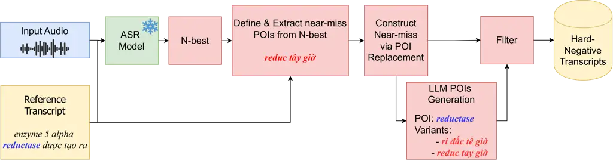

X. Nguyen Truong Nguyen Vo Buntine

# Contrastive Training with LLM-generated Near-Misses for Robust Code-Switching Speech Recognition

Tung    Hieu Minh    Giang Son    Nhu    Wray    Dung D. Le

###### Abstract

Code-switching (CS), the alternation between multiple languages within a
single utterance, remains challenging for Automatic Speech Recognition
(ASR). To address this issue, we propose a Point-of-Interest (POI)-aware
contrastive training framework that improves recognition at CS-critical
regions. We first identify CS spans by adopting POI detection method
from literature, then construct acoustically plausible near-miss
hypotheses by perturbing POIs in ASR $`N`$-best outputs and expanding
candidates with a large language model. Hard but plausible negatives are
retained through filtering with acoustic, phonemic, and textual
constraints. Finally, we fine-tune Whisper-small with LoRA using a
POI-weighted cross-entropy anchor objective together with a
multi-negative contrastive ranking loss. Experiments on CS-FLEURS
(cmn-eng) and ViMedCSS (vie-eng) show consistent reductions of over 2%
in both general and CS-aware error rates compared to standard LoRA
fine-tuning.

###### keywords

ASR, Code-Switching, Near-Miss, Contrastive Learning

^(†)^(†)address: ¹ VinUniversity, Vietnam  
² University of Technology Sydney, Australia ³ Monash University,
Australia ^(†)^(†)email: tung.nx@vinuni.edu.vn^(†)^(†)email: {tung.nx,
hieu.tm2, son.ng, nhu.vd, wray.b, dung.ld}@vinuni.edu.vn

## 1 Introduction

In Automatic Speech Recognition (ASR), code-switching (CS), the
alternation between two or more languages within a single utterance or
discourse, presents a unique challenge \[1\]. The presence of CS terms
introduces language confusion and phonetic ambiguity, which can degrade
the accuracy of the ASR decoder \[1\]. Empirically, the most severe
recognition errors tend to cluster around these CS regions \[2, 1\].

While fine-tuning on (audio, transcript) pairs with code-switching
reduces overall error rate across the entire utterance \[3, 4\], the
effect of fine-tuning on robustness in CS regions remains understudied.
Furthermore, standard fine-tuning objectives lack an explicit signal to
target these confusable spans.

To enhance the accuracy of ASR models specifically at CS regions, we
propose a contrastive learning objective that encourages the model to
prefer the ground-truth CS terms over acoustically plausible but
incorrect transcriptions (“near-misses”, see Table 1). Concretely, we
first collect the $`N`$-best hypotheses produced by the ASR model over
the training data, then identify CS regions by adopting the
Point-of-Interest (POI) detection method of \[5\]. Next, we perturb only
the POIs to construct acoustically plausible near-miss hypotheses and
use an external large language model (LLM) to generate additional
near-miss candidates. Finally, we optimize a maximum-likelihood
objective on the anchor together with a multi-negative contrastive
ranking loss inspired by preference-based alignment methods \[6, 7\].

Our contributions are:

- •
  POI-local near-miss generation (Section 3). We introduce CS-NMG, an
  acoustic-aware pipeline that constructs _POI-local_ near-misses seeded
  from $`N`$-best hypotheses and optionally expanded offline by an LLM,
  while preserving audio plausibility.
- •
  Contrastive alignment for CS-ASR (Section 4). We propose a training
  objective that combines a POI-weighted cross-entropy (CE) anchor with
  multi-negative contrastive ranking, explicitly separating common POI
  confusions rather than merely upweighting POI tokens.
- •
  Improvements over baselines on general and CS-critical evaluation
  (Section 5). Across two CS benchmarks (CS-FLEURS cmn-eng and ViMedCSS
  vie-eng), our approach improves over strong baselines on both
  traditional Word Error Rate (WER) and Point-of-Interest Error Rate
  (PIER).

| (1) Near-Miss Generation via LLM                                                                                                                           |                                                        |
| ---------------------------------------------------------------------------------------------------------------------------------------------------------- | ------------------------------------------------------ |
| Reference                                                                                                                                                  | enzyme 5 alpha \textcolorbluereductase được tạo ra     |
| ASR output                                                                                                                                                 | enzyme 5 alpha \textcolorredreduc tây giờ được tạo ra. |
| Near-miss 1                                                                                                                                                | enzyme 5 alpha \textcolorredri đắc tê giờ được tạo ra. |
| Near-miss 2                                                                                                                                                | enzyme 5 alpha \textcolorredreduc tay giờ được tạo ra. |
| Insight: The LLM-generated candidates preserve sentence structure while introducing phonetic confusions localized at the code-switching point-of-interest. |                                                        |
| (2) Robustness via Contrastive Fine-Tuning                                                                                                                 |                                                        |
| Standard FT                                                                                                                                                | enzyme 5 alpha \textcolorredreduc tây giờ được tạo ra  |
| Contrastive FT                                                                                                                                             | enzyme 5 alpha \textcolorbluereductase được tạo ra     |
| Insight: Contrastive fine-tuning suppresses acoustically plausible substitutions and correctly recovers the intended code-switching point-of-interest.     |                                                        |

Table 1: Qualitative example from ViMedCSS dataset \[4\]. (1) LLM
near-miss candidates under acoustic and phonetic constraints. (2)
Contrastive fine-tuning recovers the code-switched POI.



Figure 1: Overview of the proposed CS-NMG pipeline for code-switching
near-miss generation.

## 2 Related Work

Code-switching ASR. CS-ASR remains challenging as errors concentrate on
embedded-language words/entities and switch-boundary neighborhoods \[1,
2\]. Many approaches inject language awareness such as language
identification (LID) supervision to reduce confusion at switch points
\[8, 9, 10, 11\]. For CS-critical evaluation, Point-of-Interest Error
Rate (PIER) highlights errors produced by Point-of-Interest (POI) spans
which is bundled with other error types in plain WER \[5\].
Language-balance reweighting improves robustness on these POI regions
\[12\]. General domain benchmarks such as CS-FLEURS \[3\] and
domain-focused resources like ViMedCSS \[4\] provide (audio, transcript)
pairs where CS occurs. Benchmarking on these data sources reveals
persistent difficulty in distinct-script and specialized-domain
switching. Data-centric augmentation (e.g., code-switched text-to-speech
or synthetic phrase-mixing) further mitigates transcript scarcity \[13,
14\].

Post-correction and LLM-based approaches. Post-decoding methods rescore
or correct outputs using multiple hypotheses (e.g., $`N`$-best
lists/lattices). Prior to LLMs, external LM fusion and discriminative
rescoring were widely used \[15, 16, 17\]; more recently,
instruction-tuned LLMs have been used to expand or rerank $`N`$-best
hypotheses, including in code-mixed settings \[18, 19\]. These typically
add inference-time post-processing, motivating training-time
alternatives that keep ASR-only inference.

Preference-guided alignment. Preference-based objectives optimize models
from preferred vs. dispreferred outputs, including RLHF \[20\], DPO
\[6\], and contrastive variants such as CPO \[7\]. Applying such
alignment specifically to POI-local CS confusions remains limited; we
instantiate it for CS-ASR using acoustically grounded near-miss
hypotheses.

Discriminative training and $`N`$-best objectives. Sequence-level
criteria optimize expected loss over competing hypotheses. MWER
minimizes expected word errors using sampled or $`N`$-best hypotheses
for seq2seq ASR \[21\], and efficient $`N`$-best variants exist for
RNN-T \[22\]. In contrast, we use the $`N`$-best neighborhood to _seed_
controlled _POI-local_ near-misses and train with contrastive ranking,
rather than optimizing an expectation over arbitrary full-hypothesis
edits.

Positioning of our work. We differ from MWER-style training by
constructing POI-local hard negatives (embedded spans and
switch-boundary neighborhoods) and optimizing reference-vs-near-miss
ranking. We also differ from LLM-based correction by using the LLM
offline to expand POI replacements, keeping decoding standard ASR-only.

## 3 Near-Miss Data Generation

We propose CS-NMG, an acoustic-aware code-switching near-miss generation
pipeline (Fig. 1) that constructs hard-negative transcripts by
perturbing only points-of-interest (POIs) while preserving plausibility
under the input audio. CS-NMG is executed once _offline_ using a fixed
seed ASR checkpoint (parameters frozen for decoding and teacher-forced
scoring); the resulting near-miss pool is cached and reused across all
training epochs.

### 3.1 POI candidate pool from N-best and LLM generation

Given an utterance (audio) $`x`$ with reference transcript $`y^{*}`$, we
decode an $`N`$-best list using a fixed seed ASR model with parameters
$`\theta`$:

```math
\mathcal{H}(x)=\{h_{i}\}_{i=1}^{N},\qquad s_{i}=\log p_{\theta}(h_{i}\mid x). \tag{1}
```

Here, $`\mathcal{H}(x)`$ is the seed ASR $`N`$-best set, $`h_{i}`$ is
its $`i`$-th hypothesis, and $`s_{i}`$ is the seed-model log score.
Following \[5\], let $`E(y^{*})`$ denote the set of embedded-language
spans in the reference $`y^{*}`$ (maximal contiguous segments whose
language ID differs from the matrix language; detected as in Sec. 5).
For each span $`e=(s_{e},\dots,t_{e})`$, we define its switch-boundary
neighborhood by expanding the boundaries by $`\pm r`$ tokens:

```math
\mathrm{nbhd}(e;r)=[\max(1,s_{e}-r),\min(|y^{*}|,t_{e}+r)]. \tag{2}
```

The POI index set is
$`I(y^{*})=\bigcup_{e\in E(y^{*})}\mathrm{nbhd}(e;r)`$ (duplicates
merged).

Next, we query an LLM _offline_ to expand the POI candidate set for each
$`j`$. The prompt provides the reference transcript $`y^{*}`$ with the
target POI span $`j`$ marked, together with the raw $`N`$-best POI
candidates; the LLM outputs a short list of additional replacement
strings for the marked POI (no other edits). We merge the $`N`$-best and
LLM suggestions and de-duplicate to obtain the final candidate set
$`\tilde{C}(j)`$ for POI $`j`$.

### 3.2 Near-miss construction by POI replacement

For each POI $`j\in I(y^{*})`$, we construct near-miss transcripts by
replacing _only_ the POI span in $`y^{*}`$ with a sampled replacement
$`c\in\tilde{C}(j)`$, leaving the rest of the transcript unchanged; we
denote the resulting near-miss transcript by $`\tilde{y}`$. We sample up
to $`K`$ near-misses per utterance, typically by replacing one POI at a
time for efficiency.

### 3.3 Filtering Gate

We filter each near-miss $`\tilde{y}`$ to ensure acoustic plausibility
and to control POI-level hardness. First, we apply an acoustic gate:

```math
\log p_{\theta}(\tilde{y}\mid x)\ \geq\ \max_{1\leq i\leq N}\log p_{\theta}(h_{i}\mid x)-\Delta. \tag{3}
```

Here, $`\Delta`$ is the acoustic-margin threshold. Let $`c`$ be the
inserted POI segment at index $`j`$ and $`y^{*}[j]`$ the corresponding
reference span. We then measure (i) how much $`c`$ differs in surface
form and (ii) how close it remains in pronunciation:

```math
\displaystyle d_{\text{txt}}(c,y^{*}[j]) \displaystyle=\frac{\mathrm{Lev}(c,\,y^{*}[j])}{\max\{|c|,\ |y^{*}[j]|\}}, \tag{4}
```

```math
\displaystyle d_{\text{ph}}(c,y^{*}[j]) \displaystyle=\frac{\mathrm{Lev}(\Phi(c),\,\Phi(y^{*}[j]))}{\max\{|\Phi(c)|,\ |\Phi(y^{*}[j])|\}}, \tag{5}
```

where $`\mathrm{Lev}`$ measures Levenshtein distance \[23\] and $`\Phi`$
maps text to phonemes via a G2P model \[24\]. We keep candidates
satisfying:

```math
d_{\text{txt}}(c,y^{*}[j])\geq\tau_{\text{txt}}\qquad d_{\text{ph}}(c,y^{*}[j])\leq\tau_{\text{ph}} \tag{6}
```

where $`\tau_{\text{txt}}`$ enforces _hardness_ by requiring sufficient
textual deviation and $`\tau_{\text{ph}}`$ enforces _plausibility_ with
phonetic proximity.

In experiments, we instantiate five variants: _No filter_ (no gating),
_Acoustic_ (Eq. 3), _Ac.+Text_ (Eq. 3 and
$`d_{\text{txt}}\negthinspace\geq\negthinspace\tau_{\text{txt}}`$),
_Ac.+Ph._ (Eq. 3 and
$`d_{\text{ph}}\negthinspace\leq\negthinspace\tau_{\text{ph}}`$), and
_Ac.+Ph.+Text_ (our tri-level filter: Eq. 3 plus both constraints in
Eq. 6).

## 4 Alignment Training Strategy

We fine-tune the ASR model using a maximum-likelihood (CE/WCE) anchor on
the reference transcript and a contrastive ranking loss that prefers
reference transcripts over acoustically plausible POI-local near-misses
generated by CS-NMG (Sec. 3).

### 4.1 Cross-entropy anchor (CE / WCE)

Following language-balance training for CS \[12\], let
$`m_{t}\in\{0,1\}`$ indicate whether target token $`y_{t}^{*}`$ lies
within a POI span. We upweight POI tokens via

```math
w_{t}=1+(\alpha_{\text{wce}}-1)m_{t}, \tag{7}
```

and optimize the weighted cross-entropy (WCE)

```math
\mathcal{L}_{\mathrm{WCE}}(x,y^{*})=-\frac{1}{\sum_{t}w_{t}}\sum_{t}w_{t}\log p_{\theta}(y_{t}^{*}\mid x,y_{<t}^{*}). \tag{8}
```

CE vs. WCE. Standard cross-entropy is Eq. 8 with
$`\alpha_{\text{wce}}{=}1`$ (thus $`w_{t}{=}1`$ for all tokens). For
WCE, we set $`\alpha_{\text{wce}}{>}1`$ and tune it on the dev set.

### 4.2 Contrastive alignment with near-misses

For any candidate transcript $`y`$, we use the length-normalized
teacher-forced score

```math
S_{\theta}(y;x)=\frac{1}{|y|}\sum_{t=1}^{|y|}\log p_{\theta}(y_{t}\mid x,y_{<t}), \tag{9}
```

which avoids bias toward shorter candidates when POI-local
insertions/deletions occur.

Fixed negative selection. Given the CS-NMG near-miss pool
$`\tilde{\mathcal{Y}}(x,y^{*})`$, we select $`K`$ negatives via a fixed
policy that (i) enforces the enabled CS-NMG gates and (ii) promotes
diversity across POI categories (embedded / boundary) and POI edit type
(substitution/insertion/deletion):

We then optimize an InfoNCE-style objective \[25, 26\] that ranks
$`y^{*}`$ above the selected negatives $`\{y_{k}^{-}\}_{k=1}^{K}`$:

```math
\mathcal{L}_{\mathrm{CL}}(x)=-\log\frac{\exp(\beta\,S_{\theta}(y^{*};x))}{\exp(\beta\,S_{\theta}(y^{*};x))+\sum_{k=1}^{K}\exp(\beta\,S_{\theta}(y_{k}^{-};x))}, \tag{10}
```

with $`\beta{=}1`$ in all experiments. The final training loss is

```math
\mathcal{L}=\mathcal{L}_{\mathrm{WCE}}+\lambda_{\mathrm{CL}}\,\mathcal{L}_{\mathrm{CL}}. \tag{11}
```

## 5 Experiments

### 5.1 Setup and Datasets

|                          |         |       |         |       |
| ------------------------ | ------- | ----- | ------- | ----- |
| Method                   | cmn-eng |       | vie-eng |       |
|                          | WER     | PIER  | WER     | PIER  |
| Baselines                |         |       |         |       |
| CE                       | 16.67   | 17.25 | 24.72   | 21.95 |
| WCE                      | 16.42   | 16.68 | 24.21   | 21.18 |
| MWER                     | 15.75   | 16.41 | 23.82   | 20.84 |
| Ours                     |         |       |         |       |
| CE + CL ($`N`$-best NM)  | 15.64   | 16.21 | 23.16   | 20.11 |
| WCE + CL ($`N`$-best NM) | 14.93   | 15.72 | 22.86   | 19.10 |
| WCE + CL (tri-level)     | 14.06   | 15.10 | 21.87   | 18.74 |

Table 2: Main results on cmn-eng (CS-FLEURS) and vie-eng (ViMedCSS). We
compare cross-entropy baselines (CE/WCE), a sequence-level baseline
(MWER), and our contrastive training with near-miss (NM) negatives. The
full model (WCE+CL with tri-level filtering) achieves the lowest WER and
PIER on both datasets. Lower is better ($`\downarrow`$).

Datasets and Metrics. We evaluate on two code-switching ASR benchmarks:
(i) Mandarin–English (cmn-eng) from CS-FLEURS \[3\] and (ii)
Vietnamese–English (vie-eng) from ViMedCSS \[4\], a domain-specific
(medical) benchmark. For CS-FLEURS, we fine-tune on the CS-FLEURS-XTTS
training split and evaluate on the human-read CS-FLEURS-READ test split
for the same pair (Mandarin matrix with English insertions). For
ViMedCSS, we fine-tune on the Train split and evaluate on the Test
split, additionally reporting the Hard split when analyzing rare medical
terminology. We report WER together with POI-focused PIER \[5\]. To
compute PIER, we align each hypothesis $`\hat{y}`$ to the reference
$`y^{*}`$ (word-level for whitespace-tokenized languages;
character-level for CS-FLEURS) and measure the normalized Levenshtein
distance restricted to POI positions:

```math
\mathrm{PIER}(y^{*},\hat{y})=\frac{\Lev\negthinspace\left(y^{*}[I(y^{*})],\,\hat{y}[I(y^{*})]\right)}{\left|y^{*}[I(y^{*})]\right|}. \tag{12}
```

Generation Configuration: We follow PIER \[5\] to tag POIs. For cmn-eng,
English POIs are detected via Latin-script tokens; for vie-eng, we apply
token-level language ID on whitespace-tokenized words (excluding
punctuation-only and numeric tokens). Near-miss POI replacements are
generated by querying Gemini 2.5 Pro via API \[27\] with temperature
$`=1`$, top-p $`=0.95`$, single-candidate output, where the prompt
provides the full reference transcript $`y^{*}`$ with the POI span
marked and includes the raw $`N`$-best POI pool
$`\tilde{C}_{\text{$N$-best}}(j)`$ as grounded candidate hints. The LLM
outputs only a short list of POI replacement strings (no other edits);
we de-duplicate and apply the same CS-NMG filtering gates (Sec. 3)
before training. After POI replacement, we apply the optional filtering
configurations described in Sec. 3 (acoustic gate, and optional
text/phoneme constraints). Unless stated otherwise, we choose
$`\tau_{\text{ph}}=0.6`$ and $`\tau_{\text{txt}}=0.4`$ for POI-local
filtering by grid search. For phonetic normalization, we use
deterministic toolkits: Mandarin tokens are converted to tone-marked
Pinyin via pypinyin \[28\], English tokens to ARPAbet via g2p_en \[29\],
and Vietnamese tokens to tone-preserving syllable units via underthesea
\[30\]. All distances are computed as normalized Levenshtein distances
over these phonetic sequences \[23\].

Backbone and Training Protocol: We adopt Whisper-small \[31\] as the
backbone and fine-tune using LoRA, following prior Whisper adaptation
work \[32, 33\]. For LoRA, we set the rank to $`r=16`$, scaling factor
$`\alpha=32`$, dropout to $`0.05`$, and learning rate to 0.001. We
decode with beam search and set $`N=10`$ to construct the $`N`$-best
list for near-miss generation. Based on development experiments, we fix
the number of sampled near-misses to $`K=5`$ per utterance and set the
contrastive weight to $`\lambda_{\text{CL}}=0.1`$ (larger values yielded
diminishing returns). The acoustic margin is fixed at $`\Delta=4.0`$.
For likelihood baselines, we report both CE and language-balance WCE;
the WCE scaling $`\alpha_{\text{wce}}`$ is tuned on dev and set to
$`1.7`$ for CS-FLEURS and $`2.0`$ for ViMedCSS. All other
hyperparameters are kept fixed across experiments. For contrastive
training, all candidate scores use the length-normalized sequence score
in Eq. 9. For the baselines, we also compare with MWER approach using
the same setting as \[21\].

### 5.2 Results and Analysis

|                  |         |       |          |         |       |          |
| ---------------- | ------- | ----- | -------- | ------- | ----- | -------- |
| Variant          | cmn-eng |       |          | vie-eng |       |          |
|                  | WER     | PIER  | \#NM/utt | WER     | PIER  | \#NM/utt |
| No filter        |         |       |          |         |       |          |
| $`N`$-best       | 14.93   | 15.72 | 1.40     | 22.86   | 19.10 | 1.22     |
| $`N`$-best + LLM | 15.06   | 15.28 | 6.00     | 22.19   | 19.65 | 6.00     |
| Filter Gate      |         |       |          |         |       |          |
| Ac. only         | 15.55   | 15.18 | 5.75     | 24.03   | 19.56 | 4.93     |
| Ac. + Ph.        | 14.50   | 15.16 | 5.65     | 23.17   | 19.73 | 4.92     |
| Ac. + Text       | 14.12   | 14.69 | 3.76     | 24.03   | 19.71 | 3.82     |
| Ac.+Ph.+Text     | 14.06   | 15.10 | 3.77     | 21.87   | 18.74 | 3.81     |

Table 3: Attribution ablations on cmn-eng (CS-FLEURS) and vie-eng
(ViMedCSS). We compare near-miss (NM) sources ($`N`$-best vs.
$`N`$-best+LLM under No filter) and gating strategies (applied to
$`N`$-best+LLM) for selecting hard-but-plausible NMs. \#NM/utt is the
conditional mean of selected NMs over utterances retaining at least one
selected near-miss under each gate. The full tri-level gate Ac.+Ph.+Text
performs best overall, except for cmn–eng PIER. Lower is better
($`\downarrow`$).

Table 2 compares WER and PIER across different training strategies.

Baselines. Plain CE provides a strong LoRA baseline, but leaves
substantial residual errors on CS-critical spans, as reflected by PIER.
Upweighting POI tokens via WCE yields only marginal improvements over CE
on both datasets (e.g., cmn-eng PIER 17.25$`\rightarrow`$16.68; vie-eng
PIER 21.95$`\rightarrow`$21.18), indicating that emphasizing POIs alone
does not reliably disambiguate cross-lingual confusions. A
sequence-level baseline (MWER) improves both WER and PIER relative to
CE/WCE, but remains worse than our best contrastive setting on both
corpora (e.g., cmn-eng PIER 16.41 vs. 15.10; vie-eng PIER 20.84 vs.
18.74).

Contrastive learning (CL) with near-miss (NM) negatives consistently
improves performance. CE+CL with $`N`$-best NMs already beats CE on both
datasets, improving cmn-eng WER/PIER (16.67/17.25 $`\rightarrow`$
15.64/16.21) and vie-eng WER/PIER (24.72/21.95 $`\rightarrow`$
23.16/20.11); adding POI reweighting strengthens this further, and our
full tri-level filtered setting achieves the best results (14.06/15.10
and 21.87/18.74). These results support our central hypothesis: CS
errors are concentrated at POIs, and learning to rank the reference
above acoustically plausible alternatives provides a more informative
signal than simply increasing loss weight on POI tokens.

Effect of NM source: $`N`$-best vs. $`N`$-best+LLM. Table 3 isolates how
candidate sources affect downstream performance. Under No filter, moving
from $`N`$-best to $`N`$-best+LLM greatly increases the number of
available NMs (from 1.40/1.22 to 6.00/6.00 NM/utt for cmn-eng/vie-eng).
However, the impact without gating is _not_ uniformly positive: on
cmn-eng, LLM expansion improves PIER (15.72$`\rightarrow`$15.28) but
slightly worsens WER (14.93$`\rightarrow`$15.06), while on vie-eng it
improves WER (22.86$`\rightarrow`$22.19) but degrades PIER
(19.10$`\rightarrow`$19.65). This mixed behavior suggests that LLM
expansion does inject novel confusions beyond beam-search errors, but it
can also introduce POI replacements that are not consistently aligned
with the audio or with the intended “hard-but-plausible” error profile
needed for effective contrastive learning. Importantly, Table 3 shows
that _more_ negatives are not automatically better: the largest pool
(6.0 NM/utt) is not the best-performing configuration, motivating
careful selection and filtering.

Why tri-level gating is necessary. The lower block of Table 3 holds the
candidate source fixed to $`N`$-best+LLM and varies the gating strategy.
Acoustic-only gating retains many candidates (5.75/4.93 NM/utt) yet
yields suboptimal WER/PIER on both datasets, consistent with the gate
being too permissive. Adding a phoneme constraint (Ac.+Ph.) improves
cmn-eng WER substantially (15.55$`\rightarrow`$14.50) but does not
consistently improve PIER, and it remains weaker than the full pipeline.
Conversely, adding only the text constraint (Ac.+Text) yields strong
cmn-eng WER/PIER (14.12/14.69) but fails to transfer to vie-eng, where
WER remains high (24.03) and PIER degrades (19.71). These outcomes
highlight that a single constraint captures only one aspect of NM
quality: phoneme proximity improves acoustic plausibility, while text
distance enforces hardness; either alone can be brittle across languages
and scripts. The full tri-level gate (Ac.+Ph.+Text) combines both
constraints and provides the strongest overall WER/PIER trade-off across
cmn-eng and vie-eng, while selecting a *smaller* but higher-quality NM
set ($`\sim`$3.8 NM/utt). Together with Table 2, this supports the core
design of CS-NMG: LLM-expanded near-misses become reliably useful
training signal only after jointly enforcing acoustic plausibility,
phonetic similarity, and sufficient textual deviation, yielding
consistent gains on both global WER and the POI-focused PIER.

## 6 Conclusion & Future work

We introduced a POI-aware contrastive training framework for
code-switching ASR that targets errors concentrated on embedded-language
spans and switch-boundary neighborhoods. Our CS-NMG pipeline generates
POI-local near-misses by seeding candidates from the ASR $`N`$-best
list, expanding POI replacements with a LLM, and selecting
hard-but-plausible negatives via a tri-level gate (acoustic, phoneme,
and text). Fine-tuning Whisper-small (LoRA) with a POI-weighted CE
anchor plus InfoNCE-style ranking consistently improves both WER and the
POI-focused PIER on CS-FLEURS (cmn-eng) and ViMedCSS (vie-eng), without
adding auxiliary modules at inference time.

Limitations: Our near-miss expansion relies on an external LLM API and
prompt design, which adds offline cost and can affect reproducibility.
Our evaluation is performed on two language pairs and a single model
backbone. Future work will explore fully open-source candidate
expansion, broader language coverage, and more adaptive gating or
negative mining under additional ASR backbones and decoding settings.

## 7 Acknowledgments

This work was conducted as part of the Cross-College project Robust
Vietnamese–English Clinical and Educational Medical Translation (Project
ID: VUNI.2324.CC06), a collaborative initiative between the College of
Engineering & Computer Science and the College of Health Sciences at
VinUniversity.

Tung X. Nguyen, Hieu Minh Truong, Giang Son Nguyen, and Dung D. Le
acknowledge partial funding from the Center for AI Research at
VinUniversity. Nhu Vo gratefully acknowledges financial support from the
Vingroup Scholarship.

## 8 Generative AI Use Disclosure

The authors used generative AI tools only for minor language editing and
to improve readability. These tools were not used to generate any
scientific content, experimental results, data analyses, or conclusions.

## References

- \[1\] M. T. Agro, A. A. Kulkarni, K. Kadaoui, Z. Talat, and H.
  Aldarmaki (2026) Code-Switching in End-to-End Automatic Speech
  Recognition: A Systematic Literature Review. In Proceedings of the
  Fifteenth Language Resources and Evaluation Conference (LREC 2026), S.
  Piperidis, N. Bel, H. van den Heuvel, N. Ide, S. Krek, and A. Toral
  (Eds.), Palma, Mallorca, Spain, pp. 9790–9812. External Links:
  [Document](https://dx.doi.org/10.63317/477upr9ikf9n) Cited by: §1, §2.
- \[2\] H. Liu, H. Zhang, Q. Zhang, X. Zhang, D. Shi, E. S. Chng, and H.
  Li (2026) Code-Switching Speech Recognition Under the Lens: Model- and
  Data-Centric Perspectives. IEEE Transactions on Audio, Speech and
  Language Processing 34 (), pp. 1853–1865. External Links:
  [Document](https://dx.doi.org/10.1109/TASLPRO.2026.3675776) Cited by:
  §1, §2.
- \[3\] B. Yan, I. Hamed, S. Shimizu, V. S. Lodagala, W. Chen, O.
  Iakovenko, B. Talafha, A. Hussein, A. Polok, K. Chang, D. Klement, S.
  Althubaiti, P. Peng, M. Wiesner, T. Solorio, A. Ali, S. Khudanpur,
  and S. Watanabe (2025) CS-FLEURS: A Massively Multilingual and
  Code-Switched Speech Dataset. In Interspeech 2025, pp. 743–747.
  External Links:
  [Document](https://dx.doi.org/10.21437/Interspeech.2025-2247), ISSN
  2958-1796 Cited by: §1, §2, §5.1.
- \[4\] T. X. Nguyen, N. Vo, G. S. Nguyen, D. M. Hoang, C. D.
  Huynh, I. J. Unanue, M. Piccardi, W. Buntine, and D. D. Le (2026)
  ViMedCSS: A Vietnamese Medical Code-Switching Speech Dataset &
  Benchmark. In Proceedings of the Fifteenth Language Resources and
  Evaluation Conference (LREC 2026), S. Piperidis, N. Bel, H. van den
  Heuvel, N. Ide, S. Krek, and A. Toral (Eds.), Palma, Mallorca, Spain,
  pp. 5657–5665. External Links:
  [Document](https://dx.doi.org/10.63317/58uwrquo3znb) Cited by: Table
  1, §1, §2, §5.1.
- \[5\] E. Y. Ugan, N. Pham, L. Bärmann, and A. Waibel (2025) PIER: A
  Novel Metric for Evaluating What Matters in Code-Switching. In ICASSP
  2025 - 2025 IEEE International Conference on Acoustics, Speech and
  Signal Processing (ICASSP), Vol. , pp. 1–5. External Links:
  [Document](https://dx.doi.org/10.1109/ICASSP49660.2025.10889660) Cited
  by: §1, §2, §3.1, §5.1, §5.1.
- \[6\] R. Rafailov, A. Sharma, E. Mitchell, C. D. Manning, S. Ermon,
  and C. Finn (2023) Direct Preference Optimization: Your Language Model
  is Secretly a Reward Model. In Thirty-seventh Conference on Neural
  Information Processing Systems, Cited by: §1, §2.
- \[7\] H. Xu, A. Sharaf, Y. Chen, W. Tan, L. Shen, B. Van Durme, K.
  Murray, and Y. J. Kim (2024) Contrastive Preference Optimization:
  Pushing the Boundaries of LLM Performance in Machine Translation. In
  Proceedings of the 41st International Conference on Machine Learning,
  ICML’24. Cited by: §1, §2.
- \[8\] Z. Zeng, H. Xu, P. Guo, L. Xie, and E. S. Chng (2019) On the
  End-to-End Solution to Mandarin-English Code-Switching Speech
  Recognition. In Proc. Interspeech, External Links:
  [Document](https://dx.doi.org/10.21437/Interspeech.2019-1429) Cited
  by: §2.
- \[9\] S. Punjabi, H. Arsikere, Z. Raeesy, C. Chandak, N. Bhave, A.
  Bansal, M. Muller, S. Murillo, A. Rastrow, A. Stolcke, J. Droppo, S.
  Garimella, R. Maas, M. Hans, A. Mouchtaris, and S. Kunzmann (2021)
  Joint ASR and Language Identification Using RNN-T: An Efficient
  Approach to Dynamic Language Switching. In ICASSP 2021 - 2021 IEEE
  International Conference on Acoustics, Speech and Signal Processing
  (ICASSP), pp. 7218–7222. External Links:
  [Document](https://dx.doi.org/10.1109/ICASSP39728.2021.9413734) Cited
  by: §2.
- \[10\] K. Li, J. Li, G. Ye, R. Zhao, and Y. Gong (2019) Towards
  Code-Switching ASR for End-to-End CTC Models. In ICASSP 2019 - 2019
  IEEE International Conference on Acoustics, Speech and Signal
  Processing (ICASSP), pp. 6076–6080. External Links:
  [Document](https://dx.doi.org/10.1109/ICASSP.2019.8683223) Cited by:
  §2.
- \[11\] Q. Wang and H. Li (2023) Text-Derived Language Identity
  Incorporation for End-to-End Code-Switching Speech Recognition. In
  Proceedings of the 6th Workshop on Computational Approaches to
  Linguistic Code-Switching (CALCS), pp. 33–42. External Links:
  [Document](https://dx.doi.org/10.18653/v1/2023.calcs-1.4) Cited by:
  §2.
- \[12\] E. Y. Ugan, N. Pham, and A. Waibel (2025) Adapting Language
  Balance in Code-Switching Speech. arXiv preprint arXiv:2510.18724.
  External Links:
  [Document](https://dx.doi.org/10.48550/arXiv.2510.18724) Cited by: §2,
  §4.1.
- \[13\] Y. Sharma, B. Abraham, K. Taneja, and P. Jyothi (2020)
  Improving Low Resource Code-Switched ASR Using Augmented Code-Switched
  TTS. In Interspeech 2020, pp. 4771–4775. External Links:
  [Document](https://dx.doi.org/10.21437/Interspeech.2020-2402), ISSN
  2958-1796 Cited by: §2.
- \[14\] T. Nguyen and H. Tran (2025) Can we train ASR systems on
  Code-switch without real code-switch data? Case study for Singapore’s
  languages. In Proc. Interspeech, External Links:
  [Document](https://dx.doi.org/10.21437/Interspeech.2025-654) Cited by:
  §2.
- \[15\] A. Sriram, H. Jun, S. Satheesh, and A. Coates (2018) Cold
  Fusion: Training Seq2Seq Models Together with Language Models. In
  Proc. Interspeech, Cited by: §2.
- \[16\] E. Tsunoo, Y. Kashiwagi, C. Narisetty, and S. Watanabe (2022)
  Residual Language Model for End-to-end Speech Recognition. In Proc.
  Interspeech, External Links:
  [Document](https://dx.doi.org/10.21437/Interspeech.2022-10557) Cited
  by: §2.
- \[17\] A. Ogawa, M. Delcroix, S. Karita, and T. Nakatani (2019)
  Improved Deep Duel Model for Rescoring N-Best Speech Recognition List
  Using Backward LSTMLM and Ensemble Encoders. In Proc. Interspeech,
  External Links:
  [Document](https://dx.doi.org/10.21437/Interspeech.2019-1949) Cited
  by: §2.
- \[18\] A. D. Tur, A. Moumen, and M. Ravanelli (2024) Progres: Prompted
  Generative Rescoring on ASR N-Best. In 2024 IEEE Spoken Language
  Technology Workshop (SLT), Vol. , pp. 600–607. External Links:
  [Document](https://dx.doi.org/10.1109/SLT61566.2024.10832194) Cited
  by: §2.
- \[19\] S. Kumar and M. S. Akhtar (2025) CLEAR: code-mixed ASR with
  LLM-driven rescoring. In Proceedings of the 8th International
  Conference on Natural Language and Speech Processing (ICNLSP-2025),
  Southern Denmark University, Odense, Denmark. Cited by: §2.
- \[20\] L. Ouyang, J. Wu, X. Jiang, D. Almeida, C. Wainwright, P.
  Mishkin, C. Zhang, S. Agarwal, K. Slama, A. Ray, J. Schulman, J.
  Hilton, F. Kelton, L. Miller, M. Simens, A. Askell, P. Welinder, P. F.
  Christiano, J. Leike, and R. Lowe (2022) Training language models to
  follow instructions with human feedback. In Advances in Neural
  Information Processing Systems, Vol. 35, pp. 27730–27744. Cited by:
  §2.
- \[21\] R. Prabhavalkar, T. N. Sainath, Y. Wu, P. Nguyen, Z. Chen, C.
  Chiu, and A. Kannan (2018) Minimum Word Error Rate Training for
  Attention-Based Sequence-to-Sequence Models. In 2018 IEEE
  International Conference on Acoustics, Speech and Signal Processing
  (ICASSP), Vol. , pp. 4839–4843. External Links:
  [Document](https://dx.doi.org/10.1109/ICASSP.2018.8461809) Cited by:
  §2, §5.1.
- \[22\] J. Guo, G. Tiwari, J. Droppo, M. V. Segbroeck, C. Huang, A.
  Stolcke, and R. Maas (2020) Efficient Minimum Word Error Rate Training
  of RNN-Transducer for End-to-End Speech Recognition. In Interspeech
  2020, pp. 2807–2811. External Links:
  [Document](https://dx.doi.org/10.21437/Interspeech.2020-1557), ISSN
  2958-1796 Cited by: §2.
- \[23\] V. I. Levenshtein (1965) Binary codes capable of correcting
  deletions, insertions, and reversals. Soviet physics. Doklady 10,
  pp. 707–710. External Links:
  [Link](https://api.semanticscholar.org/CorpusID:60827152) Cited by:
  §3.3, §5.1.
- \[24\] M. Bisani and H. Ney (2008) Joint-sequence models for
  grapheme-to-phoneme conversion. Speech Communication 50 (5),
  pp. 434–451. External Links: ISSN 0167-6393,
  [Document](https://dx.doi.org/https%3A//doi.org/10.1016/j.specom.2008.01.002),
  [Link](https://www.sciencedirect.com/science/article/pii/S0167639308000046)
  Cited by: §3.3.
- \[25\] A. van den Oord, Y. Li, and O. Vinyals (2018) Representation
  learning with contrastive predictive coding. arXiv preprint
  arXiv:1807.03748. External Links:
  [Link](https://arxiv.org/abs/1807.03748) Cited by: §4.2.
- \[26\] M. Gutmann and A. Hyvärinen (2010) Noise-contrastive
  estimation: a new estimation principle for unnormalized statistical
  models. In Proceedings of the Thirteenth International Conference on
  Artificial Intelligence and Statistics (AISTATS), Proceedings of
  Machine Learning Research, Vol. 9, pp. 297–304. External Links:
  [Link](https://proceedings.mlr.press/v9/gutmann10a.html) Cited by:
  §4.2.
- \[27\] Gemini Team, Google (2025) Gemini 2.5: pushing the frontier
  with advanced reasoning, multimodality, long context, and next
  generation agentic capabilities. External Links: 2507.06261,
  [Link](https://arxiv.org/abs/2507.06261) Cited by: §5.1.
- \[28\] H. Huang et al. (2025) Mozillazg/python-pinyin: v0.55.0.
  Zenodo. External Links:
  [Document](https://dx.doi.org/10.5281/zenodo.16216452),
  [Link](https://zenodo.org/records/3520670/latest) Cited by: §5.1.
- \[29\] K. Park and J. Kim (2019) G2pE: english grapheme-to-phoneme
  conversion. GitHub. Note:
  [https://github.com/Kyubyong/g2p](https://github.com/Kyubyong/g2p)
  Cited by: §5.1.
- \[30\] undertheseanlp contributors (2017) Underthesea: vietnamese nlp
  toolkit. GitHub. Note:
  [https://github.com/undertheseanlp/underthesea](https://github.com/undertheseanlp/underthesea)
  Cited by: §5.1.
- \[31\] A. Radford, J. W. Kim, T. Xu, G. Brockman, C. Mcleavey, and I.
  Sutskever (2023) Robust Speech Recognition via Large-Scale Weak
  Supervision. In Proceedings of the 40th International Conference on
  Machine Learning, A. Krause, E. Brunskill, K. Cho, B. Engelhardt, S.
  Sabato, and J. Scarlett (Eds.), Proceedings of Machine Learning
  Research, Vol. 202, pp. 28492–28518. External Links:
  [Link](https://proceedings.mlr.press/v202/radford23a.html) Cited by:
  §5.1.
- \[32\] Z. Song, J. Zhuo, Y. Yang, Z. Ma, S. Zhang, and X. Chen (2024)
  LoRA-Whisper: Parameter-Efficient and Extensible Multilingual ASR. In
  Interspeech 2024, pp. 3934–3938. External Links:
  [Document](https://dx.doi.org/10.21437/Interspeech.2024-892), ISSN
  2958-1796 Cited by: §5.1.
- \[33\] T. Xu, K. Huang, P. Guo, Y. Zhou, L. Huang, H. Xue, and L.
  Xie (2024) Towards Rehearsal-Free Multilingual ASR: A LoRA-based Case
  Study on Whisper . In Interspeech 2024, pp. 2534–2538. External Links:
  [Document](https://dx.doi.org/10.21437/Interspeech.2024-1953), ISSN
  2958-1796 Cited by: §5.1.
