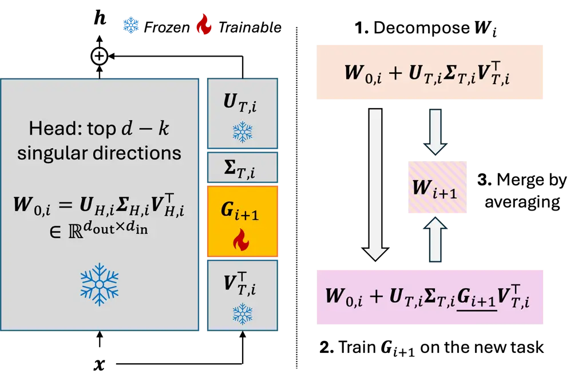

Vander Eeckt Van hamme

# Parameter-Efficient Continual Learning for Automatic Speech Recognition

Steven    Hugo

###### Abstract

Speech foundation models enable strong general-purpose ASR and are
attractive for downstream adaptation. However, their size and the
catastrophic forgetting induced by sequential fine-tuning demand
parameter-efficient and regularized training methods, motivating
parameter-efficient continual learning (PECL). While PECL has been
widely studied in NLP and vision, it has received less attention in ASR.
In this paper, we propose a simple yet effective PECL method based on
recent advances in parameter-efficient fine-tuning for ASR. We partition
pretrained weight matrices into head and tail subspaces according to
singular values and restrict adaptation to approximate rotations within
the low-energy tail subspace, preserving dominant components and
reducing forgetting. For subsequent tasks, rotations are combined via
weight averaging to further improve retention. Experiments on two
benchmarks demonstrate reduced forgetting and superior overall
performance compared to recent PECL baselines.

###### keywords

automatic speech recognition, parameter-efficient continual learning,
foundation models

^(†)^(†)address: ¹ Department Electrical Engineering ESAT-PSI, KU
Leuven, Leuven, Belgium ^(†)^(†)email:
steven.vandereeckt@esat.kuleuven.be, hugo.vanhamme@esat.kuleuven.be

## 1 Introduction

Automatic Speech Recognition (ASR) has undergone remarkable progress
over the past decade. More recently, speech foundation models trained on
massive and multilingual datasets have emerged as powerful
general-purpose models \[1, 2\]. These models capture general speech
knowledge, making them attractive for adaptation to specific downstream
tasks.

Adapting such large-scale models, however, presents two fundamental
challenges. First, their size–often above hundreds of millions of
parameters–makes full fine-tuning computationally expensive.
Parameter-efficient fine-tuning (PEFT) methods address this issue by
updating only a small subset of parameters while keeping the rest of the
model frozen. Second, naïvely fine-tuning a model on new tasks leads to
catastrophic forgetting (CF) \[3\], where performance on previously
learned tasks deteriorates, which Continual learning (CL) aims to
mitigate.

Speech foundation models must thus be adapted efficiently, and this
adaptation must not lead to forgetting of previous tasks. This setting
naturally gives rise to _parameter-efficient continual learning_ (PECL)
\[4\], where the goal is to sequentially adapt a large pretrained ASR
model to (multiple) downstream tasks under strict parameter constraints,
while preserving performance on earlier tasks without access to their
training data.

In other domains, PECL has received considerable attention in recent
years, particularly in Natural Language Processing (NLP) for adapting
Large Language Models \[4, 5, 6, 7, 8, 9\] and in image classification
\[10, 11, 12, 13, 14, 15\]. Many of these approaches build upon low-rank
adaptation (LoRA) \[16\], for example by constraining its update
subspace \[11, 7, 14\], averaging task-specific adapters \[10, 9\], or
modifying its initialization \[5, 6\].

In ASR, however, PECL has been studied only to a limited extent. \[17\]
adapts Whisper \[1\] using orthogonal LoRA \[18\] and AdaLoRA \[19\] to
reduce forgetting and allocate parameters across layers, while \[20\]
applies weight averaging \[21\] to LoRA modules. Both approaches,
however, do not explicitly address forgetting with respect to the
initial pretrained model. Task-specific adapter \[22\] approaches have
also been explored \[23\], but require task identity at inference time.
More broadly, continual learning in ASR has primarily focused on storing
past data \[24, 25, 26\] or regularizing the training \[27, 21, 28,
29\], without explicitly considering parameter-efficiency constraints.

Recently, \[30\] introduced structured Singular Value Decomposition
(SSVD) as a PEFT method for ASR. SSVD decomposes weight matrices via SVD
and adapts the top $`k`$ singular directions through a learned rescaling
and approximate rotation, showing strong performance for PEFT in ASR.

Building on SSVD, we propose a simple yet effective PECL method for ASR.
In contrast to SSVD, we retain only the rotation component and partition
each pretrained weight matrix into a head and tail according to
decreasing singular values. Adaptation is restricted to the low-energy
tail subspace, leaving the dominant singular directions untouched and
thereby reducing interference with previously learned tasks. For
subsequent tasks, we combine rotations via weight averaging to further
mitigate forgetting. We evaluate the proposed method on two benchmarks
and compare against a broad range of PECL approaches. Our results
demonstrate consistently reduced forgetting and improved overall
performance.

Our contributions are threefold: (i) we provide the most extensive
empirical study of PECL for ASR to date, implementing and evaluating
recent PECL methods originally proposed for NLP and vision; (ii) we
introduce a novel PECL method tailored to ASR that achieves stronger
retention and superior performance compared to these baselines; (iii) we
present an ablation study that identifies the key components underlying
the effectiveness of our method.

## 2 Problem Formulation

Let an initial model with parameters
$`\bm{\theta}^{0}\in\mathbb{R}^{N}`$ be trained on an initial set of
tasks $`\mathcal{T}_{0}`$, whose data
$`(\bm{X},\bm{y})\in{\cal D}_{0}`$, with
$`\bm{X}\in\mathbb{R}^{F\times d_{s}}`$ the input utterance (consisting
of $`F`$ frames of dimension $`d_{s}`$) and $`\bm{y}\in\mathbb{R}^{w}`$
the corresponding set of $`w`$ ground truth tokens, is no longer
available. In parameter-efficient continual learning (PECL), this model
is sequentially adapted to a stream of new tasks
$`\mathcal{T}_{1},\dots,\mathcal{T}_{t}`$, with each task
$`{\cal T}_{i}`$ consisting of labeled data
$`(\bm{X},\bm{y})\in{\cal D}_{i}`$. To learn task $`\mathcal{T}_{i}`$
from $`\mathcal{D}_{i}`$, the parameters $`\bm{\theta}^{i-1}`$ are
updated to $`\bm{\theta}^{i}`$ in a parameter-efficient manner, while
retaining performance on previous tasks
$`\{{\cal T}_{j}\}_{0\leq j\leq i-1}`$.

The objective of PECL is twofold: (i) effective adaptation to new task
$`{\cal T}_{i}`$ under strict parameter-efficiency constraints, and (ii)
preservation of performance on all previously learned tasks
$`\mathcal{T}_{0},\dots,\mathcal{T}_{i-1}`$ without access to their
(full) data. We restrict adaptation to the weight matrices of linear
layers, keeping all other parameters, including the output layers,
frozen. Task identity is assumed unavailable at inference time.

## 3 Our Method: Continual SSVD



Figure 1: Overview of CSSVD for a single linear layer (bias omitted)
when learning task $`\mathcal{T}_{i+1}`$. Right: (1) current weights
$`\bm{W}_{i}`$ are decomposed via SVD into head and tail subspaces; (2)
an approximate rotation matrix $`\bm{G}_{i+1}`$ is introduced within the
tail and optimized on the new task to obtain $`\tilde{\bm{W}}_{i+1}`$;
(3) $`\bm{W}_{i}`$ and $`\tilde{\bm{W}}_{i+1}`$ are merged through
averaging to produce $`\bm{W}_{i+1}`$. Left: schematic view of the
decomposition for an input $`\bm{x}\in\mathbb{R}^{d_{\text{in}}}`$ and
output $`\bm{h}\in\mathbb{R}^{d_{\text{out}}}`$, with only
$`\bm{G}_{i+1}`$ in the tail trainable.

### 3.1 Learning the first task

Let $`\bm{W}\in\mathbb{R}^{d_{\text{out}}\times d_{\text{in}}}`$ be the
weight matrix of a linear layer of the initial model $`\bm{\theta}^{0}`$
whose output is $`\bm{h}=\bm{W}\bm{x}`$ for an input
$`\bm{x}\in\mathbb{R}^{d_{\text{in}}}`$ (we omit the bias
$`\bm{b}\in\mathbb{R}^{d_{\text{out}}}`$ for simplicity). Its singular
value decomposition (SVD) is given as:

```math
\bm{W}=\bm{U}\bm{\Sigma}\bm{V}^{\top} \tag{1}
```

with $`\bm{U}\in\mathbb{R}^{d_{\text{out}}\times d}`$ and
$`\bm{V}\in\mathbb{R}^{d_{\text{in}}\times d}`$, the left and right
singular vectors, resp., and $`\bm{\Sigma}\in\mathbb{R}^{d\times d}`$ a
diagonal matrix with the singular values sorted in decreasing order,
with $`d=\min(d_{\text{in}},d_{\text{out}})`$.

To adapt $`\bm{W}`$ in a parameter-efficient manner to new tasks, SSVD
(structured SVD) \[30\] proposes to introduce and learn a rotation
matrix $`\bm{G}\in\mathbb{R}^{k\times k}`$ and rescaling
$`\Delta\bm{\Sigma}\in\mathbb{R}^{k}`$ for the top $`k`$ singular
directions (associated with highest singular values) from
$`\bm{U}\bm{\Sigma}\bm{V}^{\top}`$, with $`k=pd`$ with $`p\in(0,1)`$ a
hyper-parameter. In the approximate orthogonal constraint version, they
define $`\bm{G}:=\bm{I}-2\bm{K}`$ with $`\bm{I}`$ the $`k\times k`$
identity matrix and $`\bm{K}\in\mathbb{R}^{k\times k}`$ a skew symmetric
but otherwise unconstrained matrix. The rescaling and rotation thus
require learning $`k`$ and $`k(k-1)/2`$ parameters, resp., totaling
$`k+k(k-1)/2`$ parameters.

While SSVD adapts the $`k`$ directions associated with largest singular
values, we operate on the $`k`$ smallest singular directions to reduce
interference between new task $`\mathcal{T}_{1}`$ and initial tasks
$`\mathcal{T}_{0}`$.

Referring to the top $`d-k`$ directions (associated with largest
singular values) as the head, and to the bottom $`k`$ directions as the
tail, we can write the decomposition of $`\bm{W}`$ as follows:

```math
\bm{W}=\bm{U}_{H}\bm{\Sigma}_{H}\bm{V}_{H}^{\top}+\bm{U}_{T}\bm{\Sigma}_{T}\bm{V}^{\top}_{T}=\bm{W}_{0}+\bm{U}_{T}\bm{\Sigma}_{T}\bm{U}_{T}^{\top} \tag{2}
```

To obtain $`\bm{W}_{1}`$, the weight matrix adapted to task
$`\mathcal{T}_{1}`$, we apply SSVD within the tail by introducing an
approximate rotation matrix $`\bm{G}_{1}`$. Since we adopt the
approximate orthogonality constraint of SSVD, $`\bm{G}_{1}`$ is not
strictly constrained to be orthogonal and can implicitly capture both
rotation and rescaling. We therefore omit the explicit rescaling term
$`\Delta\bm{\Sigma}_{1}`$ and introduce only $`\bm{G}_{1}`$. The adapted
weight matrix is then given by:

```math
\bm{W}_{1}=\bm{W}_{0}+\bm{U}_{T}\bm{\Sigma}_{T}\underline{\bm{G}_{1}}\bm{V}_{T}^{\top} \tag{3}
```

where $`\bm{G}_{1}=\bm{I}-2\bm{K}_{1}`$ with initially
$`\bm{K}_{1}\approx 0`$, and only the underlined part is trained. Since
the update is restricted to the tail subspace while the head remains
fixed, interference with initial tasks $`{\cal T}_{0}`$ is reduced.

### 3.2 Learning additional tasks

To learn a new task $`{\cal T}_{2}`$, we start from the same
decomposition. Assuming the training of $`\bm{G}_{1}`$ during the first
task has not altered the division between head and tail, the
decomposition can be written as follows:

```math
\tilde{\bm{W}}_{2}=\bm{W}_{0}+\bm{U}_{T}{\bm{\Sigma}}_{T}\underline{\bm{G}_{2}}\tilde{\bm{V}}_{T}^{\top} \tag{4}
```

Since $`\tilde{\bm{V}}_{T}=\bm{V}_{T}\bm{G}_{1}^{\top}`$, the
formulation for $`\tilde{\bm{W}}_{2}`$ becomes:

```math
\tilde{\bm{W}}_{2}=\bm{W}_{0}+\bm{U}_{T}{\bm{\Sigma}}_{T}\underline{\bm{G}_{2}}\bm{G}_{1}{\bm{V}}_{T}^{\top} \tag{5}
```

Introducing $`\bm{G}_{2}`$ may induce forgetting of task
$`{\cal T}_{1}`$. To mitigate this, we merge $`\bm{G}_{1}`$ and
$`\bm{G}_{2}\bm{G}_{1}`$ via averaging, a strategy previously shown
effective for continual learning in ASR \[21\]. The resulting weight
matrix $`\bm{W}_{2}`$ is given by:

```math
\bm{W}_{2}=\bm{W}_{0}+\bm{U}_{T}\bm{\Sigma}_{T}\left((1-\alpha)\bm{G}_{1}+\alpha\bm{G}_{2}\bm{G}_{1}\right)\bm{V}_{T}^{\top} \tag{6}
```

with $`0\leq\alpha\leq 1`$. Note that this solution $`\bm{W}_{2}`$
corresponds to computing a convex combination of the task
$`{\cal T}_{1}`$ solution $`\bm{W}_{1}`$ and the task $`{\cal T}_{2}`$
solution $`\tilde{\bm{W}}_{2}`$:

```math
\bm{W}_{2}=(1-\alpha)\bm{W}_{1}+\alpha\tilde{\bm{W}}_{2} \tag{7}
```

### 3.3 Practical Implementation

The formulation in Eq. (6) assumes that the partition into head and tail
remains fixed across tasks. In practice, however, after completing task
$`{\cal T}_{i}`$ we only store the resulting weight matrix
$`\bm{W}_{i}`$. Before learning a new task $`{\cal T}_{i+1}`$, we
recompute its SVD and define a new head and tail by selecting again the
$`d-k`$ largest and $`k`$ smallest singular directions, respectively.
The adaptation for $`{\cal T}_{i+1}`$ is then restricted to the new
tail:

```math
\tilde{\bm{W}}_{i+1}=\underbrace{\bm{U}_{H,i}\bm{\Sigma}_{H,i}\bm{V}_{H,i}^{\top}}_{\bm{W}_{0,i}}+\bm{U}_{T,i}\bm{\Sigma}_{T,i}\underline{\bm{G}_{i+1}}\bm{V}_{T,i}^{\top} \tag{8}
```

This re-computation of head and tail allows singular directions whose
importance has increased during tasks $`\{{\cal T}_{j}\}_{j<i}`$ to move
from the tail to the head. Highly important directions thus become
protected from further modification, while adaptation capacity remains
concentrated in the low-energy subspace.

When no singular value crossings occur between head and tail, the above
formulation reduces to the fixed case from Sec. 3.2 up to a change of
basis within the tail subspace. However, as the partition may change,
Eq. (6) does not generally apply. Therefore, in practice we compute the
merged solution directly via Eq. (7), using $`\alpha=1/(i+1)`$ following
\[21\].

Figure 1 summarizes Continual SSVD (CSSVD).

## 4 Experiments

|                  |        |                            |      |      |      |      |                   |                 |                            |       |      |      |      |                   |                 |
| ---------------- | ------ | -------------------------- | ---- | ---- | ---- | ---- | ----------------- | --------------- | -------------------------- | ----- | ---- | ---- | ---- | ----------------- | --------------- |
|                  |        | Experiment 1               |      |      |      |      |                   |                 | Experiment 2               |       |      |      |      |                   |                 |
|                  |        | WER$`\downarrow`$ per task |      |      |      |      | Average           |                 | WER$`\downarrow`$ per task |       |      |      |      | Average           |                 |
| Method           | Params | ENG                        | DEU  | ESP  | NL   | VL   | WER$`\downarrow`$ | BWT$`\uparrow`$ | ENG                        | DEU   | ESP  | VL   | DVL  | WER$`\downarrow`$ | BWT$`\uparrow`$ |
| Initial model    | –      | 13.4                       | 11.3 | 11.3 | 45.7 | 37.9 | 22.48             | –               | 13.4                       | 111.3 | 11.3 | 37.9 | 86.0 | 31.98             | –               |
| Full Fine-Tuning | 244.8M | 24.3                       | 57.3 | 21.7 | 27.7 | 13.6 | 28.94             | -18.2           | 45.9                       | 191.5 | 43.4 | 34.2 | 29.7 | 48.95             | -41.0           |
| Separate Model   | 244.8M | 13.4                       | 11.3 | 11.3 | 22.4 | 13.6 | 14.38             | -30.0           | 13.4                       | 111.3 | 11.3 | 15.2 | 29.7 | 16.17             | -40.0           |
| LoRA             | 9.3M   | 41.8                       | 88.4 | 44.5 | 28.9 | 14.7 | 43.66             | -35.7           | 90.5                       | 100.0 | 98.0 | 53.5 | 29.9 | 74.70             | -72.5           |
| LoRA + FTA       | 9.3M   | 16.4                       | 20.6 | 15.1 | 27.2 | 19.0 | 19.64             | 1-3.6           | 17.3                       | 122.0 | 16.3 | 20.3 | 57.1 | 26.58             | 4-4.8           |
| SSVD             | 9.0M   | 40.8                       | 85.3 | 43.1 | 37.4 | 15.9 | 44.49             | -36.4           | 97.6                       | 100.0 | 93.7 | 49.9 | 32.7 | 74.76             | -71.7           |
| MiLoRA           | 9.3M   | 47.4                       | 91.7 | 48.5 | 30.2 | 14.1 | 46.39             | -39.6           | —                          | —     | —    | —    | —    | —                 | —               |
| OPLoRA           | 9.3M   | 33.8                       | 81.6 | 36.3 | 30.2 | 15.7 | 39.53             | -30.3           | —                          | —     | —    | —    | —    | —                 | —               |
| BiLoRA           | 9.3M   | 19.4                       | 34.7 | 17.8 | 30.0 | 16.0 | 23.58             | 1-9.7           | 33.5                       | 171.1 | 34.6 | 36.2 | 35.9 | 42.25             | -30.4           |
| EWC-LoRA         | 9.3M   | 23.9                       | 60.5 | 23.9 | 25.8 | 17.0 | 30.21             | -18.6           | 30.7                       | 172.9 | 30.0 | 23.2 | 43.7 | 40.06             | -26.1           |
| CSSVD            | 8.9M   | 14.9                       | 14.4 | 13.4 | 28.6 | 20.4 | 18.33^(a)         | 1-1.9           | 15.3                       | 114.9 | 13.2 | 21.5 | 59.2 | 24.82^(a)         | 4-2.2           |

- a
  Significantly outperforms all PECL baselines and Full Fine-Tuning.

Table 1: Results of the experiments. Tasks are learned from left to
right; WERs are measured after learning all tasks. Params indicates
number of trainable parameters. Best result per column by PECL methods
is in bold. Negative BWT indicates forgetting.

Experiments are done in ESPnet2 \[31\]. More detailed information and
code are available at our Github repository ¹¹ 1
https://github.com/StevenVdEeckt/pecl-for-asr.

Model. We use Open Whisper-style Speech Model (OWSM) v3.2 small \[2\],
comprising nine E-Branchformer \[32\] encoder and nine Transformer
decoder layers. A CTC branch is used only during training. The model has
a vocabulary of $`50{,}000`$ output tokens and contains 366.7M
parameters in total. It was pretrained on 180k hours of multilingual
speech from 151 languages. During adaptation, we update only the weight
matrices of the linear layers (excluding output layers). For all these
linear layers, $`d=\min(d_{\text{out}},d_{\text{in}})=768`$. Each method
runs for 20 epochs using Adam \[33\], with the learning rate selected
based on the validation set of the new task on the first adaptation.

Data. We conduct two experiments. In both, English (ENG), German (DEU),
and Spanish (ESP) from Common Voice \[34\] serve as initial tasks
$`{\cal T}_{0}`$, as they are included in OWSM v3.2’s pretraining corpus
\[2\]. In Experiment 1, following \[26\], we use Corpus Gesproken
Nederlands (CGN) \[35\], split into Dutch from the Netherlands (NL) and
Belgium (VL), yielding tasks $`{\cal T}_{1}`$ and $`{\cal T}_{2}`$,
respectively. CGN covers diverse speech styles, including interviews,
lectures, and broadcast recordings. In Experiment 2, VL serves as
$`{\cal T}_{1}`$, and $`{\cal T}_{2}`$ comprises strongly dialectal
Flemish speech from the corpus of Southern Dutch Dialects (GCND) \[36\],
referred to as DVL.

Baselines. We compare against the following methods and describe how
each adapts linear layer
$`\bm{W}\in\mathbb{R}^{d_{\text{out}}\times d_{\text{in}}}`$ to task
$`{\cal T}_{i+1}`$:

1.  (a)
    LoRA \[16\]: LoRA learns a low-rank adaptation of the form
    $`\bm{W}_{i+1}=\bm{W}_{i}+\bm{B}_{i+1}\bm{A}_{i+1}`$, where
    $`\bm{B}_{i+1}\in\mathbb{R}^{d_{\text{out}}\times r}`$ and
    $`\bm{A}_{i+1}\in\mathbb{R}^{r\times d_{\text{in}}}`$, with $`r`$ a
    rank hyper-parameter. LoRA does not incorporate any explicit
    mechanism to mitigate CF.
2.  (b)
    LoRA + FTA: We combine LoRA with Fine-Tuning with Averaging (FTA)
    \[21\]. After learning the low-rank update
    $`\bm{B}_{i+1}\bm{A}_{i+1}`$, the weights are updated as
    $`\bm{W}_{i+1}=\bm{W}_{i}+\eta\bm{B}_{i+1}\bm{A}_{i+1}`$, with
    $`\eta=1/(i+2)`$. This setting is related to \[20\]; however, we
    additionally include the pretrained model in the averaging, as
    excluding it would cause forgetting of $`{\cal T}_{0}`$.
3.  (c)
    SSVD \[30\]: The structured SVD method from Sec. 3.1.
4.  (d)
    MiLoRA \[6\]: A LoRA variant in which $`\bm{B}_{i+1}`$ and
    $`\bm{A}_{i+1}`$ are initialized using the $`r`$ singular directions
    associated with the $`r`$ smallest singular values of
    $`\bm{W}_{i}`$.
5.  (e)
    OPLoRA \[7\]: Based on the top $`k_{\text{OP}}`$ singular directions
    of $`\bm{W}_{i}`$ (associated with largest singular values), OPLoRA
    defines projection matrices
    $`\bm{P}_{L}\in\mathbb{R}^{d_{\text{out}}\times d_{\text{out}}}`$
    and $`\bm{P}_{R}\in\mathbb{R}^{d_{\text{in}}\times d_{\text{in}}}`$
    so that
    $`\bm{W}_{i+1}=\bm{W}_{i}+\bm{P}_{L}\bm{B}_{i+1}\bm{A}_{i+1}\bm{P}_{R}`$.
    The update is constrained to lie in the orthogonal complement of the
    top $`k_{\text{OP}}`$ singular subspace of $`\bm{W}_{i}`$. Following
    \[7\], we set $`k_{\text{OP}}=126`$.
6.  (f)
    BiLoRA \[11\]: BiLoRA employs a bilinear update in fixed orthogonal
    bases, i.e.,
    $`\bm{W}_{i+1}=\bm{W}_{i}+\bm{F}_{\text{out}}\,\bm{B}_{i+1}\,\bm{F}_{\text{in}}^{H}`$,
    where $`\bm{F}_{\text{out}}`$ and $`\bm{F}_{\text{in}}`$ are fixed
    1D discrete Fourier transform matrices. While the original
    formulation assumes $`\bm{W}\in\mathbb{R}^{d\times d}`$, we use
    $`\bm{F}_{\text{out}}\in\mathbb{C}^{d_{\text{out}}\times d_{\text{out}}}`$
    and
    $`\bm{F}_{\text{in}}\in\mathbb{C}^{d_{\text{in}}\times d_{\text{in}}}`$,
    so that
    $`\bm{B}_{i+1}\in\mathbb{C}^{d_{\text{out}}\times d_{\text{in}}}`$.
    Task separation is achieved by enforcing sparsity in
    $`\bm{B}_{i+1}`$ (containing $`k_{\text{B}}`$ nonzero elements),
    with different tasks activating (approximately) non-overlapping
    coefficients.
7.  (g)
    EWC-LoRA \[15\]: EWC-LoRA combines LoRA with Elastic Weight
    Consolidation (EWC) \[37\]. Importance weights are computed from the
    diagonal of the Fisher information matrix on $`{\cal T}_{0}`$’s data
    at $`\bm{W}_{i}`$, and used to regularize the low-rank update
    $`\bm{B}_{i+1}\bm{A}_{i+1}`$. This requires access to pretraining
    data; we assume that only ENG data is available for computing
    importance weights, which are later accumulated across tasks. We use
    the regularization weight $`\lambda_{\text{EWC}}`$ reported in
    \[25\].

MiLoRA, OPLoRA, BiLoRA, and EWC-LoRA originate from domains outside ASR
and, to our knowledge, have not yet been evaluated on ASR. Each PECL
method trains approx. 9.0M parameters, corresponding to $`r=20`$ for
LoRA-based methods and $`p=0.40`$ for (C)SSVD. We additionally report
Full Fine-Tuning (FFT, applied to the same layers as PECL methods) and
Separate Model (which uses task-specific model $`\bm{\theta}^{i}`$ from
FFT to decode $`{\cal T}_{i}`$, assuming access to a task oracle) as
references.

Metrics. We report word error rate (WER, in $`\%`$) for each task using
the final model. _Average WER_, our main metric, denotes the mean WER
over all learned tasks. Backward Transfer (BWT) measures forgetting by
comparing the final WER of each task to its WER immediately after
training; it is defined as the average WER decrease on previous tasks,
where negative values indicate forgetting. Statistical significance in
Average WER is assessed using the Wilcoxon signed-rank test on
per-utterance error counts \[38\] at the 0.1% level.

## 5 Results

Table 1 shows the results of both experiments.

### 5.1 Experiment 1

CSSVD achieves the lowest Average WER among all methods. While LoRA,
SSVD, OPLoRA, and MiLoRA successfully learn the new tasks, they suffer
from catastrophic forgetting, with the WER on previous tasks increasing
by more than 30 points—exceeding FFT. For LoRA and SSVD, this behavior
is expected, as neither method incorporates a mechanism to mitigate CF.
MiLoRA shows that initialization alone is insufficient to preserve prior
knowledge. OPLoRA reduces LoRA’s forgetting by 15%, but forgets more
from NL ($`{\cal T}_{1}`$) when learning VL ($`{\cal T}_{2}`$),
suggesting competition outside the protected top-$`k_{\text{OP}}`$
subspace. Increasing $`k_{\text{OP}}`$ further mitigates forgetting
(Sec. 5.3).

EWC-LoRA reduces LoRA’s forgetting by $`48\%`$. Although initial
importance weights are computed only on ENG, forgetting on ESP is
reduced to a similar extent, indicating that EWC generalizes beyond the
task used to estimate the Fisher information. Moreover, importance
weights accumulated on NL ($`{\cal T}_{1}`$) help balance NL and VL when
learning VL ($`{\cal T}_{2}`$). Stronger regularization may further
mitigate forgetting, though at the cost of slower adaptation to new
tasks, consistent with prior reports of mixed results for EWC-based CL
in ASR \[24, 25, 39\].

Among the baselines, LoRA + FTA and BiLoRA perform best, reducing LoRA’s
forgetting by 90% and 73%, respectively. BiLoRA achieves better
performance on new tasks, whereas LoRA + FTA retains prior knowledge
substantially better.

CSSVD, however, further improves upon both methods, reducing their
Average WER by 7-22$`\%`$. Compared to SSVD, CSSVD reduces forgetting by
95% while maintaining effective adaptation to new tasks. Relative to
LoRA + FTA, it reduces forgetting by an additional 45%, while incurring
only a marginal increase in WER on the new tasks.

### 5.2 Experiment 2

Exp. 2 confirms these findings but is more challenging, as DVL proves
particularly difficult for OWSM. Adapting to DVL ($`{\cal T}_{2}`$)
induces substantially more forgetting than in Exp. 1: LoRA and SSVD
almost entirely forget ENG, DEU, and ESP ($`{\cal T}_{0}`$). CSSVD again
achieves the best performance, reducing LoRA’s forgetting by 97% and
LoRA + FTA’s by more than 50%, the latter remaining the strongest
baseline. However, in reducing forgetting, CSSVD—as well as LoRA +
FTA—does not reach the low DVL ($`{\cal T}_{2}`$) WER of LoRA or SSVD.
Consequently, approximating the Separate Model, which retrains all
parameters and avoids forgetting, is harder than in Exp. 1.
Nevertheless, CSSVD comes closest, improving the best baseline by 7%.
BiLoRA exhibits substantially more forgetting than in Exp. 1, while
EWC-LoRA again balances VL ($`{\cal T}_{1}`$) and DVL ($`{\cal T}_{2}`$)
reasonably well but suffers from catastrophic forgetting of
$`{\cal T}_{0}`$, with similar degradation for ENG and ESP despite only
ENG being used to estimate the initial importance weights.

### 5.3 Ablation Study

|     |                                                   |                   |                 |
| --- | ------------------------------------------------- | ----------------- | --------------- |
|     | Model                                             | Average           |                 |
|     |                                                   | WER$`\downarrow`$ | BWT$`\uparrow`$ |
| 1\. | CSSVD                                             | 18.33             | 2-1.9           |
| 2\. | $`\rightarrow`$ Keep initial head-tail separation | 18.40^(b)         | 2-1.9           |
| 3\. | $`\rightarrow`$ Do not average, i.e. skip Eq. (7) | 19.16^(a)         | 2-3.3           |
| 4\. | $`\rightarrow`$ Train rotation + rescaling        | 18.27^(b)         | 2-1.8           |
| 5\. | SSVD + FTA                                        | 19.22^(a)         | 2-2.7           |
| 6\. | OPLoRA \[$`k_{\text{OP}}=461`$\]                  | 31.61^(a)         | -20.2           |

- a
  Significant deterioration with respect to the reference method.
- b
  No significant difference with respect to the reference method.

Table 2: Ablation study (on Exp. 1) of the proposed method. Rows marked
with ”$`\rightarrow`$” denote alternative variants.

Table 2 presents an ablation, providing following observations:

- •
  Row 2 shows that keeping the initial head–tail separation and using
  Eq. (6) instead of Eq. (7) yields nearly identical performance, with
  the latter offering a simpler implementation.
- •
  Row 3 demonstrates that skipping the averaging step substantially
  increases forgetting and Average WER. Nevertheless, this variant would
  still outperform all baselines in Table 1, indicating that restricting
  adaptation to the bottom $`k`$ singular directions is already highly
  beneficial.
- •
  Comparing Row 3 to SSVD in Table 1 further highlights that adapting
  the lowest-$`k`$ singular directions, rather than the top-$`k`$ as in
  SSVD, forms the most critical component of CSSVD.
- •
  Row 4 evaluates the effect of reintroducing explicit rescaling. The
  impact is negligible, confirming that the approximate rotation alone
  suffices.
- •
  Row 5 shows that combining SSVD with FTA significantly reduces
  forgetting compared to SSVD, but it still lags behind CSSVD and
  exhibits roughly 50% higher forgetting, illustrating that averaging
  alone does not suffice.
- •
  Row 6 increases $`k_{\text{OP}}`$ in OPLoRA so that its update spans a
  subspace comparable to CSSVD. While this improves OPLoRA’s
  performance, it remains inferior to CSSVD. This suggests that CSSVD’s
  gains stem not only from restricting adaptation to the tail subspace,
  but also from the specific form of transformation permitted within
  that subspace.

## 6 Conclusion

We study parameter-efficient continual learning for ASR, a setting that
has received considerable attention in NLP and vision but remains
underexplored in ASR. Building on SSVD, a recent PEFT method for ASR, we
propose CSSVD, a PECL approach that decomposes linear weight matrices
into head and tail subspaces based on singular values and learns an
approximate rotation within the tail. Leaving the dominant singular
directions unchanged, CSSVD reduces interference with previously learned
tasks. For subsequent tasks, we further mitigate interference within the
shared tail subspace through weight averaging. Across two benchmarks,
CSSVD achieves the best performance and consistently reduces forgetting
compared to recent PECL methods from NLP and vision adapted to ASR. An
ablation study confirms that its effectiveness stems from the
combination of (i) restricting adaptation to the tail subspace, (ii)
using approximate rotations as the adaptation mechanism, and (iii)
applying averaging across tasks.

Currently, our method treats all layers uniformly. A promising direction
for future work is to allocate adaptation capacity more selectively,
prioritizing layers with high relevance for the new task and low
interference with previous tasks.

## 7 Acknowledgments

Research supported by Research Foundation Flanders (FWO) under grant
S004923N of the SBO programme.

## 8 Generative AI Use Disclosure

Generative AI tools were used to assist with minor language editing and
phrasing improvements. All scientific content, experiments, and
conclusions were developed by the authors, who take full responsibility
for the manuscript.

## References

- \[1\] A. Radford et al. (2022) Robust speech recognition via
  large-scale weak supervision. External Links: 2212.04356,
  [Link](https://arxiv.org/abs/2212.04356) Cited by: §1, §1.
- \[2\] Y. Peng et al. (2024) OWSM v3.1: better and faster open
  whisper-style speech models based on e-branchformer. In Interspeech,
  pp. 352–356. External Links:
  [Document](https://dx.doi.org/10.21437/Interspeech.2024-1194), ISSN
  2958-1796 Cited by: §1, §4, §4.
- \[3\] M. McCloskey et al. (1989) Catastrophic interference in
  connectionist networks: the sequential learning problem. Psychology of
  Learning and Motivation, Vol. 24, pp. 109–165. External Links: ISSN
  0079-7421,
  [Document](https://dx.doi.org/https%3A//doi.org/10.1016/S0079-7421%2808%2960536-8)
  Cited by: §1.
- \[4\] W. Zhao, S. Wang, Y. Hu, Y. Zhao, B. Qin, X. Zhang, Q. Yang, D.
  Xu, and W. Che (2024) Sapt: a shared attention framework for
  parameter-efficient continual learning of large language models. In
  Proceedings of the 62nd Annual Meeting of the Association for
  Computational Linguistics (Volume 1: Long Papers), pp. 11641–11661.
  Cited by: §1, §1.
- \[5\] Y. Yang et al. (2024) CorDA: context-oriented decomposition
  adaptation of large language models for task-aware parameter-efficient
  fine-tuning. In Proc. NeurIPS 2024, External Links:
  [Link](https://openreview.net/forum?id=Gi00NVru6n) Cited by: §1.
- \[6\] H. Wang, Y. Li, S. Wang, G. Chen, and Y. Chen (2025) MiLoRA:
  harnessing minor singular components for parameter-efficient LLM
  finetuning. In Proceedings of the 2025 Conference of the Nations of
  the Americas Chapter of the Association for Computational Linguistics:
  Human Language Technologies (Volume 1: Long Papers), L. Chiruzzo, A.
  Ritter, and L. Wang (Eds.), Albuquerque, New Mexico, pp. 4823–4836.
  External Links: [Link](https://aclanthology.org/2025.naacl-long.248/),
  [Document](https://dx.doi.org/10.18653/v1/2025.naacl-long.248), ISBN
  979-8-89176-189-6 Cited by: §1, item (d).
- \[7\] Y. Xiong and X. Xie (2025) OPLoRA: orthogonal projection lora
  prevents catastrophic forgetting during parameter-efficient
  fine-tuning. External Links: 2510.13003,
  [Link](https://arxiv.org/abs/2510.13003) Cited by: §1, item (e).
- \[8\] N. S. Nayak, K. Killamsetty, L. Han, A. Bhandwaldar, P.
  Chanda, K. Xu, O. Silkin, M. Eyceoz, H. Wang, A. Pareja, and A.
  Srivastava (2026) Sculpting subspaces: constrained full fine-tuning in
  LLMs for continual learning. In The Fourteenth International
  Conference on Learning Representations, External Links:
  [Link](https://openreview.net/forum?id=vQcyqsGJDw) Cited by: §1.
- \[9\] F. Qiao and M. Mahdavi (2026) Merge before forget: a single loRA
  continual learning via continual merging. In The Fourteenth
  International Conference on Learning Representations, External Links:
  [Link](https://openreview.net/forum?id=i1Rj7yU6eF) Cited by: §1.
- \[10\] R. Chitale, A. Vaidya, A. Kane, and A. S. Ghotkar (2023) Task
  arithmetic with loRA for continual learning. In Workshop on Advancing
  Neural Network Training: Computational Efficiency, Scalability, and
  Resource Optimization (WANT@NeurIPS 2023), External Links:
  [Link](https://openreview.net/forum?id=4CLNFKi12w) Cited by: §1.
- \[11\] H. Zhu, Y. Zhang, J. Dong, and P. Koniusz (2025) BiLoRA:
  almost-orthogonal parameter spaces for continual learning. In 2025
  IEEE/CVF Conference on Computer Vision and Pattern Recognition (CVPR),
  Vol. , pp. 25613–25622. External Links:
  [Document](https://dx.doi.org/10.1109/CVPR52734.2025.02385) Cited by:
  §1, item (f).
- \[12\] J. He, Z. Duan, and F. Zhu (2025) CL-lora: continual low-rank
  adaptation for rehearsal-free class-incremental learning. Proceedings
  of the Computer Vision and Pattern Recognition Conference (CVPR),
  pp. 30534–30544. Cited by: §1.
- \[13\] S. Muralidhara, D. Stricker, and R. Schuster (2025) CLoRA:
  parameter-efficient continual learning with low-rank adaptation. In
  Proceedings of the Conference on Lifelong Learning Agents (CoLLAs),
  Cited by: §1.
- \[14\] M. Luo, Z. Zhou, Y. Zhang, Y. Wan, T. Wei, and M. Zhang (2026)
  KeepLoRA: continual learning with residual gradient adaptation. In The
  Fourteenth International Conference on Learning Representations,
  External Links: [Link](https://openreview.net/forum?id=T3Vc5fkTzV)
  Cited by: §1.
- \[15\] Y. Zheng, Y. Zhang, J. van de Weijer, G. M. van de Ven, S.
  Du, X. Zhang, and Z. Tian (2026) Revisiting weight regularization for
  low-rank continual learning. In The Fourteenth International
  Conference on Learning Representations, External Links:
  [Link](https://openreview.net/forum?id=pZj2DhfaVD) Cited by: §1,
  item (g).
- \[16\] E. J. Hu et al. (2022) LoRA: low-rank adaptation of large
  language models. In International Conference on Learning
  Representations, External Links:
  [Link](https://openreview.net/forum?id=nZeVKeeFYf9) Cited by: §1,
  item (a).
- \[17\] T. Xu et al. (2024) Towards rehearsal-free multilingual asr: a
  lora-based case study on whisper. In Interspeech 2024, pp. 2534–2538.
  External Links:
  [Document](https://dx.doi.org/10.21437/Interspeech.2024-1953), ISSN
  2958-1796 Cited by: §1.
- \[18\] X. Wang, T. Chen, Q. Ge, H. Xia, R. Bao, R. Zheng, Q. Zhang, T.
  Gui, and X. Huang (2023) Orthogonal subspace learning for language
  model continual learning. In Findings of the Association for
  Computational Linguistics: EMNLP 2023, H. Bouamor, J. Pino, and K.
  Bali (Eds.), Singapore, pp. 10658–10671. External Links:
  [Link](https://aclanthology.org/2023.findings-emnlp.715/),
  [Document](https://dx.doi.org/10.18653/v1/2023.findings-emnlp.715)
  Cited by: §1.
- \[19\] Q. Zhang et al. (2023) Adaptive budget allocation for
  parameter-efficient fine-tuning. In 11th International Conference on
  Learning Representations, External Links:
  [Link](https://openreview.net/forum?id=lq62uWRJjiY) Cited by: §1.
- \[20\] E. Ugan, N. Pham, and A. Waibel (2025) Weight Factorization and
  Centralization for Continual Learning in Speech Recognition. In
  Interspeech 2025, pp. 2200–2204. External Links:
  [Document](https://dx.doi.org/10.21437/Interspeech.2025-1701), ISSN
  2958-1796 Cited by: §1, item (b).
- \[21\] S. Vander Eeckt and H. Van hamme (2023) Weight averaging: a
  simple yet effective method to overcome catastrophic forgetting in
  automatic speech recognition. In ICASSP 2023, Vol. . External Links:
  [Document](https://dx.doi.org/10.1109/ICASSP49357.2023.10095147) Cited
  by: §1, §3.2, §3.3, item (b).
- \[22\] N. Houlsby et al. (2019) Parameter-efficient transfer learning
  for NLP. In Proceedings of the 36th International Conference on
  Machine Learning, pp. 2790–2799. External Links:
  [Link](https://proceedings.mlr.press/v97/houlsby19a.html) Cited by:
  §1.
- \[23\] S. Vander Eeckt and H. Van hamme (2023) Using adapters to
  overcome catastrophic forgetting in end-to-end automatic speech
  recognition. In ICASSP 2023, Vol. . External Links:
  [Document](https://dx.doi.org/10.1109/ICASSP49357.2023.10095837) Cited
  by: §1.
- \[24\] H. Chang et al. (2021) Towards Lifelong Learning of End-to-End
  ASR. In Proc. Interspeech 2021, pp. 2551–2555. External Links:
  [Document](https://dx.doi.org/10.21437/Interspeech.2021-563) Cited by:
  §1, §5.1.
- \[25\] S. Vander Eeckt and H. Van hamme (2022) Continual learning for
  monolingual end-to-end automatic speech recognition. In 2022 30th
  European Signal Processing Conference (EUSIPCO), Vol. . External
  Links:
  [Document](https://dx.doi.org/10.23919/EUSIPCO55093.2022.9909589)
  Cited by: §1, item (g), §5.1.
- \[26\] S. Vander Eeckt and H. Van hamme (2026) Efficient rehearsal for
  continual learning in asr via singular value tuning. IEEE Transactions
  on Audio, Speech and Language Processing 34 (), pp. 978–991. External
  Links: [Document](https://dx.doi.org/10.1109/TASLPRO.2026.3658931)
  Cited by: §1, §4.
- \[27\] Y. Takashima et al. (2022) Updating only encoders prevents
  catastrophic forgetting of end-to-end ASR models. In Proc. Interspeech
  2022, pp. 2218–2222. External Links:
  [Document](https://dx.doi.org/10.21437/Interspeech.2022-11282) Cited
  by: §1.
- \[28\] Z. Wang, F. Hou, and R. Wang (2023) CLRL-tuning: a novel
  continual learning approach for automatic speech recognition. In
  Interspeech 2023, pp. 1279–1283. External Links:
  [Document](https://dx.doi.org/10.21437/Interspeech.2023-503), ISSN
  2958-1796 Cited by: §1.
- \[29\] S. Vander Eeckt and H. Van hamme (2026) Inverse-hessian
  regularization for continual learning in asr. In Proc. IEEE
  International Conference on Acoustics, Speech and Signal Processing
  (ICASSP), Cited by: §1.
- \[30\] P. Wang, S. Watanabe, and H. Van hamme (2025) SSVD: structured
  svd for parameter-efficient fine-tuning and benchmarking under domain
  shift in asr. In Proceedings of the IEEE ASRU Workshop, External
  Links: 2509.02830, [Link](https://arxiv.org/abs/2509.02830) Cited by:
  §1, §3.1, item (c).
- \[31\] S. Watanabe et al. (2018) ESPnet: end-to-end speech processing
  toolkit. In Proceedings of Interspeech, pp. 2207–2211. External Links:
  [Document](https://dx.doi.org/10.21437/Interspeech.2018-1456) Cited
  by: §4.
- \[32\] K. Kim et al. (2023) E-branchformer: branchformer with enhanced
  merging for speech recognition. In 2022 IEEE Spoken Language
  Technology Workshop (SLT), Vol. , pp. 84–91. External Links:
  [Document](https://dx.doi.org/10.1109/SLT54892.2023.10022656) Cited
  by: §4.
- \[33\] D. P. Kingma and J. Ba (2015) Adam: A method for stochastic
  optimization. In 3rd International Conference on Learning
  Representations, External Links:
  [Link](http://arxiv.org/abs/1412.6980) Cited by: §4.
- \[34\] R. Ardila et al. (2020) Common voice: a massively-multilingual
  speech corpus. In Proceedings of the 12th Conference on Language
  Resources and Evaluation (LREC 2020), Cited by: §4.
- \[35\] N. Oostdijk (2000) The spoken dutch corpus: overview and first
  evaluation. Proceedings of LREC-2000, Athens 2, pp. . Cited by: §4.
- \[36\] A. Breitbarth, M. Farasyn, A. Ghyselen, L. Hellebaut, F.
  Lamsens, K. Depuydt, J. De Does, J. Niestadt, and K. Mertens (2024)
  Gesproken corpus van de zuidelijk-nederlandse dialecten. Dutch
  Language Institute. Note: 1st release, October 2024 External Links:
  [Link](https://hdl.handle.net/10032/tm-a2-z8) Cited by: §4.
- \[37\] J. Kirkpatrick et al. (2017) Overcoming catastrophic forgetting
  in neural networks. Proceedings of the National Academy of Sciences
  114 (13), pp. 3521–3526. External Links:
  [Document](https://dx.doi.org/10.1073/pnas.1611835114), ISSN
  0027-8424, [Link](https://www.pnas.org/content/114/13/3521),
  https://www.pnas.org/content/114/13/3521.full.pdf Cited by: item (g).
- \[38\] H. Strik, C. Cucchiarini, and J. M. Kessens (2000) Comparing
  the recognition performance of csrs: in search of an adequate metric
  and statistical significance test. In INTERSPEECH, Cited by: §4.
- \[39\] E. Ahadzi, V. Pratap Singh, T. Kinnunen, and V.
  Hautamaki (2025) Continuous Learning for Children’s ASR: Overcoming
  Catastrophic Forgetting with Elastic Weight Consolidation and Synaptic
  Intelligence. In Interspeech 2025, pp. 2880–2884. External Links:
  [Document](https://dx.doi.org/10.21437/Interspeech.2025-2393), ISSN
  2958-1796 Cited by: §5.1.
