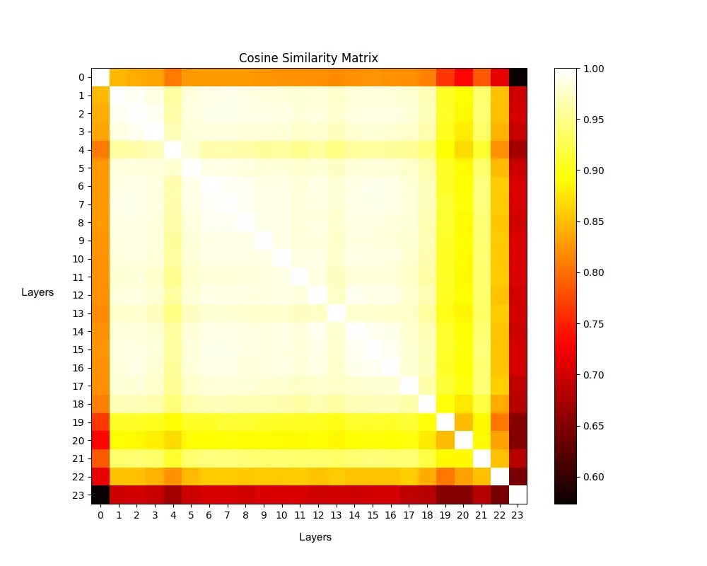
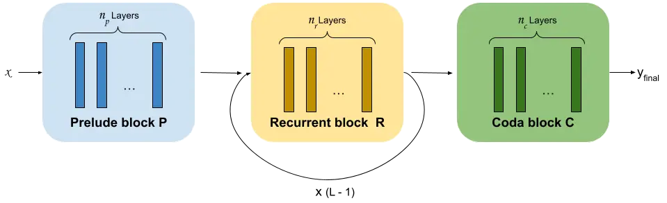
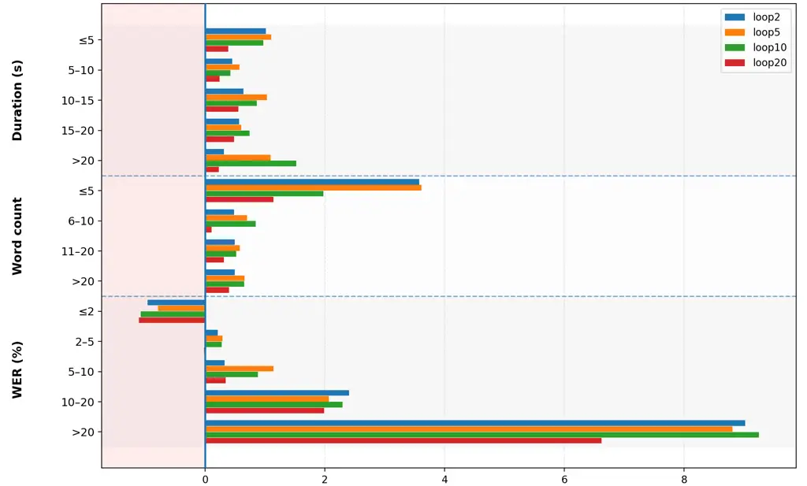

Rolland Carvalho Abad

# Rethinking Depth: A study of the Recursive-Transformer for Speech Recognition

Thomas    Carlos    Alberto

###### Abstract

Transformer-based architectures have led to significant improvements in
Automatic Speech Recognition (ASR), often at the cost of substantially
increased model sizes. A promising approach to address this issue is
layer sharing through depth recursion, commonly referred to as the
Recursive-Transformer, which involves repeatedly applying the same
layers within the model. Despite its potential shown in other fields,
this technique remains relatively unexplored in ASR. In this paper, we
present an experimental study of the Recursive-Transformer applied to
ASR encoder architectures. We systematically investigate the impact of
recursion depth and layer allocation within the Recursive-based
Transformer. Our results demonstrate that the Recursive-Transformer is a
viable alternative, especially when recurrence is applied in the latent
space with a restricted number of loops, obtaining comparable
performance while reducing the parameter count by 66%.

###### keywords

Parameter-efficient, Latent-Recursive-Transformer,
Recursive-Transformer, ASR, Layer-Sharing

^(†)^(†)address: ¹ INESC-ID, Portugal  
² Instituto Superior Técnico, Portugal ^(†)^(†)email:
thomas.rolland@inesc-id.pt, carlos.carvalho@inesc-id.pt,
alberto.abad@inesc-id.pt

## 1 Introduction

Recent Automatic Speech Recognition (ASR) advances are driven by scaling
model size and datasets, with state-of-the-art systems now containing
configurations that exceed one billion parameters and can be trained on
millions of hours of speech data \[1, 2, 3\]. As both model size and
training data have continued to scale, performance improvements have
followed accordingly. To formalise these empirical observations,
researchers have introduced scaling laws \[4, 3\]. These laws suggest
that the performance of Transformer-based models \[5\] at scale can be
predicted on the basis of three variables: model size, data size, and
computational budget. Importantly, the computational budget is often
directly tied to the number of model parameters, as larger models
require proportionally more computation.

While increasing these three variables typically leads to enhanced
performance, constraining any of these dimensions can produce the
opposite effect. This limitation poses a significant challenge for
on-device applications, where models are restricted by strict memory and
storage constraints \[6\]. Additionally, several studies have identified
model size, or the number of parameters, as the primary bottleneck,
often more restrictive than the amount of data or computational budget
\[7, 8\].

To mitigate these challenges, model compression techniques have been
developed \[9\], including knowledge distillation \[10\], pruning
\[11\], and quantization \[12\]. Typically, model compression involves
transferring knowledge from a large pre-trained model to a more compact
version. However, two notable limitations remain. First, such techniques
often rely on the existence of a large pre-trained model. Second,
reducing the number of parameters inherently reduces the computational
budget. While this reduction can be advantageous for time-constrained
tasks, it simultaneously diminishes two of the three factors in scaling
laws. This trade-off is particularly undesirable in high-accuracy
regimes where maximizing recognition performance is more critical than
minimizing inference latency \[13\].

An alternative direction is offered by parameter-sharing methods, which
aim to reduce model size while maintaining computational budget, without
the need for a large pre-trained model \[14, 15\]. These approaches
involve reusing parameters across multiple components of the
architecture. This sharing may be applied at different granularities:
weights of specific sub-modules across all layers of the Transformer
\[16, 17\], entire layers individually \[18, 19, 20\], or groups of
layers collectively \[21, 22, 23\], thereby introducing a recursive
looping mechanism over the shared layers or groups.

Although these strategies are variously termed Universal-Transformers
\[18\], Recursive-Transformers \[24, 25\], or Looped-Transformers \[26\]
within the Natural Language Processing (NLP) literature, this study
adopts the term Recursive-Transformer for consistency.
Recursive-Transformers have recently gained more attention within the
NLP field \[16, 27, 23\], particularly in the context of decoder-only
large language models (LLMs). In contrast, their application to ASR
remains limited \[21, 22, 28, 29, 20\], especially with regard to the
encoder \[30\]. To address this gap, we investigate both the standard
Recursive-Transformer \[18\] and a recent variant, the
Latent-Recursive-Transformer \[31\], in the context of ASR encoders.
Particularly, this work systematically investigates the impact of
recursion depth and layer allocation within the Recursive-based
Transformer to identify the optimal balance between parameter efficiency
and recognition accuracy. Our primary contributions are as follows:

- •
  We provide the first reported layer-similarity analysis of a
  large-scale ASR encoder, identifying redundant middle layers that
  justify the use of recurrence.
- •
  We introduce the Latent-Recursive-Transformer for ASR, which uses a
  modular Prelude-Recurrent-Coda structure \[31\].
- •
  We demonstrate a 66% parameter reduction while maintaining comparable
  performance to standard Transformers, even surpassing them in
  parameter-matched settings.
- •
  We identify a critical trade-off in recurrence depth and evaluate how
  the number of loops interacts with various data characteristics.
- •
  We confirm the robustness of the Latent-Recursive approach across
  diverse languages and architecture variants.

## 2 Related work

The Universal Transformer \[18\] was the first work to introduce
recurrence in Transformer-based architectures \[5\] by iteratively
applying a single layer to refine representations, effectively
decoupling computational depth from the number of parameters. While
recurrence is an established concept, it has seen a resurgence in recent
literature following discoveries that these architectures exhibit
enhanced reasoning capabilities in LLMs \[31\]. Specifically,
Recursive-Transformer architectures have demonstrated superior
performance in complex tasks by facilitating direct reasoning within the
latent space \[32, 33\], primarily through iterative depth-wise
computations at the intermediate layers. This shift in perspective is
supported by empirical analyses of representation spaces, which identify
three distinct representation spaces: “initial,” “middle,” and “final”.
In particular, the middle layers are largely interchangeable and
permutable \[34, 35\].

To bridge the expressivity gap in recursive-Transformer models, research
has introduced layer-wise non-shared residual low-rank matrices \[22,
24, 29\] or non-shared components \[28\]. Although recursive
architectures drastically reduce the parameter footprint, they do not
inherently mitigate inference latency. This limitation is addressed
through Adaptive Early Stopping, early-exit or routing mechanisms \[36,
37, 18\], which allow the model to dynamically truncate recursion once a
representation reaches a stability threshold.

Turning to speech, the ASR task represents a highly relevant application
for recursive models, driven by the demand for on-device efficiency.
Despite this potential, only a limited number of works have specifically
targeted this task \[21, 22, 28\]. Notably, the Shared-Conformer and
Shared-Transformer for ASR encoders \[30\] demonstrate that a single
shared encoder layer can achieve substantial parameter reduction while
remaining competitive in WER.

## 3 Latent-Recursive-Transformer for ASR



Figure 1: Cosine similarity matrix of layer-wise outputs from the
Whisper-medium encoder, computed using identical input across all
layers. Each element (i, j) in the matrix represents the cosine
similarity between the outputs of layers i and j.



Figure 2: Diagram of the Latent-Recursive-Transformer architecture. Each
block is composed of several sub-layers. The Prelude block (P) encodes
the inputs into a latent representation. The Recurrent block (R), shared
across multiple steps, iteratively refines this latent representation.
Finally, the Coda block (C) decodes the latent state to produce the
output.

This work is motivated by the observation that prior research in
Recursive-Transformers for ASR selects the number of loops and the
shared layers arbitrarily. We argue that such choices should be guided
by a deeper understanding of the model’s internal dynamics. To this end,
as our work focuses on the ASR encoder, we first analyze the functional
role of each layer within a pre-trained ASR encoder, namely
Whisper-medium \[2\], following the methodology from previous NLP
research \[34\]. As shown in Figure 1, the Whisper-medium encoder
reveals that middle layers yield highly similar representations, while
edge layers produce distinct outputs. While this phenomenon has been
documented in NLP decoders \[34\], to the best of our knowledge, it is
reported here for the first time in the context of ASR encoders. This
confirms that middle layers are largely redundant and can be compressed
into a shared recurrent block.

The Latent-Recursive-Transformer is a variant of the
Recursive-Transformer \[31, 35, 38\] that applies depth recurrence
specifically within the latent space to facilitate latent reasoning
during test-time computations \[31, 39\].

The structure of the Latent-Recursive-Transformer differs from the
regular Recursive-Transformer model as it divides the model into three
functional groups: the Prelude ($`P`$), the core Recurrent block
($`R`$), and the Coda ($`C`$), which correspond to the initial, middle,
and final blocks of layers, respectively. The Prelude block encodes
inputs into a latent representation; the Recurrent block, shared across
multiple steps, iteratively refines this representation; and the Coda
block decodes the latent state to produce the final output. This
architecture, illustrated in Figure 2, can be formally expressed as
follows:

```math
\displaystyle\mathbf{y_{0}}=P(\mathbf{x}) \tag{1}
```

```math
\displaystyle\mathbf{y_{i}}=R(\mathbf{y_{i-1}})\ \ \ \ \ \text{ for }i\in\{1,..,L\} \tag{2}
```

```math
\displaystyle\mathbf{y_{final}}=C(\mathbf{y_{L}}). \tag{3}
```

Here, $`\mathbf{x}`$ and $`\mathbf{y_{final}}\in\mathbb{R}^{t\times d}`$
represent the input and final output of the Latent-Recursive-Transformer
model, where $`t`$ denotes the sequence length, $`d`$ the embedding
dimension, and $`L`$ indicates the number of loops of the recurrent
block. It is important to note that each of the blocks $`P`$, $`R`$, and
$`C`$ comprises $`n_{p}`$, $`n_{r}`$, and $`n_{c}`$ layers,
respectively, with $`n_{p},n_{r},n_{c}\geq 0`$. In particular, when
$`n_{p}=n_{c}=0`$, it signifies the absence of the Prelude and Coda
blocks, resulting in a regular Recursive-Transformer. Additionally,
$`L=1`$ denotes the case in which the data flows through the recurrent
block a single time, corresponding to the non-recursive model.

Despite the formal flexibility of this framework, the empirical impact
of the recursion depth $`L`$ and the specific layer allocation across
functional blocks remains under-explored in the context of ASR encoders.
It is currently unclear how varying the number of loops affects the
model’s performance. Consequently, this work systematically investigates
these dynamics to identify the optimal balance between these aspects.

## 4 Experimental setting

### 4.1 Corpora

Our experiments primarily use the LibriSpeech corpus \[40\], a widely
adopted ASR benchmark comprising roughly 1,000 hours of English
audiobook speech from LibriVox \[41\]. We follow the standard partitions
with 960 hours for training and two test set, test-clean and test-other,
each containing 5 hours. To evaluate the generalisability of this study
across languages, we also employ AISHELL-1 \[42\], a 150-hour Mandarin
corpus of clean read speech recorded in controlled indoor conditions,
with 5 hours for test.

### 4.2 Implementation details

All experiments were conducted using the SpeechBrain toolkit \[43\]. To
isolate the effects of recurrence on the acoustic representation, our
study focuses exclusively on the encoder, with the number of Transformer
layers $`n_{p}+n_{r}+n_{c}`$ ranging from 1 to 24. The decoder is
consistently composed of 24 Transformer layers to maintain a stable
baseline for comparison. Consequently, parameters associated with the
decoder are not included in the parameter counts reported in our
results.

Furthermore, while adaptive early stopping mechanisms could
significantly improve inference efficiency, their inclusion would
introduce a dynamic variable that could confound our analysis of how the
fixed loop count $`L`$ impacts model performance. To ensure a clear and
controlled investigation of the relationship between recursion depth and
recognition accuracy, we chose to keep L constant for each experimental
run. Consequently, dynamic depth strategies were not explored in the
present study and are reserved for future work.

For the decoding process, a Transformer language model was employed,
which had been trained on 10 million words derived from the
transcriptions of the LibriSpeech dataset.

For the AISHELL-1 dataset, we used a smaller Transformer architecture
with dimension $`d`$ of 256, using up to 12 layers for the encoder and 6
for the decoder.

The training of all configurations was conducted over 60 epochs,
employing a learning rate of $`8\times 10^{-3}`$ using a combination of
Connectionist Temporal Classification (CTC) \[44\] and
Sequence-to-Sequence (Seq2Seq) loss functions with respective weights of
0.3 and 0.7.

## 5 Results

### 5.1 Recursive-Transformer configurations

|        |                             |             |                              |                 |
| ------ | --------------------------- | ----------- | ---------------------------- | --------------- |
| Config | $`\{n_{r},L,n_{p},n_{c}\}`$ | WER %       | $`\lVert\text{Param}\lVert`$ | $`\Delta`$ size |
| B      | {24, 1, 0, 0}               | 2.12 (4.76) | 75.6M                        | \-              |
| R1     | {12, 2, 0, 0}               | 2.15 (5.03) | 37.8M                        | -50%            |
| R2     | {6, 4, 0, 0}                | 2.25 (5.23) | 18.9M                        | -75%            |
| R3     | {4, 6, 0, 0}                | 2.32 (5.24) | 12.6M                        | -83%            |
| R4     | {1, 24, 0, 0}               | 2.78 (6.49) | 3.1M                         | -95%            |
| L1     | {4, 5, 2, 2 }               | 2.16 (4.92) | 25.2M                        | -66%            |
| L2     | {1, 20, 2, 2}               | 2.31 (5.30) | 15.7M                        | -79%            |
| L3     | {20, 5, 2, 2}               | 2.03 (4.73) | 75.6M                        | \-              |

Table 1: Evaluation of Recursive-Transformer (R) and
Latent-Recursive-Transformer (L). Configurations in WER % clean (other)
for Librispeech. Besides L3, all configurations use the same amount of
FLOPs.

We evaluate the influence of different Recursive-Transformer
configurations, parameterised by the tuple $`\{n_{r},L,n_{p},n_{c}\}`$.
To ensure fair comparison, all configurations process the same number of
layers, such that $`n_{p}+L\times n_{r}+n_{c}=24`$, unless stated
otherwise.

The baseline configuration (B) consists of 24 unique layers,
corresponding to a single pass through the recurrent block. It achieves
a word error rate (WER) of 2.12% (4.76%), for test-clean and test-other
respectively, with 75.6M parameters.

When $`n_{r}`$ is reduced and $`L`$ increased (configurations R1 and
R2), WER rises slightly to 2.15% (5.03%) and 2.25% (5.23%), while
parameter counts drop to 37.8M and 18.9M, respectively. This indicates
that model size can be reduced by more than half with only marginal
performance degradation. Further reduction (R3) yields a WER of 2.32%
(5.24%) with 12.6M parameters—an 83% reduction relative to the
baseline—while R4, comprising a single layer looped 24 times, records
the highest WER of 2.78% (6.49%) with only 3.1M parameters (a 95%
reduction). These results suggest that extreme recurrence may compromise
representational capacity, though performance remains competitive given
the drastic reduction in parameters.

### 5.2 Latent-Recursive-Transformer configurations

Building on the findings in Section 3, we evaluate the
Latent-Recursive-Transformer by incorporating non-shared layers in the
$`P`$ and $`C`$ blocks, motivated by the distinct representational roles
of the encoder’s edge layers (Figure 1). Specifically, we introduce two
unique layers in each block.

Modified versions of R3 and R4, denoted L1 and L2 respectively, achieve
WERs of 2.16% (4.92%) and 2.31% (5.30%) with parameter counts of 25.2M
and 15.7M, respectively (Table 1). These results demonstrate that
augmenting Recursive-Transformer architectures with latent non-shared
layers consistently improves recognition performance, highlighting the
advantages of the Latent-Recursive design.

We further evaluated a Latent-Recursive configuration (L3, {20,5,2,2})
with the same number of parameters as baseline B, achieving 2.03%
(4.73%) WER, surpassing standard Transformers $`B`$ under
parameter-matched settings.

### 5.3 Influence of the number of recurrence loops

| Config                   | $`\{n_{r},L,n_{p},n_{c}\}`$    | WER % clean (other) |
| ------------------------ | ------------------------------ | ------------------- |
| $`L1_{1}`$               | {4, 1, 2, 2}                   | 2.44 (5.63)         |
| $`L1_{2}`$               | {4, 2, 2, 2}                   | 2.23 (5.12)         |
| $`L1`$                   | {4, 5, 2, 2}                   | 2.16 (4.92)         |
| $`L1_{10}`$              | {4, 10, 2, 2}                  | 2.18 (4.94)         |
| $`L1_{20}`$              | {4, 20, 2, 2}                  | 2.31 (5.30)         |
| $`L1_{1\dots 20}`$       | {4, {1,…,20}, 2, 2}            | 2.22 (5.05)         |
| $`L1_{1\rightarrow 20}`$ | {4, 1$`\rightarrow`$20 , 2, 2} | 2.13 (4.97)         |

Table 2: Impact of the number of recurrence loops in $`L1`$
configuration for Librispeech in WER %.



Figure 3: WER change relative to the baseline model for utterance
duration, transcript length (word-count), and baseline difficulty
(per-utterance baseline WER bins) for test-other. Bars show the mean
improvement
$`\Delta\mathrm{WER}=\mathrm{WER}_{\text{L1}_{1}}-\mathrm{WER}_{L1_{\text{loop}}}`$
for $`L1_{loop}`$ variants. Positive values indicate lower WER than
baseline. The shaded region highlights negative improvement
(degradation).

We examine the impact of the number of recurrence loops $`L`$ in the
Latent-Recursive-Transformer. Table 2 reports results obtained with
varying $`L`$ while keeping the number of unique layers fixed. Note that
the computational budget differs across configurations, as data passes
through different numbers of (potentially repeated) layers. The
$`L1_{1}`$ configuration, corresponding to a single pass through block
$`R`$ (no recurrence), produced the weakest performance, with WERs of
2.44% (test-clean) and 5.63% (test-other), underscoring the importance
of recurrence. Introducing two loops ($`L1_{2}`$) improved performance
to 2.23% and 5.12%, while five loops ($`L1`$) yielded the best results:
2.16% and 4.92%. This highlights the role of recurrence depth in
enhancing representational capacity. However, increasing the number of
loops beyond this degraded performance. For example, $`L1_{10}`$ and
$`L1_{20}`$ resulted in WERs of 2.18% (4.94%) and 2.31% (5.30%),
respectively. These findings suggest that excessive looping may
overcomplicate training and reduce generalisation.

Figure 3 shows that depth recurrence concentrates its gains on difficult
utterances, with the largest average WER reductions for high-error cases
($`\text{WER}_{\text{base}}>20\%`$) and long segments ($`>20s`$),
consistent with improved global consistency when the first-pass
hypothesis is weak. In contrast, low-error bins
($`\text{WER}_{\text{base}}\leq 5\%`$, especially $`\leq 2\%`$) exhibit
little benefit and occasional degradation, suggesting over-correction.
Very short transcripts ($`\leq 5`$ words) are also comparatively
unstable under recurrence, likely because small edits produce large
relative changes.

In summary, the choice of recursion depth is critical: too few or too
many loops both impair performance. These results align with previous
findings on the depth of Transformers \[45\].

### 5.4 Training with a Dynamic Number of Loops

Subsequently, we evaluate using a dynamic number loop $`L`$ during
training. Particularly, we explore two such strategies for the
Latent-Recursive-Transformer. First, the Length Strategy
($`L1_{1\dots 20}`$) assigns each utterance $`n`$ a loop count $`L_{n}`$
proportional to its duration, as longer utterances might need more
iterative refinement, ranging from $`L_{\min}=1`$ to $`L_{\max}=20`$:

```math
L_{n}=\lfloor L_{\min}+\frac{(len(n)-min\_len)(L_{\max}-L_{\min})}{max\_len-min\_len}\rfloor \tag{4}
```

Then, the Schedule Strategy ($`L1_{1\rightarrow 20}`$) gradually
increases $`L`$ during training, starting from 1 and reaching 20, while
using $`L=20`$ for inference:

```math
L=\min\left(1+\left\lfloor\tfrac{\text{current\_epoch}}{3}\right\rfloor,20\right) \tag{5}
```

As shown in Table 2, the Length Strategy failed to improve performance
compared to the fixed-$`L`$ training with 20 loops. In contrast, the
Schedule Strategy achieves the best test-clean performance among all
$`L1`$ variants.

### 5.5 Generalisation across architectures and datasets

|                                                  |                             |              |                              |                 |
| ------------------------------------------------ | --------------------------- | ------------ | ---------------------------- | --------------- |
| Config                                           | $`\{n_{r},L,n_{p},n_{c}\}`$ | Error rate % | $`\lVert\text{Param}\rVert`$ | $`\Delta`$ size |
| AISHELL-1 (CER%) - Transformer                   |                             |              |                              |                 |
| B2                                               | $`\{12,1,0,0\}`$            | 6.43         | 15.7M                        | –               |
| L4                                               | $`\{2,4,2,2\}`$             | 6.50         | 7.8M                         | -50%            |
| LibriSpeech (WER%: clean (other)) — Branchformer |                             |              |                              |                 |
| B3                                               | $`\{24,1,0,0\}`$            | 1.97 (4.86)  | 101.6M                       | –               |
| L5                                               | $`\{4,5,2,2\}`$             | 2.04 (4.62)  | 33.6M                        | -66%            |

Table 3: Extended evaluation: AISHELL-1 (CER %) and LibriSpeech
Branchformer (WER %).

To evaluate the generalisability of this study, we extend experiments to
AISHELL-1 and the Branchformer \[46\] on LibriSpeech (Table 3). On
AISHELL-1, the baseline Transformer (B2) achieves 6.43% character error
rate (CER) with 15.7M parameters, while the Latent-Recursive variant
(L4) maintains comparable accuracy (6.50%) with 50% fewer parameters. On
LibriSpeech, the Branchformer baseline (B3) records 1.97% and 4.86% WER
on test-clean and test-other, respectively, whereas the Latent-Recursive
Branchformer (L5) achieves 2.04% and 4.62% with 66% fewer parameters.
These results demonstrate that the Latent-Recursive approach preserves
competitive performance while substantially reducing model size across
datasets and architecture variants.

## 6 Conclusion and future work

In this work, we investigated Recursive- and
Latent-Recursive-Transformer encoders for ASR, showing that they
preserve performance with substantially fewer parameters and can
outperform standard Transformers under parameter-matched settings,
particularly for the Latent-Recursive architecture. Our experiments
highlight the critical role of recurrence depth. We further demonstrated
that these architectures generalise well across Transformer variants
like Branchformer and datasets. Future work will explore methods for
automatically selecting the optimal number of recurrence loops $`L`$ and
incorporating low-rank adaptations within the shared layers of the
recurrent block $`R`$.

## 7 Acknowledgements

This work was funded/supported by Portuguese national funds through
Fundação para a Ciência e a Tecnologia, I.P. (FCT) under projects
UID/50021/2025 and UID/PRR/50021/2025, and by the Portuguese Recovery
and Resilience Plan and NextGenerationEU European Union funds under
project C644865762-00000008 (Accelerat.AI).

## References

- \[1\] N. R. Koluguri, M. Sekoyan, G. Zelenfroynd, S. Meister, S.
  Ding, S. Kostandian, H. Huang, N. Karpov, J. Balam, V. Lavrukhin, et
  al. (2025) Granary: speech recognition and translation dataset in 25
  european languages. arXiv:2505.13404. Cited by: §1.
- \[2\] A. Radford, J. W. Kim, T. Xu, G. Brockman, C. McLeavey, and I.
  Sutskever (2023) Robust speech recognition via large-scale weak
  supervision. In International conference on machine learning,
  pp. 28492–28518. Cited by: §1, §3.
- \[3\] W. Chen, J. Tian, Y. Peng, B. Yan, C. H. Yang, and S.
  Watanabe (2025) OWLS: scaling laws for multilingual speech recognition
  and translation models. arXiv:2502.10373. Cited by: §1.
- \[4\] J. Kaplan, S. McCandlish, T. J. Henighan, T. B. Brown, B.
  Chess, R. Child, S. Gray, A. Radford, J. Wu, and D. Amodei (2020)
  Scaling laws for neural language models. arXiv:2001.08361
  abs/2001.08361. External Links:
  [Link](https://api.semanticscholar.org/CorpusID:210861095) Cited by:
  §1.
- \[5\] A. Vaswani, N. Shazeer, N. Parmar, J. Uszkoreit, L. Jones, A. N.
  Gomez, Ł. Kaiser, and I. Polosukhin (2017) Attention is all you need.
  Advances in neural information processing systems 30. Cited by: §1,
  §2.
- \[6\] S. Gondi and V. Pratap (2021) Performance and efficiency
  evaluation of asr inference on the edge. Sustainability 13 (22),
  pp. 12392. Cited by: §1.
- \[7\] A. Gholami, Z. Yao, S. Kim, C. Hooper, M. W. Mahoney, and K.
  Keutzer (2024) Ai and memory wall. IEEE Micro 44 (3), pp. 33–39. Cited
  by: §1.
- \[8\] P. Choi, J. Kim, and J. Kwak (2024) Impact of joint heat and
  memory constraints of mobile device in edge-assisted on-device
  artificial intelligence. In Proceedings of the 2nd International
  Workshop on Networked AI Systems, pp. 31–36. Cited by: §1.
- \[9\] Y. Cheng, D. Wang, P. Zhou, and T. Zhang (2017) A survey of
  model compression and acceleration for deep neural networks.
  arXiv:1710.09282. Cited by: §1.
- \[10\] S. Novitasari, T. Fukuda, and G. Kurata (2025) Improving
  End-to-end Mixed-case ASR with Knowledge Distillation and Integration
  of Voice Activity Cues . In Interspeech 2025, pp. 3334–3338. External
  Links: [Document](https://dx.doi.org/10.21437/Interspeech.2025-330),
  ISSN 2958-1796 Cited by: §1.
- \[11\] M. Someki, S. Bharadwaj, A. A. Joshi, C. Lin, J. Tian, J.
  Jung, M. Müller, N. Susanj, J. Liu, and S. Watanabe (2025)
  Context-Driven Dynamic Pruning for Large Speech Foundation Models. In
  Interspeech 2025, pp. 1993–1997. External Links:
  [Document](https://dx.doi.org/10.21437/Interspeech.2025-1193), ISSN
  2958-1796 Cited by: §1.
- \[12\] Z. Li, H. Xu, Z. Jin, L. Meng, T. Wang, H. Wang, Y. Chen, M.
  Cui, S. Hu, and X. Liu (2025) Towards One-bit ASR: Extremely Low-bit
  Conformer Quantization Using Co-training and Stochastic Precision. In
  Interspeech 2025, pp. 1973–1977. External Links:
  [Document](https://dx.doi.org/10.21437/Interspeech.2025-18), ISSN
  2958-1796 Cited by: §1.
- \[13\] K. Alizadeh, S. I. Mirzadeh, D. Belenko, S. Khatamifard, M.
  Cho, C. C. Del Mundo, M. Rastegari, and M. Farajtabar (2024) Llm in a
  flash: efficient large language model inference with limited memory.
  In Proceedings of the 62nd Annual Meeting of the Association for
  Computational Linguistics (Volume 1: Long Papers), pp. 12562–12584.
  Cited by: §1.
- \[14\] H. Pham, M. Guan, B. Zoph, Q. Le, and J. Dean (2018) Efficient
  neural architecture search via parameters sharing. In International
  conference on machine learning, pp. 4095–4104. Cited by: §1.
- \[15\] Z. Lan, M. Chen, S. Goodman, K. Gimpel, P. Sharma, and R.
  Soricut (2019) Albert: a lite bert for self-supervised learning of
  language representations. arXiv:1909.11942. Cited by: §1.
- \[16\] T. Pires, A. Vilarinho Lopes, Y. Assogba, and H.
  Setiawan (2023) One wide feedforward is all you need. In Proceedings
  of the Eighth Conference on Machine Translation, P. Koehn, B.
  Haddow, T. Kocmi, and C. Monz (Eds.), Singapore, pp. 1031–1044.
  External Links: [Link](https://aclanthology.org/2023.wmt-1.98/),
  [Document](https://dx.doi.org/10.18653/v1/2023.wmt-1.98) Cited by: §1,
  §1.
- \[17\] T. Rolland and A. Abad (2024) Shared-Adapters: A Novel
  Transformer-based Parameter Efficient Transfer Learning Approach For
  Children’s Automatic Speech Recognition. In Interspeech 2024,
  pp. 2370–2374. External Links:
  [Document](https://dx.doi.org/10.21437/Interspeech.2024-1105), ISSN
  2958-1796 Cited by: §1.
- \[18\] M. Dehghani, S. Gouws, O. Vinyals, J. Uszkoreit, and L.
  Kaiser (2019) Universal transformers. In ICLR 2019, External Links:
  [Link](https://openreview.net/pdf?id=HyzdRiR9Y7) Cited by: §1, §1, §2,
  §2.
- \[19\] Z. Shen, Z. Liu, and E. Xing (2022) Sliced recursive
  transformer. In Computer Vision – ECCV 2022, S. Avidan, G. Brostow, M.
  Cissé, G. M. Farinella, and T. Hassner (Eds.), Cham, pp. 727–744.
  External Links: ISBN 978-3-031-20053-3 Cited by: §1.
- \[20\] P. Chi, P. Chung, T. Wu, C. Hsieh, Y. Chen, S. Li, and H.
  Lee (2021) Audio albert: a lite bert for self-supervised learning of
  audio representation. In 2021 IEEE Spoken Language Technology Workshop
  (SLT), pp. 344–350. Cited by: §1, §1.
- \[21\] G. Wei, Z. Duan, S. Li, G. Yang, X. Yu, and J. Li (2023) Sim-t:
  simplify the transformer network by multiplexing technique for speech
  recognition. arXiv:2304.04991. Cited by: §1, §1, §2.
- \[22\] Y. Wang and J. Li (2024) ResidualTransformer: residual low-rank
  learning with weight-sharing for transformer layers. Cited by: §1, §1,
  §2, §2.
- \[23\] C. Yu, X. Shu, Y. Wang, Y. Zhang, H. Wu, Y. Wu, R. Long, Z.
  Chen, Y. Xu, W. Su, et al. (2026) SpiralFormer: looped transformers
  can learn hierarchical dependencies via multi-resolution recursion.
  arXiv preprint arXiv:2602.11698. Cited by: §1, §1.
- \[24\] S. Bae, A. Fisch, H. Harutyunyan, Z. Ji, S. Kim, and T.
  Schuster (2025) Relaxed recursive transformers: effective parameter
  sharing with layer-wise lora. In International Conference on Learning
  Representations, Cited by: §1, §2.
- \[25\] R. Xu, Y. Gao, L. Wang, J. Li, W. Chen, Q. Guo, M. Yang, and S.
  Zhang (2026) Looping back to move forward: recursive transformers for
  efficient and flexible large multimodal models. arXiv preprint
  arXiv:2602.09080. Cited by: §1.
- \[26\] Y. Fan, Y. Du, K. Ramchandran, and K. Lee (2025) Looped
  transformers for length generalization. In ICLR 2025, External Links:
  [Link](https://openreview.net/forum?id=2edigk8yoU) Cited by: §1.
- \[27\] F. Xue, Z. Shi, F. Wei, Y. Lou, Y. Liu, and Y. You (2022) Go
  wider instead of deeper. In Proceedings of the AAAI Conference on
  Artificial Intelligence, Vol. 36, pp. 8779–8787. Cited by: §1.
- \[28\] K. Shim, J. Lee, and H. Kim (2024) Leveraging adapter for
  parameter-efficient asr encoder. In Interspeech 2024, pp. 2380–2384.
  External Links:
  [Document](https://dx.doi.org/10.21437/Interspeech.2024-334), ISSN
  2958-1796 Cited by: §1, §2, §2.
- \[29\] H. Tang, Z. Liu, C. Zeng, and X. Li (2024) Beyond universal
  transformer: block reusing with adaptor in transformer for automatic
  speech recognition. In International Symposium on Neural Networks,
  pp. 69–79. Cited by: §1, §2.
- \[30\] T. Rolland and A. Abad (2025) Exploring shared-weight
  mechanisms in transformer and conformer architectures for automatic
  speech recognition. In Proc. Interspeech 2025, pp. 2885–2889. Cited
  by: §1, §2.
- \[31\] J. Geiping, S. M. McLeish, N. Jain, J. Kirchenbauer, S.
  Singh, B. R. Bartoldson, B. Kailkhura, A. Bhatele, and T.
  Goldstein (2025) Scaling up test-time compute with latent reasoning: a
  recurrent depth approach. In ES-FoMo III: 3rd Workshop on Efficient
  Systems for Foundation Models, External Links:
  [Link](https://openreview.net/forum?id=D6o6Bwtq7h) Cited by: 2nd item,
  §1, §2, §3.
- \[32\] R. Zhu, Z. Wang, K. Hua, T. Zhang, Z. Li, H. Que, B. Wei, Z.
  Wen, F. Yin, H. Xing, et al. (2025) Scaling latent reasoning via
  looped language models. arXiv preprint arXiv:2510.25741. Cited by: §2.
- \[33\] N. Saunshi, N. Dikkala, Z. Li, S. Kumar, and S. J. Reddi (2025)
  Reasoning with latent thoughts: on the power of looped transformers.
  In International Conference on Learning Representations, Y. Yue, A.
  Garg, N. Peng, F. Sha, and R. Yu (Eds.), Vol. 2025, pp. 14855–14881.
  External Links:
  [Link](https://proceedings.iclr.cc/paper_files/paper/2025/file/2676109d49d1eb26d6bc584a8f556305-Paper-Conference.pdf)
  Cited by: §2.
- \[34\] Q. Sun, M. Pickett, A. K. Nain, and L. Jones (2024) Transformer
  layers as painters. arXiv:2407.09298. Cited by: §2, §3.
- \[35\] M. Reid, E. Marrese-Taylor, and Y. Matsuo (2021) Subformer:
  exploring weight sharing for parameter efficiency in generative
  transformers. arXiv:2101.00234. Cited by: §2, §3.
- \[36\] A. Graves (2016) Adaptive computation time for recurrent neural
  networks. arXiv preprint arXiv:1603.08983. Cited by: §2.
- \[37\] S. Bae, Y. Kim, R. Bayat, S. Kim, J. Ha, T. Schuster, A.
  Fisch, H. Harutyunyan, Z. Ji, A. Courville, et al. (2025)
  Mixture-of-recursions: learning dynamic recursive depths for adaptive
  token-level computation. arXiv preprint arXiv:2507.10524. Cited by:
  §2.
- \[38\] C. Yu, X. Shu, Y. Wang, Y. Zhang, H. Wu, J. Li, R. Long, Z.
  Chen, Y. Xu, W. Su, et al. (2025) MeSH: memory-as-state-highways for
  recursive transformers. arXiv preprint arXiv:2510.07739. Cited by: §3.
- \[39\] N. Saunshi, N. Dikkala, Z. Li, S. Kumar, and S. J. Reddi (2025)
  Reasoning with latent thoughts: on the power of looped transformers.
  In The Thirteenth International Conference on Learning
  Representations, ICLR 2025, Singapore, April 24-28, 2025, External
  Links: [Link](https://openreview.net/forum?id=din0lGfZFd) Cited by:
  §3.
- \[40\] V. Panayotov, G. Chen, D. Povey, and S. Khudanpur (2015)
  Librispeech: an asr corpus based on public domain audio books. In
  ICASSP, pp. 5206–5210. Cited by: §4.1.
- \[41\] J. Kearns (2014) Librivox: free public domain audiobooks.
  Emerald group publishing limited. Cited by: §4.1.
- \[42\] H. Bu, J. Du, X. Na, B. Wu, and H. Zheng (2017) Aishell-1: an
  open-source mandarin speech corpus and a speech recognition baseline.
  In 2017 20th conference of the oriental chapter of the international
  coordinating committee on speech databases and speech I/O systems and
  assessment (O-COCOSDA), pp. 1–5. Cited by: §4.1.
- \[43\] M. Ravanelli, T. Parcollet, A. Moumen, S. de Langen, C.
  Subakan, P. Plantinga, Y. Wang, P. Mousavi, L. D. Libera, A.
  Ploujnikov, F. Paissan, D. Borra, S. Zaiem, Z. Zhao, S. Zhang, G.
  Karakasidis, S. Yeh, P. Champion, A. Rouhe, R. Braun, F. Mai, J.
  Zuluaga-Gomez, S. M. Mousavi, A. Nautsch, H. Nguyen, X. Liu, S.
  Sagar, J. Duret, S. Mdhaffar, G. Laperrière, M. Rouvier, R. D. Mori,
  and Y. Estève (2024) Open-source conversational ai with speechbrain
  1.0. Journal of Machine Learning Research 25 (333). External Links:
  [Link](http://jmlr.org/papers/v25/24-0991.html) Cited by: §4.2.
- \[44\] A. Graves (2012) Connectionist temporal classification. In
  Supervised sequence labelling with recurrent neural networks,
  pp. 61–93. Cited by: §4.2.
- \[45\] R. Csordás, C. D. Manning, and C. Potts (2025) Do language
  models use their depth efficiently?. arXiv:2505.13898. Cited by: §5.3.
- \[46\] Y. Peng, S. Dalmia, I. Lane, and S. Watanabe (2022)
  Branchformer: parallel mlp-attention architectures to capture local
  and global context for speech recognition and understanding. In
  International Conference on Machine Learning, pp. 17627–17643. Cited
  by: §5.5.
