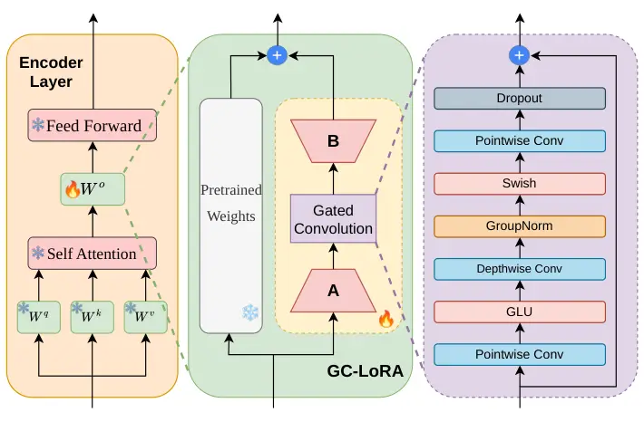
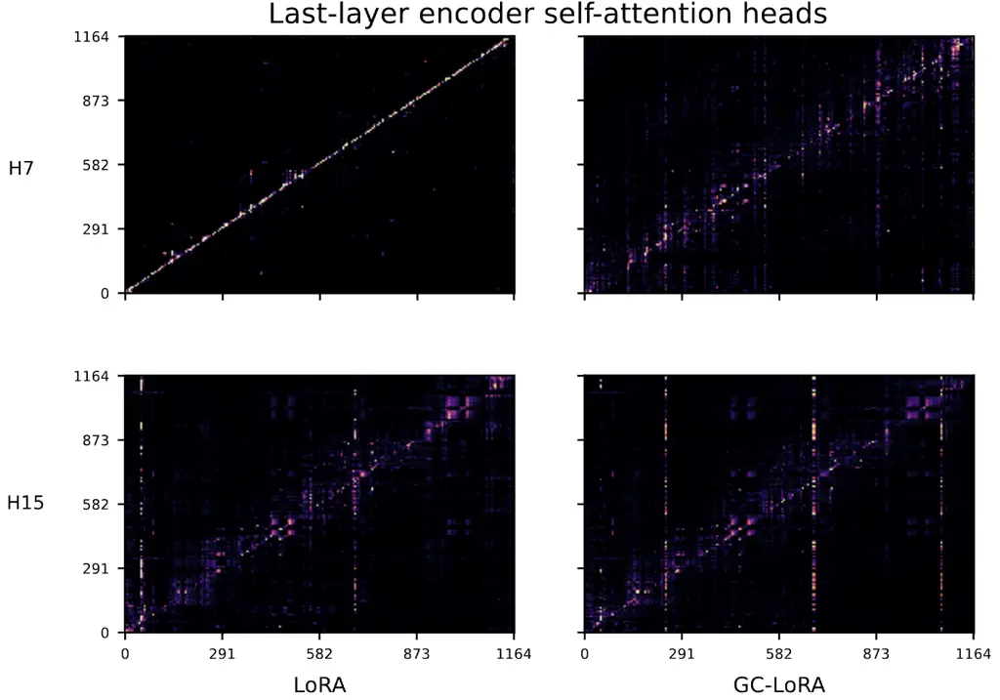

Shankar Wang Zhang Shi Alwan

# GC-LoRA: Gated Convolutional LoRA for Parameter-Efficient Acoustic Adaptation

Natarajan Balaji    Zilai    Kaiyuan    Mohan    Abeer

###### Abstract

Transformer-based Speech Foundation Models excel in most Automatic
Speech Recognition tasks but often suffer performance degradation when
applied to domains with mismatched acoustic characteristics. While
Parameter Efficient Fine-Tuning (PEFT) methods, such as Low-Rank
Adaptation (LoRA), adjust global attention, they lack the local context
modeling crucial for capturing domain-specific variations. We propose
GC-LoRA, a novel adapter architecture that injects Conformer-style local
convolutional processing into pretrained Transformer encoders. By
integrating a lightweight adapter to encoder attention output
projections, our method efficiently captures local acoustic dependencies
without disrupting pretrained global representations. Experiments across
diverse datasets (acoustically-degraded, bandlimited, dialectal, child)
demonstrate the efficacy of our approach, achieving Word Error Rate
(WER) reductions of up to 10.9% compared to baselines while adding
minimal trainable parameters.

###### keywords

Automatic Speech Recognition, Domain Adaptation, Child Speech, Parameter
Efficient Finetuning

^(†)^(†)address: ¹ University of California, Los Angeles, USA
^(†)^(†)email:
{balaji1312,zilaiwang2001,kaiyuanzhang,shimohan}@ucla.edu,
alwan@ee.ucla.edu

## 1 Introduction

Recent advances in Automatic Speech Recognition (ASR) have been driven
by Speech Foundation Models (SFMs) \[1, 2, 3, 4\]. SFMs trained on
massive datasets, such as Whisper \[5\], exhibit strong zero-shot
robustness and establish state-of-the-art performance on standard
benchmarks. However, performance often degrades in target domains that
diverge from pretraining data distributions, where data scarcity and
domain mismatch remain major challenges \[6\]. This vulnerability is
particularly evident when confronting acoustic distribution shifts,
encompassing both environmental degradation and speaker-inherent
variations. For example, environmental factors, including
reverberation \[7\] and telephony bandlimiting \[8\], dialectal and
non-native speech \[9, 10\] affect both fine-grained and utterance-level
acoustic characteristics, and physiological differences in child speech,
such as shorter vocal tracts and higher fundamental frequencies \[11\]
can distort short-time spectral cues. Transformer-based encoders, which
rely on global self-attention, often struggle to resolve localized
acoustic phenomena, motivating adaptation strategies that explicitly
model domain-specific context.

Although Transformer-based SFMs like Whisper are widely deployed,
Conformer-based models \[12\] achieve superior performance \[3\] on
targeted ASR tasks \[13\]. As pretraining data distributions are opaque,
it remains difficult to disentangle whether this gap is driven by the
underlying training data or the inherent architectural superiority of
the Conformer’s local context modeling. Replacing deployed Transformer
models is often impractical, raising the question of whether adaptation
can bridge this architectural divide. Specifically, can a structurally
”smarter” finetuning design imbue a Transformer with Conformer-like
local acoustic properties?

To adapt speech foundation models (SFMs) to novel domains without the
cost of full finetuning, Parameter Efficient Fine-Tuning (PEFT)
methods \[14\], which update only a small subset of parameters while
freezing the backbone, have become popular. PEFT has also shown strong
promise in speech adaptation \[15\], with a key challenge being the
modeling of local acoustic structure in addition to the long-range
dependencies. To introduce locality, prior speech PEFT work has explored
adapter-based designs \[16, 17, 18\], demonstrating the value of local
inductive bias. In parallel, low-rank adaptation methods such as
LoRA \[19\] and its variants have become popular due to their minimal
parameter overhead. LoRA has been applied to speech tasks including
spoken language understanding \[20\], accent-robust ASR \[21\], child
speech ASR \[22, 23, 24\], and multilingual ASR \[25, 26\]. Recent LoRA
variants such as AdaLoRA \[27\] and DoRA \[28\] improve linear low-rank
adaptation through adaptive budget allocation and weight decomposition,
respectively; in contrast, GC-LoRA changes the adapter inductive bias by
adding gated local convolution. Concurrent rank/expert-based LoRA
methods such as FlyLoRA \[29\] and Zipper-LoRA \[30\] address parameter
interference through rank-level or expert-style decoupling, whereas
GC-LoRA focuses on single-task acoustic adaptation. Closest to our work
in ASR, \[31\] adds convolution to projection-based PEFT bottlenecks,
and Conv LoRA \[32, 33\] explores convolutional low-rank updates in
other domains. GC-LoRA differs by inserting a Conformer-style gated
depthwise-separable convolution inside the LoRA bottleneck and targeting
the attention output projection for local acoustic refinement.

This motivates the development of adapters that can inject local context
modeling into frozen Transformer encoders. We thus propose Gated
Convolutional LoRA (GC-LoRA), a structurally informed adapter modeled
after the Conformer block. Different from prior locality aware PEFT for
ASR that adds separate convolutional adapter blocks \[16\], GC-LoRA
places a gated depthwise-separable convolution within the low-rank
bottleneck so locality is learned through the same residual pathway used
by LoRA. Evaluations on diverse, acoustically challenging datasets with
a Whisper backbone demonstrate that GC-LoRA effectively bridges global
Transformer processing and local acoustic modeling.

The main contributions of this work are summarized as:

- •
  We introduce GC-LoRA, a parameter efficient adapter that integrates
  Conformer-style local convolution and gating mechanisms into
  pretrained Transformer encoders.
- •
  We show that GC-LoRA outperforms standard LoRA baselines across
  diverse domains (acoustically-degraded, bandlimited, dialectal,
  child), achieving notable Word Error Rate (WER) reductions with
  minimal computational overhead. ¹¹ 1 Our code and models can be found
  at
  [https://github.com/balaji1312/gc_lora](https://github.com/balaji1312/gc_lora)

## 2 Methodology



Figure 1: GC-LoRA adapter inserted into an encoder layer. Left: Baseline
encoder layer. Middle: GC-LoRA replaces the standard residual low-rank
update of $`W_{o}`$. Right: Gated Convolution block.

We first review the Conformer architecture in Section 2.1 and LoRA in
Section 2.2, then introduce the proposed Gated Convolutional LoRA
(GC-LoRA) in Section 2.3.

### 2.1 The Conformer Block

While standard Transformers rely exclusively on multi-head
self-attention (MHSA) to capture global sequence context, the Conformer
architecture \[12\] demonstrates that the addition of a convolutional
Module after the MHSA block to model local acoustic features
significantly improves ASR performance.

The module processes hidden states through a sequence of gating and
depthwise convolutional operations. For an input sequence representation
$`\mathbf{X}\in\mathbb{R}^{S\times D}`$ (where $`S`$ is the sequence
length and $`D`$ is the embedding dimension), the module first applies a
pointwise ($`1\times 1`$) convolution along the temporal axis for
channel expansion followed by a Gated Linear Unit (GLU) \[34\]. The GLU
acts as a dynamic feature-selection gate for local information.
Following the gating mechanism, a 1D depthwise convolution is applied to
capture temporal context, followed by normalization and a Swish
activation \[35\]. Finally, a second pointwise convolution projects the
features, allowing the locally smoothed features to interact across
channels. This explicit locality bias is largely absent in
Transformer-only models motivating the need to inject these operations
during finetuning.

### 2.2 Low-Rank Adaptation (LoRA)

Among PEFT methods, Low-Rank Adaptation (LoRA) \[19\] has emerged as a
widely used approach for adapting large Transformer models. LoRA freezes
the pretrained weights and injects trainable low-rank matrices into
selected layers, allowing efficient adaptation with minimal parameter
updates. For a pretrained weight matrix
$`\mathbf{W}\in\mathbb{R}^{D\times D}`$, LoRA models the output
$`\mathbf{H}`$ as a low-rank decomposition:

```math
\mathbf{H}=\mathbf{X}(\mathbf{W}+\mathbf{\Delta W})=\mathbf{X}\mathbf{W}+\frac{\alpha}{r}\mathbf{X}\mathbf{A}\mathbf{B}, \tag{1}
```

where $`\mathbf{A}\in\mathbb{R}^{D\times r}`$ and
$`\mathbf{B}\in\mathbb{R}^{r\times D}`$ are trainable matrices and
$`\alpha`$ is a scaling factor. LoRA is typically applied to the query
and value projections of the multi-head self-attention layers \[19\],
enabling efficient recalibration of global attention patterns. However,
its linear formulation lacks mechanisms to explicitly model local
temporal context, motivating the proposed GC-LoRA architecture.

### 2.3 Proposed: Gated Convolutional LoRA (GC-LoRA)

To enable frozen Transformer backbones to model local context without
sacrificing parameter efficiency, we propose Gated Convolutional LoRA
(GC-LoRA), which embeds the Conformer convolutional module inside the
low-rank bottleneck of a parallel adapter. We specifically target the
output projection matrix ($`\mathbf{W}_{o}`$) of the MHSA block to
preserve standard global attention while allowing GC-LoRA to refine the
attended features using local acoustic context, as illustrated in Figure

1. The GC-LoRA block thus acts as a residual path that smooths and
   refines the attended features based on their local acoustic context.

Given the input $`\mathbf{X}`$ to the output projection layer, GC-LoRA
first compresses the features into a low-rank domain using the
down-projection matrix $`\mathbf{A}`$:

```math
\mathbf{H}_{low}=\mathbf{X}\mathbf{A} \tag{2}
```

We apply the Pointwise Convolution expansion and Gated Linear Unit
mechanism entirely within the low-rank space:

```math
\mathbf{H}_{glu}=\text{GLU}(\text{PointConv}(\mathbf{H}_{low})) \tag{3}
```

This gating enables selective modification of local context during
adaptation. Next, we capture the local temporal neighborhood using a
depthwise convolution, followed by Group Normalization \[36\] and a
Swish activation:

```math
\mathbf{H}_{dw}=\text{Swish}(\text{GroupNorm}(\text{DepthConv}(\mathbf{H}_{glu}))) \tag{4}
```

We substitute the standard Batch Normalization with Group Normalization,
normalizing across channels for improved stability during Whisper
finetuning with variable-length speech sequences and masked padding. A
final pointwise convolution mixes the channels, and an internal residual
connection is formed to anchor the learning process:

```math
\mathbf{H}_{res}=\mathbf{H}_{low}+\text{PointConv}(\mathbf{H}_{dw}) \tag{5}
```

Similar to LoRA, the tensor is then projected to the original embedding
dimension using $`\mathbf{B}`$ and added to the output of the frozen
pretrained weights:

```math
\mathbf{Y}=\mathbf{X}\mathbf{W}_{o}+\frac{\alpha}{r}(\mathbf{H}_{res}\mathbf{B}) \tag{6}
```

By isolating the convolution operations inside the $`r`$-dimensional
bottleneck ($`r\ll D`$), GC-LoRA maintains a parameter footprint close
to standard LoRA. We apply GC-LoRA to the attention output projection
$`W_{o}`$: while $`W_{q}`$ and $`W_{v}`$ primarily shape attention
patterns, $`W_{o}`$ receives the attended representation and is
therefore a natural point to refine features with local acoustic context
before the feed-forward layer. For the standard LoRA baseline, we follow
prior work and apply linear LoRA to $`W_{q}`$ and $`W_{v}`$, where it is
most effective \[19\]. To isolate target-layer effects, we also compare
against LoRA applied strictly to $`W_{o}`$ (LoRA-Output).

## 3 Experiments

### 3.1 Datasets

- •
  AMI \[37\]: The AMI Meeting Corpus consists of approximately 100 hours
  of multi-speaker meeting recordings captured with close-talking and
  far-field microphones, exhibiting overlapping speech, background
  noise, and reverberation. We include AMI to evaluate robustness to
  environmental acoustic degradation. We utilize the Kaldi AMI S5 recipe
  to obtain text-normalized transcripts and pre-segmented audio.
  Experiments are conducted on the Individual Headset Microphone (IHM)
  condition using the official train/dev/test splits.
- •
  Switchboard \[38\]: Switchboard-1 Release 2 is a corpus of
  approximately 260 hours of spontaneous conversational telephone speech
  from speakers across the USA. We include Switchboard to evaluate
  adaptation to frequency bandlimiting inherent to narrow-band telephony
  (8 kHz). Audio is upsampled to 16 kHz for compatibility with Whisper.
  Data is segmented into utterance-level recordings and partitioned into
  train/validation/test splits with a 70/10/20 ratio.
- •
  CORAAL \[39\]: CORAAL is a corpus of sociolinguistic interviews
  featuring speakers of African American English (AAE). We include
  CORAAL to evaluate robustness to dialectal variation, as AAE exhibits
  phonological shifts and acoustic differences relative to Mainstream
  American English \[40\]. Following  \[41\], we train on the ATL, DTA,
  LES, DCA, DCB, and PRV regional subsets (137 h), and hold out the ROC
  (13 h) and VLD (12 h) splits for development and testing. During
  preprocessing, recordings are segmented to retain only the
  interviewee’s speech, with segments limited to 30 s.
- •
  MyST \[42\]: MyST is a corpus of conversational child speech from
  students in grades 3–5 interacting with a virtual science tutor. We
  include MyST to evaluate physiological acoustic shifts, as child
  speech exhibits different formants, higher fundamental frequencies,
  and greater articulatory variability than adult speech.
  Following \[43\], we use Whisper-large-v2 transcripts to remove
  utterances with WER $`>50\%`$, fewer than three words, or
  duration $`>30\,\text{s}`$, resulting in 133/21/25 h for
  train/dev/test.

### 3.2 Baselines and Ablations

We compare GC-LoRA against established PEFT methods and structural
ablations:

- •
  Zero-Shot & Full Finetuning: We report the zero-shot and full model
  finetuning (updating all parameters) performance to serve as a
  reference for the frozen and the maximum parameter adaptation capacity
  of the network.
- •
  Standard LoRA \[19\]: Low-Rank Adaptation applied linearly to the
  Query ($`\mathbf{W}_{q}`$) and Value ($`\mathbf{W}_{v}`$) matrices of
  the MHSA blocks. This serves as our primary PEFT baseline.
- •
  LoRA-Output: Low-Rank Adaptation applied linearly to the Output
  ($`\mathbf{W}_{o}`$) matrix of the MHSA blocks for a direct comparison
  with GC-LoRA.
- •
  Adapter \[14\]: Bottleneck residual adapters inserted sequentially
  between the layers of the foundation model.
- •
  Conv-LoRA \[31, 33\]: An ablation of our method where the
  Conformer-style gated depthwise-separable block is replaced by a
  single 1-D convolution inside the low-rank bottleneck. This isolates
  the contribution of GC-LoRA’s gating and depthwise-separable design.
- •
  MultiConv-LoRA: An extension of Conv-LoRA (similar in spirit to
  \[17\]) that employs multiple convolutional filters with varying
  kernel sizes ($`k\in{7,15,23,31}`$).

### 3.3 Experimental Setup

Models are trained using the AdamW optimizer with a learning rate of
$`1\times 10^{-4}`$, a linear decay schedule, a warmup ratio of 10%, a
batch size of 16, and trained for 10 epochs with early stopping based on
validation WER. Low Rank Adapter (LoRA) modules are configured with rank
$`r=8`$ and scaling factor $`\alpha=16`$, and residual adapters use a
bottleneck dimension of 32. GC-LoRA utilizes a kernel size of $`k=31`$.
All experiments are implemented using the Hugging Face Transformers
library \[44\]. Decoding is performed using greedy search, and the
Whisper English text normalizer is applied prior to scoring. Statistical
significance is computed using the NIST SCTK scoring toolkit \[45\],
employing a Matched-Pairs Sentence-Segment Word Error (MAPSSWE) test
($`p<0.05`$). A comparison of different values for rank $`r`$ and kernel
size $`k`$ for GC-LoRA is offered in Section 4.4. All experiments are
conducted on a single NVIDIA RTX A4000 GPU. Inference profiling with
batch size 1 shows negligible overhead relative to LoRA: GC-LoRA has
identical peak VRAM, with latency/MACs increasing only from 57.6
ms/0.59G to 58.9 ms/0.63G.

## 4 Results

| Method         | Params | AMI    | SWBD  | CORAAL | MyST  |
| -------------- | ------ | ------ | ----- | ------ | ----- |
| Zero-shot      | 0      | 16.4   | 17.2  | 17.0   | 13.1  |
| Full FT        | 764M   | 10.8   | 5.7   | 9.8    | 8.9   |
| LoRA \[19\]    | 829k   | 11.7   | 6.6   | 10.1   | 8.9   |
| GC-LoRA (ours) | 447k   | 11.5\* | 6.3\* | 9.9\*  | 8.6\* |

Table 1: Whisper-Medium adaptation results across four evaluation sets.
We report WER on test set for AMI, Switchboard (SWBD), CORAAL and MyST.
“Params” denotes number of parameters updated (Zero-shot updates none;
Full FT updates the entire model). Bold indicates best results and ^(∗)
indicates statistical significance with $`p<0.05`$ among PEFT methods.

| Size     | AMI  |          | SWBD |          | CORAAL |        | MyST |        |
| -------- | ---- | -------- | ---- | -------- | ------ | ------ | ---- | ------ |
|          | L    | GC       | L    | GC       | L      | GC     | L    | GC     |
| tiny     | 27.6 | 24.6^(∗) | 18.8 | 18.1^(∗) | 29.4   | 29.0   | 15.9 | 15.7   |
| base     | 19.3 | 17.8^(∗) | 11.4 | 11.2^(∗) | 20.3   | 20.1   | 12.7 | 12.2\* |
| small    | 14.5 | 13.4^(∗) | 7.5  | 7.4      | 12.7   | 12.3\* | 9.8  | 9.6    |
| medium   | 11.7 | 11.5^(∗) | 6.6  | 6.3^(∗)  | 10.1   | 9.9\*  | 8.9  | 8.6\*  |
| large-v3 | 12.4 | 12.2^(∗) | 7.4  | 7.0^(∗)  | 9.7    | 9.7    | 9.5  | 8.7\*  |

Table 2: Test-set WER (%) comparison of LoRA and GC-LoRA across Whisper
model sizes on AMI, Switchboard (SWBD), CORAAL, and MyST. “L” and “GC”
denote LoRA and GC-LoRA, respectively.

|                  |        |      |      |        |      |
| ---------------- | ------ | ---- | ---- | ------ | ---- |
| Method           | Params | AMI  | SWBD | CORAAL | MyST |
| GC-LoRA (ours)   | 447k   | 11.5 | 6.3  | 9.9    | 8.6  |
| LoRA \[19\]      | 829k   | 11.7 | 6.6  | 10.1   | 8.9  |
| LoRA-Output      | 416k   | 12.0 | 6.8  | 9.9    | 8.7  |
| Adapter \[14\]   | 1.72M  | 11.3 | 6.4  | 10.0   | 8.6  |
| Conv-LoRA \[33\] | 1.75M  | 11.9 | 6.5  | 10.2   | 8.7  |
| MultiConv-LoRA   | 1.77M  | 11.7 | 6.5  | 10.1   | 8.7  |

Table 3: Ablation Studies and Comparisons with other PEFTs. We report
WER on test set for AMI, Switchboard (SWBD), CORAAL and MyST for
Whisper-medium.

### 4.1 Effectiveness of GC-LoRA

To evaluate GC-LoRA across acoustic distribution shifts, we select four
datasets: MyST (child), AMI (acoustically-degraded), CORAAL (dialectal),
and Switchboard (SWBD) (narrowband). Table 1 reports Word Error Rate
(WER) using the Whisper-medium backbone. Across all datasets, GC-LoRA
consistently improves over the zero-shot baseline while updating only
447k parameters. Relative to standard encoder-only LoRA, GC-LoRA
achieves statistically significant improvements ($`p<0.05`$) on all four
test sets (AMI: 11.5 vs. 11.7; CORAAL: 9.9 vs. 10.1; SWBD: 6.3 vs. 6.6,
MyST: 8.6 vs. 8.9) while using $`\sim`$46% fewer trainable parameters
(447k vs. 829k). Full finetuning provides the strongest overall
performance, but at the cost of updating the entire 764M-parameter
model. We note that on some datasets PEFT outperforms full finetuning;
this phenomenon is consistent with prior observations in low-resource
ASR, where high-capacity models overfit to limited training data without
extensive regularization \[46\]. The consistent gains across these
varied domains, with a favorable accuracy–efficiency trade-off,
demonstrate that injecting local context in GC-LoRA helps the
Transformer bridge both environmental and speaker-related acoustic gaps.

### 4.2 Scalability Across Model Sizes

Table 2 compares LoRA (L) and GC-LoRA (GC) across Whisper model sizes.
GC-LoRA yields consistent gains, with statistically significant
improvements ($`p{<}0.05`$) in most settings. The largest relative
improvement is observed on AMI with Whisper-tiny (27.6 to 24.6; 10.9%
relative). We note that on some datasets large-v3 exhibits slightly
higher WER than medium. To keep comparisons controlled across model
sizes, datasets, and PEFT variants, we fixed the adaptation
hyperparameters and did not perform per-size tuning. Such non-monotonic
scaling can arise in limited-data adaptation when higher-capacity models
are more sensitive to fine-tuning hyperparameters and regularization
\[46, 47\]. Overall, GC-LoRA yields consistent gains across model
scales, particularly under acoustic mismatch.

### 4.3 Ablation Studies and Comparisons with other PEFTs

We investigate ablations of different components of GC-LoRA
(Section 3.2) as well as compare it with other PEFT techniques on
Whisper-medium in Table 3. GC-LoRA achieves the best WER on SWBD (6.3)
and ties for the best performance on CORAAL (9.9) and MyST (8.6). While
adapter-based methods attain the strongest AMI result (11.3), GC-LoRA
remains competitive (11.5) and achieves these results with substantially
fewer trainable parameters (447k vs. $`\sim`$1.7M). We also include LoRA
variants LoRA-Output, Conv-LoRA, MultiConv-LoRA as ablations which
replace the depthwise separable convolution. These methods are
competitive but do not consistently outperform GC-LoRA, indicating that
the combination of the $`W_{o}`$ target, gating, and depthwise-separable
local convolution is important for the observed gains.

### 4.4 Impact of Rank and Kernel Size

Figure 2: Impact of rank $`r`$ on MyST test WER for LoRA and GC-LoRA
(Whisper-Medium; kernel size $`k{=}31`$).

In Figure 2, we analyze the effect of rank $`r`$ on MyST test WER
(Whisper-Medium) by varying $`r\in\{4,8,16,32\}`$ for LoRA, and GC-LoRA
with kernel size $`k{=}31`$. GC-LoRA remains stable across ranks and
does not require tuning to achieve strong performance. Separately, we
find GC-LoRA is largely insensitive to kernel size: with rank fixed to
$`r{=}8`$, sweeping $`k\in\{7,15,23,31\}`$ changes WER by at most 0.13
(8.62–8.74), so we use $`k{=}31`$.

### 4.5 Representation Analysis



Figure 3: Attention map analysis of heads $`h=7`$ (top) and $`h=15`$
(bottom) from the final encoder layer for a representative sample from
the CORAAL test set: (a) LoRA and (b) GC-LoRA. The x-axis denotes
encoder key position $`j`$, and the y-axis denotes encoder query
position $`i`$; color intensity indicates the attention weight
$`A_{ij}`$.

Beyond ablations, we probe whether GC-LoRA’s gains are consistent with
altered locality in encoder representations. We analyze the final-layer
encoder self-attention and quantify how far each head attends on average
via the mean attention distance \[48\]:

```math
\bar{d}=\frac{1}{NT}\sum_{h=1}^{N}\sum_{i=1}^{T}\sum_{j=1}^{T}|i-j|A^{(h)}_{ij} \tag{7}
```

where $`T`$ is the encoder sequence length, $`N`$ the number of heads
and $`A^{(h)}\in\mathbb{R}^{T\times T}`$ the row-normalized attention
map from head $`h`$. Fig. 3 visualizes attention maps for two
final-layer heads with diagonal alignment \[49\] for a representative
utterance following prior ASR attention analyses \[50\]. For head
$`h{=}7`$ GC-LoRA produces more diffuse attention pattern along the
diagonal compared to LoRA. In head $`h{=}15`$, GC-LoRA exhibits more
pronounced vertical bands, indicating that certain encoder positions
attract attention from all query positions. To avoid cherry-picking, we
report dataset-level $`\bar{d}`$ averaged over all utterances and heads.
On CORAAL test, GC-LoRA yields a mean attention distance of 217.4
encoder tokens versus 213.8 for LoRA, a shift of 3.6 tokens. With
GC-LoRA’s short-range convolutional residual explicitly capturing local
context in the output path, attention may be less required to focus
strictly on nearby tokens, leading to slightly more diffuse attention
while still improving ASR. This is consistent with observations in prior
works \[51, 52\] where local context is handled by the convolutional
branch and attention models broader dependencies. We emphasize this
analysis is not diagnostic and that attention diffuseness alone does not
guarantee improved recognition, but it supports our hypothesis for
GC-LoRA’s gains in acoustically diverse domains.

## 5 Conclusion

In this work, we introduce GC-LoRA, a structurally informed Parameter
Efficient Fine-Tuning approach designed to mitigate the vulnerability of
Transformer-based Speech Foundation Models to acoustic distribution
shifts. By embedding Conformer-style depthwise-separable convolutions
and gating mechanisms directly into the attention output projections,
GC-LoRA models local context without disrupting pretrained global
representations. Evaluations across acoustic degradation, bandlimited
speech, dialectal variations, and child speech demonstrate that GC-LoRA
consistently outperforms standard LoRA despite requiring fewer trainable
parameters, indicating that targeted local inductive biases are an
efficient pathway to acoustic adaptation. Future work will explore
extending this architecture to self-supervised backbones and acoustic
encoders coupled with large language models.

## 6 Acknowledgements

This research is supported in part by the National Science Foundation
(NSF) and the Institute of Education Sciences (IES), U.S. Department of
Education (DoE), through Grant R305C240046 to the U. at Buffalo. The
opinions expressed are those of the authors and do not represent views
of the IES, DoE, or the NSF.

## 7 Generative AI Use Disclosure

During the preparation of this work, the authors used ChatGPT (GPT-5.2
Thinking) for language editing, including proofreading and improving
clarity and readability of the manuscript. All technical content,
experimental design, results, and conclusions were produced and verified
by the authors. After the use of Generative AI, the authors reviewed and
edited the manuscript and take full responsibility for the content of
the publication. Generative AI tools were not used to produce a
significant portion of the manuscript and are not listed as authors.

## References

- \[1\] S. Chen et al. (2022) Wavlm: large-scale self-supervised
  pre-training for full stack speech processing. IEEE Journal of
  Selected Topics in Signal Processing 16 (6), pp. 1505–1518. Cited by:
  §1.
- \[2\] W.-N. Hsu et al. (2021) Hubert: self-supervised speech
  representation learning by masked prediction of hidden units. IEEE/ACM
  Transactions on Audio, Speech, and Language Processing 29,
  pp. 3451–3460. Cited by: §1.
- \[3\] K. C. Puvvada et al. (2024) Less is more: accurate speech
  recognition & translation without web-scale data. In INTERSPEECH,
  Cited by: §1, §1.
- \[4\] Y. Peng et al. (2024) OWSM v3.1: better and faster open
  whisper-style speech models based on e-branchformer. In INTERSPEECH,
  Cited by: §1.
- \[5\] A. Radford et al. (2023) Robust speech recognition via
  large-scale weak supervision. In Proc. ICML, Cited by: §1.
- \[6\] K. Chang et al. (2024) Self-supervised Speech Representations
  Still Struggle with African American Vernacular English. In
  Interspeech 2024, pp. 4643–4647. External Links:
  [Document](https://dx.doi.org/10.21437/Interspeech.2024-2394), ISSN
  2958-1796 Cited by: §1.
- \[7\] K. Kinoshita et al. (2013) The reverb challenge: a common
  evaluation framework for dereverberation and recognition of
  reverberant speech. In 2013 IEEE Workshop on Applications of Signal
  Processing to Audio and Acoustics, pp. 1–4. Cited by: §1.
- \[8\] Y. He and J. Han (2010) Model synthesis for band-limited speech
  recognition. In Interspeech 2010, pp. 558–561. External Links:
  [Document](https://dx.doi.org/10.21437/Interspeech.2010-222), ISSN
  2958-1796 Cited by: §1.
- \[9\] S. Lanehart et al. (2015) Language use in african american
  communities. Oxford University Press. Cited by: §1.
- \[10\] E. R. Thomas and S. L. Lanehart (2015) Prosodic features of
  african american english. The Oxford handbook of African American
  language, pp. 420–438. Cited by: §1.
- \[11\] S. Lee et al. (1999) Acoustics of children’s speech:
  developmental changes of temporal and spectral parameters. The Journal
  of the Acoustical Society of America 105 (3), pp. 1455–1468. Cited by:
  §1.
- \[12\] A. Gulati et al. (2020) Conformer: Convolution-augmented
  Transformer for Speech Recognition. In Interspeech 2020,
  pp. 5036–5040. External Links:
  [Document](https://dx.doi.org/10.21437/Interspeech.2020-3015), ISSN
  2958-1796 Cited by: §1, §2.1.
- \[13\] V. Srivastav et al. (2023) Open automatic speech recognition
  leaderboard. Hugging Face. Note:
  [https://huggingface.co/spaces/hf-audio/open_asr_leaderboard](https://huggingface.co/spaces/hf-audio/open_asr_leaderboard)
  Cited by: §1.
- \[14\] N. Houlsby et al. (2019) Parameter-efficient transfer learning
  for nlp. International Conference on Machine Learning, pp. 2790–2799.
  Cited by: §1, 4th item, Table 3.
- \[15\] R. Fan and A. Alwan (2022) DRAFT: A Novel Framework to Reduce
  Domain Shifting in Self-supervised Learning and Its Application to
  Children’s ASR. In Interspeech 2022, pp. 4900–4904. External Links:
  [Document](https://dx.doi.org/10.21437/Interspeech.2022-11128), ISSN
  2958-1796 Cited by: §1.
- \[16\] Z. Chen et al. (2023) Chapter: exploiting convolutional neural
  network adapters for self-supervised speech models. 2023 IEEE
  International Conference on Acoustics, Speech, and Signal Processing
  Workshops (ICASSPW), pp. 1–5. Cited by: §1, §1.
- \[17\] Y. E. Kheir et al. (2026) A parameter-efficient multi-scale
  convolutional adapter for synthetic speech detection. 2026 IEEE
  International Conference on Acoustics, Speech, and Signal Processing
  (ICASSP). Cited by: §1, 6th item.
- \[18\] H. Wu et al. (2024) Adapter Learning from Pre-trained Model for
  Robust Spoof Speech Detection. In Interspeech 2024, pp. 2095–2099.
  External Links:
  [Document](https://dx.doi.org/10.21437/Interspeech.2024-253), ISSN
  2958-1796 Cited by: §1.
- \[19\] E. J. Hu et al. (2021) LoRA: low-rank adaptation of large
  language models. International Conference on Learning Representations.
  Cited by: §1, §2.2, §2.2, §2.3, 2nd item, Table 1, Table 3.
- \[20\] P. Wang and H. Van hamme (2022) Bottleneck Low-rank
  Transformers for Low-resource Spoken Language Understanding. In
  Interspeech 2022, pp. 1248–1252. External Links:
  [Document](https://dx.doi.org/10.21437/Interspeech.2022-10801), ISSN
  2958-1796 Cited by: §1.
- \[21\] A. Bhatia et al. (2023) Don’t Stop Self-Supervision: Accent
  Adaptation of Speech Representations via Residual Adapters. In
  Interspeech 2023, pp. 3362–3366. External Links:
  [Document](https://dx.doi.org/10.21437/Interspeech.2023-2192), ISSN
  2958-1796 Cited by: §1.
- \[22\] W. Liu et al. (2024) Sparsely shared lora on whisper for child
  speech recognition. 2024 IEEE International Conference on Acoustics,
  Speech, and Signal Processing (ICASSP). Cited by: §1.
- \[23\] P. Wang et al. (2025) SSVD: structured svd for
  parameter-efficient fine-tuning and benchmarking under domain shift in
  asr. arXiv preprint arXiv:2509.02830. Cited by: §1.
- \[24\] T. Rolland and A. Abad (2024) Exploring adapters with
  conformers for children’s automatic speech recognition. In 2024 IEEE
  International Conference on Acoustics, Speech and Signal Processing
  (ICASSP), pp. 12747–12751. Cited by: §1.
- \[25\] T. Xu et al. (2024) Towards Rehearsal-Free Multilingual ASR: A
  LoRA-based Case Study on Whisper . In Interspeech 2024, pp. 2534–2538.
  External Links:
  [Document](https://dx.doi.org/10.21437/Interspeech.2024-1953), ISSN
  2958-1796 Cited by: §1.
- \[26\] Z. Song et al. (2024) LoRA-Whisper: Parameter-Efficient and
  Extensible Multilingual ASR. In Interspeech 2024, pp. 3934–3938.
  External Links:
  [Document](https://dx.doi.org/10.21437/Interspeech.2024-892), ISSN
  2958-1796 Cited by: §1.
- \[27\] Q. Zhang et al. (2023) Adaptive budget allocation for
  parameter-efficient fine-tuning. In The Eleventh International
  Conference on Learning Representations, Cited by: §1.
- \[28\] S. Liu et al. (2024) Dora: weight-decomposed low-rank
  adaptation. In Forty-first International Conference on Machine
  Learning, Cited by: §1.
- \[29\] H. Zou, Y. Zang, W. Xu, Y. Zhu, and X. Ji (2026) FlyloRA:
  boosting task decoupling and parameter efficiency via implicit
  rank-wise mixture-of-experts. Advances in Neural Information
  Processing Systems 38, pp. 10386–10419. Cited by: §1.
- \[30\] Y. Mei, D. Qiu, S. Liu, J. Liang, and Y. Long (2026)
  Zipper-lora: dynamic parameter decoupling for speech-llm based
  multilingual speech recognition. arXiv preprint arXiv:2603.17558.
  Cited by: §1.
- \[31\] K. Kim, S. Shon, Y. Hsu, P. Sridhar, K. Livescu, and S.
  Watanabe (2024) Convolution-Augmented Parameter-Efficient Fine-Tuning
  for Speech Recognition. In Interspeech 2024, pp. 2830–2834. External
  Links: [Document](https://dx.doi.org/10.21437/Interspeech.2024-2188),
  ISSN 2958-1796 Cited by: §1, 5th item.
- \[32\] Z. Zhong et al. (2024) Convolution meets loRA: parameter
  efficient finetuning for segment anything model. In The Twelfth
  International Conference on Learning Representations, Cited by: §1.
- \[33\] S. Aleem et al. (2024) Convlora and adabn based domain
  adaptation via self-training. In 2024 IEEE International Symposium on
  Biomedical Imaging (ISBI), pp. 1–5. Cited by: §1, 5th item, Table 3.
- \[34\] Y. N. Dauphin et al. (2017) Language modeling with gated
  convolutional networks. In International conference on machine
  learning, pp. 933–941. Cited by: §2.1.
- \[35\] P. Ramachandran et al. (2017) Searching for activation
  functions. arXiv preprint arXiv:1710.05941. Cited by: §2.1.
- \[36\] Y. Wu and K. He (2018) Group normalization. In Proceedings of
  the European conference on computer vision (ECCV), pp. 3–19. Cited by:
  §2.3.
- \[37\] J. Carletta (2005) The ami meeting corpus. In Language
  Resources and Evaluation, Vol. 41, pp. 181–190. External Links:
  [Document](https://dx.doi.org/10.1007/s10579-007-9040-x) Cited by: 1st
  item.
- \[38\] J. J. Godfrey et al. (1992) SWITCHBOARD: telephone speech
  corpus for research and development. In 1992 IEEE International
  Conference on Acoustics, Speech, and Signal Processing (ICASSP), Vol.
  1, pp. 517–520. Cited by: 2nd item.
- \[39\] T. Kendall and C. Farrington (2023) The Corpus of Regional
  African American Language. The Online Resources for African American
  Language Project, Eugene, OR. External Links:
  [Document](https://dx.doi.org/10.7264/1ad5-6t35),
  [Link](https://doi.org/10.7264/1ad5-6t35) Cited by: 3rd item.
- \[40\] A. Johnson et al. (2024) An exploratory study on dialect
  density estimation for children and adult’s african american english.
  The Journal of the Acoustical Society of America 155 (4),
  pp. 2836–2848. External Links:
  [Document](https://dx.doi.org/10.1121/10.0025771) Cited by: 3rd item.
- \[41\] N. B. Shankar et al. (2026) Compositional domain adaptation for
  automatic speech recognition with headwise selective attention
  merging. Computer Speech & Language, pp. 102012. External Links: ISSN
  0885-2308, [Document](https://dx.doi.org/10.1016/j.csl.2026.102012)
  Cited by: 3rd item.
- \[42\] W. Ward et al. (2011) My science tutor: a conversational
  multimedia virtual tutor for elementary school science. ACM
  Transactions on Speech and Language Processing (TSLP) 7 (4), pp. 1–29.
  Cited by: 4th item.
- \[43\] A. Attia et al. (2024) Kid-whisper: towards bridging the
  performance gap in automatic speech recognition for children vs.
  adults. In Proc. AAAI/ACM Conference on AI, Ethics, and Society, Cited
  by: 4th item.
- \[44\] T. Wolf et al. (2020) Transformers: state-of-the-art natural
  language processing. In Proc. EMNLP: System Demonstrations, Cited by:
  §3.3.
- \[45\] J.G. Fiscus (2007) SCTK: The NIST Scoring Toolkit. National
  Institute of Standards and Technology. Note: \[Software\] Cited by:
  §3.3.
- \[46\] R. Fan et al. (2024) Benchmarking children’s asr with
  supervised and self-supervised speech foundation models. In Proc.
  Interspeech, Cited by: §4.1, §4.2.
- \[47\] A. Ying et al. (2025) Benchmarking Training Paradigms, Dataset
  Composition, and Model Scaling for Child ASR in ESPnet. In Workshop on
  Child Computer Interaction - WOCCI 2025, pp. 6–10. External Links:
  [Document](https://dx.doi.org/10.21437/wocci.2025-2) Cited by: §4.2.
- \[48\] J. Vig and Y. Belinkov (2019) Analyzing the structure of
  attention in a transformer language model. In Proceedings of the 2019
  ACL Workshop BlackboxNLP: Analyzing and Interpreting Neural Networks
  for NLP, pp. 63–76. Cited by: §4.5.
- \[49\] S. Yang, A. T. Liu, and H. Lee (2020) Understanding
  Self-Attention of Self-Supervised Audio Transformers. In Interspeech
  2020, pp. 3785–3789. External Links:
  [Document](https://dx.doi.org/10.21437/Interspeech.2020-2231), ISSN
  2958-1796 Cited by: §4.5.
- \[50\] Y. Peng et al. (2022) Branchformer: parallel mlp-attention
  architectures to capture local and global context for speech
  recognition and understanding. In International Conference on Machine
  Learning, pp. 17627–17643. Cited by: §4.5.
- \[51\] K. Shim, J. Choi, and W. Sung (2022) Understanding the role of
  self attention for efficient speech recognition. In International
  Conference on Learning Representations, Cited by: §4.5.
- \[52\] D. Prabhu, Y. Peng, P. Jyothi, and S. Watanabe (2024)
  MULTI-CONVFORMER: Extending Conformer with Multiple Convolution
  Kernels. In Interspeech 2024, pp. 232–236. External Links:
  [Document](https://dx.doi.org/10.21437/Interspeech.2024-2384), ISSN
  2958-1796 Cited by: §4.5.
