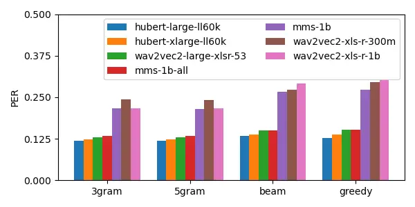
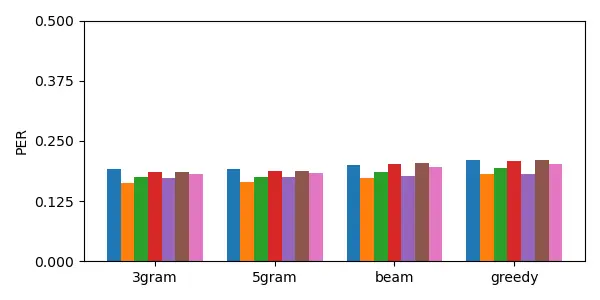
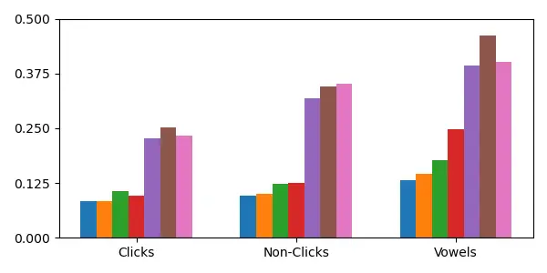
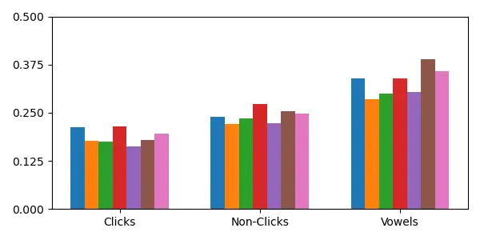
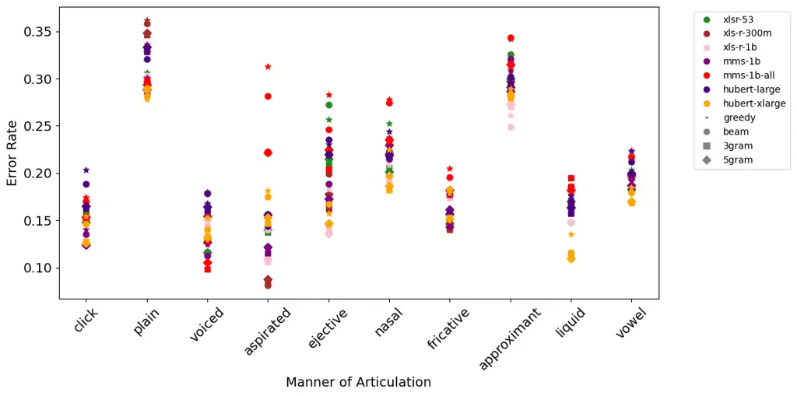

Taguchi Le Ferrand Nakagawa Ono Kato Prud’hommeaux Chiang

# Pretrained self-supervised speech models can recognize unseen consonants

Chihiro    Éric    Hirosi    Hitomi    Kanji    Emily    David

###### Abstract

Modern pretrained self-supervised automatic speech recognition models
are trained on large-scale audio data to encode speech into
contextualized representations. However, their training data are heavily
skewed toward high-resource languages with little data from low-resource
languages, raising concerns about the potential underrepresentation of
typologically uncommon speech sounds such as click consonants primarily
found in Khoisan languages. This leads to our central research question:
Can these models recognize click consonants as accurately as other
speech sounds? To address this question, we fine-tune and compare
pretrained self-supervised speech models (Wav2Vec2 and HuBERT) on data
from two click-rich Khoisan languages (G\textpipeui and West
\textipa!Xoon). Our results reveal that the fine-tuned models
consistently recognize clicks more accurately than non-clicks,
suggesting that self-supervision enables generalization across human
speech sounds including rare phonemes.

###### keywords

speech recognition, under-resourced languages, phonetics, phonology

^(†)^(†)address: ¹ University of Notre Dame, USA ² University at
Buffalo, USA ³ Tokyo University of Foreign Studies, Japan ⁴ Reitaku
University, Japan ⁵ Independent researcher ⁶ Boston College, USA
^(†)^(†)email: ctaguchi@nd.edu, ericlefe@buffalo.edu,
nhirosi@tufs.ac.jp, ono@reitaku-u.ac.jp, jiateng.ganzhi@gmail.com,
prudhome@bc.edu, dchiang@nd.edu

## 1 Introduction

In recent years, automatic speech recognition (ASR) has made remarkable
progress in expanding multilingual capabilities and improving
adaptability to under-resourced languages. Large-scale pretrained
self-supervised speech models have substantially improved performance
across many languages by learning general acoustic representations from
massive amounts of unlabeled multilingual audio. Models based on
self-supervised objectives have become the foundation of many
state-of-the-art ASR systems, demonstrating strong transfer
capabilities, especially when fine-tuned on limited labeled data.

Despite these advances, the benefits of modern ASR systems remain
unevenly distributed. The multilingual corpora used to pretrain
contemporary self-supervised models are typically dominated by
high-resource languages, particularly English and other widely spoken
languages. In contrast, most under-resourced languages are minimally
represented or entirely absent from pretraining data. This imbalance
raises concerns about whether pretrained models adequately capture the
full diversity of human speech, especially typologically uncommon
phonetic phenomena.

One particularly striking case involves click consonants, which are
found primarily in Khoisan languages and in some neighboring Bantu
languages in Southern Africa. Click consonants exhibit articulatory and
acoustic properties that are rare in the world’s languages and are
virtually absent from high-resource languages that dominate ASR
pretraining datasets. Phoible \[1\] reports only 12 languages to have
the most crosslinguistically attested click consonant \[k\textpipe\]
(tenuis dental click), of which only Zulu, Xhosa, and Northern Ndebele
have been integrated in pretraining of the major ASR models (cf.
Table 3). As a result, it remains unclear whether self-supervised
multilingual speech models trained predominantly on non-click languages
can robustly represent and recognize these sounds.

Languages with click consonants have been neglected in technology so
much that the clicks are sometimes suppressed as “noises” in
video-conferencing tools with noise reduction (Hirosi Nakagawa, personal
communication, 2025). If speech technologies are to truly support
speaking together across linguistic communities, they must function not
only for globally dominant languages but also for languages with
distinctive phonological systems. Understanding how modern ASR systems
handle typologically rare sounds is therefore both a technical and a
social imperative.

In this work, we investigate whether pretrained self-supervised
multilingual speech models can accurately recognize click consonants. We
fine-tune several widely used self-supervised architectures on data from
G\textpipeui and West \textipa!Xoon (West Taa), Khoisan languages with
exceptionally rich inventories of click consonants. We then compare
recognition performance between click and non-click phonemes to assess
whether typologically uncommon sounds are disadvantaged in these models.

The contributions of this study are as follows:¹¹ 1 Part of the
datasets, the trained models, and the code used in the experiments will
be publicly available.

- •
  Dataset construction for a click-rich Khoisan languages. We construct
  ASR datasets for the G\textpipeui and West \textipa!Xoon languages.
- •
  Systematic evaluation of click recognition in self-supervised ASR. We
  fine-tune multiple pretrained multilingual self-supervised ASR models
  and compare recognition performance between click and non-click
  phonemes as well as their overall performance.
- •
  Empirical evidence of robust generalization to typologically rare
  sounds. We find that fine-tuned models consistently recognize click
  consonants more accurately than non-click phonemes, suggesting that
  self-supervised pretraining supports generalization beyond dominant
  language distributions.

## 2 Related Work

The introduction of Transformer \[2\] has enabled end-to-end training of
ASR models, with scalability to a large amount of training data and to
multilingual tasks. Roughly speaking, there are currently two
architectural approaches to multilingual ASR: (1) encoder-only
self-supervised training followed by language-specific fine-tuning and
(2) encoder-decoder supervised training whose objective is to
_translate_ speech into a sequence of tokens.

The representative of the former type of architecture is Wav2Vec 2.0
\[3\]. The pretraining is similar to that of BERT \[4\]. The data
consists only of unlabelled audio, and some frames are masked and
quantized to discrete units that represent an abstract speech category
in the learnable matrix (codebook). For each frame, the chosen category
is represented as a vector (codevector), and the objective of the
training is to predict contextualized vectors through Transformer blocks
such that it minimizes contrastive loss between the predicted vectors
and codevectors while encoraging the model to use a diverse set of
codevectors. The pretrained model can be fine-tuned to solve an ASR task
by stacking a Connectionist Temporal Classification (CTC) \[5\] layer to
predict a symbol per frame and obtain the final string by collapsing the
consecutive duplicate symbols. Since its debut, several offshoot models
of Wav2Vec 2.0 have been released with a growing number of languages and
increasing quantities of speech data \[6, 7, 8, 9, 10\]. Another similar
architecture of this type is HuBERT \[11\], in which the self-supervised
objective is similar but creates the discrete pseudolabels (i.e.
abstract categories) of the masked frames by means of $`k`$-means
clustering on the Mel-Frequency Cepstral Coefficients of the input
audio. A successful instance of the latter type is Whisper \[12\] whose
training schema is similar to that of machine translation which aims to
minimize the token-level cross-entropy loss. The audio input is
represented as vectors through the encoder, which is then fed into the
decoder through cross-attention to predict text tokens
auto-regressively.

The self-supervised speech models have been reported to have learned
universal speech representation \[13\] and to encode language-agnostic
phonetic information \[14\], thereby being robust in adapting to unseen
languages \[15\]. However, while it is generally believed that adding
more languages in pretraining data helps cross-lingual transfer \[16\],
whether these models also show robustness to individual unseen speech
sounds has remained unknown. We aim to provide an answer to this
question through experiments on languages with typologically atypical
consonants—click consonants.

## 3 Data

This section provides a description of the constructed datasets for
G\textpipeui and West \textipa!Xoon as well as their linguistic
background. These two languages both fall into the category of Khoisan
languages famous for click consonants but belong to genealogically
separate language families, Khoe–Kwadi and Tuu, respectively. Table 1
provides a description of the G\textpipeui and West \textipa!Xoon
datasets.

|                  | Train               | Test                | Total               |
| ---------------- | ------------------- | ------------------- | ------------------- |
| \#Samples        | 3691                | 411                 | 4102                |
| Total length (s) | 18616               | 2044                | 20660               |
| Avg. length (s)  | 5.04 ($`\pm`$2.41)  | 4.97 ($`\pm`$2.25)  | 5.04 ($`\pm`$2.39)  |
| Total \#words    | 49058               | 5499                | 49068               |
| Avg. \#words     | 13.29 ($`\pm`$6.85) | 13.38 ($`\pm`$6.72) | 13.30 ($`\pm`$6.84) |

(a) G\textpipeui.

|                  | Train               | Test               | Total               |
| ---------------- | ------------------- | ------------------ | ------------------- |
| \#Samples        | 864                 | 246                | 1110                |
| Total length (s) | 5006                | 1410               | 6416                |
| Avg. length (s)  | 5.79 ($`\pm`$2.99)  | 5.73 ($`\pm`$2.70) | 5.78 ($`\pm`$2.93)  |
| Total \#words    | 9073                | 2507               | 11580               |
| Avg. \#words     | 10.26 ($`\pm`$5.43) | 9.97 ($`\pm`$4.61) | 10.20 ($`\pm`$5.26) |

(b) West \textipa!Xoon.

Table 1: Dataset description. A _word_ is a unit segmented by
whitespace.

G\textpipeui (ISO 639-3: gwj) is a Kalahari Khoe language spoken in
Botswana. Until the late 1990s, G\textpipeui speakers lived primarily
within what is now the Central Kalahari Game Reserve (CKGR). A
large-scale survey conducted between 1996 and 1998 identified 769
speakers \[17\]. No comprehensive census has since been carried out, and
current estimates suggest fewer than 1,000 fluent speakers. G\textpipeui
forms a close dialect cluster with G\textdoublepipeana and is internally
divided into three principal dialects (Xade, Tomelo, and Kute),
distinguished primarily by consonantal features. The phonological system
of G\textpipeui exhibits the largest phoneme inventory reported within
the Khoe–Kwadi family \[18\]. The consonant system comprises
approximately 90 phonemes, including 52 click consonants and 38
non-click consonants. Four click types are distinguished: dental
\[\textpipe\], alveolar \[\textipa!\], palatal \[\textdoublebarpipe\],
and lateral \[\textdoublepipe\]. These combine with 13 click series
(also referred to as accompaniment or efflux categories). The series
distinction is independent of click type and is defined by laryngeal
articulations (voicing, aspiration, ejection/glottalization), oro-nasal
processes, and posterior release modifications at the uvular place (see
Table 2). Linguists and the speaker community have been working on
developing an orthography for G\textpipeui \[19\], which serves as the
basis for the orthography used in the G\|ui dataset for this paper.

The G\textpipeui dataset consists of 50 audio recordings collected
outdoors in New Xade (Ghanzi District), Botswana. The recordings are
narratives on G\textpipeui folktales or personal experiences. The
dataset is not currently publicly available due to containing personally
identifiable information and an incomplete agreement with the speech
contributors on public release. The dataset is split into the train set
(90%) and the test set (10%), without a validation set due to its
limited data size.

| Series                      | Dental                                   | Alveolar                                 | Palatal                                                    | Lateral                                              |
| --------------------------- | ---------------------------------------- | ---------------------------------------- | ---------------------------------------------------------- | ---------------------------------------------------- |
| 1\. Plain                   | \textpipe ‹\textpipe›                    | \textdoublebarpipe ‹\textdoublebarpipe›  | \textdoublebarpipe ‹\textdoublebarpipe›                    | \textdoublepipe ‹\textdoublepipe›                    |
| 2\. Voiced                  | \textscriptg\textpipe ‹\textpipeg›       | \textscriptg\textipa ! ‹\textipa!g›      | \textscriptg\textdoublebarpipe ‹\textdoublebarpipeg›       | \textscriptg\textdoublepipe ‹\textdoublepipeg›       |
| 3\. Aspirated               | \textpipe\textipa\super h ‹\textpipeh›   | \textipa \!\textipa\superh ‹\textipa!h›  | \textdoublebarpipe\textipa\super h ‹\textdoublebarpipeh›   | \textdoublepipe\textipa\super h ‹\textdoublepipeh›   |
| 4\. Ejective                | \textpipe ’  ‹\textpipek’›               | \textipa !’  ‹\textipa!k’›               | \textdoublebarpipe ’  ‹\textdoublebarpipek’›               | \textdoublepipe ’  ‹\textdoublepipek’›               |
| 5\. Nasal                   | \textipa N\textpipe ‹\textpipen›         | \textipa N\textipa! ‹\textipa!n›         | \textipa N\textdoublebarpipe ‹\textdoublebarpipen›         | \textipa N\textdoublepipe ‹\textdoublepipen›         |
| 6\. Plain+\textchi          | \textpipe\textchi ‹\textpipex›           | \textipa \!\textchi ‹\textipa!x›         | \textdoublebarpipe\textchi ‹\textdoublebarpipex›           | \textdoublepipe\textchi ‹\textdoublepipex›           |
| 7\. Plain+q\textchi’        | \textpipe q\textchi’  ‹\textpipex’›      | \textipa !q\textchi’  ‹\textipa!x’›      | \textdoublebarpipe q\textchi’  ‹\textdoublebarpipex’›      | \textdoublepipe q\textchi’  ‹\textdoublepipex’›      |
| 8\. Plain+q                 | \textpipe q  ‹\textpipeq›                | \textipa !q  ‹\textipa!q›                | \textdoublebarpipe q  ‹\textdoublebarpipeq›                | \textdoublepipe q  ‹\textdoublepipeq›                |
| 9\. Plain+\textscg          | \textpipe\textscg ‹\textpipeqg›          | \textipa \!\textscg ‹\textipa!qg›        | \textdoublebarpipe\textscg ‹\textdoublebarpipeqg›          | \textdoublepipe\textscg ‹\textdoublepipeqg›          |
| 10\. Plain+q\textipa\superh | \textpipe q\textipa\superh ‹\textpipeqh› | \textipa !q\textipa\superh ‹\textipa!qh› | \textdoublebarpipe q\textipa\superh ‹\textdoublebarpipeqh› | \textdoublepipe q\textipa\superh ‹\textdoublepipeqh› |
| 11\. Plain+q’               | \textpipe q’  ‹\textpipeq’›              | \textipa !q’  ‹\textipa!q’›              | \textdoublebarpipe q’  ‹\textdoublebarpipeq’›              | \textdoublepipe q’  ‹\textdoublepipeq’›              |
| 12\. Plain+\textipaP        | \textpipe\textipa P  ‹\textpipe’›        | \textipa !P  ‹\textipa!’›                | \textdoublebarpipe\textipa P  ‹\textdoublebarpipe’›        | \textdoublepipe\textipa P  ‹\textdoublepipe’›        |
| 13\. Plain+h                | \textpipe h  ‹\textpipenh›               | \textipa !h  ‹\textipa!nh›               | \textdoublebarpipe h  ‹\textdoublebarpipenh›               | \textdoublepipe h  ‹\textdoublepipenh›               |

Table 2: G\textpipeui click consonants. For each cell, the symbols to
the left show a phonetic value, and the bracketed symbols are
orthographic notations used in the dataset.

West \textipa!Xoon (ISO 639-3: nmn) is a Tuu language spoken in Botswana
and Namibia. West \textipa!Xoon is the most widely used dialect of Taa
that has around 3,000 speakers and is spoken in the region near Corridor
13 and Aminuis of Namibia \[20\]. In addition to the four click types
found in G\textpipeui, a bilabial click \[\textbullseye\] is
distinguished in West \textipa!Xoon. Together with the accompaniments,
the phonological inventory of West \textipa!Xoon has 43 click
consonants, making it the most consonant-rich language in the Tuu
language family. The West \textipa!Xoon orthography is given in detail
in Naumann (2016) \[20\].

For West \textipa!Xoon, 150 minutes of elicited speech collected by
scholars from the DoBeS program²² 2 https://dobes.mpi.nl is used in the
experiments. The collection has been curated in a semi-automatic way,
where speech–transcription matching has been assessed using the methods
by Le Ferrand et al. \[21\]; then, mismatches are discarded, and shallow
misalignment is manually corrected. The dataset comprises approximately
1.75 hours of recording, which are then split into the train set (80%)
and the test set (20%)

Both G\textpipeui and West \textipa!Xoon are tonal languages.
G\textpipeui has three level tones (High, Mid, Low) assigned to each
mora, and West \textipa!Xoon distinguishes two level tones (High and
Low). In bimoraic roots, these level tones are combined to form a tonal
melodies. However, since the datasets contained both tone-aware
transcription with diacritics and transcription without tones, the tone
symbols (the grave accent U+0300, the acute accent U+0301, the macron
U+0304) are removed. Then, the text is lowercased and non-phonemic
symbols such as parentheses are removed.

## 4 Experiments

Using the constructed datasets, we fine-tune the pretrained
self-supervised models (Wav2Vec 2.0 series and HuBERT) to G\textpipeui
and West \textipa!Xoon and evaluate whether the models can adaptively
learn to recognize the click consonants. ASR models with autoregressive
decoding are not compared here because their click recognition can be
aided by the contextual information. Table 3 shows a list of the models
compared in the experiments, as well as the number of languages included
in their pretraining stage and the pretraining languages that have click
consonants. Note that, while Zulu and Xhosa are included in the
pretraining of multilingual Wav2Vec 2.0-based models, certain click
consonants such as palatal click \[\textdoublebarpipe\] (found in both
G\textpipeui and West \textipa!Xoon) and bilabial click
\[\textbullseye\] (found in West \textipa!Xoon) never appear in these
languages.

| Model                  | Size | \#lang     | Click langs         |
| ---------------------- | ---- | ---------- | ------------------- |
| wav2vec2-large-xlsr-53 | 300M | 53         | zul                 |
| wav2vec2-xls-r-300m    | 300M | 128        | zul                 |
| wav2vec2-xls-r-1b      | 1B   | 128        | zul                 |
| mms-1b                 | 1B   | $`>`$1,400 | zul, xho, nde, etc. |
| mms-1b-all             | 1B   | $`>`$1,400 | zul, xho, nde, etc. |
| hubert-large-ll60k     | 300M | 1          | NA                  |
| hubert-xlarge-ll60k    | 1B   | 1          | NA                  |

Table 3: List of the models compared in the experiments. The column
“Size” refers to each model’s parameter size. “#lang” shows the number
of languages used in the pretraining. “Click langs” lists the languages
with click consonants included in the pretraining data. The ISO 639-3
language codes zul, xho, nde refer to Zulu, Xhosa, and Northern Ndebele,
respectively.

For mms-1b-all, an initialized adapter (language-specific linear
projection layers for each attention block and a vocabulary output
layer) is appended; for other models, an initialized vocabulary output
layer is appended. All the model training employs the same
hyperparameters. For the model configuration, attention dropout, hidden
dropout, feature projection dropout, and layerdrop are set to 0.0, mask
time probability to 0.05, and the CTC loss reduction method takes the
mean over a batch. Each training is run for 10 epochs with a learning
rate of 0.0003 and a batch size of 8, optimized by the AdamW \[22\]. The
first 100 steps are reserved as warm-up steps. The models are trained on
24GB A10 GPUs. Fine-tuning a 300M parameter model takes approximately 70
minutes. We use Character Error Rate (CER) as the validation metric
during training. In addition, we report Phoneme Error Rate (PER) that
treats multigraphs (e.g., ‹kx’›) and complex clicks with an
accompaniment (e.g., ‹\textipa!qg›) as single symbols.

We measure the inference performance with four CTC decoding methods:
greedy decoding, beam search decoding, beam search decoding with a
3-gram language model and with a 5-gram language model. The beam width
is set to 50. The language models are obtained from the same training
corpus using kenlm \[23\]. For all decoding with the language models,
the hyperparameter $`\alpha`$ (language model weight) is set to 0.2 and
$`\beta`$ (length penalty) to 0.0. The integration of CTC with a
language model is implemented using pyctcdecode³³ 3
[https://github.com/kensho-technologies/pyctcdecode](https://github.com/kensho-technologies/pyctcdecode).

## 5 Results

This section demonstrates the comparative performance results across the
various pretrained speech models on the ASR task of G\textpipeui and
West \textipa!Xoon. The reported results are based on the checkpoint
achieving the lowest CER on the evaluation set during training. Figure 1
shows the compared PERs of the models with varying decoding methods in
the two languages. Figure 2 provides error rates with respect to
different phoneme types (clicks, non-clicks, and vowels) across model.
The error rates, including PER, were computed by obtaining the optimal
alignment between the reference and predicted transcriptions using the
Needleman–Wunsch algorithm \[24\].

(a) West \textipa!Xoon

(b) G\textpipeui

Figure 1: PER across models and decoding methods.

(a) West \textipa!Xoon

(b) G\textpipeui

Figure 2: Error rates of (non-)click consonants and vowels.

Model size does not matter. In both G\textpipeui and West \textipa!Xoon,
the larger parameter sizes did not necessarily provide better
transcription performance. wav2vec2-xls-r-300m often outperformed
wav2vec2-xls-r-1b in both languages, and hubert-large-ll60k (300M)
consistently beat hubert-xlarge-ll60k (1B) in West \textipa!Xoon.

Base model parameters need to be updated. For mms-1b-all, we also
fine-tuned it with its base model frozen, where only the adapter
parameters are updated during training. Our experiments revealed that
the model did not perform well in G\textpipeui when the base model
parameters are frozen, with the PER nearly twice as high as the
full-parameter fine-tuning setting.

Massively multilingual models can struggle. In addition, the experiments
showed that pretraining on more languages did not guarantee better
performance. As shown in Figure 1, the models that performed best on the
two languages were HuBERT models, which had been pretrained on
monolingual English Libri-Light \[25\]. Among the Wav2Vec 2.0-based
models, wav2vec2-large-xlsr-53, wav2vec2-xls-r-300m, and mms-1b all
exhibited similar error rates in G\textpipeui, as Figure 1(b) shows. In
West \textipa!Xoon, too, the monolingually pretrained HuBERT models
performed the best overall, and wav2vec2-large-xlsr-53 yielded the best
performance among the Wav2Vec 2.0-based models.

Clicks are recognized more accurately than non-click phonemes. Despite
the complex phonological system of the clicks, Figure 2 shows that
clicks were more accurately recognized than the other consonants and
vowels, and Figure 3 shows in detail that clicks are recognized
relatively better and more stably than the other manners of
articulation. A Wilcoxon signed-rank test comparing error rates of click
consonants and non-click phonemes under greedy decoding shows that click
consonants are recognized with significantly lower error rates ($`W=0`$,
$`p=0.016`$). This observation is in line with the report that the
performance of self-supervised pretrained speech models is robust to
phonological complexity \[26\]. This also suggests that the
self-supervised pretraining methods of Wav2Vec 2.0 and HuBERT enable
recognition of unseen or rarely seen click consonants through
full-parameter fine-tuning. This result is consistent with phonetic
research indicating that click consonants are perceptually more salient
and identifiable than non-click consonants \[27\].

Figure 2 also shows that vowels exhibit relatively higher error rates in
both languages. A preliminary inspection of the vowel errors suggests
that most confusions occur among oral, nasalized, and long vowel
realizations. For example, among all errors involving the phoneme /a/,
21% are recognized as /aa/ and 8% as /an/. Unlike consonantal contrasts,
vowel quality distinctions such as length, nasality, and phonation often
form more gradient acoustic continua, which may make them more difficult
for ASR models to distinguish reliably.

Figure 3: PER by manner of articulation in G\textpipeui.

## 6 Conclusion

This study investigated whether self-supervised pretrained speech models
are able to recognize click consonants using newly constructed ASR
datasets for two Khoisan languages, G\textpipeui and West \textipa!Xoon.
Although click consonants are extremely underrepresented in the
pretraining data of existing self-supervised speech models, these models
did not exhibit particularly low performance on these click-rich
languages. In-depth analyses further revealed that (1) larger models (1B
params) did not necessarily produce more accurate transcriptions than
smaller models (300M params), and (2) models pretrained on a larger
number of languages did not consistently yield better results than those
pretrained on fewer languages, and were sometimes even outperformed by
the monolingually pretrained HuBERT models. Importantly, these models
consistently yielded lower phoneme error rates for click consonants than
for non-click phonemes. This finding suggests that the self-supervised
training paradigm of these speech models exhibits strong adaptability to
speech sounds unseen in the pretraining data.

## 7 Acknowledgments

The material was based on work supported in part by the US National
Science Foundation under Grant Number BCS-2109709 and IIS-2137396 and by
the JSPS KAKENHI Grant Number 22H04929, 22K18249, 23K25318, and
22K00536. We thank Florian Lionnet Alena Witzlack-Makarevich for the
West \textipa!Xoon data. We are also grateful to the reviewers and the
meta-reviewer of Interspeech 2026 for providing constructive feedback.

## 8 Generative AI Use Disclosure

The first author of the paper, whose first language is not English, used
generative AI tools to check grammar and improve the flow of the
writing. Code autocompletion tools were also used for building the
experimental code. All AI-generated content was carefully reviewed by
the author and by native English speakers. The authors take full
responsibility for the content of this paper.

## References

- \[1\] S. Moran and D. McCloy (Eds.) (2019) PHOIBLE 2.0. Max Planck
  Institute for the Science of Human History, Jena. External Links:
  [Link](https://phoible.org/) Cited by: §1.
- \[2\] A. Vaswani, N. Shazeer, N. Parmar, J. Uszkoreit, L. Jones, A. N.
  Gomez, L. Kaiser, and I. Polosukhin (2023) Attention is all you need.
  External Links: 1706.03762, [Link](https://arxiv.org/abs/1706.03762)
  Cited by: §2.
- \[3\] A. Baevski, H. Zhou, A. Mohamed, and M. Auli (2020) Wav2vec 2.0:
  a framework for self-supervised learning of speech representations.
  External Links: 2006.11477, [Link](https://arxiv.org/abs/2006.11477)
  Cited by: §2.
- \[4\] J. Devlin, M. Chang, K. Lee, and K. Toutanova (2019) BERT:
  pre-training of deep bidirectional transformers for language
  understanding. In Proceedings of the 2019 Conference of the North
  American Chapter of the Association for Computational Linguistics:
  Human Language Technologies, Volume 1 (Long and Short Papers), J.
  Burstein, C. Doran, and T. Solorio (Eds.), Minneapolis, Minnesota,
  pp. 4171–4186. External Links:
  [Link](https://aclanthology.org/N19-1423/),
  [Document](https://dx.doi.org/10.18653/v1/N19-1423) Cited by: §2.
- \[5\] A. Graves, S. Fernández, F. Gomez, and J. Schmidhuber (2006)
  Connectionist temporal classification: labelling unsegmented sequence
  data with recurrent neural networks. In Proceedings of the 23rd
  International Conference on Machine Learning, ICML ’06, New York, NY,
  USA, pp. 369–376. External Links: ISBN 1595933832,
  [Link](https://doi.org/10.1145/1143844.1143891),
  [Document](https://dx.doi.org/10.1145/1143844.1143891) Cited by: §2.
- \[6\] A. Conneau, A. Baevski, R. Collobert, A. Mohamed, and M.
  Auli (2020) Unsupervised cross-lingual representation learning for
  speech recognition. External Links: 2006.13979,
  [Link](https://arxiv.org/abs/2006.13979) Cited by: §2.
- \[7\] A. Babu, C. Wang, A. Tjandra, K. Lakhotia, Q. Xu, N. Goyal, K.
  Singh, P. von Platen, Y. Saraf, J. Pino, A. Baevski, A. Conneau,
  and M. Auli (2021) XLS-R: self-supervised cross-lingual speech
  representation learning at scale. External Links: 2111.09296,
  [Link](https://arxiv.org/abs/2111.09296) Cited by: §2.
- \[8\] S. Communication, L. Barrault, Y. Chung, M. C. Meglioli, D.
  Dale, N. Dong, M. Duppenthaler, P. Duquenne, B. Ellis, H. Elsahar, J.
  Haaheim, J. Hoffman, M. Hwang, H. Inaguma, C. Klaiber, I. Kulikov, P.
  Li, D. Licht, J. Maillard, R. Mavlyutov, A. Rakotoarison, K. R.
  Sadagopan, A. Ramakrishnan, T. Tran, G. Wenzek, Y. Yang, E. Ye, I.
  Evtimov, P. Fernandez, C. Gao, P. Hansanti, E. Kalbassi, A. Kallet, A.
  Kozhevnikov, G. M. Gonzalez, R. S. Roman, C. Touret, C. Wong, C.
  Wood, B. Yu, P. Andrews, C. Balioglu, P. Chen, M. R. Costa-jussà, M.
  Elbayad, H. Gong, F. Guzmán, K. Heffernan, S. Jain, J. Kao, A. Lee, X.
  Ma, A. Mourachko, B. Peloquin, J. Pino, S. Popuri, C. Ropers, S.
  Saleem, H. Schwenk, A. Sun, P. Tomasello, C. Wang, J. Wang, S. Wang,
  and M. Williamson (2023) Seamless: multilingual expressive and
  streaming speech translation. External Links: 2312.05187,
  [Link](https://arxiv.org/abs/2312.05187) Cited by: §2.
- \[9\] V. Pratap, A. Tjandra, B. Shi, P. Tomasello, A. Babu, S.
  Kundu, A. Elkahky, Z. Ni, A. Vyas, M. Fazel-Zarandi, A. Baevski, Y.
  Adi, X. Zhang, W. Hsu, A. Conneau, and M. Auli (2023) Scaling speech
  technology to 1,000+ languages. External Links: 2305.13516,
  [Link](https://arxiv.org/abs/2305.13516) Cited by: §2.
- \[10\] O. A. team, G. Keren, A. Kozhevnikov, Y. Meng, C. Ropers, M.
  Setzler, S. Wang, I. Adebara, M. Auli, C. Balioglu, K. Chan, C.
  Cheng, J. Chuang, C. Droof, M. Duppenthaler, P. Duquenne, A. Erben, C.
  Gao, G. M. Gonzalez, K. Lyu, S. Miglani, V. Pratap, K. R.
  Sadagopan, S. Saleem, A. Turkatenko, A. Ventayol-Boada, Z. Yong, Y.
  Chung, J. Maillard, R. Moritz, A. Mourachko, M. Williamson, and S.
  Yates (2025) Omnilingual ASR: open-source multilingual speech
  recognition for 1600+ languages. External Links: 2511.09690,
  [Link](https://arxiv.org/abs/2511.09690) Cited by: §2.
- \[11\] W. Hsu, B. Bolte, Y. H. Tsai, K. Lakhotia, R. Salakhutdinov,
  and A. Mohamed (2021) HuBERT: self-supervised speech representation
  learning by masked prediction of hidden units. External Links:
  2106.07447, [Link](https://arxiv.org/abs/2106.07447) Cited by: §2.
- \[12\] A. Radford, J. W. Kim, T. Xu, G. Brockman, C. McLeavey, and I.
  Sutskever (2022) Robust speech recognition via large-scale weak
  supervision. External Links: 2212.04356,
  [Link](https://arxiv.org/abs/2212.04356) Cited by: §2.
- \[13\] J. Millet and E. Dunbar (2022) Do self-supervised speech models
  develop human-like perception biases?. External Links: 2205.15819,
  [Link](https://arxiv.org/abs/2205.15819) Cited by: §2.
- \[14\] K. Choi, A. Pasad, T. Nakamura, S. Fukayama, K. Livescu, and S.
  Watanabe (2024) Self-Supervised Speech Representations are More
  Phonetic than Semantic. In Interspeech 2024, pp. 4578–4582. External
  Links: [Document](https://dx.doi.org/10.21437/Interspeech.2024-1157),
  ISSN 2958-1796 Cited by: §2.
- \[15\] A. Rouditchenko, S. Khurana, S. Thomas, R. Feris, L.
  Karlinsky, H. Kuehne, D. Harwath, B. Kingsbury, and J. Glass (2023)
  Comparison of multilingual self-supervised and weakly-supervised
  speech pre-training for adaptation to unseen languages. External
  Links: 2305.12606, [Link](https://arxiv.org/abs/2305.12606) Cited by:
  §2.
- \[16\] J. Grosman, C. Almeida, G. Schardong, and H. Lopes (2025) On
  the cross-lingual transferability of pre-trained wav2vec2-based
  models. External Links: 2511.21704,
  [Link](https://arxiv.org/abs/2511.21704) Cited by: §2.
- \[17\] H. Nakagawa (2006) \textpipeGui dialects and
  \textpipeGui-speaking communities before the relocation from the CKGR.
  PULA Botswana Journal of African Studies 20. Cited by: §3.
- \[18\] H. Nakagawa (2006) Aspects of the phonetic and phonological
  structure of the G\textpipeui language. Ph.D. Thesis, University of
  the Witwatersrand. Cited by: §3.
- \[19\] K. Kato (2025) A G\textpipeui and G\textdoublepipeana
  dictionary. External Links: [Link](https://gui-dictionary.netlify.app)
  Cited by: §3.
- \[20\] C. Naumann (2016) The phoneme inventory of Taa (West
  \textipa!Xoon dialect). In Lone Tree – Scholarship in the Service of
  the Koon: Essays in Memory of Anthony T Traill, pp. 311–351. Cited by:
  §3.
- \[21\] É. Le Ferrand, B. Jiang, J. Hartshorne, and E.
  Prud’hommeaux (2025) That doesn’t sound right: evaluating speech
  transcription quality in field linguistics corpora. In Proceedings of
  the 63rd Annual Meeting of the Association for Computational
  Linguistics (Volume 2: Short Papers), pp. 627–635. Cited by: §3.
- \[22\] I. Loshchilov and F. Hutter (2019) Decoupled weight decay
  regularization. External Links: 1711.05101,
  [Link](https://arxiv.org/abs/1711.05101) Cited by: §4.
- \[23\] K. Heafield (2011) KenLM: faster and smaller language model
  queries. In Proceedings of the Sixth Workshop on Statistical Machine
  Translation, C. Callison-Burch, P. Koehn, C. Monz, and O. F. Zaidan
  (Eds.), Edinburgh, Scotland, pp. 187–197. External Links:
  [Link](https://aclanthology.org/W11-2123/) Cited by: §4.
- \[24\] S. B. Needleman and C. D. Wunsch (1970) A general method
  applicable to the search for similarities in the amino acid sequence
  of two proteins. Journal of molecular biology 48 (3), pp. 443–453.
  Cited by: §5.
- \[25\] J. Kahn, M. Riviere, W. Zheng, E. Kharitonov, Q. Xu, P.E.
  Mazare, J. Karadayi, V. Liptchinsky, R. Collobert, C. Fuegen, T.
  Likhomanenko, G. Synnaeve, A. Joulin, A. Mohamed, and E. Dupoux (2020)
  Libri-light: a benchmark for asr with limited or no supervision. In
  ICASSP 2020 - 2020 IEEE International Conference on Acoustics, Speech
  and Signal Processing (ICASSP), pp. 7669–7673. External Links:
  [Link](http://dx.doi.org/10.1109/ICASSP40776.2020.9052942),
  [Document](https://dx.doi.org/10.1109/icassp40776.2020.9052942) Cited
  by: §5.
- \[26\] C. Taguchi and D. Chiang (2024) Language complexity and speech
  recognition accuracy: orthographic complexity hurts, phonological
  complexity doesn’t. In Proceedings of the 62nd Annual Meeting of the
  Association for Computational Linguistics (Volume 1: Long Papers), L.
  Ku, A. Martins, and V. Srikumar (Eds.), Bangkok, Thailand,
  pp. 15493–15503. External Links:
  [Link](https://aclanthology.org/2024.acl-long.827/),
  [Document](https://dx.doi.org/10.18653/v1/2024.acl-long.827) Cited by:
  §5.
- \[27\] P. Ladefoged and A. Traill (1994) Clicks and their
  accompaniments. Journal of Phonetics 22, pp. 33–64. Cited by: §5.
