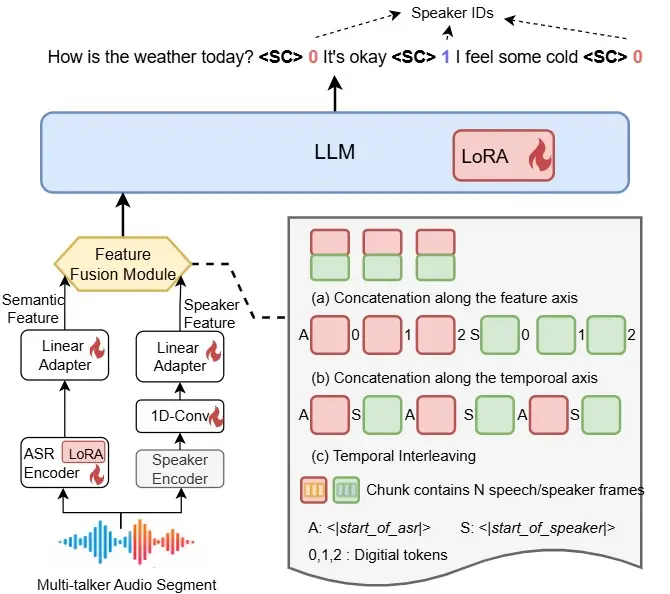
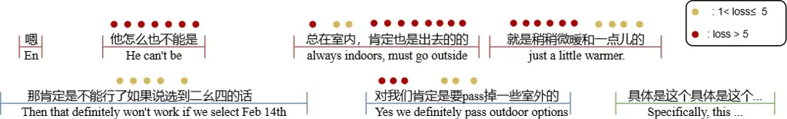
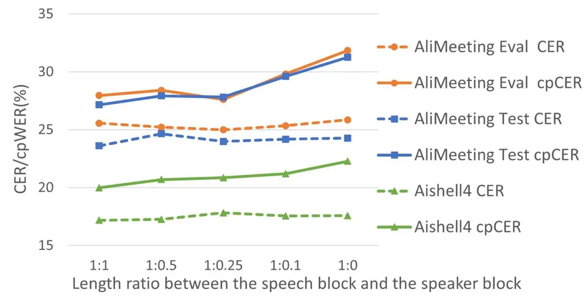

Zheng Lin Tian Li Lin Xiao Tu

# Balancing ASR and diarization in end-to-end LLMs for multi-talker speech recognition

Naijun    Yuke    Sanli    Mengtian    Zhiwei    Longshuai    Dandan

###### Abstract

Multi-talker speech recognition is often addressed by combining
automatic speech recognition (ASR) and speaker diarization in a pipeline
system. Recently, LLM-based approaches have shown promise by jointly
modeling semantic and speaker information, but they typically require
large-scale multi-talker corpora that are costly to annotate. In this
paper, we investigate how to efficiently train an LLM-based system with
limited real-recorded data while maintaining high accuracy in speaker
attribution. We propose several strategies: (1) a dual-encoder
architecture to extract semantic and speaker features, (2) a feature
interleaving format to merge these features as the inputs to the LLM,
(3) a length-aware speaker ID loss to enhance diarization capability,
and (4) an adaptive threshold strategy for ASR loss computation to
mitigate hallucinations caused by speech overlaps. These strategies
balance training between ASR and diarization tasks. Our system
outperforms open-source baseline approaches, achieving relative
improvements of 18% on the AliMeeting corpus and 24% on the Aishell4
corpus.

###### keywords

speech recognition, diarization, large language model, multi-talker,
overlaps, dual-encoder

^(†)^(†)address: ¹ Huawei Technologies, China ^(†)^(†)email:
njzheng.cuhk@gmail.com

## 1 Introduction

Multi-talker speech recognition\[1, 2, 3\] has been widely applied in
scenarios such as meeting recordings, subtitle transcription, and
dialogue understanding, aiming to solve the problem of ”who spoke what.”
Since the task can be split into both automatic speech recognition (ASR)
and speaker identification tasks, it can be solved with the pipeline
systems composed of ASR modules and diarization modules \[4, 5, 6\].
These systems are relatively lightweight in parameters and deliver
robust performance. The final speaker-attributed transcripts can be
obtained from the speaker diarization results and transcripts based on
the aligned time-stamps. However, since the modules are trained
independently, speaker identification is not directly integrated with
the corresponding semantic content of the conversation, especially when
meeting overlaps \[7\]. This limitation has motivated the use of large
language models (LLMs), which can jointly capture speaker roles and
dialogue contextual information simultaneously within the model.

Early work such as DiarizationLM \[8\] leverages LLMs to correct speaker
IDs given multi-talker transcripts, using contextual cues to detect
speaker turns. Some approaches incorporate existing diarization modules
\[9, 10\] to supply speaker-activity information that guides LLM
generation. More recently, several end-to-end approaches \[11, 12, 13\]
have been proposed to directly infer speaker identities and their
corresponding content. SpeakerLM \[14\], trained on over 7,000 hours of
real-meeting data, demonstrates excellent performance compared to
cascaded pipelines. TagSpeech \[12\] and Vibevoice-ASR \[15\] adopt
dual-encoder architectures to provide both semantic information and
acoustic information for speech recognition and speaker identification.

Nevertheless, training LLMs to robustly model speaker IDs in natural
conversations remains challenging, especially in the presence of
interruptions, backchannels, and overlapped speech. These phenomena are
common in multi-talker scenarios but impose high demands on system
robustness, which demands large-scale annotated data for training.

In this paper, we propose an efficient approach to balance ASR and
diarization tasks through both model structure and loss function design,
without relying on large-scale meeting corpus. Our contributions are
summarized as follows: (1) We explore multiple strategies for merging
the outputs of dual encoders and find that an interleaved representation
provides the most effective alignment between speaker-related and
speech-related features. (2) We introduce a segment-aware speaker ID
loss function to improve identification accuracy, which better aligns
with diarization metrics compared to using ASR loss alone. (3) We
analyze the ASR loss behavior and observe that the tokens within the
overlaps are of high-loss and often trigger hallucinations and repeated
outputs. We therefore propose an adaptive loss mask that suppresses
high-loss tokens during training, significantly reducing hallucinations.
With these strategies, our system achieves significant improvements over
strong baselines.

## 2 Proposed Method



Figure 1: Dual-encoder architecture with different feature fusion
strategies.

### 2.1 Dual-encoder structure and feature fusion strategies

Figure 1 illustrates the overall architecture, which consists of two
encoders: an ASR encoder and a speaker-feature encoder. Given an audio
segment containing multiple speakers, the dual encoders extract semantic
features and speaker features, which are then combined in various
formats before being fed into the LLM backend.

We adopt SenseVoice-small \[16\] as the ASR encoder, which is a
CTC-based module. Hidden states from both its final layer and an
intermediate layer are extracted and concatenated along the feature
dimension, which retain both semantic cues and acoustic cues. Then a
lightweight adapter composed of two linear layers with GELU activation
is applied for dimension projection to get the semantic feature
sequences.

For speaker representation, we employ the Campplus module \[17\]. We
modify the original architecture by inserting a chunking operation
before the pooling layer: instead of computing the mean vector and
standard deviation vector over the entire sequence, statistics are
computed within each chunk. The resulting chunk-wised embeddings are
then repeated to match the input sequence length. To balance robustness
and temporal resolution, we use three chunk sizes (400 ms, 200 ms, and
100 ms). Longer chunks yield more stable speaker embeddings, while
shorter chunks provide finer time granularity. The embeddings from all
chunk sizes are concatenated along the feature axis and passed through
projection layers. A 1D convolution layer is used to downsample the
speaker feature sequence to match the length of the semantic feature
sequence. We freeze the parameters of the Speaker encoder during
training. Formally, the feature extraction process is:

```math
\displaystyle X_{asr} \displaystyle=\text{ASRAdapter}(\text{Cat}(\text{ASREncoder}(X))) \tag{1}
```

```math
\displaystyle X_{spk} \displaystyle=\text{SpkAdapter}(Conv\text{1D}(\text{Cat}(\text{SpkEncoder}(X))) \tag{2}
```

Both adapters consist of two linear layers followed by layer
normalization.

After obtaining the semantic sequence and speaker‑feature sequence for
each sample, the key question is how to merge them into a unified
representation as the input for the LLM backend. We explore several
fusion strategies, illustrated in Figure 1.

- •
  Semantic Feature Only: Only the semantic feature sequences from the
  ASR encoder are used as input, serving as a baseline without explicit
  speaker information.
- •
  Feature-wise Concatenation: The semantic and speaker feature sequences
  are concatenated along the feature dimension and then projected to the
  target dimensionality.
- •
  Time-wise Concatenation: Following TagSpeech \[12\], we concatenate
  the speech and speaker feature sequences along the temporal axis. The
  same digital tokens are inserted every 20 frames (1.2 s) into both
  sequences, and each sequence is prefixed with a special token
  \<semantic_start\> or \<speaker_start\>.
- •
  Temporal Interleaving: The two feature sequences are interleaved along
  the temporal axis for each $`N`$ frames, where $`N`$ is set to 20
  denoting 1.2 s. Each chunks is prefixed with \<semantic_start\> or
  \<speaker_start\>. Unlike time-wise concatenation, no digital tokens
  are used, and the alignment relies solely on positional encoding
  between adjacent semantic and speaker chunks.

### 2.2 Training process and loss functions

We adopt a multi-stage training scheme to progressively align the dual
encoders with the LLM.

The system is first trained on the ASR task using only semantic
features. In this stage, the adapter parameters are trainable, and
Low-Rank Adaptation (LoRA) \[18\] is applied to the LLM.

In the second stage, speaker features are introduced, and the system is
trained jointly on ASR and diarization tasks using a two-speaker
conversation corpus. The fusion strategies described in Section 2.1 are
applied. Since speaker change detection can be regarded as an auxiliary
subtask of diarization \[19, 5\], we introduce the special token \<SC\>
into the training labels to explicitly mark speaker transitions. This
design treats \<SC\> as a prompt for the model to infer the subsequent
speaker identity, thus bridging the simpler change-detection task with
the more challenging speaker identification task. The speaker ID is
placed immediately after \<SC\> to indicate the speaker of the preceding
recognized segment. Thus, the labels for multi-talker ASR take the form:

```math
\{\text{text}_{1}\ \texttt{<SC>}\ \text{spk}_{1}\}\quad\{\text{text}_{2}\ \texttt{<SC>}\ \text{spk}_{2}\}, \tag{3}
```

In the third stage, we simulate long conversations by concatenating
several segments during training, where each sample contains up to eight
speakers. Virtual \<SC\> tokens are also inserted within long pauses of
the same speaker, while keeping the speaker ID unchanged. This design
prevents false alarm errors in speaker change detection from directly
causing errors in speaker ID assignment, which makes the model learn
that not every \<SC\> indicates a new speaker. Moreover, we propose a
segment-aware speaker identification loss that better aligns with
diarization metrics such as concatenated minimum-permutation character
error rate (cpCER) \[20\]. As shown in Eq. (4), segment lengths are used
as weights when computing the cross-entropy loss for speaker IDs:

```math
L_{spk}=\frac{1}{\sum_{i=0}^{N-1}L_{i}}\sum_{i=0}^{N-1}L_{i}*\text{CE}(spk_{i}), \tag{4}
```

where $`N`$ is the number of speaker segments in a sample, $`L_{i}`$ is
the token length of the $`i`$-th segment, and
$`\text{CE}(\text{spk}_{i})`$ is the cross-entropy loss for its speaker
ID. By assigning larger weights to longer segments, the training
objective emphasizes accurate speaker identification in extended turns.
The overall training objective is the sum of the ASR loss and the
speaker ID loss.

In the final training stage, the model is fine-tuned on real in-domain
meeting corpora, with LoRA applied to both the ASR encoder and the LLM.
Unlike the simulated training data, real meetings often involve a high
degree of overlapped speech. Such overlaps not only increase the error
rate in ASR but also tend to induce repetition hallucinations in the LLM
during inference. In the following subsection, we investigate the causes
of hallucinations and discuss strategies to mitigate their impact.



Figure 2: CE loss within overlaps, where the tokens in overlapped
regions are of high ASR loss. (Segmented from R003_M0046 in the
Alimeeting training set)

### 2.3 Hallucination in the overlapped speech

When training the LLM with overlapped speech, we observe that the
trained model tends to generate repeated backchannel words (e.g., “en”,
“yes”, “嗯，对”) during inference on overlapped regions. Interestingly,
even after removing backchannels from the training transcripts, the
hallucination phenomenon persists.

We investigate the causes of hallucinations during training. Figure 2
illustrates the ASR loss on a far-field overlapped speech sample in the
final training stage. Tokens within overlapped regions exhibit
significantly higher cross-entropy (CE) loss compared to non-overlapped
tokens. During training, the model may place disproportionate emphasis
on these overlapped tokens while overlooking the relatively easier
non-overlapped ones in backpropagation. Yet, speech signals from distant
speakers in overlapped regions often have very low energy and may be
unintelligible even to human listeners. In such adverse cases, the LLM
can detect the presence of overlaps but cannot reliably infer their
content. Since overlaps frequently contain backchannel words, the model
tends to repeatedly generate these tokens to fill the uncertain regions,
thereby triggering hallucinations.

To address this issue, we propose an adaptive strategy that masks
high-loss tokens. Specifically, the system automatically select easily
recognized tokens for training while discarding overly difficult ones.
The masking threshold is determined by the distribution of CE loss
values within each sample:

```math
T_{mask}=max(Avg(\text{CE}(\text{text})),2.0), \tag{5}
```

where the mean of the loss values is used to compute the threshold, and
$`2.0`$ serves as a lower bound. During training, loss values exceeding
this threshold are masked out. The overall training objective is then
defined as:

```math
L=L_{\text{spk}}+\text{Mask}(L_{\text{asr}},T_{\text{mask}}), \tag{6}
```

where $`\text{Mask}(\cdot)`$ excludes the loss values that exceed the
threshold $`T_{\text{mask}}`$.

## 3 Experiments

In the first training stage, we use the WenetSpeech corpus \[21\]. For
the second and third stages, we adopt an internal ASR corpus of
approximately 4,000 hours, which consists of long-duration two-speaker
conversations with transcriptions but does not contain overlap labels.
Long recordings are truncated into shorter segments (8–20 seconds)
according to the reference transcripts, and training samples are
simulated by concatenating several segments at most 50 seconds. In the
final stage, we finetune the model on real meeting corpora,
AliMeeting \[22\] and Aishell4 \[23\]. Similar to SpeakerLM \[14\], only
the first channel of the far-field signals is used for both training and
evaluation. The long audios are split into segments of at most 50
seconds, ensuring that no overlaps occur at the segment boundaries.
Table 1 summarizes the statistics of the training and test speech
segments in the final stage, where the overlap ratio in AliMeeting is
substantially higher than that in Aishell4. In addition, we apply a data
preprocessing that splits long segments containing pauses into shorter
ones based on punctuation. These shorter segments are then re-aligned
using force-alignment timestamps, which improves label alignment with
the input audio in cases of speaker interruptions.

| Source Corpus    |       | \#Seg. | Avg. Dur. | Avg. \#Spk | Overlap% |
| ---------------- | ----- | ------ | --------- | ---------- | -------- |
| AliMeeting\[22\] | Eval  | 297    | 43.82     | 2.96       | 21.42    |
|                  | Test  | 737    | 44.78     | 2.85       | 18.80    |
| (104.75 hours)   | Train | 6951   | 43.60     | 3.02       | 25.82    |
| Aishell4\[23\]   | Eval  | 973    | 45.67     | 2.29       | 5.00     |
| (107.50 hours)   | Train | 7837   | 45.36     | 2.84       | 7.18     |

Table 1: The statistics of the meeting segments in the last training
stage and evaluation stage.

We initialize our model with pretrained modules: SenseVoice-small \[16\]
for the ASR encoder, Camppus \[17\] for the speaker feature encoder, and
Qwen2.5-0.5B-Instruct \[24\] as the decoding backend, with a total
parameter size of approximately 0.7B. All features are projected into
896 dimensions before being fed into the LLM.E The learning rates are
set to $`1\times 10^{-4}`$ for the first three stages and
$`2\times 10^{-5}`$ for the final stage with AdamW optimizer. For each
stage, the warm-up ratio is fixed at 0.03, and the LoRA rank is set to 16. During inference, we evaluate performance using Character Error Rate
(CER), cpCER, and their difference $`\Delta`$cp. We also set
no_repeat_ngram_size to 8 to reduce repetition hallucinations.

For comparison, we construct cascaded pipelines using open-sourced
modules: 3D-Speaker \[25\] and Diarizen-large \[26\] for diarization,
and Paraformer-large \[27\] for ASR. We also compare against two
end-to-end LLM-based systems: SpeakerLM \[14\] and VibeVoice-ASR \[15\].
Since SpeakerLM and its test data are not publicly available, we
directly report the original results alongside its compared pipeline
system. For VibeVoice-ASR, we run inference on our evaluation sets and
exclude failed samples during inference, where the failed segments
account for approximately 2%.

## 4 Results

|                                                                |          |            |                 |        |               |                 |        |               |               |        |               |
| -------------------------------------------------------------- | -------- | ---------- | --------------- | ------ | ------------- | --------------- | ------ | ------------- | ------------- | ------ | ------------- |
|                                                                |          | ASR        | AliMeeting Eval |        |               | AliMeeting Test |        |               | Aishell4 Eval |        |               |
| System                                                         | \#Params | mask       | CER%            | cpCER% | $`\Delta`$cp% | CER%            | cpCER% | $`\Delta`$cp% | CER%          | cpCER% | $`\Delta`$cp% |
| Paraformer+3D speaker                                          | 70M      | /          | 31.80           | 36.39  | 4.59          | 27.78           | 32.46  | 4.68          | 22.67         | 28.29  | 5.62          |
| Paraformer+DiariZen-large                                      | 140M     | /          | 31.80           | 36.09  | 4.29          | 27.78           | 33.09  | 5.31          | 22.67         | 26.34  | 3.67          |
| VibeVoice-ASR                                                  | 7B       | /          | 31.38           | 39.20  | 7.82          | 29.47           | 35.86  | 6.39          | 21.65         | 26.23  | 4.58          |
| Sensevoice-small                                               | 230M     | /          | 26.62           | /      | /             | 25.08           | /      | /             | 18.86         | /      | /             |
| Semantic Feature Only                                          | 0.7B     | $`\times`$ | 26.66           | 31.11  | 4.45          | 26.12           | 31.94  | 5.82          | 18.38         | 23.08  | 4.70          |
| Feature-wise Concatenation                                     | 0.7B     | $`\times`$ | 28.30           | 32.23  | 3.93          | 25.60           | 31.47  | 5.87          | 18.73         | 23.54  | 4.81          |
| Temporal Interleave                                            | 0.7B     | $`\times`$ | 28.07           | 30.77  | 2.70          | 26.22           | 29.71  | 3.49          | 18.41         | 21.45  | 3.04          |
| Feature-wise Concatenation                                     | 0.7B     | ✓          | 26.19           | 29.68  | 3.49          | 24.27           | 29.64  | 5.37          | 17.54         | 22.24  | 4.70          |
| Time-wise Concatenation                                        | 0.7B     | ✓          | 25.64           | 28.51  | 2.87          | 25.29           | 30.10  | 4.81          | 17.56         | 20.95  | 3.39          |
| Temporal Interleave                                            | 0.7B     | ✓          | 25.56           | 27.96  | 2.40          | 23.61           | 27.16  | 3.55          | 17.18         | 19.98  | 2.80          |
| Paraformer+3D speaker\* \[14\]                                 | 70M      | /          | /               | /      | /             | 21.30           | 23.20  | 1.90          | 23.02         | 26.01  | 2.99          |
| SpeakerLM\* (212 hours) \[14\]                                 | 7B       | /          | /               | /      | /             | 18.63           | 32.22  | 13.59         | 17.75         | 26.14  | 8.39          |
| SpeakerLM\* (7638 hours) \[14\]                                | 7B       | /          | /               | /      | /             | 13.97           | 16.05  | 2.08          | 17.17         | 18.37  | 1.20          |
| \*: uses a different segment split on the test data from ours. |          |            |                 |        |               |                 |        |               |               |        |               |

Table 2: The performance of systems on test datasets.

Table 2 presents the performance of different systems across three
evaluation sets. The pipeline systems, whether using 3D-Speaker or
DiariZen-large for diarization, achieve comparable results. In contrast,
the end-to-end model VibeVoice-ASR struggles on highly overlapped
segments.

Our systems, built upon the SenseVoice-small encoder, inherit its strong
ASR capability. When using only semantic features as input, the proposed
system demonstrates diarization performance comparable to the cascaded
baselines. Across different feature fusion strategies, we observe that
time-wise concatenation and temporal interleave yield better speaker
identification accuracy than feature-wise concatenation. Because
feature-wise concatenation projects semantic and speaker features into a
lower-dimensional space, it inevitably reduces the richness of these
representations and compromises their completeness. By contrast,
temporal merging approaches preserve speaker information more
effectively. In particular, the temporal interleave format, which relies
on positional encoding between adjacent segments, aligns more naturally
with our label structure and achieves the best performance on
$`\Delta`$cp.

Applying the adaptive mask threshold defined in Eq. (5) further
alleviates repetition hallucinations in contextual recognition. This
improves both ASR and diarization performance, with relative cpCER gains
of 8.5% on the AliMeeting test set and 6.9% on the Aishell4 evaluation
set.

Since our evaluation sets differ from those used in SpeakerLM \[14\], we
also report their results alongside the same baseline system
(Paraformer+3D speaker). This comparison indicates that our evaluation
sets are more challenging. Nevertheless, our system outperforms
SpeakerLM trained on the same 212 hours dataset and achieves comparable
$`\Delta`$cp results to SpeakerLM trained with 7,638 hours of meeting
data.

### 4.1 Ablation study on the length of the speaker feature



Figure 3: System performance with different downsampling rates applied
to speaker feature sequences.

Since the temporal interleave strategy doubles the input length during
inference, we explore downsampling the frames in each speaker chunk
during the final training stage to reduce sequence length and
computational cost. As shown in Figure 3, shortening the speaker feature
sequence does not affect ASR capability but degrades speaker
identification, where CER remains stable while cpCER increases. When
downsampling the speaker feature sequence by a factor of four (i.e.,
ratio of 1:0.25), cpCER remains within an acceptable range while
reducing the input length by 75%. Even with only 10% of the speaker
frames retained, the system still provides significant improvements
compared to using semantic features alone. This suggests that moderate
downsampling offers a good trade-off between efficiency and performance.

We also attempted frame-level interleaving (N=1), but the training loss
failed to converge.

### 4.2 Ablation study on the loss function

|                              | AliMeet. Eval | AliMeet. Test | Aishell4 Eval |
| ---------------------------- | ------------- | ------------- | ------------- |
| Temporal Interleave          | 25.56/27.96   | 23.61/27.16   | 17.18/19.98   |
| w.o. Speaker loss            | 25.20/28.76   | 23.80/28.54   | 16.95/20.05   |
| w.o. ASR mask (T=$`\infty`$) | 28.07/30.77   | 26.22/29.71   | 18.41/21.45   |
| w.o. ASR loss (T=0)          | 28.57/31.31   | 26.59/30.34   | 28.94/33.17   |
| w.o. seg. realignment        | 25.67/28.74   | 24.77/28.95   | 17.32/20.26   |

Table 3: Ablation study by removing the proposed strategies
(CER/cpCER%). $`T`$ is the threshold defined in Eq. (5).

To demonstrate the effectiveness of our proposed loss function in
Eq. (4), we train a system using only the ASR loss, with results shown
in the second row of Table 3. We also evaluate different masking
thresholds $`T`$ in Eq. (5) and Eq. (6). When $`T=\infty`$, no masking
is applied and the original ASR loss is used in the final training
stage. When $`T=0`$, all ASR loss values are masked and only the
$`L_{spk}`$ is used. Neither yields satisfactory results, whereas
setting a reasonable threshold provides a better balance. Finally, the
last row of Table 3 shows that segment re-alignment of transcripts in
data preprocessing also benefits training, which better matchs the input
feature sequences and the target label sequences.

## 5 Conclusions

In this paper, we proposed an end-to-end model for multi-speaker ASR
with only 0.7B parameters, which achieves strong performance on
far-field recordings with high overlap ratios. The relationship between
ASR and diarization tasks is carefully balanced through both the model
architecture and the training scheme. Our experiments demonstrate that
adaptive loss masking and temporal interleave strategies effectively
mitigate hallucinations and improve speaker attribution. Future work
will explore speaker registration and longer timestamp modeling to
enhance multi-talker dialogue understanding.

## 6 Generative AI Use Disclosure

During the preparation of this manuscript, generative AI tools were used
solely for language editing and manuscript polishing to enhance
readability. These tools were not employed to generate scientific ideas,
experimental data, or technical contributions. All authors have
thoroughly reviewed and approved the final version of the manuscript and
assume full responsibility for the integrity and completeness of its
content.

## References

- \[1\] C. Weng, D. Yu, M. L. Seltzer, and J. Droppo (2015) Deep neural
  networks for single-channel multi-talker speech recognition. IEEE/ACM
  Transactions on Audio, Speech, and Language Processing 23 (10),
  pp. 1670–1679. External Links:
  [Document](https://dx.doi.org/10.1109/TASLP.2015.2444659) Cited by:
  §1.
- \[2\] W. Zhang, X. Chang, Y. Qian, and S. Watanabe (2020) Improving
  end-to-end single-channel multi-talker speech recognition. IEEE/ACM
  Transactions on Audio, Speech, and Language Processing 28 (),
  pp. 1385–1394. External Links:
  [Document](https://dx.doi.org/10.1109/TASLP.2020.2988423) Cited by:
  §1.
- \[3\] D. Raj, P. Denisov, Z. Chen, H. Erdogan, Z. Huang, M. He, S.
  Watanabe, J. Du, T. Yoshioka, Y. Luo, N. Kanda, J. Li, S. Wisdom,
  and J. R. Hershey (2021) Integration of speech separation,
  diarization, and recognition for multi-speaker meetings: system
  description, comparison, and analysis. In 2021 IEEE Spoken Language
  Technology Workshop (SLT), Vol. , pp. 897–904. External Links:
  [Document](https://dx.doi.org/10.1109/SLT48900.2021.9383556) Cited by:
  §1.
- \[4\] N. Kanda, X. Xiao, Y. Gaur, X. Wang, Z. Meng, Z. Chen, and T.
  Yoshioka (2021) Transcribe-to-diarize: neural speaker diarization for
  unlimited number of speakers using end-to-end speaker-attributed asr.
  ICASSP 2022 - 2022 IEEE International Conference on Acoustics, Speech
  and Signal Processing (ICASSP), pp. 8082–8086. External Links:
  [Link](https://api.semanticscholar.org/CorpusID:238419307) Cited by:
  §1.
- \[5\] N. Zheng, X. Wan, K. Liu, and Z. Huan (2025) SCDiar: a streaming
  diarization system based on speaker change detection and speech
  recognition. In ICASSP 2025 - 2025 IEEE International Conference on
  Acoustics, Speech and Signal Processing (ICASSP), Vol. , pp. 1–5.
  Cited by: §1, §2.2.
- \[6\] J. Wang, W. Wang, K. Dhawan, T. Park, M. Kim, I. Medennikov, H.
  Huang, N. Koluguri, J. Balam, and B. Ginsburg (2025) META-CAT:
  speaker-informed speech embeddings via meta information concatenation
  for multi-talker asr. In ICASSP 2025 - 2025 IEEE International
  Conference on Acoustics, Speech and Signal Processing (ICASSP), Vol. ,
  pp. 1–5. External Links:
  [Document](https://dx.doi.org/10.1109/ICASSP49660.2025.10889841) Cited
  by: §1.
- \[7\] Y. Lin, Z. Du, S. Zhang, F. Yu, Z. Zhao, and F. Wu (2022)
  Separate-to-recognize: joint multi-target speech separation and speech
  recognition for speaker-attributed asr. In 2022 13th International
  Symposium on Chinese Spoken Language Processing (ISCSLP), Vol. ,
  pp. 150–154. External Links:
  [Document](https://dx.doi.org/10.1109/ISCSLP57327.2022.10037902) Cited
  by: §1.
- \[8\] Q. Wang, Y. Huang, G. Zhao, E. Clark, W. Xia, and H. Liao (2024)
  DiarizationLM: Speaker Diarization Post-Processing with Large Language
  Models. In Interspeech 2024, pp. 3754–3758. External Links:
  [Document](https://dx.doi.org/10.21437/Interspeech.2024-209), ISSN
  2958-1796 Cited by: §1.
- \[9\] T. Park, I. Medennikov, K. Dhawan, W. Wang, H. Huang, N. R.
  Koluguri, K. C. Puvvada, J. Balam, and B. Ginsburg (2025) Sortformer:
  a novel approach for permutation-resolved speaker supervision in
  speech-to-text systems. In Proceedings of the 42nd International
  Conference on Machine Learning, A. Singh, M. Fazel, D. Hsu, S.
  Lacoste-Julien, F. Berkenkamp, T. Maharaj, K. Wagstaff, and J. Zhu
  (Eds.), Proceedings of Machine Learning Research, Vol. 267,
  pp. 48153–48169. Cited by: §1.
- \[10\] Y. Lin, M. Cheng, Z. Li, B. Tang, and M. Li (2025)
  Diarization-aware multi-speaker automatic speech recognition via large
  language models. External Links: 2506.05796 Cited by: §1.
- \[11\] M. Shi, X. Xiao, R. Fan, S. Ling, and J. Li (2025) Train short,
  infer long: speech-llm enables zero-shot streamable joint asr and
  diarization on long audio. External Links: 2511.16046,
  [Link](https://arxiv.org/abs/2511.16046) Cited by: §1.
- \[12\] M. Huo, Y. Shao, and Y. Zhang (2026) TagSpeech: end-to-end
  multi-speaker asr and diarization with fine-grained temporal
  grounding. External Links: 2601.06896,
  [Link](https://arxiv.org/abs/2601.06896) Cited by: §1, 3rd item.
- \[13\] MOSI. AI, D. Yu, Z. Lin, C. Yang, Y. Zhang, H. Chen, J.
  Chen, K. Chen, L. Fan, Y. Jiang, J. Zhu, M. Li, W. Wang, Y. Wang, Z.
  Xu, Y. Gong, Y. Zhang, W. Zhang, S. Wang, Z. Wu, Z. Fei, Q. Cheng, S.
  Li, and X. Qiu (2026) MOSS transcribe diarize technical report.
  External Links: 2601.01554, [Link](https://arxiv.org/abs/2601.01554)
  Cited by: §1.
- \[14\] H. Yin, Y. Chen, C. Deng, L. Cheng, H. Wang, C. Tan, Q.
  Chen, W. Wang, and X. Li (2026) SpeakerLM: end-to-end versatile
  speaker diarization and recognition with multimodal large language
  models. External Links: 2508.06372,
  [Link](https://arxiv.org/abs/2508.06372) Cited by: §1, §3, §3, Table
  2, Table 2, Table 2, §4.
- \[15\] Z. Peng, J. Yu, Y. Chang, Z. Wang, L. Dong, Y. Hao, Y. Tu, C.
  Yang, W. Wang, S. Xu, Y. Sun, H. Bao, W. Xu, Y. Zhu, Z. Wang, T.
  Song, Y. Xia, Z. Chi, S. Huang, L. Wang, C. Ding, S. Wang, X. Chen,
  and F. Wei (2026) VibeVoice-ASR technical report. External Links:
  2601.18184, [Link](https://arxiv.org/abs/2601.18184) Cited by: §1, §3.
- \[16\] K. An, Q. Chen, C. Deng, Z. Du, C. Gao, Z. Gao, Y. Gu, T.
  He, H. Hu, K. Hu, S. Ji, Y. Li, Z. Li, H. Lu, H. Luo, X. Lv, B. Ma, Z.
  Ma, C. Ni, C. Song, J. Shi, X. Shi, H. Wang, W. Wang, Y. Wang, Z.
  Xiao, Z. Yan, Y. Yang, B. Zhang, Q. Zhang, S. Zhang, N. Zhao, and S.
  Zheng (2024) FunAudioLLM: voice understanding and generation
  foundation models for natural interaction between humans and llms.
  CoRR abs/2407.04051. Cited by: §2.1, §3.
- \[17\] H. Wang, S. Zheng, Y. Chen, L. Cheng, and Q. Chen (2023) CAM++:
  A Fast and Efficient Network for Speaker Verification Using
  Context-Aware Masking. In Interspeech 2023, pp. 5301–5305. External
  Links: [Document](https://dx.doi.org/10.21437/Interspeech.2023-1513),
  ISSN 2958-1796 Cited by: §2.1, §3.
- \[18\] E. J. Hu, Y. Shen, P. Wallis, Z. Allen-Zhu, Y. Li, S. Wang, L.
  Wang, and W. Chen (2022) LoRA: low-rank adaptation of large language
  models. In International Conference on Learning Representations, Cited
  by: §2.2.
- \[19\] M. Hruz and Z. Zajic (2017) Convolutional neural network for
  speaker change detection in telephone speaker diarization system. In
  2017 IEEE International Conference on Acoustics, Speech and Signal
  Processing (ICASSP), Vol. , pp. 4945–4949. External Links:
  [Document](https://dx.doi.org/10.1109/ICASSP.2017.7953097) Cited by:
  §2.2.
- \[20\] S. Watanabe, M. Mandel, J. Barker, and E. Vincent (2020)
  CHiME-6 challenge: tackling multispeaker speech recognition for
  unsegmented recordings. ArXiv abs/2004.09249. Cited by: §2.2.
- \[21\] B. Zhang, H. Lv, P. Guo, Q. Shao, C. Yang, L. Xie, X. Xu, H.
  Bu, X. Chen, C. Zeng, D. Wu, and Z. Peng (2022) WenetSpeech: a 10000+
  hours multi-domain mandarin corpus for speech recognition. In
  International Conference on Acoustics, Speech and Signal Processing
  (ICASSP), Cited by: §3.
- \[22\] F. Yu, S. Zhang, Y. Fu, L. Xie, S. Zheng, Z. Du, W. Huang, P.
  Guo, Z. Yan, B. Ma, X. Xu, and H. Bu (2022) M2MeT: the ICASSP 2022
  multi-channel multi-party meeting transcription challenge. In Proc.
  ICASSP, Cited by: Table 1, §3.
- \[23\] F. Yihui, C. Luyao, L. Shubo, J. Yukai, K. Yuxiang, C. Zhuo, H.
  Yanxin, X. Lei, W. Jian, B. Hui, X. Xin, D. Jun, and C.
  Jingdong (2021) AISHELL-4: an open source dataset for speech
  enhancement, separation, recognition and speaker diarization in
  conference scenario. In Interspeech, Cited by: Table 1, §3.
- \[24\] Q. Team (2024) Qwen2.5: a party of foundation models. External
  Links: [Link](https://qwenlm.github.io/blog/qwen2.5) Cited by: §3.
- \[25\] Y. Chen, S. Zheng, H. Wang, L. Cheng, et al. (2025)
  3D-Speaker-Toolkit: an open source toolkit for multi-modal speaker
  verification and diarization. Cited by: §3.
- \[26\] J. Han, P. Pálka, M. Delcroix, F. Landini, J. Rohdin, J.
  Cernockỳ, and L. Burget (2025) Efficient and generalizable speaker
  diarization via structured pruning of self-supervised models. arXiv
  preprint arXiv:2506.18623. Cited by: §3.
- \[27\] Z. Gao, S. Zhang, I. McLoughlin, and Z. Yan (2022) Paraformer:
  fast and accurate parallel transformer for non-autoregressive
  end-to-end speech recognition. In Proc. Interspeech 2022,
  pp. 2063–2067. Cited by: §3.
