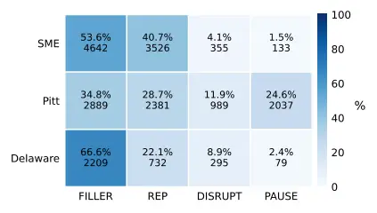
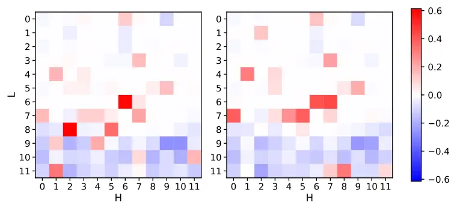

Kordt Pekarek Rosin Lee Wermter

# Learning to Hear Hesitation: Continual Learning for Disfluency-Aware ASR

Henri-Leon    Theresa    Jae Hee    Stefan

###### Abstract

Despite advances in large-scale Automatic Speech Recognition (ASR),
disfluent speech remains challenging, as state-of-the-art systems are
often optimized to omit disfluencies, leading to information loss and
hallucinations. Prior work has focused on verbatim transcription and the
integration of disfluency markers, but adapting models on limited
datasets can lead to catastrophic forgetting of general-domain
knowledge. We address this gap by leveraging continual learning (CL)
with explicit disfluency tokens. We first introduce these tokens into a
pretrained ASR model to establish stable token mechanisms, and then
continue training on additional datasets with varying disfluency
distributions. Through a detailed analysis of model dynamics during
training, we identify a trade-off between marker learning and ASR
performance, and a consistent cross-attention head mechanism shared
across CL methods.

###### keywords

speech recognition, continual learning, verbatim transcription,
disfluent speech recognition

^(†)^(†)address: Knowledge Technology, Department of Informatics,
University of Hamburg, Germany ^(†)^(†)email: {henri-leon.kordt,
theresa.pekarek-rosin, jae.hee.lee, stefan.wermter}@uni-hamburg.de

## 1 Introduction

Although Automatic Speech Recognition has improved substantially in
recent years due to the introduction of large-scale models trained on
vast amounts of audio data \[1\], disfluent speech recognition has not
seen the same progress \[2\]. Disfluencies are perturbations in speech
that can range in severity from simple filler words (“uh”, “uhm”),
hesitations, and word or phrase repairs to slurred speech or stutters
caused by underlying conditions. However, state-of-the-art models are
often trained to ignore disfluencies in order to produce clean
transcriptions \[3, 4\], which can lead to incorrectly generated
utterances, i.e., hallucinations or fabrications, and to a general loss
of information and transparency \[5, 6\].

To address this problem and improve performance on disfluent speech,
MacDonald et al. \[7\] have suggested personalizing models for each
speaker, while others have focused on creating more verbatim
transcriptions \[5, 8\]. Such verbatim transcriptions and the subsequent
inclusion of disfluencies can capture clinically relevant speech
information \[9\], improve audio-text alignment for timestamping \[8\],
and even improve downstream ASR performance \[5, 10\]. Previous work has
also introduced specific markers or tokens to represent speech
disfluencies by training pretrained models on additional annotated
speech corpora, both to detect dementia from utterances \[9\] and to
improve performance on disfluent \[10\] or spontaneous speech \[8\].



Figure 1: The distribution of disfluencies across the selected datasets.
Percentages are calculated with respect to each dataset’s distribution.

However, when applied carelessly to small-scale datasets, these
approaches often lead to a loss of domain-agnostic performance \[11\],
an effect known as catastrophic forgetting \[12\]. A naive approach to
address this effect is to jointly train the model on the new data and
the entire pretraining data. Since speech patterns change over time and
new data becomes available constantly, this process would have to be
repeated for every new data instance, which is highly inefficient.
Additionally, because training data for disfluent speech is often
limited and subject to privacy regulations, this approach is frequently
infeasible.

Continual Learning (CL) is a paradigm for mitigating catastrophic
forgetting by balancing learning plasticity and memory stability through
regularization, replay, or architectural approaches \[11\]. Such methods
provide an efficient way to integrate heterogeneous datasets and speech
patterns without sacrificing the pretrained model’s performance. CL has
been successfully applied to domain adaptation for non-standard
speech \[13, 14\] and low-resource languages \[15, 16\], but it has not
yet been utilized for disfluent or impaired speech. Moreover, disfluency
events and disfluency transcriptions pose unique challenges that differ
from typical ASR domain adaptation tasks, for which evidence of CL
effectiveness remains unexplored.

In this work, we address disfluent speech recognition using disfluency
markers, which are commonly employed in disfluency-focused ASR
research \[5, 8, 10\] and are also present in the manual transcriptions
of datasets collected under the TalkBank \[17, 18\] umbrella. We
aggregate these markers into four token types and introduce them to a
pretrained model using different CL methods to preserve the model’s
performance. We then continue training on two annotated datasets with
different disfluency distributions to examine the robustness of the
established marker representations for continual adaptation. We examine
adaptation differences across CL methods and find that, despite
performance differences, successful marker learning largely follows a
shared attention-head specialization pattern.

## 2 Methodology

To enable more verbatim transcriptions and increase the amount of
information produced by the model, we introduce disfluency markers into
a pretrained backbone model. We combine continual learning (CL) with
explainability methods across three datasets to investigate internal
specialization mechanisms while preserving performance under continual
model adaptation.

### 2.1 Datasets

To cover both healthy and impaired disfluent speech, we use three
datasets from the TalkBank repository \[17, 18\], which were selected
based on data availability, number of samples, disfluency distribution,
and domain: the Standard Malaysian English (SME) Corpus \[19\], the Pitt
Corpus \[20\], and the Delaware Corpus \[18\]. All three use the unified
CHAT Transcription Format \[21\], which ensures consistency in the
labeling syntax. Their transcriptions also contain manually annotated
disfluency markers, allowing a direct mapping to disfluency tokens
during training.

The SME Corpus \[19\] contains \SI11.79\hour of English speech from
Malaysian university students who are second-language learners. This
dataset represents a common subgroup of speakers who are generally
healthy but may exhibit disfluencies in their speech production due to
the language gap. The Pitt Corpus \[20\] is a collection of
\SI21.30\hour of speech from elderly speakers with dementia or
Alzheimer’s disease, while the Delaware Corpus \[18\] contains
\SI9.72\hour of speech from people with mild cognitive impairment. Both
Pitt and Delaware include speech from healthy individuals in their
control groups, which we divide evenly across the training and
validation splits. We include only \SI12.11\hour of the Pitt corpus in
the CL setup to reduce dataset-size effects. We use these datasets to
demonstrate the robustness of our approach across different severities
and distributions of disfluencies (see Figure 1). In the CL setup, we
also include a small subset of LibriSpeech data \[22\] for the rehearsal
buffer in replay-based methods and as a representation of unperturbed
speech.

### 2.2 Continual learning setup

We use whisper-small.en¹¹ 1
[https://huggingface.co/openai/whisper-small.en](https://huggingface.co/openai/whisper-small.en),
a pretrained monolingual model, as the backbone for the CL setup. To
preserve the pretrained performance of the model and handle the
different disfluency distributions in the datasets, we use four CL
methods that are commonly employed for domain-incremental ASR training:
Elastic Weight Consolidation (EWC) \[23\], Experience Replay
(ER) \[24\], A-GEM \[25\], and Weight Averaging (WA) \[13\].

EWC \[23\] is a regularization-based method that identifies model
parameters important to previously learned tasks and penalizes updates
to those parameters (using the diagonal Fisher information matrix). For
ER \[24\], a small percentage of the old data is kept in memory
(rehearsal buffer) and used to supplement the training data for the new
task, preventing drastic gradient updates. A-GEM \[25\] is a
gradient-based method that calculates the dot product between the
gradients of the rehearsal buffer and the training data of the current
dataset to penalize gradients in opposing directions. For WA \[13\], the
weights of the old model are kept in memory, while another version is
trained on the new task. Once training is complete, the model is updated
with an average of the old and the new weights.

To evaluate general ASR performance, we use the preprocessed WER (pWER),
in which punctuation, special characters, and disfluency markers are
removed from the transcripts before the metric is computed. To assess
the model’s memory stability and learning plasticity during CL, we use
the metrics defined by Wang et al. \[11\], with minor modifications to
accommodate pWER and marker F1 in place of accuracy. Average Word Error
Rate (A-WER) and Average Incremental WER (AI-WER) measure overall pWER
performance at the current step and across the full CL trajectory,
respectively. For marker prediction, we similarly report Average F1
(A-F1) and Average Incremental F1 (AI-F1), which replace per-task
accuracy with per-task marker F1. The F1 scores are calculated using a
bag-of-words approach. Backward Transfer (BWT) and Forgetting Measure
(FM) assess memory stability, whereas Forward Transfer (FWT) and
Intransigence Measure (IM) assess the model’s learning plasticity.

### 2.3 Explainability methods

Given the tendency of transformer models to develop specialization and
redundancy \[26, 27\], we investigate whether the transcription of
disfluency events induces specialized circuits within the model. This is
particularly relevant in the CL setting, since CL methods may yield
similar aggregate error rates while inducing different adaptation
dynamics and internal strategies. By probing attention heads, we aim to
assess whether disfluency handling concentrates in a small set of heads
(specialized circuitry) and how stable these mechanisms are across CL
approaches, thereby providing insight into robustness and potential
method-specific trade-offs. We follow the head-masking approach of
Michel et al. \[26\], which introduces a learnable scalar gate
$`\xi_{h}`$ per attention head $`h`$. To estimate token-level head
importance $`I_{h}`$, we compute the sensitivity of a token objective to
$`\xi_{h}`$ and average over a set of token instances $`X_{t}`$:

```math
\displaystyle I_{h}=\mathbb{E}_{x\sim X_{t}}\left[\frac{\partial\mathcal{L}(x)}{\partial\xi_{h}}\right] \tag{1}
```

Based on this per-head importance $`I_{h}`$, we rank head attribution
for disfluency tokens and compare importance rankings averaged over
non-disfluency tokens. Specifically, we calculate the top-10 lift,
defined as the difference in the frequency with which a head $`h`$
appears in the top-10 ranking for disfluency tokens versus its frequency
in the baseline distribution (all other tokens):

```math
\displaystyle\text{Lift}_{h}=P(h\in\text{Top-}k\mid X_{t})-P(h\in\text{Top-}k\mid X_{\text{base}}) \tag{2}
```

To confirm head attribution, we ablate heads that show high top-10 lift
scores using zero-masking. We inspect changes in token emission and
control for overall performance using pWER.

### 2.4 Experiments

To assess the introduction of disfluency tokens into a pretrained model
and the resulting task performance in a Continual Learning (CL) setup,
we conduct two experiments: (i) disfluency token introduction and (ii)
sequential continual adaptation. Following the literature \[8, 10\], we
aggregate similar disfluency events into four distinct token types:
filler words (FILLER; e.g., “um”, “uh”), repetitions/revisions (REP;
word- and phoneme-level), disruptions (DISRUPT; e.g., coughs, laughs),
and pauses (PAUSE).

In the disfluency token introduction experiment (cf. Section 3.1), we
focus on introducing these tokens into a pretrained model without
overfitting to the new dataset, i.e., while keeping performance on
non-disfluent speech high. We fine-tune the backbone on the SME dataset
with disfluency tokens using the CL techniques discussed above. SME
covers the domain closest to the backbone and predominantly contains
only two marker types: FILLER and REP. Additionally, we analyze whether
the introduction of disfluency tokens is associated with the emergence
of internal model mechanisms and whether these mechanisms differ across
CL methods.

For the sequential continual adaptation experiment (cf. Section 3.2), we
choose the best-performing model from the disfluency token introduction
stage: a model that shows successful marker integration (high marker-F1)
while maintaining the smallest pWER trade-off. We then continue
expanding the model with the Pitt and Delaware corpora, two
disfluent-speech datasets that vary in domain and disfluency
distribution (see Figure 1). In doing so, we approximate lifelong model
adaptation to changing domains and speaker variations through sequential
training on more difficult datasets. We begin with the Pitt Corpus,
which introduces a substantial number of pause markers and also
increases the number of disruptions. Afterward, we train the model on
the Delaware Corpus, which contains the fewest markers overall and
therefore specifically challenges the model to retain them.

We ensure that the training and evaluation splits for both experiments
are speaker-disjoint and partition each dataset into an 80/20 split. For
the rehearsal buffer, we randomly sample 10% of the training data from
each dataset, greedily prioritizing rare disfluency markers so that the
token distribution mirrors that of the full dataset. We train on each
dataset for 10 epochs with a learning rate of 2e-5 and a batch size of
16, ensuring convergence in both marker scores and ASR performance.
Results are averaged across three runs. Following the literature \[23,
24\] and our empirical evaluation, we include 25% of old data per batch,
sampled from the rehearsal buffer for ER, and set the importance
parameter to 1000 for EWC. In addition to the general performance and CL
metrics discussed in Section 2.2, we also measure disfluency-marker
recognition using micro- and macro-averaged F1 scores. For the
disfluency token introduction experiment, we use micro-F1 to summarize
overall marker integration for the introduced markers, while macro-F1 is
used later to assess per-type balance once all markers are in scope.

## 3 Results

### 3.1 Disfluency token introduction

|          |                                                                  |                                                                |                                                                |
| -------- | ---------------------------------------------------------------- | -------------------------------------------------------------- | -------------------------------------------------------------- |
|          | SME (pWER% $`\downarrow`$)                                       | LS (pWER% $`\downarrow`$)                                      | SME (F1 $`\uparrow`$)                                          |
| Backbone | $`15.97\phantom{\textsuperscript{\tiny$\pm$0.08}}`$              | $`3.47\phantom{\textsuperscript{\tiny$\pm$0.08}}`$             | $`0.00\phantom{\textsuperscript{\tiny$\pm$0.08}}`$             |
| FT       | $`12.21\hspace{0pt}`$0.1812.21\textsuperscript{\tiny\$\pm\$0.18} | $`5.06\hspace{0pt}`$0.025.06\textsuperscript{\tiny\$\pm\$0.02} | $`0.73\hspace{0pt}`$0.010.73\textsuperscript{\tiny\$\pm\$0.01} |
| A-GEM    | $`12.17\hspace{0pt}`$0.1712.17\textsuperscript{\tiny\$\pm\$0.17} | $`4.39\hspace{0pt}`$0.074.39\textsuperscript{\tiny\$\pm\$0.07} | 0.75^($`\pm`$0.01)                                             |
| ER       | $`12.47\hspace{0pt}`$0.0312.47\textsuperscript{\tiny\$\pm\$0.03} | $`4.55\hspace{0pt}`$0.134.55\textsuperscript{\tiny\$\pm\$0.13} | $`0.73\hspace{0pt}`$0.010.73\textsuperscript{\tiny\$\pm\$0.01} |
| EWC      | $`10.34\hspace{0pt}`$0.4710.34\textsuperscript{\tiny\$\pm\$0.47} | $`4.43\hspace{0pt}`$0.074.43\textsuperscript{\tiny\$\pm\$0.07} | $`0.21\hspace{0pt}`$0.070.21\textsuperscript{\tiny\$\pm\$0.07} |
| WA       |  9.64^($`\pm`$0.08)                                              | 3.41^($`\pm`$0.01)                                             | $`0.00\hspace{0pt}`$0.000.00\textsuperscript{\tiny\$\pm\$0.00} |
|          |                                                                  |                                                                |                                                                |

Table 1: Disfluency token introduction: The preprocessed Word Error Rate
(pWER) averaged over 3 seeds after 10 epochs of training for SME and
LibriSpeech (LS). We additionally report the micro-F1 score for marker
predictions on SME.

We train on SME using different CL methods to examine how well
performance on non-disfluent speech (LibriSpeech test-clean, LS) can be
retained while improving performance on the new domain and introducing
disfluency markers into the model. Table 1 shows that all CL methods
retain LS performance substantially better than the FT baseline while
also improving pWER on SME. Weight Averaging (WA) outperforms the other
methods by retaining, and even slightly improving, the ASR model
performance on LS while achieving the lowest pWER on SME at 9.64%. EWC
also improves pWER on SME relative to FT, but shows weaker LibriSpeech
pWER retention than WA. Importantly, both methods fail to integrate
markers reliably. The FT baseline, ER, and A-GEM consistently produce
marker micro-F1 scores between 0.73 and 0.75, whereas EWC remains at a
micro-F1 of 0.21 and WA fails to emit markers at all. This means that
although A-GEM, ER, and the FT baseline perform worse on the trained
domain, improving the pWER only to around 12%, they successfully produce
disfluency markers.

These results indicate a trade-off between pWER and marker performance,
suggesting that marker training may require parameter updates that
conflict with low-cost general ASR domain adaptation. To test whether
marker learning corresponds to a consistent mechanism that differs from
normal token production, we apply our head-attribution approach
(Section 2.3) across all methods. We find that when markers are
successfully trained, a few specialized decoder cross-attention heads
are consistently assigned to marker emission, as shown in Figure 2.



Figure 2: Top-10 lift scores for FILLER (left) and REP (right) across
decoder cross-attention heads computed on the train split averaged
across all token emitting methods.

Notably, the same small set of heads emerges across all marker-emitting
methods, suggesting a shared cross-attention mechanism rather than
method-specific marker strategies induced by different regularization.
In Table 2, we verify their causal role through an ablation study on the
top-5 cross-attention heads associated with disfluency markers and show
that we can consistently remove around 50% of the emitted FILLER markers
while retaining similar pWER values.

|                         | $`\Delta`$FILLER                                                  | $`\Delta`$REP                                                     | $`\Delta`$pWER%                                                     |
| ----------------------- | ----------------------------------------------------------------- | ----------------------------------------------------------------- | ------------------------------------------------------------------- |
| FILLER: Top-5           | $`- {57.0\hspace{0pt}}`$5.2-57.0\textsuperscript{\tiny\$\pm\$5.2} | $`- {7.1\hspace{0pt}}`$3.8-7.1\textsuperscript{\tiny\$\pm\$3.8}   | $`+ {0.42\hspace{0pt}}`$0.64+0.42\textsuperscript{\tiny\$\pm\$0.64} |
| REP: Top-5              | $`- {2.8\hspace{0pt}}`$1.1-2.8\textsuperscript{\tiny\$\pm\$1.1}   | $`- {15.7\hspace{0pt}}`$4.2-15.7\textsuperscript{\tiny\$\pm\$4.2} | $`+ {0.13\hspace{0pt}}`$0.46+0.13\textsuperscript{\tiny\$\pm\$0.46} |
| $`\bigcup`$ Top-5       | $`- {62.2\hspace{0pt}}`$5.2-62.2\textsuperscript{\tiny\$\pm\$5.2} | $`- {21.2\hspace{0pt}}`$9.8-21.2\textsuperscript{\tiny\$\pm\$9.8} | $`+ {0.44\hspace{0pt}}`$0.68+0.44\textsuperscript{\tiny\$\pm\$0.68} |
| Control ($`5\times r`$) | $`+ {0.2\hspace{0pt}}`$0.5+0.2\textsuperscript{\tiny\$\pm\$0.5}   | $`+ {0.4\hspace{0pt}}`$1.2+0.4\textsuperscript{\tiny\$\pm\$1.2}   | $`+ {0.15\hspace{0pt}}`$0.21+0.15\textsuperscript{\tiny\$\pm\$0.21} |

Table 2: Zero-mask ablation, averaged across methods. We report the
relative change in marker emission (%) and the change in pWER after
masking the top-5 cross-attention heads identified for FILLER, REP,
their union, and a random-head control.

### 3.2 Sequential continual adaptation

|       |                     |                    |                     |                    |                     |                     |                     |                    |                     |                     |                     |                     |
| ----- | ------------------- | ------------------ | ------------------- | ------------------ | ------------------- | ------------------- | ------------------- | ------------------ | ------------------- | ------------------- | ------------------- | ------------------- |
|       | A-WER% / A-F1       |                    | AI-WER%/AI-F1       |                    | BWT                 |                     | FM                  |                    | FWT                 |                     | IM                  |                     |
|       | pWER $`\downarrow`$ | F1 $`\uparrow`$    | pWER $`\downarrow`$ | F1 $`\uparrow`$    | pWER $`\uparrow`$   | F1 $`\uparrow`$     | pWER $`\downarrow`$ | F1 $`\downarrow`$  | pWER $`\uparrow`$   | F1 $`\uparrow`$     | pWER $`\downarrow`$ | F1 $`\downarrow`$   |
| JOINT | 17.95^($`\pm`$0.28) | 0.47^($`\pm`$0.01) | –                   | –                  | –                   | –                   | –                   | –                  | –                   | –                   | –                   | –                   |
| FT    | 20.24^($`\pm`$0.14) | 0.39^($`\pm`$0.02) | 19.00^($`\pm`$0.06) | 0.49^($`\pm`$0.01) | -3.18^($`\pm`$0.26) | -0.16^($`\pm`$0.02) | 3.48^($`\pm`$0.35)  | 0.19^($`\pm`$0.02) | -3.81^($`\pm`$0.10) | -0.05^($`\pm`$0.01) | 0.44^($`\pm`$0.07)  | -0.03^($`\pm`$0.01) |
| A-GEM | 20.15^($`\pm`$0.68) | 0.36^($`\pm`$0.02) | 18.88^($`\pm`$0.24) | 0.48^($`\pm`$0.01) | -3.46^($`\pm`$0.78) | -0.19^($`\pm`$0.03) | 3.50^($`\pm`$0.72)  | 0.21^($`\pm`$0.03) | -3.39^($`\pm`$0.24) | -0.07^($`\pm`$0.01) | 0.16^($`\pm`$0.16)  | -0.02^($`\pm`$0.00) |
| ER    | 19.71^($`\pm`$0.23) | 0.49^($`\pm`$0.01) | 18.17^($`\pm`$0.10) | 0.53^($`\pm`$0.01) | -2.57^($`\pm`$0.48) | 0.01^($`\pm`$0.01)  | 2.59^($`\pm`$0.46)  | 0.02^($`\pm`$0.00) | -3.63^($`\pm`$0.52) | -0.06^($`\pm`$0.00) | 0.32^($`\pm`$0.34)  | -0.03^($`\pm`$0.00) |
| EWC   | 19.01^($`\pm`$0.08) | 0.44^($`\pm`$0.01) | 18.28^($`\pm`$0.05) | 0.52^($`\pm`$0.00) | -1.40^($`\pm`$0.08) | -0.09^($`\pm`$0.02) | 2.18^($`\pm`$0.16)  | 0.13^($`\pm`$0.02) | -3.75^($`\pm`$0.20) | -0.05^($`\pm`$0.01) | 0.40^($`\pm`$0.13)  | -0.03^($`\pm`$0.01) |
| WA    | 18.90^($`\pm`$0.19) | 0.46^($`\pm`$0.00) | 17.57^($`\pm`$0.04) | 0.51^($`\pm`$0.01) | -0.55^($`\pm`$0.34) | -0.01^($`\pm`$0.00) | 1.35^($`\pm`$0.20)  | 0.05^($`\pm`$0.01) | -4.43^($`\pm`$0.13) | -0.10^($`\pm`$0.00) | 0.85^($`\pm`$0.09)  | 0.00^($`\pm`$0.00)  |

Table 3: Continual learning metrics after sequential adaptation on Pitt
and Delaware, initialized from the selected disfluency token
introduction checkpoint. For each metric, we report pWER-based and
marker F1-based variants.

For the sequential continual adaptation experiment, we investigate the
ability of CL methods to generalize and retain knowledge when the model
is continuously trained on more difficult disfluency datasets after an
initial marker set has been established. We initialize all methods from
the same disfluency-token introduction checkpoint (A-GEM Seed 2), which
reliably emits markers, selected by SME marker-F1 and SME pWER, and then
sequentially train on Pitt and Delaware using each CL strategy. In
Table 3, we report common CL metrics (cf. Section 2.2) after fine-tuning
on Pitt and Delaware using different CL techniques.

Our results show that all CL methods reduce pWER relative to the FT
baseline, as reflected in lower A-WERs across all methods and all
methods except A-GEM also improve marker F1. Importantly, the
best-performing methods differ for ASR performance and marker retention:
WA achieves an A-WER of 18.90%, while ER shows the best marker
performance with a macro-F1 score of 0.49.

WA shows the strongest pWER reduction while also exhibiting the most
stable pWER performance, as indicated by AI-WER. WA achieves these gains
mainly through retention, exhibiting minimal forgetting and stable
backward transfer, while showing comparatively limited plasticity in
learning new tasks, as reflected by the high IM score.

ER, on the other hand, achieves the best performance for
disfluency-marker F1. The method also shows strong generalization for
markers, with nearly no forgetting as indicated by an FM score of 0.02,
and even slight improvements on old tasks, reflected in a slightly
positive marker-F1 BWT of 0.01.

To understand which marker types drive the overall F1 differences, we
report the final marker-F1 scores for the different disfluency markers
in Table 4. FILLER markers are robust across methods, with F1 scores
between 0.68 and 0.75, whereas REP markers exhibit the strongest method
sensitivity, ranging from 0.35 to 0.63, indicating learning differences
or forgetting. PAUSE markers are the most challenging overall, but ER
yields a clear advantage, which is consistent with ER achieving the best
aggregate marker F1 in Table 3.

We additionally evaluate pWER for LS to isolate non-disfluent speech
retention after sequential training and find that the ranking closely
matches the disfluent-speech retention trend: WA performs best by a
clear margin (4.68%), EWC and ER follow with 6.45% and 7.14%
respectively, and A-GEM (8.36%) shows nearly no improvement over the FT
baseline (8.37%).

|       | FILLER             | REP                | DISRUPT            | PAUSE              |
| ----- | ------------------ | ------------------ | ------------------ | ------------------ |
| Joint | 0.71^($`\pm`$0.01) | 0.54^($`\pm`$0.02) | 0.42^($`\pm`$0.02) | 0.25^($`\pm`$0.02) |
| FT    | 0.69^($`\pm`$0.02) | 0.42^($`\pm`$0.02) | 0.34^($`\pm`$0.00) | 0.09^($`\pm`$0.06) |
| A-GEM | 0.68^($`\pm`$0.01) | 0.35^($`\pm`$0.03) | 0.34^($`\pm`$0.03) | 0.05^($`\pm`$0.02) |
| ER    | 0.75^($`\pm`$0.01) | 0.61^($`\pm`$0.00) | 0.38^($`\pm`$0.01) | 0.23^($`\pm`$0.02) |
| EWC   | 0.72^($`\pm`$0.01) | 0.49^($`\pm`$0.02) | 0.37^($`\pm`$0.02) | 0.16^($`\pm`$0.01) |
| WA    | 0.73^($`\pm`$0.00) | 0.63^($`\pm`$0.01) | 0.37^($`\pm`$0.01) | 0.09^($`\pm`$0.01) |

Table 4: Marker-F1 ($`\uparrow`$) on the combination of all three
datasets after sequential training on Pitt and Delaware, initialized on
the selected SME checkpoint.

## 4 Conclusion

We compared several continual learning (CL) methods to investigate their
ability to integrate disfluency tokens for more verbatim transcriptions
and better performance on disfluent speech. We specifically focused on
realistic model-expansion scenarios without joint retraining on large
disfluency datasets. Overall, CL improved sequential training
performance for both ASR performance and disfluency-marker retention,
but we found that the best CL method depended on the primary objective.
We evaluated performance in terms of initial marker inclusion, marker
retention, and ASR performance on both disfluent and non-disfluent
speech.

We found that CL strategies are not equally effective at introducing
disfluency markers while preserving ASR quality. Across CL settings,
marker F1 and pWER showed a consistent trade-off: methods that
maintained the strongest pWER performance tended to under-introduce
markers, while those that reliably emitted markers did so at a
measurable ASR cost. Further investigation of the effect showed that
successful marker learning was linked to a consistent cross-attention
pattern: a small set of heads was consistently active during marker
production, and we found that targeted ablations reduced marker emission
while largely preserving pWER. This points to a reliable learned
attention mechanism and offers a mechanistic explanation for why some CL
methods struggle more with marker introduction.

When extending a model with additional disfluency datasets, ER achieved
the strongest marker generalization and retention, with the best overall
marker performance and minimal forgetting. For the preservation of
disfluent ASR performance, WA was the most stable across incremental
updates, consistently delivering the strongest pWER retention and the
lowest forgetting. This stability also transferred to clean speech,
where WA performed best in both experiments.

While we limited ourselves to a single backbone model and a single
realistic task ordering, overall, this work presented one of the first
studies of CL for disfluency modeling, offering both practical guidance
for verbatim ASR adaptation and mechanistic insights into how disfluency
token behaviors are acquired in pretrained models. These insights
provide a foundation for future work to combine and design methods that
enable robust domain adaptation and reliable marker retention.

## 5 Acknowledgements

The authors gratefully acknowledge funding from Horizon Europe under the
MSCA grant agreements No 101072488 (TRAIL), No 101226624 (GREET), and No
101168792 (SWEET), as well as from the German Research Foundation (DFG),
project number 551629603.

Data collection for the Delaware Corpus was supported by the National
Institute of Aging of the National Institutes of Health under award
number RF1AG083823 (PIs: MacWhinney and Lanzi). The Pitt Corpus is part
of DementiaBank, which is funded by NIH grants NIA AG03705 and AG05133.

## 6 Generative AI Use Disclosure

Generative AI tools have been used to polish the language in the
manuscript.

## References

- \[1\] A. Radford, J. W. Kim, T. Xu, G. Brockman, C. McLeavey, and I.
  Sutskever (2023) Robust Speech Recognition via Large-Scale Weak
  Supervision. In Proceedings of the 40th International Conference on
  Machine Learning (ICML’23), Honolulu, Hawaii, USA, pp. 28492–28518.
  Cited by: §1.
- \[2\] S. Feng, B. M. Halpern, O. Kudina, et al. (2024) Towards
  inclusive automatic speech recognition. Computer Speech and Language
  84 (C), pp. 101567. Cited by: §1.
- \[3\] H. Hwang, E. Jordan, D. Kim-Dufor, C. Lemey, and M.
  Alrahabi (2025) Evaluating ASR in a clinical context : what whisper
  misses. In Proceedings of the 8th International Conference on Natural
  Language and Speech Processing (ICNLSP-2025), Southern Denmark
  University, Odense, Denmark, pp. 374–378. Cited by: §1.
- \[4\] D. Mujtaba, N. Mahapatra, M. Arney, J. Yaruss, H.
  Gerlach-Houck, C. Herring, and J. Bin (2024) Lost in transcription:
  identifying and quantifying the accuracy biases of automatic speech
  recognition systems against disfluent speech. In Proceedings of the
  2024 Conference of the North American Chapter of the Association for
  Computational Linguistics: Human Language Technologies (Volume 1: Long
  Papers), Mexico City, Mexico, pp. 4795–4809. External Links:
  [Document](https://dx.doi.org/10.18653/v1/2024.naacl-long.269) Cited
  by: §1.
- \[5\] J. Lin, H. Lu, C. Wang, H. Lin, and B. Chen (2025) Acoustically
  precise hesitation tagging is essential for end-to-end verbatim
  transcription systems. In 10th Workshop on Speech and Language
  Technology in Education (SLaTE), pp. 163–166. External Links:
  [Document](https://dx.doi.org/10.21437/SLaTE.2025-33), ISSN 2311-4975
  Cited by: §1, §1, §1.
- \[6\] T. Pekarek Rosin, J. Gachot, H. Kordt, M. Kerzel, and S.
  Wermter (2025) Talking to robots: a practical examination of speech
  foundation models for hri applications. In Workshop on Foundation
  Model for Social Robotics (FoMoSR) at ICSR 2025, Vol. , pp. . External
  Links: [Document](https://dx.doi.org/10.48550/arXiv.2508.17753) Cited
  by: §1.
- \[7\] R. L. MacDonald, P. Jiang, J. Cattiau, R. Heywood, R. Cave, K.
  Seaver, M. A. Ladewig, J. Tobin, M. P. Brenner, P. C. Nelson, et
  al. (2021) Disordered Speech Data Collection: Lessons Learned at 1
  Million Utterances from Project Euphonia. In Proceedings of
  Interspeech 2021, Brno, Czech Republic. Cited by: §1.
- \[8\] M. Zusag, L. Wagner, and B. Thallinger (2024) CrisperWhisper:
  Accurate Timestamps on Verbatim Speech Transcriptions. In Proceedings
  of Interspeech 2024, Kos, Greece, pp. 1265–1269. Cited by: §1, §1,
  §2.4.
- \[9\] R. Soleimani, S. Guo, K. L. Haley, A. Jacks, and E.
  Lobaton (2024) The impact of pause and filler word encoding on
  dementia detection with contrastive learning. Applied Sciences 14
  (19). External Links: ISSN 2076-3417,
  [Document](https://dx.doi.org/10.3390/app14198879) Cited by: §1.
- \[10\] E. Akinrintoyo, N. Abdelhalim, and N. Salomons (2025) WhisperD:
  Dementia Speech Recognition and Filler Word Detection with Whisper. In
  Proceedings of Interspeech 2025, pp. 1413–1417. External Links:
  [Document](https://dx.doi.org/10.21437/Interspeech.2025-2099), ISSN
  2958-1796 Cited by: §1, §1, §2.4.
- \[11\] L. Wang, X. Zhang, H. Su, and J. Zhu (2024) A comprehensive
  survey of continual learning: theory, method and application. IEEE
  Trans. Pattern Anal. Mach. Intell. 46 (8), pp. 5362–5383. External
  Links: ISSN 0162-8828,
  [Document](https://dx.doi.org/10.1109/TPAMI.2024.3367329) Cited by:
  §1, §1, §2.2.
- \[12\] G. M. van de Ven, N. Soures, and D. Kudithipudi (2025)
  Continual learning and catastrophic forgetting. In Learning and
  Memory: A Comprehensive Reference (Third Edition), pp. 153–168.
  External Links: ISBN 978-0-443-15755-4,
  [Document](https://dx.doi.org/https%3A//doi.org/10.1016/B978-0-443-15754-7.00073-0)
  Cited by: §1.
- \[13\] S. Vander Eeckt and H. Van hamme (2023) Rehearsal-free online
  continual learning for automatic speech recognition. In Proceedings of
  Interspeech 2023, pp. 944–948. External Links:
  [Document](https://dx.doi.org/10.21437/Interspeech.2023-788), ISSN
  2958-1796 Cited by: §1, §2.2, §2.2.
- \[14\] T. Pekarek Rosin and S. Wermter (2023) Replay to remember:
  continual layer-specific fine-tuning for german speech recognition. In
  Artificial Neural Networks and Machine Learning – ICANN 2023, Vol. ,
  pp. 489–500. External Links:
  [Document](https://dx.doi.org/10.1007/978-3-031-44195-0%5F40) Cited
  by: §1.
- \[15\] L. Della Libera, P. Mousavi, S. Zaiem, C. Subakan, and M.
  Ravanelli (2024) CL-masr: a continual learning benchmark for
  multilingual asr. IEEE/ACM Trans. Audio, Speech and Lang. Proc. 32,
  pp. 4931–4944. External Links: ISSN 2329-9290,
  [Document](https://dx.doi.org/10.1109/TASLP.2024.3487410) Cited by:
  §1.
- \[16\] Z. Song, J. Zhuo, Y. Yang, Z. Ma, S. Zhang, and X. Chen (2024)
  LoRA-Whisper: Parameter-Efficient and Extensible Multilingual ASR. In
  Interspeech 2024, pp. 3934–3938. External Links:
  [Document](https://dx.doi.org/10.21437/Interspeech.2024-892), ISSN
  2958-1796 Cited by: §1.
- \[17\] B. MacWhinney (2019) TalkBank and sla. In The Handbook of SLA
  and Corpora, N. Tracy-Ventura and M. Paquot (Eds.), Cited by: §1,
  §2.1.
- \[18\] A. M. Lanzi, A. K. Saylor, D. Fromm, H. Liu, B. MacWhinney,
  and M. L. Cohen (2023) DementiaBank: theoretical rationale, protocol,
  and illustrative analyses. American Journal of Speech-Language
  Pathology 32 (2), pp. 426–438. External Links:
  [Document](https://dx.doi.org/10.1044/2022%5FAJSLP-22-00281),
  https://pubs.asha.org/doi/pdf/10.1044/2022_AJSLP-22-00281 Cited by:
  §1, §2.1, §2.1.
- \[19\] S. Sie (2023) Investigating the role of an indigenised variety
  of english in the acquisitional and sociolinguistic contexts of the
  malaysian ecology. Ph.D. Thesis, Apollo - University of Cambridge
  Repository. External Links:
  [Document](https://dx.doi.org/10.17863/CAM.96583) Cited by: §2.1,
  §2.1.
- \[20\] J. T. Becker, F. Boller, O. L. Lopez, J. Saxton, and K. L.
  McGonigle (1994) The natural history of alzheimer’s disease:
  description of study cohort and accuracy of diagnosis. Archives of
  Neurology 51 (6), pp. 585–594. External Links: ISSN 0003-9942,
  [Document](https://dx.doi.org/10.1001/archneur.1994.00540180063015),
  https://jamanetwork.com/journals/jamaneurology/articlepdf/592905/archneur_51_6_015.pdf
  Cited by: §2.1, §2.1.
- \[21\] B. MacWhinney (2000) The childes project: tools for analyzing
  talk. 3 edition, Lawrence Erlbaum Associates, Mahwah, NJ. Cited by:
  §2.1.
- \[22\] V. Panayotov, G. Chen, D. Povey, and S. Khudanpur (2015)
  Librispeech: an asr corpus based on public domain audio books. In 2015
  IEEE International Conference on Acoustics, Speech and Signal
  Processing (ICASSP), Vol. , pp. 5206–5210. External Links:
  [Document](https://dx.doi.org/10.1109/ICASSP.2015.7178964) Cited by:
  §2.1.
- \[23\] J. Kirkpatrick, R. Pascanu, N. Rabinowitz, J. Veness, G.
  Desjardins, A. A. Rusu, K. Milan, J. Quan, T. Ramalho, A.
  Grabska-Barwinska, D. Hassabis, C. Clopath, D. Kumaran, and R.
  Hadsell (2017) Overcoming catastrophic forgetting in neural networks.
  Proceedings of the National Academy of Sciences 114 (13),
  pp. 3521–3526. External Links:
  [Document](https://dx.doi.org/10.1073/pnas.1611835114),
  https://www.pnas.org/doi/pdf/10.1073/pnas.1611835114 Cited by: §2.2,
  §2.2, §2.4.
- \[24\] D. Rolnick, A. Ahuja, J. Schwarz, T. Lillicrap, and G.
  Wayne (2019) Experience replay for continual learning. In Advances in
  Neural Information Processing Systems, Vol. 32, pp. . Cited by: §2.2,
  §2.2, §2.4.
- \[25\] A. Chaudhry, M. Ranzato, M. Rohrbach, and M. Elhoseiny (2019)
  Efficient lifelong learning with a-gem. In Proceedings of ICLR 2019,
  Cited by: §2.2, §2.2.
- \[26\] P. Michel, O. Levy, and G. Neubig (2019) Are sixteen heads
  really better than one?. In Advances in Neural Information Processing
  Systems, Vol. 32, pp. . Cited by: §2.3.
- \[27\] K. Ahrens, L. Bengtson, J. H. Lee, and S. Wermter (2023)
  Visually Grounded Continual Language Learning with Selective
  Specialization. In EMNLP Findings, pp. 7037–7054. Cited by: §2.3.
