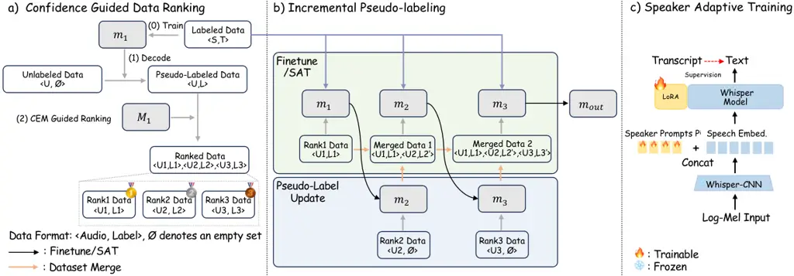

Deng Xie Hu Deng Geng Chen Wang Xu Li Liu

# Confidence Score Guided Incremental and Speaker Adaptive Pseudo-Labeling for Semi-Supervised Elderly Speech Recognition

Chengxi    Xurong    Shujie    Jiajun    Mengzhe    Youjun    Huimeng   
Haoning    Guinan    Xunying

###### Abstract

This paper proposes a novel confidence score guided incremental and
speaker adaptive pseudo-labeling approach for semi-supervised elderly
speech recognition. It facilitates higher-quality pseudo-label selection
and progressive refinement, while also mitigating speaker heterogeneity.
A confidence estimation module is designed to rank the reliability of
untranscribed data, enabling a curriculum learning trajectory that
progressively folds in unlabeled data subsets from high to low
confidence. Speaker-specific characteristics are captured through
speaker adaptive training with learnable prompts. Experiments on the
English DementiaBank Pitt and Cantonese JCCOCC MoCA elderly speech
datasets suggest that the proposed method outperforms the
semi-supervised baseline using no confidence scores guided incremental
or speaker adaptive pseudo-labeling by statistically significant word
error rate (WER) or character error rate (CER) reductions of 1.45% and
2.27% absolute (6.21% and 6.98% relative).

###### keywords

Speech Recognition, Semi-supervised Learning, Speaker Adaptation,
Elderly Speech

^(†)^(†)address: ¹ The Chinese University of Hong Kong, Hong Kong SAR,
China  
² Institute of Software, Chinese Academy of Sciences, China  
³ National Research Council Canada, Canada ^(†)^(†)email: {cxdeng,
xyliu}@se.cuhk.edu.hk, xurong@iscas.ac.cn^(\*)^(\*)footnotetext:
Corresponding author.

## 1 Introduction

In the context of global population aging, ensuring effective
communication for the elderly becomes increasingly vital for maintaining
their social participation and quality of life. Elderly speech exhibits
significant heterogeneity, including varying degrees of imprecise
articulation stemming from weakened neuromotor control and linguistic
degradation associated with cognitive decline\[1\]. Since current
foundation models primarily target normal speakers\[2, 3, 4, 5, 6\],
their application to elderly speech remains a challenging task\[7, 8,
9\]. Therefore, it is essential to investigate how to effectively adapt
these foundation models to better accommodate elderly speech.
Concurrently, the rapid expansion of remote healthcare and
tele-consultation services has led to the accumulation of substantial
unlabeled elderly speech data, creating an urgent need for methods that
enable foundation models to learn effectively from such unlabeled
resources.

Elderly speech presents multifaceted challenges to existing deep
learning-based ASR technologies, including: 1) Labeled data scarcity
\[10, 11, 12\]: The accurate transcription of pathological speech
necessitates clinical expertise, leading to significant labeling costs
and a shortage of annotated data. 2) Untrustworthy auto-labeling \[8,
9\]: Advanced speech foundation models fine-tuned on labeled in-domain
elderly speech data still exhibit high word error rates. Directly
employing such models to decode unlabeled speech often yields unreliable
pseudo-labels that hinder the effective utilization of unlabeled data. 3) Speaker heterogeneity \[10, 11\]: Among elderly speakers, typical
sources of variability, such as accent and gender, are further
compounded by varying degrees of phonetic deterioration and linguistic
degradation. Such heterogeneity complicates the training of
speaker-independent (SI) ASR systems, further degrading the quality of
pseudo-labels during decoding and limiting the effectiveness of
semi-supervised learning approaches.

Semi-supervised learning has proven effective across different
generations of ASR systems and has been successfully extended to
advanced foundation models for normal speech \[13, 14, 15, 16, 17, 18\].
Most of these approaches adopt a pseudo-labeling strategy, where a model
trained on labeled data is used to decode unlabeled utterances, with the
generated pseudo-labels then serving as supervision for further
training. Despite their effectiveness, such methods carry inherent
risks, as unreliable pseudo-labels can degrade model performance \[19\].
To mitigate sensitivity to unreliable labels, researchers have proposed
confidence-based filtering that discards low-confidence
pseudo-labels \[20, 21\], as well as incremental training strategies
that partition pseudo-labels into subsets and iteratively refine them
through model updates \[22, 23\].

However, these prior studies suffer from the following limitations when
directly performed on the elderly speech: a) Confidence-based filtering
assumes that low-confidence outputs correspond to unreliable
pseudo-labels and discards them entirely, neglecting to improve
pseudo-label quality \[20, 21\]. b) Prior incremental methods partition
pseudo-labels into subsets without considering pseudo-label
reliability \[22, 23\]. When low-quality pseudo-labels appear in early
training stages, the corrupted model updates degrade the quality of
regenerated pseudo-labels for subsequent subsets, leading to error
accumulation throughout the iterative process. c) Existing approaches
 \[20, 21, 22, 23\] directly employ speaker-independent (SI) models for
decoding, without leveraging speaker modeling which has been shown
effective in mitigating the heterogeneity among elderly speakers \[24,
9, 10, 11\], resulting in lower-quality pseudo-labels.



Figure 1: Examples of confidence score guided pseudo-labeling with 3
iterations (a) & b)) and speaker adaptive training (c)).

To address the sensitivity to label errors in semi-supervised model
fine-tuning, a lightweight confidence score estimation module (CEM) is
purpose-designed for Whisper to produce a ranking order of
trustworthiness for its error-prone decoding outputs of untranscribed
elderly speech training data. This allows both 1) more reliable portions
of the unlabeled training data and their Whisper ASR transcripts to be
selected for semi-supervised model fine-tuning together with small
quantities of labeled data; and 2) progressive transcription generation
and semi-supervised model fine-tuning by gradually folding in subsets of
unlabeled training data that are ranked by confidence scores in a
descending order, akin to a curriculum learning trajectory\[25\]
steadily ramping up in task difficulty. Speaker prompt-adapted Whisper
models are further employed to produce more accurate speech transcripts,
providing a robust foundation for unsupervised test-time adaptation.

The main contributions of this work are as follows:

1. To the best of our knowledge, this paper presents the first study on
   confidence-guided incremental and speaker adaptive pseudo-labeling for
   semi-supervised elderly speech recognition. This can be summarized in
   three key points: a) Compared with confidence-based filtering methods
   that discard low-confidence samples \[20, 21\], our method progressively
   regenerates higher-quality pseudo-labels during model updates,
   incrementally improving pseudo-label quality across stages. b) Compared
   with prior incremental methods that partition pseudo-labels without
   considering their reliability \[22, 23\], we propose a confidence-guided
   curriculum strategy that processes samples from high to low confidence,
   mitigating error accumulation throughout the iterative training process.
   c) Unlike previous semi-supervised approaches that employ
   speaker-independent models \[20, 21, 19, 22, 23\], our method leverages
   speaker modeling to capture speaker-specific characteristics,
   facilitating higher-quality pseudo-label generation. The resulting
   speaker-adapted model also provides a robust foundation for unsupervised
   test-time adaptation to unseen speakers.
2. Experimental results on the DementiaBank Pitt \[1\] and JCCOCC MoCA
   \[26\] elderly speech datasets suggest that the proposed method
   outperforms the semi-supervised baseline by statistically significant
   WER or CER reductions of 1.45% and 2.27% absolute (6.21% and 6.98%
   relative).

## 2 Large-Scale Foundation Model Whisper

Whisper is a transformer-based multilingual speech foundation model that
takes log-Mel spectrogram $`\bm{X}\in\mathbb{R}^{D\times F}`$ as input,
where $`D`$ and $`F`$ indicate the dimension and length, respectively.
The input is downsampled by a factor of 1/2 through the convolutional
block, and the encoder maps it to the encoder feature. The decoder then
generates the next token conditioned on the encoder feature, previous
tokens and special tokens.

|      |                         |                |                       |     |     |                   |                          |           |           |       |           |                    |           |           |
| ---- | ----------------------- | -------------- | --------------------- | --- | --- | ----------------- | ------------------------ | --------- | --------- | ----- | --------- | ------------------ | --------- | --------- |
| Sys. | Pseudo Labeling         |                |                       |     | TTA | Finetune Strategy | DementiaBank Pitt WER(%) |           |           |       |           | JCCOCC MoCA CER(%) |           |           |
|      | Percentile of Data Used | Data Selection | Incremental Iteration | SAT |     |                   | Dev.                     |           | Eval.     |       | All       | Dev.               | Eval.     | All       |
|      |                         |                |                       |     |     |                   | Par.                     | Inv.      | Par.      | Inv.  |           |                    |           |           |
| 1    | \-                      | \-             | \-                    | \-  | \-  | 100% Sup.         | 28.79                    | 12.76     | 20.68     | 12.65 | 20.43     | 28.68              | 25.79     | 27.23     |
| 2    | \-                      | ✗              | ✗                     | ✗   | ✗   | 10% Sup.          | 33.84                    | 16.38     | 23.70     | 13.43 | 24.43     | 35.39              | 31.84     | 33.60     |
| 3    | 100%                    |                |                       |     |     | Semi-Sup.         | 32.03                    | 15.57     | 23.62     | 13.32 | 23.36     | 34.17              | 30.86     | 32.52     |
| 4    | 80%                     | Conf. Score    |                       |     |     | Semi-Sup.         | 31.64                    | 15.07     | 22.40     | 13.54 | 22.81^(∗) | 33.84              | 30.50     | 32.16     |
| 5    |                         | Random         | 4                     |     |     | Semi-Sup.         | 31.71                    | 15.34     | 22.49     | 14.54 | 22.99     | 33.69              | 30.46     | 32.06     |
| 6    |                         | Conf. Score    |                       |     |     | Semi-Sup.         | 30.85^(∗)                | 14.91     | 22.23^(∗) | 14.87 | 22.45^(∗) | 33.15^(∗)          | 29.84^(∗) | 31.48^(∗) |
| 7    | \-                      | \-             | ✗                     | ✓   | ✓   | 10% Sup.          | 32.44                    | 15.84     | 22.86     | 13.32 | 23.51     | 34.89              | 31.36     | 33.11     |
| 8    | 80%                     | Conf. Score    |                       |     |     | Semi-Sup.         | 31.50                    | 14.99     | 22.13^(∗) | 12.87 | 22.66^(∗) | 33.63              | 30.17     | 31.89     |
| 9    |                         |                | 4                     |     |     | Semi-Sup.         | 30.26^(∗)                | 14.58^(∗) | 21.50^(∗) | 13.32 | 21.91^(∗) | 31.53^(∗)          | 28.98^(∗) | 30.25^(∗) |

Table 1: Performance contrast of the proposed confidence-based
incremental speaker modeling and different comparable semi-supervised
methods on DementiaBank Pitt and JCCOCC MoCA. “Sup.” and “Semi-Sup.”
denote whether the training process uses only labeled data or a mixture
of labeled data with corresponding pseudo-label data, respectively.
“Inv.” and “Par.” refer to clinical investigators and elderly
participants. ^(∗) denotes statistically significant (MAPSSWE \[27\],
$`\alpha`$ = 0.05) improvements obtained against the semi-supervised
baseline ASR systems (Sys.3)

## 3 Confidence Score Guided Data Selection

Confidence Score Estimation: Directly employing models trained on
limited labeled data to decode unlabeled elderly speech often yields
unreliable pseudo labels. This motivates the need for a confidence
estimation mechanism that quantifies the reliability of pseudo labels. A
straightforward method is to use the decoder output probabilities of the
end-to-end model. However, these have been found to suffer from an
overconfidence issue \[28, 29, 30\]. To address this issue, a
lightweight token-level confidence estimation module (CEM) is adopted in
this paper to produce more reliable confidence scores.

The CEM is a lightweight binary classifier based on a 3-layer residual
FFN. It concatenates the decoder output of each token with the top-10
score logits, and outputs a confidence score for the token. During
training, the tokens from the hypothesized transcription and the ground
truth reference are aligned via edit distance computation, where
correctly matched tokens are assigned a target label of one, while
substituted or inserted tokens are assigned a label of zero. When
estimating the confidence of pseudo labels for unlabeled data, the
utterance-level score is obtained by averaging the token-level
confidence scores across all tokens within an utterance except special
tokens.

Data Selection: We develop a confidence-based filtering baseline using
the CEM, which is initially trained on the labeled data. This approach
ranks the pseudo-labels according to their utterance-level confidence in
descending order and retains only a specified top percentile. The
selected high-confidence pseudo-labeled data is then combined with the
labeled data for training.

## 4 Confidence Score Guided Pseudo Labeling

We propose a novel confidence-guided data ranking strategy combined with
an incremental pseudo-labeling mechanism. Conventional confidence-based
filtering directly operates on all pseudo-labels, which risks completely
discarding utterances from specific elderly speakers, particularly those
with severe articulation or language organization issues, thereby
further impairing our subsequent speaker modeling. Therefore, we
consider ranking and partitioning the data within each speaker to ensure
all speakers are preserved. Formally, we define the dataset format as
$`\langle Audio,Label\rangle`$. Labeled and unlabeled sets are denoted
as $`\langle S,T\rangle`$ and $`\langle U,\varnothing\rangle`$,
respectively, where $`\varnothing`$ denotes an empty set.

Confidence Guided Data Ranking: As shown in Fig. 1(a), we finetune the
original Whisper model and confidence estimation model on labeled
dataset $`\langle S,T\rangle`$, obtaining $`m_{1}`$ and $`M_{1}`$,
respectively. The model $`m_{1}`$ then decodes
$`\langle U,\varnothing\rangle`$ to produce initial pseudo-labeled data
$`\langle U,L\rangle`$. The $`M_{1}`$ estimates utterance-level
confidence scores. For each speaker, unlabeled utterances are ranked by
these scores in descending order and equally partitioned into K groups
within that speaker’s data. Utterances with the same within-speaker rank
are then grouped across speakers to form K subsets
$`\langle U_{1},L_{1}\rangle,\langle U_{2},L_{2}\rangle,\ldots,\langle U_{K},L_{K}\rangle`$,
(i.e., Rank $`1`$ to Rank $`K`$ data), from highest to lowest
confidence.

Incremental Pseudo-Labeling: As shown in Fig. 1(b), the training
proceeds iteratively from the highest-confidence subset to the lowest,
following the curriculum learning trajectory. First, $`m_{1}`$ is
finetuned on the labeled data $`\langle S,T\rangle`$ combined with
$`\langle U_{1},L_{1}\rangle`$, yielding $`m_{2}`$. For subsequent
iterations ($`i=2,3,\ldots,K`$), model $`m_{i}`$ regenerates
pseudo-labels for subset $`i`$, transforming
$`\langle U_{i},\varnothing\rangle`$ into
$`\langle U_{i},L_{i}^{\prime}\rangle`$. The relabeled subset
$`\langle U_{i},L_{i}^{\prime}\rangle`$ is then merged with the labeled
data $`\langle S,T\rangle`$ and all previously accumulated
pseudo-labeled subsets
$`\langle U_{1},L_{1}\rangle,\langle U_{2},L_{2}^{\prime}\rangle,\ldots,\langle U_{i-1},L_{i-1}^{\prime}\rangle`$
to train and obtain $`m_{i+1}`$. The incremental pseudo-labeling
strategy improves model performance at early training stages using more
reliable pseudo-labels, which in turn generates more accurate
pseudo-labels for subsequent subsets.

We denote the above pipeline as the incremental SI system. To further
enhance the effectiveness of this SI incremental framework, we consider
the substantial speaker variability in elderly speech by incorporating
speaker modeling into the iterative updates. Specifically, we adopt the
advanced speaker prompt adaptation \[9\], which is detailed in the next
section.

## 5 Semi-supervised Speaker Adaptive Modeling

Speaker Adaptive Training: For each training speaker, we initialize a
set of trainable speaker prompts and concatenate them with the speech
features. Considering there are $`I`$ training speakers, the process can
be conducted as follows:

```math
\displaystyle\bm{H}_{conv}^{i} \displaystyle=\text{Concat}[\bm{R}^{i},{\text{Conv}(\bm{X}^{i})}] \tag{1}
```

where $`i\in\{1,2,...,I\}`$ is the index of training speakers,
$`\bm{R}^{i}`$ is the speaker prompts of training speaker $`i`$,
$`\bm{X}^{i}`$ denotes the log-Mel spectrogram input of speaker $`i`$,
$`\bm{H}_{conv}^{i}\in\mathbb{R}^{D\times(Q+F/2)}`$ is the resulting
hidden states obtained by concatenating with the speaker prompts, $`Q`$
indicates the speaker prompts length. We then perform speaker adaptive
training (SAT) \[31\], the process can be conducted as follows:

```math
\{\bm{\hat{R}}^{i},\hat{\bm{\Theta}}\}=\underset{\{\bm{R}^{i},\bm{\Theta}\}}{\arg\min}\{\mathcal{L}_{CE}(\bm{Y}^{i}|\bm{X}^{i};\bm{R}^{i},\bm{\Theta})\} \tag{2}
```

where $`\bm{\Theta}`$ represents the LoRA parameters shared among all
training speakers, $`\bm{Y}^{i}`$ represents the transcript, and
$`\mathcal{L}_{CE}`$ is the cross entropy loss. Building upon the
incremental SI system, we replace the finetuning step in each iteration
with SAT, and utilize the obtained speaker prompts to decode the
subsequent subset of data. We denote this process as the incremental SAT
system. Compared with SI models, SAT better captures speaker-specific
characteristics of training speakers via speaker prompts, which produce
higher-quality pseudo-labels when decoding progressively lower
confidence data. The resulting speaker-invariant canonical model further
provides a robust foundation for unsupervised test-time adaptation.

Adaptation Data Accumulation: To estimate speaker-dependent (SD)
parameters for test speakers, the corresponding SI system must first
decode the test speaker’s data and generate pseudo-labels as
supervision.

Test-Time Adaptation: During test-time adaptation (TTA), a set of
learnable speaker prompts is introduced for each test speaker and
optimized using pseudo-labels produced by the corresponding SI system.
As an optional extension, this procedure can be applied during
incremental SAT pipeline, where speaker prompts are optimized using
previously decoded pseudo-labels to produce refined pseudo-labels for
subsequent SAT, referred to as speaker adaptive relabeling (SA relab.).

## 6 Experiments

Task description: The DementiaBank Pitt corpus contains 33 hours of
audio from 292 AD assessment interviews. The training set consists of
688 speakers, expanding to 58.9 hours after silence stripping and data
augmentation \[32\]. The development and evaluation sets include 119 and
95 speakers, each with 2.5 and 0.6 hours of audio. The JCCOCC MoCA
corpus contains 32.4 hours of audio from 256 cognitive assessment
interviews. The training set consists of 369 speakers, expanding to
156.9 hours after silence stripping and data augmentation \[32\]. The
development and evaluation sets include 49 speakers, each with 3.5 and
3.4 hours of audio. No training speakers overlap with those in
development or evaluation sets for either corpus.

To simulate a semi-supervised scenario, 10% of the training speakers are
randomly selected as the default labeled dataset, with the remainder
treated as unlabeled data ensuring no speaker overlap between the two
datasets. Specifically, 68 speakers are selected for DementiaBank Pitt
and 36 speakers for JCCOCC MoCA, with investigators and participants
each comprising half of the speakers in both labeled datasets. While
transcriptions are unavailable for unlabeled data, speaker identities
are assumed to be known, reflecting real-world settings where medical
records typically include patient identifiers.

Experiments setup: We adopt Whisper-medium¹¹ 1
https://huggingface.co/openai/whisper-medium for its strong
generalization ability, and utilize LoRA \[33\] for finetuning²² 2 We
apply LoRA to the “query”, “key”, “value”, and “att.out” of the
attention module, with the rank set to 8 and alpha set to 16.. The
confidence score estimation module is a 3-layer residual feedforward DNN
with a hidden dimension of 64, incorporating batch normalization and
dropout, followed by a sigmoid gate. The speaker prompt length is set to
4, consistent with the best-performing speaker adaptation system in
prior work \[9\]. We construct the following systems for comparison: 1)
random sampling, which randomly selects a fixed percentile of utterances
from the pseudo-labeled dataset and combines them with the labeled data
for training; 2) random partition incremental learning, which randomly
partitions the pseudo-labeled data into subsets and progressively
incorporates them in an incremental fashion. For all incremental
pseudo-labeling systems, we uniformly divide the pseudo-labeled data
into 5 equal-sized subsets and set the number of incremental steps to 5
accordingly, such that each incremental step incorporates an additional
20% of the pseudo-labeled data.

|      |                                  |                |              |     |           |     |                          |                  |                  |                  |                  |
| ---- | -------------------------------- | -------------- | ------------ | --- | --------- | --- | ------------------------ | ---------------- | ---------------- | ---------------- | ---------------- |
| Sys. | Pseudo Labeling                  |                |              |     |           | TTA | DementiaBank Pitt WER(%) |                  |                  |                  |                  |
|      | Percentile of Data Used          | Data Selection | Incre. Iter. | SAT | SA relab. |     | Dev.                     |                  | Eval.            |                  | All              |
|      |                                  |                |              |     |           |     | Par.                     | Inv.             | Par.             | Inv.             |                  |
| 1    | Direct Finetune On 10% Sup. Data |                |              |     |           |     | 33.84                    | 16.38            | 23.70            | 13.43            | 24.43            |
| 2    | 100%                             | -              | \-           | ✗   |           |     | 32.03                    | 15.57            | 23.62            | 13.32            | 23.36            |
| 3    |                                  |                | 5            |     |           |     | 30.98                    | 14.74            | 22.63            | 15.43            | 22.51            |
| 4    |                                  |                | \-           | ✓   | ✗         | ✓   | 32.06                    | 15.34            | 22.84            | 13.98            | 23.17            |
| 5    |                                  |                | 5            |     |           |     | 30.46                    | 14.48            | 22.34            | 14.32            | 22.12            |
| 6    |                                  |                |              |     | ✓         |     | 30.01                    | 14.74            | 21.68            | 14.87            | 21.96            |
| 7    | 80%                              | Random         | \-           | ✗   |           |     | 31.98$`\pm`$0.19         | 15.67$`\pm`$0.10 | 22.98$`\pm`$0.16 | 14.17$`\pm`$0.06 | 23.30$`\pm`$0.19 |
| 8    |                                  | Conf. Score    | \-           |     |           |     | 31.64                    | 15.07            | 22.40            | 13.54            | 22.81            |
| 9    |                                  |                | 4            |     |           |     | 30.85                    | 14.91            | 22.23            | 14.87            | 22.45            |
| 10   |                                  |                | \-           | ✓   | ✗         | ✓   | 31.50                    | 14.99            | 22.13            | 12.87            | 22.66            |
| 11   |                                  |                | 4            |     |           |     | 30.26                    | 14.58            | 21.50            | 13.32            | 21.91            |
| 12   |                                  |                |              |     | ✓         |     | 30.30                    | 14.53            | 21.46            | 12.76            | 21.89            |
| 13   | 60%                              | Random         | \-           | ✗   |           |     | 32.00$`\pm`$0.08         | 15.70$`\pm`$0.13 | 22.65$`\pm`$0.08 | 14.23$`\pm`$0.42 | 23.27$`\pm`$0.06 |
| 14   |                                  | Conf. Score    | \-           |     |           |     | 31.50                    | 15.44            | 22.99            | 13.10            | 22.99            |
| 15   |                                  |                | 3            |     |           |     | 30.45                    | 15.21            | 22.33            | 14.54            | 22.41            |
| 16   |                                  |                | \-           | ✓   | ✗         | ✓   | 30.51                    | 14.59            | 22.46            | 13.10            | 22.16            |
| 17   |                                  |                | 3            |     |           |     | 29.86                    | 15.01            | 21.79            | 13.87            | 21.99            |
| 18   |                                  |                |              |     | ✓         |     | 30.17                    | 14.68            | 21.54            | 13.54            | 21.93            |
| 19   | 40%                              | Random         | \-           | ✗   |           |     | 32.14$`\pm`$0.21         | 15.55$`\pm`$0.24 | 23.41$`\pm`$0.09 | 13.76$`\pm`$0.38 | 23.38$`\pm`$0.04 |
| 20   |                                  | Conf. Score    | \-           |     |           |     | 32.21                    | 15.20            | 23.49            | 13.54            | 23.27            |
| 21   |                                  |                | 2            |     |           |     | 31.36                    | 15.66            | 22.82            | 14.21            | 23.03            |
| 22   |                                  |                | \-           | ✓   | ✗         | ✓   | 31.44                    | 14.97            | 22.91            | 13.54            | 22.78            |
| 23   |                                  |                | 2            |     |           |     | 30.68                    | 15.47            | 22.23            | 13.65            | 22.56            |
| 24   |                                  |                |              |     | ✓         |     | 30.83                    | 15.53            | 21.77            | 13.76            | 22.58            |

Table 2: Performance comparison of different pseudo-labeling strategies
on DementiaBank Pitt. “Conf. Score” represents confidence score. “Incre.
Iter.” denotes the number of incremental iterations. “SA Relab.” denotes
speaker adaptive relabeling. Results of Sys. 7, 13, 19 are the mean
$`\pm`$ standard deviation across 3 random seeds.

Figure 2: Performance of baseline systems and proposed methods across
varying labeled speaker proportions.

|      |             |                           |           |            |                      |                     |           |            |
| ---- | ----------- | ------------------------- | --------- | ---------- | -------------------- | ------------------- | --------- | ---------- |
| Sys. | Unlab. Data | DementiaBank Pitt WER (%) |           |            |                      | JCCOCC MoCA CER (%) |           |            |
|      |             | 10% Sup.                  | Incre. SI | Incre. SAT | Incre. SAT+SA relab. | 10% Sup.            | Incre. SI | Incre. SAT |
| 1    | Rank1       | 6.67                      | 6.67      | 6.67       | 6.67                 | 2.42                | 2.42      | 2.42       |
| 2    | Rank2       | 12.00                     | 11.97     | 11.98      | 11.93                | 4.67                | 4.55      | 4.52       |
| 3    | Rank3       | 19.98                     | 19.47     | 19.54      | 19.36                | 9.03                | 8.57      | 7.69       |
| 4    | Rank4       | 34.21                     | 31.94     | 31.34      | 31.01                | 13.71               | 12.71     | 12.53      |
| 5    | Rank5       | 63.77                     | 56.12     | 55.38      | 55.10                | 25.56               | 23.18     | 19.59      |

Table 3: Pseudo-label quality (WER/CER%) comparison of different
strategies on CEM ranked pseudo-labeled subsets. “Incre.” denotes
incremental. “10% Sup.” is the system trained on 10% labeled data.

Performance analysis: From the experimental results, several trends can
be found:

1. Incorporating confidence score for data filtering achieves better
   performance compared with the semi-supervised baseline that trains on
   all pseudo-labeled data without filtering (Table 1, Sys. 4 vs. 3).
   Furthermore, confidence-based filtering consistently outperforms random
   sampling across different data retention percentiles (Table 2, Sys.8 vs.
   7, Sys.14 vs. 13, Sys.20 vs. 19), confirming that utilizing confidence
   scores can effectively select high-quality pseudo-labels data.
2. Building upon confidence guided data ranking, the proposed
   incremental pseudo-labeling strategy consistently outperforms
   confidence-based filtering (Table 1, Sys. 6 vs. 4). Unlike direct
   filtering, the proposed incremental strategy refines pseudo-label
   quality rather than excluding them entirely. Moreover, replacing
   confidence guided data ranking with random partitioning in the
   incremental framework leads to a clear performance degradation (Table 1,
   Sys.5 vs. Sys.6), confirming that confidence-guided data ranking is
   essential to mitigating error accumulation across iterative training and
   validating the effectiveness of the proposed curriculum learning
   trajectory.
3. Integrating speaker modeling into the incremental pseudo-labeling
   framework yields further performance improvements (Table 1, Sys.9 vs.
   Sys.6). This is consistent with the WER reduction when incorporating
   speaker modeling during incremental pseudo-labeling produces
   higher-quality pseudo-labels (Table 3, Incre. SAT+SA relab., Incre. SAT
   vs. Incre. SI) for both datasets. For systems employing only
   confidence-based filtering, introducing speaker modeling achieves
   consistent performance gains over those without speaker modeling across
   different data retention percentiles (Table 2, Sys.10 vs. 8, Sys.16 vs.
   14, Sys.22 vs. 20).
4. The proposed method achieves a steady WER reduction on the
   pseudo-labeled data, especially on the low confidence, poorer quality
   partition data (Table 3, Rank 3, 4, 5 data). This yields higher-quality
   pseudo-labels during iterative decoding. Thus, the proposed method
   outperforms the semi-supervised baseline by statistically significant
   WER or CER reductions of 1.45% and 2.27% absolute (6.21% and 6.98%
   relative) (Table 1, Sys.9 vs. 3). Furthermore, despite utilizing only
   10% of the labeled data, the proposed method achieves comparable results
   on the elderly participant evaluation set to the fully supervised
   systems (Table 1, Sys.9 vs. 1).

Ablation Studies: As shown in Table 2, optimal results are obtained when
retaining 80% of the pseudo-labeled data and performing 4 incremental
iterations accordingly (Sys.11). The above settings are used on the
JCCOCC MoCA dataset for the corresponding experiments in Table 1. We
further investigate the impact of varying labeled speaker proportions as
illustrated in Fig. 2. The proposed incremental speaker adaptive
pseudo-labeling method consistently achieves the best performance across
different evaluated proportions of labeled speakers. Compared with the
fully supervised upper bound, the WER degradation is only 0.64% when
using 30% labeled speakers, and the proposed method can still achieve a
WER of 23.43% even under the extreme low-resource condition of only 5%
labeled speakers.

## 7 Conclusion

This paper proposes a novel confidence score guided incremental and
speaker adaptive pseudo-labeling approach for semi-supervised elderly
speech recognition. An incremental strategy ensures the iterative
refinement of confidence score guided pseudo-labels, while speaker
modeling mitigates elderly speaker heterogeneity to generate
higher-quality pseudo-labels. Experiments on the English DementiaBank
Pitt and Cantonese JCCOCC MoCA elderly speech datasets suggest that the
proposed method outperforms the semi-supervised baseline by
statistically significant WER and CER reductions of 1.45% and 2.27%
absolute (6.21% and 6.98% relative).

## 8 Acknowledgements

This research is supported by Hong Kong RGC GRF grant No. 14200021,
14200324, Basic Research Project of Institute of Software, Chinese
Academy of Sciences ISCAS-JCMS-202306, and Youth Innovation Promotion
Association CAS Grant 2023119.

## 9 Generative AI Use Disclosure

Generative AI tools were used only for language editing and improving
readability during the preparation of this manuscript. These tools were
not used to generate core scientific ideas, experimental data, or
technical contributions. All authors have thoroughly reviewed and
approved the final manuscript and assume full responsibility for the
integrity of its entire content.

## References

- \[1\] J. T. Becker, F. Boiler, O. L. Lopez, J. Saxton, and K. L.
  McGonigle (1994) The natural history of alzheimer’s disease:
  description of study cohort and accuracy of diagnosis. Archives of
  neurology 51 (6), pp. 585–594. Cited by: §1, §1.
- \[2\] A. Radford, J. W. Kim, T. Xu, G. Brockman, C. McLeavey, and I.
  Sutskever (2023) Robust Speech Recognition via Large-Scale Weak
  Supervision. In ICML, Cited by: §1.
- \[3\] A. Baevski, Y. Zhou, A. Mohamed, and M. Auli (2020) Wav2vec 2.0:
  a framework for self-supervised learning of speech representations.
  Advances in neural information processing systems. Cited by: §1.
- \[4\] W. Hsu, B. Bolte, Y. H. Tsai, K. Lakhotia, R. Salakhutdinov,
  and A. Mohamed (2021) Hubert: self-supervised speech representation
  learning by masked prediction of hidden units. IEEE/ACM T-ASLP. Cited
  by: §1.
- \[5\] S. Chen, C. Wang, Z. Chen, Y. Wu, S. Liu, Z. Chen, J. Li, N.
  Kanda, T. Yoshioka, X. Xiao, et al. (2022) Wavlm: large-scale
  self-supervised pre-training for full stack speech processing. IEEE
  Journal of Selected Topics in Signal Processing. Cited by: §1.
- \[6\] A. Conneau, A. Baevski, R. Collobert, A. Mohamed, and M.
  Auli (2021) Unsupervised Cross-Lingual Representation Learning for
  Speech Recognition. In Interspeech 2021, pp. 2426–2430. External
  Links: [Document](https://dx.doi.org/10.21437/Interspeech.2021-329),
  ISSN 2958-1796 Cited by: §1.
- \[7\] S. Hu, X. Xie, Z. Jin, M. Geng, Y. Wang, M. Cui, J. Deng, X.
  Liu, and H. Meng (2023) Exploring Self-supervised Pre-trained ASR
  Models For Dysarthric and Elderly Speech Recognition. In ICASSP, Cited
  by: §1.
- \[8\] S. Hu, X. Xie, M. Geng, Z. Jin, J. Deng, G. Li, Y. Wang, M.
  Cui, T. Wang, and H. Meng (2024) Self-supervised asr models and
  features for dysarthric and elderly speech recognition. IEEE/ACM
  T-ASLP. Cited by: §1, §1.
- \[9\] C. Deng, X. Xie, S. Hu, M. Geng, Y. Jiang, J. Zhao, J. Deng, G.
  Li, Y. Chen, H. Wang, H. Xu, M. Cui, and X. Liu (2025) MOPSA: mixture
  of prompt-experts based speaker adaptation for elderly speech
  recognition. In INTERSPEECH, Cited by: §1, §1, §1, §4, §6.
- \[10\] M. Geng, X. Xie, Z. Ye, T. Wang, G. Li, S. Hu, X. Liu, and H.
  Meng (2022) Speaker adaptation using spectro-temporal deep features
  for dysarthric and elderly speech recognition. IEEE/ACM T-ASLP. Cited
  by: §1, §1.
- \[11\] M. Geng, X. Xie, J. Deng, Z. Jin, G. Li, T. Wang, S. Hu, Z.
  Li, H. Meng, and X. Liu (2025) Homogeneous speaker features for
  on-the-fly dysarthric and elderly speaker adaptation and speech
  recognition. IEEE Transactions on Audio, Speech and Language
  Processing 33 (), pp. 1689–1705. External Links:
  [Document](https://dx.doi.org/10.1109/TASLPRO.2025.3547217) Cited by:
  §1, §1.
- \[12\] Z. Jin, M. Geng, J. Deng, T. Wang, S. Hu, G. Li, and X.
  Liu (2024) Personalized adversarial data augmentation for dysarthric
  and elderly speech recognition. IEEE/ACM T-ASLP. Cited by: §1.
- \[13\] T. Likhomanenko, Q. Xu, J. Kahn, G. Synnaeve, and R.
  Collobert (2021) slimIPL: Language-Model-Free Iterative
  Pseudo-Labeling. In Interspeech 2021, pp. 741–745. External Links:
  [Document](https://dx.doi.org/10.21437/Interspeech.2021-740), ISSN
  2958-1796 Cited by: §1.
- \[14\] C. Park and T. Hain (2025) Semi-Supervised Learning for
  Automatic Speech Recognition with Word Error Rate Estimation and
  Targeted Domain Data Selection. In Interspeech 2025, pp. 3663–3667.
  External Links:
  [Document](https://dx.doi.org/10.21437/Interspeech.2025-191), ISSN
  2958-1796 Cited by: §1.
- \[15\] L. Zheng, H. Zhu, X. Wang, X. Li, T. Li, and Y. Yan (2026)
  Pseudo-labeling based unsupervised domain adaptation for llm-based
  asr. IEEE Transactions on Audio, Speech and Language Processing. Cited
  by: §1.
- \[16\] D. Damianos, G. Paraskevopoulos, and A. Potamianos (2025) MSDA:
  Combining Pseudo-labeling and Self-Supervision for Unsupervised Domain
  Adaptation in ASR. In Interspeech 2025, pp. 3863–3867. External Links:
  [Document](https://dx.doi.org/10.21437/Interspeech.2025-695), ISSN
  2958-1796 Cited by: §1.
- \[17\] D. S. Park, Y. Zhang, Y. Jia, W. Han, C. Chiu, B. Li, Y. Wu,
  and Q. V. Le (2020) Improved Noisy Student Training for Automatic
  Speech Recognition. In Interspeech 2020, pp. 2817–2821. External
  Links: [Document](https://dx.doi.org/10.21437/Interspeech.2020-1470),
  ISSN 2958-1796 Cited by: §1.
- \[18\] D. Hwang, K. C. Sim, Z. Huo, and T. Strohman (2022) Pseudo
  Label Is Better Than Human Label. In Interspeech 2022, pp. 1421–1425.
  External Links:
  [Document](https://dx.doi.org/10.21437/Interspeech.2022-11034), ISSN
  2958-1796 Cited by: §1.
- \[19\] H. Zhu, D. Gao, G. Cheng, D. Povey, P. Zhang, and Y. Yan (2023)
  Alternative pseudo-labeling for semi-supervised automatic speech
  recognition. IEEE ACM Trans. Audio Speech Lang. Process. 31,
  pp. 3320–3330. External Links:
  [Document](https://dx.doi.org/10.1109/TASLP.2023.3306709) Cited by:
  §1, §1.
- \[20\] P. Rangappa, A. Carofilis, J. Prakash, S. Kumar, S.
  Burdisso, S. Madikeri, E. Villatoro-Tello, B. Sharma, P. Motlicek, K.
  Hacioglu, S. Venkatesan, S. Vyas, and A. Stolcke (2025) Efficient Data
  Selection for Domain Adaptation of ASR Using Pseudo-Labels and
  Multi-Stage Filtering. In Interspeech 2025, pp. 4928–4932. External
  Links: [Document](https://dx.doi.org/10.21437/Interspeech.2025-2580),
  ISSN 2958-1796 Cited by: §1, §1, §1.
- \[21\] D. Hwang, A. Misra, Z. Huo, N. Siddhartha, S. Garg, D.
  Qiu, K. C. Sim, T. Strohman, F. Beaufays, and Y. He (2022) Large-scale
  asr domain adaptation using self- and semi-supervised learning. In
  ICASSP 2022 - 2022 IEEE International Conference on Acoustics, Speech
  and Signal Processing (ICASSP), Vol. , pp. 6627–6631. External Links:
  [Document](https://dx.doi.org/10.1109/ICASSP43922.2022.9746719) Cited
  by: §1, §1, §1.
- \[22\] A. Carofilis, P. Rangappa, S. Madikeri, S. Kumar, S.
  Burdisso, J. Prakash, E. Villatoro-Tello, P. Motlicek, B. Sharma, K.
  Hacioglu, S. Venkatesan, S. Vyas, and A. Stolcke (2025) Better
  Semi-supervised Learning for Multi-domain ASR Through Incremental
  Retraining and Data Filtering. In Interspeech 2025, pp. 3618–3622.
  External Links:
  [Document](https://dx.doi.org/10.21437/Interspeech.2025-2601), ISSN
  2958-1796 Cited by: §1, §1, §1.
- \[23\] Q. Xu, T. Likhomanenko, J. Kahn, A. Hannun, G. Synnaeve, and R.
  Collobert (2020) Iterative Pseudo-Labeling for Speech Recognition. In
  Interspeech 2020, pp. 1006–1010. External Links:
  [Document](https://dx.doi.org/10.21437/Interspeech.2020-1800), ISSN
  2958-1796 Cited by: §1, §1, §1.
- \[24\] S. Hu, X. Xie, M. Geng, J. Deng, Z. Jin, T. Wang, M. Cui, G.
  Li, Z. Li, H. Meng, et al. (2024) Structured speaker-deficiency
  adaptation of foundation models for dysarthric and elderly speech
  recognition. arXiv preprint arXiv:2412.18832. Cited by: §1.
- \[25\] Y. Bengio, J. Louradour, R. Collobert, and J. Weston (2009)
  Curriculum learning. In Proceedings of the 26th annual international
  conference on machine learning, pp. 41–48. Cited by: §1.
- \[26\] S. S. Xu, M. Mak, K. H. Wong, H. Meng, and T. C. Kwok (2021)
  Speaker turn aware similarity scoring for diarization of speech-based
  cognitive assessments. In APSIPA ASC, Cited by: §1.
- \[27\] L. Gillick and S. J. Cox (1989) Some statistical issues in the
  comparison of speech recognition algorithms. In ICASSP, Cited by:
  Table 1.
- \[28\] Q. Li, D. Qiu, Y. Zhang, B. Li, Y. He, P. C. Woodland, L. Cao,
  and T. Strohman (2021) Confidence estimation for attention-based
  sequence-to-sequence models for speech recognition. In ICASSP
  2021-2021 IEEE International Conference on Acoustics, Speech and
  Signal Processing (ICASSP), pp. 6388–6392. Cited by: §3.
- \[29\] W. Liu and T. Lee (2021) Utterance-level neural confidence
  measure for end-to-end children speech recognition. In 2021 IEEE
  Automatic Speech Recognition and Understanding Workshop (ASRU),
  pp. 449–456. Cited by: §3.
- \[30\] Y. Hu, C. Chen, C. Yang, C. Qin, P. Chen, E. Chng, and C.
  Zhang (2024) Self-taught recognizer: toward unsupervised adaptation
  for speech foundation models. Advances in Neural Information
  Processing Systems 37, pp. 29566–29594. Cited by: §3.
- \[31\] T. Anastasakos, J. McDonough, R. Schwartz, and J.
  Makhoul (1996) A compact model for speaker-adaptive training. In
  ICSLP, Cited by: §5.
- \[32\] Z. Ye, S. Hu, J. Li, X. Xie, M. Geng, J. Yu, J. Xu, B. Xue, S.
  Liu, X. Liu, et al. (2021) Development of the CUHK Elderly Speech
  Recognition System for Neurocognitive Disorder Detection Using the
  Dementiabank Corpus. In ICASSP, Cited by: §6.
- \[33\] E. J. Hu, Y. Shen, P. Wallis, Z. Allen-Zhu, Y. Li, S. Wang, L.
  Wang, and W. Chen (2022) LoRA: Low-Rank Adaptation of Large Language
  Models. In ICLR, Cited by: §6.
