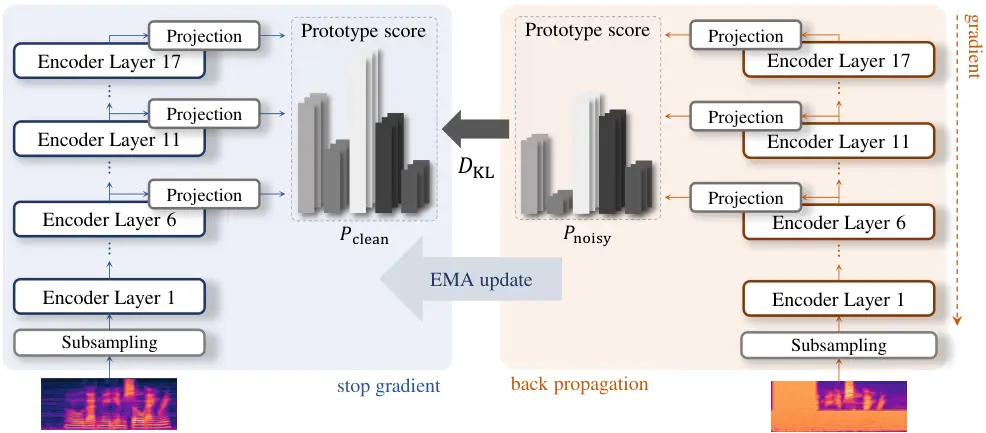
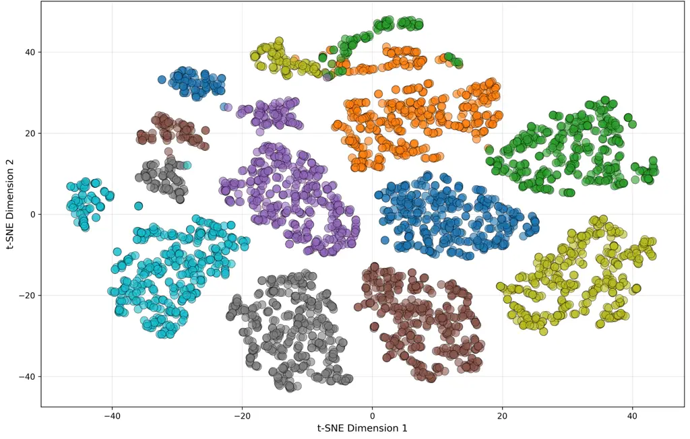
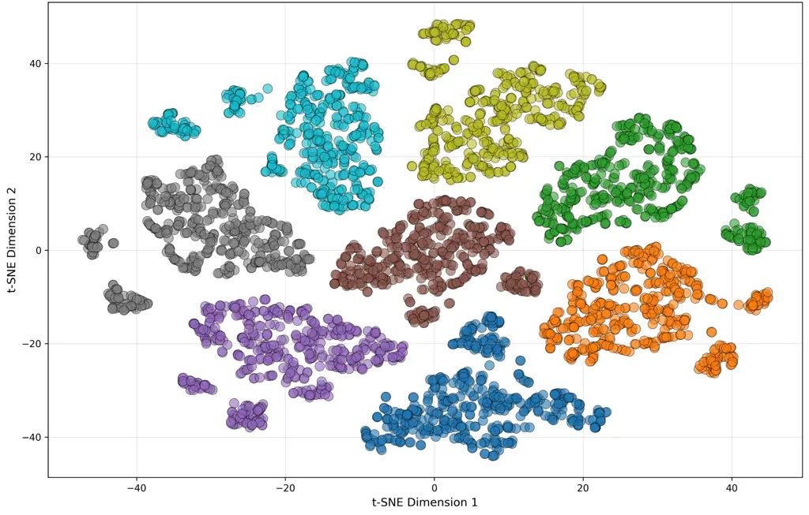
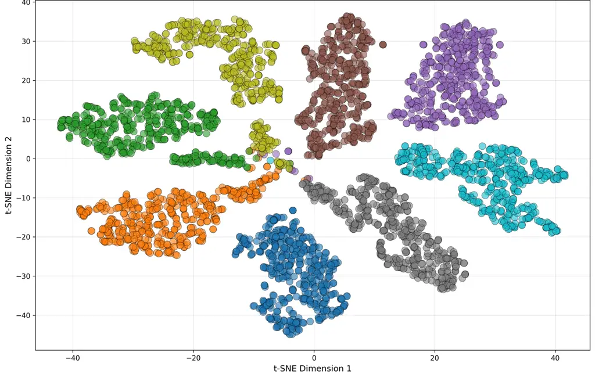
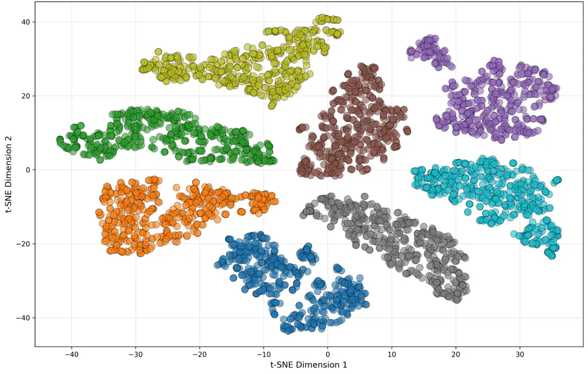

Baik^(†) Shin Lee Jeong Park

# DASH: Dual-View Self-Distillation with Multi-Layer Hidden Representations for Robust Speech Recognition

Jaeeun    Ui-Hyeop    Jiwon    Woocheol    Hyung-Min

###### Abstract

Automatic Speech Recognition (ASR) often degrades in real-world noisy
environments, making noise robustness essential for deployment.
Supervised noise-augmented fine-tuning is a common remedy, but it can
introduce a robustness–clean trade-off and overfit to specific
corruptions, degrading recognition in clean conditions. We propose DASH,
a self-distillation framework that improves robustness by learning
clean–noisy consistency from paired views. DASH distills hidden
representations from multiple encoder layers to capture features from
low-level acoustics to high-level semantics, and stabilizes training by
minimizing KL divergence between prototype assignment distributions of
clean and noisy views. Experiments on LibriSpeech show that DASH
consistently improves recognition under diverse noisy conditions while
preserving clean accuracy, achieved by a label-free pre-training stage
with minimal additional overhead (about 4% of fine-tuning time) beyond
standard fine-tuning.

###### keywords

self-distillation, noise robustness, speech recognition

^(†)^(†)address: ¹Department of Artificial Intelligence, Sogang
University, Republic of Korea  
²Department of Electronic Engineering, Sogang University, Republic of
Korea ^(†)^(†)email: {jaeeunbaik, dmlguq123, jiwonnn, charmingwc,
hpark}@sogang.ac.kr

## 1 Introduction

^(†)^(†)footnotetext: ^(†)Currently with Cochl.

Recent advancements in automatic speech recognition (ASR) have been
largely driven by the scaling up of model architectures and the
utilization of massive training datasets, leading to significant
performance improvements \[1, 2, 3, 4\]. Concurrently, the evolution of
speech foundation models has further propelled ASR capabilities by
leveraging self-supervised learning (SSL) to extract rich acoustic
representations without the need for manual labels \[5, 6, 7, 8, 9\].
Despite these remarkable achievements, ASR systems continue to suffer
from severe performance degradation in noisy conditions, which remains a
critical bottleneck for their reliable deployment in real-world
applications. Moreover, naively incorporating noise into the supervised
training process to adapt the model to noisy conditions often
compromises its performance in clean environments.

Therefore, to enhance robustness against noise while preserving baseline
accuracy in clean conditions, it is essential for ASR models to learn
consistent feature representations across clean and noisy domains. To
achieve such feature consistency, self-distillation-based learning
techniques, such as BYOL, have been explored \[10\]. Specifically, BYOL
introduced a bootstrap-style, non-contrastive framework in which
differently augmented views are processed by paired networks (one of
which is a momentum target) to learn representations without relying on
negative samples. Building upon this paradigm, subsequent methods like
DINO and iBOT have achieved remarkable success in the computer vision
domain \[11, 12\].

Within the speech recognition domain itself, recent studies have emerged
with a similar problem awareness, aiming to enhance robustness through
consistency and contrastive learning paradigms. For instance,
Speech-SimCLR \[13\] explored self-supervised representation learning by
maximizing the agreement between differently augmented speech samples in
the latent space, coupled with a reconstruction objective. Similarly,
CR-CTC \[14\] introduced consistency regularization directly into the
Connectionist Temporal Classification (CTC) framework, enforcing the
model to yield consistent output distributions across diverse augmented
views of the input, which effectively mitigated overfitting to specific
noise patterns. Furthermore, HuBERT-VIC \[15\] extended this concept to
speech foundation models by employing Variance-Invariance-Covariance
(VIC) regularization, explicitly aligning the representations of clean
and noisy speech to ensure robust generalization across various noise
conditions.

Building on these insights, we present DASH (DuAl-view Self-distillation
with multi-layer Hidden representations), a framework that learns
noise-invariant speech representations by distilling clean-to-noisy
consistency across multiple encoder layers. To achieve this, we employ a
self-distillation approach with an Exponential Moving Average (EMA) to
establish a stable teacher-student dynamic \[16\]. Furthermore, to
circumvent gradient interference and delayed convergence in joint
optimization, we adopt a decoupled two-stage training paradigm. Unlike
hybrid joint-training approaches, the decoupled architecture allows the
initial pre-training stage to operate without text labels, enabling DASH
to leverage unlabeled speech data. The model first stabilizes its
parameters through distillation-only pre-training, followed by
supervised ASR fine-tuning for target task adaptation. DASH introduces
only a lightweight encoder-only distillation stage (5k steps) before
standard fine-tuning, adding a small computational overhead while
improving noise robustness. Finally, to ensure training stability and
prevent trivial shortcuts, DASH optimizes prototype-based probability
distributions via Kullback-Leibler (KL) divergence across multiple
intermediate encoder layers, effectively capturing both low-level
acoustics and high-level semantics \[17\]. Experiments on
LibriSpeech \[18\] show that DASH consistently enhances recognition
under noisy conditions, indicating better generalization beyond
fine-tuning alone.



Figure 1: Overview of the DASH pipeline.

## 2 DASH

### 2.1 Clean-Noisy Pair with Dual Encoder Branches

Figure 1 illustrates the overall architecture of DASH. The core
intuition behind DASH is to encourage the model to learn noise-invariant
speech representations by comparing paired clean and noisy views of the
same utterance. To achieve this, we instantiate a dual-branch encoder
architecture consisting of a teacher (clean) network and a student
(noisy) network. The clean network processes the unperturbed view
$`x_{\text{clean}}`$, extracting clean acoustic features, while the
noisy network processes the augmented, noisy view $`x_{\text{noisy}}`$.

In this teacher-student framework, $`x_{\text{clean}}`$ serves as the
input to the teacher network, providing stable and informative target
representations. To ensure consistent and patient distillation \[19\],
the weights of the clean network ($`\theta_{\text{teacher}}`$) are not
updated via standard backpropagation. Instead, they are updated using an
EMA of the student network’s weights ($`\theta_{\text{student}}`$). This
prevents the teacher’s weights from fluctuating rapidly with each
step-wise loss calculation, preserving historical parameter information
while smoothly reflecting newly acquired knowledge:

```math
\displaystyle\theta_{\text{teacher}}^{(t+1)}=\alpha\cdot\theta_{\text{teacher}}^{(t)}+(1-\alpha)\cdot\theta_{\text{student}}^{(t)}, \tag{1}
```

where $`\alpha`$ denotes the EMA decay rate. Because the clean network
does not require gradient computation, we apply a stop-gradient operator
to its outputs. By minimizing the divergence between the clean and noisy
outputs, the student network is explicitly guided to focus on robust
speech characteristics that are invariant to environmental noise.
Formally, this process enables the baseline model to learn an invariant
latent representation mapping $`f:\mathcal{X}\to\mathcal{Y}`$ that
remains stable across different noise transformations
$`t\in\mathcal{T}`$ applied to the input space $`\mathcal{X}`$, such
that

```math
\displaystyle f(t(x))\approx f(x)\quad\text{for any }x\in\mathcal{X}\text{ and }t\in\mathcal{T}. \tag{2}
```

### 2.2 Distillation Based on Prototypes

A critical challenge when applying self-supervised learning objectives
to predictive models in a supervised setting is the shortcut problem,
where the model bypasses learning meaningful representations in favor of
trivial solutions, potentially degrading its primary objective of speech
recognition \[20, 13\]. Simply minimizing the distance between
continuous teacher and student logits often exacerbates this issue. This
phenomenon is particularly problematic in ASR, where the model may
exploit low-level acoustic correlations or specific noise patterns
instead of capturing robust phonetic information.

To prevent representational collapse in the continuous feature space and
avoid these superficial shortcuts, DASH introduces a prototype-based
distillation approach. We employ a projection head followed by k-means
clustering to quantize the continuous encoder outputs into discrete
acoustic units. This transforms the continuous representation space into
a structured categorical space. These discrete prototypes serve as
robust targets for the self-supervised objective, effectively replacing
continuous soft predictions and guiding the model to learn higher-level
semantic structures.

### 2.3 Training Objective

As outlined in our two-stage training paradigm, the pre-training phase
relies exclusively on the distillation objective. Let $`f_{\theta}`$
denote the encoder and $`h_{\theta}`$ the projection head. For an input
$`\mathbf{x}\in\mathbb{R}^{T\times D_{\text{in}}}`$, the encoder
produces hidden representations
$`f_{\theta}(\mathbf{x})\in\mathbb{R}^{T\times D_{\text{enc}}}`$. To
comprehensively capture both low-level acoustics and high-level
semantics, we extract these hidden representations from multiple
intermediate layers of the encoder (e.g., layers 6, 11, and 17, as shown
in Figure 1). These multi-layer outputs are independently passed through
the projection head to obtain lower-dimensional embeddings:

```math
\mathbf{z}=h_{\theta}(f_{\theta}(\mathbf{x}))\in\mathbb{R}^{T\times D_{K}}. \tag{3}
```

Next, we compute the similarity between each frame embedding
$`\mathbf{z}_{b,t}\in\mathbb{R}^{D_{K}}`$ and a set of $`K`$ prototypes
$`\mathbf{C}\in\mathbb{R}^{K\times D_{K}}`$, which are obtained via
k-means clustering over a buffer of projection vectors. The
frame-prototype similarity scores are then normalized into probability
distributions using a softmax function with temperature $`\tau_{temp}`$:

```math
\displaystyle P_{\text{clean}}(k) \displaystyle=\frac{\exp\bigl(\mathbf{z}^{\top}_{\text{clean}}\mathbf{c}_{k}/\tau_{temp}\bigr)}{\sum_{j=1}^{K}\exp\bigl(\mathbf{z}^{\top}_{\text{clean}}\mathbf{c}_{j}/\tau_{temp}\bigr)}, \tag{4}
```

```math
\displaystyle P_{\text{noisy}}(k) \displaystyle=\frac{\exp\bigl(\mathbf{z}^{\top}_{\text{noisy}}\mathbf{c}_{k}/\tau_{temp}\bigr)}{\sum_{j=1}^{K}\exp\bigl(\mathbf{z}^{\top}_{\text{noisy}}\mathbf{c}_{j}/\tau_{temp}\bigr)}.
```

Finally, to enforce consistency across the dual views, we minimize the
KL divergence from the stable clean distribution to the online noisy
distribution. The overall DASH pre-training objective is formulated as

```math
\mathcal{L}_{\text{DASH}}=\frac{1}{T}\sum_{t=1}^{T}D_{\text{KL}}\Bigl(\mathrm{sg}\bigl(P_{\text{clean}}\bigr)\parallel P_{\text{noisy}}\Bigr), \tag{5}
```

where $`\mathrm{sg}(\cdot)`$ denotes the stop-gradient operator. This
formulation ensures that gradients flow exclusively through the student
(noisy) branch, encouraging it to produce prototype assignments that are
invariant to acoustic perturbations while anchoring to the slowly
evolving, clean targets of the teacher network.

|                                              |                     |            |            |                    |      |       |                   |      |       |                     |      |       |
| -------------------------------------------- | ------------------- | ---------- | ---------- | ------------------ | ---- | ----- | ----------------- | ---- | ----- | ------------------- | ---- | ----- |
| Augmentation Method                          |                     | test-clean | test-other | test-clean + white |      |       | test-clean + pink |      |       | test-clean + babble |      |       |
| Phase 1                                      | Phase 2             |            |            | 0 dB               | 5 dB | 10 dB | 0 dB              | 5 dB | 10 dB | 0 dB                | 5 dB | 10 dB |
| Baseline                                     |                     |            |            |                    |      |       |                   |      |       |                     |      |       |
| -                                            | -                   | 2.58       | 5.41       | 19.04              | 8.47 | 4.65  | 19.79             | 7.11 | 4.01  | 19.80               | 6.73 | 3.90  |
| Fine-tuning only                             |                     |            |            |                    |      |       |                   |      |       |                     |      |       |
| -                                            | Clean               | 2.00       | 4.45       | 15.49              | 6.68 | 3.55  | 16.73             | 5.77 | 3.12  | 19.11               | 5.79 | 2.92  |
| -                                            | Noisy (0 to 15 dB)  | 2.07       | 4.35       | 10.89              | 5.22 | 3.18  | 11.82             | 4.70 | 2.90  | 13.78               | 4.77 | 2.78  |
| -                                            | Noisy (-5 to 10 dB) | 2.14       | 4.40       | 10.34              | 5.02 | 3.14  | 11.12             | 4.50 | 2.83  | 13.06               | 4.50 | 2.71  |
| DASH (self-distillation $`\to`$ fine-tuning) |                     |            |            |                    |      |       |                   |      |       |                     |      |       |
| Noisy (0 to 15 dB)                           | Clean               | 1.99       | 4.10       | 11.89              | 5.33 | 3.14  | 12.78             | 4.61 | 2.75  | 16.48               | 5.07 | 2.72  |
| Noisy (0 to 15 dB)                           | Noisy (0 to 15 dB)  | 1.96       | 4.15       | 10.27              | 4.88 | 3.00  | 11.16             | 4.40 | 2.71  | 13.11               | 4.51 | 2.64  |
| Noisy (-5 to 10 dB)                          | Noisy (-5 to 10 dB) | 2.02       | 4.25       | 10.34              | 4.81 | 3.05  | 10.92             | 4.42 | 2.76  | 12.78               | 4.42 | 2.68  |

Table 1: WER (%) of baseline, fine-tuning model with ASR(TDT-CTC) loss,
and proposed DASH model on LibriSpeech test-clean/test-other and
NOISEX-92 mixed conditions. All augmentation settings include SpecAug.
When training in the phases, noise mixing is implemented in two ways,
SNR range 0 to 15 dB or -5 to 10 dB. We implemented DASH on the baseline
model which includes encoder-only training with unlabeled dataset
(phase 1) and fine-tuning with labeled dataset (phase 2).

|             |              |       |     |            |            |
| ----------- | ------------ | ----- | --- | ---------- | ---------- |
| Method      | Augmentation |       |     | test-clean | test-other |
|             | SpecAug      | Noise | RIR |            |            |
| Baseline    |              |       |     | 2.58       | 5.41       |
| Fine-tuning |              |       |     | 2.00       | 4.45       |
| DASH        | ✓            |       |     | 2.01       | 4.16       |
|             | ✓            | ✓     |     | 1.99       | 4.10       |
|             | ✓            |       | ✓   | 1.99       | 4.12       |
|             |              | ✓     | ✓   | 1.97       | 4.18       |
|             | ✓            | ✓     | ✓   | 2.01       | 4.18       |

Table 2: WER (%) of effect of augmentation in self-distillation to make
noisy pair. Fine-tuning was performed on clean data.

## 3 Experimental Setup

### 3.1 Dataset and Augmentation

For training and dataset, we use LibriSpeech \[18\] train-960 for
supervised ASR training and LibriLight Medium \[21\] for encoder-only
self-distillation. For evaluation, we used greedy decoding without
external language models and report WER on test-clean and test-other of
LibriSpeech.

During self-distillation, the clean view was left unaugmented while the
noisy view is constructed using augmentations. We consider three
strategies: (i) SpecAugment \[22\], (ii) additive noise mixing with
segments from MUSAN \[23\] at signal-to-noise ratios (SNRs) uniformly
sampled between -5 and 15 dB, and (iii) reverberation by convolution
with mono room impulse responses (RIRs) from the DNS Challenge 2021
dataset \[24\].

To select the default noisy-view construction, we compare several
augmentation combinations in Table 2. While DASH performs robustly
across all choices (yielding consistent gains on test-other),
SpecAugment+Noise provides the strongest overall trade-off and achieves
the best test-other result among the tested variants. We therefore
adopted SpecAugment+Noise as our default setting throughout the
experiments. We also observe that using all three augmentations
simultaneously slightly degraded performance, suggesting that overly
strong corruption can blur phonetic cues.

### 3.2 Implementation Details

We adopt nvidia/parakeet-tdt*ctc-110m as our baseline model, a hybrid
ASR architecture combining Token-and-Duration Transducer (TDT) \[25\]
and CTC \[26\]. The encoder consists of 17 FastConformer \[2\] layers
with 512-dimensional hidden representations. The model uses a hybrid
loss function combining TDT and CTC as
$`\mathcal{L}*{\text{ASR}}=0.7\cdot\mathcal{L}_{\text{TDT}}+0.3\cdot\mathcal{L}_{\text{CTC}}`$.
We applied a dropout rate of 0.1 for regularization. All architectural
configurations followed the default settings provided by the Parakeet
toolkit.

In self-distillation stage, the encoder from the model was trained with
our proposed loss $`\mathcal{L}_{\text{DASH}}`$. We applied early
stopping after 5k steps, corresponding to $`\sim`$3,230 hours of
unlabeled speech from the LibriLight Medium. We froze the prediction and
joint networks of the baseline model and update only the encoder. For
fine-tuning, the full model was trained for 100k steps on LibriSpeech
train-960 with the ASR loss $`\mathcal{L}_{\text{ASR}}`$ using the same
optimizer configuration and batch settings. All experiments were
conducted on two NVIDIA GeForce RTX 3090 GPUs. Notably, the additional
cost of the self-distillation stage was marginal: on a single RTX 3090,
fine-tuning takes roughly 12 hours, whereas self-distillation takes
about half an hour (i.e., $`\sim`$4% of the fine-tuning time).

For prototype construction, we extracted encoder representations from
100,000 randomly sampled utterances from the LibriLight Medium and
clustered them using k-means with
$`K\hskip-1.42262pt=\hskip-1.42262pt512`$. We used temperature-scaled KL
divergence ($`\tau_{temp}\hskip-1.70717pt=\hskip-1.70717pt3.5`$) to
match student-teacher distributions. The teacher model was updated via
EMA with a decay rate of $`\alpha=0.999`$. Training used the AdamW
optimizer with a learning rate $`5\times 10^{-5}`$, weight decay
$`10^{-4}`$, and $`\beta`$ parameters \[0.9, 0.999\]. We apply gradient
clipping with a L1-norm of 1 and employed Lhotse dynamic bucketing with
a batch duration up to 500 seconds.

## 4 Experimental Results

### 4.1 Results on SNR Range

Table 1 presents WER evaluations of the baseline, the standard
fine-tuning approaches, and the proposed DASH framework across
test-clean, test-other, and simulated noisy conditions. NOISEX-92 \[27\]
was used for noise mixing, which consists of babble, pink, and white
noise. Consistent with our preliminary hypothesis, simply incorporating
noise during standard supervised fine-tuning introduced a trade-off.
While the fine-tuning only model trained on noisy data (0 to 15 dB)
improved noise robustness compared to clean fine-tuning, it
simultaneously degraded the performance on test-clean. Conversely, DASH
mitigated this trade-off. The DASH model (pre-trained and fine-tuned on
0 to 15 dB noise) not only outperformed its fine-tuning counterpart
across all noisy conditions but also achieved the best overall
performance on test-clean. Across all configurations, DASH yielded
competitive test-clean results, closely matching or even surpassing the
clean-only fine-tuning baseline. This demonstrates that our
prototype-based self-distillation effectively extracts clean speech
characteristics, preventing the model from overfitting to specific noise
patterns and thereby preserving clean baseline accuracy.

The inherent advantage of our decoupled two-stage paradigm is exhibited
in the DASH (Noisy $`\rightarrow`$ Clean) configuration. Although the
model had been unexposed to noisy data during the supervised fine-tuning
phase, it exhibited substantial noise robustness compared to all the
fine-tuning-only models. This confirms that the label-free pre-training
phase successfully establishes noise-invariant representations
independently of the ASR objective. Furthermore, DASH demonstrates
better generalization to unseen acoustic variations and challenging
speaker characteristics, as shown in test-other results. While standard
fine-tuning approaches struggled to drop below 4.35%, all DASH
configurations consistently achieve significant improvements, yielding
WERs between 4.10% and 4.25%. Because the pre-training phase
comprehensively handles the robust feature extraction, the model
maintained high stability and generalization on out-of-domain data
(test-other), independent of the specific augmentation strategies
employed during the fine-tuning.

### 4.2 Effect of EMA and Layer Selection

|                                        |            |            |
| -------------------------------------- | ---------- | ---------- |
| Method                                 | test-clean | test-other |
| Baseline                               | 2.58       | 5.41       |
| Fine-tuning only                       | 2.14       | 4.40       |
| DASH (Self-Distillation)               | 2.02       | 4.25       |
|    w/ EMA (1000-step interval)         | 2.04       | 4.27       |
|    w/o EMA (freeze)                    | 2.05       | 4.30       |
|    w/o EMA (freeze) & Single-layer(17) | 2.10       | 4.45       |

Table 3: Ablation on teacher update and layer selection in
self-distillation, varying EMA update scheme (step-wise vs. 1000-step
vs. frozen) and the distillation depth (multi-layer vs. final layer
only).

Table 3 highlights the importance of the EMA update strategy and the
multi-layer architecture during the self-distillation phase. The
analysis reveals three critical insights regarding the teacher-student
dynamic. The proposed DASH framework, which continuously updates the
clean (teacher) network at every single step using EMA, yielded the most
robust and optimal performance across all test sets. This confirms that
a smoothly and continuously evolving teacher provides the most stable
and effective guidance for the student network. Also, reducing the
frequency of the EMA updates or freezing the teacher network entirely
results in a consistent degradation of recognition accuracy. Without the
continuous feedback loop provided by the step-wise EMA, the static or
delayed teacher failed to adapt its target representations, thereby
limiting the student model’s ability to learn generalized acoustic
features.

The most severe performance drop occurred when the teacher network was
frozen and the distillation was restricted solely to the final encoder
layer. Under this constrained setting, the model’s generalization
capability on challenging acoustic conditions significantly
deteriorated, even falling behind the standard fine-tuning baseline.
These results indicate that our multi-layer distillation approach is
indispensable; distilling intermediate hierarchical representations is
just as critical as maintaining a dynamic teacher for acquiring
noise-invariant speech characteristics.



(a)



(b)



(c)



(d)

Figure 2: t-SNE visualization of encoder representations extracted from
Layers 6 and 17 for the fine-tuning-only baseline (left) and DASH
(right). Points are colored by utterance.

### 4.3 Visualization of Noise-Invariance

To qualitatively assess noise-invariance, we visualized encoder
representations using t-SNE. We randomly selected several utterances and
added noise from the NOISEX-92 with SNR of 0 dB, then extracted
representations from different encoder layers (Layers 6 and 17) and
projected them onto 2D. As shown in Figure 2, the fine-tuning-only
baseline exhibits broader and sometimes fragmented clusters.
Specifically, in Layer 6, while representations from both models show
some susceptibility to noise, DASH groups these low-level acoustic
features much more cohesively. In Layer 17, although both models
naturally form more refined semantic boundaries, DASH still achieves
noticeably tighter clusters, effectively eliminating the residual noise
entanglement seen in the baseline. Overall, this consistent layer-wise
behavior indicates that DASH robustly aligns noisy examples with their
clean counterparts across both acoustic and semantic dimensions.

## 5 Conclusion

In this paper, we proposed DASH, a dual-view self-distillation framework
that improves ASR robustness by enforcing clean–noisy consistency. DASH
adopts a decoupled two-stage pipeline: label-free encoder pre-training
with an EMA teacher and prototype-based KL distillation across multiple
encoder layers, followed by supervised fine-tuning. Experiments on
LibriSpeech with noisy mixtures demonstrate that DASH consistently
reduces Word Error Rate (WER) under diverse noise types and SNRs while
preserving clean baseline accuracy, effectively mitigating the
robustness–clean trade-off typically observed in noise-augmented
fine-tuning. Furthermore, our ablation studies verify that step-wise EMA
updates and multi-layer distillation are crucial components for
achieving stable performance gains.

## 6 Acknowledgments

This work was partly supported by Institute of Information &
communications Technology Planning & Evaluation(IITP) grant funded by
the Korea government(MSIT)(RS-2022-II220989, Development of Artificial
Intelligence Technology for Multi-speaker Dialog Modeling) and National
Research Foundation of Korea(NRF) grant funded by the Korea
government(MSIT)(RS-2026-25470024, Research on Spatial Audio Reasoning
with Large Language Models across Diverse Microphone Arrays).

## 7 Generative AI Use Disclosure

Generative AI tools were used solely for editing and polishing the
manuscript to improve linguistic clarity. These tools were not employed
to produce any significant portion of the technical or scientific
content, and the authors remain fully responsible and accountable for
the integrity and final results of the work.

## References

- \[1\] A. Radford, J. W. Kim, T. Xu, G. Brockman, C. McLeavey, and I.
  Sutskever (2023) Robust speech recognition via large-scale weak
  supervision. In International conference on machine learning,
  pp. 28492–28518. Cited by: §1.
- \[2\] D. Rekesh, N. R. Koluguri, S. Kriman, S. Majumdar, V.
  Noroozi, H. Huang, O. Hrinchuk, K. Puvvada, A. Kumar, J. Balam, and B.
  Ginsburg (2023) Fast Conformer With Linearly Scalable Attention For
  Efficient Speech Recognition. In 2023 IEEE Automatic Speech
  Recognition and Understanding Workshop (ASRU), pp. 1–8. External
  Links: [Document](https://dx.doi.org/10.1109/ASRU57964.2023.10389701)
  Cited by: §1, §3.2.
- \[3\] A. H. Liu, A. Ehrenberg, A. Lo, C. Denoix, C. Barreau, G.
  Lample, J. Delignon, K. Raghavi Chandu, P. von Platen, P. R.
  Muddireddy, et al. (2025) Voxtral. arXiv e-prints, pp. arXiv–2507.
  Cited by: §1.
- \[4\] X. Shi, X. Wang, Z. Guo, Y. Wang, P. Zhang, X. Zhang, Z. Guo, H.
  Hao, Y. Xi, B. Yang, et al. (2026) Qwen3-ASR Technical Report. arXiv
  e-prints, pp. arXiv–2601. Cited by: §1.
- \[5\] A. T. Liu, S. Yang, P. Chi, P. Hsu, and H. Lee (2020)
  Mockingjay: Unsupervised Speech Representation Learning with Deep
  Bidirectional Transformer Encoders. In ICASSP 2020-2020 IEEE
  International Conference on Acoustics, Speech and Signal Processing
  (ICASSP), pp. 6419–6423. External Links:
  [Document](https://dx.doi.org/10.1109/ICASSP40776.2020.9054458) Cited
  by: §1.
- \[6\] A. Baevski, Y. Zhou, A. Mohamed, and M. Auli (2020) Wav2vec 2.0:
  A framework for self-supervised learning of speech representations.
  Advances in neural information processing systems 33, pp. 12449–12460.
  Cited by: §1.
- \[7\] W. Hsu, B. Bolte, Y. H. Tsai, K. Lakhotia, R. Salakhutdinov,
  and A. Mohamed (2021) HuBERT: Self-Supervised Speech Representation
  Learning by Masked Prediction of Hidden Units. IEEE/ACM Transactions
  on Audio, Speech, and Language Processing 29, pp. 3451–3460. External
  Links: [Document](https://dx.doi.org/10.1109/TASLP.2021.3122291) Cited
  by: §1.
- \[8\] A. Baevski, W. Hsu, Q. Xu, A. Babu, J. Gu, and M. Auli (2022)
  Data2vec: A General Framework for Self-supervised Learning in Speech,
  Vision and Language. In Proceedings of the 39th International
  Conference on Machine Learning, K. Chaudhuri, S. Jegelka, L. Song, C.
  Szepesvari, G. Niu, and S. Sabato (Eds.), Proceedings of Machine
  Learning Research, Vol. 162, pp. 1298–1312. External Links:
  [Link](https://proceedings.mlr.press/v162/baevski22a.html) Cited by:
  §1.
- \[9\] S. Chen, C. Wang, Z. Chen, Y. Wu, S. Liu, Z. Chen, J. Li, N.
  Kanda, T. Yoshioka, X. Xiao, J. Wu, L. Zhou, S. Ren, Y. Qian, Y.
  Qian, J. Wu, M. Zeng, X. Yu, and F. Wei (2022) WavLM: Large-Scale
  Self-Supervised Pre-Training for Full Stack Speech Processing. IEEE
  Journal of Selected Topics in Signal Processing 16 (6), pp. 1505–1518.
  External Links:
  [Document](https://dx.doi.org/10.1109/JSTSP.2022.3188113) Cited by:
  §1.
- \[10\] J. Grill, F. Strub, F. Altché, C. Tallec, P. Richemond, E.
  Buchatskaya, C. Doersch, B. Avila Pires, Z. Guo, M. Gheshlaghi Azar,
  et al. (2020) Bootstrap your own latent-a new approach to
  self-supervised learning. Advances in neural information processing
  systems 33, pp. 21271–21284. Cited by: §1.
- \[11\] J. Zhou, C. Wei, H. Wang, W. Shen, C. Xie, A. Yuille, and T.
  Kong (2022) iBOT: Image BERT Pre-Training with Online Tokenizer. In
  International Conference on Learning Representations (ICLR), Cited by:
  §1.
- \[12\] M. Caron, H. Touvron, I. Misra, H. Jégou, J. Mairal, P.
  Bojanowski, and A. Joulin (2021) Emerging Properties in
  Self-Supervised Vision Transformers. In Proceedings of the IEEE/CVF
  International Conference on Computer Vision (ICCV), pp. 9650–9660.
  Cited by: §1.
- \[13\] D. Jiang, W. Li, M. Cao, W. Zou, and X. Li (2021) Speech
  SimCLR: Combining Contrastive and Reconstruction Objective for
  Self-supervised Speech Representation Learning. In Proc. Interspeech,
  pp. 1544–1548. External Links:
  [Document](https://dx.doi.org/10.21437/Interspeech.2021-391) Cited by:
  §1, §2.2.
- \[14\] Z. Yao, W. Kang, X. Yang, F. Kuang, L. Guo, H. Zhu, Z. Jin, Z.
  Li, L. Lin, and D. Povey (2025) CR-CTC: Consistency Regularization on
  CTC for Improved Speech Recognition. In International Conference on
  Learning Representations (ICLR), Cited by: §1.
- \[15\] H. Ahn, K. Jang, and H. Kim (2025) HuBERT-VIC: Improving
  Noise-Robust Automatic Speech Recognition of Speech Foundation Model
  via Variance-Invariance-Covariance Regularization. In Interspeech
  2025, pp. 3419–3423. External Links: ISSN 2958-1796,
  [Document](https://dx.doi.org/10.21437/Interspeech.2025-397) Cited by:
  §1.
- \[16\] A. Tarvainen and H. Valpola (2017) Mean teachers are better
  role models: Weight-averaged consistency targets improve
  semi-supervised deep learning results. In Advances in Neural
  Information Processing Systems, I. Guyon, U. V. Luxburg, S. Bengio, H.
  Wallach, R. Fergus, S. Vishwanathan, and R. Garnett (Eds.), Vol. 30.
  External Links:
  [Link](https://proceedings.neurips.cc/paper_files/paper/2017/file/68053af2923e00204c3ca7c6a3150cf7-Paper.pdf)
  Cited by: §1.
- \[17\] H. Chang, S. Yang, and H. Lee (2022) Distilhubert: Speech
  Representation Learning by Layer-Wise Distillation of Hidden-Unit
  Bert. In ICASSP 2022 - 2022 IEEE International Conference on
  Acoustics, Speech and Signal Processing (ICASSP), pp. 7087–7091.
  External Links:
  [Document](https://dx.doi.org/10.1109/ICASSP43922.2022.9747490) Cited
  by: §1.
- \[18\] V. Panayotov, G. Chen, D. Povey, and S. Khudanpur (2015)
  Librispeech: An ASR corpus based on public domain audio books. In
  ICASSP 2015-2015 IEEE International Conference on Acoustics, Speech
  and Signal Processing (ICASSP), pp. 5206–5210. External Links:
  [Document](https://dx.doi.org/10.1109/ICASSP.2015.7178964) Cited by:
  §1, §3.1.
- \[19\] L. Beyer, X. Zhai, A. Royer, L. Markeeva, R. Anil, and A.
  Kolesnikov (2022) Knowledge Distillation: A Good Teacher Is Patient
  and Consistent. In Proceedings of the IEEE/CVF Conference on Computer
  Vision and Pattern Recognition (CVPR), pp. 10925–10934. Cited by:
  §2.1.
- \[20\] R. Geirhos, J. Jacobsen, C. Michaelis, R. Zemel, W. Brendel, M.
  Bethge, and F. A. Wichmann (2020) Shortcut learning in deep neural
  networks. Nature Machine Intelligence 2 (11), pp. 665–673. External
  Links: ISSN 2522-5839,
  [Link](https://doi.org/10.1038/s42256-020-00257-z),
  [Document](https://dx.doi.org/10.1038/s42256-020-00257-z) Cited by:
  §2.2.
- \[21\] J. Kahn, M. Rivière, W. Zheng, E. Kharitonov, Q. Xu, P.E.
  Mazaré, J. Karadayi, V. Liptchinsky, R. Collobert, C. Fuegen, T.
  Likhomanenko, G. Synnaeve, A. Joulin, A. Mohamed, and E. Dupoux (2020)
  Libri-Light: A Benchmark for ASR with Limited or No Supervision. In
  ICASSP 2020-2020 IEEE International Conference on Acoustics, Speech
  and Signal Processing (ICASSP), pp. 7669–7673. External Links:
  [Document](https://dx.doi.org/10.1109/ICASSP40776.2020.9052942) Cited
  by: §3.1.
- \[22\] D. S. Park, W. Chan, Y. Zhang, C. Chiu, B. Zoph, E. D. Cubuk,
  and Q. V. Le (2019) SpecAugment: A Simple Data Augmentation Method for
  Automatic Speech Recognition. In Proc. Interspeech, interspeech_2019,
  pp. 2613–2617. External Links:
  [Link](http://dx.doi.org/10.21437/Interspeech.2019-2680),
  [Document](https://dx.doi.org/10.21437/interspeech.2019-2680) Cited
  by: §3.1.
- \[23\] D. Snyder, G. Chen, and D. Povey (2015) MUSAN: A Music, Speech,
  and Noise Corpus. Note: arXiv:1510.08484 External Links:
  [Link](https://arxiv.org/abs/1510.08484) Cited by: §3.1.
- \[24\] C. K. A. Reddy, H. Dubey, K. Koishida, A. Nair, V. Gopal, R.
  Cutler, S. Braun, H. Gamper, R. Aichner, and S. Srinivasan (2021)
  Interspeech 2021 Deep Noise Suppression Challenge. Note:
  arXiv:2101.01902 External Links:
  [Link](https://arxiv.org/abs/2101.01902) Cited by: §3.1.
- \[25\] H. Xu, F. Jia, S. Majumdar, H. Huang, S. Watanabe, and B.
  Ginsburg (2023) Efficient Sequence Transduction by Jointly Predicting
  Tokens and Durations. In Proceedings of the 40th International
  Conference on Machine Learning, A. Krause, E. Brunskill, K. Cho, B.
  Engelhardt, S. Sabato, and J. Scarlett (Eds.), Proceedings of Machine
  Learning Research, Vol. 202, pp. 38462–38484. External Links:
  [Link](https://proceedings.mlr.press/v202/xu23g.html) Cited by: §3.2.
- \[26\] A. Graves, S. Fernández, F. Gomez, and J. Schmidhuber (2006)
  Connectionist temporal classification: labelling unsegmented sequence
  data with recurrent neural networks. In Proceedings of the 23rd
  International Conference on Machine Learning, ICML ’06, New York, NY,
  USA, pp. 369–376. External Links: ISBN 1-59593-383-2,
  [Link](https://doi.org/10.1145/1143844.1143891),
  [Document](https://dx.doi.org/10.1145/1143844.1143891) Cited by: §3.2.
- \[27\] A. Varga and H. J. M. Steeneken (1993) Assessment for automatic
  speech recognition: II. NOISEX-92: A database and an experiment to
  study the effect of additive noise on speech recognition systems.
  Speech Communication 12 (3), pp. 247–251. External Links: ISSN
  0167-6393,
  [Link](https://www.sciencedirect.com/science/article/pii/0167639393900953),
  [Document](https://dx.doi.org/https%3A//doi.org/10.1016/0167-6393%2893%2990095-3)
  Cited by: §4.1.
