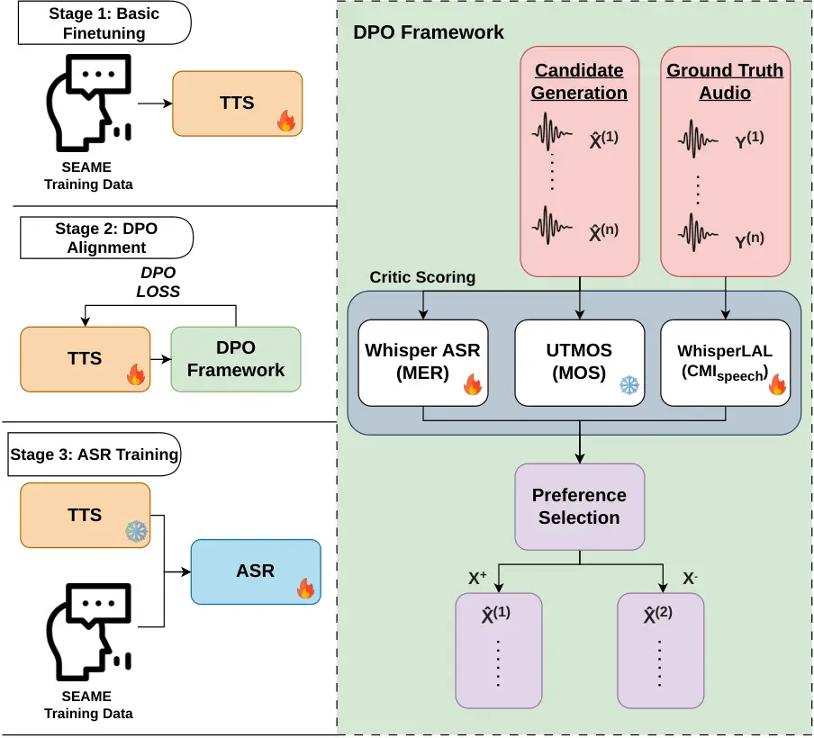

Yeo Li Peng Gopal Liu Garcia-Perera Sailor Wong Chng

# Improving Code-Switching ASR with Code-Mixing Guided Synthetic Speech

Yue Heng    Haoyang    Yizhou    Shreyas    Hexin    Leibny Paola   
Hardik B    Jeremy H. M    Eng Siong

###### Abstract

Code-switch (CS) Automatic Speech Recognition (ASR) remains challenging
due to limited availability of high quality CS text-speech pairs for
training. Although synthetic data augmentation via Text-to-speech (TTS)
has been explored, existing CS TTS approaches primarily optimise
reconstruction fidelity and do not explicitly enforce language-boundary
consistency, thereby limiting their effectiveness for CS ASR
augmentation. This paper proposes a code-mixing guided
preference-learning framework that steers synthetic speech generation
toward improved code-switching fidelity using the Code Mixing Index
(CMI). Experiments on the SEAME Mandarin-English conversational corpus
demonstrate that the proposed method enhances the utility of synthetic
data for ASR fine-tuning. Specifically, when fine-tuning Whisper Large,
the proposed approach reduces Mixed Error Rate (MER) from 12.1%/17.8% to
8.9%/14.2% on the DevMAN and DevSGE sets, respectively.

###### keywords

speech recognition, code-switching, speech generation, data
augmentation, reinforcement learning

^(†)^(†)address: ¹ College of Computing and Data Science, Nanyang
Technological University, Singapore  
² Institute for Infocomm Research (I²R), A^(⋆)STAR, Singapore  
³ HLT-COE & CLSP, Johns Hopkins University, USA  
⁴ Google DeepMind, Singapore ^(†)^(†)email: yuehengyeo001@e.ntu.edu.sg;
hexin.liu@ntu.edu.sg

## 1 Introduction

Code-Switching (CS), the alternation of multiple languages within a
single utterance, is a phenomenon in multilingual communities \[1, 2,
3\]. Despite substantial advances in Automatic Speech Recognition (ASR),
recognising conversational CS speech remains challenging due to language
alternation, cross-lingual phonetic interference, and informal speaking
styles \[4, 5\]. These challenges result from the scarcity of
large-scale, high-quality transcribed CS corpora such as SEAME \[6\],
limiting the effectiveness of modern data-intensive ASR systems. As a
result, strong end-to-end architectures, including large pretrained
models such as Whisper, struggle to generalise robustly to spontaneous
conversational CS \[7, 8, 9\].

To address data scarcity, data augmentation via text-to-speech (TTS) has
become a practical strategy for improving ASR performance in
low-resource and domain-mismatched settings \[10, 11, 12, 13\].
Multilingual and multi-speaker TTS systems enable scalable generation of
labelled speech while introducing speaker and acoustic variability,
which has been shown to improve ASR robustness and generalisation \[14,
15, 16\]. In code-switching contexts, prior studies have explored
generating synthetic bilingual speech or phrase-mixed code-switching
data to compensate for limited code-switching conversational
recordings \[17, 18, 19\]. These approaches primarily emphasise acoustic
diversity or text coverage, demonstrating that synthetic data can reduce
recognition errors when combined with real speech. However, existing
augmentation strategies generally assume that all synthesised utterances
are equally informative, without explicitly assessing whether the
synthesised data’s language alternation patterns in conversational
code-switching structure is accurate.

Code-Mixing Index (CMI) is a text-based metric that provides a simple
and interpretable measure of language mixing balance within a tokenized
multilingual sequence \[20\]. While CMI has been widely used to analyze
code-switching text \[21, 22\], its potential as a guiding signal for
acoustic modeling remains largely unexplored, primarily due to a
fundamental representational mismatch: CMI is defined over discrete
symbolic tokens with explicit language labels, whereas speech is a
continuous acoustic signal without inherent linguistic segmentation.
Therefore, it is not trivial to reliably assign frame-level or
segment-level language identities directly from the waveform.

We address this challenge by proposing CMI$`{}_{\text{speech}}`$, a
novel metric that quantifies language mixing within a speech utterance
using pseudo frame-level language labels. Leveraging this metric, we
design a TTS-based augmentation framework for CS ASR. Specifically, we
first optimize a TTS model through preference learning using Direct
Preference Optimization (DPO) \[23\], incorporating
CMI$`{}_{\text{speech}}`$ into preference pair construction to
explicitly enforce code-switching consistency. Unlike prior DPO-based
TTS methods that focus on perceptual quality or intelligibility without
directly constraining cross-lingual boundaries, our approach favors
samples exhibiting more realistic language mixing as measured by
CMI$`{}_{\text{speech}}`$. Subsequently, we fine-tune the downstream ASR
using synthetic data generated by the optimized TTS model. By allowing
CS linguistic signals to guide acoustic model optimisation, our
framework produces synthetic CS speech that better preserves language
boundaries and mixing patterns, improving ASR performance on the CS
problem.

## 2 Preference Learning

Preference learning has recently emerged as a scalable preference
alignment paradigm for generative models, offering an alternative to
explicit reward modeling and reinforcement learning \[24, 25, 26, 27\].
DPO is a methodology derived from preference learning that reformulates
alignment as supervised learning over preferred and dis-preferred sample
pairs, enabling stable optimisation. Unlike traditional
reinforcement-learning-based human feedback methods, which first train a
separate reward model and then optimise a policy with reinforcement
learning, DPO solves the alignment objective with a simple
classification loss. Experimental results in recent TTS works showed
that DPO not only simplifies training but also matches the performances
in controlling sentiment and improving response quality \[28\].

Given a transcript $`A`$, and $`\hat{X}^{+}`$ denotes a preferred
synthetic speech candidate and $`\hat{X}^{-}`$ denote a dis-preferred
candidate under the same conditioning input. DPO maximizes the relative
preference margin via:

```math
\displaystyle\mathcal{L}_{\mathrm{DPO}}\!=-\mathbb{E}\Bigg[\!\log\!\sigma\Big(\beta\!\log\frac{\pi_{\theta}(\hat{X}^{+}\!\mid\!A)}{\pi_{\mathrm{ref}}(\hat{X}^{+}\!\mid\!A)}\!-\!\beta\!\log\frac{\pi_{\theta}(\hat{X}^{-}\!\mid\!A)}{\pi_{\mathrm{ref}}(\hat{X}^{-}\!\mid\!A)}\Big)\Bigg] \tag{1}
```

where $`\pi_{\theta}`$ is the trainable TTS model,
$`\pi_{\mathrm{ref}}`$ is a frozen reference TTS model that stabilises
optimisation, $`\beta>0`$ is a temperature parameter controlling the
strength of the preference margin, $`\sigma(\cdot)`$ denotes the sigmoid
function, and $`\mathbb{E}`$ represents expectation over the preference
dataset. The target TTS model $`\pi_{\theta}`$, initialised from
$`\pi_{\mathrm{ref}}`$, receives the same transcript $`A`$ and computes
sequence probabilities.

The DPO formulation enables flexible integration of task-specific
preference signals without requiring explicit reward modeling, making it
particularly suitable for extending preference learning beyond
traditional natural language generation settings. While preference-based
methods have achieved strong results in natural language generation and
large language model alignment, their application to code-switching
speech synthesis remains relatively limited. Existing work on
preference-guided TTS primarily focuses on perceptual quality,
naturalness, or intelligibility metrics, rather than fine-grained
linguistic properties. In particular, linguistically grounded measures
of code-switching, computed from synthesised speech, have not been
investigated as preference objectives for acoustic-level TTS alignment,
nor has their impact on downstream code-switching ASR been evaluated.

## 3 Proposed Methodology

### 3.1 Acoustic-level CMI Speech

In this paper, our proposed framework follows the language alignment
strategy proposed in \[29\], generating pseudo frame-level language
labels directly from the decoder cross-attention without requiring
forced alignment or manual annotations. Specifically, averaged
cross-attention from the last decoder layer provides a frame-to-token
alignment, allowing token-level language identities to be predicted onto
encoder frames as pseudo labels. These labels enable acoustic
frame-level Language Identification (LID) and and is done through
training with the Language Alignment Loss (LAL) proposed by the paper.

With the capability to pseudo-label acoustic frames of synthetic speech,
this paper extends CMI to the speech domain to better measure
preservation of code-switching patterns in synthetic speech. CMI
measures the proportion of tokens that do not belong to the dominant
language in a text sequence. Inspired by this definition, we extend CMI
to the speech domain by treating each acoustic frame as a
language-labelled unit, as

```math
\displaystyle\mathrm{CMI}_{\text{speech}}(u)=\frac{T(u)-\max_{k\in\mathcal{L}}T_{k}(u)}{T(u)}, \tag{2}
```

where $`T(u)`$ denotes the total number of acoustic frames in utterance
$`u`$, and $`T_{k}(u)`$ represents the number of frames in $`u`$
assigned to language. $`k\in\mathcal{L}`$, such that
$`T(u)=\sum_{k\in\mathcal{L}}T_{k}(u)`$. $`\mathcal{L}`$ denotes the set
of language labels considered in the utterance. A higher
$`\mathrm{CMI}_{\text{speech}}(u)`$ indicates higher distribution of
languages across frames, reflecting stronger acoustic code-mixing within
the utterance. Unlike the traditional token-level CMI computed over
discrete textual units, $`\mathrm{CMI}_{\text{speech}}`$ is defined at
the acoustic frame level, enabling direct measurement of acoustic
language synthesis and fine-grained frame-level language transitions in
speech.

After which, we measure the $`\Delta_{\text{CMI}}`$ to quantify the
preservation of code-switching characteristics. We compute this metric
for between ground-truth and synthetic speech. The
$`\Delta_{\text{CMI}}`$ is defined as

```math
\displaystyle\Delta_{\text{CMI}}=\left|\mathrm{CMI}_{\text{speech}}(\hat{X})-\mathrm{CMI}_{\text{speech}}(y)\right|. \tag{3}
```

$`\hat{X}`$ denotes the synthetic speech signal generated from the
transcript, and $`y`$ denotes the corresponding ground-truth speech
signal. $`\Delta_{\text{CMI}}`$ compares their frame-level code-mixing
structure via $`\mathrm{CMI}_{\text{speech}}`$. Lower values indicate
better preservation of overall code-switching proportion between the
synthesised speech and ground truth speech.

### 3.2 Pipeline

After deriving $`\Delta_{\text{CMI}}`$, this paper proposes a DPO
framework to explicitly align synthetic code-switching speech with
linguistic structure and perceptual quality. A multi-critic DPO
framework is introduced during TTS training. As illustrated in Fig. 1,
the optimised TTS model is ultimately used to generate synthetic
code-switching speech for data augmentation. The resulting speech is
then incorporated into downstream ASR training, improving recognition
robustness and reducing cross-language confusion. To obtain this
optimised TTS, the paper proposes the pipeline to consist of 3 stages,
firstly, basic fine-tuning to adapt the reference TTS model to the CS
task. Secondly, DPO alignment, which will be further described in the
further sections. Third, ASR training where the resultant optimised TTS
model’s synthetic speech will then be combined with original ground
truth training data to fine-tune the CS ASR system. The proposed CS DPO
framework consists of the following:



Figure 1: Overview of the proposed DPO-based TTS alignment framework.

#### 3.2.1 Candidate Generation

For each transcript $`A`$, the fine-tuned TTS model
$`\pi_{\mathrm{ref}}`$ generates $`N`$ synthetic speech candidates
$`\{\hat{X}^{(n)}\}_{n=1}^{N}`$ via stochastic sampling. Candidates
share the same transcript and prompt speech, but differ in acoustic
realization and prosody due to sampling randomness. The temperature
modulates the sampling distribution and controls the degree of
diversity.

#### 3.2.2 Critic Scoring

After generation, each candidate $`\hat{X}^{(n)}`$ is evaluated using
automatic critics to capture intelligibility, perceptual quality, and
code-switching fidelity. First, the framework computes the mixed error
rate (MER) using an ASR model by comparing the transcription of
$`\hat{X}^{(n)}`$ with the reference transcript, where lower MER
indicates downstream ASR compatibility. Second, perceptual naturalness
is estimated using a pretrained UTMOS \[30\] predictor, which provides a
non-intrusive speech quality score without requiring human annotation,
with higher values reflecting better naturalness.

Finally, this paper proposes the $`\mathrm{CMI}_{\text{speech}}`$ as an
explicit critic for code-switching fidelity. Specifically, we measure
the discrepancy $`\Delta_{\text{CMI}}`$ between the synthetic and
ground-truth utterances, and prefer candidates with smaller
$`\Delta_{\text{CMI}}`$. This method integrates an acoustic, frame-level
code-mixing metric into preference learning for code-switched TTS,
directly guiding generation toward more realistic language-boundary
synthetic speech.

#### 3.2.3 Preference Selection

To combine heterogeneous critic signals, all metrics are first converted
to a unified format through normalization with scores ranging from 0 to
1 for each criteria, the final ranking score is defined as

```math
\displaystyle R(\hat{X})=\lambda\tilde{S}_{\text{UTMOS}}(\hat{X})-\gamma\tilde{S}_{\text{MER}}(\hat{X})-\nu\tilde{S}_{\Delta\text{CMI}}(\hat{X}) \tag{4}
```

where $`\tilde{S}_{\text{UTMOS}}(\hat{X})`$,
$`\tilde{S}_{\text{MER}}(\hat{X})`$, and
$`\tilde{S}_{\Delta\text{CMI}}(\hat{X})`$ are the normalised critic
scores, and $`\lambda,\gamma,\nu\geq 0`$ are their corresponding
weights.

Preference pairs are constructed by ranking candidates of each
transcript according to the normalized critic score. To provide a stable
supervision signal, we pair the highest-ranked candidate with the
lowest-ranked candidate for each transcript, forming a maximally
contrasted pair for DPO optimization. To further improve stability, we
apply threshold-based filtering to remove unreliable candidates.
Specifically, after forming the pairs, pairs with the preferred
candidate with MER greater than 20%, UTMOS lower than 2.5, or
CMI$`{}_{\text{speech}}`$ difference exceeding 20% is discarded as they
provide an unstable alignment to the training step.

## 4 Experiment Setup

The experiments in this paper are conducted on the SEAME corpus, a
benchmark for conversational Mandarin-English code-switching speech
recognition \[31\]. SEAME contains approximately 192 hours of
spontaneous conversational speech recorded from over 150 bilingual
speakers in Singapore and Malaysia, where Mandarin and English are
frequently mixed within and across utterances. The corpus exhibits both
intra-sentential and inter-sentential code-switching under informal
speaking conditions, making it particularly challenging for ASR systems.
TTS training text and prompts are drawn only from SEAME, with no
external text data.

For speech synthesis, we adopt CosyVoice2\[32\], a multilingual
LLM-based auto-regressive TTS model to incorporate DPO training. In our
experiments, CosyVoice2 is first fine-tuned on the SEAME conversational
Mandarin-English code-switching speech to adapt it to mixed-language
conversational acoustics. Fine-tuning is performed using the AdamW
optimizer \[33\] with a learning rate of $`2\times 10^{-4}`$ and a
linear warm-up schedule. Training is conducted for approximately 50k
steps with a batch size of 4 utterances, and early stopping is applied
based on validation loss to prevent overfitting. The fine-tuned model is
then used to synthesise CS speech for ASR data augmentation.

For ASR, we use Whisper ASR model as the downstream evaluation system.
Whisper takes log-Mel spectrograms as input and employs a
Transformer-based architecture to jointly model acoustic and linguistic
information. We fine-tune the Whisper-_large v3_ model on SEAME
conversational Mandarin–English code-switching speech, augmented with
synthetic speech generated by the TTS model. Fine-tuning is carried out
using the Adam optimizer \[34\] with a learning rate of
$`1\times 10^{-5}`$. Models are trained till convergence with a batch
size of 1 utterance per A40 GPU. All ASR experiments use identical
training and decoding configurations across different augmentation
strategies to ensure fair comparison. In particular, it is ensured that
summed duration of real and synthetic speech is consistent.

### 4.1 Scoring models

For MER, a SEAME fine-tuned Whisper-_largev3_ ASR model is used to
provide intelligibility-based preference signals for DPO. For each pair
of synthesised speech samples generated from the same transcript, we
decode the audio using Whisper and compute MER. Preference labels are
assigned by favouring the sample with lower MER, encouraging the TTS
model to generate speech that is more accurately recognized by a strong
downstream ASR system.

For UTMOS score, UTMOS as an automatic speech quality predictor is used
to provide perceptual preference signals for DPO. For each pair of
synthesised samples, UTMOS assigns a predicted MOS score, and the sample
with higher predicted quality is preferred. These preferences guide the
TTS model towards generating more natural and perceptually pleasing
speech without requiring human listening tests.

For $`\Delta_{\text{CMI}}`$ calculation, to encourage realistic
code-switching behavior during training, a SEAME based fine-tuned
Whisper model with LAL loss is used to generate pseudo frame-level
language labels from synthesised speech. Specifically, Whisper provides
language identification predictions that are aligned to acoustic frames,
enabling automatic identification of contiguous language regions within
the waveform. These pseudo labels are then used to compute
$`\mathrm{CMI}_{\text{speech}}`$, which quantifies the realised degree
of language mixing directly from the synthesised audio.

## 5 Results

| Model     | Reward                     | UTMOS $`\uparrow`$ | MER $`\downarrow`$ | $`\Delta_{\text{CMI}}`$ $`\downarrow`$ |
| --------- | -------------------------- | ------------------ | ------------------ | -------------------------------------- |
| CosyVoice | –                          | 3.1                | 16.2               | 28.1                                   |
| DPO       | MER                        | 3.2                | 14.9               | 25.7                                   |
|           | \+ UTMOS                   | 3.8                | 13.2               | 21.9                                   |
|           | \+ $`\Delta_{\text{CMI}}`$ | 3.8                | 10.3               | 16.1                                   |

Table 1: Cosyvoice TTS Performance Comparison Across DPO Optimization
Metrics (DevMAN and DevSGE test set)

Table 1 shows how progressively adding critic signals to DPO better
aligns CS TTS with our objective of generating better quality synthetic
speech that effectively improves downstream CS-ASR. The table shows the
results after DPO fine-tuning CosyVoice TTS on SEAME training set and
reproducing DevMAN and DevSGE test sets with the various different
reward critics. Optimising with MER alone improves intelligibility
(16.2% → 14.9%) but only modestly reduces $`\Delta_{\text{CMI}}`$ (28.1%
→ 25.7%). Adding UTMOS further improves perceptual quality (3.1 → 3.8)
and reduces MER to 13.2%, indicating that DPO alignment enhances overall
synthesis quality beyond ASR compatibility.

Importantly, incorporating the proposed acoustic-level
$`\Delta_{\text{CMI}}`$ critic yields the largest reduction in
code-switch difference (28.1% → 16.1%) while simultaneously achieving
the lowest MER (10.3%) without degrading perceptual quality. This
demonstrates that explicitly aligning acoustically-perceived language
proportion improves structural faithfulness of code-switching speech.
Since our objective is to assess how well the TTS system preserves
intelligibility, naturalness, and code-switch structure, the consistent
improvements across all three metrics confirm the effectiveness of the
proposed DPO framework in improving the CS TTS quality.

|                                                |        |        |
| ---------------------------------------------- | ------ | ------ |
| Train Configuration                            | DevMAN | DevSGE |
| Whisper ASR                                    |        |        |
| Real (100h)                                    | 12.1   | 17.8   |
| + CosyVoice                                    | 10.1   | 16.0   |
|    + DPO (UTMOS, MER)                          | 9.6    | 15.1   |
|    + DPO (UTMOS, MER, $`\Delta_{\text{CMI}}`$) | 8.9    | 14.2   |
| CTC-Based Conformer                            |        |        |
| Real (100h)                                    | 16.8   | 23.6   |
| + CosyVoice                                    | 16.1   | 22.8   |
|    + DPO (UTMOS, MER)                          | 15.8   | 22.3   |
|    + DPO (UTMOS, MER, $`\Delta_{\text{CMI}}`$) | 15.4   | 21.9   |

Table 2: Mixed Error Rate (MER, %) on SEAME DevMAN and DevSGE test sets.
Real: Ground truth SEAME training data. For Cosyvoice and Cosyvoice with
DPO: 200 hours (100 hours of Real + 100 hours of Synthetic Audio Data)

Table 2 reports MER on SEAME DevMAN and DevSGE for both Whisper ASR and
a ESPNet’s CTC-based Conformer \[35\] under different data augmentation
strategies to show effects of downstream ASR training. Adding an equal
proportion of 100 hours of synthetic speech generated from CosyVoice
fine-tuning consistently reduces MER compared to the 100-hour real-data
baseline (12.1%/17.8% → 10.1%/16.0% for Whisper; 16.8%/23.6% →
16.1%/22.8% for Conformer), demonstrating that high-quality synthetic
data can improve ASR robustness for conversational code-switching
speech.

Applying DPO yields consistent further improvements across both
evaluation sets and architectures, suggesting that preference-optimised
synthetic speech is more effective than simple generated augmentation.
Incorporating the proposed $`\Delta_{\text{CMI}}`$ critic produces the
largest gains compared to traditional DPO methods of only using MER and
UTMOS, reducing MER to 8.9%/14.2% for Whisper ASR and 15.4%/21.9% for
the Conformer on DevMAN/DevSGE, respectively. The consistent
improvements observed across models demonstrate that explicitly
preserving acoustic-level code-switching structure during TTS generation
substantially enhances downstream ASR performance.

### 5.1 Ablation Analysis

[TABLE]

Table 3: Qualitative comparison of code-switching synthesis under
different training strategies by Whisper ASR.

To futher evaluate on the effects of $`\Delta_{\text{CMI}}`$, Table 3
shows the progressive improvement based on the different methods that
has been used to improve the TTS. Basic fine-tuning still has CS errors,
where English words are similar shifted in Mandarin and language
boundaries become unstable. While DPO with MER and MOS improves overall
intelligibility, cross-language substitutions remain, indicating that
recognition- and perceptual-based rewards alone do not sufficiently
constrain code-switching structure. By incorporating
$`\Delta_{\text{CMI}}`$, the model guides the language distribution in
synthesised audio, preserving intended language boundaries and restoring
correct pronunciation of English or Chinese CS segments. This
demonstrates that $`\mathrm{CMI}_{\text{speech}}`$ guided preference
optimization effectively produces more accurate CS speech.

## 6 Conclusion

In this work, we presented a CS metric guided DPO framework for
improving CS TTS. Our approach explicitly aligns synthetic speech with
intelligibility, perceptual quality, and realistic language-mixing
structure. By integrating $`\Delta_{\text{CMI}}`$ for measuring
synthesised CS complexity, we construct contrastive preference pairs
through normalized scoring and threshold-based filtering. Experimental
results on SEAME demonstrate consistent improvements across both TTS and
downstream ASR evaluation, including substantial reductions in MER while
maintaining higher perceptual quality and better preservation of
language mixing. These findings highlight the effectiveness of
multi-critic preference learning in enforcing structured CS behavior and
suggest that CS alignment-driven optimisation provides a promising
direction for CS TTS generation to improve CS ASR.

## 7 Generative AI Use Disclosure

Generative AI tools were used for limited assistance with manuscript
editing and presentation (e.g., grammatical validation, removal of
redundant sentences and phrases, preparing LaTeX equations and LaTeX
formatting suggestions). The literature review and all scientific
contributions, including but not limited to problem formulation,
methodology, experiments, results, and conclusions, were performed by
the authors. All authors reviewed the manuscript and are responsible for
the final submission.

## References

- \[1\] A. S. Doğruöz, S. Sitaram, B. E. Bullock, and A. J.
  Toribio (2021) A survey of code-switching: linguistic and social
  perspectives for language technologies. In Proc. ACL, pp. 1654–1666.
  Cited by: §1.
- \[2\] H. Liu, L. P. Garcia, X. Zhang, J. Dauwels, A. W. H. Khong, S.
  Khudanpur, and S. J. Styles (2021) End-to-end language diarization for
  bilingual code-switching speech. In Proc. Interspeech, pp. 1489–1493.
  Cited by: §1.
- \[3\] H. Liu, H. Xu, L. P. Garcia, A. W. H. Khong, Y. He, and S.
  Khudanpur (2023) Reducing language confusion for code-switching speech
  recognition with token-level language diarization. In Proc. IEEE Int.
  Conf. Acoust., Speech, Signal Process., pp. 1–5. Cited by: §1.
- \[4\] E. Y. Ugan, N. Pham, and A. Waibel (2024) DECM: evaluating
  bilingual asr performance on a code-switched speech dataset. In Proc.
  LREC-COLING, Cited by: §1.
- \[5\] H. Liu, L. P. Garcia, X. Zhang, A. W. Khong, and S.
  Khudanpur (2024) Enhancing code-switching speech recognition with
  interactive language biases. In Proc. IEEE Int. Conf. Acoust., Speech,
  Signal Process., pp. 10886–10890. Cited by: §1.
- \[6\] D. Lyu, T. Tan, E. S. Chng, and H. Li (2010) SEAME: a
  mandarin-english code-switching speech corpus in south-east asia. In
  Proc. Interspeech, pp. 1986–1989. External Links:
  [Document](https://dx.doi.org/10.21437/Interspeech.2010-563) Cited by:
  §1.
- \[7\] A. Gulati, J. Qin, C. Chiu, N. Parmar, Y. Zhang, J. Yu, et
  al. (2020) Conformer: convolution-augmented transformer for speech
  recognition. In Proc. Interspeech, pp. 5036–5040. External Links:
  [Document](https://dx.doi.org/10.21437/Interspeech.2020-3015) Cited
  by: §1.
- \[8\] A. Radford, J. W. Kim, T. Xu, G. Brockman, C. McLeavey, and I.
  Sutskever (2023) Robust speech recognition via large-scale weak
  supervision. In Proc. ICML, Cited by: §1.
- \[9\] H. Yang, Y. Peng, H. Huang, and S. Li (2025) Adapting whisper
  for parameter-efficient code-switching speech recognition via soft
  prompt tuning. In Proc. Interspeech, Cited by: §1.
- \[10\] G. Yang, F. Yu, Z. Ma, Z. Du, Z. Gao, S. Zhang, and X.
  Chen (2024) Enhancing low-resource asr through versatile tts: bridging
  the data gap. arXiv preprint arXiv:2410.16726. External Links:
  [Document](https://dx.doi.org/10.48550/arXiv.2410.16726) Cited by: §1.
- \[11\] R. Zevallos (2022) Text-to-speech data augmentation for low
  resource speech recognition. arXiv preprint arXiv:2204.00291. External
  Links: [Document](https://dx.doi.org/10.48550/arXiv.2204.00291) Cited
  by: §1.
- \[12\] S. Ueno, K. Kawakami, H. Inaguma, and S. Nakamura (2021) Data
  augmentation for asr using tts via a discrete representation. In Proc.
  IEEE Autom. Speech Recognit. Understand. Workshop, Cited by: §1.
- \[13\] K. C. Yuen, L. Haoyang, and C. E. Siong (2023) Asr model
  adaptation for rare words using synthetic data generated by multiple
  text-to-speech systems. In Proc. APSIPA ASC, pp. 1771–1778. Cited by:
  §1.
- \[14\] E. Casanova, C. Shulby, A. Korolev, A. C. Junior, A. da Silva
  Soares, S. Aluísio, and M. A. Ponti (2023) ASR data augmentation in
  low-resource settings using cross-lingual multi-speaker tts and
  cross-lingual voice conversion. In Proc. Interspeech, pp. 1244–1248.
  External Links:
  [Document](https://dx.doi.org/10.21437/Interspeech.2023-496) Cited by:
  §1.
- \[15\] C. Wang, S. Chen, Y. Wu, Z. Zhang, L. Zhou, S. Liu, et
  al. (2023) Neural codec language models are zero-shot text to speech
  synthesizers. arXiv preprint arXiv:2301.02111. External Links:
  [Document](https://dx.doi.org/10.48550/arXiv.2301.02111) Cited by: §1.
- \[16\] B. Lin, B. Zhao, B. Wu, C. Yan, C. Wu, C. Yi, C. Yao, D.
  Liu, F. Tian, F. Tian, et al. (2026) StepAudio 2.5 technical report.
  arXiv preprint arXiv:2605.23463. Cited by: §1.
- \[17\] Y. H. Yeo, Y. Hu, S. Gopal, Y. Peng, H. Liu, and E. S.
  Chng (2025) Improving code-switching speech recognition with tts data
  augmentation. In Proc. APSIPA ASC, Cited by: §1.
- \[18\] T. Nguyen and H. Tran (2025) Can we train asr systems on
  code-switch without real code-switch data? case study for singapore’s
  languages. arXiv preprint arXiv:2506.14177. Cited by: §1.
- \[19\] B. Yan, I. Hamed, S. Shimizu, V. Lodagala, W. Chen, O.
  Iakovenko, et al. (2025) CS-fleurs: a massively multilingual and
  code-switched speech dataset. In Proc. Interspeech, pp. 743–747. Cited
  by: §1.
- \[20\] B. Gambäck and A. Das (2014) On measuring the complexity of
  code-mixing. In Proc. ICON, Goa, India, pp. 1–7. Cited by: §1.
- \[21\] V. Srivastava, M. Singh, M. Shrivastava, and D. M.
  Sharma (2021) Challenges and limitations with the metrics measuring
  the complexity of code-mixed text. In Proc. Workshop Comput.
  Approaches Linguist. Code-Switching, Cited by: §1.
- \[22\] S. K. Rallabandi, S. Sitaram, and A. W. Black (2018) Automatic
  detection of code-switching style from acoustics. In Proc.
  Interspeech, Cited by: §1.
- \[23\] R. Rafailov, A. Sharma, E. Mitchell, S. Ermon, C. D. Manning,
  and C. Finn (2023) Direct preference optimization: your language model
  is secretly a reward model. arXiv preprint arXiv:2305.18290. Cited by:
  §1.
- \[24\] L. Ouyang, J. Wu, X. Jiang, D. Almeida, C. L. Wainwright, P.
  Mishkin, et al. (2022) Training language models to follow instructions
  with human feedback. In Proc. NeurIPS, Cited by: §2.
- \[25\] H. Li, X. Zhuang, A. Adnan, Y. Ni, W. Rao, S. Gopal, and E. S.
  Chng (2025) GenTSE: enhancing target speaker extraction via a
  coarse-to-fine generative language model. arXiv preprint
  arXiv:2512.20978. Cited by: §2.
- \[26\] H. Li, N. Hou, Y. Hu, J. Yao, S. M. Siniscalchi, and E. S.
  Chng (2025) Aligning generative speech enhancement with human
  preferences via direct preference optimization. arXiv preprint
  arXiv:2507.09929. Cited by: §2.
- \[27\] D. Wu, H. Zhang, J. Chen, H. Liu, E. S. Chng, F. Tian, X.
  Yang, X. Zhang, D. Jiang, G. Yu, et al. (2025) Mind-paced speaking: a
  dual-brain approach to real-time reasoning in spoken language models.
  arXiv preprint arXiv:2510.09592. Cited by: §2.
- \[28\] J. Tian, C. Zhang, J. Shi, H. Zhang, J. Yu, S. Watanabe, and D.
  Yu (2025) Preference alignment improves language model-based tts. In
  Proc. IEEE Int. Conf. Acoust., Speech, Signal Process., pp. 1–5. Cited
  by: §2.
- \[29\] H. Liu, X. Zhang, H. Zhang, L. P. Garcia-Perera, A. W. H.
  Khong, E. S. Chng, and S. Watanabe (2025) Aligning speech to languages
  to enhance code-switching speech recognition. IEEE Trans. Audio,
  Speech, Lang. Process. 33, pp. 4712–4725. Cited by: §3.1.
- \[30\] T. Saeki, D. Xin, W. Nakata, T. Koriyama, S. Takamichi, and H.
  Saruwatari (2022) UTMOS: utokyo-sarulab system for voicemos challenge 2022. In Proc. Interspeech, Cited by: §3.2.2.
- \[31\] H. Liu, H. Zhang, Q. Zhang, X. Zhang, D. Shi, E. S. Chng,
  and H. Li (2026) Code-switching speech recognition under the lens:
  model- and data-centric perspectives. IEEE Trans. Audio, Speech, Lang.
  Process. 34, pp. 1853–1865. Cited by: §4.
- \[32\] Z. Du, Y. Wang, Q. Chen, X. Shi, X. Lv, T. Zhao, et al. (2024)
  CosyVoice 2: scalable streaming speech synthesis with large language
  models. arXiv preprint arXiv:2412.10117. External Links:
  [Document](https://dx.doi.org/10.48550/arXiv.2412.10117) Cited by: §4.
- \[33\] I. Loshchilov and F. Hutter (2019) Decoupled weight decay
  regularization. In Proc. ICLR, Cited by: §4.
- \[34\] D. P. Kingma and J. Ba (2015) Adam: a method for stochastic
  optimization. In Proc. ICLR, Cited by: §4.
- \[35\] S. Watanabe, T. Hori, S. Karita, T. Hayashi, J. Nishitoba, Y.
  Unno, et al. (2018) ESPnet: End-to-End Speech Processing Toolkit. In
  Proc. Interspeech, pp. 2207–2211. Cited by: §5.
