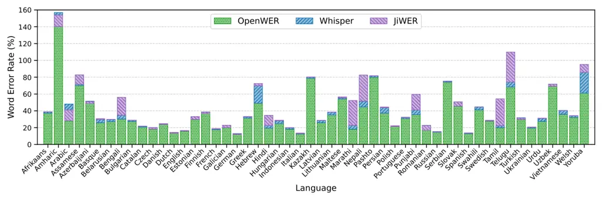

Kuhn Zimmermann

# OpenWER: Improving Cross-Lingual ASR Evaluation and Enabling Token-Based Accuracy Metrics

Korbinian    Gottfried

###### Abstract

Advances in deep learning and end-to-end Automatic Speech Recognition
(ASR) have enabled robust multilingual models, but evaluation metrics
remain limited in assessing accuracy. Efforts to improve or replace the
common metric Word Error Rate (WER) often focus on English, leaving
evaluations for low-resource languages under-explored and hindering fair
cross-lingual comparisons. We present OpenWER, an open-source
implementation that improves WER robustness through language-specific
normalisation and compound word detection. A token-based Levenshtein
alignment preserves complementary metrics and allows metadata embedding
for granular accuracy scores. Our analysis of 52 languages shows
absolute WER reductions of up to 25% compared to common libraries.
OpenWER contributes to fairness in ASR research by increasing the
reliability of WER across diverse languages and enabling more
comprehensive accuracy evaluations.

###### keywords

automatic speech recognition, speech-to-text, computational metrics,
word error rate, multilingual

^(†)^(†)email: kuhnko@hdm-stuttgart.de,
gzimmermann@acm.org^(†)^(†)address: ¹ Stuttgart Media University,
Germany  
² University of Tübingen, Germany ^(†)^(†)email:
korbiniankuhn@gmail.com, gzimmermann@acm.org

## 1 Introduction

Large-scale deep learning techniques \[1, 2, 3\] and transformer-based
ASR (ASR) \[4, 5, 6, 7\] have led to robust multilingual models that
support a wide range of languages \[8, 9\]. Evaluating their
transcription accuracy using universal metrics is essential for unbiased
and fair performance comparisons across models and languages. The
predominant metrics for ASR evaluation are WER (WER) for alphabetic
languages, where words consist of individual letters with clear
boundaries, and CER (CER) for logographic languages, where symbols
represent words or morphemes. Both metrics rely on the Levenshtein
distance, which quantifies differences between a hypothesis and a
reference transcript at the word or character level \[10\]. Their
simplicity has led to widespread adoption and enables automated
computation on large datasets while offering an objective,
language-independent assessment of transcription accuracy.

WER has been criticised as an accuracy measure because of its weak
correlation with human-perceived transcription quality \[11, 12, 13\].
As a purely string-based metric, it lacks linguistic and semantic
knowledge, treating all errors equally, regardless of their impact on
comprehension \[14\]. ML (ML) addresses these limitations by classifying
word importance to determine the severity of errors \[15, 16\]. NLP
(NLP) techniques such as POS (POS) tagging and NER (NER) allow the
categorisation of words, while statistical models can weight different
error types \[17, 18\]. Cosine similarity of word embeddings allows
semantic comparison of word substitutions \[17\] and can be combined
with word predictability derived from n-gram models or entropy scores
\[19, 20\]. While ML-based metrics offer potential improvements over
WER, they struggle with out-of-domain data and do not necessarily
perform better than WER \[21, 22\]. Reliance on training data can
introduce bias into evaluations and hinder adoption in low-resource
languages, raising concerns about fairness in ASR research.

Improvements to WER have also been explored. MER (MER) and WIL (WIL)
quantify Levenshtein operations differently to overcome theoretical
limitations of WER, but produce similar scores for state-of-the-art ASR
\[23\]. Text pre-processing is an effective approach to reducing
non-semantic differences. Common strategies include removing punctuation
and converting all characters to lowercase. Language-specific
normalisation reduces variability by replacing contractions and spelling
differences \[24\]. Unifying written numbers can further reduce WER, but
remains challenging and can introduce errors \[8\]. As language-specific
normalisations are mainly available for English, they complicate
cross-lingual comparisons. Moreover, the destructive nature of text
pre-processing eliminates certain aspects of accuracy. Even with a low
WER, ASR-generated text can be difficult to read due to punctuation,
casing, and formatting errors \[25\]. Token-based alignment allows the
calculation of WER and complementary metrics for punctuation and casing,
providing a more comprehensive assessment of accuracy \[26, 27\].
Extending the Levenshtein distance algorithm to handle transpositions or
compound words can also reduce alignment errors \[28, 27\].

While WER is a limited measure of accuracy \[11, 12, 13\], it remains
the most common evaluation metric, as no alternative has yet been widely
adopted \[18, 20, 17\]. Reducing noise from string differences is key to
improving WER robustness and enabling more meaningful scores \[24, 8\].
This study presents OpenWER, an open-source library that improves
accuracy evaluation across high- and low-resource languages. The
robustness of the Levenshtein distance is improved by non-destructive
normalisation and compound word detection, reducing minor variations
that distort WER scores \[27\]. The token-based alignment allows the
calculation of complementary accuracy metrics and the integration of
metadata from NLP parsers or ASR models, supporting more granular and
comprehensive evaluations \[17, 26\]. Our results show:

- •
  OpenWER can decrease WER across languages up to 25% compared to
  commonly used libraries.
- •
  Compound word errors can reduce WER by up to 20% for some languages.
- •
  Token-based alignment preserves punctuation, casing, and embedded
  metadata for complementary metrics.

Figure 1: Overview of OpenWER components: Input can be raw text or
ASR-generated word lists. Basic tokenisation is built in, but can be
replaced by an NLP-tokeniser. General or language-specific normalisation
can be applied to all input and tokenisation methods. Hypothesis and
reference are aligned using an extended Levenshtein distance algorithm
that handles punctuation tokens and compound words. After alignment, the
Word Error Rate and complementary metrics for punctuation and casing can
be computed. More granular token-based metrics can be derived from ASR
or NLP metadata.

## 2 OpenWER

This section outlines the components of OpenWER. Figure 1 illustrates
its modular design, with interchangeable elements for input formats,
tokenisation methods, language-specific normalisation, and evaluation
metrics.

### 2.1 Input

The computation of the edit distance requires a reference and hypothesis
input. These inputs can be raw text or a structured list of words.
Formats may also differ to enable scenarios where speech datasets
provide the reference as raw text and ASR models provide the hypothesis
as a word list. Additional properties, such as timestamps or confidence
scores in the word list, are preserved throughout the computation,
allowing for custom evaluations after alignment.

### 2.2 Tokenisation

Unlike traditional string list comparisons used to compute the
Levenshtein distance, OpenWER uses tokens as alignment units that
preserve the original text and metadata. This approach allows embedding
additional information throughout the computation process and quick
differentiation between words and punctuation characters. A tokeniser
segments text at spaces, tabs and newlines. Punctuation remains attached
during tokenisation and is handled later in a normalisation step,
allowing for preceding transformations such as abbreviation handling.
NLP tokenisers can be used to include POS tags or NER labels as
metadata, allowing fine-grained evaluation metrics.

### 2.3 Normalisation

Text pre-processing can be applied to all input methods, including basic
or NLP-based tokenisation and ASR word lists. While normalisation is
optional, reducing non-semantic differences between reference and
hypothesis is recommended to improve the Levenshtein alignment’s
robustness and ensure more meaningful error rates. Normalisation
consists of sequential transformations applied to token values, mostly
affecting individual tokens, although some may split or merge tokens.
Metadata and original token values are preserved throughout the process,
and all modifications are tracked in a token’s normalisation field. The
order of transformations is important; for example, abbreviations must
be normalised before separating punctuation. A default normaliser with
general transformations and language-aware punctuation separation is
provided. Language-specific normalisers based on related research are
available for English and German \[24, 8\].

### 2.4 Alignment

The alignment of reference and hypothesis tokens is performed using the
Levenshtein distance. We adopt a variable cost approach inspired by
previous work to improve the semantic relevance of edit operations
\[27\]. Punctuation edits receive lower costs, while substitutions
between different token types are more heavily penalised. The algorithm
is further extended to detect compound words, addressing errors from
missing or inserted hyphens and spaces \[27\]. During cost matrix
computation, adjacent tokens can be merged to match tokens in the
opposing text, enabling alignment of compounds with variable lengths and
differing representations. While this dictionary-free approach is
generally applicable, it only provides an approximation and ignores
subtle differences in meaning. For instance, ’setup’ (noun), ’set up’
(verb) and ’set-up’ (adjective) are not differentiated. Once the
backtrace matrix is computed, the edit path is constructed as a sequence
of operations linking reference and hypothesis tokens.

### 2.5 Metrics

The alignment results allow a quick calculation of the WER by counting
insertions, substitutions, and deletions while supporting complementary
error rates covering punctuation and casing. Compound word errors can
optionally contribute to the WER score. NLP classifications allow more
granular evaluations, such as noun accuracy using POS tags and proper
name accuracy using NER labels. Such attributes can isolate specific
error types or apply weights in a combined evaluation score. Similarity
measures such as Jaro-Winkler or cosine distance can be used to evaluate
substitutions with finer precision \[29, 17\]. Word-level information
from an ASR model allows for custom evaluations such as the relationship
between confidence score and word correctness. All applied text
normalisations are listed, and original values are preserved to support
further analysis.

### 2.6 Implementation

OpenWER is developed in Python, the primary language in machine learning
research, to facilitate community-driven improvements. Given the
Levenshtein algorithm’s $`O(mn)`$ complexity, several optimisations have
been implemented to reduce processing time. Before computing the
backtrace matrix, tokens are mapped to an optimised data structure,
where each unique word is assigned an integer value for its original and
lowercase forms, allowing for faster token comparison. Optional JIT
(JIT) compilation further increases processing speed. The original
tokens are restored when the alignment is constructed. Generic classes
allow language-specific normalisations to be implemented with minimal
programming knowledge, encouraging the open-source community to
contribute their linguistic expertise. The repository includes datasets
and evaluation scripts to systematically measure the impact of changes
across different languages. All code and evaluation datasets are
open-source.¹¹ 1 https://github.com/shuffle-project/openwer The
repository includes examples of standard metrics and custom evaluations
for straightforward adoption.

### 2.7 Analysis

We compare WER results of our implementation with a popular library
(JiWER²² 2 https://github.com/jitsi/jiwer) to evaluate differences in
accuracy measurement. To assess the impact of text normalisation, we
evaluate both the JiWER normaliser, which follows a more conventional
approach, and the Whisper normaliser, which applies more extensive
transformations. We used the Common Voice 17 dataset for a broad
cross-lingual comparison \[30\]. We transcribed the test split of all
languages supported by two popular multilingual open-source ASR models:
Whisper (large-v3) and SeamlessM4T (v2-large) \[8, 9\]. 52 languages
were transcribed, totalling 691648 transcriptions, averaging 13300
samples per language ($`SD=11238`$, $`Min=66`$, $`Max=32804`$).

We created a second dataset by transcribing 1000 randomly selected
samples (seed=151) from the Common Voice 17 English test split with ten
ASR models. This dataset is used to validate OpenWER’s ability to
process ASR word lists as input, and to provide an exemplary evaluation
showing different metrics across models (see Table 1). For each ASR
system, the most accurate model was selected. Transcription jobs were
performed in December 2024.

## 3 Evaluation

Figure 2: Word Error Rate comparison on Common Voice 17

### 3.1 Algorithm Robustness

Compound word detection and punctuation tokens can alter the edit path
in Levenshtein distance calculations, affecting WER scores. To assess
the robustness of OpenWER, we compare its results with those of the
widely used JiWER library.

Without any text normalisation, case-sensitivity, and disabled compound
word detection, the mean ($`M`$) WER of OpenWER and JiWER was equal
($`M=35.2\%`$). A two one-sided test (TOST) was conducted to determine
whether the effect of the Levenshtein algorithm on WER was statistically
equivalent to zero, given equivalence bounds of ±0.5%. The test was
significant, $`t(691647)=1.41`$, $`p<.001`$, 90% CI $`[-0.2\%,0.2\%]`$,
indicating that both implementations compute practically equivalent
results for the standard Levenshtein distance.

Applying common normalisation, where punctuation is removed, JiWER uses
lowercasing, and OpenWER does not count casing errors, resulted in an
average WER of 30.1% for OpenWER and 29.9% for JiWER. The equivalence
test with ±0.5% bounds was significant, $`t(691647)=17.48`$, $`p<.001`$,
90% CI $`[0.0\%,0.3\%]`$, indicating that both compute practically
equivalent results for standard text normalisation.

To assess the effect of punctuation tokens on the edit path, the WER was
measured using OpenWER with and without punctuation tokens (both
$`M=27.7\%`$). The equivalence test with bounds of ±0.5% was
significant, $`t(691647)=23.53`$, $`p<.001`$, 90% CI $`[-0.1\%,0.2\%]`$,
indicating that the modified Levenshtein distance with variable editing
costs per token type computes practically equivalent WER scores while
preserving punctuation tokens.

A paired samples t-test was conducted to compare WER scores for OpenWER
with enabled compound word detection ($`M=25.3\%`$) and without
($`M=27.7\%`$). The test showed a significant difference,
$`t(691647)=-156.61`$, $`p<.001`$, $`d=0.04`$. While the overall effect
size suggests a small impact, the reduction in WER varies considerably
between languages. In some cases, the difference is minimal (0.1%), but
in others, it is up to 20%. Results suggest that compound words are a
major source of transcription errors in some languages but have a minor
effect in others.

We evaluated whether different tokenisation methods produce equivalent
WER scores using the second dataset containing transcription results
from multiple ASR models. We used OpenWER’s basic tokeniser
($`M=15.9\%`$), spaCy as an NLP tokeniser ($`M=16.2\%`$), and the ASR
word list output from each model ($`M=15.9\%`$). Pairwise equivalence
tests with ±0.5% bounds were significant between all methods: basic and
NLP ($`t(9971)=-6.84`$, $`p<.001`$, 90% CI $`[-1.4\%,0.8\%]`$); basic
and word list ($`t(9971)=-5.18`$, $`p<.001`$, 90% CI
$`[-1.1\%,1.0\%]`$); NLP and word list ($`t(9971)=-5.53`$, $`p<.001`$,
90% CI $`[-1.3\%,0.8\%]`$).

We conclude that OpenWER produces equivalent WER scores to JiWER when
none or standard normalisation is applied. The modified Levenshtein
algorithm can preserve punctuation tokens without affecting WER and
significantly reduce WER by detecting compound words. Tokenisation
methods can be used interchangeably if words are tokenised correctly.

### 3.2 Word Error Rate

Figure 2 shows the mean WER per language, with each method using its
full set of normalisations. OpenWER ($`M=35.7\%`$) consistently produced
a lower or equal WER compared to Whisper ($`M=39.6\%`$) and JiWER
($`M=43.4\%`$). The average WER reduction of OpenWER compared to Whisper
was 3.8% (9.2% relative) and compared to JiWER 7.7% (14.5% relative).
The maximum WER reduction of OpenWER compared to Whisper was 24.8%
(41.2% relative) and compared to JiWER 41.4% (65.1% relative). A one-way
ANOVA was conducted to determine the effect of the normalisation method
on the resulting WER. There was a significant effect in WER between at
least two methods, $`F(2,2074941=1214.961,p<.001)`$. A Tukey’s HSD test
showed a significant difference between all methods (all $`ps<.001`$).
These results highlight the effectiveness of OpenWER in reducing WER
across languages and demonstrate its advantages over existing
normalisation methods, particularly for some low-resource languages.

### 3.3 Exemplary Evaluation

| Model        | WER$`\downarrow`$ | Punct.$`\downarrow`$ | Casing$`\downarrow`$ | $`r_{pb}\uparrow`$ |
| ------------ | ----------------- | -------------------- | -------------------- | ------------------ |
| AWS          | 11.1              | 11.5                 | 5.4                  | 0.148\*\*\*        |
| AssemblyAI   | 10.3              | 17.7                 | 9.4                  | 0.362\*\*\*        |
| Deepgram     | 20.3              | 24.1                 | 8.8                  | 0.485\*\*\*        |
| Google       | 11.1              | 15.5                 | 7.9                  | 0.278\*\*\*        |
| IBM          | 22.0              | 98.3                 | 83.5                 | 0.107\*\*\*        |
| Microsoft    | 12.7              | 15.0                 | 6.7                  | 0.179\*\*\*        |
| Rev AI       | 24.7              | 29.0                 | 14.9                 | 0.459\*\*\*        |
| SeamlessM4T  | 25.1              | 13.0                 | 4.6                  | \-                 |
| Speechmatics | 8.8               | 21.1                 | 9.8                  | 0.446\*\*\*        |
| Whisper      | 12.9              | 21.6                 | 9.2                  | 0.517\*\*\*        |

Table 1: Accuracy of ASR models (\*\*\* indicates $`p<.001`$)

Table 1 shows the evaluation results for several ASR models using
OpenWER. The analysis is based on a small dataset and is intended to
illustrate the capabilities of OpenWER rather than providing a
definitive comparison of ASR models. The results show that models with a
similar WER can differ notably in terms of punctuation and casing
accuracy. This highlights the importance of conducting comprehensive
assessments of transcription accuracy. As an exemplary use case of
metadata embedding, we computed the point-biserial correlation
($`r_{pb}`$) between word correctness and confidence score. SeamlessM4T
does not provide word-level confidence scores and was excluded. The
results show a moderate correlation at best, suggesting that confidence
scores from these ASR models were not sufficiently reliable for
determining word correctness.

### 3.4 Performance

JiWER leverages a C implementation of the Levenshtein distance, whereas
OpenWER is implemented purely in Python. To compare performance, we
computed Levenshtein distances for token counts from 1 to 1000 in steps
of 25 and averaged the processing time for each length over 25
iterations. JiWER processed $`4618.9`$ tokens/ms and OpenWER $`1.9`$
tokens/ms. JIT compilation increased the processing speed of OpenWER to
$`34.8`$ tokens/ms. Still, JiWER remains superior in speed, highlighting
the limitations of OpenWER for performance-critical use and the
potential benefits of implementing the modified Levenshtein algorithm in
a compiled language.

## 4 Conclusion

Objective metrics are essential to measure the transcription accuracy of
ASR models across languages and to identify performance gaps,
particularly in low-resource languages. WER has been criticised for its
limitations, but alternative metrics have yet to see wider adoption.
OpenWER addresses these challenges and improves WER’s reliability by
incorporating language-specific normalisation and compound word
detection. Our evaluation demonstrated significant accuracy gains across
multiple languages. The flexible, token-based approach preserves
complementary metrics for punctuation and casing, and allows the use of
metadata for novel evaluations. Through open-source and its modular
design, OpenWER aims to contribute to fairness in multilingual
evaluation, encourage community-driven improvements, and provide a
foundation for future accuracy metrics that address the shortcomings of
WER.

## 5 Acknowledgements

This work was conducted as part of the SHUFFLE Project and funded by
“Stiftung Innovation in der Hochschullehre”.

## References

- \[1\] A. Rasmus, H. Valpola, M. Honkala, M. Berglund, and T.
  Raiko (2015) Semi-supervised learning with ladder networks. In
  Conference on Neural Information Processing Systems (NeurIPS) 2015,
  pp. 3546––3554. Cited by: §1.
- \[2\] A. Baevski, Y. Zhou, A. Mohamed, and M. Auli (2020) Wav2vec 2.0:
  a framework for self-supervised learning of speech representations. In
  Conference on Neural Information Processing Systems (NeurIPS) 2020,
  virtual, pp. 12449–12460. Cited by: §1.
- \[3\] K. Yu, M. Gales, L. Wang, and P. C. Woodland (2010) Unsupervised
  training and directed manual transcription for lvcsr. Speech
  Communication 52 (7), pp. 652–663. External Links:
  [Document](https://dx.doi.org/10.1016/j.specom.2010.02.014) Cited by:
  §1.
- \[4\] A. Vaswani, N. Shazeer, N. Parmar, J. Uszkoreit, L. Jones, A. N.
  Gomez, Ł. Kaiser, and I. Polosukhin (2017) Attention is all you need.
  In Conference on Neural Information Processing Systems (NeurIPS) 2017,
  Long Beach, California, USA. Cited by: §1.
- \[5\] J. K. Chorowski, D. Bahdanau, D. Serdyuk, K. Cho, and Y.
  Bengio (2015) Attention-based models for speech recognition. In
  Conference on Neural Information Processing Systems (NeurIPS) 2015,
  Montreal, Canada. Cited by: §1.
- \[6\] A. Gulati, J. Qin, C. Chiu, N. Parmar, Y. Zhang, J. Yu, W.
  Han, S. Wang, Z. Zhang, Y. Wu, and R. Pang (2020) Conformer:
  convolution-augmented transformer for speech recognition. In
  INTERSPEECH 2020, virtual, pp. 5036–5040. External Links:
  [Document](https://dx.doi.org/10.21437/Interspeech.2020-3015) Cited
  by: §1.
- \[7\] Y. Peng, S. Dalmia, I. Lane, and S. Watanabe (2022)
  Branchformer: parallel MLP-attention architectures to capture local
  and global context for speech recognition and understanding. In
  International Conference on Machine Learning (ICML) 2022, Baltimore,
  Maryland, USA, pp. 17627–17643. Cited by: §1.
- \[8\] A. Radford, J. W. Kim, T. Xu, G. Brockman, C. Mcleavey, and I.
  Sutskever (2023) Robust speech recognition via large-scale weak
  supervision. In International Conference on Machine Learning (ICML)
  2023, Honolulu, Hawaii, USA, pp. 28492–28518. Cited by: §1, §1, §1,
  §2.3, §2.7.
- \[9\] L. Barrault, Y. Chung, M. C. Meglioli, D. Dale, N. Dong, M.
  Duppenthaler, P. Duquenne, B. Ellis, H. Elsahar, J. Haaheim, et
  al. (2023) Seamless: multilingual expressive and streaming speech
  translation. arXiv preprint arXiv:2312.05187. Cited by: §1, §2.7.
- \[10\] V. I. Levenshtein (1966) Binary codes capable of correcting
  deletions, insertions, and reversals. In Soviet physics doklady, Vol.
  10, pp. 707–710. Cited by: §1.
- \[11\] Y. Wang, A. Acero, and C. Chelba (2003) Is word error rate a
  good indicator for spoken language understanding accuracy. In IEEE
  Automatic Speech Recognition and Understanding Workshop (ASRU) 2003,
  Saint Thomas, Virgin Islands, USA, pp. 577–582. External Links:
  [Document](https://dx.doi.org/10.1109/ASRU.2003.1318504) Cited by: §1,
  §1.
- \[12\] T. Mishra, A. Ljolje, and M. Gilbert (2011) Predicting human
  perceived accuracy of asr systems.. In INTERSPEECH 2011, Florence,
  Italy, pp. 1945–1948. External Links:
  [Document](https://dx.doi.org/10.21437/Interspeech.2011-364) Cited by:
  §1, §1.
- \[13\] B. Favre, K. Cheung, S. Kazemian, A. Lee, Y. Liu, C.
  Munteanu, A. Nenkova, D. Ochei, G. Penn, S. Tratz, C. Voss, and F.
  Zeller (2013) Automatic human utility evaluation of asr systems: does
  wer really predict performance?. In INTERSPEECH 2013, Lyon, France,
  pp. 3463–3467. External Links:
  [Document](https://dx.doi.org/10.21437/Interspeech.2013-610) Cited by:
  §1, §1.
- \[14\] L. Berke, S. Kafle, and M. Huenerfauth (2018) Methods for
  evaluation of imperfect captioning tools by deaf or hard-of-hearing
  users at different reading literacy levels. In ACM Conference on Human
  Factors in Computing Systems (CHI) 2018, pp. 1–12. External Links:
  [Document](https://dx.doi.org/10.1145/3173574.3173665) Cited by: §1.
- \[15\] S. Kafle and M. Huenerfauth (2016) Effect of speech recognition
  errors on text understandability for people who are deaf or hard of
  hearing. In Speech and Language Processing for Assistive Technologies
  (SPLAT) 2016, San Francisco, California, USA, pp. 20–25. External
  Links: [Document](https://dx.doi.org/10.21437/SLPAT.2016-4) Cited by:
  §1.
- \[16\] A. A. Amin, S. Hassan, M. Huenerfauth, and C. O. Alm (2023)
  Modeling word importance in conversational transcripts: toward
  improved live captioning for deaf and hard of hearing viewers. In
  International Web for All Conference (W4A) 2023, pp. 79–83. External
  Links: [Document](https://dx.doi.org/10.1145/3587281.3587290) Cited
  by: §1.
- \[17\] T. B. Roux, M. Rouvier, J. Wottawa, and R. Dufour (2022)
  Qualitative evaluation of language model rescoring in automatic speech
  recognition. In INTERSPEECH 2022, pp. 3968–3972. External Links:
  [Document](https://dx.doi.org/10.21437/Interspeech.2022-10931) Cited
  by: §1, §1, §2.5.
- \[18\] T. Apone, M. Brooks, and T. O’Connell (2011) Caption accuracy
  metrics project. The WGBH National Center for Accessible Media,
  Boston, Massachusetts, USA. Cited by: §1, §1.
- \[19\] S. Kafle and M. Huenerfauth (2017) Evaluating the usability of
  automatically generated captions for people who are deaf or hard of
  hearing. In ACM SIGACCESS Conference on Computers and Accessibility
  (ASSETS) 2017, pp. 165–174. External Links:
  [Document](https://dx.doi.org/10.1145/3132525.3132542) Cited by: §1.
- \[20\] S. Kafle and M. Huenerfauth (2019) Predicting the
  understandability of imperfect english captions for people who are
  deaf or hard of hearing. ACM Transactions on Accessible Computing 12
  (2). External Links: [Document](https://dx.doi.org/10.1145/3325862)
  Cited by: §1, §1.
- \[21\] T. Wells, D. Christoffels, C. Vogler, and R. Kushalnagar (2022)
  Comparing the accuracy of ace and wer caption metrics when applied to
  live television captioning. In Joint International Conference on
  Digital Inclusion, Assistive Technology & Accessibility (ICCHP-AAATE
  2022), pp. 522–528. External Links:
  [Document](https://dx.doi.org/10.1007/978-3-031-08648-9%5F61) Cited
  by: §1.
- \[22\] M. Arroyo Chavez, M. Feanny, M. Seita, B. Thompson, K. Delk, S.
  Officer, A. Glasser, R. Kushalnagar, and C. Vogler (2024) How users
  experience closed captions on live television: quality metrics remain
  a challenge. In ACM Conference on Human Factors in Computing Systems
  (CHI) 2024, External Links:
  [Document](https://dx.doi.org/10.1145/3613904.3641988) Cited by: §1.
- \[23\] A. Morris, V. Maier, and P. Green (2004) From wer and ril to
  mer and wil: improved evaluation measures for connected speech
  recognition. In International Conference on Spoken Language Processing
  (ICSLP) 2004, Jeju Island, Korea, pp. 2765–2768. External Links:
  [Document](https://dx.doi.org/10.21437/Interspeech.2004-668) Cited by:
  §1.
- \[24\] A. Koenecke, A. Nam, E. Lake, J. Nudell, M. Quartey, Z.
  Mengesha, C. Toups, J. R. Rickford, D. Jurafsky, and S. Goel (2020)
  Racial disparities in automated speech recognition. National Academy
  of Sciences 117 (14), pp. 7684–7689. External Links:
  [Document](https://dx.doi.org/10.1073/pnas.1915768117) Cited by: §1,
  §1, §2.3.
- \[25\] J. Butler (2019) Perspectives of deaf and hard of hearing
  viewers of captions. American Annals of the Deaf 163 (5), pp. 534–553.
  Cited by: §1.
- \[26\] A. Meister, M. Novikov, N. Karpov, E. Bakhturina, V. Lavrukhin,
  and B. Ginsburg (2023) LibriSpeech-pc: benchmark for evaluation of
  punctuation and capitalization capabilities of end-to-end asr models.
  In IEEE Automatic Speech Recognition and Understanding Workshop (ASRU)
  2023, pp. 1–7. External Links:
  [Document](https://dx.doi.org/10.1109/ASRU57964.2023.10389666) Cited
  by: §1, §1.
- \[27\] K. Kuhn, V. Kersken, and G. Zimmermann (2024) Beyond
  levenshtein: leveraging multiple algorithms for robust word error rate
  computations and granular error classifications. In INTERSPEECH 2024,
  Kos, Greece, pp. 4543–4547. External Links:
  [Document](https://dx.doi.org/10.21437/Interspeech.2024-32) Cited by:
  §1, §1, §2.4.
- \[28\] F. J. Damerau (1964) A technique for computer detection and
  correction of spelling errors. Communications of the ACM 7 (3),
  pp. 171–176. External Links:
  [Document](https://dx.doi.org/10.1145/363958.363994) Cited by: §1.
- \[29\] W. E. Winkler (1990) String comparator metrics and enhanced
  decision rules in the fellegi-sunter model of record linkage.
  Proceedings of the Section on Survey Research Methods, pp. 354–359.
  Cited by: §2.5.
- \[30\] R. Ardila, M. Branson, K. Davis, M. Henretty, M. Kohler, J.
  Meyer, R. Morais, L. Saunders, F. M. Tyers, and G. Weber (2020) Common
  voice: a massively-multilingual speech corpus. In Language Resources
  and Evaluation Conference (LREC) 2020, pp. 4211–4215. Cited by: §2.7.
