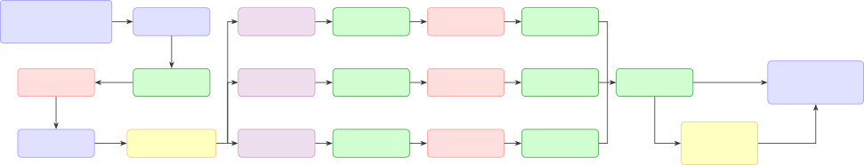
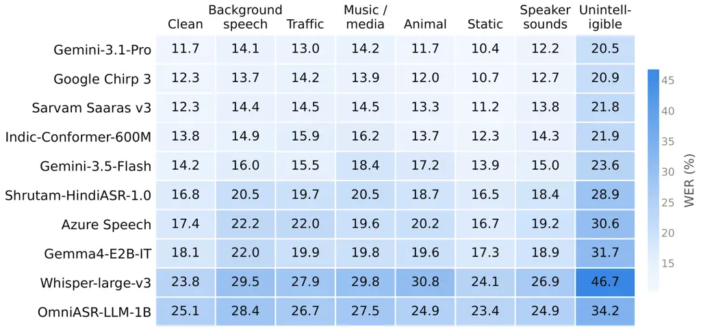

# Vaani Benchmark V1.0: An Inclusive Multimodal Benchmark Dataset for Hindi

###### Abstract

Benchmarking is critical for the systematic evaluation of machine
learning systems. While several open-source datasets are available for
Hindi, existing benchmarks remain limited in terms of modality,
geographic diversity, demographic representation, and transcription
robustness. We introduce an inclusive, multimodal Hindi benchmark
dataset collected from 102 districts across India. The dataset consists
of spontaneous speech elicited using image prompts and recorded under
real-world acoustic conditions across diverse demographic groups. Each
audio segment is associated with the image prompt that elicited it and
is annotated with three independent transcriptions, enabling
multi-reference evaluation that accounts for permissible orthographic
and lexical variations. We show that single-reference evaluation
overstates errors, while multi-reference evaluation provides a more
robust, inclusive, and realistic assessment of automatic speech
recognition (ASR) systems. The pairing of each utterance with its
eliciting image further enables image retrieval evaluation using both
speech and text queries. We evaluate multiple multimodal embedding
models for image retrieval and report their performance on the combined
speech–image and text–image retrieval tasks. The results reveal a
performance gap between text-based and audio-based retrieval, with
text-based retrieval consistently achieving higher performance.

###### Index Terms: 

speech recognition, image retrieval, multimodal benchmark,
multi-reference evaluation, benchmark dataset

## 1 Introduction

Benchmarking is critical for evaluating model performance under unseen
conditions, comparing systems, and assessing their real-world
applicability. State-of-the-art ASR systems remain sensitive to
variations in gender, age, accent, and other speaker characteristics
\[12, 26\]. This challenge is particularly important for Hindi, which,
according to the 2011 Census of India, is the most widely spoken
language in the country, with 43.63% of the population reporting Hindi
or its dialects as their first language \[27\]. Hindi spans diverse
regions and dialects, forming a broad linguistic continuum that requires
benchmarks with adequate geographic, demographic, and linguistic
coverage. Similarly, image and speech retrieval systems require
evaluation on datasets that reflect local linguistic, cultural, and
visual contexts. However, existing benchmarks often provide limited
coverage of such diversity, motivating the development of comprehensive
and locally relevant multimodal benchmarks for Hindi.

Figure 1: Benchmark Data Preparation Process

Several benchmark datasets have been released to evaluate Hindi ASR
either as part of larger corpora or through independent initiatives,
such as IndicSUPERB \[20\], LAHAJA \[21\] and Vistaar \[8\]. LAHAJA
comprises both read and extemporaneous speech across a diverse range of
topics and use cases, totaling 12.5 hours of Hindi audio collected from
132 speakers spanning 83 districts of India. In addition, multiple data
collection efforts—including FLEURS \[9\], MUCS \[11\] and GramVaani
\[6\] —have released evaluation sets that can be used to benchmark ASR
performance. Despite the availability of numerous datasets, significant
gaps remain in open benchmark datasets, particularly in terms of
comprehensive regional and dialectal coverage.

The widely used ASR metric, Word Error Rate (WER), is sensitive to
variations in valid reference transcriptions, making single-reference
evaluation potentially unfair \[24, 3\]. This is particularly relevant
for Hindi, where existing benchmarks often provide only one reference
and fail to capture natural transcriptional variability. Similarly,
code-switching is prevalent in Indic languages, yet current benchmarks
often lack adequate code-switched speech or use inconsistent script
conventions, limiting fair evaluation \[4, 1\]. ASR performance is also
strongly affected by background noise, but many benchmarks lack explicit
noise-event annotations needed to assess robustness under realistic
acoustic conditions \[13\]. These limitations highlight the need for
benchmarks that incorporate multiple human references, code-switching,
and diverse noise conditions to enable more reliable and comprehensive
ASR evaluation. Hindi image–text \[32\] and speech–image datasets exist
\[17\], but resources that jointly provide images, Hindi text, and
naturally spoken Hindi audio remain limited. Recent multimodal models
increasingly integrate multiple modalities \[15\], highlighting the need
for well-aligned datasets for systematic evaluation.

To address these gaps, we introduce a multimodal benchmark for
evaluating Hindi ASR and text and speech-based image retrieval. The
benchmark contains paired speech–image data with three independent
reference transcriptions per audio segment, enabling multi-reference ASR
evaluation. Data were collected from 102 districts across 20 Indian
states and 2 Union Territories, providing broad geographic and
demographic coverage and capturing regional variation in Hindi speech.

## 2 Benchmark Dataset

The data were collected as part of the Vaani Project \[29\] and comprise
spontaneous speech elicited by asking speakers to describe images. The
image set includes both district-specific images and images shared
across multiple districts. Carefully designed guidelines were followed
during image collection to ensure that local contexts were accurately
captured. All images were newly captured specifically for this
initiative. Image collection was completed prior to the speech data
collection, and all images underwent rigorous quality control
procedures, including automated and manual checks, to ensure high
quality and the absence of any personally identifiable information
(PII). During the data collection process, speakers were shown up to 50
images and asked to verbally describe whatever came to mind upon viewing
each image in the language spoken at home. Data collection was conducted
through a mobile application. The collected data underwent a multi-stage
quality control process as shown in Figure 1. Initially, audio
recordings were evaluated for quality and format consistency. Data
collection was carried out with the support of vendors who coordinated
the process at the district level and were responsible for the first
level of quality control.

The manually generated transcriptions for each audio segment undergo
consistency checks and automated quality validation. Each transcription
is subsequently reviewed independently by separate transcribers for
correction, quality assurance, and verification of annotated audio
events. Throughout the process, well-defined transcription guidelines
are strictly followed. Transcribers for each district are selected from
the same district to ensure familiarity with local dialects and
linguistic variations. Code-switched content is transcribed using both
the native script and the original script, while non-speech audio events
and noise instances are explicitly annotated alongside the spoken
content. Following the initial correction stage, transcription
supervisors randomly audit approximately 10% of the transcriptions.
Identified issues are returned to the respective transcribers for
correction. If systematic or recurring errors are observed in a
transcriber’s work, the complete set of data assigned to that
transcriber is reassigned to another transcriber for comprehensive
review and correction. The corrected transcriptions subsequently undergo
another round of automated validation, followed by a consistency
analysis across the three independent transcriptions. If substantial
discrepancies are detected among the three transcriptions for an audio
segment, the segment is sent for manual adjudication by three
independent transcribers.

Following rigorous quality checks, the Vaani benchmark dataset comprises
5,050 speech utterances from 1,062 unique speakers, totaling 10.91 hours
of audio collected across 102 districts in 20 states and 2 Union
Territories.¹¹ 1
https://huggingface.co/datasets/ARTPARK-IISc/Vaani-Benchmark-V1.0
Utterances have an average duration of 7.8 s (median: 7.2 s; range:
1.3–20.0 s) and are uniformly encoded as 16 kHz, mono, 16-bit PCM audio.
The benchmark references 3,701 unique images. The three reference
transcriptions are byte-identical for only 0.6% of utterances and remain
distinct for 75.5% even after normalizing annotation markup and
punctuation, motivating the multi-reference evaluation protocol adopted
in this work. The benchmark is approximately balanced by gender at both
the speaker level (536 male, 526 female) and utterance level (2,528
male, 2,522 female). The data span diverse demographic, linguistic,
geographic, and recording conditions, including variation in age (20–70
years; median: 32), education, socio-economic stratum, multilingualism
(42 languages), recording device, years of residence, and geographic
origin. Speakers are distributed across 567 distinct PIN codes spanning
multiple states and districts. The benchmark is openly licensed under CC
BY 4.0.

## 3 Evaluations

We evaluated multiple models on the proposed benchmark dataset,
including both open-source and commercial systems. We evaluate two
tasks: automatic speech recognition, reported as WER under three
evaluation protocols, and image retrieval, in which a spoken (or
transcribed) description is used to retrieve the image that elicited it.

|      |                                         |        |         |        |        |
| ---- | --------------------------------------- | ------ | ------- | ------ | ------ |
| S.No | Model                                   | Type   | WER (%) |        |        |
|      |                                         |        | App. 1  | App. 2 | App. 3 |
| 1    | Gemini-3.1-Pro\[15\]                    | Closed | 19.0    | 15.6   | 12.3   |
| 2    | Sarvam Saaras v3\[31\]                  | Closed | 19.5    | 16.4   | 13.1   |
| 3    | Indic-conformer-600m- multilingual\[2\] | Open   | 20.0    | 16.8   | 13.1   |
| 4    | Gemini-3.5-Flash\[16\]                  | Closed | 22.0    | 18.7   | 15.3   |
| 5    | Google Chirp 3\[14\]                    | Closed | 22.5    | 19.2   | 15.6   |
| 6    | Shrutam-HindiASR-1.0\[7\]               | Open   | 24.5    | 21.5   | 18.1   |
| 7    | Gemma4-E2B-IT\[33\]                     | Open   | 26.2    | 23.2   | 19.4   |
| 8    | Azure Speech\[25\]                      | Closed | 26.6    | 23.6   | 18.7   |
| 9    | OmniASR_LLM_1B\[22\]                    | Open   | 32.2    | 29.3   | 25.6   |
| 10   | Whisper-large-v3\[30\]                  | Open   | 32.8    | 30.0   | 26.4   |

Table 1: WER Scores for Different ASR Models

### 3.1 Automatic Speech Recognition

We evaluate open-source and commercial systems spanning Indic-focused
encoder–decoder models \[2\]; large multilingual ASR models \[30, 22\];
multimodal LLM-based systems \[16, 33, 15\]; and commercial cloud APIs
\[14, 25, 31\]. Table 1 lists the full set.

We evaluate ASR systems under three approaches. In Approach 1, corpus
WER is computed separately against each transcription set (Set-1, Set-2,
Set-3), and the minimum is reported. In Approach 2, the minimum error
count over the three references is selected for each segment, and these
counts are aggregated over the corpus, normalised by the length of the
selected reference. Approach 3 models word-level variation across
annotators: the hypothesis is aligned independently to each reference by
minimum edit distance. A hypothesis word is correct if it matches in any
alignment, a substitution if it is substituted in at least one, and an
insertion only if it is inserted in all three; a reference word is a
deletion only if deleted in all three. The denominator is $`N=C+S+D`$,
the length of the implied (materialised) reference, with errors
aggregated over the corpus. An error is thus counted only when the
output matches no acceptable realisation in any reference. The three
transcription sets exhibit pairwise WERs of 10.40–13.34%; scoring each
set against the other two under Approach 3 yields 6.63%, quantifying
inter-annotator variation and providing context for ASR WERs.

Figure 2: WER variations against \#References

After evaluation, the WERs obtained using Approaches 1, 2, and 3 are
presented in Table 1. The differences across the three approaches
highlight the effect of multiple valid transcriptions for the same audio
segment. Figure 2 further examines the benefit of adding reference
transcriptions under Approach 3. Each system is evaluated using all
possible reference subsets of a given size, and the results are averaged
to avoid dependence on a particular transcription set. Across the ten
systems, the average WER decreases from 24.80% with one reference to
19.66% with two references and 17.76% with three references. Thus, the
second reference provides a larger reduction of 5.13 percentage points,
while the third provides a smaller reduction of 1.90 points. The
reduction from the second to the third reference is also consistent
across systems, ranging from 1.77 to 2.03 points. System rankings remain
unchanged as references are added, and the gap between the best and
worst systems remains similar. These results show diminishing benefits
from additional references and support the use of three references as a
reasonable choice for the benchmark.

Figure 3: WER comparison: Vaani vs Lahaja

To verify that Approach 3 does not credit words absent from a valid
transcription, we materialise the per-utterance reference implicitly
selected for the Gemini-3.1-Pro hypotheses. Computing standard
single-reference WER against this materialised reference reproduces the
Approach-3 score exactly over the full corpus, confirming that it is the
reference Approach 3 scores against. We then manually validated a
uniform random 30-minute sample of 242 utterances (1,811 s, 214
speakers, 81 districts across 20 states and 2 UTs): annotators listened
to each recording and verified that the materialised reference was a
correct transcription of the audio. Of these, 241 (99.6%) were confirmed
correct with no corrections. The single flagged case arose from an empty
ASR hypothesis, where deleted reference words cannot be recovered in
order; this affects only 2 of 5,050 utterances and does not affect the
count-based WER.

Figure 4: WER variations against the estimated SNR

Figure 5: Errors in Hindi tokens vs English (code-switched) tokens

Figure 3 compares five systems on Lahaja and Vaani using identical
normalisation; Lahaja uses standard corpus WER over 6,152 utterances.
Under Approach 1, Vaani is harder than Lahaja for all five systems (+0.6
to +7.1 points), with IndicConformer showing the largest gap. Under
Approach 3, the gap narrows or reverses (+0.2 to $`-`$6.0 points),
indicating that part of the apparent difficulty reflects valid
transcription variation rather than recognition errors. Model rankings
also differ across benchmarks, highlighting limited generalisation from
a single Hindi benchmark. The datasets provide complementary geographic
coverage, sharing only 12 districts and covering 173 distinct districts
combined. We also evaluate performance across estimated SNR bands
(Figure 4). Since no clean reference exists, per-utterance SNR is
estimated using the pretrained DNS64 denoiser \[10\], treating the
residual as noise. WER decreases with increasing SNR, but degradation
varies substantially: from $`>25`$ dB to $`<5`$ dB, IndicConformer
degrades by only 3.7 points, compared with 34.1 points for
Whisper-large-v3. Vaani references mark code-switched English words with
their source forms, enabling separate analysis of English and Hindi
tokens. We report substitution rates only, scored against all three
references using Approach 3. ASR hypotheses are evaluated without script
conversion, using the corresponding Latin- or Devanagari-script
representation in the reference for matching. All systems perform worse
on code-switched tokens (Figure 5), but the penalty varies
substantially: Shrutam-HindiASR-1.0 degrades by 15.6 points (12.8% to
28.3%), compared with 2.6 points for Google Chirp 3 (10.2% to 12.8%).

Figure 6: WER against various types of noise present

Figure 6 breaks Approach-3 WER down by acoustic condition. Categories
are based on annotators’ inline event tags grouped by keyword; tags are
multi-label, averaging 1.61 per utterance, so categories overlap, while
Clean denotes the 1,857 utterances without environmental tags. Since the
categories contain different utterances, WER differences should be
interpreted through within-category model comparisons rather than as
direct estimates of noise penalties. Background speech is particularly
challenging, with Chirp 3 performing best and Whisper-large-v3 showing
substantially higher WER. Static/electrical noise yields relatively low
WER for most systems, likely reflecting the nature of the tagged
recordings rather than an inherently easier condition. Unintelligible is
not a noise type but a difficulty marker for speech that annotators
could not resolve, and is retained as a reference for challenging
speech.

### 3.2 Image Retrieval

We evaluate speech-to-image and text-to-image retrieval on the full test
set of $`5{,}050`$ utterances against $`3{,}701`$ images. Each utterance
is associated with the image that elicited it, forming image–speech–text
triplets without additional annotation. We report Recall@$`K`$. For
text-to-image retrieval, all models use the same consensus
transcription, obtained as the medoid of the three human references
under symmetric WER, with annotation markers removed. This ensures that
differences in retrieval performance reflect differences in model
representations rather than differences in textual input. We evaluate
zero-shot speech–image models, as well as multilingual text–image models
using the consensus transcriptions. The best zero-shot speech model,
multilingual M-SpeechCLIP\[5\], trained jointly on English, Hindi, and
Japanese, reaches $`3.33\%`$ R@1, substantially outperforming the
Hindi-only variant ($`1.21\%`$). Text-based retrieval is considerably
stronger, although the task remains challenging: the best multilingual
text–image model on Hindi consensus transcription,
NLLB-CLIP-Large\[35\], reaches $`13.60\%`$ R@1. However, these results
involve different models and modalities and therefore do not by
themselves establish the source of the performance gap.

|                                |          |       |       |       |
| ------------------------------ | -------- | ----- | ----- | ----- |
| Model                          | Query    | R@1   | R@5   | R@10  |
| nllb-clip-large\[35\] (MT En)  | Text     | 15.11 | 29.17 | 36.59 |
| nllb-clip-large                | Text     | 13.60 | 27.58 | 34.81 |
| jina-clip-v2\[23\] (MT En)     | Text     | 13.45 | 26.48 | 34.02 |
| siglip2-large\[34\] (MT En)    | Text     | 10.77 | 22.36 | 29.84 |
| jina-clip-v2                   | Text     | 10.34 | 22.48 | 29.86 |
| jina-omni\[19\] (MT En)        | Text     | 9.25  | 19.73 | 26.10 |
| siglip2-base (MT En)           | Text     | 8.79  | 20.28 | 27.43 |
| jina-omni                      | Text     | 7.25  | 16.53 | 22.04 |
| siglip2-large                  | Text     | 5.05  | 12.42 | 17.88 |
| siglip2-base                   | Text     | 3.35  | 8.57  | 12.67 |
| M-SpeechCLIP-tri\[5\] + TTS En | Speech   | 3.88  | 11.84 | 17.09 |
| M-SpeechCLIP-tri + TTS Hi      | Speech   | 3.43  | 10.55 | 15.70 |
| M-SpeechCLIP-tri               | Speech   | 3.33  | 9.05  | 13.92 |
| jina-omni + TTS Hi             | Speech   | 1.70  | 4.40  | 6.32  |
| jina-omni + TTS En             | Speech   | 1.64  | 3.82  | 5.62  |
| jina-omni                      | Speech   | 1.49  | 3.88  | 5.62  |
| M-SpeechCLIP-Hi                | Speech   | 1.21  | 3.94  | 6.81  |
| jina-omni + TTS En             | Sp.+Text | 7.61  | 17.23 | 22.36 |
| jina-omni + TTS Hi             | Sp.+Text | 6.02  | 13.43 | 18.38 |
| jina-omni                      | Sp.+Text | 5.66  | 13.35 | 18.30 |

Table 2: Image retrieval on Vaani-Bench (R@K in %; chance R@1 = 0.03).
Text rows query the Hindi consensus transcription unless marked MT En
(its machine translation). Speech rows use original recordings unless
marked TTS (Kokoro speech of the Hi or MT En text). Sp.+Text rows query
with both the speech and its corresponding text. “tri”: En+Hi+Ja
M-SpeechCLIP.

To probe whether recording acoustics contribute to the low
speech-retrieval performance, we re-synthesise the test utterances as
clean Hindi and English speech using Kokoro TTS\[18\], and evaluate them
with jina-embeddings-v5-omni-nano\[19\]. English queries are machine
translations of the same human transcriptions, produced with
gpt-5.6-luna \[28\]. Speech-to-image performance remains similar across
the three conditions: $`1.49\%`$ R@1 for the original recordings,
$`1.70\%`$ for synthetic Hindi speech, and $`1.64\%`$ for synthetic
English speech, with no pair significantly different under a paired
exact McNemar test on top-1 outcomes ($`p=0.28`$ real vs. synthetic
Hindi, $`0.53`$ real vs. synthetic English, $`0.85`$ synthetic Hindi vs.
synthetic English). In contrast, text-to-image retrieval improves from
$`7.25\%`$ for Hindi text to $`9.25\%`$ for English text, with similar
trends across the evaluated text encoders. These results suggest that
the acoustic characteristics of the recordings alone do not explain the
low speech-retrieval performance, pointing instead to limitations in the
current speech representations in capturing image-relevant semantic
information.

## 4 Conclusion

We present an inclusive, multimodal Hindi ASR benchmark comprising
speech data from 102 districts, with three independent reference
transcriptions for each segment. Evaluation of open-source and
proprietary ASR systems shows that multi-reference scoring can
substantially change WER compared with single-reference evaluation,
highlighting the importance of accounting for valid transcription
variation. Analysis of noise, SNR, and code-switched speech further
reveals system-level differences that are not captured by aggregate WER
alone. The image retrieval experiments show that text queries
consistently outperform speech queries from the same models, while
English translations of Hindi text achieve higher retrieval performance
than the original Hindi. These findings highlight the need for robust
evaluation protocols and better speech and Hindi-language
representations for multimodal speech understanding.

## References

- \[1\] M. T. Agro et al. (2025) Code-Switching in End-to-End Automatic
  Speech Recognition: A Systematic Literature Review. arXiv preprint
  arXiv:2507.07741. Cited by: §1.
- \[2\] AI4Bharat (2025) IndicConformer-600M-Multilingual. Hugging Face.
  Note:
  https://huggingface.co/ai4bharat/indic-conformer-600m-multilingual
  Cited by: §3.1, Table 1.
- \[3\] A. Ali et al. (2015) Multi-reference WER for evaluating ASR for
  languages with no orthographic rules. In 2015 IEEE Workshop on
  Automatic Speech Recognition and Understanding (ASRU), pp. 576–580.
  Cited by: §1.
- \[4\] C. Barnali (2017) Code-Switching and Mixing in Communication- A
  Study on Language Contact in Indian Media. In The Future of Ethics,
  Education and Research, pp. 110–123. Cited by: §1.
- \[5\] L. Berry et al. (2023) M-speechclip: Leveraging large-scale,
  pre-trained models for multilingual speech to image retrieval. In
  ICASSP 2023-2023 IEEE International Conference on Acoustics, Speech
  and Signal Processing (ICASSP), pp. 1–5. Cited by: §3.2, Table 2.
- \[6\] A. Bhanushali et al. (2022) Gram Vaani ASR Challenge on
  spontaneous telephone speech recordings in regional variations of
  Hindi. In Proc. Interspeech 2022, pp. 3548–3552. Cited by: §1.
- \[7\] BharatGen (2025) Shrutam-HindiASR-1.0. Note: Hugging Face Model
  Repository External Links:
  [Link](https://huggingface.co/bharatgenai/Shrutam-HindiASR-1.0) Cited
  by: Table 1.
- \[8\] K. S. Bhogale et al. (2023) Vistaar: Diverse benchmarks and
  training sets for indian language asr. arXiv preprint
  arXiv:2305.15386. Cited by: §1.
- \[9\] A. Conneau et al. (2023) Fleurs: Few-shot learning evaluation of
  universal representations of speech. In 2022 IEEE Spoken Language
  Technology Workshop (SLT), pp. 798–805. Cited by: §1.
- \[10\] A. Defossez, G. Synnaeve, and Y. Adi (2020) Real time speech
  enhancement in the waveform domain. arXiv preprint arXiv:2006.12847.
  Cited by: §3.1.
- \[11\] A. Diwan et al. (2021) MUCS 2021: Multilingual and
  Code-Switching ASR Challenges for Low Resource Indian Languages. arXiv
  preprint arXiv:2104.00235. Cited by: §1.
- \[12\] S. Feng et al. (2021) Quantifying bias in automatic speech
  recognition. arXiv preprint arXiv:2103.15122. Cited by: §1.
- \[13\] Y. Gong (1995) Speech recognition in noisy environments: a
  survey. Speech communication 16 (3), pp. 261–291. Cited by: §1.
- \[14\] Google Cloud (2025) Chirp Speech Model. Google Cloud. Note:
  https://cloud.google.com/speech-to-textUniversal multilingual ASR
  model used in Speech-to-Text API; accessed 2026-02-05 Cited by: §3.1,
  Table 1.
- \[15\] Google DeepMind (2026) Gemini 3.1 Pro. Note: Google DeepMind
  Model Card External Links:
  [Link](https://deepmind.google/models/model-cards/gemini-3-1-pro/)
  Cited by: §1, §3.1, Table 1.
- \[16\] Google DeepMind (2026) Gemini 3.5 Flash. Note: Google DeepMind
  Model Card External Links:
  [Link](https://deepmind.google/models/model-cards/gemini-3-5-flash/)
  Cited by: §3.1, Table 1.
- \[17\] D. Harwath et al. (2018) Vision as an interlingua: Learning
  multilingual semantic embeddings of untranscribed speech. In 2018 IEEE
  International Conference on Acoustics, Speech and Signal Processing
  (ICASSP), pp. 4969–4973. Cited by: §1.
- \[18\] Hexgrad (2025) Kokoro-82m. Note: Hugging Face Model Repository
  External Links: [Link](https://huggingface.co/hexgrad/Kokoro-82M)
  Cited by: §3.2.
- \[19\] F. Hönicke et al. (2026) Jina-embeddings-v5-omni:
  geometry-preserving embeddings via locked aligned towers. arXiv
  preprint arXiv:2605.08384. Cited by: §3.2, Table 2.
- \[20\] T. Javed et al. (2023) Indicsuperb: A speech processing
  universal performance benchmark for indian languages. In Proceedings
  of the AAAI Conference on Artificial Intelligence, Vol. 37,
  pp. 12942–12950. Cited by: §1.
- \[21\] T. Javed et al. (2024) Lahaja: a robust multi-accent benchmark
  for evaluating hindi asr systems. arXiv preprint arXiv:2408.11440.
  Cited by: §1.
- \[22\] G. Keren et al. (2025) Omnilingual asr: Open-source
  multilingual speech recognition for 1600+ languages. arXiv preprint
  arXiv:2511.09690. Cited by: §3.1, Table 1.
- \[23\] A. Koukounas et al. (2024) jina-clip-v2: Multilingual
  multimodal embeddings for text and images. arXiv preprint
  arXiv:2412.08802. Cited by: Table 2.
- \[24\] Q. McNamara et al. (2024) Style-agnostic evaluation of ASR
  using multiple reference transcripts. arXiv preprint arXiv:2412.07937.
  Cited by: §1.
- \[25\] Microsoft (2025) Azure Speech Service. Microsoft. Note:
  https://learn.microsoft.com/azure/ai-services/speech-service/overviewCloud
  speech service for ASR and TTS; accessed 2026-02-05 Cited by: §3.1,
  Table 1.
- \[26\] M. K. Ngueajio and G. Washington (2022) Hey ASR system! Why
  aren’t you more inclusive? Automatic speech recognition systems’ bias
  and proposed bias mitigation techniques. A literature review. In
  International conference on human-computer interaction, pp. 421–440.
  Cited by: §1.
- \[27\] Office of the Registrar General (2011) Census of India 2011:
  Language Data. Cited by: §1.
- \[28\] OpenAI (2026) GPT-5.6 Luna. Note:
  https://developers.openai.com/api/docs/models/gpt-5.6-lunaAccessed:
  2026-09-10 Cited by: §3.2.
- \[29\] S. Pulikodan et al. (2026) VAANI: Capturing the language
  landscape for an inclusive digital India. arXiv preprint
  arXiv:2603.28714. Cited by: §2.
- \[30\] A. Radford et al. (2023) Robust speech recognition via
  large-scale weak supervision. In International conference on machine
  learning, pp. 28492–28518. Cited by: §3.1, Table 1.
- \[31\] Sarvam AI (2026) Introducing Saaras V3: Built for the Way India
  Speaks. Note: https://www.sarvam.ai/blogs/asr/Accessed: 2026 Cited by:
  §3.1, Table 1.
- \[32\] H. Sharma et al. (2026) ChitraVivran: Real-Time Attention-Based
  Hindi Image Captioning with Boosted Contextual Descriptors. ACM
  Transactions on Asian and Low-Resource Language Information Processing
  25 (1), pp. 1–32. Cited by: §1.
- \[33\] G. Team (2026) Gemma 4 technical report. arXiv preprint
  arXiv:2607.02770. Cited by: §3.1, Table 1.
- \[34\] M. Tschannen et al. (2025) Siglip 2: Multilingual
  vision-language encoders with improved semantic understanding,
  localization, and dense features. arXiv preprint arXiv:2502.14786.
  Cited by: Table 2.
- \[35\] A. Visheratin (2023) NLLB-CLIP–train performant multilingual
  image retrieval model on a budget. arXiv preprint arXiv:2309.01859.
  Cited by: §3.2, Table 2.
