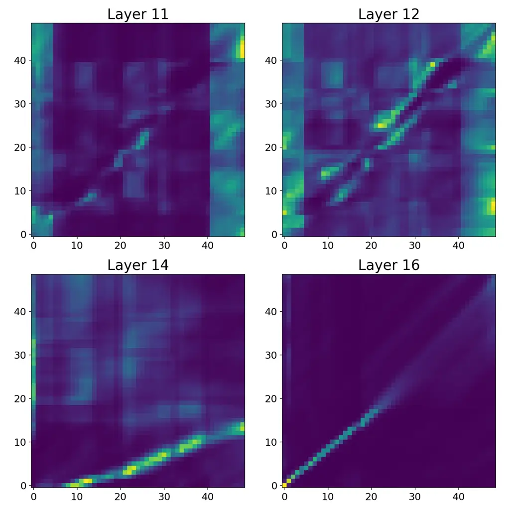

Lee Mimura Moriya

# Progressive Alignment Objectives for Aligner-Encoder based ASR

Jaeyoung    Masato    Takafumi

###### Abstract

Aligner-Encoders are recently proposed seq2seq end-to-end ASR models
that replace decoder attention by predicting the u-th token directly
from the u-th encoder position, so the encoder must learn the alignment
internally without cross-attention or a transducer lattice. In practice,
this alignment often forms abruptly in the upper layers, making training
sensitive and brittle on long utterances. We propose InterAligner, which
adds an intermediate Aligner objective so alignment can form
progressively across depth, together with an intermediate CTC loss
(InterCTC) to stabilize optimization. On LibriSpeech with a 17-layer
Conformer, a final-only Aligner reaches 5.0/7.8 WER (test-clean/other).
InterCTC improves to 3.4/6.0, and InterAligner further reduces WER to
3.1/5.6 with the largest gains on long utterances.

###### keywords

Aligner-encoders, Speech recognition

^(†)^(†)address: ¹ NTT, Inc., Japan ^(†)^(†)email: jae.lee@ntt.com

## 1 Introduction

Learning a monotonic alignment between acoustic frames and output tokens
remains central to end-to-end (E2E) automatic speech recognition (ASR).
Classical E2E formulations differ primarily in how they represent
alignment: Connectionist Temporal Classification (CTC)
\[1\] marginalizes over monotonic paths with dynamic programming,
RNN-Transducer (RNN-T) \[2\] extends this idea with a joint
acoustic-label lattice, and attention-based encoder-decoders (AED) learn
alignments implicitly through cross-attention \[3\]. While modern
encoders such as the Conformer \[4\] have strengthened all three
paradigms, alignment learning can still dominate optimization difficulty
and robustness, especially for long utterances.

Beyond these established paradigms, some recent sequence-to-sequence
(seq2seq) ASR frameworks aim to reduce reliance on implicit,
unconstrained cross-attention alignments by introducing monotonic
inductive bias or structured emission mechanisms. Hybrid objectives that
combine AED training with auxiliary monotonic losses such as CTC can
improve stability and convergence \[5\]. Separately, Continuous
Integrate-and-Fire (CIF) \[6\] introduces a soft monotonic emission
process that aggregates frame-level representations into token-level
segments by dynamically “integrating” evidence until a threshold
triggers output. Collectively, these works illustrate complementary ways
of injecting monotonic bias via auxiliary losses or explicit emission
mechanisms, and suggest that architectures where alignment must form
within the network (e.g., within encoder self-attention) may benefit
from additional monotonic guidance at intermediate depth.

Aligner-Encoders \[7\] offer a recent alternative that makes alignment
explicit inside encoder self-attention, enabling lightweight decoding
while remaining competitive with strong AED baselines. However,
Aligner-Encoders exhibit a distinctive training dynamic: clear diagonal
alignment emerges abruptly only in a small number of top layers of a
17-layer encoder \[7\]. This creates a late-layer alignment bottleneck,
where the model must transition from largely unaligned acoustic
representations to near-monotonic alignment within just a few layers. In
particular, for long utterances, a large mismatch between encoder-frame
counts and token length makes alignment difficult and markedly degrades
recognition performance \[7\].

We propose InterAligner, which encourages alignment to form
progressively across depth by adding an intermediate Aligner objective
at an upper-intermediate layer using a longer, finer-grained target
sequence, followed by the final Aligner objective at the last layer with
a shorter, coarser tokenization. We additionally attach an early-layer
intermediate CTC loss (InterCTC), building on intermediate CTC
supervision \[8\] and CTC-assisted training \[5\]. Our method creates a
curriculum over alignment difficulty and is related to
hierarchical/multi-granularity supervision \[9, 10, 11\], but
specifically targets alignment emergence within encoder self-attention.

This work (i) establishes InterCTC as an effective optimization aid for
Aligner-Encoders and (ii) introduces InterAligner to encourage
progressive alignment formation across depth. We show consistent
accuracy gains from both components on LibriSpeech and Common Voice
English, and provide complementary evidence through long-utterance
analysis and attention visualizations.

Figure 1: InterAligner augments Aligner-Encoders with auxiliary
monotonic supervision at intermediate depth, by providing early
monotonic guidance on a longer sequence with a finer token granularity.

Figure 2: Aligner-encoder architecture. The joiner and predictor modules
operate autoregressively on $`U`$ speech frames; speech after that is
discarded.

## 2 Related Work

### 2.1 Aligner-Encoders and alignment-explicit transduction

E2E ASR research has repeatedly revisited the question of how to
represent and learn monotonic audio-text alignment reliably \[12\].
Beyond CTC and RNN-T, several alignment-explicit transduction frameworks
have been proposed to reduce reliance on unconstrained soft attention,
including the Recurrent Neural Aligner (RNA) \[13\] and self-attention
based transducer variants \[14, 15, 16\]. Relatedly, self-attention can
be augmented with an explicit alignment mechanism for latency-controlled
recognition \[17\], and label-synchronous transducers further emphasize
label-level (not frame-level) representation and emission \[18\].

Stooke et al. proposed _Aligner-Encoders_, which expose audio-text
alignment within encoder self-attention and enable lightweight decoding
while remaining competitive with attention-based encoder-decoders (AED)
under a shared Conformer backbone \[7\]. A key observation in
Aligner-Encoders is that clear diagonal alignment structure typically
becomes prominent only in the upper layers of deep encoders \[7\]. Our
work builds directly on this setting and addresses the resulting depth
bottleneck by distributing alignment supervision across depth so that
alignment can form more gradually, improving robustness particularly for
long utterances.

### 2.2 Monotonic bias and intermediate supervision

Monotonicity is commonly encouraged via auxiliary CTC objectives in AED
training \[5, 19\] and joint decoding \[20\]. Structured monotonic
attention and related mechanisms further constrain alignment for
streaming/robustness \[21, 22, 23, 24, 6\], motivated by analyses of
attention alignment behavior \[25\]. Intermediate/deep supervision
improves optimization in deep encoders \[8, 26\]; we evaluate InterCTC
in Aligner-Encoders and introduce an intermediate Aligner objective to
directly guide self-attention alignment formation.

### 2.3 Hierarchical and multi-granularity supervision

Hierarchical supervision attaches losses at multiple depths and/or label
granularities \[9, 27, 10, 11, 28\]. InterAligner is closest in spirit
to this line of hierarchical/multi-granularity supervision, but is
tailored to Aligner-Encoders: we apply an intermediate _Aligner_ loss on
a longer, finer-grained target before the final Aligner loss,
encouraging monotonic alignment to emerge progressively within encoder
self-attention.

## 3 Methodology

### 3.1 Aligner-Encoders

We follow the Aligner-Encoder formulation of \[7\] (see Figure 2). Let
$`\bm{X}=(\bm{x}_{1},\dots,\bm{x}_{T})`$ denote an input acoustic
feature sequence of length $`T`$. Let $`\bm{y}=(y_{1},\dots,y_{U})`$ be
the output token sequence of length $`U`$, where we append an
end-of-sequence token $`\langle\mathrm{eos}\rangle`$ (and include it in
$`U`$). Aligner-Encoders assume $`U\leq T^{\prime}`$, where
$`T^{\prime}`$ is the encoder output length after subsampling.

An encoder network $`f_{\mathrm{enc}}`$ maps $`\bm{X}`$ to an acoustic
embedding sequence

```math
\bm{H}=f_{\mathrm{enc}}(\bm{X})=(\bm{h}_{1},\dots,\bm{h}_{T^{\prime}}), \tag{1}
```

and a prediction network $`f_{\mathrm{pred}}`$ produces a text embedding
sequence conditioned on the token history:

```math
\bm{g}_{u}=f_{\mathrm{pred}}(\bm{g}_{u-1},y_{u-1}),\qquad u=1,\dots,U. \tag{2}
```

We set $`y_{0}=\langle\mathrm{sos}\rangle`$ and initialize
$`\bm{g}_{0}`$ (e.g., all zeros). In our implementation,
$`f_{\mathrm{pred}}`$ is a one-layer LSTM over token embeddings.

A joiner network $`f_{\mathrm{joint}}`$ combines the paired
acoustic/text embeddings to produce logits over the vocabulary:

```math
\displaystyle\bm{z}_{u} \displaystyle=f_{\mathrm{joint}}(\bm{h}_{u},\bm{g}_{u}), \tag{3}
```

```math
\displaystyle P(y_{u}\mid\bm{X},y_{<u}) \displaystyle=\mathrm{softmax}(\bm{z}_{u}). \tag{4}
```

Throughout the paper, $`f_{\mathrm{joint}}`$ is a feed-forward joiner:

```math
\tilde{\bm{z}}_{u}=\tanh(\bm{W}_{h}\bm{h}_{u}+\bm{W}_{g}\bm{g}_{u}+\bm{b}),\qquad\bm{z}_{u}=\bm{W}_{o}\tilde{\bm{z}}_{u}+\bm{b}_{o}, \tag{5}
```

followed by $`\mathrm{softmax}(\cdot)`$ in Eq. (4). The defining
restriction of Aligner-Encoders is the one-to-one pairing
$`(\bm{h}_{u},\bm{g}_{u})`$ in Eq. (4), rather than a full
$`T^{\prime}\times U`$ lattice as in RNN-T.

Training minimizes the negative log-likelihood of the label sequence:

```math
\mathcal{L}_{\mathrm{final}}(\theta)=-\sum_{u=1}^{U}\log P(y_{u}\mid\bm{X},y_{<u};\theta). \tag{6}
```

With $`T^{\prime}\geq U`$, the loss is applied only up to $`u=U`$ and
the remaining encoder frames are ignored, requiring the encoder to move
label-relevant information into its first $`U`$ outputs.

At inference time, given $`\bm{h}_{1},\dots,\bm{h}_{T^{\prime}}`$,
decoding proceeds sequentially over encoder frames and emits one token
per frame until $`\langle\mathrm{eos}\rangle`$ is produced, as in
standard AED. Let $`\hat{y}_{u}`$ denote the token emitted at step
$`u`$. Starting from $`\hat{y}_{0}=\langle\mathrm{sos}\rangle`$ and
state $`\bm{g}_{0}`$, for $`u=1,2,\dots,T^{\prime}`$ we compute

```math
\displaystyle\bm{g}_{u} \displaystyle=f_{\mathrm{pred}}(\bm{g}_{u-1},\hat{y}_{u-1}), \tag{7}
```

```math
\displaystyle\bm{p}_{u}(\cdot) \displaystyle=\mathrm{softmax}(f_{\mathrm{joint}}(\bm{h}_{u},\bm{g}_{u})), \tag{8}
```

where we select $`\hat{y}_{u}`$ from $`\bm{p}_{u}(\cdot)`$ using greedy
decoding or beam search, and stop when
$`\hat{y}_{u}=\langle\mathrm{eos}\rangle`$.

| System                             | test-clean | test-other |
| ---------------------------------- | ---------- | ---------- |
| Final Aligner only (Stooke et al.) | 4.8        | 6.5        |
| Final Aligner only (ours)          | 5.0        | 7.8        |
|    + InterCTC                      | 3.4        | 6.0        |
|     + InterAligner                 | 3.1        | 5.6        |

Table 1: Main LibriSpeech results (WERs %) on test sets.

| System             | test |
| ------------------ | ---- |
| Final Aligner only | 12.4 |
|    + InterCTC      | 11.2 |
|     + InterAligner | 10.9 |

Table 2: Common Voice (16.1) English results (WERs %).

### 3.2 InterAligner and InterCTC

InterAligner augments the baseline Aligner-Encoder objective with two
intermediate losses, as illustrated in Fig. 1(b). Let
$`\bm{H}^{(\ell)}=(\bm{h}^{(\ell)}_{1},\dots,\bm{h}^{(\ell)}_{T^{\prime}})`$
denote the encoder sequence after layer $`\ell`$ ($`\ell=1,\dots,L`$),
with $`\bm{H}^{(L)}\equiv\bm{H}`$.

| Split | System             | $`<`$17s | 17–21s | $`>`$21s | All |
| ----- | ------------------ | -------- | ------ | -------- | --- |
| clean | Final Aligner only | 3.2      | 5.7    | 23.4     | 5.0 |
|       |   + InterCTC       | 2.3      | 2.3    | 17.0     | 3.4 |
|       |    + InterAligner  | 2.4      | 2.9    | 11.6     | 3.1 |
| other | Final Aligner only | 7.0      | 8.2    | 24.0     | 7.8 |
|       |   + InterCTC       | 5.4      | 5.3    | 18.0     | 6.0 |
|       |    + InterAligner  | 5.2      | 5.5    | 13.5     | 5.6 |

Table 3: WERs (%) by utterance duration on LibriSpeech test.

InterCTC attaches an intermediate CTC loss
$`\mathcal{L}_{\mathrm{ctc}}`$ at layer $`\ell_{\mathrm{ctc}}`$ (we use
$`\ell_{\mathrm{ctc}}=12`$). InterAligner attaches an intermediate
Aligner loss at layer $`\ell_{\mathrm{int}}`$ (we use
$`\ell_{\mathrm{int}}=15`$ in the main results) using an intermediate
token sequence

```math
\bm{y}^{\mathrm{int}}=(y^{\mathrm{int}}_{1},\dots,y^{\mathrm{int}}_{U_{\mathrm{int}}}), \tag{9}
```

derived from the same transcript with a finer tokenization, typically
yielding $`U_{\mathrm{int}}>U`$. The InterAligner head uses a separate
predictor and joiner from the final Aligner (no parameter sharing). We
ensure $`U_{\mathrm{int}}\leq T^{\prime}`$ so that the one-to-one
pairing in Aligner-Encoders is well-defined. Using the same
predictor–joiner factorization as Eqs. (2)–(4), but applied to
$`\bm{H}^{(\ell_{\mathrm{int}})}`$ and $`\bm{y}^{\mathrm{int}}_{<u}`$,
the intermediate Aligner loss is

```math
\mathcal{L}_{\mathrm{int}}(\theta)=-\sum_{u=1}^{U_{\mathrm{int}}}\log P_{\mathrm{int}}\left(y^{\mathrm{int}}_{u}\mid\bm{X},y^{\mathrm{int}}_{<u};\theta\right). \tag{10}
```

These objectives are intended to shape alignment formation in stages:
InterCTC encourages token-predictive representations early in the
encoder, InterAligner encourages alignment to a longer, finer-grained
sequence at intermediate depth, and the final Aligner loss
$`\mathcal{L}_{\mathrm{final}}`$ (Eq. (6)) encourages refinement to the
shorter, coarser target at the top layer.

The overall training objective is

```math
\mathcal{L}(\theta)=\lambda_{\mathrm{final}}\mathcal{L}_{\mathrm{final}}(\theta)+\lambda_{\mathrm{int}}\,\mathcal{L}_{\mathrm{int}}(\theta)+\lambda_{\mathrm{ctc}}\,\mathcal{L}_{\mathrm{ctc}}(\theta). \tag{11}
```

## 4 Experimental Evaluations

### 4.1 Models and Datasets

We evaluate on LibriSpeech 960h and report WER on test-clean and
test-other. We additionally evaluate on Common Voice 16.1 English, where
punctuation is removed in both train and test.

All systems use the same 17-layer Conformer-L encoder (overall model
$`\sim`$118M parameters). Unless otherwise noted, the final Aligner head
is attached at layer 17, InterAligner at layer 15, and InterCTC at layer 12. For a fair comparison with \[7\], we set the beam width to 6. For
LibriSpeech, we train for 100 epochs and report results with model
averaging over the 10 best checkpoints. For Common Voice, we train for
50 epochs with the same 10-best averaging. The effective batch size is
set to $`\sim`$2 hours of audio in all settings. For reference, Table 1
includes the final-only Aligner WER reported in Stooke et al. \[7\].
Reproducing that number is challenging under a limited training budget,
which motivates adding intermediate objectives (InterCTC, InterAligner)
to stabilize training.

We use standard Transformer warmup/decay with 20k warmup steps. Peak
learning rate is found optimal when 0.0020 for settings that do not use
any target vocabulary size $`\leq 256`$, and 0.0025 otherwise. The CTC
weight is fixed to $`\lambda_{\mathrm{ctc}}=0.1`$ in all experiments.
For InterAligner systems, we tune
$`(\lambda_{\mathrm{final}},\lambda_{\mathrm{int}})`$ and report the
best-performing weights; ablations include explicit values.

We compare progressively augmented systems: a final-only Aligner, the
same model with InterCTC, and the full InterAligner configuration
(InterCTC + InterAligner). All tokenization uses Byte Pair Encoding
(BPE) \[29\]. Unless stated otherwise, the number of tokens in the
vocabulary for the final Aligner is 1024, InterAligner uses 256, and
InterCTC matches the tokenization of the Aligner objective at the
nearest higher layer (1024 in the InterCTC setting; 256 in
InterAligner).

### 4.2 Results

Table 1 reports the main LibriSpeech results. InterCTC yields a large
improvement over the final-only Aligner baseline, and adding
InterAligner provides a further gain. We observe the same trend on
Common Voice English (Table 2) as on LibriSpeech: adding InterCTC
improves over the final-only Aligner, and adding InterAligner yields
further gains. Final-only Aligner obtains 12.4% WER, adding InterCTC
improves to 11.2%, and adding InterAligner further reduces WER to 10.9%
on the final head. We also verified with statistical significance
testing that the WER reductions from InterCTC and from adding
InterAligner are significant at the 1% level.

Table 3 reports WER stratified by utterance duration. While the
InterAligner system matches the InterCTC baseline on short and medium
segments, it substantially improves performance on long utterances
($`>21`$ s), reducing WER from 17.0 to 11.6 on test-clean and from 18.0
to 13.5 on test-other. These gains support our motivation that
distributing alignment supervision across depth makes Aligner-Encoders
more robust when the model must learn alignment over longer contexts.

We next analyze ablations that isolate the roles of intermediate
tokenization, hierarchical supervision, and auxiliary-objective design.
Table 4 evaluates whether the intermediate CTC target should match the
InterAligner target, and how sensitive performance is to the loss
weights, with $`\lambda_{\mathrm{ctc}}=0.1`$ for all rows. Using the
same intermediate vocabulary size for InterAligner and InterCTC
consistently outperforms using a larger InterCTC vocabulary (i.e.,
matching 256/256 vs. mismatching 256/1024). The results also show that
the relative weighting of the final and intermediate Aligner losses
matters: emphasizing the intermediate Aligner loss
$`(\lambda_{\mathrm{final}},\lambda_{\mathrm{int}})=(0.5,1.0)`$ is best
in the matched setting, while $`(1.0,0.5)`$ degrades the intermediate
head and slightly worsens the final head. Interestingly, under the
optimal weighting the intermediate head attains slightly lower WER than
the final head (3.0/5.5 vs. 3.1/5.6). All main results are reported
using decoding from the final head.

| Target BPE |       |      | Weights                                             | test clean / other |           |
| ---------- | ----- | ---- | --------------------------------------------------- | ------------------ | --------- |
| final      | inter | CTC  | $`\lambda_{\mathrm{final}}/\lambda_{\mathrm{int}}`$ | final              | inter     |
| 1024       | 256   | 256  | 0.5 / 1.0                                           | 3.1 / 5.6          | 3.0 / 5.5 |
| 1024       | 256   | 256  | 1.0 / 0.5                                           | 3.1 / 5.8          | 5.7 / 7.0 |
| 1024       | 256   | 1024 | 1.0 / 0.5                                           | 3.2 / 5.8          | 4.0 / 6.1 |

Table 4: Effect of matching InterAligner/InterCTC targets and
loss-weight sensitivity. Left: target BPE vocabulary sizes for the final
Aligner (final), InterAligner (inter), and InterCTC. Right: WERs (%) on
LibriSpeech test sets.

|            |       |      |                    |           |
| ---------- | ----- | ---- | ------------------ | --------- |
| Target BPE |       |      | test clean / other |           |
| final      | inter | CTC  | final              | inter     |
| 1024       | 1024  | 1024 | 3.7 / 6.3          | 3.8 / 6.3 |
| 1024       | 256   | 256  | 3.1 / 5.8          | 5.7 / 7.0 |
| 1024       | 64    | 64   | 3.0 / 5.7          | 5.7 / 6.8 |
| 256        | –     | 256  | 5.0 / 6.4          | –         |

Table 5: Ablation results on tokenization choices. Left: target BPE
vocabulary sizes. Right: WERs (%) on LibriSpeech test sets. “–” denotes
that the corresponding objective is not used.

Table 5 varies the target vocabulary sizes used for the intermediate
objectives, with
$`(\lambda_{\mathrm{final}},\lambda_{\mathrm{int}},\lambda_{\mathrm{ctc}})=(1.0,0.5,0.1)`$,
except for the last row, where
$`(\lambda_{\mathrm{final}},\lambda_{\mathrm{int}},\lambda_{\mathrm{ctc}})=(1.0,0,0.1)`$.
Using smaller intermediate vocabularies (256 or 64) yields strong
performance, whereas using the same intermediate vocabulary as the final
Aligner (1024) degrades WER, indicating that intermediate granularity
substantially affects the difficulty of the implicit alignment problem.
The results also indicate that reducing vocabulary size alone is
insufficient: removing InterAligner and training only with 256
(final=256, CTC=256) performs much worse than the hierarchical
configuration, suggesting that the gains arise from progressive
supervision rather than tokenization alone.



Figure 3: Averaged (8-head) encoder self-attention maps for InterAligner
on a LibriSpeech utterance ($`U_{\mathrm{int}}=11`$, $`U=9`$),
illustrating progressive alignment emergence across layers
($`T^{\prime}\rightarrow U_{\mathrm{int}}`$ in layer 14,
$`U_{\mathrm{int}}\rightarrow U`$ in layer 16).

| InterAligner layer | final     | inter     |
| ------------------ | --------- | --------- |
| 16th               | 3.8 / 5.9 | 3.5 / 5.8 |
| 15th               | 3.1 / 5.6 | 3.0 / 5.5 |
| 13th               | 3.5 / 6.4 | 3.3 / 5.9 |

Table 6: Effect of InterAligner layer placement for
InterAligner+InterCTC, reporting WER (%) on test clean / other.

Table 6 examines the placement of the InterAligner objective, with
$`(\lambda_{\mathrm{final}},\lambda_{\mathrm{int}},\lambda_{\mathrm{ctc}})=(0.5,1.0,0.1)`$
and an intermediate vocabulary size of 256 for both InterAligner and
InterCTC. The best results are obtained at layer 15, whereas attaching
InterAligner at layer 16 substantially degrades performance. One
interpretation is that at least two layers are needed to convert the
intermediate alignment into the final alignment, consistent with the
findings in \[7\] where alignment is reported to emerge across 2 upper
layers.

### 4.3 Attention Visualization

Figure 3 shows averaged (8-head) encoder self-attention maps for a
representative LibriSpeech utterance ($`U_{\mathrm{int}}=11`$, $`U=9`$).
Alignment does not emerge in the lower layers shown (11-12), but appears
progressively in the upper encoder layers. At layer 14, attention
concentrates into a sharp monotonic band consistent with
$`T^{\prime}\rightarrow U_{\mathrm{int}}`$ alignment. By layer 16, a
second sharp diagonal pattern is observed at the coarser final
granularity, consistent with $`U_{\mathrm{int}}\rightarrow U`$. These
patterns support our claim that InterAligner encourages staged alignment
formation across depth rather than direct $`T^{\prime}\rightarrow U`$
alignment in the top layers.

## 5 Conclusion

We proposed InterAligner, which augments Aligner-Encoders with
progressive alignment supervision by adding an intermediate Aligner
objective, together with an intermediate CTC loss (InterCTC) for
optimization stability. Across LibriSpeech and Common Voice English,
InterAligner consistently improves over a final-only Aligner and over
InterCTC alone, with the largest gains on long utterances. Attention
visualizations support the intended emergence of progressive alignment
across depth. Future work will study progressive objectives for
streaming and long-form recognition and their interaction with
language-model integration.

## 6 Generative AI Use Disclosure

We used generative AI tools to assist with code development and
manuscript editing; all generated content was reviewed and validated by
the authors.

## References

- \[1\] A. Graves, S. Fernández, F. Gomez, and J. Schmidhuber (2006)
  Connectionist temporal classification: labelling unsegmented sequence
  data with recurrent neural networks. In Proceedings of the 23rd
  International Conference on Machine Learning (ICML), pp. 369–376.
  External Links: [Document](https://dx.doi.org/10.1145/1143844.1143891)
  Cited by: §1.
- \[2\] A. Graves (2012) Sequence transduction with recurrent neural
  networks. arXiv preprint arXiv:1211.3711. Cited by: §1.
- \[3\] W. Chan, N. Jaitly, Q. V. Le, and O. Vinyals (2016) Listen,
  attend and spell: a neural network for large vocabulary conversational
  speech recognition. In 2016 IEEE International Conference on
  Acoustics, Speech and Signal Processing (ICASSP), pp. 4960–4964.
  External Links:
  [Document](https://dx.doi.org/10.1109/ICASSP.2016.7472621) Cited by:
  §1.
- \[4\] A. Gulati, J. Qin, C. Chiu, N. Parmar, Y. Zhang, J. Yu, W.
  Han, S. Wang, Z. Zhang, Y. Wu, and R. Pang (2020) Conformer:
  Convolution-augmented Transformer for Speech Recognition. In Proc.
  INTERSPEECH 2020 – 21^(st) Annual Conference of the International
  Speech Communication Association, pp. 5036–5040. External Links:
  [Document](https://dx.doi.org/10.21437/Interspeech.2020-3015) Cited
  by: §1.
- \[5\] S. Kim, T. Hori, and S. Watanabe (2017) Joint CTC-attention
  based end-to-end speech recognition using multi-task learning. In 2017
  IEEE International Conference on Acoustics, Speech and Signal
  Processing (ICASSP), pp. 4835–4839. External Links:
  [Document](https://dx.doi.org/10.1109/ICASSP.2017.7953075) Cited by:
  §1, §1, §2.2.
- \[6\] L. Dong and B. Xu (2020) CIF: continuous integrate-and-fire for
  end-to-end speech recognition. In 2020 IEEE International Conference
  on Acoustics, Speech and Signal Processing (ICASSP), pp. 6079–6083.
  External Links:
  [Document](https://dx.doi.org/10.1109/ICASSP40776.2020.9054250) Cited
  by: §1, §2.2.
- \[7\] A. Stooke, R. Prabhavalkar, K. C. Sim, and P. M. Mengibar (2024)
  Aligner-encoders: self-attention transformers can be self-transducers.
  In Advances in Neural Information Processing Systems 37 (NeurIPS
  2024), Cited by: §1, §2.1, §3.1, §4.1, §4.2.
- \[8\] J. Lee and S. Watanabe (2021) Intermediate loss regularization
  for CTC-based speech recognition. In 2021 IEEE International
  Conference on Acoustics, Speech and Signal Processing (ICASSP),
  pp. 6224–6228. External Links:
  [Document](https://dx.doi.org/10.1109/ICASSP39728.2021.9414594) Cited
  by: §1, §2.2.
- \[9\] R. Sanabria and F. Metze (2018) Hierarchical multi task learning
  with CTC. In 2018 IEEE Spoken Language Technology Workshop (SLT),
  pp. 485–490. External Links:
  [Document](https://dx.doi.org/10.1109/SLT.2018.8639530) Cited by: §1,
  §2.3.
- \[10\] Y. Higuchi, K. Karube, T. Ogawa, and T. Kobayashi (2022)
  Hierarchical conditional end-to-end ASR with CTC and multi-granular
  subword units. In 2022 IEEE International Conference on Acoustics,
  Speech and Signal Processing (ICASSP), pp. 7797–7801. External Links:
  [Document](https://dx.doi.org/10.1109/ICASSP43922.2022.9746580) Cited
  by: §1, §2.3.
- \[11\] N. Kusunoki, Y. Higuchi, T. Ogawa, and T. Kobayashi (2024)
  Hierarchical Multi-Task Learning with CTC and Recursive Operation. In
  Interspeech 2024, pp. 2855–2859. External Links:
  [Document](https://dx.doi.org/10.21437/Interspeech.2024-1542) Cited
  by: §1, §2.3.
- \[12\] R. Prabhavalkar, T. Hori, T. N. Sainath, R. Schlüter, and S.
  Watanabe (2024) End-to-end speech recognition: a survey. IEEE/ACM
  Transactions on Audio, Speech, and Language Processing 32,
  pp. 325–351. External Links:
  [Document](https://dx.doi.org/10.1109/TASLP.2023.3328283) Cited by:
  §2.1.
- \[13\] H. Sak, K. Rao, and F. Beaufays (2017) Recurrent Neural
  Aligner: An Encoder-Decoder Neural Network Model for Sequence to
  Sequence Mapping. In Interspeech 2017, pp. 1298–1302. External Links:
  [Document](https://dx.doi.org/10.21437/Interspeech.2017-149) Cited by:
  §2.1.
- \[14\] Z. Tian, J. Yi, J. Tao, Y. Bai, and Z. Wen (2019)
  Self-Attention Transducers for End-to-End Speech Recognition. In
  Interspeech 2019, pp. 4395–4399. External Links:
  [Document](https://dx.doi.org/10.21437/Interspeech.2019-2203) Cited
  by: §2.1.
- \[15\] C. Yeh, J. Mahadeokar, K. Kalgaonkar, Y. Wang, D. Le, M.
  Jain, K. Schubert, C. Fuegen, and M. L. Seltzer (2019)
  Transformer-transducer: end-to-end speech recognition with
  self-attention. arXiv preprint arXiv:1910.12977. Cited by: §2.1.
- \[16\] Q. Zhang, H. Lu, H. Sak, A. Tripathi, E. McDermott, S. Koo,
  and S. Kumar (2020) Transformer transducer: a streamable speech
  recognition model with transformer encoders and rnn-t loss. In 2020
  IEEE International Conference on Acoustics, Speech and Signal
  Processing (ICASSP), pp. 7829–7833. External Links:
  [Document](https://dx.doi.org/10.1109/ICASSP40776.2020.9053896) Cited
  by: §2.1.
- \[17\] L. Dong, F. Wang, and B. Xu (2019) Self-attention aligner: a
  latency-controlled self-attention model for automatic speech
  recognition. In 2019 IEEE International Conference on Acoustics,
  Speech and Signal Processing (ICASSP), pp. 5656–5660. External Links:
  [Document](https://dx.doi.org/10.1109/ICASSP.2019.8682954) Cited by:
  §2.1.
- \[18\] K. Deng and P. C. Woodland (2024) Label-synchronous neural
  transducer for adaptable online e2e speech recognition. IEEE/ACM
  Transactions on Audio, Speech, and Language Processing 32 (),
  pp. 3507–3516. External Links:
  [Document](https://dx.doi.org/10.1109/TASLP.2024.3419421) Cited by:
  §2.1.
- \[19\] S. Watanabe, T. Hori, S. Kim, J. R. Hershey, and T.
  Hayashi (2017) Hybrid CTC/attention architecture for end-to-end speech
  recognition. IEEE Journal of Selected Topics in Signal Processing 11
  (8), pp. 1240–1253. External Links:
  [Document](https://dx.doi.org/10.1109/JSTSP.2017.2763455) Cited by:
  §2.2.
- \[20\] T. Hori, S. Watanabe, and J. Hershey (2017) Joint CTC/attention
  decoding for end-to-end speech recognition. In Proceedings of the 55th
  Annual Meeting of the Association for Computational Linguistics
  (Volume 1: Long Papers), pp. 518–529. External Links:
  [Document](https://dx.doi.org/10.18653/v1/P17-1048) Cited by: §2.2.
- \[21\] C. Raffel, M. Luong, P. J. Liu, R. J. Weiss, and D. Eck (2017)
  Online and linear-time attention by enforcing monotonic alignments. In
  Proceedings of the 34th International Conference on Machine Learning
  (ICML), pp. 2837–2846. Cited by: §2.2.
- \[22\] C. Chiu and C. Raffel (2018) Monotonic chunkwise attention. In
  International Conference on Learning Representations (ICLR), Cited by:
  §2.2.
- \[23\] Y. Zhao, C. Ni, C. Leung, S. Joty, E. S. Chng, and B. Ma (2020)
  Cross Attention with Monotonic Alignment for Speech Transformer. In
  Interspeech 2020, pp. 5031–5035. External Links:
  [Document](https://dx.doi.org/10.21437/Interspeech.2020-1198) Cited
  by: §2.2.
- \[24\] N. Moritz, T. Hori, and J. L. Roux (2019) Triggered attention
  for end-to-end speech recognition. In 2019 IEEE International
  Conference on Acoustics, Speech and Signal Processing (ICASSP),
  pp. 5666–5670. External Links:
  [Document](https://dx.doi.org/10.1109/ICASSP.2019.8683510) Cited by:
  §2.2.
- \[25\] R. Prabhavalkar, T. N. Sainath, B. Li, K. Rao, and N.
  Jaitly (2017) An Analysis of “Attention” in Sequence-to-Sequence
  Models. In Interspeech 2017, pp. 3702–3706. External Links:
  [Document](https://dx.doi.org/10.21437/Interspeech.2017-232) Cited by:
  §2.2.
- \[26\] A. Tjandra, C. Liu, F. Zhang, X. Zhang, Y. Wang, G.
  Synnaeve, S. Nakamura, and G. Zweig (2020) Deja-vu: double feature
  presentation and iterated loss in deep transformer networks. In 2020
  IEEE International Conference on Acoustics, Speech and Signal
  Processing (ICASSP), pp. 6899–6903. External Links:
  [Document](https://dx.doi.org/10.1109/ICASSP40776.2020.9052964) Cited
  by: §2.2.
- \[27\] K. Krishna, S. Toshniwal, and K. Livescu (2018) Hierarchical
  multitask learning for CTC-based speech recognition. arXiv preprint
  arXiv:1807.06234. Cited by: §2.3.
- \[28\] T. Moriya, S. Ueno, Y. Shinohara, M. Delcroix, Y. Yamaguchi,
  and Y. Aono (2018) Multi-task Learning with Augmentation Strategy for
  Acoustic-to-word Attention-based Encoder-decoder Speech Recognition.
  In Interspeech 2018, pp. 2399–2403. External Links:
  [Document](https://dx.doi.org/10.21437/Interspeech.2018-1866), ISSN
  2958-1796 Cited by: §2.3.
- \[29\] R. Sennrich, B. Haddow, and A. Birch (2016) Neural machine
  translation of rare words with subword units. In Proceedings of the
  54th Annual Meeting of the Association for Computational Linguistics
  (Volume 1: Long Papers), pp. 1715–1725. External Links:
  [Document](https://dx.doi.org/10.18653/v1/P16-1162) Cited by: §4.1.
