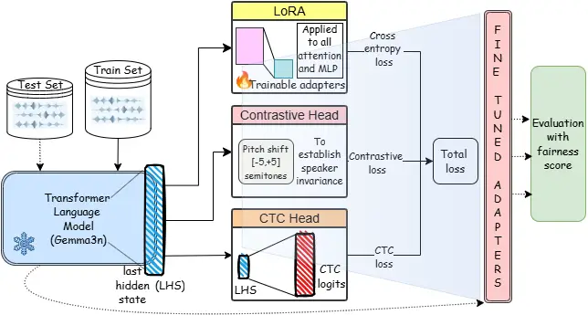
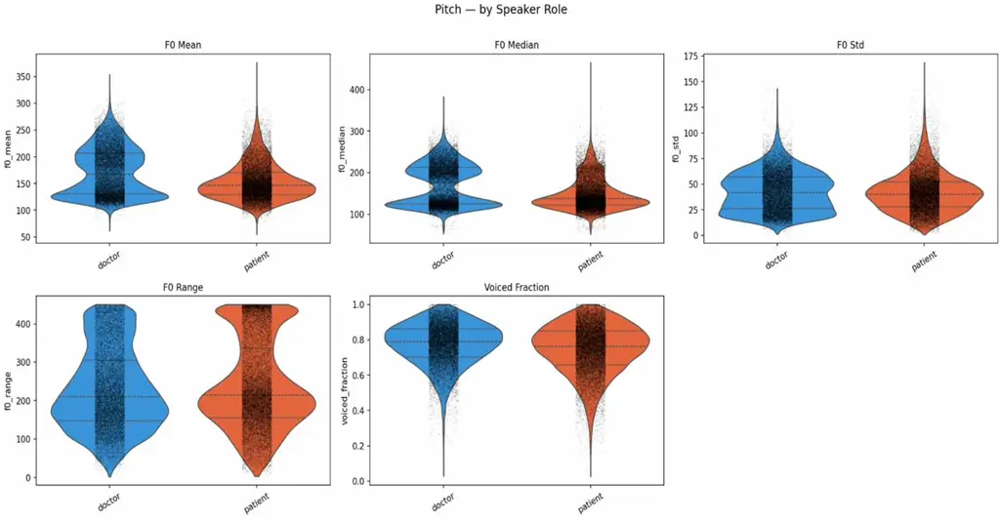
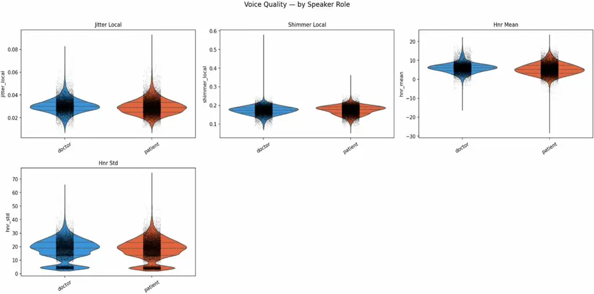
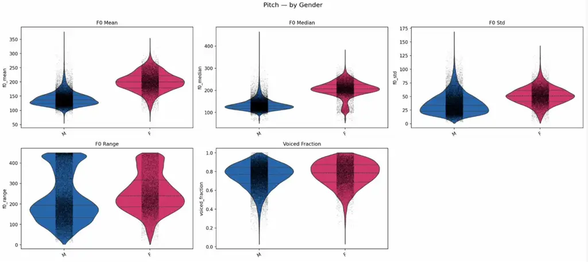
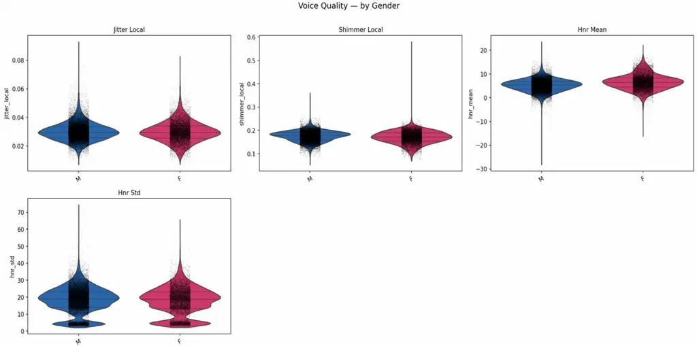
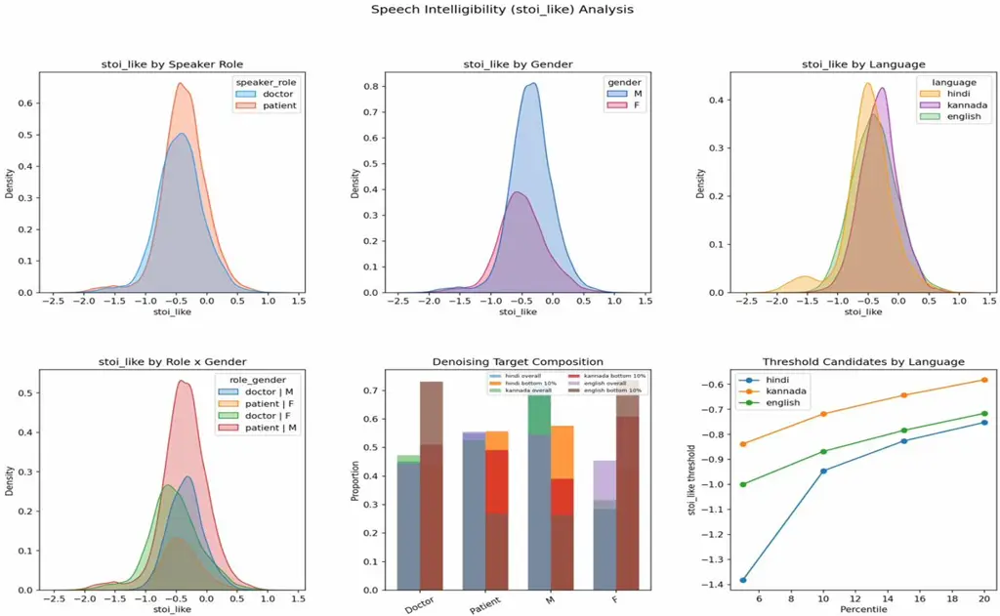

\fontspec_if_language:nTF

ENG\addfontfeatureLanguage=English

# SamaVaani: Auditing and Debiasing Multilingual Clinical ASR for Indian Languages

Subham Kumar Prakrithi Shivaprakash Abhishek Manoharan Astut Kurariya
Affiliation: IIT, Kharagpur Affiliation: NIMHANS, Bangalore,
^(\*)LGBRIMH, Tezpur    Diptadhi Mukherjee^(\*) Prabhat Chand Pratima
Murthy Affiliation: NIMHANS, Bangalore, ^(\*)LGBRIMH, Tezpur    Koustav
Rudra Lekhansh Shukla Affiliation: IIT, Kharagpur Affiliation: NIMHANS,
Bangalore, ^(\*)LGBRIMH, Tezpur    Animesh Mukherjee
Email: [{kumarshubham209, prakrithishivaprakash, 12.abhishek.m,
astutnamo, diptadhimukherjee}@gmail.comprabhat@vknnimhans.in,
{pratimamurthy, krudra5, drlekhansh,
animeshm}@gmail.com](mailto:%7Bkumarshubham209,%20prakrithishivaprakash,%2012.abhishek.m,%20astutnamo,%20diptadhimukherjee%7D@gmail.comprabhat@vknnimhans.in,%20%7Bpratimamurthy,%20krudra5,%20drlekhansh,%20animeshm%7D@gmail.com)
Affiliation: IIT, Kharagpur

###### Abstract

Automatic Speech Recognition (ASR) is increasingly used to document
clinical encounters, yet its reliability in multilingual and
demographically diverse Indian healthcare context remains largely
unknown. In this study, we first conduct the systematic audit of ASR
performance on real-world psychiatric interview data spanning Kannada,
Hindi and Indian English, comparing eight state-of-the-art models
including IndicWhisper, WhisperLargeV3, Sarvam, GoogleS2T, Gemma3n,
OmniLingual, Vaani, and Gemini. Our results reveal substantial
variability across models and languages, with some systems performing
competitively in Indian English but failing in regional speech. We
further fine-tune two of the best performing open-source models, i.e.,
Gemma3n and OmniLingual, using various methods. With this, we uncover
systematic performance gaps tied to speaker role and gender, raising
concerns about equitable deployment in clinical settings, which are
further mitigated by fairness-aware fine-tuning. To this end, we propose
SamaVaani, a unified debiasing technique that simultaneously improves
ASR performance and improves fairness across demographic groups.

## \fontspec_if_language:nTFENG\addfontfeatureLanguage=English1 Introduction

The field of psychiatry is highly dependent on language, with a detailed
psychiatric interview the primary diagnostic tool Sommers-Flanagan et
al. (2015) rather than laboratory or radiological investigations.
Subsequently, verbatim transcripts of these interviews are widely used
for clinical diagnosis, academic training, qualitative research, and,
more recently, for the development of AI systems in psychiatric tasks
 So et al. (2024). However, producing accurate transcripts remains a
major bottleneck: manual transcription is strenuous, time-intensive (5-8
hours for every hour of audio) and prone to human error Mays and Mathias
(2019). ASR systems provide a scalable alternative albeit transcription
errors Basma et al. (2011) in psychiatric settings can significantly
change clinical interpretation Ciampelli et al. (2023); Shikino et al.
(2023). Modern ASR systems, including proprietary platforms
(GoogleS2T Cloud (2023), Microsoft Azure Azure (2023), Amazon
Transcribe Services (2023)) and open-source models like Whisper Radford
et al. (2022) have improved transcription quality. Although these
systems work well for standard English (American and British) and in
controlled environments, performance deteriorates substantially for
non-standard English, conversational and accented English Russell et al.
(2024), code-mixing and code-switching, which is common in multilingual
contexts like India Sitaram et al. (2020); Koenecke et al. (2020). In
addition, Indian English and Indian regional languages remain
underrepresented in global training corpora, leading to lower accuracy
and greater variability Javed et al. (2023b); Rai et al. (2024).  
These difficulties are amplified with clinically distinctive speech
patterns in psychiatric interviews. For instance, low tone, hesitations,
and long pauses are common in depression Alpert et al. (2001); Yang et
al. (2012); Durão and others (2025); fast and loud speech in
mania Kaczmarek-Majer and others (2024); Anmella et al. (2024); Di
Florio and others (2021); stammering and repeating in anxiety Silber et
al. (2018); Harrigan et al. (1994); Teferra et al. (2022); and
disordered agrammatical speech containing neologisms (made-up words to
which the patient attaches special meaning) in schizophrenia Covington
et al. (2005); Stokes and others (2023); Hinzen and Rosello (2015).
Beyond this, recordings are often made under acoustically difficult
conditions (in wards with noise from ceiling fans, hospital instruments,
or ambulance sirens) Baroudi et al. (2026). Another big concern is the
fairness and accuracy of the transcription. These problems may be
magnified in psychiatric interviews, as doctors and patients are very
different in terms of education, socio-economic background,
conversational role, and speaking style Koenecke et al. (2020); Tatman
(2017). While recent advances in multilingual ASR from open-source
models such as Whisper Radford et al. (2022), IndicWhisper  AI4Bharat
(2024), OmniLingual  team et al. (2025), Vaani ARTPARK-IISc (2025) and
commercial models like Sarvam SarvamAI (2025) have improved support for
multilingual and regional speech in India, existing evaluations rely
mainly on general-purpose datasets and do not capture the complexities
of real-world psychiatric interviews. Our work addresses this gap by
systematically analyzing and further improving the performance of ASR on
multilingual psychiatric interactions.  
Our contributions and findings: In this work, we present the first
systematic audit of ASR systems on real-world multilingual psychiatric
interviews in the Indian context. Leveraging a novel dataset spanning
Kannada, Hindi, and Indian English, we evaluate eight state-of-the-art
ASR models across languages, speaker roles, and demographic groups, and
introduce a comprehensive fairness analysis grounded in WER and
fine-grained error patterns. We find substantial variability in
performance across models and languages, with consistently higher error
rates for low-resource languages such as Kannada, as well as systematic
disparities across speaker roles and gender. Therefore, we propose
SamaVaani, a simple yet effective fairness-aware fine-tuning framework
combining contrastive learning and CTC alignment, which significantly
improves both transcription accuracy (up to $`\sim 50\%`$ WER reduction)
and fairness across demographic groups. Together, our study highlights
critical limitations of current ASR systems in clinical settings and
provides actionable pathways toward more equitable and robust
multilingual ASR deployment in healthcare.

## \fontspec_if_language:nTFENG\addfontfeatureLanguage=English2 Related work

Research on ASR in Indian multilingual psychiatric settings spans three
interconnected areas: (i) ASR for psychiatric interviews, (ii) Bias and
speaker-level disparities in ASR, and (iii) ASR for Indian languages and
accents. We highlight the challenges and gaps in each area that motivate
the current study.  
ASR for psychiatric interviews: A growing set of studies has examined
the use of ASR to transcribe or analyze psychiatric
interviews. Ciampelli et al. (2023) and Just et al. (2025) evaluated ASR
in schizophrenia patients, comparing them with healthy controls using
interviews conducted in Dutch and German respectively. Several
studies Molina et al. (2025); Hwang et al. (2025) in Spanish and French
psychiatric interviews in patients with psychosis has found high WER
performance. Lastly, Seyedi et al. (2023) studied ASR in psychiatric
interviews in American English in patients with depression vs. controls
with past history of depression, and found no difference in WER in
either group.  
Bias and speaker-level disparities in ASR: Prior works has identified
gender differences in YouTube ASR Tatman (2017), higher error rates for
African-American speakers in commercial ASR systems Koenecke et al.
(2020), and accent-based inequity among non-native German speakers in
clinical contexts Just et al. (2025). Biases related to age, gender,
accents and low-resource languages also affect the performance of ASR
(Feng et al., 2024). However, these studies are not designed for
multilingual psychiatric interviews, where conversational roles are
inherently unequal with clinicians typically producing longer, more
structured speech and patients providing shorter and more uncertain
responses.  
ASR for Indian languages and accents: Recent work has focused on ASR
challenges for Indian English and regional Indian languages. Svarah had
significantly higher WER for English with Indian accent than for
LibriSpeech Javed et al. (2023a). Rai et al. (2024) observed substantial
disparities in gender, region, and speech rate by analyzing 8,740 hours
of NPTEL’s Indian lecture in English. Considering Indic languages the
large datasets IndicSUPERB and IndicVoices further highlight the
linguistic, morphological, and prosodic diversity of Indian languages
which pose challenges to ASR Javed et al. (2022); Javed et al. (2024).
However, they do not contain clinical conversations and analysis of
error types. In this regard, the Eka Medical ASR Evaluation
dataset (Care, 2024) offers valuable Indian accents and drug vocabulary
with over 3,900 recordings but is limited to brief, static
conversations. On the other hand, the DISPLACE-M dataset contains 55
hours of annotated conversational speech in the healthcare domain.
However, this dataset lacks interviews of psychiatric cases.

## \fontspec_if_language:nTFENG\addfontfeatureLanguage=English3 Dataset

|                  |                 |                  |                 |                 |                  |
| ---------------- | --------------- | ---------------- | --------------- | --------------- | ---------------- |
| Characteristics  | Overall         | English          | Hindi           | Kannada         | $`p`$-value^(\#) |
|                  | N = 202^(∗)     | N = 54^(∗)       | N = 78^(∗)      | N = 70^(∗)      |                  |
| Duration         | 30.9            | 36.5             | 25.3            | 27.2            | $`<`$0.001       |
| (minutes)        | (6.1, 45.6)     | (28.7, 51.1)     | (4.5, 36.5)     | (3.6, 45.2)     |                  |
| Total words      | 4756.5          | 5636.5           | 3877.5          | 3637.0          | $`<`$0.001       |
|                  | (1042, 6111.5)  | (4331, 6216.8)   | (845.8, 7135)   | (526, 4873)     |                  |
| Unique words     | 1152.0          | 1269.5           | 885.5           | 1450.5          | $`<`$0.001       |
|                  | (407.5, 1412.2) | (1028.8, 1404.2) | (316.2, 1185.5) | (248.8, 1759.8) |                  |
| Moving average   | 0.64            | 0.61             | 0.64            | 0.69            | $`<`$0.001       |
| Type-token ratio | (0.61, 0.67)    | (0.59, 0.62)     | (0.62, 0.66)    | (0.67, 0.71)    |                  |
| (window = 100)   |                 |                  |                 |                 |                  |

\fontspec_if_language:nTFENG\addfontfeatureLanguage=EnglishTable 1:
Dataset summary. (^(∗)) indicates median (Q1, Q3) and (^(\#)) indicates
Kruskal-Wallis rank sum test.

The data for this study comes from a tertiary teaching hospital
dedicated to the treatment of psychiatric and neurological conditions.
The hospital provides free inpatient and outpatient treatment for
economically disadvantaged patients, and thus, a majority of
beneficiaries are from such a background. We collected 202 audio
recordings of patient and doctor/therapist interactions. These
recordings were collected using Android mobile phones in mp3 format.
While an attempt was made to make recordings in a quiet environment, no
special arrangements were made for this. Therefore, the data represent a
real-world setting where recordings are made in busy wards and
outpatient department rooms. The language, duration and lexical
diversity of the dataset are summarised in Table
 \fontspec_if_language:nTFENG\addfontfeatureLanguage=English1 and the
speaker profiles are detailed in
Table \fontspec_if_language:nTFENG\addfontfeatureLanguage=English2.

|                           |             |            |            |            |                  |
| ------------------------- | ----------- | ---------- | ---------- | ---------- | ---------------- |
| Characteristics           | Overall     | English    | Hindi      | Kannada    | $`p`$-value^(\#) |
|                           | N = 202^(∗) | N = 54^(∗) | N = 78^(∗) | N = 70^(∗) |                  |
| Patient’s gender          |             |            |            |            |                  |
| F                         | 51 (25.2%)  | 2 (3.7%)   | 18 (23.1%) | 31 (44.3%) | $`<`$0.001       |
| M                         | 151 (74.8%) | 52 (96.3%) | 60 (76.9%) | 39 (55.7%) | $`<`$0.001       |
| Doctor’s gender           |             |            |            |            |                  |
| F                         | 104 (51.5%) | 54 (100%)  | 30 (38.5%) | 20 (28.6%) | $`<`$0.001       |
| M                         | 98 (48.5%)  | 0 (0%)     | 48 (61.5%) | 50 (71.4%) | $`<`$0.001       |
| Patient’s education level |             |            |            |            |                  |
| $`<`$Graduate             | 132 (65.3%) | 18 (33.3%) | 58 (74.4%) | 56 (80.0%) | $`<`$0.001       |
| $`>=`$Graduate            | 70 (34.7%)  | 36 (66.7%) | 20 (25.6%) | 14 (20.0%) | $`<`$0.001       |

\fontspec_if_language:nTFENG\addfontfeatureLanguage=EnglishTable 2:
Summary of speaker profiles. (^(∗)) Median (Q1, Q3), (^(\#))
Kruskal-Wallis rank sum test.

This dataset contains speech from 130 unique speakers, including 7
doctors/therapists and 123 patients. All conversations are between two
individuals, making 202 unique doctor-patient/therapist-patient pairs.  
Preprocessing: All recordings were listened to by two psychiatrists to
ensure they were intelligible. It was ensured that the recordings did
not contain the name of the patient or any numerical identifier like
phone number, etc. However, we did not exclude segments that contained
names of places, dates, etc., as we wish to evaluate if such named
entities
(Section \fontspec_if_language:nTFENG\addfontfeatureLanguage=English7)
lead to more errors in ASR.  
Annotation: As part of earlier research, transcripts in native languages
were available for 103 of these recordings. For the remaining
transcripts (99), two psychiatrists transcribed the recordings. The
annotation guidelines for transcribing speech into text are given in the
Appendix \fontspec_if_language:nTFENG\addfontfeatureLanguage=EnglishC
with examples for each of the three languages.

## \fontspec_if_language:nTFENG\addfontfeatureLanguage=English4 Methodological details

In this section, we first note the base ASR models that we use to
perform the audit. We also discuss different fine-tuning approaches to
improve the WER and the fairness of the base models. Finally, we
introduce the debiasing algorithm used to develop the SamaVaani
framework.

### \fontspec_if_language:nTFENG\addfontfeatureLanguage=English4.1 ASR models

Base models: We evaluate a total of eight ASR models, as mentioned
earlier. These include IndicWhisper AI4Bharat (2024),
WhisperLargeV3 OpenAI (2024), Sarvam SarvamAI (2025), GoogleS2T Cloud
(2023), Gemma3n Team et al. (2025), OmniLingual  team et al. (2025),
Vaani ARTPARK-IISc (2025), and Gemini Google DeepMind / Google AI
(2025). Of these, GoogleS2T, Sarvam, and Gemini are proprietary models
inferenced through APIs, while others are open-source. Recall that we
have the audio files in an interview format where each of them has
exactly two speakers, i.e., the patient and the doctor. We generate
transcripts for each of these long-form audio files. Couple of these ASR
models (Sarvam’s Saarika-2.5 and Gemini) can generate transcripts with
long-form audio as input while the other models (IndicWhisper,
WhisperLargeV3, Vaani, Gemma3n and GoogleS2T) can only transcribe audio
in 30-second chunks.

Fine-tuned models: One of the straightforward ways to improve the
overall WER and fairness across demographic groups is fine-tuning the
base models. For this we choose two of the best performing open-source
ASR models –
Gemma3n^(\fontspec_if_language:nTFENG\addfontfeatureLanguage=English1)^(\fontspec_if_language:nTFENG\addfontfeatureLanguage=English1)
\fontspec_if_language:nTFENG\addfontfeatureLanguage=English1
[\fontspec_if_language:nTFENG\addfontfeatureLanguage=Englishhttps://huggingface.co/google/gemma-3n-E4B-it](https://huggingface.co/google/gemma-3n-E4B-it)
and OmniLingual that have the best scores across groups (see
Section \fontspec_if_language:nTFENG\addfontfeatureLanguage=English6).
We perform two types of fine-tuning as follows.  
FT$`{}^{\textsc{Std.}}`$: This refers to the standard LoRA fine-tuning
using part of our dataset for training.  
FT$`{}^{\textsc{PS}}`$: Here we double the dataset by augmenting the
pitch of the audio files. The hypothesis is that this augmentation of
synthetic data would result in stronger fine-tuning, and therefore
better WER and fairness. For our experiments, we have used
PitchShift^(\fontspec_if_language:nTFENG\addfontfeatureLanguage=English2)^(\fontspec_if_language:nTFENG\addfontfeatureLanguage=English2)
\fontspec_if_language:nTFENG\addfontfeatureLanguage=English2
[\fontspec_if_language:nTFENG\addfontfeatureLanguage=Englishhttps://docs.pytorch.org/audio/main/generated/torchaudio.transforms.PitchShift.html](https://docs.pytorch.org/audio/main/generated/torchaudio.transforms.PitchShift.html)
to augment our original audio by randomly selecting semitones in the
range of \[$`-5,+5`$\].



\fontspec_if_language:nTFENG\addfontfeatureLanguage=EnglishFigure 1:
Architecture for proposed fine-tuning pipeline illustrating LoRA,
contrastive and CTC head. ($`\to`$) indicates fine-tuning flow while
($`\dashrightarrow`$) shows inference on test set.

### \fontspec_if_language:nTFENG\addfontfeatureLanguage=English4.2 The SamaVaani architecture

While straightforward fine-tuning can potentially improve the WER and
the fairness of the models they do not specifically target the issue of
debiasing. Recall that the transformer based ASR models follow the
modern encoder decoder paradigm where the encoder learns the audio
representation and the decoder follows the next word prediction task to
generate transcription. Our approach integrates a contrastive learning
and a CTC (connectionist temporal classification) Graves et al. (2006)
head in the decoding stage while fine-tuning. We only train the LoRA
adapters to adapt for Indic languages, freezing the transformer layers
as shown in Figure
 \fontspec*if_language:nTFENG\addfontfeatureLanguage=English1. The
entire architecture and the associated loss functions are discussed
below.  
Contrastive learning: There are several studies that shows the
effectiveness of improving fairness when using a contrastive learning
approach  Koudounas et al. (2024); Shen et al. (2021); Wang et al.
(2022); Ye et al. (2022). As in the case of FT$`{}^{\textsc{PS}}`$
setup, here also we have used the PitchShift algorithm to augment our
original audio by randomly selecting semitones in the range of
\[$`-5,+5`$\]. Thus, in a batch of $`N`$ audio samples, we have one
original sample and its corresponding pitch-shifted sample constituting
a positive pair, and the rest of the $`N-1`$ audio samples are naturally
considered as negative pairs. This forces the model to learn the same
utterance regardless of the pitch (a key point of distinction between
demographic groups). Further, this doubles the training data and makes
the model robust to the high phonetic variance found in languages like
Kannada. For an anchor representation $`z*{a}`$ and its pitch-shifted
positive pair $`z\_{p}`$, with $`N-1`$ remaining negative original
samples, the contrastive loss for each sample is formulated as:

```math
\mathcal{L}_{CL}=-\log\frac{e^{\frac{\text{sim(}z_{a},z_{p}\text{)}}{\tau}}}{e^{\frac{\text{sim(}z_{a},z_{p}\text{)}}{\tau}}\text{ + }\Sigma_{k=1}^{N-1}e^{\frac{\text{sim(}z_{a},z_{n,k}\text{)}}{\tau}}}
```

where $`z_{n,k}`$ are the other $`N-1`$ audio samples in the batch which
are considered as negative pairs and $`\tau`$ is the temperature that
dictates the sharpness of the probability distribution, ensuring the
model is heavily penalized for any phonetic overlap between the anchor
and the negative samples. The contrastive loss implemented is a
variation of the NT-Xent (normalized temperature-scaled cross entropy)
loss Ågren (2022) which is the standard objective for self-supervised
frameworks like SimCLR Chen et al. (2020). Here, we only create the
pitch augmentation for the anchor file.  
CTC head: In this stage, the logits from last hidden state ($`H`$) of
transformer layers is projected to the vocabulary space ($`V`$). By
projecting the last hidden states through the CTC head, the model
receives a secondary signal that rewards correct character-level
sequencing. This head is initialized from scratch and is fully trainable
($`W_{CTC}`$ = $`H\times V`$) with CTC loss function represented as,

```math
\mathcal{L}_{CTC}=-\log P\left(y\mid x\right)
```

where $`x`$ = ($`x_{0},x_{1},\dots,x_{T}`$) denotes the input sequence
of audio features, $`T`$ is the time steps, $`y`$ =
($`y_{0},y_{1},...,y_{m}`$) is the target label sequence text
(transcription), and $`P\left(y\mid x\right)`$ is the total probability
of correct transcription over various alignment paths. The CTC loss
enables alignment-free training by allowing the model to learn mappings
between input frames and output sequences without explicit frame-level
labels.  
Overall loss function: The weighted sum of the standard cross entropy
(CE) loss, the contrastive loss (CL) and the CTC loss constitutes the
final loss as follows.

```math
\mathcal{L}_{total}=\mathcal{\alpha\times L}_{CE}\text{ + }\mathcal{\beta\times L}_{CL}\text{ + }\mathcal{\gamma\times L}_{CTC}
```

where $`\alpha,\beta`$, and $`\gamma`$ are the weights for each of the
loss components. These weights are optimized using
Optuna^(\fontspec_if_language:nTFENG\addfontfeatureLanguage=English3)^(\fontspec_if_language:nTFENG\addfontfeatureLanguage=English3)
\fontspec_if_language:nTFENG\addfontfeatureLanguage=English3
[\fontspec_if_language:nTFENG\addfontfeatureLanguage=Englishhttps://optuna.org/](https://optuna.org/)
over 20 trials. The best values of $`\alpha,\beta`$, and $`\gamma`$ are
selected based on the WER score on the validation set.  
LoRA adaptation: We train all the attention and MLP modules of the
transformer based on the above loss function in eq.
( \fontspec_if_language:nTFENG\addfontfeatureLanguage=English3). This
allows the model to repurpose the internal representations for Indic
languages with less compute. In addition, it contributes toward the
causal cross entropy loss for next word prediction in the speech to text
task. Finally, it ensures that the model retains the ability to generate
contextually and grammatically correct sentences in text from the speech
in a multilingual setting.

## \fontspec_if_language:nTFENG\addfontfeatureLanguage=English5 Experimental setup

### \fontspec_if_language:nTFENG\addfontfeatureLanguage=English5.1 Evaluation metric

Performance metric: The main indicator used to assess the accuracy of
ASR transcription is the word error rate (WER). Since WER is the most
widely used metric for assessing ASRs and has been utilized by several
researchers in the literature, we have chosen it as the evaluation
metric. The WER is mathematically defined as the ratio of the sum of
substitutions ($`S`$), deletions ($`D`$), and insertions ($`I`$) to the
total number of words (N) in the reference transcript.

```math
\mathcal{WER\%}=\frac{S\text{ + }D\text{ + }I}{N}\times 100
```

First, we normalize both the ground truth and the generated transcripts
by preprocessing the text. This preprocessing includes lowercasing,
removing punctuation, and standardizing numbers to reduce superficial
mismatches. Second, we use the JiWER Python library for the calculation
of $`\mathcal{WER}`$.  
Fairness metric: The fairness score ($`\mathcal{FS}`$) combines a couple
of components, namely, the $`\mathcal{WER}`$ gap and the average
$`\mathcal{WER}`$ among groups (say two groups – $`\mathcal{G}_{1}`$ and
$`\mathcal{G}_{2}`$).

```math
\mathcal{FS}=-\delta\times\mathcal{WER}_{avg}-\theta\times\mathcal{WER}_{gap};\delta,\theta>=0
```

where $`\mathcal{WER}_{avg}`$ and $`\mathcal{WER}_{gap}`$ are the
average $`\mathcal{WER}`$ of the two groups ($`\mathcal{G}_{1}`$,
$`\mathcal{G}_{2}`$) and the absolute difference in $`\mathcal{WER}`$
between the groups ($`\mathcal{G}_{1}`$, $`\mathcal{G}_{2}`$)
respectively. A lower $`\mathcal{WER}_{gap}`$ suggests better fairness
across groups. In addition, a higher value of $`\mathcal{FS}`$ (ranging
from -$`\infty`$ to 0) indicates overall balanced performance across
groups. In this study, we set $`\delta=\theta`$ = 0.5 to assign equal
importance to both units.

### \fontspec_if_language:nTFENG\addfontfeatureLanguage=English5.2 Implementation details

We employed Gemma3n and OmniLingual multimodal transformer-based models
as the backbone for all of our experiments. We implement LoRA by
injecting trainable rank 8 decomposition matrices into the query
($`{q}_{proj}`$), key ($`{k}_{proj}`$), value ($`{v}_{proj}`$), output
($`{o}_{proj}`$) and MLP projection layers ($`{gate}_{proj}`$,
$`{up}_{proj}`$, and $`{down}_{proj}`$). The experimental configuration
and the different hyperparameters are noted in
Appendix \fontspec_if_language:nTFENG\addfontfeatureLanguage=EnglishA.

## \fontspec_if_language:nTFENG\addfontfeatureLanguage=English6 Results

|                |         |                        |
| -------------- | ------- | ---------------------- |
| Models         | WER (%) | ($`S,D,I`$) %          |
| Sarvam         | 34.33   | (8.94 ,16.40, 36.87)   |
|                | 39.03   | (14.47, 6.76, 39.15)   |
|                | 54.37   | (27.87, 17.68, 39.03)  |
| GoogleS2T      | 74.60   | (36.13, 40.22, 9.71)   |
|                | 85.55   | (10.09, 75.60, 0.13)   |
|                | 94.90   | (11.34, 84.01, 0.005)  |
| Gemini         | 14.15   | (5.28, 18.58, 4.94)    |
|                | 18.52   | (11.32, 4.35, 8.74)    |
|                | 35.01   | (22.71, 16.86, 7.53)   |
| WhisperLargeV3 | 46.76   | (9.48, 19.81, 21.76)   |
|                | 71.68   | (26.23, 39.17, 9.21)   |
|                | 98.55   | (22.22, 76.51, 0.0014) |
| IndicWhisper   | -       | -                      |
|                | 70.3    | (23.44, 45.58, 4.27)   |
|                | 97.05   | (29.03, 68.21, 0.02)   |
| Vaani          | -       | -                      |
|                | 44.42   | (21.54, 15.60, 6.29)   |
|                | 77.21   | (5.56, 24.92, 1.73)    |
| Gemma3n        | 40.22   | (14.63, 17.64, 19.54)  |
|                | 48.14   | (19.88, 6.45, 26.48)   |
|                | 90.90   | (48.57, 16.67, 30.47)  |
| OmniLingual    | 58.64   | (23.40, 31.20, 4.00)   |
|                | 43.55   | (23.76, 12.20, 6.53)   |
|                | 75.35   | (41.08, 32.19, 2.06)   |

\fontspec_if_language:nTFENG\addfontfeatureLanguage=EnglishTable 3:
Overall performance of ASR models across English, Hindi, Kannada. $`S`$,
$`D`$, $`I`$ (%) denote median insertion, deletion, and substitution
components of WER. Best results among closed and open-source models are
bold and underlined respectively.

This section is divided into two major parts. In the first part we audit
the performance of the eight ASR models across three languages – Hindi,
Kannada and Indian English. Next, we present the performance of the
different fine-tuning methods as well as the debiasing algorithm
SamaVaani proposed by us.  
Audit outcomes:
Table \fontspec_if_language:nTFENG\addfontfeatureLanguage=English3
reports the WER and its constituent parts, substitution ($`S`$),
deletion ($`D`$), and insertion ($`I`$) in percentages, to compare ASR
models in all the three languages. As we observe from the table, Gemini
achieves the best WER scores (English: 14.15%, Hindi: 18.52%, Kannada:
35.01%), demonstrating better multilingual and generalization abilities.
Among the three languages, Kannada poses relatively higher challenge to
the ASR models possibly due to the lack of enough pre-training data.
Further, models like WhisperLargeV3, GoogleS2T, and Gemma3n show a very
high WER for Kannada because their architectures and training corpora
are not deeply optimised for rich Indian phonetic diversity and
retroflex phonemes in Dravidian languages.  
Fine-tuning and debiasing results: For fine-tuning, we choose Gemma3n
and OmniLingual as both have the lowest $`\mathcal{WER}`$ averaged over
three languages. We split the data into train, development (dev) and
test folds with language as a stratification variable. Train set had
83.16 hours of audio (English 30.34, Hindi 27.56, Kannada 25.26), dev
set had 9.64 hours (English 3.52, Hindi 3.02, Kannada 3.10) and test set
had 10.22 hours (English 3.80, Hindi 2.96 and Kannada 3.46 hours).

|                                                    |        |        |                          |        |                        |        |                        |        |                         |        |           |        |
| -------------------------------------------------- | ------ | ------ | ------------------------ | ------ | ---------------------- | ------ | ---------------------- | ------ | ----------------------- | ------ | --------- | ------ |
| Metric                                             | Base   |        | FT$`{}^{\textsc{Std.}}`$ |        | FT$`{}^{\textsc{PS}}`$ |        | FT$`{}^{\textsc{CL}}`$ |        | FT$`{}^{\textsc{CTC}}`$ |        | SamaVaani |        |
| Overall WER ($`\downarrow`$)                       | 70.47  | 65.85  | 47.62                    | 47.41  | 41.14                  | 45.83  | 39.08                  | 40.7   | 37.92                   | 38.12  | 35.19     | 35.29  |
| English WER ($`\downarrow`$)                       | 57.92  | 47.02  | 25.60                    | 26.02  | 24.13                  | 24.13  | 23.17                  | 24.00  | 22.22                   | 22.44  | 20.43     | 20.54  |
| Hindi WER ($`\downarrow`$)                         | 58.33  | 63.44  | 44.34                    | 43.95  | 38.80                  | 42.31  | 37.25                  | 38.23  | 36.36                   | 36.00  | 33.08     | 32.96  |
| Kannada WER ($`\downarrow`$)                       | 84.48  | 90.36  | 75.00                    | 75.00  | 61.11                  | 72.36  | 58.65                  | 60.94  | 57.82                   | 56.41  | 52.84     | 52.88  |
| Male (M) ($`\downarrow`$)                          | 69.23  | 76.55  | 53.33                    | 53.19  | 44.23                  | 50.00  | 41.77                  | 42.31  | 40.71                   | 39.76  | 37.25     | 37.25  |
| Female (F) ($`\downarrow`$)                        | 71.43  | 74.62  | 48.53                    | 48.37  | 42.04                  | 42.86  | 39.41                  | 42.31  | 38.33                   | 39.08  | 34.83     | 35.48  |
| $`\mathcal{FS}`$: M vs F ($`\uparrow`$)            | -36.27 | -43.76 | -27.87                   | -27.80 | -22.66                 | -26.79 | -21.48                 | -22.46 | -20.95                  | -20.05 | -19.23    | -19.07 |
| Patient (P) ($`\downarrow`$)                       | 76.47  | 84.44  | 53.85                    | 53.85  | 47.62                  | 49.04  | 45.45                  | 47.49  | 44.71                   | 43.40  | 41.67     | 41.18  |
| Doctor (D) ($`\downarrow`$)                        | 63.16  | 66.92  | 50.00                    | 50.00  | 41.54                  | 46.18  | 39.24                  | 41.46  | 37.60                   | 38.03  | 34.40     | 34.69  |
| $`\mathcal{FS}`$: P vs D ($`\uparrow`$)            | -41.56 | -51.60 | -27.88                   | -27.88 | -25.33                 | -26.48 | -24.28                 | -25.25 | -24.13                  | -23.04 | -22.65    | -22.21 |
| $`>`$=Graduate ($`\downarrow`$)                    | 63.64  | 75.23  | 28.45                    | 28.28  | 26.66                  | 28.45  | 25.16                  | 27.27  | 25.16                   | 26.43  | 22.28     | 22.42  |
| $`<`$Graduate ($`\downarrow`$)                     | 80.00  | 83.44  | 70.43                    | 70.47  | 61.53                  | 64.80  | 59.17                  | 62.17  | 58.82                   | 57.14  | 53.64     | 53.39  |
| $`\mathcal{FS}`$: $`>`$=G vs $`<`$G ($`\uparrow`$) | -44.09 | -48.07 | -45.71                   | -39.81 | -39.49                 | -38.90 | -38.09                 | -36.81 | -37.83                  | -36.25 | -34.66    | -34.44 |

\fontspec_if_language:nTFENG\addfontfeatureLanguage=EnglishTable 4:
Comparison of WER scores of Gemma3n and OmniLingual across different
fine-tuning techniques and different demographic attributes. Lower WER
($`\downarrow`$) and higher $`\mathcal{FS}`$ ($`\uparrow`$) indicates
better performance. FT$`{}^{\textsc{CL}}`$: An ablation of SamaVaani
where only the contrastive loss is used. FT$`{}^{\textsc{CTC}}`$: An
ablation of SamaVaani where only the CTC loss is used. Bold indicates
the best score obtained from one model.

Main results: We present the results from the different fine-tuned
models in
Table \fontspec_if_language:nTFENG\addfontfeatureLanguage=English4. The
results are organized under different categories including overall
$`\mathcal{WER}`$, language-wise $`\mathcal{WER}`$ and various
demographic-wise $`\mathcal{WER}`$. Further we also present the fairness
score ($`\mathcal{FS}`$) for each demographic group. The key
observations are as follows.

1.  \fontspec_if_language:nTFENG\addfontfeatureLanguage=English1.
    We observe that SamaVaani results in a reduction of 50% in overall
    $`\mathcal{WER}`$ when compared to the Base pre-trained model. The
    overall $`\mathcal{WER}`$ of SamaVaani is also substantially better
    than standard fine-tuning setups FT$`{}^{\textsc{Std.}}`$ and
    FT$`{}^{\textsc{PS}}`$.
2.  \fontspec_if_language:nTFENG\addfontfeatureLanguage=English2.
    Across all the three languages SamaVaani is remarkably better than
    the Base model as well as FT$`{}^{\textsc{Std.}}`$ and
    FT$`{}^{\textsc{PS}}`$. Among the three languages, even SamaVaani
    struggles the most with Kannada, like all the other models.
3.  \fontspec_if_language:nTFENG\addfontfeatureLanguage=English3.
    For all the demographic groups SamaVaani is not only better in terms
    of the group-wise $`\mathcal{WER}`$ but also in terms of
    $`\mathcal{FS}`$ when compared to Base, FT$`{}^{\textsc{Std.}}`$ and
    FT$`{}^{\textsc{PS}}`$.

Ablation study: A natural question in the design of SamaVaani regards
the necessity of both the CL and CTC heads. In order to check whether
any one of them is as good as the combination, we present in columns 4
and 5 of
Table \fontspec_if_language:nTFENG\addfontfeatureLanguage=English4 the
results from two additional fine-tuning setups – (i)
FT$`{}^{\textsc{CL}}`$: an ablation of SamaVaani where only the
contrastive loss is used and (ii) FT$`{}^{\textsc{CTC}}`$: an ablation
of SamaVaani where only the CTC loss is used. We observe that though
these models outperform the standard fine-tuning setups
FT$`{}^{\textsc{Std.}}`$ and FT$`{}^{\textsc{PS}}`$ in terms of both
$`\mathcal{WER}`$ and $`\mathcal{FS}`$, they are not as good as
SamaVaani. This quantitatively justifies the benefit of combining the
two loss terms. In the next section, we present some qualitative
insights into the advantages of each of these components.

## \fontspec_if_language:nTFENG\addfontfeatureLanguage=English7 Discussion

|                          |                                                                                                                                                                                                                                                                                                                 |
| ------------------------ | --------------------------------------------------------------------------------------------------------------------------------------------------------------------------------------------------------------------------------------------------------------------------------------------------------------- |
| Type                     | Transcript                                                                                                                                                                                                                                                                                                      |
| Ground truth             | friends, relatives. Yeah, if he values $`\dots`$ if he values that conflicted person a very high level in in his own mind $`\dots`$ it is uh, good decision that to worry $`\dots`$ for him $`\dots`$ that he didn’t come. If he is a normal person who had a conflict, he won’t mind that. He won’t mind that. |
| Base                     | friends, celebrities. Yeah, if if if if if $`\dots`$ (repeated 210 times more)                                                                                                                                                                                                                                  |
| FT$`{}^{\textsc{Std.}}`$ | friends, celebrities. Yeah, if if if if if $`\dots`$ (repeated 212 times more)                                                                                                                                                                                                                                  |
| FT$`{}^{\textsc{CL}}`$   | friends, celebrities. Yeah, if if if if if $`\dots`$ (repeated 212 times more)                                                                                                                                                                                                                                  |
| FT$`{}^{\textsc{CTC}}`$  | friends, celebrities. Yeah, if if if if you value if if you value that conflicted person a very high level in in his own mind, it is a good decision that to worry for him that he didn’t come. If he is a normal person who had a conflict, he won’t mind that. He won’t mind that.                            |
| SamaVaani                | friends cigarettes. Yeah, if you value if if you value that conflicted person a very high level in in his own mind, it is a good decision that to worry for him that he didn’t come. If he is a normal person who had a conflict, he won’t mind that. He won’t mind that.                                       |

\fontspec_if_language:nTFENG\addfontfeatureLanguage=EnglishTable 5:
Qualitative comparison of transcriptions across models of Gemma3n. Here
the speaker is a male patient.

In this section, we discuss representative qualitative advantages of the
CL and CTC loss terms (for
Gemma3n^(\fontspec*if_language:nTFENG\addfontfeatureLanguage=English4)^(\fontspec_if_language:nTFENG\addfontfeatureLanguage=English4)
\fontspec_if_language:nTFENG\addfontfeatureLanguage=English4 Similar
observations hold for OmniLingual.) and finally discuss some error
cases. We posit that while the CTC head provides essential character
alignment from speech to text, the contrastive learning objective acts
as a phonetic regularizer.  
Role of contrastive learning: Recall that we use PitchShift to obtain a
pitch-shifted variant of the anchor audio. With this, the objective of
contrastive learning is to recognize the semantic equivalence between
the original audio and its pitch augmented variant to ignore acoustic
noise and focus on phonetic content. By restricting the augmentation to
a single anchor-positive pair ($`z*{i},z*{i}^{+}`$) within a pool of
$`N-1`$ negative samples ($`z*{k}`$), the framework creates an
asymmetric learning signal that is highly effective for phonetically
dense languages. We set the temperature ($`\tau`$) at 0.05 to sharpen
the distribution, forcing the model to be very certain about the
representations of samples in the latent space. $`\mathcal{FS}`$ improve
consistently on all demographic attributes by 13-41% compared to the
base model and 15-22% compared to the standard fine-tuned model.  
Role of CTC head: Standard LLMs use auto regressive decoding, which are
prone to hallucinations with same words repeating sequentially, for
example, if if if if… (get caught in a word repeating indefinitely). The
CTC heads enforces monotonic alignment. While the generative head
ensures the sentence makes sense, the CTC head acts as a “sanity check”
to ensure every word/token corresponds to an actual speech in the file.
This balance significantly reduces instances of “word-skipping” or
adding “filler” that wasn’t in the original audio. In the raw audio
signal, a single phoneme (like ‘s’ in “speech”) lasts for many frames.
Without a special mechanism, a model might predict the letter ‘s’ many
times in a row. CTC solves this using a unique decoding rule involving
blank tokens ($`\phi`$). The CTC decoding algorithm follows two simple
but powerful rules to convert a long sequence of frame-by-frame
predictions into a clean word as follows – (i) collapse identical
consecutive tokens: if the model predicts ‘aaaa-bbbb-cccc’ due to slow
speech, CTC collapses them into ‘abc’; (ii) blank as a separator: to
actually output two of the same letter (like the ‘ll’ in ‘hello’), the
model must predict a blank token between them (e.g., h-e-l-$`\phi`$
-l-o).  
Error analysis:
Table \fontspec_if_language:nTFENG\addfontfeatureLanguage=English5 shows
qualitative examples as to how auto-regressive models can get stuck in a
loop where they start repeating the same word sequentially. Fine-tuning
with only contrastive learning also fails to get out of the repeating
loop. On the other hand, incorporating a CTC head on top LoRA is able to
break out of this loop and generates better text. Furthermore, SamaVaani
generates the best transcripts compared to ground truth. Not only it can
get out of the indefinite loop, it also removes the same repeating words
with a few inconsistencies. Lastly, the error in the transcripts
generated by SamaVaani is essentially divided into the following three
categories.

1.  \fontspec_if_language:nTFENG\addfontfeatureLanguage=English1.
    Inverse text normalization: The generation should appear in text as
    spoken word-by-word. For instance, “So, no matter what time I sleep,
    8:00 o’clock is when I have to wake up.” Here, the time should
    appear in words ‘eight’ as it is spoken and not as it is
    represented.
2.  \fontspec_if_language:nTFENG\addfontfeatureLanguage=English2.
    Named entity errors: There are several instances where the model
    fails to correct text for named entities, especially for
    organization and drug names. For example, the organization name
    ‘NIMHANS’ in ground truth is being substituted by terms like
    ‘neeman’s’ or ‘2 months’. Similarily, the drug name
    ‘benzodiazipines’ is being transcribed as ‘benzodiazepam pains’,
    suggesting a lack of acoustic robustness, where the model struggles
    to align the correct token sequences.
3.  \fontspec_if_language:nTFENG\addfontfeatureLanguage=English3.
    Deletion errors: There are a few missing phonemes while transcribing
    speech to text. Forcing monotonic alignment with the CTC head
    prevents the model from skipping any word/token. It forces the model
    to attempt a phonetic transcription of every sound.

## \fontspec_if_language:nTFENG\addfontfeatureLanguage=English8 Conclusion

In this study, we highlighted the disparities in ASR models,
particularly in a clinical psychiatric interview setting between a
patient and a doctor. We comprehensively audited eight state-of-the-art
models across three linguistically diverse languages and reported
multiple disparities. Next, we propose SamaVaani that leads to
simultaneous improvement of the overall $`\mathcal{WER}`$ as well as the
demographic fairness. The key uniqueness lies in combining the two loss
functions based on contrastive learning and CTC that serve complementary
roles.

While our approach is better than the other fine-tuning setups, there is
still a lot of scope for improvement, especially for languages like
Kannada. The values suggest that it is important to build customised ASR
models for a clinical psychiatric interview setting, pre-trained from
scratch.

## \fontspec_if_language:nTFENG\addfontfeatureLanguage=English9 Limitations

While this study poses a solid foundation towards multilingual ASR in
the psychiatric interview setting, there are a couple of limitations.
First, the experimental setup depends on LoRA fine-tuning with rank of 8
(low). This setup was chosen due to our hardware constraints. With a
high-end infrastructure, a full supervised fine-tuning may further
improve the transcription accuracy and fairness. And second, our
evaluation is limited only to Indian English, Hindi and Kannada
psychiatric interviews. India contains substantial linguistic diversity,
and ASR behaviour may differ considerably across other Indic languages,
dialects, and code-mixed settings.

## \fontspec_if_language:nTFENG\addfontfeatureLanguage=English10 Ethical consideration

This study was approved by the Institute Ethics Committee. The speech
data were collected from a tertiary teaching hospital with a specialised
addiction treatment centre offering 24-hour emergency services dedicated
to the treatment of psychiatric and neurological conditions, along with
inpatient and outpatient services. Written informed consent was obtained
from patients to audio-record psychiatric interviews. Although
deidentified, the data cannot be made public as it contains highly
sensitive personal health information, which can compromise patient
privacy and confidentiality.

## References

- Ågren (2022) W. Ågren The nt-xent loss upper bound. External Links:
  2205.03169, [Link](https://arxiv.org/abs/2205.03169) Cited by:
  \fontspec_if_language:nTFENG\addfontfeatureLanguage=English§4.2.
- AI4Bharat (2024) AI4Bharat IndicWhisper: multilingual asr model for
  indian languages. Note:
  [\fontspec_if_language:nTFENG\addfontfeatureLanguage=Englishhttps://ai4bharat.iitm.ac.in/areas/asr](https://ai4bharat.iitm.ac.in/areas/asr)A
  transformer-based encoder–decoder architecture modified from Whisper
  and enhanced with multilingual acoustic–textual alignment and subword
  tokenization tailored for Indic scripts. Accessed 2025-11-21 Cited by:
  \fontspec_if_language:nTFENG\addfontfeatureLanguage=English§1,
  \fontspec_if_language:nTFENG\addfontfeatureLanguage=English§4.1.
- Alpert et al. (2001) M. Alpert, E. R. Pouget, and R. R. Silva
  Reflections of depression in acoustic measures of the patient’s
  speech. Journal of Affective Disorders 66 (1), pp. 59–69. External
  Links:
  [Document](https://dx.doi.org/10.1016/S0165-0327%2800%2900335-9) Cited
  by: \fontspec_if_language:nTFENG\addfontfeatureLanguage=English§1.
- Anmella et al. (2024) G. Anmella, M. De Prisco, J. B. Joyce, C.
  Valenzuela-Pascual, A. Mas-Musons, V. Oliva, G. Fico, G.
  Chatzisofroniou, S. Mishra, M. Al-Soleiti, F. Corponi, A.
  Giménez-Palomo, L. Montejo, M. González-Campos, D. Popovic, I.
  Pacchiarotti, M. Valentí, M. Cavero, L. Colomer, I. Grande, A.
  Benabarre, C. Llach, J. Raduà, M. McInnis, D. Hidalgo-Mazzei, M. A.
  Frye, A. Murru, and E. Vieta Automated Speech Analysis in Bipolar
  Disorder: The CALIBER Study Protocol and Preliminary Results. Journal
  of Clinical Medicine 13 (17), pp. 4997 (en). Note: Publisher:
  Multidisciplinary Digital Publishing Institute External Links: ISSN
  2077-0383, [Link](https://www.mdpi.com/2077-0383/13/17/4997),
  [Document](https://dx.doi.org/10.3390/jcm13174997) Cited by:
  \fontspec_if_language:nTFENG\addfontfeatureLanguage=English§1.
- ARTPARK-IISc (2025) ARTPARK-IISc Whisper-large-v3-vaani-hindi:
  fine-tuned whisper asr for hindi. Note:
  [\fontspec_if_language:nTFENG\addfontfeatureLanguage=Englishhttps://huggingface.co/ARTPARK-IISc/whisper-large-v3-vaani-hindi](https://huggingface.co/ARTPARK-IISc/whisper-large-v3-vaani-hindi)Trained
  on  718 hours of Hindi speech from multiple datasets including Vaani,
  Gramvaani, IndicVoices, Fleurs and CommonVoice. Accessed 2025-11-29
  Cited by:
  \fontspec_if_language:nTFENG\addfontfeatureLanguage=English§1,
  \fontspec_if_language:nTFENG\addfontfeatureLanguage=English§4.1.
- Azure (2023) M. Azure Azure speech-to-text documentation. Note:
  [\fontspec_if_language:nTFENG\addfontfeatureLanguage=Englishhttps://learn.microsoft.com/azure/ai-services/speech-service/](https://learn.microsoft.com/azure/ai-services/speech-service/)Accessed
  2025-11-21 Cited by:
  \fontspec_if_language:nTFENG\addfontfeatureLanguage=English§1.
- Baroudi et al. (2026) S. Baroudi, Y. Labrak, S. Kumar, J. Kalda, S.
  Burdisso, P. Cyrta, J. I. Alvarez-Trejos, P. Motlicek, H. Bredin,
  and R. Marxer Doctor or patient? synergizing diarization and asr for
  code-switched hinglish medical conditions extraction. arXiv preprint
  arXiv:2603.06373. Cited by:
  \fontspec_if_language:nTFENG\addfontfeatureLanguage=English§1.
- Basma et al. (2011) S. Basma, B. Lord, L. M. Jacks, M. Rizk, and A. M.
  Scaranelo Error rates in breast imaging reports: comparison of
  automatic speech recognition and dictation transcription. American
  Journal of Roentgenology 197 (4), pp. 923–927. Cited by:
  \fontspec_if_language:nTFENG\addfontfeatureLanguage=English§1.
- Care (2024) E. Care The Eka Medical ASR Evaluation Dataset. Hugging
  Face. External Links:
  [Link](https://huggingface.co/datasets/ekacare/eka-medical-asr-evaluation-dataset)
  Cited by:
  \fontspec_if_language:nTFENG\addfontfeatureLanguage=English§2.
- Chen et al. (2020) T. Chen, S. Kornblith, M. Norouzi, and G. Hinton A
  simple framework for contrastive learning of visual representations.
  External Links: 2002.05709, [Link](https://arxiv.org/abs/2002.05709)
  Cited by:
  \fontspec_if_language:nTFENG\addfontfeatureLanguage=English§4.2.
- Ciampelli et al. (2023) S. Ciampelli, A. E. Voppel, J. N. de Boer, S.
  Koops, and I. E.C. Sommer Combining automatic speech recognition with
  semantic natural language processing in schizophrenia. Psychiatry
  Research 325 (115252). External Links: ISSN 0165-1781,
  [Link](https://www.scopus.com/pages/publications/85160097289),
  [Document](https://dx.doi.org/10.1016/j.psychres.2023.115252) Cited
  by: \fontspec_if_language:nTFENG\addfontfeatureLanguage=English§1,
  \fontspec_if_language:nTFENG\addfontfeatureLanguage=English§2.
- Cloud (2023) G. Cloud Speech-to-text documentation. Note:
  [\fontspec_if_language:nTFENG\addfontfeatureLanguage=Englishhttps://cloud.google.com/speech-to-text](https://cloud.google.com/speech-to-text)Accessed
  2025-11-21 Cited by:
  \fontspec_if_language:nTFENG\addfontfeatureLanguage=English§1,
  \fontspec_if_language:nTFENG\addfontfeatureLanguage=English§4.1.
- Covington et al. (2005) M. A. Covington, C. He, C. Brown, L.
  Naci, J. T. McClain, B. Sirmon Hjortdal, A. Bassett, and J. Brown
  Schizophrenia and the structure of language: The linguist’s view.
  Schizophrenia Research 77 (1), pp. 85–98. External Links:
  [Document](https://dx.doi.org/10.1016/j.schres.2005.01.016) Cited by:
  \fontspec_if_language:nTFENG\addfontfeatureLanguage=English§1.
- Di Florio et al. (2021) A. Di Florio et al. Acoustic and natural
  language markers for bipolar disorder: a pilot, mHealth
  cross-sectional study. JMIR mHealth and uHealth. Note: PMC12017610
  External Links: [Document](https://dx.doi.org/10.2196/25756) Cited by:
  \fontspec_if_language:nTFENG\addfontfeatureLanguage=English§1.
- Durão et al. (2025) M. Durão et al. Speech analysis for detecting
  depression in older adults: a systematic review. npj Mental Health
  Research. Note: PMC12740927 External Links:
  [Document](https://dx.doi.org/10.1038/s44184-025-00175-1) Cited by:
  \fontspec_if_language:nTFENG\addfontfeatureLanguage=English§1.
- Feng et al. (2024) S. Feng, B. M. Halpern, O. Kudina, and O.
  Scharenborg Towards inclusive automatic speech recognition. Computer
  Speech & Language 84, pp. 101567. Cited by:
  \fontspec_if_language:nTFENG\addfontfeatureLanguage=English§2.
- Google DeepMind / Google AI (2025) Google DeepMind / Google AI Gemini
  2.5 pro — model card. Note:
  [\fontspec_if_language:nTFENG\addfontfeatureLanguage=Englishhttps://cloud.google.com/vertex-ai/generative-ai/docs/models/gemini/2-5-pro](https://cloud.google.com/vertex-ai/generative-ai/docs/models/gemini/2-5-pro)Multimodal
  reasoning model with 1M-token context, supporting text, audio, image,
  video and code input. Accessed 2025-11-29 Cited by:
  \fontspec_if_language:nTFENG\addfontfeatureLanguage=English§4.1.
- Graves et al. (2006) A. Graves, S. Fernández, F. Gomez, and J.
  Schmidhuber Connectionist temporal classification: labelling
  unsegmented sequence data with recurrent neural networks. In
  Proceedings of the 23rd International Conference on Machine Learning
  (ICML), pp. 369–376. External Links:
  [Document](https://dx.doi.org/10.1145/1143844.1143891) Cited by:
  \fontspec_if_language:nTFENG\addfontfeatureLanguage=English§4.2.
- Harrigan et al. (1994) J. A. Harrigan, K. Wilson, and R. Rosenthal
  Detecting state and trait anxiety from auditory and visual cues: a
  meta-analysis. Personality and Social Psychology Bulletin 20 (3),
  pp. 346–357. Note: Cited in: Moniz et al. (2023), Computer Speech &
  Language, for the role of repetitions, stutters, and filled pauses in
  detecting state anxiety External Links:
  [Document](https://dx.doi.org/10.1177/0146167294203013) Cited by:
  \fontspec_if_language:nTFENG\addfontfeatureLanguage=English§1.
- Hinzen and Rosello (2015) W. Hinzen and J. Rosello The linguistics of
  schizophrenia: thought disturbance as language pathology across
  positive symptoms. Frontiers in Psychology 6, pp. 971. External Links:
  [Document](https://dx.doi.org/10.3389/fpsyg.2015.00971) Cited by:
  \fontspec_if_language:nTFENG\addfontfeatureLanguage=English§1.
- Hwang et al. (2025) H. Hwang, E. Jordan, D. Kim-Dufor, C. Lemey,
  and M. Alrahabi Evaluating asr in a clinical context: what whisper
  misses. In Proceedings of the 8th International Conference on Natural
  Language and Speech Processing (ICNLSP-2025), pp. 374–378. Cited by:
  \fontspec_if_language:nTFENG\addfontfeatureLanguage=English§2.
- Javed et al. (2022) T. Javed, K. S. Bhogale, A. Raman, A.
  Kunchukuttan, P. Kumar, and M. M. Khapra IndicSUPERB: A Speech
  Processing Universal Performance Benchmark for Indian languages.
  arXiv. Note: arXiv:2208.11761 \[cs\] External Links:
  [Link](http://arxiv.org/abs/2208.11761),
  [Document](https://dx.doi.org/10.48550/arXiv.2208.11761) Cited by:
  \fontspec_if_language:nTFENG\addfontfeatureLanguage=English§2.
- Javed et al. (2023a) T. Javed, S. Joshi, V. Nagarajan, S.
  Sundaresan, J. Nawale, A. Raman, K. Bhogale, P. Kumar, and M. M.
  Khapra Svarah: evaluating english asr systems on indian accents.
  External Links: 2305.15760 Cited by:
  \fontspec_if_language:nTFENG\addfontfeatureLanguage=English§2.
- Javed et al. (2023b) T. Javed, S. Joshi, V. Nagarajan, S.
  Sundaresan, J. Nawale, A. Raman, K. Bhogale, P. Kumar, and M. M.
  Khapra Svarah: Evaluating English ASR Systems on Indian Accents.
  arXiv. Note: arXiv:2305.15760 \[cs\] External Links:
  [Link](http://arxiv.org/abs/2305.15760),
  [Document](https://dx.doi.org/10.48550/arXiv.2305.15760) Cited by:
  \fontspec_if_language:nTFENG\addfontfeatureLanguage=English§1.
- Javed et al. (2024) T. Javed, J. A. Nawale, E. I. George, S.
  Joshi, K. S. Bhogale, D. Mehendale, I. V. Sethi, A.
  Ananthanarayanan, H. Faquih, P. Palit, S. Ravishankar, S.
  Sukumaran, T. Panchagnula, S. Murali, K. S. Gandhi, A. R, M. K.
  M, C. V. Vaijayanthi, K. S. R. Karunganni, P. Kumar, and M. M. Khapra
  IndicVoices: Towards building an Inclusive Multilingual Speech Dataset
  for Indian Languages. arXiv (en). Note: arXiv:2403.01926 \[cs\]
  External Links: [Link](http://arxiv.org/abs/2403.01926),
  [Document](https://dx.doi.org/10.48550/arXiv.2403.01926) Cited by:
  \fontspec_if_language:nTFENG\addfontfeatureLanguage=English§2.
- Just et al. (2025) S. A. Just, B. Elvevåg, S. Pandey, I. Nenchev, A.
  Bröcker, C. Montag, and S. E. Morgan Moving beyond word error rate to
  evaluate automatic speech recognition in clinical samples: Lessons
  from research into schizophrenia-spectrum disorders. Psychiatry
  Research 352, pp. 116690. External Links: ISSN 0165-1781,
  [Link](https://www.sciencedirect.com/science/article/pii/S0165178125003385),
  [Document](https://dx.doi.org/10.1016/j.psychres.2025.116690) Cited
  by: \fontspec_if_language:nTFENG\addfontfeatureLanguage=English§2.
- Kaczmarek-Majer et al. (2024) K. Kaczmarek-Majer et al. Acoustic
  features from speech as markers of depressive and manic symptoms in
  bipolar disorder: a prospective study. Acta Psychiatrica Scandinavica
  150 (5), pp. 374–386. External Links:
  [Document](https://dx.doi.org/10.1111/acps.13735) Cited by:
  \fontspec_if_language:nTFENG\addfontfeatureLanguage=English§1.
- Koenecke et al. (2020) A. Koenecke, A. Nam, E. Lake, J. Nudell, M.
  Quartey, Z. Mengesha, C. Toups, J. R. Rickford, D. Jurafsky, and S.
  Goel Racial disparities in automated speech recognition. Proceedings
  of the national academy of sciences 117 (14), pp. 7684–7689. Cited by:
  \fontspec_if_language:nTFENG\addfontfeatureLanguage=English§1,
  \fontspec_if_language:nTFENG\addfontfeatureLanguage=English§2.
- Koudounas et al. (2024) A. Koudounas, F. Giobergia, E. Pastor, and E.
  Baralis A contrastive learning approach to mitigate bias in speech
  models. arXiv preprint arXiv:2406.14686. Cited by:
  \fontspec_if_language:nTFENG\addfontfeatureLanguage=English§4.2.
- Mays and Mathias (2019) J. A. Mays and P. C. Mathias Measuring the
  rate of manual transcription error in outpatient point-of-care
  testing. Journal of the American Medical Informatics Association 26
  (3), pp. 269–272. Cited by:
  \fontspec_if_language:nTFENG\addfontfeatureLanguage=English§1.
- Molina et al. (2025) J. T. G. Molina, P. A. Gaspar, and A.
  Figueroa-Barra Automatic speech recognition in psychiatric interviews:
  a rocket to diagnostic support in psychosis. Revista Colombiana de
  Psiquiatría (English ed.) 54 (4), pp. 624–631. Cited by:
  \fontspec_if_language:nTFENG\addfontfeatureLanguage=English§2.
- OpenAI (2024) OpenAI Whisper large-v3 model card. Note:
  [\fontspec_if_language:nTFENG\addfontfeatureLanguage=Englishhttps://platform.openai.com/docs/models/whisper](https://platform.openai.com/docs/models/whisper)A
  1.55B-parameter transformer encoder–decoder ASR model using windowed
  inference on 30-second log-Mel spectrogram segments. Accessed
  2025-11-21 Cited by:
  \fontspec_if_language:nTFENG\addfontfeatureLanguage=English§4.1.
- Radford et al. (2022) A. Radford, J. W. Kim, T. Xu, G. Brockman, C.
  McLeavey, and I. Sutskever Robust speech recognition via large-scale
  weak supervision. arXiv preprint arXiv:2212.04356. Note: Accessed
  2025-11-29 External Links: [Link](https://arxiv.org/abs/2212.04356)
  Cited by:
  \fontspec_if_language:nTFENG\addfontfeatureLanguage=English§1.
- Rai et al. (2024) A. K. Rai, S. D. Jaiswal, and A. Mukherjee A Deep
  Dive into the Disparity of Word Error Rates across Thousands of NPTEL
  MOOC Videos. Proceedings of the International AAAI Conference on Web
  and Social Media 18, pp. 1302–1314 (en). External Links: ISSN
  2334-0770, 2162-3449,
  [Link](https://ojs.aaai.org/index.php/ICWSM/article/view/31390),
  [Document](https://dx.doi.org/10.1609/icwsm.v18i1.31390) Cited by:
  \fontspec_if_language:nTFENG\addfontfeatureLanguage=English§1,
  \fontspec_if_language:nTFENG\addfontfeatureLanguage=English§2.
- Russell et al. (2024) S. O. Russell, I. Gessinger, A. Krason, G.
  Vigliocco, and N. Harte What automatic speech recognition can and
  cannot do for conversational speech transcription. Research Methods in
  Applied Linguistics 3 (3), pp. 100163. External Links: ISSN 2772-7661,
  [Link](https://www.sciencedirect.com/science/article/pii/S2772766124000697),
  [Document](https://dx.doi.org/10.1016/j.rmal.2024.100163) Cited by:
  \fontspec_if_language:nTFENG\addfontfeatureLanguage=English§1.
- SarvamAI (2025) SarvamAI Sarvam ai speech-to-text api documentation.
  Note:
  [\fontspec_if_language:nTFENG\addfontfeatureLanguage=Englishhttps://docs.sarvam.ai/api-reference-docs/api-guides-tutorials/speech-to-text/overview](https://docs.sarvam.ai/api-reference-docs/api-guides-tutorials/speech-to-text/overview)Accessed
  2025-11-21. Saarika / Saaras ASR models support long-form,
  multilingual speech recognition with windowed inference and log-Mel
  input features. Cited by:
  \fontspec_if_language:nTFENG\addfontfeatureLanguage=English§1,
  \fontspec_if_language:nTFENG\addfontfeatureLanguage=English§4.1.
- Services (2023) A. W. Services Amazon transcribe documentation. Note:
  [\fontspec_if_language:nTFENG\addfontfeatureLanguage=Englishhttps://docs.aws.amazon.com/transcribe/](https://docs.aws.amazon.com/transcribe/)Accessed
  2025-11-21 Cited by:
  \fontspec_if_language:nTFENG\addfontfeatureLanguage=English§1.
- Seyedi et al. (2023) S. Seyedi, E. Griner, L. Corbin, Z. Jiang, K.
  Roberts, L. Iacobelli, A. Milloy, M. Boazak, A. Bahrami Rad, A.
  Abbasi, et al. Using hipaa (health insurance portability and
  accountability act)–compliant transcription services for virtual
  psychiatric interviews: pilot comparison study. JMIR Mental Health 10,
  pp. e48517. Cited by:
  \fontspec_if_language:nTFENG\addfontfeatureLanguage=English§2.
- Shen et al. (2021) A. Shen, X. Han, T. Cohn, T. Baldwin, and L.
  Frermann Contrastive learning for fair representations. External
  Links: 2109.10645, [Link](https://arxiv.org/abs/2109.10645) Cited by:
  \fontspec_if_language:nTFENG\addfontfeatureLanguage=English§4.2.
- Shikino et al. (2023) K. Shikino, T. Tsukamoto, K. Noda, Y. Ohira, D.
  Yokokawa, Y. Hirose, E. Sato, T. Mito, T. Ota, Y. Katsuyama, T.
  Uehara, and M. Ikusaka Do clinical interview transcripts generated by
  speech recognition software improve clinical reasoning performance in
  mock patient encounters? A prospective observational study. BMC
  Medical Education 23 (1), pp. 272 (en). External Links: ISSN
  1472-6920, [Link](https://doi.org/10.1186/s12909-023-04246-9),
  [Document](https://dx.doi.org/10.1186/s12909-023-04246-9) Cited by:
  \fontspec_if_language:nTFENG\addfontfeatureLanguage=English§1.
- Silber et al. (2018) M. H. Silber, P. M. Becker, M. J.
  Buchfuhrer, C. J. Earley, W. G. Ondo, A. S. Walters, and J. W.
  Winkelman The Appropriate Use of Opioids in the Treatment of
  Refractory Restless Legs Syndrome. Mayo Clinic Proceedings 93 (1),
  pp. 59–67 (en). External Links: ISSN 00256196,
  [Link](https://linkinghub.elsevier.com/retrieve/pii/S002561961730825X),
  [Document](https://dx.doi.org/10.1016/j.mayocp.2017.11.007) Cited by:
  \fontspec_if_language:nTFENG\addfontfeatureLanguage=English§1.
- Sitaram et al. (2020) S. Sitaram, K. R. Chandu, S. K. Rallabandi,
  and A. W. Black A survey of code-switched speech and language
  processing. External Links: 1904.00784,
  [Link](https://arxiv.org/abs/1904.00784) Cited by:
  \fontspec_if_language:nTFENG\addfontfeatureLanguage=English§1.
- So et al. (2024) J. So, J. Chang, E. Kim, J. Na, J. Choi, J. Sohn, B.
  Kim, S. H. Chu, et al. Aligning large language models for enhancing
  psychiatric interviews through symptom delineation and summarization:
  pilot study. JMIR Formative Research 8 (1), pp. e58418. Cited by:
  \fontspec_if_language:nTFENG\addfontfeatureLanguage=English§1.
- Sommers-Flanagan et al. (2015) J. Sommers-Flanagan, W. A. Zeleke,
  and M. Hood The clinical interview. The encyclopedia of clinical
  psychology. John Wiley & Sons, Inc, Hoboken, pp. 1–9. Cited by:
  \fontspec_if_language:nTFENG\addfontfeatureLanguage=English§1.
- Stokes et al. (2023) P. R. A. Stokes et al. Linguistic findings in
  persons with schizophrenia—a review of the current literature.
  Frontiers in Psychology 14, pp. 1287706. External Links:
  [Document](https://dx.doi.org/10.3389/fpsyg.2023.1287706) Cited by:
  \fontspec_if_language:nTFENG\addfontfeatureLanguage=English§1.
- Tatman (2017) R. Tatman Gender and Dialect Bias in YouTube’s Automatic
  Captions. In Proceedings of the First ACL Workshop on Ethics in
  Natural Language Processing, D. Hovy, S. Spruit, M. Mitchell, E. M.
  Bender, M. Strube, and H. Wallach (Eds.), Valencia, Spain, pp. 53–59.
  External Links: [Link](https://aclanthology.org/W17-1606/),
  [Document](https://dx.doi.org/10.18653/v1/W17-1606) Cited by:
  \fontspec_if_language:nTFENG\addfontfeatureLanguage=English§1,
  \fontspec_if_language:nTFENG\addfontfeatureLanguage=English§2.
- Team et al. (2025) G. Team, A. Kamath, J. Ferret, S. Pathak, N.
  Vieillard, R. Merhej, S. Perrin, T. Matejovicova, A. Ramé, M.
  Rivière, L. Rouillard, T. Mesnard, G. Cideron, J. Grill, S. Ramos, E.
  Yvinec, M. Casbon, E. Pot, I. Penchev, G. Liu, F. Visin, K.
  Kenealy, L. Beyer, X. Zhai, A. Tsitsulin, R. Busa-Fekete, A. Feng, N.
  Sachdeva, B. Coleman, Y. Gao, B. Mustafa, I. Barr, E. Parisotto, D.
  Tian, M. Eyal, C. Cherry, J. Peter, D. Sinopalnikov, S.
  Bhupatiraju, R. Agarwal, M. Kazemi, D. Malkin, R. Kumar, D. Vilar, I.
  Brusilovsky, J. Luo, A. Steiner, A. Friesen, A. Sharma, A.
  Sharma, A. M. Gilady, A. Goedeckemeyer, A. Saade, A. Feng, A.
  Kolesnikov, A. Bendebury, A. Abdagic, A. Vadi, A. György, A. S.
  Pinto, A. Das, A. Bapna, A. Miech, A. Yang, A. Paterson, A. Shenoy, A.
  Chakrabarti, B. Piot, B. Wu, B. Shahriari, B. Petrini, C. Chen, C. L.
  Lan, C. A. Choquette-Choo, C. Carey, C. Brick, D. Deutsch, D.
  Eisenbud, D. Cattle, D. Cheng, D. Paparas, D. S. Sreepathihalli, D.
  Reid, D. Tran, D. Zelle, E. Noland, E. Huizenga, E. Kharitonov, F.
  Liu, G. Amirkhanyan, G. Cameron, H. Hashemi, H. Klimczak-Plucińska, H.
  Singh, H. Mehta, H. T. Lehri, H. Hazimeh, I. Ballantyne, I.
  Szpektor, I. Nardini, J. Pouget-Abadie, J. Chan, J. Stanton, J.
  Wieting, J. Lai, J. Orbay, J. Fernandez, J. Newlan, J. Ji, J.
  Singh, K. Black, K. Yu, K. Hui, K. Vodrahalli, K. Greff, L. Qiu, M.
  Valentine, M. Coelho, M. Ritter, M. Hoffman, M. Watson, M.
  Chaturvedi, M. Moynihan, M. Ma, N. Babar, N. Noy, N. Byrd, N. Roy, N.
  Momchev, N. Chauhan, N. Sachdeva, O. Bunyan, P. Botarda, P.
  Caron, P. K. Rubenstein, P. Culliton, P. Schmid, P. G. Sessa, P.
  Xu, P. Stanczyk, P. Tafti, R. Shivanna, R. Wu, R. Pan, R. Rokni, R.
  Willoughby, R. Vallu, R. Mullins, S. Jerome, S. Smoot, S. Girgin, S.
  Iqbal, S. Reddy, S. Sheth, S. Põder, S. Bhatnagar, S. R. Panyam, S.
  Eiger, S. Zhang, T. Liu, T. Yacovone, T. Liechty, U. Kalra, U.
  Evci, V. Misra, V. Roseberry, V. Feinberg, V. Kolesnikov, W. Han, W.
  Kwon, X. Chen, Y. Chow, Y. Zhu, Z. Wei, Z. Egyed, V. Cotruta, M.
  Giang, P. Kirk, A. Rao, K. Black, N. Babar, J. Lo, E. Moreira, L. G.
  Martins, O. Sanseviero, L. Gonzalez, Z. Gleicher, T. Warkentin, V.
  Mirrokni, E. Senter, E. Collins, J. Barral, Z. Ghahramani, R.
  Hadsell, Y. Matias, D. Sculley, S. Petrov, N. Fiedel, N. Shazeer, O.
  Vinyals, J. Dean, D. Hassabis, K. Kavukcuoglu, C. Farabet, E.
  Buchatskaya, J. Alayrac, R. Anil, Dmitry, Lepikhin, S. Borgeaud, O.
  Bachem, A. Joulin, A. Andreev, C. Hardin, R. Dadashi, and L. Hussenot
  Gemma 3 technical report. External Links: 2503.19786,
  [Link](https://arxiv.org/abs/2503.19786) Cited by:
  \fontspec_if_language:nTFENG\addfontfeatureLanguage=English§4.1.
- team et al. (2025) O. A. team, G. Keren, A. Kozhevnikov, Y. Meng, C.
  Ropers, M. Setzler, S. Wang, I. Adebara, M. Auli, C. Balioglu, K.
  Chan, C. Cheng, J. Chuang, C. Droof, M. Duppenthaler, P. Duquenne, A.
  Erben, C. Gao, G. M. Gonzalez, K. Lyu, S. Miglani, V. Pratap, K. R.
  Sadagopan, S. Saleem, A. Turkatenko, A. Ventayol-Boada, Z. Yong, Y.
  Chung, J. Maillard, R. Moritz, A. Mourachko, M. Williamson, and S.
  Yates Omnilingual asr: open-source multilingual speech recognition for
  1600+ languages. External Links: 2511.09690,
  [Link](https://arxiv.org/abs/2511.09690) Cited by:
  \fontspec_if_language:nTFENG\addfontfeatureLanguage=English§1,
  \fontspec_if_language:nTFENG\addfontfeatureLanguage=English§4.1.
- Teferra et al. (2022) B. G. Teferra, S. Borwein, D. D. DeSouza, W.
  Simpson, L. Rheault, and J. Rose Acoustic and linguistic features of
  impromptu speech and their association with anxiety: validation study.
  JMIR Mental Health 9 (7), pp. e36828. Note: PMC9308078 External Links:
  [Document](https://dx.doi.org/10.2196/36828) Cited by:
  \fontspec_if_language:nTFENG\addfontfeatureLanguage=English§1.
- Wang et al. (2022) Y. Wang, J. Li, H. Wang, Y. Qian, C. Wang, and Y.
  Wu Wav2vec-switch: contrastive learning from original-noisy speech
  pairs for robust speech recognition. In ICASSP 2022 - 2022 IEEE
  International Conference on Acoustics, Speech and Signal Processing
  (ICASSP), Vol. , pp. 7097–7101. External Links:
  [Document](https://dx.doi.org/10.1109/ICASSP43922.2022.9746929) Cited
  by: \fontspec_if_language:nTFENG\addfontfeatureLanguage=English§4.2.
- Yang et al. (2012) Y. Yang, C. Fairbairn, and J. F. Cohn Detecting
  depression severity from vocal prosody. IEEE Transactions on Affective
  Computing 4 (2), pp. 142–150. External Links:
  [Document](https://dx.doi.org/10.1109/T-AFFC.2012.38) Cited by:
  \fontspec_if_language:nTFENG\addfontfeatureLanguage=English§1.
- Ye et al. (2022) R. Ye, M. Wang, and L. Li Cross-modal contrastive
  learning for speech translation. In Proceedings of the 2022 Conference
  of the North American Chapter of the Association for Computational
  Linguistics: Human Language Technologies, M. Carpuat, M. de Marneffe,
  and I. V. Meza Ruiz (Eds.), Seattle, United States, pp. 5099–5113.
  External Links: [Link](https://aclanthology.org/2022.naacl-main.376/),
  [Document](https://dx.doi.org/10.18653/v1/2022.naacl-main.376) Cited
  by: \fontspec_if_language:nTFENG\addfontfeatureLanguage=English§4.2.

## \fontspec_if_language:nTFENG\addfontfeatureLanguage=EnglishAppendix A Implementation details & hyperparameters

We implement LoRA by injecting trainable rank 8 decomposition matrices
into the query ($`{q}_{proj}`$), key ($`{k}_{proj}`$), value
($`{v}_{proj}`$), output ($`{o}_{proj}`$) and MLP projection layers
($`{gate}_{proj}`$, $`{up}_{proj}`$, and $`{down}_{proj}`$) on the base
ASR models. The experimental configuration and the different
hyperparameters are noted in
Table \fontspec_if_language:nTFENG\addfontfeatureLanguage=English6.

|                                           |                                                                                                                                      |
| ----------------------------------------- | ------------------------------------------------------------------------------------------------------------------------------------ |
| Configuration                             | Value                                                                                                                                |
| LoRA configuration                        |                                                                                                                                      |
| Rank ($`r`$)                              | 8                                                                                                                                    |
| Scaling factor ($`\alpha_{\text{LoRA}}`$) | 16                                                                                                                                   |
| Dropout                                   | 0.09                                                                                                                                 |
| Target modules                            | $`q_{\text{proj}},k_{\text{proj}},v_{\text{proj}}`$, $`o_{\text{proj}},gate_{\text{proj}}`$, $`up_{\text{proj}},down_{\text{proj}}`$ |
| Base model quantization                   | 4-bit                                                                                                                                |
| Optimization                              |                                                                                                                                      |
| Optimizer                                 | AdamW (8-bit)                                                                                                                        |
| Base learning rate                        | $`5\times 10^{-5}`$                                                                                                                  |
| Learning rate schedule                    | Cosine                                                                                                                               |
| Learning rate warmup period               | 10% (for 3 epochs)                                                                                                                   |
| Max sequence length                       | 1024 tokens                                                                                                                          |
| Temperature ($`\tau`$)                    | 0.05                                                                                                                                 |
| Training infrastructure                   |                                                                                                                                      |
| Per-device batch size                     | 1                                                                                                                                    |
| Gradient accumulation steps               | 8                                                                                                                                    |
| Effective global batch size               | 32                                                                                                                                   |
| GPUs                                      | 4 $`\times`$ NVIDIA A6000 (48 GB each)                                                                                               |
| Validation & early stopping               |                                                                                                                                      |
| Validation metric                         | Median WER                                                                                                                           |
| Early stopping patience                   | 3 evaluation steps                                                                                                                   |

\fontspec_if_language:nTFENG\addfontfeatureLanguage=EnglishTable 6:
Common experimental configuration and hyperparameters.

The loss coefficients ($`\alpha,\beta`$, $`\gamma`$) for each of the
three components in the total loss function for both the fine-tuned
models, Gemma3n and OmniLingual are optimized through
Optuna^(\fontspec_if_language:nTFENG\addfontfeatureLanguage=English5)^(\fontspec_if_language:nTFENG\addfontfeatureLanguage=English5)
\fontspec_if_language:nTFENG\addfontfeatureLanguage=English5
[\fontspec_if_language:nTFENG\addfontfeatureLanguage=Englishhttps://optuna.org/](https://optuna.org/)
over 20 trials. The exact coefficient values for Gemma3n and OmniLingual
are (0.4135, 0.2186, 0.3679) and (0.4385, 0.2480, 0.3135) respectively.

## \fontspec_if_language:nTFENG\addfontfeatureLanguage=EnglishAppendix B Acoustic features and fairness analysis of dataset

In this section, we analyze the acoustic features of the dataset used in
this stdy. We evaluate several key features, which indicates how good
the voice quality of the data is. Performance evaluations indicate that
males, patients, and Kannada speakers are structurally disadvantaged
subgroups which are disproportionately affected by higher Word Error
Rates ($`\mathcal{WER}`$). Importantly, the performance gap stems from
acoustic differences, not data size. Although males represent 65% of the
dataset, their speech leads to worse WERs because of a naturally lower
fundamental frequency ($`r=0.84`$) and a lower voice quality, indicated
by lower Harmonics-to-Noise Ratio (HNR) and higher amplitude instability
(shimmer). Likewise, the speech of patients is a reflection of clinical
realities such as psychomotor symptoms or emotional distress, which
manifest acoustically as lower pitch and degraded voice quality. We
depict the differences in pitch and voice quality of the speech data
among gender and speaker role respectively from Figures
 \fontspec_if_language:nTFENG\addfontfeatureLanguage=English2 to
 \fontspec_if_language:nTFENG\addfontfeatureLanguage=English5. In
addition, the illustrate the speech intelligibility analysis in Figure
 \fontspec_if_language:nTFENG\addfontfeatureLanguage=English6.



\fontspec_if_language:nTFENG\addfontfeatureLanguage=EnglishFigure 2:
Pitch comparison based on the role of the speaker, i.e, doctor or
patient.



\fontspec_if_language:nTFENG\addfontfeatureLanguage=EnglishFigure 3:
Voice quality comparison based on the role of the speaker, i.e, doctor
or patient.



\fontspec_if_language:nTFENG\addfontfeatureLanguage=EnglishFigure 4:
Pitch comparison based on the gender of the speaker, i.e, male or
female.



\fontspec_if_language:nTFENG\addfontfeatureLanguage=EnglishFigure 5:
Voice quality comparison based on the gender of the speaker, i.e, male
or female.



\fontspec_if_language:nTFENG\addfontfeatureLanguage=EnglishFigure 6:
Speech intelligibility report of the speech data used in this study.

## \fontspec_if_language:nTFENG\addfontfeatureLanguage=EnglishAppendix C Annotation guidelines

In this section, we detail the exact transcription instructions given to
annotators with examples for each language.

Transcription instructions to annotators:  
Your task is to carefully listen to the provided audio file and create a
.txt or .srt file.  
About the recordings:  
$`\bullet`$ These are audio-recorded clinical interviews between doctors
and patients.  
$`\bullet`$ Accuracy of transcription is very important for clinical and
research purposes.  
$`\bullet`$ Please follow the following guidance material to ensure
accurate transcriptions.  
Carefully read the instructions below on how to do the transcriptions
and their examples for each of the three language, namely, English,
Hindi, and Kannada (in order).  
Speaker diarisation:  
Clearly distinguish between the speakers. Use the following labels at
the beginning of each new turn of speech.  
$`\bullet`$ For English $`\to`$ \[Doctor:\] \[Patient:\]  
$`\bullet`$ For Hindi $`\to`$
\[\fontspec_if_script:nTFdeva\addfontfeatureScript=Devanagari\fontspec_if_language:nTFHIN\addfontfeatureLanguage=Hindiडॉक्टर:\]
\[\fontspec_if_script:nTFdeva\addfontfeatureScript=Devanagari\fontspec_if_language:nTFHIN\addfontfeatureLanguage=Hindiमरीज़:\]  
$`\bullet`$ For Kannada $`\to`$
\[\fontspec_if_script:nTFknda\addfontfeatureScript=Kannada\fontspec_if_language:nTFKAN\addfontfeatureLanguage=Kannadaವೈದ್ಯ:\]
\[\fontspec_if_script:nTFknda\addfontfeatureScript=Kannada\fontspec_if_language:nTFKAN\addfontfeatureLanguage=Kannadaರೋಗಿ:\]  
Use of punctuation:  
Allowed punctuations are full-stop, question mark, comma, ellipsis,
em-dash and exclamation marks.  
Punctuation Guidance Full Stop (.) Use for the end of a sentence. Comma
(,) Use for short pauses and separating multiple items or phrases.
Ellipsis (…) Use for long pauses. Em-dash (–) Use for interruptions or
cut-offs.  
English example, Doctor: So what brings you h–  
Hindi example,
\fontspec_if_script:nTFdeva\addfontfeatureScript=Devanagari\fontspec_if_language:nTFHIN\addfontfeatureLanguage=Hindiचिकित्सक:
तुम यहाँ क्यों –  
Kannada example,
\fontspec_if_script:nTFknda\addfontfeatureScript=Kannada\fontspec_if_language:nTFKAN\addfontfeatureLanguage=Kannadaಡಾಕ್ಟರ್:
ನೀವು ಯಾಕೆ ಇಲ್ಲಿಗೆ –- Question Mark (?) Use for direct questions. Exclamation
(!) Use a single mark to indicate strong emotions.  
English example, It just feels so bad I can’t even tell you!  
Hindi example,
\fontspec_if_script:nTFdeva\addfontfeatureScript=Devanagari\fontspec_if_language:nTFHIN\addfontfeatureLanguage=Hindiमैं
आपको बता नहीं सकता कि मैं कितना परेशान हूँ!  
Kannada example,
\fontspec_if_script:nTFknda\addfontfeatureScript=Kannada\fontspec_if_language:nTFKAN\addfontfeatureLanguage=Kannadaನಂಗೆ
ಎಷ್ಟು ಬೇಜಾರ್ ಆಗುತ್ತೆ ಅಂದ್ರೆ ಹೇಳೋಕ್ಕೆ ಆಗಲ್ಲ! Strict verbatim transcription:  
Preserve all dysfluencies like pauses, filler words, stammers etc. Do
not correct if there are grammatical errors in the speech itself. See
table below.  
Guidance English examples Hindi examples Kannada examples Capture filler
words and phrases Um, Yeah, Hmm, Mmmm, etc \fontspec_if_script:nTF
deva\addfontfeatureScript=Devanagari\fontspec_if_language:nTFHIN\addfontfeatureLanguage=Hindiअच्छा,
हाँ, हम्म, हा, आ, etc \fontspec_if_script:nTF
knda\addfontfeatureScript=Kannada\fontspec_if_language:nTFKAN\addfontfeatureLanguage=Kannadaಉಮ್,
ಅಹ್, ಹಮ್ಮ್, ಹಾ, ಆ, etc Include all incomplete phrases as they are said I… I
yesterday… no, the day before, I had gone there. \fontspec_if_script:nTF
deva\addfontfeatureScript=Devanagari\fontspec_if_language:nTFHIN\addfontfeatureLanguage=Hindiमैं…मैं
कल…नहीं, परसों वहाँ गया था। \fontspec_if_script:nTF
knda\addfontfeatureScript=Kannada\fontspec_if_language:nTFKAN\addfontfeatureLanguage=Kannadaನಾನು…
ನಾನು ನಿನ್ನೆ… ಇಲ್ಲ, ಮೊನ್ನೆ ಅಲ್ಲಿಗೆ ಹೋಗಿದ್ದೆ Include stutters and stammers I-I-I get
scared. \fontspec_if_script:nTF
deva\addfontfeatureScript=Devanagari\fontspec_if_language:nTFHIN\addfontfeatureLanguage=Hindiमैं-मैं-मैं
डर जाता हूं— \fontspec_if_script:nTF
knda\addfontfeatureScript=Kannada\fontspec_if_language:nTFKAN\addfontfeatureLanguage=Kannadaನ-ನ-ನನಗೆ
ಭಯ ಆಗುತ್ತೆ Use ellipsis (three dots) for long pauses or incomplete
sentences I don’t know… I feel very scared. \fontspec_if_script:nTF
deva\addfontfeatureScript=Devanagari\fontspec_if_language:nTFHIN\addfontfeatureLanguage=Hindiमुझे
नहीं पता… मुझे बहुत डर लग रहा है— \fontspec_if_script:nTF
knda\addfontfeatureScript=Kannada\fontspec_if_language:nTFKAN\addfontfeatureLanguage=Kannadaನನಗೆ
ಗೊತ್ತಿಲ್ಲ… ತುಂಬಾ ಭಯ ಆಗುತ್ತೆ Transcribe as spoken, do not change informal to
formal style (applies for languages like Kannada where spoken/colloquial
and written styles are very different). Do not correct grammar or polish
the output in any manner. I am afraid $`\to`$ I am feeling scared
\fontspec_if_script:nTF
deva\addfontfeatureScript=Devanagari\fontspec_if_language:nTFHIN\addfontfeatureLanguage=Hindiमुझे
डर है $`\to`$ मुझे डर लग रहा है \fontspec_if_script:nTF
knda\addfontfeatureScript=Kannada\fontspec_if_language:nTFKAN\addfontfeatureLanguage=Kannadaನಂಗೆ
ಭಯ ಆಗ್ತಿದೆ $`\to`$ ನನಗೆ ಭಯ ಆಗುತ್ತಿದೆ There can be frequent language mixing in
these audios. You can expect English, Hindi, Telugu, Tamil and
Malayalam. Write these words in their native script as of speech. main
samajh gaya, gottaytu \fontspec_if_script:nTF
deva\addfontfeatureScript=Devanagari\fontspec_if_language:nTFHIN\addfontfeatureLanguage=Hindiमैं
समझ गया, गोथायतू \fontspec_if_script:nTF
knda\addfontfeatureScript=Kannada\fontspec_if_language:nTFKAN\addfontfeatureLanguage=Kannadaಠೀಕ್
ಹೈ, ನಂಗೆ ಅರ್ಥ ಆಯಿತು \[theek hai, nange artha aytu\] If there are numbers,
type them out in words and not as numerals. Incorrect: I took 10 tablets
that day.  
Correct: I took ten tablets that day. Incorrect:
\fontspec_if_script:nTFdeva\addfontfeatureScript=Devanagari\fontspec_if_language:nTFHIN\addfontfeatureLanguage=Hindiमैंने
10 गोलियाँ लीं / मैंने १० गोलियाँ लीं।  
Correct:
\fontspec_if_script:nTFdeva\addfontfeatureScript=Devanagari\fontspec_if_language:nTFHIN\addfontfeatureLanguage=Hindiमैंने
दस गोलियाँ ले लीं Incorrect:
\fontspec_if_script:nTFknda\addfontfeatureScript=Kannada\fontspec_if_language:nTFKAN\addfontfeatureLanguage=Kannadaನಾನು
ಅವತ್ತು 10 ಮಾತ್ರೆಗಳು ತಗೊಂಡೆ / ನಾನು ಅವತ್ತು ೧೦ ಮಾತ್ರೆಗಳು ತಗೊಂಡೆ  
Correct:
\fontspec_if_script:nTFknda\addfontfeatureScript=Kannada\fontspec_if_language:nTFKAN\addfontfeatureLanguage=Kannadaನಾನು
ಅವತ್ತು ಹತ್ತು ಮಾತ್ರೆಗಳು ತಗೊಂಡೆ

Non-speech occurrences:  
Five relevant non-speech sounds must be noted. Use square brackets
\[$`\dots`$\] for these annotations. For example, when the discussion is
about depression, sounds of the speaker crying becomes important. See
the indicators below. Do not use any other indicators.  
Type English examples Hindi examples Kannada examples Three Special
tokens are allowed for emotional expressions. They must be in square
brackets and are the only ones allowed. \[laughs\], \[cries\], and
\[shouts\]
\[\fontspec_if_script:nTFdeva\addfontfeatureScript=Devanagari\fontspec_if_language:nTFHIN\addfontfeatureLanguage=Hindiहंसने
की आवाज़\],
\[\fontspec_if_script:nTFdeva\addfontfeatureScript=Devanagari\fontspec_if_language:nTFHIN\addfontfeatureLanguage=Hindiरोने
की आवाज़\] and
\[\fontspec_if_script:nTFdeva\addfontfeatureScript=Devanagari\fontspec_if_language:nTFHIN\addfontfeatureLanguage=Hindiचिल्लाना\]
\[\fontspec_if_script:nTFknda\addfontfeatureScript=Kannada\fontspec_if_language:nTFKAN\addfontfeatureLanguage=Kannadaನಗುವಿನ
ಸದ್ದು\],
\[\fontspec_if_script:nTFknda\addfontfeatureScript=Kannada\fontspec_if_language:nTFKAN\addfontfeatureLanguage=Kannadaಅಳುವಿನ
ಸದ್ದು\] and
\[\fontspec_if_script:nTFknda\addfontfeatureScript=Kannada\fontspec_if_language:nTFKAN\addfontfeatureLanguage=Kannadaಕೂಗುತ್ತಾ\]
One special token is allowed for unclear speech \[unclear\]
\[\fontspec_if_script:nTFdeva\addfontfeatureScript=Devanagari\fontspec_if_language:nTFHIN\addfontfeatureLanguage=Hindiअस्पष्ट\]
\[\fontspec_if_script:nTFknda\addfontfeatureScript=Kannada\fontspec_if_language:nTFKAN\addfontfeatureLanguage=Kannadaಅಸ್ಪಷ್ಟ\]
One special token is allowed for other noises \[noise\]. Use this for
all non-human background sounds like phone ringing or buzzing, ambulance
siren, car honks, furniture scraping, other mechanical sounds.
\[00:03:16\] Patient: I had come then, but \[noise\] could not meet him.
\[00:03:16\]
\fontspec_if_script:nTFdeva\addfontfeatureScript=Devanagari\fontspec_if_language:nTFHIN\addfontfeatureLanguage=Hindiमरीज़:
मैं तब आया था, लेकिन \[noise\]
\fontspec_if_script:nTFdeva\addfontfeatureScript=Devanagari\fontspec_if_language:nTFHIN\addfontfeatureLanguage=Hindiमिला
नहीं \[00:03:16\]
\fontspec_if_script:nTFknda\addfontfeatureScript=Kannada\fontspec_if_language:nTFKAN\addfontfeatureLanguage=Kannadaರೋಗಿ:
ಆವಾಗ್ಲೇ ಬಂದಿದ್ದೆ, ಆದ್ರೆ \[noise\]
\fontspec_if_script:nTFknda\addfontfeatureScript=Kannada\fontspec_if_language:nTFKAN\addfontfeatureLanguage=Kannadaಸಿಗ್ಲಿಲ್ಲ.

Timestamping and General Formatting:  
Use uniform font size and line spacing. The document must be in .txt or
.srt format. The transcript must be timestamped in \[HH:MM:SS\] format
(hours: minutes: seconds). See the example below:  
English examples Hindi examples Kannada examples \[00:00:05\] Doctor:
Please come in, have a seat, and tell me, how are you?  
\[00:00:18\] Patient: Hello, Doctor. I haven’t been feeling well for the
past one or two weeks and I feel sad all the time.  
\[00:01:05\] Patient: Yes, Doctor. I used to enjoy talking to my friends
and gardening, but now I feel like just sitting alone all the time.
\[00:00:05\]
\fontspec_if_script:nTFdeva\addfontfeatureScript=Devanagari\fontspec_if_language:nTFHIN\addfontfeatureLanguage=Hindiडॉक्टर:
आइए, बैठिए और बताइए कि आप कैसे हैं?  
\[00:00:18\]
\fontspec_if_script:nTFdeva\addfontfeatureScript=Devanagari\fontspec_if_language:nTFHIN\addfontfeatureLanguage=Hindiमरीज़:
नमस्कार डॉक्टर साहब. पिछले एक-दो सप्ताह से मेरी तबीयत ठीक नहीं है और हमेशा उदास
रहता हूं.  
\[00:01:05\]
\fontspec_if_script:nTFdeva\addfontfeatureScript=Devanagari\fontspec_if_language:nTFHIN\addfontfeatureLanguage=Hindiमरीज़:
हाँ डॉक्टर, पहले मुझे अपने दोस्तों से बात करना और बागवानी करना अच्छा लगता था, लेकिन
अब हर समय अकेले बैठे रहने का मन करता है. \[00:00:05\]
\fontspec_if_script:nTFknda\addfontfeatureScript=Kannada\fontspec_if_language:nTFKAN\addfontfeatureLanguage=Kannadaವೈದ್ಯರು:
ಬನ್ನಿ, ಕೂತ್ಕೊಳ್ಳಿ. ಹೇಳಿ, ಈವಾಗ ಹೇಗಿದ್ದೀರ?  
\[00:00:18\]
\fontspec_if_script:nTFknda\addfontfeatureScript=Kannada\fontspec_if_language:nTFKAN\addfontfeatureLanguage=Kannadaರೋಗಿ:
ನಮಸ್ಕಾರ ಡಾಕ್ಟರ್. ಒಂದು ಎರಡು ವಾರದಿಂದ ಏನೋ ಸರಿ ಇಲ್ಲ. ಯಾವಾಗಲೂ ಬೇಜಾರು… ಒಂಥರಾ
ಅನ್ಸುತ್ತೆ.  
\[00:01:05\]
\fontspec_if_script:nTFknda\addfontfeatureScript=Kannada\fontspec_if_language:nTFKAN\addfontfeatureLanguage=Kannadaರೋಗಿ:
ಹೌದು ಡಾಕ್ಟರ್. ಫ್ರೆಂಡ್ಸ್ ಜೊತೆ ಮಾತಾಡೋದು, ಗಿಡ ನೋಡಿಕೊಳ್ಳೋದು ಅಂದ್ರೆ ಇಷ್ಟ. ಆದ್ರೆ ಈಗ ಏನೂ ಮಾಡೋಕೆ
ಇಷ್ಟ ಆಗಲ್ಲ. ಸುಮ್ಮನೆ ಕೂತಿರ್ತೀನಿ ಅಷ್ಟೇ.  
A speaker’s entire turn must be kept in one line. Do not press ENTER
(start a new line) in the middle of their speech even if it contains
multiple sentences. Use line breaks between separate speakers. See
example below.  
English examples Hindi examples Kannada examples Correct  
Doctor: When was the last time you slept well?  
Patient: I can’t remember. It’s been many months.  
Incorrect  
Doctor: When was the last time you slept well?  
Patient: I can’t remember.  
It’s been many months. Correct  
\fontspec_if_script:nTFdeva\addfontfeatureScript=Devanagari\fontspec_if_language:nTFHIN\addfontfeatureLanguage=Hindiचिकित्सक:
पिछली बार आपको अच्छी नींद कब आई थी?  
\fontspec_if_script:nTFdeva\addfontfeatureScript=Devanagari\fontspec_if_language:nTFHIN\addfontfeatureLanguage=Hindiमरीज़:
मुझे याद नहीं. लगभग एक महीना हो गया.  
Incorrect  
\fontspec_if_script:nTFdeva\addfontfeatureScript=Devanagari\fontspec_if_language:nTFHIN\addfontfeatureLanguage=Hindiचिकित्सक:
पिछली बार आपको कब अच्छी नींद आई थी?  
\fontspec_if_script:nTFdeva\addfontfeatureScript=Devanagari\fontspec_if_language:nTFHIN\addfontfeatureLanguage=Hindiमरीज़:
मुझे याद नहीं.  
\fontspec_if_script:nTFdeva\addfontfeatureScript=Devanagari\fontspec_if_language:nTFHIN\addfontfeatureLanguage=Hindiलगभग
एक महीना हो गया. Correct  
\fontspec_if_script:nTFknda\addfontfeatureScript=Kannada\fontspec_if_language:nTFKAN\addfontfeatureLanguage=Kannadaವೈದ್ಯರು:
ನೀವು ಕೊನೆಯದಾಗಿ ಯಾವಾಗ ಚೆನ್ನಾಗಿ ನಿದ್ದೆ ಮಾಡಿದ್ದೀರಿ?  
\fontspec_if_script:nTFknda\addfontfeatureScript=Kannada\fontspec_if_language:nTFKAN\addfontfeatureLanguage=Kannadaರೋಗಿ:
ನನಗೆ ನೆನಪಿಲ್ಲ. ಸುಮಾರು ಒಂದು ತಿಂಗಳಾಯ್ತು.  
Incorrect  
\fontspec_if_script:nTFknda\addfontfeatureScript=Kannada\fontspec_if_language:nTFKAN\addfontfeatureLanguage=Kannadaವೈದ್ಯರು:
ನೀವು ಕೊನೆಯದಾಗಿ ಯಾವಾಗ ಚೆನ್ನಾಗಿ ನಿದ್ದೆ ಮಾಡಿದ್ದೀರಿ?  
\fontspec_if_script:nTFknda\addfontfeatureScript=Kannada\fontspec_if_language:nTFKAN\addfontfeatureLanguage=Kannadaರೋಗಿ:
ನನಗೆ ನೆನಪಿಲ್ಲ.  
\fontspec_if_script:nTFknda\addfontfeatureScript=Kannada\fontspec_if_language:nTFKAN\addfontfeatureLanguage=Kannadaಸುಮಾರು
ಒಂದು ತಿಂಗಳಾಯ್ತು.
