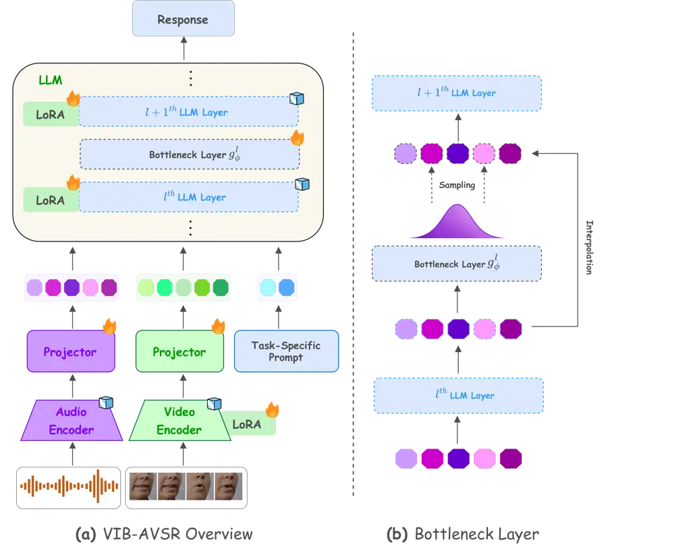

Arora Singh Cappellazzo Petridis Pantic

# VIB-AVSR: Variational Information Bottleneck for Noise-Robust LLM-Based Audio-Visual Speech Recognition

Piyush    Navlika    Umberto    Stavros    Maja

###### Abstract

Audio-Visual Speech Recognition takes two input modalities, acoustic and
visual streams, where visual information from lip movements aids
recognition when audio is noisy. Recently, LLM-based AVSR models have
emerged as a promising paradigm by connecting pre-trained audio-visual
encoders to an LLM, achieving strong results in clean conditions.
However, these models are predominantly optimized for clean acoustic
conditions, with limited attention to making the LLM backbone robust to
noise. No explicit mechanism is employed to produce stable
representations under corrupted audio, leading to performance
degradation in noisy environments. To address this, we propose VIB-AVSR,
which integrates Variational Information Bottleneck layers at targeted
positions within the LLM backbone to regularize representations.
VIB-AVSR reduces degradation under noisy conditions across multiple SNR
levels and noise types, without requiring architectural modifications or
additional training data. Our code is available at
[https://github.com/PiyushArora1010/VIB-AVSR](https://github.com/PiyushArora1010/VIB-AVSR).
^(†)^(†) \* denotes equal contribution.

###### keywords

Audio-Visual Speech Recognition, LLMs, Variational Information
Bottleneck, Noise Robustness

^(†)^(†)address: ^(♡) Imperial College London, UK  
^(♠) NatWest AI Research, UK ^(†)^(†)email: pa524@ic.ac.uk,
ns1324@ic.ac.uk

## 1 Introduction

Audio-Visual Speech Recognition (AVSR) improves transcription accuracy
by jointly processing acoustic and visual streams, where lip movements
provide a complement to the audio signal. The field has progressed
through a series of end-to-end deep learning approaches based on
Conformer and Transformer backbones \[1, 2, 3, 4\], self-supervised
pre-training methods such as AV-HuBERT \[5, 6\] and large-scale
automatic labeling pipelines such as Auto-AVSR \[7\], which have driven
consistent improvements on standard benchmarks. More recently,
approaches leveraging large-scale pre-trained ASR models, such as
Whisper-Flamingo \[8, 9, 10\], have demonstrated strong noise robustness
by injecting visual features into a pre-trained speech encoder and the
decoder. Building on these advances, LLM-based AVSR models \[11, 12, 13,
14, 15, 16, 17, 18, 19\] have emerged as a promising paradigm,
connecting pre-trained audio and video encoders to a Large Language
Model (LLM) via lightweight adapters, achieving state-of-the-art
performance.

Despite these advances, noise robustness remains an largely overlooked
challenge in the LLM-based AVSR paradigm. LLM-based AVSR models are
predominantly optimized for clean acoustic conditions, and prior work
has noted a non-trivial performance gap when these models are evaluated
under noisy conditions \[11, 13, 15\]. This stands in contrast to
traditional encoder-decoder AVSR models, which are trained end-to-end
from scratch and can therefore develop noise-robust representations
throughout the entire architecture \[5, 20, 21, 22\]. In LLM-based AVSR,
the backbone is a pre-trained language model whose parameters have been
optimized purely on text, it has never been exposed to noisy
audio-visual speech, and only a small number of its parameters are
updated during fine-tuning via LoRA \[23\]. As a result, no explicit
mechanism exists within the LLM backbone to produce stable
representations when the input audio is corrupted, and the burden of
noise robustness falls entirely on the encoders, leaving the LLM itself
ill-equipped to handle the domain shift induced by acoustic noise. We
argue that addressing this requires a principled approach to
regularizing the LLM’s internal representations directly, rather than
relying solely on data augmentation or encoder-only modifications.

Motivated by this, we propose VIB-AVSR, a novel framework that inserts
Variational Information Bottleneck (VIB) \[24\] layers at targeted
positions within the LLM backbone. The VIB objective encourages the
model to learn representations that are maximally informative about the
transcription target while discarding noise-induced variance, directly
addressing the vulnerability at its source. Crucially, VIB-AVSR requires
no major architectural changes, no additional training data, and
introduces only negligible computational overhead, making it a
lightweight and practical addition to existing LLM-based AVSR pipelines.
In summary, our contributions are as follows:

- •
  We propose VIB-AVSR, a lightweight method that integrates VIB layers
  into the LLM backbone of an AVSR model to improve noise robustness at
  the representation level, without requiring architectural redesign or
  additional training data.
- •
  We demonstrate that VIB-AVSR improves noise robustness under both
  noisy and clean training paradigms, showing that variational
  compression promotes generalisation to noisy conditions.
- •
  We conduct extensive ablation studies on VIB layer placement,
  regularisation strength $`\beta`$, and interpolation coefficient
  $`\alpha`$, providing empirical evidence that supports each design
  choice and identifying the most effective configuration.
- •
  VIB-AVSR achieves WER reductions over Llama-AVSR across multiple noise
  types and SNR levels, with gains that widen under extreme noise
  conditions, while preserving recognition performance on clean speech.



Figure 1: Architecture overview of VIB-AVSR. (a) Audio and video inputs
are encoded and projected into a shared representation that conditions
an LLM augmented with LoRA adapters and variational information
bottleneck (VIB) module. (b) The bottleneck layer compresses
intermediate representations, performs latent sampling, and interpolates
features before passing them to the next LLM layer.

## 2 Background

Llama-AVSR: Cappellazzo et al. \[11\] proposed Llama-AVSR, which is a
Multimodal Large Language Model (MLLM) for audio, visual, and
audio-visual speech recognition. It consists of three components:
modality-specific pre-trained encoders, lightweight linear projectors,
and a pre-trained LLM backbone. An audio encoder and a video encoder
independently process their respective input streams, producing feature
sequences that are downsampled and projected into the LLM’s embedding
space via modality-specific linear projectors. The resulting audio
tokens $`{H}_{a}`$, video tokens $`{H}_{v}`$, and text tokens
$`{H}_{t}`$ are concatenated and processed by the LLM, which generates a
transcription of the audio auto-regressively.

Let $`X=(X^{a},X^{v},X^{t})`$ denote the multimodal input and $`Y`$ the
target transcription, the model is trained with a standard
autoregressive objective:

```math
\arg\min_{\theta}\,\mathbb{E}_{X,Y}\left[\sum_{m=1}^{M}-\log f_{\theta}(Y_{m}\mid X^{a},X^{v},X^{t},Y_{<m})\right]
```

where $`\theta`$ denotes the trainable parameters, i.e. projection
layers and LoRA modules, $`M`$ is the transcription length,
$`Y_{<m}=\{Y_{1},\dots,Y_{m-1}\}`$ denotes generated transcript up to
token $`m-1`$, and $`f_{\theta}(\cdot)`$ is the model’s predicted
probability distribution. Although this formulation achieves strong
performance under clean acoustic conditions, the audio representations
are sensitive to acoustic noise, as the model does not explicitly
regularize against noise-induced variation in the audio hidden states.

Information Bottleneck (IB) principle: Tishby et al. \[25\] introduces a
framework for learning representations that retain task-relevant
information while discarding redundant variation. For an input variable
$`X`$, it’s learned representation $`Z`$ parameterized by $`\phi`$, and
a target $`Y`$, the IB objective is defined as:

```math
\max_{\phi}\ I(Z;Y)-\beta I(Z;X) \tag{1}
```

where $`I(\cdot\,;\cdot)`$ represents mutual information and
$`\beta\geq 0`$ controls the compression-prediction trade-off.
Maximising $`I(Z;Y)`$ preserves information predictive of the output,
while minimising $`I(Z;X)`$ discards redundancy in input, such as
acoustic noise. In the AVSR setting, noise corrupts the audio input
$`X^{a}`$, causing the audio hidden states $`{H}_{a}`$ to encode
noise-specific features that degrade transcription. We apply the IB
objective selectively to $`{H}_{a}`$ to compress noise-related variation
while retaining speech-discriminative content. The video and text hidden
states $`{H}_{v}`$ and $`{H}_{t}`$ are not bottlenecked, as they are not
directly corrupted by acoustic noise and should be preserved to provide
complementary lip-movement and linguistic context to the LLM.

## 3 VIB-AVSR

Now, a direct optimisation of the IB objective is intractable due to the
difficulty of estimating mutual information in high-dimensional spaces.
Following the variational formulation \[24, 26\], we derive a tractable
lower bound tailored to the audio hidden states in Llama-AVSR.

The audio encoder and the respective projector presents the initial
audio representations $`{H}^{0}_{a}`$, which are passed into the LLM.
The LLM backbone consists of $`L`$ transformer layers, and the audio
hidden states at the output of layer $`l`$ are denoted
$`{H}^{l}_{a}\in\mathbb{R}^{T\times d}`$, where $`T`$ is the number of
audio tokens and $`d`$ is the hidden dimension. Without loss of
generality, we derive the bottleneck formulation for a single layer
$`l`$, where the variational information bottleneck (VIB) module
$`g_{\phi}^{l}`$ takes $`{H}^{l}_{a}`$ as input and produces a
compressed representation $`Z^{l}_{a}`$.

For the compression term $`I(Z^{l}_{a};{H}^{l}_{a})`$, we introduce a
factorizable variational prior $`r(Z^{l}_{a})`$ and apply the
non-negativity of KL divergence to obtain:

```math
I(Z^{l}_{a};{H}^{l}_{a})\leq\mathbb{E}_{{H}_{a}^{l}}\big[D_{\mathrm{KL}}(p(Z^{l}_{a}\mid{H}^{l}_{a})\,||\,r(Z^{l}_{a}))\big] \tag{2}
```

For the predictive term $`I(Z^{l}_{a};Y)`$, we substitute the true
posterior $`p(Y|Z^{l}_{a})`$ with a variational approximation
$`q_{\phi}(Y|Z^{l}_{a},X^{v},X^{t})`$, parameterised by the LLM decoder.
Omitting the constant $`H(Y)`$ with respect to model parameters, this
gives the lower bound:

```math
I(Z^{l}_{a};\,Y)\geq\mathbb{E}_{X,Y}\left[\mathbb{E}_{Z^{l}_{a}\mid{H}^{l}_{a}}\left[\log q_{\phi}(Y\mid Z^{l}_{a},X^{v},X^{t})\right]\right] \tag{3}
```

Combining both bounds yields the variational IB objective at layer
$`l`$, which is maximised with respect to the model parameters:

```math
\displaystyle\mathcal{L}^{l}_{\mathrm{VIB}} \displaystyle=\mathbb{E}_{X,Y}\Big[\mathbb{E}_{Z^{l}_{a}\mid{H}^{l}_{a}}\Big[\log q_{\phi}(Y\mid Z^{l}_{a},X^{v},X^{t})\Big]\Big]
```

```math
\displaystyle\quad-\beta\,\mathbb{E}_{{H}^{l}_{a}}\Big[D_{\mathrm{KL}}(p(Z^{l}_{a}\mid{H}^{l}_{a})\,||\,r(Z^{l}_{a}))\Big] \tag{4}
```

The first term is the autoregressive transcription likelihood and the
second term regularises the audio hidden states by penalising deviation
from the prior. The hyperparameter $`\beta`$ controls the
compression-prediction trade-off.

|          |            |        |       |       |      |      |       |                       |        |       |       |      |      |       |                       |            |
| -------- | ---------- | ------ | ----- | ----- | ---- | ---- | ----- | --------------------- | ------ | ----- | ----- | ---- | ---- | ----- | --------------------- | ---------- |
| Training | Method     | Babble |       |       |      |      |       |                       | Speech |       |       |      |      |       |                       |            |
|          |            | -10    | -5    | -2    | 0    | 5    | Avg   | Avg ($`N`$$`>`$$`S`$) | -10    | -5    | -2    | 0    | 5    | Avg   | Avg ($`N`$$`>`$$`S`$) | $`\infty`$ |
| Noisy    | Llama-AVSR | 34.87  | 27.55 | 18.09 | 8.00 | 5.74 | 18.85 | 26.84                 | 27.66  | 14.94 | 9.14  | 5.21 | 3.84 | 12.16 | 17.24                 | 2.72       |
|          | VIB-AVSR   | 32.52  | 25.63 | 15.63 | 7.82 | 5.35 | 17.39 | 24.59                 | 27.52  | 13.23 | 8.90  | 5.08 | 3.98 | 11.74 | 16.55                 | 2.38       |
| Clean    | Llama-AVSR | 47.03  | 34.32 | 20.20 | 8.61 | 5.19 | 23.07 | 33.85                 | 42.13  | 18.44 | 10.78 | 5.30 | 4.32 | 16.20 | 23.78                 | 2.34       |
|          | VIB-AVSR   | 40.97  | 31.50 | 19.45 | 8.55 | 5.00 | 21.09 | 30.64                 | 37.44  | 17.37 | 10.69 | 5.36 | 4.39 | 15.05 | 21.83                 | 2.42       |

Table 1: WER (%) of Llama-AVSR and VIB-AVSR under babble and speech
noise at five SNR levels, evaluated under both noisy and clean training
paradigms. Avg ($`N`$$`>`$$`S`$) denotes the average WER over conditions
where noise dominates the signal ($`-10`$, $`-5`$, $`-2`$ dB).
$`\infty`$ denotes noise-free evaluation. Bold indicates the best result
per configuration.

Practical Implementation: Using a Monte Carlo approximation of the
expectations over data and negating Eq. (4) to form a minimisation
objective, the empirical estimate over a mini-batch of $`N`$ samples is
derived as:

```math
\displaystyle\mathcal{L}_{\beta} \displaystyle=\frac{1}{N}\sum_{i=1}^{N}\Bigg[\mathbb{E}_{Z^{l,i}_{a}\mid H^{l,i}_{a}}\left[-\log q_{\phi}\left(Y^{i}\mid Z^{l,i}_{a},X^{v,i},X^{t,i}\right)\right]
```

```math
\displaystyle\hskip 50.00008pt+\beta\,D_{\mathrm{KL}}\left(p\left(Z^{l,i}_{a}\mid H^{l,i}_{a}\right)\,||\,r\left(Z^{l}_{a}\right)\right)\Bigg] \tag{5}
```

where $`Z^{l}_{a}`$ denotes the bottlenecked audio representation at
layer $`l`$. The first term maximises the likelihood of the target
transcription under the compressed representation, while the KL term
regularises the posterior $`p(Z^{l}_{a}\mid H^{l}_{a})`$ towards the
prior $`r(Z^{l}_{a})`$. Both distributions are modelled as diagonal
Gaussians \[27\].

Prior distribution. The prior is a learnable diagonal Gaussian,

```math
r(Z^{l}_{a})=\mathcal{N}\left(Z^{l}_{a};\,{\mu}^{l}_{r},\,({\sigma}^{l}_{r})^{2}\cdot I\right) \tag{6}
```

where $`{\mu}^{l}_{r}\in\mathbb{R}^{d}`$ and
$`{\sigma}^{l}_{r}\in\mathbb{R}^{d}_{+}`$ are per-layer parameters
shared across all samples, admitting a closed-form KL divergence.

Posterior distribution. We parameterise the posterior using a
position-wise two-layer MLP
$`g_{\phi}:\mathbb{R}^{d}\rightarrow\mathbb{R}^{2d}`$, applied
independently to each audio token embedding, analogously to the
feed-forward sublayer of a Transformer \[28\]. Given $`{H}^{l}_{a}`$ at
layer $`l`$:
$`p(Z^{l}_{a}\mid{H}^{l}_{a}):=\mathcal{N}(Z^{l}_{a};\,{\mu}^{l},\,({\sigma}^{l})^{2}\cdot I)`$
where $`[{\mu}^{l},\,({\sigma}^{l})^{2}]=g_{\phi}({H}^{l}_{a})`$, with
mean and variance partitioned along the output dimension. The MLP is
applied exclusively to audio token positions, leaving visual and text
representations unchanged. Samples from the posterior are obtained via
the reparameterisation trick \[27\]:

```math
\tilde{Z}^{l}_{a}={\mu}^{l}+{\sigma}^{l}\odot{\epsilon},\quad{\epsilon}\sim\mathcal{N}(\mathbf{0},I) \tag{7}
```

During inference, we follow the standard practice \[27\] and instead of
reparameterization trick, only $`{\mu}^{l}`$ is used. To balance
compression with the retention of speech-discriminative content, the
bottleneck output is interpolated with the pre-bottleneck
representation \[26\]:
$`\hat{Z}^{l}_{a}=\alpha{H}^{l}_{a}+(1-\alpha)\tilde{Z}^{l}_{a}`$ where,
$`\alpha`$ is set to 0.5 for our experiments. This interpolated
representation $`\hat{Z}^{l}_{a}`$ replaces $`{H}^{l}_{a}`$ and is
propagated to the subsequent LLM layers. In practice, we experiment with
inserting bottleneck modules after multiple layers \[26\] in the LLM,
with each layer maintaining its own independent prior. Early experiments
with $`\alpha=0`$ and with scheduling $`\alpha`$ from $`0`$ to $`0.5`$
following \[26\] both resulted in higher WERs, which we speculate is due
to the sampled representation being too lossy for the LLM to generate.

## 4 Experiments and Discussion

### 4.1 Implementation Details

Dataset. We train and evaluate on the LRS2 \[29\] dataset, consisting of
BBC program clips with transcribed English speech.

Model Architecture. Following Llama-AVSR \[11\], we adopt a multimodal
LLM framework consisting of three components: a pre-trained audio
encoder, a pre-trained video encoder, and an LLM backbone. We use
Whisper-medium \[30\] as the audio encoder and AV-HuBERT \[6\] as the
video encoder. Modality-specific linear projectors are trained to map
audio and video features to the LLM embedding space. Llama-3.2-1B \[31\]
is incorporated as the LLM backbone. The compression rates for audio and
video tokens is set to 3 each. The same configuration is used to train
Llama-AVSR for fair comparison.

Training Details. The LLM and video encoder are fine-tuned using
LoRA \[23\], with rank 64 for the LLM and rank 16 for the video encoder.
The audio encoder is kept frozen throughout the training. VIB modules
are inserted after selected LLM layers and trained jointly with the LoRA
modules. The insertion points and the value of $`\beta`$ are chosen
based on ablation studies over layer placement, bottleneck count, and
regularization strength (Section 4.3), which identify layers 4 and 8
with $`\beta=\frac{0.1}{H}`$ as the most effective configuration, where
$`H`$ denotes the LLM’s hidden dimension size. Each VIB module
$`g_{\phi}^{l}`$ is implemented as a two-layer MLP: a linear layer
followed by GeLU activation and a second linear layer with $`2H`$ output
neurons, from which the mean and log-variance of the variational
posterior are obtained.

Training Paradigms. For the experiments, we mainly evaluate two training
paradigms. In the Clean Paradigm, no noise is added to the audio during
training. In the Noisy Paradigm, a random noise is added to the training
audio, with the SNR level sampled uniformly at random per instance.
Evaluating VIB-AVSR under both paradigms allows us to assess whether the
variational bottleneck improves robustness when noise is seen during
training, and whether its regularisation effect generalises to noisy
conditions even when trained on clean conditions.

### 4.2 Main Results

Table 1 reports WER for Llama-AVSR and VIB-AVSR across babble and speech
noise, sampled from the MUSAN \[32\] dataset at five SNR levels, under
both noisy and clean training paradigms. We additionally report extreme
noise average Avg ($`N`$$`>`$$`S`$), the average WER over SNR levels
where noise substantially dominates the signal ($`-10`$, $`-5`$, $`-2`$
dB), as a measure of robustness under extreme acoustic degradation.

Noisy Training. Under noisy training, VIB-AVSR almost always reduces WER
relative to Llama-AVSR, with the largest gains observed at lower SNRs,
particularly under babble noise. This trend is further reflected in the
Avg ($`N`$$`>`$$`S`$) metric. These results suggest that the compression
objective becomes increasingly beneficial as acoustic interference
dominates the speech signal. While improvements under speech noise are
smaller than those observed for babble noise, VIB-AVSR still reduces WER
across all SNR conditions except 5 dB. Notably, VIB-AVSR also achieves
lower WER than Llama-AVSR under noise-free evaluation ($`\infty`$). This
indicates that the bottleneck acts as an effective regularizer,
encouraging representations that retain task-relevant information while
suppressing nuisance variability beyond the noisy conditions.

Clean Training. When trained without noise augmentation, VIB-AVSR still
yields substantial WER reductions. Under babble noise, improvements are
across all SNR levels, while under speech noise VIB-AVSR provides
consistent gains in the low-SNR regime. Notably, the bottleneck is never
exposed to noisy samples during training, yet the learned
representations generalise more effectively to unseen noisy conditions.
This suggests that variational compression promotes robustness through a
mechanism distinct from data augmentation. The effect is especially
evident in the Avg ($`N`$$`>`$$`S`$) metric. As expected, models trained
on clean data degrade more sharply under extreme noise than their
noisy-trained counterparts, reflecting the impact of train-test domain
mismatch. However, VIB-AVSR consistently narrows this gap relative to
Llama-AVSR, particularly in the lowest-SNR conditions where the baseline
is most vulnerable, indicating that the bottleneck partially compensates
for the absence of noise augmentation. Finally, performance on clean
speech ($`\infty`$) remains comparable, demonstrating that the
robustness gains do not come at the cost of clean-conditions.

### 4.3 Ablation Studies

|          |          |        |        |       |       |            |       |
| -------- | -------- | ------ | ------ | ----- | ----- | ---------- | ----- |
|          | SNR (dB) |        |        |       |       |            |       |
| Layer(s) | $`-10`$  | $`-5`$ | $`-2`$ | $`0`$ | $`5`$ | $`\infty`$ | Avg   |
| Single   |          |        |        |       |       |            |       |
| -1       | 33.25    | 25.27  | 16.29  | 7.33  | 5.59  | 2.37       | 15.03 |
| 2        | 34.76    | 25.59  | 16.95  | 7.12  | 5.20  | 2.43       | 15.32 |
| 4        | 34.73    | 25.50  | 16.95  | 8.17  | 5.18  | 2.61       | 15.52 |
| 6        | 34.59    | 26.32  | 16.85  | 7.48  | 5.36  | 2.76       | 15.56 |
| 8        | 34.53    | 26.44  | 17.67  | 7.55  | 5.09  | 2.46       | 15.63 |
| 12       | 34.29    | 25.92  | 17.66  | 8.59  | 5.39  | 2.31       | 15.69 |
| Dual     |          |        |        |       |       |            |       |
| 2,6      | 35.11    | 25.93  | 17.76  | 7.48  | 5.62  | 2.70       | 15.77 |
| 4,8      | 33.14    | 24.61  | 16.24  | 7.42  | 5.38  | 2.38       | 14.86 |
| 8,12     | 33.45    | 25.71  | 16.26  | 7.73  | 5.26  | 2.54       | 15.16 |
| Triple   |          |        |        |       |       |            |       |
| -1,4,8   | 34.56    | 25.66  | 16.38  | 8.03  | 6.68  | 2.81       | 15.68 |
| 4,8,12   | 33.27    | 26.61  | 17.55  | 7.85  | 6.31  | 2.90       | 15.75 |

Table 2: WER (%) under babble for VIB insertions. The best results are
in bold and the second-best are underlined.

Effect of VIB Layer Placement: The placement of VIB modules within the
LLM determines at which depth noise-corrupted representations are
compressed. Inserting bottlenecks too early may interfere with low-level
features, while inserting them too late leaves noise unmitigated. We
evaluate single, dual, and triple bottleneck configurations at various
layer positions, where each index refers to the transformer layer after
which the VIB is applied. For these experiments, we reports results in
noisy training paradigm and set $`\beta=\frac{0.1}{H}`$. Layer index
$`-1`$ denotes placement immediately after the audio encoder, where the
projection layer serves as the VIB module with $`\beta=10^{-7}`$
following \[33\]. Moreover, due to shape mismatch between the output of
the audio encoder and LLM hidden dimension size, we don’t do the
interpolation in this case. Results under babble noise are reported in
Table 2.

Single-layer configurations perform comparably across positions, with no
placement offering a consistent advantage over the others. This suggests
that a single bottleneck lacks sufficient capacity to suppress noise
reliably, regardless of where it is placed. Notably, the $`-1`$
configuration, which places the bottleneck at the audio encoder output,
achieves the best average WER among all single-layer configurations at
$`15.03\%`$, suggesting that early compression at the encoder-LLM
interface is more effective than any single LLM-layer insertion.
However, it still falls short of the best dual configuration. Among dual
configurations, layers (4, 8) yields the best overall performance,
achieving the lowest average WER and the strongest gains under extreme
noise, while remaining competitive at higher SNR levels. The (8, 12)
configuration is a close second, but the advantage of (4, 8) at low SNR
suggests that compressing representations at an earlier intermediate
layer is beneficial when noise is most severe. Adding a third bottleneck
degrades performance across all conditions, including clean speech. This
indicates that stacking too many compression stages leads to
over-regularisation.

Effect of $`\beta`$: The $`\beta`$ hyperparameter controls the strength
of the KL regularisation term, trading off compression of noisy
representations against retention of task-relevant content. Too small
values reduces the regularisation effect, while too large values risk
discarding task-relevant features. We ablate over four values normalised
by the LLM hidden dimension $`H`$: $`\{0.05,0.1,0.2,1\}`$, using the (4, 8) dual configuration identified above. Results are reported in Table 3.
At $`\beta=1`$, performance degrades sharply across all SNR levels with
average WER rising to $`17.68\%`$, confirming that excessive compression
is harmful. Among the remaining values, $`\beta=0.1`$ achieves the best
average WER of $`14.86\%`$ and is the most consistent across SNR levels,
and is therefore used in all other experiments.

|           |          |        |        |       |       |            |       |
| --------- | -------- | ------ | ------ | ----- | ----- | ---------- | ----- |
|           | SNR (dB) |        |        |       |       |            |       |
| $`\beta`$ | $`-10`$  | $`-5`$ | $`-2`$ | $`0`$ | $`5`$ | $`\infty`$ | Avg   |
| $`0.05`$  | 33.84    | 25.42  | 16.52  | 7.63  | 5.48  | 2.84       | 15.29 |
| $`0.1`$   | 33.14    | 24.61  | 16.24  | 7.42  | 5.38  | 2.38       | 14.86 |
| $`0.2`$   | 34.40    | 24.80  | 16.66  | 7.63  | 5.53  | 2.49       | 15.25 |
| $`1`$     | 35.86    | 27.73  | 19.49  | 10.72 | 8.03  | 4.25       | 17.68 |

Table 3: WER (%) under babble for $`\beta`$ values, which are normalized
by $`H`$, hidden dimension of LLM backbone. The best results are in bold
and the second-best are underlined.

|                      |          |        |        |       |       |            |       |
| -------------------- | -------- | ------ | ------ | ----- | ----- | ---------- | ----- |
|                      | SNR (dB) |        |        |       |       |            |       |
| $`\alpha`$           | $`-10`$  | $`-5`$ | $`-2`$ | $`0`$ | $`5`$ | $`\infty`$ | Avg   |
| $`0`$                | 37.62    | 31.13  | 22.41  | 13.23 | 8.32  | 4.58       | 19.54 |
| $`0\rightarrow 0.5`$ | 33.54    | 26.75  | 18.45  | 9.05  | 6.56  | 3.43       | 16.29 |
| $`0.5`$              | 33.14    | 24.61  | 16.24  | 7.42  | 5.38  | 2.38       | 14.86 |

Table 4: WER (%) under babble for interpolation $`\alpha`$ values. The
best results are in bold and the second- best are underlined.

Role of Interpolation Coefficient $`\alpha`$. We compare three
configurations using the (4, 8) dual setup with $`\beta=\frac{0.1}{H}`$:
setting $`\alpha=0`$, cosine scheduling $`\alpha`$ from $`0`$ to $`0.5`$
following \[26\], and fixing $`\alpha=0.5`$ throughout training. Setting
$`\alpha=0`$ replaces the hidden state entirely with the sampled
representation and leads to the worst performance across conditions,
consistent with over-regularisation. The scheduled variant improves over
$`\alpha=0`$ but still shows higher WER across SNR levels relative to
the fixed setting, which we attribute to the period of near-complete
compression early in training that the LLM must recover from.

## 5 Conclusion

We introduce VIB-AVSR, a method for improving noise robustness in
audio-visual speech recognition by inserting Variational Information
Bottleneck modules into intermediate layers of the LLM backbone. The VIB
bottleneck applies compression to audio representations during training,
encouraging the model to retain acoustically relevant content while
discarding noise-correlated features. Experiments under babble and
speech noise show consistent WER reductions over the Llama-AVSR baseline
across SNR levels and training paradigms. Notably, the gains hold even
when no noise augmentation is used during training, suggesting that the
compression term promotes representations that generalise better to
noisy conditions.

## 6 Generative AI Use Disclosure

Generative AI tools were used solely for language editing and manuscript
polishing. All research ideas, methodology, experiments, and conclusions
were developed and are the responsibility of the authors.

## 7 Acknowledgements

All data processing and experiments were conducted at Imperial College
London.

## References

- \[1\] S. Petridis, T. Stafylakis, P. Ma, G. Tzimiropoulos, and M.
  Pantic (2018) Audio-visual speech recognition with a hybrid
  ctc/attention architecture. In 2018 IEEE Spoken Language Technology
  Workshop (SLT), pp. 513–520. Cited by: §1.
- \[2\] P. Ma, S. Petridis, and M. Pantic (2021) End-to-end audio-visual
  speech recognition with conformers. In ICASSP 2021-2021 IEEE
  International Conference on Acoustics, Speech and Signal Processing
  (ICASSP), pp. 7613–7617. Cited by: §1.
- \[3\] D. Serdyuk, O. Braga, and O. Siohan (2022) Transformer-based
  video front-ends for audio-visual speech recognition for single and
  multi-person video. In Interspeech, Cited by: §1.
- \[4\] M. Burchi and R. Timofte (2023) Audio-visual efficient conformer
  for robust speech recognition. In Proceedings of the IEEE/CVF winter
  conference on applications of computer vision, pp. 2258–2267. Cited
  by: §1.
- \[5\] B. Shi, W. Hsu, and A. Mohamed (2022) Robust self-supervised
  audio-visual speech recognition. In Proc. Interspeech 2022,
  pp. 2118–2122. Cited by: §1, §1.
- \[6\] B. Shi, W. Hsu, K. Lakhotia, and A. Mohamed Learning
  audio-visual speech representation by masked multimodal cluster
  prediction. In International Conference on Learning Representations,
  Cited by: §1, §4.1.
- \[7\] P. Ma, A. Haliassos, A. Fernandez-Lopez, H. Chen, S. Petridis,
  and M. Pantic (2023) Auto-avsr: audio-visual speech recognition with
  automatic labels. In ICASSP 2023-2023 IEEE International Conference on
  Acoustics, Speech and Signal Processing (ICASSP), pp. 1–5. Cited by:
  §1.
- \[8\] A. Rouditchenko, Y. Gong, S. Thomas, L. Karlinsky, H. Kuehne, R.
  Feris, and J. Glass (2024) Whisper-flamingo: integrating visual
  features into whisper for audio-visual speech recognition and
  translation. In Interspeech, Cited by: §1.
- \[9\] Z. Li, T. Graave, B. Möller, Z. Wu, M. Franz, and T.
  Fingscheidt (2026) Noise-robust av-asr using visual features both in
  the whisper encoder and decoder. arXiv preprint arXiv:2601.18396.
  Cited by: §1.
- \[10\] A. Rouditchenko, S. Thomas, H. Kuehne, R. Feris, and J.
  Glass (2025) MWhisper-flamingo for multilingual audio-visual
  noise-robust speech recognition. IEEE Signal Processing Letters. Cited
  by: §1.
- \[11\] U. Cappellazzo, M. Kim, H. Chen, P. Ma, S. Petridis, D.
  Falavigna, A. Brutti, and M. Pantic (2025) Large language models are
  strong audio-visual speech recognition learners. In ICASSP 2025-2025
  IEEE International Conference on Acoustics, Speech and Signal
  Processing (ICASSP), pp. 1–5. Cited by: §1, §1, §2, §4.1.
- \[12\] J. Yeo, S. Han, M. Kim, and Y. M. Ro (2024) Where visual speech
  meets language: vsp-llm framework for efficient and context-aware
  visual speech processing. In Findings of the Association for
  Computational Linguistics: EMNLP 2024, pp. 11391–11406. Cited by: §1.
- \[13\] U. Cappellazzo, M. Kim, S. Petridis, D. Falavigna, and A.
  Brutti (2025) Scaling and enhancing llm-based avsr: a sparse mixture
  of projectors approach. In Proc. Interspeech 2025, pp. 1823–1827.
  Cited by: §1, §1.
- \[14\] U. Cappellazzo, M. Kim, P. Ma, H. Chen, X. Liu, S. Petridis,
  and M. Pantic (2025) MoME: mixture of matryoshka experts for
  audio-visual speech recognition. arXiv preprint arXiv:2510.04136.
  Cited by: §1.
- \[15\] J. H. Yeo, H. Rha, S. J. Park, and Y. M. Ro (2025) Mms-llama:
  efficient llm-based audio-visual speech recognition with minimal
  multimodal speech tokens. In Findings of the Association for
  Computational Linguistics: ACL 2025, pp. 20724–20735. Cited by: §1,
  §1.
- \[16\] U. Cappellazzo, X. Liu, P. Ma, S. Petridis, and M.
  Pantic (2025) Omni-avsr: towards unified multimodal speech recognition
  with large language models. arXiv preprint arXiv:2511.07253. Cited by:
  §1.
- \[17\] U. Cappellazzo, M. Kim, and S. Petridis (2025) Adaptive
  audio-visual speech recognition via matryoshka-based multimodal llms.
  In 2025 IEEE Automatic Speech Recognition and Understanding Workshop
  (ASRU), pp. 1–8. Cited by: §1.
- \[18\] A. Anand, U. Cappellazzo, S. Petridis, and M. Pantic (2026)
  Mitigating attention sinks and massive activations in audio-visual
  speech recognition with llms. In ICASSP 2026-2026 IEEE International
  Conference on Acoustics, Speech and Signal Processing (ICASSP),
  pp. 17942–17946. Cited by: §1.
- \[19\] U. Cappellazzo, S. Petridis, and M. Pantic (2026) Dr. shap-av:
  decoding relative modality contributions via shapley attribution in
  audio-visual speech recognition. arXiv preprint arXiv:2603.12046.
  Cited by: §1.
- \[20\] J. Hong, M. Kim, J. Choi, and Y. M. Ro (2023) Watch or listen:
  robust audio-visual speech recognition with visual corruption modeling
  and reliability scoring. In Proceedings of the IEEE/CVF Conference on
  Computer Vision and Pattern Recognition, pp. 18783–18794. Cited by:
  §1.
- \[21\] S. Kim, K. Jang, S. Bae, S. Cho, and S. Yun (2025) MoHAVE:
  mixture of hierarchical audio-visual experts for robust speech
  recognition. arXiv preprint arXiv:2502.10447. Cited by: §1.
- \[22\] S. Kim, S. Cho, S. Bae, K. Jang, and S. Yun (2025) Multi-task
  corrupted prediction for learning robust audio-visual speech
  representation. In ICLR, Cited by: §1.
- \[23\] E. J. Hu, Y. Shen, P. Wallis, Z. Allen-Zhu, Y. Li, S. Wang, L.
  Wang, W. Chen, et al. (2022) Lora: low-rank adaptation of large
  language models.. Iclr 1 (2), pp. 3. Cited by: §1, §4.1.
- \[24\] A. A. Alemi, I. Fischer, J. V. Dillon, and K. Murphy (2017)
  Deep variational information bottleneck. In International Conference
  on Learning Representations, Cited by: §1, §3.
- \[25\] N. Tishby, F. C. Pereira, and W. Bialek (2000) The information
  bottleneck method. arXiv preprint physics/0004057. Cited by: §2.
- \[26\] C. Oh, J. Li, S. Im, and S. Li (2025) Visual instruction
  bottleneck tuning. In The Thirty-ninth Annual Conference on Neural
  Information Processing Systems, Cited by: §3, §3, §4.3.
- \[27\] D. P. Kingma and M. Welling (2014) Auto-encoding variational
  bayes. In International Conference on Learning Representations (ICLR),
  Cited by: §3, §3, §3.
- \[28\] A. Vaswani, N. Shazeer, N. Parmar, J. Uszkoreit, L.
  Jones, A. N. Gomez, Ł. Kaiser, and I. Polosukhin (2017) Attention is
  all you need. Advances in neural information processing systems 30.
  Cited by: §3.
- \[29\] J. Son Chung, A. Senior, O. Vinyals, and A. Zisserman (2017)
  Lip reading sentences in the wild. In Proceedings of the IEEE
  conference on computer vision and pattern recognition, pp. 6447–6456.
  Cited by: §4.1.
- \[30\] A. Radford, J. W. Kim, T. Xu, G. Brockman, C. McLeavey, and I.
  Sutskever (2023) Robust speech recognition via large-scale weak
  supervision. In International conference on machine learning,
  pp. 28492–28518. Cited by: §4.1.
- \[31\] A. Grattafiori, A. Dubey, A. Jauhri, A. Pandey, A. Kadian, A.
  Al-Dahle, A. Letman, A. Mathur, A. Schelten, A. Vaughan, et al. (2024)
  The llama 3 herd of models. In Neural Information Processing Systems,
  Cited by: §4.1.
- \[32\] D. Snyder, G. Chen, and D. Povey (2015) Musan: a music, speech,
  and noise corpus. arXiv preprint arXiv:1510.08484. Cited by: §4.2.
- \[33\] J. Bai, H. Guo, Z. Peng, J. Yang, Z. Li, M. Li, and Z.
  Tian (2025) Mitigating hallucinations in large vision-language models
  by adaptively constraining information flow. In Proceedings of the
  AAAI Conference on Artificial Intelligence, Vol. 39, pp. 23442–23450.
  Cited by: §4.3.
