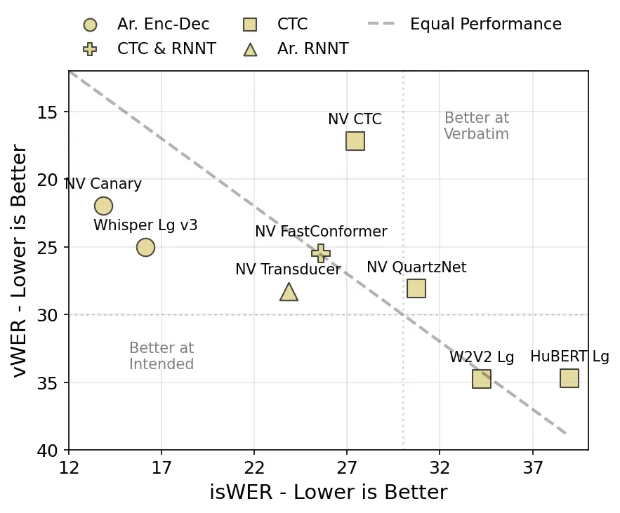
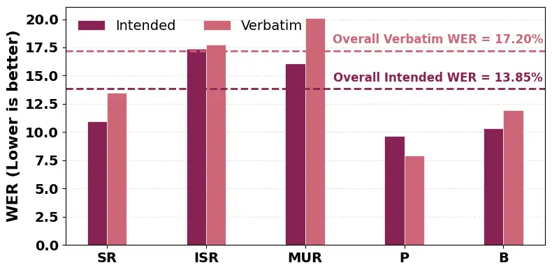

Toyin Umesh Aldarmaki

# What Counts as an Error? Dual-Reference Benchmarking for Atypical ASR

Hawau Olamide    Srinivasan    Hanan

###### Abstract

ASR systems have been often reported to underperform on atypical speech.
An often conflated compounding factor is the existence of two valid
transcription references: verbatim (actual produced speech, including
repetitions/prolongations) and intended (the canonical form of the text
with disfluencies removed) in atypical speech recognition depending on
context and use-case. Most ASR evaluations conflate this duality into a
single ground truth and reward systems that delete disfluencies,
ignoring verbatim faithfulness. We benchmark 11 ASR models from
encoder-decoder, CTC and transducer families using both verbatim and
intended references on atypical stuttered speech as a case study. Our
quantitative assessment underlines the disparity in model performance
and rankings using the two transcript styles. Through this analysis, we
highlight the importance of selecting a suitable transcription reference
for valid model selection depending on the use-case, particularly for
atypical ASR.

###### keywords

HCI, ASR, Atypical Speech, Stuttered Speech

^(†)^(†)address: ¹MBZUAI, UAE; ²SPRING Lab, IIT Madras,
India^(†)^(†)email: {hawau.toyin,hanan.aldarmaki}@mbzuai.ac.ae

## 1 Introduction

Atypical speech of persons who stutter (PWS) includes disfluencies (e.g.
repetitions, prolongations, interjections) with variable frequencies
depending on the stuttering severity level. Prior works document that
current ASR and voice assistant systems often fail for such atypical
speech, with failure rates increasing as severity increases \[1, 2, 3\].
For instance, they often produce transcripts that distorts what was
actually said \[4\], fail at voice assistant commands \[1\], and create
systemic bias against disfluent speech \[5\].

While a lot of research has been published on disfluent speech detection
and classification, a less-explored problem for stuttered speech
research is evaluation reference; what should the output of ASR systems
look like for stuttered speech? The _answer_, we argue, cannot be
decoupled from the target application. For a 2-second speech recording
that includes multiple stuttering events, ASR model X produces the
transcription _‘and I got it’_, while ASR model Y produces the
transcription _‘and i got i i got it’_. Which of these should be
considered more accurate depends on the downstream task and its intended
usage.

ASR evaluation typically involves the calculation of Word Error Rate
(WER), which presumes the existence of a reference transcription. In
atypical speech research, the most common practice is to use the
intended transcript as reference \[5\], and verbatim transcripts are
often formatted post-hoc to remove disfluency events \[6\] for use as
reference, which in this example would rank ASR model X as better than
ASR model Y. We argue this ranking is overly _reductive_ stripping away
complexities associated with use-case and context common to atypical
speech. For example, for a dictation model, a PWS dictating an article
would prefer X over Y, while for speech therapy and diagnostic purposes,
a therapist would prefer Y to X for identifying characters/words that
induce stuttering events. We solidify this distinction between ground
truth references for atypical ASR and define the two forms below:

- •
  Intended transcription captures the intended message with disfluencies
  removed _(e.g., ‘I want to go’)_. Typical use cases for this includes
  dictation, command/control. Voice-assistant tools rely on intended
  transcription for accurate command execution \[3\].
- •
  Verbatim transcription captures what was said, including disfluencies
  _(e.g., ‘I I I want to uhmm go’)_. Typical use cases for this includes
  clinical assessment, research on stuttering patterns, and contexts
  where preserving one’s produced speech matters. Clinician workflows
  often rely on verbatim transcripts with disfluency codes, but this is
  time-consuming and tools are limited \[7\].

Our review of recent¹¹ 1 2020 - 2025 ASR works published in main speech
conferences²² 2 Interspeech, ICASSP, ASRU, IEEE SLT show an implicit
dominance of intended ASR; only one work \[4\] differentiates and
evaluates both intended and verbatim speech. Some approaches explicitly
apply post-hoc “disfluency refinements” \[6\] (e.g., removing filler
words), which may improve “intended-like” metrics while harming verbatim
fidelity without explicitly clarifying the intended use-case of the
model. Mainstream atypical ASR research typically reports a single WER
against a single reference, often without specifying the reference type,
implicitly treating an arbitrary transcript style as universally
correct.

Why Does it Matter? Atypical ASR supports a wider set of stakeholders
than just PWS, including speech-language pathologists (SLPs) and
parents/guardians who may need accurate analyses of what was said for
tasks such as severity assessment or identifying problematic words.
Current mainstream practices raises a fairness and accessibility issue:
systems reported as “best” for atypical speech can be misleading if they
silently normalize or remove stuttering attributes without explicitly
stating that they are optimized for semantic transcription (intended)
rather than verbatim reporting. Because the same utterance can have
multiple valid textual references (intended and verbatim), choosing one
without disclosure effectively hard-codes a normative decision about how
a person’s speech should be represented.

In this work: (i) We evaluate 11 ASR models on FluencyBank
Timestamped \[8\] using both transcript forms as references, quantifying
how different architecture families behave under each ‘_ground truth_’
and showing why single-reference evaluation is insufficient. (ii) We
additionally align the audio segments in FluencyBank Timestamped with
the recently proposed clinical stutter events annotations (CASA) \[9\]
for FluencyBank to examine the impact of stuttering events on the
models’ performance in both cases. (iii) We finally make recommendations
on architectures to use for specific use-case, discuss the potential
harms of overlooking this dual reference problem and highlight best
practices for building inclusive speech technology for all voices and
speech types.

## 2 Related Work

Performance and Biases of ASR for Atypical Speech. Mujtaba et al. \[5\]
evaluated six ASR systems on real and synthetic stuttered speech using
intended transcripts as the sole reference, quantifying ASR bias by
comparing performance on fluent versus stuttered speech with both WER
and BERTScore. Notably, some works explicitly optimize for intended
transcription by treating ASR as a semantic problem \[2, 3\] for voice
commands, whereas many studies implicitly adopt intended transcripts as
the reference without stating the assumption. Sridhar and Wu \[4\]
benchmarked Whisper’s performance on stuttered speech and were the first
to evaluate ASR model’s output against both intended and verbatim
references. However the study is limited to the Whisper family (v2/v3).
Our work standardizes and extends this line of inquiry by formalizing
verbatim vs. intended transcripts as two valid references for atypical
speech. We benchmark which modelling paradigm best supports each use
case across a broader set of models and discuss how mainstream
evaluation metrics perform in intended speech recognition settings.

ASR for Disfluent Speech Identification. Several works have proposed
identifying disfluent events in speech through transcription; producing
pseudo-verbatim transcripts with special disfluency tokens \[10, 11,
12\] (e.g. I$`\backslash`$r won or I $`\prec`$rep$`\succ`$ won for I I I
won). In \[13\], the authors proposed labeling transcripts with special
stutter event tokens, disfluent data augmentation and model fine-tuning
to improve WER. This approach treats ASR as disfluent event
transcription where disfluent events are marked with special tokens in
produced transcription (e.g. I $`\prec`$rep$`\succ`$ won vs. I I I won,
$`\prec`$rep$`\succ`$ indicates repetition event in this example).
Jiachen et al \[11\] introduced imperfect WER to measure intended ASR
performance for aphasia speech which is needed in their pipeline for
disfluent event detection.

## 3 Methodology

Benchmarked Models. Our benchmark covers various ASR modeling paradigms.
We compare these paradigms under the hypothesis that architectural and
decoding design choices can systematically favor one transcription
reference over the other: verbatim versus intended, independent of
dataset-specific factors. Although not all benchmarked models (shown in
Table 1) have similar data settings, the NVIDIA-family of models are
mostly trained on their pre-defined NeMo ASRSET³³ 3
[https://huggingface.co/nvidia/stt_en_conformer_ctc_large#datasets](https://huggingface.co/nvidia/stt_en_conformer_ctc_large#datasets),
this allows us to directly compare models trained with different
training configurations on the same data. (i) Autoregressive ASR models:
These models typically transcribe a sequence of texts using all audio
information (global context) and previously predicted text tokens. This
approach is similar to language modelling in that current predictions
are conditioned on previously produced text. We hypothesize models that
are trained in this way are more likely to be better at intended speech
recognition since the decoder can use preceding text context to predict
regions of uncertain acoustics (e.g prolongations, repetitions).
Transducer models are streaming models \[14\] that predict the next text
token using only past acoustic frames up to the current time step
together with the predicted text token history. (ii) CTC ASR models:
Models trained with the CTC loss \[15\] only use the encoder’s
frame-level representations of acoustic information at current time step
to generate probability distribution over output text token units. They
typically assumes that each output unit is conditionally independent of
others. As a result, they rely less on token history and more directly
on the local acoustic evidence. We hypothesize these models will be
better for verbatim transcription since the models seem to map current
acoustics to text token.

|                           |                         |        |
| ------------------------- | ----------------------- | ------ |
| Configuration             | Model                   | Ref.   |
| Autoregressive            |                         |        |
| Seq2Seq                   | Whisper Large-v3        | \[16\] |
| Seq2Seq                   | SpeechBrain Transformer | \[17\] |
| Seq2Seq                   | NVIDIA Canary-1B-v2     | \[18\] |
| Conformer-Transducer      | NVIDIA Transducer       | \[14\] |
| Non-Autoregressive        |                         |        |
| Conformer CTC             | NVIDIA CTC              | \[17\] |
| Encoder CTC               | HuBERT Large            | \[19\] |
| Encoder CTC               | Wav2Vec2 Large          | \[20\] |
| Conformer CTC             | NVIDIA Fast Conformer   | \[21\] |
| Conformer CTC             | SpeechBrain Streaming   | \[17\] |
| Convolutional Encoder CTC | NVIDIA QuartzNet        | \[22\] |
| CTC + Attention           | SpeechBrain CRDNN       | \[17\] |

Table 1: Models benchmarked in this paper.

Datasets: FluencyBank Timestamped \[8\] and CASA \[9\] are the two main
sources utilized for their transcriptions and stutter event labels
respectively. FluencyBank Timestamped contains verbatim and intended
transcriptions for the interview section of FluencyBank \[23\]. CASA
introduces clinical segmentation of primary and secondary stuttering
events to the FluencyBank corpus. We align (i.e match overlapping audio
event to transcript segments) the audio segments from FluencyBank
Timestamped to _any_ event labels in CASA to further examine the effect
of stuttering events on intended and verbatim transcription models. The
dataset is in English and we used the full set (containing $`3430`$
samples) in FluencyBank Timestamped for this work. The primary
stuttering events correlating to transcription from CASA are: (1) SR:
Syllable Repetition, repeated movement of an entire syllable; (2) ISR:
Incomplete Syllable Repetition, repetition of parts of syllables; (3)
MUR: Multisyllable Unit Repetition, repetitions involving multiple
syllables; (4) P: sound Prolongation; and (5) B: Blocks \[9\].

Inference. _Model configuration._ We chose open-source models and
utilized the publicly available default configuration for inference for
each model to ensure reproducibility and avoid bias. We evaluate all
models _as-is_ without any fine-tuning or parameter-tuning. We use the
inference configuration, decoding settings and setup described on the
Hugging face⁴⁴ 4
[https://huggingface.co/models](https://huggingface.co/models) model
page for all models. Code available here.⁵⁵ 5
[https://github.com/Theehawau/usecase_asr](https://github.com/Theehawau/usecase_asr)

Evaluation metrics: We primarily evaluated the models using word error
rate (WER) obtaining intended speech WER (isWER) and verbatim WER (vWER)
when comparing against intended and verbatim reference respectively. We
also report SeMaScore \[24\], a recently introduced metric reported to
outperform BERTScore on correlation to human assessment and highlighted
to have strong capabilities on atypical speech for the intended speech
recognition task. We report model rank _x-rank_ based on WER to compare
models behaviour on the two references. To standardize evaluation, we
adjust casing and punctuation using the BasicTextNormalizer⁶⁶ 6
[https://huggingface.co/docs/transformers/en/model_doc/whisper#transformers.WhisperTokenizer.basic_normalize](https://huggingface.co/docs/transformers/en/model_doc/whisper#transformers.WhisperTokenizer.basic_normalize)
function from Whisper on predicted texts and references before
evaluation. This function removes punctuations and standardizes casing
_without_ altering repeated tokens or removing fillers.

## 4 Results

### 4.1 ASR Model Ranking

As we hypothesized, when we compare ASR models predictions against the
two references we see inconsistent performance rankings. NVIDIA CTC
model Ranks first for providing verbatim transcriptions but ranks 5th
for intended transcription. Interestingly, whisper\[16\], which is often
benchmarked for atypical speech recognition \[4, 3\], ranks second for
intended speech and third for verbatim (see Table 2).

Figure 1 shows the specialization of some of the high performing models
we tested. We can clearly see a pattern in model training configuration
and model speciality. The autoregressive sequence-to-sequence style
models are found to be better at intended speech recognition while
models trained with CTC loss perform better for verbatim speech
recognition. While the models in Figure 1 are not entirely comparable in
terms of training data and number of parameters, the NVIDIA-family
models are trained on the same Nemo ASRSET: the training data is the
same for these model variants and their performance follow the same
general pattern, providing evidence that the training paradigm alone can
bias the type of transcription the model produces, regardless of the
type of transcription used for training.

|                    |                        |                          |        |                       |       |
| ------------------ | ---------------------- | ------------------------ | ------ | --------------------- | ----- |
| Model              | isWER ($`\downarrow`$) | SeMaScore ($`\uparrow`$) | isRank | vWER ($`\downarrow`$) | vRank |
| Autoregressive     |                        |                          |        |                       |       |
| N Canary-1B-v2     | 13.85                  | 0.91                     | 1      | 21.95                 | 2     |
| Whisper Large v3   | 16.13                  | 0.92                     | 2      | 25.01                 | 3     |
| SB Transformer     | 72.60                  | 0.63                     | 10     | 62.13                 | 10    |
| N Transducer       | 23.84                  | 0.83                     | 3      | 28.30                 | 6     |
| Non-Autoregressive |                        |                          |        |                       |       |
| N CTC              | 27.43                  | 0.83                     | 5      | 17.20                 | 1     |
| N FastConformer    | 25.60                  | 0.83                     | 4      | 25.49                 | 4     |
| SB CRDNN           | 72.76                  | 0.57                     | 11     | 66.04                 | 11    |
| Wav2Vec2 Large     | 34.26                  | 0.75                     | 7      | 34.75                 | 8     |
| HuBERT Large       | 39.00                  | 0.74                     | 8      | 34.73                 | 7     |
| N QuartzNet        | 30.75                  | 0.80                     | 6      | 28.10                 | 5     |
| SB Streaming       | 47.08                  | 0.62                     | 9      | 42.81                 | 9     |

Table 2: Verbatim and Intended results for all models. Best model for
Intended ASR, Best model for Verbatim ASR. N = NVIDIA; SB = SpeechBrain.

Figure 1: Intended vs Verbatim ASR Performance for top performing
models. Distance from diagonal infers task specialization. Ar:
Autoregressive, Enc-Dec: Encoder-Decoder.

### 4.2 ASR in the Presence of Atypical Speech Events

All verbatim results discussed in this section are obtained from the
predictions of the NVIDIA CTC model compared with the verbatim
transcript as reference. All intended result discussed in this section
are obtained from the predictions of the NVIDIA canary-1B-v2 model
compared with the intended transcript as reference. These models rank
1st for each use-case from the experiments in Section 4.1.

Figure 2: Word error rate by stutter event type or intended and verbatim
references.

WER and stutter speech events. We show the effect of different stutter
events on ASR metric in Figure 2. We find that prolongation events (P)
are easiest (lowest WER) for models to handle in both use case, since
the intended lexicon is usually stable and only the acoustic counterpart
is time-stretched but still consistent enough for the model to map to
the correct word. Multisyllable unit repetition (MUR) and incomplete
syllable repetition (ISR) are hardest for the models for both use cases.
For intended use case, the model struggles to get rid of disfluent
fragments/repetitions. For verbatim use case, the models struggle to
preserve the repeated word correctly (what fragment was produced). We
show an example prediction in Table 3 to illustrate this.

| Model          | Prediction                                      |
| -------------- | ----------------------------------------------- |
| V Ground Truth | i had the th the th th therapy                  |
| N CTC          | i had the ta the ta they they a rapi            |
| I Ground Truth | i had therapy                                   |
| N Canary       | I had the tape, the tape, the tape, the repeat. |

Table 3: Prediction output for an audio sample containing SR, MUR and B
events.

| Event | Model           | Prediction                               |
| ----- | --------------- | ---------------------------------------- |
| ISR   | V Ground Truth  | just kind of bur bureaucratic stuff      |
|       | V model $`\#`$1 | just kind of bu bureaucratic stuff       |
| ISR   | I Ground Truth  | just kind of bureaucratic stuff          |
|       | I model $`\#`$1 | just kind of your bureaucratic self      |
| MUR   | V Ground Truth  | you’re you’re you’re a bully             |
|       | V model $`\#`$1 | you your your bolly                      |
| B     | I Ground Truth  | for uh as long as i was in the workforce |
|       | I model $`\#`$1 | for long-standing the workforce          |

Table 4: Some sample model outputs with errors. V = Verbatim, I =
Intended, model $`\#`$1 = best model by WER.

What drives use-case WER? We examined the model outputs a little deeper
for both use-case specifically for the speech of PWS that exclusively
contains certain stuttering events. We examine the composition of edit
errors: Substituion, Insertion and Deletion, relative to each valid
transcript. We find that insertions and substitutions (Sub=115; Del=53;
Ins=112) mostly dominate for intended speech recognition while
substitutions (Sub=199; Del=94; Ins=74) mostly dominate for verbatim
speech recognition. In Table 4, the verbatim transcription for the ISR
event, shows a substitution (bu vs bur) driven by the models inability
to model correctly the incomplete syllable. For the same audio sample,
we see the intended model tries to match the acoustic event to a
plausible transcription (inserting your and substituting stuff with
self).

### 4.3 Discussion

Dual references change what it means to be “accurate”. Our results show
that model ranking is not stable across different evaluation references:
the top model using intended reference (NVIDIA Canary-1B-v2, isWER
$`13.85`$) is not the top model using verbatim reference (NVIDIA CTC,
vWER $`17.2`$), and several systems shift substantially in rank when
switching references (Table 2). This instability is not a minor scoring
artifact; it reflects that atypical speech can legitimately map to
multiple textual outputs depending on downstream goals, and evaluation
cannot be decoupled from use cases.

Architectural specialization suggests predictable trade-offs. Across
model families, we observe a consistent pattern: autoregressive
sequence-to-sequence systems (e.g., Canary, Whisper) tend to perform
better on intended transcription, while CTC-based systems tend to
perform better on verbatim transcription (Figure 1). This aligns with
the intuition that autoregressive decoders can use linguistic context to
_normalize_ acoustically uncertain regions (e.g., repetitions or
fragments), whereas CTC-style models rely more heavily on local acoustic
evidence and thus more readily preserves disfluencies. Importantly,
within the subset of NVIDIA models trained on the same data source (NeMo
ASRSET), the same specialization trend holds, suggesting this effect is
not solely explained by dataset differences but also by training
objectives and decoding behavior.

Measuring intended accuracy. Intended SR evaluation involves more
nuances than typical ASR, giving the reference might not exactly map to
the acoustics by simply removing duplicates, and conveying _intent_ is
important. We examine isWER and popular semantic metrics:
BERTScore\[25\] and SeMaScore\[24\]. In Table 5, the three metrics
behave differently enough that _none is sufficient on its own_ for
reporting intended ASR accuracy. isWER is the most transparent and
widely used, but it is also the most surface-form strict: Whisper’s “_20
percent environmental_” is penalized (isWER=0.33) against “_twenty
percent environmental_” even though the intended meaning is unchanged,
showing that isWER can overstate errors for acceptable formatting
variants (numbers, tokenization) and cannot indicate whether a mistake
is meaning-preserving or meaning-breaking. Semantic metrics help with
that, but they also have blind spots: SeMaScore separates
meaning-changing confusions more clearly (_“bully” vs “bullet”_ in V GT
2 yields a much lower SeMaScore for the worse hypothesis), yet it can
still assign a relatively low score to meaning-equivalent variants
(_“20” vs “twenty”_ in V GT 1), suggesting sensitivity to representation
choices unless normalization is carefully controlled. BERTScore is even
less discriminative in these short utterances: it stays high for clearly
wrong hypotheses (_“your your your bullet”_ still gets a high similarity
score of 0.84) and can fail to separate distinct named-entity errors
(both _“to calgary center”_ and _“to cali or centers”_ receive BERT=0.86
despite very different isWER).

| Model     | Transcript                      | isWER$`\downarrow`$ | SeMa.$`\uparrow`$ | BERT.$`\uparrow`$ |
| --------- | ------------------------------- | ------------------- | ----------------- | ----------------- |
| V GT 1    | tw twenty percent environmental |                     |                   |                   |
| I GT      | twenty percent environmental    | 0                   | 1                 | 1                 |
| I $`\#1`$ | twenty percent environmental    | 0                   | 1                 | 1                 |
| I $`\#2`$ | 20 percent environmental        | 0.33                | 0.63              | 0.99              |
| V GT 2    | you’re you’re you’re a bully    |                     |                   |                   |
| I GT      | you’re a bully                  | 0                   | 1                 | 1                 |
| I $`\#1`$ | you’re bullied                  | 0.5                 | 0.61              | 0.94              |
| I $`\#2`$ | your your your bullet           | 1                   | 0.37              | 0.84              |
| V GT 3    | to callier center               |                     |                   |                   |
| I GT      | to callier center               | 0                   | 1                 | 1                 |
| I $`\#1`$ | to calgary center               | 0.3                 | 0.7               | 0.86              |
| I $`\#2`$ | to cali or centers              | 1                   | 0.64              | 0.86              |

Table 5: WER, SeMaScore and BERTScore for sample atypical speech
transcripts for intended ASR. V GT = Verbatim Ground Truth, I GT =
Intended Ground Truth, I $`\#1`$ = NVIDIA Canary-1B-v2 , I $`\#2`$ =
Whisper largev3

## 5 Conclusion

We argued that atypical ASR involves two valid transcription references
_intended_ and _verbatim_ and showed that conflating them into a single
reference can misrepresent model capability. Benchmarking 11 ASR systems
on FluencyBank Timestamped with both references, we found substantial
rank instability: autoregressive seq2seq models tend to specialize in
intended transcription, while CTC-based models tend to specialize in
verbatim transcription, implying that “best” is use-case dependent
rather than universal. By aligning FluencyBank segments with CASA
stutter-event labels, we further identified how event types such as ISR
and MUR disproportionately drive errors, and how dominant edit types
differ by reference, revealing distinct failure modes for intended vs.
verbatim ASR. We recommend atypical speech recognition papers should
explicitly state what form of transcription they are optimizing for and
be open about possible limitations of their model (like retention of
repetitions). For intended-facing applications (e.g., dictation),
evaluations should use intended references and report isWER together
with a semantic similarity metric. For verbatim-facing applications
(e.g., clinical assessment), evaluations should use verbatim references
and report vWER. This work is limited to English and to the FluencyBank
Timestamped domain; broader conclusions will benefit from multilingual
datasets and additional speaking contexts.

## 6 Generative AI Use Disclosure

Generative AI tool (Writefull) use is limited to sentence polishing for
clarity of presentation. All experimentation and interpretations were
carried out solely by the authors.

## References

- \[1\] C. Lea, Z. Huang, J. Narain, L. Tooley, D. Yee, T. D. Tran, P.
  Georgiou, J. Bigham, and L. Findlater (2023) From user perceptions to
  technical improvement: enabling people who stutter to better use
  speech recognition. In CHI, Note: Available at:
  [https://arxiv.org/abs/2302.09044](https://arxiv.org/abs/2302.09044)
  Cited by: §1.
- \[2\] V. Mitra, Z. Huang, C. S. Lea, L. Tooley, S. Wu, D. Botten, A.
  Palekar, S. Thelapurath, P. G. Georgiou, S. S. Kajarekar, and J.
  Bigham (2021) Analysis and tuning of a voice assistant system for
  dysfluent speech. In Interspeech, External Links:
  [Link](https://api.semanticscholar.org/CorpusID:235593228) Cited by:
  §1, §2.
- \[3\] D. Mujtaba and N. R. Mahapatra (2025) Fine-Tuning ASR for
  Stuttered Speech: Personalized vs. Generalized Approaches. In
  Interspeech 2025, pp. 3568–3572. External Links:
  [Document](https://dx.doi.org/10.21437/Interspeech.2025-2373), ISSN
  2958-1796 Cited by: 1st item, §1, §2, §4.1.
- \[4\] C. Sridhar and S. Wu (2025) J-j-j-just stutter: benchmarking
  whisper’s performance disparities on different stuttering patterns.
  Interspeech. External Links:
  [Link](https://api.semanticscholar.org/CorpusID:281308675) Cited by:
  §1, §1, §2, §4.1.
- \[5\] D. Mujtaba, N. Mahapatra, M. Arney, J. Yaruss, H.
  Gerlach-Houck, C. Herring, and J. Bin (2024) Lost in transcription:
  identifying and quantifying the accuracy biases of automatic speech
  recognition systems against disfluent speech. In Proceedings of the
  2024 Conference of the North American Chapter of the Association for
  Computational Linguistics: Human Language Technologies (Volume 1: Long
  Papers), K. Duh, H. Gomez, and S. Bethard (Eds.), Mexico City, Mexico,
  pp. 4795–4809. External Links:
  [Link](https://aclanthology.org/2024.naacl-long.269/),
  [Document](https://dx.doi.org/10.18653/v1/2024.naacl-long.269) Cited
  by: §1, §1, §2.
- \[6\] H. Xue, R. Gong, M. Shao, X. Xu, L. Wang, L. Xie, H. Bu, J.
  Zhou, Y. Qin, J. Du, M. Li, B. Zhang, and B. Jia (2024) Findings of
  the 2024 mandarin stuttering event detection and automatic speech
  recognition challenge. 2024 IEEE Spoken Language Technology Workshop
  (SLT), pp. 385–392. External Links:
  [Link](https://api.semanticscholar.org/CorpusID:272524924) Cited by:
  §1, §1.
- \[7\] P. A. Heeman, R. Lunsford, A. McMillin, and J. S. Yaruss (2016)
  Using clinician annotations to improve automatic speech recognition of
  stuttered speech. In Interspeech, External Links:
  [Link](https://api.semanticscholar.org/CorpusID:1906213) Cited by: 2nd
  item.
- \[8\] A. Romana, M. Niu, M. Perez, and E. M. Provost (2024)
  FluencyBank timestamped: an updated data set for disfluency detection
  and automatic intended speech recognition. Journal of Speech,
  Language, and Hearing Research : JSLHR 67, pp. 4203 – 4215. External
  Links: [Link](https://api.semanticscholar.org/CorpusID:273200647)
  Cited by: §1, §3.
- \[9\] A. Valente, R. Marew, H. Toyin, H. Al-Ali, A. Bohnen, I.
  Becerra, E. Soares, G. Leal, and H. Aldarmaki (2025) Clinical
  Annotations for Automatic Stuttering Severity Assessment. In
  Interspeech 2025, pp. 4318–4322. External Links:
  [Document](https://dx.doi.org/10.21437/Interspeech.2025-1916), ISSN
  2958-1796 Cited by: §1, §3.
- \[10\] J. Zhang, X. Zhou, J. Lian, S. Li, W. Li, Z. Ezzes, R.
  Bogley, L. Wauters, Z. Miller, J. Vonk, B. Morin, M. Gorno-Tempini,
  and G. Anumanchipalli (2025) Analysis and Evaluation of Synthetic Data
  Generation in Speech Dysfluency Detection. In Interspeech,
  pp. 1853–1857. External Links:
  [Document](https://dx.doi.org/10.21437/Interspeech.2025-2658), ISSN
  2958-1796 Cited by: §2.
- \[11\] J. Lian, C. Feng, N. Farooqi, S. Li, A. Kashyap, C. J. Cho, P.
  Wu, R. Netzorg, T. Li, and G. K. Anumanchipalli (2023) Unconstrained
  dysfluency modeling for dysfluent speech transcription and detection.
  2023 IEEE Automatic Speech Recognition and Understanding Workshop
  (ASRU), pp. 1–8. External Links:
  [Link](https://api.semanticscholar.org/CorpusID:266374895) Cited by:
  §2.
- \[12\] S. Alharbi, A. J. H. Simons, S. Brumfitt, and P. D.
  Green (2017) Automatic recognition of children’s read speech for
  stuttering application. In Workshop on Child, Computer and
  Interaction, External Links:
  [Link](https://api.semanticscholar.org/CorpusID:14030764) Cited by:
  §2.
- \[13\] V. Mendelev, T. Raissi, G. Camporese, and M. Giollo (2021)
  Improved robustness to disfluencies in rnn-transducer based speech
  recognition. IEEE International Conference on Acoustics, Speech and
  Signal Processing (ICASSP), pp. 6878–6882. External Links:
  [Link](https://api.semanticscholar.org/CorpusID:228376178) Cited by:
  §2.
- \[14\] A. Gulati, J. Qin, C. Chiu, N. Parmar, Y. Zhang, J. Yu, W.
  Han, S. Wang, Z. Zhang, Y. Wu, and R. Pang (2020) Conformer:
  Convolution-augmented Transformer for Speech Recognition. In
  Interspeech 2020, pp. 5036–5040. External Links:
  [Document](https://dx.doi.org/10.21437/Interspeech.2020-3015), ISSN
  2958-1796 Cited by: Table 1, §3.
- \[15\] A. Graves, S. Fernández, F. Gomez, and J. Schmidhuber (2006)
  Connectionist temporal classification: labelling unsegmented sequence
  data with recurrent neural networks. In Proceedings of the 23rd
  International Conference on Machine Learning, ICML ’06, New York, NY,
  USA, pp. 369–376. External Links: ISBN 1595933832,
  [Link](https://doi.org/10.1145/1143844.1143891),
  [Document](https://dx.doi.org/10.1145/1143844.1143891) Cited by: §3.
- \[16\] A. Radford, J. W. Kim, T. Xu, G. Brockman, C. McLeavey, and I.
  Sutskever (2023) Robust speech recognition via large-scale weak
  supervision. In Proceedings of the 40th International Conference on
  Machine Learning, ICML’23. Cited by: Table 1, §4.1.
- \[17\] M. Ravanelli, T. Parcollet, P. Plantinga, A. Rouhe, S.
  Cornell, L. Lugosch, C. Subakan, N. Dawalatabad, A. Heba, J. Zhong, J.
  Chou, S. Yeh, S. Fu, C. Liao, E. Rastorgueva, F. Grondin, W. Aris, H.
  Na, Y. Gao, R. D. Mori, and Y. Bengio (2021) SpeechBrain: a
  general-purpose speech toolkit. Note: arXiv:2106.04624 External Links:
  2106.04624 Cited by: Table 1, Table 1, Table 1, Table 1.
- \[18\] M. Sekoyan, N. R. Koluguri, N. Tadevosyan, P. Zelasko, T.
  Bartley, N. Karpov, J. Balam, and B. Ginsburg (2025) Canary-1b-v2 &
  parakeet-tdt-0.6b-v3: efficient and high-performance models for
  multilingual asr and ast. External Links: 2509.14128,
  [Link](https://arxiv.org/abs/2509.14128) Cited by: Table 1.
- \[19\] W. Hsu, B. Bolte, Y. H. Tsai, K. Lakhotia, R. Salakhutdinov,
  and A. Mohamed (2021) HuBERT: self-supervised speech representation
  learning by masked prediction of hidden units. IEEE/ACM Trans. Audio,
  Speech and Lang. Proc. 29, pp. 3451–3460. External Links: ISSN
  2329-9290, [Link](https://doi.org/10.1109/TASLP.2021.3122291),
  [Document](https://dx.doi.org/10.1109/TASLP.2021.3122291) Cited by:
  Table 1.
- \[20\] A. Baevski, H. Zhou, A. Mohamed, and M. Auli (2020) Wav2vec
  2.0: a framework for self-supervised learning of speech
  representations. In Proceedings of the 34th International Conference
  on Neural Information Processing Systems, NIPS ’20, Red Hook, NY, USA.
  External Links: ISBN 9781713829546 Cited by: Table 1.
- \[21\] D. Rekesh, N. R. Koluguri, S. Kriman, S. Majumdar, V.
  Noroozi, H. Huang, O. Hrinchuk, K. C. Puvvada, A. Kumar, J. Balam,
  and B. Ginsburg (2023) Fast conformer with linearly scalable attention
  for efficient speech recognition. In IEEE Automatic Speech Recognition
  and Understanding Workshop, ASRU 2023, Taipei, Taiwan, December 16-20,
  2023, pp. 1–8. External Links:
  [Link](https://doi.org/10.1109/ASRU57964.2023.10389701),
  [Document](https://dx.doi.org/10.1109/ASRU57964.2023.10389701) Cited
  by: Table 1.
- \[22\] S. Kriman, S. Beliaev, B. Ginsburg, J. Huang, O. Kuchaiev, V.
  Lavrukhin, R. Leary, J. Li, and Y. Zhang (2020) Quartznet: deep
  automatic speech recognition with 1d time-channel separable
  convolutions. IEEE International Conference on Acoustics, Speech and
  Signal Processing (ICASSP), pp. 6124–6128. Cited by: Table 1.
- \[23\] N. Ratner and B. Macwhinney (2018) Fluency bank: a new resource
  for fluency research and practice. Journal of Fluency Disorders 56,
  pp. . External Links:
  [Document](https://dx.doi.org/10.1016/j.jfludis.2018.03.002) Cited by:
  §3.
- \[24\] Z. Sasindran, H. Yelchuri, and T. V. Prabhakar (2024)
  SeMaScore: A new evaluation metric for automatic speech recognition
  tasks. In Interspeech, pp. 4558–4562. External Links:
  [Document](https://dx.doi.org/10.21437/Interspeech.2024-2033), ISSN
  2958-1796 Cited by: §3, §4.3.
- \[25\] T. Zhang, V. Kishore, F. Wu, K. Q. Weinberger, and Y.
  Artzi (2020) BERTScore: evaluating text generation with BERT. In 8th
  International Conference on Learning Representations, ICLR, Addis
  Ababa, Ethiopia, April 26-30, External Links:
  [Link](https://openreview.net/forum?id=SkeHuCVFDr) Cited by: §4.3.
