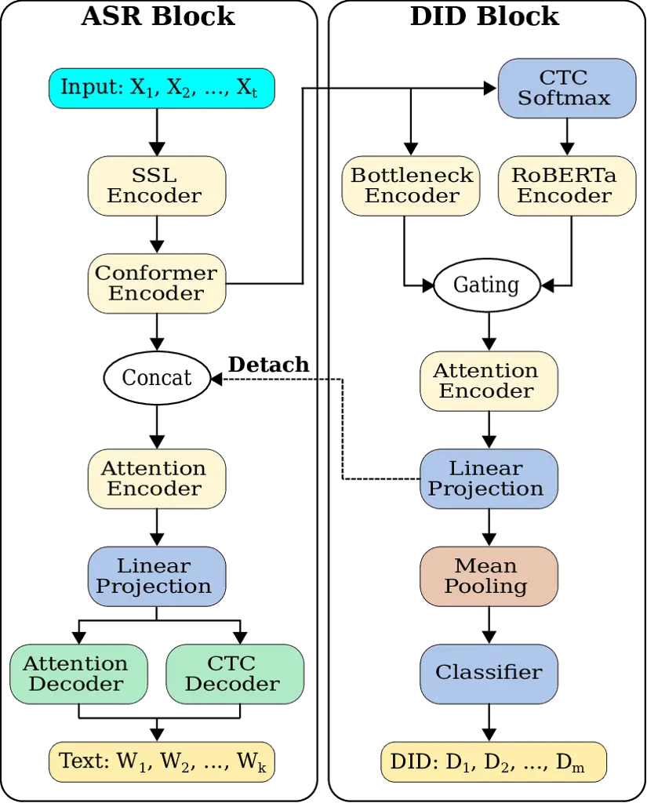
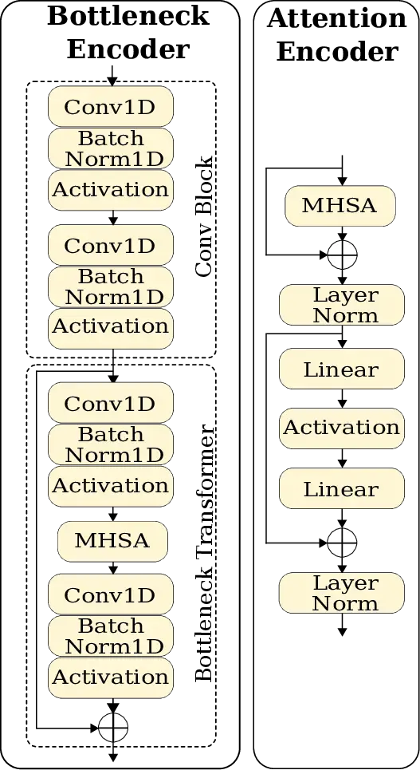
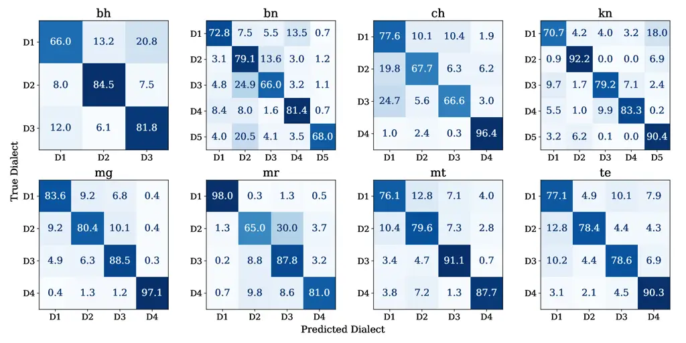
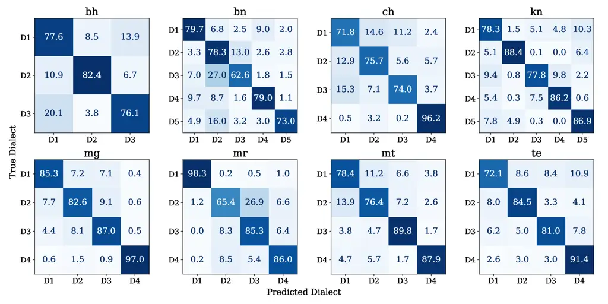

Kumar Ghosh nocounter\]Department of Electrical EngineeringIndian
Institute of Science, BangaloreIndia

# Jointly Improving Dialect Identification and ASR in Indian Languages using Multimodal Feature Fusion

Saurabh    Amartyaveer    Prasanta Kumar Affiliation: \[

###### Abstract

Automatic Speech Recognition (ASR) and Dialect Identification (DID) are
crucial for Indian languages, many of which are low-resource and exhibit
significant dialectal differences. Existing methods often optimize ASR
or DID individually, resulting in performance trade-offs. In this work,
we propose a multimodal framework that jointly improves ASR and DID. Our
method employs a Bottleneck Encoder to extract dialectal features from
Conformer-based speech representations and a RoBERTa encoder to process
ASR-generated CTC embeddings. A gating mechanism merges these features,
followed by an attention encoder to refine the representations. The
learned embeddings are concatenated with Conformer outputs to enhance
ASR features. Evaluated on eight Indian languages with thirty-three
dialects, our method achieves an average DID accuracy of $`81.63\%`$ and
average CER and WER of $`4.65\%`$ and $`17.73\%`$, respectively. These
results highlight the effectiveness of our method for joint ASR-DID
modeling.

###### keywords

Automatic speech recognition, dialect identification, Indian languages

^(†)^(†)email: saurabhk0317@gmail.com, amartyaveer72@gmail.com,
prasantag@gmail.com

## 1 Introduction

Automatic Speech Recognition (ASR) and Dialect Identification (DID) are
crucial for advancing speech technology, particularly in linguistically
diverse regions like India. ASR systems rely on robust acoustic and
linguistic models to transcribe speech accurately, while DID facilitates
the adaptation of ASR models to different dialectal variations.
Accurately identifying dialects enhances ASR performance by mitigating
errors stemming from pronunciation, vocabulary, and grammatical
variations \[1\]. Despite their interdependence, ASR and DID have
traditionally been studied as separate tasks, leading to suboptimal
performance in dialect-sensitive ASR applications.

DID is inherently more challenging than Language Identification (LID).
While LID involves distinguishing between different languages, DID
requires differentiating between dialects of the same language, which
often share similar phonetic, lexical, and syntactic characteristics
\[2, 3, 4, 5\]. These similarities make DID a significantly more
difficult classification task than LID. Many prior works have explored
joint ASR and LID using multi-task learning to enhance system
performance \[4, 6, 7, 8\], but fewer studies have focused on joint ASR
and DID \[9, 10, 11\]. Research on joint ASR-DID in Indian languages
remains limited \[11\], though recent studies have introduced dialectal
ASR systems for these languages \[12, 13, 14, 15, 16, 1, 11\].

While joint ASR-DID methods \[9, 10, 11\] significantly outperform
traditional DID approaches relying solely on audio or text-based
features \[17, 18, 19, 20, 21, 22, 23, 24\], ASR systems in such setups
often perform suboptimally. In many cases, improvements in DID come at
the cost of degraded ASR performance. For example, \[9\] reported that a
multi-dialect Japanese ASR system improved DID accuracy by treating it
as an auxiliary task. However, the best ASR and DID performances were
achieved in different setups, with the best DID model degrading ASR
performance, particularly in cases of incorrect DID predictions.
Similarly, \[10\] proposed an ASR-based DID system for Irish dialects
using an intermediate CTC loss, which improved DID performance but
caused slight degradation in ASR performance. This trade-off highlights
the necessity for a joint modeling approach that effectively balances
both tasks.

Recently, \[11\] proposed an ASR-based DID approach using multimodal
features from a dialect-aware ASR model jointly trained in a multi-task
setup, achieving state-of-the-art DID accuracies in eight Indian
languages. However, no improvement in ASR performance was reported,
likely due to inherent limitations such as the lack of gradient
propagation from the DID block to the ASR block and the prepending of
text with dialect tokens, which may lead the ASR model to learn false
context when predicted dialect IDs are incorrect.

Motivated by these challenges, we propose a novel framework for joint
ASR-DID in a multi-task setup using multimodal feature fusion ¹¹ 1 Code
and models publicly available at:
[https://github.com/labspire/respin_did_interspeech25.git](https://github.com/labspire/respin_did_interspeech25.git).
Our approach employs a Bottleneck Encoder to capture dialectal
variations in Conformer-based speech representations and a RoBERTa
encoder to extract dialectal cues from CTC embeddings derived from
Conformer output. These complementary representations are fused using a
gating mechanism, followed by an attention encoder to refine dialectal
representations. To further enhance ASR performance, the learned
attention embeddings are concatenated with the Conformer encoder output,
enabling the extraction of richer ASR features through additional
attention layers. Unlike previous methods, our proposed ASR-DID
framework does not prepend training texts with dialect IDs, resulting in
significant ASR performance improvements for utterances with incorrect
dialect predictions.

We evaluate our proposed method on eight Indian languages, comprising
$`33`$ dialects from various regions of India. Experimental results
demonstrate significant improvements in both ASR and DID compared to
existing state-of-the-art methods. The proposed framework effectively
mitigates the trade-off between ASR and DID by leveraging multimodal
attention fusion to achieve robust joint modeling. This work contributes
to the broader goal of developing more accurate and adaptable speech
technologies for Indian languages, particularly in linguistically
diverse settings.

## 2 Proposed Method



((a))



((b))

Figure 1: Illustration of the (a) proposed architecture and (b)
bottleneck encoder (left) and attention encoder (right).

Our proposed method employs multimodal feature fusion to jointly enhance
Automatic Speech Recognition (ASR) and Dialect Identification (DID) for
Indian languages. As shown in Figure 1(a), the architecture consists of
two primary components: the ASR Block and the DID Block, integrating
speech and text-based dialectal cues for effective representation
learning.

### 2.1 ASR Block

The ASR Block processes input speech using a self-supervised learning
(SSL) encoder to extract phonetic and prosodic features, which are then
refined by a Conformer Encoder. This module captures local speech
patterns via convolutional layers and long-range dependencies through
self-attention.

The Conformer output is directed to the DID Block, where multimodal
representations are obtained by fusing features from a Bottleneck
Encoder and a RoBERTa Encoder. The RoBERTa Encoder processes CTC
embeddings, derived by projecting the Conformer output through a linear
layer to the vocabulary size, followed by softmax (depicted by CTC
Softmax block in Figure 1(a)). A gating mechanism combines these
representations, which are further refined by an Attention Encoder and
linearly projected to extract frame-level dialect embeddings.

To integrate multimodal features, dialect embeddings from the DID Block
are concatenated with the Conformer output in the ASR Block. To prevent
gradient interference, these embeddings are detached from the
computational graph before concatenation, ensuring gradients flow only
within the ASR Block.

The final combined representation is processed by an Attention Encoder
and a Linear Projection before being fed into two parallel decoders: (1)
an Attention Decoder for context-aware token predictions and (2) a CTC
Decoder for non-autoregressive transcription. Both decoders contribute
to generating the final ASR output.

### 2.2 DID Block

The DID Block is designed to classify dialects by integrating both
speech and textual features. It takes the Conformer Encoder output as
input and processes it through multiple specialized components.

#### 2.2.1 Bottleneck Encoder

The Bottleneck Encoder extracts and refines speech-based dialectal
features. It consists of a convolutional block for feature extraction,
followed by a bottleneck transformer \[25\] for global representation
learning. As illustrated in Figure 1(b)(left), this architecture is
inspired by \[26\], which employs $`2D`$ convolutional layers on both
sides of multi-head self-attention (MHSA) with adaptive average pooling.
However, to better preserve temporal information, we replace $`2D`$
convolutions with $`1D`$ convolutions and remove the average pooling
layer. This refinement preserves critical temporal dynamics in
ASR-encoded speech representations for dialect classification.

#### 2.2.2 RoBERTa Encoder

Inspired by \[27\], this module extracts contextual dialectal features
from CTC embeddings. These embeddings are first linearly projected into
a lower-dimensional space before being processed by RoBERTa,
complementing speech-based features from the Bottleneck Encoder.

#### 2.2.3 Gating Mechanism

To dynamically balance the contributions of speech and text-based
features, a gating mechanism is employed. Given two feature
representations, an adaptive weight function computes a set of learnable
weights using a linear transformation followed by a sigmoid activation:

```math
\mathbf{G}=\sigma(\mathbf{W}_{\text{g}}[\mathbf{H}_{\text{bottleneck}},\mathbf{H}_{\text{rob}}]+\mathbf{b}_{\text{g}}) \tag{1}
```

where $`\sigma`$ represents the sigmoid activation, and
$`\mathbf{W}_{\text{g}}`$ and $`\mathbf{b}_{\text{g}}`$ are learnable
parameters. The concatenated feature representations are denoted as
$`[\mathbf{H}_{\text{bottleneck}},\mathbf{H}_{\text{rob}}]`$. The final
fused representation is computed as:

```math
\mathbf{H}_{\text{fused}}=\mathbf{G}\odot\mathbf{H}_{\text{rob}}+(1-\mathbf{G})\odot\mathbf{H}_{\text{bottleneck}} \tag{2}
```

where $`\odot`$ denotes element-wise multiplication.

#### 2.2.4 Attention Encoder

The fused representation is further refined through an Attention
Encoder, which enhances contextual dependencies via multi-head
self-attention (MHSA), followed by Layer Normalization. This module
includes up-projection and down-projection layers with activation
functions to refine the feature representations while employing residual
connections for stable learning. The Attention Encoder shares its
architecture with the one used in the ASR Block, as shown in
Figure 1(b)(right). The final output is linearly projected to obtain
frame-level dialect embeddings.

Mean pooling is applied to obtain a fixed-length representation, which
is passed through a classifier with softmax activation for dialect
prediction. By integrating speech and text-based features via adaptive
gating and attention mechanisms, the DID Block effectively captures
linguistic and acoustic nuances for robust dialect identification.

### 2.3 Objective Function

To jointly optimize ASR and DID tasks, we employ a weighted loss
function. The total loss, $`\mathcal{L}`$, is a combination of the CTC
loss ($`\mathcal{L}_{\text{CTC}}`$), attention loss
($`\mathcal{L}_{\text{ATT}}`$), and cross-entropy loss
($`\mathcal{L}_{\text{CE}}`$), formulated as:

```math
\mathcal{L}=\lambda_{\text{CTC}}\mathcal{L}_{\text{CTC}}+(1-\lambda_{\text{CTC}})\mathcal{L}_{\text{ATT}}+\gamma_{\text{CE}}\mathcal{L}_{\text{CE}}, \tag{3}
```

where $`\lambda_{\text{CTC}}`$ manages the balance between CTC and
attention-based ASR losses, and $`\gamma_{\text{CE}}`$ adjusts the
influence of the cross-entropy loss for DID.

Our framework integrates ASR and DID with multimodal speech-text
representations. Gating balances features, and detachment prevents
gradient interference, ensuring stable optimization. This enhances
transcription and dialect classification, making it ideal for India’s
diverse languages.

## 3 Experiments

### 3.1 Datasets

We use a subset of the RESPIN dataset covering eight Indian languages:
Bhojpuri (bh), Bengali (bn), Chhattisgarhi (ch), Kannada (kn), Magahi
(mg), Maithili (mt), Marathi (mr), and Telugu (te). The train-test
splits follow \[11\]²² 2 The RESPIN dataset is publicly available at:
[https://spiredatasets.ee.iisc.ac.in/respincorpus](https://spiredatasets.ee.iisc.ac.in/respincorpus),
with approximately $`140-175`$ hours of training data, $`2`$ hours of
development data, and $`6-8`$ hours of test data per language, all in a
read-speech setting.

### 3.2 Experimental Setup

Our experiments, conducted in ESPnet³³ 3 ESPnet:
[https://github.com/espnet/espnet.git](https://github.com/espnet/espnet.git),
compare the proposed approach with state-of-the-art ASR-DID frameworks.
The hybrid CTC/Attention ASR model comprises an $`8`$-block Conformer
encoder ($`256`$-dim output, $`4`$ heads, $`1024`$-dim feedforward) and
a $`6`$-block Transformer decoder ($`4`$ heads, $`2048`$-dim
feedforward), both with a $`0.1`$ dropout. A CTC weight of $`0.3`$,
cross-entropy scaling of $`5`$, and label smoothing of $`0.1`$ are
applied. Adam optimization is used with a $`0.002`$ learning rate,
$`1\times 10^{-6}`$ weight decay, and a $`1.5\times 10^{4}`$-step
warmup. The batch size dynamically adjusts to $`6M`$ batch bins, with
early stopping patience of $`5`$. The top $`5`$ models are selected
based on validation accuracy. The frontend employs a pre-trained
IndicWav2Vec model \[28\]⁴⁴ 4 IndicWav2Vec:
[https://github.com/AI4Bharat/IndicWav2Vec](https://github.com/AI4Bharat/IndicWav2Vec),
extracting features from layers $`7-11`$ and projecting them to $`80`$
dimensions. Data augmentation includes $`3`$-way speed perturbation and
SpecAugment (time warping, frequency masking up to $`27`$ bins, and time
masking for $`5\%`$ of the sequence). Upstream model parameters remain
frozen. Hyperparameters are empirically tuned based on validation
performance.

### 3.3 Evaluated Methods

We evaluated the following configurations:

- •
  Base-ASR: Standard ASR without DID as an auxiliary task.
- •
  ASR-DID: Base-ASR with dialect IDs prepended to text.
- •
  ASR-DID-SC: ASR-DID with CTC-based self-conditioning ($`2nd`$
  Conformer layer) \[7\].
- •
  ASR-DID-AUX: ASR-DID with auxiliary CTC for the DID task ($`2nd`$
  Conformer layer) \[10\].
- •
  ASR-DID-ROB: Similar to the ASR-based DID reported in \[11\], with the
  ASR configuration identical to Base-ASR.
- •
  ASR-BN: A joint ASR-DID that includes a DID block with a Bottleneck
  Encoder (see Figure 1(b)) followed by mean pooling and a linear
  classifier for dialect prediction (bottleneck dimension: $`32`$, $`4`$
  attention heads, $`0.1`$ dropout).
- •
  ASR-ROB: Joint ASR-DID using a RoBERTa encoder in the DID block; CTC
  embeddings derived from the Conformer output are projected through a
  linear layer before being fed into RoBERTa (hidden: $`64`$-dim,
  layers: $`2`$, heads: $`4`$).
- •
  ASR-BN-ROB (Proposed): Our proposed method, illustrated in
  Figure 1(a), integrates an Attention Encoder with a hidden size of
  $`256`$-dim, $`4`$ attention heads, and a $`64`$-dim output for DID.
  The ASR block’s attention module has a hidden size of $`1024`$-dim,
  $`4`$ attention heads, and produces a $`256`$-dim output. Both blocks
  utilize two consecutive attention encoder layers to refine
  representations.

Overview of Trainable Parameters:

- •
  Base-ASR, ASR-DID, SC, AUX: $`25.32M`$ each.
- •
  ASR-DID-ROB (baseline): $`29.63M`$
- •
  ASR-BN: $`25.45M`$
- •
  ASR-ROB: $`28.91M`$
- •
  ASR-BN-ROB (Proposed): $`31.37M`$

Dialect ID Requirement: Only ASR-DID, SC, AUX, and ROB require dialect
IDs to be prepended to the training text. The proposed ASR-BN-ROB and
its variants (ASR-BN, ASR-ROB) do not.

## 4 Results and Discussion



((a))



((b))

Figure 2: Comparison of confusion matrices for (a) the baseline method
(ASR-DID-ROB) and (b) the proposed method (ASR-BN-ROB).

| DID Systems | bh    | bn    | ch    | kn    | mg    | mr    | mt    | te    | avg   |
| ----------- | ----- | ----- | ----- | ----- | ----- | ----- | ----- | ----- | ----- |
| ASR-DID     | 74.91 | 72.43 | 77.81 | 80.08 | 86.26 | 82.07 | 82.35 | 77.58 | 79.19 |
| ASR-DID-SC  | 75.54 | 72.64 | 76.60 | 80.96 | 86.19 | 82.72 | 81.94 | 78.89 | 79.44 |
| ASR-DID-AUX | 75.72 | 73.10 | 76.38 | 81.80 | 86.88 | 81.64 | 82.77 | 80.28 | 79.82 |
| ASR-DID-ROB | 77.43 | 73.38 | 77.00 | 83.18 | 87.31 | 82.90 | 83.67 | 81.06 | 80.74 |
| ASR-ROB     | 77.32 | 74.28 | 76.33 | 83.11 | 87.77 | 83.18 | 83.62 | 79.22 | 80.60 |
| ASR-BN      | 77.39 | 73.19 | 78.88 | 82.56 | 87.59 | 81.82 | 84.22 | 80.82 | 80.81 |
| ASR-BN-ROB  | 78.74 | 74.46 | 79.38 | 83.55 | 87.88 | 83.66 | 83.11 | 82.23 | 81.63 |

Table 1: Language-wise DID accuracy.

|             |      |      |      |      |      |      |      |      |      |       |       |       |       |       |       |       |       |       |
| ----------- | ---- | ---- | ---- | ---- | ---- | ---- | ---- | ---- | ---- | ----- | ----- | ----- | ----- | ----- | ----- | ----- | ----- | ----- |
| ASR Systems | CER  |      |      |      |      |      |      |      |      | WER   |       |       |       |       |       |       |       |       |
|             | bh   | bn   | ch   | kn   | mg   | mr   | mt   | te   | avg  | bh    | bn    | ch    | kn    | mg    | mr    | mt    | te    | avg   |
| Base-ASR    | 4.89 | 4.62 | 3.86 | 4.79 | 6.82 | 3.34 | 5.83 | 4.35 | 4.81 | 15.90 | 16.79 | 11.44 | 25.09 | 21.14 | 14.71 | 18.44 | 23.56 | 18.38 |
| ASR-DID     | 4.77 | 4.61 | 3.83 | 4.70 | 6.73 | 3.35 | 5.61 | 4.24 | 4.73 | 15.58 | 16.49 | 11.23 | 24.74 | 21.13 | 15.07 | 17.83 | 23.31 | 18.17 |
| ASR-DID-SC  | 4.85 | 4.71 | 3.77 | 4.78 | 6.79 | 3.38 | 5.83 | 4.30 | 4.80 | 15.81 | 16.91 | 11.09 | 24.90 | 20.97 | 15.14 | 18.23 | 23.50 | 18.32 |
| ASR-DID-AUX | 4.91 | 4.58 | 3.80 | 4.76 | 6.71 | 3.32 | 5.59 | 4.15 | 4.73 | 15.84 | 16.62 | 11.14 | 24.49 | 20.82 | 14.75 | 17.48 | 23.16 | 18.04 |
| ASR-DID-ROB | 4.86 | 4.61 | 3.91 | 4.77 | 6.72 | 3.31 | 5.64 | 4.23 | 4.76 | 15.62 | 16.66 | 11.36 | 24.97 | 20.67 | 14.76 | 17.75 | 23.46 | 18.16 |
| ASR-ROB     | 4.81 | 4.55 | 3.94 | 4.73 | 6.68 | 3.28 | 5.70 | 4.25 | 4.74 | 15.40 | 16.39 | 11.35 | 24.68 | 20.62 | 14.80 | 17.88 | 23.02 | 18.02 |
| ASR-BN      | 4.76 | 4.45 | 3.87 | 4.78 | 6.80 | 3.26 | 5.63 | 4.21 | 4.72 | 15.34 | 16.26 | 11.35 | 24.73 | 20.87 | 14.66 | 17.72 | 23.26 | 18.02 |
| ASR-BN-ROB  | 4.72 | 4.52 | 3.72 | 4.68 | 6.63 | 3.21 | 5.58 | 4.15 | 4.65 | 15.35 | 16.20 | 10.93 | 24.43 | 20.37 | 14.42 | 17.53 | 22.61 | 17.73 |

Table 2: Language-wise ASR performance.

In this section, we analyze the performance of existing methods and our
proposed multimodal feature fusion approach for joint DID and ASR in
Indian languages. The evaluation considers DID accuracy, ASR Character
Error Rate (CER), and Word Error Rate (WER). We also examine the impact
of dialect-informed ASR and the effectiveness of our model. Given the
prevalence of compound words in Indian languages, we exclude spaces when
computing CERs.

### 4.1 Dialect Identification Performance

Table 1 presents language-wise DID accuracy for different systems. The
dashed line distinguishes ASR-DID methods that prepend dialect IDs from
those that learn DID separately alongside ASR. ASR-DID-ROB serves as the
baseline, outperforming other existing ASR-DID approaches.

The ASR-ROB and ASR-BN models, which leverage text and audio-based
dialectal features respectively, achieve similar performances with
accuracies of $`80.60\%`$ and $`80.81\%`$ relative to the baseline. On
the other hand, our proposed ASR-BN-ROB model, which fuses both
modalities, reaches the highest accuracy of $`81.63\%`$. This model
shows significant improvements in Bhojpuri (bh: $`78.74\%`$ with an
increase of $`1.43\%`$), Bengali (bn: $`74.46\%`$ with an increase of
$`1.08\%`$), Chhattisgarhi (ch: $`79.38\%`$ with an increase of
$`2.38\%`$), and Telugu (te: $`82.23\%`$ with an increase of
$`1.17\%`$). These results underscore the advantages of multimodal
fusion for DID.

To further validate our approach, we compare the confusion matrices of
the baseline and proposed methods in Figure 2. Our model not only
improves overall DID accuracy but also enhances generalization across
dialects. A key indicator is the reduction in the standard deviation of
dialect-wise accuracies, averaging a $`16.08\%`$ decrease across all
eight languages. This reduction demonstrates the robustness and
consistency of our model in handling dialectal variations more
effectively than the baseline.

### 4.2 ASR performance

Table 2 reports the language-wise CER and WER across different systems.
The first dashed line separates the Base-ASR method from ASR-DID
methods, while the second dashed line distinguishes ASR-DID methods that
prepend dialect IDs as the first token from our proposed ASR-DID
methods, which do not rely on dialect IDs as the first token. All
existing ASR-DID methods achieve slightly better ASR performance
compared to Base-ASR, indicating that prepending dialect IDs with the
text benefits ASR.

Our ASR-BN-ROB method significantly enhances ASR performance in multiple
languages by effectively integrating multimodal dialectal features with
the ASR encoder output. It achieves an average CER of $`4.65\%`$ and WER
of $`17.73\%`$ across $`8`$ languages, surpassing current methods.

### 4.3 Impact of Correct vs. Incorrect DID on ASR

| ASR Systems             | CER       |         | WER       |         |
| ----------------------- | --------- | ------- | --------- | ------- |
|                         | Incorrect | Correct | Incorrect | Correct |
| Base-ASR                | 5.67      | 4.66    | 20.74     | 17.93   |
| ASR-DID-ROB (baseline)  | 6.01      | 4.51    | 21.85     | 17.43   |
| ASR-BN-ROB (proposed)   | 5.68      | 4.46    | 20.72     | 17.14   |
| Relative difference (%) | 5.52      | 1.24    | 5.17      | 1.62    |

Table 3: Overall ASR performance on incorrect and correct DID prediction
utterances using the ASR-DID-ROB method.

To further analyze ASR performance differences between Base-ASR,
ASR-DID-ROB, and ASR-BN-ROB, we compare utterances with correct and
incorrect DID predictions in the baseline. Table 3 presents the CER and
WER for these cases.

In the baseline method ASR-DID-ROB, dialect IDs are added to the
beginning of the text, resulting in significantly worse ASR performance
when DID predictions are wrong. For dialects misclassified, the
Character Error Rate (CER) is $`6.01\%`$ and the Word Error Rate (WER)
is $`21.85\%`$, both noticeably higher than the CER of $`4.51\%`$ and
WER of $`17.43\%`$ for correctly classified dialects. This implies that
incorrect DID predictions negatively impact ASR performance. By
contrast, the proposed ASR-BN-ROB model addresses this issue by
achieving a relative reduction of $`5.52\%`$ in CER and $`5.17\%`$ in
WER compared to ASR-DID-ROB when dealing with incorrect DID predictions.
These findings underscore the importance of accurate dialect recognition
for enhancing ASR performance.

### 4.4 Discussion

The results highlight the limitations of ASR-DID-ROB as a baseline.
While it improves DID accuracy over other ASR-based DID methods, its ASR
performance declines, especially for incorrect DID predictions. In
contrast, the proposed ASR-BN-ROB model enhances both DID and ASR
performance by leveraging bottleneck and RoBERTa encoders with
attention-based fusion for better integration of acoustic and linguistic
features. A paired T-test at a $`95\%`$ confidence interval confirms
statistically significant differences in DID accuracy ($`t=2.9609`$,
$`p=0.0211`$), CER ($`t=-7.2334`$, $`p=0.0002`$), and WER
($`t=-5.9856`$, $`p=0.0006`$) across eight languages. These findings
demonstrate the effectiveness of multimodal feature fusion for joint DID
and ASR in Indian languages.

## 5 Conclusion

We propose a novel multimodal feature fusion approach for joint dialect
identification and automatic speech recognition in Indian languages. By
integrating a bottleneck encoder on Conformer outputs and a RoBERTa
encoder on CTC embeddings, our method improves both DID accuracy and ASR
performance. Experimental results demonstrate that our ASR-BN-ROB model
surpasses existing ASR-DID approaches, achieving $`81.63\%`$ DID
accuracy, $`4.65\%`$ CER, and $`17.73\%`$ WER. Additionally, we analyze
the impact of incorrect DID predictions on ASR and show that our model
effectively mitigates this degradation. Future work will explore the
impact of multimodal fusion on multilingual, multi-dialect ASR in
linguistically diverse scenarios, aiming to enhance adaptability across
a broader range of dialectal variations.

## 6 Acknowledgment

This work was supported by the RESPIN project, funded by the Bill &
Melinda Gates Foundation. We thank the RESPIN team and our project
partner, Navana Tech, for their contributions to data collection.

## References

- \[1\] S. Udupa, J. Bandekar, G. Deekshitha, S. Kumar, P. K. Ghosh, S.
  Badiger, A. Singh, S. Murthy, P. Pai, S. Raghavan, and R.
  Nanavati (2023) Gated Multi Encoders and Multitask Objectives for
  Dialectal Speech Recognition in Indian Languages. In Proc. of IEEE
  Automatic Speech Recognition and Understanding Workshop (ASRU), Vol. ,
  pp. 1–8. External Links:
  [Document](https://dx.doi.org/10.1109/ASRU57964.2023.10389624) Cited
  by: §1, §1.
- \[2\] G. Singh, S. Sharma, V. Kumar, M. Kaur, M. Baz, and M.
  Masud (2021) Spoken language identification using deep learning.
  Computational Intelligence and Neuroscience 2021 (1), pp. 5123671.
  Cited by: §1.
- \[3\] G. Montavon (2009) Deep learning for spoken language
  identification. In NIPS Workshop on deep learning for speech
  recognition and related applications, pp. 1–4. Cited by: §1.
- \[4\] S. Punjabi, H. Arsikere, Z. Raeesy, C. Chandak, N. Bhave, A.
  Bansal, M. Müller, S. Murillo, A. Rastrow, A. Stolcke, et al. (2021)
  Joint ASR and language identification using RNN-T: An efficient
  approach to dynamic language switching. In Proc. ICASSP,
  pp. 7218–7222. Cited by: §1.
- \[5\] A. Lyu, Z. Wang, and H. Zhu (2022) Ant Multilingual Recognition
  System for OLR 2021 Challenge. In Proc. Interspeech, pp. 3684–3688.
  External Links:
  [Document](https://dx.doi.org/10.21437/Interspeech.2022-355), ISSN
  2958-1796 Cited by: §1.
- \[6\] C. Zhang, B. Li, T. Sainath, T. Strohman, S. Mavandadi, S.
  Chang, and P. Haghani (2022) Streaming End-to-End Multilingual Speech
  Recognition with Joint Language Identification. In Proc. Interspeech,
  pp. 3223–3227. External Links:
  [Document](https://dx.doi.org/10.21437/Interspeech.2022-11249), ISSN
  2958-1796 Cited by: §1.
- \[7\] W. Chen, B. Yan, J. Shi, Y. Peng, S. Maiti, and S.
  Watanabe (2023) Improving Massively Multilingual ASR with Auxiliary
  CTC Objectives. In Proc. ICASSP, Vol. , pp. 1–5. External Links:
  [Document](https://dx.doi.org/10.1109/ICASSP49357.2023.10095326) Cited
  by: §1, 3rd item.
- \[8\] L. Zhou, J. Li, E. Sun, and S. Liu (2022) A Configurable
  Multilingual Model is All You Need to Recognize All Languages. In
  Proc. ICASSP, Vol. , pp. 6422–6426. External Links:
  [Document](https://dx.doi.org/10.1109/ICASSP43922.2022.9747905) Cited
  by: §1.
- \[9\] R. Imaizumi, R. Masumura, S. Shiota, and H. Kiya (2022)
  End-to-end Japanese Multi-dialect Speech Recognition and Dialect
  Identification with Multi-task Learning. APSIPA Transactions on Signal
  and Information Processing 11 (1), pp. –. External Links:
  [Link](http://dx.doi.org/10.1561/116.00000045),
  [Document](https://dx.doi.org/10.1561/116.00000045), ISSN Cited by:
  §1, §1.
- \[10\] L. Lonergan, M. Qian, N. N. Chiaráin, C. Gobl, and A. N.
  Chasaide (2024) Low-resource speech recognition and dialect
  identification of Irish in a multi-task framework. In The Speaker and
  Language Recognition Workshop (Odyssey), pp. 67–73. External Links:
  [Document](https://dx.doi.org/10.21437/odyssey.2024-10) Cited by: §1,
  §1, 4th item.
- \[11\] Amartyaveer, S. Kumar, S. Sharma, S. Udupa, S. Badiger, A.
  Singh, D. G, J. Bandekar, S. Murthy, and P. Kumar Ghosh (2025)
  Improving Dialect Identification in Indian Languages Using Multimodal
  Features from Dialect Informed ASR. In Proc. ICASSP, Vol. , pp. 1–5.
  External Links:
  [Document](https://dx.doi.org/10.1109/ICASSP49660.2025.10889099) Cited
  by: §1, §1, §1, 5th item, §3.1.
- \[12\] V. Bhardwaj, V. Kukreja, N. Kaur, and N. Modi (2021) Building
  an ASR System for Indian (Punjabi) language and its evaluation for
  Malwa and Majha dialect: Preliminary Results. In Proc. of
  International Conference on Computing Communication and Networking
  Technologies (ICCCNT), Vol. , pp. 1–5. External Links:
  [Document](https://dx.doi.org/10.1109/ICCCNT51525.2021.9579471) Cited
  by: §1.
- \[13\] M. C. S. Priya, D. K. Renuka, L. A. Kumar, and S. L.
  Rose (2022) Multilingual low resource Indian language speech
  recognition and spell correction using Indic BERT. Sādhanā 47 (227).
  External Links:
  [Document](https://dx.doi.org/10.1007/s12046-022-01973-5) Cited by:
  §1.
- \[14\] A. Arunkumar, M. D. Batra, and S. Umesh (2022) DuDe:
  Dual-Decoder Multilingual ASR for Indian Languages using Common Label
  Set. ArXiv abs/2210.16739. External Links:
  [Link](https://api.semanticscholar.org/CorpusID:253237346) Cited by:
  §1.
- \[15\] A. Singh, V. Kadyan, M. Kumar, and N. Bassan (2020) ASRoIL: a
  comprehensive survey for automatic speech recognition of Indian
  languages. Artif. Intell. Rev. 53 (5), pp. 3673–3704. External Links:
  ISSN 0269-2821, [Link](https://doi.org/10.1007/s10462-019-09775-8),
  [Document](https://dx.doi.org/10.1007/s10462-019-09775-8) Cited by:
  §1.
- \[16\] A. Diwan, R. Vaideeswaran, S. Shah, A. Singh, S. Raghavan, S.
  Khare, V. Unni, S. Vyas, A. Rajpuria, C. Yarra, A. Mittal, P. K.
  Ghosh, P. Jyothi, K. Bali, V. Seshadri, S. Sitaram, S. Bharadwaj, J.
  Nanavati, R. Nanavati, and K. Sankaranarayanan (2021) MUCS 2021:
  Multilingual and Code-Switching ASR Challenges for Low Resource Indian
  Languages. In Proc. Interspeech, pp. 2446–2450. External Links:
  [Document](https://dx.doi.org/10.21437/Interspeech.2021-1339), ISSN
  2958-1796 Cited by: §1.
- \[17\] Q. Luo and R. Zhou (2023) Exploring the Impact of Back-End
  Network on Wav2vec 2.0 for Dialect Identification. In Proc.
  Interspeech, pp. 5356–5360. External Links:
  [Document](https://dx.doi.org/10.21437/Interspeech.2023-1761), ISSN
  2958-1796 Cited by: §1.
- \[18\] Peter Sullivan and AbdelRahim Elmadany and Muhammad
  Abdul-Mageed (2023) On the Robustness of Arabic Speech Dialect
  Identification. In Proc. Interspeech, pp. 5326–5330. External Links:
  [Document](https://dx.doi.org/10.21437/Interspeech.2023-1005), ISSN
  2958-1796 Cited by: §1.
- \[19\] S. Kakouros and K. Hiovain-Asikainen (2023) North Sámi Dialect
  Identification with Self-supervised Speech Models. In Proc.
  Interspeech, pp. 5306–5310. External Links:
  [Document](https://dx.doi.org/10.21437/Interspeech.2023-1928), ISSN
  2958-1796 Cited by: §1.
- \[20\] Shaik, Mohammed Maqsood and Klakow, Dietrich and Abdullah,
  Badr M. (2024) Self-Supervised Adaptive Pre-Training of Multilingual
  Speech Models for Language and Dialect Identification. In Proc.
  ICASSP, Vol. , pp. 11436–11440. External Links:
  [Document](https://dx.doi.org/10.1109/ICASSP48485.2024.10446053) Cited
  by: §1.
- \[21\] Srijith Radhakrishnan and Chao-Han Huck Yang and Sumeer Ahmad
  Khan and Narsis A. Kiani and David Gomez-Cabrero and Jesper N.
  Tegner (2023) A Parameter-Efficient Learning Approach to Arabic
  Dialect Identification with Pre-Trained General-Purpose Speech Model.
  In Proc. Interspeech, pp. 1958–1962. External Links:
  [Document](https://dx.doi.org/10.21437/Interspeech.2023-1407), ISSN
  2958-1796 Cited by: §1.
- \[22\] P. Mishra and V. Mujadia (2019) Arabic Dialect Identification
  for Travel and Twitter Text. In Proc. of the Fourth Arabic Natural
  Language Processing Workshop, Florence, Italy, pp. 234–238. External
  Links: [Link](https://aclanthology.org/W19-4628),
  [Document](https://dx.doi.org/10.18653/v1/W19-4628) Cited by: §1.
- \[23\] M. J. Althobaiti (2020) Automatic Arabic Dialect Identification
  Systems for Written Texts: A Survey. CoRR abs/2009.12622. External
  Links: [Link](https://arxiv.org/abs/2009.12622), 2009.12622 Cited by:
  §1.
- \[24\] K. Goswami, R. Sarkar, B. R. Chakravarthi, T. Fransen,
  and J. P. McCrae (2020) Unsupervised deep language and dialect
  identification for short texts. In Proceedings of the 28th
  International Conference on Computational Linguistics, pp. 1606–1617.
  Cited by: §1.
- \[25\] A. Srinivas, T. Lin, N. Parmar, J. Shlens, P. Abbeel, and A.
  Vaswani (2021) Bottleneck Transformers for Visual Recognition. In
  Proc. of IEEE/CVF Conference on Computer Vision and Pattern
  Recognition (CVPR), Vol. , pp. 16514–16524. External Links:
  [Document](https://dx.doi.org/10.1109/CVPR46437.2021.01625) Cited by:
  §2.2.1.
- \[26\] Z. Alhakeem, S. Jang, and H. Kang (2024) Disentangled
  Representations in Local-Global Contexts for Arabic Dialect
  Identification. IEEE/ACM Transactions on Audio, Speech, and Language
  Processing 32 (), pp. 879–890. External Links:
  [Document](https://dx.doi.org/10.1109/TASLP.2023.3341006) Cited by:
  §2.2.1.
- \[27\] Y. Liu, M. Ott, N. Goyal, J. Du, M. Joshi, D. Chen, O. Levy, M.
  Lewis, L. Zettlemoyer, and V. Stoyanov (2019) RoBERTa: A Robustly
  Optimized BERT Pretraining Approach. ArXiv abs/1907.11692. External
  Links: [Link](https://api.semanticscholar.org/CorpusID:198953378)
  Cited by: §2.2.2.
- \[28\] T. Javed, S. Doddapaneni, A. Raman, K. S. Bhogale, G.
  Ramesh, A. Kunchukuttan, P. Kumar, and M. M. Khapra (2021) Towards
  Building ASR Systems for the Next Billion Users. CoRR abs/2111.03945.
  External Links: [Link](https://arxiv.org/abs/2111.03945), 2111.03945
  Cited by: §3.2.
